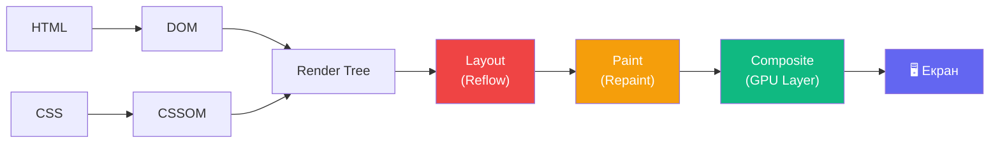

# Rendering Pipeline і CSS Performance

## Між кодом і пікселями

Ви написали CSS. Браузер read DOM та CSSOM. Але між вашим кодом і тим, що бачить користувач на екрані, — складний конвеєр із десятків кроків. Розуміння цього конвеєру — це різниця між інтерфейсом на 60fps і тим, що «чомусь підгальмовує».

Chrome Timeline, Firefox Performance Panel, Safari Web Inspector — все це інструменти для аналізу **rendering pipeline**. Але щоб читати їх результати, потрібно розуміти, що відбувається всередині.

::mermaid



::

---

## Critical Rendering Path

**Critical Rendering Path** — це послідовність кроків від HTML-файлу до першого відмальованого кадру:

1. **Parse HTML** → DOM (Document Object Model)
2. **Parse CSS** → CSSOM (CSS Object Model)
3. **Merge** DOM + CSSOM → **Render Tree** (лише видимі елементи)
4. **Layout** (Reflow) — обчислення точних позицій та розмірів
5. **Paint** (Repaint) — малювання пікселів для кожного шару
6. **Composite** — об'єднання шарів і відправка на GPU

Ключова ідея: CSS блокує **rendering** — браузер чекає завантаження та парсингу CSS перед тим як малювати щось. Тому `<link rel="stylesheet">` у `<head>` і `<script defer>` — стандартні практики crítikal path.

---

## Три типи rendering операцій

### Layout (Reflow) — найдорожча операція

**Layout** — браузер перераховує геометрію: де знаходяться всі елементи, які їхні розміри, як вони впливають на розміри сусідів. Це дорога операція, особливо якщо вона зачіпає кореневий елемент.

**CSS-властивості, що завжди спричиняють Layout (не використовуйте в анімаціях):**

```css
/* ❌ Ці властивості trigger layout при кожній анімації */
.bad-animation {
  transition: width 0.3s;      /* reflow! */
  transition: height 0.3s;     /* reflow! */
  transition: top 0.3s;        /* reflow! */
  transition: left 0.3s;       /* reflow! */
  transition: margin 0.3s;     /* reflow! */
  transition: padding 0.3s;    /* reflow! */
  transition: font-size 0.3s;  /* reflow! */
}
```

::html-preview
```html
<div class="perf-demo">
  <p class="pd-title">Порівняння: Layout vs Composite анімація (відкрийте DevTools → Performance)</p>
  <div class="perf-boxes">
    <div class="perf-group">
      <p class="perf-label">❌ Layout animation<br><small>left/top — spричиняє reflow</small></p>
      <div class="anim-wrapper">
        <div class="bad-box">reflow</div>
      </div>
    </div>
    <div class="perf-group">
      <p class="perf-label">✅ Composite animation<br><small>transform — тільки GPU layer</small></p>
      <div class="anim-wrapper">
        <div class="good-box">GPU ✅</div>
      </div>
    </div>
  </div>
  <div class="perf-legend">
    <div class="pl-item pl-layout">Layout (reflow) — перерахунок геометрії всіх елементів</div>
    <div class="pl-item pl-paint">Paint (repaint) — малювання пікселів</div>
    <div class="pl-item pl-composite">Composite — GPU, лише переміщення шару</div>
  </div>
</div>
```
```css
.perf-demo {
  padding: 1rem;
  background: #f8fafc;
  font-family: system-ui, sans-serif;
  font-size: 0.85rem;
  color: #1e293b;
  display: flex;
  flex-direction: column;
  gap: 0.75rem;
}
.pd-title { margin: 0; font-weight: 700; color: #64748b; }
.perf-boxes { display: flex; gap: 0.75rem; flex-wrap: wrap; }
.perf-group { flex: 1; min-width: 140px; }
.perf-label { margin: 0 0 0.5rem; font-size: 0.8rem; font-weight: 600; }
.perf-label small { display: block; font-weight: 400; color: #94a3b8; }
.anim-wrapper {
  height: 60px;
  background: white;
  border: 1px solid #e2e8f0;
  border-radius: 8px;
  position: relative;
  overflow: hidden;
}

/* ❌ Погана анімація — через left (spричиняє layout) */
.bad-box {
  position: absolute;
  top: 50%;
  left: 0;
  transform: translateY(-50%);
  width: 60px;
  height: 36px;
  background: #ef4444;
  border-radius: 6px;
  display: flex;
  align-items: center;
  justify-content: center;
  color: white;
  font-size: 0.72rem;
  font-weight: 700;
  animation: bad-move 2s ease-in-out infinite alternate;
}
@keyframes bad-move {
  to { left: calc(100% - 60px); }
}

/* ✅ Хороша анімація — через transform (тільки composite) */
.good-box {
  position: absolute;
  top: 50%;
  left: 0;
  transform: translateY(-50%) translateX(0);
  width: 60px;
  height: 36px;
  background: #10b981;
  border-radius: 6px;
  display: flex;
  align-items: center;
  justify-content: center;
  color: white;
  font-size: 0.72rem;
  font-weight: 700;
  animation: good-move 2s ease-in-out infinite alternate;
}
@keyframes good-move {
  to { transform: translateY(-50%) translateX(calc(200% + 80px)); }
}

.perf-legend { display: flex; flex-direction: column; gap: 4px; }
.pl-item {
  padding: 0.4rem 0.75rem;
  border-radius: 6px;
  font-size: 0.75rem;
  border-left: 4px solid;
}
.pl-layout   { background: #fee2e2; border-color: #ef4444; color: #7f1d1d; }
.pl-paint    { background: #fef3c7; border-color: #f59e0b; color: #78350f; }
.pl-composite{ background: #dcfce7; border-color: #10b981; color: #14532d; }
```
::

### Paint (Repaint) — дорожче ніж Composite

**Paint** відбувається коли змінюються візуальні властивості, що не впливають на геометрію:

```css
/* ⚠️ Ці властивості спричиняють paint (але НЕ layout) */
.medium-cost {
  transition: background-color 0.3s; /* repaint */
  transition: color 0.3s;            /* repaint */
  transition: box-shadow 0.3s;       /* repaint */
  transition: border-color 0.3s;     /* repaint */
  transition: border-radius 0.3s;    /* repaint (в деяких браузерах) */
}
```

### Composite — тільки GPU

**Composite** — найдешевша операція. Браузер лише переміщує або трансформує вже намальований шар, не перераховуючи геометрію і не перемальовуючи:

```css
/* ✅ Тільки composite — анімуйте лише це! */
.cheap-animation {
  /* transform + opacity — БЕЗКОШТОВНО у compositor thread */
  transform: translateX(100px);   /* composite */
  transform: translateY(-50%);    /* composite */
  transform: scale(1.1);          /* composite */
  transform: rotate(45deg);       /* composite */
  opacity: 0.5;                   /* composite */
  filter: blur(4px);              /* composite (у більшості браузерів) */
}
```

---

## GPU шари та `will-change`

### Як створити GPU шар

Браузер автоматично переносить деякі елементи на окремий **GPU шар** (composite layer):
- Елементи з `position: fixed`/`sticky`
- `<video>`, `<canvas>`, `<iframe>`
- Елементи з CSS animations/transitions на `transform`/`opacity`
- Елементи з `will-change`

::html-preview
```html
<div class="gpu-demo">
  <p class="gd-title">GPU Layers: елементи на власному compositor layer</p>
  <div class="gpu-grid">
    <div class="gpu-card gc-default">
      <strong>Звичайний div</strong>
      <p>Малюється разом з батьком. Hover спричиняє repaint батьківського шару.</p>
    </div>
    <div class="gpu-card gc-layer">
      <strong>GPU шар</strong>
      <p>transform: translateZ(0) виводить на окремий шар. Hover — тільки composite.</p>
    </div>
    <div class="gpu-card gc-will-change">
      <strong>will-change: transform</strong>
      <p>Браузер наперед виділяє шар. Найбільші картки завантаження — до анімації.</p>
    </div>
  </div>
  <p class="gd-note">💡 Перевірте у Chrome DevTools → Rendering → Layer borders (показує GPU шари синьою рамкою)</p>
</div>
```
```css
.gpu-demo {
  padding: 1rem;
  background: #f8fafc;
  font-family: system-ui, sans-serif;
  font-size: 0.85rem;
  color: #1e293b;
  display: flex;
  flex-direction: column;
  gap: 0.75rem;
}
.gd-title { margin: 0; font-weight: 700; color: #64748b; }
.gd-note  { margin: 0; font-size: 0.75rem; color: #6366f1; font-style: italic; }
.gpu-grid { display: flex; gap: 0.5rem; flex-wrap: wrap; }
.gpu-card {
  flex: 1; min-width: 120px;
  background: white;
  border: 1.5px solid #e2e8f0;
  border-radius: 10px;
  padding: 0.75rem;
  transition: box-shadow 0.2s;
  cursor: pointer;
}
.gpu-card strong { display: block; margin-bottom: 0.3rem; font-size: 0.85rem; }
.gpu-card p { margin: 0; font-size: 0.75rem; color: #64748b; line-height: 1.4; }

/* Звичайний hover — spричиняє repaint */
.gc-default:hover {
  background: #f1f5f9;
  box-shadow: 0 4px 12px rgba(0,0,0,0.08);
}

/* GPU шар через translateZ(0) */
.gc-layer {
  transform: translateZ(0); /* promoteForCompositing шар */
  border-color: #6366f1;
}
.gc-layer:hover {
  transform: translateZ(0) translateY(-2px);
  box-shadow: 0 8px 20px rgba(99,102,241,0.15);
}

/* will-change — браузер наперед готує шар */
.gc-will-change {
  will-change: transform;
  border-color: #10b981;
}
.gc-will-change:hover {
  transform: translateY(-2px) scale(1.01);
  box-shadow: 0 8px 20px rgba(16,185,129,0.15);
}
```
::

### `will-change` — обережно!

```css
/* ✅ Правильне використання: задаємо при hover, знімаємо після */
.card {
  transition: transform 0.3s;
}

.card:hover {
  will-change: transform;
  transform: translateY(-4px);
}

/* ❌ Неправильно: ніколи не знімається — пожирає GPU пам'ять */
/* Не ставте will-change на ВСІХ елементах "про запас" */
* { will-change: transform; } /* Це ПОГАНО */

/* ✅ Правильно: лише на елементах, що БУДУТЬ анімовані */
.animated-card { will-change: transform, opacity; }
```

::warning
`will-change` — турбонаддув: корисний в точних місцях, але невиправдано великий — вбиває. Кожен `will-change` споживає GPU пам'ять. На мобільних пристроях із 2–4 ГБ RAM це критично.
::

---

## CSS Containment

**CSS Containment** дозволяє розробнику сказати браузеру: «цей елемент незалежний від решти сторінки». Браузер може оптимізувати рендеринг, не перераховуючи решту документа при зміні всередині контейнера.

```css
/* contain: layout — зміни геометрії не впливають на зовнішній layout */
.widget {
  contain: layout;
}

/* contain: paint — вміст не виходить за межі елемента */
.card {
  contain: paint; /* неявний overflow: hidden, ізоляція стеків */
}

/* contain: style — стилі не протікають назовні (обмежені сценарії) */
.isolated {
  contain: style;
}

/* contain: size — розмір не залежить від вмісту */
.fixed-box {
  contain: size;
  width: 200px;
  height: 300px;
}

/* Скорочення */
.optimized { contain: layout paint; }
.strict    { contain: strict; /* = layout paint size style */ }
.content   { contain: content; /* = layout paint style */ }
```

---

## `content-visibility` — ліниве рендеринг

**`content-visibility`** — одна з найефективніших оптимізацій для довгих сторінок. Браузер пропускає rendering елементів поза viewport:

```css
/* Скіпає layout, paint, composite для off-screen елементів */
.article {
  content-visibility: auto;
  contain-intrinsic-size: 0 300px; /* placeholder розмір до рендерингу */
}
```

::html-preview
```html
<div class="cv-demo">
  <p class="cvd-title">content-visibility: auto — браузер пропускає рендеринг off-screen елементів</p>
  <div class="cv-list">
    <div class="cv-item cv-visible">
      <div class="cv-badge">Видимий</div>
      <strong>Елемент 1</strong> — рендериться завжди
    </div>
    <div class="cv-item cv-auto">
      <div class="cv-badge cv-badge--auto">auto</div>
      <strong>Елемент 2</strong> — рендериться при наближенні до viewport
    </div>
    <div class="cv-item cv-auto">
      <div class="cv-badge cv-badge--auto">auto</div>
      <strong>Елемент 3</strong> — прихований поза viewport, браузер заощаджує ресурси
    </div>
    <div class="cv-item cv-auto">
      <div class="cv-badge cv-badge--auto">auto</div>
      <strong>Елемент N</strong> — на великих сторінках (1000+ елементів) — величезний виграш швидкості
    </div>
  </div>
  <div class="cv-metrics">
    <div class="cv-metric">
      <span class="cm-label">Без content-visibility</span>
      <div class="cm-bar cm-slow"><span>~800ms LCP</span></div>
    </div>
    <div class="cv-metric">
      <span class="cm-label">З content-visibility: auto</span>
      <div class="cm-bar cm-fast"><span>~200ms LCP ✅</span></div>
    </div>
  </div>
</div>
```
```css
.cv-demo {
  padding: 1rem;
  background: #f8fafc;
  font-family: system-ui, sans-serif;
  font-size: 0.85rem;
  color: #1e293b;
  display: flex;
  flex-direction: column;
  gap: 0.75rem;
}
.cvd-title { margin: 0; font-weight: 700; color: #64748b; }
.cv-list { display: flex; flex-direction: column; gap: 4px; }
.cv-item {
  display: flex;
  align-items: center;
  gap: 0.75rem;
  background: white;
  border: 1px solid #e2e8f0;
  border-radius: 6px;
  padding: 0.5rem 0.75rem;
  font-size: 0.82rem;
}
.cv-badge {
  padding: 0.15rem 0.5rem;
  border-radius: 100px;
  font-size: 0.68rem;
  font-weight: 700;
  white-space: nowrap;
  background: #6366f1; color: white;
  flex-shrink: 0;
}
.cv-badge--auto { background: #10b981; }

.cv-visible { border-left: 3px solid #6366f1; }
.cv-auto    { border-left: 3px solid #10b981; }

/* Реальне використання */
.cv-auto { content-visibility: auto; contain-intrinsic-size: 0 48px; }

.cv-metrics { display: flex; flex-direction: column; gap: 0.4rem; }
.cv-metric  { display: flex; align-items: center; gap: 0.5rem; }
.cm-label { font-size: 0.75rem; min-width: 150px; color: #64748b; }
.cm-bar {
  flex: 1; border-radius: 100px;
  display: flex; align-items: center;
  padding: 0 0.75rem;
  height: 24px;
  font-size: 0.72rem; font-weight: 700; color: white;
}
.cm-slow { background: #ef4444; width: 80%; }
.cm-fast { background: #10b981; width: 25%; }
```
::

---

## Оптимізація: практичні правила

::html-preview
```html
<div class="rules-demo">
  <div class="rules-grid">
    <div class="rule-card rule-do">
      <h3>✅ Анімуйте ТІЛЬКИ:</h3>
      <ul>
        <li><code>transform</code></li>
        <li><code>opacity</code></li>
        <li><code>filter</code></li>
        <li><code>clip-path</code> (обережно)</li>
      </ul>
    </div>
    <div class="rule-card rule-dont">
      <h3>❌ НЕ анімуйте:</h3>
      <ul>
        <li><code>width</code>, <code>height</code></li>
        <li><code>top</code>, <code>left</code></li>
        <li><code>margin</code>, <code>padding</code></li>
        <li><code>font-size</code></li>
      </ul>
    </div>
    <div class="rule-card rule-tip">
      <h3>💡 Пам'ятайте:</h3>
      <ul>
        <li><code>will-change</code> — точково</li>
        <li><code>contain: content</code> на ізольованих компонентах</li>
        <li><code>content-visibility: auto</code> для довгих списків</li>
        <li>Перевіряйте у DevTools Layers panel</li>
      </ul>
    </div>
  </div>
</div>
```
```css
.rules-demo {
  padding: 1rem;
  background: #f8fafc;
  font-family: system-ui, sans-serif;
  font-size: 0.875rem;
  color: #1e293b;
}
.rules-grid { display: flex; gap: 0.5rem; flex-wrap: wrap; }
.rule-card {
  flex: 1; min-width: 140px;
  border-radius: 10px;
  padding: 0.75rem;
}
.rule-card h3 { margin: 0 0 0.5rem; font-size: 0.85rem; }
.rule-card ul { margin: 0; padding-left: 1.1rem; display: flex; flex-direction: column; gap: 0.25rem; }
.rule-card li { font-size: 0.78rem; }
.rule-card code { background: rgba(255,255,255,0.6); padding: 0.1em 0.3em; border-radius: 3px; font-size: 0.85em; }
.rule-do   { background: #dcfce7; border: 1.5px solid #86efac; color: #14532d; }
.rule-dont { background: #fee2e2; border: 1.5px solid #fca5a5; color: #7f1d1d; }
.rule-tip  { background: #ede9fe; border: 1.5px solid #c4b5fd; color: #4c1d95; }
```
::

---

## Практика

::steps

### Рівень 1 — Базовий: аналіз CSS

Визначте, яку rendering операцію спричиняє кожна властивість:

```css
/* Класифікуйте: Layout / Paint / Composite */
.a { animation: all 0.3s; transition: width 0.3s; }    /* ? */
.b { animation: all 0.3s; transition: color 0.3s; }    /* ? */
.c { transition: transform 0.3s, opacity 0.3s; }        /* ? */
.d { transition: box-shadow 0.3s, border-radius 0.3s; } /* ? */
.e { transition: top 0.3s, left 0.3s; }                 /* ? */
```

### Рівень 2 — Оптимізація hover-картки

Беремо "погано" написаний компонент картки з hover-ефектом через `top`/`left`. Перепишіть його, використовуючи лише `transform` та `opacity`, додайте `will-change` правильно.

### Рівень 3 — Performance-ready список

Побудуйте компонент «стрічки новин» з 100+ елементів:
- `content-visibility: auto` + `contain-intrinsic-size` для кожного елемента
- `contain: content` на кожній card
- Усі hover-ефекти — лише через `transform` та `opacity`
- Перевірте Performance Timeline у DevTools — FPS має бути ≥ 60

::

---

## Підсумок

::card-group

::card{title="🔄 Layout (Reflow)" icon="i-lucide-refresh-cw"}

Спричиняється `width`, `height`, `top`, `margin`, `padding`, `font-size`. Найдорожча операція — зачіпає весь документ. Уникайте в анімаціях.

::

::card{title="🖌️ Paint (Repaint)" icon="i-lucide-paint-bucket"}

`background-color`, `color`, `box-shadow`, `border-color`. Дорожча за Composite, але не перераховує геометрію. Мінімізуйте в хот-шляхах.

::

::card{title="⚡ Composite (GPU)" icon="i-lucide-zap"}

`transform`, `opacity`, `filter`. Лише переміщення вже намальованих шарів на GPU. Єдина правильна ціль для 60fps анімацій.

::

::card{title="🎯 will-change" icon="i-lucide-target"}

Просить браузер підготувати GPU шар заздалегідь. Використовуйте точково — лише там, де анімація БУДЕ. Надмірне застосування вбиває GPU пам'ять.

::

::card{title="📦 contain" icon="i-lucide-box"}

`contain: layout paint` ізолює рендеринг компонента. Browserможе пропустити recalculation зовнішнього layout при зміні всередині. Ідеально для widgets.

::

::card{title="👁️ content-visibility" icon="i-lucide-eye"}

`content-visibility: auto` — браузер пропускає rendering off-screen елементів. На сторінках з 1000+ елементів дає 4–5x прискорення first render.

::

::
