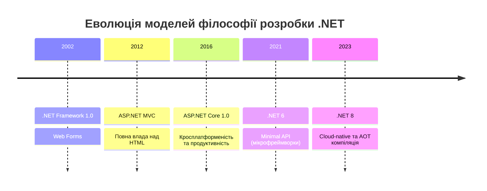

# Вступ до ASP.NET та еволюція фреймворку

::note
**Примітка для читача**: Цей матеріал не є просто переліком фактів. Це менторська сесія, де ми розберемо не лише _як_ працює ASP.NET, але й _чому_ він створений саме так. Приготуйтеся до глибокого занурення!
::

## 1. Контекст та Проблема: Навіщо нам ще один фреймворк?

Уявіть, що ви приходите в ресторан. Ви — це клієнтський додаток (наприклад, браузер або мобільний застосунок). Офіціант — це мережевий протокол (HTTP), який приймає ваше замовлення і несе його на кухню. Кухня — це сервер. Але що робить кухню ефективною?

Кухня не може складатися з одного кухаря, який робить все від нарізки до випікання, особливо коли клієнтів тисячі. Повинен бути процес: хтось миє овочі, хтось смажить, хтось сервірує. У світі веб-розробки "кухня" — це веб-фреймворк. І якщо ви хочете обслуговувати мільйони запитів на секунду, без надійної та оптимізованої кухні ваш ресторан збанкрутує (сервер "впаде").

**Проблема:**
У ранні 2000-ні роки створення веб-сервісів було болем. Ви мусили писати низькорівневий код для роботи з сокетами, самостійно парсити HTTP-заголовки, управляти пам'яттю і думати про безпеку потоків (thread safety). Це було повільно і небезпечно.

**Рішення:**
Microsoft створила **ASP.NET** (Active Server Pages .NET) — могутній фреймворк, який взяв на себе всю рутину: обробку HTTP, маршрутизацію (routing), безпеку та управління сесіями. Завдання розробника звелося до написання безпосередньо _бізнес-логіки_.

::card-group
::card{title="Що ви дізнаєтесь?" icon="lucide:target"}
До кінця цього модуля ви будете розуміти:

1. Анатомію запиту в середовищі ASP.NET Core.
2. Глибинну архітектуру сервера **Kestrel** та чому він перемагає конкурентів.
3. Еволюцію підходів: від неповоротких Web Forms до блискавичних Minimal APIs.

::

::card{title="Пререквізити" icon="lucide:book-open"}
Що потрібно знати перед стартом:

- Базове розуміння протоколу HTTP (GET, POST, Status Codes).
- Основи мови C# (змінні, класи, методи, лямбда-вирази).

::

::

Ось те, що ми отримаємо в результаті — розуміння того, як лише 4 рядки коду здатні обробляти десятки тисяч запитів за секунду.

## 2. Історична еволюція: Від монолітів до мікросервісів

Щоб зрозуміти _Minimal API_, ми маємо зрозуміти _Максимальний біль_, від якого розробники тікали протягом останніх 20 років.

### Ера 1: ASP.NET Web Forms (2002–2012)

Коли інтернет тільки ставав масовим, веб-сторінки були переважно статичними. Microsoft хотіла залучити розробників десктопних програм (Windows Forms) до веб-розробки. Тому вони створили **Web Forms** — абстракцію, де веб-сторінка виглядала як "вікно", а кнопки мали події `OnClick`, як у звичайних програмах на комп'ютері.

::caution
**Антипатерн**: Web Forms намагався приховати той факт, що інтернет працює за протоколом HTTP. Він генерував гігантські приховані поля (ViewState) для збереження стану між запитами, що робило сторінки повільними і важкими. Це було порушенням природи вебу (statelessness).
::

### Ера 2: ASP.NET MVC (2012–2016)

З появою смартфонів і складних клієнтських додатків, підхід Web Forms зламався. Індустрія потребувала чіткого контролю над HTML та HTTP.
З'явився **ASP.NET MVC** (Model-View-Controller). Цей паттерн розділив додаток на три частини:

1. **Model**: дані та бізнес-логіка.
2. **View**: відображення (HTML).
3. **Controller**: посередник, що обробляє запит і склеює Model з View.

Це був прорив, але фреймворк був жорстко прив'язаний до **IIS** (Internet Information Services) — веб-сервера, який працював _тільки_ на Windows.

### Ера 3: ASP.NET Core (2016 — наш час)

Світ змінився. Домінуючою платформою для серверів став Linux. Контейнеризація (Docker) вимагала легких додатків. Microsoft прийняла радикальне рішення: переписати ASP.NET з нуля.

Народився **ASP.NET Core**. Він став:

- **Кросплатформеним**: працює на Windows, macOS, Linux.
- **Модульним**: ви додаєте лише ті пакети (NuGet), які вам справді потрібні.
- **Неймовірно швидким**: завдяки новому веб-серверу Kestrel.

::mermaid



::

{.diagram-img}

<!-- Search Query: Історія та таймлайн релізів .NET від WebForms до .NET 8 -->

### Ера 4: Minimal APIs (2021 — наш час)

Навіть в ASP.NET Core MVC створення простого API (веб-сервісу, який повертає JSON) вимагало багато "церемоній": створення папок Controllers, написання класів-контролерів, атрибутів `[HttpGet]`. Це відлякувало новачків, які бачили, що в Node.js (Express) чи Python (FastAPI) можна підняти сервер в 3 рядки коду.

Для конкуренції в епоху мікросервісів, де сервіс може відповідати лише за одну функцію (наприклад, "Генерація PDF"), Microsoft представила **Minimal APIs**.

::code-group

```csharp [Minimal API (.NET 6+)]
var builder = WebApplication.CreateBuilder(args);
var app = builder.Build();

app.MapGet("/hello", () => "Hello World");

app.Run();
```

```csharp [Старий Controllers API (ASP.NET Core MVC)]
using Microsoft.AspNetCore.Mvc;

namespace MyApp.Controllers
{
    [ApiController]
    [Route("[controller]")]
    public class HelloController : ControllerBase
    {
        [HttpGet]
        public IActionResult Get()
        {
            return Ok("Hello World");
        }
    }
}
// Плюс необхідність налаштовувати Startup.cs...
```

::

Бачите різницю? Minimal API прибирає весь "шум" (бойлерплейт). Але під капотом це той самий потужний, високопродуктивний рушій ASP.NET Core. Ви не жертвуєте продуктивністю заради стислості.

---

## 3. Анатомія ASP.NET Core: Глибокий розбір

Що насправді відбувається, коли ви запускаєте ASP.NET Core додаток? Як код мовою C# перетворюється на працюючий веб-вузол?

### Архітектура "Цибулі" (Onion-like Architecture)

Уявіть додаток ASP.NET Core як матрьошку або цибулину.

1. **ОС**: (Linux/Windows/macOS) — залізо та операційна система.
2. **.NET Runtime (CoreCLR)**: Віртуальна машина або середовище виконання, яке керує пам'яттю (Garbage Collector) та компілює байт-код (IL) у машинні інструкції (RyuJIT).
3. **Kestrel / Reverse Proxy**: Сервер, який "слухає" мережевий порт.
4. **Middleware Pipeline**: Ланцюжок фільтрів, через які проходить запит.
5. **Ваш код (Business Logic)**: Кінцева точка (Endpoint), яка формує відповідь.

{.diagram-img}

{.diagram-img}

<!-- Search Query: Діаграма архітектури ASP.NET Core з Kestrel та Middleware -->

Давайте зупинимося на серці цієї системи — **Kestrel**.

### Kestrel: Двигун Формули-1 у світі веб-серверів

::field-group
::field{name="Microsoft.AspNetCore.Server.Kestrel.Core" type="Namespace"}
**Опис:**
Внутрішній простір імен, який містить реалізацію кросплатформеного веб-сервера Kestrel для ASP.NET Core.
Ви майже ніколи не взаємодієте з його класами напряму, оскільки `WebApplicationBuilder` налаштовує його за замовчуванням автоматично.
::
::field-group

**Проблема:**
Раніше .NET-розробники використовували **IIS** (Internet Information Services) від Microsoft. Це був велетенський монстр, тісно зав'язаний на ядро (kernel) Windows. Він був неймовірно надійним, але дуже важким. Якщо ви хотіли запустити свій код на дешевому Linux-сервері в AWS чи DigitalOcean, ви не могли цього зробити.

**Рішення:**
Команда ASP.NET створила **Kestrel**. Це відкритий, кросплатформений, надзвичайно швидкий веб-сервер, написаний мовою C#.

#### Чому Kestrel такий швидкий?

Kestrel регулярно займає топові позиції в бенчмарках (наприклад, TechEmpower), обробляючи _мільйони_ запитів за секунду на одному сервері. Як це досягається?

1. **Асинхронні I/O операції поверх libuv/Sockets:** Kestrel не створює спеціальний потік (thread) операційної системи для кожного підключення. Замість цього він використовує архітектуру, засновану на подіях (Event Loop). Тисячі клієнтів можуть чекати на відповідь, не блокуючи процесор.
2. **Пам'ять без аллокацій (Zero-Allocation):** Створення нових об'єктів у C# навантажує Garbage Collector (прибиральника сміття). Якщо для кожного HTTP-запиту створювати 100 нових об'єктів (наприклад, для кожного заголовка — новий рядок), при 100 000 запитів на секунду сервер захлинеться від збору сміття. Kestrel використовує `Span<T>` та `Memory<T>` — сучасні структури C#, які дозволяють читати дані з пам'яті (мережевого буфера) _без_ їхнього копіювання чи створення нових об'єктів.
3. **Прямий доступ до пам'яті (Pipelines):** Замість повільних потоків (Streams), Kestrel використовує `System.IO.Pipelines`.

::tip
**Аналогія для Kestrel:**
Уявіть, що ви переливаєте воду з великого відра (мережа) у склянки (запити). Традиційний підхід (Streams) — це брати чашку, зачерпувати воду з відра, йти до столу і наливати в склянку (схоже на копіювання масивів байтів у пам'яті). Підхід Kestrel (Pipelines & Spans) — це вставити трубку і дивитися на воду, поки вона тече, відрізаючи подумки порції без єдиного дотику до самої води руками (нульове копіювання).
::

#### Reverse Proxy: Найкращий друг Kestrel

Хоча Kestrel швидкий, історично йому не вистачало функцій для "жорстокого Інтернету" (наприклад, розширеного захисту від DDoS, складного балансування навантаження, кешування).

Тому в 99% випадків Kestrel не виставляють напряму в Інтернет на порт 80 (HTTP) або 443 (HTTPS). Його ховають за **реверс-проксі** (Reverse Proxy).

::plant-uml
@startuml
skinparam handwritten true
skinparam NoteBackgroundColor #fdf6e3

actor "Клієнт (Браузер)" as Client

node "Reverse Proxy Server (Nginx / IIS / YARP)" as Proxy {
component "SSL Termination" as SSL
component "Load Balancing" as LB
}

node "Application Server (Linux / Windows)" as App {
component "Kestrel (localhost:5000)" as Kestrel
component "ASP.NET Core App" as AspNet
}

Client -> Proxy : HTTP/HTTPS запит (Public IP)

note top of Proxy
Nginx знімає шифрування (SSL).
Якщо запитів багато,
розподіляє їх між серверами.
end note

Proxy -> Kestrel : Внутрішній HTTP запит (Local IP)

note bottom of App
Kestrel максимально швидко
розбирає сирі байти запиту.
end note

Kestrel -> AspNet : Формує об'єкт HttpContext

@enduml
::

Ця архітектура дозволяє кожному інструменту робити те, що в нього виходить найкраще: Nginx бореться з поганим трафіком і управляє сертифікатами безпеки, а Kestrel займається виключно виконанням вашого C#-коду з максимальною швидкостю.

---

## 4. Гнучкість та моделі: Web API, MVC чи Minimal API?

Ми вже згадали, що існує кілька парадигм (підходів) для розробки. Чому Minimal APIs зараз в тренді, і чи означає це, що MVC мертвий?

Давайте розглянемо порівняльну таблицю.

| Характеристика                        | MVC / Controllers API                                                           | Minimal API                                                                                  | Причина вибору                                                                                                                                   |
| :------------------------------------ | :------------------------------------------------------------------------------ | :------------------------------------------------------------------------------------------- | :----------------------------------------------------------------------------------------------------------------------------------------------- |
| **Точка входу та налаштування**       | Розподілено (раніше між `Program.cs` та `Startup.cs`, плюс тека `Controllers/`) | Централізовано (переважно все в `Program.cs`)                                                | Для дрібних мікросервісів легше тримати все "перед очима".                                                                                       |
| **Продуктивність (Routing overhead)** | Висока (використовує рефлексію та пошук контролерів у runtime)                  | **Найвища** (прямий мапінг делегатів у пайплайні роутера)                                    | У високонавантажених сценаріях Minimal API б'є рекорди, оскільки не витрачає час на створення екземплярів (instantiating) класів контролерів.    |
| **Організація коду**                  | Автоматична структура через директорії (класи з методами)                       | Вимагає свідомої організації від розробника (інакше `Program.cs` стане 10_000 рядками бруду) | MVC змушує писати стандартизовано. В Minimal API ви повинні самі застосовувати патерни (наприклад, Carter або Extension methods для групування). |
| **Сфера застосування**                | Гігантські ентерпрайз-моноліти (ERP системи, соцмережі).                        | Мікросервіси, serverless функції, IoT бекенди, швидкі пет-проєкти.                           | Використовуйте правильний інструмент. Minimal API — це скальпель. MVC — швейцарський ніж.                                                        |

{.diagram-img}

### Шаблони проєктів ASP.NET Core (Templates)

З чого почати створення власного додатку? Microsoft надає набір попередньо налаштованих шаблонів (Templates), які генерують базову структуру папок і файлів залежно від ваших цілей.

::card-group
::card{title="Команда: dotnet new web" icon="lucide:terminal"}
**Minimal API (Порожній)**. Найтонший і найлегший шаблон. Створює лише один `Program.cs` із `app.MapGet("/", () => "Hello World!");`. Ідеально для мікросервісів або якщо ви хочете побудувати архітектуру з абсолютного нуля.
::
::card{title="Команда: dotnet new webapi" icon="lucide:server"}
**Web API**. Стандартний базис для створення RESTful сервісів (раніше на основі Controllers, зараз за замовчуванням генерує Minimal API з підключеним Swagger/OpenAPI). Це те, з чим найчастіше працюють Backend-розробники.
::
::card{title="Команда: dotnet new mvc" icon="lucide:layout-template"}
**Model-View-Controller**. Класичний, повноваговий шаблон для створення додатків із Server-Side Rendering (коли сервер формує повний HTML за допомогою синтаксису Razor). Включає папки `Controllers/`, `Models/`, `Views/`.
::
::card{title="Команда: dotnet new blazorserver / blazorwasm" icon="lucide:layers"}
**Blazor**. Шаблон для повноцінного Fullstack на C#. Дозволяє писати інтерактивні клієнтські компоненти (як у React чи Vue) безпосередньо мовою C# (компілюється у WebAssembly або працює через SignalR-зв'язок із сервером).
::
::card{title="Команда: dotnet new grpc" icon="lucide:arrow-left-right"}
**gRPC Service**. Шаблон для створення високопродуктивних сервісів, які спілкуються один з одним через бінарний протокол gRPC (Google Remote Procedure Call) замість традиційного текстового HTTP/JSON.
::
::

<!-- Search Query: Порівняння MVC та Razor Pages (Джерело: C# Corner) -->

> [!TIP]
> **Золоте правило**: Ви можете змішувати обидва підходи в межах ОДНОГО додатку! ASP.NET Core не змушує вас обирати щось назавжди. Ви можете мати контролер `OrdersController` для складної логіки обміну замовленнями, і водночас мати легкий Minimal API маршрут `app.MapGet("/health", () => "OK")` для перевірки стану сервера на балансувальнику навантаження. Це геніальна універсальність.

---

## 5. За завісою: Синтаксичний цукор (Syntactic Sugar) у C#

Як розробникам Microsoft вдалося зробити код Minimal API таким коротким? Чому нам більше не треба писати `public static void Main(string[] args)` та простори імен `namespace MyApp`?

Це стало можливим завдяки фічам мови C#, які розвивалися паралельно з фреймворком.

### Фіча 1: Top-Level Statements (C# 9.0)

Раніше, щоб надрукувати "Hello World", ви мали написати класичний шаблон:

```csharp
using System;

namespace MyFirstApp
{
    class Program
    {
        static void Main(string[] args)
        {
            Console.WriteLine("Hello World!");
        }
    }
}
```

Але що насправді важливо в цьому коді? Тільки рядок `Console.WriteLine`. Усе інше — це "леса" або "церемонія", яка потрібна була компілятору, щоб зрозуміти, звідки починається програма.

Починаючи з C# 9.0, компілятор навчився "додумувати" все це самостійно. Тепер весь файл може складатися з одного рядка:

```csharp
Console.WriteLine("Hello World!");
```

Компілятор сам оберне цей код у невидимий клас `Program` та метод `Main`. Саме тому `Program.cs` у Minimal API починається безпосередньо з `var builder = WebApplication.CreateBuilder(args);`.

### Фіча 2: Global Usings (C# 10.0)

Раніше на початку кожного файлу у великих проектах були "простирадла" з `using System;`, `using Microsoft.AspNetCore.Mvc;` тощо.
Зараз ви можете написати `global using System;` один раз в окремому файлі, і компілятор додасть цей імпорт до всіх файлів у проекті.

Більше того, для проектів типу `Microsoft.NET.Sdk.Web` (веб-додатки), SDK автоматично вмикає **Implicit Usings**. Це означає, що вам не потрібно руками додавати базові `using` (наприклад `Microsoft.AspNetCore.Builder` чи `Microsoft.Extensions.DependencyInjection`). Вони вже включені невидимо! Це робить код кришталево чистим.

---

## 6. Резюме та що далі?

У цьому модулі ми розібрали фундаментальні поняття:

1. **Чому ASP.NET Core**: Він кросплатформений, надшвидкий та модульний.
2. **Що таке Kestrel**: Це серце фреймворку, високопродуктивний асинхронний веб-сервер, розроблений для максимальної економії пам'яті (zero-allocation) і обробки тисяч одночасних підключень.
3. **Чому Minimal APIs**: Цей підхід відкидає надлишкову складність класичного MVC (контролери), дозволяючи декларувати функціонал у кілька рядків коду за допомогою фіч сучасного C# (Top-Level Statements, Implicit Usings).

Зараз ми бачимо повну картину того, _для чого_ створений цей інструмент. Ми знаємо принципи його роботи. Наступний крок — навчитися створювати такі додатки власноруч.

У наступному модулі ми крок за кроком пройдемо створення вашого першого проекту, розібравши анатомію згенерованого коду. Ми порівняємо, як це робиться через консоль (.NET CLI) та в поширених IDE (Visual Studio, JetBrains Rider).

---

## Перевірка знань

::tally-embed{id="YOUR_FORM_ID_HERE" title="Тест: Основи ASP.NET Architecture"}
::

::note
**Примітка**: Якщо форма не завантажується, будь ласка, оновіть сторінку або перевірте своє з'єднання. Цей квіз допоможе вам зрозуміти, наскільки добре ви розібралися у різниці між Kestrel і Reverse Proxy.
::

<!--
Це перша частина матеріалу. Поточний обсяг - детальне занурення.
Ми свідомо використовуємо компоненти Docus для форматування.
-->
