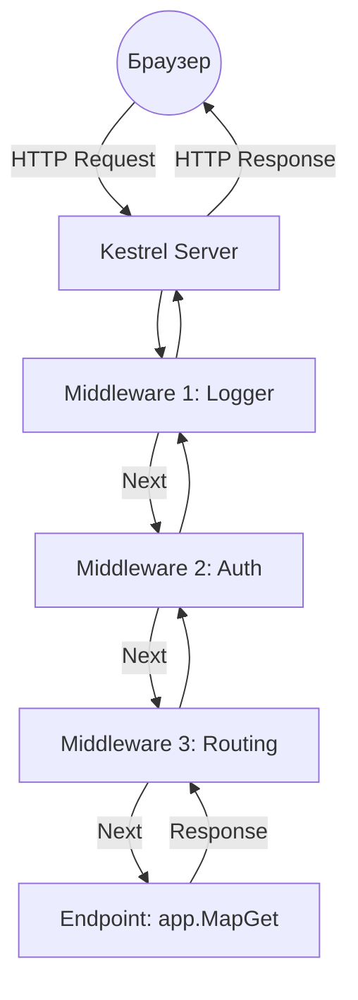

# Конвеєр запитів (Request Pipeline) та Middleware

::note
**Примітка для читача**: Ми вже вміємо запускати сервер і реєструвати його внутрішні органи (сервіси). Але веб-сервер існує для однієї мети: приймати запит звідусіль (від клієнта) і віддавати відповідь. Цей модуль — це сертифікат майстра серверної маршрутизації. Ви дізнаєтесь, як кожен HTTP-запит подорожує всередині Kestrel, хто його перевіряє, як його змінювати на льоту, і чому порядок коду тут — це питання життя і смерті вашого додатку.
::

## 1. Контекст: Що таке Конвеєр (Pipeline)?

Уявіть, що ви на автомобільному заводі. Голий кузов машини (це вхідний **HTTP Запит**) стає на стрічку конвеєра. Стрічка рухається через серію станцій.

1. На першій станції робот перевіряє, чи є у вас квиток на завод (Аутентифікація). Якщо немає — він викидає машину з конвеєра з помилкою 401 Unauthorized.
2. На другій станції робот прикріплює двері (Додає заголовки у HTTP Відповідь).
3. На третій станції робот фарбує машину (Формує JSON тіло відповіді).

Кожна така "станція", кожен робот на конвеєрі ASP.NET Core називається словом **Middleware** (Проміжне програмне забезпечення).

::mermaid



::

Ця діаграма демонструє найголовніше правило ASP.NET: **Запит проходить через Middleware двічі**. Спочатку "вниз" (до кінцевої точки Endpoint), а потім відповідь повертається "нагору" через ті самі Middleware, перш ніж вилетіти до користувача.

Це нагадує російську матрьошку: виклик `Next()` занурює нас у наступну матрьошку.

---

## 2. HttpContext: Бог вашого запиту

Кожного разу, коли мільйони байтів прилітають на мережеву карту вашого сервера, Kestrel магічним чином збирає ці байти і перетворює їх на розкішний об'єкт мовою C#, з яким нам приємно працювати.
Цей об'єкт називається **HttpContext**.

Де б ви не знаходились у виконанні запиту (в Middleware, в Controller, в Minimal API Endpoint), `HttpContext` є завжди поруч.

::field-group
::field{name="HttpContext" type="Class"}
**Документація:**
Інкапсулює всю специфічну інформацію для одного індивідуального HTTP-запиту від клієнта.
Головні властивості:

- `Request` (HttpRequest): Всі вхідні дані (URL, Заголовки, Query, Тіло, Куки).
- `Response` (HttpResponse): Всі вихідні дані, які ми збираємось повернути.
- `User` (ClaimsPrincipal): Зашифрована інформація про користувача з токена (якщо він авторизований).
- `TraceIdentifier`: Унікальний ID запиту, корисний для систем агрегації логів (Kibana, Seq).

::

::

### 2.1. HttpRequest (Читання)

Використовується виключно для читання того, що надіслав клієнт.

```csharp
app.MapGet("/info", (HttpContext context) =>
{
    var path = context.Request.Path; // Поверне "/info"
    var method = context.Request.Method; // Поверне "GET"
    var userAgent = context.Request.Headers["User-Agent"]; // Поверне "Mozilla/5.0..."

    return $"Ви прийшли на шлях {path} використовуючи метод {method}. Ваш браузер: {userAgent}";
});
```

Зверніть увагу: ми попросили ASP.NET передати поточний `HttpContext` в нашу лямбду просто дописавши його як параметр `(HttpContext context)`. DI контейнер автоматично зв'язує його для нас на час цього конкретного запиту.

### 2.2. HttpResponse (Записування)

`HttpResponse` дозволяє нам керувати тим, що прийде назад в браузер.

```csharp
app.MapGet("/custom-headers", async (HttpContext context) =>
{
    // 1. Встановлення HTTP Коду Статусу
    context.Response.StatusCode = 201; // Created

    // 2. Встановлення своїх заголовків
    context.Response.Headers.Append("X-Server-Version", "1.0.42");
    context.Response.ContentType = "text/html; charset=utf-8";

    // 3. Запис сирих байтів або рядків у тіло (Body)
    await context.Response.WriteAsync("<h1>Магічна Сторінка</h1>", System.Text.Encoding.UTF8);
});
```

::warning
**Попередження: Головний біль новачків (Headers already sent)**
Після того, як ви викликали `context.Response.WriteAsync()` або повернули будь-які дані, Kestrel відправляє заголовки клієнту. Якщо після цього ви спробуєте змінити `context.Response.StatusCode = 404`, програма впаде з помилкою _Headers are already sent_. Ви не можете змінювати заголовки або статус-коди _після_ того, як почали писати в тіло запиту!
::

---

## 3. Методи реєстрації Middleware: `Run`, `Use` та `Map`

Як нам створити власного "робота" на конвеєрі? За допомогою трьох методів класу `IApplicationBuilder` (наш `app`).

### Метод Run(): Термінатор

Метод `Run()` додає до пайплайну **Термінальний Middleware** (Terminal Middleware). Це означає, що як тільки запит доходить до `Run()`, він обробляється і ПРОЦЕС ЗАКІНЧУЄТЬСЯ. Цей робот ніколи не передасть кузов машини далі. Пайплайн розвертається і їде назад.

```csharp
var builder = WebApplication.CreateBuilder(args);
var app = builder.Build();

app.Run(async context =>
{
    await context.Response.WriteAsync("Це Термінатор. Я завершую запит.");
});

// ЦЕЙ КОД НІКОЛИ НЕ ВИКОНАЄТЬСЯ
app.Run(async context =>
{
    await context.Response.WriteAsync("Мене ніхто ніколи не побачить :(");
});

app.Run();
```

`Run()` використовується дуже рідко, найчастіше на самому "дні" пайплайну як fallback (остання надія) для запитів типу "404 Not Found". Всі функції `app.MapGet(...)` під капотом зводяться саме до `Run()`.

### Метод Use(): Класична ланка конвеєра

Метод `Use()` дозволяє вам вставити власну логіку, І ПЕРЕДАТИ управління наступному по ланцюгу (викликавши `next()`).

```csharp
app.Use(async (context, next) =>
{
    // Логіка ВХІДНОГО запиту (До виконання наступних Middleware)
    Console.WriteLine($"[1] Вхідний запит: {context.Request.Path}");

    // ПЕРЕДАЄМО КЕРУВАННЯ НАСТУПНОМУ MIDDLEWARE!
    await next();

    // Логіка ВИХІДНОГО запиту (Після виконання всього іншого)
    Console.WriteLine($"[4] Відповідь сформовано. Статус: {context.Response.StatusCode}");
});

app.Use(async (context, next) =>
{
    Console.WriteLine($"[2] Я другий middleware.");
    await next();
    Console.WriteLine($"[3] Завершую другий middleware.");
});

app.MapGet("/", () => "Hello!");
```

Якщо ви зробите запит, в консолі рівно в такому порядку напишеться:
`[1]` -> `[2]` -> (відпрацює MapGet) -> `[3]` -> `[4]`.

::caution
**Пастка**: Якщо в методі `Use` ви забудете написати `await next()`, пайплайн обірветься на цьому ж місці. Ця лінія фактично перетворить `Use()` на `Run()`.
::

### Метод Map(): Розгалуження конвеєра

Іноді вам потрібно відправити певну частину трафіку на окремий "міні-завод", і ніколи не повертати його на головний конвеєр. Метод `Map` дозволяє створити відгалуження на основі шляху (URL Path).

```csharp
// Якщо хтось зайде на /admin
app.Map("/admin", adminApp =>
{
    // Це ОДРЕМА гілка пам'яті Middleware. Вона нічого не знає про головну.
    adminApp.Run(async context =>
    {
        await context.Response.WriteAsync("Ви в адмінці!");
    });
});

app.Run(async context =>
{
    await context.Response.WriteAsync("Головна публічна частина сторінки");
});
```

Якщо запит іде на `/admin`, він потрапляє у відгалуження, обробляється там через `Run`, і повертається клієнту напряму. Він ніколи не дійде до головного `app.Run()`.

---

## 4. Стан Middleware: Пастка життєвого циклу

До цього ми писали Middleware прямо в файлі `Program.cs` як лямбда-вирази (так званий Inline Middleware).
Ви повинні знати один страшний факт: **Екземпляри лямбд для Middleware створюються лише ОДИН РАЗ при старті сервера (вони є Singleton за своєю природою)**.

Розглянемо класичну помилку початківців:

```csharp
int counter = 0; // Глобальна змінна (Closure) для middleware

app.Use(async (context, next) =>
{
    counter = counter + 1; // Мутація спільного стану!
    await context.Response.WriteAsync($"Ви відвідувач номер {counter}");
});
```

Якщо ви відкриєте браузер і будете натискати F5, ви побачите: "ви відвідувач 1", "ви відвідувач 2", "ви відвідувач 3". Здається, все добре.

Але уявіть, що у вас на сервері 500 одночасних клієнтів. Спрацьовує пул потоків (Thread Pool), і 5 потоків одночасно намагаються зробити `counter = counter + 1`. Це призведе до **Стану Перегонів (Race Condition)**. Значення зіб'ються в кашу. Більше того, ви можете зламати пам'ять.

::caution
**Золоте правило Middleware:**

Ви **ніколи** не повинні зберігати дані користувача (User Data, DataBase Records) в полях або зовнішніх змінних Middleware. Middleware повинно бути State-Less (без стану). Всі дані мають передаватися через `HttpContext.Items`, бази даних або Scoped DI Сервіси.
::

---

## 5. Вбудовані Middleware від Microsoft

Ви рідко будете писати `app.Use()` вручну. Найкрутіша фішка ASP.NET Core в тому, що всі потужні можливості вже написані як оптимізовані класи Middleware корпорацією Microsoft, і підключити їх можна одним методом розширення.

Існує фундаментальне правило для встроенних Middleware — **Порядок має значення (Order Matters)!**
Якщо ви поставите перевірку доступу (Авторизацію) _після_ того, як запит обробився, вас просто взламають.

Рекомендований порядок виглядає так:

::code-group

```csharp [Ідеальний порядок пайплайну]
var builder = WebApplication.CreateBuilder(args);
var app = builder.Build();

// 1. Обробник виключень (перехоплює паніки з усіх інших Middleware під собою)
app.UseExceptionHandler("/error");

// 2. HTTPS переадресація. Немає сенсу працювати далі, якщо ми на небезпечному з'єднанні.
app.UseHttpsRedirection();

// 3. Статичні файли (картинки, css). Нема чого їх перевіряти складними правилами.
app.UseStaticFiles();

// 4. Маршрутизація. Kestrel дізнається, до якого Endpoint летить запит.
app.UseRouting();

// 5. CORS (Крос-доменні запити). Дозволяє фронтенду звертатися до нашого API.
app.UseCors();

// 6. Аутентифікація (Хто цей користувач? Парсинг JWT Token чи Cookie)
app.UseAuthentication();

// 7. Авторизація (Чи має цей користувач права адміна?)
app.UseAuthorization();

// 8. Виконання наших Minimal API Endpoints
app.MapGet("/", () => "Top Secret Data");

app.Run();
```

::

Якщо ви поміняєте `UseRouting()` і `UseAuthentication()` місцями, ваша програма може перестати працювати або стати вразливою. Microsoft створила цей ланцюжок так, щоб "найдешевіші" і найважливіші перевірки відсіювали сміттєві запити на самих ранніх стадіях пайплайну, зберігаючи ресурси процесора.

### 5.1 Практика: Middleware для обробки помилок

Одне з найважливіших завдань конвеєра — коректно обробляти помилки (Exceptions). В ASP.NET Core працює правило: обробник помилок має бути **першим** у пайплайні, щоб він міг перехопити (catch) будь-яку помилку, що виникне в компонентах під ним.

Традиційно використовують три ключові компоненти (як описано в класичній літературі з ASP.NET Core):

1. **`DeveloperExceptionPageMiddleware`**: Використовується _тільки_ під час розробки (`if (app.Environment.IsDevelopment())`). Він перехоплює помилку і генерує детальну (іноді "білу сторінку смерті") HTML-сторінку зі Stack Trace, параметрами запиту та іншою чутливою інформацією.
2. **`ExceptionHandlerMiddleware`**: Використовується на Production. Замість показу деталей помилки клієнту (що небезпечно), він перехоплює паніку, логує її і прозоро перенаправляє користувача на безпечний роут (наприклад, `app.UseExceptionHandler("/error")`).
3. **`StatusCodePagesMiddleware`**: Працює з помилками на рівні статус-кодів (наприклад, 404 Not Found або 403 Forbidden). Перетворює порожні відповіді браузеру на красиві сторінки або правильні JSON-структури.

```csharp
var builder = WebApplication.CreateBuilder(args);
var app = builder.Build();

// Налаштування залежно від середовища
if (app.Environment.IsDevelopment())
{
    // Покаже повний stack trace при помилці (у .NET 6+ працює автоматично)
    app.UseDeveloperExceptionPage();
}
else
{
    // Безпечне перенаправлення для користувачів
    app.UseExceptionHandler("/error");
    // Безпека: HTTP Strict Transport Security
    app.UseHsts();
}

app.UseStatusCodePages(); // Додає тіло відповіді для статус кодів 400-599
```

---

## 6. Пишемо Класичний Middleware (Експертний рівень)

Лямбди (Inline Middleware) — це круто для прототипування. Але у великому ентерпрайз проекті логіка записує 500 рядків коду в один кластер `Program.cs`. Це жах.
ASP.NET дозволяє нам ізолювати Middleware у красиві класи.

Нехай ми напишемо власний розумний таймер, який логуватиме, скільки мілісекунд виконувався запит.

### Крок 1: Клас логіки

```csharp
using System.Diagnostics;

// 1. Клас має бути публічним.
public class RequestTimingMiddleware
{
    // 2. Він ОБОВ'ЯЗКОВО повинен приймати наступну ланку конвеєра в конструкторі.
    private readonly RequestDelegate _next;

    public RequestTimingMiddleware(RequestDelegate next)
    {
        _next = next;
    }

    // 3. Він ОБОВ'ЯЗКОВО повинен мати метод Invoke або InvokeAsync
    public async Task InvokeAsync(HttpContext context)
    {
        // Логіка ДО (перехоплюємо старт)
        var sw = Stopwatch.StartNew();

        // Пропускаємо запит далі в глиб додатка
        await _next(context);

        // Логіка ПІСЛЯ (коли відповідь повертається з глибини)
        sw.Stop();

        // Знаходимо Logger через сервіси запиту і пишемо час виконання
        var logger = context.RequestServices.GetRequiredService<ILogger<RequestTimingMiddleware>>();
        logger.LogInformation($"Запит до {context.Request.Path} виконався за {sw.ElapsedMilliseconds}ms");
    }
}
```

### Крок 2: Метод-Розширення для красоти

Ми не хочемо писати `app.UseMiddleware<RequestTimingMiddleware>()`. Ми хочемо як у дорослих.

```csharp
public static class RequestTimingMiddlewareExtensions
{
    public static IApplicationBuilder UseRequestTiming(this IApplicationBuilder builder)
    {
        return builder.UseMiddleware<RequestTimingMiddleware>();
    }
}
```

### Крок 3: Ін'єкція в пайплайн

Тепер наш `Program.cs` виглядає кришталево чисто:

```csharp
var builder = WebApplication.CreateBuilder(args);
var app = builder.Build();

// Викликаємо нашого власного робота
app.UseRequestTiming();

app.MapGet("/", () => "Hello Performance!");

app.Run();
```

---

## 7. Практичні завдання та виклики

Теоретичні знання пусті без практики. Випробуйте себе:

1. **Challenge 1 (API Key Check):** Створіть власне Inline Middleware через `app.Use()`, яке перевіряє заголовок `X-Api-Key` в `context.Request.Headers`. Якщо ключа немає або він неправильний, не викликайте `next()`, а відразу встановіть `StatusCode = 401`, надішліть `context.Response.WriteAsync("Unauthorized")` і завершіть запит. Це і є ручна аутентифікація!
2. **Challenge 2 (Request Modification):** Напишіть Middleware, яке завжди додає глобальний заголовок до кожної відповіді сервера (наприклад, `context.Response.Headers.Append("X-Author", "MyName")`). Перевірте це в вкладці Network вашого браузера (DevTools F12).

---

## 8. Підсумкове Резюме Майстрів

Вітаю, ви успішно пройшли всі фундаментальні блоки. Давайте підіб'ємо підсумки:

- **Middleware** — це ланцюжок делегатів. Вони виконуються Секвенційно (один за одним) при надходженні запиту, і в зворотному порядку при формуванні відповіді (Матрьошка).
- **HttpContext** — це альфа і омега всієї магії. Все, що знає сервeр про веб, лежить у `Request` або `Response` всередині цього контексту.
- **Run vs Use** — Run є термінатором конвеєра, він завжди стоїть у фіналі. Use — це проміжне кільце, яке повинне кликати `await next()`.
- **Порядок реєстрації** (Послідовність `Use...()`) критично важлива. Статичні файли треба віддавати раніше аутентифікації для швидкості; Аутентифікацію треба ставити раніше маршрутизації для безпеки.

## Перевірка знань

::tally-embed{id="YOUR_FORM_ID_HERE" title="Тест: Середовище виконання та Middleware Pipeline"}
::

Якщо тест не завантажується, перевірте свої знання тут:

1. Якщо `Middleware 1` викликає `await next()`, а `Middleware 2` просто пише статус код і НЕ викликає `next()`, чи виконається `Middleware 3`?
2. На якому етапі життєвого циклу запиту безпечно змінювати HTTP-заголовки у `context.Response`? (Підказка: До виклику першого `WriteAsync`).
3. Ви написали кастомний сервіс-контролер, який залежить від бази даних через Constructor Injection. Який Lifetime (`AddSingleton`, `AddScoped` чи `AddTransient`) для БД є правильним, якщо ви хочете, щоб всі операції бази даних в межах _одного HTTP запиту_ відбувалися в одній і тій самій транзакції?
