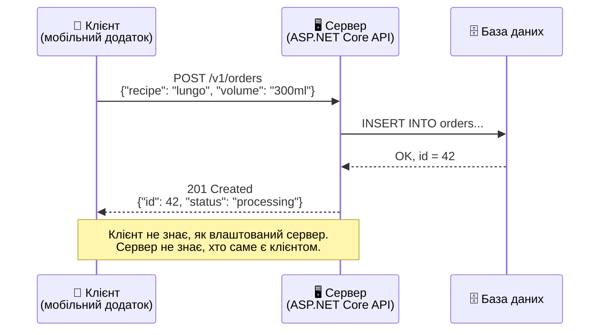
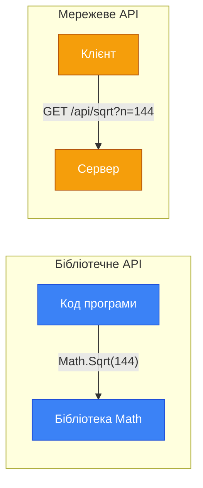
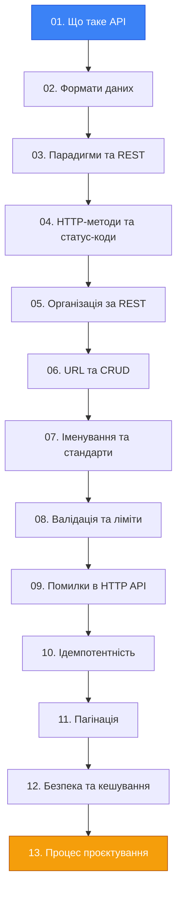

# Що таке API. Клієнт-серверна архітектура

::note
Цей матеріал — не «сухий» переказ визначень. Це менторська сесія, де кожне нове поняття вводиться через _проблему_, яку воно вирішує. Ми не просто дамо визначення API — ми покажемо, _навіщо_ воно з'явилось і чому без нього сучасна розробка неможлива.
::

## 1. Проблема: Чому програми не можуть просто «поговорити»?

Уявіть ситуацію: ви розробляєте мобільний застосунок для замовлення кави. Користувач натискає кнопку «Замовити лунго», і... що відбувається далі?

Десь на сервері є база даних із рецептами, кавовими машинами, цінами, поточними замовленнями. Ваш мобільний застосунок **не має прямого доступу** до цієї бази — і це правильно. Якби кожен телефон мав прямий доступ до серверної бази даних, це було б:

- **Небезпечно** — будь-хто міг би змінити ціни або видалити замовлення інших людей.
- **Крихко** — зміна структури бази зламала б усі клієнтські додатки одночасно.
- **Неможливо масштабувати** — мільйони прямих підключень до однієї бази покладуть сервер за лічені секунди.

Потрібен **посередник** — чітко визначений контракт, який каже: «Ось що ти можеш запитати, ось у якому форматі, і ось що ти отримаєш у відповідь». Цей контракт називається **API**.

::card-group

::card{title="Що ви дізнаєтесь?" icon="i-lucide-target"}

- Що таке API і чому це не просто «набір URL-адрес»
- Клієнт-серверна модель та її фундаментальні принципи
- Типи API за аудиторією: внутрішнє, партнерське, публічне
- Чому HTTP API є вибором за замовчуванням для публічних сервісів

::

::card{title="Пререквізити" icon="i-lucide-book-open"}

- Базове розуміння протоколу HTTP (запити, відповіді, статус-коди)
- Основи мови C# та ASP.NET Core Minimal API

::

::

---

## 2. Визначення: Що таке API?

**API** (Application Programming Interface, програмний інтерфейс застосунку) — це **контракт** між двома програмними компонентами, який визначає:

1. **Які операції** доступні (наприклад, «створити замовлення», «отримати список рецептів»).
2. **Який формат** мають запити та відповіді (параметри, типи даних, структура).
3. **Які гарантії** надає сервер (що станеться при помилці, як довго кешувати відповідь).

::tip
**Аналогія з реального світу:** API — це як меню у ресторані. Ви не заходите на кухню і не кажете кухарю, які інгредієнти змішати. Замість цього ви дивитеся в **меню** (API-документацію), обираєте страву (операцію), вказуєте побажання (параметри запиту), і офіціант (HTTP) несе ваше замовлення на кухню (сервер). Ви не знаєте, як влаштована кухня, і вам не потрібно це знати — достатньо того, що меню чітко описує, що можна замовити.
::

Важливо розуміти: **API — це не реалізація**, а _специфікація_. Меню ресторану не змінюється від того, чи працює на кухні шеф-кухар або стажер. Так само, API визначає _контракт_ взаємодії, а не те, як саме сервер виконує запит всередині.

### Чому API — це не просто «набір URL-адрес»?

Поширена помилка — ототожнювати API з переліком ендпоінтів (URL-адрес). Але API — поняття значно ширше:

| Аспект | Просто URL-адреси | Повноцінний API |
|:---|:---|:---|
| Формат даних | Не визначений | JSON, XML, Protobuf — чітко задані |
| Обробка помилок | Довільна | Стандартизовані коди та формати |
| Версіонування | Відсутнє | Продумана стратегія сумісності |
| Документація | Немає | OpenAPI/Swagger специфікація |
| Гарантії | Жодних | SLA, ліміти, політика кешування |
| Безпека | Не продумана | Аутентифікація, авторизація, rate limiting |

Саме тому **дизайн API** — це окрема інженерна дисципліна, якій присвячено цей модуль.

---

## 3. Клієнт-серверна архітектура

### Базова модель

Клієнт-серверна архітектура — це фундаментальний паттерн побудови розподілених систем, де компоненти поділяються на дві ролі:

- **Клієнт** — ініціатор запиту. Це може бути мобільний застосунок, браузер, інший сервер або навіть IoT-пристрій.
- **Сервер** — обробник запиту. Він зберігає дані, виконує бізнес-логіку та повертає відповідь.

::mermaid



::

Ключовий принцип цієї моделі: **клієнт і сервер не знають внутрішнього устрою один одного**. Клієнт не знає, чи сервер написаний на C#, Python чи Go. Сервер не знає, чи клієнт — це браузер, мобільний додаток чи скрипт у терміналі. Вони спілкуються виключно через **контракт API**.

### Чому це важливо?

Ця незалежність має величезні практичні наслідки:

::card-group

::card{title="🔄 Незалежна еволюція" icon="i-lucide-refresh-cw"}
Ви можете повністю переписати бекенд з Python на C# — якщо контракт API залишається тим самим, жоден клієнт не зламається.
::

::card{title="📱 Мультиплатформність" icon="i-lucide-smartphone"}
Один API обслуговує мобільний додаток, веб-сайт, десктопний клієнт, інтеграцію з партнерами — усіх одночасно.
::

::card{title="⚡ Масштабування" icon="i-lucide-trending-up"}
Між клієнтом і сервером можна додати проксі, балансувальники навантаження, кеші — без зміни коду обох сторін.
::

::card{title="🧪 Тестування" icon="i-lucide-test-tube"}
Клієнт можна тестувати з мок-сервером. Сервер можна тестувати без клієнта, надсилаючи HTTP-запити вручну.
::

::

---

## 4. Типи API за аудиторією

Не всі API однакові. Залежно від того, _хто_ є споживачем API, змінюються вимоги до його дизайну, документації та безпеки.

### Внутрішнє API (Internal / Private API)

Використовується **тільки всередині** організації — для взаємодії між мікросервісами, внутрішніми інструментами, бекенд-компонентами.

```csharp [Program.cs]
// Внутрішній API для сервісу повідомлень
// Доступний лише в приватній мережі
var app = WebApplication.Create(args);

app.MapPost("/internal/notifications/send", 
    (NotificationRequest req) =>
{
    // Немає зовнішньої автентифікації —
    // довіряємо мережевому контуру
    return Results.Ok(new { sent = true });
});

app.Run();
```

**Характеристики:**
- Менше уваги документації — розробники обох сторін сидять в одному офісі
- Можна використовувати бінарні протоколи (gRPC) для максимальної продуктивності
- Оновлення без довгого циклу deprecation — контролюєте обидва боки

### Партнерське API (Partner API)

Надається **обмеженому колу** зовнішніх компаній-партнерів за договором.

```csharp [Program.cs]
// Партнерське API для B2B інтеграції
var app = WebApplication.Create(args);

app.MapGet("/v1/partners/{partnerId}/orders", 
    (string partnerId, HttpContext ctx) =>
{
    // Перевірка API-ключа партнера
    var apiKey = ctx.Request.Headers["X-Partner-ApiKey"]
        .FirstOrDefault();

    if (string.IsNullOrEmpty(apiKey))
        return Results.Unauthorized();

    // Повернення замовлень лише цього партнера
    return Results.Ok(new { 
        partner_id = partnerId,
        orders = new[] { 
            new { id = 1, status = "completed" } 
        }
    });
});

app.Run();
```

**Характеристики:**
- Обов'язкова аутентифікація (API-ключі, OAuth)
- Детальна документація та підтримка
- Версіонування з довгим циклом deprecation

### Публічне API (Public / Open API)

Доступне **будь-якому розробнику** в Інтернеті. Це те, з чим ви найчастіше будете працювати.

```csharp [Program.cs]
// Публічне API для мобільного додатку
var app = WebApplication.Create(args);

app.MapGet("/v1/recipes", () =>
{
    // Будь-хто може отримати список рецептів
    return Results.Ok(new[] 
    {
        new { id = "lungo", title = "Лунго", volume = "250ml" },
        new { id = "americano", title = "Американо", volume = "350ml" }
    });
});

app.MapPost("/v1/orders", (OrderRequest order) =>
{
    // Створення замовлення вимагає авторизації
    return Results.Created($"/v1/orders/{42}", new { id = 42 });
});

app.Run();

record OrderRequest(string Recipe, string CoffeeMachineId);
```

**Характеристики:**
- Максимально детальна документація (OpenAPI/Swagger)
- Суворе версіонування та зворотна сумісність
- Rate limiting, автентифікація, захист від зловживань
- **JSON-over-HTTP** — вибір за замовчуванням, оскільки ця технологія зрозуміла максимально широкому колу програмістів і дозволяє розробляти клієнтські додатки практично на будь-якій платформі

::warning
**З книги Константинова:** Для публічних API надання JSON-over-HTTP ендпоінтів є _вибором за замовчуванням_. Практика надання публічних API у форматі gRPC поступово набирає популярності, але поки ще незначна на загальному фоні. Проблема вибору технології виникає лише для непублічних API загального призначення.
::

---

## 5. Від бібліотечного API до мережевого API

Термін «API» з'явився задовго до вебу. Спочатку він означав інтерфейс _бібліотеки_ — набір функцій, які можна викликати з коду:

```csharp
// Бібліотечне API — виклик функції напряму
var result = Math.Sqrt(144); // 12
```

З розвитком Інтернету та розподілених систем виникла потреба викликати функції _на іншому комп'ютері_, через мережу. Так з'явилися **мережеві API** (Network API або Web API).

::mermaid



::

Принципова різниця:

| Аспект | Бібліотечне API | Мережеве API |
|:---|:---|:---|
| Виклик | Прямий (в межах процесу) | Через мережу (HTTP, gRPC) |
| Швидкість | Наносекунди | Мілісекунди (мережева затримка) |
| Надійність | Гарантована (якщо код працює) | Мережа може впасти в будь-який момент |
| Формат даних | Нативні типи мови | Серіалізація (JSON, Protobuf) |
| Версіонування | Через NuGet/npm версії | Через URL або заголовки |

::caution
**Критична різниця:** мережеві виклики _завжди_ ненадійні. Мережа може обірватися посеред запиту, сервер може відповісти таймаутом, проксі може змінити відповідь. Це фундаментально впливає на дизайн API — саме тому існують концепції **ідемпотентності**, **retry-політик** та **токенів ідемпотентності**, які ми детально розберемо у наступних статтях.
::

---

## 6. Навіщо вивчати дизайн API?

Може здатися: «Навіщо окремий модуль для API? Достатньо написати кілька ендпоінтів і все працює». Але ось сценарій із реального життя:

::steps

### Понеділок: «Все просто»

Ви створюєте один ендпоінт: `GET /orders` — повертає список замовлень. Все працює.

### Вівторок: «А як фільтрувати?»

Фронтенд-розробник просить додати фільтр за статусом: `GET /orders?status=active`. Додаєте — працює.

### Середа: «А як шукати по кількох рецептах?»

Потрібно шукати замовлення для лунго _і_ латте одночасно. `GET /orders?recipe=lungo&recipe=latte`? Але стандарту передачі масивів у URL _не існує_. Доводиться вигадувати: `recipe=lungo,latte`? Чи `recipe[]=lungo&recipe[]=latte`? Кожен фреймворк обробляє це по-різному.

### Четвер: «Дані не оновлюються!»

Клієнт кешував `GET /orders`, і тепер показує застарілі дані. Потрібна політика кешування: `Cache-Control`, `ETag`, `If-None-Match`.

### П'ятниця: «Замовлення створюється двічі!»

Мережа обірвалась під час `POST /orders`. Клієнт повторив запит — і створив дублікат замовлення. Потрібен **токен ідемпотентності**.

::

Кожна з цих проблем має відомі та перевірені рішення. Саме їх ми й вивчатимемо в цьому модулі.

---

## 7. Що нас чекає: Структура модуля

Цей модуль побудований за принципом «від простого до складного». Кожна наступна тема спирається на попередню:

::mermaid



::

Протягом усього модуля ми будемо використовувати один наскрізний приклад — **API сервісу замовлення кави**. Цей приклад дозволяє продемонструвати всі паттерни: від простого CRUD до складних сценаріїв синхронізації та обробки помилок.

---

## 8. Практичні завдання

### Рівень 1: Базовий

::accordion

::accordion-item{label="Завдання 1.1: Визначте тип API" icon="i-lucide-circle-help"}
Для кожного з наведених сценаріїв визначте, який тип API (внутрішнє, партнерське, публічне) найкраще підходить. Обґрунтуйте вибір.

1. Мікросервіс обробки платежів спілкується з мікросервісом інвентаризації
2. Сервіс доставки їжі надає API для ресторанів-партнерів
3. Погодний сервіс, доступний будь-якому розробнику після реєстрації
4. Сервіс аналітики, який збирає дані з 5 внутрішніх мікросервісів
::

::accordion-item{label="Завдання 1.2: Клієнт чи сервер?" icon="i-lucide-circle-help"}
Для кожного з наведених компонентів визначте, чи виконує він роль клієнта, сервера, чи обох одночасно:

1. Мобільний додаток для замовлення кави
2. API-гейтвей, що маршрутизує запити між мікросервісами
3. Сервіс, який за cron-розкладом опитує зовнішній API погоди і зберігає дані в базу
4. Браузер, що відкриває вебсайт
::

::

### Рівень 2: Аналітичний

::accordion

::accordion-item{label="Завдання 2.1: Аналогія API" icon="i-lucide-circle-help"}
Придумайте власну аналогію для API з реального світу (не ресторан/офіціант — ця аналогія вже використана). Опишіть, що в вашій аналогії є:
- Клієнт
- Сервер
- API (контракт)
- Запит
- Відповідь
- Помилка
::

::accordion-item{label="Завдання 2.2: Проаналізуйте реальний API" icon="i-lucide-circle-help"}
Оберіть один з публічних API (наприклад, [GitHub API](https://docs.github.com/en/rest), [JSONPlaceholder](https://jsonplaceholder.typicode.com/) або [OpenWeatherMap](https://openweathermap.org/api)) і дайте відповідь:

1. Який формат даних використовується?
2. Яка стратегія версіонування?
3. Як організована аутентифікація?
4. Яка структура URL — чи видно ієрархію ресурсів?
::

::

### Рівень 3: Проєктування

::accordion

::accordion-item{label="Завдання 3.1: Спроєктуйте API \"з нуля\"" icon="i-lucide-circle-help"}
Уявіть, що ви проєктуєте API для сервісу бронювання кімнат переговорів в офісі. Визначте:

1. Які ресурси (сутності) потрібні? (мінімум 3)
2. Які операції доступні для кожного ресурсу?
3. Хто є клієнтами API? (мінімум 2 типи)
4. Який тип API це буде (внутрішнє/партнерське/публічне)?
5. Напишіть 3–5 прикладів URL-адрес ваших ендпоінтів

Це завдання — перший крок до створення повноцінної специфікації, яку ми навчимося писати в останній статті модуля.
::

::

---

## 9. Резюме

::card-group

::card{title="API — це контракт" icon="i-lucide-file-signature"}
Не реалізація, не набір URL-адрес — а формальна угода між клієнтом і сервером про формат, операції та гарантії взаємодії.
::

::card{title="Клієнт ≠ Сервер" icon="i-lucide-split"}
Фундаментальний принцип: обидві сторони незалежні, не знають внутрішнього устрою одна одної, спілкуються виключно через контракт.
::

::card{title="Тип визначає дизайн" icon="i-lucide-settings-2"}
Внутрішнє, партнерське та публічне API мають кардинально різні вимоги до документації, безпеки та зворотної сумісності.
::

::card{title="Дизайн API — інженерна дисципліна" icon="i-lucide-graduation-cap"}
Кожна «проста» задача («додай фільтр», «поверни список») швидко перетворюється на складну інженерну проблему без системного підходу.
::

::

**Далі:** у наступній статті ми розберемо **формати даних** — JSON, XML, TOML та бінарні формати. Навчимося обирати правильний формат і розберемо стратегії стиснення для оптимізації трафіку.
