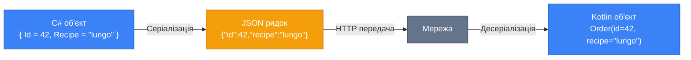
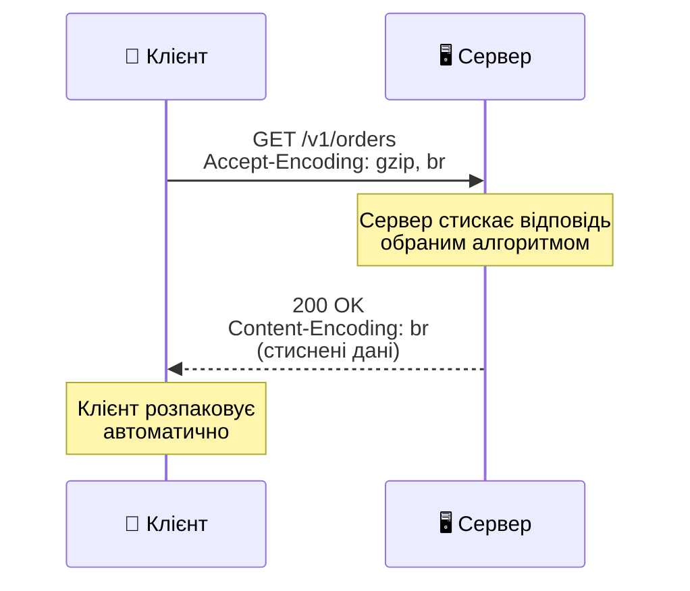

# Формати даних: JSON, XML, TOML та бінарні формати

::note
У попередній статті ми визначили, що API — це контракт між клієнтом і сервером. Але контракт має бути записаний _якоюсь мовою_. У цій статті ми вивчимо «мови», якими клієнт і сервер обмінюються даними — від людиночитаємого JSON до надшвидких бінарних форматів.
::

## 1. Проблема: Як передати об'єкт по мережі?

Уявімо, що наш сервіс замовлення кави обробляє запит і формує об'єкт у пам'яті:

```csharp [Program.cs]
var order = new
{
    Id = 42,
    Recipe = "lungo",
    Volume = "300ml",
    Price = new { Amount = 10.23m, Currency = "UAH" },
    CreatedAt = DateTime.UtcNow
};
```

Цей об'єкт живе у пам'яті .NET-процесу. Але клієнт — мобільний додаток на Swift або Kotlin — працює в абсолютно іншому середовищі. Він не може прочитати пам'ять .NET.

Потрібен спосіб перетворити об'єкт у послідовність байтів (або символів), яку можна:
1. **Передати** по мережі (через HTTP).
2. **Прочитати** на іншому боці, в іншій мові програмування.
3. **Відновити** до структури даних нативної для тієї мови.

Цей процес називається **серіалізація** (Serialization) — перетворення об'єкта у формат для передачі — та **десеріалізація** (Deserialization) — зворотне відновлення.

::mermaid



::

Питання — _у якому форматі_ серіалізувати? Від цього вибору залежить швидкість, зручність розробки та сумісність систем.

---

## 2. JSON — формат за замовчуванням

**JSON** (JavaScript Object Notation) — це текстовий формат серіалізації даних, який став _стандартом де-факто_ для HTTP API. Попри назву, JSON давно не прив'язаний до JavaScript і використовується у всіх мовах програмування.

### Синтаксис JSON

JSON підтримує шість типів даних:

```json [Приклад JSON-документа]
{
  "id": 42,
  "recipe": "lungo",
  "is_ready": false,
  "volume_ml": 300,
  "price": 10.23,
  "ingredients": ["water", "coffee"],
  "machine": {
    "id": "cm-001",
    "location": "Київ, вул. Хрещатик, 1"
  },
  "completed_at": null
}
```

| Тип | Приклад | Примітка |
|:---|:---|:---|
| Рядок (string) | `"lungo"` | Завжди у подвійних лапках |
| Число (number) | `42`, `10.23` | Без розділення на int/float |
| Булевий (boolean) | `true`, `false` | Тільки lowercase |
| Null | `null` | Відсутність значення |
| Масив (array) | `[1, 2, 3]` | Упорядкований набір |
| Об'єкт (object) | `{"key": "value"}` | Неупорядкований набір пар |

::warning
**Критична увага до чисел:** JSON не розрізняє цілі числа та числа з плаваючою крапкою — все це просто `number`. Стандарт також _не обмежує_ довжину чисел, але на практиці більшість парсерів використовують 64-бітний `double`, що дає лише ~15–17 значущих десяткових цифр. **Для грошових сум та інших точних дробових чисел завжди використовуйте рядки або цілі числа з множником** (наприклад, передавайте суму в копійках):

```json
{
  "price_wrong": 10.23,
  "price_correct": "10.23",
  "price_as_cents": 1023
}
```

Це правило прямо з книги Константинова (правило 22: «Зберігайте точність дробових чисел»).
::

### Серіалізація JSON у Minimal API

ASP.NET Core Minimal API має вбудовану серіалізацію JSON за допомогою `System.Text.Json`:

```csharp [Program.cs]
var app = WebApplication.Create(args);

app.MapGet("/v1/orders/{id}", (int id) =>
{
    // ASP.NET Core автоматично серіалізує
    // анонімний об'єкт у JSON
    return Results.Ok(new
    {
        id,
        recipe = "lungo",
        volume_ml = 300,
        price = "10.23",   // рядок для точності!
        currency = "UAH",
        is_ready = false
    });
});

app.Run();
```

Відповідь сервера:

```http
HTTP/1.1 200 OK
Content-Type: application/json

{"id":1,"recipe":"lungo","volume_ml":300,"price":"10.23","currency":"UAH","is_ready":false}
```

::tip
**Чому `Results.Ok()` а не просто `return object`?** Метод `Results.Ok()` явно задає статус-код `200 OK` і серіалізує об'єкт у JSON. Ви також можете повернути об'єкт напряму — Minimal API серіалізує його автоматично — але явний `Results.Ok()` робить код читабельнішим і дозволяє контролювати статус-коди.
::

### Переваги JSON

Чому саме JSON став стандартом для HTTP API, а не, скажем, XML чи бінарний формат?

::card-group

::card{title="👁️ Людиночитаємість" icon="i-lucide-eye"}
JSON текстовий і _не потребує_ додаткової розшифровки. Імена полів включені у сам документ. Ви відкриваєте відповідь API і одразу бачите структуру даних.
::

::card{title="📐 Формальність" icon="i-lucide-ruler"}
JSON немає конструкцій, які можна по-різному інтерпретувати в різних мовах. Масиви, об'єкти, рядки, числа — це нативні структури _будь-якої_ мови програмування.
::

::card{title="🌍 Універсальність" icon="i-lucide-globe"}
JSON підтримується в кожній мові та кожному фреймворку. Розробник Python, Go, Java, C# — усі знають JSON.
::

::card{title="🪶 Легкість" icon="i-lucide-feather"}
Порівняно з XML, JSON значно компактніший за рахунок відсутності закриваючих тегів та атрибутів.
::

::

---

## 3. XML — на випадок, якщо зустрінете

**XML** (eXtensible Markup Language) — це формат, який домінував у API до ери JSON. Сьогодні XML у нових API зустрічається рідко, але ви точно стикнетесь з ним у SOAP-сервісах, корпоративних інтеграціях та конфігураційних файлах.

```xml [Той самий об'єкт у XML]
<?xml version="1.0" encoding="UTF-8"?>
<order>
  <id>42</id>
  <recipe>lungo</recipe>
  <isReady>false</isReady>
  <volumeMl>300</volumeMl>
  <price currency="UAH">10.23</price>
  <ingredients>
    <ingredient>water</ingredient>
    <ingredient>coffee</ingredient>
  </ingredients>
  <machine>
    <id>cm-001</id>
    <location>Київ, вул. Хрещатик, 1</location>
  </machine>
</order>
```

### JSON vs XML: Порівняння

| Аспект | JSON | XML |
|:---|:---|:---|
| Читабельність | Висока | Середня (багато тегів) |
| Розмір | Компактний | Великий (закриваючі теги) |
| Типізація | Слабка (number, string, bool, null) | Через XML Schema (потужна, але складна) |
| Коментарі | ❌ Не підтримує | ✅ `<!-- коментар -->` |
| Атрибути | ❌ Тільки пари ключ-значення | ✅ `<price currency="UAH">` |
| Простір імен | ❌ Немає | ✅ `xmlns:` (для уникнення колізій) |
| Парсинг у браузері | Нативна підтримка (`JSON.parse`) | Потребує DOMParser |

::note
**Чому XML програв?** Не тому, що він «поганий» — XML має потужні можливості (схеми, простори імен, XSLT-трансформації). Але для типового API ці можливості надлишкові, а «ціна» в байтах — занадто висока. JSON виграв завдяки _простоті та достатності_ для 95% задач.
::

---

## 4. TOML — конфігурації та метадані

**TOML** (Tom's Obvious Minimal Language) — це формат, спроєктований спеціально для конфігураційних файлів. Він _не використовується_ для передачі даних між клієнтом і сервером у HTTP API, але часто зустрічається в конфігурації сервісів, CI/CD та інструментів розробки.

```toml [Приклад TOML-файла]
# Це конфігурація API-сервера
[server]
host = "0.0.0.0"
port = 5000
environment = "production"

[database]
connection_string = "Host=localhost;Database=coffee"
max_pool_size = 20
enable_logging = false

[rate_limiting]
requests_per_minute = 100
burst_size = 20

# Масив таблиць — список ендпоінтів
[[endpoints]]
path = "/v1/orders"
methods = ["GET", "POST"]
auth_required = true

[[endpoints]]
path = "/v1/recipes"
methods = ["GET"]
auth_required = false
```

### Чому TOML, а не JSON?

| Аспект | JSON | TOML |
|:---|:---|:---|
| Коментарі | ❌ Не підтримує | ✅ `# коментар` |
| Дати | Рядок (`"2024-01-15"`) | Нативний тип (`2024-01-15T10:30:00Z`) |
| Багаторядкові рядки | ❌ Потрібно `\n` | ✅ `"""..."""` |
| Де використовувати | API, обмін даними | Конфігурації, метадані |

::tip
**Де ви зустрінете TOML:**
- `Cargo.toml` (Rust)
- `pyproject.toml` (Python)
- Конфігурації CI/CD (GitLab CI, тощо)
- Файли налаштувань сервісів

У контексті HTTP API TOML може використовуватися для _конфігурації_ самого API-сервера, але _не_ для передачі даних між клієнтом і сервером.
::

---

## 5. Бінарні формати: Protobuf, FlatBuffers, Avro

Текстові формати (JSON, XML) зручні для людей, але не оптимальні для машин. Коли кожний мілісекунда на рахунку — на допомогу приходять бінарні формати серіалізації.

### Protocol Buffers (Protobuf)

**Protocol Buffers** — це бінарний формат від Google, який є основою gRPC. Дані описуються через `.proto`-файл (схему), після чого генерується код для серіалізації/десеріалізації.

```protobuf [order.proto]
syntax = "proto3";

message Order {
  int32 id = 1;
  string recipe = 2;
  int32 volume_ml = 3;
  string price = 4;
  string currency = 5;
  bool is_ready = 6;
}
```

Цей файл компілюється у C#-класи, які автоматично серіалізують/десеріалізують дані у компактний бінарний формат.

### Порівняння форматів

| Аспект | JSON | Protobuf | FlatBuffers |
|:---|:---|:---|:---|
| Тип | Текстовий | Бінарний | Бінарний |
| Людиночитаємий | ✅ Так | ❌ Ні | ❌ Ні |
| Потребує схему | ❌ Ні | ✅ `.proto`-файл | ✅ `.fbs`-файл |
| Розмір (без стискання) | Великий | Малий | Найменший |
| Швидкість парсингу | Середня | Висока | Найвища (zero-copy) |
| Кодогенерація | Необов'язкова | Обов'язкова | Обов'язкова |

::warning
**Важливе зауваження з книги Константинова:** повідомлення у форматі Protobuf _неможливо прочитати_ без `.proto`-файлу. Натомість JSON-документ майже завжди можна зрозуміти, просто переглянувши його. Саме тому JSON є вибором за замовчуванням для _публічних_ API. Бінарні формати доцільні для внутрішніх мікросервісних комунікацій, де продуктивність критична, а обидві сторони контролюються однією командою.
::

---

## 6. Стиснення JSON: gzip, brotli, deflate

Частий аргумент проти JSON — його надлишковість: імена полів повторюються для кожного об'єкта в масиві, багато технічних символів (лапки, дужки, коми). Але цей аргумент має важливе застереження: **він справедливий лише якщо ми не використовуємо стиснення**.

### Як працює стиснення в HTTP

Протокол HTTP має вбудовану підтримку стиснення через заголовки `Accept-Encoding` та `Content-Encoding`:

::mermaid



::

### Алгоритми стиснення

::tabs

::tabs-item{label="gzip"}
**gzip** — найпоширеніший алгоритм стиснення для HTTP. Підтримується _усіма_ браузерами та HTTP-клієнтами. Стискає текстовий JSON у 5–10 разів.

```csharp [Увімкнення gzip у Minimal API]
var builder = WebApplication.CreateBuilder(args);

// Додаємо middleware стиснення відповідей
builder.Services.AddResponseCompression(options =>
{
    options.EnableForHttps = true;
});

var app = builder.Build();
app.UseResponseCompression();

app.MapGet("/v1/orders", () =>
{
    // Відповідь буде автоматично стиснута,
    // якщо клієнт надіслав Accept-Encoding: gzip
    return Results.Ok(new[] 
    {
        new { id = 1, recipe = "lungo" },
        new { id = 2, recipe = "americano" },
        // ... тисячі замовлень
    });
});

app.Run();
```

::

::tabs-item{label="Brotli (br)"}
**Brotli** — сучасний алгоритм від Google, спеціально оптимізований для текстових даних (HTML, CSS, JSON). Стискає на **15–25% краще** ніж gzip, але працює повільніше при компресії.

```csharp [Увімкнення Brotli у Minimal API]
using System.IO.Compression;

var builder = WebApplication.CreateBuilder(args);

builder.Services.AddResponseCompression(options =>
{
    options.EnableForHttps = true;
    // Надаємо пріоритет Brotli над gzip
    options.Providers.Add<BrotliCompressionProvider>();
    options.Providers.Add<GzipCompressionProvider>();
});

builder.Services.Configure<BrotliCompressionProviderOptions>(
    options => options.Level = CompressionLevel.Optimal
);

var app = builder.Build();
app.UseResponseCompression();

app.MapGet("/v1/orders", () =>
    Results.Ok(new[] 
    {
        new { id = 1, recipe = "lungo" },
        new { id = 2, recipe = "americano" }
    })
);

app.Run();
```

::

::tabs-item{label="deflate"}
**deflate** — базовий алгоритм, на якому побудовано gzip. Рідко використовується безпосередньо, оскільки gzip додає метадані та контрольну суму. Більшість сучасних API використовують gzip або brotli.
::

::

### Ефективність стиснення: числа

Дослідження показують, що **gzip практично нівелює різницю** у розмірі між JSON та бінарними форматами (Protobuf):

| Формат | Без стиснення | gzip | Brotli |
|:---|:---|:---|:---|
| JSON (100 замовлень) | ~45 KB | ~4.5 KB | ~3.8 KB |
| Protobuf (100 замовлень) | ~12 KB | ~4.0 KB | ~3.5 KB |
| Різниця | **3.7x** | **~10%** | **~8%** |

::tip
**Висновок з книги Константинова:** різниця 8-10% після стиснення — це мізер для абсолютної більшості API. Реальний виграш від переходу на бінарні формати виявиться незначним. Обирайте Protobuf або FlatBuffers лише тоді, коли ваш сервіс обробляє _сотні тисяч_ запитів на секунду і кожен байт на рахунку. Для інших випадків — JSON + gzip/brotli більш ніж достатньо.
::

### Високопродуктивний парсинг: simdjson

Ще один аргумент проти JSON — «повільна десеріалізація». Стандартні парсери дійсно програють бінарним форматам. Але існують оптимізовані парсери, такі як **simdjson**, які використовують SIMD-інструкції процесора для паралельного аналізу JSON.

simdjson здатний парсити **гігабайти JSON за секунду** — продуктивність, якої не вистачить лише екзотичним високочастотним системам.

::note
Комбінація **gzip/brotli + оптимізований парсер** робить JSON конкурентоспроможним навіть з бінарними форматами у більшості реальних сценаріїв. Це не означає, що бінарні формати непотрібні — але їхня перевага проявляється лише у крайніх випадках.
::

---

## 7. Content Negotiation: як клієнт і сервер домовляються

HTTP має вбудований механізм для узгодження формату даних — **Content Negotiation**. Клієнт повідомляє серверу, які формати він розуміє, через заголовок `Accept`:

```http
GET /v1/orders/42 HTTP/1.1
Accept: application/json
Accept-Encoding: gzip, br
```

Сервер відповідає у запрошеному форматі та вказує його у `Content-Type`:

```http
HTTP/1.1 200 OK
Content-Type: application/json; charset=utf-8
Content-Encoding: br

{"id": 42, "recipe": "lungo"}
```

У Minimal API це працює автоматично для JSON. Якщо вам потрібно підтримати кілька форматів:

```csharp [Підтримка JSON та XML]
var builder = WebApplication.CreateBuilder(args);

// Додаємо підтримку XML-серіалізації
builder.Services.AddEndpointsApiExplorer();

var app = builder.Build();

app.MapGet("/v1/orders/{id}", (int id, HttpContext ctx) =>
{
    var order = new OrderResponse(id, "lungo", 300);

    // Перевіряємо, що хоче клієнт
    var accept = ctx.Request.Headers.Accept
        .FirstOrDefault() ?? "";

    if (accept.Contains("application/xml"))
    {
        // Повертаємо XML
        return Results.Content(
            $"<order><id>{id}</id></order>",
            "application/xml"
        );
    }

    // За замовчуванням — JSON
    return Results.Ok(order);
});

app.Run();

record OrderResponse(int Id, string Recipe, int VolumeMl);
```

::tip
**Порада:** у 99% сучасних API достатньо підтримувати лише JSON. Підтримка XML має сенс лише для зворотної сумісності зі старими клієнтами або корпоративними інтеграціями (SOAP).
::

---

## 8. Практичні завдання

### Рівень 1: Базовий

::accordion

::accordion-item{label="Завдання 2.1: Знайдіть помилки в JSON" icon="i-lucide-circle-help"}
Наступний JSON-документ містить 5 помилок. Знайдіть їх та виправте:

```json
{
  'name': "Лунго",
  "price": 10.23,
  "ingredients": ["water", "coffee",],
  "machine_id": 001,
  "is_available": True,
  "description": "Довгий еспресо
    з великим об'ємом води"
}
```

::

::accordion-item{label="Завдання 2.2: Серіалізуйте об'єкт" icon="i-lucide-circle-help"}
Створіть Minimal API ендпоінт `GET /v1/machines/{id}`, який повертає інформацію про кавову машину:

- `id` (число)
- `brand` (рядок)
- `model` (рядок)
- `location` (об'єкт з полями `latitude` та `longitude` як рядки)
- `supported_recipes` (масив рядків)
- `is_active` (булевий)
- `price_per_cup` (рядок, бо це гроші!)
::

::

### Рівень 2: Порівняльний

::accordion

::accordion-item{label="Завдання 2.3: JSON vs XML — розмір" icon="i-lucide-circle-help"}
Запишіть наступну структуру даних у форматі JSON та XML. Порахуйте кількість символів у кожному варіанті (без пробілів та переносів рядків):

**Дані:** Список із 3 рецептів, кожен має: id, назву, об'єм (мл), ціну, список інгредієнтів.

Дайте відповідь: на скільки відсотків XML більший за JSON?
::

::accordion-item{label="Завдання 2.4: Стиснення на практиці" icon="i-lucide-circle-help"}
Створіть Minimal API з увімкненим Response Compression (gzip та Brotli). Створіть ендпоінт, що повертає масив із 100 однотипних об'єктів. Порівняйте розмір відповіді з компресією та без неї, використовуючи DevTools в браузері або Postman.
::

::

### Рівень 3: Проєктування

::accordion

::accordion-item{label="Завдання 2.5: Обґрунтуйте вибір формату" icon="i-lucide-circle-help"}
Для кожного з наступних сценаріїв оберіть оптимальний формат і обґрунтуйте вибір:

1. Публічне API погодного сервісу для мобільних додатків
2. Внутрішній мікросервіс обробки платежів (100k запитів/с)
3. Конфігурація CI/CD pipeline з коментарями
4. Обмін даними між IoT-датчиками та сервером (обмежений трафік)
5. API для інтеграції з банківською SOAP-системою 2010 року
::

::

---

## 9. Резюме

::card-group

::card{title="JSON — стандарт для HTTP API" icon="i-lucide-braces"}
Людиночитаємий, формальний, універсальний. Єдиний формат, за яким можна зрозуміти структуру даних без зовнішньої схеми.
::

::card{title="Гроші — тільки рядки" icon="i-lucide-banknote"}
Дробові числа у JSON мають обмежену точність. Для грошових сум використовуйте рядки або цілі числа з множником.
::

::card{title="Стиснення вирівнює шанси" icon="i-lucide-minimize-2"}
gzip/brotli зменшують різницю між JSON та бінарними форматами до 8–10%. Для більшості API цього достатньо.
::

::card{title="Формат = контекст" icon="i-lucide-settings-2"}
JSON для публічних API, Protobuf/gRPC для внутрішніх high-performance сервісів, TOML для конфігурацій, XML для legacy-інтеграцій.
::

::

**Далі:** у наступній статті ми заглибимось у **парадигми клієнт-серверних API** — від RPC першого покоління до REST та сучасних технологій (gRPC, GraphQL). Розберемо, чому термін «REST API» неточний і що насправді означає «HTTP API».
