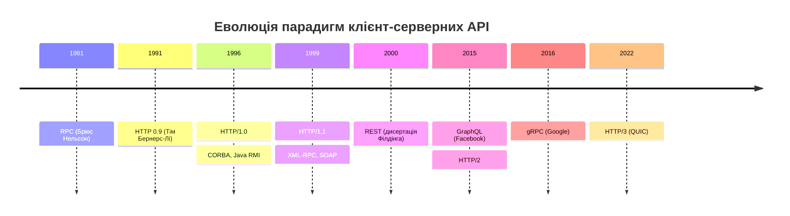
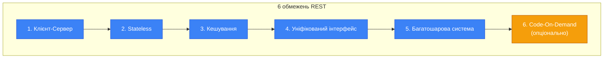

# Парадигми API та концепція REST

::note
Ця стаття — одна з ключових у модулі. Перш ніж проєктувати API, потрібно зрозуміти _філософію_ за ним: чому HTTP-запити виглядають саме так, чому REST — це скоріше набір обмежень, ніж стандарт, і чому термін «REST API» — найбільше джерело «холіварів» серед програмістів.
::

## 1. Історична довідка: Як з'явились мережеві API

Виконання запитів на віддаленому сервері — одна з базових задач у програмуванні ще від часів мейнфреймів. З появою мереж ARPANET (попередника Інтернету) теоретики швидко дійшли до думки: було б зручно, якби виклик функції на віддаленому сервері _з точки зору коду_ нічим не відрізнявся від виклику локальної функції.

Цю концепцію у 1981 році формалізував **Брюс Нельсон** з лабораторії Xerox PARC під назвою **Remote Procedure Call (RPC)** — і він же був співавтором першої практичної реалізації (Sun RPC, який існує і сьогодні під назвою ONC RPC).

### RPC першого покоління: зручність ≠ продуктивність

Перші широко розповсюджені RPC-протоколи — Sun RPC, Java RMI, CORBA — дозволяли працювати з віддаленими викликами як з локальними. Вся «магія» була сховано всередині обв'язки (stub), яку генерував фреймворк.

Звучить ідеально? Але саме ця зручність стала ахіллесовою п'ятою:

::card-group

::card{title="🔗 Жорстка прив'язка" icon="i-lucide-link-2"}
RPC першого покоління диктували вибір мови та платформи. Sun RPC не працював на Windows. Java RMI вимагав JVM. CORBA теоретично підтримувала будь-яку мову, але на практиці це було надзвичайно складно.
::

::card{title="🐌 Складність проксіювання" icon="i-lucide-server-crash"}
Для перенаправлення RPC-запиту потрібно прочитати і розібрати все тіло запиту — це ресурсомістко. На відміну від HTTP, де метадані (URL, заголовки) можна прочитати _без_ розбору тіла.
::

::card{title="📈 Проблеми масштабування" icon="i-lucide-trending-down"}
Можливість адресувати об'єкти у пам'яті віддаленого сервера накладала величезні обмеження на масштабування.
::

::card{title="🏗️ Складність протоколу" icon="i-lucide-puzzle"}
Вимога працювати з віддаленими викликами як з локальними призводила до високої складності протоколу через необхідність підтримувати можливості високорівневих мов програмування.
::

::

---

## 2. Поява HTTP та зміна парадигми

Паралельно з кризою RPC першого покоління відбувається стандартизація мережевих протоколів. Стек TCP/IP стає домінуючим. Але TCP/IP має суттєвий недолік з прикладної точки зору — він оперує IP-адресами, які люди не запам'ятовують.

Зручною абстракцією стала **система доменних імен (DNS)**, а для передачі гіпертексту Тім Бернерс-Лі у 1991 році створив **HTTP 0.9** — простий протокол для отримання документів. Він дозволяв відкрити TCP-з'єднання з сервером і передати рядок на кшталт `GET адреса_документа`.

Згодом HTTP стрімко розвивався: з'явились нові методи (POST, PUT, DELETE), статус-коди, заголовки, типи даних. HTML еволюціонував у XML, а потім у JSON як формати для API.

::mermaid



::

HTTP виявився ідеологічно протилежним до RPC: він **не передбачав** ні нативної обв'язки для викликів, ні розділеного доступу до пам'яті. Натомість запропонував надзвичайно зручні концепції:

- **Кешування** «з коробки» через заголовки
- **Прозорі проксі** — проміжні вузли, що не впливають на протокол
- **URL** — зрозуміла та стандартизована адресація ресурсів

### Переворот: від процедур до ресурсів

У середині 1990-х відбувається поступова відмова від RPC першого покоління на користь нового підходу, де стосунки між даними та операціями перевертаються з ніг на голову:

| Аспект | RPC (процедурний) | Ресурсоорієнтований (HTTP) |
|:---|:---|:---|
| Одиниця доступу | Ім'я операції (функції) | Адреса ресурсу (URL) |
| Набір операцій | Довільний, визначений розробником | Лімітований, стандартизований (GET, POST...) |
| Стан | Може зберігатися на сервері | Клієнт і сервер _принципово_ не мають спільного стану |
| Проміжні вузли | Ускладнюють роботу | Прозорі (прокси, гейтвеї не впливають на протокол) |
| Кешування | Кастомне рішення | Стандартне, через заголовки HTTP |

```csharp [RPC-стиль — виклик процедури]
// ❌ RPC-підхід: URL описує ДІЮ
// POST /api/createOrder
// POST /api/getOrderById
// POST /api/cancelOrder

app.MapPost("/api/createOrder", (CreateOrderRequest req) =>
{
    // Проблема: всі операції через POST,
    // URL не відображає ресурси,
    // неможливо кешувати
    return Results.Ok(new { id = 42 });
});
```

```csharp [REST-стиль — операція над ресурсом]
// ✅ Ресурсоорієнтований підхід: URL описує РЕСУРС
// POST   /v1/orders      → створити
// GET    /v1/orders/42    → отримати
// DELETE /v1/orders/42    → скасувати

app.MapPost("/v1/orders", (CreateOrderRequest req) =>
{
    // Метод HTTP визначає операцію
    // URL ідентифікує ресурс
    // GET-запити можна кешувати автоматично
    return Results.Created("/v1/orders/42", new { id = 42 });
});
```

---

## 3. REST: Що насправді написав Філдінг

У 2000 році один із авторів специфікації HTTP — **Рой Філдінг** — захистив докторську дисертацію «Архітектурні стилі та дизайн архітектури мережевого програмного забезпечення». П'ята глава мала назву **«Representational State Transfer (REST)»**.

::warning
**Критично важливо зрозуміти:** дисертація Філдінга — це _абстрактний_ огляд розподіленої мережевої архітектури. Вона **не прив'язана** ні до HTTP, ні до URL. Вона **не присвячена** правилам дизайну API. Філдінг методично _перераховує обмеження_, з якими стикається розробник розподіленого мережевого ПЗ.
::

### Шість обмежень REST

::steps

### 1. Клієнт-серверна архітектура

Клієнт і сервер не знають внутрішнього устрою один одного. Це забезпечує незалежну еволюцію обох сторін.

### 2. Stateless (без стану)

Сесія зберігається на клієнті. Кожен запит від клієнта повинен містити _всю_ інформацію, необхідну для його обробки. Сервер не зберігає контексту між запитами.

### 3. Кешування

Дані повинні розмічатися як кешовані або некешовані. Це дозволяє клієнту та проміжним проксі зберігати відповіді, зменшуючи навантаження на сервер.

### 4. Уніфікований інтерфейс

Інтерфейси взаємодії між компонентами повинні бути стандартизовані. Саме тому HTTP визначає фіксований набір методів (GET, POST, PUT, DELETE), а не довільні процедури.

### 5. Багатошарова система

Мережеві системи є багатошаровими — сервер може бути лише проксі до інших серверів. Клієнт не повинен знати, чи спілкується він безпосередньо з сервером, чи з проміжним вузлом.

### 6. Code-On-Demand (опціонально)

Функціональність клієнта може бути розширена через поставку коду з сервера (наприклад, JavaScript у браузері).

::

::mermaid



::

---

## 4. Міфологія REST: Чому «REST API» — неточний термін

::caution
**Увага:** Ця частина може здивувати, але вона дуже важлива для вашого професійного розвитку. Більшість того, що ви читали про REST в інтернеті — це спрощення або помилки.
::

Ключовий висновок із визначення REST за Філдінгом-2000: **практично _будь-яке_ мережеве ПЗ у світі відповідає принципам REST**, за дуже рідкісними винятками.

Справді:
- Складно уявити систему без _хоч якоїсь_ стандартизації взаємодії (хоча б TCP/IP)
- Якщо є інтерфейс, під нього завжди можна мімікрувати → клієнт і сервер незалежні
- Якщо можна зробити альтернативну реалізацію сервера → можна поставити проксі → багатошаровість
- Клієнт — обчислювальна машина → завжди зберігає _якийсь_ стан і кешує _якісь_ дані

### Ще більше плутанини: Філдінг-2008

У 2008 році Філдінг випустив роз'яснення, де додав ще суворіші вимоги:

- Клієнт _взагалі нічого_ не повинен знати про API наперед
- Не повинно бути фіксованих шаблонів URL — клієнт має отримувати посилання з відповідей сервера (концепція **HATEOAS** — Hypermedia As The Engine Of Application State)

::note
**З книги Константинова:** «Жодна існуюча система у світі не відповідає опису REST за Філдінгом-2008». Термін «REST API» не несе конкретного сенсу — це «химера», породжена редукцією абстракцій Філдінга в умах мільйонів програмістів. Ми будемо використовувати термін **«HTTP API»** як більш точний і практичний.
::

### Що ми маємо на увазі під HTTP API

У цьому модулі **HTTP API** означає:
1. Протоколом є HTTP версії 1.1 і вище
2. Форматом даних є JSON
3. Ідентифікаторами ресурсів є URL відповідно до стандарту
4. Семантика HTTP-дієслів (методів) відповідає специфікації
5. Жодні веб-стандарти не порушуються навмисно

```csharp [Це — HTTP API]
var app = WebApplication.Create(args);

// URL ідентифікує ресурс: замовлення з id=42
// GET — семантика «отримати»
// Відповідь у JSON
app.MapGet("/v1/orders/{id}", (int id) =>
    Results.Ok(new 
    { 
        id, 
        recipe = "lungo",
        status = "processing" 
    }));

// POST — семантика «створити»
// Content-Type: application/json
app.MapPost("/v1/orders", (OrderRequest req) =>
    Results.Created($"/v1/orders/42", new { id = 42 }));

app.Run();

record OrderRequest(string Recipe, string CoffeeMachineId);
```

---

## 5. Сучасні альтернативи: gRPC, GraphQL

Починаючи з кінця 2010-х ми спостерігаємо розквіт **RPC-технологій нового покоління** — або, точніше, комбінованих технологій, які одночасно:
- **Зручні** — поставляються з обв'язкою для кодогенерації
- **Інтероперабельні** — працюють поверх стандартизованих протоколів
- **Масштабовані** — абстрагують поняття ресурсу

### gRPC

**gRPC** — класична технологія другого покоління від Google:

::card-group

::card{title="✅ Переваги" icon="i-lucide-check-circle"}
- Використовує HTTP/2 та ефективний Protobuf
- Contract-first: розробка починається зі специфікації `.proto`
- Кодогенерація для зручної роботи
- Висока продуктивність
::

::card{title="❌ Недоліки" icon="i-lucide-x-circle"}
- Складність налагодження (бінарний формат)
- Слабка підтримка браузерів
- Менша поширеність → вищий поріг входу
- Потенційна залежність від Google
::

::

```protobuf [Приклад gRPC сервісу]
// coffee_service.proto
syntax = "proto3";

service CoffeeService {
  // RPC-стиль: ім'я операції
  rpc CreateOrder(CreateOrderRequest) 
    returns (OrderResponse);
  rpc GetOrder(GetOrderRequest) 
    returns (OrderResponse);
}

message CreateOrderRequest {
  string recipe = 1;
  string coffee_machine_id = 2;
}

message OrderResponse {
  int32 id = 1;
  string status = 2;
}
```

### GraphQL

**GraphQL** від Facebook — підхід, що об'єднує концепцію «ресурсів» з надзвичайно багатою мовою запитів:

```graphql
# Клієнт точно вказує, які поля потрібні
query {
  order(id: 42) {
    id
    recipe
    status
    machine {
      location
    }
  }
}
```

::tip
**Основна область застосування GraphQL** — насичені різнорідними даними предметні області (соціальні мережі, e-commerce з багатьма зв'язками). Надання _зовнішніх_ GraphQL API поки що екзотика, оскільки з ростом кількості даних GraphQL-сервісом стає дуже складно управляти.
::

### Порівняння технологій

| Аспект | HTTP API (JSON) | gRPC | GraphQL |
|:---|:---|:---|:---|
| Формат даних | JSON (текстовий) | Protobuf (бінарний) | JSON (текстовий) |
| Протокол | HTTP/1.1+ | HTTP/2 | HTTP/1.1+ |
| Підхід | Ресурсоорієнтований | Contract-first RPC | Мова запитів |
| Фіксований набір полів | Так (весь ресурс) | Так (за `.proto`) | Ні (клієнт обирає) |
| Кешування HTTP | Стандартне | Обмежене | Складне |
| Стрімінг | SSE, WebSocket | Вбудований (bidirectional) | Subscriptions |
| Порог входу | Низький | Середній | Середній–Високий |
| Інструменти | Найбільша екосистема | Google-екосистема | Facebook-екосистема |

### Принциповий висновок

Фактично, **ідеологічна різниця** між сучасним HTTP API та сучасним RPC зводиться до двох речей:

1. **Адресація:** в HTTP API одиницею доступу є _ресурс_ (а параметри операції передаються додатково), в RPC — _ім'я операції_ (а адреси ресурсів передаються додатково)
2. **Кешування:** HTTP API стандартно розмічає кешовані дані, RPC — як правило, ні

І головне: **майже всі сучасні протоколи працюють поверх HTTP**. Тому gRPC _одночасно_ є HTTP API (в технічному сенсі використання протоколу HTTP).

---

## 6. Вибір технології: Коли що використовувати

::card-group

::card{title="HTTP API (JSON)" icon="i-lucide-globe"}
**Коли:** Публічні API, мобільні та веб-клієнти, інтеграція з партнерами.
**Чому:** Зрозумілий максимально широкому колу розробників, працює скрізь.
::

::card{title="gRPC" icon="i-lucide-zap"}
**Коли:** Внутрішні мікросервіси, server-to-server комунікація, high-performance системи.
**Чому:** Висока продуктивність, кодогенерація, типобезпека.
::

::card{title="GraphQL" icon="i-lucide-search"}
**Коли:** Насичені даними клієнтські додатки (dashboard-и, соцмережі), внутрішні API з багатьма зв'язками.
**Чому:** Клієнт сам обирає потрібні дані, зменшуючи кількість запитів.
::

::

::warning
**З книги Константинова:** Для публічних API надання JSON-over-HTTP ендпоінтів є _вибором за замовчуванням_. Практика надання публічних API у форматі gRPC поступово набирає популярності, але поки що незначна на загальному фоні. Проблема вибору технології виникає лише для _непублічних_ API загального призначення.
::

---

## 7. Головна перевага HTTP API: Промежуточні агенти

Чому HTTP API вижив, коли з'явились «швидші» та «зручніші» альтернативи? Відповідь — у **промежуточних агентах**.

Сучасний стек взаємодії між клієнтом і сервером — багатошаровий:

::mermaid


::

Кожен із цих проміжних агентів може **читати метадані HTTP** (URL, заголовки, статус-коди) _без_ розбору тіла запиту, і автоматично:
- **Кешувати** відповіді (CDN, проксі)
- **Логувати** запити (nginx access logs → Prometheus → Grafana)
- **Балансувати** навантаження
- **Шардувати** дані за URL
- **Налаштовувати** таймаути та retry-політики

Для RPC-протоколів, де вся інформація захована в тілі запиту, жоден із цих агентів не зможе «зрозуміти» запит без спеціальної підтримки протоколу.

::tip
**Головний принцип HTTP API (з книги Константинова):** краще проєктувати API так, щоб **промежуточні агенти могли читати та інтерпретувати метадані** запиту і відповіді.
::

---

## 8. Практичні завдання

### Рівень 1: Базовий

::accordion

::accordion-item{label="Завдання 3.1: RPC vs REST — перетворення" icon="i-lucide-circle-help"}
Перепишіть наступні RPC-стилі ендпоінти у ресурсоорієнтований стиль HTTP API на Minimal API:

```
POST /api/getUserProfile   {"user_id": 15}
POST /api/updateUserEmail  {"user_id": 15, "email": "new@test.com"}
POST /api/deleteUser       {"user_id": 15}
POST /api/listUserOrders   {"user_id": 15, "page": 1}
```

Напишіть код на C# (Minimal API), використовуючи правильні HTTP-методи та URL-структуру.
::

::accordion-item{label="Завдання 3.2: Визначте парадигму" icon="i-lucide-circle-help"}
Для кожного з наступних API визначте, до якої парадигми (HTTP API / gRPC / GraphQL) воно належить:

1. `POST /graphql` з тілом `{"query": "{ user(id: 1) { name } }"}`
2. `GET /v1/users/1` → `{"id": 1, "name": "Alice"}`
3. `.proto` файл із `service UserService { rpc GetUser(...) }`
4. `PATCH /v1/users/1` з тілом `{"name": "Bob"}`
5. `POST /api/users.getProfile` з тілом `{"user_id": 1}`
::

::

### Рівень 2: Аналітичний

::accordion

::accordion-item{label="Завдання 3.3: Обмеження Філдінга" icon="i-lucide-circle-help"}
Для кожного з 6 обмежень REST наведіть конкретний приклад з реального API (GitHub, Twitter, Stripe), де це обмеження дотримується або порушується. Обґрунтуйте.
::

::accordion-item{label="Завдання 3.4: Аргументуйте вибір технології" icon="i-lucide-circle-help"}
Ваша команда обговорює технологію для нового проєкту — платформи доставки їжі. Є три мікросервіси:

1. **API для мобільного додатку** (замовлення, меню, відстеження)
2. **Внутрішній сервіс оплати** (100к транзакцій/с)
3. **Dashboard для адміністраторів** (складні звіти з багатьма зв'язками)

Для кожного сервісу оберіть технологію та обґрунтуйте.
::

::

---

## 9. Резюме

::card-group

::card{title="Від RPC до REST" icon="i-lucide-git-branch"}
RPC першого покоління (Sun RPC, CORBA) були зручними, але створювали жорстку залежність між клієнтом і сервером. HTTP та ресурсоорієнтований підхід вирішили це.
::

::card{title="REST — обмеження, не стандарт" icon="i-lucide-shield"}
REST за Філдінгом — це 6 абстрактних обмежень, а не набір конкретних правил для URL-ів. Термін «REST API» — неформальний і не несе конкретного сенсу.
::

::card{title="HTTP API — наш термін" icon="i-lucide-bookmark"}
JSON-over-HTTP ендпоінти, що використовують семантику HTTP (методи, статус-коди, URL) відповідно до стандартів. Це те, що більшість людей _насправді_ мають на увазі, кажучи «REST API».
::

::card{title="Альтернативи мають свою нішу" icon="i-lucide-layout-grid"}
gRPC — для internal high-performance. GraphQL — для складних data-driven UI. HTTP API — вибір за замовчуванням для публічних сервісів.
::

::

**Далі:** у наступній статті ми детально розберемо **складові HTTP-запитів** — URL-адресацію, HTTP-методи (GET, POST, PUT, DELETE, PATCH), заголовки та статус-коди відповідей. Це фундамент, на якому будується весь дизайн HTTP API.
