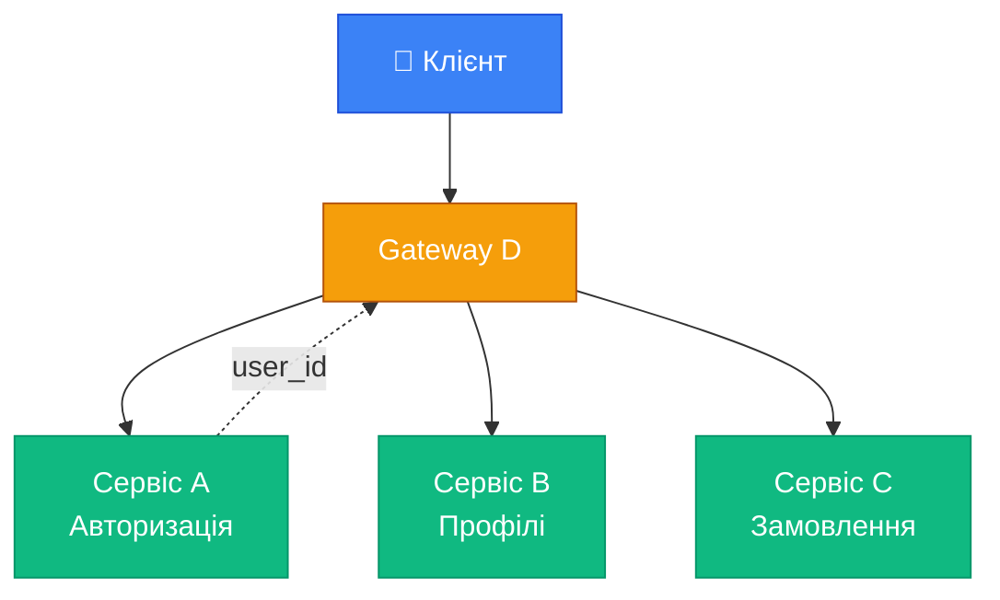
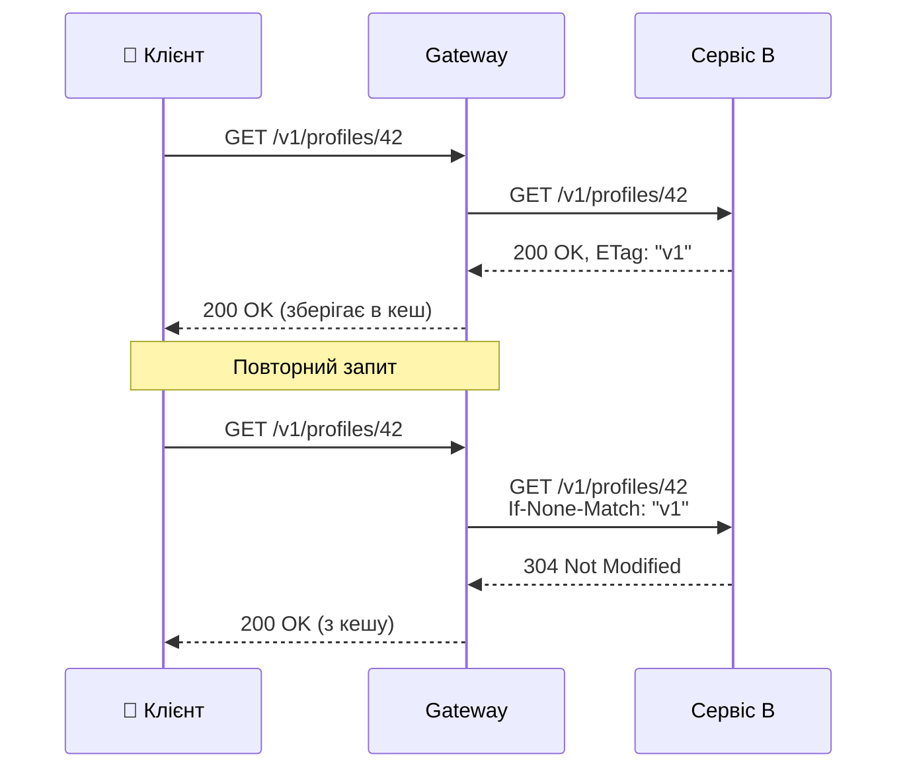
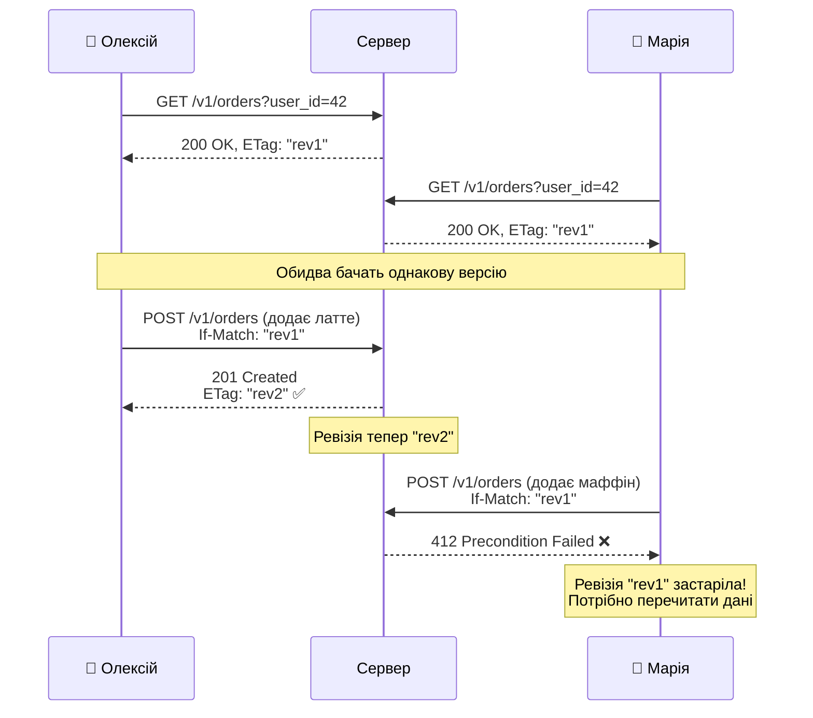
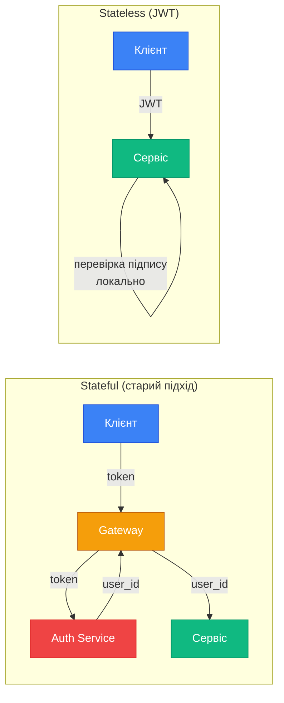

# Організація HTTP API за принципами REST

::note
У попередніх статтях ми вивчили складові HTTP-запитів. Тепер переходимо до головного: **як правильно організувати HTTP API**, застосовуючи принципи REST на практиці. Матеріал цієї статті покаже, чому ці принципи — не абстрактна теорія, а реальний інструмент масштабування.
::

## 1. Від монолітного API до мікросервісів

Розглянемо типовий сценарій: мобільний додаток для замовлення кави. На старті додатку необхідно, використовуючи збережений токен, отримати профіль користувача та його поточні замовлення.

### Монолітний підхід

```csharp [Монолітний ендпоінт — один запит на все]
var app = WebApplication.Create(args);

// Один ендпоінт повертає все
app.MapGet("/v1/state", async (HttpContext ctx) =>
{
    // 1. Перевірити токен → отримати user_id
    var token = ctx.Request.Headers.Authorization
        .ToString();
    var userId = ValidateToken(token); // stateful!

    // 2. Отримати профіль
    var profile = await GetProfile(userId);

    // 3. Отримати замовлення
    var orders = await GetOrders(userId);

    return Results.Ok(new { profile, orders });
});

app.Run();
```

Цей API **порушує одразу кілька принципів REST**:

| Принцип | Проблема |
|:---|:---|
| Stateless | Сервер зберігає токени в пам'яті для визначення `user_id` |
| Кешування | Немає способу кешувати відповідь (замовлення часто змінюються, профіль — рідко) |
| Багатошаровість | Система однорівнева, додати проксі або кеш неможливо |
| Уніфікований інтерфейс | `/v1/state` — не ресурс, а «зроби мені все» |

### Декомпозиція на мікросервіси

З ростом навантаження ми декомпозуємо монолітний бекенд на мікросервіси:

::mermaid



::

Але наївний підхід також має проблему: сервіси B і C повинні перевіряти токен через сервіс A, створюючи зайве навантаження.

### Stateless-рішення: передача user_id

Замість того, щоб кожен сервіс самостійно розшифровував токен, гейтвей D робить це _один раз_ і передає `user_id` далі:

```csharp [Gateway D — stateless перенаправлення]
var app = WebApplication.Create(args);

app.MapGet("/v1/state", async (HttpContext ctx) =>
{
    // 1. Гейтвей перевіряє токен ОДИН РАЗ
    var token = ctx.Request.Headers.Authorization
        .ToString();
    var userId = await authService
        .ValidateAsync(token);

    // 2. Запити до мікросервісів з user_id
    // як ЯВНИМ параметром (stateless!)
    var profileTask = httpClient
        .GetAsync($"/v1/profiles/{userId}");
    var ordersTask = httpClient
        .GetAsync($"/v1/orders?user_id={userId}");

    await Task.WhenAll(profileTask, ordersTask);

    var profile = await profileTask.Result.Content
        .ReadFromJsonAsync<object>();
    var orders = await ordersTask.Result.Content
        .ReadFromJsonAsync<object>();

    return Results.Ok(new { profile, orders });
});

app.Run();
```

Тепер сервіс B і C отримують запити, які **несуть у собі всю необхідну інформацію**:

```csharp [Сервіс B — профілі (stateless)]
// Сервісу B НЕ потрібен сервіс авторизації!
// user_id вже є в URL
app.MapGet("/v1/profiles/{userId}", (int userId) =>
{
    var profile = db.GetProfile(userId);
    return profile is not null
        ? Results.Ok(profile)
        : Results.NotFound();
});
```

```csharp [Сервіс C — замовлення (stateless)]
// Сервісу C теж НЕ потрібен сервіс авторизації!
app.MapGet("/v1/orders", (int user_id) =>
{
    var orders = db.GetOrdersByUser(user_id);
    return Results.Ok(orders);
});
```

::tip
**Принцип stateless (з книги Константинова):** Мікросервіси розробляються так, щоб мати **чітко окреслену зону відповідальності** і не зберігати дані, що належать іншим рівням абстракції. «Зовнішні» дані — це лише ідентифікатори контекстів.
::

---

## 2. Кешування через ETag

Профіль користувача змінюється рідко — його можна кешувати. Замовлення змінюються часто — але і для них є рішення через **ETag** (Entity Tag).

### Що таке ETag

**ETag** — це заголовок відповіді, що містить «відбиток» (ревізію, хеш) поточного стану ресурсу. Клієнт або проміжний агент може використати його для **умовних запитів**.

**Ревізія** (revision) — це мітка версії ресурсу. Кожного разу, коли ресурс змінюється, ревізія отримує нове значення. Це може бути:
- **Лічильник** — `"rev1"`, `"rev2"`, `"rev3"` (збільшується при кожній зміні)
- **Хеш** — `"a3f8b2c1"` (обчислюється від вмісту ресурсу)
- **Timestamp** — `"2024-02-26T12:00:00Z"` (час останньої зміни)

Суть одна: якщо ревізія збігається — дані **не змінились**. Якщо відрізняється — хтось модифікував ресурс.

### Сценарій: кешування профілю

::steps

### Перший запит — отримуємо ETag

```http
GET /v1/profiles/42 HTTP/1.1
→
HTTP/1.1 200 OK
ETag: "v1-abc123"
Cache-Control: max-age=300

{"id": 42, "name": "Олексій", "email": "alex@test.com"}
```

### Повторний запит — перевіряємо актуальність

```http
GET /v1/profiles/42 HTTP/1.1
If-None-Match: "v1-abc123"
→
HTTP/1.1 304 Not Modified
```

Сервер повертає **304 без тіла** — дані не змінились, використовуйте кеш!

### Дані змінились — отримуємо нову версію

```http
GET /v1/profiles/42 HTTP/1.1
If-None-Match: "v1-abc123"
→
HTTP/1.1 200 OK
ETag: "v1-def456"

{"id": 42, "name": "Олексій", "email": "new@test.com"}
```

::

```csharp [ETag у Minimal API]
var app = WebApplication.Create(args);

app.MapGet("/v1/profiles/{id}", (int id, HttpContext ctx) =>
{
    var profile = db.GetProfile(id);
    if (profile is null) 
        return Results.NotFound();

    // Генеруємо ETag на основі версії даних
    var etag = $"\"{profile.Version}\"";

    // Перевіряємо умовний запит
    var ifNoneMatch = ctx.Request.Headers
        .IfNoneMatch.FirstOrDefault();

    if (ifNoneMatch == etag)
    {
        // Дані не змінились — 304 без тіла
        return Results.StatusCode(304);
    }

    // Повертаємо дані з ETag
    ctx.Response.Headers.ETag = etag;
    ctx.Response.Headers.CacheControl = "max-age=300";

    return Results.Ok(profile);
});

app.Run();
```

::mermaid



::

---

## 3. Оптимістичне керування паралелізмом

ETag має ще одне критичне застосування — **захист від конкурентних змін** через заголовок `If-Match`. Якщо `If-None-Match` відповідає за кешування (розділ вище), то `If-Match` — за **безпечне оновлення**.

### Два обличчя ETag

| Заголовок | Мета | Питання | Відповідь сервера |
|:---|:---|:---|:---|
| `If-None-Match` | Кешування | «Чи змінились дані?» | `304 Not Modified` — ні, використовуй кеш |
| `If-Match` | Паралелізм | «Чи я працюю з актуальною версією?» | `412 Precondition Failed` — ні, дані вже змінені |

### Аналогія: спільний Google Docs

Уявіть, що ви і колега одночасно редагуєте один документ. В Google Docs це працює в реальному часі. Але HTTP API — це не реальний час, а «запит-відповідь». Що станеться, якщо **двоє** відправлять зміни одночасно?

**Без захисту (песимістичний сценарій «Lost Update»):**

1. 📱 Олексій відкриває замовлення — бачить 2 товари
2. 📱 Марія відкриває те саме замовлення — бачить ті ж 2 товари
3. 📱 Олексій додає ☕ латте → відправляє запит із 3 товарами
4. 📱 Марія додає 🧁 маффін → відправляє запит із 3 товарами (своїми!)
5. ❌ **Результат:** в замовленні 3 товари (Маріні), латте Олексія — **втрачено** назавжди

Це називається **Lost Update** — одне з найпідступніших конкурентних порушень, бо жодна зі сторін не отримала помилку.

### Рішення: оптимістичне блокування через ETag

**Оптимістичне** блокування (на відміну від песимістичного) не «замикає» ресурс для інших клієнтів. Натомість воно перевіряє в момент запису: «Чи ніхто не змінив ресурс з того часу, як я його прочитав?»

Механізм простий:
1. Клієнт **читає** ресурс → отримує ETag (ревізію)
2. Клієнт **змінює** ресурс → надсилає `If-Match: <та сама ревізія>`
3. Сервер **порівнює**: якщо ревізія збігається → виконує операцію. Якщо ні → `412 Precondition Failed`

### Діаграма: як це працює

::mermaid



::

Олексій встиг першим — його зміна прийнята, ревізія стала `"rev2"`. Коли Марія намагається відправити свої зміни з `If-Match: "rev1"` — сервер бачить, що ревізія застаріла, і повертає **412 Precondition Failed**. Дані Олексія **не втрачені**.

### Що робить клієнт після 412?

Алгоритм відновлення:

::steps

### Клієнт отримує 412

Сервер відхилив запит — ревізія не актуальна.

### Клієнт перечитує дані

```http
GET /v1/orders?user_id=42 HTTP/1.1
→
HTTP/1.1 200 OK
ETag: "rev2"

[замовлення Олексія вже включене!]
```

### Клієнт повторює свою зміну з новою ревізією

```http
POST /v1/orders HTTP/1.1
If-Match: "rev2"

{"recipe": "muffin"}
→
HTTP/1.1 201 Created
ETag: "rev3" ✅
```

::

Тепер в замовленні є **і латте, і маффін** — нічого не втрачено.

### Реалізація у Minimal API

```csharp [Оптимістичне керування паралелізмом]
app.MapPost("/v1/orders", (OrderRequest req, HttpContext ctx) =>
{
    // 1. If-Match містить очікувану ревізію
    var ifMatch = ctx.Request.Headers
        .IfMatch.FirstOrDefault();

    // 2. Отримуємо поточну ревізію зі сховища
    var currentRevision = db.GetOrdersRevision(
        req.UserId);

    // 3. Перевіряємо: чи актуальна ревізія клієнта?
    if (ifMatch is not null 
        && ifMatch != $"\"{currentRevision}\"")
    {
        // 412 — ревізія застаріла, клієнт
        // повинен перечитати дані і повторити
        return Results.StatusCode(412);
    }

    // 4. Створюємо замовлення і оновлюємо ревізію
    var order = db.CreateOrder(req);
    var newRevision = db.GetOrdersRevision(req.UserId);

    // 5. Повертаємо оновлений ETag
    ctx.Response.Headers.ETag = $"\"{newRevision}\"";
    ctx.Response.Headers["Content-Location"] = 
        $"/v1/orders?user_id={req.UserId}";

    return Results.Created($"/v1/orders/{order.Id}", 
        order);
});
```

---

## 4. JWT: Stateless-авторизація

Ми досі використовуємо сервіс A для перевірки токенів — це залишок stateful-архітектури. Рішення — **stateless-токени (JWT)**.

### Stateful vs Stateless токени

::tabs

::tabs-item{label="Stateful (непрозорий токен)"}

```
Token: "a7f3bc91-session-id"
```

- Сервер **повинен** шукати токен у базі/кеші
- Потрібен окремий сервіс авторизації
- Вихід з ладу сервісу A → все ламається

::

::tabs-item{label="Stateless (JWT)"}

```
Token: "eyJhbGciOiJIUzI1NiJ9.eyJ1c2VyX2lk..."
     ↓ розшифрувавши:
{
  "user_id": 42,
  "user_ids": [42, 15],  // доступ до ресурсів
  "iat": 1708934400,     // час створення
  "exp": 1709020800      // час закінчення
}
```

- Кожен сервіс може **сам** перевірити підпис токена
- Не потрібен зовнішній сервіс
- Уся інформація — в самому токені

::

::

### Подвійний user_id — не дублювання

::warning
**Поширена помилка:** якщо `user_id` вже є в JWT-токені, навіщо передавати його ще й в URL?

**Відповідь з книги:** Це **не** дублювання. Ці ідентифікатори мають **різний зміст**:
- `user_id` в URL → **над яким ресурсом** виконується операція
- `user_id` в токені → **хто** виконує операцію

Збіг — лише частковий випадок. Директор компанії може переглядати замовлення своїх співробітників:
::

```csharp [JWT-авторизація у Minimal API]
app.MapGet("/v1/profiles/{userId}", 
    (int userId, HttpContext ctx) =>
{
    // 1. Розшифрувати JWT (бібліотека/middleware)
    var claims = ctx.User;
    var tokenUserId = int.Parse(
        claims.FindFirst("user_id")!.Value);

    // 2. Отримати список дозволених user_id
    var allowedIds = claims
        .FindAll("allowed_user_id")
        .Select(c => int.Parse(c.Value))
        .ToList();

    // 3. Перевірити: чи має право
    // власник токена бачити цей профіль?
    if (tokenUserId != userId 
        && !allowedIds.Contains(userId))
    {
        // 403 — токен валідний, але
        //   доступу до цього ресурсу немає
        return Results.Forbid();
    }

    var profile = db.GetProfile(userId);
    return profile is not null
        ? Results.Ok(profile)
        : Results.NotFound();
});
```

::mermaid



::

---

## 5. Підсумок: Повна відповідність REST

Після всіх перетворень ми отримали систему, яка **повністю відповідає принципам REST**:

| Принцип REST | Як реалізовано |
|:---|:---|
| **Stateless** | Кожен запит несе `user_id` та JWT — сервісу не потрібен зовнішній стан |
| **Кешування** | ETag + Cache-Control для профілів; If-None-Match для умовних запитів |
| **Уніфікований інтерфейс** | Стандартні HTTP-методи, URL ідентифікують ресурси |
| **Багатошаровість** | Гейтвей можна прибрати — клієнт може звертатись до сервісів напряму |

::tip
**Ключовий висновок з книги Константинова:** Після всіх перетворень ми можемо _прибрати гейтвей D_ і покласти його функції безпосередньо на клієнта. Клієнт зберігає `user_id` (або витягує з JWT), робить два паралельних запити через HTTP/2 мультиплексування, і підтримує кеш через стандартні бібліотеки. З точки зору сервісів B і C наявність або відсутність гейтвея не впливає ні на що.
::

---

## 6. Практичні завдання

### Рівень 1: Базовий

::accordion

::accordion-item{label="Завдання 5.1: Stateless-рефакторинг" icon="i-lucide-circle-help"}
Перетворіть наступний stateful API на stateless:

```csharp
// Stateful: сервер зберігає сесії
app.MapPost("/api/login", (LoginRequest req) =>
{
    var sessionId = Guid.NewGuid().ToString();
    sessions[sessionId] = req.Email;
    return Results.Ok(new { session_id = sessionId });
});

app.MapGet("/api/my-orders", (HttpContext ctx) =>
{
    var sessionId = ctx.Request.Headers["X-Session-Id"];
    var email = sessions[sessionId];
    var orders = db.GetOrdersByEmail(email);
    return Results.Ok(orders);
});
```

Вимоги:
1. Видаліть серверне сховище сесій
2. Використайте JWT або передачу user_id в URL
3. Зробіть запит `/v1/orders` повністю stateless
::

::

### Рівень 2: Проєктування

::accordion

::accordion-item{label="Завдання 5.2: ETag-кешування" icon="i-lucide-circle-help"}
Реалізуйте Minimal API ендпоінт `GET /v1/products/{id}`, що підтримує:

1. ETag у відповіді (використайте хеш даних)
2. Умовний запит `If-None-Match` → `304 Not Modified`
3. Заголовок `Cache-Control: max-age=600`

Протестуйте: зробіть два запити — перший має повернути `200`, другий з `If-None-Match` — `304`.
::

::accordion-item{label="Завдання 5.3: Оптимістичне керування паралелізмом" icon="i-lucide-circle-help"}
Реалізуйте ендпоінт `PUT /v1/products/{id}`, що:

1. Приймає `If-Match` з поточною ревізією
2. Повертає `412 Precondition Failed`, якщо ревізія не збігається
3. Повертає `200 OK` з новим `ETag` при успіху
4. Повертає `428 Precondition Required`, якщо `If-Match` не передано

Змоделюйте ситуацію «lost update» з двома клієнтами.
::

::

---

## 7. Резюме

::card-group

::card{title="Stateless = масштабування" icon="i-lucide-scaling"}
Запит повинен нести в собі всю інформацію для обробки. Це дозволяє додавати/прибирати проміжні шари без зміни сервісів.
::

::card{title="ETag = розумне кешування" icon="i-lucide-database"}
ETag + If-None-Match для кешування. ETag + If-Match для оптимістичного керування паралелізмом. Один механізм — два застосування.
::

::card{title="JWT = stateless авторизація" icon="i-lucide-key"}
Stateless-токени дозволяють кожному сервісу самостійно перевіряти права. user_id в URL і user_id в токені — це різні речі.
::

::card{title="REST на практиці" icon="i-lucide-check-circle"}
Після правильної декомпозиції система відповідає REST: stateless, кешована, багатошарова, з уніфікованим інтерфейсом.
::

::

**Далі:** у наступній статті ми розберемо **номенклатуру URL ресурсів та CRUD-операції** — як правильно будувати ієрархію URL, коли використовувати path vs query, і як реалізувати ідемпотентне створення ресурсів.
