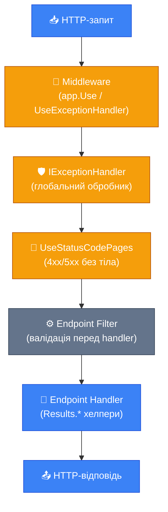
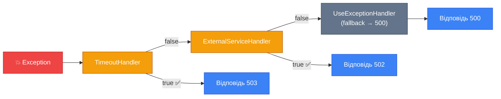

# Обробка помилок у Minimal API

::note
У попередній статті ми спроєктували **структуру помилок** — як повідомляти клієнту про помилку: статус-коди, `reason`, `localized_message`, `developer_message`. Але **де саме** у коді ловити та формувати ці помилки? ASP.NET Core Minimal API пропонує **шість різних механізмів** — від простих `Results`-хелперів до глобальних стратегій через `IExceptionHandler`. У цій статті ми розберемо кожен з них, порівняємо, і покажемо, коли який використовувати.
::

---

## 1. Шість рівнів обробки помилок

Перш ніж зануритися у деталі, подивімося на повну картину. ASP.NET Core пропонує обробку помилок на **різних рівнях** конвеєра запиту (Request Pipeline):

::mermaid



::

Кожен рівень має свою спеціалізацію:

| Рівень | Механізм              | Що обробляє                   | Коли використовувати                     |
| :----- | :-------------------- | :---------------------------- | :--------------------------------------- |
| 1      | `Results.*` хелпери   | Очікувані помилки в endpoint  | Валідація, бізнес-логіка                 |
| 2      | `Results.Problem()`   | RFC 9457 Problem Details      | Стандартизований формат                  |
| 3      | Endpoint Filters      | Валідація **перед** handler   | Перевірка параметрів, авторизація        |
| 4      | `UseStatusCodePages`  | 4xx/5xx **без тіла**          | «404 Not Found» для неіснуючих маршрутів |
| 5      | `UseExceptionHandler` | Необроблені винятки (throw)   | Глобальний catch для 500                 |
| 6      | `IExceptionHandler`   | Типізовані обробники винятків | Стратегія для різних типів exception     |

::tip
**Ключова ідея:** ці механізми **не конкурують**, а **доповнюють** один одного. В реальному додатку ви зазвичай використовуєте **кілька рівнів одночасно**. Помилки валідації ловляться у фільтрах, бізнес-помилки — у handler через `Results.*`, а непередбачені краші — через `UseExceptionHandler`.
::

---

## 2. Рівень 1: Results-хелпери — помилки всередині endpoint

Це найпростіший і найпоширеніший спосіб — повертати помилку прямо з endpoint handler через статичні методи класу `Results`:

```csharp [Базові Results-хелпери для помилок]
app.MapGet("/v1/products/{id}", (int id) =>
{
    if (id <= 0)
        return Results.BadRequest(
            "ID має бути додатним числом.");  // 400

    var product = db.FindProduct(id);
    if (product is null)
        return Results.NotFound();             // 404

    return Results.Ok(product);                // 200
});
```

### Повний каталог Results-хелперів для помилок

::field-group

::field{name="Results.BadRequest()" type="IResult"}
Повертає `400 Bad Request`. Використовується, коли запит клієнта неможливо обробити — невалідний формат, відсутні поля. Можна передати об'єкт з деталями помилки.
::

::field{name="Results.Unauthorized()" type="IResult"}
Повертає `401 Unauthorized`. **Увага:** не приймає параметрів — лише порожнє тіло з кодом 401. Для повної відповіді з тілом використовуйте `Results.Json(...)`.
::

::field{name="Results.Forbid()" type="IResult"}
Повертає `403 Forbidden`. Аналогічно до `Unauthorized()` — не приймає тіло відповіді.
::

::field{name="Results.NotFound()" type="IResult"}
Повертає `404 Not Found`. Може приймати об'єкт, який серіалізується у тіло відповіді.
::

::field{name="Results.Conflict()" type="IResult"}
Повертає `409 Conflict`. Використовується при спробі створити дублікат або при конфлікті стану.
::

::field{name="Results.UnprocessableEntity()" type="IResult"}
Повертає `422 Unprocessable Entity`. Запит синтаксично коректний, але семантично безглуздий (наприклад, від'ємна ціна).
::

::field{name="Results.StatusCode(int)" type="IResult"}
Повертає **довільний** статус-код. Єдиний спосіб повернути нестандартні коди, наприклад `429` або `428`.
::

::field{name="Results.Json(object, int)" type="IResult"}
Повертає JSON із **довільним** статус-кодом. Найгнучкіший варіант — повний контроль над тілом і кодом.
::

::

### Проблема: коди без тіла

Деякі хелпери (`Unauthorized`, `Forbid`) не приймають об'єкт для тіла відповіді. Для кодів, яких немає серед хелперів (наприклад, `429 Too Many Requests`), доводиться використовувати `Results.Json()` або `Results.StatusCode()`:

```csharp [Обхід обмежень Results-хелперів]
// ❌ Не існує — Results.TooManyRequests()
// ❌ Не існує — Results.PreconditionRequired()
// ❌ Results.Unauthorized() — не приймає тіло

// ✅ Results.Json — повний контроль
app.MapPost("/v1/orders", (OrderRequest? req,
    HttpContext ctx) =>
{
    // 401 із тілом
    if (!ctx.User.Identity?.IsAuthenticated ?? true)
        return Results.Json(
            new { error = "Authentication required" },
            statusCode: 401);

    // 428 — нестандартний код
    var ifMatch = ctx.Request.Headers
        .IfMatch.FirstOrDefault();
    if (ifMatch is null)
        return Results.Json(
            new { error = "If-Match header required" },
            statusCode: 428);

    // 429 — нестандартний код
    if (IsRateLimited(ctx))
        return Results.Json(
            new { error = "Too many requests" },
            statusCode: 429);

    return Results.Ok("Замовлення створено");
});
```

::warning
**Обмеження**: хелпери `Results.*` покривають лише **очікувані** помилки — ті, які ви передбачили в коді. Якщо всередині handler вилетить `NullReferenceException` або `SqlException`, ці хелпери не допоможуть — потрібен глобальний обробник.
::

---

## 3. Рівень 2: Problem Details — стандарт RFC 9457

### Що таке Problem Details?

Problem Details (RFC 9457, раніше RFC 7807) — це **стандартний формат JSON** для описання помилок в HTTP API. ASP.NET Core має вбудовану підтримку цього стандарту.

Замість довільного формату:

```json [❌ Довільний формат]
{ "error": "Not found", "code": 404 }
```

Ми отримуємо стандартизований:

```json [✅ Problem Details (RFC 9457)]
{
    "type": "https://tools.ietf.org/html/rfc9110#section-15.5.5",
    "title": "Not Found",
    "status": 404,
    "detail": "Product with ID 999 was not found.",
    "instance": "/v1/products/999",
    "traceId": "00-abc123-def456-01"
}
```

### Увімкнення Problem Details

ASP.NET Core Minimal API автоматично генерує Problem Details, якщо зареєструвати відповідний сервіс:

```csharp [Увімкнення Problem Details — 3 рядки]
var builder = WebApplication.CreateBuilder(args);

// 1. Реєструємо сервіс Problem Details
builder.Services.AddProblemDetails();

var app = builder.Build();

// 2. Глобальний обробник винятків
app.UseExceptionHandler();

// 3. Обробник порожніх 4xx/5xx
app.UseStatusCodePages();

app.MapGet("/v1/products/{id}", (int id) =>
{
    if (id <= 0)
        return Results.BadRequest();  // → Problem Details!

    return Results.Ok(new { id, name = "Кава" });
});

app.Run();
```

Розберемо, що роблять ці три рядки:

- **`AddProblemDetails()`** — реєструє `IProblemDetailsService` у DI-контейнері. Цей сервіс вміє генерувати JSON у форматі RFC 9457.
- **`UseExceptionHandler()`** — ловить необроблені винятки (`throw`) і перетворює їх на Problem Details замість «жовтого екрану смерті».
- **`UseStatusCodePages()`** — перехоплює відповіді з кодами 4xx/5xx, які **не мають тіла**, і додає Problem Details JSON.

### Results.Problem() — ручне створення

Для ручного створення Problem Details є спеціальний хелпер:

```csharp [Results.Problem — ручний Problem Details]
app.MapGet("/v1/products/{id}", (int id) =>
{
    var product = db.FindProduct(id);
    if (product is null)
    {
        return Results.Problem(
            title: "Product not found",
            detail: $"Product with ID {id} does " +
                "not exist in the catalog.",
            statusCode: 404,
            type: "https://api.example.com/errors" +
                "/product-not-found",
            instance: $"/v1/products/{id}");
    }

    return Results.Ok(product);
});
```

Відповідь буде із заголовком `Content-Type: application/problem+json`:

```json [Результат]
{
    "type": "https://api.example.com/errors/product-not-found",
    "title": "Product not found",
    "status": 404,
    "detail": "Product with ID 999 does not exist in the catalog.",
    "instance": "/v1/products/999"
}
```

### Results.ValidationProblem() — помилки валідації

Для помилок валідації (коли потрібно повідомити про кілька невалідних полів одразу) існує окремий хелпер:

```csharp [Results.ValidationProblem — валідація]
app.MapPost("/v1/products", (ProductRequest? req) =>
{
    if (req is null)
        return Results.Problem(
            title: "Invalid request body",
            detail: "Request body is required.",
            statusCode: 400);

    var errors = new Dictionary<string, string[]>();

    if (string.IsNullOrWhiteSpace(req.Name))
        errors["name"] = ["Name is required."];

    if (req.Price <= 0)
        errors["price"] = ["Price must be positive."];

    if (req.Name?.Length > 100)
        errors["name"] = [
            ..errors.GetValueOrDefault("name", []),
            "Name must be 100 characters or less."
        ];

    if (errors.Count > 0)
        return Results.ValidationProblem(errors,
            title: "Validation failed",
            detail: $"{errors.Count} field(s) have " +
                "invalid values.");

    var product = db.CreateProduct(req);
    return Results.Created(
        $"/v1/products/{product.Id}", product);
});
```

Відповідь із кодом `400`:

```json [Результат ValidationProblem]
{
    "type": "https://tools.ietf.org/html/rfc9110#section-15.5.1",
    "title": "Validation failed",
    "status": 400,
    "detail": "2 field(s) have invalid values.",
    "errors": {
        "name": ["Name is required."],
        "price": ["Price must be positive."]
    }
}
```

::note
`ValidationProblem` повертає статус `400` за замовчуванням. Масив помилок `errors` — це **стандартне розширення** Problem Details. Ключ — ім'я поля, значення — масив повідомлень про помилки для цього поля.
::

### Кастомізація Problem Details

Можна додати власні поля до кожного Problem Details через `AddProblemDetails()`:

```csharp [Глобальна кастомізація]
builder.Services.AddProblemDetails(options =>
{
    options.CustomizeProblemDetails = ctx =>
    {
        // Додаємо traceId до кожної помилки
        ctx.ProblemDetails.Extensions["traceId"] =
            ctx.HttpContext.TraceIdentifier;

        // Додаємо timestamp
        ctx.ProblemDetails.Extensions["timestamp"] =
            DateTime.UtcNow.ToString("O");

        // Прибираємо type за замовчуванням
        ctx.ProblemDetails.Type ??=
            "https://api.example.com/errors/general";
    };
});
```

Тепер **кожна** помилка автоматично матиме `traceId` і `timestamp`:

```json [Результат із розширеннями]
{
    "type": "https://api.example.com/errors/general",
    "title": "Not Found",
    "status": 404,
    "traceId": "0HN6QJVS7:00000001",
    "timestamp": "2026-03-02T12:00:00.0000000Z"
}
```

---

## 4. Рівень 3: Endpoint Filters — перевірка перед handler

Endpoint Filters (Фільтри ендпоінтів) — це код, який виконується **до** і **після** endpoint handler. Вони ідеально підходять для **наскрізної валідації** — перевірок, які повторюються в кожному ендпоінті.

### Навіщо? Проблема дублювання

Без фільтрів ми дублюємо валідацію в кожному handler:

```csharp [❌ Дублювання валідації]
app.MapPost("/v1/orders", (OrderRequest? req) =>
{
    // Ця перевірка — в КОЖНОМУ ендпоінті! 😩
    if (req is null)
        return Results.BadRequest("Body is required");
    // ...
});

app.MapPut("/v1/orders/{id}", (int id,
    OrderRequest? req) =>
{
    // Та сама перевірка — знову! 😩
    if (req is null)
        return Results.BadRequest("Body is required");
    // ...
});
```

### Фільтр валідації

```csharp [✅ Endpoint Filter — одна точка валідації]
app.MapPost("/v1/orders", (OrderRequest req) =>
{
    // req гарантовано не null — фільтр перевірив!
    var order = db.CreateOrder(req);
    return Results.Created(
        $"/v1/orders/{order.Id}", order);
})
.AddEndpointFilter(async (ctx, next) =>
{
    // Фільтр виконується ДО handler
    var req = ctx.GetArgument<OrderRequest>(0);

    var errors = new Dictionary<string, string[]>();
    if (string.IsNullOrWhiteSpace(req.Recipe))
        errors["recipe"] = ["Recipe is required."];
    if (req.Volume is not null && req.Volume <= 0)
        errors["volume"] = ["Volume must be positive."];

    if (errors.Count > 0)
        return Results.ValidationProblem(errors);

    // Валідація пройшла → далі до handler
    return await next(ctx);
});
```

- **`ctx.GetArgument<T>(index)`** — дістає аргумент handler за індексом (0 = перший параметр).
- **`return await next(ctx)`** — передає управління наступному фільтру або handler.
- Якщо фільтр повертає `IResult` (наприклад, `Results.ValidationProblem`), handler **не виконується** взагалі.

### Типізований фільтр як окремий клас

Для складнішої валідації створюємо окремий клас:

```csharp [Типізований endpoint filter]
public class ValidationFilter<T> : IEndpointFilter
    where T : IValidatable
{
    public async ValueTask<object?> InvokeAsync(
        EndpointFilterInvocationContext ctx,
        EndpointFilterDelegate next)
    {
        var arg = ctx.GetArgument<T>(0);
        var errors = arg.Validate();

        if (errors.Count > 0)
            return Results.ValidationProblem(errors,
                title: "Validation failed");

        return await next(ctx);
    }
}

// Інтерфейс, який мають реалізувати DTO
interface IValidatable
{
    Dictionary<string, string[]> Validate();
}

// DTO з власною валідацією
record OrderRequest(
    string? Recipe,
    int CoffeeMachineId,
    int? Volume) : IValidatable
{
    public Dictionary<string, string[]> Validate()
    {
        var errors = new Dictionary<string, string[]>();

        if (string.IsNullOrWhiteSpace(Recipe))
            errors["recipe"] = ["Recipe is required."];

        if (Volume is not null && Volume <= 0)
            errors["volume"] = [
                "Volume must be positive."];

        return errors;
    }
}

// Використання — чистий handler без валідації
app.MapPost("/v1/orders", (OrderRequest req) =>
{
    var order = db.CreateOrder(req);
    return Results.Created(
        $"/v1/orders/{order.Id}", order);
})
.AddEndpointFilter<ValidationFilter<OrderRequest>>();
```

::tip
**Переваги endpoint filters:**

- **Розділення відповідальностей** — handler займається лише бізнес-логікою, фільтр — валідацією.
- **Повторне використання** — один фільтр можна застосувати до багатьох ендпоінтів.
- **Ланцюжок** — можна додати кілька фільтрів, і вони виконуються послідовно.
- **Тестування** — handler і фільтр тестуються окремо.
  ::

---

## 5. Рівень 4: UseStatusCodePages — порожні помилки

### Проблема

Коли запит потрапляє на неіснуючий маршрут, ASP.NET Core повертає `404` з **порожнім тілом**. Клієнт отримує лише статус-код без жодного пояснення:

```http
GET /v1/nonexistent HTTP/1.1
→
HTTP/1.1 404 Not Found
Content-Length: 0
```

Те саме відбувається, якщо ваш handler повертає `Results.StatusCode(429)` — код є, тіла немає.

### Рішення: UseStatusCodePages

Middleware `UseStatusCodePages` перехоплює відповіді з кодами 4xx/5xx, які **не мають тіла**, і додає тіло у форматі Problem Details:

```csharp [UseStatusCodePages — заповнення порожніх помилок]
var builder = WebApplication.CreateBuilder(args);
builder.Services.AddProblemDetails();

var app = builder.Build();

// Перехоплює порожні 4xx/5xx
app.UseStatusCodePages();

app.MapGet("/v1/products/{id}", (int id) =>
{
    if (id <= 0)
        return Results.BadRequest();  // Порожній 400
                                      // → Problem Details!

    return Results.Ok(new { id, name = "Кава" });
});

app.Run();
```

Тепер `Results.BadRequest()` без аргументів повертає Problem Details:

```json [Відповідь замість порожнього 400]
{
    "type": "https://tools.ietf.org/html/rfc9110#section-15.5.1",
    "title": "Bad Request",
    "status": 400
}
```

### Кастомна логіка StatusCodePages

Можна передати делегат для повного контролю:

```csharp [UseStatusCodePages з делегатом]
app.UseStatusCodePages(async statusCodeCtx =>
{
    var httpCtx = statusCodeCtx.HttpContext;
    var statusCode = httpCtx.Response.StatusCode;

    await Results.Problem(
        title: GetTitleForCode(statusCode),
        statusCode: statusCode,
        instance: httpCtx.Request.Path
    ).ExecuteAsync(httpCtx);
});

string GetTitleForCode(int code) => code switch
{
    400 => "Невірний запит",
    401 => "Потрібна аутентифікація",
    403 => "Доступ заборонено",
    404 => "Ресурс не знайдено",
    405 => "Метод не дозволено",
    429 => "Забагато запитів",
    _ => "Помилка"
};
```

::note
**Важливо:** `UseStatusCodePages` працює **тільки для порожніх** відповідей. Якщо ви використовуєте `Results.BadRequest(new { error = "..." })` з тілом — middleware його **не перехопить**. Це стосується лише відповідей із `Content-Length: 0`.
::

---

## 6. Рівень 5: UseExceptionHandler — глобальний catch

### Проблема

Якщо всередині endpoint handler вилетить необроблений виняток (`throw`), без глобального обробника клієнт отримає:

- У Development: Developer Exception Page з HTML і стек-трейсом
- У Production: порожню `500` помилку

Обидва варіанти **неприйнятні** для API:

```csharp [Виняток у handler]
app.MapGet("/v1/orders/{id}", (int id) =>
{
    // 💥 Щось пішло не так у БД!
    throw new InvalidOperationException(
        "Database connection failed");
});
// Без UseExceptionHandler →
// HTML-сторінка або порожній 500 😱
```

### Рішення: UseExceptionHandler

```csharp [UseExceptionHandler — базове]
var builder = WebApplication.CreateBuilder(args);
builder.Services.AddProblemDetails();

var app = builder.Build();

// Ловить ВСІ необроблені винятки
app.UseExceptionHandler();

app.MapGet("/v1/crash", () =>
{
    throw new InvalidOperationException("Boom!");
});

app.Run();
```

Завдяки `AddProblemDetails()` відповідь буде у форматі Problem Details:

```json [Автоматична 500 у Problem Details]
{
    "type": "https://tools.ietf.org/html/rfc9110#section-15.6.1",
    "title": "An error occurred while processing your request.",
    "status": 500
}
```

### UseExceptionHandler з делегатом — повний контроль

Для повного контролю над форматом відповіді при помилці:

```csharp [UseExceptionHandler з power-user делегатом]
app.UseExceptionHandler(exceptionApp =>
{
    exceptionApp.Run(async ctx =>
    {
        // Дістаємо виняток
        var exception = ctx.Features
            .Get<IExceptionHandlerPathFeature>()?.Error;

        var logger = ctx.RequestServices
            .GetRequiredService<ILogger<Program>>();

        // ✅ Повна інформація — тільки в логи
        logger.LogError(exception,
            "Unhandled exception at {Path}",
            ctx.Request.Path);

        // Визначаємо статус-код за типом винятку
        var (statusCode, reason) = exception switch
        {
            TimeoutException =>
                (503, "service_timeout"),
            HttpRequestException =>
                (502, "bad_gateway"),
            UnauthorizedAccessException =>
                (403, "forbidden"),
            _ =>
                (500, "internal_server_error")
        };

        ctx.Response.StatusCode = statusCode;
        ctx.Response.ContentType =
            "application/problem+json";

        // Retry-After для тимчасових помилок
        if (statusCode is 503 or 502)
            ctx.Response.Headers.RetryAfter = "5";

        // ✅ Клієнту — безпечна відповідь
        await ctx.Response.WriteAsJsonAsync(
            new ProblemDetails
            {
                Type = $"https://api.example.com/" +
                    $"errors/{reason}",
                Title = ReasonToTitle(reason),
                Status = statusCode,
                Detail = statusCode >= 500
                    ? "An unexpected error occurred."
                    : exception?.Message,
                Instance = ctx.Request.Path
            });
    });
});

string ReasonToTitle(string reason) => reason switch
{
    "service_timeout" => "Service Timeout",
    "bad_gateway" => "Bad Gateway",
    "forbidden" => "Access Denied",
    _ => "Internal Server Error"
};
```

Зверніть увагу на чотири важливі деталі:

1. **Pattern matching на типі винятку** — різні типи exception отримують різні статус-коди.
2. **Повний лог** — стек-трейс, шлях, повідомлення — все йде у лог-систему.
3. **`Retry-After`** — для тимчасових помилок (503, 502) клієнт знає, коли повторити.
4. **Без деталей назовні** — клієнт не бачить внутрішньої інформації.

---

## 7. Рівень 6: IExceptionHandler — стратегія обробки

### Навіщо окремий інтерфейс?

`UseExceptionHandler` з делегатом чудово працює, але має проблему: **вся логіка в одному місці**. Коли типів винятків стає багато, делегат перетворюється на довгий `switch`. Інтерфейс `IExceptionHandler` дозволяє **розділити обробку** на окремі класи:

```csharp [IExceptionHandler — TypedHandler]
using Microsoft.AspNetCore.Diagnostics;

// Обробник для таймаутів
public class TimeoutExceptionHandler : IExceptionHandler
{
    private readonly ILogger<TimeoutExceptionHandler>
        _logger;

    public TimeoutExceptionHandler(
        ILogger<TimeoutExceptionHandler> logger) =>
        _logger = logger;

    public async ValueTask<bool> TryHandleAsync(
        HttpContext httpContext,
        Exception exception,
        CancellationToken cancellationToken)
    {
        if (exception is not TimeoutException timeout)
            return false;  // Не мій тип — передаю далі

        _logger.LogWarning(timeout,
            "Timeout at {Path}",
            httpContext.Request.Path);

        httpContext.Response.StatusCode = 503;
        httpContext.Response.Headers.RetryAfter = "5";

        await httpContext.Response.WriteAsJsonAsync(
            new ProblemDetails
            {
                Title = "Service Timeout",
                Status = 503,
                Detail = "The request timed out. " +
                    "Please retry after 5 seconds.",
                Instance = httpContext.Request.Path
            }, cancellationToken);

        return true;  // Оброблено! Далі не передавати
    }
}

// Обробник для проблем із зовнішніми сервісами
public class ExternalServiceExceptionHandler
    : IExceptionHandler
{
    public async ValueTask<bool> TryHandleAsync(
        HttpContext httpContext,
        Exception exception,
        CancellationToken cancellationToken)
    {
        if (exception is not HttpRequestException)
            return false;

        httpContext.Response.StatusCode = 502;

        await httpContext.Response.WriteAsJsonAsync(
            new ProblemDetails
            {
                Title = "Bad Gateway",
                Status = 502,
                Detail = "External service unavailable."
            }, cancellationToken);

        return true;
    }
}
```

### Реєстрація та порядок

```csharp [Реєстрація IExceptionHandler]
var builder = WebApplication.CreateBuilder(args);

builder.Services.AddProblemDetails();

// Порядок реєстрації = порядок виклику!
builder.Services
    .AddExceptionHandler<TimeoutExceptionHandler>();
builder.Services
    .AddExceptionHandler<ExternalServiceExceptionHandler>();
// Якщо жоден не повернув true →
// fallback до UseExceptionHandler

var app = builder.Build();

// UseExceptionHandler активує ланцюжок
app.UseExceptionHandler();

app.Run();
```

Механізм працює як **Chain of Responsibility** (Ланцюжок відповідальності):

::mermaid



::

- **`return true`** — «я обробив цей виняток, далі нікому передавати».
- **`return false`** — «не мій тип, нехай спробує наступний обробник».
- Якщо **жоден** не повернув `true` — спрацьовує fallback `UseExceptionHandler`.

::warning
**Обов'язково:** навіть при використанні `IExceptionHandler` потрібно викликати `app.UseExceptionHandler()`. Цей middleware активує весь ланцюжок обробників. Без нього `IExceptionHandler` **не буде працювати**.
::

---

## 8. Рівень бонус: кастомний middleware

Для повного контролю можна написати middleware вручну через `app.Use(...)`. Це найнижчий рівень — ви контролюєте **все**:

```csharp [Кастомний error-handling middleware]
app.Use(async (ctx, next) =>
{
    try
    {
        await next(ctx);
    }
    catch (Exception ex)
    {
        var logger = ctx.RequestServices
            .GetRequiredService<ILogger<Program>>();
        logger.LogError(ex,
            "Error processing {Method} {Path}",
            ctx.Request.Method,
            ctx.Request.Path);

        // Визначаємо відповідь за типом
        var (code, title) = ex switch
        {
            ArgumentException =>
                (400, "Bad Request"),
            KeyNotFoundException =>
                (404, "Not Found"),
            TimeoutException =>
                (503, "Service Timeout"),
            _ =>
                (500, "Internal Server Error")
        };

        if (!ctx.Response.HasStarted)
        {
            ctx.Response.StatusCode = code;
            ctx.Response.ContentType =
                "application/problem+json";
            await ctx.Response.WriteAsJsonAsync(
                new ProblemDetails
                {
                    Title = title,
                    Status = code,
                    Instance = ctx.Request.Path
                });
        }
    }
});
```

::caution
Зверніть увагу на перевірку `ctx.Response.HasStarted`. Якщо відповідь вже почала відправлятися (наприклад, streaming), змінити статус-код або тіло **неможливо**. Без цієї перевірки ви отримаєте `InvalidOperationException`.
::

---

## 9. Порівняння підходів

Яку стратегію обрати? Все залежить від **типу** помилки:

| Тип помилки        | Найкращий механізм                    | Приклад                      |
| :----------------- | :------------------------------------ | :--------------------------- |
| Невалідний input   | Endpoint Filter + `ValidationProblem` | Відсутнє поле, від'ємна ціна |
| Ресурс не знайдено | `Results.NotFound()` у handler        | `GET /products/999`          |
| Бізнес-помилка     | `Results.Problem()` у handler         | Товар закінчився на складі   |
| Неіснуючий маршрут | `UseStatusCodePages`                  | `GET /nonexistent`           |
| Таймаут БД         | `IExceptionHandler`                   | `TimeoutException`           |
| Невідомий crash    | `UseExceptionHandler` (fallback)      | `NullReferenceException`     |
| Security-винятки   | Кастомний middleware                  | Блокування підозрілих IP     |

### Рекомендована конфігурація для production

::code-collapse

```csharp [Повна конфігурація обробки помилок]
var builder = WebApplication.CreateBuilder(args);

// 1. Problem Details — форматування
builder.Services.AddProblemDetails(options =>
{
    options.CustomizeProblemDetails = ctx =>
    {
        ctx.ProblemDetails.Extensions["traceId"] =
            ctx.HttpContext.TraceIdentifier;
        ctx.ProblemDetails.Extensions["timestamp"] =
            DateTime.UtcNow.ToString("O");
    };
});

// 2. IExceptionHandler — типізовані обробники
builder.Services
    .AddExceptionHandler<TimeoutExceptionHandler>();
builder.Services
    .AddExceptionHandler<ExternalServiceExceptionHandler>();

var app = builder.Build();

// 3. Глобальний обробник (активує IExceptionHandler)
app.UseExceptionHandler();

// 4. Порожні 4xx/5xx → Problem Details
app.UseStatusCodePages();

// 5. Ендпоінти з фільтрами валідації
app.MapPost("/v1/orders", (OrderRequest req) =>
{
    // Бізнес-логіка і Results.* хелпери
    return Results.Created(
        "/v1/orders/1", new { id = 1 });
})
.AddEndpointFilter<ValidationFilter<OrderRequest>>();

app.Run();
```

::

---

## 10. Практичні завдання

### Рівень 1: Базовий

::accordion

::accordion-item{label="Завдання 9.1: Problem Details для CRUD" icon="i-lucide-circle-help"}
Створіть API з ендпоінтами `GET /v1/items/{id}` та `POST /v1/items`, що повертають помилки у форматі Problem Details:

1. Увімкніть `AddProblemDetails()`, `UseExceptionHandler()`, `UseStatusCodePages()`
2. `GET` з `id <= 0` → `Results.Problem()` з кодом 400 і `detail`
3. `GET` з неіснуючим `id` → `Results.NotFound()`
4. `POST` з пустим `name` → `Results.ValidationProblem()`
5. Перевірте, що отримуєте JSON із полями `type`, `title`, `status`
   ::

::accordion-item{label="Завдання 9.2: StatusCodePages" icon="i-lucide-circle-help"}
Налаштуйте `UseStatusCodePages` з кастомним делегатом:

1. Створіть 2-3 ендпоінти, що повертають порожні помилки: `Results.BadRequest()`, `Results.NotFound()`, `Results.StatusCode(429)`
2. Напишіть делегат для `UseStatusCodePages`, що генерує Problem Details з українським `title` залежно від статус-коду
3. Перевірте, що запит на неіснуючий маршрут (`GET /xyz`) теж повертає Problem Details
   ::

::

### Рівень 2: Проєктування

::accordion

::accordion-item{label="Завдання 9.3: Endpoint Filter для валідації" icon="i-lucide-circle-help"}
Реалізуйте типізований endpoint filter:

1. Створіть інтерфейс `IValidatable` з методом `Validate()`
2. Створіть `ValidationFilter<T>` — generic фільтр, що перевіряє будь-який `IValidatable`
3. Реалізуйте два DTO — `CreateProductRequest` та `UpdateProductRequest`, що імплементують `IValidatable`
4. Застосуйте фільтр до двох ендпоінтів: `POST /v1/products` та `PUT /v1/products/{id}`
5. Порівняйте: handler без фільтра (з валідацією всередині) vs handler із фільтром
   ::

::accordion-item{label="Завдання 9.4: IExceptionHandler-стратегія" icon="i-lucide-circle-help"}
Створіть повну стратегію обробки винятків:

1. Реалізуйте 3 класи `IExceptionHandler`: для `TimeoutException` (→ 503), `KeyNotFoundException` (→ 404), `InvalidOperationException` (→ 422)
2. Зареєструйте їх у правильному порядку
3. Створіть ендпоінт `/v1/test/{scenario}`, де `scenario` = `"timeout"`, `"notfound"`, `"invalid"`, `"unknown"` — кожен кидає відповідний виняток
4. Переконайтесь: для `"unknown"` спрацьовує fallback `UseExceptionHandler` з загальною 500
5. Додайте `AddProblemDetails` з `traceId` — переконайтесь, що трейс є у кожній відповіді
   ::

::

### Рівень 3: Архітектура

::accordion

::accordion-item{label="Завдання 9.5: Повна система помилок" icon="i-lucide-circle-help"}
Об'єднайте всі 6 рівнів обробки у повноцінному API:

1. `AddProblemDetails()` з кастомними розширеннями (`traceId`, `timestamp`, `version`)
2. `IExceptionHandler` для кожного типу: таймаут → 503, зовнішній сервіс → 502, авторизація → 403
3. `UseExceptionHandler()` як fallback для невідомих винятків
4. `UseStatusCodePages` для порожніх 4xx/5xx
5. `ValidationFilter<T>` для валідації DTO
6. `Results.Problem()` / `Results.ValidationProblem()` для бізнес-logіки у handler
7. Реалізуйте API з 3-4 CRUD ендпоінтами, що демонструють кожен рівень
   ::

::

---

## 11. Резюме

::card-group

::card{title="6 рівнів обробки" icon="i-lucide-layers"}
Results-хелпери, Problem Details, Endpoint Filters, UseStatusCodePages, UseExceptionHandler, IExceptionHandler — кожен рівень має свою спеціалізацію та доповнює інші.
::

::card{title="Problem Details — стандарт" icon="i-lucide-file-json"}
RFC 9457 забезпечує єдиний формат помилок. AddProblemDetails() + UseExceptionHandler() + UseStatusCodePages() — мінімальний набір для production API.
::

::card{title="Endpoint Filters — DRY" icon="i-lucide-filter"}
Фільтри виносять валідацію з handler, дозволяють повторне використання і тестування. Ідеально для наскрізних перевірок.
::

::card{title="IExceptionHandler — Chain of Responsibility" icon="i-lucide-link"}
Кожен обробник — окремий клас для свого типу винятку. Порядок реєстрації = порядок виклику. Повертає true — оброблено, false — далі.
::

::
