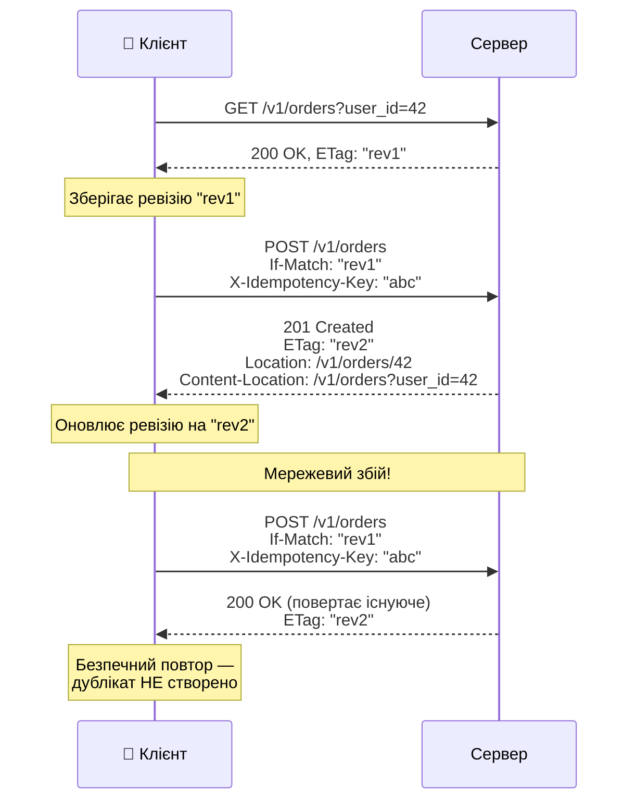

# Ідемпотентність та синхронізація стану

::note
Ми вже знаємо, що `PUT` і `DELETE` ідемпотентні, а `POST` — ні. Але що робити, коли повторний `POST` може створити дублікат замовлення? І як клієнт синхронізує свій стан із сервером після помилки? Ця стаття відповідає на обидва питання.
::

## 1. Проблема: неідемпотентний POST

Уявіть ситуацію: клієнт надсилає `POST /v1/orders` для створення замовлення. Сервер створює замовлення, але при відправці відповіді мережа обривається. Клієнт не отримав відповідь.

```
📱 Клієнт → POST /v1/orders → 🌐 мережа → Сервер (створив замовлення #42)
📱 Клієнт ← ??? ← 🌐 обрив! ← Сервер (відповідь втрачена)
```

**Що робити клієнту?**

| Варіант | Проблема |
|:---|:---|
| Повторити запит | Може створитися **дублікат** (#43) |
| Не повторювати | Замовлення може бути **не створене** — клієнт не знає |
| Запитати GET | Не зрозуміло, чи то «його» замовлення, чи збіг |

::caution
Це фундаментальна проблема розподілених систем: клієнт **не може знати**, чи сервер обробив його запит. Повторний POST може створити дублікат. Не повторювати — можна втратити замовлення.
::

---

## 2. Три способи забезпечити ідемпотентність

### Спосіб 1: PUT з клієнтським ID

Найпростіший спосіб — перенести відповідальність за ID на клієнта. `PUT` ідемпотентний за визначенням:

```csharp [PUT з UUID — ідемпотентний за визначенням]
app.MapPut("/v1/orders/{id}", (Guid id, OrderRequest req) =>
{
    // URL = ключ ідемпотентності
    // Повторний PUT з тим самим ID → та сама дія
    if (db.OrderExists(id))
    {
        // Замовлення вже існує — повертаємо його
        return Results.Ok(db.GetOrder(id));
    }

    var order = db.CreateOrder(id, req);
    return Results.Created(
        $"/v1/orders/{order.Id}", order);
});

// Клієнт генерує UUID:
// PUT /v1/orders/550e8400-e29b-41d4-a716-446655440000
// Повторний виклик — безпечний!
```

::warning
**Недолік:** потрібно довіряти клієнту генерацію ID. Це працює для UUID, але не для послідовних числових ID. Також клієнт може навмисно вибрати ID, що вже зайнятий.
::

### Спосіб 2: POST + токен ідемпотентності

Клієнт генерує **унікальний ключ запиту** і передає його у заголовку:

```csharp [POST з токеном ідемпотентності]
app.MapPost("/v1/orders", 
    (OrderRequest req, HttpContext ctx) =>
{
    // Клієнт передає унікальний ключ
    var idempotencyKey = ctx.Request.Headers[
        "X-Idempotency-Key"].FirstOrDefault();

    if (string.IsNullOrEmpty(idempotencyKey))
        return Results.Json(
            new { error = "X-Idempotency-Key required" },
            statusCode: 428);

    // Перевіряємо: чи вже оброблений цей ключ?
    var existing = db.GetByIdempotencyKey(
        idempotencyKey);
    if (existing is not null)
    {
        // Повторний запит — повертаємо збережену відповідь
        return Results.Ok(existing);
    }

    // Перший раз — створюємо замовлення
    var order = db.CreateOrder(req, idempotencyKey);
    return Results.Created(
        $"/v1/orders/{order.Id}", order);
});
```

```http [Використання токена]
POST /v1/orders HTTP/1.1
X-Idempotency-Key: "req-abc-12345"
Content-Type: application/json

{"recipe": "lungo", "coffee_machine_id": 42}
→
HTTP/1.1 201 Created

// Повторний запит з тим самим ключем:
POST /v1/orders HTTP/1.1
X-Idempotency-Key: "req-abc-12345"
→
HTTP/1.1 200 OK (повертає те саме замовлення)
```

### Спосіб 3: Чернетка + підтвердження (draft-commit)

Найнадійніший підхід з книги Константинова:

::steps

### POST — створюємо чернетку (неідемпотентно, але «легко»)

```csharp
app.MapPost("/v1/orders/drafts", 
    (DraftRequest req) =>
{
    // Створення чернетки — «легка» операція
    // Навіть якщо створяться дублікати —
    // це лише чернетки, не реальні замовлення
    var draft = db.CreateDraft(req);
    return Results.Created(
        $"/v1/orders/drafts/{draft.Id}", draft);
});
```

### PUT — підтверджуємо чернетку (ідемпотентно!)

```csharp
app.MapPut("/v1/orders/drafts/{id}/commit", 
    (Guid id) =>
{
    var draft = db.GetDraft(id);
    if (draft is null)
        return Results.NotFound();

    if (draft.CommittedOrderId is not null)
    {
        // Вже підтверджена — повертаємо замовлення
        // Повторний виклик безпечний!
        return Results.Ok(
            db.GetOrder(draft.CommittedOrderId.Value));
    }

    // Перше підтвердження
    var order = db.CommitDraft(id);
    return Results.Created(
        $"/v1/orders/{order.Id}", order);
});
```

::

::tip
**Перевага draft-commit**: `POST` створює «легку» чернетку — навіть якщо мережа обірветься і створяться дублікати чернеток, реальне замовлення буде лише одне (через ідемпотентний `PUT`). Невикористані чернетки можна очистити через TTL.
::

---

## 3. Content-Location: «де тепер дані?»

Після успішного створення замовлення клієнту потрібно знати дві речі:
1. **Де** знаходиться створений ресурс → заголовок `Location`
2. **Де** знаходиться оновлений список → заголовок `Content-Location`

```csharp [Location та Content-Location]
app.MapPost("/v1/orders", 
    (OrderRequest req, HttpContext ctx) =>
{
    var order = db.CreateOrder(req);
    var newRevision = db.GetOrdersRevision(req.UserId);

    // Location — URL нового ресурсу
    // Клієнт може зробити GET для деталей
    ctx.Response.Headers.Location = 
        $"/v1/orders/{order.Id}";

    // Content-Location — URL, де можна отримати
    // актуальний стан колекції (із новою ревізією)
    ctx.Response.Headers["Content-Location"] = 
        $"/v1/orders?user_id={req.UserId}";

    // ETag — нова ревізія колекції
    ctx.Response.Headers.ETag = $"\"{newRevision}\"";

    return Results.Created(
        $"/v1/orders/{order.Id}", order);
});
```

---

## 4. Синхронізація стану клієнта

### Повний цикл взаємодії

Зібравши все разом, ось як виглядає повний цикл безпечної взаємодії клієнта з API:

::mermaid



::

### Що робити після різних помилок

| Помилка | Причина | Дія клієнта |
|:---|:---|:---|
| `412 Precondition Failed` | Ревізія застаріла | Перечитати дані (GET), повторити з новою ревізією |
| `428 Precondition Required` | If-Match не передано | Додати заголовок If-Match |
| `409 Conflict` | Дублікат (без токена ідемпотентності) | Перевірити, чи вже створено (GET) |
| `429 Too Many Requests` | Rate limit | Зачекати Retry-After секунд, повторити |
| `500 / 503` | Серверна помилка | Повторити через Retry-After (якщо вказано) |
| Таймаут / обрив | Мережевий збій | Повторити з тим самим X-Idempotency-Key |

---

## 5. Retry-стратегія: Exponential Backoff

Для автоматичних повторів використовується **експонентне зростання інтервалу**:

```csharp [Retry з exponential backoff]
async Task<HttpResponseMessage> SendWithRetry(
    HttpClient client,
    HttpRequestMessage request,
    int maxRetries = 3)
{
    for (int attempt = 0; attempt <= maxRetries; attempt++)
    {
        var response = await client.SendAsync(request);

        // Успіх або клієнтська помилка — не повторюємо
        if ((int)response.StatusCode < 500 
            && response.StatusCode != 
                System.Net.HttpStatusCode.TooManyRequests)
        {
            return response;
        }

        if (attempt == maxRetries)
            return response; // Вичерпано спроби

        // Retry-After від сервера або backoff
        var retryAfter = response.Headers.RetryAfter;
        var delay = retryAfter?.Delta 
            ?? TimeSpan.FromSeconds(
                Math.Pow(2, attempt)); // 1, 2, 4 сек

        await Task.Delay(delay);
    }

    throw new UnreachableException();
}
```

::tip
**Важливе правило:** автоматично повторюються тільки **безпечні** (`GET`) та **ідемпотентні** (`PUT`, `DELETE`) запити. `POST` повторюється **тільки** якщо є токен ідемпотентності або документація API явно це дозволяє.
::

---

## 6. Практичні завдання

### Рівень 1: Базовий

::accordion

::accordion-item{label="Завдання 10.1: Токен ідемпотентності" icon="i-lucide-circle-help"}
Реалізуйте `POST /v1/payments` з підтримкою `X-Idempotency-Key`:

1. Без ключа → `428 Precondition Required`
2. Перший запит із ключем → `201 Created`
3. Повторний запит із тим самим ключем → `200 OK` (та сама відповідь)
4. Запит із іншим ключем → `201 Created` (нова оплата)

Використайте `Dictionary<string, Payment>` як сховище.
::

::

### Рівень 2: Проєктування

::accordion

::accordion-item{label="Завдання 10.2: Draft-commit цикл" icon="i-lucide-circle-help"}
Реалізуйте повний draft-commit цикл для створення замовлення:

1. `POST /v1/orders/drafts` — створити чернетку
2. `GET /v1/orders/drafts/{id}` — переглянути чернетку
3. `PUT /v1/orders/drafts/{id}/commit` — підтвердити (ідемпотентно)
4. `GET /v1/orders/{id}` — отримати створене замовлення

Протестуйте: підтвердіть одну чернетку двічі — результат має бути однаковим.
::

::accordion-item{label="Завдання 10.3: Повний цикл синхронізації" icon="i-lucide-circle-help"}
Реалізуйте API з повною синхронізацією:

1. `GET /v1/tasks?user_id=…` → повертає список з ETag
2. `POST /v1/tasks` з `If-Match` і `X-Idempotency-Key`
3. `Location` та `Content-Location` у відповіді
4. Обробка `412`, `428`, `409`
5. Retry-логіка на клієнті з exponential backoff
::

::

---

## 7. Резюме

::card-group

::card{title="POST не ідемпотентний" icon="i-lucide-alert-triangle"}
Повторний POST може створити дублікат. Три рішення: PUT з клієнтським ID, токен ідемпотентності (X-Idempotency-Key), або draft-commit.
::

::card{title="Draft-commit — найнадійніше" icon="i-lucide-file-check"}
POST створює «легку» чернетку, PUT підтверджує її ідемпотентно. Невикористані чернетки очищуються по TTL.
::

::card{title="Location + Content-Location" icon="i-lucide-map-pin"}
Location — URL нового ресурсу. Content-Location — URL оновленої колекції. ETag — нова ревізія.
::

::card{title="Exponential backoff" icon="i-lucide-timer"}
Автоповтор тільки для GET, PUT, DELETE. POST — тільки з токеном ідемпотентності. Інтервал: 1, 2, 4, 8… секунд.
::

::

**Далі:** у наступній статті ми розберемо **списки, пагінацію та організацію доступу** — limit/offset, курсори, іммутабельні та мутабельні списки.
