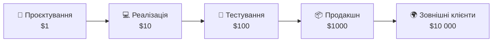

# Процес проєктування API та документування

::note
Ми вивчили окремі аспекти проєктування API: URL-номенклатуру, CRUD, валідацію, помилки, ідемпотентність. Тепер зберемо все разом у **покроковий алгоритм**: від першої ідеї до задокументованого, протестованого API.
::

## 1. Чому процес важливий

Книга Константинова наголошує: API — це **контракт**. На відміну від внутрішнього коду, який можна рефакторити коли завгодно, API **не можна змінити** після публікації без наслідків. Кожен клієнт, що інтегрувався з вашим API, залежить від його поточної поведінки.

Наслідки поганого проєктування:

| Помилка | Наслідок |
|:---|:---|
| Змінили формат відповіді | Всі клієнти зламалися |
| Перейменували поле | Мобільний додаток крашиться |
| Забрали ендпоінт | Партнерська інтеграція перестала працювати |
| Додали обов'язковий параметр | Старі клієнти не можуть зробити запит |

**Вартість виправлення** зростає експоненційно з кожним кроком:

::mermaid



::

Виправити помилку на етапі проєктування — дешево. Виправити ту саму помилку, коли 1000 клієнтів вже інтегрувалися — **дуже дорого**.

---

## 2. Покроковий алгоритм проєктування

::steps

### Крок 1: Аналіз предметної області

Перш ніж писати код або навіть проєктувати URL — **зрозумійте домен**. Які сутності існують? Як вони пов'язані? Хто є споживачами API?

**Питання, на які потрібно відповісти:**

- Які основні сутності? (замовлення, рецепти, кавові машини)
- Як вони пов'язані? (замовлення належить користувачу, рецепт — кавовій машині)
- Хто споживач API? (мобільний додаток, веб-клієнт, партнерський сервіс)
- Які операції потрібні? (створити, переглянути, скасувати, шукати)
- Які обмеження? (ліміти, права доступу, бізнес-правила)

**Результат:** список сутностей із зв'язками та операціями.

### Крок 2: Визначення ресурсів та URL

На основі аналізу визначте **ресурси** (іменники) та їх URL:

```
/v1/recipes                    — рецепти (колекція)
/v1/recipes/{id}               — конкретний рецепт
/v1/coffee-machines             — кавові машини
/v1/coffee-machines/{id}       — конкретна машина
/v1/orders                     — замовлення
/v1/orders/{id}                — конкретне замовлення
/v1/orders/{id}/attachments    — вкладення замовлення
```

Правила з попередніх статей:
- **Path** — для строгої ієрархії («належить»)
- **Query** — для фільтрів та нестрогих зв'язків
- **Версія** — в path (`/v1/...`)
- **Множина** — для колекцій (`/orders`, не `/order`)

### Крок 3: Визначення операцій (методи + URL)

Для кожного ресурсу визначте набір операцій. Пам'ятайте: **CRUD — лише стартова мнемоніка**. У реальному API завжди більше операцій.

Приклад для замовлень:

| # | Метод | URL | Операція |
|:---|:---|:---|:---|
| 1 | `GET` | `/v1/orders?user_id=…` | Список замовлень |
| 2 | `POST` | `/v1/orders/drafts` | Створити чернетку |
| 3 | `PUT` | `/v1/orders/drafts/{id}/commit` | Підтвердити чернетку |
| 4 | `GET` | `/v1/orders/{id}` | Отримати замовлення |
| 5 | `POST` | `/v1/orders/{id}/drafts` | Чернетка змін |
| 6 | `PUT` | `/v1/orders/{id}/drafts/{id}/commit` | Підтвердити зміни |
| 7 | `PUT` | `/v1/orders/{id}/archive` | Архівувати |
| 8 | `POST` | `/v1/orders/search` | Складний пошук |

### Крок 4: Визначення форматів запитів і відповідей

Для кожної операції визначте:
1. **Формат запиту** — які поля, типи, обов'язковість
2. **Формат відповіді** — які поля повертаються
3. **Помилки** — які помилки можливі і з яким форматом

Це найважливіший крок для **консистентності** (стаття 07):
- Однакові поля називаються однаково скрізь
- Дати — завжди ISO 8601
- Гроші — завжди рядки або мінімальні одиниці
- Помилки — завжди у форматі `ApiError`

### Крок 5: Валідація дизайну

Перш ніж писати код — перевірте дизайн:

1. **Чи консистентні імена?** Якщо в одному місці `user_id`, а в іншому `userId` — це помилка
2. **Чи ідемпотентні mutation-операції?** `POST` створює чернетку, `PUT` підтверджує — ідемпотентно?
3. **Чи є обробка помилок для кожного ендпоінту?** Яка таблиця помилок?
4. **Чи є пагінація для списків?** Курсорна? З лімітами?
5. **Чи є версіонування?** `/v1/...`?
6. **Чи документовані всі поля?**

### Крок 6: Реалізація та тестування

Тепер можна писати код. Порядок:
1. Створити моделі (records/classes)
2. Реалізувати ендпоінти
3. Додати валідацію
4. Додати обробку помилок (middleware)
5. Додати документацію (OpenAPI)
6. Написати тести

### Крок 7: Документування

Фінальний крок — документація. Це **не опціонально** — API без документації не існує.

::

---

## 3. OpenAPI / Swagger

### Що таке OpenAPI

**OpenAPI** (раніше Swagger) — це стандарт для опису HTTP API. Він дозволяє визначити всі ендпоінти, параметри, формати запитів/відповідей та помилки у **машиночитаємому форматі** (YAML або JSON).

Навіщо це потрібно:
- **Автогенерація документації** — Swagger UI створює інтерактивну документацію
- **Автогенерація клієнтів** — бібліотеки для будь-якої мови програмування
- **Валідація** — перевірка запитів і відповідей на відповідність специфікації
- **Тестування** — інструменти можуть генерувати тести з документації
- **Контракт** — розробники клієнта і сервера працюють від одного документа

### OpenAPI у ASP.NET Core

ASP.NET Core Minimal API автоматично генерує OpenAPI-специфікацію:

```csharp [Підключення OpenAPI/Swagger]
var builder = WebApplication.CreateBuilder(args);

// Додаємо OpenAPI
builder.Services.AddEndpointsApiExplorer();
builder.Services.AddSwaggerGen(options =>
{
    options.SwaggerDoc("v1", new()
    {
        Title = "Coffee API",
        Version = "v1",
        Description = "API для замовлення кави"
    });
});

var app = builder.Build();

// Включаємо Swagger UI (тільки для розробки!)
if (app.Environment.IsDevelopment())
{
    app.UseSwagger();
    app.UseSwaggerUI();
}
```

### Збагачення документації

Minimal API автоматично визначає базову інформацію з коду, але для якісної документації потрібні **додаткові метадані**:

```csharp [Документований ендпоінт]
app.MapGet("/v1/orders/{id}", (Guid id) =>
{
    var order = db.GetOrder(id);
    return order is not null
        ? Results.Ok(order)
        : Results.NotFound();
})
.WithName("GetOrderById")
.WithSummary("Отримати замовлення за ID")
.WithDescription(
    "Повертає повну інформацію про замовлення. " +
    "UUID формат для ідентифікатора.")
.Produces<Order>(200)
.Produces<ApiError>(404)
.Produces<ApiError>(401)
.WithTags("Orders");
```

---

## 4. Версіонування та зворотна сумісність

### Що є зломом зворотної сумісності

Не всі зміни ламають клієнтів. Розрізнення **breaking** та **non-breaking** змін критичне:

| Зміна | Breaking? | Чому |
|:---|:---|:---|
| Додати нове **опціональне** поле до запиту | ❌ Ні | Старі клієнти його не передають — все працює |
| Додати нове поле у **відповідь** | ❌ Ні | Клієнти ігнорують невідомі поля |
| Додати новий **ендпоінт** | ❌ Ні | Старі клієнти його не використовують |
| **Перейменувати** поле | ✅ Так | Клієнти шукають старе ім'я |
| **Видалити** поле з відповіді | ✅ Так | Клієнти залежать від нього |
| Зробити поле **обов'язковим** | ✅ Так | Старі клієнти його не передають |
| **Змінити тип** поля | ✅ Так | Клієнти очікують старий тип |
| Видалити **ендпоінт** | ✅ Так | Клієнти його використовують |

::tip
**Золоте правило:** додавати можна, видаляти/змінювати — не можна. Тому при початковому проєктуванні **не додавайте зайвих полів** — кожне поле, яке ви повернете, стає частиною контракту назавжди.
::

### Коли створювати нову версію

Нова версія API (`/v2/...`) потрібна тільки коли:
1. Breaking changes **неминучі** (переробка моделі даних)
2. **Стара версія підтримується** паралельно (мінімум 6-12 місяців)
3. **Міграційний план** задокументований (як клієнту перейти з v1 на v2)

Нова версія — це фактично **новий API**, який потрібно підтримувати разом зі старим. Це дорого.

---

## 5. Code style та конвенції

### Єдині правила для всієї команди

Книга Константинова наголошує: **консистентність** важливіша за будь-яке конкретне правило. Краще мати «неідеальні» правила, яких дотримуються **всі**, ніж ідеальні, яких не дотримується ніхто.

### Чеклист конвенцій

Визначте та задокументуйте наступне:

**URL:**
- [ ] Множина для колекцій (`/orders`, не `/order`)
- [ ] Тільки lowercase та дефіси (`coffee-machines`, не `CoffeeMachines`)
- [ ] Версія в path (`/v1/...`)
- [ ] Без слешу наприкінці (`/orders`, не `/orders/`)

**JSON:**
- [ ] Один стиль для імен: `snake_case` або `camelCase` (обрати один!)
- [ ] Дати у ISO 8601 (`"2024-02-26T14:30:00Z"`)
- [ ] Гроші як рядки або у мінімальних одиницях
- [ ] Enum-и як рядки (`"active"`, не `1`)
- [ ] Null-поля: повертати як `null` чи не повертати?

**Помилки:**
- [ ] Єдиний формат `ApiError` для всіх помилок
- [ ] `reason` — унікальний для кожного типу помилки
- [ ] `localized_message` — для кінцевого користувача
- [ ] `developer_message` — для розробника
- [ ] 5xx — без деталей назовні

**Пагінація:**
- [ ] Курсорна (не offset)
- [ ] Ліміт за замовчуванням та максимальний
- [ ] Формат відповіді: `items`, `next_cursor`, `has_more`

**Безпека:**
- [ ] HTTPS обов'язково
- [ ] UUID для зовнішніх ідентифікаторів
- [ ] JWT з коротким часом життя
- [ ] Rate limiting для всіх ендпоінтів

---

## 6. Документація як продукт

### Що повинна містити документація

Хороша документація API — це не просто список ендпоінтів. Вона повинна включати:

| Розділ | Опис | Приклад |
|:---|:---|:---|
| **Getting Started** | Як почати використовувати API за 5 хвилин | Реєстрація → токен → перший запит |
| **Аутентифікація** | Як отримати та використовувати токен | JWT, refresh, термін дії |
| **Посилання (Reference)** | Кожен ендпоінт з параметрами та прикладами | Автогенеровано з OpenAPI |
| **Помилки** | Каталог всіх можливих помилок | Таблиця reason → опис → дія |
| **Приклади** | Повні сценарії використання | «Замовити каву від початку до кінця» |
| **Changelog** | Історія змін API | Версія → дата → зміни |
| **Ліміти** | Rate limiting, розміри, пагінація | Таблиця лімітів для кожного ендпоінту |

### Помилки документації

| Помилка | Наслідок |
|:---|:---|
| Документація не відповідає коду | Розробник витрачає години на дебагінг |
| Немає прикладів запитів | Розробник вгадує формат |
| Не описані помилки | Розробник не обробляє edge cases |
| Немає changelog | Розробник не знає, що змінилось |

::tip
**Рекомендація:** Генеруйте документацію **з коду** (через OpenAPI), а не пишіть вручну. Ручна документація завжди застаріває. Код — єдине джерело правди.
::

---

## 7. Практичні завдання

### Рівень 1: Базовий

::accordion

::accordion-item{label="Завдання 13.1: OpenAPI для вашого API" icon="i-lucide-circle-help"}
Підключіть Swagger до Minimal API:

1. Додайте `AddEndpointsApiExplorer()` та `AddSwaggerGen()`
2. Додайте `WithName()`, `WithSummary()`, `Produces<>()` до 3 ендпоінтів
3. Відкрийте Swagger UI та переконайтесь, що документація коректна
4. Зробіть тестовий запит через Swagger UI
::

::accordion-item{label="Завдання 13.2: Чеклист якості" icon="i-lucide-circle-help"}
Візьміть будь-який API, що ви створювали у попередніх завданнях, та перевірте його за чеклистом конвенцій з розділу 5. Для кожного пункту:

1. ✅ або ❌ — чи виконується
2. Якщо ❌ — виправте
::

::

### Рівень 2: Проєктування

::accordion

::accordion-item{label="Завдання 13.3: Спроєктуйте API з нуля" icon="i-lucide-circle-help"}
Оберіть предметну область (бібліотека, спортзал, ресторан) та виконайте весь алгоритм:

1. **Аналіз** — визначте 4-6 сутностей та їх зв'язки
2. **URL** — визначте ресурси та номенклатуру URL
3. **Операції** — визначте 10-15 ендпоінтів (не просто CRUD!)
4. **Формати** — визначте формати для 3-4 ключових запитів/відповідей
5. **Помилки** — визначте каталог помилок (мінімум 5 типів)
6. **Документація** — опишіть API у Markdown або OpenAPI
7. **Реалізація** — реалізуйте 5 ключових ендпоінтів на Minimal API
::

::

---

## 8. Резюме модуля

Ми пройшли весь шлях від базових концепцій до повного алгоритму проєктування:

::card-group

::card{title="Фундамент" icon="i-lucide-layers"}
Формати даних (JSON), парадигми (REST), HTTP-методи та статус-коди — мова, якою «розмовляє» API.
::

::card{title="Архітектура" icon="i-lucide-building"}
Stateless, ETag, JWT. URL-номенклатура, CRUD → 8-10 ендпоінтів. Чернетка → підтвердження.
::

::card{title="Якість" icon="i-lucide-shield-check"}
Консистентність імен, ISO 8601, валідація за порядком, три аудиторії помилок, ідемпотентність.
::

::card{title="Процес" icon="i-lucide-clipboard-check"}
Аналіз → URL → операції → формати → валідація → реалізація → документація. Code style та чеклисти.
::

::

::tip
**Головний урок з книги Константинова:** API — це **інтерфейс для розробника**. Всі рішення — від іменування до обробки помилок — повинні прийматися з точки зору **зручності та зрозумілості для того, хто буде використовувати ваш API**.
::
