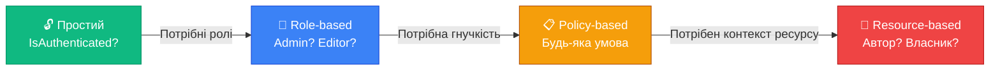

# Авторизація: ролі, політики та resource-based доступ

::note
Аутентифікація відповіла на питання «хто ти?». Тепер ми відповідаємо на набагато складніше питання: **«що тобі дозволено?»**. У цій статті ми пройдемо від простої перевірки ролей до складних кастомних політик та авторизації на рівні конкретного ресурсу.
::

---

## 1. Три рівні авторизації

У ASP.NET Core авторизація має три рівні складності. Кожен наступний — потужніший:

| Рівень | Підхід           | Приклад                                                            |
| :----- | :--------------- | :----------------------------------------------------------------- |
| 1️⃣     | **Simple**       | Просто перевірити: аутентифікований чи ні?                         |
| 2️⃣     | **Role-based**   | Перевірити роль: Admin, Editor, User?                              |
| 3️⃣     | **Policy-based** | Перевірити будь-яку складну умову: підписка, вік, чи автор ресурсу |

::mermaid



::

---

## 2. Simple — «Тільки для аутентифікованих»

Найпростіший рівень: ендпоінт доступний **будь-кому**, хто пройшов аутентифікацію:

```csharp [Проста авторизація]
// Будь-який аутентифікований користувач
app.MapGet("/orders", (ClaimsPrincipal user) =>
    Results.Ok($"Orders for {user.Identity?.Name}"))
    .RequireAuthorization();
```

Якщо запит без токена (або з невалідним) → `401 Unauthorized`.

---

## 3. Role-based — авторизація за ролями

### Концепція

Роль — це **label**, який визначає групу дозволів. Типові ролі: `Admin`, `Moderator`, `User`, `Editor`.

Ролі приходять як Claims у JWT-токені:

```json
{
    "sub": "42",
    "role": ["Admin", "Editor"]
}
```

У C# кожна роль — **окремий Claim** типу `ClaimTypes.Role`.

### Перевірка ролей у Minimal API

```csharp [Авторизація за ролями]
// Тільки Admin
app.MapDelete("/products/{id}", (int id) =>
    Results.NoContent())
    .RequireAuthorization(policy =>
        policy.RequireRole("Admin"));

// Admin АБО Editor (будь-яка з ролей)
app.MapPut("/articles/{id}", (int id) =>
    Results.Ok("Updated"))
    .RequireAuthorization(policy =>
        policy.RequireRole("Admin", "Editor"));
```

### Ролі у Route Groups

```csharp [Route Group з роллю]
// Всі ендпоінти адмін-панелі — тільки Admin
var admin = app.MapGroup("/admin")
    .RequireAuthorization(policy =>
        policy.RequireRole("Admin"));

admin.MapGet("/users", () => "List users");
admin.MapDelete("/users/{id}", (int id) =>
    Results.NoContent());
admin.MapGet("/stats", () => "Statistics");
// Все захищено роллю Admin ✅
```

### Перехоплення ролей у коді

Іноді потрібно перевірити роль **всередині** ендпоінту, а не на рівні маршруту:

```csharp [Перевірка ролі в коді]
app.MapGet("/orders/{id}", (int id,
    ClaimsPrincipal user) =>
{
    var order = GetOrder(id);

    // Admin бачить усі деталі
    if (user.IsInRole("Admin"))
        return Results.Ok(new
        {
            order.Id, order.Items,
            order.InternalNotes  // Тільки для адміна
        });

    // Звичайний user — без internal notes
    return Results.Ok(new
    {
        order.Id, order.Items
    });
}).RequireAuthorization();
```

::tip
Використовуйте `RequireAuthorization(policy => policy.RequireRole(...))` для **блокування** доступу. Використовуйте `user.IsInRole(...)` для **фільтрації** вмісту відповіді.
::

---

## 4. Policy-based — гнучкі політики

### Проблема ролей

Ролі — це просто мітки. А що, якщо потрібно перевірити складнішу умову?

- «Тільки користувачі з **верифікованим email**»
- «Тільки користувачі **старше 18 років**»
- «Тільки користувачі з **активною Premium-підпискою**»

Ролі для цього не підходять — не створювати ж роль `"Over18WithPremiumAndVerifiedEmail"`. Тут допомагають **Policy** (політики).

### Створення політик

Політика — це **іменована вимога**, яка зареєстрована в DI:

```csharp [Program.cs — реєстрація політик]
builder.Services.AddAuthorizationBuilder()
    // Політика 1: потрібна певна роль
    .AddPolicy("AdminOnly", policy =>
        policy.RequireRole("Admin"))

    // Політика 2: потрібен конкретний claim
    .AddPolicy("VerifiedEmail", policy =>
        policy.RequireClaim("email_verified", "true"))

    // Політика 3: комбінація умов
    .AddPolicy("PremiumUser", policy =>
        policy
            .RequireAuthenticatedUser()
            .RequireClaim("subscription", "premium")
            .RequireRole("User"))

    // Політика 4: мінімальний вік
    .AddPolicy("AdultOnly", policy =>
        policy.RequireAssertion(context =>
        {
            var ageClaim = context.User
                .FindFirst("age")?.Value;
            return ageClaim is not null
                && int.Parse(ageClaim) >= 18;
        }));
```

### Використання політик

```csharp [Застосування політик до ендпоінтів]
app.MapDelete("/products/{id}", (int id) =>
    Results.NoContent())
    .RequireAuthorization("AdminOnly");

app.MapPost("/reviews", (Review review) =>
    Results.Created($"/reviews/1", review))
    .RequireAuthorization("VerifiedEmail");

app.MapGet("/premium/content", () =>
    Results.Ok("Exclusive content"))
    .RequireAuthorization("PremiumUser");

app.MapPost("/casino/bet", (BetRequest bet) =>
    Results.Ok(bet))
    .RequireAuthorization("AdultOnly");
```

### Вбудовані методи Policy Builder

::field-group

::field{name="RequireAuthenticatedUser()" type="method"}
Вимагає аутентифікованого користувача. Те саме, що `.RequireAuthorization()` без політики.
::

::field{name="RequireRole(params string[])" type="method"}
Вимагає **будь-яку** з перелічених ролей. `RequireRole("Admin", "Editor")` = Admin **АБО** Editor.
::

::field{name="RequireClaim(type, value)" type="method"}
Вимагає claim з конкретним типом і значенням. Наприклад: `RequireClaim("subscription", "premium")`.
::

::field{name="RequireClaim(type)" type="method"}
Вимагає **наявності** claim (з будь-яким значенням). Наприклад: `RequireClaim("department")` — у користувача має бути цей claim.
::

::field{name="RequireAssertion(Func)" type="method"}
Довільна лямбда-перевірка. Для складних умов, які не вкладаються в стандартні методи.
::

::

---

## 5. Custom Requirements та Handlers

### Коли RequireAssertion недостатньо

`RequireAssertion` зручний для простих перевірок, але:

- Лямбда — нетестовна (не можна написати unit test)
- Логіка в лямбді — не перевикористовується
- Не підтримує DI (не можна ін'єктувати сервіси)

Для складних перевірок ASP.NET Core надає **Requirement + Handler** паттерн.

### Крок 1: Requirement — «що перевіряємо»

```csharp [Requirements/MinAgeRequirement.cs]
using Microsoft.AspNetCore.Authorization;

public class MinAgeRequirement
    : IAuthorizationRequirement
{
    public int MinAge { get; }

    public MinAgeRequirement(int minAge)
    {
        MinAge = minAge;
    }
}
```

`IAuthorizationRequirement` — це маркерний інтерфейс. Клас містить **параметри** перевірки (мінімальний вік), але **не логіку**.

### Крок 2: Handler — «як перевіряємо»

```csharp [Handlers/MinAgeHandler.cs]
using Microsoft.AspNetCore.Authorization;

public class MinAgeHandler
    : AuthorizationHandler<MinAgeRequirement>
{
    protected override Task HandleRequirementAsync(
        AuthorizationHandlerContext context,
        MinAgeRequirement requirement)
    {
        var ageClaim = context.User
            .FindFirst("date_of_birth")?.Value;

        if (ageClaim is null)
        {
            // Claim відсутній — не можемо перевірити
            // Не викликаємо Fail() — дозволяємо
            // іншим handlers спробувати
            return Task.CompletedTask;
        }

        var dateOfBirth = DateOnly.Parse(ageClaim);
        var age = CalculateAge(dateOfBirth);

        if (age >= requirement.MinAge)
        {
            context.Succeed(requirement);  // ✅
        }

        return Task.CompletedTask;
    }

    private static int CalculateAge(DateOnly dob)
    {
        var today = DateOnly.FromDateTime(
            DateTime.UtcNow);
        var age = today.Year - dob.Year;
        if (dob > today.AddYears(-age))
            age--;
        return age;
    }
}
```

::warning
**Важливо:** Handler викликає `context.Succeed(requirement)` якщо перевірка пройшла. Якщо НЕ пройшла — він **не викликає нічого** (або `context.Fail()` для жорсткої відмови). Це дозволяє мати кілька handlers для одного requirement (наприклад, один перевіряє claim, інший — базу даних).
::

### Крок 3: Реєстрація

```csharp [Program.cs — реєстрація]
builder.Services
    .AddSingleton<IAuthorizationHandler,
        MinAgeHandler>();

builder.Services.AddAuthorizationBuilder()
    .AddPolicy("Adult", policy =>
        policy.Requirements.Add(
            new MinAgeRequirement(18)))
    .AddPolicy("SeniorDiscount", policy =>
        policy.Requirements.Add(
            new MinAgeRequirement(60)));
```

Один Handler обслуговує **обидві** політики! Requirement задає параметри (18 чи 60), Handler — логіку перевірки.

### Приклад: Handler з DI

Handlers повністю підтримують Dependency Injection. Наприклад, перевірка підписки через базу даних:

```csharp [Requirements/ActiveSubscriptionRequirement.cs]
public class ActiveSubscriptionRequirement
    : IAuthorizationRequirement
{
    public string RequiredPlan { get; }

    public ActiveSubscriptionRequirement(
        string requiredPlan)
    {
        RequiredPlan = requiredPlan;
    }
}
```

```csharp [Handlers/SubscriptionHandler.cs]
public class SubscriptionHandler
    : AuthorizationHandler<
        ActiveSubscriptionRequirement>
{
    // DI: ін'єкція сервісу підписок
    private readonly ISubscriptionService _subs;

    public SubscriptionHandler(
        ISubscriptionService subs)
    {
        _subs = subs;
    }

    protected override async Task
        HandleRequirementAsync(
            AuthorizationHandlerContext context,
            ActiveSubscriptionRequirement requirement)
    {
        var userId = context.User
            .FindFirst("sub")?.Value;

        if (userId is null)
            return;

        // Запит до БД через DI-сервіс
        var subscription = await _subs
            .GetActiveSubscription(
                int.Parse(userId));

        if (subscription?.Plan ==
                requirement.RequiredPlan
            && subscription.ExpiresAt >
                DateTime.UtcNow)
        {
            context.Succeed(requirement);
        }
    }
}
```

---

## 6. Resource-based авторизація

### Проблема

Уявіть блог-платформу. Ендпоінт `PUT /posts/{id}` має бути доступний **тільки автору** поста. Але роль «Author» не допомагає — потрібно перевірити, чи **конкретний** пост належить **конкретному** користувачу.

Це **resource-based авторизація** — перевірка прав на конкретний ресурс.

### Реалізація: Requirement + Resource Handler

```csharp [Requirements/ResourceOwnerRequirement.cs]
public class ResourceOwnerRequirement
    : IAuthorizationRequirement
{
}
```

```csharp [Handlers/PostOwnerHandler.cs]
public class PostOwnerHandler
    : AuthorizationHandler<
        ResourceOwnerRequirement, Post>
{
    protected override Task HandleRequirementAsync(
        AuthorizationHandlerContext context,
        ResourceOwnerRequirement requirement,
        Post resource)  // ← конкретний ресурс!
    {
        var userId = context.User
            .FindFirst("sub")?.Value;

        // Перевіряємо, чи автор поста = поточний user
        if (userId is not null
            && resource.AuthorId.ToString() == userId)
        {
            context.Succeed(requirement);
        }

        return Task.CompletedTask;
    }
}
```

### Використання в ендпоінті

Resource-based авторизація не може бути в атрибуті — потрібен **конкретний ресурс**, який доступний тільки всередині ендпоінту:

```csharp [Resource-based auth у ендпоінті]
app.MapPut("/posts/{id}",
    async (int id,
           UpdatePostRequest req,
           IAuthorizationService authService,
           ClaimsPrincipal user,
           PostRepository repo) =>
{
    // 1. Отримуємо ресурс
    var post = await repo.GetById(id);
    if (post is null)
        return Results.NotFound();

    // 2. Перевіряємо авторизацію НА ресурс
    var authResult = await authService
        .AuthorizeAsync(
            user,
            post,  // ← конкретний об'єкт!
            new ResourceOwnerRequirement());

    if (!authResult.Succeeded)
        return Results.Forbid();  // 403

    // 3. Оновлюємо
    post.Title = req.Title;
    post.Content = req.Content;
    await repo.Update(post);

    return Results.Ok(post);
}).RequireAuthorization();
```

::tip
**403 Forbidden vs 401 Unauthorized:**

- **401** — «Я не знаю, хто ти» (відсутній або невалідний токен)
- **403** — «Я знаю, хто ти, але тобі **заборонено**» (є токен, але немає прав)

`Results.Forbid()` повертає саме `403`.
::

---

## 7. Fallback та Default Policy

### Default Policy

Якщо ви викликаєте `.RequireAuthorization()` **без аргументів**, ASP.NET Core застосовує **Default Policy**. За замовчуванням — просто `RequireAuthenticatedUser()`.

Ви можете змінити default policy:

```csharp [Зміна Default Policy]
builder.Services.AddAuthorizationBuilder()
    .SetDefaultPolicy(new AuthorizationPolicyBuilder()
        .RequireAuthenticatedUser()
        .RequireClaim("email_verified", "true")
        .Build());
```

Тепер **кожен** `.RequireAuthorization()` вимагатиме не тільки аутентифікації, але й верифікованого email.

### Fallback Policy

Fallback Policy — ще потужніший інструмент. Він застосовується до **всіх ендпоінтів**, що **не мають** явної конфігурації авторизації:

```csharp [Fallback Policy — все закрито за замовчуванням]
builder.Services.AddAuthorizationBuilder()
    .SetFallbackPolicy(new AuthorizationPolicyBuilder()
        .RequireAuthenticatedUser()
        .Build());
```

Тепер **кожен** ендпоінт вимагає аутентифікацію, навіть без `.RequireAuthorization()`. Щоб зробити ендпоінт публічним, потрібно **явно** додати `.AllowAnonymous()`:

```csharp [Fallback — все закрито, публічне — явне]
// ✅ Публічний (явний виняток)
app.MapGet("/", () => "Welcome!")
    .AllowAnonymous();

// 🔒 Захищений (автоматично через Fallback)
app.MapGet("/orders", () => "Orders");

// 🔒 Теж захищений (автоматично)
app.MapGet("/profile", () => "Profile");
```

::caution
**Secure by default**: Fallback Policy — це найбезпечніший підхід. Якщо розробник забуде додати `.RequireAuthorization()` до нового ендпоінту — він все одно буде захищений. Публічним можна зробити тільки **явно**.
::

---

## 8. Практичні завдання

### Рівень 1: Базовий

::accordion

::accordion-item{label="Завдання 3.1: Role-based авторизація" icon="i-lucide-circle-help"}
Створіть API з трьома ролями:

1. Додайте roles у JWT: `"Admin"`, `"Editor"`, `"User"`
2. `GET /products` — доступний усім аутентифікованим
3. `POST /products` — тільки `Admin` або `Editor`
4. `DELETE /products/{id}` — тільки `Admin`
5. `GET /admin/stats` — тільки `Admin`
6. Протестуйте: запит з роллю `User` на `DELETE` → який статус-код? 401 чи 403?
   ::

::accordion-item{label="Завдання 3.2: Іменовані політики" icon="i-lucide-circle-help"}
Створіть і зареєструйте 3 політики:

1. `"VerifiedUser"` — вимагає claim `"email_verified"` = `"true"`
2. `"PremiumAccess"` — вимагає claim `"subscription"` = `"premium"` **і** роль `"User"`
3. `"InternalApi"` — вимагає claim `"department"` (будь-яке значення)
4. Створіть ендпоінти, захищені кожною політикою
5. Протестуйте з токеном, де claims відсутні, та з коректними claims
   ::

::

### Рівень 2: Проєктування

::accordion

::accordion-item{label="Завдання 3.3: Custom Requirement + Handler" icon="i-lucide-circle-help"}
Реалізуйте кастомну авторизацію «робочий час»:

1. Створіть `WorkingHoursRequirement(int startHour, int endHour)`
2. Створіть `WorkingHoursHandler` — дозволяє доступ тільки в робочий час (наприклад, 9:00–18:00 UTC)
3. Зареєструйте політику `"WorkingHoursOnly"` для ендпоінтів типу `/admin/deploy`
4. Зробіть Handler тестовним: час отримуйте через `ISystemClock` або інтерфейс `ITimeProvider`
5. Перевірте: запит о 3 ночі → `403`, о 14:00 → `200`
   ::

::accordion-item{label="Завдання 3.4: Resource-based авторизація" icon="i-lucide-circle-help"}
Реалізуйте блог-платформу:

1. Модель `Post { Id, Title, Content, AuthorId }`
2. `POST /posts` — створити пост (AuthorId = поточний user)
3. `PUT /posts/{id}` — редагувати пост (тільки автор!)
4. `DELETE /posts/{id}` — видалити пост (автор АБО Admin)
5. Використайте `IAuthorizationService.AuthorizeAsync()` з `ResourceOwnerRequirement`
6. Перевірте: редагування чужого поста → `403`
   ::

::

### Рівень 3: Архітектура

::accordion

::accordion-item{label="Завдання 3.5: Fallback Policy + повна система" icon="i-lucide-circle-help"}
Побудуйте API з повною системою авторизації:

1. **Fallback Policy** — все закрито за замовчуванням
2. Публічні ендпоінти: `GET /` (home), `POST /auth/login`, `POST /auth/register` — з `.AllowAnonymous()`
3. User-ендпоінти: `GET /me`, `GET /orders`, `POST /orders` — Default Policy (аутентифікація)
4. Editor-ендпоінти: `POST /articles`, `PUT /articles/{id}` — політика `"Editor"`
5. Admin-ендпоінти: `GET /admin/users`, `DELETE /admin/users/{id}` — політика `"AdminOnly"`
6. Resource-based: `PUT /orders/{id}` — тільки автор замовлення
7. Не менше 3 іменованих політик
8. Переконайтесь: новий ендпоінт без конфігурації → автоматично захищений
   ::

::

---

## 9. Резюме

::card-group

::card{title="Role-based — просто і швидко" icon="i-lucide-users"}
RequireRole — для базового розмежування доступу. Admin, Editor, User. Для 80% випадків цього достатньо.
::

::card{title="Policy-based — гнучкість" icon="i-lucide-settings"}
Іменовані політики з RequireClaim, RequireAssertion або кастомними Requirements. Комбінуйте будь-які умови.
::

::card{title="Requirement + Handler" icon="i-lucide-puzzle"}
IAuthorizationRequirement = «що перевіряти». IAuthorizationHandler = «як перевіряти». Тестовно, перевикористовувано, підтримує DI.
::

::card{title="Resource-based — найточніший" icon="i-lucide-target"}
IAuthorizationService.AuthorizeAsync з конкретним ресурсом. «Тільки автор може редагувати свій пост». Перевірка всередині ендпоінту.
::

::

**Далі:** у наступній статті ми розглянемо **Cookie-аутентифікацію** та **ASP.NET Core Identity** — вбудовану систему управління користувачами з готовою базою даних, хешуванням паролів та `.MapIdentityApi()`.
