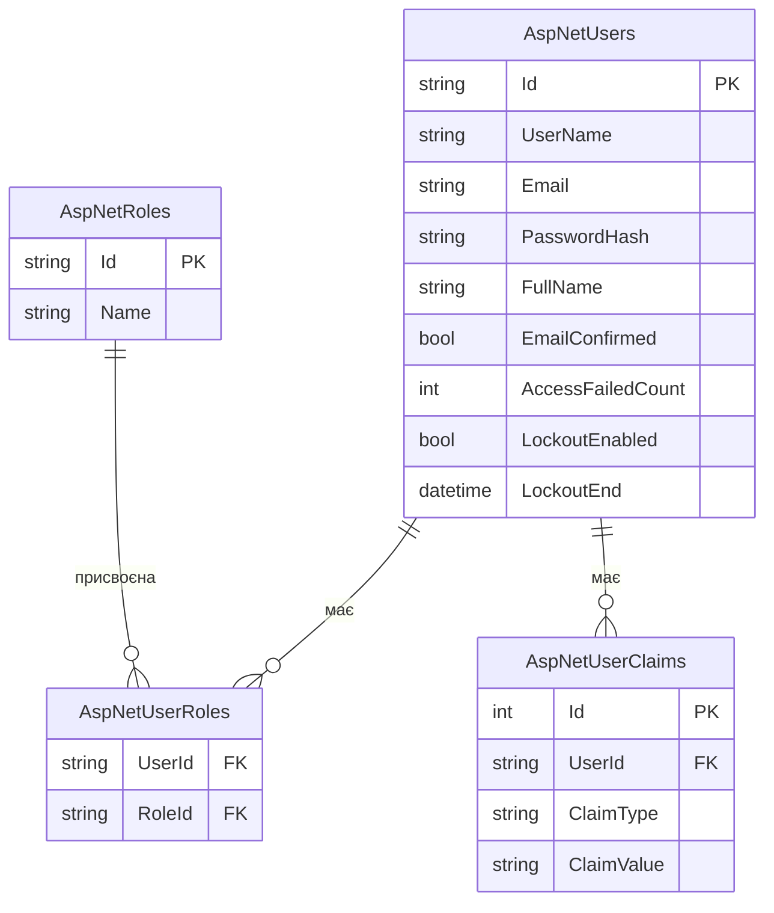

# Cookie-аутентифікація та ASP.NET Core Identity

::note
JWT — ідеальний вибір для API, який споживають мобільні додатки або SPA. Але якщо ваш додаток має і **веб-інтерфейс** (Server-Side Rendered), і API — потрібно розуміти Cookie Authentication. А якщо ви не хочете писати реєстрацію, логін та хешування паролів вручну — ASP.NET Core **Identity** зробить це за вас.
::

---

## 1. JWT vs Cookies: коли що?

| Характеристика       | JWT Bearer                               | Cookie Authentication                   |
| :------------------- | :--------------------------------------- | :-------------------------------------- |
| **Де зберігається**  | На клієнті (localStorage, пам'ять)       | На клієнті (HTTP Cookie)                |
| **Передача**         | Заголовок `Authorization: Bearer ...`    | Автоматично з кожним запитом (cookie)   |
| **Stateless?**       | Так — сервер нічого не зберігає          | Може бути stateful (Session cookie)     |
| **CSRF-вразливість** | ❌ Ні (токен не передається автоматично) | ⚠️ Так (cookie передається автоматично) |
| **XSS-вразливість**  | ⚠️ Так (якщо в localStorage)             | ❌ Ні (з HttpOnly cookie)               |
| **Ідеальний для**    | Mobile, SPA, мікросервіси                | Веб-додатки з SSR, MVC                  |

::tip
**Практичне правило:**

- **Чистий API** (мобільний додаток, React/Vue SPA) → JWT
- **Веб-додаток із серверним рендерингом** → Cookie
- **Гібрид** (і API, і веб-панель) → обидві схеми одночасно

::

---

## 2. Cookie Authentication у Minimal API

### Налаштування

```csharp [Program.cs — Cookie Auth]
var builder = WebApplication.CreateBuilder(args);

builder.Services
    .AddAuthentication("Cookies")
    .AddCookie("Cookies", options =>
    {
        // Назва cookie
        options.Cookie.Name = "MyApp.Auth";

        // ⚠️ Критичні параметри безпеки:
        options.Cookie.HttpOnly = true;   // JS не має доступу
        options.Cookie.SecurePolicy =
            CookieSecurePolicy.Always;    // Тільки HTTPS
        options.Cookie.SameSite =
            SameSiteMode.Strict;          // CSRF-захист

        // Час життя cookie
        options.ExpireTimeSpan =
            TimeSpan.FromHours(2);

        // Де перенаправляти для логіну (для MVC/Razor)
        // Для API — замінюємо на 401:
        options.Events.OnRedirectToLogin = context =>
        {
            context.Response.StatusCode = 401;
            return Task.CompletedTask;
        };

        options.Events.OnRedirectToAccessDenied =
            context =>
        {
            context.Response.StatusCode = 403;
            return Task.CompletedTask;
        };
    });

builder.Services.AddAuthorization();
```

### Параметри Cookie

::field-group

::field{name="HttpOnly" type="bool" default="true"}
JavaScript не може читати cookie через `document.cookie`. Захищає від **XSS** (Cross-Site Scripting).
::

::field{name="SecurePolicy" type="enum" default="SameAsRequest"}
`Always` — cookie передається **тільки** через HTTPS. Без цього зловмисник може перехопити cookie на HTTP.
::

::field{name="SameSite" type="enum" default="Lax"}
`Strict` — cookie **не** передається при cross-origin запитах (захист від CSRF). `Lax` — передається при навігації (GET-запити), але не при POST. `None` — передається завжди (потрібен `Secure`).
::

::field{name="ExpireTimeSpan" type="TimeSpan"}
Час життя cookie. Після цього — потрібен повторний логін.
::

::field{name="SlidingExpiration" type="bool" default="true"}
Якщо `true` — час життя оновлюється при кожному запиті. Якщо `false` — абсолютний час закінчення.
::

::

### Login та Logout

На відміну від JWT (де ми повертаємо токен у body), Cookie Auth створює cookie через `HttpContext.SignInAsync()`:

```csharp [Cookie Login/Logout]
app.MapPost("/auth/login",
    async (LoginRequest req, HttpContext ctx) =>
{
    // 1. Перевірка credentials (спрощено)
    if (req.Email != "admin@example.com"
        || req.Password != "password")
        return Results.Json(
            new { error = "Invalid credentials" },
            statusCode: 401);

    // 2. Створюємо Claims
    var claims = new List<Claim>
    {
        new(ClaimTypes.Name, "Admin"),
        new(ClaimTypes.Email, req.Email),
        new(ClaimTypes.Role, "Admin"),
        new("user_id", "1")
    };

    var identity = new ClaimsIdentity(
        claims, "Cookies");
    var principal = new ClaimsPrincipal(identity);

    // 3. Створюємо cookie
    await ctx.SignInAsync("Cookies", principal,
        new AuthenticationProperties
        {
            // Cookie зберігається між сесіями
            IsPersistent = true,
            // Абсолютне закінчення
            ExpiresUtc = DateTimeOffset.UtcNow
                .AddHours(2)
        });

    return Results.Ok(
        new { message = "Logged in!" });
});

app.MapPost("/auth/logout",
    async (HttpContext ctx) =>
{
    // Видаляємо cookie
    await ctx.SignOutAsync("Cookies");

    return Results.Ok(
        new { message = "Logged out!" });
}).RequireAuthorization();
```

Після `SignInAsync`:

1. ASP.NET Core **серіалізує** ClaimsPrincipal
2. **Шифрує** його (Data Protection API)
3. **Записує** у cookie відповіді (`Set-Cookie: MyApp.Auth=CfDJ8...`)
4. Браузер **автоматично** надсилає цей cookie при кожному наступному запиті

---

## 3. ASP.NET Core Identity — повна система

### Навіщо Identity?

До цього ми писали все вручну: хешування паролів, зберігання refresh tokens, валідацію email. **ASP.NET Core Identity** — це вбудована система, яка надає:

::card-group

::card{title="UserManager<T>" icon="i-lucide-user-cog"}
CRUD для користувачів: створення, видалення, зміна пароля, підтвердження email, хешування паролів.
::

::card{title="SignInManager<T>" icon="i-lucide-log-in"}
Логін/логаут: перевірка пароля, 2FA, lockout при brute-force, зовнішні провайдери.
::

::card{title="RoleManager<T>" icon="i-lucide-users"}
CRUD для ролей: створення, видалення, додавання/видалення ролей у користувачів.
::

::card{title="Готова БД" icon="i-lucide-database"}
Міграції для створення таблиць: Users, Roles, UserRoles, UserClaims, UserTokens та інші.
::

::

### Налаштування Identity

::steps

### Встановлюємо пакети

```bash
dotnet add package Microsoft.AspNetCore.Identity.EntityFrameworkCore
dotnet add package Microsoft.EntityFrameworkCore.Sqlite
dotnet add package Microsoft.EntityFrameworkCore.Design
```

### Створюємо модель користувача

```csharp [Models/AppUser.cs]
using Microsoft.AspNetCore.Identity;

// Наслідуємо від IdentityUser —
// отримуємо Id, Email, PasswordHash і ще 20+ полів
public class AppUser : IdentityUser
{
    // Додайте свої поля:
    public string FullName { get; set; } = "";
    public DateTime CreatedAt { get; set; }
        = DateTime.UtcNow;
}
```

### Створюємо DbContext

```csharp [Data/AppDbContext.cs]
using Microsoft.AspNetCore.Identity.EntityFrameworkCore;
using Microsoft.EntityFrameworkCore;

// IdentityDbContext замість звичайного DbContext!
public class AppDbContext
    : IdentityDbContext<AppUser>
{
    public AppDbContext(
        DbContextOptions<AppDbContext> options)
        : base(options) { }
}
```

### Реєструємо сервіси

```csharp [Program.cs — Identity setup]
var builder = WebApplication.CreateBuilder(args);

// 1. База даних
builder.Services.AddDbContext<AppDbContext>(opt =>
    opt.UseSqlite("Data Source=app.db"));

// 2. Identity з правилами паролів
builder.Services
    .AddIdentity<AppUser, IdentityRole>(options =>
    {
        // Правила пароля
        options.Password.RequireDigit = true;
        options.Password.RequiredLength = 8;
        options.Password.RequireUppercase = true;
        options.Password.RequireNonAlphanumeric = false;

        // Lockout (захист від brute-force)
        options.Lockout.DefaultLockoutTimeSpan =
            TimeSpan.FromMinutes(5);
        options.Lockout.MaxFailedAccessAttempts = 5;

        // User
        options.User.RequireUniqueEmail = true;
    })
    .AddEntityFrameworkStores<AppDbContext>()
    .AddDefaultTokenProviders();

builder.Services.AddAuthorization();
```

### Створюємо міграцію та БД

```bash
dotnet ef migrations add InitIdentity
dotnet ef database update
```

::

### Структура бази даних Identity

Identity автоматично створює 7 таблиць:

::mermaid



::

---

## 4. Identity ендпоінти вручну

### Реєстрація

```csharp [POST /auth/register]
app.MapPost("/auth/register",
    async (RegisterRequest req,
           UserManager<AppUser> userManager) =>
{
    // 1. Створюємо користувача
    var user = new AppUser
    {
        UserName = req.Email,
        Email = req.Email,
        FullName = req.Name
    };

    // 2. UserManager хешує пароль автоматично!
    var result = await userManager.CreateAsync(
        user, req.Password);

    if (!result.Succeeded)
    {
        return Results.ValidationProblem(
            result.Errors.ToDictionary(
                e => e.Code,
                e => new[] { e.Description }));
    }

    // 3. Додаємо роль
    await userManager.AddToRoleAsync(user, "User");

    return Results.Created(
        $"/users/{user.Id}",
        new { user.Id, user.Email, user.FullName });
});
```

### Логін

```csharp [POST /auth/login]
app.MapPost("/auth/login",
    async (LoginRequest req,
           SignInManager<AppUser> signInManager,
           UserManager<AppUser> userManager) =>
{
    var user = await userManager
        .FindByEmailAsync(req.Email);

    if (user is null)
        return Results.Json(
            new { error = "Invalid credentials" },
            statusCode: 401);

    // SignInManager перевіряє пароль,
    // враховує lockout, 2FA тощо
    var result = await signInManager
        .CheckPasswordSignInAsync(
            user, req.Password,
            lockoutOnFailure: true);

    if (!result.Succeeded)
    {
        if (result.IsLockedOut)
            return Results.Json(
                new { error = "Account locked. " +
                    "Try again in 5 minutes." },
                statusCode: 423);

        return Results.Json(
            new { error = "Invalid credentials" },
            statusCode: 401);
    }

    // Генеруємо JWT (або SignInAsync для cookies)
    var roles = await userManager
        .GetRolesAsync(user);
    var token = tokenService.GenerateAccessToken(
        user.Id, user.FullName,
        user.Email!, roles);

    return Results.Ok(new
    {
        access_token = token,
        expires_in = 900
    });
});
```

::tip
`SignInManager.CheckPasswordSignInAsync` з параметром `lockoutOnFailure: true` автоматично рахує невдалі спроби і блокує акаунт після 5 спроб (налаштовується в `options.Lockout`). Не потрібно реалізовувати brute-force захист вручну!
::

---

## 5. MapIdentityApi — автоматичні ендпоінти (.NET 8+)

Починаючи з .NET 8, Identity може **автоматично згенерувати** всі auth-ендпоінти:

```csharp [Program.cs — MapIdentityApi]
var builder = WebApplication.CreateBuilder(args);

builder.Services.AddDbContext<AppDbContext>(
    opt => opt.UseSqlite("Data Source=app.db"));

builder.Services
    .AddIdentityApiEndpoints<AppUser>()
    .AddEntityFrameworkStores<AppDbContext>();

builder.Services.AddAuthorization();

var app = builder.Build();

app.UseAuthentication();
app.UseAuthorization();

// 🪄 Одна стрічка — і всі auth ендпоінти готові!
app.MapIdentityApi<AppUser>();

app.Run();
```

### Що генерується?

`MapIdentityApi<T>()` створює ці ендпоінти автоматично:

| Ендпоінт                   | Метод    | Що робить                     |
| :------------------------- | :------- | :---------------------------- |
| `/register`                | POST     | Реєстрація                    |
| `/login`                   | POST     | Логін (повертає Bearer token) |
| `/refresh`                 | POST     | Оновлення токена              |
| `/confirmEmail`            | GET      | Підтвердження email           |
| `/resendConfirmationEmail` | POST     | Повторне надсилання           |
| `/forgotPassword`          | POST     | Скидання пароля               |
| `/resetPassword`           | POST     | Новий пароль                  |
| `/manage/2fa`              | POST     | Двофакторна аутентифікація    |
| `/manage/info`             | GET/POST | Інформація про користувача    |

::warning
`MapIdentityApi` — це **швидкий старт**, але для production зазвичай потрібна кастомізація: власні response DTO, додаткова валідація, кастомні error messages. Використовуйте його для прототипів або як основу, яку доповнюєте.
::

### Зміна префіксу

```csharp [Кастомний префікс]
app.MapGroup("/api/v1/auth")
    .MapIdentityApi<AppUser>();

// Тепер: /api/v1/auth/register,
// /api/v1/auth/login тощо
```

---

## 6. Хешування паролів

### Як Identity хешує паролі?

Identity використовує `PasswordHasher<TUser>`, який реалізує **PBKDF2** (Password-Based Key Derivation Function 2) з:

- **Алгоритм:** HMAC-SHA256 (або SHA512 у v3)
- **Ітерації:** 100 000+ (повільне хешування = захист від brute-force)
- **Salt:** 128-бітний, генерується випадково для кожного пароля

```csharp [Демонстрація хешування]
var hasher = new PasswordHasher<AppUser>();

// Два однакові паролі = РІЗНІ хеші!
// (через випадковий salt)
var hash1 = hasher.HashPassword(null!,"MyPassword");
var hash2 = hasher.HashPassword(null!,"MyPassword");

Console.WriteLine(hash1);
// AQAAAAIAAYagAAAAEH7+/B...
Console.WriteLine(hash2);
// AQAAAAIAAYagAAAAEC3k/p...
// Різні! ☝️

// Перевірка
var result = hasher.VerifyHashedPassword(
    null!, hash1, "MyPassword");
// PasswordVerificationResult.Success ✅
```

::caution
**Ніколи** не зберігайте паролі у відкритому вигляді (plaintext). Навіть прості хеші (MD5, SHA256) **недостатні** — вони занадто швидкі і піддаються rainbow table атакам. Використовуйте PBKDF2 (Identity), BCrypt або Argon2.
::

---

## 7. Практичні завдання

### Рівень 1: Базовий

::accordion

::accordion-item{label="Завдання 4.1: Cookie Auth" icon="i-lucide-circle-help"}
Реалізуйте Cookie-аутентифікацію:

1. Налаштуйте `AddCookie()` з `HttpOnly`, `Secure`, `SameSite`
2. `POST /auth/login` — створює cookie через `SignInAsync`
3. `POST /auth/logout` — видаляє cookie через `SignOutAsync`
4. `GET /me` — повертає claims з cookie
5. Перевірте: після logout `/me` → `401`

::

::accordion-item{label="Завдання 4.2: Identity setup" icon="i-lucide-circle-help"}
Підключіть ASP.NET Core Identity:

1. Встановіть пакети: Identity.EntityFrameworkCore, EF Core Sqlite
2. Створіть `AppUser : IdentityUser` з полем `FullName`
3. Створіть `AppDbContext : IdentityDbContext<AppUser>`
4. Створіть міграцію та базу даних
5. Перевірте, що таблиці `AspNetUsers`, `AspNetRoles` тощо створені

::

::

### Рівень 2: Проєктування

::accordion

::accordion-item{label="Завдання 4.3: Identity + JWT" icon="i-lucide-circle-help"}
Створіть API з Identity як базою даних і JWT як аутентифікацією:

1. Реєстрація через `UserManager.CreateAsync()` — зберігає у БД з хешем
2. Логін через `SignInManager.CheckPasswordSignInAsync()` — повертає JWT
3. Lockout після 5 невдалих спроб
4. Додайте ролі: при реєстрації — `"User"`, ендпоінт `/admin/promote` — додає `"Admin"`
5. JWT claims: Id, Email, FullName, Roles

::

::

### Рівень 3: Архітектура

::accordion

::accordion-item{label="Завдання 4.4: MapIdentityApi + кастомізація" icon="i-lucide-circle-help"}
Випробуйте автоматичні Identity API:

1. Підключіть `MapIdentityApi<AppUser>()` під групою `/api/v1/auth`
2. Протестуйте всі згенеровані ендпоінти: register, login, refresh
3. Додайте **свій** ендпоінт `GET /api/v1/auth/me`, який повертає кастомну інформацію (fullName, roles, createdAt)
4. Порівняйте: що дає MapIdentityApi «з коробки» і що потрібно дописати вручну?

::

::

---

## 8. Резюме

::card-group

::card{title="Cookie — для веб-додатків" icon="i-lucide-cookie"}
HttpOnly + Secure + SameSite = безпечна cookie. SignInAsync створює, SignOutAsync видаляє. Браузер передає автоматично.
::

::card{title="Identity — повна система" icon="i-lucide-fingerprint"}
UserManager (CRUD), SignInManager (логін), RoleManager (ролі). Готові таблиці, хешування, lockout, 2FA.
::

::card{title="MapIdentityApi — швидкий старт" icon="i-lucide-zap"}
Один рядок = register, login, refresh, 2FA, password reset. .NET 8+. Ідеально для прототипів.
::

::card{title="Паролі — тільки хеш" icon="i-lucide-lock"}
PBKDF2 з salt (100 000+ ітерацій). Identity робить це автоматично. Ніколи plaintext, MD5 чи SHA256.
::

::

**Далі:** у наступній статті ми реалізуємо **«Увійти через Google/GitHub»** — OAuth 2.0 та зовнішні провайдери аутентифікації.
