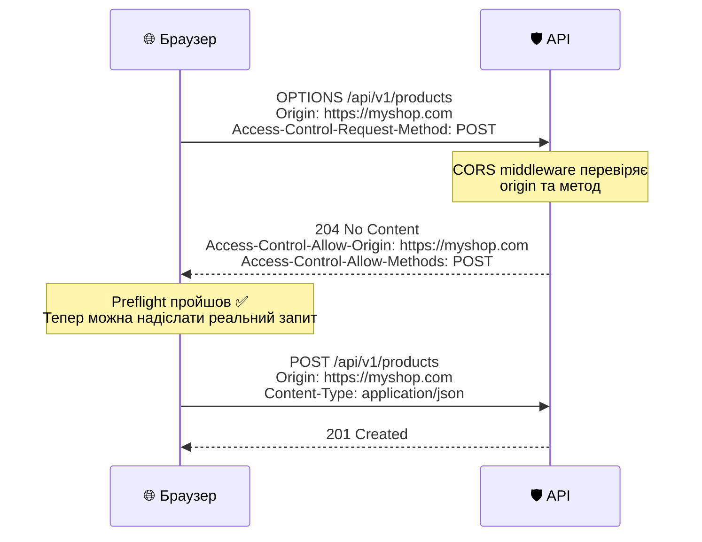
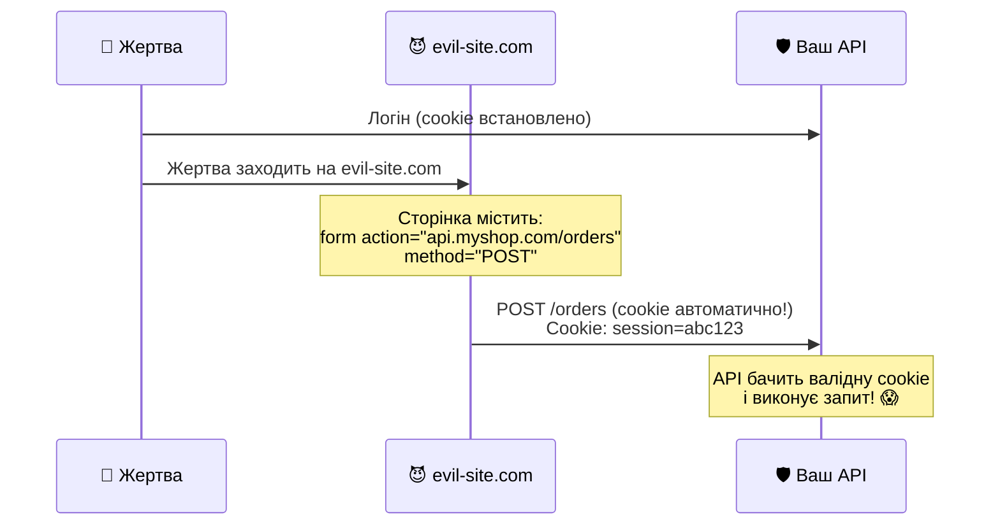

# Безпека на практиці: CORS, HTTPS та захист від атак

::note
Ваш API працює, аутентифікація налаштована, авторизація перевіряє ролі. Але це лише частина безпеки. У цій статті ми розглянемо **практичні** заходи захисту: від CORS та HTTPS до rate limiting та security headers. Наприкінці — чеклист, який потрібно пройти перед кожним деплоєм у production.
::

---

## 1. CORS — Cross-Origin Resource Sharing

### Проблема

Ваш API працює на `https://api.myshop.com`. Ваш SPA (React/Vue) — на `https://myshop.com`. Браузер **блокує** запити між різними доменами (origins) — це політика **Same-Origin Policy**.

Без CORS ваш фронтенд отримає помилку:

```
Access to fetch at 'https://api.myshop.com/products'
from origin 'https://myshop.com' has been blocked
by CORS policy.
```

### Що таке Origin?

Origin = **протокол** + **домен** + **порт**:

| URL                         | Origin                                  |
| :-------------------------- | :-------------------------------------- |
| `https://myshop.com/page`   | `https://myshop.com`                    |
| `https://api.myshop.com/v1` | `https://api.myshop.com`                |
| `http://myshop.com`         | `http://myshop.com` (інший протокол!)   |
| `https://myshop.com:8080`   | `https://myshop.com:8080` (інший порт!) |

Два URL мають **різні** origin, якщо відрізняється хоча б одна з трьох частин.

### Налаштування CORS у Minimal API

```csharp [Program.cs — CORS]
var builder = WebApplication.CreateBuilder(args);

builder.Services.AddCors(options =>
{
    // Іменована політика для production
    options.AddPolicy("Production", policy =>
    {
        policy
            // ✅ Тільки ваші домени
            .WithOrigins(
                "https://myshop.com",
                "https://admin.myshop.com")
            // ✅ Тільки потрібні методи
            .WithMethods(
                "GET", "POST", "PUT", "DELETE")
            // ✅ Тільки потрібні заголовки
            .WithHeaders(
                "Authorization",
                "Content-Type",
                "Accept")
            // ✅ Дозволити credentials (cookies)
            .AllowCredentials();
    });

    // Окрема політика для dev
    options.AddPolicy("Development", policy =>
    {
        policy
            .WithOrigins(
                "http://localhost:3000",
                "http://localhost:5173")
            .AllowAnyMethod()
            .AllowAnyHeader()
            .AllowCredentials();
    });
});

var app = builder.Build();

// Обираємо політику залежно від середовища
if (app.Environment.IsDevelopment())
    app.UseCors("Development");
else
    app.UseCors("Production");
```

### CORS для Route Groups

```csharp [CORS на рівні групи]
// Публічний API — дозволяємо CORS
var publicApi = app.MapGroup("/api/v1")
    .RequireCors("Production");

// Внутрішній API — без CORS (server-to-server)
var internalApi = app.MapGroup("/internal");
// CORS не потрібен — запити не з браузера
```

### Антипатерни CORS

::accordion

::accordion-item{label="❌ AllowAnyOrigin" icon="i-lucide-alert-triangle"}

```csharp
// ❌ НІКОЛИ у production!
policy.AllowAnyOrigin();
```

Дозволяє **будь-якому** сайту робити запити до вашого API. Зловмисник може створити фішинговий сайт, який крадитиме дані ваших користувачів.
::

::accordion-item{label="❌ AllowAnyOrigin + AllowCredentials" icon="i-lucide-alert-triangle"}

```csharp
// 💥 Взагалі не скомпілюється!
policy.AllowAnyOrigin().AllowCredentials();
```

ASP.NET Core **забороняє** цю комбінацію. Якщо CORS дозволяє будь-який origin і credentials одночасно — це повний bypass аутентифікації.
::

::accordion-item{label="❌ Wildcard у WithOrigins" icon="i-lucide-alert-triangle"}

```csharp
// ❌ Не працює з credentials!
policy.WithOrigins("https://*.myshop.com");
```

ASP.NET Core **не підтримує** wildcard у `WithOrigins`. Кожен origin має бути вказаний повністю. Для динамічних origins — використовуйте `SetIsOriginAllowed()`.
::

::

### Preflight-запити

Для «небезпечних» запитів (POST з `Content-Type: application/json`, PUT, DELETE) браузер спочатку надсилає **preflight** запит — `OPTIONS`:

::mermaid



::

---

## 2. HTTPS та HSTS

### Чому HTTPS обов'язковий

Без HTTPS (TLS-шифрування) дані між клієнтом і сервером передаються **відкритим текстом**. JWT-токени, паролі, персональні дані — все видно зловмиснику.

### Налаштування

```csharp [Program.cs — HTTPS]
var app = builder.Build();

if (!app.Environment.IsDevelopment())
{
    // Перенаправляє HTTP → HTTPS
    app.UseHttpsRedirection();

    // HSTS — каже браузеру:
    // "Наступні N секунд звертайся тільки по HTTPS"
    app.UseHsts();
}
```

::field-group

::field{name="UseHttpsRedirection()" type="middleware"}
Перехоплює HTTP-запити і повертає `307 Temporary Redirect` на HTTPS-версію URL. Наприклад: `http://api.myshop.com/products` → `https://api.myshop.com/products`.
::

::field{name="UseHsts()" type="middleware"}
Додає заголовок `Strict-Transport-Security` до відповіді. Після отримання цього заголовка браузер **ніколи** не робитиме HTTP-запити до цього домену — навіть якщо користувач вручну введе `http://`.
::

::

### Dev-сертифікат

Для локальної розробки ASP.NET Core має вбудований dev-сертифікат:

```bash
# Генерувати та довірити dev-сертифікат
dotnet dev-certs https --trust

# Перевірити
dotnet dev-certs https --check
```

---

## 3. Захист від CSRF

### Що таке CSRF?

**CSRF** (Cross-Site Request Forgery) — атака, де зловмисний сайт змушує браузер надіслати запит до вашого API від імені залогіненого користувача.

::mermaid



::

### Коли CSRF актуальний?

| Аутентифікація           | CSRF-ризик  | Чому                                   |
| :----------------------- | :---------- | :------------------------------------- |
| JWT Bearer               | ❌ Немає    | Токен не передається автоматично       |
| Cookie Auth              | ⚠️ Є        | Cookie передається автоматично!        |
| Cookie + SameSite=Strict | ✅ Захищено | Браузер не передає cookie cross-origin |

::tip
**Якщо ваш API використовує тільки JWT Bearer** — CSRF вам **не загрожує**. Токен зберігається в пам'яті JavaScript і передається вручну через заголовок `Authorization`.

**Якщо ви використовуєте Cookie Auth** — захистіться через `SameSite=Strict` (найпростіше) або Anti-Forgery Tokens.
::

### Anti-Forgery у Minimal API

```csharp [CSRF-захист для Cookie Auth]
var builder = WebApplication.CreateBuilder(args);

builder.Services.AddAntiforgery();

var app = builder.Build();

app.UseAntiforgery();

// Ендпоінт, що отримує CSRF-токен
app.MapGet("/antiforgery/token",
    (IAntiforgery antiforgery, HttpContext ctx) =>
{
    var tokens = antiforgery.GetAndStoreTokens(ctx);
    return Results.Ok(new
    {
        token = tokens.RequestToken,
        headerName = tokens.HeaderName
    });
}).AllowAnonymous();

// Захищеий ендпоінт — перевіряє CSRF
app.MapPost("/orders", (OrderRequest req) =>
    Results.Created("/orders/1", req))
    .RequireAuthorization()
    .ValidateAntiforgery(); // ← Perевірка CSRF-токена
```

---

## 4. Rate Limiting

### Навіщо обмежувати запити?

Без rate limiting зловмисник може:

- **Brute-force** паролі (мільйони спроб за хвилину)
- **DDoS** — перевантажити сервер запитами
- **Scraping** — вичитати всі дані з API

### Вбудований Rate Limiting (.NET 7+)

```csharp [Program.cs — Rate Limiting]
using System.Threading.RateLimiting;

var builder = WebApplication.CreateBuilder(args);

builder.Services.AddRateLimiter(options =>
{
    // Глобальний ліміт: 100 запитів / хвилина
    options.GlobalLimiter = PartitionedRateLimiter
        .Create<HttpContext, string>(ctx =>
            RateLimitPartition.GetFixedWindowLimiter(
                partitionKey:
                    ctx.Connection.RemoteIpAddress?
                        .ToString() ?? "unknown",
                factory: _ => new FixedWindowRateLimiterOptions
                {
                    PermitLimit = 100,
                    Window = TimeSpan.FromMinutes(1)
                }));

    // Іменована політика для auth ендпоінтів
    options.AddFixedWindowLimiter("auth", opt =>
    {
        opt.PermitLimit = 5;
        opt.Window = TimeSpan.FromMinutes(1);
    });

    // Що повертати при перевищенні?
    options.RejectionStatusCode = 429; // Too Many Requests
});

var app = builder.Build();

app.UseRateLimiter();
```

### Різні ліміти для різних ендпоінтів

```csharp [Rate Limiting по групах]
// Auth — максимально суворо (brute-force захист)
app.MapPost("/auth/login", Login)
    .RequireRateLimiting("auth");  // 5/хв

// Публічне читання — вільніше
app.MapGet("/products", GetProducts);
// Глобальний ліміт: 100/хв

// Запис — помірно
app.MapPost("/orders", CreateOrder)
    .RequireRateLimiting("write");  // 30/хв
```

### Типи Rate Limiters

| Тип                | Як працює                                          | Коли використовувати            |
| :----------------- | :------------------------------------------------- | :------------------------------ |
| **Fixed Window**   | N запитів за фіксований період (наприклад, 100/хв) | Простий і передбачуваний        |
| **Sliding Window** | Як Fixed, але вікно «ковзає»                       | Плавніший розподіл навантаження |
| **Token Bucket**   | Токени накопичуються поступово                     | API з бурстами трафіку          |
| **Concurrency**    | Обмежує одночасні запити                           | Захист від тривалих операцій    |

---

## 5. Заголовки безпеки

Кожна HTTP-відповідь має містити заголовки, що захищають від поширених атак:

```csharp [Middleware заголовків безпеки]
app.Use(async (ctx, next) =>
{
    var headers = ctx.Response.Headers;

    // Заборона відображення у iframe
    // (захист від Clickjacking)
    headers["X-Frame-Options"] = "DENY";

    // Блокувати MIME-sniffing
    // (браузер не «вгадує» тип контенту)
    headers["X-Content-Type-Options"] = "nosniff";

    // Суворий TLS (браузер запам'ятовує HTTPS)
    headers["Strict-Transport-Security"] =
        "max-age=31536000; includeSubDomains";

    // Не передавати Referrer при переході
    // на зовнішні сайти
    headers["Referrer-Policy"] =
        "strict-origin-when-cross-origin";

    // Content Security Policy
    // (захист від XSS)
    headers["Content-Security-Policy"] =
        "default-src 'self'";

    // Вимкнути кеш для API-відповідей
    // з персональними даними
    headers["Cache-Control"] =
        "no-store, no-cache";

    await next(ctx);
});
```

### Пояснення заголовків

::field-group

::field{name="X-Frame-Options: DENY" type="header"}
Забороняє сторінці відображатися в `<iframe>`. Захищає від **Clickjacking** — атаки, де ваш сайт вбудований у прозорий iframe поверх фішингової сторінки.
::

::field{name="X-Content-Type-Options: nosniff" type="header"}
Забороняє браузеру «вгадувати» MIME-тип. Без цього браузер може інтерпретувати JSON як HTML і виконати вбудований скрипт.
::

::field{name="Strict-Transport-Security" type="header"}
Після отримання цього заголовка браузер протягом `max-age` секунд **не** робитиме HTTP-запити. Навіть якщо користувач введе `http://` — браузер автоматично переключиться на `https://`.
::

::field{name="Content-Security-Policy" type="header"}
Визначає, з яких джерел можна завантажувати скрипти, стилі, зображення. `default-src 'self'` — тільки з вашого домену.
::

::

---

## 6. Зберігання секретів

### Ієрархія секретів

| Середовище      | Де зберігати                          | Як доступити                   |
| :-------------- | :------------------------------------ | :----------------------------- |
| **Development** | `dotnet user-secrets`                 | `builder.Configuration["Key"]` |
| **Staging/CI**  | Environment Variables                 | `builder.Configuration["Key"]` |
| **Production**  | Azure Key Vault / AWS Secrets Manager | Спеціальний провайдер          |

### User Secrets (development)

```bash
# Ініціалізація
dotnet user-secrets init

# Додати секрет
dotnet user-secrets set "Jwt:Key" "MyDev..."
dotnet user-secrets set "Google:ClientId" "abc..."
dotnet user-secrets set "Google:ClientSecret" "xyz..."

# Переглянути всі секрети
dotnet user-secrets list

# Видалити
dotnet user-secrets remove "Jwt:Key"
```

Секрети зберігаються у:

- **Windows:** `%APPDATA%\Microsoft\UserSecrets\<UserSecretsId>\secrets.json`
- **macOS/Linux:** `~/.microsoft/usersecrets/<UserSecretsId>/secrets.json`

### Environment Variables (production)

```bash
# Linux / Docker
export Jwt__Key="ProductionSecret..."
export ConnectionStrings__Default="Server=..."

# Docker Compose
services:
  api:
    environment:
      - Jwt__Key=ProductionSecret...
      - ConnectionStrings__Default=Server=...
```

::caution
**Роздільник:** у env-змінних вкладеність позначається `__` (подвійне підкреслення), а не `:` як в JSON. `Jwt:Key` → `Jwt__Key`.
::

### Що НІКОЛИ не зберігати в коді

::tabs

::tabs-item{label="❌ Антипатерни" icon="i-lucide-x-circle"}

```json
// appsettings.json — потрапить у Git!
{
    "Jwt": {
        "Key": "SuperSecretKey123!!!"
    },
    "ConnectionStrings": {
        "Default": "Server=prod;Password=admin123"
    }
}
```

```csharp
// Хардкод у коді — ще гірше!
var key = "SuperSecretKey123!!!";
```

::

::tabs-item{label="✅ Правильно" icon="i-lucide-check-circle"}

```json
// appsettings.json — тільки несекретні дані
{
    "Jwt": {
        "Issuer": "MyApi",
        "Audience": "MyApp"
    }
}
// Секрети — в User Secrets або env variables
```

::

::

---

## 7. Production чеклист

Перед кожним деплоєм перевірте цей чеклист:

### Аутентифікація

- [ ] JWT-ключ зберігається поза кодом (User Secrets / env / vault)
- [ ] JWT-ключ ≥ 32 символи (для HS256)
- [ ] `ValidateIssuerSigningKey = true`
- [ ] `ValidateLifetime = true`, `ClockSkew = TimeSpan.Zero`
- [ ] Access Token ≤ 15 хвилин
- [ ] Refresh Token зберігається в БД та ротується

### Авторизація

- [ ] Fallback Policy або явний `RequireAuthorization()` на кожному ендпоінті
- [ ] Публічні ендпоінти мають явний `.AllowAnonymous()`
- [ ] Resource-based auth для операцій із чужими ресурсами

### HTTPS

- [ ] `UseHttpsRedirection()` увімкнено
- [ ] `UseHsts()` увімкнено
- [ ] Валідний SSL-сертифікат (Let's Encrypt або комерційний)
- [ ] Cookie: `SecurePolicy = Always`

### CORS

- [ ] Перертій origins (не `AllowAnyOrigin()`)
- [ ] Перелічені дозволені методи та заголовки
- [ ] `AllowCredentials()` тільки з конкретними origins

### Захист від атак

- [ ] Rate Limiting на auth-ендпоінтах (≤ 5-10 запитів/хвилину)
- [ ] Account Lockout після 5 невдалих спроб
- [ ] Security Headers (X-Frame-Options, X-Content-Type-Options, CSP, HSTS)
- [ ] Cookie: `HttpOnly = true`, `SameSite = Strict`
- [ ] Паролі хешуються (PBKDF2/BCrypt/Argon2), не plaintext
- [ ] Логи не містять паролів, токенів та персональних даних

### Загальне

- [ ] `appsettings.json` не містить секретів
- [ ] `.gitignore` включає `secrets.json`, `.env`
- [ ] Swagger/OpenAPI вимкнений у production (або за авторизацією)

---

## 8. Практичні завдання

### Рівень 1: Базовий

::accordion

::accordion-item{label="Завдання 6.1: CORS" icon="i-lucide-circle-help"}
Налаштуйте CORS для SPA:

1. Створіть політику `"Frontend"` з origin `http://localhost:5173` (Vite dev server)
2. Дозвольте методи GET, POST, PUT, DELETE
3. Дозвольте заголовки `Authorization` та `Content-Type`
4. Протестуйте: запит з `http://localhost:5173` → працює. Запит з `http://evil-site.com` → блокується
5. Спробуйте `AllowAnyOrigin()` — яка помилка виникне при спробі додати `AllowCredentials()`?

::

::accordion-item{label="Завдання 6.2: Rate Limiting" icon="i-lucide-circle-help"}
Додайте Rate Limiting:

1. Глобальний ліміт: 60 запитів / хвилина (per IP)
2. Окрема політика `"auth"`: 5 запитів / хвилина для `POST /auth/login`
3. Протестуйте: надішліть 6 запитів на login за 10 секунд — що повертає 6-й запит?
4. Переконайтесь, що статус-код `429 Too Many Requests` повертається з правильним повідомленням

::

::

### Рівень 2: Проєктування

::accordion

::accordion-item{label="Завдання 6.3: Security Headers" icon="i-lucide-circle-help"}
Створіть middleware з усіма заголовками безпеки:

1. `X-Frame-Options: DENY`
2. `X-Content-Type-Options: nosniff`
3. `Strict-Transport-Security: max-age=31536000; includeSubDomains`
4. `Referrer-Policy: strict-origin-when-cross-origin`
5. `Content-Security-Policy: default-src 'self'`
6. Перевірте заголовки через DevTools → Network tab → Response Headers
7. Протестуйте через [securityheaders.com](https://securityheaders.com/) — досягніть оцінки **A+**

::

::

### Рівень 3: Архітектура

::accordion

::accordion-item{label="Завдання 6.4: Повна безпека" icon="i-lucide-circle-help"}
Зберіть усе разом у production-ready API:

1. CORS — тільки для вашого frontend URL
2. HTTPS Redirection + HSTS
3. Rate Limiting: 100/хв глобально, 5/хв для auth
4. Security Headers middleware
5. JWT з коротким access token (15 хв) та refresh token
6. Identity з lockout (5 спроб)
7. Fallback Policy — все закрито за замовчуванням
8. User Secrets для dev, env variables для production
9. Пройдіть production чеклист і переконайтесь, що всі пункти виконані

::

::

---

## 9. Резюме

::card-group

::card{title="CORS — точковий дозвіл" icon="i-lucide-shield"}
Тільки конкретні origins, методи та заголовки. Ніколи AllowAnyOrigin() у production. Окрема політика для dev і prod.
::

::card{title="HTTPS — обов'язковий" icon="i-lucide-lock"}
UseHttpsRedirection + UseHsts. Валідний сертифікат. Cookie: Secure=Always. Без HTTPS токени та паролі відкриті.
::

::card{title="Rate Limiting — захист від brute-force" icon="i-lucide-gauge"}
5 запитів/хвилина на login. 100/хвилина глобально. Повертайте 429 із Retry-After.
::

::card{title="Security Headers" icon="i-lucide-file-check"}
X-Frame-Options, HSTS, CSP, nosniff — мінімальний набір. Перевірка через securityheaders.com → A+.
::

::
