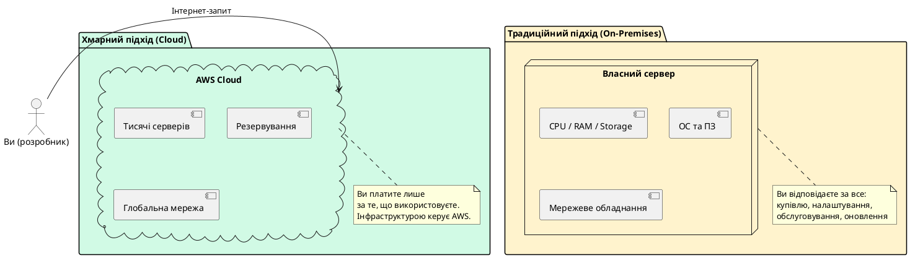
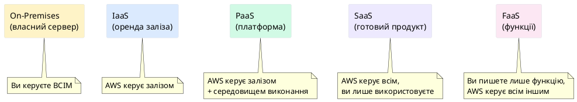
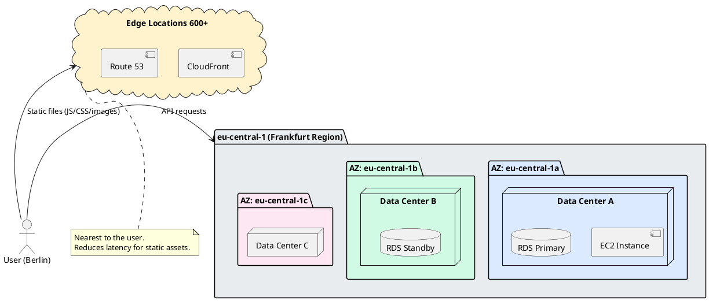

# Вступ до хмарних обчислень та AWS

## Де живе ваш застосунок?

{.diagram-img}

Уявіть, що ви написали свій перший веб-застосунок. Він працює у вас на ноутбуці: відкрили термінал, запустили `dotnet run` — і сервер підняв API на `localhost:5000`. Ви відкриваєте браузер, вводите адресу, і все працює. Відчуття чудове.

Але тепер постає питання: **як зробити так, щоб ваш застосунок побачив хтось інший?** Ваш друг в іншому місті, клієнт в іншій країні, тисячі користувачів одночасно?

{.diagram-img}

Найочевидніша відповідь, яка спадає на думку: «Залишу ноутбук увімкненим». Але ноутбук не розрахований на безперервну роботу 24/7, у нього обмежена пам'ять і процесор, він може перегрітись або вийти з ладу, а коли ви закриєте кришку — сервер зупиниться. Можна купити сервер — потужний комп'ютер без дисплея, розрахований на безперервну роботу. Але де його розмістити? Потрібне приміщення з кондиціонуванням, безперебійне живлення, надійний інтернет-канал, команда, яка стежитиме за обладнанням у разі поломки...

Ось тут і з'являється поняття **хмарних обчислень** (cloud computing) — концепції, яка вирішила цю проблему раз і назавжди.

::note
У цьому модулі ми розглядаємо фундаментальні концепції, на яких побудована вся подальша робота з AWS. Не поспішайте — розуміння «чому» тут важливіше за «як».
::

---

## Що таке хмарні обчислення

{.diagram-img}

**Хмарні обчислення** (cloud computing) — це модель надання обчислювальних ресурсів (серверів, сховищ даних, мереж, програмного забезпечення) через інтернет **на вимогу** (on-demand), з оплатою лише за фактичне використання.

Щоб зрозуміти цю концепцію, скористаймось аналогією з електроенергією.

### Аналогія: електростанція проти розетки

{.diagram-img}

Уявіть, що вам потрібна електроенергія для вашого будинку. Є два підходи:

**Підхід 1 (традиційний — on-premises):** Ви купуєте власний генератор, встановлюєте його, запускаєте, обслуговуєте, заправляєте паливом, ремонтуєте, коли ламається. Ви маєте повний контроль, але несете всю відповідальність і всі витрати — незалежно від того, скільки електроенергії реально споживаєте.

**Підхід 2 (хмарний — cloud):** Ви просто вставляєте вилку в розетку. Електроенергія приходить від електростанції десь далеко — вам байдуже, де вона знаходиться і як саме виробляється. Ви платите лише за те, що спожили (кіловат-годин), і не думаєте про обслуговування генераторів.

Хмарні обчислення — це **розетка для обчислювальних ресурсів**. Ви отримуєте сервери, бази даних, мережі через інтернет — на вимогу, без необхідності купувати і обслуговувати залізо.

::plant-uml



::

### Ключові характеристики хмарних обчислень

{.diagram-img}

Національний інститут стандартів і технологій США (NIST) визначає п'ять обов'язкових характеристик хмарних обчислень. Розглянемо кожну на конкретних прикладах.

::card-group

::card{title="On-demand self-service" icon="i-heroicons-cursor-arrow-ripple"}

**Самообслуговування на вимогу.** Ви можете самостійно замовити новий сервер або збільшити обсяг пам'яті прямо через веб-інтерфейс або API — без дзвінків в службу підтримки і без очікування. Порівняйте: раніше замовлення сервера в корпоративному IT-відділі могло займати тижні.

::

::card{title="Broad network access" icon="i-heroicons-globe-alt"}

**Широкий мережевий доступ.** Ресурси доступні через стандартні мережеві протоколи з будь-якого пристрою: ноутбука, телефону, планшета — з будь-якої точки світу.

::

::card{title="Resource pooling" icon="i-heroicons-server-stack"}

**Пул ресурсів.** AWS обслуговує тисячі клієнтів одночасно на одній фізичній інфраструктурі. Ресурси динамічно перерозподіляються між клієнтами. Ви не знаєте і не мусите знати, на якому фізичному сервері запускається ваш код.

::

::card{title="Rapid elasticity" icon="i-heroicons-arrows-pointing-out"}

**Швидка еластичність.** Ресурси можна збільшити або зменшити за лічені хвилини. Якщо ваш сайт потрапив на першу сторінку Reddit і до вас прийшло в 100 разів більше відвідувачів — хмара може масштабуватись автоматично.

::

::card{title="Measured service" icon="i-heroicons-chart-bar"}

**Вимірювана послуга.** Ви платите лише за те, що реально використовуєте. Запустили сервер на 2 години — оплатили 2 години. Зупинили — оплата зупиняється.

::

::

---

## Моделі хмарних послуг: IaaS, PaaS, SaaS та FaaS

{.diagram-img}

Це одна з найважливіших концепцій, яку необхідно чітко зрозуміти з самого початку. Хмарні послуги поділяються на рівні залежно від того, **скільки відповідальності бере на себе провайдер**, а скільки залишається на вас.

Уявіть аналогію з транспортом: ви можете купити власний автомобіль (on-premises), орендувати машину (IaaS), взяти таксі (PaaS), або просто сісти в автобус (SaaS). Рівень контролю та відповідальності різний у кожному випадку.

{.diagram-img}

### Модель відповідальності

::plant-uml



::

### IaaS — Infrastructure as a Service (Інфраструктура як послуга)

{.diagram-img}

**IaaS** — найнижчий рівень хмарних послуг. Провайдер надає вам **віртуальні сервери, мережу та сховища**, але все інше — операційну систему, середовище виконання, ваш застосунок — встановлюєте і налаштовуєте ви самі.

Це схоже на оренду порожньої квартири: стіни, підлога і стеля є — але меблі, ремонт і побут — ваша відповідальність.

**Що ви отримуєте:** Віртуальний сервер (VM) з певною кількістю CPU, RAM, диску. До нього можна підключитись через SSH або RDP, як до звичайного комп'ютера.

**Ваша відповідальність:** Встановити ОС, .NET Runtime, Nginx/IIS, ваш застосунок. Слідкувати за оновленнями безпеки. Налаштовувати резервне копіювання.

**Приклади AWS:** `Amazon EC2` (Elastic Compute Cloud) — саме тут запускаються ваші віртуальні сервери. `Amazon EBS` (Elastic Block Store) — диски для цих серверів.

**Коли використовувати:** Коли потрібен повний контроль над середовищем, специфічні налаштування ОС, або коли ви переносите legacy-застосунок, який не може працювати в іншому середовищі.

---

### PaaS — Platform as a Service (Платформа як послуга)

{.diagram-img}

**PaaS** — середній рівень. Провайдер бере на себе управління інфраструктурою **і** середовищем виконання. Ви просто завантажуєте свій код або пакет застосунку, а платформа сама вирішує, де і як його запустити.

Аналогія: орендований автомобіль. Двигун, коробка передач, колеса — все є і обслуговується. Вам залишається лише сісти і їхати куди потрібно.

**Приклади AWS:** `AWS Elastic Beanstalk` — завантажуєте `.zip` з вашим .NET або Node.js застосунком, і Beanstalk сам запускає EC2, налаштовує Load Balancer та Auto Scaling. `Amazon RDS` — керована база даних: AWS встановлює PostgreSQL, керує бекапами, оновленнями, реплікацією.

**Коли використовувати:** Коли ви хочете зосередитись на розробці коду, а не на DevOps. Для більшості стандартних веб-застосунків PaaS є оптимальним вибором.

---

### SaaS — Software as a Service (Програмне забезпечення як послуга)

{.diagram-img}

**SaaS** — найвищий рівень абстракції. Ви отримуєте **готовий продукт**, доступний через браузер або API. Провайдер керує абсолютно всім: від серверів до бізнес-логіки застосунку. Аналогія: автобус — ви просто їдете.

**Приклади AWS:** `Amazon WorkMail` (корпоративна пошта), `Amazon Chime` (відеоконференції). За межами AWS — Google Workspace, Salesforce, Slack — це все SaaS.

---

### FaaS — Function as a Service (Функція як послуга)

{.diagram-img}

**FaaS** — модель **serverless** (безсерверних) обчислень. Ключова ідея: ви пишете **окремі функції** (невеликі шматки коду), а хмара запускає їх **лише тоді, коли вони потрібні** — у відповідь на певну подію. Ви платите лише за мілісекунди виконання.

**Приклад AWS:** `AWS Lambda` — ви пишете C#-функцію, яка обробляє нові файли у S3. Коли файл з'являється — Lambda запускається, обробляє і зупиняється.

::tip
**Serverless ≠ без серверів.** Сервери є — але ви про них не думаєте. AWS сам вирішує, де запустити вашу функцію, масштабує до тисяч паралельних виконань і зупиняється, коли нічого немає.
::

---

### Порівняльна таблиця моделей

| Характеристика           | On-Premises        | IaaS       | PaaS                   | SaaS        | FaaS         |
| ------------------------ | ------------------ | ---------- | ---------------------- | ----------- | ------------ |
| **Фізичне залізо**       | Ви                 | AWS        | AWS                    | AWS         | AWS          |
| **Операційна система**   | Ви                 | Ви         | AWS                    | AWS         | AWS          |
| **Середовище виконання** | Ви                 | Ви         | AWS                    | AWS         | AWS          |
| **Застосунок**           | Ви                 | Ви         | Ви                     | AWS         | Ви (функція) |
| **Масштабування**        | Ручне              | Ручне/Auto | Автоматичне            | Автоматичне | Автоматичне  |
| **Оплата**               | Капітальні витрати | Год/міс    | Год/міс                | Підписка    | Per-запит    |
| **Приклад AWS**          | —                  | EC2        | Elastic Beanstalk, RDS | WorkMail    | Lambda       |

---

## AWS, Azure та Google Cloud: три лідери хмарного ринку

{.diagram-img}

Сьогодні ринок хмарних послуг очолюють три компанії: **Amazon Web Services (AWS)**, **Microsoft Azure** та **Google Cloud Platform (GCP)**. Усі три є повноцінними платформами, здатними задовольнити потреби від невеликого стартапу до транснаціональної корпорації.

**Amazon Web Services (AWS)** — найстарший і найбільший хмарний провайдер. AWS запустився у 2006 році, коли Amazon вирішила продати зовнішнім клієнтам обчислювальні потужності, які сама розробила для власної інфраструктури інтернет-магазину. Сьогодні AWS займає близько **32% ринку** хмарних послуг, має найширший каталог сервісів (понад 200) і найбільшу глобальну мережу дата-центрів.

**Microsoft Azure** (~23% ринку) має очевидну перевагу: **глибока інтеграція з екосистемою Microsoft**. Якщо ваша компанія використовує Windows Server, Active Directory, SQL Server або Office 365 — Azure буде природним вибором. Особливо актуально для корпоративного сектору та команд на .NET Framework.

**Google Cloud Platform** (~12% ринку) привніс колосальний досвід Google у розподілених обчисленнях. GCP вважається найсильнішим у сфері **машинного навчання** (BigQuery, Vertex AI) та аналітики великих даних. Kubernetes — також розробка Google, і GKE (Google Kubernetes Engine) є еталонною реалізацією.

::card-group

::card{title="AWS — чому ми вивчаємо його" icon="i-simple-icons-amazonaws"}

- **Найбільша кількість вакансій** на ринку праці
- **Найширша документація** та спільнота — відповідь на будь-яке питання легко знайти
- **Концепції переносяться:** IAM, VPC, S3, Lambda — прямі аналоги є у Azure та GCP
- **Першокласна підтримка .NET:** AWS SDK for .NET, Lambda .NET Runtime, AWS Toolkit для Rider/VS

::

::card{title="Коли обирають Azure" icon="i-simple-icons-microsoftazure"}

- Компанія вже використовує продукти Microsoft (Office 365, AD, SQL Server)
- .NET Framework (не .NET Core) застосунки
- Корпоративний сектор, банківська сфера
- Потреба в Azure DevOps (колишній VSTS)

::

::card{title="Коли обирають GCP" icon="i-simple-icons-googlecloud"}

- Машинне навчання і AI є ключовою складовою продукту
- Аналітика великих обсягів даних (BigQuery)
- Компанія вже використовує Google Workspace
- Потреба у Kubernetes (GKE — найзріліший managed K8s)

::

::

---

## Глобальна інфраструктура AWS: Regions, AZ та Edge Locations

{.diagram-img}

Щоб розуміти, як AWS забезпечує надійність і низькі затримки по всьому світу, необхідно вивчити трирівневу архітектуру фізичної інфраструктури.

### Рівень 1: Регіони (Regions)

{.diagram-img}

**Регіон** (Region) — це фізична географічна зона, де AWS розгорнув кластер дата-центрів. Станом на 2024 рік AWS має понад **33 регіони** по всьому світу. Кожен регіон є **повністю незалежною** одиницею інфраструктури: якщо в одному регіоні стається катастрофа — це ніяк не впливає на інші.

Приклади регіонів: `us-east-1` (N. Virginia) — найбільший і найстаріший, `eu-central-1` (Frankfurt), `eu-west-1` (Ireland), `ap-southeast-1` (Singapore), `me-south-1` (Bahrain).

**Чому вибір регіону важливий для вас як розробника?**

- **Latency (затримка мережі):** Чим ближче регіон до ваших користувачів — тим швидше відповідає застосунок. Якщо 90% ваших користувачів у Польщі — обирайте `eu-central-1` (Frankfurt), а не `us-east-1`.
- **Compliance (відповідність законодавству):** GDPR вимагає, щоб персональні дані громадян ЄС зберігались у межах ЄС. Деякі країни мають власні вимоги до локалізації даних.
- **Ціна:** Вартість одних і тих самих сервісів може відрізнятись між регіонами. `us-east-1`, як правило, найдешевший.
- **Доступність сервісів:** Нові сервіси AWS завжди з'являються спочатку в `us-east-1`, і лише потім поширюються в інші регіони.

### Рівень 2: Зони доступності (Availability Zones)

{.diagram-img}

**Зона доступності** (Availability Zone, AZ) — це один або кілька **окремих фізичних дата-центрів** всередині одного регіону. Кожен регіон має мінімум **три** зони доступності.

Це ключова концепція для розуміння надійності AWS. Уявіть: ви розгорнули свій .NET Web API на EC2 інстансі в зоні `eu-central-1a`. У цьому дата-центрі стається пожежа і всі сервери виходять з ладу. Якщо ваш застосунок розгорнутий **лише в `1a`** — він недоступний. Але якщо ви розгорнули три екземпляри API — в `eu-central-1a`, `eu-central-1b` та `eu-central-1c` — кожна AZ є **окремою будівлею** з незалежним живленням і мережею. Якщо горить `1a` — `1b` та `1c` продовжують обробляти запити. Користувачі навіть не помітять.

**Важлива технічна деталь:** Зони всередині регіону з'єднані надшвидкісними **приватними** оптоволоконними каналами з затримкою менше 1 мс. Реплікація даних між AZ відбувається практично миттєво — ви можете мати синхронну репліку бази даних в іншій зоні без помітного впливу на продуктивність. Сервіси на кшталт **RDS Multi-AZ** та **Application Load Balancer** використовують кілька AZ автоматично.

### Рівень 3: Вузли присутності (Edge Locations)

{.diagram-img}

**Edge Location** (Вузол присутності) — це **невеликий кеш-сервер**, розміщений у великих містах — набагато ближче до кінцевих користувачів, ніж регіональні дата-центри. Станом на 2024 рік AWS має понад **600 Edge Locations** у більш ніж 90 містах.

Edge Locations використовуються двома ключовими сервісами:

- **Amazon CloudFront** (CDN — Content Delivery Network): ваш React-додаток або статичні файли кешуються у Edge Locations. Користувач у Берліні отримує файл не з дата-центру в Сінгапурі, а з найближчого вузла у Варшаві або Берліні.
- **Amazon Route 53** (DNS-сервіс): DNS-запити вирішуються на найближчому Edge Location для мінімальної затримки.

Аналогія: Edge Location — це як склад Amazon Prime у вашому місті. Замість доставки з центрального складу (регіону) — товар з місцевого складу за день.

::plant-uml



::

---

## AWS Well-Architected Framework

{.diagram-img}

**AWS Well-Architected Framework** — це набір офіційних принципів та кращих практик AWS для проектування хмарних систем. Фреймворк складається з **п'яти стовпів** (pillars). Важливо розуміти: ці принципи — не абстрактна теорія, а практичні орієнтири, які AWS рекомендує враховувати при побудові кожного застосунку.

Не потрібно запам'ятовувати всі деталі зараз — у процесі курсу ви будете постійно стикатись із цими принципами на практиці.

::accordion

::accordion-item{label="1. Operational Excellence — Операційна досконалість" icon="i-lucide-settings"}
Зосереджується на запуску, моніторингу та постійному вдосконаленні систем. Ключові практики: автоматизація операцій (Infrastructure as Code з CloudFormation або CDK), збір метрик та логів (CloudWatch), налаштування процедур відновлення після збоїв, поступові зміни замість великих разових оновлень.

**Як це стосується вас:** Замість ручного налаштування сервера через консоль — ви описуєте інфраструктуру у YAML або TypeScript файлі, і AWS розгортає її автоматично і відтворювано.
::

::accordion-item{label="2. Security — Безпека" icon="i-lucide-shield"}
Захист даних, систем та активів. Ключові практики: принцип найменших привілеїв (IAM), шифрування даних у спокої та при передачі, відстеження всіх дій (CloudTrail), автоматичне виявлення загроз (GuardDuty), ізоляція систем через VPC.

**Як це стосується вас:** Ніколи не використовуйте root акаунт для роботи. Для кожного застосунку — окремий IAM Role з мінімально необхідними правами. Ключі та паролі — в AWS Secrets Manager, не в коді.
::

::accordion-item{label="3. Reliability — Надійність" icon="i-lucide-shield-check"}
Здатність системи виконувати свою функцію коректно та відновлюватись після збоїв. Ключові практики: розгортання у кількох AZ, автоматичне резервне копіювання, тестування аварійного відновлення, горизонтальне масштабування.

**Як це стосується вас:** Завжди розгортайте production-застосунки у мінімум двох AZ. RDS Multi-AZ дає автоматичний failover бази даних за ~60 секунд.
::

::accordion-item{label="4. Performance Efficiency — Ефективність продуктивності" icon="i-lucide-zap"}
Ефективне використання обчислювальних ресурсів. Ключові практики: правильний вибір типу ресурсів (не завжди потрібний найпотужніший інстанс), кешування (ElastiCache), CDN (CloudFront), serverless де доцільно.

**Як це стосується вас:** t2.micro достатній для навчання та MVP. Не запускайте c5.4xlarge для CRUD API з 10 запитами на день.
::

::accordion-item{label="5. Cost Optimization — Оптимізація витрат" icon="i-lucide-piggy-bank"}
Виконання бізнес-цілей за мінімальних витрат. Ключові практики: вимикати невикористані ресурси, використовувати Reserved Instances для стабільного навантаження, Spot Instances для batch-задач, аналіз витрат через Cost Explorer.

**Як це стосується вас:** Вимикайте EC2 та RDS інстанси після практичних занять. Налаштуйте AWS Budget із граничним значенням. Перевіряйте Cost Explorer щотижня.
::

::

---

## Інструменти роботи з AWS

{.diagram-img}

AWS надає три основних способи взаємодії з хмарними сервісами. Кожен з них має своє місце — і ви будете використовувати всі три протягом курсу.

### AWS Management Console — графічний інтерфейс

{.diagram-img}

**AWS Management Console** — це веб-додаток, доступний за адресою [console.aws.amazon.com](https://console.aws.amazon.com/). Це перше, що ви бачите після входу в AWS. Консоль надає графічний інтерфейс для управління всіма сервісами AWS.

**Для чого вона підходить:**

- Ознайомлення з новими сервісами — все наочно і з підказками
- Одноразові операції (перевірити стан інстансу, переглянути логи)
- Моніторинг та дашборди

**Де вона не підходить:**

- Повторювані операції — вручну натискати одні й ті ж кнопки неефективно
- Автоматизація — консоль не підходить для CI/CD pipelines
- Відтворюваність — складно документувати і повторити точну послідовність дій

::tip
На першому занятті рекомендується провести **10–15 хвилин**, просто клікаючи по різних розділах консолі. Знайдіть EC2, S3, RDS, Lambda, IAM. Просто відкрийте кожний — подивіться, що там є. Це сформує загальне розуміння того, що вас чекає.
::

---

### AWS CLI — інтерфейс командного рядка

{.diagram-img}

**AWS CLI** (Command Line Interface) — це офіційний інструмент для управління AWS через термінал. Замість того, щоб клікати мишею у браузері, ви вводите команди у командному рядку.

**Чому CLI важливий:**

- **Автоматизація:** команди можна записати у shell-скрипт і виконувати автоматично
- **Відтворюваність:** команду можна скопіювати та виконати в іншому середовищі
- **Швидкість:** досвідчений інженер виконує операції в CLI значно швидше, ніж через консоль
- **CI/CD:** GitHub Actions, GitLab CI та інші pipeline-інструменти використовують AWS CLI для деплою

**Встановлення AWS CLI:**

::tabs

::tabs-item{label="macOS"}

```bash
curl "https://awscli.amazonaws.com/AWSCLIV2.pkg" -o "AWSCLIV2.pkg"
sudo installer -pkg AWSCLIV2.pkg -target /
aws --version
```

Або через Homebrew:

```bash
brew install awscli
aws --version
```

::

::tabs-item{label="Windows"}

Завантажте та запустіть MSI інсталятор з офіційного сайту:
[aws.amazon.com/cli](https://aws.amazon.com/cli/)

Або через winget:

```powershell
winget install -e --id Amazon.AWSCLI
aws --version
```

::

::tabs-item{label="Linux"}

```bash
curl "https://awscli.amazonaws.com/awscli-exe-linux-x86_64.zip" -o "awscliv2.zip"
unzip awscliv2.zip
sudo ./aws/install
aws --version
```

::

::

**Конфігурація AWS CLI:**

Після встановлення необхідно налаштувати credentials — ключі доступу для вашого IAM-користувача.

```bash
aws configure
```

CLI задасть чотири питання:

```
AWS Access Key ID [None]: AKIA...
AWS Secret Access Key [None]: wJalrXUtnFEMI...
Default region name [None]: eu-central-1
Default output format [None]: json
```

Після цього credentials зберігаються у файлі `~/.aws/credentials`.

::caution
**Ніколи не завантажуйте файл `~/.aws/credentials` у репозиторій GitHub.** Додайте його до `.gitignore`. Якщо ключі потраплять у публічний репозиторій — їх знайдуть боти за лічені хвилини і рахунок може сягнути тисяч доларів.
::

**Перші команди AWS CLI:**

::terminal-preview{title="AWS CLI — базові команди" :cursor="true"}

<div class="line"><span class="opacity-40">$</span> <strong class="font-bold">aws --version</strong></div>
<div class="line"><span class="text-green-400">aws-cli/2.15.0 Python/3.11.6 Darwin/23.1.0 exe/x86_64</span></div>
<div class="line"></div>
<div class="line"><span class="opacity-40">$</span> <strong class="font-bold">aws sts get-caller-identity</strong></div>
<div class="line">{</div>
<div class="line">&nbsp;&nbsp;&nbsp;&nbsp;<span class="text-blue-400">"UserId"</span>: "AIDA...",</div>
<div class="line">&nbsp;&nbsp;&nbsp;&nbsp;<span class="text-blue-400">"Account"</span>: "123456789012",</div>
<div class="line">&nbsp;&nbsp;&nbsp;&nbsp;<span class="text-blue-400">"Arn"</span>: "arn:aws:iam::123456789012:user/student"</div>
<div class="line">}</div>
<div class="line"></div>
<div class="line"><span class="opacity-40">$</span> <strong class="font-bold">aws s3 ls</strong></div>
<div class="line"><span class="text-gray-400">2024-01-15 10:23:45 my-first-bucket</span></div>
<div class="line"><span class="text-gray-400">2024-01-20 14:55:01 my-react-app</span></div>
<div class="line"></div>
<div class="line"><span class="opacity-40">$</span> <strong class="font-bold">aws ec2 describe-instances --query "Reservations[*].Instances[*].InstanceId"</strong></div>
<div class="line"><span class="text-green-400">["i-0a1b2c3d4e5f6g7h8"]</span></div>

::

Команда `aws sts get-caller-identity` — це ваш перший тест. Вона перевіряє, чи CLI правильно налаштований і показує, під яким обліковим записом ви авторизовані.

---

### AWS CloudShell — термінал прямо у браузері

{.diagram-img}

**AWS CloudShell** — це хмарний термінал, доступний безпосередньо в AWS Management Console (кнопка у верхньому меню). Він надає готове Linux-середовище з встановленим AWS CLI, Python, Node.js та іншими інструментами — без необхідності щось встановлювати локально.

**Головна перевага:** AWS CloudShell **вже авторизований** під вашим AWS акаунтом. Вам не потрібно вводити `aws configure` — CLI вже знає, хто ви є. Це особливо зручно для швидкого тестування команд або роботи з чужого комп'ютера.

**Обмеження:** CloudShell надає 1 GB постійного сховища для вашого home-директорію. Сесія завершується через 20 хвилин неактивності. Не підходить для довготривалих операцій.

---

## Лабораторна робота

{.diagram-img}

### Частина 1: Перший EC2 інстанс через Management Console

У цій частині ви вперше запустите справжній сервер у хмарі. EC2 (Elastic Compute Cloud) — це віртуальна машина в AWS. Тип `t2.micro` є безкоштовним у межах Free Tier і є стандартним вибором для навчання.

::steps

### Відкрийте EC2 Dashboard

Увійдіть у AWS Console → знайдіть сервіс **EC2** (через пошук або меню «Compute»). Оберіть регіон `eu-central-1` (Frankfurt) у верхньому правому куті — він найближчий до України та більшості країн ЄС.

### Запустіть майстер створення інстансу

Натисніть **«Launch instance»**. Введіть ім'я інстансу, наприклад `my-first-server`.

### Оберіть AMI (Amazon Machine Image)

{.diagram-img}

**AMI** — це шаблон операційної системи. Для початку оберіть **Amazon Linux 2023 AMI** — офіційний Linux-образ від Amazon, оптимізований для AWS і входить у Free Tier. Архітектура: **64-bit (x86)**.

### Оберіть тип інстансу

{.diagram-img}

У списку оберіть **t2.micro** — він позначений міткою «Free tier eligible». Цей тип має 1 vCPU та 1 GB RAM — достатньо для ознайомлення.

### Створіть Key Pair для SSH-доступу

{.diagram-img}

Key Pair — це пара ключів (публічний + приватний) для безпечного підключення до вашого сервера. Натисніть **«Create new key pair»**, введіть ім'я (наприклад, `my-aws-key`), тип **RSA**, формат **.pem** (для Mac/Linux) або **.ppk** (для PuTTY на Windows). Збережіть файл — він знадобиться для підключення через SSH.

### Налаштуйте Network Settings

Залиште налаштування за замовчуванням. Переконайтесь, що галочка **«Allow SSH traffic from Anywhere»** встановлена — це дозволить підключатись до сервера через SSH.

### Запустіть інстанс

Натисніть **«Launch instance»**. AWS розпочне запуск сервера — зазвичай це займає 30–60 секунд. Статус зміниться з `pending` на `running`.

### Підключіться до сервера через SSH

{.diagram-img}

Після того як інстанс перейде у стан `running`, скопіюйте його публічну IP-адресу та виконайте у терміналі:

```bash
# Спочатку обмежте права доступу до ключа (обов'язково на Mac/Linux!)
chmod 400 ~/Downloads/my-aws-key.pem

# Підключіться до сервера
ssh -i ~/Downloads/my-aws-key.pem ec2-user@<PUBLIC_IP>
```

Якщо підключення пройшло успішно — ви побачите вітальне повідомлення Amazon Linux.

### ОБОВ'ЯЗКОВО: зупиніть інстанс після завдання

Перейдіть до EC2 Dashboard → оберіть ваш інстанс → **«Instance state» → «Stop instance»**. Не «Terminate» (це видалення), а саме «Stop» (зупинка). Зупинений інстанс не споживає годинний ліміт Free Tier.

::

---

### Частина 2: Базові команди AWS CLI

{.diagram-img}

Виконайте ці команди у вашому терміналі (після налаштування `aws configure`) або у AWS CloudShell.

```bash
# Перевірте поточний акаунт та регіон
aws sts get-caller-identity

# Перегляньте список ваших EC2 інстансів
aws ec2 describe-instances \
    --query "Reservations[*].Instances[*].{ID:InstanceId,State:State.Name,Type:InstanceType}" \
    --output table

# Перегляньте список S3 buckets (якщо є)
aws s3 ls

# Перевірте поточні витрати Free Tier
aws support describe-trusted-advisor-check-result \
    --check-id "eW7HH0l7J9"
```

::note
Ключ `--query` у AWS CLI використовує синтаксис **JMESPath** для фільтрації JSON-відповіді. Це потужний інструмент, який ми будемо використовувати постійно. Не лякайтесь складного вигляду — практика зробить його звичним.
::

---

## Резюме

{.diagram-img}

У цьому модулі ми заклали фундаментальну теоретичну базу:

- **Хмарні обчислення** — це модель надання IT-ресурсів через інтернет на вимогу, з оплатою за фактичне використання. Аналогія: електроенергія від розетки замість власного генератора.
- **IaaS, PaaS, SaaS, FaaS** — чотири рівні хмарних послуг із різним розподілом відповідальності між провайдером і клієнтом.
- **AWS** є лідером хмарного ринку з найширшим каталогом сервісів та найбільшою спільнотою.
- **Regions → Availability Zones → Edge Locations** — трирівнева архітектура, яка забезпечує надійність, низькі затримки та відповідність законодавству.
- **AWS Well-Architected Framework** визначає п'ять принципів якісної хмарної архітектури: Operational Excellence, Security, Reliability, Performance Efficiency, Cost Optimization.
- **Console, CLI, CloudShell** — три інструменти взаємодії з AWS для різних сценаріїв.

У наступному модулі ми перейдемо до першого «реального» хмарного сервісу — **IAM (Identity and Access Management)**: як правильно керувати доступом до AWS-ресурсів і чому принцип найменших привілеїв є наріжним каменем безпеки.

---

## Практичні завдання

{.diagram-img}

### Рівень 1 (Базовий)

**Завдання 1.** Поясніть власними словами різницю між IaaS та PaaS, використовуючи приклад розгортання ASP.NET Core Web API. Що ви робите самі в кожному випадку? Що робить AWS?

**Завдання 2.** Ваш застосунок повинен обслуговувати користувачів у Японії, США та Німеччині з мінімальною затримкою. У яких регіонах AWS ви б розгорнули його? Назвіть код кожного регіону та поясніть вибір.

### Рівень 2 (Аналіз)

**Завдання 3.** Визначте, яка модель хмарних послуг (IaaS/PaaS/SaaS/FaaS) найкраще підходить для кожного з таких сценаріїв:

- а) Корпоративна пошта для 200 співробітників
- б) .NET API, де потрібні специфічні налаштування ОС та кастомні модулі Nginx
- в) Обробка зображень, завантажених користувачами — запускати лише коли є нове зображення
- г) Сайт на ASP.NET Core з PostgreSQL — швидкий запуск без DevOps-досвіду

**Завдання 4.** Розгорніть EC2 інстанс `t2.micro` з Amazon Linux 2023. Підключіться через SSH. Виконайте команди: `uname -a`, `free -h`, `df -h`. Зробіть скріншот результатів та зупиніть інстанс.

### Рівень 3 (Архітектурне мислення)

**Завдання 5.** Ви проектуєте веб-застосунок для медичної компанії, яка зберігає персональні дані пацієнтів із ЄС (GDPR). Застосунок має:

- Гарантоване 99.99% uptime
- Час відповіді < 200 мс для 95% запитів від користувачів у Західній Європі
- Всі дані зберігаються виключно на серверах у межах ЄС

Опишіть, які регіони та скільки Availability Zones ви б використали. Який рівень хмарних послуг (IaaS/PaaS) обрали б для бекенду та чому? Яку роль відіграють Edge Locations у вашій архітектурі?
