# Docker та контейнеризація в AWS

## Проблема, яку вирішують контейнери

{.diagram-img}

Уявіть класичну ситуацію: ваш .NET Web API ідеально працює на вашому MacBook. Ви передаєте код колезі — і він не запускається, бо у нього інша версія .NET Runtime. Ви деплоїте на сервер з Ubuntu — і знову проблеми, бо там встановлені інші версії бібліотек. DevOps-інженер каже: «У мене все працює» — але ж середовища різні!

Це фундаментальна проблема розробки програмного забезпечення, відома як **«works on my machine»** — «у мене на машині працює». Десятиліттями це вирішувалось через детальну документацію налаштування середовища, складні інструкції для DevOps, або просто через «ну, запустіть ще раз».

**Docker** вирішує цю проблему радикально: замість того, щоб передавати код і сподіватись, що середовище збігається — ви передаєте **весь застосунок разом із середовищем**. Код, .NET Runtime, бібліотеки, системні залежності — все упаковане в один незмінний артефакт, який однаково запускається на будь-якій машині.

Цей артефакт називається **Docker-образом** (image), а запущений екземпляр образу — **контейнером** (container).

::note
Docker та контейнеризація — окрема велика тема, яку ви, можливо, вже вивчали або будете вивчати детально. У цьому модулі ми зосередимось на тому, **як використовувати контейнери в AWS**: де зберігати образи, як запускати їх у хмарі, як масштабувати та оновлювати без простоїв.
::

### Контейнер vs Віртуальна машина

{.diagram-img}

Важливо відразу розуміти різницю між контейнером і віртуальною машиною (VM), яку ми вивчали у попередньому модулі (EC2).

::plant-uml

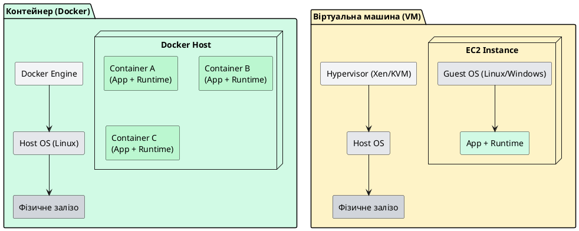

::

**VM** — повна ізоляція через апаратну віртуалізацію. Кожна VM містить власну гостьову ОС (~1–20 GB). Запуск займає хвилини.

**Контейнер** — ізоляція на рівні ОС через namespaces та cgroups Linux. Контейнер **ділить ядро** з хост-ОС. Розмір образу — десятки–сотні MB. Запуск займає секунди або мілісекунди.

Для AWS це означає: на одному EC2 інстансі можна запустити десятки контейнерів, де могло б бути лише кілька VM.

---

## Amazon ECR — Elastic Container Registry

{.diagram-img}

Перш ніж запустити контейнер в AWS, образ потрібно десь зберегти. **Amazon Elastic Container Registry (ECR)** — це керований сервіс для зберігання, версіонування та поширення Docker-образів, аналогічний Docker Hub, але повністю інтегрований з AWS IAM та іншими сервісами AWS.

### Чому ECR, а не Docker Hub?

**Приватність та безпека:** ECR-репозиторії за замовчуванням приватні і захищені IAM-правами. Жоден зовнішній користувач не зможе завантажити ваші образи без явного дозволу.

**Інтеграція з AWS:** ECS, EKS та Lambda автоматично аутентифікуються в ECR через IAM Role — без додаткових секретів і паролів. Порівняйте з Docker Hub, де потрібно зберігати credentials у Secrets Manager.

**Швидкість:** ECR розміщений в тому ж регіоні, що і ваші ECS/EKS кластери. Завантаження образу відбувається через внутрішню мережу AWS — без витрат на transfer та з максимальною швидкістю.

**Lifecycle Policies:** ECR автоматично видаляє старі версії образів за правилами, які ви визначаєте (наприклад, зберігати лише 10 останніх версій). Це суттєво знижує вартість зберігання.

### Структура ECR

ECR організований через **репозиторії** (repositories). Один репозиторій — один Docker-образ у різних версіях (тегах).

```
123456789012.dkr.ecr.eu-central-1.amazonaws.com/
├── my-api/
│   ├── :latest
│   ├── :v1.2.3
│   └── :sha256-abc123...
├── my-worker/
│   ├── :latest
│   └── :v2.0.0
└── my-frontend/
    └── :latest
```

Адреса ECR-репозиторію завжди має формат:
```
{account-id}.dkr.ecr.{region}.amazonaws.com/{repository-name}:{tag}
```


### Dockerfile для .NET 8 — multi-stage build

{.diagram-img}

**Multi-stage build** — це техніка написання Dockerfile, яка дозволяє значно зменшити розмір фінального образу. Ідея: використовуємо один образ для збірки (з усіма інструментами розробника) і окремий — мінімальний — для запуску в production.

Розглянемо детально кожен рядок оптимального Dockerfile для ASP.NET Core 8:

```dockerfile
# ─── STAGE 1: BUILD ────────────────────────────────────────────────────────────
# Базовий образ із SDK для збірки (~800 MB)
FROM mcr.microsoft.com/dotnet/sdk:8.0 AS build

# Встановлюємо робочу директорію всередині контейнера
WORKDIR /src

# Спочатку копіюємо ЛИШЕ .csproj файли і відновлюємо залежності.
# Це використовує Docker layer caching: якщо .csproj не змінились —
# команда restore береться з кешу, і збірка прискорюється суттєво.
COPY ["MyApi/MyApi.csproj", "MyApi/"]
RUN dotnet restore "MyApi/MyApi.csproj"

# Тепер копіюємо весь вихідний код
COPY . .

# Перейдіть у директорію проєкту
WORKDIR "/src/MyApi"

# Публікуємо Release-версію у директорію /app/publish
# -c Release      — конфігурація Release
# -o /app/publish — директорія виводу
# --no-restore    — restore вже виконали вище
RUN dotnet publish "MyApi.csproj" -c Release -o /app/publish --no-restore

# ─── STAGE 2: RUNTIME ──────────────────────────────────────────────────────────
# Мінімальний runtime-образ (~200 MB) — набагато менший за SDK
FROM mcr.microsoft.com/dotnet/aspnet:8.0 AS final

# Задаємо робочу директорію
WORKDIR /app

# Копіюємо ЛИШЕ опублікований артефакт зі stage build
# Весь SDK, вихідний код, проміжні файли — залишаються в stage build
# і НЕ потрапляють у фінальний образ
COPY --from=build /app/publish .

# Вказуємо точку входу
ENTRYPOINT ["dotnet", "MyApi.dll"]
```

Завдяки multi-stage build:
- **Build image:** ~800 MB (SDK + вихідний код)
- **Final image:** ~200 MB (лише Runtime + скомпільований застосунок)
- Вихідний код **не потрапляє** у production образ — важливо для безпеки

### .dockerignore — що не копіювати в образ

Файл `.dockerignore` (аналог `.gitignore`) вказує Docker, які файли ігнорувати при копіюванні:

```dockerignore
# Директорії збірки — вони будуть перезбудовані всередині контейнера
**/bin/
**/obj/

# Git-директорія та файли
.git
.gitignore

# Налаштування IDE
.vs/
.rider/
*.user

# Docker-файли самі по собі
Dockerfile
.dockerignore

# Локальні секрети та конфігурації
**/appsettings.Development.json
**/appsettings.Local.json
**/*.pfx
**/.env
```

---

### Практика: Push образу в Amazon ECR

{.diagram-img}

Після написання Dockerfile — виконуємо послідовність команд для відправки образу в ECR:

```bash
# 1. Аутентифікуйтесь у ECR
#    Ця команда отримує тимчасовий токен і передає його docker login
aws ecr get-login-password --region eu-central-1 | \
    docker login --username AWS --password-stdin \
    123456789012.dkr.ecr.eu-central-1.amazonaws.com

# 2. Створіть репозиторій у ECR (якщо не існує)
aws ecr create-repository \
    --repository-name my-api \
    --region eu-central-1 \
    --image-scanning-configuration scanOnPush=true

# 3. Зберіть Docker-образ
docker build -t my-api:latest .

# 4. Поставте тег у форматі ECR
docker tag my-api:latest \
    123456789012.dkr.ecr.eu-central-1.amazonaws.com/my-api:latest

# 5. Завантажте образ у ECR
docker push 123456789012.dkr.ecr.eu-central-1.amazonaws.com/my-api:latest
```

::tip
Зверніть увагу на `--image-scanning-configuration scanOnPush=true`. ECR автоматично сканує кожен завантажений образ на відомі CVE (Common Vulnerabilities and Exposures) за допомогою Amazon Inspector. Це безкоштовна перша лінія захисту від вразливостей у ваших залежностях.
::

---

## Amazon ECS — Elastic Container Service

{.diagram-img}

**Amazon Elastic Container Service (ECS)** — це повністю керований оркестратор контейнерів від AWS. Якщо ECR — це «склад» для образів, то ECS — це «виробничий цех», де ці образи запускаються, масштабуються та оновлюються.

**Оркестратор контейнерів** — це система, яка відповідає за:
- Запуск контейнерів на доступних серверах
- Перезапуск контейнерів у разі збою
- Масштабування (запуск більше копій при зростанні навантаження)
- Rolling updates — оновлення без зупинки сервісу
- Балансування трафіку між копіями контейнера


### Три ключові сутності ECS

ECS оперує трьома основними концепціями. Розберемо їх через аналогію з рестораном.

**Task Definition** — це рецепт страви. Він описує: який образ використовувати, скільки CPU і RAM виділити, які змінні середовища передати, де зберігати логи, які порти відкрити. Task Definition є незмінним шаблоном — кожна зміна створює нову версію (revision).

**Task** — це конкретна приготована страва. Один запущений екземпляр Task Definition. Контейнер, що реально виконується прямо зараз.

**Service** — це менеджер, який гарантує, що завжди є рівно N порцій страви готових до подачі. Якщо одна «страва» зіпсувалась (контейнер впав) — Service автоматично замовить нову. Він також керує rolling updates і підключає Tasks до Load Balancer.

**Cluster** — це сам ресторан: фізичне місце, де все це відбувається. Логічна група, яка об'єднує всі Tasks і Services.

::plant-uml

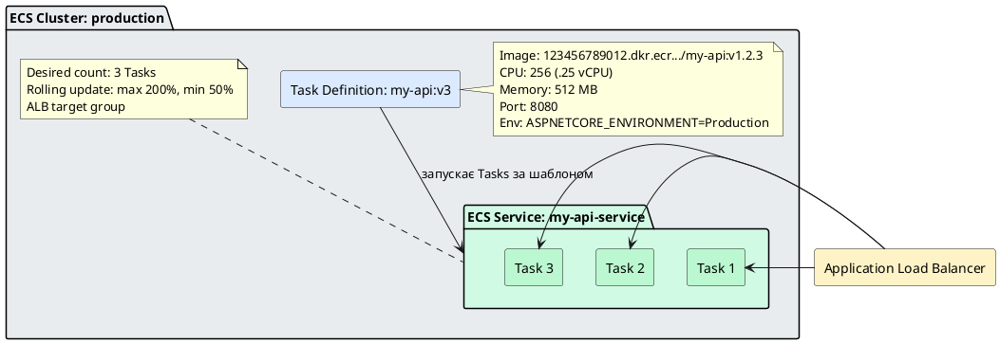

::

### Task Definition: детальна конфігурація

{.diagram-img}

Task Definition — це JSON-документ, але AWS Console надає зручний конструктор. Розберемо ключові поля:

```json
{
    "family": "my-api",
    "networkMode": "awsvpc",
    "requiresCompatibilities": ["FARGATE"],
    "cpu": "256",
    "memory": "512",
    "executionRoleArn": "arn:aws:iam::123456789012:role/ecsTaskExecutionRole",
    "taskRoleArn": "arn:aws:iam::123456789012:role/my-api-task-role",
    "containerDefinitions": [
        {
            "name": "my-api",
            "image": "123456789012.dkr.ecr.eu-central-1.amazonaws.com/my-api:v1.2.3",
            "portMappings": [
                {
                    "containerPort": 8080,
                    "protocol": "tcp"
                }
            ],
            "environment": [
                {"name": "ASPNETCORE_ENVIRONMENT", "value": "Production"},
                {"name": "ASPNETCORE_URLS", "value": "http://+:8080"}
            ],
            "secrets": [
                {
                    "name": "ConnectionStrings__DefaultConnection",
                    "valueFrom": "arn:aws:secretsmanager:eu-central-1:123456789012:secret:prod/db-connection"
                }
            ],
            "logConfiguration": {
                "logDriver": "awslogs",
                "options": {
                    "awslogs-group": "/ecs/my-api",
                    "awslogs-region": "eu-central-1",
                    "awslogs-stream-prefix": "ecs"
                }
            },
            "healthCheck": {
                "command": ["CMD-SHELL", "curl -f http://localhost:8080/health || exit 1"],
                "interval": 30,
                "timeout": 5,
                "retries": 3,
                "startPeriod": 60
            }
        }
    ]
}
```

Розберемо важливі поля:

**`executionRoleArn`** — IAM Role для **ECS агента** (не вашого застосунку). Потрібна для завантаження образу з ECR та запису логів у CloudWatch. Стандартна роль: `AmazonECSTaskExecutionRolePolicy`.

**`taskRoleArn`** — IAM Role для **вашого застосунку всередині контейнера**. Якщо API потребує доступу до S3 або DynamoDB — саме сюди додаються ці права.

**`secrets`** — замість передачі паролів через `environment` (небезпечно!) — отримання секретів із AWS Secrets Manager або SSM Parameter Store. ECS агент завантажує секрет і підставляє як змінну середовища під час запуску контейнера.

**`healthCheck`** — ECS регулярно перевіряє стан контейнера. Якщо health check провалюється тричі — Task вважається нездоровим і Service замінює його новим.

::caution
**Health checks у .NET** потребують окремого endpoint. Додайте у Program.cs:
```csharp
app.MapHealthChecks("/health");
```
І переконайтесь, що endpoint доступний **до** підключення до бази даних. ECS починає перевірку одразу після старту контейнера, а DB може ще не бути доступна.
::


---

## AWS Fargate vs EC2 Launch Types

{.diagram-img}

Один із ключових вибір при налаштуванні ECS: **як запускати Tasks?** ECS підтримує два «launch types» — режими запуску, які принципово відрізняються підходом до управління інфраструктурою.

### EC2 Launch Type

При використанні EC2 launch type ви **самостійно управляєте EC2 інстансами**, на яких запускаються контейнери. ECS розміщує Tasks на ваших інстансах, але **відповідальність за самі інстанси — на вас**: встановлення ECS Agent, оновлення ОС, вибір типу і розміру інстансу, масштабування парку машин.

**Переваги EC2 launch type:**
- Нижча вартість при стабільному, передбачуваному навантаженні (Reserved Instances, Savings Plans)
- Більш детальний контроль: GPU інстанси для ML, специфічні типи інстансів, Spot Instances для batch-задач
- Можливість запускати privileged контейнери та монтувати локальні томи

**Недоліки:** Ви платите за інстанс, навіть якщо він простоює. Потрібно управляти capacity, оновленнями ОС, патчами безпеки.

### AWS Fargate — Serverless Containers

**AWS Fargate** — це serverless платформа для запуску контейнерів. При використанні Fargate launch type **AWS повністю бере на себе управління інфраструктурою**: ви не вибираєте, не запускаєте і не обслуговуєте жодного EC2 інстансу. Ви просто описуєте Task Definition (образ, CPU, RAM) — і Fargate запускає контейнер.

**Принцип роботи Fargate:** для кожного Task AWS виділяє ізольоване мікро-середовище з запитаними ресурсами. Task не знає про інші Tasks. Після зупинки Task — ресурси звільняються. **Ви платите лише за час виконання Task** (vCPU-годину та GB-годину RAM).

**Переваги Fargate:**
- Нуль операційного overhead: немає кластеру EC2 для управління
- Ізоляція на рівні завдання — кожен Task у власному мікро-VM
- Автоматичне масштабування від 0 до тисяч Tasks без попереднього планування capacity
- Ідеально для нерівномірного навантаження, мікросервісів та стартапів

**Недоліки:** Дорожче за EC2 для стабільного, постійного навантаження. Немає GPU-підтримки. Холодний старт повільніший (кілька секунд для підняття ізольованого середовища).

::card-group

::card{title="Fargate — коли обирати" icon="i-heroicons-bolt"}

- Мікросервісна архітектура
- Нерівномірне навантаження (пікові навантаження вдень, майже нуль вночі)
- Команда без DevOps-досвіду або маленька команда
- Batch-задачі, фонові воркери
- Стартапи та MVP

::

::card{title="EC2 Launch Type — коли обирати" icon="i-heroicons-server-stack"}

- Стабільне, передбачуване навантаження 24/7
- Потреба у GPU (ML моделі)
- Специфічні вимоги до типу інстансу
- Spot Instances для batch-обробки даних
- Велика компанія з виділеним DevOps-відділом

::

::

---

## ECS Task Networking: awsvpc режим

{.diagram-img}

**awsvpc** (AWS Virtual Private Cloud) — це режим мережі, який є обов'язковим для Fargate і рекомендованим для EC2 launch type. У цьому режимі **кожен Task отримує власний Elastic Network Interface (ENI)** — і, отже, власну приватну IP-адресу всередині вашої VPC.

Що це означає на практиці?

- **Ізоляція мережі:** кожен Task — окремий мережевий ендпоінт із власним IP. Security Groups застосовуються на рівні Task, не на рівні хост-інстансу
- **Пряма адресація:** Application Load Balancer спілкується з кожним Task напряму по IP, без NAT
- **Підтримка VPC Flow Logs:** весь мережевий трафік контейнерів можна логувати та аналізувати

```
VPC: 10.0.0.0/16
├── Subnet: 10.0.1.0/24 (Private, AZ-a)
│   ├── Task 1 ENI: 10.0.1.15 (my-api)
│   └── Task 2 ENI: 10.0.1.23 (my-worker)
└── Subnet: 10.0.2.0/24 (Private, AZ-b)
    └── Task 3 ENI: 10.0.2.8 (my-api)
```

---

## ECS Service Auto Scaling

{.diagram-img}

**Auto Scaling** — це автоматична зміна кількості запущених Tasks у відповідь на зміну навантаження. ECS Service Auto Scaling інтегрований з **Amazon CloudWatch** та **Application Auto Scaling** і підтримує три стратегії масштабування:

### Target Tracking Scaling

Найпростіший і найрекомендованіший підхід для початку. Ви вказуєте **цільове значення метрики** — і AWS автоматично додає або видаляє Tasks для підтримання цього значення.

```json
{
    "TargetValue": 70.0,
    "PredefinedMetricSpecification": {
        "PredefinedMetricType": "ECSServiceAverageCPUUtilization"
    },
    "ScaleInCooldown": 300,
    "ScaleOutCooldown": 60
}
```

Ця конфігурація каже: «Підтримуй середнє CPU-завантаження на рівні 70%. Якщо CPU зростає вище — додай Tasks (cooldown 60 сек). Якщо CPU падає нижче — видали Tasks (cooldown 300 сек)».

**`ScaleOutCooldown` (60 сек)** — пауза після масштабування вгору. Невеликий, бо при зростанні навантаження важливо швидко реагувати.

**`ScaleInCooldown` (300 сек)** — пауза після масштабування вниз. Більший, бо передчасне видалення Tasks при тимчасовому зниженні навантаження є контрпродуктивним.

### Step Scaling та Scheduled Scaling

**Step Scaling** дозволяє задати різні кроки масштабування залежно від величини відхилення. Наприклад: CPU 70–80% → +1 Task, CPU 80–90% → +2 Tasks, CPU >90% → +4 Tasks.

**Scheduled Scaling** дозволяє масштабувати за розкладом — корисно, якщо навантаження передбачуване (наприклад, кожен день о 8:00 збільшувати мінімум до 5 Tasks).

::plant-uml

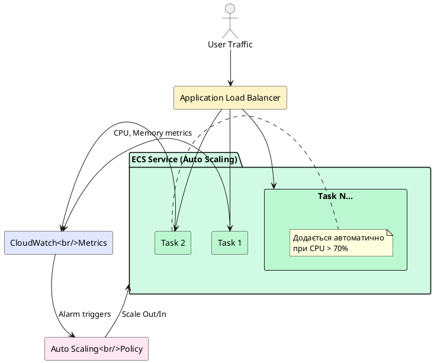

::


---

## Application Load Balancer для ECS

{.diagram-img}

**Application Load Balancer (ALB)** — це Layer 7 (HTTP/HTTPS) балансувальник навантаження, який розподіляє вхідні запити між Tasks у ECS Service. Без ALB ваш застосунок буде доступний лише за приватною IP-адресою Task — що змінюється при кожному рестарті.

### Як ALB інтегрується з ECS

Коли ECS Service запускає новий Task — він автоматично **реєструє** IP Task у **Target Group** ALB. Коли Task зупиняється — видаляє його. ALB завжди знає актуальний список здорових Tasks і направляє на них трафік.

**Ланцюжок запиту:**
```
Internet → Route 53 (DNS) → ALB (HTTPS:443) → Target Group → Tasks (HTTP:8080)
```

ALB виконує SSL termination: приймає HTTPS від клієнта, розшифровує і передає у Tasks по звичайному HTTP — Tasks не потрібно конфігурувати SSL.

### Налаштування ALB для ECS через AWS CLI

```bash
# 1. Створіть Target Group (куди ALB направлятиме запити)
aws elbv2 create-target-group \
    --name my-api-tg \
    --protocol HTTP \
    --port 8080 \
    --vpc-id vpc-0a1b2c3d4e5f \
    --target-type ip \
    --health-check-path /health \
    --health-check-interval-seconds 30 \
    --healthy-threshold-count 2 \
    --unhealthy-threshold-count 3

# 2. Під час створення ECS Service — прив'яжіть Target Group
aws ecs create-service \
    --cluster production \
    --service-name my-api \
    --task-definition my-api:3 \
    --desired-count 3 \
    --launch-type FARGATE \
    --load-balancers "targetGroupArn=arn:aws:elasticloadbalancing:...,containerName=my-api,containerPort=8080" \
    --network-configuration "awsvpcConfiguration={subnets=[subnet-xxx,subnet-yyy],securityGroups=[sg-zzz],assignPublicIp=DISABLED}"
```

Зверніть увагу: `--target-type ip` — це специфічно для Fargate та awsvpc режиму, де кожен Task має власний IP.

---

## Rolling Updates — оновлення без зупинки сервісу

{.diagram-img}

**Rolling update** — це стратегія оновлення, яка дозволяє замінити стару версію застосунку новою **без жодного часу простою (downtime)**. ECS Service виконує rolling update автоматично щоразу, коли ви змінюєте Task Definition.

**Як це працює покроково:**

Припустимо, у вас 4 Tasks з версією `v1.2.3`, і ви хочете оновитись до `v1.3.0`. Конфігурація: `minimumHealthyPercent=50`, `maximumPercent=200`.

1. ALB продовжує направляти трафік на всі 4 Tasks (v1.2.3)
2. ECS запускає 4 нових Tasks (v1.3.0) — тепер запущено 8 Tasks (200% від бажаних 4)
3. ECS чекає, поки нові Tasks пройдуть health check і зареєструються в ALB
4. ECS зупиняє 4 старих Tasks (v1.2.3) — залишається 4 Tasks (v1.3.0), 100%
5. Оновлення завершено, ALB направляє трафік на v1.3.0

У будь-який момент процесу `minimumHealthyPercent=50` гарантує, що щонайменше 2 Tasks (50% від 4) залишаються здоровими.

::tip
**Нова версія образу в ECR не запускається автоматично.** ECS запам'ятовує конкретний digest образу в Task Definition. Щоб запустити оновлений образ — оновіть Task Definition (вкажіть новий тег або sha256 digest) та оновіть Service. Це захищає від ненавмисних оновлень через зміну тегу `:latest`.
::

---

{.diagram-img}

## Amazon EKS — огляд Kubernetes на AWS

**Amazon Elastic Kubernetes Service (EKS)** — це керований сервіс Kubernetes від AWS.

::plant-uml

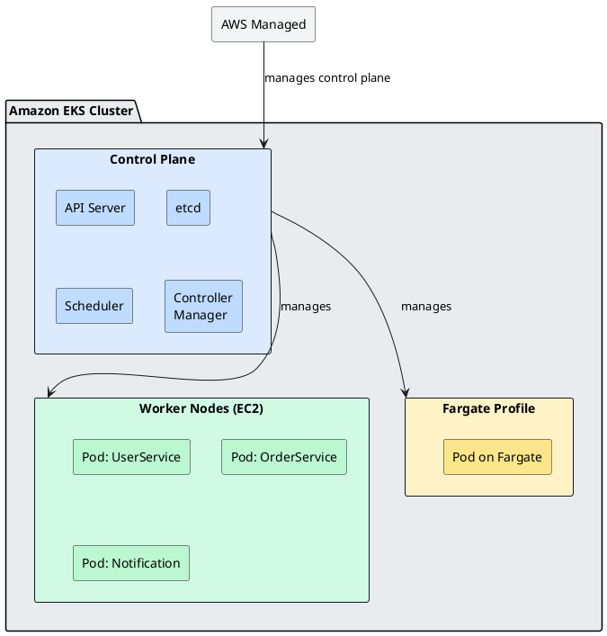

::
 Він надає повноцінний Kubernetes кластер, де AWS бере на себе управління **control plane** (API Server, etcd, Controller Manager, Scheduler) — найскладнішою і найкритичнішою частиною Kubernetes.

### Kubernetes і ECS — в чому різниця?

Якщо ECS — це «AWS-рідний» оркестратор, розроблений Amazon, то Kubernetes — це **відкритий галузевий стандарт** оркестрації контейнерів, розроблений Google і переданий у CNCF (Cloud Native Computing Foundation).

::card-group

::card{title="Amazon ECS" icon="i-simple-icons-amazonaws"}

- Розроблений Amazon, нативно інтегрований з AWS
- Значно простіший в налаштуванні та управлінні
- Менше концепцій для вивчення
- Менша гнучкість і екосистема
- Ідеальний вибір, якщо ви не плануєте мігрувати між провайдерами

::

::card{title="Amazon EKS (Kubernetes)" icon="i-simple-icons-kubernetes"}

- Відкритий стандарт, мультихмарний (AWS, Azure, GCP, on-premises)
- Значно потужніша екосистема (Helm, Istio, ArgoCD, Prometheus)
- Складніший: потрібно розуміти Pods, Deployments, Services, Ingress, RBAC тощо
- Вища гнучкість та контроль
- Краще для великих команд із K8s-досвідом

::

::

**Коли обирати EKS?**

- Команда вже має Kubernetes-досвід
- Потреба у мультихмарній або гібридній архітектурі
- Складні networking вимоги (service mesh, mutual TLS)
- Розширена екосистема: Helm charts, GitOps (ArgoCD/Flux), observability стек (Prometheus + Grafana)
- Потреба у більшому контролі над scheduling (node affinity, tolerations, pod disruption budgets)

::note
У цьому курсі ми зосереджуємось на **ECS Fargate** як оптимальному варіанті для .NET розробників без глибокого DevOps-досвіду. Kubernetes і EKS є окремою великою темою, яка заслуговує власного курсу. Базовий огляд K8s ви вже маєте з розділу про інструменти DevOps.
::

### ECS vs EKS vs Fargate: підсумкова таблиця

| Характеристика | ECS + EC2 | ECS + Fargate | EKS + EC2 | EKS + Fargate |
|---|---|---|---|---|
| **Управління серверами** | Ви | AWS | Ви | AWS |
| **Управління K8s control plane** | — | — | AWS | AWS |
| **Складність налаштування** | Середня | Низька | Висока | Висока |
| **Гнучкість** | Середня | Низька | Висока | Середня |
| **Вартість** | Нижча | Вища | Нижча | Вища |
| **Мультихмарність** | ❌ | ❌ | ✅ | ✅ |
| **Рекомендовано для** | Досвідчені DevOps | Малі команди, MVP | Великі команди з K8s | Складні K8s, без серверів |


---

{.diagram-img}

## Environment Variables у ECS Task Definitions — специфіка .NET

### Проблема: конфігурація у контейнерному середовищі

.NET традиційно зберігає конфігурацію в `appsettings.json`. У Docker-контейнері це проблема: конфіг «запечений» у образ і не може відрізнятись між dev та production без перезбірки образу.

**Правильний підхід:** дотримання принципу [12-Factor App](https://12factor.net/) — конфігурація зберігається у **змінних середовища** (environment variables), які передаються контейнеру при запуску.

ASP.NET Core автоматично читає змінні середовища через `IConfiguration` — жодних додаткових налаштувань не потрібно. Ієрархічні ключі з `appsettings.json` відповідають змінним з подвійним підкресленням `__`:

```json
// appsettings.json
{
    "ConnectionStrings": {
        "DefaultConnection": "будь-яке значення"
    },
    "Feature": {
        "MaxItems": 100
    }
}
```

Відповідні змінні середовища:
```bash
ConnectionStrings__DefaultConnection=Host=prod-db;Database=mydb;...
Feature__MaxItems=50
```

### Де зберігати секрети в ECS

У Task Definition є два способи передачі конфігурації:

**`environment`** — для **незасекреченої** конфігурації:
```json
"environment": [
    {"name": "ASPNETCORE_ENVIRONMENT", "value": "Production"},
    {"name": "Feature__MaxItems", "value": "100"},
    {"name": "Logging__LogLevel__Default", "value": "Warning"}
]
```

**`secrets`** — для **секретів** (паролі, API ключі, connection strings). Значення не зберігається у Task Definition у відкритому вигляді — ECS агент завантажує секрет з AWS Secrets Manager або SSM Parameter Store під час запуску:

```json
"secrets": [
    {
        "name": "ConnectionStrings__DefaultConnection",
        "valueFrom": "arn:aws:secretsmanager:eu-central-1:123456789012:secret:prod/db-conn"
    },
    {
        "name": "ExternalApi__ApiKey",
        "valueFrom": "/prod/external-api/key"
    }
]
```

У .NET-коді все виглядає однаково через `IConfiguration`:
```csharp
// Program.cs — нічого особливого, стандартна конфігурація
var connectionString = builder.Configuration.GetConnectionString("DefaultConnection");
var apiKey = builder.Configuration["ExternalApi:ApiKey"];
```


---

## Довідник: Amazon ECR — повна документація функцій

{.diagram-img}

::plant-uml

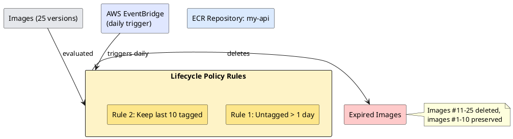

::

### Lifecycle Policies — автоматичне управління версіями образів

**Lifecycle Policy** — це правило, яке ECR виконує автоматично для видалення старих або непотрібних образів. Без lifecycle policy репозиторій безмежно росте, і ви платите за зберігання тисяч застарілих образів.

**Навіщо потрібні:** кожен CI/CD pipeline при кожному commit'і завантажує новий образ. За місяць це 30+ образів на репозиторій. Lifecycle policy забезпечує автоматичне очищення.

Lifecycle policy складається з **правил** (rules) з пріоритетами. Кожне правило описує: які образи шукати (за тегом або без тегу) та що з ними робити (видалити після N днів або зберегти лише N останніх).

**Типовий сценарій: зберігати лише 10 tagged версій і видаляти untagged після 1 дня:**

```json
{
    "rules": [
        {
            "rulePriority": 1,
            "description": "Видаляти untagged образи через 1 день",
            "selection": {
                "tagStatus": "untagged",
                "countType": "sinceImagePushed",
                "countUnit": "days",
                "countNumber": 1
            },
            "action": {"type": "expire"}
        },
        {
            "rulePriority": 2,
            "description": "Зберігати лише 10 останніх tagged образів",
            "selection": {
                "tagStatus": "tagged",
                "tagPrefixList": ["v"],
                "countType": "imageCountMoreThan",
                "countNumber": 10
            },
            "action": {"type": "expire"}
        }
    ]
}
```

**Застосування через AWS CLI:**

```bash
aws ecr put-lifecycle-policy \
    --repository-name my-api \
    --lifecycle-policy-text file://lifecycle-policy.json \
    --region eu-central-1
```

**Через AWS Console:** ECR → Repositories → `my-api` → вкладка **«Lifecycle policy»** → **Create rule** → задайте умови у формі → **Save**.

::tip
Перед застосуванням lifecycle policy перевірте, які образи будуть видалені: ECR → Repositories → `my-api` → **Lifecycle policy** → **Test rules** → ECR покаже список образів, які підпадають під правила, без реального видалення.
::

---

{.diagram-img}

### Image Scanning — автоматичний аудит безпеки

ECR інтегрований з **Amazon Inspector** і може автоматично сканувати кожен завантажений образ на відомі CVE (Common Vulnerabilities and Exposures) — бази відомих вразливостей у ПЗ.

**Два режими сканування:**

**Basic Scanning** — безкоштовне сканування на основі відкритої бази даних CVE. Виконується один раз при push (якщо `scanOnPush=true`) або вручну.

**Enhanced Scanning** (Amazon Inspector) — платне безперервне сканування. Повторно аналізує образи при появі нових CVE у базі — навіть якщо образ давно завантажений.

**Перегляд результатів через CLI:**

```bash
# Переглянути результати останнього сканування
aws ecr describe-image-scan-findings \
    --repository-name my-api \
    --image-id imageTag=v1.2.3 \
    --region eu-central-1

# Приклад відповіді:
# {
#   "imageScanFindings": {
#     "findings": [
#       {
#         "name": "CVE-2023-12345",
#         "severity": "HIGH",
#         "description": "Buffer overflow in libssl...",
#         "uri": "https://nvd.nist.gov/vuln/detail/CVE-2023-12345"
#       }
#     ],
#     "findingSeverityCounts": {"HIGH": 1, "MEDIUM": 3, "LOW": 12}
#   }
# }
```

**Запустити сканування вручну:**

```bash
aws ecr start-image-scan \
    --repository-name my-api \
    --image-id imageTag=v1.2.3 \
    --region eu-central-1
```

---

{.diagram-img}

### Image Tag Mutability — захист від перезапису тегів

**Tag Mutability** визначає, чи можна перезаписати тег образу, який вже існує.

- **MUTABLE** (за замовчуванням) — тег `:latest` або `:v1.0.0` можна перезаписати новим образом. Зручно, але небезпечно: CI/CD міг завантажити інший образ під тим самим тегом.
- **IMMUTABLE** — після першого завантаження тег не можна перезаписати. Забезпечує повну відтворюваність: образ `:v1.0.0` завжди залишається тим самим.

**Рекомендація:** використовуйте IMMUTABLE для production репозиторіїв. Для тегування використовуйте git commit SHA або семантичне версіонування, а не `:latest`.

```bash
# Змінити mutability для існуючого репозиторію
aws ecr put-image-tag-mutability \
    --repository-name my-api \
    --image-tag-mutability IMMUTABLE \
    --region eu-central-1
```

---

{.diagram-img}

### Cross-Account Access — доступ між AWS акаунтами

У multi-account архітектурі (окремі акаунти для dev/staging/production) ECR може бути в одному акаунті, а ECS кластери — в інших. Для цього налаштовується **Repository Policy** — IAM Policy на рівні репозиторію, яка дозволяє зовнішнім акаунтам завантажувати образи.

```json
{
    "Version": "2012-10-17",
    "Statement": [
        {
            "Sid": "AllowPullFromProductionAccount",
            "Effect": "Allow",
            "Principal": {
                "AWS": "arn:aws:iam::PRODUCTION_ACCOUNT_ID:root"
            },
            "Action": [
                "ecr:GetDownloadUrlForLayer",
                "ecr:BatchGetImage",
                "ecr:BatchCheckLayerAvailability"
            ]
        }
    ]
}
```

```bash
# Застосувати Repository Policy
aws ecr set-repository-policy \
    --repository-name my-api \
    --policy-text file://repo-policy.json \
    --region eu-central-1
```

---

{.diagram-img}

### ECR Replication — реплікація між регіонами

Якщо ваші ECS кластери розташовані у кількох регіонах (наприклад, EU та US), образи варто реплікувати в кожен регіон — для швидкого завантаження без cross-region трафіку.

```bash
# Налаштувати реплікацію образів у інший регіон
aws ecr put-replication-configuration \
    --replication-configuration '{
        "rules": [{
            "destinations": [{"region": "us-east-1", "registryId": "ACCOUNT_ID"}],
            "repositoryFilters": [{"filter": "my-api", "filterType": "PREFIX_MATCH"}]
        }]
    }' \
    --region eu-central-1
```

---

## Довідник: Amazon ECS — повна документація функцій

{.diagram-img}

::plant-uml

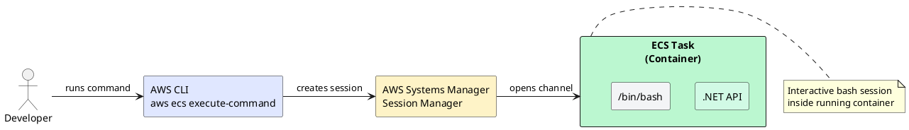

::

### ECS Exec — підключення до контейнера для дебагінгу

**ECS Exec** — це функція, яка дозволяє запустити інтерактивну сесію (bash або будь-яку команду) всередині запущеного Task. Аналог `kubectl exec` у Kubernetes або `docker exec` для локальних контейнерів.

**Навіщо потрібно:** коли контейнер поводиться дивно у production — перевірити змінні середовища, пінгувати БД зсередини контейнера, переглянути файли.

**Підготовка — IAM права для ECS Exec:**

```json
{
    "Version": "2012-10-17",
    "Statement": [{
        "Effect": "Allow",
        "Action": [
            "ssmmessages:CreateControlChannel",
            "ssmmessages:CreateDataChannel",
            "ssmmessages:OpenControlChannel",
            "ssmmessages:OpenDataChannel"
        ],
        "Resource": "*"
    }]
}
```

Додайте цю Policy до **Task Role** (не Execution Role).

**Увімкнення ECS Exec для Service:**

::tabs

::tabs-item{label="AWS CLI"}

```bash
# Увімкнути execute-command при оновленні сервісу
aws ecs update-service \
    --cluster my-cluster \
    --service my-api-service \
    --enable-execute-command \
    --region eu-central-1

# Підключитися до контейнера у запущеному Task
TASK_ARN="arn:aws:ecs:eu-central-1:123456789012:task/my-cluster/abc123"

aws ecs execute-command \
    --cluster my-cluster \
    --task $TASK_ARN \
    --container my-api \
    --interactive \
    --command "/bin/bash" \
    --region eu-central-1
```

::terminal-preview{title="ECS Exec session"}

<div class="line">The Session Manager plugin was installed successfully. Use the AWS CLI to start a session.</div>
<div class="line"></div>
<div class="line">Starting session with SessionId: ecs-execute-command-abc123</div>
<div class="line"><span class="text-green-400">root@3f4a8b9c1d2e:/app#</span> env | grep ASPNETCORE</div>
<div class="line">ASPNETCORE_ENVIRONMENT=Production</div>
<div class="line">ASPNETCORE_URLS=http://+:8080</div>
<div class="line"><span class="text-green-400">root@3f4a8b9c1d2e:/app#</span> curl localhost:8080/health</div>
<div class="line">Healthy</div>

::

::

::tabs-item{label="AWS Console"}

1. ECS → Clusters → `my-cluster` → Tasks
2. Оберіть потрібний Task → натисніть **«Execute command»**
3. Оберіть контейнер → введіть команду (наприклад `/bin/bash`) → **Execute**
4. Відкриється термінальна сесія прямо в браузері через AWS CloudShell

::

::

::caution
ECS Exec використовує AWS Systems Manager Session Manager під капотом. Для роботи потрібно: встановлений AWS CLI Session Manager plugin локально (`session-manager-plugin`), Task Role з SSM правами (вище), `enableExecuteCommand: true` у Service.
::

---

{.diagram-img}

::plant-uml

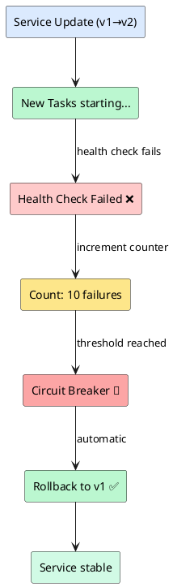

::

### Deployment Circuit Breaker — автоматичний відкат при збоях

**Circuit Breaker** — це механізм, який автоматично зупиняє rolling deployment і відкочується до попередньої версії, якщо нові Tasks не проходять health check.

**Без Circuit Breaker:** якщо новий образ має баг і Tasks не запускаються — ECS нескінченно намагається їх запустити. Deployment «зависає», стара версія поступово видаляється — сервіс деградує.

**З Circuit Breaker:** ECS підраховує, скільки Tasks підряд не вдалося запустити. Якщо досягнуто порогу (за замовчуванням 10 провальних Tasks) — deployment зупиняється і автоматично відкочується до попередньої Task Definition revision.

```bash
# Увімкнути Circuit Breaker при оновленні Service
aws ecs update-service \
    --cluster my-cluster \
    --service my-api-service \
    --deployment-configuration '{
        "deploymentCircuitBreaker": {
            "enable": true,
            "rollback": true
        },
        "maximumPercent": 200,
        "minimumHealthyPercent": 50
    }' \
    --region eu-central-1
```

**Через Console:** ECS → Services → Update → розділ **«Deployment options»** → ✅ **Circuit breaker** → ✅ **Rollback on failure**.

::tip
Завжди вмикайте Circuit Breaker з `rollback: true` у production. Це забезпечує автоматичний захист від деплою зламаного коду.
::

---

{.diagram-img}

::plant-uml

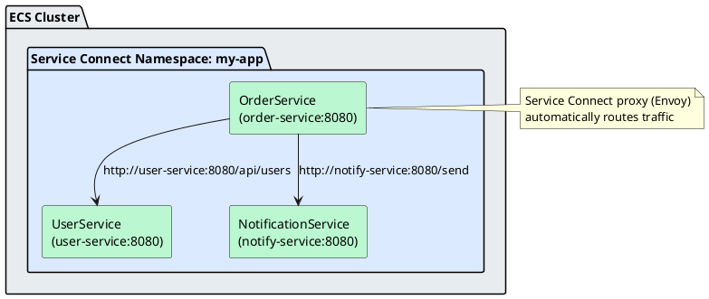

::

### Service Connect — внутрішній service discovery

**ECS Service Connect** — це вбудований механізм service discovery та load balancing для комунікації між мікросервісами всередині одного кластера. Замість того, щоб налаштовувати AWS Cloud Map або ALB для internal трафіку, Service Connect робить це автоматично.

**Сценарій:** `OrderService` потребує звертатись до `UserService`. З Service Connect — `UserService` доступний просто за назвою `user-service:8080` без жодного DNS-налаштування.

**Налаштування Service Connect у Task Definition:**

```json
"serviceConnectConfiguration": {
    "enabled": true,
    "namespace": "my-app",
    "services": [{
        "portName": "http",
        "discoveryName": "user-service",
        "clientAliases": [{
            "port": 8080,
            "dnsName": "user-service"
        }]
    }]
}
```

Після цього `OrderService` може звертатись до `http://user-service:8080/api/users` — ECS автоматично проксіює запит на відповідний Task через Envoy proxy, вбудований у кожен Task.

---

{.diagram-img}

::plant-uml

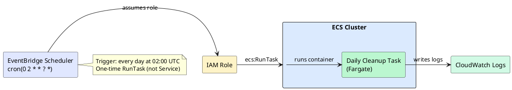

::

### Scheduled Tasks — запуск контейнерів за розкладом

ECS підтримує запуск **одноразових Tasks** за розкладом через інтеграцію з **Amazon EventBridge Scheduler**. Це ідеально для batch-задач, щоденних звітів, очищення даних.

**Приклад: запускати контейнер щодня о 02:00 UTC:**

::tabs

::tabs-item{label="AWS CLI"}

```bash
# Створіть IAM Role для EventBridge → ECS
# (потрібна роль з правами ecs:RunTask та iam:PassRole)

# Створіть scheduled task
aws scheduler create-schedule \
    --name "daily-cleanup" \
    --schedule-expression "cron(0 2 * * ? *)" \
    --flexible-time-window '{"Mode": "OFF"}' \
    --target '{
        "Arn": "arn:aws:ecs:eu-central-1:123456789012:cluster/my-cluster",
        "RoleArn": "arn:aws:iam::123456789012:role/EventBridgeECSRole",
        "EcsParameters": {
            "TaskDefinitionArn": "arn:aws:ecs:eu-central-1:123456789012:task-definition/cleanup-task:1",
            "LaunchType": "FARGATE",
            "NetworkConfiguration": {
                "AwsvpcConfiguration": {
                    "Subnets": ["subnet-xxx"],
                    "SecurityGroups": ["sg-xxx"],
                    "AssignPublicIp": "DISABLED"
                }
            }
        }
    }' \
    --region eu-central-1
```

::

::tabs-item{label="AWS Console"}

1. Відкрийте **Amazon EventBridge** → **Schedules** → **Create schedule**
2. Name: `daily-cleanup`
3. Schedule pattern: Recurring → Cron: `0 2 * * ? *`
4. Target: **AWS API** → ECS → **RunTask**
5. Оберіть кластер, Task Definition, підмережі, Security Group
6. Натисніть **«Create schedule»**

::

::

---

{.diagram-img}

::plant-uml

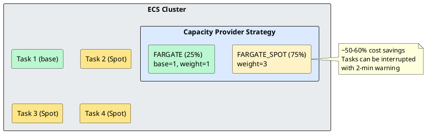

::

### Capacity Providers — управління ресурсами кластера

**Capacity Provider** визначає, де і як ECS виділяє ресурси для запуску Tasks. Для Fargate доступні два built-in провайдери:

- **FARGATE** — стандартний Fargate. Підходить для більшості задач.
- **FARGATE_SPOT** — Tasks запускаються на AWS Spot Capacity. Знижка до 70%, але Tasks можуть бути примусово зупинені з 2-хвилинним попередженням. Ідеально для batch-задач і stateless воркерів.

**Налаштування Capacity Provider Strategy:**

```bash
# Налаштувати кластер на використання Fargate Spot
aws ecs put-cluster-capacity-providers \
    --cluster my-cluster \
    --capacity-providers FARGATE FARGATE_SPOT \
    --default-capacity-provider-strategy \
        "capacityProvider=FARGATE_SPOT,weight=3,base=0" \
        "capacityProvider=FARGATE,weight=1,base=1" \
    --region eu-central-1
```

Ця конфігурація: 1 Task завжди на FARGATE (base=1), потім 75% нових Tasks — FARGATE_SPOT, 25% — FARGATE. **Економія 50–60% при прийнятному рівні надійності.**

---

{.diagram-img}

::plant-uml

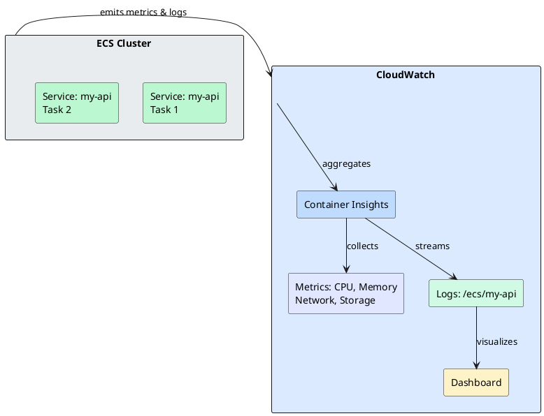

::

### Container Insights — розширений моніторинг

**CloudWatch Container Insights** — це dashboard з деталізованими метриками для ECS: CPU та Memory по кожному Task, Service та Cluster; кількість Task failures; network I/O; storage I/O.

**Увімкнення для кластера:**

```bash
aws ecs update-cluster-settings \
    --cluster my-cluster \
    --settings name=containerInsights,value=enabled \
    --region eu-central-1
```

**Через Console:** ECS → Clusters → `my-cluster` → **Update cluster** → ✅ **Use Container Insights**.

Після увімкнення: **CloudWatch** → **Container Insights** → оберіть ECS Clusters — ви побачите автоматично згенеровані дашборди з графіками CPU, Memory, Task count по кожному сервісу.


---

{.diagram-img}

## Практичний приклад: .NET Web API на ECS Fargate від А до Я

Тепер застосуємо всю теорію та пройдемо повний шлях: від порожньої папки до працюючого API у хмарі.

### Крок 1: Створення .NET проєкту

Відкрийте термінал і створіть новий проєкт:

::terminal-preview{title="dotnet new webapi"}

<div class="line"><span class="opacity-40">$</span> <strong>dotnet new webapi -n EcsLabApi --no-openapi</strong></div>
<div class="line"><span class="text-green-400">The template "ASP.NET Core Web API" was created successfully.</span></div>
<div class="line"></div>
<div class="line"><span class="opacity-40">$</span> <strong>cd EcsLabApi</strong></div>

::

Відредагуйте `Program.cs` — повний вміст файлу:

```csharp
var builder = WebApplication.CreateBuilder(args);

// Реєструємо Health Check сервіс
builder.Services.AddHealthChecks();

var app = builder.Build();

// Головний ендпоінт — версія відповіді береться зі змінної середовища
var version = Environment.GetEnvironmentVariable("APP_VERSION") ?? "1.0.0";

app.MapGet("/", () => new
{
    message = "Hello from ECS Fargate!",
    version = version,
    environment = app.Environment.EnvironmentName,
    timestamp = DateTime.UtcNow
});

// Health check ендпоінт — ECS використовує його для перевірки стану
app.MapHealthChecks("/health");

app.Run();
```

Перевірте, що проєкт збирається локально:

::terminal-preview{title="dotnet run"}

<div class="line"><span class="opacity-40">$</span> <strong>dotnet run</strong></div>
<div class="line"><span class="text-blue-400">info: Microsoft.Hosting.Lifetime[14]</span></div>
<div class="line">&nbsp;&nbsp;&nbsp;&nbsp;&nbsp;Now listening on: http://localhost:5000</div>
<div class="line"></div>
<div class="line"><span class="opacity-40">$</span> <strong>curl http://localhost:5000/health</strong></div>
<div class="line"><span class="text-green-400">Healthy</span></div>

::

### Крок 2: Dockerfile та .dockerignore

Створіть файл `Dockerfile` у корені проєкту `EcsLabApi/`:

```dockerfile
# ─── STAGE 1: BUILD ───────────────────────────────────────────
FROM mcr.microsoft.com/dotnet/sdk:8.0 AS build
WORKDIR /src

# Копіюємо .csproj і відновлюємо залежності (layer cache!)
COPY ["EcsLabApi.csproj", "."]
RUN dotnet restore "EcsLabApi.csproj"

# Копіюємо решту коду і публікуємо Release-версію
COPY . .
RUN dotnet publish "EcsLabApi.csproj" -c Release -o /app/publish --no-restore

# ─── STAGE 2: RUNTIME ─────────────────────────────────────────
FROM mcr.microsoft.com/dotnet/aspnet:8.0 AS final
WORKDIR /app

# ASP.NET Core слухає на порту 8080 (не 5000!)
ENV ASPNETCORE_URLS=http://+:8080

# Копіюємо лише опублікований артефакт — SDK і вихідний код не потрапляють у образ
COPY --from=build /app/publish .

ENTRYPOINT ["dotnet", "EcsLabApi.dll"]
```

Створіть файл `.dockerignore`:

```dockerignore
**/bin/
**/obj/
.git
.gitignore
.vs/
.rider/
Dockerfile
.dockerignore
**/appsettings.Development.json
```

Зберіть образ і перевірте локально:

::terminal-preview{title="docker build & run"}

<div class="line"><span class="opacity-40">$</span> <strong>docker build -t ecs-lab-api:v1.0.0 .</strong></div>
<div class="line">[+] Building 42.3s (12/12) FINISHED</div>
<div class="line"> => [build 1/5] FROM mcr.microsoft.com/dotnet/sdk:8.0</div>
<div class="line"> => [build 4/5] RUN dotnet restore "EcsLabApi.csproj"</div>
<div class="line"> => [build 5/5] RUN dotnet publish "EcsLabApi.csproj" -c Release -o /app/publish</div>
<div class="line"> => [final 2/2] COPY --from=build /app/publish .</div>
<div class="line"><span class="text-green-400"> => => writing image sha256:a1b2c3d4...</span></div>
<div class="line"></div>
<div class="line"><span class="opacity-40">$</span> <strong>docker run -p 8080:8080 ecs-lab-api:v1.0.0</strong></div>
<div class="line"><span class="text-blue-400">info: Microsoft.Hosting.Lifetime[14]</span></div>
<div class="line">&nbsp;&nbsp;&nbsp;&nbsp;&nbsp;Now listening on: http://[::]:8080</div>
<div class="line"></div>
<div class="line"><span class="opacity-40">$</span> <strong>curl http://localhost:8080/health</strong></div>
<div class="line"><span class="text-green-400">Healthy</span></div>
<div class="line"></div>
<div class="line"><span class="opacity-40">$</span> <strong>curl http://localhost:8080/</strong></div>
<div class="line">{"message":"Hello from ECS Fargate!","version":"1.0.0","environment":"Production",...}</div>

::


### Крок 3: Створення ECR репозиторію

::tabs

::tabs-item{label="AWS CLI"}

```bash
# Спочатку дізнайтесь ваш Account ID — він знадобиться в наступних кроках
aws sts get-caller-identity --query Account --output text
# Виведе: 123456789012  ← запам'ятайте це число, це ВАШ реальний AWS Account ID
```

```bash
# Створіть репозиторій у ECR
# eu-central-1 — змініть на ваш регіон, якщо потрібно
aws ecr create-repository \
    --repository-name ecs-lab-api \
    --region eu-central-1 \
    --image-scanning-configuration scanOnPush=true
```

Успішна відповідь матиме вигляд:
```json
{
    "repository": {
        "repositoryArn": "arn:aws:ecr:eu-central-1:123456789012:repository/ecs-lab-api",
        "registryId": "123456789012",
        "repositoryName": "ecs-lab-api",
        "repositoryUri": "123456789012.dkr.ecr.eu-central-1.amazonaws.com/ecs-lab-api"
    }
}
```

Значення `repositoryUri` — це адреса вашого репозиторію. **Скопіюйте її**, вона знадобиться у наступному кроці.

::

::tabs-item{label="AWS Console"}

1. Відкрийте [AWS Console](https://console.aws.amazon.com) → у рядку пошуку введіть **ECR** → оберіть **Elastic Container Registry**
2. Переконайтесь, що у верхньому правому куті обрано регіон **eu-central-1 (Frankfurt)**
3. Натисніть **«Create repository»**
4. Заповніть форму:
   - **Visibility:** Private (за замовчуванням)
   - **Repository name:** `ecs-lab-api`
   - **Image tag mutability:** Mutable
   - **Image scan settings:** ✅ Scan on push
5. Натисніть **«Create repository»**
6. У списку репозиторіїв знайдіть `ecs-lab-api` — скопіюйте значення в колонці **URI** (виглядає як `123456789012.dkr.ecr.eu-central-1.amazonaws.com/ecs-lab-api`)

::

::

### Крок 4: Push образу в ECR

::tabs

::tabs-item{label="AWS CLI"}

Виконайте команди послідовно. **Замініть `123456789012` на ваш реальний Account ID** (отриманий на попередньому кроці):

```bash
# Змінні — підставте ваші реальні значення
ACCOUNT_ID="123456789012"   # ← ЗАМІНІТЬ на ваш Account ID
REGION="eu-central-1"        # ← змініть на ваш регіон
REPO_URI="${ACCOUNT_ID}.dkr.ecr.${REGION}.amazonaws.com/ecs-lab-api"

echo "Буде використано репозиторій: $REPO_URI"
```

```bash
# Аутентифікуємось у ECR — отримуємо тимчасовий токен і передаємо docker login
aws ecr get-login-password --region $REGION | \
    docker login --username AWS --password-stdin "${ACCOUNT_ID}.dkr.ecr.${REGION}.amazonaws.com"
```

::terminal-preview{title="docker login output"}

<div class="line">Login Succeeded</div>

::

```bash
# Тегуємо локальний образ адресою ECR репозиторію
docker tag ecs-lab-api:v1.0.0 $REPO_URI:v1.0.0

# Завантажуємо образ у ECR
docker push $REPO_URI:v1.0.0
```

::terminal-preview{title="docker push output"}

<div class="line"><span class="opacity-40">$</span> <strong>docker push 123456789012.dkr.ecr.eu-central-1.amazonaws.com/ecs-lab-api:v1.0.0</strong></div>
<div class="line">The push refers to repository [123456789012.dkr.ecr.eu-central-1.amazonaws.com/ecs-lab-api]</div>
<div class="line">a1b2c3d4e5f6: Pushed</div>
<div class="line">b2c3d4e5f6a7: Pushed</div>
<div class="line"><span class="text-green-400">v1.0.0: digest: sha256:abc123... size: 1234</span></div>

::

::

::tabs-item{label="AWS Console"}

Для push через консоль скористайтесь вбудованими інструкціями ECR:

1. ECR → Repositories → `ecs-lab-api`
2. Натисніть кнопку **«View push commands»** у правому верхньому куті
3. У вікні, що відкрилось, ви побачите **чотири готові команди** з вашим реальним Account ID та регіоном — просто скопіюйте і виконайте їх послідовно у терміналі

::

::

Перевірте результат — образ має з'явитись у консолі:

1. ECR → Repositories → `ecs-lab-api` → вкладка **«Images»**
2. Ви побачите образ з тегом `v1.0.0` та статус сканування


### Крок 5: Створення ECS Cluster

::tabs

::tabs-item{label="AWS Console"}

1. Відкрийте **ECS** (Elastic Container Service) у AWS Console
2. У лівому меню → **Clusters** → **Create cluster**
3. Заповніть:
   - **Cluster name:** `ecs-lab-cluster`
   - **Infrastructure:** ✅ **AWS Fargate** (зніміть галочку з Amazon EC2 instances)
   - Моніторинг: ✅ Use Container Insights (рекомендовано — дасть метрики CPU/Memory)
4. Натисніть **«Create»** — кластер створюється за ~30 секунд

::

::tabs-item{label="AWS CLI"}

```bash
aws ecs create-cluster \
    --cluster-name ecs-lab-cluster \
    --capacity-providers FARGATE \
    --region eu-central-1
```

::

::

### Крок 6: Створення IAM Role для ECS Task Execution

ECS потребує IAM Role, щоб завантажити образ з ECR та записувати логи. Це стандартна роль — її потрібно створити один раз.

::tabs

::tabs-item{label="AWS Console"}

1. Відкрийте **IAM** → **Roles** → **Create role**
2. **Trusted entity type:** AWS service
3. **Use case:** знайдіть і оберіть **Elastic Container Service Task**
4. Натисніть **Next**
5. У пошуку политик введіть `AmazonECSTaskExecutionRolePolicy` → поставте ✅
6. Натисніть **Next** → **Role name:** `ecsTaskExecutionRole` → **Create role**

::

::tabs-item{label="AWS CLI"}

```bash
# Крок 6a: Створіть Trust Policy файл
cat > /tmp/ecs-trust-policy.json << 'EOF'
{
    "Version": "2012-10-17",
    "Statement": [{
        "Effect": "Allow",
        "Principal": {"Service": "ecs-tasks.amazonaws.com"},
        "Action": "sts:AssumeRole"
    }]
}
EOF

# Крок 6b: Створіть роль
aws iam create-role \
    --role-name ecsTaskExecutionRole \
    --assume-role-policy-document file:///tmp/ecs-trust-policy.json

# Крок 6c: Прикріпіть стандартну policy
aws iam attach-role-policy \
    --role-name ecsTaskExecutionRole \
    --policy-arn arn:aws:iam::aws:policy/service-role/AmazonECSTaskExecutionRolePolicy
```

::

::

### Крок 7: Створення Task Definition

**Важливо:** у полі `image` та `executionRoleArn` підставте ваші реальні значення.

::tabs

::tabs-item{label="AWS Console"}

1. ECS → **Task definitions** → **Create new task definition**
2. **Task definition family:** `ecs-lab-api`
3. **Infrastructure requirements:**
   - Launch type: ✅ **AWS Fargate**
   - OS/Architecture: Linux/X86_64
   - CPU: **0.25 vCPU** (.25)
   - Memory: **0.5 GB** (512 MB)
4. **Task roles:**
   - Task role: *залиште пустим* (наш API не звертається до інших AWS сервісів)
   - Task execution role: `ecsTaskExecutionRole`
5. **Container — 1:**
   - Name: `ecs-lab-api`
   - Image URI: `ВАШ_ACCOUNT_ID.dkr.ecr.eu-central-1.amazonaws.com/ecs-lab-api:v1.0.0`
     *(скопіюйте URI з ECR → Repositories → ecs-lab-api → Images → тег v1.0.0)*
   - Container port: `8080`, Protocol: TCP
   - **Environment variables** → Add:
     - Key: `ASPNETCORE_ENVIRONMENT`, Value: `Production`
     - Key: `APP_VERSION`, Value: `1.0.0`
   - **Health check command:** `CMD-SHELL, curl -f http://localhost:8080/health || exit 1`
   - **Health check intervals:** Interval: 30s, Timeout: 5s, Start period: 10s, Retries: 3
6. **Logging:** ✅ Use log collection → **awslogs**, log group `/ecs/ecs-lab-api`
7. Натисніть **«Create»**

::

::tabs-item{label="AWS CLI"}

```bash
# Підставте ВАШ РЕАЛЬНИЙ ACCOUNT_ID
ACCOUNT_ID="123456789012"   # ← ЗАМІНІТЬ!
REGION="eu-central-1"

# Збережіть Task Definition у файл
cat > /tmp/task-def.json << EOF
{
    "family": "ecs-lab-api",
    "networkMode": "awsvpc",
    "requiresCompatibilities": ["FARGATE"],
    "cpu": "256",
    "memory": "512",
    "executionRoleArn": "arn:aws:iam::${ACCOUNT_ID}:role/ecsTaskExecutionRole",
    "containerDefinitions": [{
        "name": "ecs-lab-api",
        "image": "${ACCOUNT_ID}.dkr.ecr.${REGION}.amazonaws.com/ecs-lab-api:v1.0.0",
        "portMappings": [{"containerPort": 8080, "protocol": "tcp"}],
        "environment": [
            {"name": "ASPNETCORE_ENVIRONMENT", "value": "Production"},
            {"name": "APP_VERSION", "value": "1.0.0"}
        ],
        "healthCheck": {
            "command": ["CMD-SHELL", "curl -f http://localhost:8080/health || exit 1"],
            "interval": 30, "timeout": 5, "retries": 3, "startPeriod": 10
        },
        "logConfiguration": {
            "logDriver": "awslogs",
            "options": {
                "awslogs-group": "/ecs/ecs-lab-api",
                "awslogs-region": "${REGION}",
                "awslogs-stream-prefix": "ecs",
                "awslogs-create-group": "true"
            }
        }
    }]
}
EOF

aws ecs register-task-definition \
    --cli-input-json file:///tmp/task-def.json \
    --region $REGION
```

::

::


### Крок 8: Визначення Security Group та підмережі

Перед запуском Service потрібно знати ID вашої VPC та підмереж. Fargate Tasks будуть запускатись у них.

::tabs

::tabs-item{label="AWS CLI"}

```bash
# Знайдіть ID вашого default VPC
aws ec2 describe-vpcs \
    --filters "Name=isDefault,Values=true" \
    --query "Vpcs[0].VpcId" \
    --output text --region eu-central-1
# Виведе щось на кшталт: vpc-0a1b2c3d4e5f67890
# ← ЗАПИШІТЬ це значення, знадобиться далі

# Знайдіть підмережі у цьому VPC (потрібні мінімум 2 у різних AZ)
aws ec2 describe-subnets \
    --filters "Name=defaultForAz,Values=true" \
    --query "Subnets[*].{ID:SubnetId,AZ:AvailabilityZone}" \
    --output table --region eu-central-1
# Виведе таблицю підмереж — запишіть 2 ID, наприклад:
# subnet-0a1b2c3d  eu-central-1a
# subnet-1b2c3d4e  eu-central-1b
```

Створіть Security Group для Tasks:

```bash
VPC_ID="vpc-0a1b2c3d4e5f67890"   # ← ЗАМІНІТЬ на ваш реальний VPC ID

# Створіть Security Group
SG_ID=$(aws ec2 create-security-group \
    --group-name "ecs-lab-sg" \
    --description "Security group for ECS lab tasks" \
    --vpc-id $VPC_ID \
    --region eu-central-1 \
    --query GroupId --output text)

echo "Security Group ID: $SG_ID"   # ← ЗАПИШІТЬ цей ID

# Дозвольте вхідний трафік на порт 8080
aws ec2 authorize-security-group-ingress \
    --group-id $SG_ID \
    --protocol tcp \
    --port 8080 \
    --cidr 0.0.0.0/0 \
    --region eu-central-1
```

::

::tabs-item{label="AWS Console"}

**Знайдіть VPC та підмережі:**
1. Відкрийте **VPC** (через пошук у консолі)
2. **Your VPCs** → знайдіть рядок з колонкою "Default VPC: Yes" → скопіюйте **VPC ID**
3. **Subnets** → відфільтруйте за вашим VPC ID → запишіть ID двох підмереж у різних AZ

**Створіть Security Group:**
1. VPC → **Security groups** → **Create security group**
2. Name: `ecs-lab-sg`, VPC: оберіть ваш default VPC
3. **Inbound rules** → Add rule:
   - Type: Custom TCP, Port: 8080, Source: Anywhere-IPv4 (0.0.0.0/0)
4. Натисніть **Create** → скопіюйте **Security group ID**

::

::

### Крок 9: Запуск ECS Service

::tabs

::tabs-item{label="AWS Console"}

1. ECS → **Clusters** → `ecs-lab-cluster` → вкладка **Services** → **Create**
2. **Environment:**
   - Compute options: Launch type → **FARGATE**
   - Platform version: LATEST
3. **Deployment configuration:**
   - Application type: **Service**
   - Task definition Family: `ecs-lab-api`, Revision: LATEST
   - Service name: `ecs-lab-service`
   - Desired tasks: **2**
4. **Networking:**
   - VPC: ваш default VPC
   - Subnets: оберіть 2 підмережі у різних AZ
   - Security group: `ecs-lab-sg` (створений вище)
   - Public IP: **Turn on** (для цієї лабораторної роботи)
5. Натисніть **«Create»**

::

::tabs-item{label="AWS CLI"}

```bash
# ЗАМІНІТЬ усі значення на реальні з попередніх кроків!
ACCOUNT_ID="123456789012"      # ← ваш Account ID
REGION="eu-central-1"
SUBNET_1="subnet-0a1b2c3d"    # ← ваш Subnet ID 1
SUBNET_2="subnet-1b2c3d4e"    # ← ваш Subnet ID 2
SG_ID="sg-0a1b2c3d4e5f67890"  # ← ваш Security Group ID

aws ecs create-service \
    --cluster ecs-lab-cluster \
    --service-name ecs-lab-service \
    --task-definition ecs-lab-api \
    --desired-count 2 \
    --launch-type FARGATE \
    --network-configuration "awsvpcConfiguration={
        subnets=[$SUBNET_1,$SUBNET_2],
        securityGroups=[$SG_ID],
        assignPublicIp=ENABLED
    }" \
    --region $REGION
```

::

::

Після запуску зачекайте 1–2 хвилини поки Tasks перейдуть у стан `RUNNING`.

::terminal-preview{title="aws ecs list-tasks"}

<div class="line"><span class="opacity-40">$</span> <strong>aws ecs list-tasks --cluster ecs-lab-cluster --region eu-central-1</strong></div>
<div class="line">{</div>
<div class="line">&nbsp;&nbsp;"taskArns": [</div>
<div class="line">&nbsp;&nbsp;&nbsp;&nbsp;"arn:aws:ecs:eu-central-1:123456789012:task/ecs-lab-cluster/abc123",</div>
<div class="line">&nbsp;&nbsp;&nbsp;&nbsp;"arn:aws:ecs:eu-central-1:123456789012:task/ecs-lab-cluster/def456"</div>
<div class="line">&nbsp;&nbsp;]</div>
<div class="line">}</div>

::

### Крок 10: Перевірка роботи застосунку

Знайдіть публічну IP-адресу одного з Tasks:

::tabs

::tabs-item{label="AWS Console"}

1. ECS → Clusters → `ecs-lab-cluster` → вкладка **Tasks**
2. Натисніть на будь-який Task у стані `RUNNING`
3. У розділі **Network** → скопіюйте **Public IP**
4. Відкрийте у браузері або через curl

::

::tabs-item{label="AWS CLI"}

```bash
# Отримайте список Tasks
TASK_ARN=$(aws ecs list-tasks \
    --cluster ecs-lab-cluster \
    --region eu-central-1 \
    --query "taskArns[0]" --output text)

# Знайдіть ENI прикріплений до Task
ENI_ID=$(aws ecs describe-tasks \
    --cluster ecs-lab-cluster \
    --tasks $TASK_ARN \
    --region eu-central-1 \
    --query "tasks[0].attachments[0].details[?name==\`networkInterfaceId\`].value" \
    --output text)

# Отримайте публічний IP
PUBLIC_IP=$(aws ec2 describe-network-interfaces \
    --network-interface-ids $ENI_ID \
    --region eu-central-1 \
    --query "NetworkInterfaces[0].Association.PublicIp" \
    --output text)

echo "Public IP: $PUBLIC_IP"
```

::

::

Перевірте, що API відповідає:

::terminal-preview{title="curl перевірка"}

<div class="line"><span class="opacity-40">$</span> <strong>curl http://&lt;PUBLIC_IP&gt;:8080/health</strong></div>
<div class="line"><span class="text-green-400">Healthy</span></div>
<div class="line"></div>
<div class="line"><span class="opacity-40">$</span> <strong>curl http://&lt;PUBLIC_IP&gt;:8080/</strong></div>
<div class="line">{"message":"Hello from ECS Fargate!","version":"1.0.0","environment":"Production","timestamp":"2024-..."}</div>

::


### Крок 11: Rolling Update — деплой нової версії

Змінимо версію API і задеплоїмо оновлення без зупинки сервісу.

**Оновіть** `Program.cs` — змініть значення за замовчуванням:
```csharp
var version = Environment.GetEnvironmentVariable("APP_VERSION") ?? "1.1.0";
```

Зберіть і завантажте новий образ:

```bash
ACCOUNT_ID="123456789012"   # ← ваш Account ID
REGION="eu-central-1"
REPO_URI="${ACCOUNT_ID}.dkr.ecr.${REGION}.amazonaws.com/ecs-lab-api"

docker build -t ecs-lab-api:v1.1.0 .
docker tag ecs-lab-api:v1.1.0 $REPO_URI:v1.1.0
docker push $REPO_URI:v1.1.0
```

Оновіть Task Definition та запустіть Rolling Update:

::tabs

::tabs-item{label="AWS Console"}

1. ECS → **Task definitions** → `ecs-lab-api` → **Create new revision**
2. Знайдіть поле **Image URI** у розділі Container → змініть тег `:v1.0.0` на `:v1.1.0`
3. Також змініть Environment variable `APP_VERSION` на `1.1.0`
4. Натисніть **«Create»** → з'явиться revision 2
5. ECS → Clusters → `ecs-lab-cluster` → Services → `ecs-lab-service` → **Update**
6. Task definition: оберіть `ecs-lab-api:2` (нова revision)
7. Натисніть **«Update»**
8. Перейдіть на вкладку **Deployments** — спостерігайте як нові Tasks запускаються (Running: 2→4→2)

::

::tabs-item{label="AWS CLI"}

```bash
ACCOUNT_ID="123456789012"   # ← ваш Account ID
REGION="eu-central-1"

# Зареєструйте нову Task Definition з оновленим образом
aws ecs register-task-definition \
    --family ecs-lab-api \
    --network-mode awsvpc \
    --requires-compatibilities FARGATE \
    --cpu 256 --memory 512 \
    --execution-role-arn "arn:aws:iam::${ACCOUNT_ID}:role/ecsTaskExecutionRole" \
    --container-definitions '[{
        "name": "ecs-lab-api",
        "image": "'"${ACCOUNT_ID}"'.dkr.ecr.'"${REGION}"'.amazonaws.com/ecs-lab-api:v1.1.0",
        "portMappings": [{"containerPort": 8080}],
        "environment": [
            {"name": "ASPNETCORE_ENVIRONMENT", "value": "Production"},
            {"name": "APP_VERSION", "value": "1.1.0"}
        ],
        "healthCheck": {
            "command": ["CMD-SHELL", "curl -f http://localhost:8080/health || exit 1"],
            "interval": 30, "timeout": 5, "retries": 3, "startPeriod": 10
        },
        "logConfiguration": {
            "logDriver": "awslogs",
            "options": {
                "awslogs-group": "/ecs/ecs-lab-api",
                "awslogs-region": "'"${REGION}"'",
                "awslogs-stream-prefix": "ecs",
                "awslogs-create-group": "true"
            }
        }
    }]' \
    --region $REGION

# Оновіть Service — він автоматично визначить latest revision
aws ecs update-service \
    --cluster ecs-lab-cluster \
    --service ecs-lab-service \
    --task-definition ecs-lab-api \
    --region $REGION
```

::

::

Поки йде оновлення, виконуйте запити до API — жодного збою не буде:

::terminal-preview{title="Перевірка під час Rolling Update"}

<div class="line"><span class="opacity-40">$</span> <strong>while true; do curl -s http://&lt;PUBLIC_IP&gt;:8080/ | grep version; sleep 2; done</strong></div>
<div class="line">"version":"1.0.0"</div>
<div class="line">"version":"1.0.0"</div>
<div class="line">"version":"1.1.0"</div>
<div class="line">"version":"1.1.0"</div>

::

Ви побачите, як відповіді поступово переходять з `1.0.0` на `1.1.0` — без жодної помилки.

{.diagram-img}

### Крок 12: Перегляд логів у CloudWatch

::tabs

::tabs-item{label="AWS Console"}

1. Відкрийте **CloudWatch** → **Log groups** → `/ecs/ecs-lab-api`
2. Оберіть один із Log Streams — ви побачите логи запитів у реальному часі
3. Натисніть **«Start tailing»** для live-режиму

::

::tabs-item{label="AWS CLI"}

```bash
# Переглянути останні 20 рядків логів
aws logs tail /ecs/ecs-lab-api \
    --follow \
    --format short \
    --region eu-central-1
```

::

::

### Крок 13: ОБОВ'ЯЗКОВО — Очищення ресурсів

::caution
**Не пропускайте цей крок!** Fargate Tasks тарифікуються за кожну хвилину роботи. ECS Service з 2 Tasks на Fargate коштує ~$0.015/год — це ~$11/місяць. Видаліть усе після завершення лабораторної роботи.
::

Порядок видалення важливий — ресурси мають залежності між собою:

::tabs

::tabs-item{label="AWS Console"}

1. **ECS** → Clusters → `ecs-lab-cluster` → Services → `ecs-lab-service` → **Delete service**
   - ✅ Force delete service → **Delete**
2. **ECS** → Clusters → `ecs-lab-cluster` → **Delete cluster** → підтвердіть
3. **ECR** → Repositories → `ecs-lab-api` → **Delete repository**
   - ✅ Delete all images in this repository → підтвердіть назву → **Delete**
4. **CloudWatch** → Log groups → `/ecs/ecs-lab-api` → **Actions** → Delete log group(s)
5. **VPC** → Security groups → `ecs-lab-sg` → **Actions** → Delete security group
6. **IAM** → Roles → `ecsTaskExecutionRole` → **Delete** (лише якщо ви більше не будете використовувати ECS)

::

::tabs-item{label="AWS CLI"}

```bash
REGION="eu-central-1"
SG_ID="sg-0a1b2c3d4e5f67890"   # ← ваш Security Group ID

# 1. Зупиніть Service (desired count → 0, потім видаліть)
aws ecs update-service --cluster ecs-lab-cluster --service ecs-lab-service --desired-count 0 --region $REGION
aws ecs delete-service --cluster ecs-lab-cluster --service ecs-lab-service --force --region $REGION

# 2. Видаліть кластер
aws ecs delete-cluster --cluster ecs-lab-cluster --region $REGION

# 3. Видаліть образи в ECR та репозиторій
aws ecr batch-delete-image --repository-name ecs-lab-api --image-ids imageTag=v1.0.0 imageTag=v1.1.0 --region $REGION
aws ecr delete-repository --repository-name ecs-lab-api --region $REGION

# 4. Видаліть log group
aws logs delete-log-group --log-group-name /ecs/ecs-lab-api --region $REGION

# 5. Видаліть Security Group
aws ec2 delete-security-group --group-id $SG_ID --region $REGION
```

::

::

---

{.diagram-img}

### Крок 14 (бонус): Підключення безкоштовного домену pp.ua до ALB

Ваш ECS Service доступний через ALB DNS name — щось схоже на `ecs-lab-alb-123456789.eu-central-1.elb.amazonaws.com`. Підключимо читабельний домен `pp.ua`.

**Загальна схема:**
```
myecs.pp.ua
    ↓ CNAME record (DNS)
ecs-lab-alb-123456789.eu-central-1.elb.amazonaws.com
    ↓ ALB (порт 80/443)
ECS Fargate Task → .NET API (порт 8080)
```

::note
На відміну від EC2 де ми використовували **A record** (IP-адресу), тут ALB не має сталої IP — він використовує DNS name. Тому для ALB завжди використовують **CNAME record** (псевдонім), що вказує на DNS name ALB.
::

#### Крок 14a: Отримання DNS name вашого ALB

```bash
# Знайдіть DNS name ALB (якщо не записали раніше)
aws elbv2 describe-load-balancers \
    --names ecs-lab-alb \
    --query "LoadBalancers[0].DNSName" \
    --output text --region eu-central-1
# Виведе: ecs-lab-alb-123456789.eu-central-1.elb.amazonaws.com
```

#### Крок 14b: Реєстрація субдомену на pp.ua

1. Перейдіть на [https://pp.ua](https://pp.ua) та зареєструйте субдомен (наприклад `myecs.pp.ua`)
2. Підтвердіть email і увійдіть у панель управління

#### Крок 14c: Додавання CNAME record у pp.ua

Панель pp.ua → **DNS Management** → **Add Record**:

| Поле | Значення |
|---|---|
| **Type** | CNAME |
| **Name/Host** | `myecs` |
| **Value/Target** | `ecs-lab-alb-123456789.eu-central-1.elb.amazonaws.com` *(ваш ALB DNS)* |
| **TTL** | 300 |

**Різниця A vs CNAME:** `A` record вказує на IP-адресу (`3.64.185.42`). `CNAME` record вказує на інший DNS name (`ecs-lab-alb-xxx.amazonaws.com`) — браузер потім сам вирішує IP цього name. CNAME не можна використовувати для кореневого домену (`pp.ua`), лише для субдоменів.

Зачекайте 1–10 хвилин і перевірте:

::terminal-preview{title="Перевірка CNAME та HTTP запиту"}

<div class="line"><span class="opacity-40">$</span> <strong>nslookup -type=CNAME myecs.pp.ua</strong></div>
<div class="line">Non-authoritative answer:</div>
<div class="line"><span class="text-green-400">myecs.pp.ua  canonical name = ecs-lab-alb-123456789.eu-central-1.elb.amazonaws.com.</span></div>
<div class="line"></div>
<div class="line"><span class="opacity-40">$</span> <strong>curl http://myecs.pp.ua/</strong></div>
<div class="line">{"message":"Hello from ECS Fargate!","container":"abc123def456",...}</div>

::

#### Крок 14d: HTTPS через ACM + ALB (опціонально)

ALB підтримує ACM сертифікати — на відміну від EC2, де потрібен Certbot. Сертифікат ACM безкоштовний.

::caution
ACM сертифікат для ALB (на відміну від CloudFront) створюється **у тому ж регіоні що й ALB** — наприклад `eu-central-1`. Не `us-east-1`!
::

```bash
# 1. Запросити сертифікат (eu-central-1, той самий регіон що ALB)
CERT_ARN=$(aws acm request-certificate \
    --domain-name "myecs.pp.ua" \
    --validation-method DNS \
    --region eu-central-1 \
    --query CertificateArn --output text)
echo "Certificate ARN: $CERT_ARN"

# 2. Отримати CNAME для DNS валідації
aws acm describe-certificate \
    --certificate-arn $CERT_ARN \
    --region eu-central-1 \
    --query "Certificate.DomainValidationOptions[0].ResourceRecord"
# Виведе Name і Value для CNAME — додайте у pp.ua (Type: CNAME)
```

Додайте у pp.ua другий CNAME для валідації ACM (Name і Value з попередньої команди). Дочекайтесь статусу `Issued`.

```bash
# 3. Знайдіть ARN вашого ALB Listener (HTTPS)
ALB_ARN=$(aws elbv2 describe-load-balancers \
    --names ecs-lab-alb \
    --query "LoadBalancers[0].LoadBalancerArn" \
    --output text --region eu-central-1)

# 4. Додати HTTPS Listener на ALB
aws elbv2 create-listener \
    --load-balancer-arn $ALB_ARN \
    --protocol HTTPS --port 443 \
    --certificates CertificateArn=$CERT_ARN \
    --default-actions Type=forward,TargetGroupArn=$TG_ARN \
    --region eu-central-1

# 5. HTTP → HTTPS redirect (змінити HTTP listener)
HTTP_LISTENER=$(aws elbv2 describe-listeners \
    --load-balancer-arn $ALB_ARN \
    --query "Listeners[?Port==\`80\`].ListenerArn" \
    --output text --region eu-central-1)

aws elbv2 modify-listener \
    --listener-arn $HTTP_LISTENER \
    --default-actions 'Type=redirect,RedirectConfig={Protocol=HTTPS,Port=443,StatusCode=HTTP_301}' \
    --region eu-central-1
```

Тепер `https://myecs.pp.ua` — ваш ECS Fargate .NET API з офіційним SSL сертифікатом!

---

{.diagram-img}

## Резюме

- **Docker** вирішує проблему «works on my machine»: застосунок пакується разом із середовищем у незмінний образ.
- **Multi-stage Dockerfile**: build stage (~800 MB SDK) → runtime stage (~200 MB). Вихідний код не потрапляє у фінальний образ.
- **Amazon ECR** — приватний реєстр образів, інтегрований з IAM. Автоматичне сканування вразливостей при push.
- **ECS**: Task Definition (шаблон) → Task (запущений контейнер) → Service (підтримує N Tasks, rolling updates).
- **Fargate** — serverless запуск контейнерів без управління EC2. Оплата за vCPU/RAM × час роботи Task.
- **awsvpc** — кожен Task отримує власний ENI та IP. Security Groups на рівні Task.
- **Rolling updates** — нові Tasks запускаються паралельно зі старими, трафік переключається поступово.
- **Environment variables** у Task Definition: `environment` для конфігурації, `secrets` для паролів зі Secrets Manager.

---

{.diagram-img}

## Практичні завдання

### Рівень 1 (Базовий)

**Завдання 1.** Поясніть різницю між Docker image та Docker container. Що таке multi-stage Dockerfile і яку проблему він вирішує для .NET?

**Завдання 2.** У чому принципова відмінність між Fargate та EC2 launch type? Для якого сценарію ви б обрали кожен?

### Рівень 2 (Практичний)

**Завдання 3.** Напишіть `Dockerfile` для ASP.NET Core 8, який використовує multi-stage build, запускається як non-root user (`USER app` перед `ENTRYPOINT`) і налаштований для production (Release конфігурація).

**Завдання 4.** Напишіть повний Task Definition JSON для ECS Fargate де: .NET API слухає порт 8080, `ASPNETCORE_ENVIRONMENT=Production`, connection string PostgreSQL отримується з Secrets Manager, логи пишуться у CloudWatch `/ecs/my-api`, health check кожні 30 секунд за `/health`.

### Рівень 3 (Архітектура)

**Завдання 5.** Спроектуйте ECS-архітектуру для трьох мікросервісів: `UserService` (.NET), `OrderService` (.NET), `NotificationService` (background worker). Вимоги: усі у приватних підмережах, зовнішній трафік лише через ALB, `UserService`/`OrderService` масштабуються за CPU (60%), `NotificationService` — за кількістю повідомлень у SQS. Паролі в Secrets Manager. Намалюйте PlantUML схему.
