# Elastic Load Balancing та Auto Scaling

## Проблема одного сервера: мотивація до масштабування

Розглянемо фундаментальну проблему, з якою стикається кожна команда розробників при переході від прототипу до production-системи. Уявіть, що ваш .NET API розміщений на єдиному EC2 instance — це типова відправна точка для більшості проектів. Архітектура проста, і на початковому етапі вона цілком задовольняє вимоги. Однак із зростанням продукту виникають три класи критичних проблем, кожна з яких потенційно призводить до повної недоступності сервісу.

**Перший клас: пікові навантаження.** Система функціонує стабільно при нормальному трафіку, але в момент публічного анонсу, маркетингової акції або вірусного поширення кількість одночасних користувачів зростає на порядок. Єдиний сервер вичерпує ресурси процесора та оперативної пам'яті, час відповіді зростає з мілісекунд до десятків секунд, черга з'єднань переповнюється, і сервер переходить у стан відмови.

**Другий клас: апаратні та програмні збої.** Жоден фізичний або віртуальний сервер не має стовідсоткової гарантії безперебійної роботи. Відмова дискового масиву, пошкодження операційної системи, мережевий збій або баг у коді — кожна з цих подій при архітектурі єдиного сервера означає повну недоступність сервісу до ручного втручання інженера, що може тривати від хвилин до годин.

**Третій клас: деплой без простою.** Оновлення застосунку на єдиному сервері неминуче передбачає зупинку процесу, встановлення нової версії та повторний запуск. Протягом цього часу сервіс недоступний — це неприйнятно для систем із вимогами до uptime 99.9% і вище.

Всі три проблеми вирішуються архітектурним підходом, що базується на двох взаємодоповнюючих механізмах: **Load Balancer** рівномірно розподіляє вхідний трафік між кількома серверами, а **Auto Scaling** автоматично регулює кількість серверів відповідно до поточного навантаження.

::plant-uml

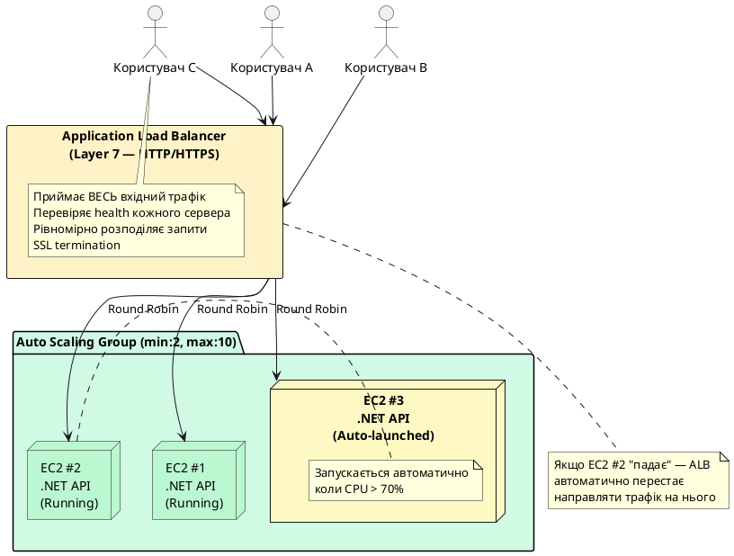

::

---

## AWS Elastic Load Balancing: огляд сімейства сервісів

**AWS Elastic Load Balancing (ELB)** — це керований сервіс AWS, що автоматично розподіляє вхідний трафік між кількома цільовими ресурсами: EC2 instances, контейнерами, IP-адресами або Lambda-функціями. AWS надає три типи балансувальників навантаження, кожен з яких оптимізований для конкретних сценаріїв використання.

::card-group

::card{title="Application Load Balancer" icon="i-heroicons-globe-alt"}

**Рівень OSI:** 7 (Application)

- HTTP/HTTPS, HTTP/2, gRPC, WebSocket
- Маршрутизація за URL, заголовками, cookies
- SSL/TLS termination
- Ідеальний для .NET Web API та мікросервісів

::

::card{title="Network Load Balancer" icon="i-heroicons-bolt"}

**Рівень OSI:** 4 (Transport)

- TCP, UDP, TLS
- Мільйони запитів/сек, latency < 1ms
- Статична IP-адреса балансувальника
- Gaming, IoT, фінансові системи

::

::card{title="Gateway Load Balancer" icon="i-heroicons-shield-check"}

**Рівень OSI:** 3 (Network)

- Прозора вставка в мережевий шлях
- Firewall, IDS/IPS, deep packet inspection
- Для мережевих virtual appliances
- Рідко потрібен .NET розробникам

::

::

::plant-uml

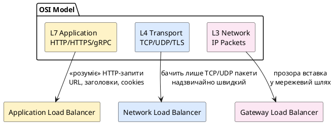

::

---

## Application Load Balancer (ALB) — детальний розгляд

**Application Load Balancer (ALB)** є найбільш функціонально насиченим балансувальником навантаження у сімействі AWS ELB та є стандартним вибором для .NET Web API та мікросервісних архітектур. Його ключова відмінність від NLB полягає у тому, що ALB функціонує на **сьомому рівні моделі OSI** — рівні застосунків. Це означає, що ALB не просто передає мережеві пакети, а повністю розуміє семантику протоколу HTTP: він аналізує URI запиту, HTTP-заголовки, query parameters, тіло запиту та cookie-файли. На основі цього аналізу ALB приймає інтелектуальні рішення про маршрутизацію.

### Архітектура ALB: Listener → Rule → Target Group

Внутрішня архітектура ALB будується на трирівневій ієрархії компонентів:

::plant-uml

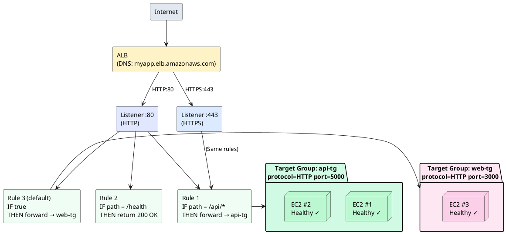

::

### Listener — точка входу трафіку

**Listener** — це процес, що виконується на ALB і очікує вхідні з'єднання на визначеному порті та протоколі. Кожен ALB може мати кілька Listener'ів одночасно. Типова production-конфігурація включає два Listener'и: HTTP на порту 80 (для редиректу на HTTPS) та HTTPS на порту 443 (для обробки реального трафіку).

::field-group

::field{name="Protocol" type="enum" required="true"}
Протокол Listener'а. Допустимі значення: `HTTP`, `HTTPS`. HTTPS Listener вимагає прив'язки SSL/TLS сертифіката від AWS Certificate Manager або власного сертифіката.
::

::field{name="Port" type="integer" required="true"}
Порт, на якому Listener очікує вхідні з'єднання. Стандартні значення: `80` для HTTP та `443` для HTTPS. Допустимий діапазон: 1–65535.
::

::field{name="DefaultActions" type="array" required="true"}
Дія, що виконується за замовчуванням, якщо жодне правило (Rule) не збіглось. Типово: `Forward` до Target Group або `Redirect` на HTTPS.
::

::

### Listener Rules — логіка маршрутизації

**Listener Rules** — це набір умовних правил, що визначають, як саме ALB обробляє кожен вхідний запит. Кожне правило має пріоритет (priority), одну або кілька умов (conditions) та одну дію (action). ALB перевіряє правила у порядку зростання пріоритету і виконує першу дію, умова якої співпала.

**Типи умов (conditions):**

- `path-pattern` — URI path (`/api/*`, `/static/*`)
- `host-header` — доменне ім'я (`api.example.com`)
- `http-header` — значення HTTP-заголовка
- `http-request-method` — HTTP-метод (`GET`, `POST`)
- `query-string` — параметр query string
- `source-ip` — IP-адреса або CIDR клієнта

**Типи дій (actions):**

- `Forward` — передати запит до Target Group
- `Redirect` — HTTP redirect (301/302) на інший URL
- `Fixed Response` — повернути статичну відповідь (код + body) без залучення серверів

### Target Group — пул серверів

**Target Group** — це логічна група серверів (targets), між якими ALB розподіляє запити, що відповідають умовам правила. Target Group є центральною концепцією архітектури ALB: вона відокремлює логіку маршрутизації від конфігурації конкретних серверів.

**Типи targets у Target Group:**

::field-group

::field{name="instance" type="тип target"}
EC2 instance за його Instance ID. ALB автоматично визначає приватну IP-адресу instance та надсилає трафік напряму. Найпоширеніший тип для ASG.
::

::field{name="ip" type="тип target"}
Довільна IP-адреса (у межах VPC або через VPN/Direct Connect). Використовується для ECS Fargate задач, on-premises серверів або будь-якого іншого ресурсу з IP.
::

::field{name="lambda" type="тип target"}
AWS Lambda function. ALB перетворює HTTP-запит у подію Lambda та очікує HTTP-відповідь. Дозволяє реалізувати serverless API за звичайним URL.
::

::

---

## Network Load Balancer (NLB) — Layer 4

**Network Load Balancer (NLB)** функціонує на **четвертому рівні моделі OSI** — транспортному рівні. На відміну від ALB, NLB не розуміє семантики HTTP: він оперує лише TCP-з'єднаннями та UDP-дейтаграмами. Ця принципова відмінність визначає його сценарії використання: NLB здатен обробляти **мільйони запитів на секунду** із затримкою (latency) порядку мілісекунд або навіть мікросекунд.

Ключова технічна особливість NLB — збереження IP-адреси клієнта (source IP preservation) без додаткового налаштування. ALB виступає проксі і замінює IP клієнта своєю адресою, передаючи оригінальний IP лише через HTTP-заголовок `X-Forwarded-For`. NLB же прозоро передає TCP-з'єднання, і сервер бачить справжній IP клієнта.

::plant-uml

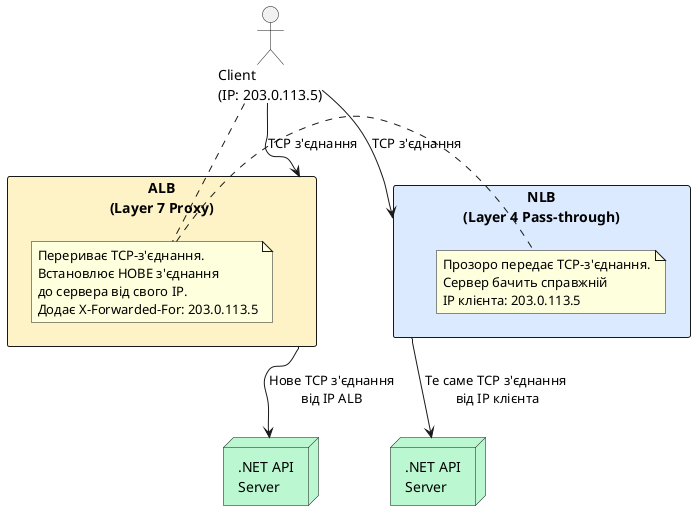

::

**Для більшості .NET Web API — ALB є правильним вибором.** NLB варто розглядати лише при специфічних вимогах до продуктивності або протоколів.

---

## Target Groups та Health Checks

### Алгоритми балансування навантаження

Target Group підтримує три алгоритми розподілу запитів між targets. Вибір алгоритму суттєво впливає на рівномірність навантаження залежно від характеристик вхідного трафіку: однорідності запитів, часу їх обробки та відносної потужності серверів.

#### Weighted Round Robin — зважений циклічний розподіл

**Weighted Round Robin (WRR)** є алгоритмом за замовчуванням для ALB Target Groups. Класичний Round Robin розподіляє запити по черзі між targets у фіксованому циклі, не беручи до уваги жодних метрик поточного стану. Зважений варіант (Weighted) розширює базовий алгоритм: кожному target може бути призначена числова вага, і target з більшою вагою отримує пропорційно більше запитів у межах одного циклу.

**Принцип роботи.** ALB підтримує внутрішній покажчик (pointer), що вказує на наступний target у послідовності. При надходженні кожного нового з'єднання ALB спрямовує його на поточний target і переміщує покажчик на наступний. По досягненні кінця списку покажчик повертається на початок. Цей підхід є детермінованим: за умови стабільного переліку targets порядок розподілу завжди передбачуваний.

**Коли WRR є оптимальним вибором:**

- Всі запити до вашого API приблизно однакові за часом обробки та споживанням ресурсів (наприклад, простий CRUD API)
- Всі targets мають однаковий тип EC2 instance (наприклад, всі `t3.medium`)
- Немає довготривалих з'єднань або стрімінгу

::plant-uml

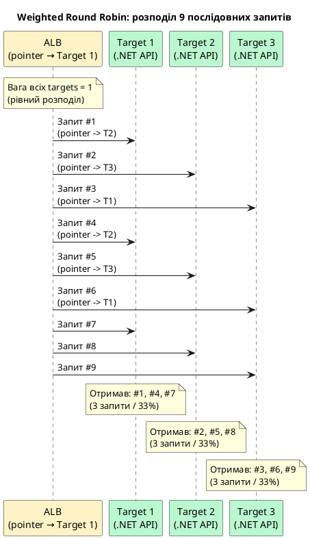

::

**Проблема WRR при неоднорідних запитах.** Уявіть API, де `GET /users` обробляється за 5ms, а `POST /reports/generate` — за 30 секунд. Round Robin розподіляє запити по черзі без урахування їхньої складності:

::plant-uml

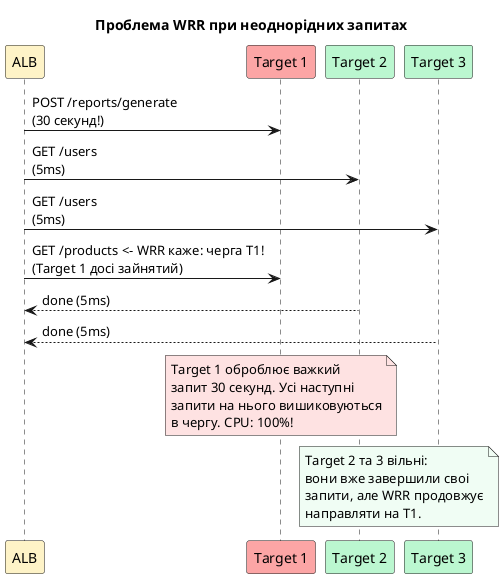

::

**Налаштування ваги у Weighted Round Robin.** За замовчуванням всі targets мають однакову вагу. Вагу можна змінити для нерівномірного розподілу:

```bash
# t3.large має вдвічі більше CPU — встановити вагу 2:1
aws elbv2 register-targets \
    --target-group-arn "$TG_ARN" \
    --targets \
        Id=i-0small123,Weight=1 \
        Id=i-0large456,Weight=2 \
    --region eu-central-1
```

---

#### Least Outstanding Requests — мінімум незавершених з'єднань

**Least Outstanding Requests (LOR)** — алгоритм, що вирішує фундаментальний недолік Round Robin при неоднорідному навантаженні. Замість механічної черги ALB аналізує **поточний стан** кожного target і направляє новий запит туди, де кількість активних (незавершених) з'єднань є найменшою у даний момент.

**Принцип роботи.** ALB підтримує лічильник активних запитів для кожного target. Коли надходить новий запит, ALB перебирає всі healthy targets, знаходить той з мінімальним лічильником і направляє запит туди, одночасно збільшуючи лічильник на 1. Коли target завершує обробку та повертає відповідь — лічильник зменшується на 1.

**Детальний приклад.** Система з трьома targets і змішаним трафіком (швидкі та повільні запити):

::plant-uml

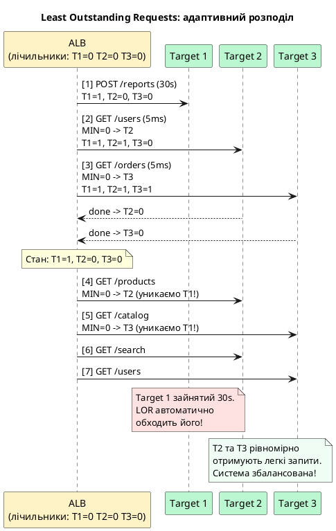

::

**Кількісне порівняння WRR vs LOR** при 100 запитах: 1 важкий (30s) + 99 легких (5ms):

::plant-uml

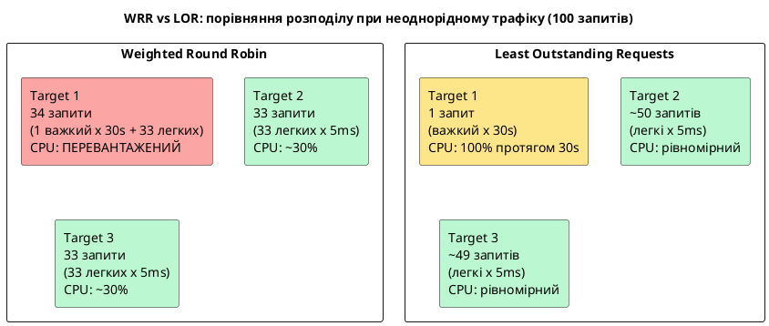

::

**Коли LOR є оптимальним вибором:**

- API з різнорідними ендпоінтами: прості `GET` запити поруч із важкими операціями генерації звітів, обробки файлів або ML-inference
- Наявність стрімінгових з'єднань або WebSocket (одне з'єднання тривалістю хвилини)
- Targets мають різну потужність (різні типи EC2 instances)
- Будь-який сценарій, де час обробки запитів суттєво варіюється

**Налаштування LOR через AWS CLI:**

```bash
# Змінити алгоритм Target Group на Least Outstanding Requests
aws elbv2 modify-target-group-attributes \
    --target-group-arn "$TG_ARN" \
    --attributes \
        Key=load_balancing.algorithm.type,Value=least_outstanding_requests \
    --region eu-central-1
```

::terminal-preview{title="Зміна алгоритму на LOR"}

<div class="line"><span class="opacity-40">$</span> <strong>aws elbv2 modify-target-group-attributes \</strong></div>
<div class="line">    --target-group-arn "$TG_ARN" \</div>
<div class="line">    --attributes Key=load_balancing.algorithm.type,Value=least_outstanding_requests</div>
<div class="line"></div>
<div class="line">{</div>
<div class="line">    <span class="text-blue-400">"Attributes"</span>: [</div>
<div class="line">        {</div>
<div class="line">            <span class="text-blue-400">"Key"</span>: <span class="text-green-400">"load_balancing.algorithm.type"</span>,</div>
<div class="line">            <span class="text-blue-400">"Value"</span>: <span class="text-green-400">"least_outstanding_requests"</span></div>
<div class="line">        }</div>
<div class="line">    ]</div>
<div class="line">}</div>

::

**Перевірка поточного алгоритму Target Group:**

```bash
aws elbv2 describe-target-group-attributes \
    --target-group-arn "$TG_ARN" \
    --region eu-central-1 \
    --query "Attributes[?Key=='load_balancing.algorithm.type']"
```

::terminal-preview{title="Перевірка активного алгоритму"}

<div class="line"><span class="opacity-40">$</span> <strong>aws elbv2 describe-target-group-attributes --target-group-arn "$TG_ARN" ...</strong></div>
<div class="line">[</div>
<div class="line">    {</div>
<div class="line">        <span class="text-blue-400">"Key"</span>: <span class="text-green-400">"load_balancing.algorithm.type"</span>,</div>
<div class="line">        <span class="text-blue-400">"Value"</span>: <span class="text-green-400">"least_outstanding_requests"</span></div>
<div class="line">    }</div>
<div class="line">]</div>

::

---

#### Weighted Random — зважений випадковий розподіл

**Weighted Random** — алгоритм, що поєднує випадковість із можливістю задати пропорції розподілу трафіку між targets. На відміну від Round Robin, послідовність розподілу не є фіксованою: ALB обирає target псевдовипадково, але з урахуванням ваги — target з вищою вагою має пропорційно вищу ймовірність бути обраним.

**Математичний принцип.** Якщо Target 1 має вагу 70, Target 2 — вагу 20, Target 3 — вагу 10, то ймовірність обрання: P(T1) = 70/100 = 70%, P(T2) = 20/100 = 20%, P(T3) = 10/100 = 10%.

**Ключова сфера застосування: Canary Deployment.** Weighted Random є стандартним інструментом для поступового розгортання нових версій застосунку. Замість одночасного переключення всього трафіку на нову версію, частка трафіку збільшується поступово, поки команда спостерігає за метриками помилок та латентністю:

::plant-uml

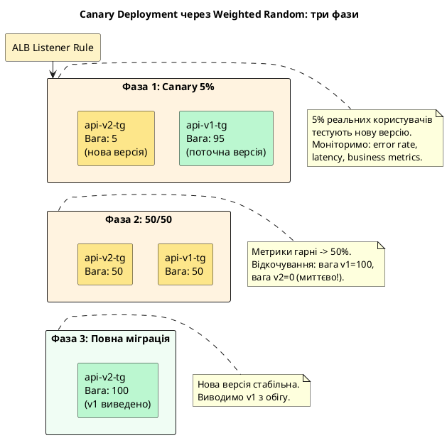

::

**Реалізація Canary Deployment через ALB Weighted Target Groups:**

AWS реалізує Weighted Random через **ваги на рівні Listener Rule** — правило може розподіляти трафік між кількома Target Groups з визначеними пропорціями:

```bash
LISTENER_ARN="arn:aws:elasticloadbalancing:eu-central-1:123456789012:listener/app/..."
TG_V1_ARN="arn:aws:elasticloadbalancing:...:targetgroup/api-v1-tg/..."
TG_V2_ARN="arn:aws:elasticloadbalancing:...:targetgroup/api-v2-tg/..."

# Фаза 1: 5% трафіку на нову версію
aws elbv2 modify-listener \
    --listener-arn "$LISTENER_ARN" \
    --default-actions "[
        {
            \"Type\": \"forward\",
            \"ForwardConfig\": {
                \"TargetGroups\": [
                    {\"TargetGroupArn\": \"$TG_V1_ARN\", \"Weight\": 95},
                    {\"TargetGroupArn\": \"$TG_V2_ARN\", \"Weight\": 5}
                ]
            }
        }
    ]" \
    --region eu-central-1

# Фаза 2: 50/50 (перевіряємо рівну продуктивність)
aws elbv2 modify-listener \
    --listener-arn "$LISTENER_ARN" \
    --default-actions "[
        {
            \"Type\": \"forward\",
            \"ForwardConfig\": {
                \"TargetGroups\": [
                    {\"TargetGroupArn\": \"$TG_V1_ARN\", \"Weight\": 50},
                    {\"TargetGroupArn\": \"$TG_V2_ARN\", \"Weight\": 50}
                ]
            }
        }
    ]" \
    --region eu-central-1

# Фаза 3: повна міграція на v2
aws elbv2 modify-listener \
    --listener-arn "$LISTENER_ARN" \
    --default-actions "Type=forward,TargetGroupArn=$TG_V2_ARN" \
    --region eu-central-1

echo "Migration complete: 100% traffic -> v2"
```

::terminal-preview{title="Canary Deployment: Фаза 1 → 5%"}

<div class="line"><span class="opacity-40">$</span> <strong>aws elbv2 modify-listener --listener-arn "$LISTENER_ARN" --default-actions '[...]'</strong></div>
<div class="line">{</div>
<div class="line">    <span class="text-blue-400">"Listeners"</span>: [{</div>
<div class="line">        <span class="text-blue-400">"DefaultActions"</span>: [{</div>
<div class="line">            <span class="text-blue-400">"Type"</span>: <span class="text-green-400">"forward"</span>,</div>
<div class="line">            <span class="text-blue-400">"ForwardConfig"</span>: {</div>
<div class="line">                <span class="text-blue-400">"TargetGroups"</span>: [</div>
<div class="line">                    { <span class="text-blue-400">"Weight"</span>: <span class="text-yellow-400">95</span>, <span class="text-blue-400">"TargetGroupArn"</span>: <span class="text-green-400">"...api-v1-tg..."</span> },</div>
<div class="line">                    { <span class="text-blue-400">"Weight"</span>: <span class="text-yellow-400">5</span>,  <span class="text-blue-400">"TargetGroupArn"</span>: <span class="text-green-400">"...api-v2-tg..."</span> }</div>
<div class="line">                ]</div>
<div class="line">            }</div>
<div class="line">        }]</div>
<div class="line">    }]</div>
<div class="line">}</div>
<div class="line"><span class="text-green-400 opacity-60">← 5% реального трафіку тепер іде на нову версію</span></div>

::

::tip
**Weighted Random vs Round Robin при рівних вагах.** Якщо всі targets мають однакову вагу, Weighted Random та Round Robin дають ідентичний результат у довгостроковій перспективі. Різниця: Round Robin гарантує **точний** розподіл (`N/3` запитів кожному з трьох targets), тоді як Weighted Random дає **статистично очікуваний** розподіл — рівний у середньому, але з можливими коливаннями в короткій перспективі.
::

---

#### Порівняльна таблиця алгоритмів

| Характеристика                 | Weighted Round Robin | Least Outstanding Requests | Weighted Random  |
| ------------------------------ | -------------------- | -------------------------- | ---------------- |
| **За замовчуванням**           | Так                  | Ні                         | Ні               |
| **Однорідні запити**           | Оптимально           | Добре                      | Добре            |
| **Неоднорідні запити**         | Погано               | Оптимально                 | Задовільно       |
| **WebSocket / streaming**      | Погано               | Оптимально                 | Задовільно       |
| **Canary deployment**          | Не підходить         | Не підходить               | Оптимально       |
| **Різна потужність targets**   | Через ваги           | Автоматично                | Через ваги       |
| **Передбачуваність**           | Детермінована        | Адаптивна                  | Стохастична      |
| **Рекомендовано для .NET API** | Простий CRUD API     | API з важкими операціями   | A/B тест, canary |

**Дерево рішень для вибору алгоритму:**

::plant-uml

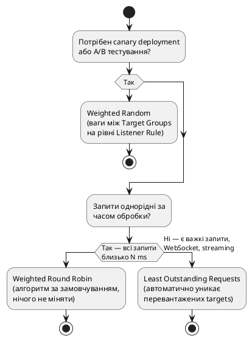

::

### Health Check: механізм виявлення відмов

**Health Check** — це механізм, за допомогою якого ALB постійно моніторить стан кожного target у Target Group. ALB регулярно надсилає тестові HTTP-запити на спеціальний ендпоінт кожного сервера і аналізує відповідь. На основі результатів цих перевірок ALB ухвалює рішення: включати чи виключати target із ротації.

::plant-uml

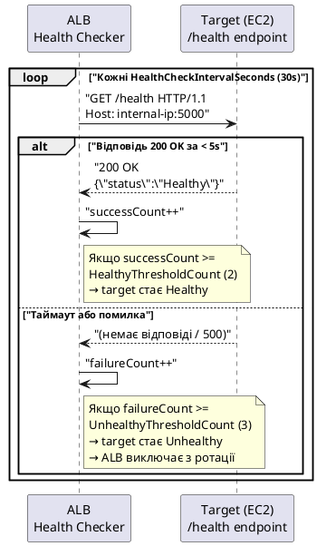

::

**Конфігурація Health Check у консолі AWS або через CLI:**

```json
{
    "Protocol": "HTTP",
    "Path": "/health",
    "Port": "traffic-port",
    "HealthyThresholdCount": 2,
    "UnhealthyThresholdCount": 3,
    "HealthCheckIntervalSeconds": 15,
    "HealthCheckTimeoutSeconds": 5,
    "Matcher": {
        "HttpCode": "200"
    }
}
```

::field-group

::field{name="Protocol" type="string" required="true"}
Протокол для health check запитів. Допустимі значення: `HTTP`, `HTTPS`. Має відповідати протоколу, на якому працює застосунок.
::

::field{name="Path" type="string" required="true"}
URI-шлях, на який ALB надсилає GET-запити. За угодою: `/health`. Цей ендпоінт повинен повертати HTTP 200 лише тоді, коли застосунок та всі його залежності справно функціонують.
::

::field{name="HealthyThresholdCount" type="integer"}
Кількість послідовних успішних перевірок, після яких target переходить зі стану `unhealthy` у стан `healthy`. Значення 2 означає, що після двох поспіль успішних відповідей ALB відновить маршрутизацію трафіку на цей target.
::

::field{name="UnhealthyThresholdCount" type="integer"}
Кількість послідовних невдалих перевірок, після яких target переходить у стан `unhealthy` і виключається з ротації. При значенні 3 та інтервалі 15 секунд — від першої невдалої відповіді до виключення мине 45 секунд.
::

::field{name="HealthCheckIntervalSeconds" type="integer"}
Інтервал між перевірками в секундах. Допустимий діапазон: 5–300 секунд. Менший інтервал забезпечує швидше виявлення відмов, але генерує більше трафіку.
::

::field{name="HealthCheckTimeoutSeconds" type="integer"}
Максимальний час очікування відповіді на health check запит. Якщо відповідь не надійшла протягом цього часу — перевірка вважається невдалою. Має бути меншим за `HealthCheckIntervalSeconds`.
::

::

::caution
**Найпоширеніша помилка:** реалізація `/health` endpoint, що завжди повертає HTTP 200 незалежно від реального стану застосунку. Це призводить до ситуації, коли ALB вважає сервер здоровим, хоча він втратив з'єднання з базою даних або іншими критичними залежностями. ALB продовжує направляти реальний трафік на цей сервер, і користувачі отримують помилки 500.
::

---

## Health Check у .NET — правильна реалізація

ASP.NET Core надає вбудовану систему Health Checks через NuGet пакет `Microsoft.Extensions.Diagnostics.HealthChecks`. Ця система дозволяє декларативно описати перелік перевірок, що мають виконуватись, та агрегувати їхні результати в єдину відповідь.

Правильний підхід полягає у тому, що `/health` endpoint має перевіряти **реальну функціональну готовність** застосунку до обробки запитів — не лише факт того, що процес запущений.

```csharp [Program.cs]
using Microsoft.AspNetCore.Diagnostics.HealthChecks;
using Microsoft.Extensions.Diagnostics.HealthChecks;
using HealthChecks.UI.Client;

var builder = WebApplication.CreateBuilder(args);

// Реєстрація Health Check сервісів
builder.Services.AddHealthChecks()
    // Перевірка підключення до SQL Server
    .AddSqlServer(
        connectionString: builder.Configuration.GetConnectionString("DefaultConnection")!,
        name: "sqlserver",
        failureStatus: HealthStatus.Unhealthy,
        tags: ["db", "sql", "infrastructure"])

    // Перевірка Redis (якщо використовується для кешування або сесій)
    .AddRedis(
        redisConnectionString: builder.Configuration["Redis:ConnectionString"]!,
        name: "redis",
        failureStatus: HealthStatus.Degraded,
        tags: ["cache", "infrastructure"])

    // Кастомна перевірка: чи доступний зовнішній API
    .AddCheck("external-api", async () =>
    {
        // Перевіряємо доступність залежного сервісу
        using var http = new HttpClient();
        try
        {
            var response = await http.GetAsync("https://api.payment-provider.com/ping");
            return response.IsSuccessStatusCode
                ? HealthCheckResult.Healthy("Payment API is reachable")
                : HealthCheckResult.Degraded("Payment API returned non-2xx status");
        }
        catch
        {
            return HealthCheckResult.Unhealthy("Payment API is unreachable");
        }
    }, tags: ["external"])

    // Базова самоперевірка: чи процес взагалі живий
    .AddCheck("self", () => HealthCheckResult.Healthy("Application process is running"));

var app = builder.Build();

// Ендпоінт для ALB Health Check — мінімальна відповідь (200 або 503)
// ALB не потребує деталей, лише HTTP статус код
app.MapHealthChecks("/health", new HealthCheckOptions
{
    // Включити ВСІ перевірки (без фільтрації за тегами)
    Predicate = _ => true,

    // Кастомний writer: повертаємо мінімальний JSON
    ResponseWriter = async (context, report) =>
    {
        context.Response.ContentType = "application/json";
        var result = System.Text.Json.JsonSerializer.Serialize(new
        {
            status = report.Status.ToString(),
            timestamp = DateTime.UtcNow,
            // Короткий перелік перевірок без чутливих деталей
            checks = report.Entries.Select(e => new
            {
                name = e.Key,
                status = e.Value.Status.ToString()
            })
        });
        await context.Response.WriteAsync(result);
    }
});

// Детальний ендпоінт для внутрішнього моніторингу
// НІКОЛИ не відкривайте цей ендпоінт публічно через ALB!
// Додайте окреме правило ALB: /health/detail → Fixed Response 403
app.MapHealthChecks("/health/detail", new HealthCheckOptions
{
    ResponseWriter = UIResponseWriter.WriteHealthCheckUIResponse
}).RequireAuthorization(); // додаткова авторизація

app.Run();
```

::tip
**Розподіл відповідальності між ендпоінтами:** `/health` є спрощеним ендпоінтом виключно для ALB — він має бути максимально швидким та легким. `/health/detail` надає повну діагностичну інформацію для команди DevOps та систем моніторингу (Grafana, Datadog), але має бути захищений авторизацією або доступний лише у внутрішній мережі.
::

---

## Auto Scaling Groups (ASG): концепція та архітектура

**Auto Scaling Group (ASG)** — це сервіс AWS, що управляє lifecycle-ом колекції EC2 instances як єдиного цілого. ASG безперервно порівнює поточний стан кластера instances з бажаним станом і виконує необхідні коригуючі дії: запускає нові instances або завершує існуючі.

### Три фундаментальні параметри ASG

Вся логіка роботи ASG будується навколо трьох числових параметрів, що визначають границі масштабування:

::plant-uml

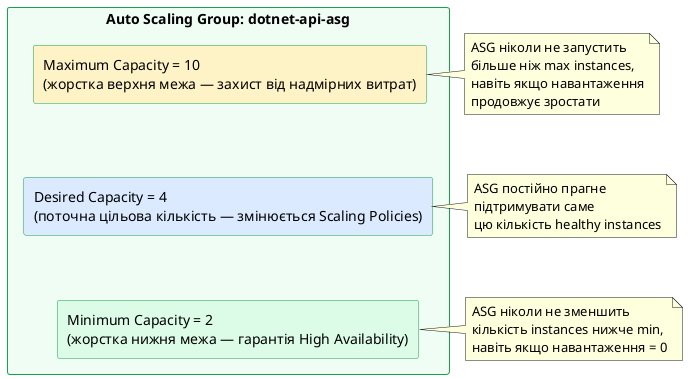

::

::field-group

::field{name="MinSize" type="integer" required="true"}
Мінімальна кількість instances, що завжди залишаються запущеними, незалежно від рівня навантаження. Значення `2` є стандартом для High Availability: якщо один instance відмовить, другий продовжує обробляти запити. Значення `0` допустиме для batch-обробки або розробки, але неприйнятне для production API.
::

::field{name="MaxSize" type="integer" required="true"}
Верхня межа кількості instances. Захищає від неконтрольованого зростання витрат у разі аномальної поведінки (DDoS-атака, нескінченний цикл, помилка в Scaling Policy). Завжди встановлюйте це значення усвідомлено, розуміючи максимально допустимий рахунок AWS.
::

::field{name="DesiredCapacity" type="integer" required="true"}
Поточна цільова кількість instances. ASG безперервно контролює, щоб кількість healthy instances дорівнювала цьому значенню. Scaling Policies змінюють `DesiredCapacity`, а ASG відповідно запускає або завершує instances.
::

::field{name="HealthCheckGracePeriod" type="integer"}
Час у секундах після запуску нового instance, протягом якого ASG ігнорує результати health check. Необхідний для того, щоб .NET застосунок встиг запуститися, підключитися до бази даних та бути готовим до обробки запитів до першої перевірки. Рекомендоване значення: 120–300 секунд.
::

::

### Launch Templates — специфікація нового instance

**Launch Template** — це версіонований документ-специфікація, що точно описує конфігурацію EC2 instance, який ASG створить при горизонтальному масштабуванні. Коли ASG вирішує додати новий instance (Scale Out), він звертається до Launch Template і створює EC2 instance відповідно до зазначених параметрів.

::plant-uml

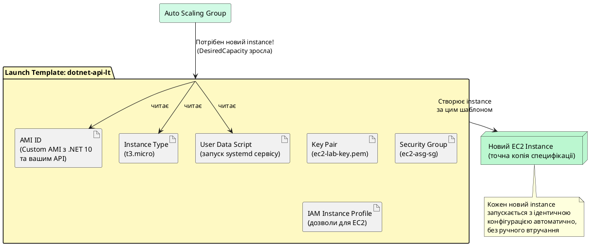

::

::note
**Launch Templates vs Launch Configurations.** До 2017 року для налаштування ASG використовувались Launch Configurations. Вони застаріли (deprecated) і не підтримують ряд сучасних функцій. Launch Templates є їх повноцінною заміною: вони підтримують версіонування (v1, v2, v3), змішані стратегії використання Spot та On-Demand instances в одному ASG, та всі нові можливості EC2. **Завжди використовуйте Launch Templates.**
::

---

## Scaling Policies — стратегії автоматичного масштабування

AWS Auto Scaling підтримує три принципово різні стратегії масштабування, кожна з яких оптимальна для певного класу навантажень.

::plant-uml

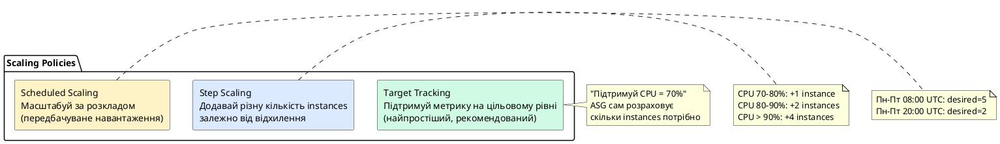

::

### Target Tracking Scaling Policy

Найпростіший та найрекомендованіший підхід. Ви декларуєте одне просте правило: «підтримуй метрику X на рівні Y». ASG автоматично розраховує необхідну кількість instances для досягнення цього показника та додає або видаляє instances відповідно.

::tabs

::tabs-item{label="AWS Console"}

1. EC2 → **Auto Scaling Groups** → оберіть `dotnet-api-asg` → вкладка **Automatic scaling**
2. **Create dynamic scaling policy**
3. **Policy type:** Target tracking scaling
4. **Scaling policy name:** `cpu-target-tracking`
5. **Metric type:** Average CPU utilization
6. **Target value:** `70`
7. **Instance warmup:** `60` seconds
8. _(Необов'язково)_ Розгорніть **Additional settings** → Scale-in cooldown: `300`
9. **Create**

::

::tabs-item{label="AWS CLI"}

```bash
aws autoscaling put-scaling-policy \
    --auto-scaling-group-name dotnet-api-asg \
    --policy-name cpu-target-tracking \
    --policy-type TargetTrackingScaling \
    --target-tracking-configuration '{
        "PredefinedMetricSpecification": {
            "PredefinedMetricType": "ASGAverageCPUUtilization"
        },
        "TargetValue": 70.0,
        "ScaleOutCooldown": 60,
        "ScaleInCooldown": 300,
        "DisableScaleIn": false
    }' \
    --region eu-central-1
```

::

::

::terminal-preview{title="put-scaling-policy → Target Tracking"}

<div class="line"><span class="opacity-40">$</span> <strong>aws autoscaling put-scaling-policy --policy-name cpu-target-tracking ...</strong></div>
<div class="line">{</div>
<div class="line">  <span class="text-blue-400">"PolicyARN"</span>: <span class="text-green-400">"arn:aws:autoscaling:eu-central-1:123456789012:scalingPolicy:..."</span>,</div>
<div class="line">  <span class="text-blue-400">"Alarms"</span>: [</div>
<div class="line">    { <span class="text-blue-400">"AlarmName"</span>: <span class="text-green-400">"TargetTracking-dotnet-api-asg-AlarmHigh-..."</span> },</div>
<div class="line">    { <span class="text-blue-400">"AlarmName"</span>: <span class="text-green-400">"TargetTracking-dotnet-api-asg-AlarmLow-..."</span> }</div>
<div class="line">  ]</div>
<div class="line">}</div>
<div class="line"><span class="text-yellow-400 opacity-60">← ASG автоматично створив два CloudWatch Alarms: для Scale Out та Scale In</span></div>

::

**Конфігурація параметрів:**

```json [Повна конфігурація Target Tracking Policy]
{
    "PolicyName": "cpu-target-tracking",
    "PolicyType": "TargetTrackingScaling",
    "TargetTrackingConfiguration": {
        "PredefinedMetricSpecification": {
            "PredefinedMetricType": "ASGAverageCPUUtilization"
        },
        "TargetValue": 70.0,
        "ScaleOutCooldown": 60,
        "ScaleInCooldown": 300,
        "DisableScaleIn": false
    }
}
```

::field-group

::field{name="PredefinedMetricType" type="enum" required="true"}
Метрика, яку ASG буде підтримувати на цільовому рівні. Доступні значення:

- `ASGAverageCPUUtilization` — середнє завантаження CPU по всіх instances ASG
- `ASGAverageNetworkIn` / `ASGAverageNetworkOut` — середній мережевий трафік (байт/сек)
- `ALBRequestCountPerTarget` — середня кількість запитів ALB на один instance
  ::

::field{name="TargetValue" type="number" required="true"}
Цільове значення метрики. ASG прагне підтримувати метрику саме на цьому рівні. Значення 70.0 для CPU означає: «тримай середнє CPU по ASG на рівні 70%». Рекомендований діапазон для CPU: 60–75%.
::

::field{name="ScaleOutCooldown" type="integer"}
Час очікування (секунди) між додаванням instances. Під час cooldown ASG не запускатиме нові instances навіть якщо метрика перевищує ціль. Мале значення (60с) дозволяє швидко реагувати на зростання навантаження.
::

::field{name="ScaleInCooldown" type="integer"}
Час очікування (секунди) між видаленням instances. Рекомендується встановлювати значно більшим за ScaleOutCooldown (300–600с), щоб уникнути передчасного видалення instances під час тимчасового спаду навантаження між піками.
::

::

### Step Scaling Policy

Step Scaling дозволяє визначити **нелінійну** залежність між відхиленням метрики від порогу та кількістю instances, що додаються або видаляються. Це корисно, коли потрібна більш агресивна реакція при екстремальних відхиленнях.

::tabs

::tabs-item{label="AWS Console"}

**Крок 1: Спочатку створіть CloudWatch Alarm для CPU:**

1. CloudWatch → **Alarms** → **Create alarm** → **Select metric**
2. EC2 → By Auto Scaling Group → `dotnet-api-asg` → `CPUUtilization` → **Select metric**
3. **Conditions:** Threshold type: Static → Greater than: `70` → **Next**
4. **Actions:** Remove default action → **Next** → Name: `cpu-above-70` → **Create alarm**

**Крок 2: Додайте Step Scaling Policy до ASG:**

1. EC2 → **Auto Scaling Groups** → `dotnet-api-asg` → вкладка **Automatic scaling**
2. **Create dynamic scaling policy**
3. **Policy type:** Step scaling
4. **Scaling policy name:** `cpu-step-scaling`
5. **CloudWatch alarm:** оберіть `cpu-above-70`
6. **Take the action:**
    - Add 1 capacity unit when `0` ≤ alarm value < `10`
    - Add 2 capacity units when `10` ≤ alarm value < `20`
    - Add 4 capacity units when `20` ≤ alarm value
7. **Instance warmup:** `60` seconds → **Create**

::

::tabs-item{label="AWS CLI"}

```bash
# Крок 1: Створити CloudWatch Alarm для CPU > 70%
aws cloudwatch put-metric-alarm \
    --alarm-name "cpu-above-70" \
    --alarm-description "CPU above 70% — trigger Step Scaling" \
    --metric-name CPUUtilization \
    --namespace AWS/EC2 \
    --statistic Average \
    --period 60 \
    --threshold 70 \
    --comparison-operator GreaterThanThreshold \
    --dimensions Name=AutoScalingGroupName,Value=dotnet-api-asg \
    --evaluation-periods 2 \
    --region eu-central-1

# Крок 2: Створити Step Scaling Policy
STEP_POLICY_ARN=$(aws autoscaling put-scaling-policy \
    --auto-scaling-group-name dotnet-api-asg \
    --policy-name cpu-step-scaling \
    --policy-type StepScaling \
    --adjustment-type ChangeInCapacity \
    --step-adjustments \
        "MetricIntervalLowerBound=0,MetricIntervalUpperBound=10,ScalingAdjustment=1" \
        "MetricIntervalLowerBound=10,MetricIntervalUpperBound=20,ScalingAdjustment=2" \
        "MetricIntervalLowerBound=20,ScalingAdjustment=4" \
    --estimated-instance-warmup 60 \
    --region eu-central-1 \
    --query PolicyARN --output text)

echo "Step Scaling Policy ARN: $STEP_POLICY_ARN"

# Крок 3: Прив'язати Alarm до Policy
aws cloudwatch put-metric-alarm \
    --alarm-name "cpu-above-70" \
    --alarm-actions "$STEP_POLICY_ARN" \
    --region eu-central-1
```

::

::

::terminal-preview{title="Step Scaling Policy → створення"}

<div class="line"><span class="opacity-40">$</span> <strong>aws autoscaling put-scaling-policy --policy-name cpu-step-scaling ...</strong></div>
<div class="line">Step Scaling Policy ARN:</div>
<div class="line"><span class="text-green-400">arn:aws:autoscaling:eu-central-1:123456789012:scalingPolicy:abc123:autoScalingGroupName/dotnet-api-asg:policyName/cpu-step-scaling</span></div>
<div class="line"></div>
<div class="line"><span class="opacity-40">$</span> <strong>aws cloudwatch put-metric-alarm --alarm-name cpu-above-70 --alarm-actions ...</strong></div>
<div class="line"><span class="text-green-400">(no output = success — Alarm прив'язаний до Policy)</span></div>

::

**Конфігурація кроків масштабування:**

```json [Конфігурація Step Scaling Policy]
{
    "PolicyName": "cpu-step-scaling",
    "PolicyType": "StepScaling",
    "AdjustmentType": "ChangeInCapacity",
    "StepAdjustments": [
        {
            "MetricIntervalLowerBound": 0,
            "MetricIntervalUpperBound": 10,
            "ScalingAdjustment": 1
        },
        {
            "MetricIntervalLowerBound": 10,
            "MetricIntervalUpperBound": 20,
            "ScalingAdjustment": 2
        },
        {
            "MetricIntervalLowerBound": 20,
            "ScalingAdjustment": 4
        }
    ]
}
```

::field-group

::field{name="AdjustmentType" type="enum" required="true"}
Спосіб інтерпретації значення `ScalingAdjustment`:

- `ChangeInCapacity` — змінити DesiredCapacity на вказане число (додати або видалити N instances)
- `ExactCapacity` — встановити DesiredCapacity рівно до вказаного числа
- `PercentChangeInCapacity` — змінити DesiredCapacity на вказаний відсоток від поточного значення
  ::

::field{name="MetricIntervalLowerBound / UpperBound" type="number"}
Визначають діапазон відхилення метрики від порогового значення (threshold). Наприклад, якщо threshold = 70% CPU, то `LowerBound: 0, UpperBound: 10` означає діапазон 70–80% CPU.
::

::field{name="ScalingAdjustment" type="integer" required="true"}
Кількість instances для додавання (позитивне значення) або видалення (від'ємне значення) при спрацюванні цього кроку.
::

::

::plant-uml

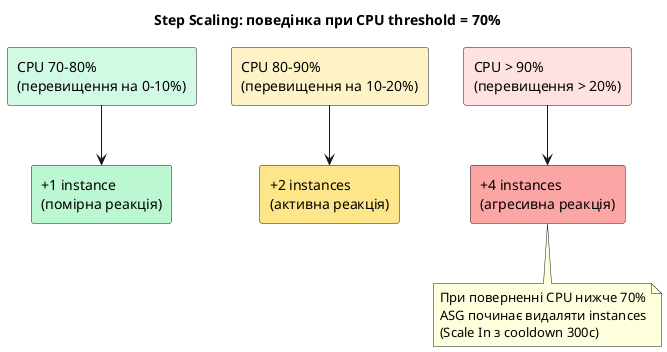

::

### Scheduled Scaling

Масштабування за розкладом підходить для систем з передбачуваними та циклічними піками навантаження: робочі дні vs вихідні, ранок vs ніч, початок місяця vs середина місяця.

::tabs

::tabs-item{label="AWS Console"}

1. EC2 → **Auto Scaling Groups** → `dotnet-api-asg` → вкладка **Automatic scaling**
2. Розгорніть **Scheduled actions** → **Create scheduled action**
3. **Name:** `scale-up-morning`
4. **Desired capacity:** `5`, **Min:** `5`, **Max:** _(залишити порожнім)_
5. **Recurrence:** Cron: `0 8 * * MON-FRI` _(UTC)_
6. **Create** → повторіть для `scale-down-evening` з `desired=2`, `min=2`, cron `0 20 * * MON-FRI`

::tip
Всі часи в Scheduled Scaling задаються у **UTC**. Для України (UTC+2/UTC+3) враховуйте різницю: 08:00 UTC = 10:00/11:00 за київським часом.
::

::

::tabs-item{label="AWS CLI"}

```bash
# Кожен робочий день о 08:00 UTC — збільшити до 5 instances
aws autoscaling put-scheduled-update-group-action \
    --auto-scaling-group-name dotnet-api-asg \
    --scheduled-action-name "scale-up-morning" \
    --recurrence "0 8 * * MON-FRI" \
    --min-size 5 \
    --desired-capacity 5 \
    --region eu-central-1

# О 20:00 UTC — повернутись до мінімуму
aws autoscaling put-scheduled-update-group-action \
    --auto-scaling-group-name dotnet-api-asg \
    --scheduled-action-name "scale-down-evening" \
    --recurrence "0 20 * * MON-FRI" \
    --min-size 2 \
    --desired-capacity 2 \
    --region eu-central-1

# Перевірити створені scheduled actions
aws autoscaling describe-scheduled-actions \
    --auto-scaling-group-name dotnet-api-asg \
    --region eu-central-1 \
    --query "ScheduledUpdateGroupActions[*].{Name:ScheduledActionName,Recurrence:Recurrence,Desired:DesiredCapacity}" \
    --output table
```

::

::

::terminal-preview{title="Scheduled Scaling → перевірка"}

<div class="line"><span class="opacity-40">$</span> <strong>aws autoscaling describe-scheduled-actions --auto-scaling-group-name dotnet-api-asg ...</strong></div>
<div class="line">-----------------------------------------------------</div>
<div class="line">|         DescribeScheduledActions                  |</div>
<div class="line">+--------------------+----------------+-----------+</div>
<div class="line">| Name               | Recurrence     | Desired   |</div>
<div class="line">+--------------------+----------------+-----------+</div>
<div class="line">| scale-up-morning   | <span class="text-green-400">0 8 * * MON-FRI</span> | <span class="text-yellow-400">5</span>         |</div>
<div class="line">| scale-down-evening | <span class="text-blue-400">0 20 * * MON-FRI</span>| <span class="text-yellow-400">2</span>         |</div>
<div class="line">+--------------------+----------------+-----------+</div>

::

---

## ALB Listener Rules: маршрутизація запитів

### Path-based Routing

**Path-based routing** дозволяє направляти запити на різні Target Groups залежно від URI-шляху. Це фундаментальна можливість для реалізації мікросервісної архітектури за єдиним ALB.

::plant-uml

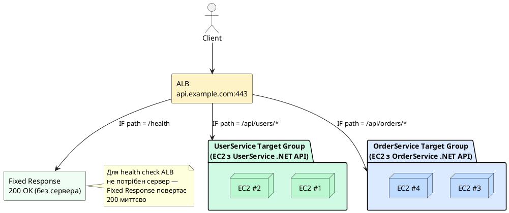

::

**Налаштування Path-based routing:**

::tabs

::tabs-item{label="AWS Console"}

1. EC2 → **Load Balancers** → `dotnet-api-alb` → вкладка **Listeners**
2. Оберіть **HTTPS:443** → **Manage rules** → **Add rule**
3. **Name:** `users-service-rule`
4. **Add condition** → **Path** → `/api/users/*` → **Confirm**
5. **Add action** → **Forward to target groups** → оберіть `user-service-tg` → **Confirm**
6. **Priority:** `10` → **Create**
7. Повторіть для OrderService: path `/api/orders/*`, priority `20`
8. Переконайтесь, що `default rule` (пріоритет найнижчий) залишається як fallback

::

::tabs-item{label="AWS CLI"}

```bash
# ARN HTTPS Listener
HTTPS_LISTENER_ARN=$(aws elbv2 describe-listeners \
    --load-balancer-arn "$ALB_ARN" \
    --query "Listeners[?Port==\`443\`].ListenerArn" \
    --output text --region "$REGION")

# Правило: /api/users/* → user-service-tg
aws elbv2 create-rule \
    --listener-arn "$HTTPS_LISTENER_ARN" \
    --priority 10 \
    --conditions '[{"Field":"path-pattern","Values":["/api/users/*"]}]' \
    --actions '[{"Type":"forward","TargetGroupArn":"'"$USER_TG_ARN"'"}]' \
    --region "$REGION"

# Правило: /api/orders/* → order-service-tg
aws elbv2 create-rule \
    --listener-arn "$HTTPS_LISTENER_ARN" \
    --priority 20 \
    --conditions '[{"Field":"path-pattern","Values":["/api/orders/*"]}]' \
    --actions '[{"Type":"forward","TargetGroupArn":"'"$ORDER_TG_ARN"'"}]' \
    --region "$REGION"

# Правило: /health → Fixed Response 200
aws elbv2 create-rule \
    --listener-arn "$HTTPS_LISTENER_ARN" \
    --priority 5 \
    --conditions '[{"Field":"path-pattern","Values":["/health"]}]' \
    --actions '[{"Type":"fixed-response","FixedResponseConfig":{"StatusCode":"200","ContentType":"text/plain","MessageBody":"OK"}}]' \
    --region "$REGION"
```

::

::

::terminal-preview{title="create-rule → Path-based routing"}

<div class="line"><span class="opacity-40">$</span> <strong>aws elbv2 create-rule --priority 10 --conditions '[{"Field":"path-pattern"...}]' ...</strong></div>
<div class="line">{</div>
<div class="line">  <span class="text-blue-400">"Rules"</span>: [{</div>
<div class="line">    <span class="text-blue-400">"RuleArn"</span>: <span class="text-green-400">"arn:aws:elasticloadbalancing:eu-central-1:...:rule/app/..."</span>,</div>
<div class="line">    <span class="text-blue-400">"Priority"</span>: <span class="text-yellow-400">"10"</span>,</div>
<div class="line">    <span class="text-blue-400">"Conditions"</span>: [{<span class="text-blue-400">"Field"</span>: <span class="text-green-400">"path-pattern"</span>, <span class="text-blue-400">"Values"</span>: [<span class="text-green-400">"/api/users/*"</span>]}],</div>
<div class="line">    <span class="text-blue-400">"IsDefault"</span>: <span class="text-red-400">false</span></div>
<div class="line">  }]</div>
<div class="line">}</div>

::

### Host-based Routing

**Host-based routing** маршрутизує запити на основі значення HTTP-заголовка `Host`, що дозволяє обслуговувати кілька доменних імен за єдиним ALB:

```
ALB (один балансувальник, одна IP-адреса)
├── api.example.com    → API Target Group      (EC2 з .NET Web API)
├── admin.example.com  → Admin Target Group    (EC2 з Admin Dashboard)
└── static.example.com → Fixed Response 301   → redirect to CloudFront
```

Це суттєво знижує витрати: замість окремого ALB для кожного сервісу — один ALB для всіх.

**Налаштування Host-based routing:**

::tabs

::tabs-item{label="AWS Console"}

1. EC2 → **Load Balancers** → `dotnet-api-alb` → вкладка **Listeners** → **HTTPS:443** → **Manage rules**
2. **Add rule** → Name: `api-host-rule`
3. **Add condition** → **Host header** → `api.example.com` → **Confirm**
4. **Add action** → **Forward** → `api-tg` → **Confirm** → Priority: `10` → **Create**
5. Повторіть для `admin.example.com` → `admin-tg`, priority `20`

::

::tabs-item{label="AWS CLI"}

```bash
# Маршрутизація за host-header: api.example.com → api-tg
aws elbv2 create-rule \
    --listener-arn "$HTTPS_LISTENER_ARN" \
    --priority 10 \
    --conditions '[{"Field":"host-header","Values":["api.example.com"]}]' \
    --actions '[{"Type":"forward","TargetGroupArn":"'"$API_TG_ARN"'"}]' \
    --region "$REGION"

# admin.example.com → admin-tg
aws elbv2 create-rule \
    --listener-arn "$HTTPS_LISTENER_ARN" \
    --priority 20 \
    --conditions '[{"Field":"host-header","Values":["admin.example.com"]}]' \
    --actions '[{"Type":"forward","TargetGroupArn":"'"$ADMIN_TG_ARN"'"}]' \
    --region "$REGION"

# static.example.com → redirect to CloudFront
aws elbv2 create-rule \
    --listener-arn "$HTTPS_LISTENER_ARN" \
    --priority 30 \
    --conditions '[{"Field":"host-header","Values":["static.example.com"]}]' \
    --actions '[{"Type":"redirect","RedirectConfig":{"Host":"d1234abcd.cloudfront.net","Protocol":"HTTPS","StatusCode":"HTTP_301"}}]' \
    --region "$REGION"
```

::

::

---

## Sticky Sessions для ASP.NET сесій

### Проблема стану у розподіленій системі

При використанні ASP.NET Core з `AddSession()` без розподіленого сховища (у конфігурації за замовчуванням), дані сесії зберігаються **в оперативній пам'яті конкретного EC2 instance**. При балансуванні навантаження між кількома instances виникає критична проблема: якщо користувач після авторизації потрапляє на Instance 1, де зберігається його сесія, а наступний запит ALB направляє на Instance 2 — Instance 2 не знає про існування цієї сесії, і користувач виглядає як неавторизований.

::plant-uml

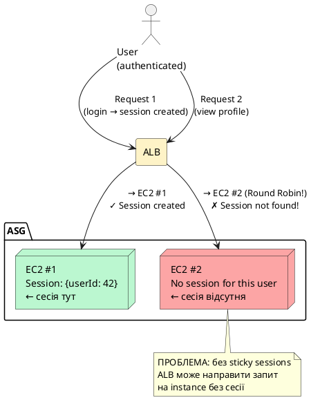

::

::plant-uml

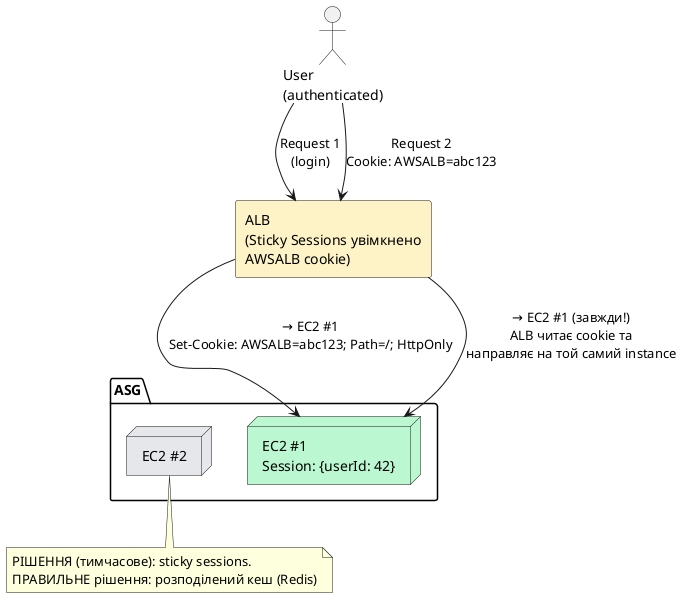

::

### Sticky Sessions через ALB Cookie

**Sticky Sessions (Session Affinity)** — механізм, за якого ALB встановлює спеціальний cookie (`AWSALB`) при першому запиті користувача та у всіх наступних запитах направляє його до того самого instance, що обробляв перший запит.

::tabs

::tabs-item{label="AWS Console"}

Target Groups → оберіть TG → вкладка **Attributes** → **Edit** → **Stickiness** → Enable → Type: Load balancer generated cookie → Duration: 1 day → **Save changes**

::

::tabs-item{label="AWS CLI"}

```bash
aws elbv2 modify-target-group-attributes \
    --target-group-arn arn:aws:elasticloadbalancing:eu-central-1:123456789012:targetgroup/my-api-tg/xxx \
    --attributes \
        Key=stickiness.enabled,Value=true \
        Key=stickiness.type,Value=lb_cookie \
        Key=stickiness.lb_cookie.duration_seconds,Value=86400 \
    --region eu-central-1
```

::

::

::warning
**Sticky sessions — це технічний борг, а не вирішення проблеми.** Sticky sessions знижують ефективність балансування: якщо один instance обслуговує «важких» користувачів з довгими сесіями, він стає перевантаженим, тоді як інші instances простоюють. Єдине правильне рішення — перейти на **розподілений кеш** для зберігання стану сесії.
::

### Правильна реалізація: розподілені сесії через Redis

```csharp [Program.cs]
// Правильний підхід для production: сесії у Redis
// Будь-який instance може обробити запит будь-якого користувача
builder.Services.AddStackExchangeRedisCache(options =>
{
    options.Configuration = builder.Configuration["Redis:ConnectionString"];
    options.InstanceName = "MyApp:Sessions:";
});

builder.Services.AddSession(options =>
{
    options.IdleTimeout = TimeSpan.FromMinutes(30);
    options.Cookie.HttpOnly = true;
    options.Cookie.IsEssential = true;
    options.Cookie.SameSite = SameSiteMode.Strict;
});

// Middleware
app.UseSession();
```

---

## Практичний приклад: ALB + ASG + HTTPS від А до Я

У цьому розділі ми побудуємо повноцінну production-готову інфраструктуру покроково: Custom AMI з .NET API → SSL-сертифікат → Security Groups → Target Group → ALB → Launch Template → Auto Scaling Group.

### Крок 1: Підготовка Custom AMI з .NET 10

Перед початком нам потрібен Custom AMI — образ EC2 instance з вже встановленим .NET 10 та розгорнутим застосунком. ASG буде створювати нові instances саме з цього AMI.

::tabs

::tabs-item{label="AWS Console"}

1. EC2 → **Instances** → оберіть ваш налаштований instance
2. **Actions** → **Image and templates** → **Create image**
3. Image name: `dotnet-api-ready-v1`
4. **Create image** → зачекайте 5–10 хвилин поки AMI стане `available`
5. Запишіть AMI ID: EC2 → **AMIs** → скопіюйте ID (формат: `ami-0a1b2c3d4e5f67890`)

::

::tabs-item{label="AWS CLI"}

```bash
# ЗАМІНІТЬ на ваш Instance ID
INSTANCE_ID="i-1234567890abcdef0"
REGION="eu-central-1"

# Створення AMI з запущеного instance
CUSTOM_AMI=$(aws ec2 create-image \
    --instance-id "$INSTANCE_ID" \
    --name "dotnet-api-ready-v1" \
    --description ".NET 10 API — ready for ASG deployment" \
    --no-reboot \
    --region "$REGION" \
    --query ImageId --output text)

echo "Custom AMI ID: $CUSTOM_AMI"

# Очікуємо завершення створення AMI
aws ec2 wait image-available \
    --image-ids "$CUSTOM_AMI" \
    --region "$REGION"

echo "AMI is ready: $CUSTOM_AMI"
```

::

::

::terminal-preview{title="aws ec2 create-image"}

<div class="line"><span class="opacity-40">$</span> <strong>CUSTOM_AMI=$(aws ec2 create-image ...)</strong></div>
<div class="line"><span class="text-green-400">Custom AMI ID: ami-0a1b2c3d4e5f67890</span></div>
<div class="line"></div>
<div class="line"><span class="opacity-40">$</span> <strong>aws ec2 wait image-available --image-ids $CUSTOM_AMI ...</strong></div>
<div class="line"><span class="text-blue-400">(waiting ~5-10 minutes...)</span></div>
<div class="line"><span class="text-green-400">AMI is ready: ami-0a1b2c3d4e5f67890</span></div>

::

---

### Крок 2: SSL/TLS сертифікат через AWS Certificate Manager (ACM)

## AWS Certificate Manager (ACM) — повний огляд

**AWS Certificate Manager (ACM)** — це повністю керований сервіс AWS, що забезпечує весь lifecycle SSL/TLS сертифікатів: запит, валідацію права власності на домен, зберігання, прив'язку до AWS-сервісів та автоматичне поновлення до закінчення терміну дії. Ключова перевага ACM перед традиційними центрами сертифікації (Let's Encrypt, Comodo, DigiCert) — **повна автоматизація** та **безкоштовність** для сертифікатів, що використовуються з AWS-сервісами.

**Принцип роботи ACM.** Традиційний підхід до SSL-сертифікатів вимагає: генерації приватного ключа, створення CSR (Certificate Signing Request), верифікації у центрі сертифікації, встановлення сертифіката на сервер, моніторингу дати закінчення та ручного поновлення. ACM автоматизує **всі** ці кроки: AWS генерує та зберігає приватний ключ у захищеному апаратному модулі (HSM), проводить валідацію, встановлює сертифікат у ALB/CloudFront та поновлює його автоматично за 60 днів до закінчення.

::plant-uml

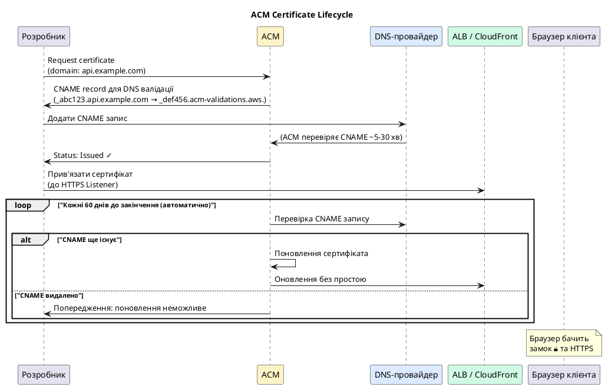

::

### Типи валідації домену

ACM підтримує два методи валідації права власності на домен:

::card-group

::card{title="DNS Validation (рекомендований)" icon="i-heroicons-globe-alt"}

**Принцип:** ACM надає CNAME-запис, який необхідно додати до DNS зони домену. ACM перевіряє наявність цього запису.

**Переваги:**

- Автоматичне поновлення (CNAME залишається назавжди)
- Не потребує доступу до електронної пошти
- Підходить для wildcard сертифікатів
- Один CNAME-запис для всіх сертифікатів одного домену

**Недоліки:** Потребує доступу до DNS панелі

::

::card{title="Email Validation" icon="i-heroicons-envelope"}

**Принцип:** ACM надсилає листа на стандартні адміністративні адреси: `admin@`, `webmaster@`, `hostmaster@`, `administrator@`, `postmaster@` вашого домену.

**Переваги:** Швидко, не потребує DNS доступу

**Недоліки:**

- Поновлення не є повністю автоматичним
- Потребує активних поштових скриньок
- Не підходить для wildcard

::

::

### Типи сертифікатів

**Single-domain сертифікат** покриває лише один конкретний домен: `api.example.com`. Запит на `www.example.com` або `admin.example.com` не буде захищений цим сертифікатом.

**Wildcard сертифікат** (`*.example.com`) покриває всі субдомени першого рівня: `api.example.com`, `admin.example.com`, `static.example.com`. Важливо: wildcard не покриває кореневий домен `example.com` та вкладені субдомени `api.v2.example.com`. Для повного покриття необхідно запросити обидва: `example.com` та `*.example.com` в одному сертифікаті (Subject Alternative Names).

**Multi-domain сертифікат (SAN)** — один сертифікат покриває до 10 різних доменів: `example.com`, `api.example.com`, `anothersite.com`. Корисний при консолідації кількох доменів.

::plant-uml

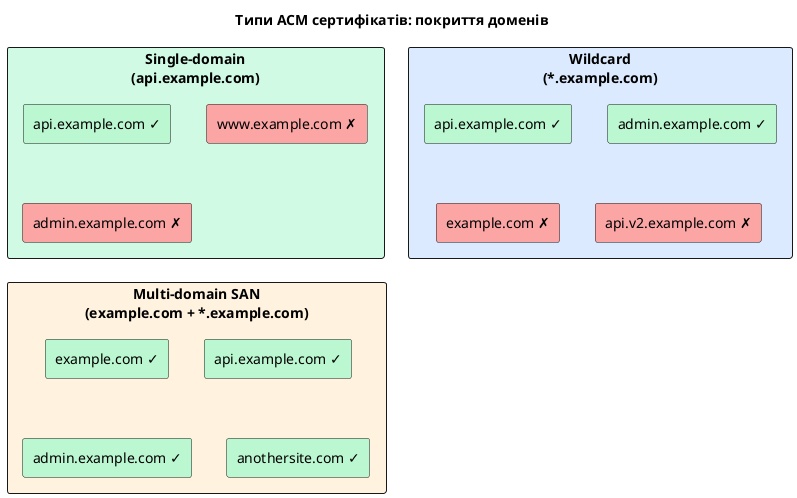

::

### Обмеження ACM: безкоштовність та .pp.ua домени

**ACM сертифікати безкоштовні лише при використанні з AWS-сервісами.** Конкретно: ALB, CloudFront, API Gateway, Elastic Beanstalk, App Runner. Ви **не можете** завантажити приватний ключ ACM-сертифіката та встановити його на власний сервер поза AWS — це архітектурне обмеження безпеки: приватний ключ ніколи не покидає HSM AWS.

::caution
**ACM не є заміною Let's Encrypt для зовнішніх серверів.** Якщо ваш застосунок розміщений на власному VPS або хостингу поза AWS — ACM вам не допоможе. Використовуйте Let's Encrypt (Certbot) або платні сертифікати від Comodo/DigiCert.
::

#### Чи буде .pp.ua домен безкоштовним з ACM?

**Коротка відповідь: ACM-сертифікат для домену `.pp.ua` буде безкоштовним.** Сам сертифікат ACM завжди безкоштовний незалежно від доменного розширення — `.com`, `.ua`, `.pp.ua`, `.io` тощо. Однак повна відповідь складніша:

::plant-uml

```plantuml
@startuml
skinparam style plain
skinparam backgroundColor #ffffff

title ".pp.ua домен + ACM: аналіз витрат"

rectangle "Реєстрація домену .pp.ua" as REG #fef3c7 {
    note right
        myapp.pp.ua
        Вартість реєстрації:
        БЕЗКОШТОВНО (безстроково)
        від Hosting Ukraine та
        деяких інших реєстраторів
    end note
}

rectangle "ACM сертифікат" as ACM #d1fae5 {
    note right
        SSL/TLS для myapp.pp.ua
        Вартість: БЕЗКОШТОВНО
        (при використанні з ALB)
        Автоматичне поновлення: ТАК
    end note
}

rectangle "ALB (Application Load Balancer)" as ALB #fef3c7 {
    note right
        ПЛАТНИЙ ресурс:
        ~$16-22/місяць
        (+ $0.008 за LCU-hour)
    end note
}

REG -down-> ACM : DNS validation CNAME
ACM -down-> ALB : Прив'язка до HTTPS Listener

note bottom
    Загальна вартість для .pp.ua:
    Домен: $0 (безкоштовно)
    ACM: $0 (безкоштовно)
    ALB: ~$16-22/місяць ← основна витрата
end note

@enduml
```

::

**Деталі щодо .pp.ua:**

**1. Реєстрація домену .pp.ua.** Домени у зоні `.pp.ua` є безкоштовними для фізичних осіб в Україні — їх надає HOSTMASTER (адміністратор .ua) безкоштовно через уповноважених реєстраторів (наприклад, nic.ua). Це означає, що на відміну від `.com` (~$12-15/рік) або `.ua` (~$10-20/рік) — `.pp.ua` домен не потребує щорічних платежів за реєстрацію.

**2. ACM сертифікат для .pp.ua.** ACM підтримує будь-який домен, включаючи `.pp.ua`. Обмежень за TLD не існує. Єдина умова — ви повинні мати можливість додати CNAME-запис до DNS зони цього домену для підтвердження (DNS validation). Більшість DNS-панелей для .pp.ua підтримують CNAME-записи, тому проблем не виникне.

**3. Підводні камені .pp.ua для production.** Хоча технічно все працює, для production-середовища слід врахувати:

- `.pp.ua` домени сприймаються як «персональні» та можуть знижувати довіру корпоративних користувачів
- Деякі корпоративні фаєрволи можуть блокувати нестандартні TLD
- Для академічних та навчальних проектів `.pp.ua` — цілком прийнятний вибір

::tip
**Рекомендація для студентів:** Домен `.pp.ua` є ідеальним вибором для навчальних проектів та лабораторних робіт — безкоштовна реєстрація + безкоштовний ACM сертифікат. Єдина реальна витрата — ALB (~$16-22/місяць) або EC2 instances. Після завершення лабораторної роботи — видаліть ALB, і витрат не буде.
::

### Регіональні обмеження ACM

**Критично важлива деталь:** ACM сертифікат дійсний лише в тому регіоні AWS, де він був виданий, — **за одним виключенням**.

- **ALB, ASG, API Gateway:** сертифікат ACM має бути виданий у **тому самому регіоні**, що і ресурс. Для ALB у `eu-central-1` — сертифікат потрібен у `eu-central-1`.
- **CloudFront:** є глобальним сервісом і **вимагає сертифікат виключно у регіоні `us-east-1`** (N. Virginia), незалежно від того, де розгорнуто ваш застосунок.

::warning
Якщо ви плануєте використовувати CloudFront — запросіть **два** сертифікати ACM: один у `eu-central-1` (для ALB), інший у `us-east-1` (для CloudFront).
::

### Отримання ACM сертифіката: покрокова інструкція

::tabs

::tabs-item{label="AWS Console"}

**Крок 1: Відкрити ACM у потрібному регіоні**

1. AWS Console → пошук **Certificate Manager** → переконайтесь, що в правому верхньому куті обрано **EU (Frankfurt) eu-central-1**
2. **Request a certificate** → **Request a public certificate** → **Next**

**Крок 2: Вказати домен(и)** 3. **Fully qualified domain name:** `api.yoursite.com` 4. **Add another name to this certificate** → `*.yoursite.com` _(wildcard — покриє всі субдомени)_ 5. Якщо хочете покрити й кореневий домен — додайте `yoursite.com` окремим рядком

**Крок 3: Вибрати метод валідації** 6. **Validation method:** ✅ **DNS validation** _(рекомендовано — підтримує автопоновлення)_ 7. **Key algorithm:** RSA 2048 _(стандарт; ECDSA P-256 — швидший, але менша сумісність зі старими клієнтами)_ 8. **Request** → натисніть **View certificate**

**Крок 4: Додати CNAME до DNS** 9. Сторінка сертифіката покаже статус `Pending validation` та секцію **Domains** з CNAME-записом:

- Name: `_abc123def456.api.yoursite.com`
- Value: `_xyz789.acm-validations.aws.`

10. Додайте цей CNAME у вашому DNS-провайдері (Route 53, Cloudflare, NIC.UA тощо)
11. _(Якщо використовуєте Route 53)_ Натисніть **Create records in Route 53** — ACM автоматично додасть CNAME
12. Статус зміниться на **Issued** протягом 5–30 хвилин

::

::tabs-item{label="AWS CLI"}

```bash
REGION="eu-central-1"
# ЗАМІНІТЬ yoursite.com на ваш реальний домен
DOMAIN="yoursite.com"

# Запит сертифіката з wildcard та кореневим доменом
CERT_ARN=$(aws acm request-certificate \
    --domain-name "${DOMAIN}" \
    --subject-alternative-names "*.${DOMAIN}" "api.${DOMAIN}" \
    --validation-method DNS \
    --key-algorithm RSA_2048 \
    --region "$REGION" \
    --query CertificateArn --output text)

echo "Certificate ARN: $CERT_ARN"

# Отримати CNAME-записи для DNS-валідації (може з'явитись через ~30 сек)
sleep 30
aws acm describe-certificate \
    --certificate-arn "$CERT_ARN" \
    --region "$REGION" \
    --query "Certificate.DomainValidationOptions[*].{Domain:DomainName,Name:ResourceRecord.Name,Value:ResourceRecord.Value}" \
    --output table

# Перевірка статусу сертифіката (запускати після додавання CNAME)
aws acm describe-certificate \
    --certificate-arn "$CERT_ARN" \
    --region "$REGION" \
    --query "Certificate.{Status:Status,NotAfter:NotAfter,Domains:DomainValidationOptions[*].ValidationStatus}" \
    --output json
```

```bash
# Прив'язати сертифікат до HTTPS Listener ALB
aws elbv2 add-listener-certificates \
    --listener-arn "$HTTPS_LISTENER_ARN" \
    --certificates CertificateArn="$CERT_ARN" \
    --region "$REGION"

# Або при створенні Listener одразу з сертифікатом:
aws elbv2 create-listener \
    --load-balancer-arn "$ALB_ARN" \
    --protocol HTTPS \
    --port 443 \
    --certificates CertificateArn="$CERT_ARN" \
    --ssl-policy ELBSecurityPolicy-TLS13-1-2-2021-06 \
    --default-actions Type=forward,TargetGroupArn="$TG_ARN" \
    --region "$REGION"
```

::

::

::terminal-preview{title="ACM → запит сертифіката та DNS валідація"}

<div class="line"><span class="opacity-40">$</span> <strong>CERT_ARN=$(aws acm request-certificate --domain-name yoursite.com ...)</strong></div>
<div class="line">Certificate ARN: <span class="text-green-400">arn:aws:acm:eu-central-1:123456789012:certificate/a1b2c3d4-1234-5678-abcd-ef1234567890</span></div>
<div class="line"></div>
<div class="line"><span class="opacity-40">$</span> <strong>aws acm describe-certificate ... --query "...DomainValidationOptions..." --output table</strong></div>
<div class="line">-------------------------------------------------------------------------------------------</div>
<div class="line">|                          DescribeCertificate                                            |</div>
<div class="line">+------------------+--------------------------------------+-------------------------------+</div>
<div class="line">| Domain           | Name                                 | Value                         |</div>
<div class="line">+------------------+--------------------------------------+-------------------------------+</div>
<div class="line">| yoursite.com     | <span class="text-blue-400">_abc123.yoursite.com.</span>            | <span class="text-green-400">_xyz789.acm-validations.aws.</span>  |</div>
<div class="line">| *.yoursite.com   | <span class="text-blue-400">_abc123.yoursite.com.</span>            | <span class="text-green-400">_xyz789.acm-validations.aws.</span>  |</div>
<div class="line">+------------------+--------------------------------------+-------------------------------+</div>
<div class="line"><span class="opacity-60 text-yellow-400">← Обидва домени share один CNAME (якщо вони на одному base domain)</span></div>
<div class="line"></div>
<div class="line"><span class="opacity-40"># Після додавання CNAME до DNS:</span></div>
<div class="line"><span class="opacity-40">$</span> <strong>aws acm describe-certificate ... --query "Certificate.Status"</strong></div>
<div class="line"><span class="text-green-400">"Issued"</span></div>

::

::terminal-preview{title="Прив'язка сертифіката до ALB HTTPS Listener"}

<div class="line"><span class="opacity-40">$</span> <strong>aws elbv2 create-listener --protocol HTTPS --port 443 --certificates CertificateArn=... ...</strong></div>
<div class="line">{</div>
<div class="line">  <span class="text-blue-400">"Listeners"</span>: [{</div>
<div class="line">    <span class="text-blue-400">"ListenerArn"</span>: <span class="text-green-400">"arn:aws:elasticloadbalancing:eu-central-1:...:listener/app/.../..."</span>,</div>
<div class="line">    <span class="text-blue-400">"Port"</span>: <span class="text-yellow-400">443</span>,</div>
<div class="line">    <span class="text-blue-400">"Protocol"</span>: <span class="text-green-400">"HTTPS"</span>,</div>
<div class="line">    <span class="text-blue-400">"SslPolicy"</span>: <span class="text-green-400">"ELBSecurityPolicy-TLS13-1-2-2021-06"</span>,</div>
<div class="line">    <span class="text-blue-400">"Certificates"</span>: [{ <span class="text-blue-400">"CertificateArn"</span>: <span class="text-green-400">"arn:aws:acm:..."</span> }]</div>
<div class="line">  }]</div>
<div class="line">}</div>

::

::note
Для отримання сертифіката ACM потрібен власний домен. Сам сертифікат є безкоштовним, але реєстрація домену коштує від $12/рік для `.com`. Домени `.pp.ua` є **безкоштовними**. Якщо домену немає — пропустіть цей крок і використовуйте HTTP для лабораторної роботи.
::

---

### Крок 3: Створення Security Groups

Правильне налаштування Security Groups є критичним для безпеки інфраструктури. Загальний принцип: трафік з інтернету надходить лише до ALB, а EC2 instances приймають трафік виключно від ALB, але не безпосередньо з інтернету.

::plant-uml

```plantuml
@startuml
skinparam style plain
skinparam backgroundColor #ffffff

actor "Internet\n0.0.0.0/0" as I

rectangle "alb-sg\n(Security Group)" as ALBSG #fef3c7 {
    note right
      Inbound:
      TCP :80 from 0.0.0.0/0
      TCP :443 from 0.0.0.0/0
      Outbound: All traffic
    end note
}

rectangle "ec2-asg-sg\n(Security Group)" as EC2SG #d1fae5 {
    note right
      Inbound:
      TCP :5000 from alb-sg (SG reference!)
      TCP :22 from YOUR_IP/32
      Outbound: All traffic
    end note
}

package "EC2 Instances (ASG)" as EC2 #bbf7d0 {
    node ".NET API :5000" as API
}

I --> ALBSG : "HTTP/HTTPS"
ALBSG --> EC2SG : "Лише порт 5000\nджерело = SG ID (не IP!)"
EC2SG --> API

note bottom
    Security Group reference замість CIDR:
    Якщо IP ALB зміниться — правило
    залишається дійсним автоматично.
    Це best practice AWS.
end note

@enduml
```

::

::tabs

::tabs-item{label="AWS Console"}

**Security Group для ALB:**

1. VPC → **Security groups** → **Create security group**
2. Name: `alb-sg`, VPC: default
3. Inbound rules:
    - HTTP (80) → Anywhere IPv4 (`0.0.0.0/0`)
    - HTTPS (443) → Anywhere IPv4 (`0.0.0.0/0`)
4. **Create**

**Security Group для EC2:**

1. **Create security group** → Name: `ec2-asg-sg`
2. Inbound rules:
    - Custom TCP, Port 5000, Source: **`alb-sg`** _(вкажіть SG ID, не CIDR!)_
    - SSH (22) → My IP
3. **Create**

::

::tabs-item{label="AWS CLI"}

```bash
REGION="eu-central-1"
VPC_ID=$(aws ec2 describe-vpcs \
    --filters "Name=isDefault,Values=true" \
    --query "Vpcs[0].VpcId" --output text --region "$REGION")

echo "VPC ID: $VPC_ID"

# Security Group для ALB
ALB_SG=$(aws ec2 create-security-group \
    --group-name alb-sg \
    --description "ALB Security Group — internet-facing" \
    --vpc-id "$VPC_ID" \
    --region "$REGION" \
    --query GroupId --output text)

aws ec2 authorize-security-group-ingress \
    --group-id "$ALB_SG" \
    --protocol tcp --port 80 \
    --cidr 0.0.0.0/0 --region "$REGION"

aws ec2 authorize-security-group-ingress \
    --group-id "$ALB_SG" \
    --protocol tcp --port 443 \
    --cidr 0.0.0.0/0 --region "$REGION"

# Security Group для EC2 — джерело трафіку: ALB SG (не CIDR!)
EC2_SG=$(aws ec2 create-security-group \
    --group-name ec2-asg-sg \
    --description "EC2 ASG instances — traffic only from ALB" \
    --vpc-id "$VPC_ID" \
    --region "$REGION" \
    --query GroupId --output text)

# Трафік виключно від ALB Security Group
aws ec2 authorize-security-group-ingress \
    --group-id "$EC2_SG" \
    --protocol tcp --port 5000 \
    --source-group "$ALB_SG" --region "$REGION"

# SSH лише з вашого IP
MY_IP=$(curl -s https://checkip.amazonaws.com)
aws ec2 authorize-security-group-ingress \
    --group-id "$EC2_SG" \
    --protocol tcp --port 22 \
    --cidr "${MY_IP}/32" --region "$REGION"

echo "ALB SG: $ALB_SG"
echo "EC2 SG: $EC2_SG"
```

::terminal-preview{title="Security Groups setup"}

<div class="line"><span class="opacity-40">$</span> <strong>VPC_ID=$(aws ec2 describe-vpcs ...)</strong></div>
<div class="line">VPC ID: <span class="text-blue-400">vpc-0a1b2c3d4e5f67890</span></div>
<div class="line"></div>
<div class="line"><span class="opacity-40">$</span> <strong>ALB_SG=$(aws ec2 create-security-group --group-name alb-sg ...)</strong></div>
<div class="line">ALB SG: <span class="text-green-400">sg-0abc123def456789a</span></div>
<div class="line"></div>
<div class="line"><span class="opacity-40">$</span> <strong>EC2_SG=$(aws ec2 create-security-group --group-name ec2-asg-sg ...)</strong></div>
<div class="line">EC2 SG: <span class="text-green-400">sg-0def456abc789012b</span></div>

::

::

::

---

### Крок 4: Створення Target Group

::tabs

::tabs-item{label="AWS Console"}

1. EC2 → **Target Groups** → **Create target group**
2. **Target type:** Instances
3. **Target group name:** `dotnet-api-tg`
4. **Protocol:** HTTP, **Port:** 5000
5. **VPC:** default
6. **Health checks:**
    - Protocol: HTTP
    - Path: `/health`
    - Port: Traffic port (5000)
    - Healthy threshold: **2**
    - Unhealthy threshold: **3**
    - Timeout: **5** seconds
    - Interval: **15** seconds
    - Success codes: **200**
7. **Create target group**
8. Запишіть ARN Target Group

::

::tabs-item{label="AWS CLI"}

```bash
TG_ARN=$(aws elbv2 create-target-group \
    --name dotnet-api-tg \
    --protocol HTTP \
    --port 5000 \
    --vpc-id "$VPC_ID" \
    --target-type instance \
    --health-check-protocol HTTP \
    --health-check-path /health \
    --health-check-interval-seconds 15 \
    --health-check-timeout-seconds 5 \
    --healthy-threshold-count 2 \
    --unhealthy-threshold-count 3 \
    --matcher HttpCode=200 \
    --region eu-central-1 \
    --query "TargetGroups[0].TargetGroupArn" --output text)

echo "Target Group ARN: $TG_ARN"
```

::

::

::terminal-preview{title="aws elbv2 create-target-group"}

<div class="line"><span class="opacity-40">$</span> <strong>TG_ARN=$(aws elbv2 create-target-group --name dotnet-api-tg ...)</strong></div>
<div class="line">Target Group ARN:</div>
<div class="line"><span class="text-green-400">arn:aws:elasticloadbalancing:eu-central-1:123456789012:targetgroup/dotnet-api-tg/abc123def456</span></div>

::

---

### Крок 5: Створення Application Load Balancer

::tabs

::tabs-item{label="AWS Console"}

1. EC2 → **Load Balancers** → **Create load balancer**
2. Оберіть **Application Load Balancer** → **Create**
3. **Basic configuration:**
    - Name: `dotnet-api-alb`
    - Scheme: **Internet-facing**
    - IP address type: IPv4
4. **Network mapping:**
    - VPC: default
    - Mappings: ✅ оберіть **мінімум 2 Availability Zones**
5. **Security groups:** оберіть `alb-sg`
6. **Listeners:**
    - HTTP:80 → Forward to: `dotnet-api-tg`
    - **Add listener** → HTTPS:443 → Forward to: `dotnet-api-tg` → SSL cert: ваш ACM сертифікат
7. **Create load balancer**
8. Запишіть **DNS name** ALB

::

::tabs-item{label="AWS CLI"}

```bash
REGION="eu-central-1"

# Отримуємо підмережі у різних AZ (мінімум 2 AZ обов'язково)
SUBNETS=$(aws ec2 describe-subnets \
    --filters "Name=defaultForAz,Values=true" \
    --query "Subnets[*].SubnetId" \
    --output text --region "$REGION")

SUBNET_1=$(echo "$SUBNETS" | awk '{print $1}')
SUBNET_2=$(echo "$SUBNETS" | awk '{print $2}')

# Створення ALB
ALB_ARN=$(aws elbv2 create-load-balancer \
    --name dotnet-api-alb \
    --subnets "$SUBNET_1" "$SUBNET_2" \
    --security-groups "$ALB_SG" \
    --scheme internet-facing \
    --type application \
    --region "$REGION" \
    --query "LoadBalancers[0].LoadBalancerArn" --output text)

echo "ALB ARN: $ALB_ARN"

# DNS name ALB
ALB_DNS=$(aws elbv2 describe-load-balancers \
    --load-balancer-arns "$ALB_ARN" \
    --query "LoadBalancers[0].DNSName" \
    --output text --region "$REGION")
echo "ALB DNS: $ALB_DNS"

# HTTP Listener
aws elbv2 create-listener \
    --load-balancer-arn "$ALB_ARN" \
    --protocol HTTP --port 80 \
    --default-actions Type=forward,TargetGroupArn="$TG_ARN" \
    --region "$REGION"

# HTTPS Listener (потребує ACM сертифіката)
# aws elbv2 create-listener \
#     --load-balancer-arn "$ALB_ARN" \
#     --protocol HTTPS --port 443 \
#     --certificates CertificateArn="$CERT_ARN" \
#     --default-actions Type=forward,TargetGroupArn="$TG_ARN" \
#     --region "$REGION"
```

::

::

::terminal-preview{title="aws elbv2 create-load-balancer"}

<div class="line"><span class="opacity-40">$</span> <strong>ALB_ARN=$(aws elbv2 create-load-balancer --name dotnet-api-alb ...)</strong></div>
<div class="line">ALB ARN: <span class="text-green-400">arn:aws:elasticloadbalancing:eu-central-1:...</span></div>
<div class="line"></div>
<div class="line"><span class="opacity-40">$</span> <strong>echo "ALB DNS: $ALB_DNS"</strong></div>
<div class="line">ALB DNS: <span class="text-blue-400">dotnet-api-alb-123456789.eu-central-1.elb.amazonaws.com</span></div>

::

---

### Крок 6: HTTP → HTTPS Redirect

Для production-середовища обов'язково налаштуйте автоматичний редирект з HTTP на HTTPS. Без цього частина користувачів буде використовувати незахищений HTTP-протокол навіть за наявності HTTPS.

::tabs

::tabs-item{label="AWS Console"}

1. EC2 → Load Balancers → `dotnet-api-alb` → вкладка **Listeners**
2. Оберіть **HTTP:80** → **Edit listener**
3. **Default actions:** видаліть Forward → **Redirect**
    - Protocol: HTTPS, Port: 443, Status code: 301 (Moved Permanently)
4. **Save changes**

::

::tabs-item{label="AWS CLI"}

```bash
# Знайдемо ARN HTTP Listener
HTTP_LISTENER_ARN=$(aws elbv2 describe-listeners \
    --load-balancer-arn "$ALB_ARN" \
    --query "Listeners[?Port==\`80\`].ListenerArn" \
    --output text --region "$REGION")

# Змінюємо дію HTTP Listener на 301 redirect до HTTPS
aws elbv2 modify-listener \
    --listener-arn "$HTTP_LISTENER_ARN" \
    --default-actions \
        "Type=redirect,RedirectConfig={Protocol=HTTPS,Port=443,StatusCode=HTTP_301}" \
    --region "$REGION"
```

::

::

---

### Крок 7: Launch Template для ASG

**Launch Template** є специфікацією, за якою ASG автоматично створює нові EC2 instances при масштабуванні. User Data скрипт у Launch Template запускається при першому старті кожного нового instance та забезпечує автоматичний запуск .NET API.

::tabs

::tabs-item{label="AWS Console"}

1. EC2 → **Launch Templates** → **Create launch template**
2. **Launch template name:** `dotnet-api-lt`
3. **Template version description:** `v1 - .NET 10 API`
4. **AMI:** My AMIs → оберіть `dotnet-api-ready-v1`
5. **Instance type:** `t3.micro`
6. **Key pair:** `ec2-lab-key`
7. **Security groups:** `ec2-asg-sg`
8. **Advanced details → User data:**

```bash
#!/bin/bash
# Цей скрипт запускається ONE TIME при першому старті нового EC2 instance
# systemd сервіс вже налаштований у Custom AMI

systemctl start ec2lab-api
systemctl enable ec2lab-api

# Логуємо успішний запуск
echo "$(date): .NET API service started" >> /var/log/userdata.log
```

9. **Create launch template**

::

::tabs-item{label="AWS CLI"}

```bash
# ЗАМІНІТЬ ami-xxx на ваш реальний Custom AMI ID
CUSTOM_AMI="ami-0a1b2c3d4e5f67890"

# User Data скрипт (base64-encoded)
USER_DATA=$(cat <<'USERDATA' | base64
#!/bin/bash
systemctl start ec2lab-api
systemctl enable ec2lab-api
echo "$(date): .NET API service started" >> /var/log/userdata.log
USERDATA
)

LT_ID=$(aws ec2 create-launch-template \
    --launch-template-name dotnet-api-lt \
    --version-description "v1 .NET 10 API" \
    --launch-template-data "{
        \"ImageId\": \"$CUSTOM_AMI\",
        \"InstanceType\": \"t3.micro\",
        \"KeyName\": \"ec2-lab-key\",
        \"SecurityGroupIds\": [\"$EC2_SG\"],
        \"UserData\": \"$USER_DATA\"
    }" \
    --region "$REGION" \
    --query "LaunchTemplate.LaunchTemplateId" --output text)

echo "Launch Template ID: $LT_ID"
```

::

::

::terminal-preview{title="aws ec2 create-launch-template"}

<div class="line"><span class="opacity-40">$</span> <strong>LT_ID=$(aws ec2 create-launch-template --launch-template-name dotnet-api-lt ...)</strong></div>
<div class="line">Launch Template ID: <span class="text-green-400">lt-0a1b2c3d4e5f67890</span></div>

::

---

### Крок 8: Створення Auto Scaling Group

::tabs

::tabs-item{label="AWS Console"}

1. EC2 → **Auto Scaling Groups** → **Create Auto Scaling group**
2. **Name:** `dotnet-api-asg`
3. **Launch template:** `dotnet-api-lt` → **Next**
4. **Network:**
    - VPC: default
    - Availability Zones: ті самі 2 AZ, що і для ALB → **Next**
5. **Load balancing:**
    - ✅ **Attach to an existing load balancer**
    - Target groups: `dotnet-api-tg`
    - ✅ **Turn on Elastic Load Balancing health checks**
    - Health check grace period: **120** seconds → **Next**
6. **Group size:**
    - Desired: **2**, Minimum: **2**, Maximum: **5**
7. **Scaling policies:**
    - ✅ Target tracking scaling policy
    - Metric: Average CPU utilization
    - Target value: **70**
    - **Create Auto Scaling group**

::

::tabs-item{label="AWS CLI"}

```bash
# Створення Auto Scaling Group
aws autoscaling create-auto-scaling-group \
    --auto-scaling-group-name dotnet-api-asg \
    --launch-template "LaunchTemplateId=$LT_ID,Version=1" \
    --min-size 2 \
    --max-size 5 \
    --desired-capacity 2 \
    --vpc-zone-identifier "$SUBNET_1,$SUBNET_2" \
    --target-group-arns "$TG_ARN" \
    --health-check-type ELB \
    --health-check-grace-period 120 \
    --region "$REGION"

# Додаємо Target Tracking Scaling Policy
aws autoscaling put-scaling-policy \
    --auto-scaling-group-name dotnet-api-asg \
    --policy-name cpu-target-tracking \
    --policy-type TargetTrackingScaling \
    --target-tracking-configuration '{
        "PredefinedMetricSpecification": {
            "PredefinedMetricType": "ASGAverageCPUUtilization"
        },
        "TargetValue": 70.0,
        "ScaleOutCooldown": 60,
        "ScaleInCooldown": 300
    }' \
    --region "$REGION"
```

::

::

::terminal-preview{title="aws autoscaling create-auto-scaling-group"}

<div class="line"><span class="opacity-40">$</span> <strong>aws autoscaling create-auto-scaling-group --auto-scaling-group-name dotnet-api-asg ...</strong></div>
<div class="line"><span class="text-green-400">(no output = success)</span></div>
<div class="line"></div>
<div class="line"><span class="opacity-40">$</span> <strong>aws autoscaling put-scaling-policy --policy-name cpu-target-tracking ...</strong></div>
<div class="line">{</div>
<div class="line">  <span class="text-blue-400">"PolicyARN"</span>: "arn:aws:autoscaling:eu-central-1:123456789012:scalingPolicy:...",</div>
<div class="line">  <span class="text-blue-400">"Alarms"</span>: [...]</div>
<div class="line">}</div>

::

---

### Крок 9: Перевірка роботи

Після створення ASG зачекайте ~3 хвилини, поки instances запустяться та пройдуть health check.

::terminal-preview{title="Перевірка балансування через ALB DNS"}

<div class="line"><span class="opacity-40">$</span> <strong>curl http://dotnet-api-alb-123456789.eu-central-1.elb.amazonaws.com/</strong></div>
<div class="line">{"message":"Hello from EC2!","server":"<span class="text-blue-400">ip-172-31-10-25</span>","dotnetVersion":"8.0.0"}</div>
<div class="line"></div>
<div class="line"><span class="opacity-40">$</span> <strong>curl http://dotnet-api-alb-123456789.eu-central-1.elb.amazonaws.com/</strong></div>
<div class="line">{"message":"Hello from EC2!","server":"<span class="text-green-400">ip-172-31-22-43</span>","dotnetVersion":"8.0.0"}</div>
<div class="line"></div>
<div class="line"><span class="opacity-40 text-sm">← поле "server" відрізняється між запитами — Round Robin балансування працює!</span></div>

::

Перевірка стану targets у Target Group:

::tabs

::tabs-item{label="AWS Console"}

EC2 → **Target Groups** → `dotnet-api-tg` → вкладка **Targets**. Обидва instances мають бути у стані `healthy`.

::

::tabs-item{label="AWS CLI"}

```bash
aws elbv2 describe-target-health \
    --target-group-arn "$TG_ARN" \
    --region eu-central-1 \
    --query "TargetHealthDescriptions[*].{ID:Target.Id,Port:Target.Port,Health:TargetHealth.State}" \
    --output table
```

::

::

::terminal-preview{title="Target Health status"}

<div class="line">---------------------------------------------</div>
<div class="line">|        DescribeTargetHealth               |</div>
<div class="line">+-------------------+------+---------------+</div>
<div class="line">| ID                | Port | Health        |</div>
<div class="line">+-------------------+------+---------------+</div>
<div class="line">| i-0a1b2c3d4e5f678 | 5000 | <span class="text-green-400">healthy</span>       |</div>
<div class="line">| i-0b2c3d4e5f6789a | 5000 | <span class="text-green-400">healthy</span>       |</div>
<div class="line">+-------------------+------+---------------+</div>

::

---

### Крок 10: Тестування автоматичного масштабування

Симулюємо штучне навантаження на один із EC2 instances, щоб спостерігати автоматичний Scale Out:

```bash
# Підключіться до одного з EC2 через SSH
ssh -i ~/.ssh/ec2-lab-key.pem ubuntu@INSTANCE_IP

# Встановіть утиліту stress
sudo apt-get install -y stress

# Навантажте CPU на 5 хвилин (2 ядра)
stress --cpu 2 --timeout 300 &
```

Спостерігайте за поведінкою ASG:

::tabs

::tabs-item{label="AWS Console"}

EC2 → **Auto Scaling Groups** → `dotnet-api-asg` → вкладка **Activity** → через 1–3 хвилини після зростання CPU з'явиться подія `Launching a new EC2 instance`.

::

::tabs-item{label="AWS CLI"}

```bash
# Моніторинг поточної кількості instances (оновлюйте кожні 30 сек)
watch -n 30 'aws autoscaling describe-auto-scaling-groups \
    --auto-scaling-group-names dotnet-api-asg \
    --query "AutoScalingGroups[0].{Min:MinSize,Desired:DesiredCapacity,Max:MaxSize,Running:Instances[?LifecycleState==\`InService\`]|length(@)}" \
    --output table \
    --region eu-central-1'
```

::

::

::terminal-preview{title="ASG масштабування в реальному часі"}

<div class="line">----------------------------</div>
<div class="line">| DescribeAutoScalingGroups |</div>
<div class="line">+------+---------+-----+---+</div>
<div class="line">| Min  | Desired | Max | Running |</div>
<div class="line">+------+---------+-----+---------+</div>
<div class="line">| 2    | <span class="text-yellow-400">3</span>       | 5   | <span class="text-green-400">3</span>       |</div>
<div class="line">+------+---------+-----+---------+</div>
<div class="line"><span class="text-yellow-400">← ASG збільшив Desired з 2 до 3 (Scale Out спрацював!)</span></div>

::

::tip
**Спостережуваність:** Scale Out (додавання instances) спрацьовує швидко — через 1–3 хвилини після зростання CPU. Scale In (видалення instances) навмисно відбувається повільніше — через 5+ хвилин після нормалізації CPU, оскільки `ScaleInCooldown = 300с`. Це захищає від ситуації, коли ASG поспіхом видаляє instance під час тимчасового спаду між піками.
::

---

### Крок 11: ОБОВ'ЯЗКОВО — Очищення ресурсів

::caution
ALB з двома EC2 t3.micro instances коштує приблизно: ALB ~$0.04/год + EC2 ×2 ~$0.046/год = **~$62/місяць**. Завжди видаляйте ресурси після завершення лабораторної роботи!
::

Порядок видалення критично важливий через залежності між ресурсами. Видалення в неправильному порядку призведе до помилок.

::tabs

::tabs-item{label="AWS Console"}

1. **EC2 → Auto Scaling Groups** → `dotnet-api-asg` → **Delete** → підтвердіть _(ASG автоматично завершить EC2 instances)_
2. Зачекайте ~2 хвилини поки всі instances перейдуть у стан `terminated`
3. **EC2 → Load Balancers** → `dotnet-api-alb` → **Actions** → **Delete**
4. **EC2 → Target Groups** → `dotnet-api-tg` → **Actions** → **Delete**
5. **EC2 → Launch Templates** → `dotnet-api-lt` → **Actions** → **Delete template**
6. **EC2 → AMIs** → `dotnet-api-ready-v1` → **Actions** → **Deregister AMI**
7. **EC2 → Snapshots** → видаліть snapshot від вашого AMI
8. **VPC → Security Groups** → видаліть `alb-sg` та `ec2-asg-sg`

::

::tabs-item{label="AWS CLI"}

```bash
REGION="eu-central-1"

# 1. Видалити ASG — автоматично завершить всі instances
aws autoscaling delete-auto-scaling-group \
    --auto-scaling-group-name dotnet-api-asg \
    --force-delete --region "$REGION"

echo "Waiting for instances to terminate (~2 min)..."
sleep 120

# 2. Видалити ALB
aws elbv2 delete-load-balancer \
    --load-balancer-arn "$ALB_ARN" --region "$REGION"

# 3. Видалити Target Group
aws elbv2 delete-target-group \
    --target-group-arn "$TG_ARN" --region "$REGION"

# 4. Видалити Launch Template
aws ec2 delete-launch-template \
    --launch-template-id "$LT_ID" --region "$REGION"

# 5. Видалити Security Groups
aws ec2 delete-security-group --group-id "$EC2_SG" --region "$REGION"
aws ec2 delete-security-group --group-id "$ALB_SG" --region "$REGION"

echo "Cleanup complete!"
```

::

::

---

## Підсумок

::card-group

::card{title="Elastic Load Balancing" icon="i-heroicons-arrows-right-left"}

- **ALB** — Layer 7 (HTTP/HTTPS): URL-маршрутизація, SSL termination, WebSocket, gRPC
- **NLB** — Layer 4 (TCP/UDP): ultra-low latency, статична IP
- **Target Group** — пул серверів з health check; ALB виключає unhealthy targets автоматично
- **Path/Host routing** — один ALB для всіх мікросервісів

::

::card{title="Auto Scaling Group" icon="i-heroicons-arrow-trending-up"}

- **min/desired/max** — три параметри що визначають границі масштабування
- **Launch Template** — специфікація нового instance (AMI + type + SG + user data)
- **Target Tracking** — «підтримуй CPU 70%», найпростіший підхід
- **ScaleInCooldown > ScaleOutCooldown** — захист від передчасного масштабування вниз

::

::card{title="Health Checks та Безпека" icon="i-heroicons-shield-check"}

- **`/health` перевіряє реальні залежності** (БД, Redis) — не лише `return 200`
- **Security Group reference** замість CIDR для EC2 → ALB
- **Sticky sessions** — технічний борг; правильне рішення — Redis
- **HTTP→HTTPS redirect** обов'язковий для production

::

::card{title="SSL/TLS та ACM" icon="i-heroicons-lock-closed"}

- **ACM** — безкоштовні SSL-сертифікати для AWS-сервісів
- **DNS validation** — рекомендований метод підтвердження
- **SSL termination** відбувається на ALB — EC2 отримує незашифрований HTTP
- **ACM** автоматично поновлює сертифікати до закінчення терміну дії

::

::

---

## Практичні завдання

### Рівень 1 — Концептуальне розуміння

**Завдання 1.** Поясніть різницю між ALB та NLB з точки зору моделі OSI. Що означає «Layer 7» та «Layer 4»? Наведіть конкретний приклад сценарію, де кожен тип є оптимальним вибором.

**Завдання 2.** Що відбудеться, якщо `/health` endpoint завжди повертає HTTP 200, але застосунок насправді не може підключитись до бази даних? Як ALB визначає стан сервера? Як правильно реалізувати health check?

### Рівень 2 — Практична реалізація

**Завдання 3.** Налаштуйте ALB з path-based routing для двох .NET сервісів: `UserService` (порт 5001) за шляхом `/api/users/*` та `OrderService` (порт 5002) за `/api/orders/*`. Протестуйте routing через `curl`. Поясніть, чому це зручніше ніж два окремих ALB.

**Завдання 4.** Налаштуйте ASG із Scheduled Scaling: вранці (08:00 UTC, пн-пт) `desired = 3`, ввечері (20:00 UTC) `desired = 1`. Поясніть, чому `ScaleInCooldown` зазвичай встановлюють більшим за `ScaleOutCooldown`.

### Рівень 3 — Системне проектування

**Завдання 5.** Спроектуйте інфраструктуру для .NET API з наступними вимогами: HTTPS з автоматичним редиректом, автомасштабування від 2 до 10 instances, RDS PostgreSQL у приватній підмережі, Redis для розподіленого кешування сесій, health check перевіряє одночасно БД і Redis. Security Groups мають дозволяти EC2→RDS та EC2→Redis трафік виключно між собою. Намалюйте архітектурну схему у PlantUML та обґрунтуйте кожне рішення.
