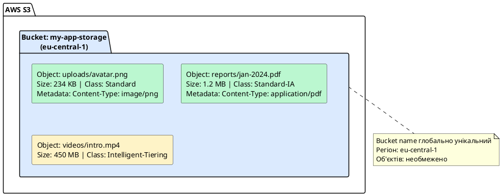
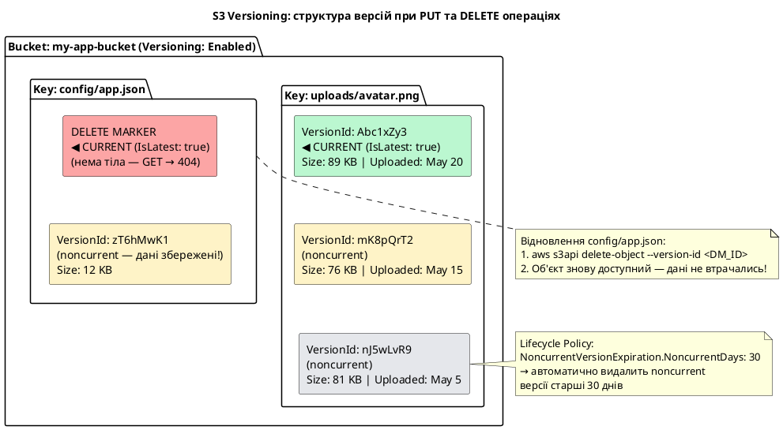
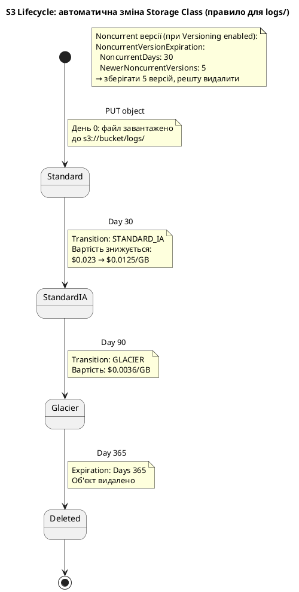
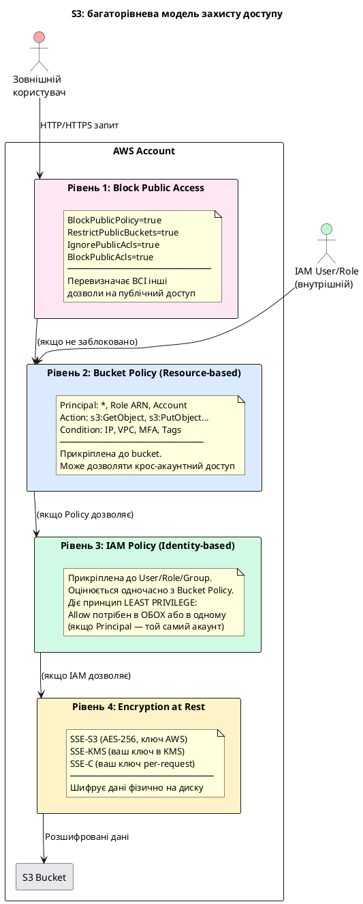
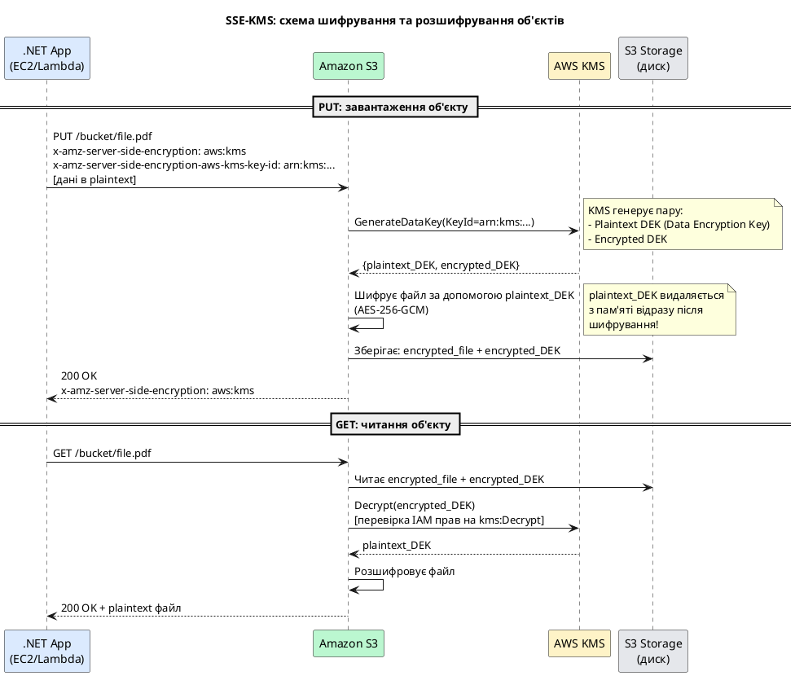
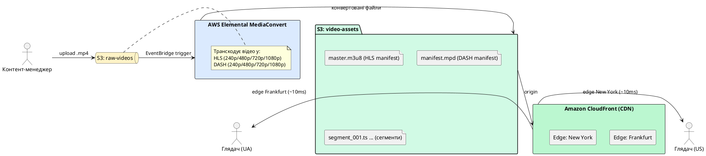

# Amazon S3 — Simple Storage Service

## Що таке S3 і чому він один із найважливіших сервісів AWS

**Amazon S3 (Simple Storage Service)** — це об'єктне сховище з необмеженою місткістю, доступністю 99.999999999% (дев'ять дев'яток!), і ціною від $0.023 за гігабайт на місяць. За цими сухими цифрами стоїть один із найвпливовіших хмарних сервісів в історії IT.

S3 запустили у 2006 році — і він докорінно змінив підхід до зберігання даних. До S3 компанії купували NAS (Network Attached Storage) або будували власні файлові сервери: дорого, складно масштабувати, єдина точка відмови. S3 запропонував: завантажуй скільки хочеш файлів — від одного байта до терабайтів — і плати лише за те, що використовуєш.

**Сьогодні S3 використовується для:**

- Зберігання зображень, відео, PDF та будь-яких файлів для веб-застосунків
- Хостингу статичних веб-сайтів та React/Vue/Angular SPA
- Сховища резервних копій баз даних та серверів
- Дистрибуції медіаконтенту (відео HLS/DASH потоки)
- Data Lake для аналітики (Athena, EMR, SageMaker читають з S3)
- Логів CloudTrail, ALB, CloudFront
- Артефактів CI/CD (збірки, Docker образи через ECR який теж базується на S3)
- Static website hosting для фронтенд SPA

::note
S3 — це не файлова система. Тут немає справжніх директорій, немає POSIX операцій, немає блокувань файлів. Це **об'єктне сховище**: ви зберігаєте об'єкти (файли + метадані) і отримуєте їх за унікальним ключем. Це принципово важливо для розуміння.
::

---

## Bucket, Object, Key — фундаментальні концепції

### Bucket — контейнер для об'єктів

**Bucket** — це верхньорівневий контейнер для зберігання об'єктів в S3. Думайте про bucket як про «диск» або «кореневу директорію». Кожен bucket:

- Має **унікальну глобальну назву** — унікальну серед всіх AWS клієнтів у всьому світі. Якщо назва `photos` вже зайнята кимось — ви не зможете створити bucket з такою ж назвою.
- Прив'язаний до **конкретного регіону** (eu-central-1, us-east-1 тощо). Дані фізично зберігаються у цьому регіоні.
- Може містити **необмежену кількість об'єктів**, але один об'єкт не може перевищувати **5 TB**.
- Назва bucket може містити лише малі літери, цифри та дефіси (`my-bucket-2024`), довжина 3–63 символи.

**Правила іменування bucket:** lowercase, лише `a-z`, `0-9`, `-`. Не може починатись або закінчуватись на `-`. Не може містити `_` або великі літери. Не може виглядати як IP-адреса.

### Object — файл з метаданими

**Object** (об'єкт) — це файл плюс метадані про цей файл. Кожен об'єкт складається з:

- **Data (Body):** власне вміст файлу — від 0 байтів до 5 TB
- **Key:** унікальний ідентифікатор об'єкту у bucket (докладніше нижче)
- **Metadata:** набір пар ключ-значення з інформацією про об'єкт
    - System metadata: `Content-Type`, `Content-Length`, `Last-Modified`, `ETag`
    - User metadata: будь-які дані, наприклад `x-amz-meta-author: Ivan`
- **Version ID:** якщо включене версіонування — унікальний ID версії
- **Storage Class:** клас зберігання (Standard, IA, Glacier тощо)

### Key — адреса об'єкту

**Key** — це рядок, що однозначно ідентифікує об'єкт у bucket. Key може виглядати як шлях з «директоріями»:

```
photos/2024/january/birthday.jpg
uploads/users/ivan/avatar.png
reports/monthly/2024-01-report.pdf
```

Насправді ніяких реальних директорій немає — є лише рядок з `/` символами. S3 Console та AWS CLI лише імітують директорії для зручності, фільтруючи об'єкти за префіксом. Але для програми `photos/2024/january/birthday.jpg` — це просто рядок-ключ.

**Повна адреса об'єкту (URL):**

```
https://my-bucket.s3.eu-central-1.amazonaws.com/photos/2024/january/birthday.jpg
або через path-style (застарілий):
https://s3.eu-central-1.amazonaws.com/my-bucket/photos/2024/january/birthday.jpg
```

::plant-uml



::

---

## S3 Storage Classes — класи зберігання

**Storage Class** — це рівень зберігання об'єкту, який визначає баланс між вартістю зберігання, вартістю отримання та часом доступу. AWS пропонує кілька класів, кожен оптимізований для різних патернів використання.

### S3 Standard — для активних даних

**Вартість:** ~$0.023/GB/місяць (eu-central-1)
**Доступність:** 99.99%, **Durability:** 99.999999999% (11 дев'яток)
**Затримка:** мілісекунди
**Мінімум зберігання:** немає

Зберігає дані у мінімум трьох Availability Zones. Ідеальний для даних, до яких часто звертаються: аватари, завантажені файли, артефакти CI/CD, логи.

### S3 Standard-IA — для рідкісного доступу

**IA = Infrequent Access**
**Вартість:** ~$0.0125/GB/місяць (зберігання дешевше), але є додаткова плата за кожне читання ($0.01/GB retrieved)
**Мінімум зберігання:** 30 днів (якщо видалити раніше — все одно заплатите за 30 днів)

Для резервних копій, старих логів, даних що рідко переглядаються, але потрібні при потребі. Вигідний якщо дані зберігаються 30+ днів і читаються не частіше ніж раз на місяць.

### S3 One Zone-IA — один AZ, ще дешевше

**Вартість:** ~$0.01/GB/місяць
Зберігає лише в одному Availability Zone — якщо AZ вийде з ладу, дані недоступні (але не втрачаються). Для відтворюваних даних (ескізи зображень, тимчасові файли).

### S3 Intelligent-Tiering — автоматичний вибір класу

**Вартість:** аналогічна Standard/Standard-IA + невелика плата за моніторинг (~$0.0025/1000 об'єктів)

AWS автоматично переміщує об'єкти між рівнями:

- **Frequent Access tier:** для активно використовуваних об'єктів
- **Infrequent Access tier:** якщо об'єкт не читався 30 днів
- **Archive Instant Access:** якщо не читався 90 днів
- **Archive Access:** якщо не читався 90–180 днів

Ідеальний якщо патерн доступу непередбачуваний. AWS сам оптимізує витрати.

### S3 Glacier — для архівів

**S3 Glacier Instant Retrieval:** ~$0.004/GB/місяць. Миттєвий доступ, але дорожче за читання. Для архівів, до яких звертаються раз на квартал.

**S3 Glacier Flexible Retrieval:** ~$0.0036/GB/місяць. Відновлення займає **від 1 хвилини до 12 годин** (залежно від режиму). Для довгострокових архівів, compliance.

**S3 Glacier Deep Archive:** ~$0.00099/GB/місяць — найдешевший клас. Відновлення займає **12–48 годин**. Для даних що зберігаються роками і майже ніколи не читаються.

### Порівняльна таблиця Storage Classes

| Клас                     | Вартість збер.   | Затримка   | Мінімум збер. | Плата за читання | Durability |
| ------------------------ | ---------------- | ---------- | ------------- | ---------------- | ---------- |
| **S3 Standard**          | $0.023/GB        | мс         | немає         | немає            | 11×9       |
| **S3 Standard-IA**       | $0.0125/GB       | мс         | 30 днів       | $0.01/GB         | 11×9       |
| **S3 One Zone-IA**       | $0.010/GB        | мс         | 30 днів       | $0.01/GB         | 11×9\*     |
| **Intelligent-Tiering**  | $0.023→$0.004/GB | мс–хвилини | немає         | немає            | 11×9       |
| **Glacier Instant**      | $0.004/GB        | мс         | 90 днів       | $0.03/GB         | 11×9       |
| **Glacier Flexible**     | $0.0036/GB       | 1хв–12год  | 90 днів       | $0.01/GB         | 11×9       |
| **Glacier Deep Archive** | $0.00099/GB      | 12–48 год  | 180 днів      | $0.02/GB         | 11×9       |

\* One Zone-IA зберігає дані лише в одному AZ — при збої AZ дані стають тимчасово недоступними.

::plant-uml

```plantuml
@startuml
skinparam style plain
skinparam backgroundColor #ffffff
title "S3 Storage Classes: ієрархія вартості та затримки доступу"

rectangle "АКТИВНІ ДАНІ\n(часто читаються)" as ACTIVE #d1fae5 {
    rectangle "S3 Standard\n$0.023/GB\nLatency: мілісекунди\nMin storage: немає" as STD #bbf7d0
}

rectangle "НЕЧАСТІ ДАНІ\n(рідко читаються)" as INFREQ #fef3c7 {
    rectangle "Standard-IA\n$0.0125/GB\n+$0.01/GB retrieved\nMin: 30 днів" as SIA #fef3c7
    rectangle "One Zone-IA\n$0.010/GB\n+$0.01/GB retrieved\nОдин AZ" as OZIA #fef3c7
}

rectangle "АВТОМАТИЧНА ОПТИМІЗАЦІЯ" as AUTO #dbeafe {
    rectangle "Intelligent-Tiering\n$0.023→$0.004/GB\nАвто між рівнями\n+$0.0025/1000 obj" as IT #dbeafe
}

rectangle "АРХІВ\n(майже не читаються)" as ARCH #fce7f3 {
    rectangle "Glacier Instant\n$0.004/GB\n+$0.03/GB\nMin: 90 днів" as GI #fce7f3
    rectangle "Glacier Flexible\n$0.0036/GB\n1хв–12год відновл.\nMin: 90 днів" as GF #fce7f3
    rectangle "Glacier Deep Archive\n$0.00099/GB\n12–48год відновл.\nMin: 180 днів" as GDA #fca5a5
}

STD -down-> SIA : Lifecycle:
30+ днів без доступу
SIA -down-> GF : Lifecycle:
90+ днів
GF -down-> GDA : Lifecycle:
365+ днів

note bottom of GDA
  Найдешевший клас.
  Для compliance, юридичних
  архівів, медичних записів.
end note

@enduml
```

::

::card-group

::card{title="Частий доступ" icon="i-heroicons-bolt"}

**Standard** — $0.023/GB. Зображення, відео, активні файли, веб-ресурси.

::

::card{title="Рідкий доступ" icon="i-heroicons-archive-box"}

**Standard-IA** — $0.0125/GB. Резервні копії, старі логи, рідко використовувані файли.

::

::card{title="Архів" icon="i-heroicons-clock"}

**Glacier Deep Archive** — $0.001/GB. Відповідність регуляторним вимогам, юридичні архіви.

::

::card{title="Невідомий патерн" icon="i-heroicons-sparkles"}

**Intelligent-Tiering** — автоматична оптимізація. Якщо не знаєте частоту доступу.

::

::

---

## S3 Versioning — збереження всіх версій об'єктів

**S3 Versioning** — це механізм захисту даних від випадкового видалення та перезапису. Коли версіонування увімкнено, Amazon S3 зберігає **кожну версію** кожного об'єкту у bucket, призначаючи кожній унікальний ідентифікатор — **Version ID**. При повторному завантаженні об'єкту з тим самим ключем попередня версія не перезаписується, а стає «некурентною» (noncurrent), і нова версія набуває статусу поточної.

**Концепція Delete Marker.** Видалення об'єкту при увімкненому версіонуванні не знищує дані фізично. Натомість S3 додає спеціальний **Delete Marker** — порожній маркерний об'єкт без тіла, що стає поточною «версією» з цим ключем. Будь-який `GET`-запит на цей ключ повертатиме HTTP 404, однак усі попередні версії залишаються фізично збереженими у bucket. Для відновлення достатньо видалити Delete Marker.

**Стани Versioning:**

- `Suspended` (за замовчуванням): версіонування вимкнене. Нові об'єкти зберігаються без Version ID (значення `null`). Якщо bucket раніше був версіонованим — старі версії залишаються.
- `Enabled`: кожен `PUT`-запит створює нову версію з унікальним Version ID. Після увімкнення — не можна повністю вимкнути. Можна лише перевести у `Suspended` (нові версії не створюються, старі зберігаються).

**Навіщо потрібне версіонування:**

- **Захист від випадкового видалення:** видалений об'єкт отримує Delete Marker — відновлення тривіальне
- **Захист від перезапису:** можна повернутись до будь-якої попередньої версії файлу
- **Регуляторна відповідність** (GDPR, SOC 2, ISO 27001, HIPAA): зберігати незмінювані версії документів
- **Відкат деплою:** якщо новий build фронтенду зламав сайт — повернути попередню версію за секунди

::plant-uml



::

::tabs

::tabs-item{label="AWS Console"}

**Увімкнення версіонування:**

1. Відкрийте **S3** → оберіть bucket → вкладка **Properties**
2. Прокрутіть до секції **Bucket Versioning** → **Edit**
3. Оберіть **Enable** → **Save changes**

**Перегляд версій об'єктів:**

1. S3 → bucket → у верхньому правому куті ввімкніть перемикач **Show versions**
2. У списку з'являться всі версії кожного файлу та Delete Markers (з міткою `Delete marker`)
3. Стовпець **Version ID** — унікальний ідентифікатор версії

**Відновлення «видаленого» об'єкту (видалення Delete Marker):**

1. Bucket → **Show versions: ON**
2. Знайдіть рядок з міткою `Delete marker` для потрібного ключа
3. Оберіть його прапорцем → **Delete** → підтвердіть
4. Об'єкт знову доступний — попередня версія автоматично стала поточною

**Відновлення конкретної версії:**

1. Show versions: ON → знайдіть потрібну версію
2. Клікніть на Version ID → **Download** або **Copy S3 URI**
3. Щоб зробити її поточною: завантажте та повторно завантажте (або скопіюйте через CLI `copy-object`)

::

::tabs-item{label="AWS CLI"}

```bash
BUCKET="my-app-bucket"
REGION="eu-central-1"

# Увімкнути версіонування
aws s3api put-bucket-versioning \
    --bucket "$BUCKET" \
    --versioning-configuration Status=Enabled \
    --region "$REGION"

# Перевірити стан версіонування
aws s3api get-bucket-versioning \
    --bucket "$BUCKET" --region "$REGION"

# Переглянути всі версії об'єкту з відфільтрованим виводом
aws s3api list-object-versions \
    --bucket "$BUCKET" \
    --prefix "uploads/avatar.png" \
    --region "$REGION" \
    --query "{
        Versions: Versions[*].{Key:Key, VersionId:VersionId, IsLatest:IsLatest, Size:Size},
        DeleteMarkers: DeleteMarkers[*].{Key:Key, VersionId:VersionId, IsLatest:IsLatest}
    }"

# Завантажити конкретну версію
aws s3api get-object \
    --bucket "$BUCKET" \
    --key "uploads/avatar.png" \
    --version-id "mK8pQrT2abc123xyz" \
    downloaded-old-version.png \
    --region "$REGION"

# Відновити попередню версію (зробити її поточною через copy-object)
aws s3api copy-object \
    --bucket "$BUCKET" \
    --copy-source "$BUCKET/uploads/avatar.png?versionId=mK8pQrT2abc123xyz" \
    --key "uploads/avatar.png" \
    --region "$REGION"

# Знайти та видалити Delete Marker (відновити 'видалений' об'єкт)
DM_VERSION=$(aws s3api list-object-versions \
    --bucket "$BUCKET" \
    --prefix "config/app.json" \
    --region "$REGION" \
    --query "DeleteMarkers[?IsLatest==\`true\`].VersionId" \
    --output text)

echo "Delete Marker Version ID: $DM_VERSION"

aws s3api delete-object \
    --bucket "$BUCKET" \
    --key "config/app.json" \
    --version-id "$DM_VERSION" \
    --region "$REGION"

echo "Object restored successfully!"
```

::terminal-preview{title="aws s3api list-object-versions"}

<div class="line"><span class="opacity-40">$</span> <strong>aws s3api list-object-versions --bucket my-app-bucket --prefix "uploads/avatar.png" ...</strong></div>
<div class="line">{</div>
<div class="line">  <span class="text-blue-400">"Versions"</span>: [</div>
<div class="line">    {</div>
<div class="line">      <span class="text-blue-400">"Key"</span>: <span class="text-green-400">"uploads/avatar.png"</span>,</div>
<div class="line">      <span class="text-blue-400">"VersionId"</span>: <span class="text-green-400">"Abc1xZy3mno456pqr"</span>,</div>
<div class="line">      <span class="text-blue-400">"IsLatest"</span>: <span class="text-yellow-400">true</span>,</div>
<div class="line">      <span class="text-blue-400">"Size"</span>: 91136</div>
<div class="line">    },</div>
<div class="line">    {</div>
<div class="line">      <span class="text-blue-400">"Key"</span>: <span class="text-green-400">"uploads/avatar.png"</span>,</div>
<div class="line">      <span class="text-blue-400">"VersionId"</span>: <span class="text-green-400">"mK8pQrT2xyz789abc"</span>,</div>
<div class="line">      <span class="text-blue-400">"IsLatest"</span>: <span class="text-red-400">false</span>,</div>
<div class="line">      <span class="text-blue-400">"Size"</span>: 77824</div>
<div class="line">    }</div>
<div class="line">  ],</div>
<div class="line">  <span class="text-blue-400">"DeleteMarkers"</span>: []</div>
<div class="line">}</div>

::

::

::

::caution
Версіонування суттєво збільшує витрати на зберігання: кожна версія кожного файлу займає місце і тарифікується окремо. Обов'язково налаштуйте **Lifecycle Policy** з `NoncurrentVersionExpiration` для автоматичного видалення старих версій — наприклад, зберігати не більше 5 попередніх версій і видаляти noncurrent старші 30 днів.
::

---

## S3 Lifecycle Policies — автоматичне управління об'єктами

**Lifecycle Policy** — це набір правил, що автоматично переміщують або видаляють об'єкти через певний час. Механізм є ключовим інструментом оптимізації витрат: AWS оцінює правила щоночі і виконує переходи для об'єктів, що відповідають умовам.

Кожне правило складається з трьох компонентів: **фільтру** (до яких об'єктів застосовується), **переходів** (коли і в який клас перемістити) та **закінчення терміну** (коли видалити).

**Типові сценарії:**

- **Логи:** Standard 30 днів → Standard-IA 90 днів → Glacier → видалення через 365 днів
- **Резервні копії БД:** Standard 7 днів → Glacier Flexible 30 днів → Deep Archive 365 днів → видалення через 7 років
- **Старі версії при Versioning:** зберігати поточну + 5 попередніх → видаляти noncurrent старші 30 днів
- **Незавершені Multipart Uploads:** AbortIncompleteMultipartUpload після 7 днів — прибирає «сміття»

::plant-uml



::

**Структура конфігурації Lifecycle Policy:**

```json
{
    "Rules": [
        {
            "ID": "LogsLifecycle",
            "Status": "Enabled",
            "Filter": { "Prefix": "logs/" },
            "Transitions": [
                { "Days": 30, "StorageClass": "STANDARD_IA" },
                { "Days": 90, "StorageClass": "GLACIER" }
            ],
            "Expiration": { "Days": 365 },
            "NoncurrentVersionExpiration": {
                "NoncurrentDays": 30,
                "NewerNoncurrentVersions": 5
            },
            "AbortIncompleteMultipartUpload": {
                "DaysAfterInitiation": 7
            }
        }
    ]
}
```

**Документація полів правила:**

::field-group

::field{name="ID" type="string" required="true"}
Унікальний ідентифікатор правила в межах bucket. Максимум 255 символів. Використовується для ідентифікації у звітах та AWS CLI.
::

::field{name="Status" type="string" required="true" default="Enabled"}
Стан правила: `Enabled` — активне, `Disabled` — призупинене. Дозволяє тимчасово вимкнути правило без видалення.
::

::field{name="Filter" type="object"}
Фільтр об'єктів: `{"Prefix": "logs/"}` — за префіксом ключа; `{"Tag": {"Key": "env", "Value": "prod"}}` — за тегом; `{}` — всі об'єкти в bucket.
::

::field{name="Transitions" type="array"}
Масив переходів між Storage Class. Поле `Days` — кількість днів від дати створення об'єкту (не від останнього доступу). `StorageClass` — цільовий клас: `STANDARD_IA`, `ONEZONE_IA`, `INTELLIGENT_TIERING`, `GLACIER`, `DEEP_ARCHIVE`.
::

::field{name="Expiration" type="object"}
Автоматичне видалення поточних версій. `{"Days": 365}` — через 365 днів. `{"ExpiredObjectDeleteMarker": true}` — видаляти Delete Markers без noncurrent версій.
::

::field{name="NoncurrentVersionExpiration" type="object"}
Управління старими версіями при увімкненому Versioning. `NoncurrentDays` — зберігати не більше N днів. `NewerNoncurrentVersions` — зберігати не більше N попередніх версій.
::

::field{name="AbortIncompleteMultipartUpload" type="object"}
`{"DaysAfterInitiation": 7}` — автоматично скасовувати та видаляти незавершені multipart uploads старші 7 днів. Критично важливо для уникнення непомітних витрат на неповні завантаження.
::

::

::tabs

::tabs-item{label="AWS Console"}

1. S3 → оберіть bucket → вкладка **Management**
2. У секції **Lifecycle rules** → **Create lifecycle rule**
3. **Rule name:** `LogsLifecycle`
4. **Choose a rule scope:** `Limit the scope to specific prefixes or tags` → вкажіть prefix `logs/`
5. **Lifecycle rule actions:** оберіть:
    - ✅ **Transition current versions of objects between storage classes**
    - ✅ **Expire current versions of objects**
    - ✅ **Delete expired object delete markers or incomplete multipart uploads**
6. У **Transition current versions:** додайте два переходи:
    - Standard-IA after **30** days
    - Glacier Flexible Retrieval after **90** days
7. **Expiration:** ✅ → **30** days after object creation → enter `365`
8. **Delete incomplete multipart uploads** → **7** days
9. **Create rule**

::

::tabs-item{label="AWS CLI"}

```bash
BUCKET="my-app-bucket"
REGION="eu-central-1"

# Зберегти конфігурацію у файл
cat > /tmp/lifecycle.json << 'EOF'
{
    "Rules": [
        {
            "ID": "LogsLifecycle",
            "Status": "Enabled",
            "Filter": {"Prefix": "logs/"},
            "Transitions": [
                {"Days": 30, "StorageClass": "STANDARD_IA"},
                {"Days": 90, "StorageClass": "GLACIER"}
            ],
            "Expiration": {"Days": 365},
            "NoncurrentVersionExpiration": {
                "NoncurrentDays": 30,
                "NewerNoncurrentVersions": 5
            },
            "AbortIncompleteMultipartUpload": {
                "DaysAfterInitiation": 7
            }
        }
    ]
}
EOF

# Застосувати Lifecycle Policy
aws s3api put-bucket-lifecycle-configuration \
    --bucket "$BUCKET" \
    --lifecycle-configuration file:///tmp/lifecycle.json \
    --region "$REGION"

# Переглянути поточні правила
aws s3api get-bucket-lifecycle-configuration \
    --bucket "$BUCKET" \
    --region "$REGION"

# Видалити всі lifecycle правила
aws s3api delete-bucket-lifecycle \
    --bucket "$BUCKET" \
    --region "$REGION"
```

::

::

::terminal-preview{title="aws s3api get-bucket-lifecycle-configuration"}

<div class="line"><span class="opacity-40">$</span> <strong>aws s3api get-bucket-lifecycle-configuration --bucket my-app-bucket --region eu-central-1</strong></div>
<div class="line">{</div>
<div class="line">  <span class="text-blue-400">"Rules"</span>: [</div>
<div class="line">    {</div>
<div class="line">      <span class="text-blue-400">"ID"</span>: <span class="text-green-400">"LogsLifecycle"</span>,</div>
<div class="line">      <span class="text-blue-400">"Status"</span>: <span class="text-green-400">"Enabled"</span>,</div>
<div class="line">      <span class="text-blue-400">"Filter"</span>: { <span class="text-blue-400">"Prefix"</span>: <span class="text-green-400">"logs/"</span> },</div>
<div class="line">      <span class="text-blue-400">"Transitions"</span>: [</div>
<div class="line">        { <span class="text-blue-400">"Days"</span>: <span class="text-yellow-400">30</span>, <span class="text-blue-400">"StorageClass"</span>: <span class="text-green-400">"STANDARD_IA"</span> },</div>
<div class="line">        { <span class="text-blue-400">"Days"</span>: <span class="text-yellow-400">90</span>, <span class="text-blue-400">"StorageClass"</span>: <span class="text-green-400">"GLACIER"</span> }</div>
<div class="line">      ],</div>
<div class="line">      <span class="text-blue-400">"Expiration"</span>: { <span class="text-blue-400">"Days"</span>: <span class="text-yellow-400">365</span> }</div>
<div class="line">    }</div>
<div class="line">  ]</div>
<div class="line">}</div>

::

---

## S3 Security — безпека та контроль доступу

Безпека Amazon S3 реалізована у вигляді **багаторівневої моделі захисту**. Кожен рівень є незалежним і може застосовуватись окремо або у комбінації з іншими. Помилки в налаштуванні S3 bucket стали причиною гучних витоків даних (Capital One, GoDaddy, NASA та інших організацій), тому розуміння всіх рівнів є критично необхідним.

::plant-uml



::

### Block Public Access — перший захист

**Block Public Access** — це налаштування на рівні bucket та на рівні AWS-акаунту, яке **перевизначає** всі інші дозволи та гарантує, що bucket залишається приватним, навіть якщо існує Bucket Policy, що явно дозволяє публічний доступ. Цей механізм є **першою і найважливішою лінією захисту**.

Налаштування складається з чотирьох незалежних прапорців, кожен з яких контролює окремий аспект публічного доступу:

::field-group

::field{name="BlockPublicAcls" type="boolean" default="true"}
Забороняє додавання нових ACL (Access Control Lists), що надають публічний доступ. PUT-запити з публічними ACL відхиляються з помилкою. Не впливає на вже існуючі ACL.
::

::field{name="IgnorePublicAcls" type="boolean" default="true"}
Ігнорує всі існуючі публічні ACL на bucket та об'єктах. Навіть якщо ACL вже є і надають публічний доступ — вони ігноруються. Діє разом з `BlockPublicAcls`.
::

::field{name="BlockPublicPolicy" type="boolean" default="true"}
Забороняє додавання нових Bucket Policy, що надають публічний доступ. PUT-запити на Bucket Policy, що містять публічні Principal, відхиляються.
::

::field{name="RestrictPublicBuckets" type="boolean" default="true"}
Найбільш агресивний прапорець: обмежує доступ до bucket лише для AWS-сервісів та авторизованих Principal в тому ж акаунті, навіть якщо Bucket Policy вже існує і надає публічний доступ.
::

::

::tabs

::tabs-item{label="AWS Console"}

**Налаштування Block Public Access для bucket:**

1. Відкрийте **S3** → оберіть bucket → вкладка **Permissions**
2. У секції **Block public access (bucket settings)** → **Edit**
3. Встановіть усі 4 прапорці ✅ (рекомендовано для всіх bucket з приватними даними)
4. **Save changes** → введіть `confirm` у діалозі підтвердження

**Налаштування Block Public Access на рівні акаунту (рекомендовано):**

1. Відкрийте **S3** → у лівому меню **Block Public Access settings for this account**
2. **Edit** → встановіть усі 4 прапорці
3. **Save changes** → `confirm`

::callout{icon="i-heroicons-information-circle" color="blue"}
Налаштування на рівні акаунту застосовується до ВСІХ поточних та майбутніх bucket в акаунті. Це найбезпечніший підхід: навіть якщо хтось помилково створить bucket без захисту — акаунтовий Block Public Access захистить його.
::

::

::tabs-item{label="AWS CLI"}

```bash
BUCKET="my-app-bucket"
REGION="eu-central-1"
ACCOUNT_ID=$(aws sts get-caller-identity --query Account --output text)

# Заблокувати ВЕСЬ публічний доступ до конкретного bucket
aws s3api put-public-access-block \
    --bucket "$BUCKET" \
    --public-access-block-configuration \
        'BlockPublicAcls=true,IgnorePublicAcls=true,BlockPublicPolicy=true,RestrictPublicBuckets=true' \
    --region "$REGION"

# Перевірити поточні налаштування
aws s3api get-public-access-block \
    --bucket "$BUCKET" \
    --region "$REGION"

# Налаштувати Block Public Access на рівні всього акаунту
aws s3control put-public-access-block \
    --account-id "$ACCOUNT_ID" \
    --public-access-block-configuration \
        'BlockPublicAcls=true,IgnorePublicAcls=true,BlockPublicPolicy=true,RestrictPublicBuckets=true'

# Перевірити налаштування на рівні акаунту
aws s3control get-public-access-block \
    --account-id "$ACCOUNT_ID"
```

::

::

::terminal-preview{title="aws s3api get-public-access-block"}

<div class="line"><span class="opacity-40">$</span> <strong>aws s3api get-public-access-block --bucket my-app-bucket --region eu-central-1</strong></div>
<div class="line">{</div>
<div class="line">  <span class="text-blue-400">"PublicAccessBlockConfiguration"</span>: {</div>
<div class="line">    <span class="text-blue-400">"BlockPublicAcls"</span>: <span class="text-yellow-400">true</span>,</div>
<div class="line">    <span class="text-blue-400">"IgnorePublicAcls"</span>: <span class="text-yellow-400">true</span>,</div>
<div class="line">    <span class="text-blue-400">"BlockPublicPolicy"</span>: <span class="text-yellow-400">true</span>,</div>
<div class="line">    <span class="text-blue-400">"RestrictPublicBuckets"</span>: <span class="text-yellow-400">true</span></div>
<div class="line">  }</div>
<div class="line">}</div>

::

::caution
AWS рекомендує: **усі bucket за замовчуванням приватні**. Увімкнення публічного доступу — навмисна дія з потенційними наслідками для безпеки. Єдиний правомірний сценарій вимкнення Block Public Access — статичний вебсайт, де весь контент свідомо публічний. Навіть тоді краще використовувати CloudFront OAC замість прямого публічного доступу до S3.
::

---

### Bucket Policy — JSON-правила доступу

**Bucket Policy** — це ресурсно-орієнтована IAM-політика у форматі JSON, що прикріплюється безпосередньо до bucket і визначає, які Principal (користувачі, ролі, сервіси, акаунти) можуть виконувати які дії з bucket та його об'єктами. На відміну від IAM Policy (прикріпленої до ідентифікатора), Bucket Policy є атрибутом самого ресурсу і дозволяє надавати **крос-акаунтний доступ** без зміни IAM в інших акаунтах.

**Оцінка доступу:** S3 оцінює одночасно Bucket Policy і IAM Policy. Якщо хоча б одна з них містить явну заборону (`Deny`) — доступ заблокований. Для надання доступу principal всередині того самого акаунту достатньо дозволу в одній з двох (IAM або Bucket Policy). Для крос-акаунтного доступу потрібен Allow в **обох**.

**Приклад 1: публічний доступ на читання для статичного вебсайту:**

```json
{
    "Version": "2012-10-17",
    "Statement": [
        {
            "Sid": "PublicReadGetObject",
            "Effect": "Allow",
            "Principal": "*",
            "Action": "s3:GetObject",
            "Resource": "arn:aws:s3:::my-website-bucket/*"
        }
    ]
}
```

**Приклад 2: доступ лише для конкретної Lambda функції (IAM Role):**

```json
{
    "Version": "2012-10-17",
    "Statement": [
        {
            "Sid": "LambdaReadWrite",
            "Effect": "Allow",
            "Principal": {
                "AWS": "arn:aws:iam::123456789012:role/MyLambdaRole"
            },
            "Action": ["s3:GetObject", "s3:PutObject", "s3:DeleteObject"],
            "Resource": "arn:aws:s3:::my-app-bucket/uploads/*"
        }
    ]
}
```

**Приклад 3: доступ лише з певного VPC (ізоляція private API):**

```json
{
    "Version": "2012-10-17",
    "Statement": [
        {
            "Sid": "DenyOutsideVPC",
            "Effect": "Deny",
            "Principal": "*",
            "Action": "s3:*",
            "Resource": ["arn:aws:s3:::private-bucket", "arn:aws:s3:::private-bucket/*"],
            "Condition": {
                "StringNotEquals": {
                    "aws:SourceVpc": "vpc-0a1b2c3d4e5f"
                }
            }
        }
    ]
}
```

**Приклад 4: обов'язкове шифрування при завантаженні (deny незашифрованих PUT):**

```json
{
    "Version": "2012-10-17",
    "Statement": [
        {
            "Sid": "DenyUnencryptedPut",
            "Effect": "Deny",
            "Principal": "*",
            "Action": "s3:PutObject",
            "Resource": "arn:aws:s3:::my-secure-bucket/*",
            "Condition": {
                "StringNotEquals": {
                    "s3:x-amz-server-side-encryption": "aws:kms"
                }
            }
        }
    ]
}
```

**Документація полів Statement:**

::field-group

::field{name="Sid" type="string"}
Ідентифікатор statement (Statement ID). Довільний рядок без пробілів. Використовується для читабельності та debugging. Необов'язковий, але рекомендований — AWS Console і CloudTrail відображають його у подіях доступу.
::

::field{name="Effect" type="string" required="true"}
`Allow` або `Deny`. При конфлікті між Allow і Deny — **Deny завжди перемагає** (explicit deny overrides everything). Використовуйте Deny для безумовних заборон, наприклад, заборона без MFA або за межами VPC.
::

::field{name="Principal" type="string | object" required="true"}
Кому надається дозвіл. `"*"` — всі (публічно). `{"AWS": "arn:...role/..."}` — конкретна IAM роль. `{"Service": "cloudfront.amazonaws.com"}` — AWS сервіс. `{"AWS": "123456789012"}` — весь інший AWS акаунт (крос-акаунтний доступ).
::

::field{name="Action" type="string | array" required="true"}
Масив дій S3 API. Наприклад: `s3:GetObject`, `s3:PutObject`, `s3:DeleteObject`, `s3:ListBucket`, `s3:*` (всі). `s3:ListBucket` застосовується до bucket ARN, `s3:GetObject` — до об'єктного ARN (`bucket/*`).
::

::field{name="Resource" type="string | array" required="true"}
ARN ресурсу. `arn:aws:s3:::bucket-name` — сам bucket (для ListBucket). `arn:aws:s3:::bucket-name/*` — всі об'єкти. `arn:aws:s3:::bucket-name/prefix/*` — об'єкти з префіксом.
::

::field{name="Condition" type="object"}
Умовне застосування правила. Ключі: `aws:SourceIp` (IP-адреса клієнта), `aws:SourceVpc` (VPC ID), `aws:MultiFactorAuthPresent` (наявність MFA), `s3:prefix` (prefix запиту), `s3:x-amz-server-side-encryption` (тип шифрування). Умови комбінуються логічним AND.
::

::

::tabs

::tabs-item{label="AWS Console"}

**Додавання Bucket Policy через Policy Editor:**

1. S3 → оберіть bucket → вкладка **Permissions**
2. Прокрутіть до **Bucket policy** → **Edit**
3. Введіть JSON вручну або скористайтесь **Policy generator** (кнопка праворуч)
4. AWS Console підсвічує синтаксичні помилки в реальному часі
5. **Save changes**

::callout{icon="i-heroicons-light-bulb" color="yellow"}
**Порада:** скористайтесь **AWS Policy Generator** (кнопка у консолі) або **IAM Policy Simulator** для тестування політики перед застосуванням.
::

::

::tabs-item{label="AWS CLI"}

```bash
BUCKET="my-app-bucket"
REGION="eu-central-1"
ACCOUNT_ID=$(aws sts get-caller-identity --query Account --output text)

# Зберегти Bucket Policy у файл
cat > /tmp/bucket-policy.json << EOF
{
    "Version": "2012-10-17",
    "Statement": [
        {
            "Sid": "LambdaReadWrite",
            "Effect": "Allow",
            "Principal": {
                "AWS": "arn:aws:iam::${ACCOUNT_ID}:role/MyLambdaRole"
            },
            "Action": ["s3:GetObject", "s3:PutObject"],
            "Resource": "arn:aws:s3:::${BUCKET}/uploads/*"
        }
    ]
}
EOF

# Застосувати Bucket Policy
aws s3api put-bucket-policy \
    --bucket "$BUCKET" \
    --policy file:///tmp/bucket-policy.json \
    --region "$REGION"

# Переглянути поточну Bucket Policy
aws s3api get-bucket-policy \
    --bucket "$BUCKET" \
    --region "$REGION" \
    --query Policy --output text | python3 -m json.tool

# Видалити Bucket Policy
aws s3api delete-bucket-policy \
    --bucket "$BUCKET" \
    --region "$REGION"
```

::

::

::terminal-preview{title="aws s3api get-bucket-policy"}

<div class="line"><span class="opacity-40">$</span> <strong>aws s3api get-bucket-policy --bucket my-app-bucket --query Policy --output text | python3 -m json.tool</strong></div>
<div class="line">{</div>
<div class="line">  <span class="text-blue-400">"Version"</span>: <span class="text-green-400">"2012-10-17"</span>,</div>
<div class="line">  <span class="text-blue-400">"Statement"</span>: [</div>
<div class="line">    {</div>
<div class="line">      <span class="text-blue-400">"Sid"</span>: <span class="text-green-400">"LambdaReadWrite"</span>,</div>
<div class="line">      <span class="text-blue-400">"Effect"</span>: <span class="text-green-400">"Allow"</span>,</div>
<div class="line">      <span class="text-blue-400">"Principal"</span>: { <span class="text-blue-400">"AWS"</span>: <span class="text-green-400">"arn:aws:iam::123456789012:role/MyLambdaRole"</span> },</div>
<div class="line">      <span class="text-blue-400">"Action"</span>: [<span class="text-green-400">"s3:GetObject"</span>, <span class="text-green-400">"s3:PutObject"</span>],</div>
<div class="line">      <span class="text-blue-400">"Resource"</span>: <span class="text-green-400">"arn:aws:s3:::my-app-bucket/uploads/*"</span></div>
<div class="line">    }</div>
<div class="line">  ]</div>
<div class="line">}</div>

::

---

### S3 Encryption — шифрування даних

Аmazon S3 підтримує три незалежні режими серверного шифрування (SSE — Server-Side Encryption), що відрізняються за тим, хто керує ключами та яка гнучкість управління ними надається.

::plant-uml



::

| Режим        | Управління ключем  | Аудит KMS  | Вартість          | Рекомендація               |
| ------------ | ------------------ | ---------- | ----------------- | -------------------------- |
| **SSE-S3**   | AWS (автоматично)  | Немає      | Безкоштовно       | Базовий захист, всі bucket |
| **SSE-KMS**  | Ви (через AWS KMS) | CloudTrail | $0.03/10K запитів | Чутливі дані               |
| **SSE-C**    | Ви (per-request)   | Немає      | Безкоштовно       | Рідко, особливі вимоги     |
| **DSSE-KMS** | Ви (подвійне)      | CloudTrail | $0.06/10K запитів | Compliance (FIPS 140-3)    |

**SSE-S3 (AES-256):** AWS автоматично шифрує всі об'єкти при завантаженні та розшифровує при читанні. Ключами керує AWS. Безкоштовно. **Рекомендовано вмикати на всіх bucket за замовчуванням.** Починаючи з 2023 року — увімкнено за замовчуванням для всіх нових bucket.

**SSE-KMS:** шифрування через AWS Key Management Service. Ви контролюєте ключ, маєте повний аудитний журнал кожного використання ключа в CloudTrail, можете відкликати доступ до ключа (що унеможливлює читання всіх зашифрованих даних). Підходить для чутливих даних (медична, фінансова інформація, PII). **BucketKeyEnabled** — важливий параметр: замість виклику KMS для кожного об'єкту, S3 кешує DEK на рівні bucket, зменшуючи кількість KMS API викликів і, відповідно, вартість.

**SSE-C:** ви самі надаєте AES-256 ключ при кожному PUT/GET запиті. AWS використовує ключ для шифрування/розшифрування, але не зберігає його. Якщо ключ втрачено — дані назавжди недоступні. Рідко використовується через складність управління.

**DSSE-KMS (Double-layer SSE-KMS):** подвійне шифрування двома незалежними ключами KMS. Відповідає вимогам FIPS 140-3 Level 3 для defense-grade сумісності.

::tabs

::tabs-item{label="AWS Console"}

**Налаштування шифрування за замовчуванням для bucket:**

1. S3 → оберіть bucket → вкладка **Properties**
2. Прокрутіть до **Default encryption** → **Edit**
3. **Encryption type:**
    - `Server-side encryption with Amazon S3 managed keys (SSE-S3)` — для базового захисту
    - `Server-side encryption with AWS Key Management Service keys (SSE-KMS)` — для повного контролю
4. Якщо SSE-KMS:
    - **AWS managed key** (`aws/s3`) — безкоштовний ключ AWS
    - **Customer managed key** — ваш власний KMS ключ (більше контролю)
    - Увімкніть **Bucket Key** (рекомендовано: зменшує витрати на KMS)
5. **Save changes**

::

::tabs-item{label="AWS CLI"}

```bash
BUCKET="my-app-bucket"
REGION="eu-central-1"
KMS_KEY_ID="arn:aws:kms:eu-central-1:123456789012:key/mrk-abc123def456"

# Встановити SSE-S3 (AES-256) за замовчуванням
aws s3api put-bucket-encryption \
    --bucket "$BUCKET" \
    --server-side-encryption-configuration '{
        "Rules": [{
            "ApplyServerSideEncryptionByDefault": {
                "SSEAlgorithm": "AES256"
            },
            "BucketKeyEnabled": false
        }]
    }' \
    --region "$REGION"

# Встановити SSE-KMS з Customer Managed Key
aws s3api put-bucket-encryption \
    --bucket "$BUCKET" \
    --server-side-encryption-configuration "{
        \"Rules\": [{
            \"ApplyServerSideEncryptionByDefault\": {
                \"SSEAlgorithm\": \"aws:kms\",
                \"KMSMasterKeyID\": \"$KMS_KEY_ID\"
            },
            \"BucketKeyEnabled\": true
        }]
    }" \
    --region "$REGION"

# Перевірити поточне шифрування
aws s3api get-bucket-encryption \
    --bucket "$BUCKET" \
    --region "$REGION"

# Завантажити файл з явним SSE-KMS шифруванням
aws s3 cp sensitive-data.csv s3://"$BUCKET"/ \
    --sse aws:kms \
    --sse-kms-key-id "$KMS_KEY_ID" \
    --region "$REGION"
```

::

::

::terminal-preview{title="aws s3api get-bucket-encryption"}

<div class="line"><span class="opacity-40">$</span> <strong>aws s3api get-bucket-encryption --bucket my-app-bucket --region eu-central-1</strong></div>
<div class="line">{</div>
<div class="line">  <span class="text-blue-400">"ServerSideEncryptionConfiguration"</span>: {</div>
<div class="line">    <span class="text-blue-400">"Rules"</span>: [</div>
<div class="line">      {</div>
<div class="line">        <span class="text-blue-400">"ApplyServerSideEncryptionByDefault"</span>: {</div>
<div class="line">          <span class="text-blue-400">"SSEAlgorithm"</span>: <span class="text-green-400">"aws:kms"</span>,</div>
<div class="line">          <span class="text-blue-400">"KMSMasterKeyID"</span>: <span class="text-green-400">"arn:aws:kms:eu-central-1:123456789012:key/mrk-abc123"</span></div>
<div class="line">        },</div>
<div class="line">        <span class="text-blue-400">"BucketKeyEnabled"</span>: <span class="text-yellow-400">true</span></div>
<div class="line">      }</div>
<div class="line">    ]</div>
<div class="line">  }</div>
<div class="line">}</div>

::

---

## S3 Presigned URLs — тимчасовий доступ до приватних об'єктів

**Presigned URL** — це спеціально підписана URL-адреса, яка надає тимчасовий доступ до приватного S3 об'єкту без необхідності давати постійні права. Типова тривалість: від 1 хвилини до 7 днів.

**Сценарії використання:**

- Користувач завантажує приватний документ: бекенд генерує Presigned URL з терміном 15 хвилин і повертає її фронтенду
- Фронтенд завантажує файл напряму в S3 (без проходження через бекенд): бекенд генерує Presigned PUT URL
- Відправка посилання на скачування файлу в email

```csharp
// AWS SDK for .NET — генерація Presigned URL
using Amazon.S3;
using Amazon.S3.Model;

public class S3Service
{
    private readonly IAmazonS3 _s3;

    public S3Service(IAmazonS3 s3) => _s3 = s3;

    // Presigned GET URL — для завантаження файлу
    public string GenerateDownloadUrl(string bucket, string key, int expiresInMinutes = 15)
    {
        var request = new GetPreSignedUrlRequest
        {
            BucketName = bucket,
            Key = key,
            Expires = DateTime.UtcNow.AddMinutes(expiresInMinutes),
            Verb = HttpVerb.GET
        };
        return _s3.GetPreSignedURL(request);
    }

    // Presigned PUT URL — для завантаження файлу напряму з браузера
    public string GenerateUploadUrl(string bucket, string key,
        string contentType, int expiresInMinutes = 5)
    {
        var request = new GetPreSignedUrlRequest
        {
            BucketName = bucket,
            Key = key,
            Expires = DateTime.UtcNow.AddMinutes(expiresInMinutes),
            Verb = HttpVerb.PUT,
            ContentType = contentType
        };
        return _s3.GetPreSignedURL(request);
    }
}
```

**Використання Presigned PUT URL у JavaScript:**

```javascript
// Отримуємо URL з бекенду
const { uploadUrl } = await fetch('/api/files/upload-url?filename=photo.jpg')

// Завантажуємо файл напряму в S3 — бекенд не торкається файлу!
await fetch(uploadUrl, {
    method: 'PUT',
    body: file,
    headers: { 'Content-Type': 'image/jpeg' },
})
```

---

## S3 Static Website Hosting

**S3 Static Website Hosting** — можливість використовувати S3 як хостинг для статичних веб-сайтів: HTML, CSS, JavaScript, зображення. Це ідеально для React/Vue/Angular SPA (Single Page Application).

**Переваги перед традиційним хостингом:**

- **Вартість:** S3 Static Hosting коштує копійки (зберігання + трафік), немає витрат на сервер
- **Масштабованість:** S3 витримає будь-яке навантаження без конфігурації
- **Надійність:** 99.99% доступність без жодних зусиль

**Особливість SPA (React, Vue, Angular):** у SPA весь роутинг відбувається на клієнті. `/about`, `/users/123` — це JavaScript-маршрути, а не реальні файли. Якщо користувач відкрив `mysite.com/about` напряму або натиснув F5 — S3 спробує знайти файл `/about` і не знайде → поверне 404.

**Рішення:** в налаштуваннях Static Hosting вказати `index.html` як **Error document** (404 page). Тоді замість помилки S3 поверне `index.html` → React Router перехопить URL та відобразить правильну сторінку.

```bash
# Налаштувати Static Website Hosting
aws s3api put-bucket-website \
    --bucket my-react-app \
    --website-configuration '{
        "IndexDocument": {"Suffix": "index.html"},
        "ErrorDocument": {"Key": "index.html"}
    }' \
    --region eu-central-1

# Після цього сайт доступний за:
# http://my-react-app.s3-website.eu-central-1.amazonaws.com
```

**Важливо:** S3 Static Hosting URL — це `http://` (без S). Для HTTPS використовуйте **CloudFront** як CDN перед S3 — це стандартна production-архітектура.

---

## S3 CORS — Cross-Origin Resource Sharing

**CORS (Cross-Origin Resource Sharing)** — механізм браузерної безпеки, який блокує JavaScript-запити між різними доменами. Якщо ваш React-фронтенд (на `app.example.com`) намагається завантажити або скачати файли напряму з S3 — браузер заблокує запит, поки S3 не дозволить це через CORS заголовки.

**Коли потрібен CORS на S3:**

- Фронтенд завантажує файли напряму в S3 через Presigned PUT URL
- Фронтенд читає файли з S3 напряму (зображення, JSON)
- Static website на S3 робить API запити до іншого домену

```json
[
    {
        "AllowedHeaders": ["*"],
        "AllowedMethods": ["GET", "PUT", "POST", "DELETE", "HEAD"],
        "AllowedOrigins": ["https://app.example.com", "http://localhost:3000"],
        "ExposeHeaders": ["ETag", "x-amz-version-id"],
        "MaxAgeSeconds": 3000
    }
]
```

```bash
# Застосувати CORS конфігурацію
aws s3api put-bucket-cors \
    --bucket my-app-bucket \
    --cors-configuration file://cors.json \
    --region eu-central-1
```

**Пояснення полів:**

- `AllowedOrigins`: які домени можуть звертатись до bucket. Для розробки — `http://localhost:3000`. Для production — ваш реальний домен. **Ніколи не використовуйте `*` для bucket з приватними даними.**
- `AllowedMethods`: які HTTP методи дозволені. `PUT` — для завантаження, `GET` — для читання.
- `AllowedHeaders`: які заголовки браузер може надіслати. `*` — всі.
- `ExposeHeaders`: які заголовки відповіді браузер може читати з JavaScript. `ETag` — для верифікації завантаженого файлу.
- `MaxAgeSeconds`: як довго браузер кешує CORS preflight відповідь (3000 сек = 50 хв).

---

## S3 Transfer Acceleration

**S3 Transfer Acceleration** — це функція, яка прискорює завантаження та скачування великих файлів завдяки використанню **глобальної мережі edge locations AWS (CloudFront)**. Замість прямого підключення до S3 у регіоні, дані проходять через найближчий CloudFront edge-вузол, а далі через оптимізовану внутрішню мережу AWS.

**Коли вигідно:** завантаження великих файлів (100+ MB) від користувачів у різних географічних регіонах. Якщо ваш S3 у Франкфурті, а користувач в Токіо — Transfer Acceleration може дати 50–500% приріст швидкості.

**Коли невигідно:** завантаження малих файлів (< 1 MB) або якщо S3 і клієнт в одному регіоні.

```bash
# Увімкнути Transfer Acceleration
aws s3api put-bucket-accelerate-configuration \
    --bucket my-app-bucket \
    --accelerate-configuration Status=Enabled \
    --region eu-central-1

# Використовувати accelerated endpoint (інший URL!)
# Стандартний: my-app-bucket.s3.eu-central-1.amazonaws.com
# Accelerated: my-app-bucket.s3-accelerate.amazonaws.com
aws s3 cp large-file.zip s3://my-app-bucket/ \
    --endpoint-url https://s3-accelerate.amazonaws.com
```

У .NET SDK:

```csharp
var config = new AmazonS3Config
{
    UseAccelerateEndpoint = true, // Увімкнути Transfer Acceleration
    RegionEndpoint = RegionEndpoint.EUCentral1
};
var s3 = new AmazonS3Client(config);
```

---

## Юзкейс: Медіа файли та HLS/DASH відео-стрімінг

Це один із найважливіших та найпоширеніших use cases для S3 у сучасних застосунках. Розберемо детально.

### Що таке HLS та DASH

**HLS (HTTP Live Streaming)** — протокол відео-стрімінгу розроблений Apple. Відео нарізається на короткі сегменти (зазвичай 6–10 секунд) у форматі `.ts` або `.fmp4`. Плеєр завантажує **manifest-файл** (`.m3u8`), який описує всі сегменти та доступні якості, потім послідовно завантажує сегменти. Підтримується нативно у Safari та iOS, в інших браузерах — через бібліотеки (hls.js).

**DASH (Dynamic Adaptive Streaming over HTTP)** — відкритий стандарт (MPEG-DASH), аналогічний HLS. Manifest-файл (`.mpd`), сегменти (`.m4s`). Підтримується у більшості сучасних браузерів через dash.js.

**Adaptive Bitrate (ABR):** і HLS, і DASH підтримують кілька якостей одного відео (240p, 480p, 720p, 1080p). Плеєр автоматично перемикається між якостями залежно від швидкості з'єднання користувача — якість не заморожується, а плавно деградує.

### Архітектура відео-стрімінгу на S3 + CloudFront

```
Відеофайл → AWS Elemental MediaConvert → S3 (HLS/DASH сегменти) → CloudFront → Користувач
```

::plant-uml



::

### Структура файлів HLS у S3

Після конвертації через MediaConvert у S3 bucket утворюється наступна структура:

```
s3://video-assets/
└── videos/
    └── movie-id-abc123/
        ├── hls/
        │   ├── master.m3u8              ← головний manifest (посилання на якості)
        │   ├── 1080p/
        │   │   ├── stream.m3u8          ← playlist для 1080p
        │   │   ├── segment_000.ts       ← сегмент 0 (0-6 сек)
        │   │   ├── segment_001.ts       ← сегмент 1 (6-12 сек)
        │   │   └── ...
        │   ├── 720p/
        │   │   ├── stream.m3u8
        │   │   └── ...
        │   └── 360p/
        │       ├── stream.m3u8
        │       └── ...
        └── dash/
            ├── manifest.mpd
            └── ...
```

Вміст `master.m3u8`:

```m3u8
#EXTM3U
#EXT-X-STREAM-INF:BANDWIDTH=5000000,RESOLUTION=1920x1080
1080p/stream.m3u8
#EXT-X-STREAM-INF:BANDWIDTH=2800000,RESOLUTION=1280x720
720p/stream.m3u8
#EXT-X-STREAM-INF:BANDWIDTH=800000,RESOLUTION=640x360
360p/stream.m3u8
```

Плеєр завантажує `master.m3u8`, бачить три якості, обирає відповідну до швидкості з'єднання і завантажує відповідний `stream.m3u8`, а потім послідовно всі `.ts` сегменти.

### CloudFront для відео-стрімінгу

Відео через S3 напряму — **не рекомендовано** для production з кількох причин:

- Висока latency для глядачів далеко від регіону S3
- Дорогий трафік ($0.09/GB з S3, порівняно з $0.015/GB з CloudFront)
- Немає кешування сегментів — кожен запит іде до S3

**CloudFront** (CDN від AWS) кешує сегменти у 400+ edge locations по всьому світу. Перший глядач у Токіо завантажить сегмент з S3 у Франкфурті — але CloudFront закешує його в Токіо. Всі наступні глядачі в Токіо отримають цей сегмент за мілісекунди.

### Захист медіа через Signed URLs / Cookies

Якщо відео-контент платний або приватний — потрібно захистити доступ. CloudFront підтримує два механізми:

**CloudFront Signed URLs:** кожен URL підписується і містить термін дії, дозволений IP, дозволені шляхи. Аналог S3 Presigned URL.

**CloudFront Signed Cookies:** встановлюється cookie з правами доступу до цілої «директорії» в S3 (наприклад, всі сегменти конкретного відео). Зручніше для відео — не потрібно підписувати кожен сегмент окремо.

```csharp
// .NET: генерація CloudFront Signed Cookie для відео
using Amazon.CloudFront;

public string GenerateSignedCookiePolicy(
    string resourceUrl,      // "https://cdn.example.com/videos/movie-id/*"
    string cloudFrontKeyId,  // ID ключа CloudFront
    RSA privateKey,          // RSA приватний ключ
    DateTime expiresAt)
{
    var policy = new CloudFrontCannedPolicy
    {
        Resource = resourceUrl,
        DateLessThan = expiresAt
    };
    return AmazonCloudFrontUrlSigner.BuildPolicyForSignedUrl(
        cloudFrontKeyId, privateKey, policy);
}
```

### Реалізація відео-плеєра у React з hls.js

```jsx
import { useEffect, useRef } from 'react'
import Hls from 'hls.js'

function VideoPlayer({ manifestUrl }) {
    const videoRef = useRef(null)

    useEffect(() => {
        const video = videoRef.current
        if (!video) return

        if (Hls.isSupported()) {
            // Для більшості браузерів — використовуємо hls.js
            const hls = new Hls({
                // Починати з нижчої якості для швидкого старту
                startLevel: -1, // -1 = auto
                // Кешувати в пам'яті не більше 30 сек контенту
                maxBufferLength: 30,
            })
            hls.loadSource(manifestUrl) // URL до master.m3u8
            hls.attachMedia(video)
            hls.on(Hls.Events.MANIFEST_PARSED, () => video.play())

            return () => hls.destroy()
        } else if (video.canPlayType('application/vnd.apple.mpegurl')) {
            // Safari — нативна підтримка HLS
            video.src = manifestUrl
            video.play()
        }
    }, [manifestUrl])

    return <video ref={videoRef} controls style={{ width: '100%', maxHeight: '600px' }} />
}

// Використання:
// <VideoPlayer manifestUrl="https://cdn.example.com/videos/movie-id/hls/master.m3u8" />
```

### Storage Class для відео-файлів

Різні типи відеофайлів вимагають різних Storage Class:

| Тип файлу                       | Storage Class                       | Причина                                     |
| ------------------------------- | ----------------------------------- | ------------------------------------------- |
| Raw відео (оригінал)            | S3 Standard → через 90 днів Glacier | Рідко потрібен після конвертації            |
| HLS/DASH manifest (.m3u8, .mpd) | S3 Standard                         | Часто запитується плеєром                   |
| HLS/DASH сегменти (.ts, .m4s)   | S3 Standard                         | Активно читаються під час перегляду         |
| Старі сезони серіалу            | S3 Intelligent-Tiering              | Патерн доступу непередбачуваний             |
| Архівні відео                   | S3 Glacier Instant Retrieval        | Потрібні рідко, але потрібен швидкий доступ |

---

## AWS SDK for .NET — повна інтеграція з S3

### Встановлення та налаштування

```bash
# Встановіть NuGet пакет
dotnet add package AWSSDK.S3
dotnet add package AWSSDK.Extensions.NETCore.Setup
```

```csharp
// Program.cs — реєстрація S3 через DI
builder.Services.AddAWSService<IAmazonS3>();
// SDK автоматично читає credentials з:
// 1. Змінних середовища (AWS_ACCESS_KEY_ID, AWS_SECRET_ACCESS_KEY)
// 2. ~/.aws/credentials (локально)
// 3. IAM Role (на EC2/ECS/Lambda) ← рекомендовано для production
```

```json
// appsettings.json
{
    "AWS": {
        "Region": "eu-central-1"
    },
    "S3": {
        "BucketName": "my-app-bucket"
    }
}
```

### Повний S3Service для .NET

```csharp
using Amazon.S3;
using Amazon.S3.Model;
using Amazon.S3.Transfer;
using Microsoft.Extensions.Configuration;

public class S3StorageService
{
    private readonly IAmazonS3 _s3;
    private readonly string _bucket;

    public S3StorageService(IAmazonS3 s3, IConfiguration config)
    {
        _s3 = s3;
        // ЗАМІНІТЬ значення "S3:BucketName" реальним іменем вашого bucket
        _bucket = config["S3:BucketName"] ?? throw new InvalidOperationException("S3:BucketName not configured");
    }

    // Завантаження файлу в S3
    // key — шлях у bucket, наприклад "uploads/users/123/avatar.jpg"
    public async Task<string> UploadAsync(Stream fileStream, string key, string contentType)
    {
        using var transferUtility = new TransferUtility(_s3);

        await transferUtility.UploadAsync(new TransferUtilityUploadRequest
        {
            BucketName = _bucket,
            Key = key,
            InputStream = fileStream,
            ContentType = contentType,
            // Встановити Storage Class (за замовчуванням Standard)
            StorageClass = S3StorageClass.Standard,
            // Метадані об'єкту
            Metadata =
            {
                ["x-amz-meta-uploaded-at"] = DateTime.UtcNow.ToString("O"),
                ["x-amz-meta-content-type"] = contentType
            }
        });

        return $"https://{_bucket}.s3.eu-central-1.amazonaws.com/{key}";
    }

    // Завантаження файлу з S3
    public async Task<Stream> DownloadAsync(string key)
    {
        var response = await _s3.GetObjectAsync(new GetObjectRequest
        {
            BucketName = _bucket,
            Key = key
        });
        return response.ResponseStream;
    }

    // Перелік файлів за префіксом (аналог "директорії")
    public async Task<List<string>> ListFilesAsync(string prefix)
    {
        var response = await _s3.ListObjectsV2Async(new ListObjectsV2Request
        {
            BucketName = _bucket,
            Prefix = prefix,
            MaxKeys = 1000
        });
        return response.S3Objects.Select(o => o.Key).ToList();
    }

    // Видалення об'єкту
    public async Task DeleteAsync(string key)
    {
        await _s3.DeleteObjectAsync(_bucket, key);
    }

    // Presigned URL для завантаження (GET)
    public string GetPresignedDownloadUrl(string key, int expiresInMinutes = 60)
    {
        return _s3.GetPreSignedURL(new GetPreSignedUrlRequest
        {
            BucketName = _bucket,
            Key = key,
            Expires = DateTime.UtcNow.AddMinutes(expiresInMinutes),
            Verb = HttpVerb.GET
        });
    }

    // Presigned URL для прямого завантаження з браузера (PUT)
    public string GetPresignedUploadUrl(string key, string contentType,
        int expiresInMinutes = 10)
    {
        return _s3.GetPreSignedURL(new GetPreSignedUrlRequest
        {
            BucketName = _bucket,
            Key = key,
            Expires = DateTime.UtcNow.AddMinutes(expiresInMinutes),
            Verb = HttpVerb.PUT,
            ContentType = contentType
        });
    }

    // Multipart upload для великих файлів (> 100 MB)
    public async Task UploadLargeFileAsync(string filePath, string key)
    {
        using var transferUtility = new TransferUtility(_s3);
        await transferUtility.UploadAsync(new TransferUtilityUploadRequest
        {
            BucketName = _bucket,
            Key = key,
            FilePath = filePath,
            // Multipart: частини по 50 MB, до 5 паралельних потоків
            PartSize = 50 * 1024 * 1024,
            ThreadsCount = 5
        });
    }

    // Копіювання об'єкту всередині S3 (без завантаження на клієнт)
    public async Task CopyAsync(string sourceKey, string destinationKey)
    {
        await _s3.CopyObjectAsync(new CopyObjectRequest
        {
            SourceBucket = _bucket,
            SourceKey = sourceKey,
            DestinationBucket = _bucket,
            DestinationKey = destinationKey
        });
    }
}
```

**API Controller з прикладом використання:**

```csharp
[ApiController]
[Route("api/[controller]")]
public class FilesController : ControllerBase
{
    private readonly S3StorageService _storage;

    public FilesController(S3StorageService storage) => _storage = storage;

    // POST /api/files/upload
    [HttpPost("upload")]
    public async Task<IActionResult> Upload(IFormFile file)
    {
        if (file.Length == 0) return BadRequest("File is empty");

        // Генеруємо унікальний ключ щоб уникнути колізій
        var key = $"uploads/{Guid.NewGuid()}/{file.FileName}";

        using var stream = file.OpenReadStream();
        var url = await _storage.UploadAsync(stream, key, file.ContentType);

        return Ok(new { url, key });
    }

    // GET /api/files/download-url?key=uploads/abc123/photo.jpg
    [HttpGet("download-url")]
    public IActionResult GetDownloadUrl([FromQuery] string key)
    {
        var url = _storage.GetPresignedDownloadUrl(key, expiresInMinutes: 30);
        return Ok(new { url, expiresIn = "30 minutes" });
    }

    // GET /api/files/upload-url?filename=photo.jpg&contentType=image/jpeg
    [HttpGet("upload-url")]
    public IActionResult GetUploadUrl([FromQuery] string filename,
        [FromQuery] string contentType)
    {
        // Ключ з userId щоб ізолювати файли користувачів
        var userId = User.FindFirst("sub")?.Value ?? "anonymous";
        var key = $"users/{userId}/{Guid.NewGuid()}_{filename}";

        var url = _storage.GetPresignedUploadUrl(key, contentType);
        return Ok(new { url, key });
    }
}
```

---

## Практичний приклад: React SPA на S3 від А до Я

Побудуємо повноцінний React SPA з клієнтським роутингом та задеплоємо на S3 Static Website Hosting. Кроки йдуть у логічному порядку: спочатку створюємо застосунок, перевіряємо локально — потім налаштовуємо AWS-інфраструктуру та деплоємо.

---

### Крок 1: Створення React застосунку

```bash
# Vite — сучасний збирач, що замінив webpack/CRA: холодний старт ~200мс, HMR миттєвий
# --template react — JSX шаблон (є також react-ts для TypeScript)
npm create vite@latest my-react-app -- --template react
cd my-react-app
npm install

# react-router v7 — пакет тепер називається просто "react-router" (не react-router-dom)
npm install react-router
```

::terminal-preview{title="npm create vite@latest my-react-app -- --template react"}

<div class="line"><span class="opacity-40">$</span> <strong>npm create vite@latest my-react-app -- --template react</strong></div>
<div class="line"></div>
<div class="line">Scaffolding project in /home/user/my-react-app...</div>
<div class="line"></div>
<div class="line">Done. Now run:</div>
<div class="line">  <span class="text-yellow-400">cd my-react-app</span></div>
<div class="line">  <span class="text-yellow-400">npm install</span></div>
<div class="line">  <span class="text-yellow-400">npm run dev</span></div>

::

Структура файлів після генерації та наших змін:

```
my-react-app/
├── index.html          ← точка входу Vite (у корені, не в public/!)
├── public/             ← статичні ресурси (favicon тощо)
├── src/
│   ├── main.jsx        ← монтує React у DOM
│   ├── App.jsx         ← layout-компонент: навбар + <Outlet />
│   ├── routes.jsx      ← конфіг маршрутів (JS-об'єкти, не JSX)
│   ├── index.css       ← глобальні стилі
│   └── pages/
│       ├── Home.jsx    ← головна сторінка /
│       └── About.jsx   ← сторінка /about
├── vite.config.js
└── package.json
```

Створюємо **`src/routes.jsx`** — маршрути як JS-об'єкти (React Router v7 data API):

```jsx
// src/routes.jsx
import { createBrowserRouter } from 'react-router'
import App from './App'
import Home from './pages/Home'
import About from './pages/About'

// createBrowserRouter — React Router v7 data API.
// Маршрути описуються масивом об'єктів, а не JSX-деревом <Routes><Route>.
// Component: (з великої) — статичний імпорт компонента.
function NotFound() {
    return (
        <div className="not-found">
            <h1>404</h1>
            <p>Сторінку не знайдено</p>
        </div>
    )
}

export const router = createBrowserRouter([
    {
        path: '/',
        Component: App, // layout: рендерить навбар + <Outlet />
        children: [
            { index: true, Component: Home }, // рендериться на /
            { path: 'about', Component: About }, // рендериться на /about
        ],
    },
    { path: '*', Component: NotFound },
])
```

Замінюємо **`src/main.jsx`** — `RouterProvider` замість `BrowserRouter`:

```jsx
// src/main.jsx
import { StrictMode } from 'react'
import { createRoot } from 'react-dom/client'
import { RouterProvider } from 'react-router'
import { router } from './routes'
import './index.css'

// RouterProvider — єдина точка монтування.
// При прямому переході на /about S3 повертає 404 —
// якщо не налаштований Error Document: index.html.
createRoot(document.getElementById('root')).render(
    <StrictMode>
        <RouterProvider router={router} />
    </StrictMode>,
)
```

Замінюємо **`src/App.jsx`** — layout-компонент з `<Outlet />`:

```jsx
// src/App.jsx
import { Outlet, NavLink } from 'react-router'

// App — layout: рендерить навбар один раз,
// а <Outlet /> підставляє потрібну сторінку залежно від URL
export default function App() {
    return (
        <div className="app">
            <nav className="navbar">
                <span className="brand">☁️ S3 Demo App</span>
                <div className="nav-links">
                    {/* NavLink автоматично додає клас active до поточного посилання */}
                    <NavLink to="/" end>
                        Home
                    </NavLink>
                    <NavLink to="/about">About</NavLink>
                </div>
            </nav>
            <main className="content">
                <Outlet /> {/* тут рендериться Home або About залежно від URL */}
            </main>
        </div>
    )
}
```

Замінюємо **`src/index.css`** (Vite генерує цей файл як глобальний):

```css
/* src/index.css */
*,
*::before,
*::after {
    box-sizing: border-box;
    margin: 0;
    padding: 0;
}

body {
    font-family: -apple-system, BlinkMacSystemFont, 'Segoe UI', Roboto, sans-serif;
    background: #f0f2f5;
    color: #1a1a2e;
}

.app {
    min-height: 100vh;
    display: flex;
    flex-direction: column;
}

.navbar {
    background: #232f3e; /* AWS dark navy */
    color: white;
    padding: 1rem 2rem;
    display: flex;
    justify-content: space-between;
    align-items: center;
    box-shadow: 0 2px 8px rgba(0, 0, 0, 0.3);
}

.brand {
    font-size: 1.2rem;
    font-weight: 700;
}

.nav-links a {
    color: #adb5bd;
    text-decoration: none;
    margin-left: 1.5rem;
    font-weight: 500;
    transition: color 0.2s;
}

.nav-links a.active,
.nav-links a:hover {
    color: #ff9900;
} /* AWS orange */

.content {
    flex: 1;
    max-width: 900px;
    margin: 2rem auto;
    padding: 0 1.5rem;
    width: 100%;
}

/* Сторінки */
.page h1 {
    font-size: 2rem;
    margin-bottom: 1rem;
    color: #232f3e;
}
.page h2 {
    font-size: 1.4rem;
    margin: 1.5rem 0 0.75rem;
    color: #232f3e;
}
.page p {
    color: #555;
    line-height: 1.6;
    margin-bottom: 1rem;
}
.page ol {
    padding-left: 1.5rem;
    color: #555;
    line-height: 2;
}

/* Картки */
.cards {
    display: grid;
    grid-template-columns: repeat(auto-fit, minmax(220px, 1fr));
    gap: 1rem;
    margin-top: 1.5rem;
}

.card {
    background: white;
    border-radius: 8px;
    padding: 1.5rem;
    box-shadow: 0 1px 4px rgba(0, 0, 0, 0.1);
}

.card h3 {
    margin-bottom: 0.5rem;
    color: #232f3e;
}
.card p {
    font-size: 0.9rem;
    color: #666;
    margin: 0;
}

/* 404 */
.not-found {
    text-align: center;
    padding: 4rem 0;
}
.not-found h1 {
    font-size: 5rem;
    color: #dee2e6;
}
.not-found p {
    color: #aaa;
    margin-top: 0.5rem;
}

/* Inline elements */
kbd {
    background: #eee;
    border: 1px solid #ccc;
    border-radius: 3px;
    padding: 1px 6px;
    font-size: 0.85em;
}
code {
    background: #f4f4f4;
    padding: 1px 5px;
    border-radius: 3px;
    font-size: 0.88em;
    font-family: monospace;
}
```

Створюємо **`src/pages/Home.jsx`**:

```jsx
// src/pages/Home.jsx
export default function Home() {
    return (
        <div className="page">
            <h1>🚀 Ласкаво просимо!</h1>
            <p>
                Цей React SPA задеплоєно на <strong>Amazon S3 Static Website Hosting</strong>.
            </p>
            <div className="cards">
                <div className="card">
                    <h3>⚡ Швидкість</h3>
                    <p>Статичні файли роздаються напряму з S3 або через CloudFront CDN.</p>
                </div>
                <div className="card">
                    <h3>💰 Вартість</h3>
                    <p>Зберігання від $0.023/GB. Для типового SPA — менше $1 на місяць.</p>
                </div>
                <div className="card">
                    <h3>🔒 Надійність</h3>
                    <p>S3 гарантує 99.99% доступність та 11 дев'яток довговічності даних.</p>
                </div>
            </div>
        </div>
    )
}
```

Створюємо **`src/pages/About.jsx`**:

```jsx
// src/pages/About.jsx
export default function About() {
    return (
        <div className="page">
            <h1>ℹ️ Про застосунок</h1>
            <p>
                Навчальний React SPA розгорнутий на <strong>AWS S3 Static Website Hosting</strong>.
            </p>
            <p>
                Спробуйте натиснути <kbd>F5</kbd> — завдяки <code>Error Document: index.html</code> роутинг працює
                навіть при прямому переході на цей URL.
            </p>
            <h2>Як це працює?</h2>
            <ol>
                <li>
                    Браузер запитує <code>/about</code> безпосередньо у S3
                </li>
                <li>
                    S3 не знаходить файл <code>about</code> і мав би повернути 403/404
                </li>
                <li>
                    Але замість помилки S3 повертає <code>index.html</code> (Error Document)
                </li>
                <li>
                    React Router зчитує URL і рендерить компонент <code>&lt;About /&gt;</code>
                </li>
            </ol>
        </div>
    )
}
```

---

### Крок 2: Локальний запуск та перевірка

```bash
# Vite dev server — значно швидший за webpack (HMR ~50мс замість ~2с у CRA)
npm run dev
# Відкрийте http://localhost:5173 у браузері
```

::terminal-preview{title="npm run dev"}

<div class="line"><span class="opacity-40">$</span> <strong>npm run dev</strong></div>
<div class="line"></div>
<div class="line">  <span class="text-green-400">VITE v5.4.0</span>  ready in <span class="text-yellow-400">213 ms</span></div>
<div class="line"></div>
<div class="line">  ➜  Local:   <span class="text-green-400">http://localhost:5173/</span></div>
<div class="line">  ➜  Network: http://192.168.1.10:5173/</div>
<div class="line">  ➜  press <span class="text-yellow-400">h + enter</span> to show help</div>

::

Що перевірити перед деплоєм:

1. `http://localhost:5173` — відображається Home з картками
2. Клік **About** у навбарі — URL змінюється на `/about` без перезавантаження
3. Оновлення на `/about` (F5) — dev-сервер коректно обробляє маршрут
4. Перехід на `/xyz` — відображається компонент 404

::note
Локально React Router працює завдяки Vite dev server, який перенаправляє всі 404 на `index.html`. На S3 цю роль виконуватиме `Error Document: index.html`.
::

---

### Крок 3: Створення S3 Bucket

::tabs

::tabs-item{label="AWS Console"}

1. Відкрийте **S3** у AWS Console → **Create bucket**
2. **Bucket name:** `my-react-app-2024` _(назва глобально унікальна, тому додайте рік або ваше ім'я)_
3. **AWS Region:** `eu-central-1 (Europe Frankfurt)`
4. **Object Ownership:** `ACLs disabled (recommended)`
5. **Block Public Access:** для публічного сайту знімаємо **Block all public access** → підтвердіть попередження
6. **Versioning:** Enable (рекомендовано — щоб відкатити деплой)
7. **Create bucket**

::

::tabs-item{label="AWS CLI"}

```bash
BUCKET="my-react-app-2024"
REGION="eu-central-1"

# Створити bucket (eu-central-1 потребує LocationConstraint)
aws s3api create-bucket \
    --bucket $BUCKET \
    --region $REGION \
    --create-bucket-configuration LocationConstraint=$REGION

# Увімкнути версіонування
aws s3api put-bucket-versioning \
    --bucket $BUCKET \
    --versioning-configuration Status=Enabled

# Дозволити публічний доступ (необхідно для static website)
aws s3api delete-public-access-block --bucket $BUCKET
```

::

::

---

### Крок 4: Bucket Policy для публічного читання

```bash
# Зберегти у файл policy.json
cat > /tmp/react-bucket-policy.json << EOF
{
    "Version": "2012-10-17",
    "Statement": [
        {
            "Sid": "PublicReadGetObject",
            "Effect": "Allow",
            "Principal": "*",
            "Action": "s3:GetObject",
            "Resource": "arn:aws:s3:::my-react-app-2024/*"
        }
    ]
}
EOF

# Застосувати Policy
# ЗАМІНІТЬ my-react-app-2024 на ваше реальне ім'я bucket
aws s3api put-bucket-policy \
    --bucket my-react-app-2024 \
    --policy file:///tmp/react-bucket-policy.json \
    --region eu-central-1
```

---

### Крок 5: Налаштування Static Website Hosting

::tabs

::tabs-item{label="AWS Console"}

1. S3 → ваш bucket → вкладка **Properties**
2. Прокрутіть до **Static website hosting** → **Edit**
3. **Enable**
4. **Index document:** `index.html`
5. **Error document:** `index.html` _(критично для React Router!)_
6. **Save changes**
7. Скопіюйте **Bucket website endpoint** — знадобиться для тестування

::

::tabs-item{label="AWS CLI"}

```bash
aws s3api put-bucket-website \
    --bucket my-react-app-2024 \
    --website-configuration '{
        "IndexDocument": {"Suffix": "index.html"},
        "ErrorDocument": {"Key": "index.html"}
    }' \
    --region eu-central-1

# URL сайту:
echo "Website URL: http://my-react-app-2024.s3-website.eu-central-1.amazonaws.com"
```

::

::

---

### Крок 6: CORS конфігурація

```bash
cat > /tmp/cors.json << 'EOF'
[
    {
        "AllowedHeaders": ["*"],
        "AllowedMethods": ["GET", "PUT", "POST", "DELETE", "HEAD"],
        "AllowedOrigins": [
            "http://my-react-app-2024.s3-website.eu-central-1.amazonaws.com",
            "http://localhost:3000",
            "https://yourdomain.com"
        ],
        "ExposeHeaders": ["ETag"],
        "MaxAgeSeconds": 3000
    }
]
EOF

# ЗАМІНІТЬ my-react-app-2024 на ваш bucket
aws s3api put-bucket-cors \
    --bucket my-react-app-2024 \
    --cors-configuration file:///tmp/cors.json \
    --region eu-central-1
```

---

### Крок 7: Збірка та деплой React застосунку

Перейдіть у директорію проєкту (створили у Кроці 1):

```bash
# Перейдіть у директорію проєкту
cd my-react-app

# Зберіть production build
# Vite (на відміну від CRA) кладе результат у dist/, а не build/
npm run build
```

::terminal-preview{title="npm run build"}

<div class="line"><span class="opacity-40">$</span> <strong>npm run build</strong></div>
<div class="line"></div>
<div class="line">vite v5.4.0 building for production...</div>
<div class="line">✓ 34 modules transformed.</div>
<div class="line"></div>
<div class="line">dist/index.html                        0.46 kB │ gzip:  0.30 kB</div>
<div class="line">dist/assets/index-C2PyeNYV.css         1.50 kB │ gzip:  0.75 kB</div>
<div class="line">  <span class="text-green-400">dist/assets/index-BNMJvBVp.js        142.62 kB │ gzip: 45.73 kB</span></div>
<div class="line"></div>
<div class="line">✓ built in <span class="text-yellow-400">891ms</span></div>

::

```bash
# Завантажте dist/ папку у S3 (Vite кладе build у dist/, а не build/)
# aws s3 sync — синхронізація директорії з S3 (завантажує лише змінені файли)
# --delete — видаляє файли з S3, яких немає локально (прибирає старий deploy)
# ЗАМІНІТЬ my-react-app-2024 на ваш bucket
aws s3 sync ./dist s3://my-react-app-2024/ \
    --delete \
    --region eu-central-1

# Встановити правильний Content-Type для HTML файлів (важливо!)
aws s3 cp s3://my-react-app-2024/index.html s3://my-react-app-2024/index.html \
    --metadata-directive REPLACE \
    --content-type "text/html" \
    --cache-control "no-cache, no-store, must-revalidate" \
    --region eu-central-1
```

::terminal-preview{title="aws s3 sync результат"}

<div class="line"><span class="opacity-40">$</span> <strong>aws s3 sync ./dist s3://my-react-app-2024/ --delete --region eu-central-1</strong></div>
<div class="line">upload: build/index.html to s3://my-react-app-2024/index.html</div>
<div class="line">upload: build/static/js/main.abc123.js to s3://my-react-app-2024/static/js/main.abc123.js</div>
<div class="line">upload: build/static/css/main.def456.css to s3://my-react-app-2024/static/css/main.def456.css</div>
<div class="line"><span class="text-green-400">upload: build/favicon.ico to s3://my-react-app-2024/favicon.ico</span></div>

::

Відкрийте ваш сайт у браузері: `http://my-react-app-2024.s3-website.eu-central-1.amazonaws.com`

---

### Крок 8: Перевірка у браузері

**URL вашого сайту:**

```
http://my-react-app-2024.s3-website.eu-central-1.amazonaws.com
```

Сценарії для тестування:

1. **Home сторінка** — відкрийте URL → відображаються картки з інформацією про S3
2. **Навігація через UI** — клікніть **About** у навбарі → URL змінюється на `/about` без перезавантаження сторінки
3. **Прямий перехід (критичний тест)** — вставте в адресний рядок `.../about` та натисніть Enter → має відобразитись **About сторінка**, а не XML-помилка S3
4. **Оновлення сторінки** — натисніть F5 на `/about` → завдяки `Error Document: index.html` роутинг зберігається

::caution
Якщо при переході на `/about` ви бачите XML на кшталт `<Error><Code>NoSuchKey</Code>...` — значить **Error Document** не налаштований або вказаний неправильно. Поверніться до Кроку 5 і переконайтесь, що і **Index document**, і **Error document** вказують на `index.html`.
::

Для швидкої перевірки через термінал:

```bash
# Перевіряємо що обидва маршрути повертають 200 OK з index.html
curl -sI http://my-react-app-2024.s3-website.eu-central-1.amazonaws.com | head -1
curl -sI http://my-react-app-2024.s3-website.eu-central-1.amazonaws.com/about | head -1
```

::terminal-preview{title="curl перевірка роутингу"}

<div class="line"><span class="opacity-40">$</span> <strong>curl -sI http://my-react-app-2024.s3-website.eu-central-1.amazonaws.com/about | head -1</strong></div>
<div class="line"><span class="text-green-400">HTTP/1.1 200 OK</span></div>
<div class="line"><span class="opacity-60"># 200 (не 404/403) — Error Document спрацював, index.html повернуто</span></div>
<div class="line"><span class="opacity-60"># React Router на клієнті далі рендерить /about компонент</span></div>

::

---

### Крок 9: Lifecycle Policy для старих версій

Оскільки увімкнено Versioning, при кожному деплої накопичуються старі версії. Налаштуємо автоматичне очищення:

```bash
cat > /tmp/lifecycle.json << 'EOF'
{
    "Rules": [
        {
            "ID": "CleanOldVersions",
            "Status": "Enabled",
            "Filter": {},
            "NoncurrentVersionExpiration": {
                "NoncurrentDays": 30,
                "NewerNoncurrentVersions": 5
            },
            "AbortIncompleteMultipartUpload": {
                "DaysAfterInitiation": 7
            }
        }
    ]
}
EOF

aws s3api put-bucket-lifecycle-configuration \
    --bucket my-react-app-2024 \
    --lifecycle-configuration file:///tmp/lifecycle.json \
    --region eu-central-1
```

Це правило: зберігати не більше 5 попередніх версій кожного файлу, і видаляти версії старші 30 днів. Також прибираємо незавершені multipart uploads старші 7 днів.

---

### Крок 10: ОБОВ'ЯЗКОВО — Очищення

::caution
S3 сам по собі дуже дешевий, але Elastic IP та інші ресурси можуть тарифікуватись. Для навчального bucket витрати мінімальні, але після завершення роботи видаліть.
::

```bash
BUCKET="my-react-app-2024"
REGION="eu-central-1"

# Видалити всі об'єкти (включаючи всі версії)
aws s3api delete-objects \
    --bucket $BUCKET \
    --delete "$(aws s3api list-object-versions \
        --bucket $BUCKET \
        --query '{Objects: Versions[].{Key:Key,VersionId:VersionId}}' \
        --output json)" \
    --region $REGION

# Видалити Delete Markers (якщо є)
# (аналогічна команда з DeleteMarkers замість Versions)

# Видалити сам bucket (лише якщо порожній)
aws s3api delete-bucket --bucket $BUCKET --region $REGION
```

---

## Практичний приклад: Product Image Manager (ASP.NET + S3)

Реалістичний сценарій: REST API для управління продуктами, де зображення зберігаються в **приватному** S3 bucket. Ключовий патерн — **Presigned PUT Upload**: фронтенд завантажує файл напряму в S3, не гоняючи бінарні дані через ASP.NET сервер.

```
┌─────────┐  1. GET /products/1/upload-url   ┌─────────────────┐
│         ├─────────────────────────────────►│   ASP.NET API   │
│         │◄─────────────────────────────────┤ (генерує signed │
│         │  { uploadUrl, key }              │  PUT URL + key) │
│         │                                  └─────────────────┘
│ Browser │
│         │  2. PUT image.jpg (напряму!)     ┌─────────────────┐
│         ├─────────────────────────────────►│      S3         │
│         │◄─────────────────────────────────┤  (приватний     │
│         │  200 OK                          │   bucket)       │
│         │                                  └─────────────────┘
│         │  3. PUT /products/1/image        ┌─────────────────┐
│         │     { key: "products/1/..." }    │   ASP.NET API   │
│         ├─────────────────────────────────►│ (зберігає key   │
│         │◄─────────────────────────────────┤  у БД, повертає │
└─────────┘  { imageUrl: presigned GET URL } │  GET URL)       │
                                             └─────────────────┘
```

Сервер **ніколи не отримує файл** — він лише підписує URL та зберігає ключ у БД.

---

### Крок 1: Підготовка S3 Bucket

Bucket для зображень — **приватний** (Block Public Access ON). Доступ лише через Presigned URLs.

::tabs

::tabs-item{label="AWS Console"}

1. **S3** → **Create bucket**
2. **Bucket name:** `product-images-2024` _(додайте власний суфікс)_
3. **AWS Region:** `eu-central-1`
4. **Block Public Access:** залишаємо **увімкненим** — bucket приватний
5. **Create bucket**
6. Відкрийте bucket → **Permissions** → **Cross-origin resource sharing (CORS)** → **Edit**
7. Вставте CORS конфіг з секції нижче → **Save changes**

::

::tabs-item{label="AWS CLI"}

```bash
BUCKET="product-images-2024"
REGION="eu-central-1"

# Bucket без публічного доступу (за замовчуванням — private)
aws s3api create-bucket \
    --bucket $BUCKET \
    --region $REGION \
    --create-bucket-configuration LocationConstraint=$REGION
```

::

::

CORS — потрібен щоб браузер міг робити `PUT` напряму в S3:

```bash
cat > /tmp/products-cors.json << 'EOF'
[
    {
        "AllowedHeaders": ["Content-Type"],
        "AllowedMethods": ["PUT", "GET"],
        "AllowedOrigins": [
            "http://localhost:5173",
            "https://yourdomain.com"
        ],
        "ExposeHeaders": ["ETag"],
        "MaxAgeSeconds": 3000
    }
]
EOF

aws s3api put-bucket-cors \
    --bucket product-images-2024 \
    --cors-configuration file:///tmp/products-cors.json \
    --region eu-central-1
```

::note
`AllowedHeaders: ["Content-Type"]` — мінімальний необхідний набір. Presigned PUT підписується разом із `Content-Type`, тому браузер зобов'язаний надіслати цей заголовок — він має бути у дозволених.
::

---

### Крок 2: Ініціалізація ASP.NET проєкту

```bash
# Minimal API проєкт без HTTPS (для локальної розробки)
dotnet new webapi -n ProductImageManager --no-https
cd ProductImageManager

# EF Core + SQLite — продукти зберігаємо локально (не потрібен окремий сервер БД)
dotnet add package Microsoft.EntityFrameworkCore.Sqlite
dotnet add package Microsoft.EntityFrameworkCore.Design

# AWS SDK
dotnet add package AWSSDK.S3
dotnet add package AWSSDK.Extensions.NETCore.Setup
```

Структура проєкту після наших змін:

```
ProductImageManager/
├── Data/
│   └── AppDbContext.cs     ← EF Core контекст
├── Models/
│   └── Product.cs          ← сутність продукту
├── Services/
│   └── ProductImageService.cs  ← S3 операції
├── Program.cs              ← Minimal API endpoints
└── appsettings.json
```

---

### Крок 3: Модель та DbContext

**`Models/Product.cs`**:

```csharp
// Models/Product.cs
namespace ProductImageManager.Models;

public class Product
{
    public int     Id          { get; set; }
    public string  Name        { get; set; } = string.Empty;
    public string  Description { get; set; } = string.Empty;
    public decimal Price       { get; set; }

    // S3 ключ зображення: "products/{id}/{guid}.jpg"
    // null — зображення ще не завантажено
    public string? ImageKey    { get; set; }

    public DateTime CreatedAt  { get; set; } = DateTime.UtcNow;
}
```

**`Data/AppDbContext.cs`**:

```csharp
// Data/AppDbContext.cs
using Microsoft.EntityFrameworkCore;
using ProductImageManager.Models;

namespace ProductImageManager.Data;

public class AppDbContext(DbContextOptions<AppDbContext> options)
    : DbContext(options)
{
    public DbSet<Product> Products => Set<Product>();
}
```

---

### Крок 4: ProductImageService

**`Services/ProductImageService.cs`** — інкапсулює всі S3 операції з зображеннями:

```csharp
// Services/ProductImageService.cs
using Amazon.S3;
using Amazon.S3.Model;

namespace ProductImageManager.Services;

public class ProductImageService(IAmazonS3 s3, IConfiguration config)
{
    private readonly string _bucket = config["S3:BucketName"]
        ?? throw new InvalidOperationException("S3:BucketName is not configured");

    private const int UploadUrlExpiry  = 15; // хвилин — короткий TTL для безпеки
    private const int DisplayUrlExpiry = 60; // хвилин — для відображення в UI

    // Унікальний S3 ключ для зображення продукту
    // Формат: products/{productId}/{guid}{extension}
    // Guid гарантує відсутність колізій при повторних завантаженнях
    public static string BuildImageKey(int productId, string extension)
        => $"products/{productId}/{Guid.NewGuid()}{extension}";

    // Presigned PUT URL — фронтенд завантажує файл напряму в S3
    // Content-Type підписується у URL → клієнт зобов'язаний надіслати той самий заголовок
    public string GetUploadUrl(string key, string contentType) =>
        s3.GetPreSignedURL(new GetPreSignedUrlRequest
        {
            BucketName  = _bucket,
            Key         = key,
            Verb        = HttpVerb.PUT,
            ContentType = contentType,
            Expires     = DateTime.UtcNow.AddMinutes(UploadUrlExpiry),
        });

    // Presigned GET URL — тимчасове посилання для  або завантаження
    public string GetDisplayUrl(string key) =>
        s3.GetPreSignedURL(new GetPreSignedUrlRequest
        {
            BucketName = _bucket,
            Key        = key,
            Verb       = HttpVerb.GET,
            Expires    = DateTime.UtcNow.AddMinutes(DisplayUrlExpiry),
        });

    // Видалення при зміні або видаленні продукту — не залишаємо orphan файли
    public Task DeleteAsync(string key) =>
        s3.DeleteObjectAsync(_bucket, key);
}
```

---

### Крок 5: Endpoints (Program.cs)

Замінюємо вміст **`Program.cs`**:

```csharp
// Program.cs
using Amazon.S3;
using Microsoft.EntityFrameworkCore;
using ProductImageManager.Data;
using ProductImageManager.Models;
using ProductImageManager.Services;

var builder = WebApplication.CreateBuilder(args);

builder.Services.AddEndpointsApiExplorer();
builder.Services.AddSwaggerGen();

// EF Core + SQLite
builder.Services.AddDbContext<AppDbContext>(o =>
    o.UseSqlite(builder.Configuration.GetConnectionString("Default")
                ?? "Data Source=products.db"));

// AWS SDK — читає регіон з appsettings, credentials з ~/.aws або env vars
builder.Services.AddAWSService<IAmazonS3>();
builder.Services.AddScoped<ProductImageService>();

// CORS для Vite dev server (якщо є React фронтенд)
builder.Services.AddCors(o =>
    o.AddDefaultPolicy(p => p
        .WithOrigins("http://localhost:5173")
        .AllowAnyHeader()
        .AllowAnyMethod()));

var app = builder.Build();
app.UseCors();

// Створюємо таблиці при першому запуску (зручно для демо)
using (var scope = app.Services.CreateScope())
    await scope.ServiceProvider.GetRequiredService<AppDbContext>()
               .Database.EnsureCreatedAsync();

if (app.Environment.IsDevelopment())
{
    app.UseSwagger();
    app.UseSwaggerUI();
}

// ─── GET /api/products ────────────────────────────────────────────────────────
// Список усіх продуктів — presigned GET URL генерується на льоту для кожного
app.MapGet("/api/products", async (AppDbContext db, ProductImageService images) =>
{
    var products = await db.Products.AsNoTracking().ToListAsync();
    return products.Select(p => new
    {
        p.Id, p.Name, p.Description, p.Price,
        ImageUrl = p.ImageKey is not null ? images.GetDisplayUrl(p.ImageKey) : null,
        p.CreatedAt,
    });
});

// ─── GET /api/products/{id} ───────────────────────────────────────────────────
app.MapGet("/api/products/{id:int}", async (int id, AppDbContext db, ProductImageService images) =>
{
    if (await db.Products.FindAsync(id) is not { } p)
        return Results.NotFound();

    return Results.Ok(new
    {
        p.Id, p.Name, p.Description, p.Price,
        ImageUrl = p.ImageKey is not null ? images.GetDisplayUrl(p.ImageKey) : null,
        p.CreatedAt,
    });
});

// ─── POST /api/products ───────────────────────────────────────────────────────
// Створення продукту без зображення — зображення завантажується окремим кроком
app.MapPost("/api/products", async (CreateProductDto dto, AppDbContext db) =>
{
    var product = new Product
    {
        Name        = dto.Name,
        Description = dto.Description,
        Price       = dto.Price,
    };
    db.Products.Add(product);
    await db.SaveChangesAsync();

    return Results.Created($"/api/products/{product.Id}", new { product.Id, product.Name });
});

// ─── GET /api/products/{id}/upload-url?contentType=image/jpeg ─────────────────
// Генерує presigned PUT URL — фронтенд завантажує файл напряму в S3
app.MapGet("/api/products/{id:int}/upload-url",
    async (int id, string contentType, AppDbContext db, ProductImageService images) =>
    {
        if (await db.Products.FindAsync(id) is null)
            return Results.NotFound();

        // Приймаємо лише зображення — валідація до генерації URL
        var allowedTypes = new[] { "image/jpeg", "image/png", "image/webp" };
        if (!allowedTypes.Contains(contentType))
            return Results.BadRequest($"Allowed content types: {string.Join(", ", allowedTypes)}");

        var extension = contentType switch
        {
            "image/jpeg" => ".jpg",
            "image/png"  => ".png",
            _            => ".webp",
        };

        var key       = ProductImageService.BuildImageKey(id, extension);
        var uploadUrl = images.GetUploadUrl(key, contentType);

        return Results.Ok(new { uploadUrl, key, expiresInMinutes = 15 });
    });

// ─── PUT /api/products/{id}/image ─────────────────────────────────────────────
// Фронтенд викликає після успішного PUT у S3 — зберігаємо S3 key у БД
app.MapPut("/api/products/{id:int}/image",
    async (int id, ConfirmImageDto dto, AppDbContext db, ProductImageService images) =>
    {
        if (await db.Products.FindAsync(id) is not { } product)
            return Results.NotFound();

        // Старе зображення видаляємо з S3 — уникаємо orphan файлів
        if (product.ImageKey is not null)
            await images.DeleteAsync(product.ImageKey);

        product.ImageKey = dto.Key;
        await db.SaveChangesAsync();

        return Results.Ok(new { imageUrl = images.GetDisplayUrl(dto.Key) });
    });

// ─── DELETE /api/products/{id} ────────────────────────────────────────────────
// Видалення продукту разом із зображенням у S3
app.MapDelete("/api/products/{id:int}",
    async (int id, AppDbContext db, ProductImageService images) =>
    {
        if (await db.Products.FindAsync(id) is not { } product)
            return Results.NotFound();

        // Спочатку видаляємо з S3, потім з БД
        if (product.ImageKey is not null)
            await images.DeleteAsync(product.ImageKey);

        db.Products.Remove(product);
        await db.SaveChangesAsync();

        return Results.NoContent();
    });

app.Run();

// ─── DTOs ─────────────────────────────────────────────────────────────────────
record CreateProductDto(string Name, string Description, decimal Price);
record ConfirmImageDto(string Key);
```

---

### Крок 6: Конфігурація

**`appsettings.json`**:

```json
{
    "ConnectionStrings": {
        "Default": "Data Source=products.db"
    },
    "AWS": {
        "Region": "eu-central-1"
    },
    "S3": {
        "BucketName": "product-images-2024"
    },
    "Logging": {
        "LogLevel": {
            "Default": "Information"
        }
    }
}
```

AWS credentials — **ніколи не вказуйте в `appsettings.json`**. SDK шукає їх у такому порядку:

1. `~/.aws/credentials` (для локальної розробки після `aws configure`)
2. Змінні середовища `AWS_ACCESS_KEY_ID`, `AWS_SECRET_ACCESS_KEY`
3. IAM Role — через **Instance Profile** (EC2) або **Task Role** (ECS) у продакшні — рекомендований спосіб

**Продакшн (рекомендовано): IAM Role без жодних ключів у коді**

EC2 — прикріпіть Instance Profile до інстансу:

```bash
# 1. Створити IAM Role з потрібними S3 дозволами
aws iam create-role \
    --role-name product-image-manager-role \
    --assume-role-policy-document '{
        "Version": "2012-10-17",
        "Statement": [{
            "Effect": "Allow",
            "Principal": { "Service": "ec2.amazonaws.com" },
            "Action": "sts:AssumeRole"
        }]
    }'

# 2. Прикріпити S3 policy (лише потрібний bucket — принцип найменших привілеїв)
aws iam put-role-policy \
    --role-name product-image-manager-role \
    --policy-name s3-product-images \
    --policy-document '{
        "Version": "2012-10-17",
        "Statement": [{
            "Effect": "Allow",
            "Action": ["s3:PutObject", "s3:GetObject", "s3:DeleteObject"],
            "Resource": "arn:aws:s3:::product-images-2024/*"
        }]
    }'

# 3. Створити Instance Profile та прикріпити Role
aws iam create-instance-profile --instance-profile-name product-image-manager-profile
aws iam add-role-to-instance-profile \
    --instance-profile-name product-image-manager-profile \
    --role-name product-image-manager-role

# 4. Прикріпити до EC2 інстансу
aws ec2 associate-iam-instance-profile \
    --instance-id i-0abc123def456 \
    --iam-instance-profile Name=product-image-manager-profile
```

У коді — нічого змінювати не потрібно. `AddAWSService<IAmazonS3>()` автоматично отримає тимчасові credentials через IMDS (`http://169.254.169.254`).

ECS — вкажіть `taskRoleArn` у Task Definition:

```json
{
    "family": "product-image-manager",
    "taskRoleArn": "arn:aws:iam::123456789012:role/product-image-manager-role",
    "containerDefinitions": [
        {
            "name": "api",
            "image": "your-ecr-repo/product-image-manager:latest",
            "portMappings": [{ "containerPort": 5000 }]
        }
    ]
}
```

SDK отримає credentials через ECS Task Metadata endpoint — так само автоматично.

**Локальна розробка (альтернатива): статичні ключі через `aws configure`**

```bash
aws configure
# AWS Access Key ID:     AKIA...
# AWS Secret Access Key: ****...
# Default region:        eu-central-1
# Default output format: json
```

---

### Крок 7: Демонстрація (повний flow)

```bash
dotnet run
# http://localhost:5000/swagger — Swagger UI
```

**Кроки через curl:**

```bash
BASE="http://localhost:5000"

# ── 1. Створити продукт ──────────────────────────────────────────────────────
curl -s -X POST "$BASE/api/products" \
    -H "Content-Type: application/json" \
    -d '{"name":"Gaming Laptop","description":"RTX 4090, 32GB RAM","price":2499.99}'
```

::terminal-preview{title="POST /api/products"}

<div class="line"><span class="opacity-40">$</span> <strong>curl -X POST .../api/products -d '{"name":"Gaming Laptop",...}'</strong></div>
<div class="line">{</div>
<div class="line">  "id": <span class="text-yellow-400">1</span>,</div>
<div class="line">  "name": <span class="text-green-400">"Gaming Laptop"</span></div>
<div class="line">}</div>

::

```bash
# ── 2. Отримати Presigned PUT URL для завантаження зображення ────────────────
curl -s "$BASE/api/products/1/upload-url?contentType=image/jpeg"
```

::terminal-preview{title="GET /api/products/1/upload-url"}

<div class="line">{</div>
<div class="line">  "uploadUrl": <span class="text-yellow-400">"https://product-images-2024.s3.eu-central-1.amazonaws.com/products/1/f3a2...jpg?X-Amz-Algorithm=AWS4-HMAC-SHA256&..."</span>,</div>
<div class="line">  "key": <span class="text-green-400">"products/1/f3a2c8d1-4b5e-4f6a-8c9d-1e2f3a4b5c6d.jpg"</span>,</div>
<div class="line">  "expiresInMinutes": 15</div>
<div class="line">}</div>

::

```bash
# ── 3. Завантажити зображення НАПРЯМУ в S3 (без ASP.NET!) ────────────────────
UPLOAD_URL="https://product-images-2024.s3.eu-central-1.amazonaws.com/products/1/f3a2...jpg?..."
S3_KEY="products/1/f3a2c8d1-4b5e-4f6a-8c9d-1e2f3a4b5c6d.jpg"

curl -s -X PUT "$UPLOAD_URL" \
    -H "Content-Type: image/jpeg" \
    --upload-file ./laptop.jpg
# Порожня відповідь — 200 OK означає успіх
```

::terminal-preview{title="PUT → S3 presigned URL (прямо з браузера)"}

<div class="line"><span class="opacity-40">$</span> <strong>curl -X PUT "$UPLOAD_URL" -H "Content-Type: image/jpeg" --upload-file ./laptop.jpg</strong></div>
<div class="line"><span class="opacity-60"># (empty response body)</span></div>
<div class="line"><span class="text-green-400">HTTP 200 OK</span> — файл збережено в S3 без участі ASP.NET</div>

::

```bash
# ── 4. Підтвердити завантаження — зберегти S3 key у БД ───────────────────────
curl -s -X PUT "$BASE/api/products/1/image" \
    -H "Content-Type: application/json" \
    -d "{\"key\":\"$S3_KEY\"}"
```

::terminal-preview{title="PUT /api/products/1/image"}

<div class="line">{</div>
<div class="line">  "imageUrl": <span class="text-green-400">"https://product-images-2024.s3.eu-central-1.amazonaws.com/products/1/f3a2...jpg?X-Amz-Expires=3600&..."</span></div>
<div class="line">}</div>

::

```bash
# ── 5. Отримати продукт з presigned GET URL (вставити в ) ───────────
curl -s "$BASE/api/products/1"
```

::terminal-preview{title="GET /api/products/1"}

<div class="line">{</div>
<div class="line">  "id": 1,</div>
<div class="line">  "name": "Gaming Laptop",</div>
<div class="line">  "description": "RTX 4090, 32GB RAM",</div>
<div class="line">  "price": 2499.99,</div>
<div class="line">  "imageUrl": <span class="text-yellow-400">"https://product-images-2024.s3.eu-central-1.amazonaws.com/products/1/f3a2...jpg?X-Amz-Expires=3600&..."</span>,</div>
<div class="line">  "createdAt": "2024-01-15T10:30:00Z"</div>
<div class="line">}</div>

::

```bash
# ── 6. Видалення продукту (зображення з S3 видаляється автоматично) ──────────
curl -s -X DELETE "$BASE/api/products/1"
# HTTP 204 No Content
```

---

### Крок 8: ОБОВ'ЯЗКОВО — Очищення

```bash
BUCKET="product-images-2024"
REGION="eu-central-1"

# Видалити всі зображення
aws s3 rm s3://$BUCKET --recursive --region $REGION

# Видалити сам bucket
aws s3api delete-bucket --bucket $BUCKET --region $REGION
```

---

## Резюме

- **Bucket** — глобально унікальний контейнер, прив'язаний до регіону. Назва — лише lowercase + цифри + дефіс.
- **Object** = дані + метадані + ключ. Ключ — рядок, а не реальна директорія.
- **Storage Classes:** Standard (активні дані), Standard-IA (рідкісний доступ), Glacier (архів, 12–48 год відновлення), Intelligent-Tiering (автоматичний вибір).
- **Versioning:** захист від видалення та перезапису. Завжди налаштовуйте Lifecycle щоб контролювати витрати.
- **Block Public Access:** завжди вмикайте, якщо bucket не є публічним статичним сайтом.
- **Bucket Policy:** JSON-правила на рівні bucket. Для публічного сайту — `"Principal": "*", "Action": "s3:GetObject"`.
- **Encryption:** SSE-S3 (безкоштовно) для базового захисту, SSE-KMS для аудиту та compliance.
- **Presigned URLs:** тимчасовий доступ до приватних файлів. GET (скачування) та PUT (завантаження з браузера).
- **Static Website Hosting:** для React SPA — `index.html` як Error Document для коректного роутингу.
- **CORS:** необхідний для direct upload з браузера та cross-origin запитів.
- **HLS/DASH:** S3 зберігає сегменти + manifest, CloudFront роздає їх з низькою latency по всьому світу.
- **Transfer Acceleration:** для великих файлів від географічно розподілених користувачів.
- **.NET SDK:** `TransferUtility` для upload/download, `GetPreSignedURL` для Presigned URLs, `ListObjectsV2` для переліку файлів.

---

## Практичні завдання

### Рівень 1 (Базовий)

**Завдання 1.** Порівняйте S3 Standard та S3 Glacier Deep Archive: ціна зберігання, час доступу, мінімальний термін зберігання. Для яких даних підходить кожен клас?

**Завдання 2.** Чому для React SPA потрібно вказати `index.html` як Error Document, а не стандартну сторінку 404?

### Рівень 2 (Практичний)

**Завдання 3.** Задеплойте React SPA (або просто `index.html` з текстом «Hello S3») на S3 Static Hosting. Налаштуйте Lifecycle Policy: зберігати максимум 3 попередніх версії. Перевірте що при прямому переході на `/about` (неіснуюча сторінка) отримуєте `index.html`, а не помилку.

**Завдання 4.** Реалізуйте .NET endpoint `POST /api/upload`, який приймає файл, генерує унікальний ключ `uploads/{userId}/{timestamp}/{filename}` та завантажує в S3. Додайте endpoint `GET /api/presigned-url?key=...` для отримання Presigned URL на 1 годину. Перевірте через Swagger.

### Рівень 3 (Архітектура)

**Завдання 5.** Спроектуйте S3-архітектуру для відео-платформи: bucket для raw відео (завантажені користувачами), bucket для конвертованих HLS-сегментів, Lifecycle Policy для кожного bucket, CORS для фронтенду на окремому домені, Bucket Policy що дозволяє MediaConvert записувати у output bucket та лише читання через CloudFront. Опишіть покрокову Flow від завантаження відео до перегляду через плеєр.

---

## Реальні юзкейси та вартість

Теорія — це добре, але студенти часто запитують: «скільки це реально коштує?». Розберемо кілька реальних сценаріїв з детальними розрахунками на основі актуальних AWS цін для регіону `eu-central-1`.

::note
Всі розрахунки нижче — **приблизні** і слугують орієнтиром. Реальна вартість залежить від патерну доступу, вибору Storage Class, регіону та обсягу даних. Точні ціни перевіряйте на [AWS Pricing Calculator](https://calculator.aws/).
::

---

### Юзкейс 1: Аніме-стрімінг платформа

Побудуємо розрахунок для платформи з повною колекцією аніме контенту та помірною аудиторією. Це показовий приклад, бо поєднує величезне сховище з інтенсивним відео-трафіком.

**Обсяг контенту (станом на 2025 рік):**

За даними MyAnimeList / AniList у світі існує близько **17 000 аніме-серіалів** із середньою кількістю **22 епізоди**. Плюс ~**2 800 аніме-фільмів**.

| Категорія          | Кількість        |
| ------------------ | ---------------- |
| Серіали            | 17 000           |
| Серій × 22 епізоди | 374 000 епізодів |
| Фільми             | 2 800            |

**Розміри після HLS конвертації (на одиницю контенту):**

Для HLS стрімінгу кожен відеофайл конвертується у кілька якостей і нарізається на 6-секундні `.ts` сегменти. Загальний розмір HLS файлів приблизно рівний розміру оригінального відео у відповідній якості.

| Якість                 | Епізод (24 хв) | Фільм (90 хв) |
| ---------------------- | -------------- | ------------- |
| 360p (~500 kbps)       | 150 MB         | 560 MB        |
| 480p (~1.2 Mbps)       | 350 MB         | 1.3 GB        |
| 720p (~2.4 Mbps)       | 700 MB         | 2.6 GB        |
| 1080p (~4.8 Mbps)      | 1.4 GB         | 5.25 GB       |
| **Разом (всі якості)** | **2.6 GB**     | **9.75 GB**   |

**Загальний обсяг сховища:**

```
374 000 епізодів × 2.6 GB  = 972 400 GB = 950 TB
  2 800 фільмів × 9.75 GB  =  27 300 GB = 27 TB
                              ─────────────────────
                              999 700 GB ≈ 976 TB  ≈ 1 Петабайт
```

Майже **1 петабайт**. Це реальна цифра — Netflix, Crunchyroll та аналоги зберігають десятки петабайт.

**Оптимізація Storage Class:**

Не весь контент дивляться однаково активно. Розподілимо:

| Тип                                   | Клас            | % від загального | Обсяг   | Вартість/міс    |
| ------------------------------------- | --------------- | ---------------- | ------- | --------------- |
| Топ-аніме (Naruto, AoT, One Piece...) | Standard        | 40%              | 390 TB  | $9 197          |
| Середній попит, сезон минулих 2 роки  | Standard-IA     | 40%              | 390 TB  | $4 998          |
| Ретро, рідко переглядають             | Glacier Instant | 20%              | 195 TB  | $800            |
| **РАЗОМ сховище**                     |                 | 100%             | ~976 TB | **$14 995/міс** |

**Трафік (CloudFront):**

Припустимо **100 000 MAU** (Monthly Active Users) — це помірна, але не маленька аудиторія. Порівняно: у Crunchyroll 10+ мільйонів передплатників.

```
100 000 користувачів × 20 епізодів/міс × 700 MB (720p)
= 1 400 000 GB = 1 367 TB трафіку на місяць
```

CloudFront тарифікується по знижуючих рівнях (чим більше — тим дешевше):

| Обсяг                | Ціна/GB | Вартість        |
| -------------------- | ------- | --------------- |
| Перші 10 TB          | $0.085  | $850            |
| 10–50 TB             | $0.080  | $3 200          |
| 50–150 TB            | $0.060  | $6 000          |
| 150–500 TB           | $0.040  | $14 000         |
| 500–1367 TB          | $0.030  | $26 010         |
| **РАЗОМ CloudFront** |         | **$50 060/міс** |

**Підсумок аніме-платформи:**

| Стаття витрат                       | Вартість/міс      |
| ----------------------------------- | ----------------- |
| S3 Storage (~976 TB, змішані класи) | $14 995           |
| CloudFront трафік (~1 367 TB)       | $50 060           |
| S3 API requests (GET/PUT)           | $280              |
| **РАЗОМ**                           | **~$65 000/міс**  |
| На рік                              | **~$780 000/рік** |

::caution
**$65 000 на місяць** при 100 000 MAU — це ~$0.65 на користувача на місяць. Передплата $7–10/міс покриває витрати з запасом на маржу. При масштабуванні до 1 млн MAU — трафік зростає лінійно (~$500K/міс), але CloudFront дає додаткові знижки при об'ємах 1 PB+. Реальні стрімінгові сервіси також укладають приватні угоди з AWS.
::

**Оптимізації для зниження витрат:**

- **Популярний контент** кешувати агресивно (CloudFront TTL 24+ годин для `.ts` сегментів — вони незмінні)
- **Glacier Instant** для аніме 2000-х — більшість переглядів з кешу CloudFront після першого запиту
- **Spot Instances** для MediaConvert задач конвертації нових епізодів (знижка 60–90%)
- **Reserved Capacity** CloudFront для гарантованого великого обсягу

---

### Юзкейс 2: React SPA / статичний сайт

Найпростіший юзкейс — хостинг фронтенду.

**Параметри:** 50 000 відвідувань/місяць, build 50 MB, середнє завантаження 2 MB на сесію.

| Стаття              | Розрахунок             | Вартість/міс |
| ------------------- | ---------------------- | ------------ |
| S3 storage          | 50 MB × $0.023         | **$0.001**   |
| CloudFront трафік   | 50 000 × 2 MB = 100 GB | **$8.50**    |
| CloudFront requests | 50 000 × 50 req = 2.5M | $0.008       |
| **РАЗОМ**           |                        | **~$9/міс**  |

Для сайту з 500 000 відвідувань/міс (1 TB трафіку): ~$85/міс. **Хостинг на S3+CloudFront на порядки дешевший за VPS** для статичного контенту.

---

### Юзкейс 3: Інтернет-магазин (фото товарів)

**Параметри:** 50 000 SKU, 6 фото на товар, 3 розміри мініатюр (thumb, medium, large), 200 000 відвідувань/міс.

```
50 000 товарів × 6 фото × 3 розміри × 500 KB = 440 GB
```

| Стаття                                       | Вартість/міс  |
| -------------------------------------------- | ------------- |
| S3 Standard (440 GB фото)                    | $10           |
| CloudFront (200k × 15 фото × 500KB = 1.5 TB) | $125          |
| S3 PUT requests (нові завантаження)          | $1            |
| **РАЗОМ**                                    | **~$136/міс** |

При 2 000 000 відвідувань/міс (15 TB трафіку): ~$900/міс. Порівняйте з CDN від Cloudflare (~$200/міс) або Fastly (~$300/міс) — AWS не завжди найдешевший для pure CDN, але виграє за інтеграцію з іншими AWS сервісами.

---

### Юзкейс 4: SaaS застосунок з файловим сховищем

**Параметри:** 5 000 активних користувачів, середньо 2 GB файлів на акаунт (документи, зображення, pdf).

```
5 000 × 2 GB = 10 000 GB = 10 TB загального сховища
```

Розподіл: 30% активні файли (відкривають щотижня), 70% архів (рідко):

| Клас                  | Обсяг | Вартість/міс  |
| --------------------- | ----- | ------------- |
| Standard (30%)        | 3 TB  | $69           |
| Standard-IA (70%)     | 7 TB  | $87           |
| PUT/GET/LIST requests | —     | $15           |
| **РАЗОМ**             |       | **~$171/міс** |

При зростанні до 50 000 користувачів: ~$1 700/міс. Lifecycle Policy автоматично переміщує файли що не відкривались 90 днів у Standard-IA.

---

### Юзкейс 5: Резервне копіювання баз даних

**Параметри:** production PostgreSQL 50 GB, щоденний повний backup, зберігання 30 днів.

```
50 GB × 30 = 1 500 GB у Glacier Flexible Retrieval
```

| Стаття                                 | Вартість/міс   |
| -------------------------------------- | -------------- |
| Glacier Flexible (1 500 GB × $0.0036)  | $5.40          |
| PUT requests (30 uploads × $0.05/1000) | $0.00015       |
| **РАЗОМ**                              | **~$5.40/міс** |

**$5.40 на місяць** для надійного backup 50 GB БД — це практично безкоштовно. Навіть якщо база зростає до 500 GB: ~$54/міс. Порівняйте з вартістю втрати даних.

Lifecycle Policy: Standard (7 днів) → Glacier Flexible (30–90 днів) → видалення. Щоб відновити — `aws s3 restore-object` ініціює відновлення за 3–12 годин.

---

### Юзкейс 6: Фотосток / медіа-галерея

**Параметри:** 2 000 000 фотографій (raw 8 MB + 3 thumbnail розміри), 500 000 відвідувань/міс.

```
2 000 000 × (8 MB raw + 1.5 MB thumbs) = 2 000 000 × 9.5 MB = 19 000 GB ≈ 18.5 TB
```

| Стаття                                       | Клас                | Вартість/міс  |
| -------------------------------------------- | ------------------- | ------------- |
| Raw фото (рідко потрібні після завантаження) | Intelligent-Tiering | $290          |
| Thumbnails (активно дивляться)               | Standard            | $110          |
| CloudFront (500k × 20 img × 500KB = 5TB)     | —                   | $425          |
| **РАЗОМ**                                    |                     | **~$825/міс** |

---

### Порівняльна таблиця юзкейсів

| Юзкейс                        | Сховище          | Трафік/міс  | Вартість S3 | Вартість CF | **РАЗОМ**    |
| ----------------------------- | ---------------- | ----------- | ----------- | ----------- | ------------ |
| React SPA (50k MAU)           | 50 MB            | 100 GB      | ~$0         | $9          | **~$9**      |
| Інтернет-магазин              | 440 GB           | 1.5 TB      | $10         | $125        | **~$135**    |
| SaaS файли (5k users)         | 10 TB            | 2 TB        | $156        | $170        | **~$326**    |
| Backup БД (50 GB)             | 1.5 TB (Glacier) | мінімум     | $5          | —           | **~$5**      |
| Фотосток (2M фото)            | 18.5 TB          | 5 TB        | $400        | $425        | **~$825**    |
| **Аніме стрімінг (100k MAU)** | **~1 PB**        | **~1.4 PB** | **$15 000** | **$50 000** | **~$65 000** |

**Головний висновок:** S3 — надзвичайно вигідний для статичного контенту та рідкісного доступу (React SPA, backup). Основна вартість у медіа-сервісах — **CDN трафік**, а не само сховище. При проєктуванні системи зі стрімінгом відео — кешування на CloudFront є не опцією, а обов'язковою вимогою для контролю витрат.
