# Amazon DynamoDB — NoSQL Database

## Реляційна парадигма та її межі: навіщо існує DynamoDB

Протягом більш ніж чотирьох десятиліть реляційна модель баз даних домінувала у сфері зберігання структурованих даних. PostgreSQL, MySQL, SQL Server — ці системи побудовані на фундаменті, що залишається незмінним з часів Едгара Кодда: дані організовані у таблиці зі строго визначеною схемою, зв'язки між сутностями встановлюються через зовнішні ключі, а мова запитів SQL надає декларативний інтерфейс для маніпуляції даними. Для абсолютної більшості корпоративних застосунків ця модель є не просто достатньою — вона є оптимальною.

Однак у 2000-х роках провідні інтернет-компанії зіткнулися зі сценарієм, де реляційна модель показала системні обмеження. Йдеться не про невелику деградацію продуктивності — йдеться про принципову неможливість масштабування до потрібних обсягів при збереженні прийнятних затримок. Проблема полягає у фундаментальній властивості реляційних систем: для гарантування ACID-властивостей (передусім Consistency та Isolation) вони використовують механізми блокувань, які за своєю природою є централізованими. Єдиний вузол або невеликий кластер може забезпечити сильну узгодженість, але горизонтальне масштабування на тисячі вузлів цю гарантію руйнує.

Команда Amazon у 2004–2007 роках дослідила власні внутрішні сервіси та виявила закономірність: 70% операцій на їхніх production-системах мали форму "прочитати або записати одну сутність за відомим ідентифікатором", і лише 20% дійсно потребували можливостей JOIN та складних SQL-запитів. Це спостереження лягло в основу фундаментальної роботи **Dynamo: Amazon's Highly Available Key-Value Store** (2007, Werner Vogels та ін.), яка описала архітектуру системи, що жертвує частиною семантики реляційної моделі заради лінійного горизонтального масштабування та гарантованих затримок.

**Amazon DynamoDB** — це хмарний керований NoSQL сервіс AWS, що є еволюцією оригінальної Dynamo-системи, публічно запущений у 2012 році. DynamoDB надає три гарантії, які в поєднанні недосяжні для будь-якої реляційної СУБД при масштабуванні:

1. **Продуктивність з однозначними мілісекундами** — читання та запис будь-якого розміру таблиці виконуються з затримкою 1–10 ms (при правильному проектуванні)
2. **Необмежений горизонтальний масштаб** — одна таблиця DynamoDB здатна зберігати петабайти даних і обробляти мільйони запитів на секунду
3. **Повністю керований сервіс** — відсутність необхідності управляти серверами, patching, бекапами, реплікацією

::note
**DynamoDB — це не заміна PostgreSQL.** Це інший інструмент для інших сценаріїв. У межах цього курсу ми розглянемо обидві системи: RDS PostgreSQL для транзакційних даних з комплексними відносинами, DynamoDB — для високонавантажених сценаріїв з передбачуваними патернами доступу. Вибір між ними є архітектурним рішенням, а не питанням переваг.
::

::plant-uml

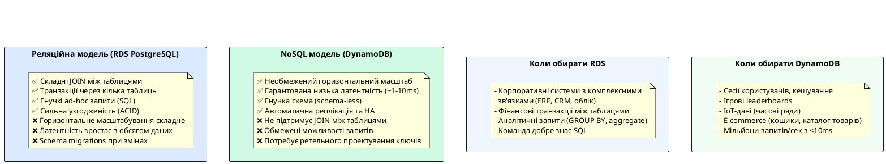

::

---

## Модель даних DynamoDB: таблиці, елементи та атрибути

### Таблиця (Table)

**Таблиця (Table)** є найвищим рівнем організації даних у DynamoDB. На перший погляд, таблиця DynamoDB схожа на таблицю реляційної бази даних — вона має назву та містить записи. Проте між ними існує принципова різниця у семантиці.

У реляційній моделі таблиця визначає **схему**: структуру кожного рядка з іменами стовпців та їхніми типами задають при CREATE TABLE, і всі рядки повинні відповідати цій схемі. DynamoDB, навпаки, є **schema-less** на рівні атрибутів: єдине, що таблиця DynamoDB вимагає від кожного елемента — наявність атрибутів, що складають первинний ключ. Решта атрибутів кожного елемента може бути абсолютно довільною та різною від елемента до елемента.

Таблиця DynamoDB є незалежним ресурсом — вона не "належить" схемі чи базі даних. Якщо в PostgreSQL ви маєте `database → schema → table`, то у DynamoDB ієрархія скорочується до `table`. Це означає, що таблиці DynamoDB не можуть бути об'єднані через JOIN навіть синтаксично — такого механізму не існує.

### Елемент (Item)

**Елемент (Item)** — це одиниця даних у таблиці DynamoDB, аналог рядка (row) у реляційній базі даних. Кожен елемент унікально ідентифікується своїм первинним ключем та є колекцією атрибутів. Максимальний розмір одного елемента — **400 KB** (разом з іменами атрибутів та значеннями).

Відсутність фіксованої схеми надає DynamoDB надзвичайну гнучкість при еволюції моделі даних. Уявіть таблицю `Products`, де різні категорії товарів мають різний набір атрибутів:

```json
// Елемент 1: Книга
{
    "ProductId": "book-001",
    "Category": "Book",
    "Title": "Clean Code",
    "Author": "Robert C. Martin",
    "ISBN": "978-0132350884",
    "Pages": 431,
    "Price": 35.00
}

// Елемент 2: Електроніка
{
    "ProductId": "elec-002",
    "Category": "Electronics",
    "Title": "Sony WH-1000XM5",
    "Brand": "Sony",
    "WarrantyYears": 2,
    "BatteryLifeHours": 30,
    "Price": 349.99
}
```

Обидва елементи належать одній таблиці, але мають абсолютно різні набори атрибутів. У PostgreSQL для цього знадобилося б або успадкування таблиць, або поле типу `JSONB`, або окремі таблиці для кожної категорії.

### Атрибут (Attribute) та система типів

**Атрибут (Attribute)** — це пара "ім'я–значення", що належить конкретному елементу. DynamoDB підтримує систему типів даних, яка суттєво відрізняється від SQL-типів:

::card-group

::card{title="Скалярні типи (Scalar)" icon="i-heroicons-tag"}

**String (S)** — рядок у кодуванні UTF-8. Порожній рядок (`""`) дозволений.

**Number (N)** — числове значення (ціле або дробове). Зберігається як рядок для збереження точності. Діапазон: до 38 значущих цифр.

**Binary (B)** — бінарні дані у форматі Base64. Використовується для зберігання зображень, стиснутих даних, криптографічних хешів.

**Boolean (BOOL)** — `true` або `false`.

**Null (NULL)** — відсутність значення. Атрибут типу Null займає місце, але не має значення.

::

::card{title="Документні типи (Document)" icon="i-heroicons-document"}

**Map (M)** — довільна структура вигляду "ключ–значення", аналог JSON-об'єкта. Значення кожного ключа може бути будь-яким типом DynamoDB, включаючи вкладені Map.

**List (L)** — впорядкована колекція значень довільних типів. Аналог JSON-масиву. Елементи списку можуть бути різних типів.

::

::card{title="Множинні типи (Set)" icon="i-heroicons-squares-2x2"}

**StringSet (SS)** — невпорядкована колекція унікальних рядків.

**NumberSet (NS)** — невпорядкована колекція унікальних чисел.

**BinarySet (BS)** — невпорядкована колекція унікальних бінарних значень.

_Важливо:_ Set не може бути порожнім. Всі елементи Set мають бути одного типу.

::

::

::plant-uml

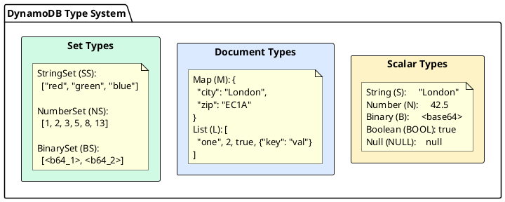

::

**Приклад елемента з вкладеними типами:**

```json
{
    "UserId": "usr-123",
    "Name": "Олена Петренко",
    "Email": "elena@example.com",
    "Age": 28,
    "IsActive": true,
    "Tags": ["developer", "aws-certified", "ukraine"],
    "Address": {
        "Country": "Ukraine",
        "City": "Kyiv",
        "ZipCode": "01001"
    },
    "Skills": ["C#", ".NET", "DynamoDB", "PostgreSQL"],
    "LastLoginAt": "2025-06-01T10:30:00Z"
}
```

У цьому прикладі:

- `UserId`, `Name`, `Email`, `LastLoginAt` — тип **String (S)**
- `Age` — тип **Number (N)**
- `IsActive` — тип **Boolean (BOOL)**
- `Tags` — тип **List (L)** зі String-елементами
- `Address` — тип **Map (M)** з вкладеними String-атрибутами
- `Skills` — тип **StringSet (SS)** (множина, не може містити дублікати)

---

## Первинний ключ (Primary Key): фундамент DynamoDB

Первинний ключ є найважливішим концептуальним елементом DynamoDB. На відміну від реляційних баз даних, де первинний ключ є лише засобом унікальної ідентифікації рядка, у DynamoDB первинний ключ виконує дві нерозривно пов'язані функції одночасно: **унікальну ідентифікацію** елемента та **визначення фізичного розташування** даних на серверах. Саме тому вибір первинного ключа є фундаментальним архітектурним рішенням, від якого залежить продуктивність системи при будь-якому масштабі.

DynamoDB підтримує два типи первинного ключа.

### Partition Key (Simple Primary Key)

**Partition Key** (також відомий як Hash Key або PK) — це простий первинний ключ, що складається з одного атрибута. DynamoDB використовує значення Partition Key як вхідні дані для детермінованої **хеш-функції**, результат якої визначає, на якому **фізичному сервері (partition)** зберігатиметься елемент.

#### Візуалізація Simple Primary Key

##### Приклад 1: Таблиця `Users` (Профілі користувачів)
У цій таблиці первинним ключем є `UserId` (тип `String`). Всі інші атрибути (`Name`, `Age`, `Email`) є довільними та необов'язковими для схеми:

| UserId (PK) <br><sub>тип: String (S)</sub> | Name <br><sub>тип: String (S)</sub> | Age <br><sub>тип: Number (N)</sub> | Email <br><sub>тип: String (S)</sub> |
| :--- | :--- | :--- | :--- |
| `usr-001` | Олена | 28 | elena@example.com |
| `usr-002` | Іван | 32 | ivan@example.com |
| `usr-003` | Марія | 22 | maria@example.com |

##### Приклад 2: Таблиця `Devices` (Метадані IoT-пристроїв)
У цьому сценарії первинним ключем є `DeviceId` (тип `String`), який ідентифікує конкретний фізичний пристрій. Кожен пристрій має свій набір налаштувань та метаданих:

| DeviceId (PK) <br><sub>тип: String (S)</sub> | DeviceType <br><sub>тип: String (S)</sub> | FirmwareVersion <br><sub>тип: String (S)</sub> | Status <br><sub>тип: String (S)</sub> | Metadata <br><sub>тип: Map (M)</sub> |
| :--- | :--- | :--- | :--- | :--- |
| `dev-sensor-091` | Temperature | `v2.4.1` | ACTIVE | `{"Location": "ServerRoom-A", "IntervalSec": 10}` |
| `dev-camera-104` | IP-Camera | `v1.0.8` | OFFLINE | `{"Location": "MainEntrance", "Resolution": "4K"}` |
| `dev-gate-002` | SmartGate | `v3.1.0` | ACTIVE | `{"Location": "GateEast"}` |

**Основні особливості роботи з простим ключем:**
* **Унікальність:** Кожен запис (елемент) у таблиці повинен мати унікальне значення `UserId`. Запис елемента з наявним `UserId` перезапише старий елемент.
* **Швидкий доступ:** Доступ до даних здійснюється виключно за точним значенням Partition Key (наприклад, `GetItem` за `UserId = "usr-001"`). DynamoDB обчислює хеш від ключа та миттєво знаходить потрібну партицію.
* **Обмеження вибірок:** Неможливо зробити запит (`Query`) на кшталт "показати всіх користувачів, які старші за 25 років". Подібна операція без додаткових індексів вимагає сканування всієї таблиці (`Scan`), що є дорогою операцією та створює велике навантаження.

Нижче показано, як DynamoDB розподіляє ці дані на фізичному рівні:

::plant-uml

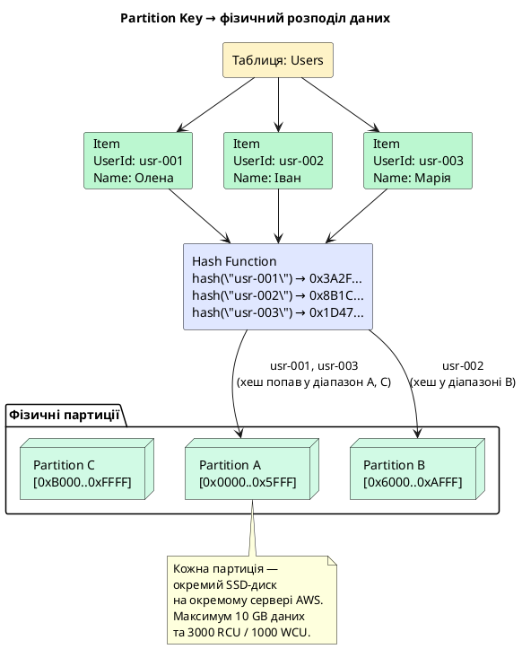

::

**Критична вимога до Partition Key: висока кардинальність.** Якщо всі або більшість елементів мають однакове значення Partition Key, всі вони потраплять на одну фізичну партицію. Ця ситуація називається **hot partition** (гаряча партиція) і є найчастішою причиною деградації продуктивності у DynamoDB. Детально розглянемо це у розділі Best Practices.

**Приклади хороших Partition Key:**

- `UserId` (UUID) — висока кардинальність, рівномірний розподіл
- `OrderId` (UUID або timestamp-based) — унікальний для кожного запису
- `DeviceId` (для IoT) — кожен пристрій має унікальний ідентифікатор

**Приклади поганих Partition Key:**

- `Country` — лише ~200 унікальних значень, більшість запитів сконцентровано на одній-двох країнах
- `Status` ("active", "inactive") — лише 2 значення, "active" буде hot partition
- `Date` (тільки дата без часу) — всі записи за один день на одній партиції

### Composite Primary Key: Partition Key + Sort Key

**Composite Primary Key** (або Range Key) складається з двох атрибутів: **Partition Key** та **Sort Key**. Ця комбінація надає DynamoDB принципово нові можливості для запитів. Partition Key визначає, на якій фізичній партиції зберігатиметься елемент, а Sort Key визначає **порядок зберігання** елементів _всередині_ однієї партиції.

Ключова відмінність від простого первинного ключа: при Composite Primary Key кілька елементів **можуть мати однакове значення Partition Key** — це цілком допустимо і є основним патерном проектування. Унікальність елемента визначається парою (Partition Key, Sort Key).

#### Візуалізація Composite Primary Key

##### Приклад 1: Таблиця `UserOrders` (Замовлення користувачів)
Тут `UserId` є Partition Key, а `OrderDate#OrderId` — Sort Key. Обидва атрибути мають тип `String`. Унікальність запису гарантується виключно комбінацією обох значень. Зверніть увагу, що замовлення для `usr-001` відсортовані хронологічно:

| UserId (PK) <br><sub>тип: String (S)</sub> | OrderDate#OrderId (SK) <br><sub>тип: String (S)</sub> | Amount <br><sub>тип: Number (N)</sub> | Status <br><sub>тип: String (S)</sub> |
| :--- | :--- | :--- | :--- |
| `usr-001` | `2025-01-15T10:00:00#ord-A` | 150.00 | DELIVERED |
| `usr-001` | `2025-03-20T14:30:00#ord-B` | 89.99 | SHIPPED |
| `usr-001` | `2025-06-01T09:15:00#ord-C` | 320.50 | PENDING |
| `usr-002` | `2025-02-10T08:00:00#ord-D` | 45.00 | DELIVERED |
| `usr-002` | `2025-05-05T16:45:00#ord-E` | 210.00 | DELIVERED |

##### Приклад 2: Таблиця `ChatMessages` (Повідомлення в чатах)
Тут `ConversationId` виступає як Partition Key, групуючи всі повідомлення конкретної розмови на одній партиції. `Timestamp#MessageId` виступає як Sort Key, забезпечуючи хронологічний порядок та унікальність повідомлень (оскільки кілька повідомлень можуть бути відправлені в одну секунду):

| ConversationId (PK) <br><sub>тип: String (S)</sub> | Timestamp#MessageId (SK) <br><sub>тип: String (S)</sub> | SenderId <br><sub>тип: String (S)</sub> | MessageText <br><sub>тип: String (S)</sub> |
| :--- | :--- | :--- | :--- |
| `room-402` | `2025-06-03T10:00:15Z#msg-001` | `usr-001` | Привіт всім! |
| `room-402` | `2025-06-03T10:00:45Z#msg-002` | `usr-002` | Привіт, Олено! Як справи? |
| `room-402` | `2025-06-03T10:01:10Z#msg-003` | `usr-001` | Все чудово, працюю над DynamoDB. |
| `room-511` | `2025-06-03T11:30:00Z#msg-004` | `usr-003` | Коли почнемо зустріч? |

##### Приклад 3: Таблиця `ProjectTasks` (Задачі проектів з ієрархічним SK)
У великих системах Composite PK використовується для організації зв'язків типу "один-до-багатьох" та ієрархій. Розглянемо таблицю проектних задач, де Partition Key — це `ProjectId`, а Sort Key — це `Priority#TaskId`. Такий SK дозволяє не просто ідентифікувати задачу, але й сортувати задачі за пріоритетом у межах проекту:

| ProjectId (PK) <br><sub>тип: String (S)</sub> | Priority#TaskId (SK) <br><sub>тип: String (S)</sub> | TaskTitle <br><sub>тип: String (S)</sub> | AssigneeId <br><sub>тип: String (S)</sub> | DueDate <br><sub>тип: String (S)</sub> |
| :--- | :--- | :--- | :--- | :--- |
| `proj-alpha` | `1-CRITICAL#task-102` | Налаштувати AWS Credentials | `usr-001` | `2025-06-05` |
| `proj-alpha` | `2-HIGH#task-105` | Створити схему DynamoDB | `usr-001` | `2025-06-08` |
| `proj-alpha` | `3-NORMAL#task-101` | Написати README.md | `usr-002` | `2025-06-12` |
| `proj-beta` | `1-CRITICAL#task-201` | Виправити баг з авторизацією | `usr-003` | `2025-06-04` |

**Основні особливості роботи з композитним ключем:**
* **Групування та сортування:** Записи з однаковим Partition Key (наприклад, `usr-001`) зберігаються на одній фізичній партиції та відсортовані за значенням Sort Key.
* **Ефективний діапазонний пошук:** Завдяки сортуванню ви можете використовувати операцію `Query` для вибірки всіх замовлень користувача `usr-001` за певний період (наприклад, за допомогою оператора `BETWEEN` для SK).
* **Складений Sort Key:** Використання патерну `Date#Id` або `Category#Status` у Sort Key дозволяє будувати гнучкі та складні умови для пошуку в межах однієї партиції.

Схема нижче демонструє, як це виглядає на фізичному та логічному рівнях:

::plant-uml

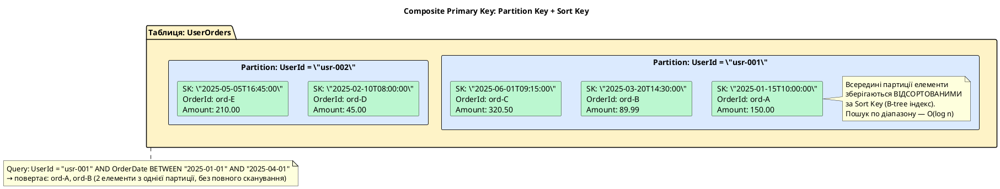

::

**Можливості запитів із Sort Key.** Наявність Sort Key відкриває можливість ефективних **Query**-операцій із умовою на значення Sort Key. DynamoDB підтримує такі оператори для Sort Key у межах однієї партиції:

| Оператор      | Значення               | Приклад                             |
| ------------- | ---------------------- | ----------------------------------- |
| `=`           | Точне значення         | `OrderDate = "2025-06-01T10:00:00"` |
| `<`, `<=`     | Менше або рівне        | `Score <= 100`                      |
| `>`, `>=`     | Більше або рівне       | `CreatedAt >= "2025-01-01"`         |
| `BETWEEN`     | Включний діапазон      | `Score BETWEEN 50 AND 100`          |
| `begins_with` | Починається з префіксу | `OrderId begins_with "2025-06"`     |

::note
**Важливо:** оператор `begins_with` та всі порівняльні оператори для Sort Key працюють тільки всередині однієї партиції. Неможливо знайти всі елементи з Sort Key, що "починається з X" **по всій таблиці** без сканування. Для таких запитів необхідні Global Secondary Index (розглянемо у наступному розділі).
::

**Паттерни проектування з Composite Primary Key.** Розуміння цього патерну є ключовим для ефективного використання DynamoDB. Partition Key групує пов'язані елементи в одну партицію, Sort Key впорядковує їх для ефективного пошуку:

::plant-uml

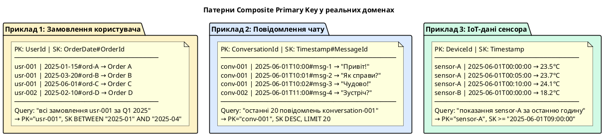

::

### Порівняльна таблиця первинних ключів

Для швидкого вибору типу первинного ключа скористайтеся порівняльною таблицею:

| Характеристика | Simple Primary Key (Partition Key) | Composite Primary Key (PK + Sort Key) |
| :--- | :--- | :--- |
| **Склад ключа** | Лише один атрибут: Partition Key (PK) | Два атрибути: Partition Key (PK) + Sort Key (SK) |
| **Унікальність** | Гарантується на рівні Partition Key | Гарантується комбінацією (Partition Key, Sort Key) |
| **Зберігання даних** | Кожен запис може мати свій унікальний PK | Кілька записів можуть мати однаковий PK (групуються разом) |
| **Сортування** | Дані не впорядковані | Дані відсортовані за значенням SK в межах одного PK |
| **Доступні запити** | Лише за точним значенням PK (`GetItem`) | За точним PK + фільтрація по SK (`Query`, `BETWEEN`, `begins_with`) |
| **Типові сценарії** | Таблиці сесій, кеш, конфігурації користувача | Історія замовлень, чат-повідомлення, логування IoT-пристроїв |

---

## Операції читання і запису: базовий API

Розуміння базових операцій DynamoDB є необхідною передумовою для обговорення продуктивності та проектування схем. DynamoDB надає чіткий поділ між операціями для **одного елемента** та операціями для **множини елементів**.

### Операції з одним елементом

**GetItem** — найшвидша операція в DynamoDB. Отримує рівно один елемент за його повним первинним ключем (Partition Key + Sort Key, якщо є). GetItem завжди звертається до конкретної партиції — жодного сканування, жодних індексів, гарантований час O(1).

::tabs
::tabs-item{label="AWS CLI (bash)"}
```bash
# Отримання сесії за композитним ключем
aws dynamodb get-item \
    --table-name UserSessions \
    --key '{"UserId": {"S": "usr-001"}, "SessionId": {"S": "sess-a1b2c3d4"}}' \
    --region eu-central-1
```
::
::tabs-item{label=".NET SDK (C#)"}
```csharp
var client = new AmazonDynamoDBClient();
var response = await client.GetItemAsync(new GetItemRequest
{
    TableName = "UserSessions",
    Key = new Dictionary<string, AttributeValue>
    {
        { "UserId", new AttributeValue { S = "usr-001" } },
        { "SessionId", new AttributeValue { S = "sess-a1b2c3d4" } }
    }
});
```
::
::tabs-item{label="PowerShell"}
```powershell
# Отримання сесії за композитним ключем
$key = @{
    UserId    = New-DDBEntry -S 'usr-001'
    SessionId = New-DDBEntry -S 'sess-a1b2c3d4'
}
Get-DDBItem -TableName UserSessions -Key $key -Region eu-central-1
```
::
::

**PutItem** — записує або повністю замінює елемент за вказаним первинним ключем. Якщо елемент із таким ключем вже існує — він буде повністю замінений. Підтримує умовні записи (Condition Expression).

::tabs
::tabs-item{label="AWS CLI (bash)"}
```bash
# Запис нової сесії (якщо вже існує — буде повністю перезаписано)
aws dynamodb put-item \
    --table-name UserSessions \
    --item '{
        "UserId":    {"S": "usr-001"},
        "SessionId": {"S": "sess-a1b2c3d4"},
        "CreatedAt": {"S": "2025-06-01T10:00:00Z"},
        "IsActive":  {"BOOL": true}
    }' \
    --region eu-central-1
```
::
::tabs-item{label=".NET SDK (C#)"}
```csharp
var response = await client.PutItemAsync(new PutItemRequest
{
    TableName = "UserSessions",
    Item = new Dictionary<string, AttributeValue>
    {
        { "UserId", new AttributeValue { S = "usr-001" } },
        { "SessionId", new AttributeValue { S = "sess-a1b2c3d4" } },
        { "CreatedAt", new AttributeValue { S = "2025-06-01T10:00:00Z" } },
        { "IsActive", new AttributeValue { BOOL = true } }
    }
});
```
::
::tabs-item{label="PowerShell"}
```powershell
# Запис нової сесії (або повний перезапис наявної)
$item = @{
    UserId    = New-DDBEntry -S 'usr-001'
    SessionId = New-DDBEntry -S 'sess-a1b2c3d4'
    CreatedAt = New-DDBEntry -S '2025-06-01T10:00:00Z'
    IsActive  = New-DDBEntry -BOOL $true
}
Set-DDBItem -TableName UserSessions -Item $item -Region eu-central-1
```
::
::

**UpdateItem** — оновлює конкретні атрибути існуючого елемента, не торкаючись інших. Є атомарним: або всі зміни застосовуються, або жодна. Підтримує атомарні лічильники (Atomic Counter).

::tabs
::tabs-item{label="AWS CLI (bash)"}
```bash
# Атомарне оновлення статусу та часу активності сесії
aws dynamodb update-item \
    --table-name UserSessions \
    --key '{"UserId": {"S": "usr-001"}, "SessionId": {"S": "sess-a1b2c3d4"}}' \
    --update-expression "SET IsActive = :false, LastActivity = :now" \
    --expression-attribute-values '{
        ":false": {"BOOL": false},
        ":now":   {"S": "2025-06-01T12:00:00Z"}
    }' \
    --region eu-central-1
```
::
::tabs-item{label=".NET SDK (C#)"}
```csharp
var response = await client.UpdateItemAsync(new UpdateItemRequest
{
    TableName = "UserSessions",
    Key = new Dictionary<string, AttributeValue>
    {
        { "UserId", new AttributeValue { S = "usr-001" } },
        { "SessionId", new AttributeValue { S = "sess-a1b2c3d4" } }
    },
    UpdateExpression = "SET IsActive = :false, LastActivity = :now",
    ExpressionAttributeValues = new Dictionary<string, AttributeValue>
    {
        { ":false", new AttributeValue { BOOL = false } },
        { ":now", new AttributeValue { S = "2025-06-01T12:00:00Z" } }
    }
});
```
::
::tabs-item{label="PowerShell"}
```powershell
# Атомарне оновлення статусу та часу активності
$updateRequest = [Amazon.DynamoDBv2.Model.UpdateItemRequest]@{
    TableName = 'UserSessions'
    Key = @{
        UserId    = New-DDBEntry -S 'usr-001'
        SessionId = New-DDBEntry -S 'sess-a1b2c3d4'
    }
    UpdateExpression = 'SET IsActive = :false, LastActivity = :now'
    ExpressionAttributeValues = @{
        ':false' = New-DDBEntry -BOOL $false
        ':now'   = New-DDBEntry -S '2025-06-01T12:00:00Z'
    }
}
Update-DDBItem -UpdateItemRequest $updateRequest -Region eu-central-1
```
::
::

**DeleteItem** — видаляє елемент за первинним ключем. Підтримує умовне видалення.

::tabs
::tabs-item{label="AWS CLI (bash)"}
```bash
# Видалення сесії за її первинним ключем
aws dynamodb delete-item \
    --table-name UserSessions \
    --key '{"UserId": {"S": "usr-001"}, "SessionId": {"S": "sess-a1b2c3d4"}}' \
    --region eu-central-1
```
::
::tabs-item{label=".NET SDK (C#)"}
```csharp
var response = await client.DeleteItemAsync(new DeleteItemRequest
{
    TableName = "UserSessions",
    Key = new Dictionary<string, AttributeValue>
    {
        { "UserId", new AttributeValue { S = "usr-001" } },
        { "SessionId", new AttributeValue { S = "sess-a1b2c3d4" } }
    }
});
```
::
::tabs-item{label="PowerShell"}
```powershell
# Видалення сесії за первинним ключем
$key = @{
    UserId    = New-DDBEntry -S 'usr-001'
    SessionId = New-DDBEntry -S 'sess-a1b2c3d4'
}
Remove-DDBItem -TableName UserSessions -Key $key -Region eu-central-1
```
::
::

### Операції з множиною елементів

**Query** — отримує один або кілька елементів, що відповідають заданому Partition Key та (необов'язково) умові на Sort Key. Query виконується **виключно всередині однієї партиції** — це забезпечує ефективність. Query — це основна операція запиту у правильно спроектованій таблиці DynamoDB.

::tabs
::tabs-item{label="AWS CLI (bash)"}
```bash
# Пошук сесій користувача, які починаються з певного префіксу
aws dynamodb query \
    --table-name UserSessions \
    --key-condition-expression "UserId = :uid AND SessionId begins_with(:sessPrefix)" \
    --expression-attribute-values '{
        ":uid":        {"S": "usr-001"},
        ":sessPrefix": {"S": "sess-a"}
    }' \
    --region eu-central-1
```
::
::tabs-item{label=".NET SDK (C#)"}
```csharp
var response = await client.QueryAsync(new QueryRequest
{
    TableName = "UserSessions",
    KeyConditionExpression = "UserId = :uid AND SessionId begins_with(:sessPrefix)",
    ExpressionAttributeValues = new Dictionary<string, AttributeValue>
    {
        { ":uid", new AttributeValue { S = "usr-001" } },
        { ":sessPrefix", new AttributeValue { S = "sess-a" } }
    }
});
```
::
::tabs-item{label="PowerShell"}
```powershell
# Пошук сесій за Partition Key та префіксом Sort Key
$queryRequest = [Amazon.DynamoDBv2.Model.QueryRequest]@{
    TableName = 'UserSessions'
    KeyConditionExpression = 'UserId = :uid AND SessionId begins_with(:sessPrefix)'
    ExpressionAttributeValues = @{
        ':uid'        = New-DDBEntry -S 'usr-001'
        ':sessPrefix' = New-DDBEntry -S 'sess-a'
    }
}
Invoke-DDBQuery -QueryRequest $queryRequest -Region eu-central-1
```
::
::

**Scan** — проходить по **всіх** елементах таблиці або індексу. Scan є дорогою операцією: він читає кожен елемент, споживає одиниці пропускної здатності для кожного прочитаного елемента, навіть якщо результат фільтрується. Scan використовується виключно для адміністративних задач або однократного аналізу даних.

::tabs
::tabs-item{label="AWS CLI (bash)"}
```bash
# Сканування всієї таблиці для пошуку активних сесій (неефективно!)
aws dynamodb scan \
    --table-name UserSessions \
    --filter-expression "IsActive = :true" \
    --expression-attribute-values '{":true": {"BOOL": true}}' \
    --region eu-central-1
```
::
::tabs-item{label=".NET SDK (C#)"}
```csharp
var response = await client.ScanAsync(new ScanRequest
{
    TableName = "UserSessions",
    FilterExpression = "IsActive = :true",
    ExpressionAttributeValues = new Dictionary<string, AttributeValue>
    {
        { ":true", new AttributeValue { BOOL = true } }
    }
});
```
::
::tabs-item{label="PowerShell"}
```powershell
# Сканування всієї таблиці з фільтрацією
$scanRequest = [Amazon.DynamoDBv2.Model.ScanRequest]@{
    TableName = 'UserSessions'
    FilterExpression = 'IsActive = :true'
    ExpressionAttributeValues = @{
        ':true' = New-DDBEntry -BOOL $true
    }
}
Invoke-DDBScan -ScanRequest $scanRequest -Region eu-central-1
```
::
::

::plant-uml

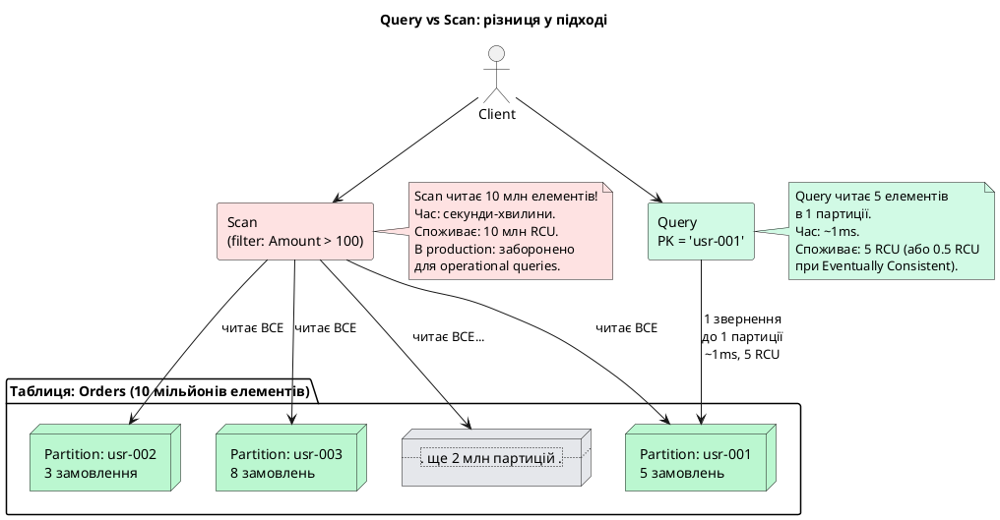

::

::tip
**Правило DynamoDB-архітектора:** якщо ваш застосунок виконує Scan для операційних запитів (тих, що відбуваються у real-time під час роботи користувача) — таблиця спроектована неправильно. Scan є прийнятним лише для одноразових адміністративних операцій (наприклад, міграція даних) або аналітики поза виробничим контуром.
::

### Batch-операції та транзакції

**BatchGetItem** — дозволяє отримати до 100 елементів з однієї або кількох таблиць за один API-виклик. Внутрішньо DynamoDB паралелізує читання, тому час виконання близький до часу читання одного елемента.

::tabs
::tabs-item{label="AWS CLI (bash)"}
```bash
# Пакетне отримання кількох сесій за один запит
aws dynamodb batch-get-item \
    --request-items '{
        "UserSessions": {
            "Keys": [
                {"UserId": {"S": "usr-001"}, "SessionId": {"S": "sess-a1b2"}},
                {"UserId": {"S": "usr-002"}, "SessionId": {"S": "sess-c3d4"}}
            ]
        }
    }' \
    --region eu-central-1
```
::
::tabs-item{label=".NET SDK (C#)"}
```csharp
var response = await client.BatchGetItemAsync(new BatchGetItemRequest
{
    RequestItems = new Dictionary<string, KeysAndAttributes>
    {
        {
            "UserSessions", new KeysAndAttributes
            {
                Keys = new List<Dictionary<string, AttributeValue>>
                {
                    new Dictionary<string, AttributeValue>
                    {
                        { "UserId", new AttributeValue { S = "usr-001" } },
                        { "SessionId", new AttributeValue { S = "sess-a1b2" } }
                    },
                    new Dictionary<string, AttributeValue>
                    {
                        { "UserId", new AttributeValue { S = "usr-002" } },
                        { "SessionId", new AttributeValue { S = "sess-c3d4" } }
                    }
                }
            }
        }
    }
});
```
::
::tabs-item{label="PowerShell"}
```powershell
# Пакетне отримання кількох елементів за один запит
$requestItems = @{
    'UserSessions' = [Amazon.DynamoDBv2.Model.KeysAndAttributes]@{
        Keys = @(
            @{ UserId = New-DDBEntry -S 'usr-001'; SessionId = New-DDBEntry -S 'sess-a1b2' },
            @{ UserId = New-DDBEntry -S 'usr-002'; SessionId = New-DDBEntry -S 'sess-c3d4' }
        )
    }
}
Get-DDBItemBatch -RequestItems $requestItems -Region eu-central-1
```
::
::

**BatchWriteItem** — дозволяє записати або видалити до 25 елементів за один виклик. Операції у BatchWriteItem **не є атомарними** — можливий частковий успіх (деякі елементи записані, деякі — ні). Елементи, що не вдалося обробити, повертаються у полі `UnprocessedItems`.

::tabs
::tabs-item{label="AWS CLI (bash)"}
```bash
# Пакетний запис та видалення сесій (до 25 операцій)
aws dynamodb batch-write-item \
    --request-items '{
        "UserSessions": [
            {
                "PutRequest": {
                    "Item": {
                        "UserId": {"S": "usr-001"},
                        "SessionId": {"S": "sess-e5f6"},
                        "IsActive": {"BOOL": true}
                    }
                }
            },
            {
                "DeleteRequest": {
                    "Key": {
                        "UserId": {"S": "usr-002"},
                        "SessionId": {"S": "sess-old"}
                    }
                }
            }
        ]
    }' \
    --region eu-central-1
```
::
::tabs-item{label=".NET SDK (C#)"}
```csharp
var response = await client.BatchWriteItemAsync(new BatchWriteItemRequest
{
    RequestItems = new Dictionary<string, List<WriteRequest>>
    {
        {
            "UserSessions", new List<WriteRequest>
            {
                new WriteRequest
                {
                    PutRequest = new PutRequest
                    {
                        Item = new Dictionary<string, AttributeValue>
                        {
                            { "UserId", new AttributeValue { S = "usr-001" } },
                            { "SessionId", new AttributeValue { S = "sess-e5f6" } },
                            { "IsActive", new AttributeValue { BOOL = true } }
                        }
                    }
                },
                new WriteRequest
                {
                    DeleteRequest = new DeleteRequest
                    {
                        Key = new Dictionary<string, AttributeValue>
                        {
                            { "UserId", new AttributeValue { S = "usr-002" } },
                            { "SessionId", new AttributeValue { S = "sess-old" } }
                        }
                    }
                }
            }
        }
    }
});
```
::
::tabs-item{label="PowerShell"}
```powershell
# Пакетний запис та видалення кількох елементів
$writeRequests = @(
    [Amazon.DynamoDBv2.Model.WriteRequest]@{
        PutRequest = @{
            Item = @{
                UserId    = New-DDBEntry -S 'usr-001'
                SessionId = New-DDBEntry -S 'sess-e5f6'
                IsActive  = New-DDBEntry -BOOL $true
            }
        }
    },
    [Amazon.DynamoDBv2.Model.WriteRequest]@{
        DeleteRequest = @{
            Key = @{
                UserId    = New-DDBEntry -S 'usr-002'
                SessionId = New-DDBEntry -S 'sess-old'
            }
        }
    }
)
$requestItems = @{ 'UserSessions' = $writeRequests }
Write-DDBItemBatch -RequestItems $requestItems -Region eu-central-1
```
::
::

**TransactWriteItems / TransactGetItems** — атомарні транзакції через кілька елементів і таблиць (детально розглянемо у відповідному розділі).

::tabs
::tabs-item{label="AWS CLI (bash)"}
```bash
# Атомарна транзакція: запис нової сесії та збільшення лічильника сесій користувача
aws dynamodb transact-write-items \
    --transact-items '[
        {
            "Put": {
                "TableName": "UserSessions",
                "Item": {
                    "UserId":    {"S": "usr-001"},
                    "SessionId": {"S": "sess-new"},
                    "IsActive":  {"BOOL": true}
                }
            }
        },
        {
            "Update": {
                "TableName": "Users",
                "Key": {"UserId": {"S": "usr-001"}},
                "UpdateExpression": "ADD ActiveSessionsCount :one",
                "ExpressionAttributeValues": {":one": {"N": "1"}}
            }
        }
    ]' \
    --region eu-central-1
```
::
::tabs-item{label=".NET SDK (C#)"}
```csharp
var response = await client.TransactWriteItemsAsync(new TransactWriteItemsRequest
{
    TransactItems = new List<TransactWriteItem>
    {
        new TransactWriteItem
        {
            Put = new Put
            {
                TableName = "UserSessions",
                Item = new Dictionary<string, AttributeValue>
                {
                    { "UserId", new AttributeValue { S = "usr-001" } },
                    { "SessionId", new AttributeValue { S = "sess-new" } },
                    { "IsActive", new AttributeValue { BOOL = true } }
                }
            }
        },
        new TransactWriteItem
        {
            Update = new Update
            {
                TableName = "Users",
                Key = new Dictionary<string, AttributeValue>
                {
                    { "UserId", new AttributeValue { S = "usr-001" } }
                },
                UpdateExpression = "ADD ActiveSessionsCount :one",
                ExpressionAttributeValues = new Dictionary<string, AttributeValue>
                {
                    { ":one", new AttributeValue { N = "1" } }
                }
            }
        }
    }
});
```
::
::tabs-item{label="PowerShell"}
```powershell
# Атомарна транзакція з кількох операцій запису/оновлення
$transactItems = @(
    [Amazon.DynamoDBv2.Model.TransactWriteItem]@{
        Put = @{
            TableName = 'UserSessions'
            Item = @{
                UserId    = New-DDBEntry -S 'usr-001'
                SessionId = New-DDBEntry -S 'sess-new'
                IsActive  = New-DDBEntry -BOOL $true
            }
        }
    },
    [Amazon.DynamoDBv2.Model.TransactWriteItem]@{
        Update = @{
            TableName = 'Users'
            Key = @{ UserId = New-DDBEntry -S 'usr-001' }
            UpdateExpression = 'ADD ActiveSessionsCount :one'
            ExpressionAttributeValues = @{ ':one' = New-DDBEntry -N '1' }
        }
    }
)
Submit-DDBTransactWriteItems -TransactItem $transactItems -Region eu-central-1
```
::
::

---

## Створення таблиці DynamoDB: консоль та AWS CLI

### Консоль AWS Management Console

Найпростіший спосіб ознайомитися з DynamoDB — створити таблицю через web-консоль. Перейдіть до сервісу **DynamoDB** → **Tables** → **Create table**.

**Кроки створення таблиці `UserSessions`:**

1. **Table name:** `UserSessions`
2. **Partition key:** `UserId` (тип String)
3. **Sort key:** `SessionId` (тип String) _(необов'язково, але рекомендовано)_
4. **Table settings:** для початку — **Default settings** (On-Demand capacity mode)
5. **Create table**

::plant-uml

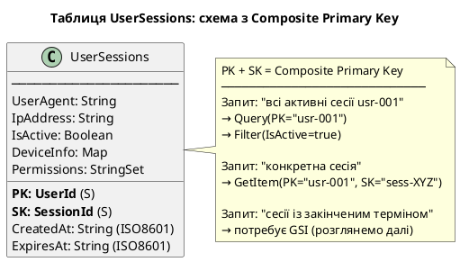

::

### Створення через AWS CLI та PowerShell

AWS CLI надає повний контроль над параметрами таблиці та є основою для автоматизації та Infrastructure-as-Code:

::tabs

::tabs-item{label="AWS CLI (bash)"}

```bash
# Створення таблиці UserSessions з Composite Primary Key
aws dynamodb create-table \
    --table-name UserSessions \
    --attribute-definitions \
        AttributeName=UserId,AttributeType=S \
        AttributeName=SessionId,AttributeType=S \
    --key-schema \
        AttributeName=UserId,KeyType=HASH \
        AttributeName=SessionId,KeyType=RANGE \
    --billing-mode PAY_PER_REQUEST \
    --region eu-central-1
```

::

::tabs-item{label=".NET SDK (C#)"}

```csharp
var client = new AmazonDynamoDBClient();
var response = await client.CreateTableAsync(new CreateTableRequest
{
    TableName = "UserSessions",
    AttributeDefinitions = new List<AttributeDefinition>
    {
        new AttributeDefinition { AttributeName = "UserId", AttributeType = ScalarAttributeType.S },
        new AttributeDefinition { AttributeName = "SessionId", AttributeType = ScalarAttributeType.S }
    },
    KeySchema = new List<KeySchemaElement>
    {
        new KeySchemaElement { AttributeName = "UserId", KeyType = KeyType.HASH },
        new KeySchemaElement { AttributeName = "SessionId", KeyType = KeyType.RANGE }
    },
    BillingMode = BillingMode.PAY_PER_REQUEST
});
```

::

::tabs-item{label="PowerShell"}

```powershell
# Встановити AWS Tools for PowerShell (якщо ще не встановлено)
# Install-Module -Name AWS.Tools.DynamoDBv2 -Force

# Створення таблиці UserSessions з Composite Primary Key
$attrUserId    = New-DDBAttributeDefinition -AttributeName UserId    -AttributeType S
$attrSessionId = New-DDBAttributeDefinition -AttributeName SessionId -AttributeType S

$keyUserId    = New-DDBKeySchemaElement -AttributeName UserId    -KeyType HASH
$keySessionId = New-DDBKeySchemaElement -AttributeName SessionId -KeyType RANGE

New-DDBTable `
    -TableName   UserSessions `
    -AttributeDefinition @($attrUserId, $attrSessionId) `
    -KeySchema   @($keyUserId, $keySessionId) `
    -BillingMode PAY_PER_REQUEST `
    -Region      eu-central-1
```

::

::

::terminal-preview{title="Створення таблиці UserSessions"}

<div class="line"><span class="opacity-40">$</span> <strong>aws dynamodb create-table --table-name UserSessions ...</strong></div>
<div class="line">{</div>
<div class="line">    <span class="text-blue-400">"TableDescription"</span>: {</div>
<div class="line">        <span class="text-blue-400">"TableName"</span>: <span class="text-green-400">"UserSessions"</span>,</div>
<div class="line">        <span class="text-blue-400">"TableStatus"</span>: <span class="text-yellow-400">"CREATING"</span>,</div>
<div class="line">        <span class="text-blue-400">"TableArn"</span>: <span class="text-green-400">"arn:aws:dynamodb:eu-central-1:123456789012:table/UserSessions"</span>,</div>
<div class="line">        <span class="text-blue-400">"KeySchema"</span>: [</div>
<div class="line">            { <span class="text-blue-400">"AttributeName"</span>: <span class="text-green-400">"UserId"</span>, <span class="text-blue-400">"KeyType"</span>: <span class="text-green-400">"HASH"</span> },</div>
<div class="line">            { <span class="text-blue-400">"AttributeName"</span>: <span class="text-green-400">"SessionId"</span>, <span class="text-blue-400">"KeyType"</span>: <span class="text-green-400">"RANGE"</span> }</div>
<div class="line">        ],</div>
<div class="line">        <span class="text-blue-400">"BillingModeSummary"</span>: {</div>
<div class="line">            <span class="text-blue-400">"BillingMode"</span>: <span class="text-green-400">"PAY_PER_REQUEST"</span></div>
<div class="line">        }</div>
<div class="line">    }</div>
<div class="line">}</div>

::

::tabs

::tabs-item{label="AWS CLI (bash)"}

```bash
# Дочекатися поки таблиця перейде у стан ACTIVE
aws dynamodb wait table-exists \
    --table-name UserSessions \
    --region eu-central-1

echo "Таблиця UserSessions готова"

# Перевірити статус таблиці
aws dynamodb describe-table \
    --table-name UserSessions \
    --region eu-central-1 \
    --query "Table.{Status: TableStatus, ItemCount: ItemCount, SizeBytes: TableSizeBytes}"
```

::

::tabs-item{label=".NET SDK (C#)"}

```csharp
var client = new AmazonDynamoDBClient();
while (true)
{
    var res = await client.DescribeTableAsync("UserSessions");
    if (res.Table.TableStatus == TableStatus.ACTIVE)
    {
        Console.WriteLine("Таблиця UserSessions готова");
        Console.WriteLine($"Status: {res.Table.TableStatus}, Items: {res.Table.ItemCount}, Size: {res.Table.TableSizeBytes} bytes");
        break;
    }
    await Task.Delay(5000);
}
```

::

::tabs-item{label="PowerShell"}

```powershell
# Дочекатися стану ACTIVE (з timeout 5 хвилин)
$timeout = [DateTime]::UtcNow.AddMinutes(5)
do {
    $table = Get-DDBTable -TableName UserSessions -Region eu-central-1
    if ($table.TableStatus -eq 'ACTIVE') { break }
    Write-Host "Статус: $($table.TableStatus) — очікуємо..."
    Start-Sleep -Seconds 5
} until ([DateTime]::UtcNow -ge $timeout)

Write-Host "Таблиця UserSessions готова"

# Перевірити статус таблиці
$t = Get-DDBTable -TableName UserSessions -Region eu-central-1
[PSCustomObject]@{
    Status    = $t.TableStatus
    ItemCount = $t.ItemCount
    SizeBytes = $t.TableSizeBytes
}
```

::

::

::terminal-preview{title="Статус таблиці після створення"}

<div class="line"><span class="opacity-40">$</span> <strong>aws dynamodb describe-table --table-name UserSessions ...</strong></div>
<div class="line">{</div>
<div class="line">    <span class="text-blue-400">"Status"</span>: <span class="text-green-400">"ACTIVE"</span>,</div>
<div class="line">    <span class="text-blue-400">"ItemCount"</span>: <span class="text-yellow-400">0</span>,</div>
<div class="line">    <span class="text-blue-400">"SizeBytes"</span>: <span class="text-yellow-400">0</span></div>
<div class="line">}</div>

::

### CRUD-операції

::tabs

::tabs-item{label="AWS CLI (bash)"}

```bash
# ── PutItem: записати новий елемент ───────────────────────────────────────
aws dynamodb put-item \
    --table-name UserSessions \
    --item '{
        "UserId":    {"S": "usr-001"},
        "SessionId": {"S": "sess-a1b2c3d4"},
        "CreatedAt": {"S": "2025-06-01T10:00:00Z"},
        "ExpiresAt": {"S": "2025-06-01T22:00:00Z"},
        "IpAddress": {"S": "203.0.113.42"},
        "UserAgent": {"S": "Mozilla/5.0 (Windows NT 10.0; Win64; x64)"},
        "IsActive":  {"BOOL": true}
    }' \
    --region eu-central-1

# ── GetItem: отримати один елемент ────────────────────────────────────────
aws dynamodb get-item \
    --table-name UserSessions \
    --key '{"UserId": {"S": "usr-001"}, "SessionId": {"S": "sess-a1b2c3d4"}}' \
    --region eu-central-1

# ── Query: знайти всі сесії користувача ──────────────────────────────────
aws dynamodb query \
    --table-name UserSessions \
    --key-condition-expression "UserId = :uid" \
    --expression-attribute-values '{":uid": {"S": "usr-001"}}' \
    --region eu-central-1

# ── UpdateItem: деактивувати сесію ────────────────────────────────────────
aws dynamodb update-item \
    --table-name UserSessions \
    --key '{"UserId": {"S": "usr-001"}, "SessionId": {"S": "sess-a1b2c3d4"}}' \
    --update-expression "SET IsActive = :false" \
    --expression-attribute-values '{":false": {"BOOL": false}}' \
    --region eu-central-1

# ── DeleteItem: видалити сесію ───────────────────────────────────────────
aws dynamodb delete-item \
    --table-name UserSessions \
    --key '{"UserId": {"S": "usr-001"}, "SessionId": {"S": "sess-a1b2c3d4"}}' \
    --region eu-central-1
```

::

::tabs-item{label=".NET SDK (C#)"}

```csharp
var client = new AmazonDynamoDBClient();

// ── PutItem: записати новий елемент ───────────────────────────────────────
await client.PutItemAsync(new PutItemRequest
{
    TableName = "UserSessions",
    Item = new Dictionary<string, AttributeValue>
    {
        { "UserId", new AttributeValue { S = "usr-001" } },
        { "SessionId", new AttributeValue { S = "sess-a1b2c3d4" } },
        { "CreatedAt", new AttributeValue { S = "2025-06-01T10:00:00Z" } },
        { "ExpiresAt", new AttributeValue { S = "2025-06-01T22:00:00Z" } },
        { "IpAddress", new AttributeValue { S = "203.0.113.42" } },
        { "UserAgent", new AttributeValue { S = "Mozilla/5.0 (Windows NT 10.0; Win64; x64)" } },
        { "IsActive", new AttributeValue { BOOL = true } }
    }
});

// ── GetItem: отримати один елемент ────────────────────────────────────────
var getResponse = await client.GetItemAsync(new GetItemRequest
{
    TableName = "UserSessions",
    Key = new Dictionary<string, AttributeValue>
    {
        { "UserId", new AttributeValue { S = "usr-001" } },
        { "SessionId", new AttributeValue { S = "sess-a1b2c3d4" } }
    }
});

// ── Query: знайти всі сесії користувача ──────────────────────────────────
var queryResponse = await client.QueryAsync(new QueryRequest
{
    TableName = "UserSessions",
    KeyConditionExpression = "UserId = :uid",
    ExpressionAttributeValues = new Dictionary<string, AttributeValue>
    {
        { ":uid", new AttributeValue { S = "usr-001" } }
    }
});

// ── UpdateItem: деактивувати сесію ────────────────────────────────────────
await client.UpdateItemAsync(new UpdateItemRequest
{
    TableName = "UserSessions",
    Key = new Dictionary<string, AttributeValue>
    {
        { "UserId", new AttributeValue { S = "usr-001" } },
        { "SessionId", new AttributeValue { S = "sess-a1b2c3d4" } }
    },
    UpdateExpression = "SET IsActive = :false",
    ExpressionAttributeValues = new Dictionary<string, AttributeValue>
    {
        { ":false", new AttributeValue { BOOL = false } }
    }
});

// ── DeleteItem: видалити сесію ───────────────────────────────────────────
await client.DeleteItemAsync(new DeleteItemRequest
{
    TableName = "UserSessions",
    Key = new Dictionary<string, AttributeValue>
    {
        { "UserId", new AttributeValue { S = "usr-001" } },
        { "SessionId", new AttributeValue { S = "sess-a1b2c3d4" } }
    }
});
```

::

::tabs-item{label="PowerShell"}

```powershell
Import-Module AWS.Tools.DynamoDBv2

# ── PutItem: записати новий елемент ───────────────────────────────────────
$item = @{
    UserId    = New-DDBEntry -S 'usr-001'
    SessionId = New-DDBEntry -S 'sess-a1b2c3d4'
    CreatedAt = New-DDBEntry -S '2025-06-01T10:00:00Z'
    ExpiresAt = New-DDBEntry -S '2025-06-01T22:00:00Z'
    IpAddress = New-DDBEntry -S '203.0.113.42'
    UserAgent = New-DDBEntry -S 'Mozilla/5.0 (Windows NT 10.0; Win64; x64)'
    IsActive  = New-DDBEntry -BOOL $true
}
Set-DDBItem -TableName UserSessions -Item $item -Region eu-central-1

# ── GetItem: отримати один елемент ────────────────────────────────────────
$key = @{
    UserId    = New-DDBEntry -S 'usr-001'
    SessionId = New-DDBEntry -S 'sess-a1b2c3d4'
}
Get-DDBItem -TableName UserSessions -Key $key -Region eu-central-1

# ── Query: знайти всі сесії користувача ──────────────────────────────────
$queryRequest = [Amazon.DynamoDBv2.Model.QueryRequest]@{
    TableName                 = 'UserSessions'
    KeyConditionExpression    = 'UserId = :uid'
    ExpressionAttributeValues = @{
        ':uid' = New-DDBEntry -S 'usr-001'
    }
}
Invoke-DDBQuery -QueryRequest $queryRequest -Region eu-central-1

# ── UpdateItem: деактивувати сесію ────────────────────────────────────────
$updateRequest = [Amazon.DynamoDBv2.Model.UpdateItemRequest]@{
    TableName        = 'UserSessions'
    Key              = @{
        UserId    = New-DDBEntry -S 'usr-001'
        SessionId = New-DDBEntry -S 'sess-a1b2c3d4'
    }
    UpdateExpression = 'SET IsActive = :false'
    ExpressionAttributeValues = @{
        ':false' = New-DDBEntry -BOOL $false
    }
}
Update-DDBItem -UpdateItemRequest $updateRequest -Region eu-central-1

# ── DeleteItem: видалити сесію ───────────────────────────────────────────
$delKey = @{
    UserId    = New-DDBEntry -S 'usr-001'
    SessionId = New-DDBEntry -S 'sess-a1b2c3d4'
}
Remove-DDBItem -TableName UserSessions -Key $delKey -Region eu-central-1
```

::

::

::terminal-preview{title="Query: всі сесії користувача usr-001"}

<div class="line"><span class="opacity-40">$</span> <strong>aws dynamodb query --table-name UserSessions --key-condition-expression "UserId = :uid" ...</strong></div>
<div class="line">{</div>
<div class="line">    <span class="text-blue-400">"Items"</span>: [</div>
<div class="line">        {</div>
<div class="line">            <span class="text-blue-400">"UserId"</span>:    { <span class="text-blue-400">"S"</span>: <span class="text-green-400">"usr-001"</span> },</div>
<div class="line">            <span class="text-blue-400">"SessionId"</span>: { <span class="text-blue-400">"S"</span>: <span class="text-green-400">"sess-a1b2c3d4"</span> },</div>
<div class="line">            <span class="text-blue-400">"IsActive"</span>:  { <span class="text-blue-400">"BOOL"</span>: <span class="text-yellow-400">true</span> },</div>
<div class="line">            <span class="text-blue-400">"CreatedAt"</span>: { <span class="text-blue-400">"S"</span>: <span class="text-green-400">"2025-06-01T10:00:00Z"</span> }</div>
<div class="line">        }</div>
<div class="line">    ],</div>
<div class="line">    <span class="text-blue-400">"Count"</span>: <span class="text-yellow-400">1</span>,</div>
<div class="line">    <span class="text-blue-400">"ScannedCount"</span>: <span class="text-yellow-400">1</span></div>
<div class="line">}</div>

::

---

## Одиниці пропускної здатності: RCU та WCU

Для розробки ефективних архітектур на базі Amazon DynamoDB та прогнозування витрат критично важливо розуміти її внутрішню модель тарифікації та розподілу ресурсів. На відміну від традиційних реляційних СУБД, де продуктивність лімітується апаратними характеристиками сервера (кількістю ядер CPU, обсягом RAM та IOPS накопичувачів), DynamoDB абстрагує фізичні ресурси за допомогою **одиниць пропускної здатності (Capacity Units)**. 

Цей підхід дозволяє гарантувати передбачувану пропускну здатність незалежно від загального обсягу даних у таблиці. Вся ємність вимірюється двома метриками: **Read Capacity Units (RCU)** для операцій читання та **Write Capacity Units (WCU)** для операцій запису.

---

### Read Capacity Units (RCU)

**1 RCU (Read Capacity Unit)** визначається як потужність системи, необхідна для виконання:
*   **1 Strongly Consistent Read** (сильно узгодженого читання) одного елемента розміром до **4 KB** за секунду.
*   **2 Eventually Consistent Reads** (кінцево узгоджених читань) елементів розміром до **4 KB** за секунду.
*   **0.5 Transactional Read** (транзакційного читання) одного елемента розміром до **4 KB** за секунду (тобто для транзакційного читання 1 елемента до 4 KB потрібно **2 RCU**).

#### Моделі узгодженості читання (Read Consistency Models)

1.  **Eventually Consistent Reads (Кінцева узгодженість):**
    При записі даних DynamoDB асинхронно реплікує зміни на три географічно розподілені вузли зберігання (storage nodes) в межах однієї Availability Zone. Eventually Consistent читання повертає результат з будь-якої випадкової репліки. Існує мінімальна ймовірність (зазвичай < 1 секунди), що запит поверне застарілі дані, якщо реплікація ще не завершилась. Цей режим споживає вдвічі менше ресурсів — **0.5 RCU** за кожні 4 KB.
2.  **Strongly Consistent Reads (Сильна узгодженість):**
    Запит направляється до реплік та очікує підтвердження від більшості вузлів (quorum), гарантуючи повернення найактуальнішого стану даних. Цей режим є дорожчим та споживає **1 RCU** за кожні 4 KB.
3.  **Transactional Reads (Транзакційне читання):**
    Використовується в межах ACID-транзакцій через API `TransactGetItems`. Забезпечує ізольовано та атомарно читання групи елементів. Споживає **2 RCU** за кожні 4 KB.

#### Математичне округлення розміру елементів
При обчисленні RCU розмір кожного зчитуваного елемента спочатку округляється в більшу сторону до найближчого кратного **4 KB**. Наприклад:
*   Елемент розміром **2.5 KB** округляється до **4 KB** (1 блок).
*   Елемент розміром **5.0 KB** округляється до **8 KB** (2 блоки).

#### Формула розрахунку RCU

Математична модель розрахунку необхідної кількості RCU виглядає наступним чином:

::math-formula
\text{RCU} = \left\lceil \frac{\text{Розмір елемента (KB)}}{4\text{ KB}} \right\rceil \times \text{Кількість операцій/сек} \times \text{Коефіцієнт узгодженості}
::

Де **Коефіцієнт узгодженості** дорівнює:
*   **0.5** — для Eventually Consistent читання.
*   **1.0** — для Strongly Consistent читання.
*   **2.0** — для Transactional читання (`TransactGetItems`).

#### Покрокові приклади розрахунку RCU

*   **Приклад 1: Масове читання профілів користувачів**
    *   *Умова:* Потрібно забезпечити 150 Eventually Consistent читань на секунду. Розмір одного профілю (елемента) становить 3.5 KB.
    *   *Крок 1 (Округлення розміру):* ⌈3.5 KB / 4 KB⌉ = 1 блок.
    *   *Крок 2 (Розрахунок за формулою):* 1 × 150 × 0.5 = 75 RCU.
*   **Приклад 2: Читання фінансових транзакцій з високою узгодженістю**
    *   *Умова:* Необхідно виконувати 80 Strongly Consistent читань на секунду. Розмір елемента транзакції — 9.2 KB.
    *   *Крок 1 (Округлення розміру):* ⌈9.2 KB / 4 KB⌉ = ⌈2.3 блоки⌉ = 3 блоки.
    *   *Крок 2 (Розрахунок за формулою):* 3 × 80 × 1.0 = 240 RCU.
*   **Приклад 3: Транзакційна перевірка балансу**
    *   *Умова:* Потрібно зчитувати 50 балансів на секунду через `TransactGetItems`. Розмір запису балансу — 1.5 KB.
    *   *Крок 1 (Округлення розміру):* ⌈1.5 KB / 4 KB⌉ = 1 блок.
    *   *Крок 2 (Розрахунок за формулою):* 1 × 50 × 2.0 = 100 RCU.

---

### Write Capacity Units (WCU)

**1 WCU (Write Capacity Unit)** визначається як потужність системи, необхідна для виконання:
*   **1 стандартного запису** (PutItem, UpdateItem, DeleteItem) одного елемента розміром до **1 KB** за секунду.
*   **0.5 транзакційного запису** (TransactWriteItems) одного елемента розміром до **1 KB** за секунду (тобто для транзакційного запису 1 елемента до 1 KB потрібно **2 WCU**).

#### Особливості операцій запису

1.  **Співвідношення з читанням:**
    Записи в DynamoDB є в 4 рази "дорожчими" з точки зору розміру даних: якщо 1 RCU покриває 4 KB, то 1 WCU покриває лише 1 KB. Це зумовлено необхідністю синхронної реплікації змін на кілька фізичних вузлів для запобігання втрати даних.
2.  **Умовні записи (Conditional Writes):**
    Використання `ConditionExpression` (наприклад, перевірка чи існує email перед створенням користувача) не змінює вартість успішного запису. Однак, якщо умова не виконується і запис скасовується, DynamoDB все одно стягує WCU за перевірку, якщо запит намагався перезаписати існуючий елемент.
3.  **Транзакційні записи (Transactional Writes):**
    Виконуються через `TransactWriteItems` для забезпечення атомарності групи записів (до 100 елементів). Кожен запис у транзакції коштує вдвічі дорожче — **2 WCU** за 1 KB.

#### Математичне округшення розміру елементів
При обчисленні WCU розмір кожного записуваного або оновлюваного елемента округляється в більшу сторону до найближчого кратного **1 KB**. Наприклад:
*   Запис розміром **450 байт** округляється до **1 KB** (1 блок).
*   Запис розміром **2.1 KB** округляється до **3 KB** (3 блоки).

#### Формула розрахунку WCU

Математична модель розрахунку необхідної кількості WCU:

::math-formula
\text{WCU} = \left\lceil \frac{\text{Розмір елемента (KB)}}{1\text{ KB}} \right\rceil \times \text{Кількість операцій/сек} \times \text{Коефіцієнт запису}
::

Де **Коефіцієнт запису** дорівнює:
*   **1.0** — для стандартних записів (Put, Update, Delete, включно з умовними).
*   **2.0** — для транзакційних записів (`TransactWriteItems`).

#### Покрокові приклади розрахунку WCU

*   **Приклад 1: Логування IoT-метрик**
    *   *Умова:* Пристрій відправляє 200 метрик на секунду. Розмір одного повідомлення — 600 байт.
    *   *Крок 1 (Округлення розміру):* ⌈0.6 KB / 1 KB⌉ = 1 блок.
    *   *Крок 2 (Розрахунок за формулою):* 1 × 200 × 1.0 = 200 WCU.
*   **Приклад 2: Оновлення профілів користувачів**
    *   *Умова:* Користувачі роблять 45 оновлень профілю на секунду. Розмір оновленого запису — 2.4 KB.
    *   *Крок 1 (Округлення розміру):* ⌈2.4 KB / 1 KB⌉ = 3 блоки.
    *   *Крок 2 (Розрахунок за формулою):* 3 × 45 × 1.0 = 135 WCU.
*   **Приклад 3: Оформлення замовлення транзакцією**
    *   *Умова:* Система обробляє 10 замовлень на секунду. Транзакція записує 1 замовлення (розмір 1.2 KB) та оновлює складські запаси (розмір 0.8 KB).
    *   *Крок 1 (Замовлення):* Розмір 1.2 KB оновлюється до 2 KB. Вартість: 2 × 10 × 2.0 = 40 WCU.
    *   *Крок 2 (Склад):* Розмір 0.8 KB оновлюється до 1 KB. Вартість: 1 × 10 × 2.0 = 20 WCU.
    *   *Загальна вартість:* 40 + 20 = 60 WCU.

---

### Зведена порівняльна таблиця вартості ємностей

| Операція | Одиниці базового виміру | Коефіцієнт (Multiplier) | Вартість 1 операції до базового розміру |
| :--- | :--- | :--- | :--- |
| **Eventually Consistent Read** | 4 KB | 0.5 | **0.5 RCU** |
| **Strongly Consistent Read** | 4 KB | 1.0 | **1.0 RCU** |
| **Transactional Read** | 4 KB | 2.0 | **2.0 RCU** |
| **Standard Write (Put/Update/Delete)** | 1 KB | 1.0 | **1.0 WCU** |
| **Transactional Write** | 1 KB | 2.0 | **2.0 WCU** |

::

::plant-uml

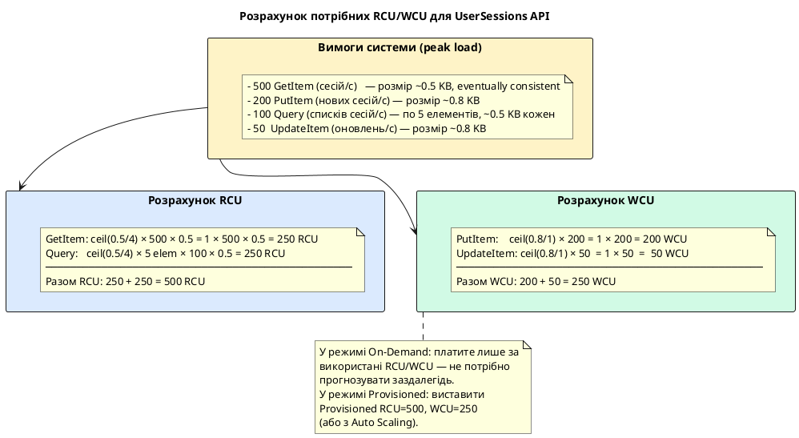

::

---

## Secondary Indexes: запити поза первинним ключем

Ми з'ясували фундаментальне обмеження DynamoDB: операція Query може шукати елементи **лише за Partition Key** основної таблиці. Це означає, що таблиця `UserSessions` з PK=`UserId` / SK=`SessionId` ефективно відповідає на запитання «які сесії має користувач X?», але абсолютно не здатна відповісти на «які сесії закінчились до певної дати?» або «які сесії з конкретної IP-адреси?» — без повного Scan всієї таблиці.

DynamoDB вирішує цю проблему через **Secondary Indexes** — механізм, що дозволяє визначити альтернативну схему ключів для таблиці та виконувати Query за цією альтернативною схемою. Існує два типи Secondary Indexes з принципово різними характеристиками.

Для наочності розглянемо поточний стан основної таблиці `UserSessions` (з первинним ключем `UserId` + `SessionId`), на прикладі якої ми будемо вивчати обидва типи індексів:

**Вихідний набір даних таблиці `UserSessions`:**

| UserId (Partition Key) | SessionId (Sort Key) | ExpiresAt | IpAddress | IsActive | CreatedAt |
| :--- | :--- | :--- | :--- | :--- | :--- |
| `usr-001` | `sess-A` | `2025-06-01T22:00:00Z` | `203.0.113.42` | `true` | `2025-06-01T10:00:00Z` |
| `usr-001` | `sess-B` | `2025-06-02T10:00:00Z` | `198.51.100.7` | `true` | `2025-06-01T11:00:00Z` |
| `usr-001` | `sess-C` | `2025-05-31T08:00:00Z` | `203.0.113.42` | `false` | `2025-05-30T16:00:00Z` |
| `usr-002` | `sess-D` | `2025-06-03T14:00:00Z` | `10.0.0.5` | `true` | `2025-06-01T13:00:00Z` |

---


::plant-uml

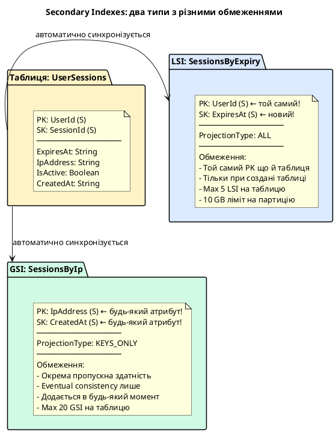

::

---

## Local Secondary Index (LSI)

**Local Secondary Index (LSI)** представляє собою альтернативний індекс доступу, який створюється в межах однієї логічної партиції. Ключовою архітектурною особливістю LSI є те, що він **зобов'язаний використовувати той самий Partition Key (HASH)**, що й основна таблиця, але дозволяє визначити інший атрибут як Sort Key (RANGE). 

Термін «локальний» вказує на фізичну локалізацію даних: всі проектовані елементи індексу, що відповідають певному Partition Key, зберігаються на тому самому фізичному вузлі (storage node) і в межах тієї ж групи партицій, що й відповідні оригінальні елементи основної таблиці. Це забезпечує сувору гарантію транзакційної узгодженості та мінімальних затримок при зверненні.

### Архітектурна доцільність та патерни застосування LSI

Необхідність використання LSI виникає у сценаріях, коли для однієї сутності (ідентифікованої за Partition Key) потрібно виконувати складні запити з різними критеріями сортування або фільтрації.

Розглянемо практичний сценарій проектування таблиці сесій користувачів `UserSessions`, де первинний ключ побудований як composite: Partition Key = `UserId`, Sort Key = `SessionId`. Ця схема дозволяє виконувати ефективні операції точкового читання (`GetItem`) конкретної сесії або отримувати перелік усіх сесій користувача (`Query`). 

Проте, якщо виникає патерн доступу виду *«отримати всі сесії конкретного користувача, термін дії яких закінчується до заданого моменту»* (наприклад, для інвалідації сесій або виведення попереджень користувачу), стандартна схема вимагатиме виконання запиту `Query` за `UserId` з подальшою фільтрацією за полем `ExpiresAt` на стороні додатка або через `FilterExpression`. Це призведе до зайвого споживання RCU, оскільки DynamoDB зчитує всі сесії користувача, перш ніж застосувати фільтр.

Створення LSI з назвою `SessionsByExpiry`, де Sort Key визначено як `ExpiresAt`, дозволяє виконувати прямі сортувальні запити (`Query`) в межах одного `UserId` з накладанням умов на `ExpiresAt` безпосередньо на рівні бази даних.

::plant-uml

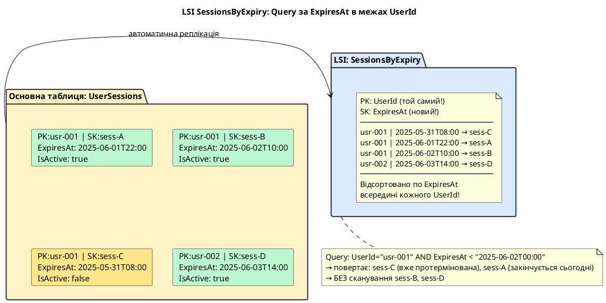

::

### Системні обмеження та архітектурні компроміси LSI

Хоча LSI надає перевагу у вигляді сильної узгодженості та атомарності, його використання супроводжується жорсткими обмеженнями, які необхідно враховувати на етапі проектування.

#### 1. Обмеження розміру колекції елементів (10 GB Item Collection Limit)
Найбільш критичним обмеженням LSI є ліміт на розмір **колекції елементів (Item Collection)**. Колекція елементів — це сукупність усіх елементів у таблиці та в усіх її локальних вторинних індексах, які мають однакове значення Partition Key. 

Фізично, для забезпечення низьких затримок, DynamoDB зберігає всю колекцію елементів на одному фізичному вузлі партиції. Через це сумарний розмір колекції елементів для одного значення Partition Key не може перевищувати **10 GB**. Якщо обсяг даних одного ключа (наприклад, сесій одного активного користувача) перевищить цей ліміт, будь-які подальші операції запису або оновлення для цього Partition Key завершаться помилкою `ValidationException`. 

*Практичний висновок:* LSI абсолютно не підходить для сутностей з необмеженим зростанням даних (наприклад, логування подій IoT-пристроїв за ідентифікатором пристрою, де обсяг логів на один пристрій гарантовано перевищить 10 GB).

#### 2. Неможливість динамічного керування
Локальний вторинний індекс може бути створений **виключно в момент ініціалізації таблиці** (`CreateTable`). Додати LSI до існуючої таблиці або видалити його пізніше неможливо. Якщо в процесі експлуатації виявиться потреба в новому LSI, єдиним виходом буде створення нової таблиці, налаштування нової схеми індексів та міграція всіх історичних даних, що є тривалим та дорогим процесом.

---

### Стратегії проектування індексів: Типи проекцій (Projection Types)

При створенні вторинного індексу розробник повинен визначити, які саме атрибути з основної таблиці будуть копіюватися (проектувалися) в індекс. Це визначається параметром **Projection**. Вибір типу проекції є компромісом між обсягом збережених даних (витрати на Storage та WCU) та продуктивністю запитів (витрати на RCU).

::card-group

::card{title="KEYS_ONLY" icon="i-heroicons-key"}

Індекс зберігає лише ключові атрибути: PK та SK основної таблиці + PK та SK індексу. Мінімальний розмір → мінімальні витрати. Якщо потрібні інші атрибути — DynamoDB автоматично виконує додаткове читання основної таблиці.

**Коли:** часто використовується як «існування» (перевірити чи є такий запис), або якщо майже завжди потрібно також читати основну таблицю для деталей.

::

::card{title="INCLUDE" icon="i-heroicons-list-bullet"}

Зберігає ключові атрибути + явно вказаний список атрибутів (`NonKeyAttributes`). Дозволяє точно контролювати, які поля дублюються в індексі.

**Коли:** коли відомий фіксований набір атрибутів, що потрібні при Query через індекс. Наприклад, `ExpiresAt` + `IsActive` — достатньо для перевірки статусу сесії без читання повного елемента.

::

::card{title="ALL" icon="i-heroicons-square-3-stack-3d"}

Зберігає всі атрибути елемента. Максимальний розмір індексу — фактично дублювання всієї таблиці. Але Query через індекс повертає повний елемент без додаткових читань.

**Коли:** якщо при Query через індекс завжди потрібні всі атрибути, і витрати на зберігання прийнятні.

::

::

::tip
**Практичне правило для Projection:** починайте з `KEYS_ONLY` або `INCLUDE` (мінімально необхідний набір атрибутів для вашого Query). `ALL` зручний, але подвоює або потроює витрати на зберігання. DynamoDB не дозволяє змінити Projection після створення індексу — треба перестворювати.
::
 
### Вплив LSI на споживання RCU та WCU

Використання локальних індексів суттєво оновлює можливості запитів, проте створює додаткове навантаження на пропускну здатність таблиці:

1.  **Витрати на запис (Write Cost Dynamics):**
    При додаванні (`PutItem`), оновленні (`UpdateItem`) або видаленні (`DeleteItem`) елемента в основній таблиці DynamoDB автоматично оновлює дані у всіх LSI.
    *   Якщо записується новий елемент, споживається 1 WCU (або 2 WCU для транзакцій) за кожен 1 KB розміру елемента як для основної таблиці, так і для кожного LSI, куди проектується цей елемент.
    *   Якщо оновлюється атрибут елемента, який **не входить** у проекцію LSI, додаткові WCU для цього індексу **не споживаються**.
    *   Якщо оновлюється атрибут, що **входить** до проекції індексу (або змінюється сам ключ індексу Sort Key), DynamoDB виконує дві операції в індексі (видалення старого запису та запис нового), що споживає додаткові WCU.
    
    *Усі витрати WCU на обслуговування LSI списуються з пулу пропускної здатності основної таблиці.*

2.  **Витрати на читання та явище Main Table Fetch (Read Cost Dynamics):**
    При виконанні запиту `Query` через LSI вартість у RCU залежить від вибраного типу проекції:
    *   **Покритий запит (Covered Query):** Якщо запит запитує лише ті атрибути, які були спроектовані в індекс (`KEYS_ONLY` або `INCLUDE`), DynamoDB зчитує дані виключно з LSI. Розрахунок RCU відбувається стандартно: 1 RCU на 4 KB спроектованих даних (Strongly Consistent).
    *   **Непокритий запит та Main Table Fetch:** Якщо запит звертається до атрибутів, які **відсутні** в проекції індексу (наприклад, у проекції `KEYS_ONLY` запитується поле `IpAddress`), DynamoDB змушена виконати внутрішню операцію вибірки з основної таблиці (**Main Table Fetch / Lookup**) для кожного знайденого елемента.
    
    **Штраф за Fetch:** Кожна така вибірка з основної таблиці виконується як окреме Strongly Consistent читання і споживає **щонайменше 1 RCU на кожен елемент** (навіть якщо розмір елемента менший за 4 KB) та додає затримку (latency) на мережеве коло всередині бази даних.
    
    *Формула розрахунку RCU для непокритого запиту:*
    
    ::math-formula
    \text{RCU}_{\text{Total}} = \text{RCU}_{\text{Index Query}} + \text{Кількість знайдених елементів} \times 1\text{ RCU}
    ::

---

### Створення таблиці з LSI

::tabs

::tabs-item{label="AWS CLI (bash)"}

```bash
# Таблиця UserSessions з LSI SessionsByExpiry
aws dynamodb create-table \
    --table-name UserSessions \
    --attribute-definitions \
        AttributeName=UserId,AttributeType=S \
        AttributeName=SessionId,AttributeType=S \
        AttributeName=ExpiresAt,AttributeType=S \
    --key-schema \
        AttributeName=UserId,KeyType=HASH \
        AttributeName=SessionId,KeyType=RANGE \
    --local-secondary-indexes '[
        {
            "IndexName": "SessionsByExpiry",
            "KeySchema": [
                {"AttributeName": "UserId",    "KeyType": "HASH"},
                {"AttributeName": "ExpiresAt", "KeyType": "RANGE"}
            ],
            "Projection": {
                "ProjectionType": "INCLUDE",
                "NonKeyAttributes": ["IsActive", "IpAddress"]
            }
        }
    ]' \
    --billing-mode PAY_PER_REQUEST \
    --region eu-central-1
```

::

::tabs-item{label=".NET SDK (C#)"}

```csharp
var client = new AmazonDynamoDBClient();
var response = await client.CreateTableAsync(new CreateTableRequest
{
    TableName = "UserSessions",
    AttributeDefinitions = new List<AttributeDefinition>
    {
        new AttributeDefinition { AttributeName = "UserId", AttributeType = ScalarAttributeType.S },
        new AttributeDefinition { AttributeName = "SessionId", AttributeType = ScalarAttributeType.S },
        new AttributeDefinition { AttributeName = "ExpiresAt", AttributeType = ScalarAttributeType.S }
    },
    KeySchema = new List<KeySchemaElement>
    {
        new KeySchemaElement { AttributeName = "UserId", KeyType = KeyType.HASH },
        new KeySchemaElement { AttributeName = "SessionId", KeyType = KeyType.RANGE }
    },
    LocalSecondaryIndexes = new List<LocalSecondaryIndex>
    {
        new LocalSecondaryIndex
        {
            IndexName = "SessionsByExpiry",
            KeySchema = new List<KeySchemaElement>
            {
                new KeySchemaElement { AttributeName = "UserId", KeyType = KeyType.HASH },
                new KeySchemaElement { AttributeName = "ExpiresAt", KeyType = KeyType.RANGE }
            },
            Projection = new Projection
            {
                ProjectionType = ProjectionType.INCLUDE,
                NonKeyAttributes = new List<string> { "IsActive", "IpAddress" }
            }
        }
    },
    BillingMode = BillingMode.PAY_PER_REQUEST
});
```

::

::tabs-item{label="PowerShell"}

```powershell
$attrUserId    = New-DDBAttributeDefinition -AttributeName UserId    -AttributeType S
$attrSessionId = New-DDBAttributeDefinition -AttributeName SessionId -AttributeType S
$attrExpiresAt = New-DDBAttributeDefinition -AttributeName ExpiresAt -AttributeType S

$keyUserId    = New-DDBKeySchemaElement -AttributeName UserId    -KeyType HASH
$keySessionId = New-DDBKeySchemaElement -AttributeName SessionId -KeyType RANGE

# LSI: той самий PK (UserId), новий SK (ExpiresAt)
$lsiKey1 = New-DDBKeySchemaElement -AttributeName UserId    -KeyType HASH
$lsiKey2 = New-DDBKeySchemaElement -AttributeName ExpiresAt -KeyType RANGE

$lsiProjection = [Amazon.DynamoDBv2.Model.Projection]@{
    ProjectionType   = 'INCLUDE'
    NonKeyAttributes = @('IsActive', 'IpAddress')
}

$lsi = [Amazon.DynamoDBv2.Model.LocalSecondaryIndex]@{
    IndexName  = 'SessionsByExpiry'
    KeySchema  = @($lsiKey1, $lsiKey2)
    Projection = $lsiProjection
}

New-DDBTable `
    -TableName            UserSessions `
    -AttributeDefinition  @($attrUserId, $attrSessionId, $attrExpiresAt) `
    -KeySchema            @($keyUserId, $keySessionId) `
    -LocalSecondaryIndex  @($lsi) `
    -BillingMode          PAY_PER_REQUEST `
    -Region               eu-central-1
```

::

::

### Query через LSI

::tabs

::tabs-item{label="AWS CLI (bash)"}

```bash
# Знайти сесії usr-001, що закінчаться до 2025-06-02T00:00:00Z
aws dynamodb query \
    --table-name UserSessions \
    --index-name SessionsByExpiry \
    --key-condition-expression "UserId = :uid AND ExpiresAt < :exp" \
    --expression-attribute-values '{
        ":uid": {"S": "usr-001"},
        ":exp": {"S": "2025-06-02T00:00:00Z"}
    }' \
    --region eu-central-1
```

::

::tabs-item{label=".NET SDK (C#)"}

```csharp
var client = new AmazonDynamoDBClient();
var response = await client.QueryAsync(new QueryRequest
{
    TableName = "UserSessions",
    IndexName = "SessionsByExpiry",
    KeyConditionExpression = "UserId = :uid AND ExpiresAt < :exp",
    ExpressionAttributeValues = new Dictionary<string, AttributeValue>
    {
        { ":uid", new AttributeValue { S = "usr-001" } },
        { ":exp", new AttributeValue { S = "2025-06-02T00:00:00Z" } }
    }
});
```

::

::tabs-item{label="PowerShell"}

```powershell
$queryRequest = [Amazon.DynamoDBv2.Model.QueryRequest]@{
    TableName              = 'UserSessions'
    IndexName              = 'SessionsByExpiry'
    KeyConditionExpression = 'UserId = :uid AND ExpiresAt < :exp'
    ExpressionAttributeValues = @{
        ':uid' = New-DDBEntry -S 'usr-001'
        ':exp' = New-DDBEntry -S '2025-06-02T00:00:00Z'
    }
}
Invoke-DDBQuery -QueryRequest $queryRequest -Region eu-central-1
```

::

::

::terminal-preview{title="Query через LSI SessionsByExpiry"}

<div class="line"><span class="opacity-40">$</span> <strong>aws dynamodb query --index-name SessionsByExpiry --key-condition-expression "UserId = :uid AND ExpiresAt &lt; :exp" ...</strong></div>
<div class="line">{</div>
<div class="line">    <span class="text-blue-400">"Items"</span>: [</div>
<div class="line">        {</div>
<div class="line">            <span class="text-blue-400">"UserId"</span>:    { <span class="text-blue-400">"S"</span>: <span class="text-green-400">"usr-001"</span> },</div>
<div class="line">            <span class="text-blue-400">"SessionId"</span>: { <span class="text-blue-400">"S"</span>: <span class="text-green-400">"sess-C"</span> },</div>
<div class="line">            <span class="text-blue-400">"ExpiresAt"</span>: { <span class="text-blue-400">"S"</span>: <span class="text-green-400">"2025-05-31T08:00:00Z"</span> },</div>
<div class="line">            <span class="text-blue-400">"IsActive"</span>:  { <span class="text-blue-400">"BOOL"</span>: <span class="text-yellow-400">false</span> },</div>
<div class="line">            <span class="text-blue-400">"IpAddress"</span>: { <span class="text-blue-400">"S"</span>: <span class="text-green-400">"203.0.113.42"</span> }</div>
<div class="line">        },</div>
<div class="line">        {</div>
<div class="line">            <span class="text-blue-400">"UserId"</span>:    { <span class="text-blue-400">"S"</span>: <span class="text-green-400">"usr-001"</span> },</div>
<div class="line">            <span class="text-blue-400">"SessionId"</span>: { <span class="text-blue-400">"S"</span>: <span class="text-green-400">"sess-A"</span> },</div>
<div class="line">            <span class="text-blue-400">"ExpiresAt"</span>: { <span class="text-blue-400">"S"</span>: <span class="text-green-400">"2025-06-01T22:00:00Z"</span> },</div>
<div class="line">            <span class="text-blue-400">"IsActive"</span>:  { <span class="text-blue-400">"BOOL"</span>: <span class="text-yellow-400">true</span> },</div>
<div class="line">            <span class="text-blue-400">"IpAddress"</span>: { <span class="text-blue-400">"S"</span>: <span class="text-green-400">"198.51.100.7"</span> }</div>
<div class="line">        }</div>
<div class="line">    ],</div>
<div class="line">    <span class="text-blue-400">"Count"</span>: <span class="text-yellow-400">2</span>,</div>
<div class="line">    <span class="text-blue-400">"ScannedCount"</span>: <span class="text-yellow-400">2</span></div>
<div class="line">}</div>

::

---


## Global Secondary Index (GSI)

**Global Secondary Index (GSI)** представляє собою найбільш гнучкий та потужний інструмент побудови вторинних ключів доступу в Amazon DynamoDB. На відміну від LSI, GSI дозволяє обрати **абсолютно довільні атрибути** таблиці як в якості Partition Key (HASH), так і Sort Key (RANGE), повністю ігноруючи схему первинного ключа основної таблиці. Слово «Global» у назві вказує на те, що запити через цей індекс можуть охоплювати дані на всіх фізичних партиціях основної таблиці.

### Архітектурні особливості та фізична реалізація GSI

Під капом Amazon DynamoDB реалізує GSI як **повністю автономну внутрішню таблицю**, яка автоматично синхронізується з основною таблицею. Ця внутрішня таблиця має власну схему розділення на фізичні партиції, власні вузли зберігання (storage nodes) і, що найважливіше, — свій власний незалежний пул пропускної здатності (RCU та WCU) у випадку використання режиму Provisioned.

Така фізична автономність зумовлює три фундаментальні архітектурні наслідки:

1. **Гарантована кінцева узгодженість (Eventually Consistent Reads):**
   Синхронізація даних між основною таблицею та GSI виконується асинхронно за допомогою внутрішнього механізму реплікації. Через це запити (`Query`) через GSI підтримують **виключно Eventually Consistent reads**. Зчитування з Strongly Consistent або в межах транзакцій безпосередньо через GSI є неможливим, оскільки реплікація в індекс відбувається з мінімальною затримкою (зазвичай до кількох десятків мілісекунд, але за умови перевантаження індексу затримка може зростати).
2. **Автономне керування ємністю (Independent Throughput):**
   У режимі Provisioned для GSI необхідно окремо налаштовувати ліміти RCU та WCU. Вони ніяк не пов'язані з лімітами основної таблиці та оплачуються окремо.
3. **Ефект "зворотного тиску" при перевантаженні індексу (GSI Throttling Backpressure):**
   Оскільки реплікація в GSI відбувається асинхронно, при високій інтенсивності записів на основну таблицю індекс може не встигати оновлюватися, якщо його ліміт WCU занижений. Щоб запобігти безконтрольному відставанню реплікації та переповненню черг оновлень, DynamoDB застосовує зворотний тиск: **помилки недостатньої ємності (throttling) на GSI будуть каскадно блокувати операції запису в основній таблиці**. 
   
   *Критичне правило:* навіть якщо основна таблиця має надлишок WCU, запис до неї завершиться помилкою `ProvisionedThroughputExceededException`, якщо асоційований GSI вичерпає власні WCU.

::plant-uml

```plantuml
@startuml
!theme plain
skinparam backgroundColor #FAFAFA
skinparam defaultFontName "DejaVu Sans"

title GSI SessionsByIp: Запити за IpAddress без прив'язки до UserId

package "Основна таблиця: UserSessions" as MAIN #E8F4FD {
    note as MAIN_DATA
      PK:usr-001 | SK:sess-A | IP:203.0.113.42 | CreatedAt:2025-06-01T10:00
      PK:usr-001 | SK:sess-B | IP:198.51.100.7 | CreatedAt:2025-06-01T11:00
      PK:usr-002 | SK:sess-C | IP:203.0.113.42 | CreatedAt:2025-06-01T12:00
      PK:usr-003 | SK:sess-D | IP:10.0.0.5     | CreatedAt:2025-06-01T13:00
    end note
}

package "GSI індекс: SessionsByIp" as GSI #D5E8D4 {
    note as GSI_DATA
      GSI-PK: IpAddress (HASH) | GSI-SK: CreatedAt (RANGE)
      ────────────────────────────────────────────────────
      10.0.0.5     | 2025-06-01T13:00 → usr-003/sess-D
      198.51.100.7 | 2025-06-01T11:00 → usr-001/sess-B
      203.0.113.42 | 2025-06-01T10:00 → usr-001/sess-A
      203.0.113.42 | 2025-06-01T12:00 → usr-002/sess-C
      ────────────────────────────────────────────────────
      Сортування: HASH (IpAddress) -> RANGE (CreatedAt)
    end note
}

MAIN -right-> GSI : "Асинхронна реплікація
(Eventual Consistency)"

note bottom of GSI
  Запит (Query): IpAddress = "203.0.113.42"
  * Повертає: usr-001/sess-A + usr-002/sess-C
  * Поєднує дані різних користувачів!
  * Не вимагає дорогого Scan основної таблиці
end note
@enduml
```

::

### Sparse Index (Розріджені індекси) — паттерн оптимізації обсягу та витрат

**Sparse Index (розріджений індекс)** — це фундаментальний патерн проектування вторинних індексів у DynamoDB, який використовує вибіркову поведінку оновлення індексів.

За замовчуванням вторинний індекс у DynamoDB вважається розрідженим, якщо будь-який елемент основної таблиці не містить атрибутів, визначених як Partition Key або Sort Key цього індексу. DynamoDB **не створює запис в індексі**, якщо у вихідному елементі відсутній хоча б один із ключів індексу.

#### Переваги та архітектурна цінність розріджених індексів:
1. **Скорочення витрат на зберігання (Storage Savings):**
   Замість копіювання мільярдів записів, індекс містить лише ту вибіркову підмножину даних, яка відповідає певній умові бізнес-логіки.
2. **Мінімізація WCU (Write Savings):**
   DynamoDB оновлює GSI лише тоді, коли створюється або змінюється елемент, що містить ключові атрибути індексу. Зміна будь-яких інших елементів таблиці не витрачає пропускну здатність GSI.
3. **Висока швидкість виконання запитів (Query Efficiency):**
   Оскільки індекс компактний, операції `Query` виконуються за мінімальну кількість звернень, без потреби сканувати зайві дані.

#### Сценарій застосування: Обробка незавершених замовлень (Pending Orders)
Уявімо велику e-commerce систему з мільярдами замовлень, де 99% замовлень знаходяться у кінцевих статусах (`DELIVERED`, `CANCELLED`), і лише 1% замовлень перебуває в процесі обробки (`PENDING`). 

Операторам потрібно постійно отримувати список замовлень для обробки. Сканування всієї таблиці є неприпустимо дорогим. Якщо ми створимо GSI з ключем сортування, який заповнюється значенням дати *виключно* для замовлень зі статусом `PENDING` (наприклад, атрибут `PendingStatus` заповнюється лише тоді, коли статус дорівнює `PENDING`), індекс міститиме лише цей 1% активних замовлень. Як тільки замовлення доставляється, атрибут `PendingStatus` видаляється з елемента, і DynamoDB автоматично прибирає цей запис із розрідженого GSI.

::plant-uml

```plantuml
@startuml
!theme plain
skinparam backgroundColor #FAFAFA
skinparam defaultFontName "DejaVu Sans"

title Sparse GSI: Індексуються лише елементи з атрибутом NeedsProcessing

package "Основна таблиця: Orders (1 млн елементів)" as MAIN #E8F4FD {
    card "ord-001
Status: DELIVERED
(NeedsProcessing відсутній)" as O1 #D5E8D4
    card "ord-002
Status: PENDING
NeedsProcessing: 'true'" as O2 #FFF2CC
    card "ord-003
Status: DELIVERED
(NeedsProcessing відсутній)" as O3 #D5E8D4
    card "ord-004
Status: PENDING
NeedsProcessing: 'true'" as O4 #FFF2CC
}

package "Sparse GSI: PendingOrders
GSI-PK: NeedsProcessing" as GSI #F0E6FF {
    note as GSI_NOTE
      Індекс містить лише 2 елементи!
      ───────────────────────────
      NeedsProcessing='true' → ord-002
      NeedsProcessing='true' → ord-004
      ───────────────────────────
      Елементи ord-001 та ord-003
      повністю ігноруються індексом
    end note
}

O2 -right-> GSI : "Проектується (атрибут наявний)"
O4 -right-> GSI : "Проектується (атрибут наявний)"
O1 ..> GSI : "Не проектується"
O3 ..> GSI : "Не проектується"

note bottom of GSI
  Запит (Query): NeedsProcessing = 'true'
  * Отримує 2 елементи замість сканування 1 млн
  * При оновленні статусу видаляємо NeedsProcessing
  * Елемент автоматично видаляється з GSI
end note
@enduml
```

::

### Додавання GSI до існуючої таблиці та фонове заповнення (Backfilling)

На відміну від локальних індексів (LSI), глобальні індекси (GSI) є динамічними сутностями. Їх можна створювати, оновлювати або видаляти на будь-му етапі життєвого циклу таблиці, навіть якщо вона містить мільярди записів.

#### Процес онлайн-індексації та фонового заповнення (Backfilling)
Створення GSI на існуючій таблиці є складною розподіленою операцією, яка виконується повністю у фоновому режимі:
1. **Створення метаданих (State: CREATING):** Після виклику `UpdateTable` статус індексу переходить у `CREATING`. DynamoDB виділяє фізичні ресурси (storage nodes) для нової партиційної структури індексу.
2. **Фаза фонового сканування та заповнення (Backfilling phase):** DynamoDB автоматично запускає фоновий процес сканування основної таблиці. Кожен знайдений елемент, що містить ключові атрибути GSI, проектується та записується в індекс.
3. **Синхронізація дельти (Catch-up phase):** Одночасно з заповненням історичними даними, всі нові операції запису, які виконуються клієнтами в цей момент до основної таблиці, автоматично буферизуються та реплікуються в новий індекс.
4. **Активація (State: ACTIVE):** Після завершення реплікації дельти статус індексу змінюється на `ACTIVE`, і він стає доступним для виконання запитів читання.

#### Розрахунок RCU/WCU під час Backfilling
Процес створення індексу створює додаткове навантаження на пропускну здатність:
* Фонове сканування основної таблиці споживає її **власні RCU** (AWS намагається виконувати це з мінімальним пріоритетом, щоб не заважати основному бізнес-трафіку).
* Запис даних у новий індекс споживає **WCU новоствореного GSI**. Якщо для GSI встановлено занижене значення WCU, процес заповнення триватиме значно довше або взагалі тимчасово призупиниться.

::tabs

::tabs-item{label="AWS CLI (bash)"}

```bash
# ── Додавання GSI SessionsByIp до існуючої таблиці UserSessions ──────────────
aws dynamodb update-table     --table-name UserSessions     --attribute-definitions         AttributeName=IpAddress,AttributeType=S         AttributeName=CreatedAt,AttributeType=S     --global-secondary-index-updates '[{
        "Create": {
            "IndexName": "SessionsByIp",
            "KeySchema": [
                {"AttributeName": "IpAddress", "KeyType": "HASH"},
                {"AttributeName": "CreatedAt", "KeyType": "RANGE"}
            ],
            "Projection": {
                "ProjectionType": "INCLUDE",
                "NonKeyAttributes": ["UserId", "IsActive"]
            }
        }
    }]'     --region eu-central-1

# ── Моніторинг статусу створення індексу ─────────────────────────────────────
aws dynamodb describe-table     --table-name UserSessions     --region eu-central-1     --query "Table.GlobalSecondaryIndexes[*].{Name:IndexName, Status:IndexStatus}"
```

::

::tabs-item{label=".NET SDK (C#)"}

```csharp
using Amazon.DynamoDBv2;
using Amazon.DynamoDBv2.Model;

var client = new AmazonDynamoDBClient();

// ── Додавання GSI (SessionsByIp) до існуючої таблиці (UserSessions) ──────────
await client.UpdateTableAsync(new UpdateTableRequest
{
    TableName = "UserSessions",
    AttributeDefinitions = new List<AttributeDefinition>
    {
        new() { AttributeName = "IpAddress", AttributeType = ScalarAttributeType.S },
        new() { AttributeName = "CreatedAt", AttributeType = ScalarAttributeType.S }
    },
    GlobalSecondaryIndexUpdates = new List<GlobalSecondaryIndexUpdate>
    {
        new()
        {
            Create = new CreateGlobalSecondaryIndexAction
            {
                IndexName = "SessionsByIp",
                KeySchema = new List<KeySchemaElement>
                {
                    new() { AttributeName = "IpAddress", KeyType = KeyType.HASH },
                    new() { AttributeName = "CreatedAt", KeyType = KeyType.RANGE }
                },
                Projection = new Projection
                {
                    ProjectionType = ProjectionType.INCLUDE,
                    NonKeyAttributes = new List<string> { "UserId", "IsActive" }
                },
                ProvisionedThroughput = new ProvisionedThroughput
                {
                    ReadCapacityUnits = 50,
                    WriteCapacityUnits = 50
                }
            }
        }
    }
});
```

::

::tabs-item{label="PowerShell"}

```powershell
Import-Module AWS.Tools.DynamoDBv2

$attrIp        = New-DDBAttributeDefinition -AttributeName IpAddress -AttributeType S
$attrCreatedAt = New-DDBAttributeDefinition -AttributeName CreatedAt -AttributeType S

$gsiKeyIp        = New-DDBKeySchemaElement -AttributeName IpAddress -KeyType HASH
$gsiKeyCreatedAt = New-DDBKeySchemaElement -AttributeName CreatedAt -KeyType RANGE

$gsiProjection = [Amazon.DynamoDBv2.Model.Projection]@{
    ProjectionType   = 'INCLUDE'
    NonKeyAttributes = @('UserId', 'IsActive')
}

$gsiCreate = [Amazon.DynamoDBv2.Model.GlobalSecondaryIndexUpdate]@{
    Create = [Amazon.DynamoDBv2.Model.CreateGlobalSecondaryIndexAction]@{
        IndexName  = 'SessionsByIp'
        KeySchema  = @($gsiKeyIp, $gsiKeyCreatedAt)
        Projection = $gsiProjection
    }
}

Update-DDBTable `
    -TableName                     UserSessions `
    -AttributeDefinition           @($attrIp, $attrCreatedAt) `
    -GlobalSecondaryIndexUpdate    @($gsiCreate) `
    -Region                        eu-central-1

# ── Перевірка статусу створення індексу ──────────────────────────────────────
(Get-DDBTable -TableName UserSessions -Region eu-central-1).GlobalSecondaryIndexes |
    Select-Object IndexName, IndexStatus
```

::

::

::terminal-preview{title="Вихідні дані опису таблиці при ініціалізації GSI"}

```json
[
    {
        "Name": "SessionsByIp",
        "Status": "CREATING"
    }
]
```

::

### Виконання запитів (Query) через GSI

::tabs

::tabs-item{label="AWS CLI (bash)"}

```bash
# ── Пошук сесій за IP та часом створення ──────────────────────────────────────
aws dynamodb query     --table-name UserSessions     --index-name SessionsByIp     --key-condition-expression "IpAddress = :ip AND CreatedAt >= :since"     --expression-attribute-values '{
        ":ip":    {"S": "203.0.113.42"},
        ":since": {"S": "2025-05-25T00:00:00Z"}
    }'     --region eu-central-1

# ── Видалення глобального індексу GSI ─────────────────────────────────────────
aws dynamodb update-table     --table-name UserSessions     --global-secondary-index-updates '[{
        "Delete": {"IndexName": "SessionsByIp"}
    }]'     --region eu-central-1
```

::

::tabs-item{label=".NET SDK (C#)"}

```csharp
using Amazon.DynamoDBv2;
using Amazon.DynamoDBv2.Model;

var client = new AmazonDynamoDBClient();

// ── Пошук сесій за IP та датою через GSI ─────────────────────────────────────
var queryRequest = new QueryRequest
{
    TableName = "UserSessions",
    IndexName = "SessionsByIp",
    KeyConditionExpression = "IpAddress = :ip AND CreatedAt >= :since",
    ExpressionAttributeValues = new Dictionary<string, AttributeValue>
    {
        { ":ip", new AttributeValue { S = "203.0.113.42" } },
        { ":since", new AttributeValue { S = "2025-05-25T00:00:00Z" } }
    }
};

var response = await client.QueryAsync(queryRequest);
```

::

::tabs-item{label="PowerShell"}

```powershell
Import-Module AWS.Tools.DynamoDBv2

# ── Пошук сесій за IP та часом створення ──────────────────────────────────────
$queryRequest = [Amazon.DynamoDBv2.Model.QueryRequest]@{
    TableName              = 'UserSessions'
    IndexName              = 'SessionsByIp'
    KeyConditionExpression = 'IpAddress = :ip AND CreatedAt >= :since'
    ExpressionAttributeValues = @{
        ':ip'    = New-DDBEntry -S '203.0.113.42'
        ':since' = New-DDBEntry -S '2025-05-25T00:00:00Z'
    }
}
$result = Invoke-DDBQuery -QueryRequest $queryRequest -Region eu-central-1
$result.Items

# ── Видалення глобального індексу GSI ─────────────────────────────────────────
$gsiDelete = [Amazon.DynamoDBv2.Model.GlobalSecondaryIndexUpdate]@{
    Delete = [Amazon.DynamoDBv2.Model.DeleteGlobalSecondaryIndexAction]@{
        IndexName = 'SessionsByIp'
    }
}
Update-DDBTable -TableName UserSessions -GlobalSecondaryIndexUpdate @($gsiDelete) -Region eu-central-1
```

::

::

---

### Порівняльний аналіз Local Secondary Index та Global Secondary Index

Для оптимального вибору індексу під конкретний сценарій використання зверніться до порівняльної таблиці:

| Характеристика | Local Secondary Index (LSI) | Global Secondary Index (GSI) |
| :--- | :--- | :--- |
| **Partition Key (HASH)** | Має бути ідентичним Partition Key основної таблиці | Може бути будь-яким атрибутом таблиці |
| **Sort Key (RANGE)** | Будь-який атрибут основної таблиці | Будь-який атрибут основної таблиці |
| **Момент створення** | Виключно під час створення таблиці | Будь-коли протягом життєвого циклу таблиці |
| **Обмеження розміру** | Ліміт у 10 GB на колекцію елементів (Item Collection) | Без лімітів (горизонтальне масштабування) |
| **Пропускна здатність** | Використовує RCU/WCU основної таблиці | Вимагає окремого виділення RCU/WCU для індексу |
| **Модель консистентності** | Strongly Consistent або Eventually Consistent читання | Виключно Eventually Consistent читання |
| **Штраф вибірки (Fetch Penalty)** | Дозволяє запитувати непроектовані атрибути (+1 RCU з основної таблиці) | Не підтримує автоматичне довантаження (запит провалюється) |

---

### Вибір типу індексу (Decision Tree)

::plant-uml

```plantuml
@startuml
!theme plain
skinparam backgroundColor #FAFAFA
skinparam defaultFontName "DejaVu Sans"

title Алгоритм вибору типу вторинного індексу

start

if (Потрібен додатковий ключ для нового патерну запиту?) then (так)
  if ( Partition Key має збігатися з основною таблицею?) then (так)
    if (Загальний обсяг даних на один Partition Key перевищує 10 GB?) then (так)
      :Використовувати GSI з тим самим Partition Key;
      note right : Обхід ліміту розміру Item Collection
      stop
    else (ні)
      if (Таблиця вже створена і знаходиться в експлуатації?) then (так)
        :Використовувати GSI;
        note right : LSI неможливо додати до наявної таблиці
        stop
      else (ні)
        :Використовувати LSI
(Економія на окремій пропускній здатності + Strongly Consistent читання);
        stop
      fi
    fi
  else (ні)
    :Використовувати GSI з новим Partition Key;
    stop
  fi
else (ні)
  :Запит покривається основним ключем;
  stop
fi

@enduml
```

::

---

## Практичний приклад: проектування індексів для E-commerce

У системах електронної комерції Single-Table Design є промисловим стандартом. Розглянемо проектування таблиці `Orders`, яка повинна ефективно обслуговувати чотири типи запитів.

#### Вимоги додатку до доступу до даних (Access Patterns):
1. **Запит 1:** Отримання всіх замовлень конкретного клієнта, відсортованих за часом оформлення.
2. **Запит 2:** Отримання всіх замовлень у статусі `PENDING` (очікують на обробку), відсортованих за часом оформлення.
3. **Запит 3:** Отримання всіх замовлень, що містять конкретний продукт.
4. **Запит 4:** Пошук замовлення клієнта у визначеному часовому діапазоні.

#### Схема проектування ключів та індексів:
- **Основний ключ (Composite PK):** Partition Key — `CustomerId`, Sort Key — `OrderDate#OrderId`. Це повністю покриває Запит 1 та Запит 4 за допомогою оператора `begins_with` та `between`.
- **Індекс 1 (PendingOrdersByDate - Sparse GSI):** Для Запиту 2 створюється розріджений індекс. `PendingStatus` використовується як HASH (заповнюється значенням `PENDING` лише для незавершених замовлень), а `OrderDateId` — як RANGE. При зміні статусу на `PAID` атрибут `PendingStatus` видаляється, і замовлення зникає з індексу.
- **Індекс 2 (OrdersByProduct - GSI):** Для Запиту 3 створюється індекс, де Partition Key — `ProductId_0` (ідентифікатор першого продукту у кошику), а Sort Key — `OrderDateId` з проекцією `KEYS_ONLY`.

::plant-uml

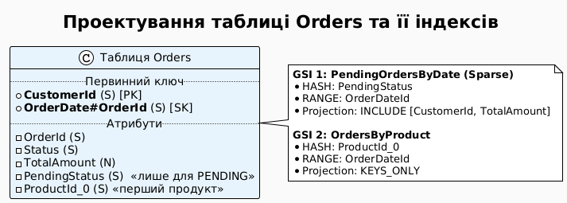

::

### Практична реалізація E-commerce таблиці

::tabs

::tabs-item{label="AWS CLI (bash)"}

```bash
# ── Створення таблиці Orders з двома GSI ──────────────────────────────────────
aws dynamodb create-table     --table-name Orders     --attribute-definitions         AttributeName=CustomerId,AttributeType=S         AttributeName=OrderDateId,AttributeType=S         AttributeName=PendingStatus,AttributeType=S         AttributeName=ProductId_0,AttributeType=S     --key-schema         AttributeName=CustomerId,KeyType=HASH         AttributeName=OrderDateId,KeyType=RANGE     --global-secondary-indexes '[
        {
            "IndexName": "PendingOrdersByDate",
            "KeySchema": [
                {"AttributeName": "PendingStatus", "KeyType": "HASH"},
                {"AttributeName": "OrderDateId",   "KeyType": "RANGE"}
            ],
            "Projection": {
                "ProjectionType": "INCLUDE",
                "NonKeyAttributes": ["CustomerId", "TotalAmount"]
            }
        },
        {
            "IndexName": "OrdersByProduct",
            "KeySchema": [
                {"AttributeName": "ProductId_0", "KeyType": "HASH"},
                {"AttributeName": "OrderDateId", "KeyType": "RANGE"}
            ],
            "Projection": {"ProjectionType": "KEYS_ONLY"}
        }
    ]'     --billing-mode PAY_PER_REQUEST     --region eu-central-1

# ── Запис нового PENDING замовлення (потрапляє в Sparse GSI) ──────────────────
aws dynamodb put-item     --table-name Orders     --item '{
        "CustomerId":    {"S": "cust-001"},
        "OrderDateId":   {"S": "2025-06-01T10:00#ord-XYZ"},
        "OrderId":       {"S": "ord-XYZ"},
        "Status":        {"S": "PENDING"},
        "PendingStatus": {"S": "PENDING"},
        "TotalAmount":   {"N": "149.99"},
        "ProductId_0":   {"S": "prod-laptop"}
    }'     --region eu-central-1

# ── Оплата замовлення (видалення PendingStatus -> автоматично зникає з GSI) ────
aws dynamodb update-item     --table-name Orders     --key '{"CustomerId": {"S": "cust-001"}, "OrderDateId": {"S": "2025-06-01T10:00#ord-XYZ"}}'     --update-expression "SET #s = :paid REMOVE PendingStatus"     --expression-attribute-names '{"#s": "Status"}'     --expression-attribute-values '{":paid": {"S": "PAID"}}'     --region eu-central-1

# ── Отримання активних PENDING замовлень через Sparse GSI ───────────────────────
aws dynamodb query     --table-name Orders     --index-name PendingOrdersByDate     --key-condition-expression "PendingStatus = :p"     --expression-attribute-values '{":p": {"S": "PENDING"}}'     --region eu-central-1
```

::

::tabs-item{label=".NET SDK (C#)"}

```csharp
using Amazon.DynamoDBv2;
using Amazon.DynamoDBv2.Model;

var client = new AmazonDynamoDBClient();

// ── Створення таблиці Orders з двома глобальними індексами (GSI) ──────────────
await client.CreateTableAsync(new CreateTableRequest
{
    TableName = "Orders",
    AttributeDefinitions = new List<AttributeDefinition>
    {
        new() { AttributeName = "CustomerId", AttributeType = ScalarAttributeType.S },
        new() { AttributeName = "OrderDateId", AttributeType = ScalarAttributeType.S },
        new() { AttributeName = "PendingStatus", AttributeType = ScalarAttributeType.S },
        new() { AttributeName = "ProductId_0", AttributeType = ScalarAttributeType.S }
    },
    KeySchema = new List<KeySchemaElement>
    {
        new() { AttributeName = "CustomerId", KeyType = KeyType.HASH },
        new() { AttributeName = "OrderDateId", KeyType = KeyType.RANGE }
    },
    GlobalSecondaryIndexes = new List<GlobalSecondaryIndex>
    {
        new()
        {
            IndexName = "PendingOrdersByDate",
            KeySchema = new List<KeySchemaElement>
            {
                new() { AttributeName = "PendingStatus", KeyType = KeyType.HASH },
                new() { AttributeName = "OrderDateId", KeyType = KeyType.RANGE }
            },
            Projection = new Projection
            {
                ProjectionType = ProjectionType.INCLUDE,
                NonKeyAttributes = new List<string> { "CustomerId", "TotalAmount" }
            },
            ProvisionedThroughput = new ProvisionedThroughput { ReadCapacityUnits = 10, WriteCapacityUnits = 10 }
        },
        new()
        {
            IndexName = "OrdersByProduct",
            KeySchema = new List<KeySchemaElement>
            {
                new() { AttributeName = "ProductId_0", KeyType = KeyType.HASH },
                new() { AttributeName = "OrderDateId", KeyType = KeyType.RANGE }
            },
            Projection = new Projection { ProjectionType = ProjectionType.KEYS_ONLY },
            ProvisionedThroughput = new ProvisionedThroughput { ReadCapacityUnits = 10, WriteCapacityUnits = 10 }
        }
    },
    BillingMode = BillingMode.PAY_PER_REQUEST
});

// ── Запис нового замовлення зі статусом PENDING ──────────────────────────────
await client.PutItemAsync(new PutItemRequest
{
    TableName = "Orders",
    Item = new Dictionary<string, AttributeValue>
    {
        { "CustomerId", new AttributeValue { S = "cust-001" } },
        { "OrderDateId", new AttributeValue { S = "2025-06-01T10:00#ord-XYZ" } },
        { "OrderId", new AttributeValue { S = "ord-XYZ" } },
        { "Status", new AttributeValue { S = "PENDING" } },
        { "PendingStatus", new AttributeValue { S = "PENDING" } },
        { "TotalAmount", new AttributeValue { N = "149.99" } },
        { "ProductId_0", new AttributeValue { S = "prod-laptop" } }
    }
});

// ── Оплата замовлення: оновлення статусу та видалення PendingStatus ────────────
await client.UpdateItemAsync(new UpdateItemRequest
{
    TableName = "Orders",
    Key = new Dictionary<string, AttributeValue>
    {
        { "CustomerId", new AttributeValue { S = "cust-001" } },
        { "OrderDateId", new AttributeValue { S = "2025-06-01T10:00#ord-XYZ" } }
    },
    UpdateExpression = "SET #s = :paid REMOVE PendingStatus",
    ExpressionAttributeNames = new Dictionary<string, string> { { "#s", "Status" } },
    ExpressionAttributeValues = new Dictionary<string, AttributeValue> { { ":paid", new AttributeValue { S = "PAID" } } }
});

// ── Запит активних PENDING замовлень через Sparse GSI ──────────────────────────
var pendingQuery = new QueryRequest
{
    TableName = "Orders",
    IndexName = "PendingOrdersByDate",
    KeyConditionExpression = "PendingStatus = :p",
    ExpressionAttributeValues = new Dictionary<string, AttributeValue>
    {
        { ":p", new AttributeValue { S = "PENDING" } }
    }
};
var pendingResult = await client.QueryAsync(pendingQuery);
```

::

::tabs-item{label="PowerShell"}

```powershell
Import-Module AWS.Tools.DynamoDBv2

# ── Запис нового PENDING замовлення ──────────────────────────────────────────
$item = @{
    CustomerId    = New-DDBEntry -S 'cust-001'
    OrderDateId   = New-DDBEntry -S '2025-06-01T10:00#ord-XYZ'
    OrderId       = New-DDBEntry -S 'ord-XYZ'
    Status        = New-DDBEntry -S 'PENDING'
    PendingStatus = New-DDBEntry -S 'PENDING'
    TotalAmount   = New-DDBEntry -N '149.99'
    ProductId_0   = New-DDBEntry -S 'prod-laptop'
}
Set-DDBItem -TableName Orders -Item $item -Region eu-central-1

# ── Оновлення статусу замовлення та видалення PendingStatus ──────────────────
Update-DDBItem `
    -TableName Orders `
    -Key @{ CustomerId = New-DDBEntry -S 'cust-001'; OrderDateId = New-DDBEntry -S '2025-06-01T10:00#ord-XYZ' } `
    -UpdateExpression "SET #s = :paid REMOVE PendingStatus" `
    -ExpressionAttributeName @{ '#s' = 'Status' } `
    -ExpressionAttributeValue @{ ':paid' = New-DDBEntry -S 'PAID' } `
    -Region eu-central-1

# ── Запит active PENDING замовлень через Sparse GSI ──────────────────────────
$queryReq = [Amazon.DynamoDBv2.Model.QueryRequest]@{
    TableName              = 'Orders'
    IndexName              = 'PendingOrdersByDate'
    KeyConditionExpression = 'PendingStatus = :p'
    ExpressionAttributeValues = @{ ':p' = New-DDBEntry -S 'PENDING' }
}
(Invoke-DDBQuery -QueryRequest $queryReq -Region eu-central-1).Items
```

::

::

::terminal-preview{title="Вибірка PENDING замовлень через Sparse GSI"}

```json
{
    "Items": [
        {
            "PendingStatus": { "S": "PENDING" },
            "OrderDateId":   { "S": "2025-06-01T10:00#ord-XYZ" },
            "CustomerId":    { "S": "cust-001" },
            "TotalAmount":   { "S": "149.99" }
        }
    ],
    "Count": 1
}
```

::

---

## Частина 3: Режими керування пропускною здатністю (Capacity Modes)


Одним із найбільш критичних архітектурних рішень при проектуванні систем на базі Amazon DynamoDB є вибір режиму керування обчислювальною ємністю. Цей параметр визначає не лише фінансову модель використання СУБД, а й механізми виділення фізичних ресурсів на рівні партицій, поведінку системи при непередбачуваних піках навантаження та стратегії автоматичного масштабування. DynamoDB пропонує два фундаментально різні підходи: **Provisioned Mode** (режим резервування пропускної здатності) та **On-Demand Mode** (режим оплати за фактичні запити).

::plant-uml

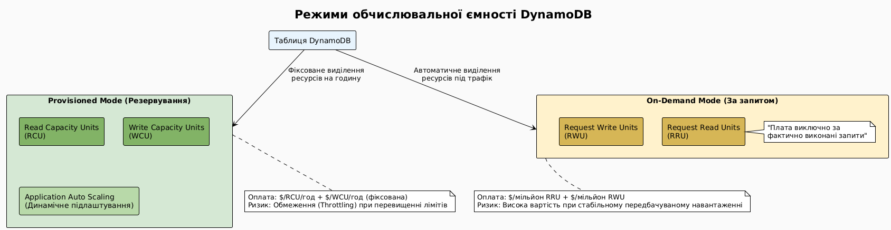

::

---

### Provisioned Mode — резервування обчислювальних ресурсів

У режимі **Provisioned** архітектор заздалегідь визначає обсяг обчислювальної потужності таблиці, виражений в одиницях пропускної здатності читання (**RCU**) та запису (**WCU**). AWS резервує ці ресурси на фізичному рівні (виділяючи відповідну кількість партицій та обчислювальних потужностей на вузлах збереження даних) та підтримує їх у стані постійної готовності. Оплата нараховується за кожну годину резервування, незалежно від того, чи виконувалися запити до таблиці.

#### Математична модель тарифікації (на прикладі регіону eu-central-1):
Вартість резервування розраховується за наступними базовими ставками:
- **1 RCU:** ≈ 0.00013 USD за годину (що становить приблизно 0.095 USD на місяць).
- **1 WCU:** ≈ 0.00065 USD за годину (що становить приблизно 0.474 USD на місяць).

При резервуванні 100 WCU та 200 RCU щомісячна вартість утримання таблиці (без врахування вартості збереження даних) становитиме:

::math-formula
\text{Вартість} = (100 \times 0.00065 + 200 \times 0.00013) \times 24 \times 30 = 65.52\text{ USD/місяць}
::

#### Механізм обмеження пропускної здатності (Throttling)
Якщо обсяг вхідних запитів за секунду перевищує сумарно зарезервовану ємність, DynamoDB ініціює механізм захисту ресурсів, повертаючи клієнту виняток `ProvisionedThroughputExceededException` (HTTP статус 400). 

Під капотом цей процес працює так:
1. **Генерація винятку:** Запит відхиляється на рівні Request Router ще до моменту виконання операції на вузлі партиції, що запобігає перевантаженню сховища.
2. **Клієнтська обробка (Retry & Backoff):** Офіційні клієнтські бібліотеки AWS SDK містять вбудовані обробники цього винятку. Вони автоматично повторюють запит, використовуючи алгоритм експоненціальної затримки з додаванням випадкового шуму (Exponential Backoff з Full Jitter). Це запобігає ефекту "лавини ретраїв" (retry storm), коли клієнти синхронно перевантажують базу даних повторними запитами.
3. **Вплив на затримку (Latency):** Незважаючи на автоматичне відновлення, повторні спроби збільшують загальний час відповіді системи (Round Trip Time, RTT) для кінцевого користувача.

#### Механізм Burst Capacity (Імпульсна ємність)
Для згладжування короткочасних стрибків трафіку DynamoDB використовує алгоритм маркерного кошика (Token Bucket) під назвою **Burst Capacity**. 

- **Накопичення ресурсів:** Якщо реальне споживання пропускної здатності таблиці є нижчим за ліміт (u(t) < C, де C — зарезервована ємність), невикористані одиниці ємності акумулюються в спеціальному пулі (кошику).
- **Обмеження об'єму кошика:** Максимальний об'єм накопичених токенів обмежений часовим інтервалом у **5 хвилин** (300 секунд). Формально, максимальний запас токенів T_max дорівнює:

::math-formula
T_{\max} = 300 \times C
::
- **Використання імпульсу:** При різкому стрибку навантаження, що перевищує C, Request Router починає списувати токени з пулу Burst Capacity, дозволяючи додатку виконувати запити без помилок throttling.
- **Обмеження гарантій:** Burst Capacity є сервісом з рівнем доступності *Best Effort*. AWS не гарантує надання накопиченої ємності, якщо запити концентруються на одній фізичній партиції (викликаючи Hot Partition) або якщо фізичний вузол, на якому розміщено партицію, перевантажений іншими клієнтами (noisy neighbor effect).

::plant-uml

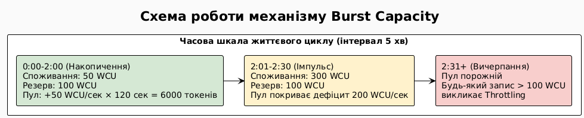

::

---

### Динамічне масштабування (Auto Scaling) у Provisioned Mode

Для мінімізації ручного керування та запобігання надлишковим витратам режим Provisioned інтегрується з сервісом **AWS Application Auto Scaling**. Цей механізм автоматично коригує зарезервовану ємність таблиці у відповідь на динаміку реального трафіку.

#### Архітектура взаємодії компонентів:
1. **Моніторинг метрик:** DynamoDB кожну хвилину надсилає метрики використання ємності (`ConsumedReadCapacityUnits`, `ConsumedWriteCapacityUnits`) до Amazon CloudWatch.
2. **CloudWatch Alarms:** На основі конфігурації Auto Scaling створюються два триггери (Alarms): один для масштабування вгору (Scale-out), інший — для масштабування вниз (Scale-in). Вони активуються, коли середнє споживання ємності за певний проміжок часу відхиляється від встановленого цільового показника (Target Utilization, зазвичай 70%).
3. **Application Auto Scaling:** При спрацьовуванні CloudWatch Alarm сервіс Auto Scaling викликає API-метод DynamoDB `UpdateTable` для зміни параметрів `ProvisionedThroughput`.

::plant-uml

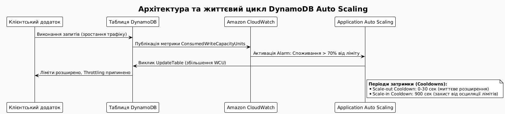

::

#### Ковзні інтервали та запобігання осциляції (Flapping)
- **Scale-out (Масштабування вгору):** Виконується максимально оперативно. Коли споживання перевищує цільове значення протягом кількох хвилин, ліміти збільшуються. Параметр *Scale-out cooldown* зазвичай встановлюється в 0 секунд, дозволяючи миттєву реакцію на зростання трафіку.
- **Scale-in (Масштабування вниз):** Здійснюється консервативно. Зменшення лімітів ініціюється лише тоді, коли навантаження стабільно тримається нижче цільового рівня протягом тривалого часу. Параметр *Scale-in cooldown* за замовчуванням дорівнює **900 секундам** (15 хвилинам). Це запобігає ефекту "флаппінгу" (flapping) — постійного перемикання ємності туди-сюди при короткочасних спадах трафіку, що могло б призвести до штучного дефіциту ресурсів при повторному стрибку.

---

### On-Demand Mode — оплата за фактично оброблені запити

Режим **On-Demand** повністю абстрагує поняття планування ємності. Замість резервування віртуальних каналів зв'язку, користувач оплачує кожен успішно виконаний запит читання чи запису, виражений в **Request Read Units (RRU)** та **Request Write Units (RWU)**. Розмірність та правила округлення для RRU/RWU є повністю аналогічними до RCU/WCU (читання блоками по 4 KB, запис блоками по 1 KB).

#### Вартість використання On-Demand (на прикладі регіону eu-central-1):
- **1 мільйон RRU:** ≈ 0.284 USD
- **1 мільйон RWU:** ≈ 1.42 USD

#### Алгоритм автоматичного масштабування під капом
On-Demand не потребує налаштування тригерів масштабування. Проте, важливо розуміти фізичні обмеження масштабованості:
1. **Історичний пік (Peak Capacity):** DynamoDB гарантує миттєве обслуговування трафіку, який не перевищує подвоєне значення максимального навантаження за останні 30 хвилин. Наприклад, якщо таблиця успішно обробила пік у 10 000 RPS, вона може безпосередньо з цього моменту обробити до 20 000 RPS.
2. **Поділ партицій при перевищенні піку:** Якщо навантаження перевищує 2 × Peak, DynamoDB запускає фоновий процес поділу партицій (Partition Splitting) для горизонтального розширення сховища та обчислювальних ресурсів. Під час цього процесу (який може тривати до кількох хвилин) запити, що виходять за межі подвоєного піку, можуть зазнавати тимчасового throttling.
3. **Стартові ліміти:** Для абсолютно нової таблиці в режимі On-Demand встановлено ліміти у 4000 Write Requests/sec та 12 000 Read Requests/sec. Ці обмеження автоматично піднімаються в міру зростання реального трафіку.

---

### Порівняльна характеристика режимів ємності

| Критерій порівняння | Provisioned Mode (+ Auto Scaling) | On-Demand Mode |
| :--- | :--- | :--- |
| **Характер тарифікації** | Погодинна плата за зарезервовану ємність | Плата за фактичну кількість виконаних запитів |
| **Реакція на різкі стрибки** | З затримкою 5–15 хв (поки відпрацює Auto Scaling) | Миттєва (у межах подвоєного історичного піку) |
| **Фінансова ефективність** | Максимальна при стабільному, прогнозованому трафіку | Оптимальна при нерівномірному, непередбачуваному трафіку |
| **Ризик виникнення Throttling** | Присутній під час різких переходів навантаження | Майже відсутній (окрім екстремальних стрибків) |
| **Адміністративні витрати** | Потребує аналізу профілю навантаження та налаштування лімітів | Повний "Zero Ops" — не потребує втручання |
| **Рекомендовано для** | Production-середовищ зі стабільними добовими циклами | MVP, розробки, тестування, систем з імпульсним трафіком |

---

### Стратегія перемикання між режимами

::plant-uml

```plantuml
@startuml
!theme plain
skinparam backgroundColor #FAFAFA
skinparam defaultFontName "DejaVu Sans"

title Алгоритм вибору режиму керування ємністю

start

if (Таблиця використовується для тестування, MVP чи розробки?) then (так)
  :Вибрати On-Demand Mode\n(мінімізація адміністрування та базових витрат);
  stop
else (ні)
  if (Профіль навантаження є стабільним або прогнозованим?) then (так)
    :Вибрати Provisioned Mode + Auto Scaling\n(Оптимізація витрат, ціль: 70% утилізації);
    stop
  else (ні)
    if (Зростання трафіку перевищує 2х за 5 хвилин?) then (так)
      :Вибрати On-Demand Mode\n(Уникнення затримок масштабування Auto Scaling);
      stop
    else (ні)
      :Вибрати Provisioned Mode + Auto Scaling\nз широким діапазоном min/max ємностей;
      stop
    fi
  fi
fi
@enduml
```

::

> [!WARNING]
> **Обмеження на перемикання режимів**
> Зміна режиму з Provisioned на On-Demand (і навпаки) дозволяється не частіше ніж **один раз на 24 години**.

#### Стратегія проведення навантажувального тестування (Load Testing):
Якщо планується масштабне тестування системи або очікується маркетинговий реліз (наприклад, Black Friday), використання On-Demand для нової таблиці може викликати throttling через низький стартовий ліміт. Рекомендована стратегія:
1. Тимчасово перевести таблицю в режим **Provisioned**.
2. Встановити вручну високі показники ємності (наприклад, 10 000 WCU та 20 000 RCU), що змусить DynamoDB миттєво виділити необхідну кількість фізичних партицій ("прогріти таблицю").
3. Провести тестування.
4. Повернути таблицю в режим **On-Demand** (або знизити Provisioned ліміти) для повсякденної експлуатації.

---

### Налаштування режимів ємності через інтерфейси керування

::tabs

::tabs-item{label="AWS CLI (bash)"}

```bash
# ── Створення нової таблиці в режимі On-Demand (PAY_PER_REQUEST) ─────────────
aws dynamodb create-table \
    --table-name Orders \
    --attribute-definitions \
        AttributeName=CustomerId,AttributeType=S \
        AttributeName=OrderId,AttributeType=S \
    --key-schema \
        AttributeName=CustomerId,KeyType=HASH \
        AttributeName=OrderId,KeyType=RANGE \
    --billing-mode PAY_PER_REQUEST \
    --region eu-central-1

# ── Переведення існуючої таблиці в режим Provisioned з базовими лімітами ──────
aws dynamodb update-table \
    --table-name Orders \
    --billing-mode PROVISIONED \
    --provisioned-throughput ReadCapacityUnits=100,WriteCapacityUnits=50 \
    --region eu-central-1

# ── Реєстрація таблиці як об'єкта масштабування для WCU в Auto Scaling ───────
aws application-autoscaling register-scalable-target \
    --service-namespace dynamodb \
    --resource-id "table/Orders" \
    --scalable-dimension "dynamodb:table:WriteCapacityUnits" \
    --min-capacity 10 \
    --max-capacity 500 \
    --region eu-central-1

# ── Створення політики відстеження цільового використання (Target Tracking) ──
aws application-autoscaling put-scaling-policy \
    --service-namespace dynamodb \
    --resource-id "table/Orders" \
    --scalable-dimension "dynamodb:table:WriteCapacityUnits" \
    --policy-name "Orders-WCU-Scaling-Policy" \
    --policy-type TargetTrackingScaling \
    --target-tracking-scaling-policy-configuration '{
        "TargetValue": 70.0,
        "PredefinedMetricSpecification": {
            "PredefinedMetricType": "DynamoDBWriteCapacityUtilization"
        }
    }' \
    --region eu-central-1

# ── Повернення таблиці в режим оплати за фактичні запити (On-Demand) ─────────
aws dynamodb update-table \
    --table-name Orders \
    --billing-mode PAY_PER_REQUEST \
    --region eu-central-1
```

::

::tabs-item{label=".NET SDK (C#)"}

```csharp
using Amazon.DynamoDBv2;
using Amazon.DynamoDBv2.Model;
using Amazon.ApplicationAutoScaling;
using Amazon.ApplicationAutoScaling.Model;

var ddbClient = new AmazonDynamoDBClient(Amazon.RegionEndpoint.EUCentral1);
var scalingClient = new AmazonApplicationAutoScalingClient(Amazon.RegionEndpoint.EUCentral1);

// ── Ініціалізація нової таблиці в режимі On-Demand (PAY_PER_REQUEST) ────────
await ddbClient.CreateTableAsync(new CreateTableRequest
{
    TableName = "Orders",
    AttributeDefinitions = new List<AttributeDefinition>
    {
        new() { AttributeName = "CustomerId", AttributeType = ScalarAttributeType.S },
        new() { AttributeName = "OrderId", AttributeType = ScalarAttributeType.S }
    },
    KeySchema = new List<KeySchemaElement>
    {
        new() { AttributeName = "CustomerId", KeyType = KeyType.HASH },
        new() { AttributeName = "OrderId", KeyType = KeyType.RANGE }
    },
    BillingMode = BillingMode.PAY_PER_REQUEST
});

// ── Переведення таблиці на зарезервовану ємність (Provisioned Mode) ───────────
await ddbClient.UpdateTableAsync(new UpdateTableRequest
{
    TableName = "Orders",
    BillingMode = BillingMode.PROVISIONED,
    ProvisionedThroughput = new ProvisionedThroughput
    {
        ReadCapacityUnits = 100,
        WriteCapacityUnits = 50
    }
});

// ── Налаштування масштабованого об'єкта в Application Auto Scaling ───────────
await scalingClient.RegisterScalableTargetAsync(new RegisterScalableTargetRequest
{
    ServiceNamespace = ServiceNamespace.Dynamodb,
    ResourceId = "table/Orders",
    ScalableDimension = ScalableDimension.DynamodbTableWriteCapacityUnits,
    MinCapacity = 10,
    MaxCapacity = 500
});

// ── Створення політики динамічного масштабування для WCU на рівні 70% ─────────
await scalingClient.PutScalingPolicyAsync(new PutScalingPolicyRequest
{
    ServiceNamespace = ServiceNamespace.Dynamodb,
    ResourceId = "table/Orders",
    ScalableDimension = ScalableDimension.DynamodbTableWriteCapacityUnits,
    PolicyName = "Orders-WCU-AutoScaling-Policy",
    PolicyType = PolicyType.TargetTrackingScaling,
    TargetTrackingScalingPolicyConfiguration = new TargetTrackingScalingPolicyConfiguration
    {
        TargetValue = 70.0,
        PredefinedMetricSpecification = new PredefinedMetricSpecification
        {
            PredefinedMetricType = MetricType.DynamoDBWriteCapacityUtilization
        }
    }
});

// ── Повернення таблиці до конфігурації On-Demand ──────────────────────────────
await ddbClient.UpdateTableAsync(new UpdateTableRequest
{
    TableName = "Orders",
    BillingMode = BillingMode.PAY_PER_REQUEST
});
```

::

::tabs-item{label="PowerShell"}

```powershell
Import-Module AWS.Tools.DynamoDBv2
Import-Module AWS.Tools.ApplicationAutoScaling

# ── Створення таблиці в режимі On-Demand ──────────────────────────────────────
$attrDefs = @(
    New-DDBAttributeDefinition -AttributeName CustomerId -AttributeType S
    New-DDBAttributeDefinition -AttributeName OrderId    -AttributeType S
)
$keySchema = @(
    New-DDBKeySchemaElement -AttributeName CustomerId -KeyType HASH
    New-DDBKeySchemaElement -AttributeName OrderId    -KeyType RANGE
)
New-DDBTable `
    -TableName Orders `
    -AttributeDefinition $attrDefs `
    -KeySchema $keySchema `
    -BillingMode PAY_PER_REQUEST `
    -Region eu-central-1

# ── Переведення таблиці на зарезервовану ємність (Provisioned) ────────────────
$throughput = [Amazon.DynamoDBv2.Model.ProvisionedThroughput]@{
    ReadCapacityUnits  = 100
    WriteCapacityUnits = 50
}
Update-DDBTable `
    -TableName Orders `
    -BillingMode PROVISIONED `
    -ProvisionedThroughput $throughput `
    -Region eu-central-1

# ── Реєстрація цілі масштабування для WCU через Auto Scaling ─────────────────
Add-AASScalableTarget `
    -ServiceNamespace dynamodb `
    -ResourceId 'table/Orders' `
    -ScalableDimension 'dynamodb:table:WriteCapacityUnits' `
    -MinCapacity 10 `
    -MaxCapacity 500 `
    -Region eu-central-1

# ── Встановлення цільової політики масштабування (70% утилізації) ────────────
$metricSpec = [Amazon.ApplicationAutoScaling.Model.PredefinedMetricSpecification]@{
    PredefinedMetricType = 'DynamoDBWriteCapacityUtilization'
}
$policyConfig = [Amazon.ApplicationAutoScaling.Model.TargetTrackingScalingPolicyConfiguration]@{
    TargetValue                      = 70.0
    PredefinedMetricSpecification    = $metricSpec
}
Set-AASScalingPolicy `
    -ServiceNamespace dynamodb `
    -ResourceId 'table/Orders' `
    -ScalableDimension 'dynamodb:table:WriteCapacityUnits' `
    -PolicyName 'Orders-WCU-AutoScaling-Policy' `
    -PolicyType TargetTrackingScaling `
    -TargetTrackingScalingPolicyConfiguration $policyConfig `
    -Region eu-central-1

# ── Повернення таблиці на On-Demand режим ─────────────────────────────────────
Update-DDBTable `
    -TableName Orders `
    -BillingMode PAY_PER_REQUEST `
    -Region eu-central-1
```

::

::

::terminal-preview{title="Вихідні дані CLI при успішному перемиканні режиму"}

```json
{
    "TableDescription": {
        "TableName": "Orders",
        "TableStatus": "UPDATING",
        "BillingModeSummary": {
            "BillingMode": "PROVISIONED",
            "LastUpdateToPayPerRequestDateTime": "2026-06-03T10:00:00Z"
        },
        "ProvisionedThroughput": {
            "ReadCapacityUnits": 100,
            "WriteCapacityUnits": 50
        }
    }
}
```

::

---Projection = [Amazon.DynamoDBv2.Model.Projection]@{
    ProjectionType   = 'INCLUDE'
    NonKeyAttributes = @('UserId', 'IsActive')
}

$gsiCreate = [Amazon.DynamoDBv2.Model.GlobalSecondaryIndexUpdate]@{
    Create = [Amazon.DynamoDBv2.Model.CreateGlobalSecondaryIndexAction]@{
        IndexName  = 'SessionsByIp'
        KeySchema  = @($gsiKeyIp, $gsiKeyCreatedAt)
        Projection = $gsiProjection
    }
}

Update-DDBTable `
    -TableName                     UserSessions `
    -AttributeDefinition           @($attrIp, $attrCreatedAt) `
    -GlobalSecondaryIndexUpdate    @($gsiCreate) `
    -Region                        eu-central-1

# Перевірити статус GSI
(Get-DDBTable -TableName UserSessions -Region eu-central-1).GlobalSecondaryIndexes |
    Select-Object IndexName, IndexStatus
```

::

::

::terminal-preview{title="Статус GSI після додавання"}

<div class="line"><span class="opacity-40">$</span> <strong>aws dynamodb describe-table --table-name UserSessions --query "Table.GlobalSecondaryIndexes[*].{Name:IndexName, Status:IndexStatus}"</strong></div>
<div class="line">[</div>
<div class="line">    {</div>
<div class="line">        <span class="text-blue-400">"Name"</span>: <span class="text-green-400">"SessionsByIp"</span>,</div>
<div class="line">        <span class="text-blue-400">"Status"</span>: <span class="text-yellow-400">"CREATING"</span></div>
<div class="line">        <span class="opacity-50">← AWS заповнює індекс наявними даними (може тривати хвилини)</span></div>
<div class="line">    }</div>
<div class="line">]</div>
<div class="line"> </div>
<div class="line"><span class="opacity-40">$</span> <strong># ... через кілька хвилин ...</strong></div>
<div class="line">[</div>
<div class="line">    {</div>
<div class="line">        <span class="text-blue-400">"Name"</span>: <span class="text-green-400">"SessionsByIp"</span>,</div>
<div class="line">        <span class="text-blue-400">"Status"</span>: <span class="text-green-400">"ACTIVE"</span></div>
<div class="line">        <span class="opacity-50">← індекс готовий до використання</span></div>
<div class="line">    }</div>
<div class="line">]</div>

::


## Частина 4: DynamoDB Streams та Транзакції

### DynamoDB Streams — архітектура потоків змін

**DynamoDB Streams** є високодоступним, розподіленим журналом транзакційних логів (Change Data Capture, CDC), який фіксує всі модифікації даних у таблиці в хронологічному порядку. Кожна операція створення (`PutItem`), оновлення (`UpdateItem`) чи видалення (`DeleteItem`) генерує відповідний запис зміни (Stream Record).

#### Архітектурні принципи та гарантії:
1. **Шардування (Shards):** Потік даних автоматично розділяється на логічні фрагменти — шарди. Кожен шард відповідає певному діапазону ключів партицій і обслуговується власною обчислювальною інфраструктурою. Шарди є ефемерними: при збільшенні навантаження або обсягу даних вони автоматично розгалужуються (split), а при зменшенні — закриваються.
2. **Впорядкованість записів:** DynamoDB гарантує строгу послідовність записів **виключно в межах одного шарду**. Якщо два записи належать до різних партицій (і відповідно, потрапляють у різні шарди), їх взаємний порядок у потоці не гарантується.
3. **Життєвий цикл (Data Retention):** Всі записи в потоці зберігаються строго **протягом 24 годин** із моменту створення. Після цього дані видаляються без можливості відновлення.
4. **Гарантія доставки (Delivery Guarantees):** Забезпечується доставка типу *At-least-once* (щонайменше один раз). Споживачі повинні бути готовими до обробки дублікатів записів (дедуплікація на рівні бізнес-логіки).

::plant-uml

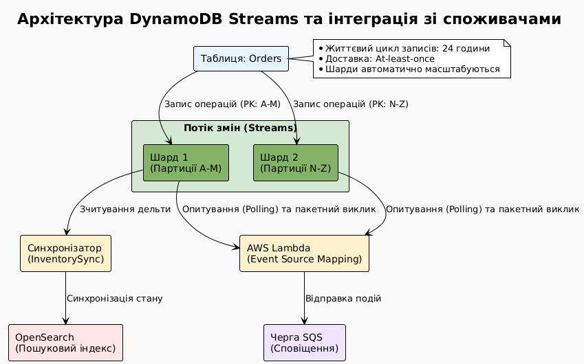

::

### View Types — класифікація та оцінка накладних витрат

При активації DynamoDB Streams архітектор зобов'язаний обрати тип представлення даних (View Type), який визначає обсяг інформації, що проектується у кожен запис потоку. Вибір типу безпосередньо впливає на обсяг мережевого трафіку та вартість обробки подій:

::card-group

::card{title="KEYS_ONLY" icon="i-heroicons-key"}
**Опис:** Записуються лише ключові атрибути елемента (Partition Key та Sort Key).
<br>**Мережеве навантаження:** Мінімальне.
<br>**Використання:** Оптимально, коли споживачу достатньо знати факт зміни об'єкта, а повний стан за потреби може бути завантажений з основної таблиці через `GetItem` (хоча це створює додаткове навантаження RCU).
::

::card{title="NEW_IMAGE" icon="i-heroicons-arrow-up-circle"}
**Опис:** Містить повний стан елемента після його модифікації.
<br>**Мережеве навантаження:** Середнє.
<br>**Використання:** Найбільш поширений варіант для побудови Read-моделей (CQRS), реплікації в Elasticsearch/Redis або відправки сповіщень про створення нових об'єктів.
::

::card{title="OLD_IMAGE" icon="i-heroicons-arrow-down-circle"}
**Опис:** Містить повний стан елемента до його модифікації.
<br>**Мережеве навантаження:** Середнє.
<br>**Використання:** Використовується в аудиторських системах для логування попереднього стану даних, а також у сценаріях компенсаційних транзакцій (Saga Pattern) для відкату змін.
::

::card{title="NEW_AND_OLD_IMAGES" icon="i-heroicons-arrows-right-left"}
**Опис:** Одночасно містить стани елемента "до" та "після" змін.
<br>**Мережеве навантаження:** Максимальне (додаткова серіалізація).
<br>**Використання:** Необхідний для аналізу дельти (diff) змін конкретних атрибутів (наприклад, визначення факту зміни ціни або статусу замовлення).
::

::

### Механізм інтеграції AWS Lambda з DynamoDB Streams

Інтеграція реалізується за допомогою сервісу **AWS Lambda Event Source Mapping (ESM)**. Це внутрішній опитувач (Poller), який працює на стороні інфраструктури Lambda, виконуючи періодичні запити до шардів потоку через внутрішній API.

::field-group

::field{name="BatchSize" type="integer"}
Максимальна кількість записів, яка може бути передана в один виклик функції Lambda (діапазон 1–1000). Збільшення батчу підвищує пропускну здатність обробки, але вимагає більше оперативної пам'яті для контейнера Lambda.
::

::field{name="StartingPosition" type="enum"}
Визначає точку старту обробки потоку. `LATEST` орієнтується виключно на події, що з'явилися після створення тригера. `TRIM_HORIZON` починає зчитування з найстаріших доступних у 24-годинному журналі записів.
::

::field{name="BisectBatchOnFunctionError" type="boolean"}
Активує алгоритм дихотомічного (бінарного) поділу пакета при виникненні помилки обробки. ESM ділить пакет навпіл і повторює виклики для кожної частини окремо, дозволяючи локалізувати та ізолювати некоректний запис (poison pill).
::

::field{name="MaximumRetryAttempts" type="integer"}
Визначає граничну кількість спроб повторної обробки пакета при виникненні збоїв (діапазон від 0 до 10000). Після вичерпання ліміту пакет надсилається до Dead Letter Queue (DLQ) або відкидається.
::

::field{name="FilterCriteria" type="object"}
Задає JSON-шаблони для фільтрації подій до моменту виклику обчислювальної функції. Наприклад, дає змогу відфільтрувати події так, щоб Lambda запускалася лише при створенні записів (`eventName == INSERT`), економлячи обчислювальні ресурси.
::

::

### Увімкнення Streams та Lambda тригера

::tabs

::tabs-item{label="AWS CLI (bash)"}

```bash
# ── Увімкнути Streams на таблиці ─────────────────────────────────────────
aws dynamodb update-table \
    --table-name Orders \
    --stream-specification StreamEnabled=true,StreamViewType=NEW_AND_OLD_IMAGES \
    --region eu-central-1

# ── Отримати ARN потоку ───────────────────────────────────────────────────
STREAM_ARN=$(aws dynamodb describe-table \
    --table-name Orders \
    --query "Table.LatestStreamArn" \
    --output text \
    --region eu-central-1)
echo "Stream ARN: $STREAM_ARN"

# ── Підключити Lambda до потоку ───────────────────────────────────────────
aws lambda create-event-source-mapping \
    --function-name OrderStreamProcessor \
    --event-source-arn "$STREAM_ARN" \
    --batch-size 100 \
    --starting-position LATEST \
    --bisect-batch-on-function-error \
    --maximum-retry-attempts 3 \
    --filter-criteria '{"Filters": [{"Pattern": "{\"eventName\": [\"INSERT\", \"MODIFY\"]}"}]}' \
    --region eu-central-1
```

::

::tabs-item{label=".NET SDK (C#)"}

```csharp
using Amazon.DynamoDBv2;
using Amazon.DynamoDBv2.Model;
using Amazon.Lambda;
using Amazon.Lambda.Model;

var ddbClient = new AmazonDynamoDBClient(Amazon.RegionEndpoint.EUCentral1);
var lambdaClient = new AmazonLambdaClient(Amazon.RegionEndpoint.EUCentral1);

// ── Увімкнути Streams на таблиці ─────────────────────────────────────────
await ddbClient.UpdateTableAsync(new UpdateTableRequest
{
    TableName = "Orders",
    StreamSpecification = new StreamSpecification
    {
        StreamEnabled = true,
        StreamViewType = StreamViewType.NEW_AND_OLD_IMAGES
    }
});

// ── Отримати ARN потоку ───────────────────────────────────────────────────
var tableDescription = await ddbClient.DescribeTableAsync("Orders");
string streamArn = tableDescription.Table.LatestStreamArn;
Console.WriteLine($"Stream ARN: {streamArn}");

// ── Підключити Lambda до потоку ───────────────────────────────────────────
await lambdaClient.CreateEventSourceMappingAsync(new CreateEventSourceMappingRequest
{
    FunctionName = "OrderStreamProcessor",
    EventSourceArn = streamArn,
    BatchSize = 100,
    StartingPosition = EventSourcePosition.LATEST,
    BisectBatchOnFunctionError = true,
    MaximumRetryAttempts = 3,
    FilterCriteria = new FilterCriteria
    {
        Filters = new List<Filter>
        {
            new() { Pattern = "{\"eventName\": [\"INSERT\", \"MODIFY\"]}" }
        }
    }
});
```

::

::tabs-item{label="PowerShell"}

```powershell
Import-Module AWS.Tools.DynamoDBv2
Import-Module AWS.Tools.Lambda

# ── Увімкнути Streams на таблиці ─────────────────────────────────────────
$streamSpec = [Amazon.DynamoDBv2.Model.StreamSpecification]@{
    StreamEnabled  = $true
    StreamViewType = 'NEW_AND_OLD_IMAGES'
}
Update-DDBTable `
    -TableName Orders `
    -StreamSpecification $streamSpec `
    -Region eu-central-1

# ── Отримати ARN потоку ───────────────────────────────────────────────────
$tableDesc = Get-DDBTable -TableName Orders -Region eu-central-1
$streamArn = $tableDesc.LatestStreamArn
Write-Host "Stream ARN: $streamArn"

# ── Підключити Lambda до потоку ───────────────────────────────────────────
$filterPattern = '{"Filters": [{"Pattern": "{\"eventName\": [\"INSERT\", \"MODIFY\"]}"}]}'
$filterCriteria = [Amazon.Lambda.Model.FilterCriteria]@{
    Filters = @([Amazon.Lambda.Model.Filter]@{ Pattern = $filterPattern })
}
New-LMEventSourceMapping `
    -FunctionName OrderStreamProcessor `
    -EventSourceArn $streamArn `
    -BatchSize 100 `
    -StartingPosition LATEST `
    -BisectBatchOnFunctionError $true `
    -MaximumRetryAttempt 3 `
    -FilterCriteria $filterCriteria `
    -Region eu-central-1
```

::

::

---


### Транзакції в DynamoDB — внутрішня механіка та ACID-гарантії

Починаючи з 2018 року, Amazon DynamoDB підтримує виконання транзакційних запитів за допомогою інтерфейсів `TransactWriteItems` та `TransactGetItems`. Це дозволяє виконувати атомарні операції над групою до **100 елементів** (або сумарним обсягом до 4 MB) в межах однієї транзакції, навіть якщо елементи розташовані в різних фізичних таблицях одного AWS-аккаунта та регіону.

#### Життєвий цикл транзакції та протокол Two-Phase Commit (2PC)
Під капом DynamoDB використовує адаптований протокол двофазного коміту (Two-Phase Commit, 2PC), який координується внутрішньою інфраструктурою бази даних:

1. **Фаза підготовки (Prepare Phase):**
   - Координатор транзакції перевіряє ліміти та права доступу.
   - Надсилаються запити на вузли партицій, де зберігаються відповідні елементи.
   - На кожному вузлі перевіряються умови `ConditionExpression`. Якщо хоча б одна умова не виконується (або елемент заблоковано іншою транзакцією), транзакція негайно скасовується.
   - Елементи тимчасово блокуються для модифікації іншими конкурентними транзакціями.
2. **Фаза фіксації (Commit Phase):**
   - Якщо перша фаза завершилися успішно на всіх вузлах, координатор приймає рішення про фіксацію.
   - Зміни застосовуються на фізичному рівні, створюються нові версії елементів і знімаються блокування.
   - У разі виникнення помилки на фазі підготовки ініціюється процес відкату (Rollback), і всі проміжні блокування знімаються без внесення змін до бази даних.

#### Специфікація операцій у `TransactWriteItems`:
- `Put`: Запис або повна заміна елемента.
- `Update`: Модифікація окремих атрибутів існуючого елемента.
- `Delete`: Видалення елемента.
- `ConditionCheck`: Перевірка стану елемента без його фактичної модифікації (критично для валідації зв'язаних сутностей).

> [!CAUTION]
> **Подвійна вартість транзакцій (Transaction Cost Penalty)**
> Транзакційні операції споживають **вдвічі більше** RCU та WCU порівняно зі стандартними запитами. Наприклад, транзакційний запис об'єкта розміром 1 KB споживає 2 WCU (замість 1 WCU), а strongly consistent читання блоку 4 KB споживає 2 RCU (замість 1 RCU).

::plant-uml

```plantuml
@startuml
!theme plain
skinparam backgroundColor #FAFAFA
skinparam defaultFontName "DejaVu Sans"

title Схема транзакційного переказу балів лояльності (2PC)

actor "API Запит" as api

box "Атомарна транзакція DynamoDB" #E8F4FD
  database "Таблиця Users
(Користувач А)" as ua
  database "Таблиця Users
(Користувач Б)" as ub
  database "Таблиця Transactions
(Журнал транзакцій)" as tx
end box

api -> ua : 1. ConditionCheck: balance >= 100
(Фаза 1: Валідація лімітів)
api -> ua : 2. Update: balance = balance - 100
(Фаза 1: Тимчасове блокування)
api -> ub : 3. Update: balance = balance + 100
(Фаза 1: Тимчасове блокування)
api -> tx : 4. Put: Запис логу переказу
(Фаза 1: Підготовка запису)

alt Усі перевірки успішні (Commit)
  api --> ua : Застосування змін (Фаза 2)
  api --> ub : Застосування змін (Фаза 2)
  api --> tx : Фіксація запису (Фаза 2)
  ua & ub & tx --> api : HTTP 200 OK (Успішне завершення)
else Будь-який ConditionCheck провалився (Rollback)
  ua & ub & tx --> api : TransactionCanceledException
(Усі проміжні зміни скасовано)
end
@enduml
```

::

### Практичний сценарій: Транзакційне оформлення замовлення (E-commerce)

При оформленні замовлення додаток повинен гарантувати атомарність трьох дій: перевірити наявність задовільної кількості товару на складі (`ConditionCheck`), зменшити цю кількість (`Update`) та безпосередньо створити картку замовлення (`Put`).

::tabs

::tabs-item{label="AWS CLI (bash)"}

```bash
# ── Виконання транзакційного запису TransactWriteItems ──────────────────────
aws dynamodb transact-write-items     --transact-items '[
        {
            "ConditionCheck": {
                "TableName": "Inventory",
                "Key": {"ProductId": {"S": "prod-42"}},
                "ConditionExpression": "quantity >= :qty",
                "ExpressionAttributeValues": {":qty": {"N": "2"}}
            }
        },
        {
            "Update": {
                "TableName": "Inventory",
                "Key": {"ProductId": {"S": "prod-42"}},
                "UpdateExpression": "SET quantity = quantity - :qty",
                "ExpressionAttributeValues": {":qty": {"N": "2"}}
            }
        },
        {
            "Put": {
                "TableName": "Orders",
                "Item": {
                    "CustomerId":  {"S": "usr-001"},
                    "OrderId":     {"S": "ord-2026-001"},
                    "ProductId":   {"S": "prod-42"},
                    "Quantity":    {"N": "2"},
                    "Status":      {"S": "PENDING"},
                    "CreatedAt":   {"S": "2026-06-03T12:00:00Z"}
                },
                "ConditionExpression": "attribute_not_exists(OrderId)"
            }
        }
    ]'     --region eu-central-1

# ── Отримання кількох елементів у транзакційному режимі TransactGetItems ──────
aws dynamodb transact-get-items     --transact-items '[
        {"Get": {"TableName": "Orders",    "Key": {"CustomerId": {"S": "usr-001"}, "OrderId": {"S": "ord-2026-001"}}}},
        {"Get": {"TableName": "Inventory", "Key": {"ProductId": {"S": "prod-42"}}}}
    ]'     --region eu-central-1
```

::

::tabs-item{label=".NET SDK (C#)"}

```csharp
using Amazon.DynamoDBv2;
using Amazon.DynamoDBv2.Model;

var ddbClient = new AmazonDynamoDBClient(Amazon.RegionEndpoint.EUCentral1);

// ── Транзакційний запис: Зняття залишків та створення замовлення ─────────────
await ddbClient.TransactWriteItemsAsync(new TransactWriteItemsRequest
{
    TransactItems = new List<TransactWriteItem>
    {
        new()
        {
            ConditionCheck = new ConditionCheck
            {
                TableName = "Inventory",
                Key = new Dictionary<string, AttributeValue> { { "ProductId", new AttributeValue { S = "prod-42" } } },
                ConditionExpression = "quantity >= :qty",
                ExpressionAttributeValues = new Dictionary<string, AttributeValue> { { ":qty", new AttributeValue { N = "2" } } }
            }
        },
        new()
        {
            Update = new Update
            {
                TableName = "Inventory",
                Key = new Dictionary<string, AttributeValue> { { "ProductId", new AttributeValue { S = "prod-42" } } },
                UpdateExpression = "SET quantity = quantity - :qty",
                ExpressionAttributeValues = new Dictionary<string, AttributeValue> { { ":qty", new AttributeValue { N = "2" } } }
            }
        },
        new()
        {
            Put = new Put
            {
                TableName = "Orders",
                Item = new Dictionary<string, AttributeValue>
                {
                    { "CustomerId", new AttributeValue { S = "usr-001" } },
                    { "OrderId", new AttributeValue { S = "ord-2026-001" } },
                    { "ProductId", new AttributeValue { S = "prod-42" } },
                    { "Quantity", new AttributeValue { N = "2" } },
                    { "Status", new AttributeValue { S = "PENDING" } },
                    { "CreatedAt", new AttributeValue { S = "2026-06-03T12:00:00Z" } }
                },
                ConditionExpression = "attribute_not_exists(OrderId)"
            }
        }
    }
});

// ── Транзакційне зчитування для забезпечення узгодженості даних ──────────────
var transactGetResult = await ddbClient.TransactGetItemsAsync(new TransactGetItemsRequest
{
    TransactItems = new List<TransactGetItem>
    {
        new()
        {
            Get = new Get
            {
                TableName = "Orders",
                Key = new Dictionary<string, AttributeValue>
                {
                    { "CustomerId", new AttributeValue { S = "usr-001" } },
                    { "OrderId", new AttributeValue { S = "ord-2026-001" } }
                }
            }
        },
        new()
        {
            Get = new Get
            {
                TableName = "Inventory",
                Key = new Dictionary<string, AttributeValue> { { "ProductId", new AttributeValue { S = "prod-42" } } }
            }
        }
    }
});
```

::

::tabs-item{label="PowerShell"}

```powershell
Import-Module AWS.Tools.DynamoDBv2

# ── Опис перевірки залишків товару на складі ─────────────────────────────
$condCheck = [Amazon.DynamoDBv2.Model.ConditionCheck]@{
    TableName           = 'Inventory'
    Key                 = @{ ProductId = New-DDBEntry -S 'prod-42' }
    ConditionExpression = 'quantity >= :qty'
    ExpressionAttributeValues = @{ ':qty' = New-DDBEntry -N '2' }
}

# ── Опис операції оновлення складу (зменшення кількості) ─────────────────
$updateInventory = [Amazon.DynamoDBv2.Model.Update]@{
    TableName        = 'Inventory'
    Key              = @{ ProductId = New-DDBEntry -S 'prod-42' }
    UpdateExpression = 'SET quantity = quantity - :qty'
    ExpressionAttributeValues = @{ ':qty' = New-DDBEntry -N '2' }
}

# ── Опис створення запису нового замовлення ──────────────────────────────
$putOrder = [Amazon.DynamoDBv2.Model.Put]@{
    TableName           = 'Orders'
    ConditionExpression = 'attribute_not_exists(OrderId)'
    Item                = @{
        CustomerId = New-DDBEntry -S 'usr-001'
        OrderId    = New-DDBEntry -S 'ord-2026-001'
        ProductId  = New-DDBEntry -S 'prod-42'
        Quantity   = New-DDBEntry -N '2'
        Status     = New-DDBEntry -S 'PENDING'
        CreatedAt  = New-DDBEntry -S '2026-06-03T12:00:00Z'
    }
}

# ── Об'єднання в єдину транзакційну структуру та виклик API ─────────────────
$txItems = @(
    [Amazon.DynamoDBv2.Model.TransactWriteItem]@{ ConditionCheck = $condCheck },
    [Amazon.DynamoDBv2.Model.TransactWriteItem]@{ Update         = $updateInventory },
    [Amazon.DynamoDBv2.Model.TransactWriteItem]@{ Put            = $putOrder }
)
Invoke-DDBTransactWrite -TransactItems $txItems -Region eu-central-1

# ── Отримання стану замовлення та складу через TransactGet ────────────────────
$getOrder = [Amazon.DynamoDBv2.Model.Get]@{
    TableName = 'Orders'
    Key       = @{ CustomerId = New-DDBEntry -S 'usr-001'; OrderId = New-DDBEntry -S 'ord-2026-001' }
}
$getInventory = [Amazon.DynamoDBv2.Model.Get]@{
    TableName = 'Inventory'
    Key       = @{ ProductId = New-DDBEntry -S 'prod-42' }
}
$getItems = @(
    [Amazon.DynamoDBv2.Model.TransactGetItem]@{ Get = $getOrder },
    [Amazon.DynamoDBv2.Model.TransactGetItem]@{ Get = $getInventory }
)
Invoke-DDBTransactGet -TransactItems $getItems -Region eu-central-1
```

::

::

## Частина 5: TTL, Global Tables та Best Practices

### Time to Live (TTL) — автоматичне очищення застарілих даних

**Time to Live (TTL)** — це вбудований безкоштовний механізм автоматичного видалення застарілих елементів з таблиці DynamoDB. Для роботи TTL розробник визначає спеціальний атрибут таблиці (наприклад, `ExpiresAt`), що зберігає часову мітку Unix Timestamp у секундах. Фоновий сервіс DynamoDB постійно сканує таблиці та асинхронно видаляє елементи, у яких термін придатності минув.

#### Особливості функціонування та архітектурний вплив:
1. **Економічність:** Процес видалення елементів за допомогою TTL є абсолютно безкоштовним — він **не споживає WCU** (Write Capacity Units) основної таблиці, що дозволяє суттєво економити бюджет на операціях очищення.
2. **Тимчасовий лаг видалення:** Видалення за допомогою TTL відбувається асинхронно. AWS гарантує очищення елемента **протягом 48 годин** після настання вказаного часу. У цей проміжок часу прострочений елемент все ще може відображатися в таблиці.
   
   > [!IMPORTANT]
   > Оскільки видалення не є миттєвим, клієнтський додаток повинен самостійно фільтрувати expired елементи в бізнес-сценаріях. Завжди додавайте у вирази фільтрації (FilterExpression) або бізнес-логіку умову:
   > `ExpiresAt > :currentTimestamp`

3. **Інтеграція з DynamoDB Streams:** Коли TTL видаляє елемент, ця подія реєструється в потоці змін Streams як подія `REMOVE`. Для ідентифікації того, що запис видалено саме сервісом TTL, а не користувачем, метадані події в Streams містять прапорець `userIdentity.type = 'Service'` та `userIdentity.principalId = 'dynamodb.amazonaws.com'`.

::plant-uml

```plantuml
@startuml
!theme plain
skinparam backgroundColor #FAFAFA
skinparam defaultFontName "DejaVu Sans"

title Схема роботи фонового процесу TTL

rectangle "Таблиця UserSessions" as table #E8F4FD {
  rectangle "UserId: usr-001
ExpiresAt: 1748000000
(Минулий час)" as exp #F8CECC
  rectangle "UserId: usr-002
ExpiresAt: 1890000000
(Майбутній час)" as act #D5E8D4
}

rectangle "TTL Background Process
(Фоновий очищувач AWS)" as worker #FFF2CC
rectangle "DynamoDB Streams" as streams #F0E6FF

worker -> exp : 1. Виявлено expired запис
(ExpiresAt < поточний час)
worker -> table : 2. Видалення об'єкта (без витрат WCU)
table -> streams : 3. Подія REMOVE
(type: 'Service')

note right of worker
  * Латентність видалення: до 48 годин
  * Додаток має фільтрувати expired дані
end note
@enduml
```

::

#### Практичне налаштування та робота з TTL

::tabs

::tabs-item{label="AWS CLI (bash)"}

```bash
# ── Активація TTL на таблиці UserSessions за атрибутом ExpiresAt ─────────────
aws dynamodb update-time-to-live     --table-name UserSessions     --time-to-live-specification Enabled=true,AttributeName=ExpiresAt     --region eu-central-1

# ── Запис сесії користувача з терміном дії 8 годин від поточного часу ──────────
EXPIRES=$(date -d "+8 hours" +%s 2>/dev/null || date -v+8H +%s)
aws dynamodb put-item     --table-name UserSessions     --item '{
        "UserId":    {"S": "usr-001"},
        "SessionId": {"S": "sess-new-001"},
        "CreatedAt": {"S": "2026-06-03T12:00:00Z"},
        "ExpiresAt": {"N": "'"$EXPIRES"'"},
        "IsActive":  {"BOOL": true}
    }'     --region eu-central-1

# ── Перевірка конфігурації TTL таблиці ──────────────────────────────────────
aws dynamodb describe-time-to-live     --table-name UserSessions     --region eu-central-1

# ── Сканування таблиці з виключенням застарілих елементів ─────────────────────
aws dynamodb scan     --table-name UserSessions     --filter-expression "ExpiresAt > :now"     --expression-attribute-values "{":now": {"N": "$(date +%s)"}}"     --region eu-central-1
```

::

::tabs-item{label=".NET SDK (C#)"}

```csharp
using Amazon.DynamoDBv2;
using Amazon.DynamoDBv2.Model;

var ddbClient = new AmazonDynamoDBClient(Amazon.RegionEndpoint.EUCentral1);

// ── Активація TTL на таблиці UserSessions за атрибутом ExpiresAt ─────────────
await ddbClient.UpdateTimeToLiveAsync(new UpdateTimeToLiveRequest
{
    TableName = "UserSessions",
    TimeToLiveSpecification = new TimeToLiveSpecification
    {
        Enabled = true,
        AttributeName = "ExpiresAt"
    }
});

// ── Запис елемента з часом життя 8 годин ──────────────────────────────────
long expiresAt = DateTimeOffset.UtcNow.AddHours(8).ToUnixTimeSeconds();
await ddbClient.PutItemAsync(new PutItemRequest
{
    TableName = "UserSessions",
    Item = new Dictionary<string, AttributeValue>
    {
        { "UserId", new AttributeValue { S = "usr-001" } },
        { "SessionId", new AttributeValue { S = "sess-new-001" } },
        { "CreatedAt", new AttributeValue { S = "2026-06-03T12:00:00Z" } },
        { "ExpiresAt", new AttributeValue { N = expiresAt.ToString() } },
        { "IsActive", new AttributeValue { BOOL = true } }
    }
});

// ── Перевірка конфігурації TTL ──────────────────────────────────────────────
var ttlDescription = await ddbClient.DescribeTimeToLiveAsync(new DescribeTimeToLiveRequest
{
    TableName = "UserSessions"
});

// ── Зчитування даних із фільтрацією прострочених сесій ─────────────────────────
long nowTs = DateTimeOffset.UtcNow.ToUnixTimeSeconds();
var scanResult = await ddbClient.ScanAsync(new ScanRequest
{
    TableName = "UserSessions",
    FilterExpression = "ExpiresAt > :now",
    ExpressionAttributeValues = new Dictionary<string, AttributeValue>
    {
        { ":now", new AttributeValue { N = nowTs.ToString() } }
    }
});
```

::

::tabs-item{label="PowerShell"}

```powershell
Import-Module AWS.Tools.DynamoDBv2

# ── Активація TTL на таблиці ──────────────────────────────────────────────────
$ttlSpec = [Amazon.DynamoDBv2.Model.TimeToLiveSpecification]@{
    Enabled       = $true
    AttributeName = 'ExpiresAt'
}
Update-DDBTimeToLive -TableName UserSessions -TimeToLiveSpecification $ttlSpec -Region eu-central-1

# ── Запис сесії з часом життя 8 годин ──────────────────────────────────────────
$expiresAt = [int][double]::Parse(
    (Get-Date).AddHours(8).ToUniversalTime().Subtract([datetime]'1970-01-01').TotalSeconds
)
$item = @{
    UserId    = New-DDBEntry -S 'usr-001'
    SessionId = New-DDBEntry -S 'sess-new-001'
    CreatedAt = New-DDBEntry -S '2026-06-03T12:00:00Z'
    ExpiresAt = New-DDBEntry -N "$expiresAt"
    IsActive  = New-DDBEntry -BOOL $true
}
Set-DDBItem -TableName UserSessions -Item $item -Region eu-central-1

# ── Запит активних сесій з фільтрацією за часом ──────────────────────────────
$nowTs = [int][double]::Parse(
    (Get-Date).ToUniversalTime().Subtract([datetime]'1970-01-01').TotalSeconds
)
$scanRequest = [Amazon.DynamoDBv2.Model.ScanRequest]@{
    TableName        = 'UserSessions'
    FilterExpression = 'ExpiresAt > :now'
    ExpressionAttributeValues = @{ ':now' = New-DDBEntry -N "$nowTs" }
}
Invoke-DDBScan -ScanRequest $scanRequest -Region eu-central-1
```

::

::

---

### Global Tables — мультирегіональна реплікація Active-Active

**DynamoDB Global Tables** — це повністю кероване рішення для забезпечення географічного розподілу та стійкості систем до відмови на рівні цілих регіонів AWS. Воно реалізує двонаправлену мультиактивну (Active-Active) реплікацію даних між обраними регіонами.

#### Архітектурні засади та гарантії:
1. **Асинхронна реплікація:** Запис у будь-яку копію таблиці (replica) в одному регіоні автоматично реплікується в усі інші підключені регіони. Час реплікації зазвичай не перевищує **однієї секунди**.
2. **Конфлікти та Last Writer Wins (LWW):** Оскільки запис може відбуватися одночасно в різних регіонах, при конфлікті оновлення одного елемента DynamoDB застосовує стратегію вирішення конфліктів *Last Writer Wins* на основі внутрішніх таймстемпів операцій.
3. **Технічні передумови:**
   - Для створення Global Tables на таблиці обов'язково повинен бути увімкнений потік змін **DynamoDB Streams** із представленням `NEW_AND_OLD_IMAGES`.
   - Режими ємності RCU/WCU повинні бути ідентично налаштовані в усіх регіонах реплікації.
   
   > [!WARNING]
   > Реплікація даних споживає **WCU** у кожному цільовому регіоні. Якщо ви виконуєте 10 записів за секунду в регіоні eu-central-1, і у вас налаштована реплікація в us-east-1, ці записи спишуть відповідну кількість WCU в обох регіонах.

::plant-uml

```plantuml
@startuml
!theme plain
skinparam backgroundColor #FAFAFA
skinparam defaultFontName "DejaVu Sans"

title Мультирегіональна Active-Active реплікація Global Tables

rectangle "eu-central-1 (Франкфурт)" as reg1 #D5E8D4 {
  database "Таблиця Orders (Replica)" as db1
  actor "Користувачі ЄС" as client1
}

rectangle "us-east-1 (Вірджинія)" as reg2 #E8F4FD {
  database "Таблиця Orders (Replica)" as db2
  actor "Користувачі США" as client2
}

rectangle "ap-southeast-1 (Сінгапур)" as reg3 #FFF2CC {
  database "Таблиця Orders (Replica)" as db3
  actor "Користувачі Азії" as client3
}

client1 --> db1 : "Локальний запис (RTT: ~10ms)"
client2 --> db2 : "Локальний запис (RTT: ~15ms)"
client3 --> db3 : "Локальний запис (RTT: ~8ms)"

db1 <--> db2 : "Асинхронна реплікація (< 1 сек)"
db2 <--> db3 : "Асинхронна реплікація (< 1 сек)"
db1 <--> db3 : "Асинхронна реплікація (< 1 сек)"
@enduml
```

::

#### Налаштування Global Tables

::tabs

::tabs-item{label="AWS CLI (bash)"}

```bash
# ── Крок 1: Створення базової таблиці з увімкненим потоком Streams ───────────
aws dynamodb create-table     --table-name Orders     --attribute-definitions AttributeName=CustomerId,AttributeType=S         AttributeName=OrderId,AttributeType=S     --key-schema AttributeName=CustomerId,KeyType=HASH         AttributeName=OrderId,KeyType=RANGE     --billing-mode PAY_PER_REQUEST     --stream-specification StreamEnabled=true,StreamViewType=NEW_AND_OLD_IMAGES     --region eu-central-1

# ── Крок 2: Додавання реплік у регіони us-east-1 та ap-southeast-1 ───────────
aws dynamodb update-table     --table-name Orders     --replica-updates '[
        {"Create": {"RegionName": "us-east-1"}},
        {"Create": {"RegionName": "ap-southeast-1"}}
    ]'     --region eu-central-1

# ── Отримання статусу реплікації ─────────────────────────────────────────────
aws dynamodb describe-table     --table-name Orders     --query "Table.Replicas"     --region eu-central-1
```

::

::tabs-item{label=".NET SDK (C#)"}

```csharp
using Amazon.DynamoDBv2;
using Amazon.DynamoDBv2.Model;

var ddbClient = new AmazonDynamoDBClient(Amazon.RegionEndpoint.EUCentral1);

// ── Крок 1: Створення таблиці в eu-central-1 з активацією Streams ───────────
await ddbClient.CreateTableAsync(new CreateTableRequest
{
    TableName = "Orders",
    AttributeDefinitions = new List<AttributeDefinition>
    {
        new() { AttributeName = "CustomerId", AttributeType = ScalarAttributeType.S },
        new() { AttributeName = "OrderId", AttributeType = ScalarAttributeType.S }
    },
    KeySchema = new List<KeySchemaElement>
    {
        new() { AttributeName = "CustomerId", KeyType = KeyType.HASH },
        new() { AttributeName = "OrderId", KeyType = KeyType.RANGE }
    },
    BillingMode = BillingMode.PAY_PER_REQUEST,
    StreamSpecification = new StreamSpecification
    {
        StreamEnabled = true,
        StreamViewType = StreamViewType.NEW_AND_OLD_IMAGES
    }
});

// ── Крок 2: Додавання реплік у регіони us-east-1 та ap-southeast-1 ───────────
await ddbClient.UpdateTableAsync(new UpdateTableRequest
{
    TableName = "Orders",
    ReplicaUpdates = new List<ReplicationGroupUpdate>
    {
        new()
        {
            Create = new CreateReplicationGroupMemberAction { RegionName = "us-east-1" }
        },
        new()
        {
            Create = new CreateReplicationGroupMemberAction { RegionName = "ap-southeast-1" }
        }
    }
});

// ── Отримання статусу реплікації таблиці ────────────────────────────────────
var tableDesc = await ddbClient.DescribeTableAsync("Orders");
var replicas = tableDesc.Table.Replicas;
```

::

::tabs-item{label="PowerShell"}

```powershell
Import-Module AWS.Tools.DynamoDBv2

# ── Крок 1: Створення базової таблиці Orders ──────────────────────────────────
$attrDefs = @(
    New-DDBAttributeDefinition -AttributeName CustomerId -AttributeType S
    New-DDBAttributeDefinition -AttributeName OrderId    -AttributeType S
)
$keySchema = @(
    New-DDBKeySchemaElement -AttributeName CustomerId -KeyType HASH
    New-DDBKeySchemaElement -AttributeName OrderId    -KeyType RANGE
)
$streamSpec = [Amazon.DynamoDBv2.Model.StreamSpecification]@{
    StreamEnabled  = $true
    StreamViewType = 'NEW_AND_OLD_IMAGES'
}
New-DDBTable `
    -TableName Orders `
    -AttributeDefinition $attrDefs `
    -KeySchema $keySchema `
    -BillingMode PAY_PER_REQUEST `
    -StreamSpecification $streamSpec `
    -Region eu-central-1

# ── Крок 2: Налаштування реплік у регіони США та Азії ──────────────────────────
$replicaUpdates = @(
    [Amazon.DynamoDBv2.Model.ReplicationGroupUpdate]@{
        Create = [Amazon.DynamoDBv2.Model.CreateReplicationGroupMemberAction]@{
            RegionName = 'us-east-1'
        }
    },
    [Amazon.DynamoDBv2.Model.ReplicationGroupUpdate]@{
        Create = [Amazon.DynamoDBv2.Model.CreateReplicationGroupMemberAction]@{
            RegionName = 'ap-southeast-1'
        }
    }
)
Update-DDBTable -TableName Orders -ReplicaUpdates $replicaUpdates -Region eu-central-1
```

::

::

---

### Best Practices: Ефективне проектування схем та запитів

Для забезпечення масштабованості, передбачуваності затримок (Latency) та мінімізації фінансових витрат при роботі з Amazon DynamoDB розробник повинен дотримуватися наступних кращих практик:

#### 1. Уникнення проблеми гарячих партицій (Hot Partitions)
Якщо значення Partition Key розподілені нерівномірно (наприклад, більшість запитів надсилається до одного ключа `Status = PENDING`), вся ємність RCU/WCU для конкретної фізичної партиції може бути вичерпана, що викличе Throttling для інших клієнтів.

**Рішення — Розподіл записів за допомогою солі (Write Sharding / Salting):**
До Partition Key при записі додається випадковий суфікс (сіль) із фіксованого діапазону:
```
# Запис: PK = "STATUS#PENDING#" + Random(1, N)
# Приклад: "STATUS#PENDING#3", "STATUS#PENDING#12"
```
При читанні додаток виконує N паралельних запитів (`Query`) для кожного можливого суфікса та об'єднує результати в пам'яті.

#### 2. Query проти Scan
- **Scan:** Повністю зчитує всю таблицю, проходячи по всіх фізичних партиціях. Це операція зі складністю O(N). Вона споживає величезну кількість RCU, блокує інші запити і повинна використовуватися виключно у фонових аналітичних задачах.
- **Query:** Виконує локальний пошук у межах конкретної партиції за Partition Key (складність O(1) або O(log N)). Це найбільш ефективний спосіб читання даних, який мінімізує витрати RCU.

#### 3. Оптимістичне блокування за допомогою Conditional Writes
Оскільки DynamoDB не підтримує класичні блокування рядків на час транзакції, для запобігання перезапису конкурентними процесами використовується оптимістичне блокування (Optimistic Locking) через атрибут версійності та `ConditionExpression`.

```bash
# Оновлення запису продукту лише якщо його версія збігається з очікуваною
aws dynamodb update-item     --table-name Products     --key '{"ProductId": {"S": "prod-42"}}'     --update-expression "SET price = :newPrice, version = :newVer"     --condition-expression "version = :expectedVer"     --expression-attribute-values '{
        ":newPrice": {"N": "89.99"},
        ":newVer": {"N": "3"},
        ":expectedVer": {"N": "2"}
    }'     --region eu-central-1
```
Якщо інший потік змінив запис першим (версія стала 3), операція поверне `ConditionalCheckFailedException`, сигналізуючи про необхідність повторного зчитування та спроби оновлення.

## Частина 6: Інтеграція з .NET (AWS SDK)

### Концепція архітектурних рівнів доступу

Офіційне AWS SDK для .NET пропонує три рівні абстракції для взаємодії з Amazon DynamoDB. Вибір конкретного рівня є компромісом між гнучкістю коду та швидкістю розробки:

::card-group

::card{title="Low-Level API" icon="i-heroicons-cpu-chip"}
**Клас:** `AmazonDynamoDBClient`
<br>**Суть:** Робота безпосередньо з низькорівневим API DynamoDB. Усі типи даних та структури описуються вручну через словники `Dictionary<string, AttributeValue>`.
<br>**Плюси:** Повний контроль над процесом, максимальна продуктивність, доступність усіх фіч платформи (транзакції, batch).
::

::card{title="Document Model" icon="i-heroicons-document-text"}
**Клас:** `Table` + `Document`
<br>**Суть:** Проміжний рівень. Дані представляються у вигляді об'єктів `Document`, які дозволяють звертатися до атрибутів за ключами без явної типізації `AttributeValue`.
<br>**Плюси:** Спрощений синтаксис, швидке мапування динамічних схем даних.
::

::card{title="Object Persistence Model" icon="i-heroicons-cube"}
**Клас:** `DynamoDBContext`
<br>**Суть:** Високорівневе ORM-подібне рішення. SDK автоматично серіалізує та десеріалізує стандартні POCO-класи .NET на основі метаданих атрибутів.
<br>**Плюси:** Декларативний підхід, мінімум бойлерплейт-коду, висока читабельність.
::

::

#### Інсталяція необхідних NuGet-пакетів:
```bash
dotnet add package AWSSDK.DynamoDBv2
dotnet add package Microsoft.Extensions.DependencyInjection
dotnet add package Microsoft.Extensions.Configuration.Json
```

---

### Конфігурація та Dependency Injection у .NET

Для забезпечення життєвого циклу клієнтських підключень та повторного використання TCP-з'єднань, клієнт `IAmazonDynamoDB` повинен реєструватися як Singleton або Scoped об'єкт у IoC-контейнері додатка.

```csharp
// Program.cs — Налаштування контейнера DI для роботи з AWS SDK
using Amazon.DynamoDBv2;
using Amazon.DynamoDBv2.DataModel;

var builder = WebApplication.CreateBuilder(args);

// Реєстрація системних клієнтів AWS SDK з автоматичним зчитуванням регіону
builder.Services.AddAWSService<IAmazonDynamoDB>();
builder.Services.AddScoped<IDynamoDBContext, DynamoDBContext>();

// Реєстрація кастомного репозиторію замовлень
builder.Services.AddScoped<IOrderRepository, DynamoDBOrderRepository>();

var app = builder.Build();
```

Конфігурація доступу та вибір регіону описується в конфігураційному файлі `appsettings.json`:
```json
{
  "AWS": {
    "Region": "eu-central-1",
    "Profile": "default"
  }
}
```

---

### Object Persistence Model: Декларативне проектування POCO

Високорівнева модель реалізується за допомогою розмітки класів мови C# спеціальними атрибутами простору назв `Amazon.DynamoDBv2.DataModel`:

```csharp
using Amazon.DynamoDBv2.DataModel;

[DynamoDBTable("Orders")]
public class Order
{
    [DynamoDBHashKey("CustomerId")]
    public string CustomerId { get; set; } = string.Empty;

    [DynamoDBRangeKey("OrderId")]
    public string OrderId { get; set; } = string.Empty;

    [DynamoDBProperty("Status")]
    public string Status { get; set; } = "PENDING";

    [DynamoDBProperty("Total")]
    public decimal Total { get; set; }

    [DynamoDBProperty("CreatedAt")]
    public string CreatedAt { get; set; } = string.Empty;

    [DynamoDBProperty("Items")]
    public List<OrderItem> Items { get; set; } = new();

    // Атрибут TTL — зберігає секундний Unix Timestamp
    [DynamoDBProperty("ExpiresAt")]
    public long? ExpiresAt { get; set; }
}

public class OrderItem
{
    public string ProductId { get; set; } = string.Empty;
    public int Quantity { get; set; }
    public decimal Price { get; set; }
}
```

---

### Реалізація CRUD Репозиторію через Object Persistence Model

```csharp
using Amazon.DynamoDBv2;
using Amazon.DynamoDBv2.DataModel;
using Amazon.DynamoDBv2.DocumentModel;

public interface IOrderRepository
{
    Task<Order?> GetAsync(string customerId, string orderId);
    Task<IEnumerable<Order>> GetByCustomerAsync(string customerId);
    Task<IEnumerable<Order>> GetByStatusAsync(string status);
    Task SaveAsync(Order order);
    Task UpdateStatusAsync(string customerId, string orderId, string newStatus);
    Task DeleteAsync(string customerId, string orderId);
}

public class DynamoDBOrderRepository : IOrderRepository
{
    private readonly IDynamoDBContext _context;
    private readonly IAmazonDynamoDB _client;

    public DynamoDBOrderRepository(IDynamoDBContext context, IAmazonDynamoDB client)
    {
        _context = context;
        _client  = client;
    }

    // ── GetItem: Точкове зчитування елемента за композитним ключем ─────────────
    public async Task<Order?> GetAsync(string customerId, string orderId)
    {
        return await _context.LoadAsync<Order>(customerId, orderId);
    }

    // ── Query: Вибірка всіх замовлень конкретного клієнта ───────────────────────
    public async Task<IEnumerable<Order>> GetByCustomerAsync(string customerId)
    {
        var config = new DynamoDBOperationConfig
        {
            QueryFilter = new List<ScanCondition>()
        };

        return await _context
            .QueryAsync<Order>(customerId, config)
            .GetRemainingAsync();
    }

    // ── Query через GSI: Отримання замовлень за статусом ───────────────────────
    public async Task<IEnumerable<Order>> GetByStatusAsync(string status)
    {
        var config = new DynamoDBOperationConfig
        {
            IndexName  = "Status-CreatedAt-index",
            QueryFilter = new List<ScanCondition>()
        };

        return await _context
            .QueryAsync<Order>(status, config)
            .GetRemainingAsync();
    }

    // ── PutItem: Збереження або повна заміна запису замовлення ──────────────────
    public async Task SaveAsync(Order order)
    {
        order.OrderId  = string.IsNullOrEmpty(order.OrderId)
            ? $"ord-{Guid.NewGuid():N}"
            : order.OrderId;
        order.CreatedAt = DateTime.UtcNow.ToString("O");

        await _context.SaveAsync(order);
    }

    // ── UpdateItem: Модифікація статусу з перевіркою ConditionExpression ────────
    public async Task UpdateStatusAsync(string customerId, string orderId, string newStatus)
    {
        var request = new Amazon.DynamoDBv2.Model.UpdateItemRequest
        {
            TableName        = "Orders",
            Key              = new Dictionary<string, Amazon.DynamoDBv2.Model.AttributeValue>
            {
                ["CustomerId"] = new() { S = customerId },
                ["OrderId"]    = new() { S = orderId }
            },
            UpdateExpression = "SET #s = :newStatus, UpdatedAt = :ts",
            ConditionExpression = "#s <> :newStatus",
            ExpressionAttributeNames = new() { ["#s"] = "Status" },
            ExpressionAttributeValues = new()
            {
                [":newStatus"] = new() { S = newStatus },
                [":ts"]        = new() { S = DateTime.UtcNow.ToString("O") }
            }
        };

        await _client.UpdateItemAsync(request);
    }

    // ── DeleteItem: Видалення запису за ключем ─────────────────────────────────
    public async Task DeleteAsync(string customerId, string orderId)
    {
        await _context.DeleteAsync<Order>(customerId, orderId);
    }
}
```

---

### Атомарні транзакції та пакетна обробка в .NET

```csharp
using Amazon.DynamoDBv2.Model;

public class OrderTransactionService
{
    private readonly IAmazonDynamoDB _client;

    public OrderTransactionService(IAmazonDynamoDB client) => _client = client;

    // ── TransactWriteItems: Реалізація ACID транзакції ─────────────────────────
    public async Task PlaceOrderAsync(string customerId, string productId, int quantity, decimal unitPrice)
    {
        var orderId = $"ord-{Guid.NewGuid():N}";
        var now     = DateTime.UtcNow.ToString("O");

        var request = new TransactWriteItemsRequest
        {
            TransactItems = new List<TransactWriteItem>
            {
                // 1. Валідація залишків товару на складі
                new()
                {
                    ConditionCheck = new ConditionCheck
                    {
                        TableName           = "Inventory",
                        Key                 = new() { ["ProductId"] = new() { S = productId } },
                        ConditionExpression = "quantity >= :qty",
                        ExpressionAttributeValues = new()
                        {
                            [":qty"] = new() { N = quantity.ToString() }
                        }
                    }
                },
                // 2. Зменшення кількості товару на складі
                new()
                {
                    Update = new Update
                    {
                        TableName        = "Inventory",
                        Key              = new() { ["ProductId"] = new() { S = productId } },
                        UpdateExpression = "SET quantity = quantity - :qty",
                        ExpressionAttributeValues = new()
                        {
                            [":qty"] = new() { N = quantity.ToString() }
                        }
                    }
                },
                // 3. Створення запису замовлення
                new()
                {
                    Put = new Put
                    {
                        TableName           = "Orders",
                        ConditionExpression = "attribute_not_exists(OrderId)",
                        Item                = new()
                        {
                            ["CustomerId"] = new() { S = customerId },
                            ["OrderId"]    = new() { S = orderId },
                            ["ProductId"]  = new() { S = productId },
                            ["Quantity"]   = new() { N = quantity.ToString() },
                            ["Total"]      = new() { N = (quantity * unitPrice).ToString("F2") },
                            ["Status"]     = new() { S = "PENDING" },
                            ["CreatedAt"]  = new() { S = now }
                        }
                    }
                }
            }
        };

        try
        {
            await _client.TransactWriteItemsAsync(request);
        }
        catch (TransactionCanceledException ex)
        {
            var reasons = ex.CancellationReasons
                .Select((r, i) => $"Операція {i}: {r.Code} — {r.Message}")
                .ToList();

            throw new InvalidOperationException($"Транзакцію скасовано:
{string.Join('
', reasons)}", ex);
        }
    }

    // ── BatchWriteItem: Пакетний запис масиву даних (обробка throttling) ─────────
    public async Task BulkInsertOrdersAsync(IEnumerable<Order> orders)
    {
        // BatchWriteItem лімітований 25 елементами в одному виклику API
        foreach (var batch in orders.Chunk(25))
        {
            var writeRequests = batch.Select(o => new WriteRequest
            {
                PutRequest = new PutRequest
                {
                    Item = new()
                    {
                        ["CustomerId"] = new() { S = o.CustomerId },
                        ["OrderId"]    = new() { S = o.OrderId },
                        ["Status"]     = new() { S = o.Status },
                        ["Total"]      = new() { N = o.Total.ToString("F2") },
                        ["CreatedAt"]  = new() { S = o.CreatedAt }
                    }
                }
            }).ToList();

            var request = new BatchWriteItemRequest
            {
                RequestItems = new() { ["Orders"] = writeRequests }
            };

            var response = await _client.BatchWriteItemAsync(request);

            // Рекурсивна дообробка елементів, відхилених через обмеження ємності
            while (response.UnprocessedItems.Count > 0)
            {
                await Task.Delay(TimeSpan.FromMilliseconds(100));
                response = await _client.BatchWriteItemAsync(new()
                {
                    RequestItems = response.UnprocessedItems
                });
            }
        }
    }
}
```

---

### Обробка подій DynamoDB Streams у Lambda (.NET)

```csharp
using Amazon.Lambda.Core;
using Amazon.Lambda.DynamoDBEvents;
using Amazon.DynamoDBv2;
using Amazon.DynamoDBv2.DocumentModel;

[assembly: LambdaSerializer(typeof(Amazon.Lambda.Serialization.SystemTextJson.DefaultLambdaJsonSerializer))]

public class OrderStreamHandler
{
    private readonly IAmazonDynamoDB _dynamoClient;

    public OrderStreamHandler()
    {
        _dynamoClient = new AmazonDynamoDBClient();
    }

    public async Task HandleAsync(DynamoDBEvent dynamoEvent, ILambdaContext context)
    {
        foreach (var record in dynamoEvent.Records)
        {
            context.Logger.LogInformation($"Обробка події: {record.EventName} | EventID: {record.EventID}");

            switch (record.EventName)
            {
                case "INSERT":
                    await OnOrderCreatedAsync(record.Dynamodb.NewImage, context);
                    break;

                case "MODIFY":
                    await OnOrderModifiedAsync(record.Dynamodb.OldImage, record.Dynamodb.NewImage, context);
                    break;

                case "REMOVE":
                    // Валідація: якщо REMOVE ініційовано TTL-сервісом, тип буде Service
                    if (record.UserIdentity?.Type == "Service")
                        context.Logger.LogInformation("Подія видалення TTL, ігноруємо обробку");
                    else
                        await OnOrderDeletedAsync(record.Dynamodb.OldImage, context);
                    break;
            }
        }
    }

    private async Task OnOrderCreatedAsync(
        Dictionary<string, Amazon.Lambda.DynamoDBEvents.DynamoDBEvent.AttributeValue> newImage,
        ILambdaContext context)
    {
        var orderId    = newImage["OrderId"].S;
        var customerId = newImage["CustomerId"].S;
        var status     = newImage["Status"].S;

        context.Logger.LogInformation($"Нове замовлення створено: {orderId} для {customerId}, статус: {status}");
        await Task.CompletedTask;
    }

    private async Task OnOrderModifiedAsync(
        Dictionary<string, Amazon.Lambda.DynamoDBEvents.DynamoDBEvent.AttributeValue> oldImage,
        Dictionary<string, Amazon.Lambda.DynamoDBEvents.DynamoDBEvent.AttributeValue> newImage,
        ILambdaContext context)
    {
        var oldStatus = oldImage.GetValueOrDefault("Status")?.S;
        var newStatus = newImage.GetValueOrDefault("Status")?.S;

        if (oldStatus != newStatus)
        {
            context.Logger.LogInformation($"Статус замовлення {newImage["OrderId"].S} змінено: {oldStatus} → {newStatus}");
        }

        await Task.CompletedTask;
    }

    private async Task OnOrderDeletedAsync(
        Dictionary<string, Amazon.Lambda.DynamoDBEvents.DynamoDBEvent.AttributeValue> oldImage,
        ILambdaContext context)
    {
        context.Logger.LogInformation($"Замовлення видалено вручну користувачем: {oldImage["OrderId"].S}");
        await Task.CompletedTask;
    }
}
```

---

### Підсумок модуля

У цьому навчальному модулі ми детально розглянули архітектурні засади, правила проектування та програмну реалізацію систем на базі Amazon DynamoDB:

**Частина 1 — Основи:** Досліджено реляційну та NoSQL парадигми, типи первинних ключів (Simple HASH проти Composite HASH+RANGE), базові CRUD операції на рівні запитів, розрахунок RCU/WCU для Strongly та Eventually consistent читання та запису.

**Частина 2 — Вторинні індекси:** Порівняно архітектурні особливості LSI (Local Secondary Index) та GSI (Global Secondary Index), розібрано патерн Sparse Index для оптимізації витрат та Single-Table design.

**Частина 3 — Режими керування ємністю:** Вивчено специфіку роботи режимів Provisioned (з автоматичним масштабуванням CloudWatch Alarms) та On-Demand (PAY_PER_REQUEST), механізми Burst Capacity та експоненціальної затримки Full Jitter.

**Частина 4 — Streams та Транзакції:** Деталізовано CDC-рішення DynamoDB Streams з його Shards та інтеграцією через ESM з AWS Lambda, а також реалізацію ACID транзакцій за протоколом 2PC (Two-Phase Commit).

**Частина 5 — TTL, Global Tables та Best Practices:** Досліджено механізм автоматичного безкоштовного очищення застарілих даних за допомогою TTL, налаштування геореплікації Global Tables (Active-Active) та стратегії уникнення гарячих партицій.

**Частина 6 — Інтеграція з .NET:** Розглянуто архітектурні рівні інтеграції C# клієнтів (Low-Level, Document, Object Persistence Model), розробку CRUD репозиторіїв та обробників Streams подій у Lambda.

::tip
**Наступний архітектурний крок:** Для високонавантажених читанням систем (Read-Heavy workloads) розгляньте впровадження **DynamoDB Accelerator (DAX)** — повністю сумісного in-memory кеш-сервісу, який знижує час відгуку до мікросекундного рівня без необхідності зміни бізнес-коду додатка.
::
