# Amazon DynamoDB — NoSQL Database

## Реляційна парадигма та її межі: навіщо існує DynamoDB

Протягом більш ніж чотирьох десятиліть реляційна модель баз даних домінувала у сфері зберігання структурованих даних. PostgreSQL, MySQL, SQL Server — ці системи побудовані на фундаменті, що залишається незмінним з часів Едгара Кодда: дані організовані у таблиці зі строго визначеною схемою, зв'язки між сутностями встановлюються через зовнішні ключі, а мова запитів SQL надає декларативний інтерфейс для маніпуляції даними. Для абсолютної більшості корпоративних застосунків ця модель є не просто достатньою — вона є оптимальною.

Однак у 2000-х роках провідні інтернет-компанії зіткнулися зі сценарієм, де реляційна модель показала системні обмеження. Йдеться не про невелику деградацію продуктивності — йдеться про принципову неможливість масштабування до потрібних обсягів при збереженні прийнятних затримок. Проблема полягає у фундаментальній властивості реляційних систем: для гарантування ACID-властивостей (передусім Consistency та Isolation) вони використовують механізми блокувань, які за своєю природою є централізованими. Єдиний вузол або невеликий кластер може забезпечити сильну узгодженість, але горизонтальне масштабування на тисячі вузлів цю гарантію руйнує.

Команда Amazon у 2004–2007 роках дослідила власні внутрішні сервіси та виявила закономірність: 70% операцій на їхніх production-системах мали форму "прочитати або записати одну сутність за відомим ідентифікатором", і лише 20% дійсно потребували можливостей JOIN та складних SQL-запитів. Це спостереження лягло в основу фундаментальної роботи **Dynamo: Amazon's Highly Available Key-Value Store** (2007, Werner Vogels та ін.), яка описала архітектуру системи, що жертвує частиною семантики реляційної моделі заради лінійного горизонтального масштабування та гарантованих затримок.

**Amazon DynamoDB** — це хмарний керований NoSQL сервіс AWS, що є еволюцією оригінальної Dynamo-системи, публічно запущений у 2012 році. DynamoDB надає три гарантії, які в поєднанні недосяжні для будь-якої реляційної СУБД при масштабуванні:

1. **Продуктивність з однозначними мілісекундами** — читання та запис будь-якого розміру таблиці виконуються з затримкою 1–10 ms (при правильному проектуванні)
2. **Необмежений горизонтальний масштаб** — одна таблиця DynamoDB здатна зберігати петабайти даних і обробляти мільйони запитів на секунду
3. **Повністю керований сервіс** — відсутність необхідності управляти серверами, patching, бекапами, реплікацією

::note
**DynamoDB — це не заміна PostgreSQL.** Це інший інструмент для інших сценаріїв. У межах цього курсу ми розглянемо обидві системи: RDS PostgreSQL для транзакційних даних з комплексними відносинами, DynamoDB — для високонавантажених сценаріїв з передбачуваними патернами доступу. Вибір між ними є архітектурним рішенням, а не питанням переваг.
::

::plant-uml

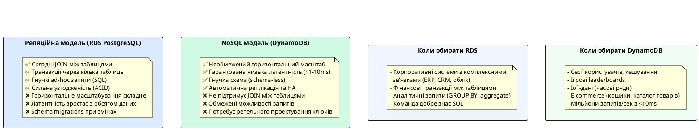

::

---

## Модель даних DynamoDB: таблиці, елементи та атрибути

### Таблиця (Table)

**Таблиця (Table)** є найвищим рівнем організації даних у DynamoDB. На перший погляд, таблиця DynamoDB схожа на таблицю реляційної бази даних — вона має назву та містить записи. Проте між ними існує принципова різниця у семантиці.

У реляційній моделі таблиця визначає **схему**: структуру кожного рядка з іменами стовпців та їхніми типами задають при CREATE TABLE, і всі рядки повинні відповідати цій схемі. DynamoDB, навпаки, є **schema-less** на рівні атрибутів: єдине, що таблиця DynamoDB вимагає від кожного елемента — наявність атрибутів, що складають первинний ключ. Решта атрибутів кожного елемента може бути абсолютно довільною та різною від елемента до елемента.

Таблиця DynamoDB є незалежним ресурсом — вона не "належить" схемі чи базі даних. Якщо в PostgreSQL ви маєте `database → schema → table`, то у DynamoDB ієрархія скорочується до `table`. Це означає, що таблиці DynamoDB не можуть бути об'єднані через JOIN навіть синтаксично — такого механізму не існує.

### Елемент (Item)

**Елемент (Item)** — це одиниця даних у таблиці DynamoDB, аналог рядка (row) у реляційній базі даних. Кожен елемент унікально ідентифікується своїм первинним ключем та є колекцією атрибутів. Максимальний розмір одного елемента — **400 KB** (разом з іменами атрибутів та значеннями).

Відсутність фіксованої схеми надає DynamoDB надзвичайну гнучкість при еволюції моделі даних. Уявіть таблицю `Products`, де різні категорії товарів мають різний набір атрибутів:

```json
// Елемент 1: Книга
{
    "ProductId": "book-001",
    "Category": "Book",
    "Title": "Clean Code",
    "Author": "Robert C. Martin",
    "ISBN": "978-0132350884",
    "Pages": 431,
    "Price": 35.00
}

// Елемент 2: Електроніка
{
    "ProductId": "elec-002",
    "Category": "Electronics",
    "Title": "Sony WH-1000XM5",
    "Brand": "Sony",
    "WarrantyYears": 2,
    "BatteryLifeHours": 30,
    "Price": 349.99
}
```

Обидва елементи належать одній таблиці, але мають абсолютно різні набори атрибутів. У PostgreSQL для цього знадобилося б або успадкування таблиць, або поле типу `JSONB`, або окремі таблиці для кожної категорії.

### Атрибут (Attribute) та система типів

**Атрибут (Attribute)** — це пара "ім'я–значення", що належить конкретному елементу. DynamoDB підтримує систему типів даних, яка суттєво відрізняється від SQL-типів:

::card-group

::card{title="Скалярні типи (Scalar)" icon="i-heroicons-tag"}

**String (S)** — рядок у кодуванні UTF-8. Порожній рядок (`""`) дозволений.

**Number (N)** — числове значення (ціле або дробове). Зберігається як рядок для збереження точності. Діапазон: до 38 значущих цифр.

**Binary (B)** — бінарні дані у форматі Base64. Використовується для зберігання зображень, стиснутих даних, криптографічних хешів.

**Boolean (BOOL)** — `true` або `false`.

**Null (NULL)** — відсутність значення. Атрибут типу Null займає місце, але не має значення.

::

::card{title="Документні типи (Document)" icon="i-heroicons-document"}

**Map (M)** — довільна структура вигляду "ключ–значення", аналог JSON-об'єкта. Значення кожного ключа може бути будь-яким типом DynamoDB, включаючи вкладені Map.

**List (L)** — впорядкована колекція значень довільних типів. Аналог JSON-масиву. Елементи списку можуть бути різних типів.

::

::card{title="Множинні типи (Set)" icon="i-heroicons-squares-2x2"}

**StringSet (SS)** — невпорядкована колекція унікальних рядків.

**NumberSet (NS)** — невпорядкована колекція унікальних чисел.

**BinarySet (BS)** — невпорядкована колекція унікальних бінарних значень.

_Важливо:_ Set не може бути порожнім. Всі елементи Set мають бути одного типу.

::

::

::plant-uml

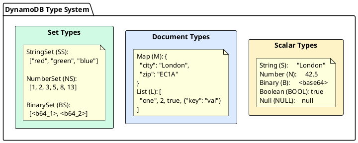

::

**Приклад елемента з вкладеними типами:**

```json
{
    "UserId": "usr-123",
    "Name": "Олена Петренко",
    "Email": "elena@example.com",
    "Age": 28,
    "IsActive": true,
    "Tags": ["developer", "aws-certified", "ukraine"],
    "Address": {
        "Country": "Ukraine",
        "City": "Kyiv",
        "ZipCode": "01001"
    },
    "Skills": ["C#", ".NET", "DynamoDB", "PostgreSQL"],
    "LastLoginAt": "2025-06-01T10:30:00Z"
}
```

У цьому прикладі:

- `UserId`, `Name`, `Email`, `LastLoginAt` — тип **String (S)**
- `Age` — тип **Number (N)**
- `IsActive` — тип **Boolean (BOOL)**
- `Tags` — тип **List (L)** зі String-елементами
- `Address` — тип **Map (M)** з вкладеними String-атрибутами
- `Skills` — тип **StringSet (SS)** (множина, не може містити дублікати)

---

## Первинний ключ (Primary Key): фундамент DynamoDB

Первинний ключ є найважливішим концептуальним елементом DynamoDB. На відміну від реляційних баз даних, де первинний ключ є лише засобом унікальної ідентифікації рядка, у DynamoDB первинний ключ виконує дві нерозривно пов'язані функції одночасно: **унікальну ідентифікацію** елемента та **визначення фізичного розташування** даних на серверах. Саме тому вибір первинного ключа є фундаментальним архітектурним рішенням, від якого залежить продуктивність системи при будь-якому масштабі.

DynamoDB підтримує два типи первинного ключа.

### Partition Key (Simple Primary Key)

**Partition Key** (також відомий як Hash Key або PK) — це простий первинний ключ, що складається з одного атрибута. DynamoDB використовує значення Partition Key як вхідні дані для детермінованої **хеш-функції**, результат якої визначає, на якому **фізичному сервері (partition)** зберігатиметься елемент.

::plant-uml

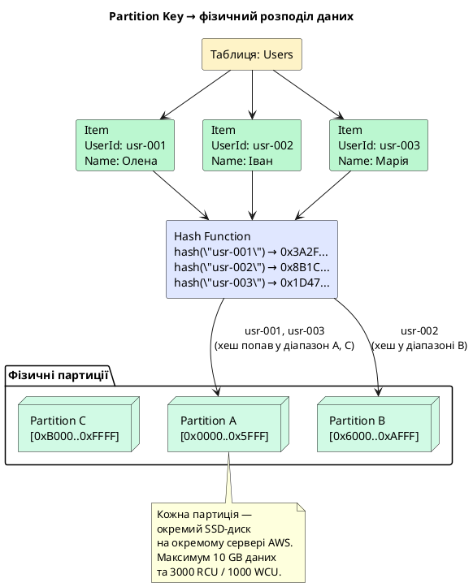

::

**Критична вимога до Partition Key: висока кардинальність.** Якщо всі або більшість елементів мають однакове значення Partition Key, всі вони потраплять на одну фізичну партицію. Ця ситуація називається **hot partition** (гаряча партиція) і є найчастішою причиною деградації продуктивності у DynamoDB. Детально розглянемо це у розділі Best Practices.

**Приклади хороших Partition Key:**

- `UserId` (UUID) — висока кардинальність, рівномірний розподіл
- `OrderId` (UUID або timestamp-based) — унікальний для кожного запису
- `DeviceId` (для IoT) — кожен пристрій має унікальний ідентифікатор

**Приклади поганих Partition Key:**

- `Country` — лише ~200 унікальних значень, більшість запитів сконцентровано на одній-двох країнах
- `Status` ("active", "inactive") — лише 2 значення, "active" буде hot partition
- `Date` (тільки дата без часу) — всі записи за один день на одній партиції

### Composite Primary Key: Partition Key + Sort Key

**Composite Primary Key** (або Range Key) складається з двох атрибутів: **Partition Key** та **Sort Key**. Ця комбінація надає DynamoDB принципово нові можливості для запитів. Partition Key визначає, на якій фізичній партиції зберігатиметься елемент, а Sort Key визначає **порядок зберігання** елементів _всередині_ однієї партиції.

Ключова відмінність від простого первинного ключа: при Composite Primary Key кілька елементів **можуть мати однакове значення Partition Key** — це цілком допустимо і є основним патерном проектування. Унікальність елемента визначається парою (Partition Key, Sort Key).

::plant-uml

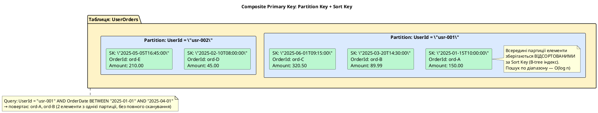

::

**Можливості запитів із Sort Key.** Наявність Sort Key відкриває можливість ефективних **Query**-операцій із умовою на значення Sort Key. DynamoDB підтримує такі оператори для Sort Key у межах однієї партиції:

| Оператор      | Значення               | Приклад                             |
| ------------- | ---------------------- | ----------------------------------- |
| `=`           | Точне значення         | `OrderDate = "2025-06-01T10:00:00"` |
| `<`, `<=`     | Менше або рівне        | `Score <= 100`                      |
| `>`, `>=`     | Більше або рівне       | `CreatedAt >= "2025-01-01"`         |
| `BETWEEN`     | Включний діапазон      | `Score BETWEEN 50 AND 100`          |
| `begins_with` | Починається з префіксу | `OrderId begins_with "2025-06"`     |

::note
**Важливо:** оператор `begins_with` та всі порівняльні оператори для Sort Key працюють тільки всередині однієї партиції. Неможливо знайти всі елементи з Sort Key, що "починається з X" **по всій таблиці** без сканування. Для таких запитів необхідні Global Secondary Index (розглянемо у наступному розділі).
::

**Паттерни проектування з Composite Primary Key.** Розуміння цього патерну є ключовим для ефективного використання DynamoDB. Partition Key групує пов'язані елементи в одну партицію, Sort Key впорядковує їх для ефективного пошуку:

::plant-uml

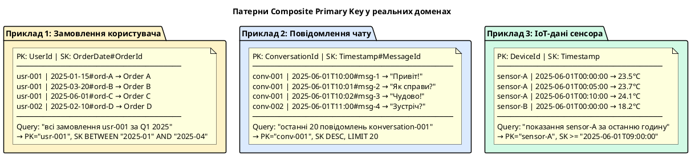

::

---

## Операції читання і запису: базовий API

Розуміння базових операцій DynamoDB є необхідною передумовою для обговорення продуктивності та проектування схем. DynamoDB надає чіткий поділ між операціями для **одного елемента** та операціями для **множини елементів**.

### Операції з одним елементом

**GetItem** — найшвидша операція в DynamoDB. Отримує рівно один елемент за його повним первинним ключем (Partition Key + Sort Key, якщо є). GetItem завжди звертається до конкретної партиції — жодного сканування, жодних індексів, гарантований час O(1).

**PutItem** — записує або повністю замінює елемент за вказаним первинним ключем. Якщо елемент із таким ключем вже існує — він буде повністю замінений. Підтримує умовні записи (Condition Expression).

**UpdateItem** — оновлює конкретні атрибути існуючого елемента, не торкаючись інших. Є атомарним: або всі зміни застосовуються, або жодна. Підтримує атомарні лічильники (Atomic Counter).

**DeleteItem** — видаляє елемент за первинним ключем. Підтримує умовне видалення.

### Операції з множиною елементів

**Query** — отримує один або кілька елементів, що відповідають заданому Partition Key та (необов'язково) умові на Sort Key. Query виконується **виключно всередині однієї партиції** — це забезпечує ефективність. Query — це основна операція запиту у правильно спроектованій таблиці DynamoDB.

**Scan** — проходить по **всіх** елементах таблиці або індексу. Scan є дорогою операцією: він читає кожен елемент, споживає одиниці пропускної здатності для кожного прочитаного елемента, навіть якщо результат фільтрується. Scan використовується виключно для адміністративних задач або однократного аналізу даних.

::plant-uml

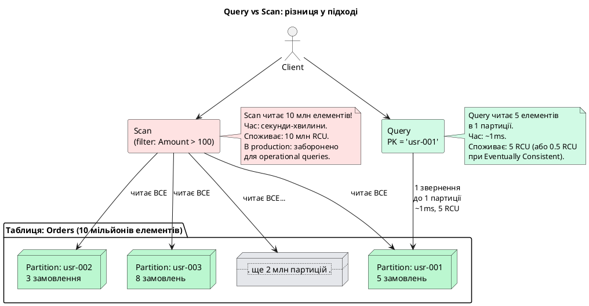

::

::tip
**Правило DynamoDB-архітектора:** якщо ваш застосунок виконує Scan для операційних запитів (тих, що відбуваються у real-time під час роботи користувача) — таблиця спроектована неправильно. Scan є прийнятним лише для одноразових адміністративних операцій (наприклад, міграція даних) або аналітики поза виробничим контуром.
::

### Batch-операції та транзакції

**BatchGetItem** — дозволяє отримати до 100 елементів з однієї або кількох таблиць за один API-виклик. Внутрішньо DynamoDB паралелізує читання, тому час виконання близький до часу читання одного елемента.

**BatchWriteItem** — дозволяє записати або видалити до 25 елементів за один виклик. Операції у BatchWriteItem **не є атомарними** — можливий частковий успіх (деякі елементи записані, деякі — ні). Елементи, що не вдалося обробити, повертаються у полі `UnprocessedItems`.

**TransactWriteItems / TransactGetItems** — атомарні транзакції через кілька елементів і таблиць (детально розглянемо у відповідному розділі).

---

## Створення таблиці DynamoDB: консоль та AWS CLI

### Консоль AWS Management Console

Найпростіший спосіб ознайомитися з DynamoDB — створити таблицю через web-консоль. Перейдіть до сервісу **DynamoDB** → **Tables** → **Create table**.

**Кроки створення таблиці `UserSessions`:**

1. **Table name:** `UserSessions`
2. **Partition key:** `UserId` (тип String)
3. **Sort key:** `SessionId` (тип String) _(необов'язково, але рекомендовано)_
4. **Table settings:** для початку — **Default settings** (On-Demand capacity mode)
5. **Create table**

::plant-uml

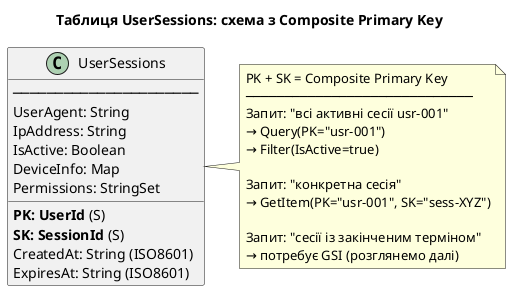

::

### Створення через AWS CLI та PowerShell

AWS CLI надає повний контроль над параметрами таблиці та є основою для автоматизації та Infrastructure-as-Code:

::tabs

::tabs-item{label="AWS CLI (bash)"}

```bash
# Створення таблиці UserSessions з Composite Primary Key
aws dynamodb create-table \
    --table-name UserSessions \
    --attribute-definitions \
        AttributeName=UserId,AttributeType=S \
        AttributeName=SessionId,AttributeType=S \
    --key-schema \
        AttributeName=UserId,KeyType=HASH \
        AttributeName=SessionId,KeyType=RANGE \
    --billing-mode PAY_PER_REQUEST \
    --region eu-central-1
```

::

::tabs-item{label="PowerShell"}

```powershell
# Встановити AWS Tools for PowerShell (якщо ще не встановлено)
# Install-Module -Name AWS.Tools.DynamoDBv2 -Force

# Створення таблиці UserSessions з Composite Primary Key
$attrUserId    = New-DDBAttributeDefinition -AttributeName UserId    -AttributeType S
$attrSessionId = New-DDBAttributeDefinition -AttributeName SessionId -AttributeType S

$keyUserId    = New-DDBKeySchemaElement -AttributeName UserId    -KeyType HASH
$keySessionId = New-DDBKeySchemaElement -AttributeName SessionId -KeyType RANGE

New-DDBTable `
    -TableName   UserSessions `
    -AttributeDefinition @($attrUserId, $attrSessionId) `
    -KeySchema   @($keyUserId, $keySessionId) `
    -BillingMode PAY_PER_REQUEST `
    -Region      eu-central-1
```

::

::

::terminal-preview{title="Створення таблиці UserSessions"}

<div class="line"><span class="opacity-40">$</span> <strong>aws dynamodb create-table --table-name UserSessions ...</strong></div>
<div class="line">{</div>
<div class="line">    <span class="text-blue-400">"TableDescription"</span>: {</div>
<div class="line">        <span class="text-blue-400">"TableName"</span>: <span class="text-green-400">"UserSessions"</span>,</div>
<div class="line">        <span class="text-blue-400">"TableStatus"</span>: <span class="text-yellow-400">"CREATING"</span>,</div>
<div class="line">        <span class="text-blue-400">"TableArn"</span>: <span class="text-green-400">"arn:aws:dynamodb:eu-central-1:123456789012:table/UserSessions"</span>,</div>
<div class="line">        <span class="text-blue-400">"KeySchema"</span>: [</div>
<div class="line">            { <span class="text-blue-400">"AttributeName"</span>: <span class="text-green-400">"UserId"</span>, <span class="text-blue-400">"KeyType"</span>: <span class="text-green-400">"HASH"</span> },</div>
<div class="line">            { <span class="text-blue-400">"AttributeName"</span>: <span class="text-green-400">"SessionId"</span>, <span class="text-blue-400">"KeyType"</span>: <span class="text-green-400">"RANGE"</span> }</div>
<div class="line">        ],</div>
<div class="line">        <span class="text-blue-400">"BillingModeSummary"</span>: {</div>
<div class="line">            <span class="text-blue-400">"BillingMode"</span>: <span class="text-green-400">"PAY_PER_REQUEST"</span></div>
<div class="line">        }</div>
<div class="line">    }</div>
<div class="line">}</div>

::

::tabs

::tabs-item{label="AWS CLI (bash)"}

```bash
# Дочекатися поки таблиця перейде у стан ACTIVE
aws dynamodb wait table-exists \
    --table-name UserSessions \
    --region eu-central-1

echo "Таблиця UserSessions готова"

# Перевірити статус таблиці
aws dynamodb describe-table \
    --table-name UserSessions \
    --region eu-central-1 \
    --query "Table.{Status: TableStatus, ItemCount: ItemCount, SizeBytes: TableSizeBytes}"
```

::

::tabs-item{label="PowerShell"}

```powershell
# Дочекатися стану ACTIVE (з timeout 5 хвилин)
$timeout = [DateTime]::UtcNow.AddMinutes(5)
do {
    $table = Get-DDBTable -TableName UserSessions -Region eu-central-1
    if ($table.TableStatus -eq 'ACTIVE') { break }
    Write-Host "Статус: $($table.TableStatus) — очікуємо..."
    Start-Sleep -Seconds 5
} until ([DateTime]::UtcNow -ge $timeout)

Write-Host "Таблиця UserSessions готова"

# Перевірити статус таблиці
$t = Get-DDBTable -TableName UserSessions -Region eu-central-1
[PSCustomObject]@{
    Status    = $t.TableStatus
    ItemCount = $t.ItemCount
    SizeBytes = $t.TableSizeBytes
}
```

::

::

::terminal-preview{title="Статус таблиці після створення"}

<div class="line"><span class="opacity-40">$</span> <strong>aws dynamodb describe-table --table-name UserSessions ...</strong></div>
<div class="line">{</div>
<div class="line">    <span class="text-blue-400">"Status"</span>: <span class="text-green-400">"ACTIVE"</span>,</div>
<div class="line">    <span class="text-blue-400">"ItemCount"</span>: <span class="text-yellow-400">0</span>,</div>
<div class="line">    <span class="text-blue-400">"SizeBytes"</span>: <span class="text-yellow-400">0</span></div>
<div class="line">}</div>

::

### CRUD-операції

::tabs

::tabs-item{label="AWS CLI (bash)"}

```bash
# ── PutItem: записати новий елемент ───────────────────────────────────────
aws dynamodb put-item \
    --table-name UserSessions \
    --item '{
        "UserId":    {"S": "usr-001"},
        "SessionId": {"S": "sess-a1b2c3d4"},
        "CreatedAt": {"S": "2025-06-01T10:00:00Z"},
        "ExpiresAt": {"S": "2025-06-01T22:00:00Z"},
        "IpAddress": {"S": "203.0.113.42"},
        "UserAgent": {"S": "Mozilla/5.0 (Windows NT 10.0; Win64; x64)"},
        "IsActive":  {"BOOL": true}
    }' \
    --region eu-central-1

# ── GetItem: отримати один елемент ────────────────────────────────────────
aws dynamodb get-item \
    --table-name UserSessions \
    --key '{"UserId": {"S": "usr-001"}, "SessionId": {"S": "sess-a1b2c3d4"}}' \
    --region eu-central-1

# ── Query: знайти всі сесії користувача ──────────────────────────────────
aws dynamodb query \
    --table-name UserSessions \
    --key-condition-expression "UserId = :uid" \
    --expression-attribute-values '{":uid": {"S": "usr-001"}}' \
    --region eu-central-1

# ── UpdateItem: деактивувати сесію ────────────────────────────────────────
aws dynamodb update-item \
    --table-name UserSessions \
    --key '{"UserId": {"S": "usr-001"}, "SessionId": {"S": "sess-a1b2c3d4"}}' \
    --update-expression "SET IsActive = :false" \
    --expression-attribute-values '{":false": {"BOOL": false}}' \
    --region eu-central-1

# ── DeleteItem: видалити сесію ───────────────────────────────────────────
aws dynamodb delete-item \
    --table-name UserSessions \
    --key '{"UserId": {"S": "usr-001"}, "SessionId": {"S": "sess-a1b2c3d4"}}' \
    --region eu-central-1
```

::

::tabs-item{label="PowerShell"}

```powershell
Import-Module AWS.Tools.DynamoDBv2

# ── PutItem: записати новий елемент ───────────────────────────────────────
$item = @{
    UserId    = New-DDBEntry -S 'usr-001'
    SessionId = New-DDBEntry -S 'sess-a1b2c3d4'
    CreatedAt = New-DDBEntry -S '2025-06-01T10:00:00Z'
    ExpiresAt = New-DDBEntry -S '2025-06-01T22:00:00Z'
    IpAddress = New-DDBEntry -S '203.0.113.42'
    UserAgent = New-DDBEntry -S 'Mozilla/5.0 (Windows NT 10.0; Win64; x64)'
    IsActive  = New-DDBEntry -BOOL $true
}
Set-DDBItem -TableName UserSessions -Item $item -Region eu-central-1

# ── GetItem: отримати один елемент ────────────────────────────────────────
$key = @{
    UserId    = New-DDBEntry -S 'usr-001'
    SessionId = New-DDBEntry -S 'sess-a1b2c3d4'
}
Get-DDBItem -TableName UserSessions -Key $key -Region eu-central-1

# ── Query: знайти всі сесії користувача ──────────────────────────────────
$queryRequest = [Amazon.DynamoDBv2.Model.QueryRequest]@{
    TableName                 = 'UserSessions'
    KeyConditionExpression    = 'UserId = :uid'
    ExpressionAttributeValues = @{
        ':uid' = New-DDBEntry -S 'usr-001'
    }
}
Invoke-DDBQuery -QueryRequest $queryRequest -Region eu-central-1

# ── UpdateItem: деактивувати сесію ────────────────────────────────────────
$updateRequest = [Amazon.DynamoDBv2.Model.UpdateItemRequest]@{
    TableName        = 'UserSessions'
    Key              = @{
        UserId    = New-DDBEntry -S 'usr-001'
        SessionId = New-DDBEntry -S 'sess-a1b2c3d4'
    }
    UpdateExpression = 'SET IsActive = :false'
    ExpressionAttributeValues = @{
        ':false' = New-DDBEntry -BOOL $false
    }
}
Update-DDBItem -UpdateItemRequest $updateRequest -Region eu-central-1

# ── DeleteItem: видалити сесію ───────────────────────────────────────────
$delKey = @{
    UserId    = New-DDBEntry -S 'usr-001'
    SessionId = New-DDBEntry -S 'sess-a1b2c3d4'
}
Remove-DDBItem -TableName UserSessions -Key $delKey -Region eu-central-1
```

::

::

::terminal-preview{title="Query: всі сесії користувача usr-001"}

<div class="line"><span class="opacity-40">$</span> <strong>aws dynamodb query --table-name UserSessions --key-condition-expression "UserId = :uid" ...</strong></div>
<div class="line">{</div>
<div class="line">    <span class="text-blue-400">"Items"</span>: [</div>
<div class="line">        {</div>
<div class="line">            <span class="text-blue-400">"UserId"</span>:    { <span class="text-blue-400">"S"</span>: <span class="text-green-400">"usr-001"</span> },</div>
<div class="line">            <span class="text-blue-400">"SessionId"</span>: { <span class="text-blue-400">"S"</span>: <span class="text-green-400">"sess-a1b2c3d4"</span> },</div>
<div class="line">            <span class="text-blue-400">"IsActive"</span>:  { <span class="text-blue-400">"BOOL"</span>: <span class="text-yellow-400">true</span> },</div>
<div class="line">            <span class="text-blue-400">"CreatedAt"</span>: { <span class="text-blue-400">"S"</span>: <span class="text-green-400">"2025-06-01T10:00:00Z"</span> }</div>
<div class="line">        }</div>
<div class="line">    ],</div>
<div class="line">    <span class="text-blue-400">"Count"</span>: <span class="text-yellow-400">1</span>,</div>
<div class="line">    <span class="text-blue-400">"ScannedCount"</span>: <span class="text-yellow-400">1</span></div>
<div class="line">}</div>

::

---

## Одиниці пропускної здатності: RCU та WCU

Для розуміння режимів ємності (наступний розділ) необхідно спочатку розібратися з **Request Capacity Units (RCU та WCU)** — одиницями вимірювання навантаження на DynamoDB.

### Read Capacity Units (RCU)

**1 RCU = 1 strongly consistent read елемента розміром до 4 KB за секунду**  
або  
**1 RCU = 2 eventually consistent reads елементів розміром до 4 KB за секунду**

**Strongly consistent read** гарантує, що читання відображає всі успішно завершені операції запису, що відбулися до моменту читання. Ця гарантія забезпечується зверненням до primary replica і є дорожчою.

**Eventually consistent read** може повертати дані, що не відображають останній запис (затримка до секунди у "розповсюдженні" запису між репліками). Є вдвічі дешевшою і є достатньою для більшості сценаріїв читання.

**Формула розрахунку RCU:**

$$\text{RCU} = \left\lceil \frac{\text{item size}}{4\text{ KB}} \right\rceil \times \frac{1}{\text{consistency factor}}$$

де consistency factor = 1 для strongly consistent, 2 для eventually consistent.

**Приклади:**

| Розмір елемента | Тип читання           | Кількість reads/s | Потрібно RCU |
| --------------- | --------------------- | ----------------- | ------------ |
| 1 KB            | Strongly consistent   | 100               | 100          |
| 1 KB            | Eventually consistent | 100               | 50           |
| 6 KB            | Strongly consistent   | 100               | 200          |
| 6 KB            | Eventually consistent | 100               | 100          |
| 10 KB           | Strongly consistent   | 50                | 150          |

### Write Capacity Units (WCU)

**1 WCU = 1 write елемента розміром до 1 KB за секунду**

Записи в DynamoDB є вдвічі "дорожчими" ніж читання у відношенні розміру: якщо для читання одна одиниця покриває 4 KB, то для запису — лише 1 KB.

$$\text{WCU} = \left\lceil \frac{\text{item size}}{1\text{ KB}} \right\rceil \times \text{writes per second}$$

**Приклади:**

| Розмір елемента | Операцій запису/s | Потрібно WCU |
| --------------- | ----------------- | ------------ |
| 0.5 KB          | 100               | 100          |
| 1 KB            | 100               | 100          |
| 2.5 KB          | 100               | 300          |
| 5 KB            | 50                | 250          |

::note
**Транзакційні операції (TransactWriteItems/TransactGetItems) коштують вдвічі дорожче:** 2 RCU за strongly consistent transactional read та 2 WCU за transactional write. Це ціна гарантій ACID-транзакцій у розподіленій системі.
::

::plant-uml

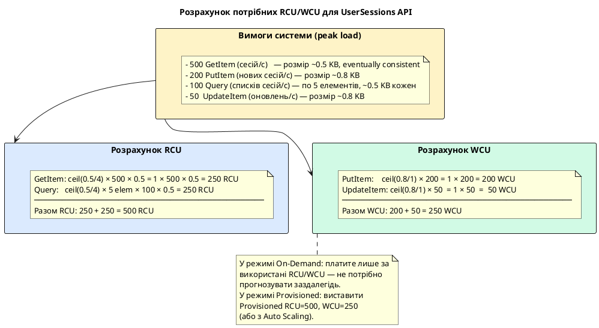

::

---

## Secondary Indexes: запити поза первинним ключем

Ми з'ясували фундаментальне обмеження DynamoDB: операція Query може шукати елементи **лише за Partition Key** основної таблиці. Це означає, що таблиця `UserSessions` з PK=`UserId` / SK=`SessionId` ефективно відповідає на запитання «які сесії має користувач X?», але абсолютно не здатна відповісти на «які сесії закінчились до певної дати?» або «які сесії з конкретної IP-адреси?» — без повного Scan всієї таблиці.

DynamoDB вирішує цю проблему через **Secondary Indexes** — механізм, що дозволяє визначити альтернативну схему ключів для таблиці та виконувати Query за цією альтернативною схемою. Існує два типи Secondary Indexes з принципово різними характеристиками.

::plant-uml

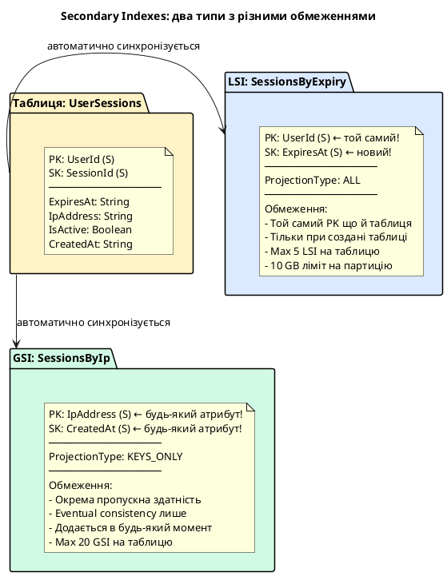

::

---

## Local Secondary Index (LSI)

**Local Secondary Index (LSI)** — це вторинний індекс, що **обов'язково використовує той самий Partition Key**, що й основна таблиця, але дозволяє вказати інший атрибут як Sort Key. Слово «Local» у назві означає саме це: індекс є «локальним» у межах однієї партиції — всі дані LSI, що належать одному PK, зберігаються разом з відповідною партицією основної таблиці.

### Коли і навіщо потрібен LSI

Rозглянемо конкретний сценарій. Таблиця `UserSessions` має PK=`UserId`, SK=`SessionId`. Можна ефективно знаходити всі сесії конкретного користувача, або конкретну сесію за її ID. Але є ще один частий запит: «знайди всі сесії користувача, що закінчаться до певного моменту» — наприклад, для відображення попередження про скоре закінчення сесії або для cleanup-задачі. При існуючій схемі це вимагає Query по UserId + фільтрацію по ExpiresAt, що прочитає всі сесії користувача і відфільтрує їх на стороні клієнта. LSI з SK=`ExpiresAt` вирішує це ефективним Query із умовою на Sort Key.

::plant-uml

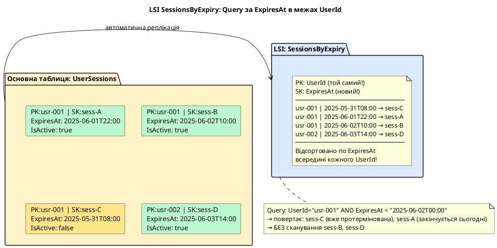

::

### Обмеження LSI: 10 GB на партицію

Найважливіше обмеження LSI: загальний розмір всіх елементів **однієї партиції** (тобто всіх елементів з однаковим PK) — разом у основній таблиці та всіх LSI — не може перевищувати **10 GB**. Якщо один користувач накопичить більше 10 GB даних (включно з усіма LSI-проекціями) — наступні операції запису на цей PK завершаться помилкою.

Це означає, що LSI **не підходить** для таблиць, де один PK може мати необмежену кількість елементів. Якщо в таблиці `UserSessions` один активний сервіс генерує мільярди сесій з одним `UserId` (наприклад, сервіс-акаунт) — 10 GB ліміт стає реальною проблемою.

### Ще одне обмеження: LSI створюється лише разом із таблицею

LSI неможливо додати до вже існуючої таблиці — це кардинальна відмінність від GSI. Якщо ви виявили, що вам потрібен LSI після того, як таблиця вже містить дані — доведеться створити нову таблицю з LSI і перенести всі дані. Тому LSI потрібно планувати заздалегідь.

### Projection Types — що зберігати в індексі

Кожен Secondary Index зберігає не просто ключі, але й **атрибути** елементів — це називається **Projection**. Вибір типу проекції впливає на розмір індексу (а отже, на витрати) та на те, чи потрібно читати основну таблицю для отримання додаткових атрибутів.

::card-group

::card{title="KEYS_ONLY" icon="i-heroicons-key"}

Індекс зберігає лише ключові атрибути: PK та SK основної таблиці + PK та SK індексу. Мінімальний розмір → мінімальні витрати. Якщо потрібні інші атрибути — DynamoDB автоматично виконує додаткове читання основної таблиці.

**Коли:** часто використовується як «існування» (перевірити чи є такий запис), або якщо майже завжди потрібно також читати основну таблицю для деталей.

::

::card{title="INCLUDE" icon="i-heroicons-list-bullet"}

Зберігає ключові атрибути + явно вказаний список атрибутів (`NonKeyAttributes`). Дозволяє точно контролювати, які поля дублюються в індексі.

**Коли:** коли відомий фіксований набір атрибутів, що потрібні при Query через індекс. Наприклад, `ExpiresAt` + `IsActive` — достатньо для перевірки статусу сесії без читання повного елемента.

::

::card{title="ALL" icon="i-heroicons-square-3-stack-3d"}

Зберігає всі атрибути елемента. Максимальний розмір індексу — фактично дублювання всієї таблиці. Але Query через індекс повертає повний елемент без додаткових читань.

**Коли:** якщо при Query через індекс завжди потрібні всі атрибути, і витрати на зберігання прийнятні.

::

::

::tip
**Практичне правило для Projection:** починайте з `KEYS_ONLY` або `INCLUDE` (мінімально необхідний набір атрибутів для вашого Query). `ALL` зручний, але подвоює або потроює витрати на зберігання. DynamoDB не дозволяє змінити Projection після створення індексу — треба перестворювати.
::

### Створення таблиці з LSI

::tabs

::tabs-item{label="AWS CLI (bash)"}

```bash
# Таблиця UserSessions з LSI SessionsByExpiry
aws dynamodb create-table \
    --table-name UserSessions \
    --attribute-definitions \
        AttributeName=UserId,AttributeType=S \
        AttributeName=SessionId,AttributeType=S \
        AttributeName=ExpiresAt,AttributeType=S \
    --key-schema \
        AttributeName=UserId,KeyType=HASH \
        AttributeName=SessionId,KeyType=RANGE \
    --local-secondary-indexes '[
        {
            "IndexName": "SessionsByExpiry",
            "KeySchema": [
                {"AttributeName": "UserId",    "KeyType": "HASH"},
                {"AttributeName": "ExpiresAt", "KeyType": "RANGE"}
            ],
            "Projection": {
                "ProjectionType": "INCLUDE",
                "NonKeyAttributes": ["IsActive", "IpAddress"]
            }
        }
    ]' \
    --billing-mode PAY_PER_REQUEST \
    --region eu-central-1
```

::

::tabs-item{label="PowerShell"}

```powershell
$attrUserId    = New-DDBAttributeDefinition -AttributeName UserId    -AttributeType S
$attrSessionId = New-DDBAttributeDefinition -AttributeName SessionId -AttributeType S
$attrExpiresAt = New-DDBAttributeDefinition -AttributeName ExpiresAt -AttributeType S

$keyUserId    = New-DDBKeySchemaElement -AttributeName UserId    -KeyType HASH
$keySessionId = New-DDBKeySchemaElement -AttributeName SessionId -KeyType RANGE

# LSI: той самий PK (UserId), новий SK (ExpiresAt)
$lsiKey1 = New-DDBKeySchemaElement -AttributeName UserId    -KeyType HASH
$lsiKey2 = New-DDBKeySchemaElement -AttributeName ExpiresAt -KeyType RANGE

$lsiProjection = [Amazon.DynamoDBv2.Model.Projection]@{
    ProjectionType   = 'INCLUDE'
    NonKeyAttributes = @('IsActive', 'IpAddress')
}

$lsi = [Amazon.DynamoDBv2.Model.LocalSecondaryIndex]@{
    IndexName  = 'SessionsByExpiry'
    KeySchema  = @($lsiKey1, $lsiKey2)
    Projection = $lsiProjection
}

New-DDBTable `
    -TableName            UserSessions `
    -AttributeDefinition  @($attrUserId, $attrSessionId, $attrExpiresAt) `
    -KeySchema            @($keyUserId, $keySessionId) `
    -LocalSecondaryIndex  @($lsi) `
    -BillingMode          PAY_PER_REQUEST `
    -Region               eu-central-1
```

::

::

### Query через LSI

::tabs

::tabs-item{label="AWS CLI (bash)"}

```bash
# Знайти сесії usr-001, що закінчаться до 2025-06-02T00:00:00Z
aws dynamodb query \
    --table-name UserSessions \
    --index-name SessionsByExpiry \
    --key-condition-expression "UserId = :uid AND ExpiresAt < :exp" \
    --expression-attribute-values '{
        ":uid": {"S": "usr-001"},
        ":exp": {"S": "2025-06-02T00:00:00Z"}
    }' \
    --region eu-central-1
```

::

::tabs-item{label="PowerShell"}

```powershell
$queryRequest = [Amazon.DynamoDBv2.Model.QueryRequest]@{
    TableName              = 'UserSessions'
    IndexName              = 'SessionsByExpiry'
    KeyConditionExpression = 'UserId = :uid AND ExpiresAt < :exp'
    ExpressionAttributeValues = @{
        ':uid' = New-DDBEntry -S 'usr-001'
        ':exp' = New-DDBEntry -S '2025-06-02T00:00:00Z'
    }
}
Invoke-DDBQuery -QueryRequest $queryRequest -Region eu-central-1
```

::

::

::terminal-preview{title="Query через LSI SessionsByExpiry"}

<div class="line"><span class="opacity-40">$</span> <strong>aws dynamodb query --index-name SessionsByExpiry --key-condition-expression "UserId = :uid AND ExpiresAt &lt; :exp" ...</strong></div>
<div class="line">{</div>
<div class="line">    <span class="text-blue-400">"Items"</span>: [</div>
<div class="line">        {</div>
<div class="line">            <span class="text-blue-400">"UserId"</span>:    { <span class="text-blue-400">"S"</span>: <span class="text-green-400">"usr-001"</span> },</div>
<div class="line">            <span class="text-blue-400">"SessionId"</span>: { <span class="text-blue-400">"S"</span>: <span class="text-green-400">"sess-C"</span> },</div>
<div class="line">            <span class="text-blue-400">"ExpiresAt"</span>: { <span class="text-blue-400">"S"</span>: <span class="text-green-400">"2025-05-31T08:00:00Z"</span> },</div>
<div class="line">            <span class="text-blue-400">"IsActive"</span>:  { <span class="text-blue-400">"BOOL"</span>: <span class="text-yellow-400">false</span> },</div>
<div class="line">            <span class="text-blue-400">"IpAddress"</span>: { <span class="text-blue-400">"S"</span>: <span class="text-green-400">"203.0.113.42"</span> }</div>
<div class="line">        },</div>
<div class="line">        {</div>
<div class="line">            <span class="text-blue-400">"UserId"</span>:    { <span class="text-blue-400">"S"</span>: <span class="text-green-400">"usr-001"</span> },</div>
<div class="line">            <span class="text-blue-400">"SessionId"</span>: { <span class="text-blue-400">"S"</span>: <span class="text-green-400">"sess-A"</span> },</div>
<div class="line">            <span class="text-blue-400">"ExpiresAt"</span>: { <span class="text-blue-400">"S"</span>: <span class="text-green-400">"2025-06-01T22:00:00Z"</span> },</div>
<div class="line">            <span class="text-blue-400">"IsActive"</span>:  { <span class="text-blue-400">"BOOL"</span>: <span class="text-yellow-400">true</span> },</div>
<div class="line">            <span class="text-blue-400">"IpAddress"</span>: { <span class="text-blue-400">"S"</span>: <span class="text-green-400">"198.51.100.7"</span> }</div>
<div class="line">        }</div>
<div class="line">    ],</div>
<div class="line">    <span class="text-blue-400">"Count"</span>: <span class="text-yellow-400">2</span>,</div>
<div class="line">    <span class="text-blue-400">"ScannedCount"</span>: <span class="text-yellow-400">2</span></div>
<div class="line">}</div>

::

---

## Global Secondary Index (GSI)

**Global Secondary Index (GSI)** — це вторинний індекс з абсолютно довільним вибором як Partition Key, так і Sort Key — будь-які атрибути таблиці, незалежно від основного ключа. Слово «Global» означає, що індекс охоплює **всі партиції** таблиці, а не є локальним для однієї.

GSI є значно потужнішим інструментом ніж LSI і не має 10 GB обмеження на партицію. Більше того, GSI можна **додати або видалити у будь-який момент** — навіть на існуючу таблицю з даними. AWS асинхронно заповнює GSI даними з основної таблиці, після чого індекс стає активним.

### Архітектура GSI: окрема таблиця всередині

Під капотом GSI є фактично **окремою таблицею**, яку DynamoDB автоматично підтримує в синхронізованому стані з основною. Ця «прихована» таблиця має свій власний набір партицій, свою пропускну здатність (при Provisioned mode), і зберігає проекцію атрибутів основної таблиці.

Це пояснює два важливі наслідки:

1. **Eventual consistency:** GSI завжди читається з eventually consistent read (strongly consistent недоступний). Запис до основної таблиці реплікується в GSI з невеликою затримкою.
2. **Окрема пропускна здатність:** у Provisioned mode GSI має власні RCU/WCU, незалежні від основної таблиці.

::plant-uml

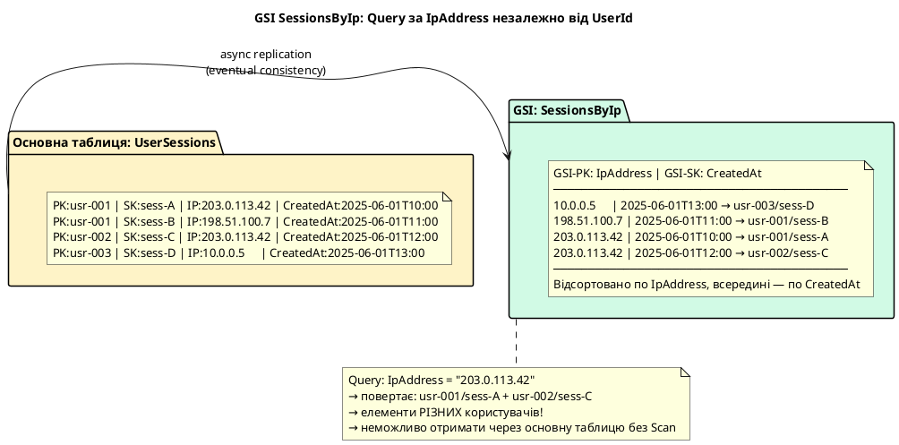

::

### Sparse Index — потужний патерн GSI

**Sparse Index** — один з найважливіших патернів проектування GSI. Ідея полягає в тому, що GSI індексує лише ті елементи, у яких **існує** атрибут, що є Partition Key або Sort Key GSI. Якщо елемент не має цього атрибута — він **не з'являється в GSI**.

Це відкриває можливість ефективно моделювати «підмножини» елементів таблиці без дублювання всіх даних. Класичний приклад: таблиця з мільярдами замовлень, але тільки деякі мають статус «PENDING» (потребують обробки). Якщо атрибут `NeedsProcessing` існує лише у елементів зі статусом PENDING — GSI з PK=`NeedsProcessing` буде містити лише ці елементи.

::plant-uml

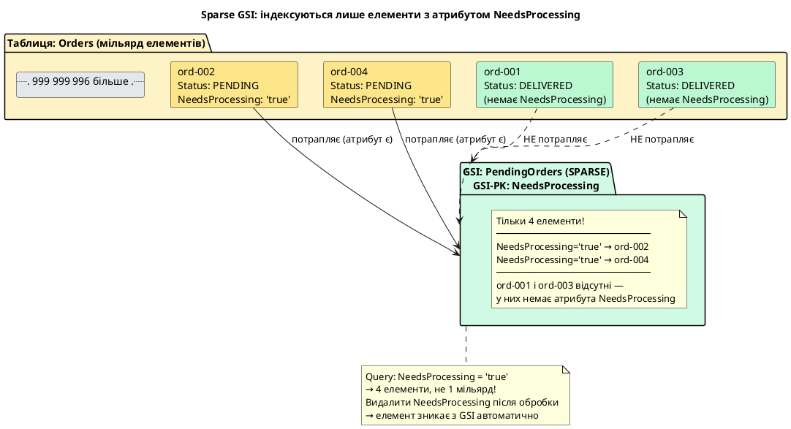

::

### Додавання GSI до існуючої таблиці

::tabs

::tabs-item{label="AWS CLI (bash)"}

```bash
# Додати GSI SessionsByIp до існуючої таблиці UserSessions
# (IpAddress → PK, CreatedAt → SK, проекція: INCLUDE з ключовими атрибутами)
aws dynamodb update-table \
    --table-name UserSessions \
    --attribute-definitions \
        AttributeName=IpAddress,AttributeType=S \
        AttributeName=CreatedAt,AttributeType=S \
    --global-secondary-index-updates '[{
        "Create": {
            "IndexName": "SessionsByIp",
            "KeySchema": [
                {"AttributeName": "IpAddress", "KeyType": "HASH"},
                {"AttributeName": "CreatedAt", "KeyType": "RANGE"}
            ],
            "Projection": {
                "ProjectionType": "INCLUDE",
                "NonKeyAttributes": ["UserId", "IsActive"]
            }
        }
    }]' \
    --region eu-central-1

# Перевірити статус GSI (CREATING → ACTIVE)
aws dynamodb describe-table \
    --table-name UserSessions \
    --region eu-central-1 \
    --query "Table.GlobalSecondaryIndexes[*].{Name:IndexName, Status:IndexStatus}"
```

::

::tabs-item{label="PowerShell"}

```powershell
$attrIp        = New-DDBAttributeDefinition -AttributeName IpAddress -AttributeType S
$attrCreatedAt = New-DDBAttributeDefinition -AttributeName CreatedAt -AttributeType S

$gsiKeyIp        = New-DDBKeySchemaElement -AttributeName IpAddress -KeyType HASH
$gsiKeyCreatedAt = New-DDBKeySchemaElement -AttributeName CreatedAt -KeyType RANGE

$gsiProjection = [Amazon.DynamoDBv2.Model.Projection]@{
    ProjectionType   = 'INCLUDE'
    NonKeyAttributes = @('UserId', 'IsActive')
}

$gsiCreate = [Amazon.DynamoDBv2.Model.GlobalSecondaryIndexUpdate]@{
    Create = [Amazon.DynamoDBv2.Model.CreateGlobalSecondaryIndexAction]@{
        IndexName  = 'SessionsByIp'
        KeySchema  = @($gsiKeyIp, $gsiKeyCreatedAt)
        Projection = $gsiProjection
    }
}

Update-DDBTable `
    -TableName                     UserSessions `
    -AttributeDefinition           @($attrIp, $attrCreatedAt) `
    -GlobalSecondaryIndexUpdate    @($gsiCreate) `
    -Region                        eu-central-1

# Перевірити статус GSI
(Get-DDBTable -TableName UserSessions -Region eu-central-1).GlobalSecondaryIndexes |
    Select-Object IndexName, IndexStatus
```

::

::

::terminal-preview{title="Статус GSI після додавання"}

<div class="line"><span class="opacity-40">$</span> <strong>aws dynamodb describe-table --table-name UserSessions --query "Table.GlobalSecondaryIndexes[*].{Name:IndexName, Status:IndexStatus}"</strong></div>
<div class="line">[</div>
<div class="line">    {</div>
<div class="line">        <span class="text-blue-400">"Name"</span>: <span class="text-green-400">"SessionsByIp"</span>,</div>
<div class="line">        <span class="text-blue-400">"Status"</span>: <span class="text-yellow-400">"CREATING"</span></div>
<div class="line">        <span class="opacity-50">← AWS заповнює індекс наявними даними (може тривати хвилини)</span></div>
<div class="line">    }</div>
<div class="line">]</div>
<div class="line"> </div>
<div class="line"><span class="opacity-40">$</span> <strong># ... через кілька хвилин ...</strong></div>
<div class="line">[</div>
<div class="line">    {</div>
<div class="line">        <span class="text-blue-400">"Name"</span>: <span class="text-green-400">"SessionsByIp"</span>,</div>
<div class="line">        <span class="text-blue-400">"Status"</span>: <span class="text-green-400">"ACTIVE"</span></div>
<div class="line">        <span class="opacity-50">← індекс готовий до використання</span></div>
<div class="line">    }</div>
<div class="line">]</div>

::

### Query через GSI

::tabs

::tabs-item{label="AWS CLI (bash)"}

```bash
# Знайти всі сесії з IP 203.0.113.42 за останній тиждень
aws dynamodb query \
    --table-name UserSessions \
    --index-name SessionsByIp \
    --key-condition-expression "IpAddress = :ip AND CreatedAt >= :since" \
    --expression-attribute-values '{
        ":ip":    {"S": "203.0.113.42"},
        ":since": {"S": "2025-05-25T00:00:00Z"}
    }' \
    --region eu-central-1

# Видалити GSI якщо більше не потрібен
aws dynamodb update-table \
    --table-name UserSessions \
    --global-secondary-index-updates '[{
        "Delete": {"IndexName": "SessionsByIp"}
    }]' \
    --region eu-central-1
```

::

::tabs-item{label="PowerShell"}

```powershell
# Знайти всі сесії з IP 203.0.113.42 за останній тиждень
$queryRequest = [Amazon.DynamoDBv2.Model.QueryRequest]@{
    TableName              = 'UserSessions'
    IndexName              = 'SessionsByIp'
    KeyConditionExpression = 'IpAddress = :ip AND CreatedAt >= :since'
    ExpressionAttributeValues = @{
        ':ip'    = New-DDBEntry -S '203.0.113.42'
        ':since' = New-DDBEntry -S '2025-05-25T00:00:00Z'
    }
}
$result = Invoke-DDBQuery -QueryRequest $queryRequest -Region eu-central-1
$result.Items

# Видалити GSI
$gsiDelete = [Amazon.DynamoDBv2.Model.GlobalSecondaryIndexUpdate]@{
    Delete = [Amazon.DynamoDBv2.Model.DeleteGlobalSecondaryIndexAction]@{
        IndexName = 'SessionsByIp'
    }
}
Update-DDBTable -TableName UserSessions -GlobalSecondaryIndexUpdate @($gsiDelete) -Region eu-central-1
```

::

::

---

## LSI vs GSI: порівняльна таблиця

| Характеристика              | LSI                                | GSI                                          |
| --------------------------- | ---------------------------------- | -------------------------------------------- |
| **Partition Key**           | Той самий, що й основна таблиця    | Будь-який атрибут таблиці                    |
| **Sort Key**                | Будь-який атрибут таблиці          | Будь-який атрибут (або відсутній)            |
| **Коли створюється**        | Лише разом із таблицею             | Будь-коли (на існуючу таблицю)               |
| **Максимум на таблицю**     | 5                                  | 20                                           |
| **Consistency**             | Strongly consistent або Eventually | Тільки Eventually consistent                 |
| **Пропускна здатність**     | Спільна з основною таблицею        | Власна (Provisioned) або спільна (On-Demand) |
| **10 GB ліміт на партицію** | Так — разом з основною таблицею    | Ні                                           |
| **Sparse Index підтримка**  | Так                                | Так (найкраще підходить)                     |
| **Видалення індексу**       | Неможливо (лише разом з таблицею)  | Так, у будь-який момент                      |
| **Вартість**                | Включена у вартість таблиці        | Додаткові витрати на зберігання              |

**Дерево рішень для вибору типу індексу:**

::plant-uml

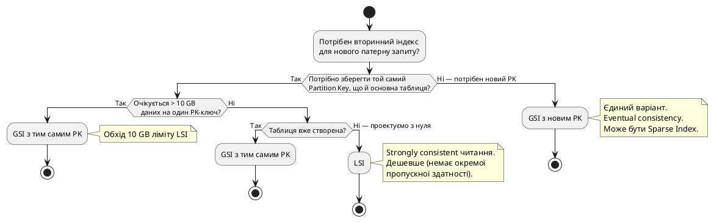

::

---

## Практичний приклад: проектування індексів для E-commerce

Розглянемо реальну задачу: таблиця `Orders` для інтернет-магазину з вимогою підтримати кілька різних типів запитів. Це класичний сценарій, що демонструє силу GSI для Single-Table Design.

**Вимоги до запитів:**

1. «Всі замовлення конкретного користувача, відсортовані за датою» → основний ключ
2. «Всі замовлення зі статусом PENDING, відсортовані за датою створення» → GSI (Sparse)
3. «Всі замовлення конкретного продукту» → GSI
4. «Замовлення конкретного користувача у певному діапазоні дат» → основний ключ (SK)

::plant-uml

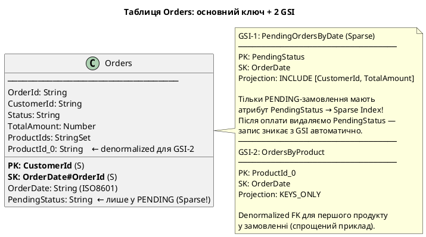

::

```bash
# Створення таблиці Orders з двома GSI
aws dynamodb create-table \
    --table-name Orders \
    --attribute-definitions \
        AttributeName=CustomerId,AttributeType=S \
        AttributeName=OrderDateId,AttributeType=S \
        AttributeName=PendingStatus,AttributeType=S \
        AttributeName=ProductId_0,AttributeType=S \
    --key-schema \
        AttributeName=CustomerId,KeyType=HASH \
        AttributeName=OrderDateId,KeyType=RANGE \
    --global-secondary-indexes '[
        {
            "IndexName": "PendingOrdersByDate",
            "KeySchema": [
                {"AttributeName": "PendingStatus", "KeyType": "HASH"},
                {"AttributeName": "OrderDateId",   "KeyType": "RANGE"}
            ],
            "Projection": {
                "ProjectionType": "INCLUDE",
                "NonKeyAttributes": ["CustomerId", "TotalAmount"]
            }
        },
        {
            "IndexName": "OrdersByProduct",
            "KeySchema": [
                {"AttributeName": "ProductId_0", "KeyType": "HASH"},
                {"AttributeName": "OrderDateId", "KeyType": "RANGE"}
            ],
            "Projection": {"ProjectionType": "KEYS_ONLY"}
        }
    ]' \
    --billing-mode PAY_PER_REQUEST \
    --region eu-central-1
```

```bash
# Вставка замовлення зі статусом PENDING (PendingStatus присутній → потрапляє в GSI-1)
aws dynamodb put-item \
    --table-name Orders \
    --item '{
        "CustomerId":    {"S": "cust-001"},
        "OrderDateId":   {"S": "2025-06-01T10:00#ord-XYZ"},
        "OrderId":       {"S": "ord-XYZ"},
        "Status":        {"S": "PENDING"},
        "PendingStatus": {"S": "PENDING"},
        "TotalAmount":   {"N": "149.99"},
        "ProductId_0":   {"S": "prod-laptop"}
    }' \
    --region eu-central-1

# Після оплати — видалити PendingStatus (замовлення зникне з GSI PendingOrdersByDate)
aws dynamodb update-item \
    --table-name Orders \
    --key '{"CustomerId": {"S": "cust-001"}, "OrderDateId": {"S": "2025-06-01T10:00#ord-XYZ"}}' \
    --update-expression "SET #s = :paid REMOVE PendingStatus" \
    --expression-attribute-names '{"#s": "Status"}' \
    --expression-attribute-values '{":paid": {"S": "PAID"}}' \
    --region eu-central-1

# Запит: всі PENDING-замовлення (через Sparse GSI)
aws dynamodb query \
    --table-name Orders \
    --index-name PendingOrdersByDate \
    --key-condition-expression "PendingStatus = :p" \
    --expression-attribute-values '{":p": {"S": "PENDING"}}' \
    --region eu-central-1

# Запит: всі замовлення конкретного продукту
aws dynamodb query \
    --table-name Orders \
    --index-name OrdersByProduct \
    --key-condition-expression "ProductId_0 = :prod" \
    --expression-attribute-values '{":prod": {"S": "prod-laptop"}}' \
    --region eu-central-1
```

::terminal-preview{title="Запит через Sparse GSI: лише PENDING-замовлення"}

<div class="line"><span class="opacity-40">$</span> <strong>aws dynamodb query --index-name PendingOrdersByDate --key-condition-expression "PendingStatus = :p" ...</strong></div>
<div class="line">{</div>
<div class="line">    <span class="text-blue-400">"Items"</span>: [</div>
<div class="line">        {</div>
<div class="line">            <span class="text-blue-400">"PendingStatus"</span>: { <span class="text-blue-400">"S"</span>: <span class="text-green-400">"PENDING"</span> },</div>
<div class="line">            <span class="text-blue-400">"OrderDateId"</span>:   { <span class="text-blue-400">"S"</span>: <span class="text-green-400">"2025-06-01T10:00#ord-XYZ"</span> },</div>
<div class="line">            <span class="text-blue-400">"CustomerId"</span>:    { <span class="text-blue-400">"S"</span>: <span class="text-green-400">"cust-001"</span> },</div>
<div class="line">            <span class="text-blue-400">"TotalAmount"</span>:   { <span class="text-blue-400">"N"</span>: <span class="text-yellow-400">"149.99"</span> }</div>
<div class="line">        }</div>
<div class="line">    ],</div>
<div class="line">    <span class="text-blue-400">"Count"</span>: <span class="text-yellow-400">1</span>,</div>
<div class="line">    <span class="opacity-60">← лише PENDING замовлення, не всі 1М замовлень!</span></div>
<div class="line">}</div>

::

---

---

## Частина 3: Режими ємності (Capacity Modes)

Одним із найбільш практично значущих аспектів роботи з Amazon DynamoDB є вибір режиму ємності — механізму, що визначає, яким чином AWS виділяє обчислювальні ресурси для вашої таблиці та яким чином формується вартість використання. DynamoDB пропонує два фундаментально різні підходи: **Provisioned** (з резервуванням пропускної здатності) та **On-Demand** (оплата за запити). Розуміння відмінностей між ними — це не просто питання оптимізації витрат, а передусім питання архітектурної зрілості системи.

::plant-uml

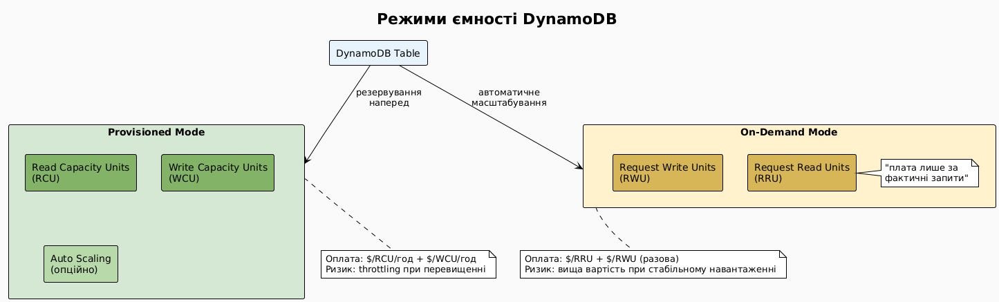

::

### Provisioned Mode — резервування пропускної здатності

У **Provisioned** режимі ви заздалегідь вказуєте кількість Read Capacity Units (RCU) та Write Capacity Units (WCU), яку DynamoDB повинна виділити для вашої таблиці. AWS буде підтримувати ці ресурси у постійній готовності незалежно від реального навантаження — ви платите за резервування, а не за фактичне використання.

**Формула вартості:**

- 1 RCU = $0.00013 за годину (~$0.0002 на місяць за 1 RCU × 24 × 30)
- 1 WCU = $0.00065 за годину

**Механізм throttling:** Якщо кількість запитів перевищує зарезервовану ємність, DynamoDB повертає помилку `ProvisionedThroughputExceededException`. Клієнтські бібліотеки AWS автоматично виконують retry з exponential backoff, однак при тривалому перевантаженні це призводить до видимих затримок для кінцевих користувачів.

**Burst capacity:** DynamoDB зберігає невикористану ємність протягом до **5 хвилин** (300 секунд) у формі burst tokens. Якщо ваша таблиця зарезервована на 100 WCU, але протягом 2 хвилин використовувалося лише 50 WCU, накопичується 6000 burst tokens. При короткочасному стрибку навантаження DynamoDB автоматично використовує ці токени — дозволяючи короткий період роботи зі значно вищою швидкістю, ніж зарезервовано. Це важливо розуміти: burst capacity не є гарантованою — AWS може повністю не надати її, якщо вузол партиції перевантажений.

::plant-uml

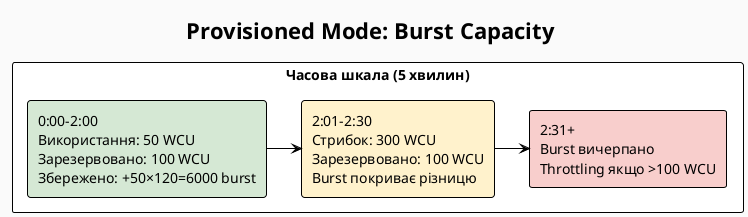

::

### Auto Scaling у Provisioned Mode

Provisioned режим поєднується з **DynamoDB Auto Scaling** — сервісом, що автоматично збільшує або зменшує зарезервовану ємність на основі реального трафіку. Це досягається через AWS Application Auto Scaling: ви задаєте **мінімальну ємність**, **максимальну ємність** та **цільовий відсоток використання** (зазвичай 70%). Auto Scaling реагує на зміни трафіку з затримкою 1–5 хвилин, тому короткочасні стрибки все одно покриваються burst capacity, а Auto Scaling призначено для поступового зростання або зниження навантаження протягом годин.

::plant-uml

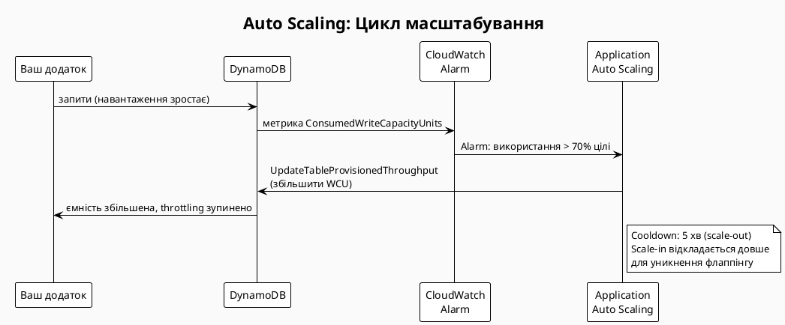

::

### On-Demand Mode — оплата за запити

**On-Demand** режим повністю усуває необхідність планування ємності. Замість RCU/WCU DynamoDB використовує **Request Read Units (RRU)** та **Request Write Units (RWU)** — одиниці, що ідентичні RCU/WCU за розміром (4 KB на read, 1 KB на write), але тарифікуються за кожен запит, а не за резервування.

**Вартість On-Demand (eu-central-1):**

- 1 RRU = $0.000000284 (≈ $0.284 за 1 млн reads)
- 1 RWU = $0.00000142 (≈ $1.42 за 1 млн writes)

On-Demand таблиця **не має обмежень на ємність** — вона миттєво масштабується до будь-якого рівня трафіку. Єдине обмеження: "попереднє пікове навантаження" — DynamoDB запам'ятовує максимальне навантаження за останні 30 хвилин і може масштабуватися до нього без затримок. Для абсолютно нових таблиць діє початкове обмеження в 4000 WRU та 12 000 RRU за секунду — але це обмеження автоматично знімається після першого піку трафіку.

### Порівняння режимів

| Критерій                               | Provisioned + Auto Scaling      | On-Demand          |
| -------------------------------------- | ------------------------------- | ------------------ |
| Реагування на стрибки                  | ~1–5 хв затримки                | Миттєво            |
| Вартість при стабільному навантаженні  | Значно дешевше                  | Дорожче            |
| Вартість при непередбачуваному трафіку | Потребує запасу                 | Оптимально         |
| Ризик throttling                       | Є (до спрацювання Auto Scaling) | Відсутній          |
| Планування ємності                     | Потрібне                        | Не потрібне        |
| Нові таблиці / MVP                     | Складніше                       | Ідеально           |
| Prod з відомим профілем                | Ідеально                        | Надлишкові витрати |

### Коли перемикатися між режимами

::plant-uml

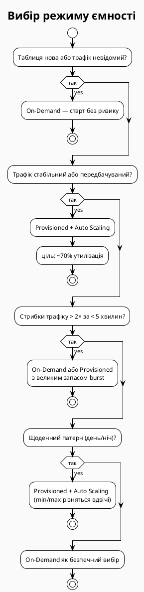

::

::note
Перемикання між режимами дозволяється **раз на 24 години**. Плануйте зміну наперед: якщо знаєте про майбутнє навантаженнєве тестування або великий реліз — перемкніться на On-Demand заздалегідь, а після стабілізації поверніться на Provisioned для оптимізації витрат.
::

### Налаштування через AWS CLI та PowerShell

::tabs

::tabs-item{label="AWS CLI (bash)"}

```bash
# ── Створити таблицю в On-Demand режимі ──────────────────────────────────
aws dynamodb create-table \
    --table-name Orders \
    --attribute-definitions \
        AttributeName=CustomerId,AttributeType=S \
        AttributeName=OrderId,AttributeType=S \
    --key-schema \
        AttributeName=CustomerId,KeyType=HASH \
        AttributeName=OrderId,KeyType=RANGE \
    --billing-mode PAY_PER_REQUEST \
    --region eu-central-1

# ── Перемкнути існуючу таблицю на Provisioned + Auto Scaling ─────────────
aws dynamodb update-table \
    --table-name Orders \
    --billing-mode PROVISIONED \
    --provisioned-throughput ReadCapacityUnits=100,WriteCapacityUnits=50 \
    --region eu-central-1

# ── Зареєструвати Auto Scaling для WCU ───────────────────────────────────
aws application-autoscaling register-scalable-target \
    --service-namespace dynamodb \
    --resource-id "table/Orders" \
    --scalable-dimension "dynamodb:table:WriteCapacityUnits" \
    --min-capacity 10 \
    --max-capacity 500 \
    --region eu-central-1

# ── Встановити цільову політику Auto Scaling ─────────────────────────────
aws application-autoscaling put-scaling-policy \
    --service-namespace dynamodb \
    --resource-id "table/Orders" \
    --scalable-dimension "dynamodb:table:WriteCapacityUnits" \
    --policy-name "Orders-WCU-Scaling" \
    --policy-type TargetTrackingScaling \
    --target-tracking-scaling-policy-configuration '{
        "TargetValue": 70.0,
        "PredefinedMetricSpecification": {
            "PredefinedMetricType": "DynamoDBWriteCapacityUtilization"
        }
    }' \
    --region eu-central-1

# ── Повернутися на On-Demand ─────────────────────────────────────────────
aws dynamodb update-table \
    --table-name Orders \
    --billing-mode PAY_PER_REQUEST \
    --region eu-central-1
```

::

::tabs-item{label="PowerShell"}

```powershell
Import-Module AWS.Tools.DynamoDBv2
Import-Module AWS.Tools.ApplicationAutoScaling

# ── Створити таблицю в On-Demand режимі ──────────────────────────────────
$attrDefs = @(
    New-DDBAttributeDefinition -AttributeName CustomerId -AttributeType S
    New-DDBAttributeDefinition -AttributeName OrderId    -AttributeType S
)
$keySchema = @(
    New-DDBKeySchemaElement -AttributeName CustomerId -KeyType HASH
    New-DDBKeySchemaElement -AttributeName OrderId    -KeyType RANGE
)
New-DDBTable `
    -TableName Orders `
    -AttributeDefinition $attrDefs `
    -KeySchema $keySchema `
    -BillingMode PAY_PER_REQUEST `
    -Region eu-central-1

# ── Перемкнути на Provisioned ─────────────────────────────────────────────
$throughput = [Amazon.DynamoDBv2.Model.ProvisionedThroughput]@{
    ReadCapacityUnits  = 100
    WriteCapacityUnits = 50
}
Update-DDBTable `
    -TableName Orders `
    -BillingMode PROVISIONED `
    -ProvisionedThroughput $throughput `
    -Region eu-central-1

# ── Зареєструвати Auto Scaling для WCU ───────────────────────────────────
Add-AASScalableTarget `
    -ServiceNamespace dynamodb `
    -ResourceId 'table/Orders' `
    -ScalableDimension 'dynamodb:table:WriteCapacityUnits' `
    -MinCapacity 10 `
    -MaxCapacity 500 `
    -Region eu-central-1

# ── Встановити цільову політику Auto Scaling ─────────────────────────────
$metricSpec = [Amazon.ApplicationAutoScaling.Model.PredefinedMetricSpecification]@{
    PredefinedMetricType = 'DynamoDBWriteCapacityUtilization'
}
$policyConfig = [Amazon.ApplicationAutoScaling.Model.TargetTrackingScalingPolicyConfiguration]@{
    TargetValue                      = 70.0
    PredefinedMetricSpecification    = $metricSpec
}
Set-AASScalingPolicy `
    -ServiceNamespace dynamodb `
    -ResourceId 'table/Orders' `
    -ScalableDimension 'dynamodb:table:WriteCapacityUnits' `
    -PolicyName 'Orders-WCU-Scaling' `
    -PolicyType TargetTrackingScaling `
    -TargetTrackingScalingPolicyConfiguration $policyConfig `
    -Region eu-central-1

# ── Повернутися на On-Demand ──────────────────────────────────────────────
Update-DDBTable `
    -TableName Orders `
    -BillingMode PAY_PER_REQUEST `
    -Region eu-central-1
```

::

::

::terminal-preview{title="Перемикання таблиці Orders на Provisioned режим"}

<div class="line"><span class="opacity-40">$</span> <strong>aws dynamodb update-table --table-name Orders --billing-mode PROVISIONED --provisioned-throughput ReadCapacityUnits=100,WriteCapacityUnits=50 --region eu-central-1</strong></div>
<div class="line">{</div>
<div class="line">    <span class="text-blue-400">"TableDescription"</span>: {</div>
<div class="line">        <span class="text-blue-400">"TableName"</span>: <span class="text-green-400">"Orders"</span>,</div>
<div class="line">        <span class="text-blue-400">"TableStatus"</span>: <span class="text-yellow-400">"UPDATING"</span>,</div>
<div class="line">        <span class="text-blue-400">"BillingModeSummary"</span>: {</div>
<div class="line">            <span class="text-blue-400">"BillingMode"</span>: <span class="text-green-400">"PROVISIONED"</span>,</div>
<div class="line">            <span class="text-blue-400">"LastUpdateToPayPerRequestDateTime"</span>: <span class="text-green-400">"2025-06-01T10:00:00Z"</span></div>
<div class="line">        },</div>
<div class="line">        <span class="text-blue-400">"ProvisionedThroughput"</span>: {</div>
<div class="line">            <span class="text-blue-400">"ReadCapacityUnits"</span>: <span class="text-yellow-400">100</span>,</div>
<div class="line">            <span class="text-blue-400">"WriteCapacityUnits"</span>: <span class="text-yellow-400">50</span></div>
<div class="line">        }</div>
<div class="line">    }</div>
<div class="line">}</div>

::

---

## Частина 4: DynamoDB Streams та Транзакції

### DynamoDB Streams — потоки змін

**DynamoDB Streams** — це впорядкований, часово-обмежений журнал змін, що відбуваються в таблиці. Кожна операція запису (PutItem, UpdateItem, DeleteItem) породжує **stream record** — незмінний запис зміни з гарантованою доставкою і збереженням у журналі впродовж **24 годин**. Записи всередині кожного шарду (shard) відсортовані строго хронологічно, хоча між шардами порядок не гарантується.

Ця властивість відкриває потужний архітектурний патерн: **event sourcing на рівні бази даних** без жодних змін у коді запису. Будь-який компонент системи може підписатися на потік і реагувати на зміни асинхронно, не впливаючи на латентність основної операції запису.

::plant-uml

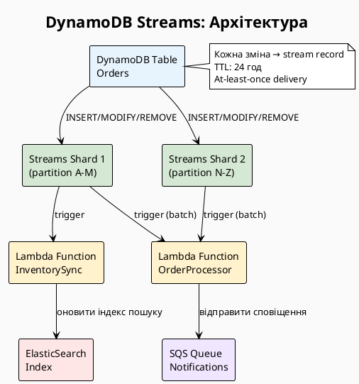

::

### View Types — що потрапляє до потоку

Під час увімкнення Streams ви обираєте один з чотирьох типів перегляду, що визначає, які дані включаються до кожного stream record:

::card-group

::card{title="KEYS_ONLY" icon="i-heroicons-key"}
До запису потрапляють лише значення Primary Key (Partition Key + Sort Key). Мінімальний розмір записів, максимальна продуктивність. Достатньо, якщо обробнику потрібно лише знати, що елемент змінився, і він самостійно завантажить актуальний стан через GetItem.
::

::card{title="NEW_IMAGE" icon="i-heroicons-arrow-up-circle"}
Повний стан елемента **після** зміни. Найпоширеніший вибір: ідеально підходить для реплікації даних в інший сервіс (Elasticsearch, Redis), оскільки дає повне актуальне значення без додаткових читань.
::

::card{title="OLD_IMAGE" icon="i-heroicons-arrow-down-circle"}
Повний стан елемента **до** зміни. Корисний для аудиту та rollback-сценаріїв: дозволяє побачити, яким було значення поля до оновлення, і за потреби відновити попередній стан.
::

::card{title="NEW_AND_OLD_IMAGES" icon="i-heroicons-arrows-right-left"}
Обидва стани одночасно. Дає змогу порівняти зміни (diff), визначити, які поля були змінені, і прийняти рішення на основі delta. Максимальний розмір записів — використовуйте лише коли справді потрібні обидва стани.
::

::

### Lambda як споживач Streams

Найпоширений патерн — **AWS Lambda** як event source mapping для Streams. Lambda автоматично опитує шарди потоку, збирає записи у батчі та передає їх функції. Ключові параметри event source mapping:

::field-group

::field{name="BatchSize" type="integer"}
Максимальна кількість записів в одному виклику Lambda (1–1000, рекомендовано 100). Більший батч — менше викликів, але більше пам'яті та триваліший час обробки.
::

::field{name="StartingPosition" type="enum"}
`LATEST` — обробляти лише нові записи після підключення. `TRIM_HORIZON` — почати з найстаріших наявних записів (до 24 год назад). `AT_TIMESTAMP` — почати з конкретного моменту.
::

::field{name="BisectOnFunctionError" type="boolean"}
При помилці Lambda автоматично ділить батч навпіл і повторює менші частини. Запобігає вічному циклу повторів через один "отруєний" запис.
::

::field{name="MaximumRetryAttempts" type="integer"}
Максимальна кількість повторів при помилці (0–10000). Після вичерпання — запис переходить до Dead Letter Queue (якщо налаштована).
::

::field{name="FilterCriteria" type="object"}
Фільтрація записів до передачі в Lambda. Дозволяє передавати лише INSERT-події або лише зміни конкретного поля — зменшує витрати на виклики Lambda.
::

::

### Увімкнення Streams та Lambda тригера

::tabs

::tabs-item{label="AWS CLI (bash)"}

```bash
# ── Увімкнути Streams на таблиці ─────────────────────────────────────────
aws dynamodb update-table \
    --table-name Orders \
    --stream-specification StreamEnabled=true,StreamViewType=NEW_AND_OLD_IMAGES \
    --region eu-central-1

# ── Отримати ARN потоку ───────────────────────────────────────────────────
STREAM_ARN=$(aws dynamodb describe-table \
    --table-name Orders \
    --query "Table.LatestStreamArn" \
    --output text \
    --region eu-central-1)
echo "Stream ARN: $STREAM_ARN"

# ── Підключити Lambda до потоку ───────────────────────────────────────────
aws lambda create-event-source-mapping \
    --function-name OrderStreamProcessor \
    --event-source-arn "$STREAM_ARN" \
    --batch-size 100 \
    --starting-position LATEST \
    --bisect-batch-on-function-error \
    --maximum-retry-attempts 3 \
    --filter-criteria '{"Filters": [{"Pattern": "{\"eventName\": [\"INSERT\", \"MODIFY\"]}"}]}' \
    --region eu-central-1
```

::

::tabs-item{label="PowerShell"}

```powershell
Import-Module AWS.Tools.DynamoDBv2
Import-Module AWS.Tools.Lambda

# ── Увімкнути Streams на таблиці ─────────────────────────────────────────
$streamSpec = [Amazon.DynamoDBv2.Model.StreamSpecification]@{
    StreamEnabled  = $true
    StreamViewType = 'NEW_AND_OLD_IMAGES'
}
Update-DDBTable `
    -TableName Orders `
    -StreamSpecification $streamSpec `
    -Region eu-central-1

# ── Отримати ARN потоку ───────────────────────────────────────────────────
$tableDesc = Get-DDBTable -TableName Orders -Region eu-central-1
$streamArn = $tableDesc.LatestStreamArn
Write-Host "Stream ARN: $streamArn"

# ── Підключити Lambda до потоку ───────────────────────────────────────────
$filterPattern = '{"Filters": [{"Pattern": "{\"eventName\": [\"INSERT\", \"MODIFY\"]}"}]}'
$filterCriteria = [Amazon.Lambda.Model.FilterCriteria]@{
    Filters = @([Amazon.Lambda.Model.Filter]@{ Pattern = $filterPattern })
}
New-LMEventSourceMapping `
    -FunctionName OrderStreamProcessor `
    -EventSourceArn $streamArn `
    -BatchSize 100 `
    -StartingPosition LATEST `
    -BisectBatchOnFunctionError $true `
    -MaximumRetryAttempt 3 `
    -FilterCriteria $filterCriteria `
    -Region eu-central-1
```

::

::

---

### Транзакції в DynamoDB

До появи транзакцій у 2018 році, DynamoDB забезпечувала атомарність лише на рівні одного елемента. Команди `TransactWriteItems` та `TransactGetItems` принесли підтримку **ACID-транзакцій** для до **100 елементів** в одній транзакції, навіть якщо вони розміщені в різних таблицях.

**TransactWriteItems** підтримує чотири типи операцій:

- `Put` — вставити або замінити елемент (аналог PutItem)
- `Update` — оновити конкретні атрибути (аналог UpdateItem)
- `Delete` — видалити елемент (аналог DeleteItem)
- `ConditionCheck` — перевірити умову без зміни даних

Всі операції виконуються разом або не виконуються взагалі. Якщо хоча б одна операція провалюється (умова не виконана, елемент вже існує тощо), DynamoDB скасовує всю транзакцію і повертає `TransactionCanceledException` з детальним описом причини для кожної операції.

**Вартість транзакцій:** кожна операція в транзакції коштує вдвічі дорожче за звичайну. `TransactWriteItems` з 3 операціями споживає 2× WCU для кожної з трьох — разом 6 WCU замість 3. Це ціна за гарантію узгодженості.

::plant-uml

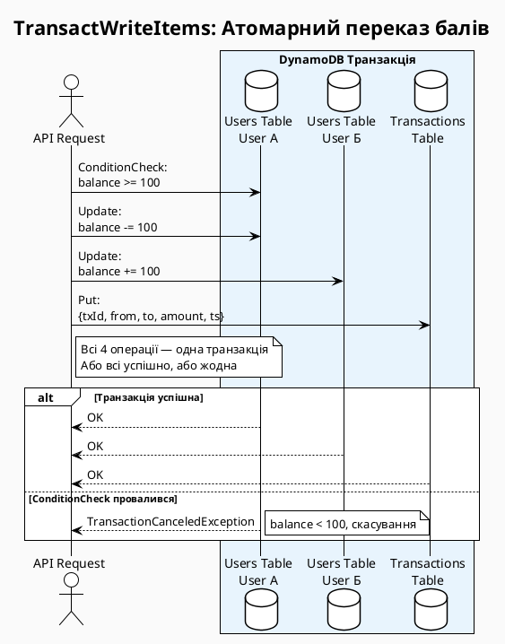

::

### Практичний приклад: Оформлення замовлення

Класичний use-case для транзакцій — оформлення замовлення в e-commerce: потрібно одночасно зменшити кількість товару на складі, створити запис замовлення і перевірити, що товар доступний. Усі три операції мають виконатися атомарно.

::tabs

::tabs-item{label="AWS CLI (bash)"}

```bash
# ── TransactWriteItems: Оформити замовлення ───────────────────────────────
aws dynamodb transact-write-items \
    --transact-items '[
        {
            "ConditionCheck": {
                "TableName": "Inventory",
                "Key": {"ProductId": {"S": "prod-42"}},
                "ConditionExpression": "quantity >= :qty",
                "ExpressionAttributeValues": {":qty": {"N": "2"}}
            }
        },
        {
            "Update": {
                "TableName": "Inventory",
                "Key": {"ProductId": {"S": "prod-42"}},
                "UpdateExpression": "SET quantity = quantity - :qty",
                "ExpressionAttributeValues": {":qty": {"N": "2"}}
            }
        },
        {
            "Put": {
                "TableName": "Orders",
                "Item": {
                    "CustomerId":  {"S": "usr-001"},
                    "OrderId":     {"S": "ord-2025-001"},
                    "ProductId":   {"S": "prod-42"},
                    "Quantity":    {"N": "2"},
                    "Status":      {"S": "PENDING"},
                    "CreatedAt":   {"S": "2025-06-01T12:00:00Z"}
                },
                "ConditionExpression": "attribute_not_exists(OrderId)"
            }
        }
    ]' \
    --region eu-central-1

# ── TransactGetItems: Читання кількох елементів за один запит ─────────────
aws dynamodb transact-get-items \
    --transact-items '[
        {"Get": {"TableName": "Orders",    "Key": {"CustomerId": {"S": "usr-001"}, "OrderId": {"S": "ord-2025-001"}}}},
        {"Get": {"TableName": "Inventory", "Key": {"ProductId": {"S": "prod-42"}}}}
    ]' \
    --region eu-central-1
```

::

::tabs-item{label="PowerShell"}

```powershell
Import-Module AWS.Tools.DynamoDBv2

# ── TransactWriteItems: Оформити замовлення ───────────────────────────────
$condCheck = [Amazon.DynamoDBv2.Model.ConditionCheck]@{
    TableName           = 'Inventory'
    Key                 = @{ ProductId = New-DDBEntry -S 'prod-42' }
    ConditionExpression = 'quantity >= :qty'
    ExpressionAttributeValues = @{ ':qty' = New-DDBEntry -N '2' }
}

$updateInventory = [Amazon.DynamoDBv2.Model.Update]@{
    TableName        = 'Inventory'
    Key              = @{ ProductId = New-DDBEntry -S 'prod-42' }
    UpdateExpression = 'SET quantity = quantity - :qty'
    ExpressionAttributeValues = @{ ':qty' = New-DDBEntry -N '2' }
}

$putOrder = [Amazon.DynamoDBv2.Model.Put]@{
    TableName           = 'Orders'
    ConditionExpression = 'attribute_not_exists(OrderId)'
    Item                = @{
        CustomerId = New-DDBEntry -S 'usr-001'
        OrderId    = New-DDBEntry -S 'ord-2025-001'
        ProductId  = New-DDBEntry -S 'prod-42'
        Quantity   = New-DDBEntry -N '2'
        Status     = New-DDBEntry -S 'PENDING'
        CreatedAt  = New-DDBEntry -S '2025-06-01T12:00:00Z'
    }
}

$txItems = @(
    [Amazon.DynamoDBv2.Model.TransactWriteItem]@{ ConditionCheck = $condCheck },
    [Amazon.DynamoDBv2.Model.TransactWriteItem]@{ Update         = $updateInventory },
    [Amazon.DynamoDBv2.Model.TransactWriteItem]@{ Put            = $putOrder }
)
Invoke-DDBTransactWrite -TransactItems $txItems -Region eu-central-1

# ── TransactGetItems: Читання кількох елементів ───────────────────────────
$getOrder = [Amazon.DynamoDBv2.Model.Get]@{
    TableName = 'Orders'
    Key       = @{ CustomerId = New-DDBEntry -S 'usr-001'; OrderId = New-DDBEntry -S 'ord-2025-001' }
}
$getInventory = [Amazon.DynamoDBv2.Model.Get]@{
    TableName = 'Inventory'
    Key       = @{ ProductId = New-DDBEntry -S 'prod-42' }
}
$getItems = @(
    [Amazon.DynamoDBv2.Model.TransactGetItem]@{ Get = $getOrder },
    [Amazon.DynamoDBv2.Model.TransactGetItem]@{ Get = $getInventory }
)
Invoke-DDBTransactGet -TransactItems $getItems -Region eu-central-1
```

::

::

---

## Частина 5: TTL, Global Tables та Best Practices

### Time to Live (TTL) — автоматичне видалення даних

**TTL** дозволяє визначити атрибут таблиці, що зберігає Unix timestamp (секунди з 1970-01-01 00:00:00 UTC) — і DynamoDB автоматично видалятиме елементи, в яких це значення менше за поточний час. Видалення відбувається асинхронно, **протягом 48 годин** після настання терміну, безкоштовно і без споживання WCU.

Це критично важливо для класу задач, де дані мають природний термін придатності: сесії користувачів, тимчасові токени, кеш, логи з retention policy, кошики покупок.

::caution
TTL-видалення не є миттєвим. Після досягнення часової мітки елемент може залишатися в таблиці ще **до 48 годин**. Ваш код повинен обробляти цей випадок: додайте перевірку `ExpiresAt > now()` у логіці читання для критичних сценаріїв (наприклад, перевірка токена автентифікації).
::

::plant-uml

```plantuml
@startuml
!theme plain
skinparam backgroundColor #FAFAFA

title TTL: Механізм видалення

rectangle "DynamoDB Table\nUserSessions" as table #E8F4FD {
  rectangle "UserId: usr-001\nSessionId: sess-abc\nExpiresAt: 1748000000\n← МИНУЛИЙ ЧАС" as expired #F8CECC
  rectangle "UserId: usr-002\nSessionId: sess-def\nExpiresAt: 1780000000\n← МАЙБУТНІЙ ЧАС" as active #D5E8D4
}

rectangle "TTL Worker\n(фоновий процес AWS)" as worker #FFF2CC
rectangle "DynamoDB Streams\n(якщо увімкнено)" as streams #F0E6FF

worker -> expired : Виявлено: ExpiresAt < now()\nПланує видалення
worker -> table : DeleteItem (без WCU)
table -> streams : REMOVE event з\nuserIdentity.type = 'Service'

note right of worker
  Затримка: до 48 год
  Гарантія: видалення відбудеться
  Безкоштовно: не рахується у WCU
end note
@enduml
```

::

### Увімкнення TTL та робота зі спливаючими даними

::tabs

::tabs-item{label="AWS CLI (bash)"}

```bash
# ── Увімкнути TTL на таблиці UserSessions ────────────────────────────────
aws dynamodb update-time-to-live \
    --table-name UserSessions \
    --time-to-live-specification Enabled=true,AttributeName=ExpiresAt \
    --region eu-central-1

# ── Записати елемент з TTL (термін: 8 годин від зараз) ───────────────────
EXPIRES=$(date -d "+8 hours" +%s 2>/dev/null || date -v+8H +%s)  # Linux / macOS
aws dynamodb put-item \
    --table-name UserSessions \
    --item '{
        "UserId":    {"S": "usr-001"},
        "SessionId": {"S": "sess-new-001"},
        "CreatedAt": {"S": "2025-06-01T12:00:00Z"},
        "ExpiresAt": {"N": "'"$EXPIRES"'"},
        "IsActive":  {"BOOL": true}
    }' \
    --region eu-central-1

# ── Перевірити TTL-конфігурацію ───────────────────────────────────────────
aws dynamodb describe-time-to-live \
    --table-name UserSessions \
    --region eu-central-1

# ── Сканування лише активних елементів (filter out expired) ───────────────
aws dynamodb scan \
    --table-name UserSessions \
    --filter-expression "ExpiresAt > :now" \
    --expression-attribute-values "{\":now\": {\"N\": \"$(date +%s)\"}}" \
    --region eu-central-1
```

::

::tabs-item{label="PowerShell"}

```powershell
Import-Module AWS.Tools.DynamoDBv2

# ── Увімкнути TTL на таблиці UserSessions ────────────────────────────────
$ttlSpec = [Amazon.DynamoDBv2.Model.TimeToLiveSpecification]@{
    Enabled       = $true
    AttributeName = 'ExpiresAt'
}
Update-DDBTimeToLive -TableName UserSessions -TimeToLiveSpecification $ttlSpec -Region eu-central-1

# ── Записати елемент з TTL (термін: 8 годин від зараз) ───────────────────
$expiresAt = [int][double]::Parse(
    (Get-Date).AddHours(8).ToUniversalTime().Subtract([datetime]'1970-01-01').TotalSeconds
)
$item = @{
    UserId    = New-DDBEntry -S 'usr-001'
    SessionId = New-DDBEntry -S 'sess-new-001'
    CreatedAt = New-DDBEntry -S '2025-06-01T12:00:00Z'
    ExpiresAt = New-DDBEntry -N "$expiresAt"
    IsActive  = New-DDBEntry -BOOL $true
}
Set-DDBItem -TableName UserSessions -Item $item -Region eu-central-1

# ── Перевірити TTL-конфігурацію ───────────────────────────────────────────
Get-DDBTimeToLive -TableName UserSessions -Region eu-central-1

# ── Сканування лише активних елементів ───────────────────────────────────
$nowTs = [int][double]::Parse(
    (Get-Date).ToUniversalTime().Subtract([datetime]'1970-01-01').TotalSeconds
)
$scanRequest = [Amazon.DynamoDBv2.Model.ScanRequest]@{
    TableName        = 'UserSessions'
    FilterExpression = 'ExpiresAt > :now'
    ExpressionAttributeValues = @{ ':now' = New-DDBEntry -N "$nowTs" }
}
Invoke-DDBScan -ScanRequest $scanRequest -Region eu-central-1
```

::

::

---

### Global Tables — мультирегіональна реплікація

**DynamoDB Global Tables** — це керована мультирегіональна, мультиактивна (active-active) реплікація. На відміну від більшості систем реплікації, де є один master і кілька replica, Global Tables дозволяє **записувати в будь-який регіон** — DynamoDB асинхронно реплікує зміни в усі інші регіони за допомогою DynamoDB Streams.

**Ключові гарантії:**

- Реплікація зазвичай завершується за **менш ніж секунду** між регіонами
- При конфлікті (одночасний запис одного елемента в різні регіони) перемагає **"last writer wins"** за timestamp
- Читання в локальному регіоні — завжди eventually consistent; strongly consistent читання доступне лише в регіоні, де відбувся запис

::plant-uml

```plantuml
@startuml
!theme plain
skinparam backgroundColor #FAFAFA

title DynamoDB Global Tables: Active-Active реплікація

rectangle "eu-central-1\n(Frankfurt)" as eu #D5E8D4 {
  database "Orders Table\n(replica)" as eu_db
  actor "EU Clients" as eu_user
}

rectangle "us-east-1\n(N. Virginia)" as us #E8F4FD {
  database "Orders Table\n(replica)" as us_db
  actor "US Clients" as us_user
}

rectangle "ap-southeast-1\n(Singapore)" as ap #FFF2CC {
  database "Orders Table\n(replica)" as ap_db
  actor "APAC Clients" as ap_user
}

eu_user --> eu_db : Read / Write
us_user --> us_db : Read / Write
ap_user --> ap_db : Read / Write

eu_db <--> us_db : async replication\n< 1 sec
us_db <--> ap_db : async replication\n< 1 sec
eu_db <--> ap_db : async replication\n< 1 sec

note bottom of eu_db
  Last Writer Wins при конфліктах
  Власні RCU/WCU в кожному регіоні
end note
@enduml
```

::

### Налаштування Global Tables

::tabs

::tabs-item{label="AWS CLI (bash)"}

```bash
# ── Крок 1: Створити таблицю (у першому регіоні) ─────────────────────────
aws dynamodb create-table \
    --table-name Orders \
    --attribute-definitions AttributeName=CustomerId,AttributeType=S \
        AttributeName=OrderId,AttributeType=S \
    --key-schema AttributeName=CustomerId,KeyType=HASH \
        AttributeName=OrderId,KeyType=RANGE \
    --billing-mode PAY_PER_REQUEST \
    --stream-specification StreamEnabled=true,StreamViewType=NEW_AND_OLD_IMAGES \
    --region eu-central-1

# ── Крок 2: Додати реплікацію в інші регіони ─────────────────────────────
aws dynamodb update-table \
    --table-name Orders \
    --replica-updates '[
        {"Create": {"RegionName": "us-east-1"}},
        {"Create": {"RegionName": "ap-southeast-1"}}
    ]' \
    --region eu-central-1

# ── Перевірити статус реплікації ──────────────────────────────────────────
aws dynamodb describe-table \
    --table-name Orders \
    --query "Table.Replicas" \
    --region eu-central-1
```

::

::tabs-item{label="PowerShell"}

```powershell
Import-Module AWS.Tools.DynamoDBv2

# ── Крок 1: Створити таблицю в eu-central-1 ──────────────────────────────
$attrDefs = @(
    New-DDBAttributeDefinition -AttributeName CustomerId -AttributeType S
    New-DDBAttributeDefinition -AttributeName OrderId    -AttributeType S
)
$keySchema = @(
    New-DDBKeySchemaElement -AttributeName CustomerId -KeyType HASH
    New-DDBKeySchemaElement -AttributeName OrderId    -KeyType RANGE
)
$streamSpec = [Amazon.DynamoDBv2.Model.StreamSpecification]@{
    StreamEnabled  = $true
    StreamViewType = 'NEW_AND_OLD_IMAGES'
}
New-DDBTable `
    -TableName Orders `
    -AttributeDefinition $attrDefs `
    -KeySchema $keySchema `
    -BillingMode PAY_PER_REQUEST `
    -StreamSpecification $streamSpec `
    -Region eu-central-1

# ── Крок 2: Додати реплікацію в інші регіони ─────────────────────────────
$replicaUpdates = @(
    [Amazon.DynamoDBv2.Model.ReplicationGroupUpdate]@{
        Create = [Amazon.DynamoDBv2.Model.CreateReplicationGroupMemberAction]@{
            RegionName = 'us-east-1'
        }
    },
    [Amazon.DynamoDBv2.Model.ReplicationGroupUpdate]@{
        Create = [Amazon.DynamoDBv2.Model.CreateReplicationGroupMemberAction]@{
            RegionName = 'ap-southeast-1'
        }
    }
)
Update-DDBTable -TableName Orders -ReplicaUpdates $replicaUpdates -Region eu-central-1

# ── Перевірити статус реплікації ──────────────────────────────────────────
(Get-DDBTable -TableName Orders -Region eu-central-1).Replicas
```

::

::

---

### Best Practices: Проектування схеми DynamoDB

Більшість проблем продуктивності DynamoDB виникає не через неправильні налаштування, а через хибне проектування схеми. Реляційний підхід "спочатку нормалізуємо, потім джойнимо" не працює в DynamoDB. Правильний підхід — **Access Pattern Driven Design**: спочатку описати всі запити, які виконуватиме додаток, і потім проектувати ключі та індекси.

#### Патерн 1: Single-Table Design

Замість окремої таблиці для кожної сутності, розміщуємо всі сутності в одній таблиці. Partition Key і Sort Key стають **generic** (наприклад, `PK` і `SK`), а їхні значення кодують тип сутності і ідентифікатор:

| PK                | SK              | Type      | Атрибути               |
| ----------------- | --------------- | --------- | ---------------------- |
| `USER#usr-001`    | `PROFILE`       | User      | name, email, createdAt |
| `USER#usr-001`    | `ORDER#ord-001` | Order     | status, total, items   |
| `USER#usr-001`    | `ORDER#ord-002` | Order     | status, total, items   |
| `PRODUCT#prod-42` | `METADATA`      | Product   | name, price, stock     |
| `ORDER#ord-001`   | `ITEM#item-1`   | OrderItem | productId, qty, price  |

Цей підхід дозволяє отримати профіль користувача разом з усіма його замовленнями одним Query-запитом (фільтр по PK = `USER#usr-001`), уникаючи multiple round-trips.

::plant-uml

```plantuml
@startuml
!theme plain
skinparam backgroundColor #FAFAFA

title Single-Table Design: Всі сутності в одній таблиці

rectangle "DynamoDB Table: AppData" as table #E8F4FD {
  rectangle "PK: USER#001 | SK: PROFILE\nname: 'Alice', email: 'alice@..." as u1 #D5E8D4
  rectangle "PK: USER#001 | SK: ORDER#2025-001\nstatus: PENDING, total: 99.99" as o1 #FFF2CC
  rectangle "PK: USER#001 | SK: ORDER#2025-002\nstatus: SHIPPED, total: 149.99" as o2 #FFF2CC
  rectangle "PK: PRODUCT#42 | SK: METADATA\nname: 'Keyboard', price: 79.99" as p1 #F0E6FF
  rectangle "PK: ORDER#2025-001 | SK: ITEM#1\nproductId: PRODUCT#42, qty: 2" as oi1 #FFE6E6
}

note right of table
  Query(PK='USER#001') → профіль + всі замовлення
  Query(PK='USER#001', SK begins_with 'ORDER#') → лише замовлення
  GetItem(PK='PRODUCT#42', SK='METADATA') → деталі продукту
end note
@enduml
```

::

#### Патерн 2: Уникнення Hot Partitions

**Hot partition** — стан, коли непропорційно велика частина трафіку спрямована на одну партицію. DynamoDB розподіляє дані між партиціями за hash від Partition Key. Якщо ваш PK — це `Status` зі значеннями `PENDING`/`PROCESSING`/`DONE`, переважна більшість активних елементів буде мати `Status=PENDING`, і одна партиція буде перевантажена.

**Рішення — Write Sharding:** додайте до PK суфікс-рандомайзер:

```
# Погано: PK = "PENDING"  (одна партиція)
# Добре:  PK = "PENDING#3" (де 3 — random від 1 до N)
```

При читанні виконайте N паралельних Query-запитів (по одному для кожного суфікса) і об'єднайте результати. N зазвичай дорівнює 10–20, цього достатньо для рівномірного розподілу.

#### Патерн 3: Conditional Writes для оптимістичного блокування

Замість блокувань (яких у DynamoDB немає) використовуйте `ConditionExpression` для реалізації **optimistic locking**:

```bash
# Оновити запис лише якщо версія = очікуваній
aws dynamodb update-item \
    --table-name Products \
    --key '{"ProductId": {"S": "prod-42"}}' \
    --update-expression "SET price = :newPrice, version = :newVer" \
    --condition-expression "version = :expectedVer" \
    --expression-attribute-values '{
        ":newPrice": {"N": "89.99"},
        ":newVer": {"N": "3"},
        ":expectedVer": {"N": "2"}
    }' \
    --region eu-central-1
```

Якщо між читанням і записом інший процес змінив запис (version стала 3 замість очікуваної 2), операція поверне `ConditionalCheckFailedException` — і ваш код повторить читання та спробу оновлення.

::tip
**Правило "1 мілісекунда":** якщо ваш access pattern вимагає читання з DynamoDB і потім запису назад (read-modify-write), завжди використовуйте `ConditionExpression` з версійним атрибутом. Без цього в конкурентному середовищі гарантовані "загублені оновлення".
::

---

## Частина 6: Інтеграція з .NET (AWS SDK)

### Налаштування проекту

AWS SDK для .NET надає три рівні абстракції для роботи з DynamoDB, кожен з яких оптимальний для різних задач. Вибір рівня визначає баланс між контролем над операціями і зручністю написання коду.

::card-group

::card{title="Low-Level API" icon="i-heroicons-cpu-chip"}
Повний контроль: `AmazonDynamoDBClient`. Ви формуєте `AttributeValue` словники вручну. Жоден атрибут не прихований. Використовуйте для складних операцій (транзакції, batch, streams) або коли потрібен максимальний контроль над запитами.
::

::card{title="Document Model" icon="i-heroicons-document-text"}
`DynamoDBContext` + `Document` клас. AWS SDK серіалізує `Dictionary<string, AttributeValue>` в зручний `Document` об'єкт зі зрозумілим синтаксисом `doc["field"]`. Хороший компроміс між зручністю та контролем.
::

::card{title="Object Persistence Model" icon="i-heroicons-cube"}
Найвищий рівень: `DynamoDBContext` з `[DynamoDBTable]` та `[DynamoDBHashKey]` атрибутами на POCO-класах. SDK автоматично серіалізує/десеріалізує .NET об'єкти. Найзручніший для CRUD-операцій на відомих типах.
::

::

```bash
# Встановити NuGet пакети
dotnet add package AWSSDK.DynamoDBv2
dotnet add package Microsoft.Extensions.DependencyInjection
dotnet add package Microsoft.Extensions.Configuration.Json
```

### Конфігурація та Dependency Injection

```csharp
// Program.cs — налаштування DI для DynamoDB
using Amazon.DynamoDBv2;
using Amazon.DynamoDBv2.DataModel;

var builder = WebApplication.CreateBuilder(args);

// Реєструємо AWS SDK клієнти
builder.Services.AddAWSService<IAmazonDynamoDB>();
builder.Services.AddScoped<IDynamoDBContext, DynamoDBContext>();

// Реєструємо репозиторій
builder.Services.AddScoped<IOrderRepository, DynamoDBOrderRepository>();

var app = builder.Build();
```

```json
// appsettings.json — конфігурація AWS
{
    "AWS": {
        "Region": "eu-central-1",
        "Profile": "default"
    }
}
```

### Object Persistence Model — POCO з атрибутами

```csharp
using Amazon.DynamoDBv2.DataModel;

[DynamoDBTable("Orders")]
public class Order
{
    [DynamoDBHashKey("CustomerId")]
    public string CustomerId { get; set; } = string.Empty;

    [DynamoDBRangeKey("OrderId")]
    public string OrderId { get; set; } = string.Empty;

    [DynamoDBProperty("Status")]
    public string Status { get; set; } = "PENDING";

    [DynamoDBProperty("Total")]
    public decimal Total { get; set; }

    [DynamoDBProperty("CreatedAt")]
    public string CreatedAt { get; set; } = string.Empty;

    [DynamoDBProperty("Items")]
    public List<OrderItem> Items { get; set; } = new();

    // TTL атрибут — зберігає Unix timestamp
    [DynamoDBProperty("ExpiresAt")]
    public long? ExpiresAt { get; set; }
}

public class OrderItem
{
    public string ProductId { get; set; } = string.Empty;
    public int Quantity { get; set; }
    public decimal Price { get; set; }
}
```

### Репозиторій: повний CRUD через Object Persistence Model

```csharp
using Amazon.DynamoDBv2;
using Amazon.DynamoDBv2.DataModel;
using Amazon.DynamoDBv2.DocumentModel;

public interface IOrderRepository
{
    Task<Order?> GetAsync(string customerId, string orderId);
    Task<IEnumerable<Order>> GetByCustomerAsync(string customerId);
    Task<IEnumerable<Order>> GetByStatusAsync(string status);
    Task SaveAsync(Order order);
    Task UpdateStatusAsync(string customerId, string orderId, string newStatus);
    Task DeleteAsync(string customerId, string orderId);
}

public class DynamoDBOrderRepository : IOrderRepository
{
    private readonly IDynamoDBContext _context;
    private readonly IAmazonDynamoDB _client;

    public DynamoDBOrderRepository(IDynamoDBContext context, IAmazonDynamoDB client)
    {
        _context = context;
        _client  = client;
    }

    // ── GetItem: отримати конкретне замовлення ────────────────────────────
    public async Task<Order?> GetAsync(string customerId, string orderId)
    {
        return await _context.LoadAsync<Order>(customerId, orderId);
    }

    // ── Query: всі замовлення клієнта ─────────────────────────────────────
    public async Task<IEnumerable<Order>> GetByCustomerAsync(string customerId)
    {
        var config = new DynamoDBOperationConfig
        {
            QueryFilter = new List<ScanCondition>()
        };

        return await _context
            .QueryAsync<Order>(customerId, config)
            .GetRemainingAsync();
    }

    // ── Query через GSI: замовлення за статусом ───────────────────────────
    public async Task<IEnumerable<Order>> GetByStatusAsync(string status)
    {
        var config = new DynamoDBOperationConfig
        {
            IndexName  = "Status-CreatedAt-index",
            QueryFilter = new List<ScanCondition>()
        };

        return await _context
            .QueryAsync<Order>(status, config)
            .GetRemainingAsync();
    }

    // ── PutItem: зберегти або замінити замовлення ─────────────────────────
    public async Task SaveAsync(Order order)
    {
        order.OrderId  = string.IsNullOrEmpty(order.OrderId)
            ? $"ord-{Guid.NewGuid():N}"
            : order.OrderId;
        order.CreatedAt = DateTime.UtcNow.ToString("O");

        await _context.SaveAsync(order);
    }

    // ── UpdateItem з ConditionExpression (optimistic locking) ─────────────
    public async Task UpdateStatusAsync(
        string customerId, string orderId, string newStatus)
    {
        var request = new Amazon.DynamoDBv2.Model.UpdateItemRequest
        {
            TableName        = "Orders",
            Key              = new Dictionary<string, Amazon.DynamoDBv2.Model.AttributeValue>
            {
                ["CustomerId"] = new() { S = customerId },
                ["OrderId"]    = new() { S = orderId }
            },
            UpdateExpression = "SET #s = :newStatus, UpdatedAt = :ts",
            ConditionExpression = "#s <> :newStatus",
            ExpressionAttributeNames = new() { ["#s"] = "Status" },
            ExpressionAttributeValues = new()
            {
                [":newStatus"] = new() { S = newStatus },
                [":ts"]        = new() { S = DateTime.UtcNow.ToString("O") }
            }
        };

        await _client.UpdateItemAsync(request);
    }

    // ── DeleteItem ────────────────────────────────────────────────────────
    public async Task DeleteAsync(string customerId, string orderId)
    {
        await _context.DeleteAsync<Order>(customerId, orderId);
    }
}
```

### Batch операції та транзакції в .NET

```csharp
using Amazon.DynamoDBv2.Model;

public class OrderTransactionService
{
    private readonly IAmazonDynamoDB _client;

    public OrderTransactionService(IAmazonDynamoDB client) => _client = client;

    // ── TransactWrite: Атомарне оформлення замовлення ─────────────────────
    public async Task PlaceOrderAsync(
        string customerId, string productId, int quantity, decimal unitPrice)
    {
        var orderId = $"ord-{Guid.NewGuid():N}";
        var now     = DateTime.UtcNow.ToString("O");

        var request = new TransactWriteItemsRequest
        {
            TransactItems = new List<TransactWriteItem>
            {
                // 1. Перевірка наявності товару на складі
                new()
                {
                    ConditionCheck = new ConditionCheck
                    {
                        TableName           = "Inventory",
                        Key                 = new() { ["ProductId"] = new() { S = productId } },
                        ConditionExpression = "quantity >= :qty",
                        ExpressionAttributeValues = new()
                        {
                            [":qty"] = new() { N = quantity.ToString() }
                        }
                    }
                },
                // 2. Зменшити кількість на складі
                new()
                {
                    Update = new Update
                    {
                        TableName        = "Inventory",
                        Key              = new() { ["ProductId"] = new() { S = productId } },
                        UpdateExpression = "SET quantity = quantity - :qty",
                        ExpressionAttributeValues = new()
                        {
                            [":qty"] = new() { N = quantity.ToString() }
                        }
                    }
                },
                // 3. Створити запис замовлення
                new()
                {
                    Put = new Put
                    {
                        TableName           = "Orders",
                        ConditionExpression = "attribute_not_exists(OrderId)",
                        Item                = new()
                        {
                            ["CustomerId"] = new() { S = customerId },
                            ["OrderId"]    = new() { S = orderId },
                            ["ProductId"]  = new() { S = productId },
                            ["Quantity"]   = new() { N = quantity.ToString() },
                            ["Total"]      = new() { N = (quantity * unitPrice).ToString("F2") },
                            ["Status"]     = new() { S = "PENDING" },
                            ["CreatedAt"]  = new() { S = now }
                        }
                    }
                }
            }
        };

        try
        {
            await _client.TransactWriteItemsAsync(request);
        }
        catch (TransactionCanceledException ex)
        {
            // Детальна інформація по кожній операції
            var reasons = ex.CancellationReasons
                .Select((r, i) => $"Operation {i}: {r.Code} — {r.Message}")
                .ToList();

            throw new InvalidOperationException(
                $"Транзакцію скасовано:\n{string.Join('\n', reasons)}", ex);
        }
    }

    // ── BatchWrite: масовий запис замовлень ───────────────────────────────
    public async Task BulkInsertOrdersAsync(IEnumerable<Order> orders)
    {
        // BatchWriteItem підтримує до 25 елементів за запит
        foreach (var batch in orders.Chunk(25))
        {
            var writeRequests = batch.Select(o => new WriteRequest
            {
                PutRequest = new PutRequest
                {
                    Item = new()
                    {
                        ["CustomerId"] = new() { S = o.CustomerId },
                        ["OrderId"]    = new() { S = o.OrderId },
                        ["Status"]     = new() { S = o.Status },
                        ["Total"]      = new() { N = o.Total.ToString("F2") },
                        ["CreatedAt"]  = new() { S = o.CreatedAt }
                    }
                }
            }).ToList();

            var request = new BatchWriteItemRequest
            {
                RequestItems = new() { ["Orders"] = writeRequests }
            };

            var response = await _client.BatchWriteItemAsync(request);

            // Обробити невиконані елементи (при throttling)
            while (response.UnprocessedItems.Count > 0)
            {
                await Task.Delay(TimeSpan.FromMilliseconds(100));
                response = await _client.BatchWriteItemAsync(new()
                {
                    RequestItems = response.UnprocessedItems
                });
            }
        }
    }
}
```

### Обробка подій DynamoDB Streams у Lambda (.NET)

```csharp
using Amazon.Lambda.Core;
using Amazon.Lambda.DynamoDBEvents;
using Amazon.DynamoDBv2;
using Amazon.DynamoDBv2.DocumentModel;

[assembly: LambdaSerializer(typeof(Amazon.Lambda.Serialization.SystemTextJson.DefaultLambdaJsonSerializer))]

public class OrderStreamHandler
{
    private readonly IAmazonDynamoDB _dynamoClient;

    public OrderStreamHandler()
    {
        _dynamoClient = new AmazonDynamoDBClient();
    }

    public async Task HandleAsync(DynamoDBEvent dynamoEvent, ILambdaContext context)
    {
        foreach (var record in dynamoEvent.Records)
        {
            context.Logger.LogInformation(
                $"Обробка: {record.EventName} | EventID: {record.EventID}");

            switch (record.EventName)
            {
                case "INSERT":
                    await OnOrderCreatedAsync(record.Dynamodb.NewImage, context);
                    break;

                case "MODIFY":
                    await OnOrderModifiedAsync(
                        record.Dynamodb.OldImage,
                        record.Dynamodb.NewImage,
                        context);
                    break;

                case "REMOVE":
                    // TTL-видалення: перевірити userIdentity
                    if (record.UserIdentity?.Type == "Service")
                        context.Logger.LogInformation("TTL-видалення, пропускаємо");
                    else
                        await OnOrderDeletedAsync(record.Dynamodb.OldImage, context);
                    break;
            }
        }
    }

    private async Task OnOrderCreatedAsync(
        Dictionary<string, Amazon.Lambda.DynamoDBEvents.DynamoDBEvent.AttributeValue> newImage,
        ILambdaContext context)
    {
        var orderId    = newImage["OrderId"].S;
        var customerId = newImage["CustomerId"].S;
        var status     = newImage["Status"].S;

        context.Logger.LogInformation(
            $"Нове замовлення: {orderId} від {customerId}, статус: {status}");

        // Тут: відправити email, оновити пошуковий індекс тощо
        await Task.CompletedTask;
    }

    private async Task OnOrderModifiedAsync(
        Dictionary<string, Amazon.Lambda.DynamoDBEvents.DynamoDBEvent.AttributeValue> oldImage,
        Dictionary<string, Amazon.Lambda.DynamoDBEvents.DynamoDBEvent.AttributeValue> newImage,
        ILambdaContext context)
    {
        var oldStatus = oldImage.GetValueOrDefault("Status")?.S;
        var newStatus = newImage.GetValueOrDefault("Status")?.S;

        if (oldStatus != newStatus)
        {
            context.Logger.LogInformation(
                $"Замовлення {newImage["OrderId"].S}: {oldStatus} → {newStatus}");

            // Тут: відправити сповіщення клієнту
        }

        await Task.CompletedTask;
    }

    private async Task OnOrderDeletedAsync(
        Dictionary<string, Amazon.Lambda.DynamoDBEvents.DynamoDBEvent.AttributeValue> oldImage,
        ILambdaContext context)
    {
        context.Logger.LogInformation(
            $"Видалено замовлення: {oldImage["OrderId"].S}");
        await Task.CompletedTask;
    }
}
```

### Підсумок модуля

У цьому модулі ми розглянули Amazon DynamoDB як повноцінну виробничу систему — від фундаментальних концепцій до практичного коду:

**Частина 1 — Основи:** Модель даних (Tables / Items / Attributes), типи атрибутів, Partition Key та Composite Key, базові API операції (GetItem, PutItem, Query, Scan), RCU/WCU.

**Частина 2 — Secondary Indexes:** LSI (локальний, той самий PK, лише при створенні таблиці, 10 GB на партицію), GSI (глобальний, будь-який PK/SK, будь-коли, власна ємність), Sparse Index патерн, порівняльна таблиця LSI vs GSI.

**Частина 3 — Capacity Modes:** Provisioned (резервування, burst capacity, Auto Scaling), On-Demand (миттєве масштабування, оплата за запит), порівняльна матриця вибору.

**Частина 4 — Streams та Транзакції:** DynamoDB Streams (24-год журнал, 4 view types, Lambda integration), TransactWriteItems/TransactGetItems (ACID для до 100 елементів), вартість транзакцій (×2 WCU).

**Частина 5 — TTL, Global Tables, Best Practices:** TTL-видалення (до 48 год затримки), Global Tables (active-active, last-writer-wins), Single-Table Design, Write Sharding проти Hot Partitions, Optimistic Locking.

**Частина 6 — .NET SDK:** Три рівні абстракції (Low-Level / Document Model / Object Persistence), DI-конфігурація, Repository патерн, транзакції, Batch операції, Lambda Stream handler.

::tip
**Наступний крок:** розгляньте **DynamoDB Accelerator (DAX)** — in-memory кеш повністю сумісний з DynamoDB API, що забезпечує latency в мікросекундах для read-heavy workloads без змін у коді додатку.
::
