# AWS Lambda та Serverless Compute

## Еволюція моделей обчислень: від серверів до функцій

Щоб зрозуміти місце AWS Lambda в сучасній хмарній архітектурі, необхідно простежити еволюційний шлях, який пройшла індустрія від фізичних серверів до paradigмы «функції як сервіс». Кожен крок цієї еволюції вирішував конкретну проблему попереднього покоління, але водночас породжував нові класи складності.

**Перше покоління: фізичні сервери (On-Premises).** Організації купували та обслуговували власне апаратне забезпечення. Час від ухвалення рішення до введення сервера в експлуатацію вимірювався тижнями або місяцями. Ресурси були фіксованими: якщо сервер придбаний з 32 ГБ RAM, рівно стільки і доступно — незалежно від фактичного навантаження. Команди витрачали значну частину зусиль на управління інфраструктурою замість розробки бізнес-логіки.

**Друге покоління: IaaS та EC2.** AWS у 2006 році запровадила модель Infrastructure as a Service, де фізичний сервер замінюється віртуальною машиною, що надається за хвилини. Це вирішило проблему тривалого provisioning і дозволило платити лише за час використання. Проте фундаментальна проблема залишилась: команда все одно відповідає за операційну систему, патчі безпеки, мережеву конфігурацію, моніторинг процесів та масштабування.

**Третє покоління: PaaS та контейнери.** Платформи як Elastic Beanstalk або Amazon ECS абстрагували рівень операційної системи. Docker-контейнери вирішили проблему залежностей та відтворюваності середовища. Але команда все ще мала думати про кількість контейнерів, їхнє масштабування та час, протягом якого вони запущені.

**Четверте покоління: Serverless та FaaS.** AWS Lambda, запущена у 2014 році, реалізує принципово іншу модель: розробник пише лише функцію — одиницю бізнес-логіки, — а вся інфраструктурна відповідальність делегується платформі. Lambda не просто приховує сервери — вона усуває саму концепцію сервера з розумової моделі розробника.

::plant-uml

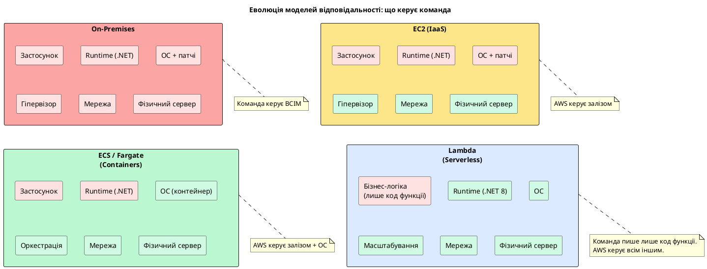

::

::tip
**Serverless ≠ «без серверів».** Сервери існують — просто ними керує AWS. Термін «serverless» означає, що розробник більше не моделює сервери у своїй архітектурній свідомості: немає концепції «скільки серверів нам потрібно», «коли вони запущені», «як їх масштабувати».
::

---

## Фундаментальна модель AWS Lambda

**AWS Lambda** — це обчислювальний сервіс, що виконує код у відповідь на події та автоматично управляє обчислювальними ресурсами, необхідними для цього виконання. Розробник надає код (функцію), Lambda забезпечує все інше: provisioning серверів, масштабування, моніторинг, реєстрацію логів.

Центральна концепція Lambda — **функція** (Lambda Function). Функція є одиницею деплойменту та виконання. Вона містить код, конфігурацію (пам'ять, timeout, змінні середовища) та IAM роль, що визначає її права доступу до інших AWS-сервісів.

### Модель виконання: Event → Handler → Response

Кожне виклик Lambda відбувається за єдиною схемою: зовнішня система (trigger) генерує **подію** (event), Lambda-сервіс ініціює **виконання** функції та передає подію у **handler** — точку входу коду, — а handler повертає **відповідь** або завершується без повернення значення (для асинхронних тригерів).

::plant-uml

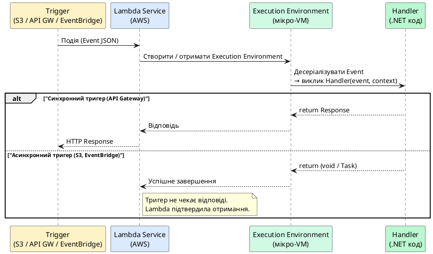

::

### Ціноутворення: оплата за мілісекунди виконання

Модель ціноутворення Lambda кардинально відрізняється від EC2: оплата не за час, поки сервер запущений, а виключно за **фактичний час виконання** коду та **кількість викликів**.

::card-group

::card{title="Кількість викликів" icon="i-heroicons-bolt"}

**$0.20** за 1 мільйон викликів

**Безкоштовно:** перший мільйон викликів щомісяця (постійно, не лише 12 місяців free tier)

::

::card{title="Тривалість виконання" icon="i-heroicons-clock"}

**$0.0000166667** за GB-секунду

Тривалість округлюється до **1 мілісекунди**

**Безкоштовно:** 400,000 GB-секунд щомісяця

::

::card{title="Приклад розрахунку" icon="i-heroicons-calculator"}

Функція: 128 MB пам'яті, 200ms виконання, 10M викликів/місяць

**Вартість:** ~$1.67 (тривалість) + $1.80 (виклики) = **~$3.47/місяць**

::

::

::tip
**Порівняння з EC2.** Один EC2 instance `t3.small` (2 vCPU, 2 GB) коштує ~$15/місяць і працює 24/7 незалежно від навантаження. Lambda з аналогічним навантаженням (10M коротких викликів) коштуватиме менше $5 і **не генерує витрат у часи простою**.
::

### Lambda Limits: операційні обмеження

Lambda накладає жорсткі технічні обмеження, які є наслідком її архітектурної природи. Знання цих меж є обов'язковим для проектування рішень на Lambda.

::field-group

::field{name="Максимальний час виконання (Timeout)" type="integer" required="true"}
**900 секунд (15 хвилин)** — абсолютна максимальна тривалість одного виклику. Після досягнення таймауту Lambda примусово завершує виконання. Для довготривалих задач необхідно використовувати AWS Step Functions або ECS.
::

::field{name="Максимальний розмір пакету деплойменту" type="string"}
**50 MB** (ZIP, завантажений напряму) або **250 MB** (ZIP, розпакований). Через S3 можна завантажити ZIP до **10 GB**. Ця межа є ключовою при роботі з .NET, де розмір publish-артефакту може бути значним.
::

::field{name="Пам'ять" type="integer"}
Від **128 MB** до **10,240 MB** (10 GB) з кроком 1 MB. CPU потужність масштабується **пропорційно** виділеній пам'яті: при 1,769 MB функція отримує 1 повний vCPU. При 3,538 MB — 2 vCPU.
::

::field{name="Ephemeral Storage (/tmp)" type="string"}
Від **512 MB** до **10,240 MB**. Тимчасове сховище, доступне лише протягом виконання та потенційно між викликами у теплому середовищі (warm execution environment). Не є надійним постійним сховищем.
::

::field{name="Паралелізм (Concurrency)" type="integer"}
За замовчуванням **1,000 одночасних виконань** на рівні акаунту AWS у регіоні. Можна запросити збільшення через AWS Support. Кожен одночасний виклик — окреме Execution Environment.
::

::field{name="Розмір payload" type="string"}
**6 MB** для синхронних викликів (Request + Response). **256 KB** для асинхронних. Для передачі великих даних необхідно використовувати S3 як проміжне сховище.
::

::

---

## Execution Environment: анатомія ізоляції

Для розуміння поведінки Lambda — зокрема феноменів Cold Start та Warm Start — необхідно детально вивчити концепцію **Execution Environment** (середовища виконання).

Коли Lambda-сервіс отримує виклик, він або повторно використовує наявне Execution Environment (якщо воно вільне та відповідає функції), або ініціалізує нове. Execution Environment — це ізольоване мікро-VM середовище на базі технології **AWS Firecracker** (відкрита технологія легковісної віртуалізації, розроблена AWS). Кожне Execution Environment забезпечує:

- повну ізоляцію від інших функцій та інших викликів тієї ж функції;
- стабільне середовище виконання: операційна система Amazon Linux 2, встановлений Runtime (наприклад, .NET 8), і ваш код;
- **персистентний стан між викликами** у межах одного Execution Environment — файлову систему `/tmp`, статичні змінні та об'єкти, ініціалізовані поза handler-функцією.

::plant-uml

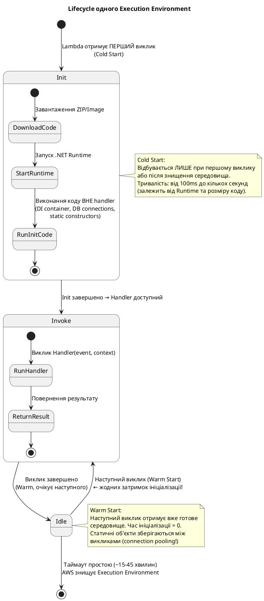

::

### Cold Start vs Warm Start: детальний аналіз

**Cold Start** — це затримка, що виникає при ініціалізації нового Execution Environment. Вона складається з кількох фаз, кожна з яких додає свою частину до загального часу:

| Фаза | Опис | Типовий час |
|------|------|-------------|
| **Download Code** | Завантаження ZIP-артефакту з S3 | 10–200ms |
| **Start Runtime** | Запуск JVM, .NET CLR або інтерпретатора | 50–500ms |
| **Run Init Code** | Виконання `static` конструкторів, DI container | 10–5000ms |
| **Run Handler** | Перший виклик обробника | час функції |

Критично важливо розуміти: **Cold Start — не просто «перший виклик повільніший»**. Cold Start відбувається кожного разу, коли Lambda масштабується горизонтально. Якщо одночасно надходить 100 запитів, а є лише 10 теплих Execution Environments, Lambda ініціалізує 90 нових — 90 одночасних Cold Starts.

::warning
**Cold Start для .NET — особлива проблема.** .NET Runtime (CLR) має значний час ініціалізації порівняно з Python або Node.js. Нативний .NET 8 Cold Start типово займає **800ms–3s** залежно від розміру застосунку та кількості ініціалізованих компонентів. Це є головним викликом для .NET Lambda розробників і вимагає спеціальних технік оптимізації.
::

**Warm Start** — виклик функції, коли Lambda-сервіс знаходить вже ініціалізоване (але вільне) Execution Environment. У цьому випадку фаза ініціалізації повністю пропускається, і виконання починається безпосередньо з Handler. Час Warm Start практично дорівнює часу виконання самої бізнес-логіки.

::plant-uml

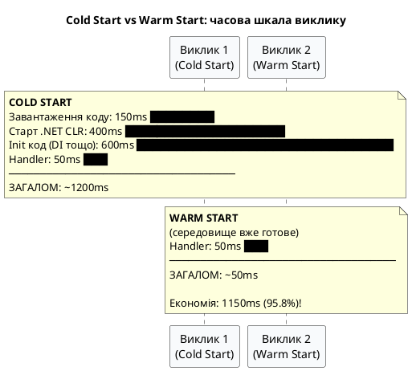

::

---

## Lambda Runtimes: середовища виконання

**Runtime** — це компонент Execution Environment, що забезпечує взаємодію між Lambda-сервісом та кодом функції. Runtime відповідає за: отримання події від Lambda-сервісу, десеріалізацію JSON-payload у нативні об'єкти, виклик handler-функції та серіалізацію відповіді назад у JSON.

AWS надає **керовані Runtime** для більшості популярних мов програмування. У разі, коли жоден із керованих Runtime не підходить, розробник може створити **Custom Runtime** — довільний виконуваний файл, що реалізує [Lambda Runtime API](https://docs.aws.amazon.com/lambda/latest/dg/runtimes-api.html).

::card-group

::card{title=".NET 8" icon="i-simple-icons-dotnet"}

**Identifier:** `dotnet8`

Офіційний керований Runtime від AWS. LTS-версія .NET. Оптимальний вибір для нових .NET Lambda проектів. Підтримує Native AOT компіляцію для мінімізації Cold Start.

::

::card{title=".NET 6" icon="i-simple-icons-dotnet"}

**Identifier:** `dotnet6`

Попередня LTS-версія. Підтримується до листопада 2024. **Рекомендується міграція на .NET 8.**

::

::card{title="Node.js 20" icon="i-simple-icons-nodedotjs"}

**Identifier:** `nodejs20.x`

Найпопулярніший Runtime для serverless. Мінімальний Cold Start (~100ms). Ідеальний для простих обробників подій та glue-коду.

::

::card{title="Python 3.12" icon="i-simple-icons-python"}

**Identifier:** `python3.12`

Широко використовується у ML/Data pipelines та скриптах автоматизації. Дуже короткий Cold Start.

::

::card{title="Java 21" icon="i-simple-icons-openjdk"}

**Identifier:** `java21`

Підтримує GraalVM Native Image для зменшення Cold Start. Аналогічна до .NET ситуація з часом ініціалізації JVM.

::

::card{title="Custom Runtime" icon="i-heroicons-code-bracket"}

**Identifier:** `provided.al2023`

Будь-яка мова, що може скомпілюватися у Linux-бінарник (Rust, Go, C++, .NET Native AOT). Максимальна гнучкість та мінімальний Cold Start.

::

::

### .NET Runtime для Lambda: специфіка та особливості

AWS надає **Amazon.Lambda.Core** NuGet-пакет, який є центральним компонентом для написання Lambda функцій на .NET. Він визначає інтерфейс `ILambdaContext` та базовий клас `ILambdaSerializer`.

Виклик Lambda-функції на .NET відбувається через механізм **Function Handler** — метод зі специфічною сигнатурою:

```csharp
// Варіант 1: синхронний handler з поверненням значення
public TOutput FunctionHandler(TInput input, ILambdaContext context)

// Варіант 2: асинхронний handler (рекомендується для .NET)
public async Task<TOutput> FunctionHandlerAsync(TInput input, ILambdaContext context)

// Варіант 3: handler без вхідних даних
public async Task<TOutput> FunctionHandlerAsync(ILambdaContext context)

// Варіант 4: handler без вхідних даних та без повернення
public async Task FunctionHandlerAsync(ILambdaContext context)
```

**`ILambdaContext`** надає метаданих про поточний виклик:

::field-group

::field{name="AwsRequestId" type="string"}
Унікальний ідентифікатор поточного виклику. Використовується для кореляції логів у CloudWatch та для ідемпотентності (уникнення повторної обробки).
::

::field{name="FunctionName" type="string"}
Назва Lambda-функції. Корисна при використанні одного handler для кількох функцій або для умовної логіки на основі контексту деплойменту.
::

::field{name="RemainingTime" type="TimeSpan"}
Час, що залишився до досягнення Timeout. Критично важливо для реалізації graceful shutdown: функція може перевіряти `RemainingTime` та коректно завершувати роботу до примусового знищення.
::

::field{name="MemoryLimitInMB" type="integer"}
Кількість пам'яті, виділеної для функції. Корисна для динамічного налаштування буферів або розміру пакетів обробки.
::

::field{name="Logger" type="ILambdaLogger"}
Базовий логер, що записує у CloudWatch Logs. Підтримує рівні: `LogTrace`, `LogDebug`, `LogInformation`, `LogWarning`, `LogError`, `LogCritical`. Для продакшн-систем рекомендується використовувати `Microsoft.Extensions.Logging` з відповідним Lambda-провайдером.
::

::

---

## Lambda Layers: механізм спільного використання коду

**Lambda Layer** — це ZIP-архів, що містить бібліотеки, кастомний Runtime, конфігурацію або будь-які інші файли, які можна розділити між кількома Lambda-функціями. Layer монтується в директорію `/opt` Execution Environment і стає доступним для функції під час виконання.

::plant-uml

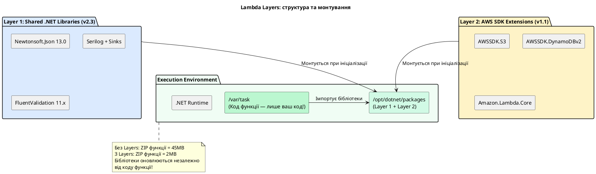

::

**Переваги Lambda Layers для .NET проектів:**

1. **Зменшення розміру деплойменту.** .NET-застосунок зі всіма NuGet-залежностями може важити 20–50 MB. Layer дозволяє розмістити NuGet-пакети окремо, а ZIP функції містить лише скомпільований код бізнес-логіки — зазвичай 1–5 MB.

2. **Централізоване управління залежностями.** Якщо 10 Lambda-функцій використовують один і той самий набір бібліотек, Layer оновлюється одноразово, і всі функції отримують оновлення після деплойменту нової версії Layer та оновлення посилань.

3. **Версіонування та незмінність.** Кожна версія Layer є незмінною (immutable). Функція посилається на конкретну версію Layer — це гарантує детермінованість середовища виконання та можливість відкату.

::note
Lambda-функція може мати до **5 Layers** одночасно. Загальний розпакований розмір усіх Layers та коду функції не повинен перевищувати 250 MB.
::

---

## Lambda Triggers: архітектура подієво-орієнтованої інтеграції

**Trigger** — це механізм, що автоматично викликає Lambda-функцію у відповідь на певну подію у системі. Lambda інтегрується з десятками AWS-сервісів та зовнішніх джерел подій. Принципово важливо розуміти дві фундаментально різні моделі взаємодії тригерів з Lambda: **синхронне** та **асинхронне** виконання.

::plant-uml

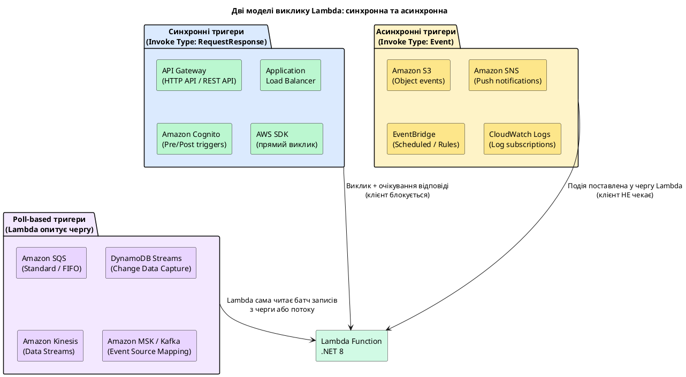

::

### Синхронний тригер: API Gateway + Lambda

Інтеграція **Amazon API Gateway** з Lambda є фундаментальним патерном побудови serverless HTTP API. API Gateway виступає проксі, що приймає HTTP-запити від клієнтів, трансформує їх у Lambda-події та повертає Lambda-відповідь клієнту.

AWS надає два типи API Gateway для інтеграції з Lambda:

::card-group

::card{title="HTTP API (v2)" icon="i-heroicons-bolt"}

**Рекомендований вибір** для більшості .NET Lambda сценаріїв.

- Нижча вартість (~70% дешевше за REST API)
- Нижча латентність
- Спрощена конфігурація
- Підтримка JWT авторизації «з коробки»
- Обмежена функціональність (немає трансформацій запитів/відповідей)

::

::card{title="REST API (v1)" icon="i-heroicons-cog-6-tooth"}

Для складних сценаріїв з потребою у:

- Трансформації request/response (Mapping Templates)
- API Keys та Usage Plans
- Детального контролю над схемою запитів (Request Validation)
- AWS WAF інтеграції на рівні API

::

::

**Структура події від API Gateway (HTTP API):**

Коли клієнт надсилає `GET /users/42?format=json`, API Gateway трансформує запит у таку JSON-структуру, яку Lambda отримує як event:

```json
{
  "version": "2.0",
  "routeKey": "GET /users/{id}",
  "rawPath": "/users/42",
  "rawQueryString": "format=json",
  "headers": {
    "accept": "application/json",
    "authorization": "Bearer eyJ...",
    "content-type": "application/json",
    "x-forwarded-for": "203.0.113.5"
  },
  "queryStringParameters": {
    "format": "json"
  },
  "pathParameters": {
    "id": "42"
  },
  "requestContext": {
    "accountId": "123456789012",
    "apiId": "abc123",
    "http": {
      "method": "GET",
      "path": "/users/42",
      "sourceIp": "203.0.113.5"
    },
    "requestId": "JKJaXmPLvHcESHA=",
    "stage": "$default"
  },
  "body": null,
  "isBase64Encoded": false
}
```

**Реалізація HTTP API handler на .NET 8 з Lambda Annotations:**

Lambda Annotations — це фреймворк від AWS, що генерує boilerplate-код через Source Generators і дозволяє писати Lambda-функції у стилі ASP.NET Core Minimal API:

```csharp [Functions.cs]
using Amazon.Lambda.Annotations;
using Amazon.Lambda.Annotations.APIGateway;
using Amazon.Lambda.Core;
using Microsoft.Extensions.Logging;

// Атрибут реєструє assembly як Lambda-функцію
[assembly: LambdaSerializer(typeof(Amazon.Lambda.Serialization.SystemTextJson.DefaultLambdaJsonSerializer))]

namespace MyApi.Lambda;

// LambdaFunction генерує CloudFormation шаблон та routing
public class UserFunctions
{
    private readonly IUserRepository _repository;
    private readonly ILogger<UserFunctions> _logger;

    // DI через конструктор — повністю підтримується!
    public UserFunctions(IUserRepository repository, ILogger<UserFunctions> logger)
    {
        _repository = repository;
        _logger = logger;
    }

    // GET /users/{id} → HTTP API Lambda Integration
    [LambdaFunction(ResourceName = "GetUser")]
    [HttpApi(LambdaHttpMethod.Get, "/users/{id}")]
    public async Task<IHttpResult> GetUserAsync(
        int id,
        ILambdaContext context)
    {
        _logger.LogInformation(
            "GetUser called. RequestId={RequestId}, UserId={UserId}",
            context.AwsRequestId, id);

        var user = await _repository.GetByIdAsync(id);

        if (user is null)
            return HttpResults.NotFound(new { message = $"User {id} not found" });

        return HttpResults.Ok(user);
    }

    // POST /users → створення нового користувача
    [LambdaFunction(ResourceName = "CreateUser")]
    [HttpApi(LambdaHttpMethod.Post, "/users")]
    public async Task<IHttpResult> CreateUserAsync(
        [FromBody] CreateUserRequest request,
        ILambdaContext context)
    {
        // Перевірка RemainingTime для graceful shutdown
        if (context.RemainingTime < TimeSpan.FromSeconds(2))
        {
            _logger.LogWarning("Approaching timeout, aborting operation");
            return HttpResults.InternalServerError();
        }

        var user = await _repository.CreateAsync(request);
        return HttpResults.Created($"/users/{user.Id}", user);
    }
}
```

**Налаштування Startup (DI Container) для Lambda:**

```csharp [Startup.cs]
using Amazon.Lambda.Annotations;
using Microsoft.Extensions.DependencyInjection;

namespace MyApi.Lambda;

// LambdaStartup — аналог Program.cs для Lambda Annotations
[LambdaStartup]
public class Startup
{
    public void ConfigureServices(IServiceCollection services)
    {
        // Реєстрація сервісів — виконується ОДНОРАЗОВО при Cold Start
        // Всі наступні виклики (Warm Start) повторно використовують цей контейнер
        services.AddAWSService<IAmazonDynamoDB>();
        services.AddScoped<IUserRepository, DynamoDbUserRepository>();

        // HttpClient з правильним connection pooling для Lambda
        services.AddHttpClient("PaymentApi", client =>
        {
            client.BaseAddress = new Uri(Environment.GetEnvironmentVariable("PAYMENT_API_URL")!);
            client.Timeout = TimeSpan.FromSeconds(10);
        });

        services.AddLogging(logging =>
        {
            logging.AddLambdaLogger();
            logging.SetMinimumLevel(LogLevel.Information);
        });
    }
}
```

::tip
**DI Container у Lambda.** Завдяки persistence Execution Environment між Warm Start викликами, `IServiceCollection` реєструється лише один раз — під час Cold Start. Усі Scoped та Transient сервіси при кожному виклику створюються заново (що є коректною поведінкою), але Singleton'и живуть протягом усього часу існування Execution Environment.
::

---

### Асинхронний тригер: S3 Events

Інтеграція з **Amazon S3** є одним із найпоширеніших сценаріїв використання Lambda. S3 автоматично надсилає повідомлення Lambda, коли в bucket відбуваються певні дії: завантаження об'єкта (`s3:ObjectCreated:*`), видалення (`s3:ObjectRemoved:*`), відновлення з Glacier та інші.

::plant-uml

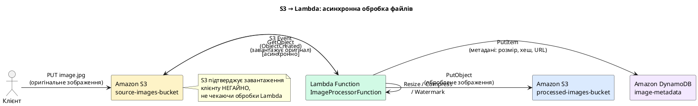

::

**Структура S3 Event, що надходить у Lambda:**

```json
{
  "Records": [
    {
      "eventVersion": "2.1",
      "eventSource": "aws:s3",
      "awsRegion": "eu-central-1",
      "eventTime": "2024-03-15T10:30:00.000Z",
      "eventName": "ObjectCreated:Put",
      "s3": {
        "s3SchemaVersion": "1.0",
        "bucket": {
          "name": "source-images-bucket",
          "arn": "arn:aws:s3:::source-images-bucket"
        },
        "object": {
          "key": "uploads/user-123/profile.jpg",
          "size": 2048576,
          "eTag": "d8e8fca2dc0f896fd7cb4cb0031ba249"
        }
      }
    }
  ]
}
```

**Зверніть увагу:** S3 Event завжди містить масив `Records`, і теоретично може містити більше одного запису (хоча на практиці S3 зазвичай надсилає по одному запису). Обробник повинен ітерувати по всіх записах.

**Handler для обробки S3 подій на .NET 8:**

```csharp [ImageProcessorFunction.cs]
using Amazon.Lambda.Core;
using Amazon.Lambda.S3Events;
using Amazon.S3;
using Amazon.S3.Model;

[assembly: LambdaSerializer(
    typeof(Amazon.Lambda.Serialization.SystemTextJson.DefaultLambdaJsonSerializer))]

namespace ImageProcessor.Lambda;

public class ImageProcessorFunction
{
    // IAmazonS3 ініціалізується ОДНОРАЗОВО при Cold Start
    // та повторно використовується між Warm Start викликами
    private static readonly IAmazonS3 S3Client = new AmazonS3Client();
    private const string DestinationBucket = "processed-images-bucket";

    public async Task FunctionHandler(S3Event evnt, ILambdaContext context)
    {
        // S3Event може містити кілька Records — обробляємо всі
        foreach (var record in evnt.Records)
        {
            var srcBucket = record.S3.Bucket.Name;
            var srcKey = Uri.UnescapeDataString(record.S3.Object.Key.Replace("+", " "));

            context.Logger.LogInformation(
                "Processing: s3://{Bucket}/{Key} ({Size} bytes)",
                srcBucket, srcKey, record.S3.Object.Size);

            try
            {
                // Завантажуємо оригінальний файл з S3
                var getRequest = new GetObjectRequest
                {
                    BucketName = srcBucket,
                    Key = srcKey
                };

                using var response = await S3Client.GetObjectAsync(getRequest);
                using var inputStream = response.ResponseStream;

                // Обробка зображення (resize, compress тощо)
                using var processedStream = await ProcessImageAsync(inputStream, context);

                // Зберігаємо результат у destination bucket
                var dstKey = $"processed/{srcKey}";
                var putRequest = new PutObjectRequest
                {
                    BucketName = DestinationBucket,
                    Key = dstKey,
                    InputStream = processedStream,
                    ContentType = "image/webp",
                    // Server-side encryption
                    ServerSideEncryptionMethod = ServerSideEncryptionMethod.AES256
                };

                await S3Client.PutObjectAsync(putRequest);

                context.Logger.LogInformation(
                    "Successfully processed: s3://{Bucket}/{Key}",
                    DestinationBucket, dstKey);
            }
            catch (Exception ex)
            {
                context.Logger.LogError(ex,
                    "Failed to process s3://{Bucket}/{Key}",
                    srcBucket, srcKey);
                // При асинхронному тригері — Lambda повторить виклик
                // (до 2 разів за замовчуванням)
                throw;
            }
        }
    }

    private static async Task<Stream> ProcessImageAsync(
        Stream input, ILambdaContext context)
    {
        // ... логіка обробки зображення
        // Можна використовувати SixLabors.ImageSharp або аналоги
        return await Task.FromResult(input); // placeholder
    }
}
```

---

### Poll-based тригер: SQS та DynamoDB Streams

**Poll-based тригери** реалізуються через механізм **Event Source Mapping** — компонент Lambda-сервісу, що безперервно опитує джерело подій (SQS черга, DynamoDB Stream, Kinesis Stream) та автоматично викликає Lambda при появі нових записів.

::plant-uml

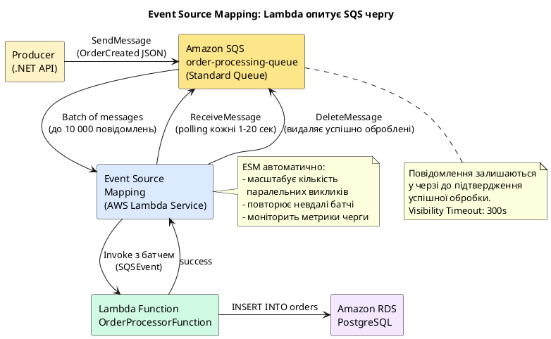

::

**Конфігурація Event Source Mapping для SQS:**

::field-group

::field{name="BatchSize" type="integer"}
Кількість повідомлень SQS, що передаються в один виклик Lambda. Від **1** до **10,000**. Більший батч — менше викликів Lambda (дешевше), але якщо один запис невалідний — весь батч потрібно повторити. Рекомендоване значення: **10–100** для типових сценаріїв.
::

::field{name="MaximumBatchingWindowInSeconds" type="integer"}
Час очікування накопичення батчу до MaxBatchSize. Lambda чекає до цього значення (0–300 секунд) перш ніж викликати функцію, навіть якщо батч ще не заповнений. Дозволяє зменшити кількість викликів при нерівномірному потоці.
::

::field{name="FunctionResponseTypes" type="array"}
`ReportBatchItemFailures` — дозволяє Lambda повертати часткові успіхи. Замість відкидання всього батчу при помилці одного запису, функція може повернути список `batchItemFailures`, і лише вказані записи повернуться у чергу для повторної обробки.
::

::field{name="BisectBatchOnFunctionError" type="boolean"}
При `true`: якщо Lambda завершилась з помилкою, ESM автоматично ділить батч навпіл та повторює кожну половину окремо — рекурсивно, доки не знайде проблемне повідомлення. Корисно при відсутності `ReportBatchItemFailures`.
::

::

**Handler для SQS з підтримкою часткових збоїв (`ReportBatchItemFailures`):**

```csharp [OrderProcessorFunction.cs]
using Amazon.Lambda.Core;
using Amazon.Lambda.SQSEvents;

namespace OrderProcessor.Lambda;

public class OrderProcessorFunction
{
    private readonly IOrderService _orderService;

    public OrderProcessorFunction(IOrderService orderService)
    {
        _orderService = orderService;
    }

    // Повертаємо SQSBatchResponse замість void/Task
    // щоб Lambda знала, які записи потрібно повторити
    public async Task<SQSBatchResponse> FunctionHandler(
        SQSEvent sqsEvent,
        ILambdaContext context)
    {
        var batchItemFailures = new List<SQSBatchResponse.BatchItemFailure>();

        // Обробляємо кожне повідомлення НЕЗАЛЕЖНО
        foreach (var message in sqsEvent.Records)
        {
            try
            {
                context.Logger.LogInformation(
                    "Processing SQS message: {MessageId}", message.MessageId);

                var order = System.Text.Json.JsonSerializer
                    .Deserialize<OrderCreatedEvent>(message.Body)!;

                await _orderService.ProcessOrderAsync(order);

                context.Logger.LogInformation(
                    "Successfully processed order: {OrderId}", order.OrderId);
            }
            catch (Exception ex)
            {
                // НЕ перекидаємо виключення — додаємо до списку невдалих
                context.Logger.LogError(ex,
                    "Failed to process message {MessageId}", message.MessageId);

                // Це повідомлення повернеться у SQS для повторної обробки
                batchItemFailures.Add(new SQSBatchResponse.BatchItemFailure
                {
                    ItemIdentifier = message.MessageId
                });
            }
        }

        return new SQSBatchResponse { BatchItemFailures = batchItemFailures };
    }
}
```

---

### Тригер EventBridge: планові та подієво-орієнтовані задачі

**Amazon EventBridge** (раніше CloudWatch Events) — це serverless шина подій, що дозволяє маршрутизувати події між AWS-сервісами та власними застосунками. З точки зору Lambda, EventBridge надає два ключових патерни:

1. **Scheduled Events (Cron)** — виклик Lambda за розкладом: щохвилини, щогодини, за cron-виразом
2. **Event Pattern Rules** — виклик Lambda при настанні певної події в AWS-акаунті (наприклад, новий EC2 instance, зміна стану RDS, Custom Events від власних мікросервісів)

```csharp [ScheduledCleanupFunction.cs]
using Amazon.Lambda.Core;
using Amazon.Lambda.CloudWatchEvents.ScheduledEvents;

namespace Scheduler.Lambda;

public class ScheduledCleanupFunction
{
    private readonly ICleanupService _cleanupService;

    public ScheduledCleanupFunction(ICleanupService cleanupService)
    {
        _cleanupService = cleanupService;
    }

    // ScheduledEvent — типізована обгортка для EventBridge Scheduled Events
    public async Task FunctionHandler(
        ScheduledEvent scheduledEvent,
        ILambdaContext context)
    {
        context.Logger.LogInformation(
            "Scheduled cleanup started. Time={Time}, Source={Source}",
            scheduledEvent.Time, scheduledEvent.Source);

        // Перевіряємо достатність часу до Timeout
        // Для завдань cleanup це критично
        if (context.RemainingTime < TimeSpan.FromMinutes(2))
        {
            context.Logger.LogWarning(
                "Insufficient time remaining ({Remaining}), skipping cleanup",
                context.RemainingTime);
            return;
        }

        var result = await _cleanupService.CleanupExpiredSessionsAsync(
            olderThan: TimeSpan.FromDays(30),
            cancellationToken: CreateCancellationToken(context));

        context.Logger.LogInformation(
            "Cleanup complete. Deleted={Count} sessions", result.DeletedCount);
    }

    private static CancellationToken CreateCancellationToken(ILambdaContext context)
    {
        // Автоматично скасовуємо операцію за 30 секунд до Timeout
        var cts = new CancellationTokenSource(
            context.RemainingTime - TimeSpan.FromSeconds(30));
        return cts.Token;
    }
}
```

---

## Environment Variables та Secrets Management

### Environment Variables: зовнішня конфігурація функції

**Environment Variables** у Lambda виконують ту саму роль, що і у традиційних серверних застосунках: вони забезпечують механізм зовнішньої конфігурації без необхідності змінювати код функції. Lambda дозволяє визначити довільний набір пар ключ-значення, що стають доступними у коді через стандартний `Environment.GetEnvironmentVariable()`.

**Ключові характеристики Environment Variables у Lambda:**

- Зберігаються як частина конфігурації функції та автоматично присутні в кожному Execution Environment
- Значення **шифруються** AWS KMS (за замовчуванням — AWS Managed Key, можна вказати власний KMS ключ)
- Максимальний сумарний розмір усіх змінних — **4 KB**
- Змінюються без необхідності нового деплойменту коду (але потребують нового Execution Environment — тобто спричиняють Cold Start)

**Доступ до Environment Variables з .NET:**

```csharp [Configuration.cs]
namespace MyApi.Lambda;

// Рекомендована практика: типізований клас конфігурації
// замість прямих викликів Environment.GetEnvironmentVariable скрізь у коді
public sealed class LambdaConfiguration
{
    // Назва таблиці DynamoDB — змінюється між mid/prod оточеннями
    public string UsersTableName { get; } =
        Environment.GetEnvironmentVariable("USERS_TABLE_NAME")
        ?? throw new InvalidOperationException(
            "USERS_TABLE_NAME environment variable is not set");

    // URL зовнішнього API — різний для staging та production
    public string PaymentApiBaseUrl { get; } =
        Environment.GetEnvironmentVariable("PAYMENT_API_BASE_URL")
        ?? "https://api.payment.example.com";

    // Рівень логування
    public string LogLevel { get; } =
        Environment.GetEnvironmentVariable("LOG_LEVEL") ?? "Information";

    // Feature flag
    public bool EnableDetailedLogging { get; } =
        bool.TryParse(
            Environment.GetEnvironmentVariable("ENABLE_DETAILED_LOGGING"),
            out var value) && value;
}
```

::warning
**Чутливі дані у Environment Variables.** Хоча AWS шифрує значення Environment Variables «у спокої» (at rest), вони відображаються у відкритому вигляді у консолі AWS та через AWS CLI для будь-кого з правами `lambda:GetFunctionConfiguration`. Паролі, API ключі та токени **не слід** зберігати у Environment Variables у відкритому вигляді. Для секретів використовуйте AWS Secrets Manager або AWS Parameter Store (SSM).
::

---

### AWS Secrets Manager: безпечне зберігання секретів

**AWS Secrets Manager** — це спеціалізований сервіс для зберігання, ротації та надання доступу до секретних значень: паролів баз даних, API ключів, OAuth токенів. На відміну від Environment Variables, Secrets Manager:

- Підтримує **автоматичну ротацію** секрету (наприклад, щомісячне автоматичне оновлення пароля RDS)
- Зберігає **версії** секрету та дозволяє атомарне оновлення без простою
- Надає **аудит доступу** через CloudTrail
- Інтегрується з IAM для гранулярного контролю доступу до конкретних секретів

::plant-uml

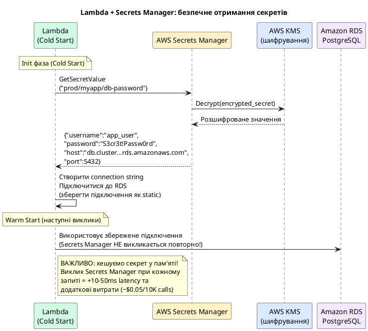

::

**Реалізація безпечного отримання секрету з кешуванням у .NET:**

```csharp [SecretsManager.cs]
using Amazon.SecretsManager;
using Amazon.SecretsManager.Model;
using System.Text.Json;

namespace MyApi.Lambda.Infrastructure;

public sealed class SecretsManagerService : ISecretsManagerService
{
    private readonly IAmazonSecretsManager _client;

    // Кеш секретів — статичний, живе протягом усього Execution Environment
    // Ключ: ARN секрету, Значення: (розшифроване значення, час кешування)
    private static readonly Dictionary<string, (string Value, DateTime CachedAt)>
        _secretsCache = new();

    // Час жизні кешу — 5 хвилин
    // Довше = менше витрат, але затримка оновлення при ротації
    private static readonly TimeSpan CacheTtl = TimeSpan.FromMinutes(5);

    public SecretsManagerService(IAmazonSecretsManager client)
    {
        _client = client;
    }

    public async Task<T> GetSecretAsync<T>(string secretArn) where T : class
    {
        // Перевіряємо кеш
        if (_secretsCache.TryGetValue(secretArn, out var cached))
        {
            if (DateTime.UtcNow - cached.CachedAt < CacheTtl)
                return JsonSerializer.Deserialize<T>(cached.Value)!;
        }

        // Запит до Secrets Manager (лише при Cache Miss або протермінованому кеші)
        var request = new GetSecretValueRequest { SecretId = secretArn };
        var response = await _client.GetSecretValueAsync(request);
        var secretValue = response.SecretString;

        // Оновлюємо кеш
        _secretsCache[secretArn] = (secretValue, DateTime.UtcNow);

        return JsonSerializer.Deserialize<T>(secretValue)!;
    }
}

// Типізований record для секрету бази даних
public record DatabaseSecret(
    string Username,
    string Password,
    string Host,
    int Port,
    string DbName)
{
    public string ToConnectionString() =>
        $"Host={Host};Port={Port};Database={DbName};" +
        $"Username={Username};Password={Password};SSL Mode=Require;";
}
```

**Інтеграція у Startup з отриманням секрету при Cold Start:**

```csharp [Startup.cs]
[LambdaStartup]
public class Startup
{
    public void ConfigureServices(IServiceCollection services)
    {
        services.AddAWSService<IAmazonSecretsManager>();
        services.AddSingleton<ISecretsManagerService, SecretsManagerService>();

        // Синхронне отримання рядка підключення при ініціалізації DI Container
        // Виконується ОДНОРАЗОВО у Cold Start — не при кожному виклику
        services.AddSingleton<IDbConnectionFactory>(provider =>
        {
            var secretsManager = provider.GetRequiredService<ISecretsManagerService>();
            var secretArn = Environment.GetEnvironmentVariable("DB_SECRET_ARN")!;

            // GetAwaiter().GetResult() допустимий у Cold Start
            // (не в handler — там завжди async!)
            var dbSecret = secretsManager
                .GetSecretAsync<DatabaseSecret>(secretArn)
                .GetAwaiter().GetResult();

            return new NpgsqlConnectionFactory(dbSecret.ToConnectionString());
        });
    }
}
```

---

## Lambda Destinations: маршрутизація результатів асинхронних викликів

**Lambda Destinations** — це конфігурація, що визначає, куди Lambda-сервіс автоматично надсилає результат **асинхронного** виклику залежно від того, завершилась функція успіхом чи помилкою. Destinations усувають необхідність вручну реалізовувати логіку маршрутизації результатів безпосередньо в коді функції.

::note
Lambda Destinations працюють **виключно** для асинхронних викликів (S3, SNS, EventBridge, прямий асинхронний виклик SDK) та poll-based тригерів (SQS, DynamoDB Streams). Для синхронних тригерів (API Gateway) Destinations недоступні — відповідь повертається напряму клієнту.
::

::plant-uml

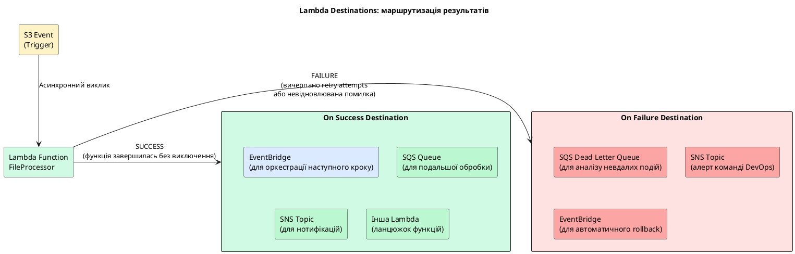

::

**Що Lambda автоматично надсилає у Destination:**

Lambda формує збагачений JSON-payload, що містить повний контекст виклику — не лише результат, але й метадані про саму функцію та оригінальну подію. Це усуває необхідність ручного збору контексту у коді.

```json
{
  "version": "1.0",
  "timestamp": "2024-03-15T10:30:00.123Z",
  "requestContext": {
    "requestId": "a1b2c3d4-e5f6-7890-abcd-ef1234567890",
    "functionArn": "arn:aws:lambda:eu-central-1:123456789012:function:FileProcessor",
    "condition": "Success",
    "approximateInvokeCount": 1
  },
  "requestPayload": {
    "Records": [ { "eventSource": "aws:s3", "s3": { "object": { "key": "report.csv" } } } ]
  },
  "responseContext": {
    "statusCode": 200,
    "executedVersion": "$LATEST"
  },
  "responsePayload": {
    "processedRows": 15420,
    "outputKey": "processed/report-2024-03-15.parquet"
  }
}
```

**Порівняння з Dead Letter Queue (DLQ):**

| Характеристика | Lambda Destinations | Dead Letter Queue |
|---|---|---|
| **Де спрацьовує** | On Success **та** On Failure | Лише On Failure |
| **Що передається** | Повний контекст: input + output + metadata | Лише оригінальний input event |
| **Підтримувані цілі** | SQS, SNS, EventBridge, Lambda | SQS, SNS |
| **Коли з'явилось** | 2019 (новіший підхід) | 2016 (legacy підхід) |
| **Рекомендація** | ✅ Використовуйте для нових проектів | ⚠️ Тільки для зворотної сумісності |

---

---

## Lambda Performance Optimization: стратегії мінімізації Cold Start

Оптимізація продуктивності Lambda для .NET є комплексним завданням, що охоплює декілька незалежних рівнів: архітектуру коду, конфігурацію Runtime, розмір deployment package та апаратні ресурси. Розглянемо кожен рівень детально.

### Стратегія 1: оптимізація коду Init-фази

Найефективніший підхід — мінімізувати обсяг роботи, що виконується поза handler-функцією (тобто у Init-фазі Cold Start). Кожен об'єкт, ініціалізований у Init-фазі, живе протягом усього Execution Environment і використовується повторно при Warm Start. Це є перевагою, але Init-фаза повинна ініціалізувати **лише те, що справді потрібно**.

```csharp [Оптимальна структура ініціалізації]
// ❌ ПОГАНО: Lazy ініціалізація у handler — Cold Start при КОЖНОМУ виклику,
// якщо об'єкт ще не ініціалізований
public class BadFunction
{
    public async Task Handler(S3Event evt, ILambdaContext ctx)
    {
        // Новий клієнт створюється при першому виклику кожного Execution Environment
        // Але також — при кожному Cold Start нового Execution Environment
        var s3Client = new AmazonS3Client(); // ❌
        var result = await s3Client.ListBucketsAsync();
    }
}

// ✅ ДОБРЕ: Статична ініціалізація — виконується ОДНОРАЗОВО при Cold Start
// Повторно використовується при всіх Warm Start викликах
public class GoodFunction
{
    // static readonly — ініціалізується при завантаженні класу (Init-фаза)
    private static readonly IAmazonS3 S3Client = new AmazonS3Client();
    private static readonly IAmazonDynamoDB DynamoClient = new AmazonDynamoDBClient();

    // HttpClient НІКОЛИ не створюється у handler — connection pooling!
    private static readonly HttpClient HttpClient = new HttpClient
    {
        BaseAddress = new Uri(Environment.GetEnvironmentVariable("API_BASE_URL")!),
        Timeout = TimeSpan.FromSeconds(10)
    };

    public async Task<string> Handler(APIGatewayHttpApiV2ProxyRequest req, ILambdaContext ctx)
    {
        // Handler лише використовує вже ініціалізовані об'єкти ✅
        var response = await HttpClient.GetStringAsync("/health");
        return response;
    }
}
```

**Lazy initialization для важких залежностей:**

Якщо певна залежність використовується не у кожному виклику (наприклад, лише при конкретному типі події), можна застосувати `Lazy<T>` для відкладеної ініціалізації — вона виконається при першому зверненні, але лише один раз протягом Execution Environment:

```csharp
public class OptimizedFunction
{
    // Lazy ініціалізація — підключення до ElasticSearch виконується
    // лише при першому зверненні, але не затримує Init-фазу
    private static readonly Lazy<IElasticClient> ElasticClient = new(() =>
    {
        var settings = new ConnectionSettings(
            new Uri(Environment.GetEnvironmentVariable("ELASTICSEARCH_URL")!));
        return new ElasticClient(settings);
    });

    public async Task Handler(SQSEvent evt, ILambdaContext ctx)
    {
        // Lazy.Value ініціалізує клієнт лише один раз
        var client = ElasticClient.Value;
        // ...
    }
}
```

### Стратегія 2: вибір оптимального обсягу пам'яті

Ця стратегія є одним із найпоширеніших нерозуміних аспектів оптимізації Lambda. **Більше пам'яті = більше CPU**. Збільшення пам'яті часто **знижує загальну вартість**, оскільки функція виконується швидше і загальна сума GB-секунд зменшується попри вищу ставку за GB.

::plant-uml

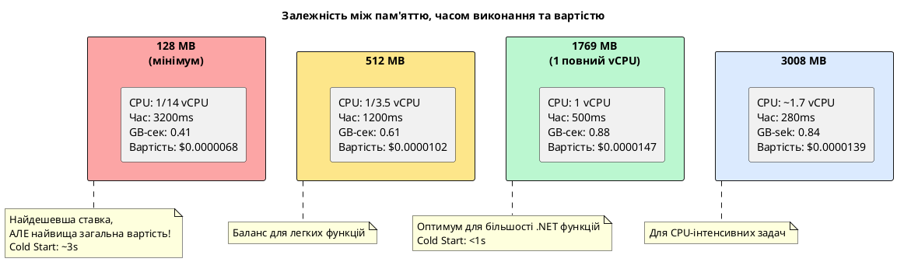

::

::tip
**AWS Lambda Power Tuning** — відкрита AWS Step Functions State Machine, що автоматично тестує вашу функцію з різними обсягами пам'яті та знаходить оптимальну точку між швидкістю та вартістю. Запустіть її перед виведенням функції у production: [github.com/alexcasalboni/aws-lambda-power-tuning](https://github.com/alexcasalboni/aws-lambda-power-tuning).
::

### Стратегія 3: оптимізація розміру deployment package

Розмір ZIP-архіву безпосередньо впливає на тривалість Cold Start: Lambda завантажує весь архів при ініціалізації нового Execution Environment. Для .NET проектів основний внесок у розмір вносять NuGet-залежності та нативні бінарники.

**Техніки зменшення розміру для .NET:**

```xml [MyFunction.csproj]
<Project Sdk="Microsoft.NET.Sdk">
  <PropertyGroup>
    <TargetFramework>net8.0</TargetFramework>
    <Nullable>enable</Nullable>
    <ImplicitUsings>enable</ImplicitUsings>

    <!-- Публікуємо self-contained з trimming для видалення невикористаних типів -->
    <PublishReadyToRun>true</PublishReadyToRun>

    <!-- Видаляє невикористані типи та члени при публікації -->
    <!-- Зменшує розмір на 30-60% для типових .NET Lambda -->
    <PublishTrimmed>true</PublishTrimmed>

    <!-- Генерує нативний код заздалегідь → швидший запуск CLR -->
    <TieredPGO>true</TieredPGO>
  </PropertyGroup>

  <ItemGroup>
    <PackageReference Include="Amazon.Lambda.Core" Version="2.2.0" />
    <PackageReference Include="Amazon.Lambda.Serialization.SystemTextJson" Version="2.4.1" />
    <!-- Використовуємо System.Text.Json замість Newtonsoft.Json — менший розмір! -->

    <!-- Для мінімізації: включаємо лише потрібні AWSSDK пакети -->
    <!-- ❌ Не: AWSSDK.Core (тягне ВСЕ) -->
    <!-- ✅ Так: точечні пакети для конкретних сервісів -->
    <PackageReference Include="AWSSDK.S3" Version="3.7.*" />
    <PackageReference Include="AWSSDK.DynamoDBv2" Version="3.7.*" />
  </ItemGroup>
</Project>
```

**Команда публікації з оптимізацією для Lambda:**

```bash
# Публікація з trimming та ReadyToRun для зменшення Cold Start
dotnet publish src/MyFunction \
    --configuration Release \
    --runtime linux-x64 \
    --self-contained true \
    --output ./publish \
    -p:PublishTrimmed=true \
    -p:PublishReadyToRun=true

# Пакуємо у ZIP для завантаження у Lambda
cd publish && zip -r ../function.zip .

# Розмір до та після оптимізації (типові результати):
# До: 48 MB | Після trimming: 18 MB | Зменшення: 62%
```

---

### Стратегія 4: .NET Native AOT — максимальна мінімізація Cold Start

**Native AOT** (Ahead-of-Time) компіляція — це технологія .NET, що компілює код безпосередньо у нативний машинний код Linux заздалегідь, повністю усуваючи необхідність запуску CLR та JIT-компіляції при ініціалізації. Результатом є самодостатній бінарний файл, що запускається на порядок швидше за стандартний .NET Runtime.

::plant-uml

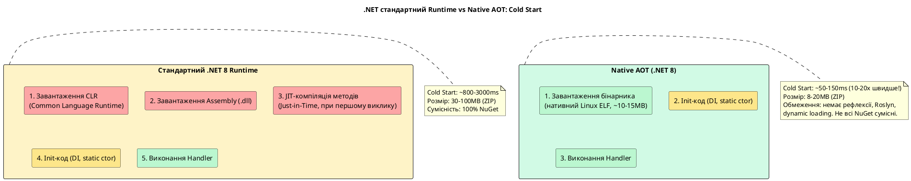

::

**Налаштування проекту для Native AOT Lambda:**

```xml [NativeAotFunction.csproj]
<Project Sdk="Microsoft.NET.Sdk">
  <PropertyGroup>
    <TargetFramework>net8.0</TargetFramework>
    <Nullable>enable</Nullable>
    <ImplicitUsings>enable</ImplicitUsings>

    <!-- Увімкнення Native AOT -->
    <PublishAot>true</PublishAot>

    <!-- Для AOT необхідна явна вказівка типів серіалізації -->
    <!-- (рефлексія недоступна в AOT для JSON серіалізації) -->
  </PropertyGroup>

  <ItemGroup>
    <!-- Спеціальний пакет для Native AOT Lambda -->
    <PackageReference Include="Amazon.Lambda.RuntimeSupport" Version="1.10.*" />
    <PackageReference Include="Amazon.Lambda.Core" Version="2.2.0" />
    <PackageReference Include="Amazon.Lambda.Serialization.SystemTextJson" Version="2.4.1" />
  </ItemGroup>
</Project>
```

**Native AOT потребує явної реєстрації типів для JSON серіалізації через Source Generators:**

```csharp [NativeAotFunction.cs]
using Amazon.Lambda.Core;
using Amazon.Lambda.RuntimeSupport;
using Amazon.Lambda.Serialization.SystemTextJson;
using System.Text.Json.Serialization;

// Source Generator генерує AOT-сумісний серіалізатор для вказаних типів
[JsonSerializable(typeof(ApiRequest))]
[JsonSerializable(typeof(ApiResponse))]
[JsonSerializable(typeof(Amazon.Lambda.APIGatewayEvents.APIGatewayHttpApiV2ProxyRequest))]
[JsonSerializable(typeof(Amazon.Lambda.APIGatewayEvents.APIGatewayHttpApiV2ProxyResponse))]
public partial class LambdaJsonContext : JsonSerializerContext { }

// Точка входу для Native AOT Lambda
static class Program
{
    static async Task Main(string[] args)
    {
        // Зовнішнє налаштування — без DI контейнера (AOT-сумісно)
        var handler = new OrderHandler();

        // Bootstrap Lambda Runtime з AOT-сумісним серіалізатором
        var serializer = new SourceGeneratorLambdaJsonSerializer<LambdaJsonContext>();

        await LambdaBootstrapBuilder
            .Create<ApiRequest, ApiResponse>(
                handler.HandleAsync,
                serializer)
            .Build()
            .RunAsync();
    }
}

public sealed class OrderHandler
{
    // Статичні клієнти — ініціалізуються при запуску процесу
    private static readonly IAmazonDynamoDB _dynamo = new AmazonDynamoDBClient();

    public async Task<ApiResponse> HandleAsync(
        ApiRequest request, ILambdaContext context)
    {
        context.Logger.LogInformation(
            "AOT Handler invoked: {RequestId}", context.AwsRequestId);

        // Бізнес-логіка...
        return new ApiResponse { StatusCode = 200, Body = "OK" };
    }
}

public record ApiRequest(string Path, string Method, string? Body);
public record ApiResponse(int StatusCode, string Body);
```

::caution
**Обмеження Native AOT.** Native AOT несумісний з динамічними можливостями .NET: рефлексія (Reflection), `dynamic`, `Assembly.Load`, `Activator.CreateInstance` без Source Generators. Деякі популярні бібліотеки (AutoMapper, Entity Framework Core) не сумісні з AOT або мають обмежену підтримку. **Перевіряйте сумісність всіх NuGet-залежностей** перед переходом на AOT.
::

---

## Provisioned Concurrency: усунення Cold Start для критичних функцій

**Provisioned Concurrency** — це механізм, що дозволяє AWS підтримувати вказану кількість **заздалегідь ініціалізованих** Execution Environments у постійній готовності. На відміну від звичайних (on-demand) Execution Environments, що ініціалізуються при надходженні запиту (Cold Start), Provisioned Environments вже прогріті та готові обробляти виклики **негайно**.

::plant-uml

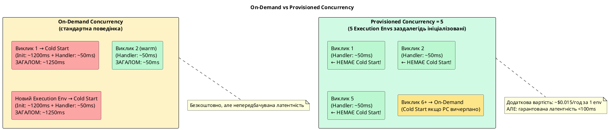

::

### Коли Provisioned Concurrency є необхідністю

Не кожна Lambda-функція потребує Provisioned Concurrency. Цей механізм є виправданим лише в конкретних сценаріях:

::card-group

::card{title="User-facing API" icon="i-heroicons-user-circle"}

API Gateway + Lambda, де Cold Start безпосередньо впливає на користувацький досвід. P99 latency > 2 секунди є неприйнятним для інтерактивних застосунків.

Рекомендація: **PC = мінімальна очікувана одночасна кількість запитів у пік**

::

::card{title="SLA-критичні функції" icon="i-heroicons-shield-check"}

Функції з жорсткими SLA (<500ms response time), де Cold Start є порушенням контракту. Наприклад: платіжні шлюзи, системи real-time торгів.

::

::card{title="Функції з дорогим Init" icon="i-heroicons-cpu-chip"}

ML-моделі, що завантажуються у Init-фазі (100-500 MB модель), або функції зі складними DI-контейнерами (> 3 секунд ініціалізації).

::

::

### Конфігурація Provisioned Concurrency

**Налаштування через AWS CLI:**

```bash
# Крок 1: опублікувати нову версію функції
# (Provisioned Concurrency застосовується до версій, не до $LATEST)
aws lambda publish-version \
    --function-name dotnet-api-function \
    --description "v1.0.0 — production release" \
    --region eu-central-1

# Крок 2: зберегти ARN версії
FUNCTION_VERSION_ARN=$(aws lambda list-versions-by-function \
    --function-name dotnet-api-function \
    --region eu-central-1 \
    --query "Versions[-1].FunctionArn" \
    --output text)

echo "Function version: $FUNCTION_VERSION_ARN"

# Крок 3: увімкнути Provisioned Concurrency для цієї версії
aws lambda put-provisioned-concurrency-config \
    --function-name dotnet-api-function \
    --qualifier 1 \
    --provisioned-concurrent-executions 5 \
    --region eu-central-1
```

::terminal-preview{title="put-provisioned-concurrency-config"}

<div class="line"><span class="opacity-40">$</span> <strong>aws lambda put-provisioned-concurrency-config --function-name dotnet-api-function --qualifier 1 --provisioned-concurrent-executions 5</strong></div>
<div class="line">{</div>
<div class="line">  <span class="text-blue-400">"RequestedProvisionedConcurrentExecutions"</span>: <span class="text-yellow-400">5</span>,</div>
<div class="line">  <span class="text-blue-400">"AvailableProvisionedConcurrentExecutions"</span>: <span class="text-yellow-400">0</span>,</div>
<div class="line">  <span class="text-blue-400">"AllocatedProvisionedConcurrentExecutions"</span>: <span class="text-yellow-400">0</span>,</div>
<div class="line">  <span class="text-blue-400">"Status"</span>: <span class="text-green-400">"IN_PROGRESS"</span>,</div>
<div class="line">  <span class="text-blue-400">"StatusReason"</span>: <span class="text-green-400">"Provisioning 5 concurrent executions"</span>,</div>
<div class="line">  <span class="text-blue-400">"LastModified"</span>: <span class="text-green-400">"2024-03-15T10:30:00+0000"</span></div>
<div class="line">}</div>
<div class="line"><span class="text-yellow-400 opacity-60">← Статус "IN_PROGRESS": AWS ініціалізує 5 Execution Environments (~2-3 хвилини)</span></div>

::

**Перевірка готовності Provisioned Concurrency:**

```bash
# Очікуємо переходу статусу з IN_PROGRESS на READY
aws lambda get-provisioned-concurrency-config \
    --function-name dotnet-api-function \
    --qualifier 1 \
    --region eu-central-1
```

::terminal-preview{title="Статус READY — Provisioned Concurrency активний"}

<div class="line"><span class="opacity-40">$</span> <strong>aws lambda get-provisioned-concurrency-config --function-name dotnet-api-function --qualifier 1</strong></div>
<div class="line">{</div>
<div class="line">  <span class="text-blue-400">"RequestedProvisionedConcurrentExecutions"</span>: <span class="text-yellow-400">5</span>,</div>
<div class="line">  <span class="text-blue-400">"AvailableProvisionedConcurrentExecutions"</span>: <span class="text-yellow-400">5</span>,</div>
<div class="line">  <span class="text-blue-400">"AllocatedProvisionedConcurrentExecutions"</span>: <span class="text-yellow-400">5</span>,</div>
<div class="line">  <span class="text-blue-400">"Status"</span>: <span class="text-green-400">"READY"</span>,</div>
<div class="line">  <span class="text-blue-400">"LastModified"</span>: <span class="text-green-400">"2024-03-15T10:32:47+0000"</span></div>
<div class="line">}</div>
<div class="line"><span class="text-green-400 opacity-60">← READY: всі 5 Execution Environments ініціалізовані та чекають викликів</span></div>

::

### Application Auto Scaling для Provisioned Concurrency

Оскільки Provisioned Concurrency має фіксовану щогодинну вартість, утримувати максимальний рівень цілодобово є нераціональним. **Application Auto Scaling** дозволяє автоматично змінювати кількість Provisioned Environments за розкладом або на основі метрик.

```bash
# Реєстрація Lambda як scalable target для Application Auto Scaling
aws application-autoscaling register-scalable-target \
    --service-namespace lambda \
    --resource-id "function:dotnet-api-function:1" \
    --scalable-dimension "lambda:function:ProvisionedConcurrency" \
    --min-capacity 2 \
    --max-capacity 50 \
    --region eu-central-1

# Створення Scheduled Action: збільшення PC о 07:00 UTC (ранкова активність)
aws application-autoscaling put-scheduled-action \
    --service-namespace lambda \
    --resource-id "function:dotnet-api-function:1" \
    --scalable-dimension "lambda:function:ProvisionedConcurrency" \
    --scheduled-action-name "scale-up-morning" \
    --schedule "cron(0 7 * * ? *)" \
    --scalable-target-action MinCapacity=10,MaxCapacity=50 \
    --region eu-central-1

# Зменшення PC о 22:00 UTC (нічний мінімум)
aws application-autoscaling put-scheduled-action \
    --service-namespace lambda \
    --resource-id "function:dotnet-api-function:1" \
    --scalable-dimension "lambda:function:ProvisionedConcurrency" \
    --scheduled-action-name "scale-down-night" \
    --schedule "cron(0 22 * * ? *)" \
    --scalable-target-action MinCapacity=2,MaxCapacity=50 \
    --region eu-central-1
```

---

## Моніторинг Lambda через Amazon CloudWatch

Lambda автоматично публікує набір метрик у CloudWatch без будь-якого налаштування. Розуміння цих метрик є фундаментальним для операційного контролю над serverless системою.

::card-group

::card{title="Invocations" icon="i-heroicons-bolt"}

**Кількість викликів** функції за період. Включає успішні та невдалі виклики. Базова метрика для розуміння навантаження та оцінки витрат.

::

::card{title="Errors" icon="i-heroicons-exclamation-triangle"}

**Кількість викликів, що завершились помилкою**: необроблені виключення, таймаути, помилки MemoryExceeded. `Error Rate = Errors / Invocations`.

::

::card{title="Duration" icon="i-heroicons-clock"}

**Час виконання** у мілісекундах: Average, P50, P95, P99. P99 Duration є критичним показником: він відображає найгірший досвід 1% користувачів.

::

::card{title="Throttles" icon="i-heroicons-no-symbol"}

**Кількість викликів, що відхилені** через перевищення Concurrency Limit. Якщо Throttles > 0 — функція досягла ліміту паралелізму і деякі запити не обробляються.

::

::card{title="ConcurrentExecutions" icon="i-heroicons-square-3-stack-3d"}

**Поточна кількість** одночасно виконуваних інстанцій. Корисна для відстеження наближення до Concurrency Limit (1,000 за замовчуванням).

::

::card{title="InitDuration" icon="i-heroicons-rocket-launch"}

**Час Cold Start Init-фази** у мілісекундах. Відображається лише для викликів, що викликали Cold Start. Ключова метрика для відстеження ефективності оптимізацій.

::

::

**Рекомендований CloudWatch Dashboard для Lambda:**

```bash
# Створення CloudWatch Alarm для відстеження критичного рівня помилок
aws cloudwatch put-metric-alarm \
    --alarm-name "lambda-dotnet-error-rate-critical" \
    --alarm-description "Error rate > 5% for 2 consecutive periods" \
    --metric-name Errors \
    --namespace AWS/Lambda \
    --dimensions Name=FunctionName,Value=dotnet-api-function \
    --statistic Sum \
    --period 60 \
    --evaluation-periods 2 \
    --threshold 5 \
    --comparison-operator GreaterThanOrEqualToThreshold \
    --treat-missing-data notBreaching \
    --alarm-actions "arn:aws:sns:eu-central-1:123456789012:ops-alerts" \
    --region eu-central-1

# Alarm для відстеження Cold Start тривалості > 3 секунд
aws cloudwatch put-metric-alarm \
    --alarm-name "lambda-cold-start-too-long" \
    --alarm-description "Init duration > 3000ms — investigate optimization" \
    --metric-name InitDuration \
    --namespace AWS/Lambda \
    --dimensions Name=FunctionName,Value=dotnet-api-function \
    --statistic p99 \
    --period 300 \
    --evaluation-periods 1 \
    --threshold 3000 \
    --comparison-operator GreaterThanThreshold \
    --alarm-actions "arn:aws:sns:eu-central-1:123456789012:ops-alerts" \
    --region eu-central-1
```

---

## Деплой Lambda: AWS CLI та AWS Toolkit

### Деплой через AWS CLI

**Крок 1: Підготовка та публікація .NET проекту:**

::steps

### Встановлення Lambda Tools

```bash
# Встановлення глобального інструменту для Lambda деплойменту
dotnet tool install -g Amazon.Lambda.Tools

# Перевірка встановлення
dotnet lambda --version
```

### Публікація та пакування

```bash
# Перехід до директорії проекту
cd src/MyFunction

# Публікація з оптимізаціями для Lambda
dotnet lambda package \
    --configuration Release \
    --framework net8.0 \
    --output-package ./publish/function.zip
```

### Завантаження у S3 та деплой

```bash
# Завантажуємо пакет у S3 (для пакетів > 50MB обов'язково)
aws s3 cp ./publish/function.zip \
    s3://my-deployment-bucket/lambda/dotnet-api-function.zip \
    --region eu-central-1

# Оновлення коду функції (функція вже існує)
aws lambda update-function-code \
    --function-name dotnet-api-function \
    --s3-bucket my-deployment-bucket \
    --s3-key lambda/dotnet-api-function.zip \
    --region eu-central-1
```

### Оновлення конфігурації

```bash
# Оновлення конфігурації (пам'ять, timeout, env vars)
aws lambda update-function-configuration \
    --function-name dotnet-api-function \
    --runtime dotnet8 \
    --handler MyFunction::MyFunction.UserFunctions::GetUserAsync \
    --memory-size 1024 \
    --timeout 30 \
    --environment Variables="{
        USERS_TABLE_NAME=prod-users-table,
        LOG_LEVEL=Information,
        DB_SECRET_ARN=arn:aws:secretsmanager:eu-central-1:123456789012:secret:prod/myapp/db
    }" \
    --region eu-central-1
```

### Публікація нової версії

```bash
# Публікуємо версію для Provisioned Concurrency або Alias
aws lambda publish-version \
    --function-name dotnet-api-function \
    --description "Release $(date +%Y-%m-%d)" \
    --region eu-central-1
```

::

### Перший деплой нової функції

```bash
#!/bin/bash
# Скрипт першого деплойменту Lambda-функції

FUNCTION_NAME="dotnet-api-function"
REGION="eu-central-1"
ACCOUNT_ID=$(aws sts get-caller-identity --query Account --output text)
ROLE_ARN="arn:aws:iam::${ACCOUNT_ID}:role/lambda-execution-role"

# Публікація проекту
dotnet lambda package \
    --configuration Release \
    --framework net8.0 \
    --output-package ./publish/function.zip

# Завантаження у S3
aws s3 cp ./publish/function.zip \
    "s3://my-deployment-bucket/lambda/${FUNCTION_NAME}.zip" \
    --region "$REGION"

# Створення Lambda-функції
aws lambda create-function \
    --function-name "$FUNCTION_NAME" \
    --runtime dotnet8 \
    --role "$ROLE_ARN" \
    --handler "MyFunction::MyFunction.UserFunctions::GetUserAsync" \
    --code "S3Bucket=my-deployment-bucket,S3Key=lambda/${FUNCTION_NAME}.zip" \
    --memory-size 1024 \
    --timeout 30 \
    --description ".NET 8 User API Lambda" \
    --environment "Variables={USERS_TABLE_NAME=prod-users}" \
    --region "$REGION"

echo "✅ Lambda function '${FUNCTION_NAME}' created successfully"

# Очікуємо активації
aws lambda wait function-active \
    --function-name "$FUNCTION_NAME" \
    --region "$REGION"

echo "✅ Function is ACTIVE and ready to receive invocations"
```

::terminal-preview{title="Результат деплойменту"}

<div class="line"><span class="opacity-40">$</span> <strong>./deploy.sh</strong></div>
<div class="line"><span class="text-blue-400">Executing publish command: dotnet lambda package ...</span></div>
<div class="line">  Determining dependencies of the project...</div>
<div class="line">  Packaging project for deployment to AWS Lambda</div>
<div class="line">  Publishing project with configuration Release</div>
<div class="line">  Zipping publish folder /src/publish/</div>
<div class="line"><span class="text-green-400 font-bold">  Lambda package created: ./publish/function.zip (18.3 MB)</span></div>
<div class="line"></div>
<div class="line"><span class="text-blue-400">Uploading to S3...</span></div>
<div class="line">upload: ./publish/function.zip to s3://my-deployment-bucket/lambda/dotnet-api-function.zip</div>
<div class="line"></div>
<div class="line"><span class="text-green-400 font-bold">✅ Lambda function 'dotnet-api-function' created successfully</span></div>
<div class="line"><span class="text-green-400 font-bold">✅ Function is ACTIVE and ready to receive invocations</span></div>

::

---

## Підсумок: коли використовувати Lambda, а коли — EC2/ECS

Вибір між Lambda та традиційними обчислювальними сервісами є архітектурним рішенням, що залежить від конкретних характеристик навантаження, вимог до латентності та операційної складності.

| Критерій | Lambda | EC2 / ECS |
|---|---|---|
| **Час запуску** | Cold Start 100ms – 3s | Постійно запущений (0ms latency) |
| **Максимальний час виконання** | 15 хвилин | Необмежено |
| **Стан між запитами** | Stateless (ephemeral) | Stateful (можливо) |
| **Масштабування** | Автоматичне, миттєве | ASG (хвилини) |
| **Вартість при низькому навантаженні** | Майже нульова | Фіксована |
| **Вартість при високому навантаженні** | Лінійна (може бути вищою) | Фіксована + резерви |
| **Операційна складність** | Мінімальна | Середня — висока |
| **Контроль над середовищем** | Обмежений | Повний |

**Lambda є оптимальним вибором для:**

- Event-driven обробки: S3 файлів, SQS повідомлень, DynamoDB Streams
- Нерегулярного трафіку з піками та тривалими паузами
- Простих HTTP API з низьким та середнім навантаженням
- Задач за розкладом (cron jobs)
- Glue-коду між AWS-сервісами

**EC2 або ECS є кращим вибором для:**

- Довготривалих задач (> 15 хвилин)
- Систем з постійно-стабільним навантаженням (Lambda буде дорожчою)
- Застосунків з жорсткими вимогами до Cold Start без бажання платити за Provisioned Concurrency
- Систем, що потребують специфічного апаратного забезпечення (GPU, великий обсяг RAM)
- Stateful додатків з WebSocket з'єднаннями тривалістю > 15 хвилин

