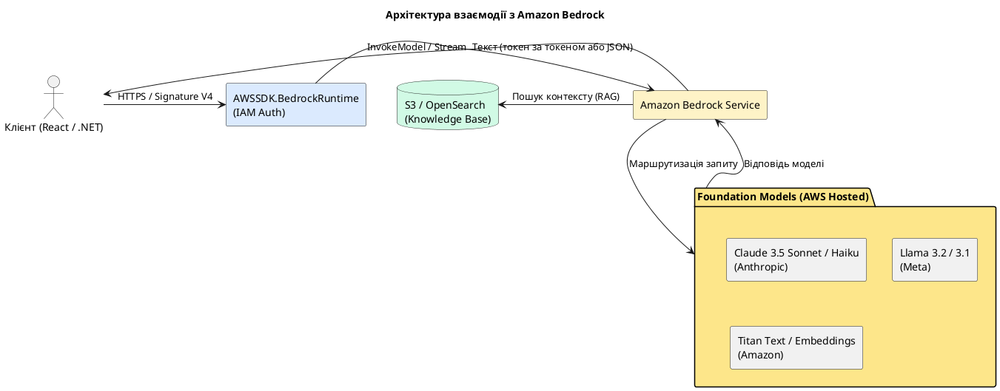

# Amazon Bedrock - Foundation Models, RAG та Agents

## Що таке Amazon Bedrock?

**Amazon Bedrock** — це повністю керований сервіс, що надає уніфікований API для роботи з провідними базовими моделями (Foundation Models) від Anthropic, Meta, Mistral AI, Stability AI та самої Amazon. На відміну від використання окремих API безпосередньо від розробників моделей, Bedrock розгортає ці моделі всередині безпечного периметру AWS, забезпечуючи:

- **Конфіденційність даних**: ваші промпти та корпоративні дані ніколи не залишають ваш AWS-акаунт, не використовуються для навчання публічних моделей і повністю захищені шифруванням.
- **Уніфікований інтерфейс**: один SDK та один клієнт для виклику різних моделей (наприклад, перемикання з Claude на Llama потребує лише зміни ID моделі).
- **Стійкість та масштабованість**: робота через хмарну інфраструктуру AWS із підтримкою Provisioned Throughput для гарантованої пропускної здатності.
- **Інтеграцію з іншими сервісами AWS**: нативне підключення до S3, OpenSearch, IAM, CloudWatch, Lambda та VPC.

::plant-uml



::

---

## Foundation Models у Bedrock: огляд

Bedrock дозволяє вибирати моделі під конкретні бізнес-задачі та бюджет:

::card-group

::card{title="Claude 3.5 Sonnet & Haiku" icon="i-heroicons-sparkles"}
**Постачальник:** Anthropic  
Найкращі моделі за якістю кодування, логічного мислення (reasoning) та обробки великих обсягів тексту. Claude 3.5 Sonnet є галузевим стандартом для складних аналітичних завдань. Haiku — надзвичайно швидка та дешева модель для простих операцій.  
*ID:* `anthropic.claude-3-5-sonnet-20241022-v2:0`
::

::card{title="Llama 3.2 & 3.1" icon="i-heroicons-cpu-chip"}
**Постачальник:** Meta  
Відкриті моделі з відмінним співвідношенням швидкості та якості. Llama 3.2 підтримує візуальні дані (multimodal), а Llama 3.1 405B є однією з найпотужніших відкритих моделей у світі. Ідеальні для кастомізації.  
*ID:* `meta.llama3-1-70b-instruct-v1:0`
::

::card{title="Mistral Large" icon="i-heroicons-bolt"}
**Постачальник:** Mistral AI  
Моделі з високою продуктивністю, глибоким розумінням коду та чудовою підтримкою виклику зовнішніх функцій (Function Calling / Tool Use).  
*ID:* `mistral.mistral-large-2402-v1:0`
::

::card{title="Amazon Titan & Embeddings" icon="i-simple-icons-amazonaws"}
**Постачальник:** Amazon  
Titan Text Premier підходить для базових текстових задач. Titan Embeddings V2 є оптимальним рішенням для перетворення тексту у вектори (1024 виміри) для пошуку у базах знань (RAG).  
*ID:* `amazon.titan-embed-text-v2:0`
::

::

---

## Налаштування доступу та IAM політики

Перш ніж викликати моделі з коду, необхідно увімкнути їх у консолі AWS: **Amazon Bedrock** -> **Model access** -> **Manage model access** -> Позначити потрібні моделі та натиснути **Save changes**.

Для роботи застосунку потрібні такі IAM дозволи:

```json
{
  "Version": "2012-10-17",
  "Statement": [
    {
      "Effect": "Allow",
      "Action": [
        "bedrock:InvokeModel",
        "bedrock:InvokeModelWithResponseStream"
      ],
      "Resource": [
        "arn:aws:bedrock:us-east-1::foundation-model/anthropic.claude-3-5-sonnet-20241022-v2:0",
        "arn:aws:bedrock:us-east-1::foundation-model/anthropic.claude-3-haiku-20240307-v1:0",
        "arn:aws:bedrock:us-east-1::foundation-model/amazon.titan-embed-text-v2:0"
      ]
    },
    {
      "Effect": "Allow",
      "Action": [
        "bedrock-agent-runtime:RetrieveAndGenerate",
        "bedrock-agent-runtime:Retrieve"
      ],
      "Resource": "*"
    }
  ]
}
```

---

## Виклик Bedrock API з .NET 8

Для роботи з API Bedrock Runtime використовується офіційний NuGet-пакет:

```bash
dotnet add package AWSSDK.BedrockRuntime
```

### Реалізація BedrockClaudeService

Оскільки Bedrock використовує уніфікований API, запити надсилаються через метод `InvokeModelAsync`. Тіло запиту формується у форматі Messages API, який є специфічним для сімейства моделей Claude.

Нижче наведено повноцінний та повністю працездатний сервіс для надсилання запитів та збереження контексту чату:

```csharp [Services/BedrockClaudeService.cs]
using System.Text;
using System.Text.Json;
using System.Text.Json.Serialization;
using Amazon.BedrockRuntime;
using Amazon.BedrockRuntime.Model;

namespace AwsAiPlayground.Services;

public record ChatMessage(
    [property: JsonPropertyName("role")] string Role,
    [property: JsonPropertyName("content")] List<ClaudeContent> Content);

public record ClaudeContent(
    [property: JsonPropertyName("type")] string Type,
    [property: JsonPropertyName("text")] string Text);

public record ClaudeRequestBody(
    [property: JsonPropertyName("anthropic_version")] string AnthropicVersion,
    [property: JsonPropertyName("max_tokens")] int MaxTokens,
    [property: JsonPropertyName("temperature")] float Temperature,
    [property: JsonPropertyName("system")] string? System,
    [property: JsonPropertyName("messages")] List<ChatMessage> Messages);

public record ClaudeResponseBody(
    [property: JsonPropertyName("id")] string Id,
    [property: JsonPropertyName("type")] string Type,
    [property: JsonPropertyName("role")] string Role,
    [property: JsonPropertyName("content")] List<ClaudeContent> Content,
    [property: JsonPropertyName("stop_reason")] string StopReason,
    [property: JsonPropertyName("usage")] ClaudeUsage Usage);

public record ClaudeUsage(
    [property: JsonPropertyName("input_tokens")] int InputTokens,
    [property: JsonPropertyName("output_tokens")] int OutputTokens);

public sealed class BedrockClaudeService
{
    private readonly IAmazonBedrockRuntime _bedrockClient;
    private const string ClaudeSonnetId = "anthropic.claude-3-5-sonnet-20241022-v2:0";

    public BedrockClaudeService(IAmazonBedrockRuntime bedrockClient)
    {
        _bedrockClient = bedrockClient;
    }

    /// <summary>
    /// Надсилає поодинокий запит до Claude 3.5 Sonnet та повертає текстову відповідь.
    /// </summary>
    public async Task<string> AskClaudeAsync(string prompt, string? systemInstruction = null)
    {
        var messages = new List<ChatMessage>
        {
            new("user", [new("text", prompt)])
        };

        var requestBody = new ClaudeRequestBody(
            AnthropicVersion: "bedrock-2023-05-31",
            MaxTokens: 2048,
            Temperature: 0.7f,
            System: systemInstruction,
            Messages: messages
        );

        var jsonOptions = new JsonSerializerOptions
        {
            DefaultIgnoreCondition = JsonIgnoreCondition.WhenWritingNull
        };
        var serializedBody = JsonSerializer.Serialize(requestBody, jsonOptions);

        var request = new InvokeModelRequest
        {
            ModelId = ClaudeSonnetId,
            ContentType = "application/json",
            Accept = "application/json",
            Body = new MemoryStream(Encoding.UTF8.GetBytes(serializedBody))
        };

        try
        {
            var response = await _bedrockClient.InvokeModelAsync(request);

            using var reader = new StreamReader(response.Body);
            var responseBodyJson = await reader.ReadToEndAsync();

            var result = JsonSerializer.Deserialize<ClaudeResponseBody>(responseBodyJson);
            return result?.Content.FirstOrDefault(c => c.Type == "text")?.Text 
                   ?? throw new InvalidOperationException("Empty response from Bedrock model.");
        }
        catch (AmazonBedrockRuntimeException ex)
        {
            // Логування помилок AWS Bedrock (наприклад, перевищення ліміту запитів або відсутність доступу)
            throw new Exception($"AWS Bedrock Runtime Error: {ex.Message}", ex);
        }
    }
}
```

---

## Реалізація Streaming Responses (SSE)

Стрімінг дозволяє отримувати токени відповіді по мірі їх генерації моделлю. Це критично для сучасних чат-інтерфейсів, оскільки користувач починає читати відповідь миттєво.

### 1. Сервіс асинхронного стрімінгу у .NET 8

```csharp [Services/BedrockStreamingService.cs]
using System.Runtime.CompilerServices;
using System.Text;
using System.Text.Json;
using Amazon.BedrockRuntime;
using Amazon.BedrockRuntime.Model;

namespace AwsAiPlayground.Services;

public sealed class BedrockStreamingService
{
    private readonly IAmazonBedrockRuntime _bedrockClient;
    private const string ClaudeSonnetId = "anthropic.claude-3-5-sonnet-20241022-v2:0";

    public BedrockStreamingService(IAmazonBedrockRuntime bedrockClient)
    {
        _bedrockClient = bedrockClient;
    }

    /// <summary>
    /// Повертає асинхронний потік текстових чанків від Claude 3.5 Sonnet.
    /// </summary>
    public async IAsyncEnumerable<string> StreamClaudeResponseAsync(
        List<ChatMessage> chatHistory,
        string? systemInstruction = null,
        [EnumeratorCancellation] CancellationToken cancellationToken = default)
    {
        var requestBody = new ClaudeRequestBody(
            AnthropicVersion: "bedrock-2023-05-31",
            MaxTokens: 2048,
            Temperature: 0.7f,
            System: systemInstruction,
            Messages: chatHistory
        );

        var serializedBody = JsonSerializer.Serialize(requestBody);

        var request = new InvokeModelWithResponseStreamRequest
        {
            ModelId = ClaudeSonnetId,
            ContentType = "application/json",
            Accept = "application/json",
            Body = new MemoryStream(Encoding.UTF8.GetBytes(serializedBody))
        };

        InvokeModelWithResponseStreamResponse response;
        try
        {
            response = await _bedrockClient.InvokeModelWithResponseStreamAsync(request, cancellationToken);
        }
        catch (AmazonBedrockRuntimeException ex)
        {
            yield return $"[ERROR: {ex.Message}]";
            yield break;
        }

        await foreach (var ev in response.Body.WithCancellation(cancellationToken))
        {
            if (ev is PayloadPart payloadPart)
            {
                using var reader = new StreamReader(payloadPart.Bytes);
                var chunkJson = await reader.ReadToEndAsync(cancellationToken);

                using var doc = JsonDocument.Parse(chunkJson);
                var root = doc.RootElement;

                // Для Claude Messages API стрімінг надсилає об'єкти з типом "content_block_delta"
                if (root.TryGetProperty("type", out var typeProp) && 
                    typeProp.GetString() == "content_block_delta")
                {
                    if (root.TryGetProperty("delta", out var deltaProp) && 
                        deltaProp.TryGetProperty("text", out var textProp))
                    {
                        var text = textProp.GetString();
                        if (!string.IsNullOrEmpty(text))
                        {
                            yield return text;
                        }
                    }
                }
            }
        }
    }
}
```

### 2. Контролер ASP.NET Core для Server-Sent Events

Створюємо API-ендпоінт, який ретранслює потік токенів клієнту через протокол Server-Sent Events (SSE).

```csharp [Controllers/ChatController.cs]
using Microsoft.AspNetCore.Mvc;
using AwsAiPlayground.Services;

namespace AwsAiPlayground.Controllers;

[ApiController]
[Route("api/[controller]")]
public sealed class ChatController : ControllerBase
{
    private readonly BedrockStreamingService _streamingService;

    public ChatController(BedrockStreamingService streamingService)
    {
        _streamingService = streamingService;
    }

    [HttpPost("stream")]
    public async Task StreamChat([FromBody] List<ChatMessage> history, CancellationToken cancellationToken)
    {
        Response.Headers.Append("Content-Type", "text/event-stream");
        Response.Headers.Append("Cache-Control", "no-cache");
        Response.Headers.Append("Connection", "keep-alive");

        const string systemPrompt = "Ти професійний розробник ПЗ. Відповідай українською мовою лаконічно.";

        try
        {
            await foreach (var chunk in _streamingService.StreamClaudeResponseAsync(history, systemPrompt, cancellationToken))
            {
                // Записуємо чанк у форматі SSE: data: <content>\n\n
                var data = JsonSerializer.Serialize(new { text = chunk });
                await Response.WriteAsync($"data: {data}\n\n", cancellationToken);
                await Response.Body.FlushAsync(cancellationToken);
            }
            
            await Response.WriteAsync("data: [DONE]\n\n", cancellationToken);
            await Response.Body.FlushAsync(cancellationToken);
        }
        catch (OperationCanceledException)
        {
            // Клієнт розірвав з'єднання, завершуємо роботу
        }
    }
}
```

### 3. Реєстрація залежностей у Program.cs

Переконайтеся, що сервіси та AWS клієнт правильно налаштовані в контейнері залежностей ASP.NET Core:

```csharp [Program.cs]
using Amazon.BedrockRuntime;
using AwsAiPlayground.Services;

var builder = WebApplication.CreateBuilder(args);

builder.Services.AddControllers();

// Реєструємо клієнт Bedrock Runtime із регіоном us-east-1
builder.Services.AddSingleton<IAmazonBedrockRuntime>(sp => 
    new AmazonBedrockRuntimeClient(Amazon.RegionEndpoint.USEast1));

builder.Services.AddSingleton<BedrockClaudeService>();
builder.Services.AddSingleton<BedrockStreamingService>();

// Дозволяємо CORS для локального React розробницького серверу
builder.Services.AddCors(options =>
{
    options.AddPolicy("CorsPolicy", policy =>
    {
        policy.WithOrigins("http://localhost:5173")
              .AllowAnyHeader()
              .AllowAnyMethod()
              .AllowCredentials();
    });
});

var app = builder.Build();

app.UseCors("CorsPolicy");
app.MapControllers();
app.Run();
```

---

## React Chat UI з підтримкою SSE

Створимо сучасний інтерфейс чату на React із використанням кастомного хука для обробки потокових даних.

### 1. Кастомний хук для стрімінгу

```typescript [src/hooks/useStreamingChat.ts]
import { useState, useCallback, useRef } from 'react';

export interface ChatMessageDto {
  role: 'user' | 'assistant';
  content: { type: 'text'; text: string }[];
}

export interface UIResponse {
  id: string;
  role: 'user' | 'assistant';
  text: string;
}

export function useStreamingChat(apiUrl: string) {
  const [messages, setMessages] = useState<UIResponse[]>([]);
  const [isGenerating, setIsGenerating] = useState(false);
  const abortControllerRef = useRef<AbortController | null>(null);

  const sendMessage = useCallback(async (userText: string) => {
    if (!userText.trim()) return;

    const userMsg: UIResponse = {
      id: crypto.randomUUID(),
      role: 'user',
      text: userText,
    };

    const assistantMsgId = crypto.randomUUID();
    const assistantMsgPlaceholder: UIResponse = {
      id: assistantMsgId,
      role: 'assistant',
      text: '',
    };

    setMessages((prev) => [...prev, userMsg, assistantMsgPlaceholder]);
    setIsGenerating(true);

    abortControllerRef.current = new AbortController();

    // Формуємо історію відповідно до формату Claude Messages API
    const historyPayload: ChatMessageDto[] = [
      ...messages.map((m) => ({
        role: m.role,
        content: [{ type: 'text' as const, text: m.text }],
      })),
      { role: 'user', content: [{ type: 'text' as const, text: userText }] },
    ];

    try {
      const response = await fetch(apiUrl, {
        method: 'POST',
        headers: { 'Content-Type': 'application/json' },
        body: JSON.stringify(historyPayload),
        signal: abortControllerRef.current.signal,
      });

      if (!response.ok || !response.body) {
        throw new Error('Не вдалося розпочати потік відповідей.');
      }

      const reader = response.body.getReader();
      const decoder = new TextDecoder();
      let buffer = '';

      while (true) {
        const { done, value } = await reader.read();
        if (done) break;

        buffer += decoder.decode(value, { stream: true });
        const lines = buffer.split('\n');
        buffer = lines.pop() ?? ''; // Залишаємо неповний рядок у буфері

        for (const line of lines) {
          const cleanLine = line.trim();
          if (!cleanLine.startsWith('data: ')) continue;
          
          const rawData = cleanLine.substring(6).trim();
          if (rawData === '[DONE]') {
            setIsGenerating(false);
            return;
          }

          try {
            const parsed = JSON.parse(rawData) as { text: string };
            setMessages((prev) =>
              prev.map((m) =>
                m.id === assistantMsgId ? { ...m, text: m.text + parsed.text } : m
              )
            );
          } catch {
            // Ігноруємо пошкоджені JSON-пакети
          }
        }
      }
    } catch (error) {
      if ((error as Error).name !== 'AbortError') {
        setMessages((prev) =>
          prev.map((m) =>
            m.id === assistantMsgId ? { ...m, text: 'Сталася помилка під час генерації відповіді.' } : m
          )
        );
      }
      setIsGenerating(false);
    }
  }, [messages, apiUrl]);

  const stopGeneration = useCallback(() => {
    if (abortControllerRef.current) {
      abortControllerRef.current.abort();
      setIsGenerating(false);
    }
  }, []);

  const clearChat = useCallback(() => {
    stopGeneration();
    setMessages([]);
  }, [stopGeneration]);

  return { messages, isGenerating, sendMessage, stopGeneration, clearChat };
}
```

### 2. React Компонент Чат-вікна

Для рендерингу форматованого тексту (Markdown) та красивого підсвічування коду встановимо необхідні бібліотеки:

```bash
npm install react-markdown remark-gfm react-syntax-highlighter
npm install -D @types/react-syntax-highlighter
```

```tsx [src/components/ChatWindow.tsx]
import React, { useState, useRef, useEffect } from 'react';
import ReactMarkdown from 'react-markdown';
import remarkGfm from 'remark-gfm';
import { Prism as SyntaxHighlighter } from 'react-syntax-highlighter';
import { oneDark } from 'react-syntax-highlighter/dist/esm/styles/prism';
import { useStreamingChat } from '../hooks/useStreamingChat';
import './ChatWindow.css';

export function ChatWindow() {
  const [input, setInput] = useState('');
  const { messages, isGenerating, sendMessage, stopGeneration, clearChat } = 
    useStreamingChat('http://localhost:5000/api/chat/stream');
  
  const bottomRef = useRef<HTMLDivElement>(null);

  useEffect(() => {
    bottomRef.current?.scrollIntoView({ behavior: 'smooth' });
  }, [messages]);

  const handleSend = (e: React.FormEvent) => {
    e.preventDefault();
    if (!input.trim() || isGenerating) return;
    sendMessage(input);
    setInput('');
  };

  return (
    <div className="chat-container">
      <div className="chat-header">
        <h2>AWS Bedrock Chat Console</h2>
        <button className="clear-btn" onClick={clearChat}>Очистити історію</button>
      </div>

      <div className="messages-list">
        {messages.map((msg) => (
          <div key={msg.id} className={`message-bubble ${msg.role}`}>
            <div className="avatar">{msg.role === 'user' ? '👤' : '🤖'}</div>
            <div className="content">
              {msg.role === 'assistant' ? (
                <ReactMarkdown
                  remarkPlugins={[remarkGfm]}
                  components={{
                    code({ className, children, ...props }) {
                      const match = /language-(\w+)/.exec(className || '');
                      const isInline = !match;
                      return isInline ? (
                        <code className="inline-code" {...props}>{children}</code>
                      ) : (
                        <SyntaxHighlighter
                          style={oneDark}
                          language={match[1]}
                          PreTag="div"
                          className="code-block"
                        >
                          {String(children).replace(/\n$/, '')}
                        </SyntaxHighlighter>
                      );
                    }
                  }}
                >
                  {msg.text}
                </ReactMarkdown>
              ) : (
                <p className="plain-text">{msg.text}</p>
              )}
            </div>
          </div>
        ))}
        <div ref={bottomRef} />
      </div>

      <form className="chat-input-form" onSubmit={handleSend}>
        <input
          type="text"
          value={input}
          onChange={(e) => setInput(e.target.value)}
          placeholder="Запитайте у Claude 3.5..."
          disabled={isGenerating}
        />
        {isGenerating ? (
          <button type="button" className="stop-btn" onClick={stopGeneration}>Зупинити</button>
        ) : (
          <button type="submit" className="send-btn" disabled={!input.trim()}>Надіслати</button>
        )}
      </form>
    </div>
  );
}
```

### 3. CSS Стилі для преміум дизайну (glassmorphism та sleek dark mode)

```css [src/components/ChatWindow.css]
.chat-container {
  display: flex;
  flex-direction: column;
  height: 80vh;
  max-width: 900px;
  margin: 20px auto;
  background: rgba(17, 24, 39, 0.95);
  border-radius: 16px;
  border: 1px solid rgba(255, 255, 255, 0.1);
  box-shadow: 0 10px 30px rgba(0, 0, 0, 0.5);
  overflow: hidden;
  font-family: 'Inter', system-ui, sans-serif;
  color: #f3f4f6;
}

.chat-header {
  display: flex;
  justify-content: space-between;
  align-items: center;
  padding: 16px 24px;
  background: rgba(31, 41, 55, 0.8);
  border-bottom: 1px solid rgba(255, 255, 255, 0.05);
}

.chat-header h2 {
  font-size: 1.25rem;
  font-weight: 600;
  margin: 0;
  background: linear-gradient(90deg, #60a5fa, #a78bfa);
  -webkit-background-clip: text;
  -webkit-text-fill-color: transparent;
}

.clear-btn {
  background: transparent;
  border: 1px solid rgba(239, 68, 68, 0.4);
  color: #ef4444;
  padding: 6px 12px;
  border-radius: 6px;
  cursor: pointer;
  font-size: 0.875rem;
  transition: all 0.2s ease;
}

.clear-btn:hover {
  background: rgba(239, 68, 68, 0.1);
}

.messages-list {
  flex: 1;
  padding: 24px;
  overflow-y: auto;
  display: flex;
  flex-direction: column;
  gap: 20px;
}

.message-bubble {
  display: flex;
  gap: 16px;
  max-width: 85%;
  align-self: flex-start;
}

.message-bubble.user {
  align-self: flex-end;
  flex-direction: row-reverse;
}

.avatar {
  width: 40px;
  height: 40px;
  border-radius: 50%;
  display: flex;
  align-items: center;
  justify-content: center;
  background: rgba(255, 255, 255, 0.05);
  border: 1px solid rgba(255, 255, 255, 0.1);
  font-size: 1.25rem;
}

.message-bubble.user .avatar {
  background: rgba(96, 165, 250, 0.2);
  border-color: rgba(96, 165, 250, 0.3);
}

.content {
  background: rgba(31, 41, 55, 0.6);
  padding: 12px 18px;
  border-radius: 12px;
  border: 1px solid rgba(255, 255, 255, 0.05);
  line-height: 1.6;
}

.message-bubble.user .content {
  background: rgba(59, 130, 246, 0.2);
  border-color: rgba(59, 130, 246, 0.3);
}

.plain-text {
  margin: 0;
  white-space: pre-wrap;
}

.inline-code {
  background: rgba(255, 255, 255, 0.1);
  padding: 2px 6px;
  border-radius: 4px;
  font-family: monospace;
}

.code-block {
  border-radius: 8px !important;
  margin: 10px 0 !important;
  font-size: 0.9rem;
}

.chat-input-form {
  display: flex;
  padding: 20px 24px;
  background: rgba(31, 41, 55, 0.8);
  border-top: 1px solid rgba(255, 255, 255, 0.05);
  gap: 12px;
}

.chat-input-form input {
  flex: 1;
  background: rgba(17, 24, 39, 0.8);
  border: 1px solid rgba(255, 255, 255, 0.1);
  border-radius: 8px;
  padding: 12px 16px;
  color: #fff;
  font-size: 1rem;
  outline: none;
  transition: border-color 0.2s;
}

.chat-input-form input:focus {
  border-color: #3b82f6;
}

.send-btn, .stop-btn {
  padding: 12px 24px;
  border-radius: 8px;
  border: none;
  font-weight: 500;
  cursor: pointer;
  transition: opacity 0.2s;
}

.send-btn {
  background: #3b82f6;
  color: white;
}

.send-btn:disabled {
  background: #4b5563;
  cursor: not-allowed;
}

.stop-btn {
  background: #ef4444;
  color: white;
}

.send-btn:hover, .stop-btn:hover {
  opacity: 0.9;
}
```

---

## Bedrock Knowledge Bases: RAG (Retrieval-Augmented Generation)

**RAG** — це архітектурний патерн, який збагачує запити користувачів актуальним корпоративним контекстом із внутрішніх документів (PDF, Markdown, DOCX, CSV тощо), що дозволяє уникнути галюцинацій та обмежень у знаннях LLM.

**Amazon Bedrock Knowledge Bases** автоматизує весь конвеєр RAG:
1. Завантаження документів в S3.
2. Розбиття на шматки (Chunking).
3. Перетворення тексту у векторні представлення за допомогою моделей Embedding (наприклад, Titan Embeddings V2).
4. Збереження та індексація у векторній базі даних (наприклад, Amazon OpenSearch Serverless).

### .NET 8 сервіс для виконання RAG-запитів

Для роботи з клієнтом Bedrock Agent Runtime потрібний такий NuGet-пакет:

```bash
dotnet add package AWSSDK.BedrockAgentRuntime
```

```csharp [Services/KnowledgeBaseService.cs]
using Amazon.BedrockAgentRuntime;
using Amazon.BedrockAgentRuntime.Model;

namespace AwsAiPlayground.Services;

public record DocumentCitation(
    string Content,
    string SourceUri,
    Dictionary<string, string> Metadata);

public record RagResponse(
    string Answer,
    string SessionId,
    List<DocumentCitation> Citations);

public record RetrievedDocument(
    string Content,
    double Score,
    string SourceUri);

public sealed class KnowledgeBaseService
{
    private readonly IAmazonBedrockAgentRuntime _agentRuntimeClient;
    private readonly string _knowledgeBaseId;
    private const string ClaudeArn = "arn:aws:bedrock:us-east-1::foundation-model/anthropic.claude-3-5-sonnet-20241022-v2:0";

    public KnowledgeBaseService(
        IAmazonBedrockAgentRuntime agentRuntimeClient, 
        string knowledgeBaseId)
    {
        _agentRuntimeClient = agentRuntimeClient;
        _knowledgeBaseId = knowledgeBaseId;
    }

    /// <summary>
    /// Автоматичний RAG: Bedrock сам шукає інформацію у векторній БД та генерує відповідь за допомогою Claude.
    /// </summary>
    public async Task<RagResponse> QueryKnowledgeBaseAsync(string question, string? sessionId = null)
    {
        var request = new RetrieveAndGenerateRequest
        {
            Input = new RetrieveAndGenerateInput { Text = question },
            RetrieveAndGenerateConfiguration = new RetrieveAndGenerateConfiguration
            {
                Type = RetrieveAndGenerateType.KNOWLEDGE_BASE,
                KnowledgeBaseConfiguration = new KnowledgeBaseRetrieveAndGenerateConfiguration
                {
                    KnowledgeBaseId = _knowledgeBaseId,
                    ModelArn = ClaudeArn,
                    GenerationConfiguration = new GenerationConfiguration
                    {
                        PromptTemplate = new PromptTemplate
                        {
                            TextPromptTemplate = 
                                """
                                Дай відповідь на запитання виключно на основі наданих документів.
                                Якщо інформації у документах недостатньо, скажи "Я не знайшов відповіді у внутрішній базі даних".
                                
                                Документи:
                                $search_results$
                                
                                Запитання:
                                $query$
                                """
                        }
                    },
                    RetrievalConfiguration = new KnowledgeBaseRetrievalConfiguration
                    {
                        VectorSearchConfiguration = new KnowledgeBaseVectorSearchConfiguration
                        {
                            NumberOfResults = 4 // передати 4 найбільш релевантні фрагменти
                        }
                    }
                }
            },
            SessionId = sessionId
        };

        var response = await _agentRuntimeClient.RetrieveAndGenerateAsync(request);

        var citations = response.Citations
            .SelectMany(c => c.RetrievedReferences)
            .Select(r => new DocumentCitation(
                Content: r.Content.Text,
                SourceUri: r.Location.S3Location?.Uri ?? "Unknown",
                Metadata: r.Metadata.ToDictionary(kv => kv.Key, kv => kv.Value.ToString() ?? "")
            ))
            .DistinctBy(c => c.SourceUri)
            .ToList();

        return new RagResponse(
            Answer: response.Output.Text,
            SessionId: response.SessionId,
            Citations: citations
        );
    }

    /// <summary>
    /// Тільки пошук: повертає релевантні шматки документів без генерації відповіді.
    /// </summary>
    public async Task<List<RetrievedDocument>> RetrieveDocumentsOnlyAsync(string query, int maxResults = 5)
    {
        var request = new RetrieveRequest
        {
            KnowledgeBaseId = _knowledgeBaseId,
            RetrievalQuery = new KnowledgeBaseQuery { Text = query },
            RetrievalConfiguration = new KnowledgeBaseRetrievalConfiguration
            {
                VectorSearchConfiguration = new KnowledgeBaseVectorSearchConfiguration
                {
                    NumberOfResults = maxResults
                }
            }
        };

        var response = await _agentRuntimeClient.RetrieveAsync(request);

        return response.RetrievalResults
            .Select(r => new RetrievedDocument(
                Content: r.Content.Text,
                Score: r.Score,
                SourceUri: r.Location.S3Location?.Uri ?? "Unknown"
            ))
            .ToList();
    }
}
```

---

## Bedrock Guardrails: безпека та фільтрація

**Bedrock Guardrails** використовуються для встановлення правил фільтрації контенту, виявлення конфіденційних даних (PII), блокування заборонених тем або запобігання атакам типу prompt injection. Правила безпеки конфігуруються у консолі AWS Bedrock, після чого Guardrail застосовується до кожного запиту.

### .NET 8 сервіс з модерацією через Guardrails

```csharp [Services/BedrockGuardrailService.cs]
using System.Text;
using System.Text.Json;
using Amazon.BedrockRuntime;
using Amazon.BedrockRuntime.Model;

namespace AwsAiPlayground.Services;

public record GuardrailResult(
    string ResponseText,
    bool WasBlocked,
    string? BlockedReason);

public sealed class BedrockGuardrailService
{
    private readonly IAmazonBedrockRuntime _bedrockClient;
    private readonly string _guardrailId;
    private readonly string _guardrailVersion;
    private const string ClaudeSonnetId = "anthropic.claude-3-5-sonnet-20241022-v2:0";

    public BedrockGuardrailService(
        IAmazonBedrockRuntime bedrockClient, 
        string guardrailId, 
        string guardrailVersion)
    {
        _bedrockClient = bedrockClient;
        _guardrailId = guardrailId;
        _guardrailVersion = guardrailVersion;
    }

    /// <summary>
    /// Викликає Claude 3.5 Sonnet із застосуванням налаштованого Guardrail.
    /// </summary>
    public async Task<GuardrailResult> InvokeWithGuardrailAsync(string userMessage)
    {
        var messages = new List<ChatMessage>
        {
            new("user", [new("text", userMessage)])
        };

        var requestBody = new ClaudeRequestBody(
            AnthropicVersion: "bedrock-2023-05-31",
            MaxTokens: 1000,
            Temperature: 0.5f,
            System: "Ти корисний віртуальний помічник банку.",
            Messages: messages
        );

        var serializedBody = JsonSerializer.Serialize(requestBody);

        var request = new InvokeModelRequest
        {
            ModelId = ClaudeSonnetId,
            ContentType = "application/json",
            Accept = "application/json",
            Body = new MemoryStream(Encoding.UTF8.GetBytes(serializedBody)),
            
            // Налаштування Guardrail
            GuardrailIdentifier = _guardrailId,
            GuardrailVersion = _guardrailVersion
        };

        try
        {
            var response = await _bedrockClient.InvokeModelAsync(request);

            // Перевіряємо заголовок відповіді про втручання Guardrail
            bool isIntervened = response.ResponseMetadata.Metadata
                .TryGetValue("X-Amzn-Bedrock-Guardrail-Intervention", out var isBlockedStr) 
                && isBlockedStr == "true";

            using var reader = new StreamReader(response.Body);
            var responseJson = await reader.ReadToEndAsync();

            var result = JsonSerializer.Deserialize<ClaudeResponseBody>(responseJson);
            var text = result?.Content.FirstOrDefault(c => c.Type == "text")?.Text ?? "";

            if (isIntervened)
            {
                return new GuardrailResult(text, WasBlocked: true, "Content was blocked or masked by Guardrail policies.");
            }

            return new GuardrailResult(text, WasBlocked: false, BlockedReason: null);
        }
        catch (AmazonBedrockRuntimeException ex)
        {
            throw new Exception($"AWS Bedrock Runtime Error: {ex.Message}", ex);
        }
    }
}
```

---

## Bedrock Agents: побудова автономних AI-воркфлоу

**Bedrock Agents** дають можливість створювати автономних агентів, які вміють планувати виконання складних завдань, викликати бізнес-API (через Lambda) та отримувати дані з баз знань.

Агент працює за циклом ReAct (Reasoning + Acting):
1. Користувач ставить складну задачу.
2. Агент вирішує, які інструменти (Action Groups) потрібні для виконання.
3. Викликається відповідний інструмент (Lambda-функція).
4. Агент аналізує отриманий результат та вирішує, яка наступна дія потрібна для досягнення цілі.

### Реалізація Action Group Lambda-функції у .NET 8

Коли ви налаштовуєте Action Group для агента, ви вказуєте схему OpenAPI. Bedrock викликає відповідну Lambda-функцію із визначеною структурою JSON.

```csharp [Lambda/OrderManagementFunction.cs]
using Amazon.Lambda.Core;

// Необхідно додати NuGet пакети для Lambda:
// dotnet add package Amazon.Lambda.Core
// dotnet add package Amazon.Lambda.Serialization.SystemTextJson

[assembly: LambdaSerializer(typeof(Amazon.Lambda.Serialization.SystemTextJson.DefaultLambdaJsonSerializer))]

namespace BedrockAgentActions;

public record AgentParameter(string Name, string Type, string Value);

public record AgentActionRequest(
    string MessageVersion,
    string Agent,
    string ActionGroup,
    string Function,
    List<AgentParameter> Parameters);

public record AgentResponseContent(string Body);

public record AgentActionResponse(
    string MessageVersion,
    Dictionary<string, AgentResponseContent> ResponseBody);

public class OrderManagementFunction
{
    public async Task<AgentActionResponse> FunctionHandler(AgentActionRequest request, ILambdaContext context)
    {
        context.Logger.LogLine($"Received agent request for action: {request.ActionGroup}, function: {request.Function}");

        object executionResult = request.Function switch
        {
            "CreateOrder" => CreateOrder(request.Parameters),
            "GetOrderStatus" => GetOrderStatus(request.Parameters),
            _ => new { error = $"Function {request.Function} is not supported." }
        };

        var responseString = System.Text.Json.JsonSerializer.Serialize(executionResult);

        return new AgentActionResponse(
            MessageVersion: request.MessageVersion,
            ResponseBody: new Dictionary<string, AgentResponseContent>
            {
                ["application/json"] = new AgentResponseContent(responseString)
            }
        );
    }

    private object CreateOrder(List<AgentParameter> parameters)
    {
        var sku = parameters.FirstOrDefault(p => p.Name == "sku")?.Value ?? "unknown";
        var qtyStr = parameters.FirstOrDefault(p => p.Name == "quantity")?.Value ?? "1";
        int.TryParse(qtyStr, out var qty);

        return new
        {
            OrderId = $"ORD-{Guid.NewGuid().ToString()[..8].ToUpper()}",
            Status = "Created",
            Sku = sku,
            Quantity = qty,
            EstimatedDelivery = DateTime.UtcNow.AddDays(3).ToString("yyyy-MM-dd")
        };
    }

    private object GetOrderStatus(List<AgentParameter> parameters)
    {
        var orderId = parameters.FirstOrDefault(p => p.Name == "orderId")?.Value ?? "unknown";

        return new
        {
            OrderId = orderId,
            Status = "InTransit",
            Location = "Hub-Kyiv",
            LastUpdated = DateTime.UtcNow.AddHours(-2).ToString("yyyy-MM-dd HH:mm:ss")
        };
    }
}
```

---

## Вибір технологій: коли що використовувати

Для кращого розуміння, як інтегрувати сервіси сімейства AWS AI/ML у архітектуру рішень, використовуйте наступну таблицю:

| Задача | Рекомендований підхід | Сервіс |
|---|---|---|
| Генерація тексту, кодинг, складне логічне мислення, чат | LLM Foundation Models | **Amazon Bedrock (Claude 3.5 Sonnet)** |
| Швидка класифікація, форматування невеликих текстів, дешевий аналіз | LLM Foundation Models (економ) | **Amazon Bedrock (Claude 3.5 Haiku)** |
| Питання на основі корпоративних файлів та документів | RAG архітектура | **Bedrock Knowledge Bases** |
| Створення складних діалогових помічників з доступом до API | AI Agents | **Bedrock Agents** |
| Маскування PII, блокування токсичності, безпека ШІ | Контроль вмісту | **Bedrock Guardrails** |
| Комп'ютерний зір (пошук об'єктів, облич, OCR) | Готовий AI API | **Amazon Rekognition** (див. [Rekognition](file:///z:/Work/kostyl.dev/content/13.aws/23.rekognition.md)) |
| Інтелектуальний розбір таблиць та форм з PDF/зображень | Готовий AI API | **Amazon Textract** (див. [Textract](file:///z:/Work/kostyl.dev/content/13.aws/24.textract.md)) |
| Озвучування тексту або розпізнавання аудіофайлів | Готовий AI API | **Amazon Polly / Transcribe** (див. [Audio & NLP](file:///z:/Work/kostyl.dev/content/13.aws/25.audio-nlp-services.md)) |
