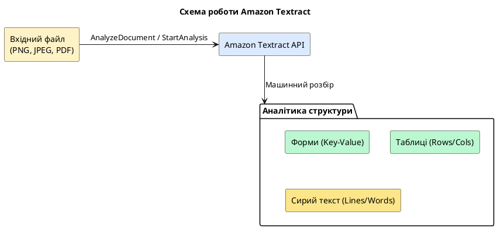

# Amazon Textract - Інтелектуальний аналіз документів

**Amazon Textract** виходить далеко за рамки класичних OCR-систем (Optical Character Recognition). Він використовує машинне навчання для автоматичного виявлення структури документів. Це дозволяє розпізнавати не просто набір літер, а формати:
- **Пари Ключ-Значення (Forms)**: автоматичне зчитування полів анкет чи форм (наприклад, "Ім'я: Іван").
- **Таблиці (Tables)**: розбір сіток даних із збереженням рядків, стовпців та об'єднаних комірок.
- **Підписи (Signatures)**: детекція наявності підпису або печатки у документі.
- **Запити (Queries)**: пошук конкретних відповідей за допомогою природних питань (наприклад: "Яка сума ПДВ у чеку?").

::plant-uml



::

---

## Реалізація парсингу документів на .NET 8

Для інтеграції потрібен NuGet-пакет:

```bash
dotnet add package AWSSDK.Textract
```

Синхронний метод `AnalyzeDocument` підходить для зображень (JPEG, PNG, TIFF) розміром до 10 сторінок. Для багатосторінкових PDF-файлів використовується асинхронний метод `StartDocumentAnalysis` (із опитуванням статусу роботи через SNS або Polling).

Нижче наведено повноцінний та готовий до безпосереднього використання сервіс `TextractService.cs`, який містить повний алгоритм збору розрізнених блоків Textract у зв'язну структуру форм та таблиць:

```csharp [Services/TextractService.cs]
using System;
using System.Collections.Generic;
using System.IO;
using System.Linq;
using System.Threading.Tasks;
using Amazon.Textract;
using Amazon.Textract.Model;

namespace AwsAiPlayground.Services;

public record TableCellDto(int RowIndex, int ColumnIndex, string Text);

public record TableDto(List<List<string>> Rows);

public record FormFieldDto(string Key, string Value);

public record DocumentAnalysisResultDto(
    string RawText,
    List<FormFieldDto> FormFields,
    List<TableDto> Tables);

public sealed class TextractService
{
    private readonly IAmazonTextract _textractClient;

    public TextractService(IAmazonTextract textractClient)
    {
        _textractClient = textractClient;
    }

    /// <summary>
    /// Виконує повний аналіз документа з S3 та збирає форми та таблиці.
    /// </summary>
    public async Task<DocumentAnalysisResultDto> AnalyzeDocumentAsync(string bucketName, string documentKey)
    {
        var request = new AnalyzeDocumentRequest
        {
            Document = new Document
            {
                S3Object = new S3Object { Bucket = bucketName, Name = documentKey }
            },
            FeatureTypes = new List<string> { "FORMS", "TABLES", "SIGNATURES" }
        };

        try
        {
            var response = await _textractClient.AnalyzeDocumentAsync(request);
            return ParseBlocks(response.Blocks);
        }
        catch (AmazonTextractException ex)
        {
            throw new Exception($"Amazon Textract service error: {ex.Message}", ex);
        }
    }

    private DocumentAnalysisResultDto ParseBlocks(List<Block> blocks)
    {
        // Створюємо словник для швидкого доступу за ID
        var blockMap = blocks.ToDictionary(b => b.Id);

        var rawTextList = new List<string>();
        var formFields = new List<FormFieldDto>();
        var tables = new List<TableDto>();

        // Окремо виділяємо блоки
        var keyBlocks = blocks.Where(b => b.BlockType == BlockType.KEY_VALUE_SET && b.EntityTypes.Contains("KEY"));
        var tableBlocks = blocks.Where(b => b.BlockType == BlockType.TABLE);
        var lineBlocks = blocks.Where(b => b.BlockType == BlockType.LINE);

        // 1. Збір сирого тексту
        foreach (var line in lineBlocks.OrderBy(l => l.Geometry.BoundingBox.Top))
        {
            rawTextList.Add(line.Text);
        }

        // 2. Збір Key-Value пар (Форми)
        foreach (var keyBlock in keyBlocks)
        {
            var keyText = GetText(keyBlock, blockMap);
            
            // Шукаємо зв'язок VALUE для даного KEY
            var valueBlockId = keyBlock.Relationships?
                .FirstOrDefault(r => r.Type == RelationshipType.VALUE)?
                .Ids.FirstOrDefault();

            if (valueBlockId != null && blockMap.TryGetValue(valueBlockId, out var valueBlock))
            {
                var valueText = GetText(valueBlock, blockMap);
                if (!string.IsNullOrWhiteSpace(keyText))
                {
                    formFields.Add(new FormFieldDto(keyText.TrimEnd(':').Trim(), valueText.Trim()));
                }
            }
        }

        // 3. Збір таблиць
        foreach (var tableBlock in tableBlocks)
        {
            var cellIds = tableBlock.Relationships?
                .FirstOrDefault(r => r.Type == RelationshipType.CHILD)?
                .Ids ?? new List<string>();

            var cells = new List<TableCellDto>();

            foreach (var cellId in cellIds)
            {
                if (blockMap.TryGetValue(cellId, out var cellBlock) && cellBlock.BlockType == BlockType.CELL)
                {
                    var text = GetText(cellBlock, blockMap);
                    cells.Add(new TableCellDto(cellBlock.RowIndex, cellBlock.ColumnIndex, text.Trim()));
                }
            }

            if (cells.Count == 0) continue;

            int maxRow = cells.Max(c => c.RowIndex);
            int maxCol = cells.Max(c => c.ColumnIndex);

            // Ініціалізуємо порожню матрицю таблиці
            var matrix = new List<List<string>>();
            for (int r = 0; r < maxRow; r++)
            {
                var rowList = new List<string>();
                for (int c = 0; c < maxCol; c++)
                {
                    rowList.Add(string.Empty);
                }
                matrix.Add(rowList);
            }

            // Заповнюємо матрицю даними комірок
            foreach (var cell in cells)
            {
                matrix[cell.RowIndex - 1][cell.ColumnIndex - 1] = cell.Text;
            }

            tables.Add(new TableDto(matrix));
        }

        return new DocumentAnalysisResultDto(
            RawText: string.Join(Environment.NewLine, rawTextList),
            FormFields: formFields,
            Tables: tables
        );
    }

    /// <summary>
    /// Рекурсивно збирає весь текст із дочірніх блоків типу WORD.
    /// </summary>
    private string GetText(Block block, Dictionary<string, Block> blockMap)
    {
        var text = "";
        
        var childIds = block.Relationships?
            .FirstOrDefault(r => r.Type == RelationshipType.CHILD)?
            .Ids ?? new List<string>();

        foreach (var id in childIds)
        {
            if (blockMap.TryGetValue(id, out var childBlock))
            {
                if (childBlock.BlockType == BlockType.WORD)
                {
                    text += childBlock.Text + " ";
                }
                else if (childBlock.BlockType == BlockType.SELECTION_ELEMENT)
                {
                    // Обробка чекбоксів та радіо-кнопок
                    if (childBlock.SelectionStatus == SelectionStatus.SELECTED)
                    {
                        text += "[X] ";
                    }
                }
            }
        }

        return text.Trim();
    }
}
```

---

## Інтеграція з React: Відображення структури документів

Створимо React компонент `DocumentProcessor.tsx`, який візуалізує розібрані форми та таблиці у зручному для користувача інтерфейсі.

### Повний React компонент DocumentProcessor

```tsx [src/components/DocumentProcessor.tsx]
import React, { useState } from 'react';

export interface FormField {
  key: string;
  value: string;
}

export interface Table {
  rows: string[][];
}

export interface DocumentAnalysisResult {
  rawText: string;
  formFields: FormField[];
  tables: Table[];
}

interface DocumentProcessorProps {
  data: DocumentAnalysisResult;
}

export function DocumentProcessor({ data }: DocumentProcessorProps) {
  const [activeTab, setActiveTab] = useState<'forms' | 'tables' | 'raw'>('forms');

  return (
    <div style={styles.container}>
      <div style={styles.tabHeader}>
        <button
          style={{ ...styles.tabBtn, ...(activeTab === 'forms' ? styles.activeTabBtn : {}) }}
          onClick={() => setActiveTab('forms')}
        >
          📄 Поля форми ({data.formFields.length})
        </button>
        <button
          style={{ ...styles.tabBtn, ...(activeTab === 'tables' ? styles.activeTabBtn : {}) }}
          onClick={() => setActiveTab('tables')}
        >
          📊 Таблиці ({data.tables.length})
        </button>
        <button
          style={{ ...styles.tabBtn, ...(activeTab === 'raw' ? styles.activeTabBtn : {}) }}
          onClick={() => setActiveTab('raw')}
        >
          📝 Сирий текст
        </button>
      </div>

      <div style={styles.tabContent}>
        {activeTab === 'forms' && (
          <div style={styles.grid}>
            {data.formFields.length === 0 ? (
              <p style={styles.placeholder}>Не виявлено жодних полів форм.</p>
            ) : (
              data.formFields.map((field, index) => (
                <div key={index} style={styles.formCard}>
                  <span style={styles.fieldKey}>{field.key}</span>
                  <span style={styles.fieldValue}>{field.value || <em style={styles.emptyVal}>порожньо</em>}</span>
                </div>
              ))
            )}
          </div>
        )}

        {activeTab === 'tables' && (
          <div style={styles.tablesWrapper}>
            {data.tables.length === 0 ? (
              <p style={styles.placeholder}>Не знайдено структурованих таблиць.</p>
            ) : (
              data.tables.map((table, tIndex) => (
                <div key={tIndex} style={styles.tableContainer}>
                  <h4 style={styles.tableTitle}>Таблиця #{tIndex + 1}</h4>
                  <table style={styles.htmlTable}>
                    <thead>
                      <tr>
                        {table.rows[0]?.map((cell, cIndex) => (
                          <th key={cIndex} style={styles.tableHeaderCell}>{cell}</th>
                        ))}
                      </tr>
                    </thead>
                    <tbody>
                      {table.rows.slice(1).map((row, rIndex) => (
                        <tr key={rIndex} style={rIndex % 2 === 0 ? styles.tableRowEven : styles.tableRowOdd}>
                          {row.map((cell, cIndex) => (
                            <td key={cIndex} style={styles.tableBodyCell}>{cell}</td>
                          ))}
                        </tr>
                      ))}
                    </tbody>
                  </table>
                </div>
              ))
            )}
          </div>
        )}

        {activeTab === 'raw' && (
          <pre style={styles.rawTextarea}>
            {data.rawText || 'Документ не містить розпізнаного тексту.'}
          </pre>
        )}
      </div>
    </div>
  );
}

const styles = {
  container: {
    background: '#1f2937',
    borderRadius: '12px',
    boxShadow: '0 4px 20px rgba(0, 0, 0, 0.3)',
    color: '#f3f4f6',
    fontFamily: 'Inter, system-ui, sans-serif',
    overflow: 'hidden',
    border: '1px solid rgba(255, 255, 255, 0.05)',
  },
  tabHeader: {
    display: 'flex',
    background: '#111827',
    borderBottom: '1px solid rgba(255, 255, 255, 0.05)',
  },
  tabBtn: {
    flex: 1,
    background: 'transparent',
    border: 'none',
    color: '#9ca3af',
    padding: '16px',
    cursor: 'pointer',
    fontSize: '1rem',
    fontWeight: 500,
    outline: 'none',
    transition: 'all 0.2s',
  },
  activeTabBtn: {
    color: '#60a5fa',
    borderBottom: '3px solid #3b82f6',
    background: 'rgba(59, 130, 246, 0.05)',
  },
  tabContent: {
    padding: '24px',
  },
  grid: {
    display: 'grid',
    gridTemplateColumns: 'repeat(auto-fill, minmax(280px, 1fr))',
    gap: '16px',
  },
  formCard: {
    display: 'flex',
    flexDirection: 'column' as const,
    background: '#111827',
    padding: '12px 16px',
    borderRadius: '8px',
    border: '1px solid rgba(255, 255, 255, 0.03)',
  },
  fieldKey: {
    fontSize: '0.85rem',
    color: '#9ca3af',
    marginBottom: '4px',
  },
  fieldValue: {
    fontSize: '1rem',
    fontWeight: 500,
    color: '#fff',
  },
  emptyVal: {
    color: '#ef4444',
  },
  tablesWrapper: {
    display: 'flex',
    flexDirection: 'column' as const,
    gap: '32px',
  },
  tableContainer: {
    background: '#111827',
    padding: '20px',
    borderRadius: '8px',
    overflowX: 'auto' as const,
  },
  tableTitle: {
    margin: '0 0 12px 0',
    color: '#60a5fa',
  },
  htmlTable: {
    width: '100%',
    borderCollapse: 'collapse' as const,
    fontSize: '0.95rem',
  },
  tableHeaderCell: {
    background: '#374151',
    color: '#fff',
    textAlign: 'left' as const,
    padding: '10px 12px',
    borderBottom: '2px solid rgba(255, 255, 255, 0.1)',
  },
  tableBodyCell: {
    padding: '10px 12px',
    borderBottom: '1px solid rgba(255, 255, 255, 0.05)',
  },
  tableRowOdd: {
    background: '#1f2937',
  },
  tableRowEven: {
    background: '#111827',
  },
  rawTextarea: {
    background: '#111827',
    padding: '16px',
    borderRadius: '8px',
    whiteSpace: 'pre-wrap' as const,
    fontFamily: 'monospace',
    lineHeight: '1.5',
    color: '#d1d5db',
    margin: 0,
    maxHeight: '500px',
    overflowY: 'auto' as const,
  },
  placeholder: {
    textAlign: 'center' as const,
    color: '#9ca3af',
  },
};
```
