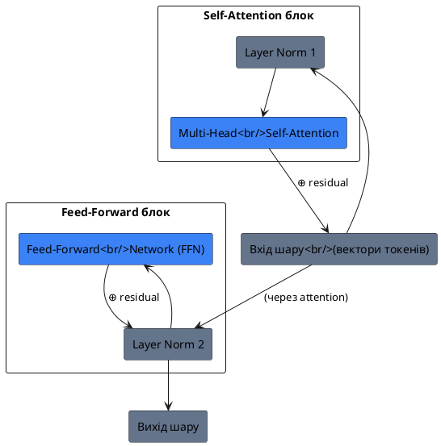
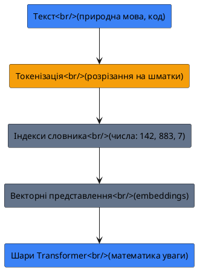
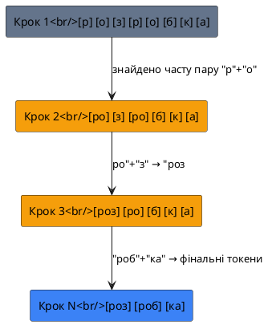
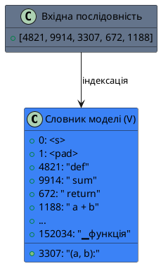
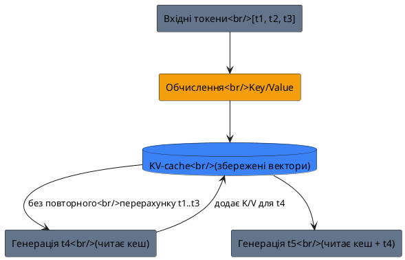
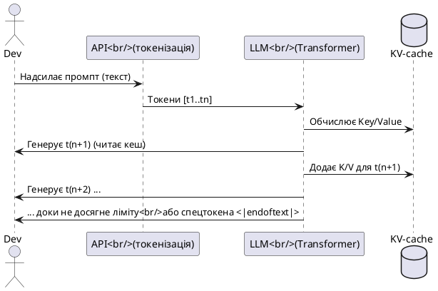
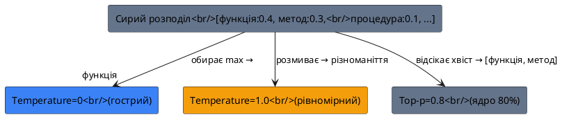

# Модуль 0.1. Що таке Large Language Model (LLM)

> **Статус розділу:** наповнюється частинами. Нижче — Частина 1 з 5.

## Вступ та контекст

### Чому розробнику варто розуміти природу LLM

Уявіть ситуацію, знайому кожному, хто працював із генеративним штучним інтелектом: ви формулюєте запит, модель повертає код, і цей код виглядає переконливо — аж доки ви не помічаєте, що він посилається на метод, якого не існує в обраній бібліотеці. Подібні випадки породжують ілюзію, ніби модель «розуміє» завдання так само, як людина. Насправді ж за зовнішньою осмисленістю відповідей криється цілком конкретний математичний механізм, і розуміння цього механізму — перший крок до того, щоб перестати бути пасивним споживачем «магії» й стати свідомим інженером, який керує інструментом.

Large Language Model (LLM, велика мовна модель) — це не розумна істота і не база знань у людському розумінні. Це **ймовірнісна модель послідовностей**, навчена на колосальних обсягах текстових і програмних даних передбачати найімовірніший наступний фрагмент на основі попереднього контексту. Для розробника принципово важливо сприймати LLM саме як _генератор токенів_, керований архітектурою, вагами та параметрами інференсу (виведення). Такий погляд знімає ореол таємничості й дозволяє свідомо проєктувати взаємодію з моделлю: формулювати промпти, обирати параметри генерації та передбачати помилки.

::note
**Ключовий висновок.** LLM не «знає» фактів і не «міркує» в людському сенсі. Вона відтворює статистично правдоподібні патерни, засвоєні під час навчання. Усе, що ми спостерігаємо як «розуміння», — це наслідок надзвичайно точного моделювання розподілу ймовірностей у мовному просторі.
::

У цьому розділі ми послідовно розглянемо п'ять фундаментальних аспектів: архітектуру Transformer, токенізацію, контекстне вікно, параметри генерації та відмінність між базовими та доопрацьованими моделями. Кожна частина будується на попередній — саме тому ми починаємо не з коду, а з архітектурних засад.

## Фундаментальні концепції: архітектура Transformer

### Проблема, яку вирішив Transformer

Щоб оцінити важливість сучасної архітектури, варто коротко згадати, що їй передувало. Довгий час послідовності (текст, код) оброблялися рекурентними нейронними мережами — RNN та їхніми вдосконаленими варіаціями LSTM і GRU. Їхня фундаментальна вада полягала в _послідовній_ природі: щоб обробити десятий токен речення, мережа мусила спочатку пропустити через себе дев'ять попередніх. Це створювало два наслідки. По-перше, паралельне навчання на великих корпусах даних було майже неможливим. По-друге, інформація про віддалені фрагменти тексту (наприклад, про підмет на початку довгого речення) поступово «розмивалася» в прихованому стані мережі, і модель втрачала довгострокові залежності.

Архітектура **Transformer**, представлена у 2017 році у праці Vaswani et al. «Attention Is All You Need» ([arXiv:1706.03762](https://arxiv.org/abs/1706.03762)), радикально змінила парадигму. Замість того щоб просуватися токен за токеном, вона дозволила кожному елементу послідовності _одночасно_ взаємодіяти з усіма іншими. Це відкрило шлях до тренування насправді великих моделей на справді великих даних.

### Суть механізму самоуваги (Self-Attention)

Центральна інновація Transformer — механізм **self-attention** (самоувага). Спрощено кажучи, коли модель обробляє певний токен, вона не покладається лише на локальний контекст, а «запитує» всі інші токени послідовності: _наскільки ти релевантний для розуміння мене?_ Результатом є набір ваг, що визначає, на які частини вхідного тексту цей токен має «звернути увагу».

Розглянемо речення: _«Функція повертає помилку, бо вона отримала некоректний аргумент»_. Людина миттєво розуміє, що займенник «вона» вказує на «функцію». Self-attention дозволяє моделі навчитися саме такому зв'язку між віддаленими словами — і робити це не для одного, а для багатьох типів відношень одночасно через механізм **Multi-Head Attention**, де кілька «голів» уваги паралельно шукають різні патерни: синтаксичні, семантичні, позиційні.

### Архітектурні блоки Transformer

Сучасний LLM будується з багатьох однотипних шарів (layers), накладених один на одного — подібно до того, як у багатоповерховій будівлі кожен поверх повторює одну й тіну саму структуру, але працює зі складнішим «сигналом», успадкованим від нижніх. Кожен такий шар містить чотири ключові компоненти, які послідовно перетворюють подання токенів.

- **Multi-Head Self-Attention** — паралельні «голови» уваги, що фіксують різні типи зв'язків між токенами. Якщо уявити речення як команду розробників, то одна голова стежить за тим, *хто кому* передає дані, інша — за тим, *який модуль* згадується, третя — за часовим порядком подій.
- **Positional Encoding (позиційне кодування)** — оскільки механізм уваги сам по собі «байдужий» до порядку слів, до вхідних векторів додаються сигнали, що кодують позицію токена в послідовності. Без цього речення «кіт ловить мишу» та «миша ловить кота» були б для моделі ідентичними наборами слів — адже увага бачить лише *набір* токенів, а не їхній порядок.
- **Feed-Forward Network (FFN)** — повнозв'язний шар, що застосовується до кожного токена незалежно після обчислення уваги й додає нелінійну виразність. Це своєрідна «індивідуальна обробка»: після того, як токен «порадився» з усіма іншими через увагу, він проходить через власний перетворювач.
- **Residual Connections та Layer Normalization** — техніки, що стабілізують навчання глибоких мереж і запобігають «зникненню» або «вибуху» градієнтів. Residual-зв'язок можна уявити як «запасний вихід»: якщо глибоке перетворення щось зіпсувало, оригінальний сигнал все одно дійде до виходу шару, доданий до зміненого.

::tip
**Аналогія з рецензуванням коду.** Уявіть, що кожен рядок вашого pull request проходить через комітет рецензентів. Один фокусується на стилі, інший — на безпеці, третій — на архітектурі. Кожен «дивиться» на увесь diff і виставляє свої зауваження (ваги уваги), після чого рядок оновлюється з урахуванням усіх поглядів водночас. Саме так працює один шар Transformer — тільки замість людей там математика, а замість коментарів — перетворені векторні представлення токенів.
::

Щоб закріпити структуру наочно, розглянемо спрощену схему одного шару decoder-only Transformer. Зверніть увагу на два «перекачування» сигналу (residual connections, позначені як ⊕): саме вони дозволяють інформації не губитися на глибині десятків чи сотень шарів.

::plant-uml



::

> **Що показує діаграма.** Кожен блок (увага та FFN) оточений нормалізацією, а результат блоку *додається* до його входу (⊕). Це і є residual connection — завдяки йому навіть 100-шарова модель залишається навчальною, бо градієнт помилки може «перетекти» назад, оминаючи складні перетворення.

### Чому сучасні LLM — це decoder-only

Існує три варіації архітектури Transformer: encoder-only (BERT), encoder-decoder (T5) та decoder-only. Сучасні генеративні LLM — GPT, Llama, Claude, Gemini, більшість open-source моделей — спираються на **decoder-only** варіант. Їхнє навчання зводиться до однієї задачі: передбачити наступний токен, спираючись лише на попередні (це називається masked self-attention — увага «з маскою», що забороняє моделі підглядати вперед).

Ця архітектурна деталь має для розробника два безпосередні наслідки. По-перше, генерація завжди **авторегресивна**: модель не видає весь текст разом, а продукує його послідовно, токен за токеном, причому кожен новий токен стає частиною контексту для наступного. По-друге, увага до ранніх токенів — системних інструкцій, промпту, наданого коду — зберігається впродовж усього генерування. Тому те, що ви напишете на початку контексту, непрямо впливає на _кожен_ наступний токен. Це фундаментальна властивість, до якої ми повернемося у розділах про контекстне вікно та prompt engineering.

::caution
**Наслідок для безпеки коду.** Оскільки модель генерує токени одни за одним, вона не «бачить» свій фінальний результат цілісно під час написання. Це одна з причин, чому LLM може створити синтаксично правильну, але логічно суперечливу функцію: на момент генерації п'ятого рядка вона вже «забула» про обмеження, закладені в першому. Звідси — вимога обов'язкового перегляду та тестування згенерованого коду.
::

---

## Фундаментальні концепції: токенізація

### Що таке токен — найменша одиниця мови для моделі

Перш ніж ми зануримося в алгоритми токенізації, необхідно чітко визначити центральне поняття цього розділу. **Токен (token)** — це атомарна одиниця, з якою оперує мовна модель. Модель не бачить літер, не бачить слів і не розуміє Unicode — вона оперує послідовністю цілих чисел, кожне з яких є індексом у її внутрішньому словнику (vocabulary). Токен — це один такий запис у словнику: це може бути окремий символ (`a`), частина слова (`ing`), ціле слово (`функція`) або навіть фрагмент коду (`.map(`).

::note
**Токен ≠ символ ≠ слово.** Це найпоширеніша помилка інтуїції. У природній мові одне слово часто розбивається на 2–4 токени, а в коді — навіть на дрібніші шматки. Саме кількість токенів (а не символів чи слів), а не їхній зміст, визначає вартість запиту й обмеження контексту.
::

Аналогія з перекладом: уявіть, що ви — перекладач, який розуміє лише набір ідеограм. Коли приходить текст «код», ви не тримаєте в голові літеру «к», потім «о», потім «д». Ви шукаєте у своєму словнику готовий блок — і знаходите ідеограму, що означає ціле поняття. Якщо такого готового блоку немає, ви розбиваєте слово на відомі морфеми. Так само модель: вона працює зі «словником смислових шматочків», а не з окремими літерами.

### Чому текст спочатку перетворюється на числа

Нейронна мережа — це математичний пристрій. Вона не вміє безпосередньо оперувати текстом; увесь її «розум» — це множення матриць та додавання векторів. Тому будь-який вхідний текст проходить обов'язковий етап **токенізації (tokenization)**: він розрізається на токени, а кожен токен замінюється його порядковим номером у словнику моделі. Далі ці номери перетворюються на вектори (embeddings), і лише тоді потрапляють у шари Transformer.

::plant-uml



::

> Ця послідовність — не технічна деталь, а фундамент цілої економіки LLM. Усе білінґування API (скільки ви платите за запит), обмеження контекстного вікна та навіть схильність моделі до помилок у рідкісних словах випливають саме з того, _як саме_ текст було розрізано на токени.

### Як саме текст розрізається: алгоритми BPE та SentencePiece

Тепер головне питання: за яким правилом слово «розробник» стає двома токенами, а «кіт» — одним? Відповідь залежить від **алгоритму токенізації**, закладеного на етапі навчання моделі. Найпоширеніші — це **BPE (Byte-Pair Encoding)** та **SentencePiece**.

**BPE** працює за принципом «від байтів до частих шматків». Спочатку кожен байт вважається окремим символом. Алгоритм багаторазово знаходить найчастішу пару сусідніх символів і зливає їх в один токен. Так поступово з окремих літер складаються часті морфеми й слова. Чим більший і різноманітніший корпус навчання, тим «розумнішим» стає словник.

**SentencePiece** (розроблений у Google) — це еволюція BPE, яка вирішує важливу проблему: він токенізує текст на рівні _символів Unicode_, а не байтів ОС, і не вимагає попереднього розбиття на слова пробілами. Завдяки цьому одна й та сама модель однаково добре працює з англійською, японською, кодом та українською. Пробіли в SentencePiece кодуються спеціальним префіксом (наприклад, `▁`), що робить межі слів явними для моделі.

Щоб краще зрозуміти, як BPE «вирощує» токени з окремих символів, розглянемо міні-приклад на слові `розробка`. Припустімо, на етапі навчання пара `р`+`о` зустрічалася часто, тому вона злилася; потім до неї приєдналася `з`, і так далі. Схема нижче ілюструє ці кроки злиття (реальні частоти інші, але принцип ідентичний):

::plant-uml



::

> **Інсайт.** Чим більший корпус навчання, тим довші шматки модель навчиться зливати. Тому для частотного слова `розробник` добре навчена модель може мати один токен, а для рідкісного терміна `квантований` — розбити на 4–5 дрібних. Це і є корінь «вартості» та «розуміння» моделі.

::accordion
::accordion-item{label="Чому це важливо для української мови?" icon="i-lucide-languages"}
Українська — морфологічно багата мова з великою кількістю відмінкових форм. Для моделей із вузьким словником (навчених переважно на англійській) українські слова часто розбиваються на дрібні шматки, а це означає _більше токенів на слово_ й дорожчі запити. SentencePiece та сучасні багатомовні моделі значно краще стискають український текст.
::
::accordion-item{label="Що таке 'compressibility' токенізації?" icon="i-lucide-compress"}
Чим менше токенів потрібно на один і той самий текст, тим ефективніша модель. Код (особливо англійські ідентифікатори) та англійська проза зазвичай «стискаються» краще, ніж аглютинативні мови. Це пояснює, чому один і той же промпт українською може коштувати на 20–40% більше токенів, ніж англійською.
::
::

### Наглядний приклад: скільки токенів у фразі

Щоб перетворити абстракцію на конкретику, розглянемо, як модель бачить простий рядок коду. Нижче — гіпотетична токенізація (реальні індекси залежать від конкретної моделі, але принцип зберігається):

::debugger-view{title="Токенізація рядка" :variables='[{"name": "вхідний_текст", "type": "string", "value": "\"def sum(a, b): return a + b\""}, {"name": "токен_1", "type": "token", "value": "\"def\" (4821)"}, {"name": "токен_2", "type": "token", "value": "\" sum\" (9914)"}, {"name": "токен_3", "type": "token", "value": "\"(a, b):\" (3307)"}, {"name": "токен_4", "type": "token", "value": "\" return\" (672)"}, {"name": "токен_5", "type": "token", "value": "\" a + b\" (1188)"}]'}

::

Зверніть увагу: модель не зберігає пробіли окремо — вони «прилипають» до наступного токена (` sum`, ` return`). Це наслідок SentencePiece-подібного підходу. Для розробника це має практичний наслідок: **форматування промпту впливає на токени**. Зайвий пробіл або перенос рядка — це додаткові токени, які «з'їдають» контекстне вікно.

::tip
**Порада з економії.** Якщо ви надсилаєте один і той самий довгий системний промпт тисячам запитів, кожен зайвий пробіл і перенос рядка множиться на обсяг трафіку. Тримайте системні інструкції компактними й використовуйте prompt caching (про який — у модулі 3), щоб не платити за повторне токенізування.
::

### Математична сутність: токен як індекс у словнику

Формально, якщо позначити словник моделі як :math-formula{tex="V" inline}, а токен як :math-formula{tex="t_i" inline}, то процес токенізації — це функція :math-formula{tex="f: \text{Text} \rightarrow (t_1, t_2, \dots, t_n)" inline}, де кожен :math-formula{tex="t_i \in \{0, 1, \dots, |V|-1\}" inline}. Саме ці цілі числа й подаються на вхід мережі. Розмір словника :math-formula{tex="|V|" inline} для сучасних моделей сягає 100 000–200 000 токенів.

::plant-uml



::

### BPE vs SentencePiece: коли що

Хоча обидва алгоритми переслідують одну мету, їхні філософії різняться. Нижче — порівняння у вигляді карток для швидкої орієнтації.

::card-group

::card{title="BPE (Byte-Pair Encoding)" icon="i-lucide-binary"}

- Розпочинає з окремих байтів/символів.
- Потребує попереднього поділу тексту на слова (пробілами).
- Стандарт для ранніх GPT та багатьох моделей.
- Чутливий до регістру та пробілів.
  ::

::card{title="SentencePiece" icon="i-lucide-globe"}

- Працює на рівні символів Unicode (без поділу на слова).
- Ідеальний для багатомовності та коду.
- Пробіл кодується як `▁` — явна межа слів.
- Використовується в Llama, Gemini, Mistral, T5.
  ::

::

::warning
**Пастка переносимості.** Токенізація прив'язана до _конкретної моделі_. Той самий текст дасть різну кількість токенів у Claude, GPT та локальній Llama — бо в них різні словники та алгоритми. Тому оцінка «вартості» промпту, зроблена для однієї моделі, не переноситься на іншу. Користуйтеся токенайзерами відповідного провайдера (наприклад, `tiktoken` для OpenAI).
::

### Експеримент: порахуйте токени самі

Сучасні провайдери надають інструменти для підрахунку токенів. Наприклад, OpenAI раніше рекомендував лічильник на базі `tiktoken`, а в новіших SDK підрахунок делегується серверному ендпоінту `input_tokens` (тобто токенізація відбувається на боці API, а не локально). Gemini дозволяє програмно запитати ліміти моделі:

::code-group

```python [Gemini: ліміти моделі]
model_info = client.models.get(model="gemini-3.5-flash")
print(f"Input token limit: {model_info.input_token_limit}")
print(f"Output token limit: {model_info.output_token_limit}")
```

```python [OpenAI: підрахунок токенів]
# У нових SDK токенізація — серверна (POST /responses/input_tokens)
# Локально для старих моделей використовувався tiktoken
import tiktoken
enc = tiktoken.get_encoding("cl100k_base")
tokens = enc.encode("def sum(a, b): return a + b")
print(len(tokens), tokens)
```

::

::caution
**Серверна токенізація OpenAI.** У актуальному Python-SDK `openai` більше немає локальної залежності `tiktoken` — підрахунок токенів виконується HTTP-запитом до API (`InputTokens.count`), що гарантує точну відповідність поточній версії моделі, але вимагає мережевого виклику. Для офлайн-оцінки доведеться використовувати окремі утиліти.
::

### Резюме розділу про токенізацію

Токенізація — це невидимий, але критичний міст між людським текстом і математикою моделі. Три її наслідки, які розробник зобов'язаний тримати в голові:

::steps

### Крок 1: Кількість токенів = вартість

Ви платите та обмежуєтесь не символами, а токенами. Довгий промпт українською може коштувати дорожче англійського.

### Крок 2: Токенізація специфічна для моделі

Не переносіть оцінки між провайдерами. Використовуйте їхні токенайзери.

### Крок 3: Форматування має значення

Зайві пробіли, переноси рядків та повторювані блоки «з'їдають» контекстне вікно. Пишіть компактно.

::

---

## Фундаментальні концепції: контекстне вікно та KV-cache

### Що таке контекстне вікно (context window)

Поняття **контекстне вікно (context window)** — це максимальна кількість токенів, яку модель здатна «тримати у фокусі» одночасно: сума вхідних токенів (ваш промпт, наданий код, історія чату) та токенів, що генеруються у відповідь. Якщо токен — це «атомарна одиниця», то контекстне вікно — це «оперативна пам'ять» моделі, її робочий стіл.

::note
**Важливе уточнення.** Контекстне вікно — це *спільний* ліміт на вхід і вихід. Якщо модель має вікно 128 000 токенів, і ви надіслали 100 000 токенів інструкцій, то на відповідь залишиться лише 28 000. Токени відповіді «відкушують» той самий бюджет.
::

Аналогія з робочим столом: уявіть, що ви — аналітик, який може тримати перед очима лише певну стопку паперів. Усе, що поза стопкою, ви не бачите й не враховуєте у висновках. Чим більша «стопка» (контекстне вікно), тим складнішу задачу ви можете розв'язати — прочитати весь великий репозиторій, проаналізувати довгий лог або підтримувати багатогодинну сесію чату. Моделі 2026 року мають вікна від 128K (GPT-клас) до 1M+ токенів (Gemini), що еквівалентно сотням сторінок тексту.

### Чому розмір вікна має вирішальне значення

Розмір контекстного вікна безпосередньо визначає, з якими задачами модель упорається взагалі. Ось три сценарії, що ілюструють межу:

::card-group

::card{title="Малий контекст (4K–8K)" icon="i-lucide-rectangle-vertical"}
- Разові перетворення коду.
- Короткі запитання без історії.
- Не придатний для цілих файлів чи репозиторіїв.
::

::card{title="Середній контекст (32K–128K)" icon="i-lucide-rectangle-horizontal"}
- Аналіз одного модуля або кількох файлів.
- Підтримка діалогу з пам'яттю.
- Типовий вибір для щоденної розробки.
::

::card{title="Великий контекст (200K–1M+)" icon="i-lucide-maximize"}
- Завантаження цілого репозиторію як контекст.
- Довгі агентні сесії (години роботи).
- RAG без попереднього відсікання (див. Модуль 12).
::

::

::tip
**Практичне правило.** Не намагайтеся «впхати» весь проєкт у контекст лише тому, що вікно велике. Обчислювальна вартість і затримка (latency) зростають квадратично відносно довжини контексту в механізмі уваги. Краще надати моделі *релевантний* фрагмент, ніж «шуміти» зайвим кодом.
::

### Механізм KV-cache: чому другий токен генерується швидше

Щоб зрозуміти продуктивність LLM, треба розглянути **KV-cache (Key-Value Cache, кеш ключів і значень)**. Пригадаймо: модель — decoder-only, вона генерує токени послідовно. Коли вона обробляє вхідний промпт, для кожного токена обчислюються вектори **Key** (що цей токен «пропонує» іншим) та **Value** (що він «несе» корисного). Ці вектори зберігаються в кеші.

Коли модель генерує *наступний* токен, їй не треба перераховувати увагу до всіх попередніх токенів заново — вона просто бере готові Key/Value з кешу й додає лише новий токен. Це радикально прискорює генерацію: перший токен (після промпту) найповільніший, бо вимагає обробки всього входу, а наступні — значно швидші.

::plant-uml



::

::caution
**Темна сторона KV-cache: «прогрів».** Оскільки кеш залежить від усього попереднього контексту, навіть маленька зміна на початку промпту (один символ) робить увесь кеш непридатним — моделі доведеться перерахувати все заново. Саме тому ідентичні префікси промптів між запитами (наприклад, статичні системні інструкції) вигідно *кешувати* на рівні API (prompt caching) — це економить і час, і гроші.
::

### Життєвий цикл одного запиту (sequence diagram)

Щоб поєднати токенізацію, контекстне вікно та KV-cache у єдиний процес, розглянемо послідовність взаємодії між розробником, API та моделлю:

::plant-uml



::

> **Ключовий висновок розділу.** Конекстне вікно — це не просто «скільки тексту влізе», а фундаментальна межа можливостей і продуктивності. KV-cache пояснює, чому генерація прискорюється, а prompt caching економить ресурси. Тримаючи це в голові, ви проєктуєте промпти так, щоб найважливіше стояло на початку (де увага найстійкіша), а повторювані блоки — кешувалися.

---

## Фундаментальні концепції: параметри генерації

### Чому модель не детермінована

Досі ми говорили про модель як про «передбачувача наступного токена». Але як саме вона *обирає* один токен з-поміж багатьох можливих? Після проходження всіх шарів модель видає **розподіл імовірностей** над усім словником: кожному токену призначається число від 0 до 1, що означає шанс стати наступним. Саме тут у гру вступають параметри генерації — вони визначають, *як* ми робимо вибір із цього розподілу.

::note
**Розподіл імовірностей.** Якщо на слово «функція» модель видає ймовірність 0.4, а на «процедура» — 0.1, це не означає, що обирається найбільший. Параметри sampling (вибірки) дозволяють моделі іноді обирати менш імовірні варіанти — саме це дає креативність і різноманітність відповідей.
::

### Temperature: міра «сміливості» моделі

**Temperature (температура)** — найвідоміший параметр. Він масштабує розподіл імовірностей *до* вибору:
- Значення близько **0** робить розподіл «гострим» — модель майже завжди обирає найімовірніший токен. Результат стабільний, передбачуваний, часом нудний. Ідеально для генерації коду, де важлива коректність.
- Значення **високе** (0.8–1.0+) «розмиває» розподіл, піднімаючи шанси рідкісних токенів. Результат креативний, різноманітний, але ризикований — модель може «з'їхати» у неправильний синтаксис.

::tip
**Емпіричне правило для розробника.** Для генерації production-коду тримайте temperature у діапазоні **0–0.2**. Для brainstorming ідей, називання змінних чи генерації тестових даних — **0.6–0.9**. Вище 1.0 — лише для експериментів, бо якість коду різко падає.
::

### Top-p та Top-k: фільтрація «кандидатів»

Два інші параметри обмежують *набір* токенів, з якого відбувається вибір:

- **Top-k** — залишає лише `k` найімовірніших токенів, відкидаючи решту. Наприклад, `top_k=40` означає, що модель не розглядатиме токени поза топ-40.
- **Top-p (nucleus sampling)** — розумніша варіація: залишає мінімальну кількість токенів, сума ймовірностей яких сягає `p`. Якщо `top_p=0.9`, модель бере стільки найкращих токенів, щоб їхня сумарна ймовірність дорівнювала 90%. Це адаптивно: коли модель «впевнена» (один токен — 0.9), вибір звужується до одного; коли невпевнена — розширюється.

::card-group

::card{title="Temperature" icon="i-lucide-flame"}
Масштабує впевненість.<br/>Низька = точність.<br/>Висока = креатив.
::

::card{title="Top-k" icon="i-lucide-hash"}
Жорстка межа кількості кандидатів (наприклад, 40).
::

::card{title="Top-p" icon="i-lucide-target"}
М'яка межа за сумою ймовірностей (наприклад, 0.9).
::

::

::warning
**Не плутайте їх.** Temperature та top-p працюють на різних етапах. Найчастіше достатньо налаштувати *або* temperature, *або* top-p (не обидва одночасово на екстремальних значеннях), інакше ефекти накладаються і поведінку важко передбачити. Більшість API за замовчуванням використовують top-p ≈ 0.9 і temperature ≈ 0.7.
::

### Візуалізація впливу параметрів

Наступна діаграма ілюструє, як той самий розподіл імовірностей трансформується різними параметрами перед фінальним вибором токена:

::plant-uml



::

### Max tokens та інші обмеження

Окрім «творчих» параметрів, існують технічні:
- **max_tokens (або max_output_tokens)** — ліміт довжини відповіді. Важливо не плутати з розміром контекстного вікна: це лише обмеження *генерації*.
- **stop sequences** — спеціальні маркери, за якими генерація припиняється (наприклад, `\n\n``` `, щоб модель не писала поза блоком коду).
- **frequency / presence penalty** — штрафи за повторення токенів, що запобігають «зацикленню» моделі на одному й тому ж слові.

::caution
**Пастка обриву.** Якщо `max_tokens` замалий, модель обірве код посеред функції — і ви отримаєте синтаксично незавершений фрагмент. Завжди закладайте запас під повну відповідь, особливо для великих файлів.
::

---

## Фундаментальні концепції: base model vs instruction-tuned / RLHF

### Еволюція: від «сирої» моделі до помічника

Завершуємо модуль порівнянням двох станів однієї й тієї самої архітектури. Після початкового навчання (на колосальних текстових корпусах) ми отримуємо **base model (базова модель)** — статистичний передбацувач, який дописує текст, але не «слухається» інструкцій. Якщо ви напишете базовій моделі «Переклади на англійську: Привіт», вона ймовірно продовжить «Привіт. Як справи? Переклади на французьку: ...» — бо вчилася передбачати *наступний фрагмент*, а не виконувати завдання.

Щоб перетворити базову модель на корисного помічника, застосовують два етапи доопрацювання:

::steps

### Крок 1: Supervised Fine-Tuning (SFT)
Модель дотреновують на парах «інструкція → бажана відповідь», навчаючи її *формату* виконання завдань. Після SFT модель розуміє, що після «Переклади...» треба дати переклад.

### Крок 2: RLHF / RLAIF (навчання з підкріпленням)
Модель генерує кілька варіантів, і «нагорода» (від людей — RLHF, або від іншої моделі — RLAIF) вчить її обирати відповіді корисні, безпечні та відповідні наміру. Саме тут формується «ввічливість» і здатність відмовляти у шкідливих запитах.

::

### Наглядове порівняння

Різниця між станами моделі найкраще видна у відповідь на один і той самий промпт:

::code-group

```text [Base model: "Напиши функцію sort"]
Напиши функцію sort
def sort(a):
    return a
Напиши функцію filter
def filter(a):
    return [x for x in a if x]
Напиши функцію map
...
```

```text [Instruction-tuned: "Напиши функцію sort"]
Ось реалізація сортування злиттям на Python:

def merge_sort(arr):
    if len(arr) <= 1:
        return arr
    mid = len(arr) // 2
    left = merge_sort(arr[:mid])
    right = merge_sort(arr[mid:])
    return merge(left, right)
```

::

::note
**Чому це критично для розробника.** Усі інструменти, з якими ви працюєте (Copilot, Claude Code, Cursor), використовують *instruction-tuned* моделі. Але інколи для специфічних задач (наприклад, передбачення наступного фрагмента коду в IDE) застосовують легкі **base-подібні** моделі, бо їм не потрібна «розмова» — лише швидке доповнення. Розуміння різниці допомагає не чекати від autocomplete «пояснень».
::

### Параметрична класифікація моделей

Підсумуймо типи моделей у вигляді карток для швидкої орієнтації:

::card-group

::card{title="Base Model" icon="i-lucide-box"}
- Чистий передбацувач наступного токена.
- Не виконує інструкцій.
- Використовується для подальшого fine-tuning або autocomplete.
::

::card{title="Instruction-Tuned (SFT)" icon="i-lucide-message-square"}
- Розуміє формат «запит → відповідь».
- Виконує прямі інструкції.
- Основа більшості чат-помічників.
::

::card{title="RLHF / Reasoning" icon="i-lucide-brain"}
- Навчена на «якісні» відповіді.
- Безпечна, аргументована, плануюча.
- Може мати вбудоване «міркування» (див. Модуль 0.3).
::

::

::caution
**Галюцинації не зникають.** Навіть найдосконаліша RLHF-модель лишається ймовірнісним генератором. Вона може впевнено стверджувати неправду, посилаючись на неіснуючі API. Доопрацювання покращує *корисність*, але не усуває статистичну природу — звідси вимога верифікації коду людиною.
::

---

## Практика та резюме модуля 0.1

### Ключові висновки

Ми пройшли шлях від загального розуміння LLM до конкретних механізмів. П'ять стовпів, які розробник зобов'язаний пам'ятати:

::steps

### Архітектура
Transformer (decoder-only) — основа. Авторегресивна генерація, увага зберігає зв'язок із початком контексту.

### Токенізація
Текст → числа через BPE/SentencePiece. Токен, а не символ, визначає вартість і ліміти.

### Контекстне вікно
Оперативна пам'ять моделі. KV-cache прискорює генерацію; prompt caching економить ресурси.

### Параметри генерації
Temperature / top-p / top-k керують креативністю vs точністю. Для коду — низькі значення.

### Base vs Tuned
Інструменти використовують instruction-tuned моделі. Галюцинації — наслідок природи, не вади навчання.

::

### Завдання для закріплення

::card-group

::card{title="Рівень 1: Базовий" icon="i-lucide-circle-1"}
1. Поясніть одним реченням, чим токен відрізняється від символу та слова.
2. Чому decoder-only архітектура робить генерацію авторегресивною? Запишіть відповідь власними словами.
::

::card{title="Рівень 2: Логіка" icon="i-lucide-circle-2"}
1. Порахуйте (через токенайзер провайдера) кількість токенів для рядка `async def fetch(url: str) -> Response:` англійською та його перекладу українською. Порівняйте.
2. Чому збільшення temperature до 1.5 для генерації SQL-запиту — погана ідея? Наведіть два аргументи.
::

::card{title="Рівень 3: Архітектура" icon="i-lucide-circle-3"}
1. Спроектуйте промпт для code-review так, щоб найважливіші правила стояли на початку (використайте знання про увагу та KV-cache). Обґрунтуйте розташування.
2. Опишіть, як ви використаєте prompt caching, якщо системний промпт із 2000 токенів надсилається у 10 000 запитів щодня.
::

::

> **Наступний крок.** У Модулі 0.2 ми розглянемо, *як саме* модель «думає» під час генерації коду: авторегресію, причини галюцинацій, механіку attention та вплив KV-cache на продуктивність на практиці.

> **Статус розділу:** ✅ Частини 1–5 завершено. Матеріал охоплює усі підтеми 0.1 з плану курсу.
