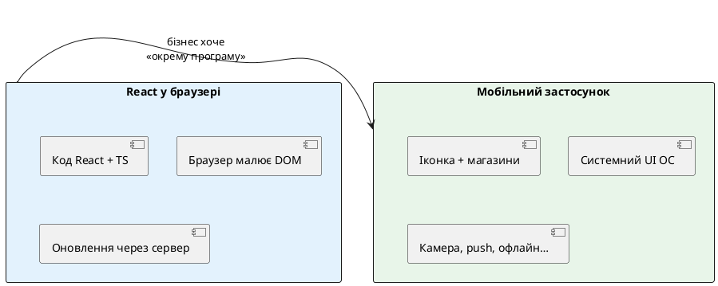
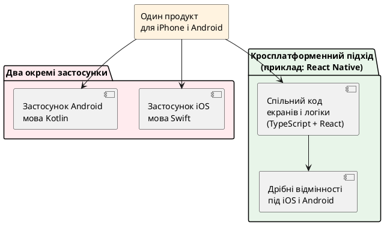
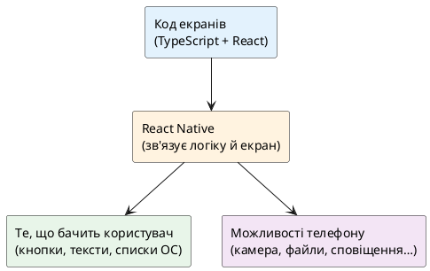
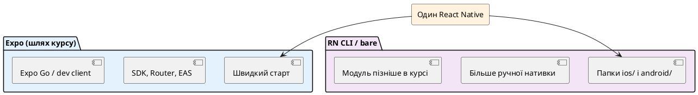
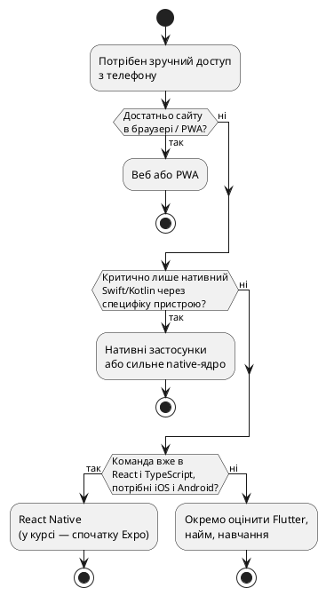

# React Native — навіщо він потрібен

## З чого почати

Цей курс розрахований на людей, які вже вміють писати інтерфейси на **React**, користуються **TypeScript** і знайомі з **Redux**. Мобільна розробка при цьому може бути новою.

Мета першої статті — не встановити інструменти і не написати перший екран. Мета — **зрозуміти задачу**: навіщо взагалі з’явився React Native, чим мобільний застосунок відрізняється від сайту, і в яких ситуаціях React Native є розумним вибором.

Складні внутрішні механізми (як саме JavaScript «розмовляє» з телефоном, як влаштована сучасна архітектура рушія, як влаштовані хмарні збірки) тут названі лише там, де без них не обійтися, і **простими словами**. Детальний розбір буде в наступних матеріалах курсу.

---

## Звична картина: React у браузері

{.diagram-img}

::plant-uml

::

У веброзробці типовий шлях виглядає так.

1. Пишеться застосунок на React.
2. Код збирається в набір файлів (HTML, JavaScript, CSS).
3. Файли викладаються на сервер.
4. Користувач відкриває **адресу в браузері** (Chrome, Safari, Firefox).
5. Браузер читає HTML, малює сторінку, виконує JavaScript.

У цій схемі є важлива деталь: **малює екран браузер**. React не малює пікселі сам — він описує, **що** має бути на сторінці, а браузер перетворює це на реальні елементи сторінки (так званий DOM — дерево об’єктів документа).

Оновлення продукту для користувача часто виглядає просто: розробник викладає нову версію на сервер, користувач оновлює сторінку або відкриває сайт знову.

Ця модель добре працює для кабінетів, інтернет-магазинів, адмінок, лендингів. Але бізнес і користувачі часто хочуть не «сайт, який зручно відкрити з телефону», а **окремий застосунок** — з іконкою на домашньому екрані, як у банківського клієнта чи месенджера.

---

## Чого часто очікують від «застосунку на телефоні»

Нижче — типові очікування. Не всі продукти потребують усього списку одразу, але саме такі вимоги зазвичай відрізняють **мобільний застосунок** від **адаптивного сайту**.

{.diagram-img}

### Іконка на домашньому екрані

Користувач встановлює програму один раз і відкриває її натисканням на іконку, а не через пошук у браузері чи закладку.

### Окремі магазини встановлення

На iPhone застосунки зазвичай ставлять з **App Store** (магазин Apple).  
На Android — з **Google Play** (магазин Google).

У розмовній мові обидва часто називають **магазинами додатків** (англійською — *app stores* або просто *stores*).

Магазин — це не просто «кнопка завантажити». Перед появою програми на вітрині її, як правило, **перевіряють** (цей етап називають *review* — рев’ю, перевірка). Після перевірки програма доступна користувачам. Кожна зібрана версія має **номери версії**, щоб було зрозуміло, що саме встановлено на пристрої.

Як саме готують файл для магазину, як проходить перевірка і які типові відмови бувають — **окремі теми пізніших статей**. Зараз достатньо запам’ятати: шлях «виклав на сервер → усі одразу бачать нове» для класичного мобільного застосунку **не такий самий**, як для сайту.

### Можливості телефону

Телефон — це не лише екран. У нього є:

- **камера** — фото й відео;
- **мікрофон**;
- **геолокація** — приблизне або точне місце на карті;
- **сховище файлів** — фото, документи;
- **сповіщення** — повідомлення поза відкритим екраном програми (на кшталт «прийшло нове повідомлення», навіть коли програма згорнута);
- **біометрія** — відбиток пальця, обличчя (залежно від пристрою).

Браузер дає частину цього, але з обмеженнями, різними на iOS і Android, і не завжди в тому вигляді, який очікує продукт. Нативний (встановлений) застосунок зазвичай працює з цими можливостями **ближче до того, як це задумано в операційній системі**.

Слово **нативний** (*native*) тут означає: «зроблений у спосіб, який операційна система вважає “своїм”» — з її елементами інтерфейсу, її правилами безпеки й її встановленням через магазин. Деталі відмінностей між «майже нативно» і «повністю нативною мовою ОС» з’являться далі в статті.

### Поведінка «як у звичних програм»

Користувачі звикли до:

- жесту «свайп назад» на Android;
- характерної анімації переходів між екранами;
- списків, які плавно гортаються навіть при великій кількості елементів;
- роботи частини функцій **без інтернету** (перегляд збереженого, чернетки, черга відправки).

Сайт у мобільному браузері часто відчувається інакше: інша навігація, інші обмеження фонової роботи, інший спосіб збереження даних.

---

## Чи можна обійтися сайтом і «додати на домашній екран»

Існує підхід **PWA** (*Progressive Web App* — прогресивний вебзастосунок). Спрощено: це сайт, який додатково налаштовують так, щоб його можна було «встановити» на телефон, кешувати частину даних і інколи надсилати сповіщення.

**Переваги PWA:**

- один код і звичний вебдеплой;
- не обов’язково проходити повний цикл магазинів Apple/Google для кожного оновлення контенту;
- добре підходить, коли продукт і так живе в браузері.

**Обмеження PWA (узагальнено):**

- доступ до можливостей телефону вужчий і залежить від браузера;
- на iPhone історично більше обмежень, ніж на багатьох Android-сценаріях;
- відчуття «справжньої програми» і глибина інтеграції з системою часто слабші;
- якщо продукт **має** бути в App Store / Google Play як повноцінний застосунок — одного PWA може не вистачити.

**Висновок для початку курсу:** PWA — нормальний і чесний варіант, коли задача близька до «зручний сайт на телефоні». Коли задача близька до «окрема програма з камерою, офлайном, сповіщеннями і вітриною в магазині» — розглядають **мобільну розробку** в сильнішому сенсі.

---

## Два телефони, дві «офіційні» мови

{.diagram-img}

::plant-uml

::

Операційна система iPhone — **iOS**. Офіційний шлях розробки від Apple спирається на мови **Swift** (раніше часто використовували Objective-C) і середовище **Xcode**.

Операційна система більшості інших смартфонів — **Android**. Офіційний шлях від Google спирається на **Kotlin** (раніше часто Java) і середовище **Android Studio**.

Якщо робити **два повністю окремі** застосунки:

- інтерфейс і багато логіки екранів пишуть **двічі**;
- виправлення помилки «на кнопці зберегти» часто треба повторити в двох місцях;
- команді потрібні люди (або час навчання) під обидві платформи.

Для бізнесу це означає більше часу й грошей. Звідси з’явилися **кросплатформені** підходи: один (або майже один) код для інтерфейсу, з якого збирають програму і під iOS, і під Android.

React Native — один із таких підходів.

На схемі вище видно ідею, а не деталі збірки. Важливо: «спільний код» **не означає**, що відмінностей між iPhone і Android не існує. Відмінності є (кнопка «назад», відступи під «чубчик» екрана, діалоги дозволів). Кросплатформа зменшує **подвійну** роботу над однаковими екранами, а не скасовує потребу думати про дві системи.

---

## Що таке React Native простими словами

**React Native** — це технологія, яка дозволяє описувати екрани мобільного застосунку у **звичному для React стилі** (компоненти, стан, пропси, хуки), а на телефоні отримувати **справжній встановлюваний застосунок** для iOS і Android.

Ключова відмінність від React у браузері:

| | React у браузері | React Native |
| - | ---------------- | ------------ |
| Де виконується для користувача | У браузері | У встановленій програмі на телефоні |
| Що малюється на екрані | Елементи вебсторінки (HTML) | Елементи інтерфейсу операційної системи (кнопки, тексти, списки «як у звичайних програмах») |
| Звичні HTML-теги (`div`, `span`, `p`) | Так | **Ні** — використовуються інші компоненти (їх буде введено в наступних статтях) |
| CSS-файли як у вебі | Так | Стилі задають інакше (окрема тема курсу) |
| Доставка оновлень | Зазвичай через сервер сайту | Зазвичай через магазини додатків; інколи можливі додаткові схеми оновлення коду — **пізніше в курсі** |

::note
**Головна думка.** React Native — це не «відкрити той самий сайт у вікні без адресного рядка». Це спосіб будувати **мобільну програму**, використовуючи **звички й ідеї React**, але в іншому середовищі, ніж браузер.
::

### Зв’язок із тим, що вже відомо

Знання React **дуже допомагають**, бо залишаються:

- розбиття інтерфейсу на компоненти;
- односпрямований потік даних;
- хуки й стан;
- TypeScript для опису даних;
- ідеї зі світу Redux (глобальний стан) — їх адаптують до мобільного застосунку пізніше.

Але **не переносяться один в один**:

- немає DOM і `document`;
- немає звичного CSS як у браузері;
- навігація між екранами влаштована ближче до мобільних програм, ніж до «простих посилань сайту» (окремі статті про навігацію);
- з’являються дозволи системи («дозволити доступ до камери?»), фонова робота, збірка під магазини.

Ці відмінності курс розкриватиме **по одній темі**, без вимоги зрозуміти все в перший день.

---

## Як React Native «з’єднує» JavaScript і телефон (дуже спрощено)

{.diagram-img}

::plant-uml

::

У голові корисно тримати просту модель. Деталі рушія, потоків і сучасної внутрішньої архітектури — **у наступній статті** та в пізніших матеріалах.

1. Розробник пише код екранів на **JavaScript** або **TypeScript** у стилі React.  
2. На телефоні працює програма, зібрана для iOS або Android.  
3. Коли треба показати текст, кнопку чи список, React Native просить **операційну систему** намалювати відповідний **системний** елемент інтерфейсу.  
4. Коли треба зняти фото чи прочитати збережені дані, код звертається до **модулів**, які вміють говорити з можливостями телефону.

Історично «розмова» між JavaScript і наявною частиною телефону була влаштована певним чином; з часом її покращували. Назви на кшталт «міст», «нова архітектура» тощо **не потрібні** на цьому кроці. Достатньо розуміти: **є шар JavaScript з React-логікою** і **є шар системного інтерфейсу та можливостей пристрою**, і React Native їх з’єднує.

---

## Два способи працювати з React Native: Expo і «класичний» проєкт

{.diagram-img}

::plant-uml

::

Навіть коли обрано React Native, залишається питання **як саме організувати проєкт і збірку**. У курсі зустрінуться два шляхи. Поки що — лише загальна картина.

### Expo

**Expo** — це набір інструментів і готових рішень **навколо** React Native. Мета — швидше почати: менше ручної настройки на старті, багато типових задач (камера, безпечне сховище налаштувань, сповіщення тощо) мають підготовлені модулі, зручніші сценарії збірки для магазинів.

Аналогія з вебом (неточна, але корисна): React — це бібліотека інтерфейсу, а «каркас із готовими домовленостями» (на кшталт Next.js) прискорює старт. Expo для багатьох команд відіграє роль такого **зручного каркаса** саме для мобільного React Native.

У цьому курсі **основний навчальний застосунок** будується через Expo — щоб раніше дістатися до екранів, навігації, камери, офлайну, а не застрягти на налаштуванні середовищ.

### React Native CLI (класичний, «голий» проєкт)

**React Native CLI** — шлях, де проєкт одразу (або дуже рано) містить окремі нативні частини:

- папку проєкту під **iOS** (її відкривають у Xcode);
- папку проєкту під **Android** (Gradle / Android Studio).

Цей шлях дає більше прямого контролю, але на старті важчий: потрібно більше розуміти інструменти Apple і Google.

У курсі він **обов’язково** з’явиться окремим модулем — після того, як буде зрозуміла мобільна розробка на рівні екранів і типових задач. Це потрібно, щоб не лишатися «людиною, яка вміє лише кнопку Start у зручній обгортці», і щоб читати чужі проєкти, де Expo немає.

::note
**Важливо.** Expo і React Native CLI — це **не два різні React Native**. Це різні способи **створювати, збирати й супроводжувати** проєкт на React Native. Докладне порівняння, встановлення і практика «голого» проєкту — у наступних матеріалах.
::

---

## Інші кросплатформені варіанти (коротко)

Щоб вибір React Native не виглядав єдиною релігією, варто знати сусідів. Глибоке порівняння з кожною технологією — не мета цієї статті; нижче — орієнтири.

### Повністю нативні застосунки (Swift + Kotlin)

Два окремі коди інтерфейсу (або спільна лише серверна частина). Максимально близький доступ до новинок iOS і Android. Дорожче в розробці однакових екранів. Має сенс, коли продукт **тримається** на унікальних можливостях системи або вже є сильні нативні команди.

### Flutter

Інший підхід: мова **Dart**, свій спосіб малювання інтерфейсу. Сильний у єдиному візуальному стилі. Для команди, яка вже глибоко в React і TypeScript, вартість входу **інша**, ніж у React Native: треба вчити нову мову й екосистему.

### PWA

Уже розглянуто вище: сайт із розширеними можливостями, без повноцінної заміни всіх сценаріїв магазинів і device-можливостей.

---

## Коли React Native зазвичай доречний

React Native добре лягає на продукти, де:

- багато **екранів, форм, списків, кабінету користувача**;
- є або планується **backend API** (сервер, який віддає дані у зручному вигляді, часто JSON);
- потрібні **iOS і Android** з близькою функціональністю;
- у команді вже сильний **React + TypeScript**;
- потрібні типові мобільні речі: вхід у акаунт, списки, фото, карта, офлайн у розумних межах, сповіщення — через готові модулі екосистеми.

## Коли React Native часто поганий єдиний вибір

- **Важкі ігри** з власним ігровим циклом і 3D — зазвичай інші рушії.  
- Продукт, де головна цінність — **дуже специфічна** робота з «залізом» і офіційні приклади лише на Swift/Kotlin (окремі промислові датчики, складний професійний звук, рідкісні SDK). Інколи тоді роблять нативне ядро, а не весь UI на React Native.  
- Немає потреби в окремому застосунку: достатньо **сайту або PWA**.  
- Команда свідомо не хоче підтримувати мобільні магазини, підписи, перевірки — тоді чесніше лишитися на вебі.

Ці правила — **евристики**, а не закони. Рішення завжди прив’язують до конкретного продукту й команди.

::plant-uml

::

---

## Що зміниться в щоденній роботі (попередній огляд)

Навіть до першого рядка коду корисно знати, **які теми** з’являться в курсі. Поки що — лише назви явищ простими словами; кожна матиме власну статтю.

1. **Екрани замість «сторінок сайту»** — переходи, вкладки, модальні вікна, системна кнопка «назад».  
2. **Списки** — довгі стрічки даних треба показувати ощадливо, інакше телефон «гальмує».  
3. **Стилі без класичного CSS** — інша система оформлення.  
4. **Дозволи** — користувач має погодитись на камеру, геолокацію, сповіщення.  
5. **Збереження даних на пристрої** — щоб частина функцій працювала без мережі.  
6. **Збірка й магазини** — підготовка програми до встановлення іншими людьми.  
7. **Дві платформи** — перевірка поведінки і на iPhone, і на Android.

Нічого з цього списку не потрібно «вміти» після прочитання першої статті. Список — **карта місцевості**.

---

## Навчальний застосунок курсу: Nomad

Щоб теорія не зависала в повітрі, курс зшивається навколо одного продукту.

**Nomad** (у інтерфейсі українською можна сприймати як «Мандрівник») — **щоденник подорожей**:

- створення **поїздок**;
- додавання **місць** і нотаток;
- **фото**;
- робота **без інтернету** з пізнішою синхронізацією, коли мережа з’явиться;
- **карта** місць;
- **нагадування** записати враження;
- відкриття поїздки за **посиланням** (коли до цього дійде розділ про посилання глибокого відкриття).

Код репозиторію з’явиться, коли курс дійде до налаштування середовища. На цьому кроці потрібне лише **розуміння продукту**.

### Короткі формулювання потреб користувача (чернетка)

1. Увійти в обліковий запис, щоб поїздки були свої.  
2. Бачити список поїздок.  
3. Створити поїздку з назвою та датами.  
4. Додати місце з назвою й нотаткою.  
5. Прикріпити фото до місця.  
6. Зберегти нотатку без інтернету й не втратити її.  
7. Побачити місця на карті.  
8. Отримати нагадування ввечері.  
9. Поділитися посиланням на поїздку.

Ці пункти ще неодноразово уточнюватимуться. Вони задають **навіщо** вивчаються списки, форми, навігація, камера, сховище тощо.

---

## Міні-проєкт: три короткі рішення «який підхід обрати»

### Завдання

Нижче — **три** короткі ситуації. Для кожної потрібно вибрати **один** основний підхід і **двома–чотирма реченнями** пояснити чому.

Можливі відповіді (оберіть одну на ситуацію):

- лише **веб / PWA**;  
- **React Native**;  
- **повністю нативні** застосунки (Swift + Kotlin);  
- **Flutter** (якщо є окремий аргумент; інакше можна не обирати).

Оформити можна в будь-якому редакторі звичайним текстом. Окремий складний шаблон не потрібен.

### Ситуація 1

Внутрішня сторінка компанії: подати заявку на відпустку, подивитися статус. Користувачі майже завжди за ноутбуком. Вхід уже є через корпоративний сайт. Камера й офлайн не потрібні. Публікувати програму в App Store не планують.

**Питання:** який підхід найрозумніший і чому?

### Ситуація 2

Публічний продукт «щоденник подорожей» для iPhone і Android: поїздки, фото, нотатки без мережі, пізніше карта й нагадування. Команда добре вміє React і TypeScript, майже не вміє Swift/Kotlin. Потрібні магазини додатків.

**Питання:** який підхід найрозумніший і чому?

### Ситуація 3

Програма для запису професійного звуку годинами у фоні, з рідкісною Bluetooth-гарнітурою, для якої виробник дав приклади **тільки** на Swift і Kotlin. Екранів мало; головне — стабільний запис.

**Питання:** який підхід найрозумніший і чому?

::collapsible{title="Орієнтир для самоперевірки (відкрийте після власної відповіді)"}

Після власної відповіді можна звірити напрям думки:

1. Часто достатньо **вебу / PWA** — немає сенсу тягнути мобільний стек.  
2. Добре лягає на **React Native** (і на логіку курсу з Nomad).  
3. Часто тяжіє до **нативного** ядра або повністю нативних застосунків через специфіку пристрою й приклади виробника.

Якщо відповідь інша — це нормально, **якщо** в тексті є аргумент від вимог, а не від «мені так звично писати JSX».

::

---

## Підсумок

1. Сайт у браузері і встановлений мобільний застосунок — **різні способи доставити продукт** користувачу.  
2. Магазини додатків, можливості телефону й очікування «як у звичних програм» часто штовхають до мобільної розробки сильнішої, ніж адаптивний сайт.  
3. **React Native** дозволяє будувати такі програми, описуючи інтерфейс у стилі React, спільно для iOS і Android.  
4. Це **не** «той самий React у браузері» і **не** скасування відмінностей iPhone/Android.  
5. **Expo** і **класичний CLI-проєкт** — різні способи вести React Native; курс починає з Expo і пізніше додає CLI.  
6. Навчальний продукт курсу — **Nomad**, щоденник подорожей.  
7. Технічні деталі рушія, збірки й магазинів будуть **розжовані в наступних статтях**, коли для них з’явиться ґрунт.

Наступна стаття пояснить **простіше й глибше**, як влаштоване середовище виконання React Native: що відбувається між кодом на TypeScript і тим, що видно на екрані телефону.

---

## Практичні завдання

### Базовий рівень

1. Пояснити **своїми словами** (без списку англійських абревіатур), чим React у браузері відрізняється від React Native.  
2. Назвати **три** причини, чому бізнесу інколи мало адаптивного сайту.  
3. Записати **п’ять** потреб користувача для Nomad з пам’яті, потім звірити з текстом статті.

### Середній рівень

1. Виконати міні-проєкт: відповіді на всі **три** ситуації з коротким обґрунтуванням.  
2. Для ситуації 2 перелічити **які можливості телефону** знадобляться продукту (хоча б чотири пункти) і навіщо кожна.  
3. Написати абзац: «Чому курс починає з Expo, а не з класичного CLI» — спираючись лише на цю статтю.

### Професійний рівень

1. Взяти реальний або вигаданий продукт з власного досвіду й обґрунтувати вибір між PWA, React Native і нативним підходом (одна сторінка тексту).  
2. Скласти список із **восьми питань**, які варто поставити замовнику перед вибором «сайт чи мобільний застосунок».  
3. Коротко описати, **які ризики** з’являться, якщо обрати React Native там, де достатньо PWA (і навпаки).

---

## Часті запитання

::accordion

::accordion-item{label="Чи потрібно вже зараз встановлювати Android Studio або Xcode?" icon="i-lucide-circle-help"}
Ні. Спочатку достатньо зрозуміти задачу. Встановлення середовища — в статті про налаштування Expo. Частина роботи пізніше можлива через хмарну збірку; це теж пояснюватиметься окремо.
::

::accordion-item{label="Чи обов'язково мати iPhone, щоб вчитися?" icon="i-lucide-circle-help"}
Ні. Для навчання використовують **симулятори** (програмні «якби телефони» на комп’ютері) і/або фізичний Android. Особливості збірки саме під публікацію в App Store залежать від правил Apple і розглядатимуться в розділах про збірку.
::

::accordion-item{label="Чи зникне потреба знати веб-React?" icon="i-lucide-circle-help"}
Ні. Навпаки: компоненти, стан, ефекти, типізація, багато ідей архітектури UI лишаються. Змінюється **середовище** і набір компонентів.
::

::accordion-item{label="Чому не почати одразу з Flutter, якщо він теж кросплатформений?" icon="i-lucide-circle-help"}
Можна було б, якби курс був про Flutter. Тут опора — уже наявні знання **React і TypeScript**. React Native використовує цей фундамент найпряміше.
::

::
