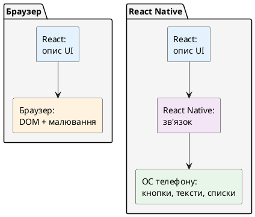
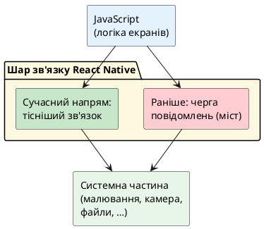
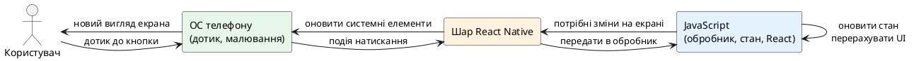
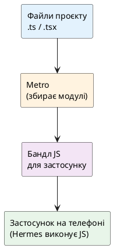

# Як влаштований React Native «під капотом»

## Навіщо ця стаття

У попередньому матеріалі йшлося про **задачу**: навіщо існує React Native і чим мобільний застосунок відрізняється від сайту. Тут — наступний крок: **як загалом влаштоване середовище**, у якому цей код живе.

Мета не в тому, щоб запам’ятати десяток внутрішніх назв з документації. Мета — отримати **робочу картину в голові**:

- хто виконує JavaScript;
- хто малює кнопки й тексти на екрані;
- як натискання пальцем доходить до обробника в коді;
- що робить програма-збирач під час розробки;
- чому інколи кажуть про «старий» і «новий» способи зв’язку між JavaScript і системою телефону.

Усе складне спочатку пояснюється **звичайними словами**. Технічні назви з’являються **після** інтуїції. Глибокі деталі сучасної внутрішньої перебудови React Native (окремі шари з довгими англійськими іменами) у цій статті лише окреслені; повний розбір буде в пізнішому матеріалі курсу.

::note
**Головна думка статті.** У браузері React описує інтерфейс, а **малює** його браузер. У React Native React знову описує інтерфейс, але **малює** його вже **операційна система телефону** (її готові елементи: текст, кнопка, список). Між описом і малюванням стоїть шар React Native — його й розбираємо.
::

---

## Спочатку згадаємо браузер

У вебі ланцюжок знайомий.

::steps

### Розробник пише React-компоненти

У коді з’являються елементи на кшталт «заголовок», «кнопка», «форма». Це опис **бажаного** вигляду сторінки.

### Збирач (наприклад, Vite або webpack) готує файли для браузера

Код модулів збирається в набір файлів, які зручно віддати сервером.

### Браузер завантажує сторінку

Він будує **DOM** — внутрішнє дерево об’єктів документа (абзаци, кнопки, поля вводу).

### Користувач бачить пікселі

Браузер сам вирішує, як намалювати DOM на екрані. React не малює пікселі «вручну» — він каже браузеру, **яким** має бути дерево, і браузер оновлює його.

::

Важливий висновок: **React і середовище малювання — різні ролі**. React відповідає за логіку «що показати при якому стані». Середовище (браузер) відповідає за «як це виглядає на екрані насправді».

---

## Та сама ідея в React Native

У React Native ролі подібні, але **середовище інше**.

::steps

### Розробник знову пише React-компоненти

Логіка стану, пропсів, хуків — знайома. Натомість замість веб-тегів з’являються **мобільні** компоненти (про них — у наступних статтях про інтерфейс). На цьому етапі достатньо уявити: «екран зі списком поїздок і кнопкою “Додати”».

### Окремий збирач готує JavaScript-код для телефону

У світі React Native найчастіше йдеться про **Metro** — програму, яка під час розробки збирає модулі TypeScript/JavaScript у вигляд, зручний для запуску в застосунку. Детальніше про Metro — окремий розділ нижче.

### На телефоні працює вже не браузер, а зібраний застосунок

Усередині нього є місце, де виконується JavaScript, і місце, де операційна система малює **свої** елементи інтерфейсу.

### Користувач бачить звичні «телефонні» кнопки й тексти

Не HTML-сторінку в рамці (у звичайному сценарії React Native), а елементи, які iOS і Android уміють малювати самі.

::

::tip
**Аналогія.** Режисер (React) каже: «У цій сцені має бути стіл і два стільці». У театрі (браузер) декорації ставлять театральні робітники. На кіномайданчику (мобільна ОС) — інші робітники й інший реквізит. Сценарій схожий, **майданчик** — інший.
::

::plant-uml

::

---

## Дві «служби» всередині застосунку: логіка й малювання

{.diagram-img}

Щоб розуміти, чому інколи інтерфейс «гальмує», а логіка — ні (або навпаки), зручно уявити **дві служби**, які працюють поруч.

::card-group

::card{title="Служба логіки" icon="i-lucide-cpu"}
Тут виконується JavaScript: підрахунок стану, запити до сервера, обробники натискань, Redux, умови «що показати». Якщо ця служба зайнята важкою роботою (великий цикл, важка обробка даних), вона може **запізнюватися** з відповідями на дії користувача.
::

::card{title="Служба малювання" icon="i-lucide-smartphone"}
Тут операційна система малює кадри на екрані, обробляє жести на рівні системи, анімації системних переходів. Якщо малювання не встигає, користувач бачить «ривки» при гортанні.
::

::

У розмовній інженерній мові ці служби часто називають **потоками** (*threads* — «нитки» виконання всередині програми). Для курсу на старті достатньо формулювань:

- **потік JavaScript** (або «потік логіки») — місце, де крутиться JS-код;
- **потік інтерфейсу** (або «UI-потік») — місце, тісно пов’язане з малюванням екрана операційною системою.

::warning
**Типова плутанина.** «UI» у вебі часто означає «компоненти React». Тут **UI-потік** — це радше **системне** малювання на телефоні, а не «будь-який React-код». React-код переважно живе в потоці JavaScript, а результат його рішень потрапляє на екран через шар зв’язку.
::

Чому це важливо вже зараз, ще до написання складного коду:

- довга синхронна робота в обробнику натискання може «підвісити» відчуття відгуку;
- важкі списки й зображення навантажують і логіку, і малювання — цим займуться окремі статті про списки й продуктивність;
- анімації, які мають бути дуже плавними, інколи свідомо переносять ближче до малювання (окрема тема жестів і анімацій).

Повну модель з усіма допоміжними потоками й сучасними змінами **не потрібно** тримати в голові після цієї статті. Достатньо: **логіка й малювання — різні обов’язки, і між ними є зв’язок**.

---

## Зв’язок між JavaScript і «телефонною» частиною

JavaScript у React Native **не є** мовою, якою операційна система напряму малює кожну кнопку «з нуля» у стилі HTML. Потрібен **посередник**: домовитися, що «компонент тексту в React» відповідає «системному тексту на iOS/Android», що натискання треба передати в JS-обробник, що зміна стану має оновити підписи на екрані.

### Старіший спосіб: черга повідомлень

Довгий час у React Native переважала модель, яку зручно уявити як **чергу листів** між двома кабінетами.

1. Кабінет JavaScript пише: «покажи текст “Зберегти”».  
2. Лист кладуть у чергу.  
3. Кабінет нативної (системної) частини читає лист і малює системний елемент.  
4. Користувач натискає.  
5. Нативна частина кладе у зворотну чергу лист: «було натискання».  
6. JavaScript читає лист і викликає функцію-обробник.

Такий асинхронний обмін (не все відбувається в одному миттєвому «дзвінку») історично називали **мостом** (*bridge* — міст між світами).

::tip
**Аналогія.** Два відділи в одній будівлі спілкуються через лоток для службових записок. Це працює, але якщо записок дуже багато (складні жести, часті оновлення), лоток стає вузьким місцем.
::

### Новіший напрям: тісніший зв’язок

З часом екосистема пішла до моделі, де JavaScript і нативна частина можуть спілкуватися **без такої товстої черги листів** — швидше й передбачуваніше для складних жестів і оновлень інтерфейсу. У документації це часто збирають під загальною назвою **нова архітектура** (*New Architecture*).

Усередині цієї «нової архітектури» є кілька частин з окремими іменами (новий спосіб малювати дерево інтерфейсу, новий спосіб підключати модулі телефону тощо). **На цьому етапі курсу їхні абревіатури запам’ятовувати не обов’язково.** Достатньо знати:

::field-group

::field{name="Навіщо це з’явилось" type="мотивація"}
Щоб зменшити затримки й обмеження старої «черги листів» між JavaScript і системною частиною, особливо на складних екранах.
::

::field{name="Що це означає для початківця" type="практика"}
Більшість навчальних і типових продуктових задач **не вимагає** вручну «вмикати нову архітектуру» в перший день. Сучасні шаблони Expo / React Native уже рухаються в цей бік. Розуміти ідею корисно; крутити низькорівневі прапорці — пізніше.
::

::field{name="Де буде глибше" type="курс"}
Окрема пізніша стаття курсу розбере нову архітектуру докладніше: які частини за що відповідають, як перевірити, що ввімкнено, які бібліотеки можуть конфліктувати.
::

::

::plant-uml

::

---

## Що відбувається після натискання кнопки

{.diagram-img}

Розглянемо життєвий сценарій. На екрані є кнопка «Додати поїздку». Користувач торкається її. У коді (ще схематично) передбачено обробник на кшталт «викликати функцію при натисканні».

Нижче — **спрощена** послідовність. Реальний рушій має більше кроків і оптимізацій; для навчання важливий порядок думок.

::steps

### Палець торкається екрана

Операційна система фіксує дотик у координатах екрана й визначає, який системний елемент його «спіймав» (наша кнопка).

### Системна частина повідомляє шар React Native

Подія «натиснуто» має дійти до світу JavaScript, де описана реакція застосунку.

### Виконується JavaScript-обробник

Наприклад: змінити стан, додати елемент у список у пам’яті, підготувати перехід на інший екран, почати запит до сервера.

### React рахує, що змінилось у дереві інтерфейсу

Як і у вебі, React порівнює «як було» і «як стало» (ідея узгодження / *reconciliation* — знайома з React).

### Шар React Native просить систему оновити екран

Системні тексти, списки, кнопки отримують нові підписи, з’являються нові рядки списку тощо.

### Користувач бачить результат

Наприклад, відкрився екран форми або в списку з’явилась нова поїздка.

::

::plant-uml

::

::tip
**Навіщо це міні-проєкту статті.** Якщо вміти **словами** пройти цей ланцюжок, легше шукати причину проблем: «не спрацьовує обробник» (логіка) і «гальмує гортання» (малювання / важкий список) — різні класи причин.
::

---

## Хто виконує JavaScript: рушій

JavaScript потрібен **рушій** (*engine*) — програма всередині застосунку, яка розуміє мову JS і виконує її.

У браузері рушії свої (наприклад, у Chrome — один відомий рушій, у Safari — інший). У React Native на мобільних пристроях сьогодні зазвичай використовують **Hermes** — рушій, орієнтований саме на мобільні сценарії.

::field-group

::field{name="Hermes" type="рушій JS"}
Спеціалізований рушій JavaScript для мобільних застосунків React Native. Його налаштовують так, щоб швидше запускати застосунок і ощадливіше витрачати ресурси телефону порівняно з «універсальними» варіантами минулих років.
::

::field{name="Що це дає розробнику на старті" type="практика"}
У сучасних шаблонах Hermes часто вже увімкнений. Окремо «встановлювати Hermes руками» на перших кроках курсу зазвичай не потрібно. Важливо знати слово й роль: **це той, хто виконує ваш JS/TS-код на телефоні**.
::

::field{name="Байткод (дуже спрощено)" type="ідея"}
Інколи код готують до вигляду, зручнішого для швидкого старту на пристрої (не як «читабельний файл .ts», а як підготовлений для рушія формат). Деталі збірки release-версії — у статтях про збірку й публікацію.
::

::

Порівняння з вебом:

| | Браузер | React Native (типово) |
| - | ------- | --------------------- |
| Хто виконує JS | Рушій браузера | Рушій усередині застосунку (часто Hermes) |
| Хто малює UI | Браузер (DOM) | ОС через шар React Native |
| Чи відкриває користувач URL | Так | Ні, відкриває **встановлену програму** |

---

## Хто збирає код під час розробки: Metro

{.diagram-img}

Поки пишуть код, потрібен інструмент, який:

- знаходить імпорти (`import … from '…'`);
- перетворює TypeScript на вигляд, зрозумілий рушію;
- швидко віддає оновлення після збереження файлу.

У React Native цю роль зазвичай виконує **Metro**.

::field-group

::field{name="Metro" type="збирач (bundler)"}
Інструмент збірки JavaScript/TypeScript для React Native. Під час розробки він стежить за файлами проєкту й готує **набір коду** (бандл), який підхоплює застосунок на телефоні або в симуляторі.
::

::field{name="Швидке оновлення на екрані" type="DX"}
Після зміни коду екран часто оновлюється без повного перезапуску програми. У документації це пов’язано з механізмами на кшталт Fast Refresh. Точні команди запуску — у статті про налаштування середовища.
::

::field{name="Аналогія з вебом" type="місток"}
Схоже на Vite або webpack у вебі за **роллю** («зібрати модулі для середовища»), але Metro заточений під мобільний цикл React Native, а не під віддачу HTML-сторінки.
::

::

::warning
**Не плутати Metro з Expo.** Expo — ширший набір інструментів і модулів навколо React Native (про нього вже йшлося і ще буде окрема стаття). Metro — **конкретно збирач JS**. Expo **використовує** Metro, а не замінює ідею збірки модулів.
::

::plant-uml

::

---

## Два режими: розробка і «як у користувача»

{.diagram-img}

Під час навчання легко змішати два світи.

::tabs

::tabs-item{label="Режим розробки" icon="i-lucide-hammer"}
- Застосунок часто з’єднаний з комп’ютером розробника.
- Metro віддає свіжий код.
- Зручні повідомлення про помилки, інструменти відлагодження.
- Швидкість старту й мережа в офісі можуть **не** збігатися з реальним телефоном у метро.
::

::tabs-item{label="Режим для користувача" icon="i-lucide-package"}
- Код упакований у встановлюваний застосунок.
- Немає «підключення до вашого ноутбука».
- Важливі розмір, час запуску, поведінка без кабелю.
- Доставка оновлень пов’язана з магазинами додатків (і інколи з окремими схемами оновлення JS — пізніше в курсі).
::

::

::note
Поки курс не дійшов до збірки для магазинів, більшість експериментів відбувається в **режимі розробки**. Пам’ять про різницю режимів знадобиться, коли щось «у мене працює, у тестувальника — ні».
::

---

## Модулі можливостей телефону

Окремий шар — **доступ до камери, файлів, сповіщень, геолокації**. У JavaScript ці речі не з’являються «самі»; їх надають **модулі**, які з одного боку мають JS-API для розробника, з іншого — вміють викликати системні функції iOS/Android.

::card-group

::card{title="Готові модулі екосистеми" icon="i-lucide-boxes"}
Камера, безпечне сховище, сповіщення тощо часто підключають як бібліотеки (у курсі багато з них прийде через Expo). Розробник викликає зрозумілі функції з TypeScript.
::

::card{title="Власні модулі" icon="i-lucide-wrench"}
Якщо готового рішення немає, пишуть зв’язку з кодом на мовах платформи (Swift/Kotlin). Це пізніша, окрема тема курсу.
::

::

На рівні архітектури зараз важливо лише: **екран (UI)** і **можливості пристрою** — сусідні, але різні двері з боку JavaScript. Обидві двері проходять через шар React Native / модулів, а не через DOM браузера.

---

## Зв’язок із веб-React: що переноситься, а що ні

::tabs

::tabs-item{label="Переноситься" icon="i-lucide-check"}
- Компонентне мислення, пропси, стан, хуки.
- Ідея «UI — функція від стану».
- Узгодження дерева при зміні стану.
- Багато підходів до організації коду й глобального стану (Redux тощо) — з адаптацією.
- TypeScript як спосіб описати дані й пропси.
::

::tabs-item{label="Не переноситься як є" icon="i-lucide-x"}
- DOM-API (`document`, `window` у веброзумінні).
- HTML-теги й CSS-файли браузера.
- Припущення, що «оновив сервер — усі одразу на новій версії» так само, як сайт.
- Деякі бібліотеки, які жорстко зав’язані на браузер.
::

::

::caution
Спроба «підключити бібліотеку з вебу, бо вона звична» без перевірки, чи вміє вона працювати без DOM, — часта причина дивних помилок на старті. У курсі для кожної задачі будуть рекомендовані **мобільні** підходи.
::

---

## Міні-проєкт: трасування натискання кнопки

### Завдання

Код писати **не обов’язково**. Потрібен короткий текст (половина–одна сторінка), у якому простежується шлях події.

**Сценарій.** У майбутньому застосунку Nomad на екрані списку поїздок є кнопка «Нова поїздка». Користувач натискає її. У результаті відкривається екран форми створення поїздки (поки що можна уявити це як «змінився поточний екран» без деталей бібліотеки навігації).

### Що має бути в тексті

::steps

### Крок 1. Старт від пальця

Опишіть, хто **першим** дізнається про дотик — користувацький код React чи операційна система?

### Крок 2. Шлях до JavaScript

Опишіть, як подія потрапляє у світ, де живуть обробники на TypeScript (своїми словами, без обов’язкових абревіатур).

### Крок 3. Логіка застосунку

Що робить код після натискання в цьому сценарії (зміна стану / намір показати інший екран)?

### Крок 4. Оновлення екрана

Хто в підсумку **малює** новий вигляд — браузер чи системний інтерфейс телефону через React Native?

### Крок 5. Дві служби

Одним абзацом: що в цьому ланцюжку ближче до **служби логіки**, а що — до **служби малювання**.

::

### Критерій «готово»

Текст може зрозуміти колега, який читав лише попередню статтю курсу. Якщо з’являється термін на кшталт «міст» або «Metro» — поруч є пояснення одним реченням.

::collapsible{title="Орієнтир відповіді (не для списування — відкрийте після власної спроби)"}

1. Першою реагує **ОС**.  
2. Подія передається через **шар React Native** у **JavaScript**.  
3. Обробник оновлює **стан / навігаційний стан** (логіка).  
4. React перераховує дерево; шар RN просить **ОС** показати новий екран.  
5. Логіка — JS; фінальні пікселі кнопки й екрана — **малювання ОС**.

::

---

## Nomad: що з цього випливає вже зараз

Коду Nomad у цій статті ще немає. Але архітектурна картина вже накладається на продукт.

::card-group

::card{title="Список поїздок" icon="i-lucide-list"}
Багато рядків на екрані = робота і логіки (дані), і малювання (гортання). Тому пізніше з’являться окремі правила для списків.
::

::card{title="Кнопка «Додати»" icon="i-lucide-plus"}
Ланцюжок «дотик → обробник → новий екран» — той самий, що в міні-проєкті.
::

::card{title="Фото й офлайн" icon="i-lucide-camera"}
Це вже не лише малювання, а **модулі можливостей телефону** + збереження даних. Окремі розділи курсу.
::

::card{title="Повільність" icon="i-lucide-gauge"}
Скарга «гасає» без уточнення мало що дає. Корисно питати: важко гортати, довго відкривається екран, зависає після натискання? Різні відповіді ведуть до різних місць у цій архітектурі.
::

::

Окремий git-коміт у застосунок на цьому кроці **не потрібен**. Достатньо зберегти текст міні-проєкту поруч із майбутніми нотатками продукту (коли з’явиться [Nomad](https://github.com/arakviel/nomad) — можна покласти в `docs/`).

---

## Підсумок

::steps

### React знову лише описує UI

Малює не браузер, а **операційна система телефону** через шар React Native.

### Логіка й малювання — різні обов’язки

JavaScript переважно відповідає за логіку; системна частина — за те, що видно й відчутно на екрані.

### Між ними є зв’язок

Раніше його зручно уявляти як чергу повідомлень; сучасний напрям — тісніший зв’язок. Деталі «нової архітектури» — пізніше.

### Metro збирає JS під час розробки

Hermes (типово) виконує JavaScript на пристрої.

### Натискання кнопки — шлях через ОС → шар RN → JS → знову на екран

Цей ланцюжок — основа міні-проєкту статті.

::

Наступна стаття порівняє **Expo** і **класичний проєкт React Native (CLI)** уже не одним абзацом, а як два практичні шляхи роботи з **тією самою** архітектурою, яку щойно розглянуто.

---

## Практичні завдання

### Базовий рівень

1. Пояснити своїми словами різницю між **службою логіки** і **службою малювання**.  
2. Назвати роль **Metro** і роль **Hermes** (по одному реченню на кожну).  
3. Відповісти: чи малює React Native інтерфейс через HTML DOM у звичайному мобільному сценарії?

### Середній рівень

1. Виконати міні-проєкт (повне трасування натискання).  
2. Описати, що зміниться в трасуванні, якщо після натискання кнопки **не** змінюється екран, а лише текст на тій самій кнопці («Зберегти» → «Збережено»).  
3. Навести приклад важкої роботи, яку **не варто** синхронно виконувати прямо в обробнику натискання, і коротко чому.

### Професійний рівень

1. Порівняти (пів сторінки) модель «React → браузер» і «React → React Native → ОС» для колеги, який знає лише веб.  
2. Сформулювати **три запитання**, які варто поставити, якщо користувач каже: «Застосунок гальмує».  
3. Коротко пояснити, навіщо екосистемі був потрібен перехід від «черги листів» до тіснішого зв’язку — без переліку внутрішніх абревіатур.

---

## Часті запитання

::accordion

::accordion-item{label="Чи потрібно це, щоб намалювати перший екран?" icon="i-lucide-circle-help"}
Для першого екрана достатньо мінімуму. Ця стаття потрібна, щоб далі не сприймати збої й затримки як «магію», а мати карту: логіка, малювання, збірка, модулі телефону.
::

::accordion-item{label="Чи це те саме, що Virtual DOM?" icon="i-lucide-circle-help"}
Ідея «тримати опис UI і порівнювати зміни» у React спільна. Але **ціль оновлення** інша: у вебі — DOM браузера, у React Native — дерево системних елементів через шар RN. Це не «Virtual DOM у Chrome на телефоні».
::

::accordion-item{label="Чому тоді інколи кажуть, що RN 'нативний'?" icon="i-lucide-circle-help"}
Бо на екрані — **системні** елементи ОС, а програма встановлюється як звичайний застосунок. Це відрізняється від показу сайту всередині вбудованого браузерного вікна. Водночас логіка екранів часто написана JavaScript — звідси й гібридна природа.
::

::accordion-item{label="Де в цій схемі Expo?" icon="i-lucide-circle-help"}
Expo не замінює описану архітектуру. Він **надбудовує** зручний спосіб створювати проєкт, підключати модулі й збирати застосунок. Наступна стаття розкриє це окремо.
::

::
