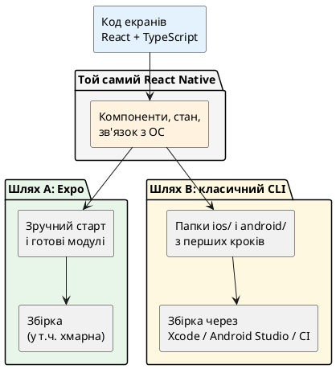
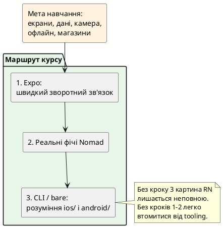

# Expo і класичний React Native — два шляхи одного фреймворку

## Навіщо ця стаття

У першій статті з’явилося питання: **якою технологією** будувати мобільний застосунок (сайт, React Native, повністю нативні мови тощо). У другій — **як усередині** влаштований React Native: логіка на JavaScript, малювання операційною системою, збирач коду.

Залишається практичне питання, на якому спотикаються майже всі, хто відкриває документацію вперше:

> «Починати з **Expo** чи з **React Native CLI**? Це взагалі різні технології?»

Короткі відповіді, які ця стаття розгорне:

1. Це **не** два різні React Native.  
2. Це **два способи** створити проєкт, підключати можливості телефону й збирати програму для встановлення.  
3. У **цьому курсі** спочатку йде **Expo**, а класичний шлях (**CLI**, «голий» проєкт) — обов’язково, але **пізніше**.

Встановлювати інструменти в цій статті **не потрібно**. Мета — спокійна карта місцевості, щоб наступна стаття (налаштування середовища) не виглядала як стрибок у невідоме.

::note
**Головна думка.** React Native — це «двигун і правила» мобільного UI на React. **Expo** і **React Native CLI** — різні **майстерні**, у яких цей двигун збирають у готовий застосунок. Майстерні різні; метал (React Native) — той самий.
::

---

## Що вже відомо, і чого ще бракує

З попередніх матеріалів:

- потрібен **встановлюваний** застосунок, а не лише сайт у браузері;
- екрани описують у стилі React, малює їх **ОС телефону**;
- під час розробки код збирає **Metro**, JavaScript виконує рушій (часто **Hermes**).

Чого ще не вистачає на практиці:

- **звідки взяти порожній проєкт** (яка команда, який шаблон);
- **як швидко побачити результат** на телефоні або симуляторі;
- **звідки беруться** камера, сповіщення, безпечне сховище паролів;
- **як з файлів на ноутбуці** виходить файл, який можна віддати в магазин додатків.

Саме тут розходяться шляхи Expo і класичного CLI.

---

## Два рівні: «фреймворк» і «спосіб вести проєкт»

{.diagram-img}

Корисно розділити поняття, які в розмовах часто змішують.

::field-group

::field{name="React Native" type="фреймворк"}
Набір ідей і бібліотек, завдяки яким React-код перетворюється на інтерфейс **нативного** мобільного застосунку (iOS і Android). Про «під капотом» — попередня стаття.
::

::field{name="Спосіб вести проєкт" type="tooling"}
Практичні відповіді: якою командою створити репозиторій, які папки там лежать з першого дня, як ставити бібліотеки з доступом до камери, як зібрати установчий файл, як спростити повсякденну розробку.
::

::

**Expo** і **React Native CLI** — це насамперед відповіді з другої групи. Вони **опираються** на React Native, а не замінюють його іншим UI-фреймворком на кшталт Flutter.

::warning
**Типова плутанина.** Фраза «ми пишемо на Expo, а не на React Native» звучить так, ніби це конкуренти. Точніше сказати: «ми пишемо **на React Native**, а проєкт ведемо **через Expo**» (або «через класичний CLI-проєкт»).
::

::plant-uml

::

---

## Що таке Expo простими словами

**Expo** — це **платформа й набір інструментів навколо React Native**, створені для того, щоб:

- швидше **створити** проєкт;
- менше часу витрачати на початкове налагодження нативних середовищ;
- підключати типові можливості телефону через **підготовлені модулі** з узгодженим стилем документації;
- зручніше **збирати** застосунок для внутрішнього тесту й магазинів (у тому числі через хмарну службу збірки — про неї нижче простими словами).

### Аналогія з вебом

У вебі можна:

- зібрати все «з нуля» (збирач, роутер, деплой — окремо підібрані інструменти);
- або взяти **каркас**, де багато рішень уже домовлені (наприклад, фреймворк на кшталт Next.js для React).

Аналогія **неповна**, але корисна: **React** ≈ ідея компонентів; **React Native** ≈ React для телефону; **Expo** ≈ «каркас і сервіси», які прискорюють життя з React Native.

::tip
Expo **не скасовує** потребу розуміти React Native. Він зменшує кількість ручної роботи на старті й дає готові «цеглинки» для камери, файлів, сповіщень тощо. Коли цеглинки не вистачає — лишається шлях глибше в нативний шар (про це — пізніше в курсі).
::

### З чого складається «світ Expo» (огляд без установки)

Не потрібно запам’ятовувати всі назви продуктів. Достатньо карти ролей.

::card-group

::card{title="Створення проєкту" icon="i-lucide-folder-plus"}
Команда на кшталт «створити застосунок Expo» дає готову структуру з TypeScript-шаблоном (конкретні команди — у наступній статті про середовище).
::

::card{title="Перегляд під час розробки" icon="i-lucide-smartphone"}
Можна відкрити проєкт у програмі **Expo Go** на фізичному телефоні (швидкий перегляд багатьох сценаріїв) або в **симуляторі / емуляторі** на комп’ютері. Обмеження Expo Go й коли потрібна «власна» збірка для розробки — пояснюються при налаштуванні.
::

::card{title="Модулі Expo" icon="i-lucide-boxes"}
Готові пакети для типових задач: робота з зображеннями, безпечне збереження секретів, сповіщення, файлова система тощо. У курсі вони з’являтимуться **по темах**, з повним поясненням.
::

::card{title="Збірка для інших людей" icon="i-lucide-cloud"}
Щоб віддати застосунок тестувальнику або в магазин, потрібен **установчий пакет**. Expo пропонує зручний маршрут через хмарну збірку (**EAS** — Expo Application Services: сервіси Expo для збірки й супроводу). Деталі профілів збірки — окремі статті ближче до «публікації».
::

::

::note
**EAS** у цій статті — лише ярлик: «хмара, яка вміє зібрати мобільний застосунок за правилами iOS/Android, щоб не обов’язково тримати всю важку збірку лише на своєму ноутбуці». Як саме налаштовувати профілі, підписи й магазини — **не зараз**.
::

---

## Що таке React Native CLI і «голий» (bare) проєкт

{.diagram-img}

**React Native CLI** (інтерфейс командного рядка спільноти React Native) — класичний спосіб **створити проєкт**, у якому з самого початку (або дуже рано) видно **нативні** частини:

::field-group

::field{name="Папка ios/" type="частина проєкту"}
Проєкт для екосистеми Apple. Його відкривають у програмі **Xcode** (офіційне середовище розробки для iOS). Тут живуть налаштування, від яких залежить збірка для iPhone.
::

::field{name="Папка android/" type="частина проєкту"}
Проєкт для Android. Його збирають інструментами **Android Studio** / система збірки **Gradle** (програма, яка збирає Android-застосунки за описом проєкту).
::

::field{name="JavaScript / TypeScript код" type="частина проєкту"}
Екрани й логіка — як і в Expo, у звичному React-стилі. Metro знову збирає JS.
::

::

Такий проєкт часто називають **bare** (англ. «голий») — у сенсі «без обгортки Expo як головного способу життя», з прямим доступом до нативних папок. Іноді кажуть **bare workflow** — «робочий процес із голим нативним проєктом».

::tip
**Аналогія.** Класичний CLI-проєкт — як отримати не лише готову квартиру з меблями, а ще й **ключ до щитової й котельні**. Більше контролю, більше відповідальності й більше речей, які можна зламати на старті навчання.
::

### Чому цей шлях важчий на першому тижні

::steps

### Потрібні важчі інструменти платформ

Для повноцінної роботи з iOS на практиці зазвичай потрібна екосистема Apple (комп’ютер Mac і Xcode). Для Android — Android Studio, емулятори, змінні середовища. Усе це **реально освоїти**, але це окремий обсяг навчання **поруч** із самим React.

### Нативні залежності підключають інакше

Бібліотека, якій потрібна камера, часто містить не лише JavaScript, а й код для iOS/Android. У bare-проєкті розробник ближче стикається з установкою цих частин (автоматичне підключення існує, але збої й документація «нативного» рівня трапляються частіше на старті).

### Збірка «як у магазині» — відповідальність команди

Підписи, сертифікати, профілі — усе можна налаштувати, але без хмарних спрощень крива входу крутіша.

::

Саме тому **починати курс з CLI** часто означає: тиждень возитися з середовищами, так і не діставшись до списків, навігації й офлайну.

---

## Порівняння поруч

Таблиця нижче — **орієнтир**, не вирок. Конкретна команда може змішувати підходи (про це далі).

| Питання | Expo (типовий greenfield) | React Native CLI / bare |
| ------- | ------------------------- | ----------------------- |
| Що це | Каркас і сервіси **над** React Native | Класичний проєкт RN з нативними папками |
| Швидкість першого «привіт, світе» | Зазвичай вища | Зазвичай нижча |
| Папки `ios/` і `android/` у репозиторії | Часто **немає** на самому старті; можуть з’явитися пізніше через генерацію | Є **одразу** (або дуже рано) |
| Типові можливості телефону | Багато готових модулів Expo | Окремі бібліотеки + нативне підключення |
| Збірка для тесту / магазину | Зручний маршрут через EAS | Власний CI, Xcode, Play Console-процеси |
| Контроль над нативним кодом | Високий **за потреби** (сучасний Expo це дозволяє), але з іншою моделлю роботи | Прямий і звичний для «чистих» native-команд |
| Ризик на першому тижні навчання | Застрягти в можливостях Expo Go, не зрозумівши збірку | Застрягти в Xcode/Gradle, не дійшовши до UI |
| У **цьому** курсі | Основний шлях застосунку **Nomad** | Окремий обов’язковий модуль пізніше |

::plant-uml

::

---

## Міф: «Expo — лише для іграшок»

Цей міф тягнеться зі **старих** часів, коли обмеження платформи Expo були жорсткішими, а «вийти» в повний нативний контроль було болючіше.

Сьогодні для багатьох **нових** продуктів Expo — **нормальний production-шлях**:

- застосунки в App Store і Google Play збирають через Expo / EAS;
- потрібні native-модулі додають, не обов’язково «викидаючи» Expo з першого дня;
- великі команди публічно описують роботу з Expo на серйозних продуктах.

::caution
Зворотний міф теж шкідливий: «Expo розв’яже все, натив ніколи не знадобиться». Специфічні SDK, незвичне «залізо», жорсткі корпоративні вимоги до нативного репозиторію — реальні причини знати bare/CLI. Курс готує **до обох** полюсів, у розумному порядку.
::

---

## Міф: «Справжній React Native — тільки CLI»

**Справжній** React Native — це те, що виконує React-код як мобільний UI на iOS/Android. І Expo-проєкт, і bare-проєкт у типовому сценарії **є** React Native.

Відрізняється:

- структура репозиторію;
- спосіб підключення модулів;
- повсякденні команди;
- модель збірки й оновлень.

Не відрізняється **ідея** з попередньої статті: JS-логіка, малювання ОС, Metro, рушій JS.

---

## Коли обирають Expo

{.diagram-img}

Expo зазвичай доречний, якщо:

::card-group

::card{title="Новий продукт" icon="i-lucide-sprout"}
Немає спадкового нативного моноліту, який уже диктує структуру репозиторію.
::

::card{title="Команда з вебу на React" icon="i-lucide-users"}
Потрібен швидкий шлях до екранів і магазинів без місяця лише на toolchain.
::

::card{title="Типові mobile-фічі" icon="i-lucide-camera"}
Камера, пуш-сповіщення, безпечне сховище, файли — у межах зрілої екосистеми модулів.
::

::card{title="Потрібна зручна збірка" icon="i-lucide-package"}
Хочеться передбачуваного маршруту «зібрати → віддати тестувальнику → у магазин» без винайдення CI з нуля в перший місяць.
::

::

Саме так виглядає навчальний **Nomad** і більшість «зелених» стартапів на React-команді.

---

## Коли обирають класичний CLI / bare (або сильний ухил у нативні папки)

::card-group

::card{title="Вбудовування в існуючий застосунок" icon="i-lucide-blocks"}
React Native додають **всередину** вже великого Swift/Kotlin-продукту. Тоді контроль нативних проєктів критичний з дня один.
::

::card{title="Жорсткі правила репозиторію" icon="i-lucide-building-2"}
Корпоративний стандарт: «у git завжди лежать ios/ і android/, збірка тільки наш Jenkins».
::

::card{title="Дуже специфічний native" icon="i-lucide-cpu"}
Потрібен глибокий власний код на Swift/Kotlin як серце продукту, а React Native — лише частина UI.
::

::card{title="Підтримка legacy" icon="i-lucide-history"}
Проєкт створили роки тому без Expo; міграція «на Expo» можлива, але не завжди пріоритет.
::

::

У курсі ці сценарії **не ігноруються** — для них є окремий модуль після того, як з’являться екрани, дані й базова збірка на Expo.

---

## Важливий міст: Expo вміє «показати» нативні папки

Сучасний Expo — не стіна між розробником і `ios/` / `android/`. Існує процес **генерації** нативних проєктів з опису конфігурації застосунку (у документації це пов’язано з командами на кшталт *prebuild* — «попередня збірка / генерація нативних проєктів»).

На рівні цієї статті достатньо ідеї:

::steps

### Спочатку проєкт може жити без папок ios/ і android/ у git

Конфігурація (ім’я застосунку, ідентифікатори, іконки, плагіни модулів) описується в файлах налаштувань Expo.

### Коли потрібні нативні проєкти — їх можна згенерувати

З’являються папки, схожі на ті, що в класичному CLI-проєкті.

### Далі можливі різні політики команди

Хтось **не** комітить згенероване й генерує в CI; хтось комітить і працює ближче до bare. Це вже інженерия процесу, не «магія іншої мови програмування».

::

::tip
Детальний розбір prebuild, «безперервної генерації нативного шару» і порівняння дерев файлів із CLI — у **пізнішій** статті модуля про bare workflow. Зараз важливо лише: **вибір Expo на старті не означає довічну заборону бачити Xcode-проєкт.**
::

---

## Як це стикується з архітектурою з попередньої статті

Незалежно від Expo чи CLI:

| Шар | Чи змінюється від вибору Expo/CLI? |
| --- | ----------------------------------- |
| Опис UI на React | Ні, ідея та сама |
| Виконання JS (часто Hermes) | Ні за суттю |
| Збір JS (Metro) | Ні за суттю; способи запуску можуть відрізнятися командами |
| Малювання системними елементами ОС | Ні |
| **Зручність модулів і збірки** | **Так — це якраз різниця шляхів** |
| **Наявність ios/android у репо з дня 1** | **Так** |

::note
Тому стаття про архітектуру йшла **перед** порівнянням tooling: спочатку «що таке RN усередині», потім «якою майстернею збирати».
::

---

## Маршрут саме цього курсу

::steps

### Модуль орієнтації (зараз)

Зрозуміти задачу RN, архітектуру, різницю Expo vs CLI — **без** обов’язкової установки в цій статті.

### Далі — середовище на Expo

Створити проєкт, запустити на симуляторі/телефоні, побачити перший екран. Почати структуру **Nomad**.

### Основна частина курсу

Навігація, списки, форми, мережа, Redux на мобільному, офлайн, камера, карта, жести, тести, збірка через зручний маршрут Expo/EAS.

### Окремий обов’язковий блок

Класичний CLI / bare: створити «голий» проєкт, побачити `ios/` і `android/`, порівняти з генерацією з Expo, торкнутися нативних модулів на оглядовому рівні.

::

::warning
**Не пропускати** пізній блок CLI лише тому, що Expo «і так закриває потреби». На співбесіді й у чужому репозиторії bare-проєкти трапляються постійно. Мета курсу — впевненість у **обох** картинах.
::

---

## Міні-проєкт: три короткі рішення «який шлях ведення проєкту»

### Завдання

Уже відомо, що продукт — на **React Native** (не PWA і не Flutter). Потрібно обрати **спосіб вести проєкт**: **Expo** чи **класичний CLI / bare**.

Для кожної ситуації — **один** вибір і **2–4 речення** обґрунтування. Код не пишеться.

### Ситуація 1

Новий застосунок «щоденник подорожей» для iOS і Android. Команда — троє веброзробників на React/TypeScript. Треба за 2–3 місяці дійти до внутрішнього тесту з камерою й офлайном. Нативних інженерів у штаті немає.

### Ситуація 2

Великий банківський застосунок уже написаний на Kotlin і Swift. Потрібно вбудувати **кілька нових екранів** на React Native всередину існуючих програм, зберігаючи поточну нативну збірку й релізний потяг банку.

### Ситуація 3

Стартап рік вів продукт на Expo і успішно вийшов у магазини. З’явилась потреба в рідкісному Bluetooth-пристрої; офіційний приклад виробника — лише фрагменти на Swift/Kotlin. Команда готова інвестувати час у нативний міст, але не хоче викидати весь JS-код.

### Критерій «готово»

- У кожній ситуації є **явний** вибір (або «Expo + поглиблення в native», якщо так точніше для ситуації 3).  
- Обґрунтування спирається на **обмеження команди/продукту**, а не на «Expo модний» / «CLI серйозніший».

::collapsible{title="Орієнтир для самоперевірки (відкрийте після власної відповіді)"}

1. **Expo** — greenfield, React-команда, швидкий шлях до фіч і тесту; збіг із маршрутом Nomad у курсі.  
2. **Класичний bare / сильний нативний контроль** — вбудовування в уже існуючі iOS/Android-застосунки й корпоративний релізний процес.  
3. Часто **лишаються на Expo** (або еквіваленті з prebuild) і **додають нативний модуль** / конфігурацію, а не переписують увесь продукт «на CLI заради статусу». Точний механізм модулів — пізніші статті; тут важливий висновок: **не обов’язково кидати Expo при першій native-потребі**.

::

---

## Nomad: яке рішення курсу

Для навчального застосунку **Nomad** зафіксовано:

::field-group

::field{name="Основний проєкт" type="рішення"}
[Nomad](https://github.com/arakviel/nomad) — проєкт на **Expo** + TypeScript. Саме тут з’являться екрани, навігація, Redux, офлайн, камера.
::

::field{name="Окрема пісочниця" type="рішення"}
Пізніше — `[Nomad](https://github.com/arakviel/nomad)-bare` для практики **CLI / bare**, щоб не ламати основний навчальний додаток під час експериментів з `ios/` і `android/`.
::

::field{name="Чому так" type="обґрунтування"}
Швидкий зворотний зв’язок на початку курсу + обов’язкове розуміння «голого» проєкту до кінця програми. Код Nomad — окремий репозиторій [https://github.com/arakviel/nomad](https://github.com/arakviel/nomad); матеріали курсу — у monorepo kostyl.dev (`content/`).
::

::

Окремого git-коміту в цій статті немає. Після статті про setup з’являється перший коміт ініціалізації [Nomad](https://github.com/arakviel/nomad) (у повідомленні — шлях матеріалу).

---

## Підсумок

::steps

### React Native — спільна основа

І Expo, і CLI будують **той самий клас** застосунків.

### Expo — зручна майстерня

Швидкий старт, модулі, зручна збірка; сучасний production-шлях для багатьох команд.

### CLI / bare — прямий доступ до ios/ і android/

Більше контролю й ваги toolchain; незамінний у brownfield і для глибокого native.

### Курс: спочатку Expo, потім обов’язково CLI

Не «або-або», а **послідовність навчання**.

### Наступний крок — руки в термінал

Налаштування середовища й перший запуск через Expo.

::

---

## Практичні завдання

### Базовий рівень

1. Пояснити одним абзацом, чому «Expo vs React Native» — **хибна** постановка питання.  
2. Назвати **дві** переваги Expo на старті навчання.  
3. Назвати **дві** ситуації, де bare/CLI виглядає природніше.

### Середній рівень

1. Виконати міні-проєкт (три ситуації).  
2. Описати, що таке папки `ios/` і `android/` **простими словами** (по 2–3 речення).  
3. Пояснити, навіщо курсу окрема пісочниця `[Nomad](https://github.com/arakviel/nomad)-bare`, а не лише один проєкт [Nomad](https://github.com/arakviel/nomad).

### Професійний рівень

1. Написати короткий текст для нетехнічного стейкхолдера: «Чому беремо Expo зараз і все одно вчимо CLI».  
2. Скласти список із **шести ризиків**, якщо команда **ніколи** не відкриє нативні папки.  
3. Скласти список із **шести ризиків**, якщо команда **з дня один** обере лише bare без досвіду mobile toolchain.

---

## Часті запитання

::accordion

::accordion-item{label="Чи можна «переїхати» з Expo на CLI посеред проєкту?" icon="i-lucide-circle-help"}
У тій чи іншій формі — так, але це **проєкт рішення**, а не одна кнопка. Сучасний Expo часто дозволяє залишатися в екосистемі й поглиблювати native. Деталі міграцій і prebuild — пізніше.
::

::accordion-item{label="Чи потрібен Mac уже для статті про Expo setup?" icon="i-lucide-circle-help"}
Для багатьох кроків Android-емулятор і/або фізичний телефон достатні. Повна iOS-збірка «як для магазину» пов’язана з правилами Apple; у статті про середовище буде чесний розподіл: що можна без Mac, а що — ні.
::

::accordion-item{label="Чи Expo Go — це і є мій майбутній застосунок у магазині?" icon="i-lucide-circle-help"}
Ні. **Expo Go** — зручна оболонка для **розробки й перегляду** багатьох сценаріїв. У магазин іде **окрема збірка** вашого застосунку з вашим ім’ям і ідентифікаторами. Це розведуть при налаштуванні середовища.
::

::accordion-item{label="Чи Metro є тільки в Expo?" icon="i-lucide-circle-help"}
Ні. Metro — збирач екосистеми React Native. Expo його використовує; CLI-проєкти — теж.
::

::
