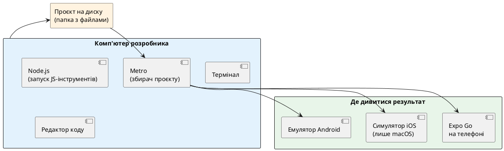
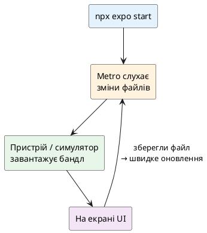

# Середовище Expo — перший запуск

::tip
**Код Nomad.** Наскрізний застосунок курсу живе в окремому репозиторії: [https://github.com/arakviel/nomad](https://github.com/arakviel/nomad). Клонуйте його поруч із навчанням (`git clone https://github.com/arakviel/nomad.git`). Кожен коміт у тому репо відповідає статті (`Material: …` у тілі коміту). У monorepo kostyl.dev лише **матеріали** курсу (markdown); код застосунку — у репозиторії Nomad вище.
::

## Навіщо ця стаття

Попередні матеріали відповіли на питання **навіщо** React Native, **як** він приблизно влаштований усередині, і **якою майстернею** (Expo) курс починає роботу. Тут з’являються **руки в терміналі**: з’являється реальний проєкт на диску, запускається збирач, на екрані телефону або симулятора видно перший інтерфейс.

Після цієї статті має бути зрозуміло:

- що встановити на комп’ютер **мінімально**;
- як створити проєкт командою **create-expo-app**;
- що відбувається після `npx expo start`;
- чим **Expo Go** відрізняється від симулятора й від «повноцінної» збірки для магазину;
- де лежать перші налаштування імені застосунку;
- як виконати міні-проєкт «Привіт, світе» і покласти фундамент **Nomad**.

::note
**Головна думка.** Мета першого дня з інструментами — не ідеальна «промислова» конфігурація, а **замкнений цикл**: змінив код → зберіг файл → побачив зміну на екрані. Усе інше нарощується поверх цього циклу.
::

---

## Що саме буде встановлено (картина цілого)

::plant-uml



::

Коротко по ролях:

::field-group

::field{name="Node.js" type="середовище"}
Програма, яка дозволяє запускати JavaScript **на комп’ютері** (не в браузері). Через неї працюють команди на кшталт `npx`, установлюються залежності проєкту. Для курсу потрібна **актуальна LTS-версія** (Long-Term Support — «з довгою підтримкою», стабільна лінійка для роботи).
::

::field{name="npm / pnpm / yarn" type="менеджер пакетів"}
Програма, яка за списком у `package.json` завантажує бібліотеки в папку `node_modules`. З Node.js зазвичай іде **npm**. Якщо в команді вже прийнятий **pnpm** або **yarn** — ними теж можна користуватися; у прикладах нижче показані варіанти.
::

::field{name="create-expo-app" type="генератор проєкту"}
Офіційна утиліта Expo: створює папку проєкту з готовим шаблоном (залежності, стартові файли, скрипти запуску).
::

::field{name="Expo CLI (через npx expo …)" type="команди проєкту"}
Набір команд усередині проєкту: старт Metro, очищення кешу тощо. Часто викликають як `npx expo start`, щоб узяти версію, узгоджену з проєктом.
::

::field{name="Місце перегляду" type="пристрій або симулятор"}
Або фізичний телефон із **Expo Go**, або **симулятор iOS** (на Mac), або **емулятор Android**. Це «екран», на якому видно зібраний інтерфейс.
::

::

---

## Крок 0. Перевірка та встановлення Node.js

### Навіщо

Без **Node.js** команди створення проєкту й установки пакетів не запустяться. Node.js — це середовище, яке виконує JavaScript **на комп’ютері** (у терміналі), а не в браузері. Через нього працюють `npx`, установники пакетів і багато інструментів екосистеми React / Expo.

Разом із Node.js зазвичай з’являється **npm** (*Node Package Manager* — програма для встановлення бібліотек за списком у `package.json`).

### Як перевірити, чи вже встановлено

У **новому** вікні терміналу:

```bash
node -v
npm -v
```

::field-group

::field{name="Очікуваний результат" type="успіх"}
Дві версії, наприклад `v22.x.x` і `10.x.x` (цифри змінюються з часом). Для курсу потрібна **актуальна LTS**-лінійка Node (Long-Term Support — довгопідтримувана стабільна гілка). Актуальний номер LTS дивіться на [nodejs.org](https://nodejs.org).
::

::field{name="command not found / не розпізнано" type="немає Node"}
Node.js ще не встановлено, або термінал відкрито **до** установки і не підхопив PATH (шлях до програм). Закрийте термінал повністю, відкрийте знову; якщо не допомогло — встановіть Node одним із способів нижче.
::

::field{name="Дуже стара версія (наприклад v12, v14)" type="застаріло"}
`create-expo-app` і сучасний Expo SDK можуть відмовитися працювати. Потрібно оновити Node до поточного LTS (найзручніше — через менеджер версій, див. нижче).
::

::

::tip
**Один спосіб — достатньо.** Не потрібно ставити Node і через сайт, і через brew, і через nvm «про всяк випадок». Кілька паралельних установок часто плутають, *який* `node` реально викликається в терміналі (`which node` / `where.exe node` на Windows).
::

### Два підходи: «просто поставити» і «керувати версіями»

::tabs

::tabs-item{label="Одна версія Node" icon="i-lucide-package"}
Підходить, якщо на машині один навчальний/робочий стек і не треба стрибати між проєктами з різними вимогами до Node.

Приклади: установщик з **nodejs.org**, **Homebrew** (`brew install node`), **winget** / **Chocolatey** / **Scoop** на Windows, пакети дистрибутива на Linux.
::

::tabs-item{label="Менеджер версій" icon="i-lucide-layers"}
Підходить, якщо паралельно живуть старі й нові проєкти, або команда фіксує версію Node у файлі (`.nvmrc`, `.node-version`, `mise.toml` тощо).

Приклади: **nvm**, **fnm**, **nvm-windows**, **mise**, **asdf**, **volta**. Можна швидко перемкнути `node -v` без переустановки «з нуля».
::

::

Нижче — детальні рецепти. Команди інколи змінюються в нових версіях інструментів; якщо щось не збігається, орієнтуйтеся на **офіційну** документацію відповідного інструменту, але логіка лишається тією самою.

---

### Спосіб A. Офіційний установщик (будь-яка ОС)

1. Відкрити [https://nodejs.org](https://nodejs.org).  
2. Завантажити кнопку **LTS** (не обов’язково «Current», якщо потрібна максимальна стабільність для навчання).  
3. Пройти майстер установки (на Windows залишити опції за замовчуванням, зокрема додавання до PATH).  
4. **Повністю закрити** термінал / VS Code і відкрити знову.  
5. Перевірити `node -v` і `npm -v`.

Це найпростіший шлях, якщо немає звички до пакетних менеджерів ОС.

---

### Спосіб B. macOS — Homebrew

**Homebrew** (*brew*) — популярний менеджер пакетів для macOS (іноді використовують і на Linux).

Якщо brew ще немає, його ставлять з офіційного сайту [https://brew.sh](https://brew.sh) (одна команда з сайту в терміналі). Далі:

```bash
brew update
brew install node
node -v
npm -v
```

Оновлення пізніше:

```bash
brew upgrade node
```

::note
`brew install node` ставить **одну** «поточну» формулу Node від Homebrew. Якщо потрібні **кілька** версій під різні проєкти — зручніше **nvm**, **fnm** або **mise** (розділи нижче), а не кілька суперечливих установок brew + nvm без розуміння PATH.
::

Перевірити, звідки взявся `node`:

```bash
which node
```

---

### Спосіб C. Windows — winget, Chocolatey, Scoop

На Windows часто користуються **менеджерами пакетів**, щоб ставити програми з терміналу. Достатньо **одного** з них (або офіційного `.msi` з nodejs.org).

::tabs

::tabs-item{label="winget" icon="i-lucide-download"}
**winget** — менеджер пакетів від Microsoft, часто вже є в сучасних Windows 10/11.

```powershell
winget install OpenJS.NodeJS.LTS
```

Після установки відкрити **новий** Windows Terminal / PowerShell:

```powershell
node -v
npm -v
```

Якщо пакет не знайдено, пошук:

```powershell
winget search nodejs
```

Обрати саме **LTS**-ідентифікатор пакета зі списку (назви пакетів інколи оновлюють).
::

::tabs-item{label="Chocolatey" icon="i-lucide-package"}
**Chocolatey** (*choco*) — сторонній менеджер пакетів для Windows. Потрібне попереднє встановлення Chocolatey з [https://chocolatey.org](https://chocolatey.org) (зазвичай PowerShell **від імені адміністратора**).

```powershell
choco install nodejs-lts -y
```

Новий термінал, потім `node -v`.

Оновлення:

```powershell
choco upgrade nodejs-lts -y
```
::

::tabs-item{label="Scoop" icon="i-lucide-archive"}
**Scoop** — менеджер пакетів для Windows, орієнтований на встановлення «в профіль користувача» без постійного UAC. Спочатку ставлять Scoop з [https://scoop.sh](https://scoop.sh), далі:

```powershell
scoop install nodejs-lts
node -v
npm -v
```

Оновлення:

```powershell
scoop update nodejs-lts
```
::

::tabs-item{label="Офіційний .msi" icon="i-lucide-globe"}
Завантажити LTS-інсталятор з [nodejs.org](https://nodejs.org), встановити, **перезапустити** термінал. Надійний варіант, якщо winget/choco/scoop у корпоративному середовищі заблоковані.
::

::

::warning
**Не змішуйте** без потреби: Node з `.msi` + Node з Scoop + Node з nvm-windows. Якщо `node -v` показує «не ту» версію, перевірте порядок PATH: `where.exe node` у PowerShell покаже **усі** знайдені `node.exe` у порядку пріоритету.
::

---

### Спосіб D. Linux — залежно від дистрибутива

На Linux «поставити node з репозиторію дистрибутива» інколи дає **застарілу** версію (особливо на LTS-релізах Ubuntu/Debian, якщо не підключено актуальне джерело). Для навчання й Expo надійніше:

1. або **менеджер версій** (nvm / fnm / mise) — рекомендовано;  
2. або офіційні інструкції NodeSource / пакети з [nodejs.org](https://nodejs.org);  
3. або пакети дистрибутива — лише якщо версія **достатньо нова** (перевірити `node -v` після установки).

::tabs

::tabs-item{label="Debian / Ubuntu (apt)" icon="i-lucide-terminal"}
Перевірка, що дає репозиторій «з коробки»:

```bash
sudo apt update
apt-cache policy nodejs
```

Якщо версія застаріла для сучасного Expo — **не** фіксуйтесь на `sudo apt install nodejs` як на єдиному шляху. Краще nvm/fnm/mise (нижче) або актуальні інструкції з офіційної документації Node / NodeSource для вашої версії Ubuntu.

Мінімальний варіант «з репо» (лише якщо версія підходить):

```bash
sudo apt update
sudo apt install -y nodejs npm
node -v
npm -v
```

На деяких системах пакет `nodejs` ставить лише `node` без свіжого npm — тоді дивіться документацію дистрибутива.
::

::tabs-item{label="Fedora" icon="i-lucide-terminal"}
```bash
sudo dnf install nodejs npm
node -v
npm -v
```

Якщо версія застаріла — знову ж таки nvm / fnm / mise або офіційні бінарники.
::

::tabs-item{label="Arch Linux" icon="i-lucide-terminal"}
```bash
sudo pacman -S nodejs npm
node -v
```

У Arch пакети зазвичай свіжі; для кількох версій Node усе одно зручний mise/nvm/fnm.
::

::tabs-item{label="openSUSE" icon="i-lucide-terminal"}
```bash
sudo zypper install nodejs npm
node -v
```
::

::

::tip
На Linux після установки через менеджер версій **обов’язково** відкрийте новий shell або `source` конфіг (`~/.bashrc`, `~/.zshrc`), інакше `node` «не знайдеться», хоча файли вже на диску.
::

---

### Спосіб E. Менеджери версій лише для Node: nvm і подібні

**Ідея:** на диску лежать кілька версій Node; команда на кшталт `nvm use 22` перемикає активну. У каталозі проєкту часто тримають файл `.nvmrc` з номером версії, щоб усі в команді працювали однаково.

#### nvm (Node Version Manager) — macOS / Linux / WSL

**nvm** не підтримує «рідний» Windows напряму; на Windows або **WSL** (Linux-підсистема), або **nvm-windows** (окремий проєкт нижче).

Встановлення nvm — за [офіційною інструкцією](https://github.com/nvm-sh/nvm) (скрипт `install.sh`). Після цього в **zsh/bash**:

```bash
# підтягнути nvm у поточну сесію (після свіжої установки)
# зазвичай рядок уже додається в ~/.bashrc або ~/.zshrc

nvm install --lts
nvm use --lts
node -v
npm -v
```

Корисні команди:

```bash
nvm ls                 # що встановлено локально
nvm ls-remote --lts    # які LTS доступні
nvm install 22         # конкретна major-версія (приклад)
nvm alias default 22   # версія за замовчуванням для нових терміналів
```

Файл у корені проєкту:

```text
.nvmrc
```

Вміст — один рядок, наприклад:

```text
22
```

Тоді в каталозі проєкту:

```bash
nvm use
```

#### fnm (Fast Node Manager) — macOS / Linux / Windows

**fnm** — швидша сучасна альтернатива nvm, кросплатформена. Встановлення — з [репозиторію fnm](https://github.com/Schniz/fnm) (brew, winget, скрипт тощо). Після ініціалізації в shell:

```bash
fnm install --lts
fnm use lts-latest
node -v
```

Підтримка `.node-version` / `.nvmrc` залежить від налаштування; digуйтесь README fnm.

#### nvm-windows — «класика» на Windows без WSL

Окремий проєкт **nvm-windows** (не той самий код, що nvm-sh). Зазвичай:

1. За потреби **прибрати** попередній Node з «Програм і компонентів», щоб не дублювати PATH.  
2. Установити nvm-windows з релізів GitHub проєкту.  
3. У **новому** cmd/PowerShell:

```powershell
nvm install lts
nvm use lts
node -v
```

(Точний синтаксис `lts` / номера версії перевірте в README вашої версії nvm-windows — він інколи відрізняється від unix-nvm.)

---

### Спосіб F. Універсальні менеджери середовищ: mise, asdf, volta

Окрім «тільки Node», існують інструменти, які керують **багатьма** мовами й утилітами (Node, Python, Terraform, jq…). Це зручно, якщо вже так налаштований робочий ноутбук.

#### mise

**mise** (раніше часто згадували як *rtx*) — сучасний менеджер версій і середовищ. Одна конфігурація може задавати Node для проєкту.

Встановлення — з [офіційної документації mise](https://mise.jdx.dev) (є варіанти для macOS, Linux, Windows). Типовий сценарій після установки:

```bash
# увімкнути активацію в shell (команда з docs mise для bash/zsh/fish)
# далі:
mise use --global node@lts
node -v
npm -v
```

У каталозі проєкту:

```bash
mise use node@22
```

З’явиться файл на кшталт `mise.toml` (або використовуються вже існуючі `.node-version` / `.nvmrc` — залежить від конфігурації). Команда `mise install` поставить потрібні версії.

::note
**Навіщо mise, якщо є nvm.** Якщо потрібен **лише** Node — nvm/fnm достатньо. Якщо вже керуєте Python, Bun, CLI-інструментами в одному місці — mise зменшує кількість «різних менеджерів версій» у голові.
::

#### asdf

**asdf** — старший універсальний менеджер плагінів (`asdf plugin add nodejs`, потім `asdf install nodejs <version>`). Логіка та сама: версія на проєкт у `.tool-versions`. Синтаксис і плагіни — у [документації asdf](https://asdf-vm.com). На нових машинах часто обирають **mise** як швидший/простіший наступник за відчуттями, але asdf лишається поширеним у командах.

#### volta

**Volta** — менеджер інструментів JS-екосистеми: вміє фіксувати версію Node **для проєкту** і підхоплювати її автоматично. Встановлення — з [https://volta.sh](https://volta.sh). Ідея:

```bash
volta install node@lts
volta pin node@22
```

`volta pin` записує версію в `package.json`, щоб інші з Volta отримали ту саму.

#### Коротке порівняння «менеджерів»

| Інструмент | Платформи (типово) | Що керує | Добре для |
| ---------- | ------------------ | -------- | --------- |
| **nvm** | macOS, Linux, WSL | переважно Node | Класика в туторіалах |
| **fnm** | macOS, Linux, Windows | Node | Швидкість, кросплатформа |
| **nvm-windows** | Windows | Node | Windows без WSL |
| **mise** | macOS, Linux, Windows | Node + багато іншого | Єдине середовище для різних стеків |
| **asdf** | macOS, Linux | Плагіни (Node тощо) | Legacy-налаштування команд |
| **volta** | macOS, Linux, Windows | Node / npm / yarn / пакети JS | Жорстка фіксація під JS-проєкт |

::caution
Не встановлюйте **одночасно** nvm + fnm + mise + volta «на всяк випадок» без розуміння, хто переміг у PATH. Оберіть **один** менеджер версій (або жодного — лише системний Node) і користуйтесь ним послідовно.
::

---

### Після будь-якого способу: фінальна перевірка

```bash
node -v
npm -v
which node
# Windows PowerShell:
# where.exe node
```

Бажано:

1. Версія Node — з **поточної LTS**-лінійки (або тієї, яку явно вимагає обраний Expo SDK у документації).  
2. `which` / `where` вказує на **очікуваний** шлях (nvm, mise, brew, Program Files тощо) — не на випадковий старий бінарник.  
3. Новий термінал після зміни PATH / профілю shell.

::collapsible{title="Якщо node -v показує не ту версію"}

1. Виконати `which node` / `where.exe node` — подивитися **перший** шлях у списку.  
2. Згадати, що ставили останнім: brew, .msi, nvm, mise…  
3. Закрити всі термінали й VS Code (інколи IDE кешує старий PATH).  
4. Перевірити кінець `~/.zshrc` / `~/.bashrc` / профіль PowerShell: чи немає двох ініціалізацій nvm і mise, що перебивають одна одну.  
5. Тимчасово прибрати з PATH зайві каталоги Node або деінсталювати дублікат.

::

::tip
Для курсу достатньо: **один** стабільний Node LTS + робочий `npm`. Менеджер версій — плюс, не обов’язок у перший вечір, але саме він рятує через пів року, коли один проєкт «хоче» Node 18, а інший — 22.
::

---

## Крок 0+. Редактор коду: Visual Studio Code

Підійде будь-який редактор із підсвіткою TypeScript. У курсі орієнтир — **Visual Studio Code** (VS Code): безкоштовний редактор від Microsoft, стандарт де-факто для React / TypeScript / Expo. Сумісні форки (Cursor, VSCodium тощо) зазвичай розуміють ті самі розширення й `settings.json`; нижче — ідентифікатори й налаштування саме в термінах VS Code.

Офіційна документація VS Code: [https://code.visualstudio.com/docs](https://code.visualstudio.com/docs). Рекомендації щодо **Expo Tools** і дебагу з VS Code — у [документації Expo](https://docs.expo.dev).

::note
**Мінімум vs комфорт.** Щоб **лише** створити проєкт і побачити екран, достатньо «голого» VS Code + вбудованої підтримки TypeScript. Розширення й `settings.json` нижче не блокують перший запуск, але **сильно** зменшують кількість дурних помилок і хаосу у форматуванні вже з другого дня.
::

### Встановлення VS Code

1. Завантажити з [https://code.visualstudio.com](https://code.visualstudio.com) для macOS / Windows / Linux.  
2. Установити як звичайну програму.  
3. (Бажано) увімкнути команду `code` у PATH:  
   - **macOS:** у VS Code — Command Palette (`Cmd+Shift+P`) → *Shell Command: Install 'code' command in PATH*.  
   - **Windows:** опція під час установки «Add to PATH» зазвичай уже є.  
4. Відкрити **папку проєкту** (не один файл): *File → Open Folder…* — тоді працюють workspace-налаштування й TypeScript проєкту.

Вбудований термінал: `` Ctrl+` `` (Windows/Linux) або `` Ctrl+` `` / *Terminal → New Terminal* (macOS — `` Control+` ``). Завжди запускайте `npx expo start` **з кореня** відкритої папки проєкту.

---

### Два рівні налаштувань: User і Workspace

::field-group

::field{name="User settings" type="глобально"}
Застосовуються до **всіх** проєктів на цій машині. Файл відкривають так: Command Palette → **Preferences: Open User Settings (JSON)**. Зручно покласти сюди `formatOnSave`, розмір табів, тему, «дефолтний» форматер.
::

::field{name="Workspace settings" type="лише цей проєкт"}
Файл `.vscode/settings.json` **у корені репозиторію**. Перебиває user-налаштування для цієї папки. Сюди кладуть те, що має бути **однаковим у команди** (форматер, ESLint working directories).
::

::field{name="Рекомендовані розширення проєкту" type="команда"}
Файл `.vscode/extensions.json` зі списком `recommendations`. Коли колега відкриває репо, VS Code пропонує встановити ці розширення ([документація VS Code — Workspace Recommended Extensions](https://code.visualstudio.com/docs/configure/extensions/extension-marketplace)).
::

::

::tip
Для курсу: **must-have розширення** можна поставити глобально один раз. **Однакові правила форматування** для Nomad краще дублювати в `.vscode/settings.json` проєкту, щоб не залежати від чужого user-профілю.
::

---

### Розширення: must-have

Це набір, без якого щоденна робота з **Expo + TypeScript + якістю коду** відчутно гірша. У таблиці — **ідентифікатор** для Marketplace / `code --install-extension`.

| Розширення | ID | Навіщо |
| ---------- | -- | ------ |
| **ESLint** | `dbaeumer.vscode-eslint` | Підсвічує порушення правил лінтера прямо в редакторі; уміє **автовиправлення** при збереженні (`source.fixAll.eslint`). Стандарт для JS/TS-проєктів ([VS Code + ESLint](https://code.visualstudio.com/docs)). |
| **Prettier — Code formatter** | `esbenp.prettier-vscode` | Єдиний стиль відступів, лапок, переносів. Працює як **default formatter** для TS/TSX/JSON. |
| **Expo Tools** | `expo.vscode-expo-tools` | Офіційне розширення екосистеми Expo: підказки й перевірка для `app.json` / `app.config.*`, EAS-конфігів, зручності з конфіг-плагінами; інтеграція з дебагом у VS Code ([документація Expo — Expo Tools / debugging](https://docs.expo.dev)). |

Встановлення з терміналу (приклад):

```bash
code --install-extension dbaeumer.vscode-eslint
code --install-extension esbenp.prettier-vscode
code --install-extension expo.vscode-expo-tools
```

Або в UI: бічна панель **Extensions** (`Ctrl+Shift+X` / `Cmd+Shift+X`) → пошук за назвою → Install.

::warning
**ESLint і Prettier у проєкті.** Розширення в редакторі — це «очі й руки» в UI. Щоб вони мали що робити, у репозиторії мають з’явитися залежності й конфіги (`eslint`, `prettier`, `.eslintrc` / `eslint.config.js`, `.prettierrc` тощо). У свіжому `create-expo-app` набір може відрізнятися за шаблоном: якщо лінтера ще немає — розширення просто «чекатиме»; підключення ESLint до Nomad можна зробити на кроці структури проєкту. **Expo Tools** корисний одразу для `app.json`.
::

::caution
Не вмикайте **одночасно** кілька форматерів «на збереження» без чіткого `editor.defaultFormatter`. Типовий конфлікт: і вбудований TypeScript formatter, і Prettier, і «Format Document» від іншого плагіна — файл стрибає між стилями.
::

---

### Розширення: рекомендовані (не обов’язкові)

Ставте за смаком і задачами. Для курсу вони **корисні**, але без них можна жити.

::card-group

::card{title="Error Lens" icon="i-lucide-eye"}
**ID:** `usernamehw.errorlens`  
Показує текст помилки TypeScript/ESLint **в кінці рядка**, не лише хвилясте підкреслення. Зручно, поки звикаєте читати Problems panel.
::

::card{title="Pretty TypeScript Errors" icon="i-lucide-file-warning"}
**ID:** `yoavbls.pretty-ts-errors`  
Робить довгі generics-помилки TypeScript читабельнішими.
::

::card{title="EditorConfig" icon="i-lucide-ruler"}
**ID:** `editorconfig.editorconfig`  
Підхоплює файл `.editorconfig` у репо (кодування, кінці рядків, відступи), щоб Windows/macOS/Linux не плодили різний whitespace.
::

::card{title="Path Intellisense" icon="i-lucide-folder-tree"}
**ID:** `christian-kohler.path-intellisense`  
Автодоповнення шляхів у `import` і в рядках до файлів.
::

::card{title="npm Intellisense" icon="i-lucide-package"}
**ID:** `christian-kohler.npm-intellisense`  
Підказки імен пакетів з `node_modules` у import.
::

::card{title="GitLens" icon="i-lucide-git-branch"}
**ID:** `eamodio.gitlens`  
Хто й коли змінював рядок (blame), історія hunks. Зручно в команді; для соло-навчання — за бажанням.
::

::card{title="DotENV" icon="i-lucide-key-round"}
**ID:** `mikestead.dotenv`  
Підсвітка `.env` файлів (коли з’являться ключі API — **ніколи** не комітьти секрети).
::

::card{title="YAML" icon="i-lucide-file-code"}
**ID:** `redhat.vscode-yaml`  
Якщо редагуєте YAML (CI, EAS-конфіги в yaml). Для чистого JSON `app.json` не критично.
::

::

**Опційно / обережно:**

| Розширення | Коментар |
| ---------- | -------- |
| **React Native Tools** (`msjsdiag.vscode-react-native`) | Корисне для деяких bare/CLI сценаріїв і дебагу. У **Expo-first** курсі пріоритет — **Expo Tools**; два набори інструментів дебагу інколи плутають — ставте свідомо. |
| **Radon IDE** | Потужне платне середовище під RN/Expo (згадується в docs Expo як альтернатива). Не must-have для навчання. |
| Іконки тем (Material Icon Theme тощо) | Лише зовнішній вигляд файлового дерева. |
| AI-плагіни (Copilot тощо) | За політикою навчання/роботи; до React Native не прив’язані. |

---

### Рекомендований `settings.json` (User або Workspace)

Нижче — **практичний стартовий набір** для TypeScript + Prettier + ESLint, узгоджений із поширеними порадами документації VS Code (`editor.formatOnSave`, `editor.codeActionsOnSave`, мовні перевизначення форматера).

Відкрити User JSON: Command Palette → **Preferences: Open User Settings (JSON)**.

```json
{
  "editor.tabSize": 2,
  "editor.insertSpaces": true,
  "editor.detectIndentation": false,
  "editor.wordWrap": "on",
  "editor.minimap.enabled": false,
  "editor.bracketPairColorization.enabled": true,
  "editor.guides.bracketPairs": true,
  "editor.linkedEditing": true,
  "editor.suggestSelection": "first",
  "editor.inlineSuggest.enabled": true,

  "files.eol": "\n",
  "files.insertFinalNewline": true,
  "files.trimTrailingWhitespace": true,
  "files.exclude": {
    "**/.git": true,
    "**/node_modules": true
  },
  "search.exclude": {
    "**/node_modules": true,
    "**/dist": true,
    "**/.expo": true
  },

  "editor.formatOnSave": true,
  "editor.formatOnPaste": false,
  "editor.defaultFormatter": "esbenp.prettier-vscode",

  "editor.codeActionsOnSave": {
    "source.fixAll.eslint": "explicit",
    "source.organizeImports": "never"
  },

  "[javascript]": {
    "editor.defaultFormatter": "esbenp.prettier-vscode"
  },
  "[javascriptreact]": {
    "editor.defaultFormatter": "esbenp.prettier-vscode"
  },
  "[typescript]": {
    "editor.defaultFormatter": "esbenp.prettier-vscode"
  },
  "[typescriptreact]": {
    "editor.defaultFormatter": "esbenp.prettier-vscode"
  },
  "[json]": {
    "editor.defaultFormatter": "esbenp.prettier-vscode"
  },
  "[jsonc]": {
    "editor.defaultFormatter": "esbenp.prettier-vscode"
  },

  "typescript.tsserver.maxTsServerMemory": 4096,
  "typescript.updateImportsOnFileMove.enabled": "always",
  "javascript.updateImportsOnFileMove.enabled": "always",

  "eslint.validate": [
    "javascript",
    "javascriptreact",
    "typescript",
    "typescriptreact"
  ],
  "eslint.format.enable": false,

  "prettier.requireConfig": false,
  "prettier.useEditorConfig": true,

  "terminal.integrated.defaultProfile.osx": "zsh",
  "terminal.integrated.scrollback": 10000,

  "git.autofetch": true,
  "diffEditor.ignoreTrimWhitespace": false
}
```

::field-group

::field{name="editor.formatOnSave" type="boolean"}
При збереженні файлу запускається форматер. У парі з Prettier дає стабільний стиль без ручного «Format Document».
::

::field{name="editor.defaultFormatter" type="string"}
Хто форматує, якщо не вказано інакше для мови. Тут — Prettier (`esbenp.prettier-vscode`).
::

::field{name="editor.codeActionsOnSave → source.fixAll.eslint" type="eslint"}
Після збереження ESLint намагається **автоматично виправити** те, що вміє (зайві імпорти за правилами, деякі стильові fix тощо). Значення `"explicit"` — сучасний варіант у VS Code: fix при явному save (не в «тихих» автосейвах у фоні). Якщо у вашій версії VS Code очікується boolean, можна поставити `true` (як у класичних прикладах docs: `"source.fixAll.eslint": true`).
::

::field{name="source.organizeImports: never" type="обережність"}
Вбудоване «розкласти імпорти» TypeScript інколи **конфліктує** з ESLint/Prettier-плагінами імпортів. Спочатку `never`; увімкнути `true` / `"explicit"` можна, коли в проєкті узгоджено одну стратегію імпортів.
::

::field{name="eslint.format.enable: false" type="розведення ролей"}
Форматує **Prettier**, лінтить і фіксить логічні/стильові правила — **ESLint**. Так менше війни «хто останній переписав файл».
::

::field{name="prettier.requireConfig" type="boolean"}
`false` — Prettier працює навіть без `.prettierrc` (з дефолтами). `true` — форматувати лише коли в проєкті є конфіг; зручно в монорепо з різними пакетами. Для навчання часто зручніше `false` або свідомий `.prettierrc` у Nomad.
::

::field{name="search.exclude → .expo" type="Expo"}
Папка `.expo` — службовий кеш локальної розробки; її рідко потрібно шукати повнотекстом.
::

::field{name="typescript.updateImportsOnFileMove" type="DX"}
При перейменуванні/переміщенні файлу VS Code оновлює імпорти. Дуже корисно, коли з’явиться структура `src/features/…`.
::

::

::collapsible{title="Мінімальний settings.json (якщо не хочете копіювати все)"}

```json
{
  "editor.tabSize": 2,
  "editor.formatOnSave": true,
  "editor.defaultFormatter": "esbenp.prettier-vscode",
  "editor.codeActionsOnSave": {
    "source.fixAll.eslint": "explicit"
  },
  "[typescript]": {
    "editor.defaultFormatter": "esbenp.prettier-vscode"
  },
  "[typescriptreact]": {
    "editor.defaultFormatter": "esbenp.prettier-vscode"
  },
  "files.eol": "\n",
  "files.insertFinalNewline": true,
  "files.trimTrailingWhitespace": true
}
```

::

---

### Файли в репозиторії Nomad (workspace)

Після створення проєкту можна додати (вручну або командою **Extensions: Configure Workspace Recommended Extensions**):

::code-tree

```json [.vscode/extensions.json]
{
  "recommendations": [
    "dbaeumer.vscode-eslint",
    "esbenp.prettier-vscode",
    "expo.vscode-expo-tools",
    "editorconfig.editorconfig",
    "usernamehw.errorlens",
    "yoavbls.pretty-ts-errors"
  ]
}
```

```json [.vscode/settings.json]
{
  "editor.formatOnSave": true,
  "editor.defaultFormatter": "esbenp.prettier-vscode",
  "editor.codeActionsOnSave": {
    "source.fixAll.eslint": "explicit"
  },
  "eslint.workingDirectories": [{ "mode": "auto" }],
  "typescript.tsdk": "node_modules/typescript/lib",
  "files.eol": "\n"
}
```

::

::field-group

::field{name="typescript.tsdk" type="workspace"}
Вказує VS Code на **TypeScript з проєкту** (`node_modules`), а не лише на вбудований у редактор. Версії compilerOptions і підказки збігаються з тим, що реально збирає Expo.
::

::field{name="eslint.workingDirectories" type="монорепо / вкладеність"}
`"mode": "auto"` допомагає ESLint-розширенню знайти корінь конфігу, якщо структура папок складніша. Для простого [Nomad](https://github.com/arakviel/nomad) часто працює і без цього.
::

::

---

### Корисні команди VS Code саме для цього курсу

| Дія | Command Palette / скорочення |
| --- | ---------------------------- |
| Відкрити settings.json | `Preferences: Open User Settings (JSON)` |
| Форматувати документ | `Format Document` (`Shift+Alt+F` / `Shift+Option+F`) |
| Problems (помилки TS/ESLint) | `View: Toggle Problems` (`Ctrl+Shift+M` / `Cmd+Shift+M`) |
| Перейти до визначення | `F12` / `Go to Definition` |
| Імпорти / рефакторинг символу | `F2` Rename Symbol |
| Expo: дебаг (коли застосунок запущено) | команди на кшталт **Expo: Debug …** з розширення Expo Tools (див. актуальне меню Commands після установки) |
| Показати рекомендовані розширення workspace | `Extensions: Show Recommended Extensions` |

::tip
Червоний екран у Expo / стек у терміналі Metro часто **дублюється** в панелі **Problems**, якщо помилка TypeScript. Спочатку дивіться рядок і файл у Problems — це швидше, ніж гортати лог Metro.
::

---

### Швидкий чеклист редактора

::collapsible{title="Чеклист VS Code перед першим expo start"}

- [ ] VS Code встановлено, папка проєкту відкрита через *Open Folder*  
- [ ] Вбудований термінал відкривається в **корені** проєкту  
- [ ] Must-have: ESLint, Prettier, Expo Tools  
- [ ] У `settings.json` є `formatOnSave` + default formatter Prettier  
- [ ] (Опційно) `.vscode/extensions.json` у Nomad для команди  
- [ ] Після `node_modules` — `typescript.tsdk` на проєктний TypeScript  

::

---

## Крок 1. Створення проєкту

### Куди класти папку

Код **Nomad** — окремий репозиторій (не всередині monorepo матеріалів):

- [https://github.com/arakviel/nomad](https://github.com/arakviel/nomad) — наскрізний застосунок курсу **Nomad**;
- `hello-expo` (локально, за бажанням) — міні-проєкт «Привіт, світе» цієї статті, **окремо** від Nomad;
- пізніше: окрема пісочниця **nomad-bare** для React Native CLI (окремий модуль).

Команди для застосунку виконують у клоні [https://github.com/arakviel/nomad](https://github.com/arakviel/nomad).

Важливо: **не** створювати проєкт усередині іншої випадкової `node_modules` і бажано уникати шляхів із пробілами й кирилицею, якщо ОС інколи з цим «капризує» (рідко, але трапляється на Windows).

### Команда створення

Офіційний сучасний спосіб:

::code-group

```bash [npm / npx]
npx create-expo-app@latest hello-expo
```

```bash [pnpm]
pnpm create expo-app hello-expo
```

```bash [yarn]
yarn create expo-app hello-expo
```

::

Що відбувається під час виконання (спрощено):

::steps

### Завантажується актуальний create-expo-app

Префікс `@latest` просить свіжу версію генератора, щоб не чіплятися за застарілий кеш.

### Створюється папка `hello-expo`

У ній з’являються стартові файли й `package.json` — список залежностей і скриптів.

### Установлюються залежності

Завантажуються React, React Native, Expo SDK та інші пакети шаблону. Це може зайняти кілька хвилин залежно від мережі.

::

### Який шаблон обрати

`create-expo-app` уміє різні **шаблони** (*templates* — заготовки проєкту).

| Шаблон (орієнтир назв) | Зміст | Коли доречно |
| ---------------------- | ----- | ------------ |
| **default** (часто без прапорця) | TypeScript + багатоекранний старт на **Expo Router** (файлова навігація) | Основний шлях **Nomad** і більшість сучасних застосунків |
| **blank-typescript** | Мінімум файлів, TypeScript | Дуже маленький експеримент «один екран» |
| **blank** | Мінімум, без TypeScript | У курсі **не** використовуємо: потрібен TypeScript |

Приклад з явним шаблоном:

```bash
npx create-expo-app@latest hello-expo --template blank-typescript
```

::note
**Для Nomad** у курсі рекомендовано шаблон з TypeScript (далі з’являється Expo Router). Для міні-проєкту «Привіт, світе» підійде `blank-typescript` — головне **запустити** і змінити видимий текст/іконку.
::

::warning
**Версія Expo Go з Play Store / App Store ≠ завжди «найновіший SDK».**  
`create-expo-app@latest` може поставити, наприклад, **SDK 57**, тоді як Expo Go з магазину ще зібраний під **SDK 54**. Тоді з’являється: *Project is incompatible with this version of Expo Go*.

**Що робити (оберіть одне):**

1. **Рекомендовано для курсу** — тримати проєкт на SDK, який підтримує store Expo Go (референс Nomad: **SDK 54**):

```bash
npx create-expo-app@latest nomad -t blank-typescript@sdk-54
```

2. Або встановити **Expo Go саме під ваш SDK** з [expo.dev/go](https://expo.dev/go) (APK для Android; на фізичному iPhone з магазину часто лише остання збірка).

3. Або перейти на **development build** (окрема тема курсу) — тоді store Expo Go не потрібен.

У повідомленні про несумісність Expo Go зазвичай пише, **який SDK** у проєкті і **який** підтримує програма на телефоні — звіряйте ці два числа.
::

Після створення:

```bash
cd hello-expo
```

---

## Крок 2. Що лежить у свіжому проєкті (перший погляд)

Точна структура залежить від шаблону й версії SDK. Нижче — **ролі**, а не догма «файл має називатися саме так».

::field-group

::field{name="package.json" type="файл"}
Список залежностей і скриптів. Тут видно версії `expo`, `react`, `react-native`. Скрипт на кшталт `start` зазвичай запускає Expo.
::

::field{name="app.json або app.config.js / app.config.ts" type="конфігурація"}
«Паспорт» застосунку для Expo: **відображуване ім’я**, унікальні ідентифікатори під магазини (з’являться/уточняться пізніше), іконка, заставка (splash), орієнтація екрана тощо. Детальніше — нижче в цій статті.
::

::field{name="app/ або App.tsx" type="код UI"}
У шаблоні з **Expo Router** екрани часто лежать у папці `app/`. У blank-шаблоні може бути один кореневий файл на кшталт `App.tsx`. Це місце, де змінюють текст «привіт».
::

::field{name="assets/" type="ресурси"}
Зображення: іконка, splash, інші картинки за замовчуванням.
::

::field{name="node_modules/" type="залежності"}
Завантажені пакети. У git зазвичай **не** комітять (є в `.gitignore`).
::

::

Глибоку «архітектуру папок продукту» (features, shared, design tokens) розбирає **наступна** стаття. Зараз достатньо знайти файл, де написаний видимий текст стартового екрана.

---

## Крок 3. Запуск Metro і меню розробника

У корені проєкту:

::code-group

```bash [npm]
npx expo start
```

```bash [pnpm]
pnpm exec expo start
# або, якщо в package.json є script "start":
pnpm start
```

```bash [yarn]
yarn expo start
# або yarn start — залежно від scripts
```

::

### Що має з’явитися

1. У терміналі стартує **Metro** (збирач з попередньої статті).  
2. Часто малюється **QR-код**.  
3. Показуються підказки клавіш: відкрити Android, iOS, web тощо (набір залежить від ОС і встановлених інструментів).

Це **сервер розробки**: комп’ютер віддає зібраний JavaScript телефону або симулятору.

::plant-uml



::

### Швидке оновлення екрана

Після зміни тексту в компоненті й збереження файлу інтерфейс на пристрої зазвичай **оновлюється сам** (механізм на кшталт Fast Refresh). Якщо ні — у меню розробника є перезавантаження; інколи допомагає повний перезапуск `expo start`.

::tip
Якщо зміни «не підхоплюються», спочатку перевірте, що збережено саме той файл, який реально рендериться на екрані (у Router-шаблоні це легко переплутати з іншим маршрутом).
::

---

## Крок 4. Де дивитися застосунок

Є три поширені шляхи. Вони **не взаємовиключні** — зручно вміти хоча б один стабільно.

### A. Фізичний телефон і Expo Go

**Expo Go** — безкоштовний застосунок з App Store / Google Play. Він уміє відкривати **проєкт розробки** з вашого комп’ютера (через QR-код або URL), не змушуючи одразу збирати повний установчий пакет «як для магазину».

::steps

### Установіть Expo Go на телефон

З офіційного магазину додатків для вашої платформи.

### Комп’ютер і телефон в одній мережі (типовий випадок)

Обидва в одній Wi‑Fi — найпростіший варіант. Корпоративні мережі інколи **блокують** доступ між пристроями; тоді знадобляться інші режими з’єднання (тунель) — див. розділ про типові проблеми.

### Запустіть `npx expo start` на комп’ютері

У терміналі з’явиться QR-код.

### Відскануйте QR-код

- **Android:** часто можна сканувати з Expo Go.  
- **iPhone:** зручно сканувати камерою системи, яка пропонує відкрити в Expo Go (поведінка залежить від версій).

### Дочекайтеся завантаження бандла

Перший раз довше: залежності й збірка. Далі — швидше.

::

::warning
**Expo Go — це не ваш майбутній продукт у магазині.** Це оболонка для **розробки**. У магазин піде окремо зібраний застосунок з **вашою** назвою та ідентифікаторами. Також не всі нативні модулі доступні всередині Expo Go: коли з’являться «важчі» бібліотеки, курс перейде до **development build** (окрема збірка для розробки). На старті курсу Expo Go достатньо.
::

### B. Емулятор Android

**Емулятор** — програма на комп’ютері, яка імітує Android-телефон.

Потрібні:

1. **Android Studio** (велике встановлення від Google).  
2. Через SDK Manager — платформа Android і **Android Emulator**.  
3. Створений віртуальний пристрій (AVD).  
4. Запущений емулятор, потім у проєкті — відкриття Android з меню Expo (часто клавіша `a` у терміналі з `expo start`, якщо середовище налаштоване).

::caution
Перше встановлення Android Studio може зайняти **гігабайти** місця й десятки хвилин. Якщо зараз немає часу — спокійно почніть з **Expo Go на фізичному Android-телефоні**.
::

### C. Симулятор iOS (лише macOS)

**Симулятор iOS** входить до **Xcode** (середовище Apple). На Windows і Linux **немає** офіційного симулятора iPhone.

На Mac:

1. Установити Xcode з App Store (велике завантаження).  
2. Запустити Xcode один раз, прийняти ліцензії, дочекатися додаткових компонентів.  
3. У проєкті з `expo start` відкрити iOS (часто клавіша `i`), якщо інструменти на місці.

::note
Збірка **для встановлення на фізичний iPhone «як з магазину»** і платний Apple Developer — окремі теми. Для навчання симулятор + Expo Go часто достатні надовго.
::

::tabs

::tabs-item{label="Найшвидший старт" icon="i-lucide-zap"}
Node.js → `create-expo-app` → `expo start` → **Expo Go** на особистому телефоні в одній Wi‑Fi з ноутбуком.
::

::tabs-item{label="Без телефону під рукою" icon="i-lucide-monitor"}
Node.js → Android Studio + емулятор **або** (на Mac) Xcode + симулятор iOS.
::

::tabs-item{label="Що можна відкласти" icon="i-lucide-clock"}
Акаунт Apple Developer, Google Play Console, EAS Submit, власні іконки «як у проді», ESLint-конфіг команди — **після** першого успішного екрана.
::

::

---

## Крок 5. Мінімальні налаштування «паспорта» застосунку

Відкрийте `app.json` (або `app.config.ts` / `app.config.js`, якщо шаблон уже на конфігурації в коді).

Типові поля, які варто зрозуміти одразу:

::field-group

::field{name="name" type="рядок"}
Внутрішнє / службове ім’я проєкту в екосистемі Expo.
::

::field{name="slug" type="рядок"}
Короткий ідентифікатор для URL і сервісів Expo (латиниця, без пробілів). Для навчального `hello-expo` можна лишити близьким до імені папки.
::

::field{name="version" type="рядок"}
Версія, яку бачать люди (наприклад, `1.0.0`). Пізніше пов’яжеться з магазинами.
::

::field{name="orientation" type="налаштування"}
Чи крутиться інтерфейс разом із телефоном (`portrait` — здебільшого вертикально тощо).
::

::field{name="icon" type="шлях до файлу"}
Шлях до зображення **іконки** на домашньому екрані (у розробці через Expo Go іконка оболонки може відрізнятися від фінальної збірки — це нормально).
::

::field{name="splash" type="об'єкт"}
**Заставка** (*splash screen*) — картинка, яку користувач бачить під час старту застосунку, поки готується інтерфейс.
::

::

Приклад фрагмента (у реальному файлі полів більше; не копіюйте сліпо, а **знайдіть аналог** у своєму шаблоні):

```json
{
  "expo": {
    "name": "Hello Expo",
    "slug": "hello-expo",
    "version": "1.0.0",
    "orientation": "portrait",
    "icon": "./assets/images/icon.png",
    "splash": {
      "image": "./assets/images/splash-icon.png",
      "resizeMode": "contain",
      "backgroundColor": "#ffffff"
    }
  }
}
```

::tip
Після зміни іконки/splash інколи потрібен **перезапуск** `expo start` і повне перезавантаження на пристрої. Кеш зображень любить «триматися» за старе.
::

Глибоке налаштування ідентифікаторів магазинів (`ios.bundleIdentifier`, `android.package`), adaptive icon, permissions — у статтях ближче до збірки. Зараз достатньо **змінити name** і **підставити свої навчальні картинки**, щоб побачити, що конфіг «живий».

---

## Крок 6. Перша зміна в коді

1. Знайдіть файл стартового екрана (`app/index.tsx`, `App.tsx` тощо — залежить від шаблону).  
2. Змініть будь-який видимий текст на зрозумілий, наприклад: `Привіт, Expo`.  
3. Збережіть файл.  
4. Переконайтеся, що на пристрої/симуляторі текст оновився.

Якщо використовуєте TypeScript (у курсі — так), синтаксис компонентів той самий React, але **інші** примітиви UI (`View`, `Text` замість `div` / `span`). Якщо шаблон уже містить імпорти з `react-native` — повторіть той самий стиль; детальний розбір компонентів — у модулі UI.

::warning
**Текст поза `Text`.** У React Native рядки для користувача зазвичай кладуть у компонент `Text`. Якщо вставити «голий» рядок у контейнер як у `div` у вебі, з’явиться попередження або помилка. Стартовий шаблон уже показує правильний зразок — орієнтуйтеся на нього.
::

---

## Типові проблеми на старті

::accordion

::accordion-item{label="QR-код є, телефон не відкриває проєкт" icon="i-lucide-wifi-off"}
Найчастіше телефон і комп’ютер у **різних мережах**, або Wi‑Fi «гостевий» з ізоляцією клієнтів. Спробуйте ту саму мережу; вимкніть VPN для перевірки; у документації Expo є режими з’єднання (LAN / tunnel) — tunnel повільніший, але рятує в складних мережах. Команда на кшталт `npx expo start --tunnel` (за наявності потрібних залежностей) — робочий напрямок для діагностики.
::

::accordion-item{label="Помилка про версію Node або несумісність пакетів" icon="i-lucide-alert-triangle"}
Оновіть Node до LTS. Видаліть `node_modules` і lock-файл лише якщо розумієте наслідки; частіше спочатку `npx expo start -c` (старт з очищенням кешу Metro). Не змішуйте «випадкові» major-версії `expo` і `react-native` вручну — тримайтеся версій, які поставив шаблон / підкаже `expo install`.
::

::accordion-item{label="Expo Go пише, що проєкт потрібує новішої / іншої версії" icon="i-lucide-refresh-cw"}
Версія **Expo Go** на телефоні й **Expo SDK** у проєкті мають бути узгоджені. Оновіть Expo Go з магазину або узгодьте SDK проєкту з документацією (пізніше в курсі з’явиться свідомий upgrade). На фізичному iPhone в Expo Go зазвичай лише **актуальна** версія з App Store — це обмеження платформи.
::

::accordion-item{label="Команда npx довго «висит» або немає мережі" icon="i-lucide-download"}
Перше завантаження пакетів велике. Перевірте інтернет, проксі, корпоративний firewall. Повторіть команду; інколи допомагає інший реєстр npm лише за політикою компанії.
::

::accordion-item{label="На Windows не стартує емулятор / шляхи" icon="i-lucide-monitor"}
Переконайтеся, що Android Studio встановлена повністю, змінні середовища SDK прописані, віртуалізація в BIOS увімкнена для емулятора. Як тимчасовий обхідний шлях — **фізичний телефон + Expo Go**.
::

::

---

## Міні-проєкт «від А до Я»: Hello Expo

### Мета

Окремий маленький проєкт (не обов’язково фінальний Nomad), у якому:

1. Створено застосунок через `create-expo-app`.  
2. Запущено Metro.  
3. UI видно **хоча б на одному** з: Expo Go / Android emulator / iOS simulator.  
4. Змінено видимий текст екрана.  
5. Змінено **name** у конфігу й (за бажанням) підкладено власні файли icon/splash з `assets`.

### Кроки

::steps

### Створити проєкт

```bash
npx create-expo-app@latest hello-expo
cd hello-expo
```

(За потреби додайте `--template blank-typescript`.)

### Запустити

```bash
npx expo start
```

Відкрити на телефоні або симуляторі.

### Змінити текст

У стартовому екрані — рядок `Привіт, Expo` (або інший осмислений українською).

### Змінити name у app.json / app.config

Наприклад, на `Hello Expo UA`.

### Зафіксувати результат

Зробити скріншот екрана телефона/симулятора для себе (у репозиторій курсу класти не обов’язково). Коротко записати: який пристрій, яка ОС комп’ютера, чи знадобився tunnel.

::

### Критерій «готово»

- Проєкт відкривається **повторно** наступного дня командою `npx expo start` без «магії».  
- Текст на екрані — **ваш**, не дефолтний з шаблону.  
- Немає відчуття «єдиний раз якось завелось, як — незрозуміло».

::collapsible{title="Чеклист самоперевірки (можна пройти після виконання)"}

- [ ] `node -v` показує LTS-версію  
- [ ] Папка проєкту відкривається в редакторі  
- [ ] `npx expo start` піднімає Metro без червоного екрана помилки  
- [ ] UI видно на пристрої або симуляторі  
- [ ] Зміна тексту відображається після збереження (або після reload)  
- [ ] Зрозуміло, де `app.json` / `app.config.*` і де файл екрана  

::

---

## Nomad: ініціалізація навчального застосунку

### Мета кроку

Клонувати або ініціалізувати **Nomad** у [https://github.com/arakviel/nomad](https://github.com/arakviel/nomad) — звідси ростиме щоденник подорожей. Код Nomad — окремий репозиторій [https://github.com/arakviel/nomad](https://github.com/arakviel/nomad). Коміти роблять **там**; у тілі коміту завжди `Material: content/15.react-native/<стаття>.md`.

### Рекомендовані дії

::steps

### Клонувати репозиторій Nomad

```bash
cd ~/Work   # або інший зручний каталог
git clone https://github.com/arakviel/nomad.git
cd nomad
npm install
```

Якщо ви **пишете курс з нуля** і репо ще порожнє — тоді `create-expo-app` і `git push` у цей remote. У готовому референсі курсу репозиторій уже містить історію комітів за статтями.

Корінь застосунку: клон **[Nomad](https://github.com/arakviel/nomad)**.

Шаблон **SDK 54** (сумісний з Expo Go з магазинів на момент курсу) + TypeScript; у референсі далі підключається Expo Router (стаття 05).

### Перевірити запуск

```bash
npx expo start
```

Відкрити в Expo Go або симуляторі. Поки що достатньо побачити стартовий UI шаблону.

### Підписати «паспорт»

У `app.json` / `app.config.*`:

- `name`: `Nomad`;  
- `slug`: `nomad`.

Повний український UI екранів з’явиться в наступних статтях; зараз — закласти ім’я продукту.

### Зробити git-коміт **у репозиторії Nomad**

Коміти застосунку — **лише** в https://github.com/arakviel/nomad (не в monorepo kostyl.dev):

```bash
cd /path/to/nomad
git add -A
git commit -m "$(cat <<'EOF'
feat: init expo app with typescript

Material: content/15.react-native/04.expo-setup-and-tooling.md
EOF
)"
git push
```

Рядок **Material:** … у тілі — обов’язковий: з якого матеріалу курсу зроблено зміну. **Один коміт на статтю.**

::

::note
Структура «як у продакшені» (features, design tokens, примітиви `Screen` / `Button`) — **наступна стаття**. Не намагайтеся в цей самий вечір перенести весь майбутній архітектурний скелет: спочатку стабільний запуск. У репозиторії курсу референс [Nomad](https://github.com/arakviel/nomad) уже супроводжується такими комітами.
::

---

## Що свідомо не робимо в цій статті

| Відкладено | Чому |
| ---------- | ---- |
| EAS Build / Submit | Спочатку цикл розробки на Metro |
| React Native CLI init | Окремий модуль курсу |
| Повний ESLint/Prettier/CI | Після базової структури проєкту |
| Налаштування release-підписів | Розділ про магазини |
| Development build замість Expo Go | Коли з’являться модулі, несумісні з Go |

---

## Підсумок

::steps

### Node.js LTS — фундамент команд

Без нього немає `npx` і нормальної роботи з пакетами.

### create-expo-app створює проєкт

Шаблон default зручний для Nomad (TS + Router).

### expo start піднімає Metro

Зв’язок із телефоном (Expo Go) або симулятором/емулятором.

### app.json — паспорт

Ім’я, іконка, splash; глибші поля — пізніше.

### Перший успіх — замкнений цикл змін

Текст змінили → побачили на екрані.

### Nomad ініціалізовано окремим проєктом

Далі — структура й UI-угоди.

::

Наступна стаття: **структура production-подібного проєкту** на Expo Router, design tokens і перші примітиви інтерфейсу для Nomad.

---

## Практичні завдання

### Базовий рівень

1. Виконати міні-проєкт Hello Expo.  
2. Записати **три** файли/папки свіжого проєкту й **одним реченням** роль кожної.  
3. Пояснити різницю між **Expo Go** і **застосунком, який потрапить у магазин** (2–3 речення).

### Середній рівень

1. Ініціалізувати **Nomad** і зробити скрін/замітку про успішний старт.  
2. Навмисно «зламати» текст (синтаксична помилка) і прочитати повідомлення в терміналі/на червоному екрані — потім виправити. Коротко описати, **де** з’явилась діагностика.  
3. Запустити `npx expo start -c` і своїми словами пояснити, **навіщо** інколи очищають кеш.

### Професійний рівень

1. Налаштувати **два** способи перегляду (наприклад, Expo Go + емулятор) і порівняти швидкість/зручність.  
2. Прочитати в офіційній документації Expo розділ про режими з’єднання (LAN / localhost / tunnel) і скласти шпаргалку на 5–7 рядків «коли який».  
3. Перевірити версії `expo`, `react`, `react-native` у `package.json` і записати їх у нотатки курсу (для майбутнього pin SDK у `index.md`).

---

## Часті запитання

::accordion

::accordion-item{label="Чи обов'язковий pnpm?" icon="i-lucide-circle-help"}
Ні. Достатньо npm. pnpm/yarn — за звичками команди. Головне — **не змішувати** менеджери в одному проєкті без потреби (різні lock-файли).
::

::accordion-item{label="Чи можна розробляти лише на вебі (expo start → w)?" icon="i-lucide-circle-help"}
Для швидкої перевірки верстки інколи відкривають web. **Курс орієнтований на мобільний** UI і поведінку; web у React Native — окрема історія з обмеженнями. Не замінюйте ним перевірку на телефоні/симуляторі.
::

::accordion-item{label="Скільки місця займуть Android Studio і Xcode?" icon="i-lucide-circle-help"}
Порядок — **багато гігабайт**. Якщо диск малий, почніть з Expo Go; студії ставте, коли знадобляться емулятор/симулятор стабільно.
::

::accordion-item{label="Чому в шаблоні вже є Router, а ми ще не вчили навігацію?" icon="i-lucide-circle-help"}
Сучасний default-шаблон одразу дає файлову структуру маршрутів. Користуватися всіма можливостями **не обов’язково** в перший день: достатньо змінити текст домашнього екрана. Системно Router розкриється в модулі навігації.
::

::
