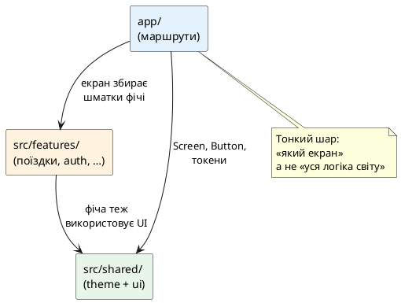

# Структура проєкту та перші UI-примітиви

::tip
**Код Nomad.** Наскрізний застосунок курсу живе в окремому репозиторії: [https://github.com/arakviel/nomad](https://github.com/arakviel/nomad). Клонуйте його поруч із навчанням (`git clone https://github.com/arakviel/nomad.git`). Кожен коміт у тому репо відповідає статті (`Material: …` у тілі коміту). У monorepo kostyl.dev лише **матеріали** курсу (markdown); код застосунку — у репозиторії Nomad вище.
::

## Навіщо ця стаття

У попередньому матеріалі проєкт **запускається**: є [Nomad](https://github.com/arakviel/nomad), Metro, екран у Expo Go. Шаблон `create-expo-app` уже містить файли — інколи в корені, інколи з папкою `app/` для навігації. Якщо лишити все «як вийшло з генератора» і далі кидати нові екрани в одну купу, через кілька тижнів з’являться типові проблеми:

- незрозуміло, **де** лежить логіка поїздок, а де — кнопки загального вигляду;
- кольори й відступи **скопичені** в десятках файлів (`#3B82F6`, `padding: 16` усюди);
- той самий стиль кнопки скопійовано тричі з дрібними відмінностями;
- імпорти виглядають як `../../../components/Button`.

Мета цієї статті — закласти **просту, розжовану** структуру, якої вистачить на весь курс Nomad, без надмірної «ентерпрайз-архітектури» в перший тиждень.

::note
**Головна думка.** Папка `app/` відповідає за **маршрути** (які екрани є в застосунку). Папка `src/` — за **зміст** (фічі, спільний UI, тема). Екран у `app/` має бути тонким: зібрати готові шматки з `src/`, а не містити всю бізнес-логіку в одному файлі на 800 рядків.
::

Після статті:

1. У [Nomad](https://github.com/arakviel/nomad) з’явиться узгоджена структура папок.  
2. З’являться **design tokens** (словник кольорів, відступів, шрифтів).  
3. З’являться примітиви **`Screen`**, **`AppText`**, **`Button`**.  
4. Буде зрозуміло, навіщо файли `.ios.tsx` / `.android.tsx`.  
5. Міні-проєкт «Візитка» закріпить ідею **окремо** від Nomad.  
6. Git-коміт: `feat: design tokens and base UI primitives`.

Глибока навігація (таби, стеки, deep links) — у модулі навігації. Тут Router згадується лише настільки, щоб зрозуміти роль `app/`.

::tip
**Живі прев’ю в статті.** Нижче поруч із кодом примітивів стоїть компонент `::react-native-preview`: у рамці телефону рендериться **react-native-web** (не справжній симулятор iOS/Android). Імпорти з `@/…`, Expo Router і пакети `expo-*` у прев’ю **не працюють** — тому демо зібрані **самодостатнім** TSX (токени «вшиті» в файл). У реальному [Nomad](https://github.com/arakviel/nomad) ви пишете той самий UI через `tokens` і `@/shared/ui`.
::

---

## Дві моделі розкладки (і що обирає курс)

### За шарами (layer-based)

```text
components/
screens/
hooks/
services/
```

Усе «кнопкове» в одному місці, усі екрани — в іншому. На старті просто. Коли фіч багато, папка `components/` перетворюється на звалище з сотнею файлів без зв’язку «що до чого належить».

### За фічами (feature-based)

```text
features/
  trips/
    ui/
    model/
  auth/
    ui/
    model/
shared/
  ui/
  theme/
```

Код **поїздок** лежить поруч (екранні шматки, типи, локальна логіка). Спільне (кнопка, тема) — у `shared/`.

::tip
**Аналогія.** Шари — як розкласти речі за типом: «усі викрутки в одній шухляді». Фічі — як розкласти за кімнатами: «усе для кухні разом, усе для ванної — разом, а універсальний інструмент — у спільній шафі». Для продукту з кількома доменами (поїздки, місця, профіль) зручніша друга схема.
::

**Курс:** гібрид, який добре лягає на Expo Router:

- `app/` — лише маршрути (тонка оболонка);
- `src/features/` — код фіч;
- `src/shared/` — тема, UI-примітиви, утиліти.

---

## Цільова структура [Nomad](https://github.com/arakviel/nomad)

Точні імена файлів у шаблоні Expo можуть трохи відрізнятися. Нижче — **ціль**, до якої варто привести проєкт після цієї статті. Компонент `::code-tree` будує дерево **автоматично** з шляхів у квадратних дужках у кожного блоку коду (не з ASCII-гілок `├──`).

Репозиторій: [https://github.com/arakviel/nomad](https://github.com/arakviel/nomad). У дереві нижче — шляхи **від кореня клону**.

::code-tree

```tsx [app/_layout.tsx]
// Кореневий layout — обгортка всіх екранів (Stack / провайдери).
// Вміст залежить від шаблону Expo Router; не видаляйте обгортку Router.
```

```tsx [app/index.tsx]
// Домашній маршрут «/» — тонкий екран, збирає UI з src/shared.
```

```text [src/features/trips/.gitkeep]
# Заготовка фічі «поїздки». Логіку додамо в наступних статтях.
```

```ts [src/shared/theme/tokens.ts]
// Design tokens: кольори, відступи, радіуси, розміри шрифтів.
// Повний вміст — у розділі про tokens нижче.
```

```ts [src/shared/theme/index.ts]
// export { tokens } from './tokens';
```

```tsx [src/shared/ui/Screen.tsx]
// Обгортка екрана: фон, padding, flex: 1.
```

```tsx [src/shared/ui/AppText.tsx]
// Текст із варіантами title / body / caption.
```

```tsx [src/shared/ui/Button.tsx]
// Кнопка на Pressable + токени.
```

```ts [src/shared/ui/index.ts]
// export { Screen, AppText, Button } from '…';
```

```json [app.json]
// Паспорт Expo (або app.config.ts): name, slug, icon, splash.
```

```json [package.json]
// Залежності та scripts (expo start тощо).
```

```json [tsconfig.json]
// extends expo/tsconfig.base + paths "@/*" → "./src/*"
```

```json [.vscode/extensions.json]
// За бажанням: recommendations з попередньої статті.
```

::

::tip
Кожен файл у `::code-tree` — окремий fenced-блок: мова підсвітки + шлях у `[дужках]`. Переглядач покаже дерево зліва й вміст вибраного файлу справа. Повні реалізації `tokens`, `Screen`, `AppText`, `Button` наведені **окремими** лістингами в наступних розділах (щоб дерево лишалось оглядовим).
::

::field-group

::field{name="app/" type="маршрути"}
У **Expo Router** файли тут стають **екранами** застосунку. `app/index.tsx` — початковий екран. `app/_layout.tsx` — спільна обгортка (провайдери, загальний стек). Детальні правила імен — у статті про Router; зараз не роздувайте дерево маршрутів.
::

::field{name="src/features/" type="фічі"}
Кожна велика тема продукту (поїздки, автентифікація, карта) отримає свою підпапку. На цьому кроці достатньо завести `trips/` як заготовку — логіку поїздок додасте пізніше.
::

::field{name="src/shared/theme/" type="тема"}
Єдине місце чисел і кольорів. Екрани **не** вигадують `#2563eb` щоразу — беруть `tokens.colors.primary`.
::

::field{name="src/shared/ui/" type="примітиви"}
Маленькі будівельні блоки без бізнес-смислу «поїздка»: екран-обгортка, текст, кнопка.
::

::field{name="assets/" type="файли"}
Іконки, splash, зображення. Не змішувати з TypeScript-логікою.
::

::

::plant-uml



::

---

## Псевдоніми імпортів (`@/…`)

Щоб не писати `../../../../shared/ui/Button`, у TypeScript налаштовують **path alias** (псевдонім шляху).

Відкрийте `tsconfig.json` у [Nomad](https://github.com/arakviel/nomad). Зазвичай він уже має `"extends": "expo/tsconfig.base"`. Додайте (або узгодьте) шляхи до `src`:

```json
{
  "extends": "expo/tsconfig.base",
  "compilerOptions": {
    "strict": true,
    "paths": {
      "@/*": ["./src/*"]
    }
  },
  "include": ["**/*.ts", "**/*.tsx", ".expo/types/**/*.ts", "expo-env.d.ts"]
}
```

Тоді імпорт виглядає так:

```typescript
import { Button } from '@/shared/ui/Button';
import { tokens } from '@/shared/theme';
```

::steps

### Зберегти tsconfig.json

### Перезапустити TypeScript-сервер у VS Code

Command Palette → **TypeScript: Restart TS Server** (інколи достатньо закрити/відкрити файл).

### Перезапустити Metro за потреби

Якщо збирач «не бачить» аліас: зупинити `expo start` і знову `npx expo start`. У сучасних шаблонах Expo аліаси з `tsconfig` зазвичай підхоплюються; якщо ні — перевірте документацію вашої версії SDK щодо `experiments.tsconfigPaths` / налаштувань Metro.

::

::warning
Псевдонім `@/*` → `./src/*` означає, що файли **всередині `app/`** імпортують з `@/…`, але **самі** лежать не під `src/`. Це нормально: маршрути лишаються в `app/` за правилами Expo Router.
::

---

## Design tokens — словник вигляду

### Навіщо

Уявіть, що «основний синій» записаний у двадцяти файлах. Дизайнер просить зробити бренд **трохи темнішим** — доведеться шукати двадцять місць і помилитися в половині.

**Design tokens** (токени дизайну) — іменовані значення: колір, відступ, розмір шрифту, радіус скруглення. Змінили токен — оновився весь UI, який на нього посилається.

### Файл токенів

Створіть `src/shared/theme/tokens.ts`:

```typescript
export const tokens = {
  colors: {
    background: '#F8FAFC',
    surface: '#FFFFFF',
    text: '#0F172A',
    textSecondary: '#64748B',
    primary: '#2563EB',
    primaryPressed: '#1D4ED8',
    border: '#E2E8F0',
    danger: '#DC2626',
    onPrimary: '#FFFFFF',
  },
  spacing: {
    xs: 4,
    sm: 8,
    md: 16,
    lg: 24,
    xl: 32,
  },
  radius: {
    sm: 8,
    md: 12,
    lg: 16,
  },
  fontSize: {
    sm: 14,
    md: 16,
    lg: 20,
    xl: 28,
  },
} as const;

export type Tokens = typeof tokens;
```

::field-group

::field{name="colors" type="колір"}
Не «синій1 / синій2», а **роль**: `primary` (головна дія), `text` (основний текст), `background` (фон екрана). Ролі легше міняти під темну тему пізніше.
::

::field{name="spacing" type="відступи"}
Сходинка 4 / 8 / 16 / 24… замість випадкових `13` і `17`. Око сприймає ритм спокійніше.
::

::field{name="as const" type="TypeScript"}
Зафіксувати літеральні типи значень. Підказки в IDE стають точнішими.
::

::

Експорт з `src/shared/theme/index.ts`:

```typescript
export { tokens } from './tokens';
export type { Tokens } from './tokens';
```

::tip
Поки **не** обов’язково підключати темну тему й контекст. Достатньо одного набору токенів. Темну тему курс торкнеться в статті про StyleSheet і темизацію.
::

---

## Примітив `Screen` — рамка екрана

Майже кожен екран потребує:

- безпечних відступів від «чубчика» й домашньої смужки (пізніше поглибимо **Safe Area**);
- фонового кольору;
- горизонтальних полів.

Поки зробимо просту обгортку на `View` + padding з токенів. Safe Area підключимо свідомо в UI-модулі; зараз головне — **звичка** не дублювати фон у кожному файлі.

`src/shared/ui/Screen.tsx`:

```tsx
import { ReactNode } from 'react';
import { StyleSheet, View, ViewStyle } from 'react-native';

import { tokens } from '@/shared/theme';

type ScreenProps = {
  children: ReactNode;
  style?: ViewStyle;
};

export function Screen({ children, style }: ScreenProps) {
  return <View style={[styles.root, style]}>{children}</View>;
}

const styles = StyleSheet.create({
  root: {
    flex: 1,
    backgroundColor: tokens.colors.background,
    paddingHorizontal: tokens.spacing.md,
    paddingVertical: tokens.spacing.lg,
  },
});
```

::field-group

::field{name="children" type="ReactNode"}
Уміст екрана — заголовки, кнопки, списки — передається всередину обгортки.
::

::field{name="flex: 1" type="layout"}
Екран займає доступну висоту. Без цього фон часто «не дотягується» до низу на порожніх екранах.
::

::field{name="style?" type="опційно"}
Дозволяє рідкісний виняток (інший padding), не ламаючи значення за замовчуванням.
::

::

### Як це виглядає на екрані

Нижче — ідея `Screen`: фон, горизонтальні поля, `flex: 1`. У прев’ю токени записані літералами (у проєкті — `tokens.colors.background` тощо).

::react-native-preview{title="Screen — рамка екрана" device="iphone" filename="ScreenDemo.tsx"}

```tsx
import { View, Text, StyleSheet, useColorScheme } from 'react-native';

const tokens = {
  colors: {
    background: '#F8FAFC',
    text: '#0F172A',
    textSecondary: '#64748B',
    border: '#E2E8F0',
    surface: '#FFFFFF',
  },
  spacing: { xs: 4, sm: 8, md: 16, lg: 24 },
  radius: { md: 12 },
};

function Screen({ children }: { children: any }) {
  return <View style={styles.screen}>{children}</View>;
}

export default function App() {
  const scheme = useColorScheme();
  const isDark = scheme === 'dark';

  return (
    <Screen>
      <View
        style={[
          styles.panel,
          {
            backgroundColor: isDark ? '#1c1c1e' : tokens.colors.surface,
            borderColor: isDark ? '#3a3a3c' : tokens.colors.border,
          },
        ]}
      >
        <Text style={[styles.title, { color: isDark ? '#f5f5f7' : tokens.colors.text }]}>
          Screen
        </Text>
        <Text style={[styles.body, { color: isDark ? '#a1a1aa' : tokens.colors.textSecondary }]}>
          Фон, padding і flex: 1 — одна обгортка на всі екрани. Вміст (заголовки, кнопки, списки)
          передається як children.
        </Text>
      </View>
    </Screen>
  );
}

const styles = StyleSheet.create({
  screen: {
    flex: 1,
    backgroundColor: tokens.colors.background,
    paddingHorizontal: tokens.spacing.md,
    paddingVertical: tokens.spacing.lg,
  },
  panel: {
    borderRadius: tokens.radius.md,
    borderWidth: 1,
    padding: tokens.spacing.md,
    gap: tokens.spacing.sm,
  },
  title: {
    fontSize: 22,
    fontWeight: '700',
  },
  body: {
    fontSize: 15,
    lineHeight: 22,
  },
});
```

::

---

## Примітив `AppText` — текст з правилами

У React Native **не можна** покласти рядок просто в `View`, як у `div` у вебі — потрібен компонент **`Text`**. Якщо в кожному місці писати свій `fontSize` і колір, ритм типографіки роз’їдеться.

`src/shared/ui/AppText.tsx`:

```tsx
import { ReactNode } from 'react';
import { StyleSheet, Text, TextProps, TextStyle } from 'react-native';

import { tokens } from '@/shared/theme';

type AppTextVariant = 'body' | 'title' | 'subtitle' | 'caption';

type AppTextProps = TextProps & {
  children: ReactNode;
  variant?: AppTextVariant;
  color?: string;
  style?: TextStyle;
};

export function AppText({
  children,
  variant = 'body',
  color = tokens.colors.text,
  style,
  ...rest
}: AppTextProps) {
  return (
    <Text style={[styles.base, styles[variant], { color }, style]} {...rest}>
      {children}
    </Text>
  );
}

const styles = StyleSheet.create({
  base: {
    color: tokens.colors.text,
  },
  body: {
    fontSize: tokens.fontSize.md,
    lineHeight: 24,
  },
  title: {
    fontSize: tokens.fontSize.xl,
    fontWeight: '700',
    lineHeight: 34,
  },
  subtitle: {
    fontSize: tokens.fontSize.lg,
    fontWeight: '600',
    lineHeight: 28,
  },
  caption: {
    fontSize: tokens.fontSize.sm,
    color: tokens.colors.textSecondary,
    lineHeight: 20,
  },
});
```

::note
Назва **`AppText`**, а не `Text`, щоб не плутати з імпортом з `react-native` і одразу бачити в коді: «це наш узгоджений текст».
::

### Варіанти типографіки вживу

Чотири ролі поруч: `title`, `subtitle`, `body`, `caption`. У проєкті це один компонент `AppText` з пропом `variant`.

::react-native-preview{title="AppText — варіанти" device="iphone" filename="AppTextDemo.tsx"}

```tsx
import { View, Text, StyleSheet, useColorScheme } from 'react-native';

const tokens = {
  colors: {
    background: '#F8FAFC',
    text: '#0F172A',
    textSecondary: '#64748B',
  },
  spacing: { xs: 4, sm: 8, md: 16, lg: 24 },
  fontSize: { sm: 14, md: 16, lg: 20, xl: 28 },
};

type Variant = 'title' | 'subtitle' | 'body' | 'caption';

function AppText({
  children,
  variant = 'body',
  color,
}: {
  children: any;
  variant?: Variant;
  color?: string;
}) {
  return (
    <Text style={[styles.base, styles[variant], color ? { color } : null]}>{children}</Text>
  );
}

export default function App() {
  const scheme = useColorScheme();
  const isDark = scheme === 'dark';
  const text = isDark ? '#f5f5f7' : tokens.colors.text;
  const muted = isDark ? '#a1a1aa' : tokens.colors.textSecondary;

  return (
    <View style={[styles.screen, isDark && { backgroundColor: '#000' }]}>
      <AppText variant="title" color={text}>
        Мандрівник
      </AppText>
      <AppText variant="subtitle" color={text}>
        Карпати на вихідні
      </AppText>
      <AppText variant="body" color={text}>
        Основний абзац екрана: опис поїздки, інструкції, підказки. Розмір і міжрядковий інтервал
        узгоджені з tokens.
      </AppText>
      <AppText variant="caption" color={muted}>
        12–14 бер. 2026 · підпис / метадані
      </AppText>
    </View>
  );
}

const styles = StyleSheet.create({
  screen: {
    flex: 1,
    backgroundColor: tokens.colors.background,
    padding: tokens.spacing.lg,
    gap: tokens.spacing.sm,
    justifyContent: 'center',
  },
  base: {
    color: tokens.colors.text,
  },
  title: {
    fontSize: tokens.fontSize.xl,
    fontWeight: '700',
    lineHeight: 34,
  },
  subtitle: {
    fontSize: tokens.fontSize.lg,
    fontWeight: '600',
    lineHeight: 28,
  },
  body: {
    fontSize: tokens.fontSize.md,
    lineHeight: 24,
    marginTop: tokens.spacing.sm,
  },
  caption: {
    fontSize: tokens.fontSize.sm,
    lineHeight: 20,
    marginTop: tokens.spacing.xs,
  },
});
```

::

---

## Примітив `Button` — головна дія

Кнопка — місце, де найчастіше роз’їжджаються відступи й кольори. Зробимо простий варіант на **`Pressable`** (сучасніший за старі `TouchableOpacity` для нових екранів; деталі жестів — пізніше).

`src/shared/ui/Button.tsx`:

```tsx
import { Pressable, StyleSheet, Text, ViewStyle } from 'react-native';

import { tokens } from '@/shared/theme';

type ButtonProps = {
  label: string;
  onPress: () => void;
  disabled?: boolean;
  style?: ViewStyle;
};

export function Button({ label, onPress, disabled = false, style }: ButtonProps) {
  return (
    <Pressable
      accessibilityRole="button"
      disabled={disabled}
      onPress={onPress}
      style={({ pressed }) => [
        styles.base,
        pressed && !disabled ? styles.pressed : null,
        disabled ? styles.disabled : null,
        style,
      ]}
    >
      <Text style={styles.label}>{label}</Text>
    </Pressable>
  );
}

const styles = StyleSheet.create({
  base: {
    backgroundColor: tokens.colors.primary,
    paddingVertical: tokens.spacing.sm + 4,
    paddingHorizontal: tokens.spacing.md,
    borderRadius: tokens.radius.md,
    alignItems: 'center',
  },
  pressed: {
    backgroundColor: tokens.colors.primaryPressed,
  },
  disabled: {
    opacity: 0.5,
  },
  label: {
    color: tokens.colors.onPrimary,
    fontSize: tokens.fontSize.md,
    fontWeight: '600',
  },
});
```

::field-group

::field{name="label" type="string"}
Текст кнопки українською, наприклад «Нова поїздка». Поки рядок передається пропсом; винесення всіх рядків у словник i18n — пізніше.
::

::field{name="accessibilityRole" type="a11y"}
Підказка для скрінрідера: це кнопка. Повний прохід доступності — в окремій статті; звичка ставити роль — корисна з першого примітива.
::

::field{name="pressed" type="стан Pressable"}
Функція в `style` отримує, чи палець зараз натиснутий — можна змінити колір без окремого state.
::

::

За бажанням `src/shared/ui/index.ts`:

```typescript
export { AppText } from './AppText';
export { Button } from './Button';
export { Screen } from './Screen';
```

### Кнопка вживу: primary, pressed, disabled

Натисніть «Нова поїздка» — лічильник і колір покажуть `pressed`. Друга кнопка навмисно `disabled`.

::react-native-preview{title="Button — Pressable + tokens" device="android" filename="ButtonDemo.tsx"}

```tsx
import { useState } from 'react';
import { View, Text, Pressable, StyleSheet, useColorScheme } from 'react-native';

const tokens = {
  colors: {
    background: '#F8FAFC',
    text: '#0F172A',
    textSecondary: '#64748B',
    primary: '#2563EB',
    primaryPressed: '#1D4ED8',
    onPrimary: '#FFFFFF',
  },
  spacing: { sm: 8, md: 16, lg: 24 },
  radius: { md: 12 },
  fontSize: { md: 16 },
};

function Button({
  label,
  onPress,
  disabled = false,
}: {
  label: string;
  onPress: () => void;
  disabled?: boolean;
}) {
  return (
    <Pressable
      accessibilityRole="button"
      disabled={disabled}
      onPress={onPress}
      style={({ pressed }) => [
        styles.base,
        pressed && !disabled ? styles.pressed : null,
        disabled ? styles.disabled : null,
      ]}
    >
      <Text style={styles.label}>{label}</Text>
    </Pressable>
  );
}

export default function App() {
  const [taps, setTaps] = useState(0);
  const scheme = useColorScheme();
  const isDark = scheme === 'dark';

  return (
    <View style={[styles.screen, isDark && { backgroundColor: '#000' }]}>
      <Text style={[styles.heading, { color: isDark ? '#f5f5f7' : tokens.colors.text }]}>
        Натискань: {taps}
      </Text>
      <Text style={[styles.hint, { color: isDark ? '#a1a1aa' : tokens.colors.textSecondary }]}>
        style як функція від {'{ pressed }'} — без окремого useState для «втоплення».
      </Text>
      <Button label="Нова поїздка" onPress={() => setTaps((n) => n + 1)} />
      <Button label="Недоступно" onPress={() => {}} disabled />
    </View>
  );
}

const styles = StyleSheet.create({
  screen: {
    flex: 1,
    backgroundColor: tokens.colors.background,
    padding: tokens.spacing.lg,
    justifyContent: 'center',
    gap: tokens.spacing.md,
  },
  heading: {
    fontSize: 28,
    fontWeight: '700',
  },
  hint: {
    fontSize: 14,
    lineHeight: 20,
    marginBottom: tokens.spacing.sm,
  },
  base: {
    backgroundColor: tokens.colors.primary,
    paddingVertical: tokens.spacing.sm + 4,
    paddingHorizontal: tokens.spacing.md,
    borderRadius: tokens.radius.md,
    alignItems: 'center',
  },
  pressed: {
    backgroundColor: tokens.colors.primaryPressed,
  },
  disabled: {
    opacity: 0.5,
  },
  label: {
    color: tokens.colors.onPrimary,
    fontSize: tokens.fontSize.md,
    fontWeight: '600',
  },
});
```

::

---

## Зібрати домашній екран Nomad

Оновіть `app/index.tsx` (шлях може бути `app/(tabs)/index.tsx` у вашому шаблоні — важливий **домашній** екран). Мета: тонкий маршрут + примітиви + українські рядки.

```tsx
import { StyleSheet, View } from 'react-native';

import { tokens } from '@/shared/theme';
import { AppText, Button, Screen } from '@/shared/ui';

export default function HomeScreen() {
  return (
    <Screen>
      <View style={styles.header}>
        <AppText variant="title">Мандрівник</AppText>
        <AppText variant="caption" style={styles.caption}>
          Щоденник подорожей
        </AppText>
      </View>

      <AppText style={styles.body}>
        Тут згодом зʼявиться список поїздок. Зараз закладаємо структуру проєкту та спільні
        компоненти.
      </AppText>

      <Button
        label="Нова поїздка"
        onPress={() => {
          // Навігацію на форму додамо в модулі Router
          console.log('TODO: відкрити створення поїздки');
        }}
      />
    </Screen>
  );
}

const styles = StyleSheet.create({
  header: {
    marginBottom: tokens.spacing.lg,
    gap: tokens.spacing.xs,
  },
  caption: {
    marginTop: tokens.spacing.xs,
  },
  body: {
    marginBottom: tokens.spacing.lg,
  },
});
```

::steps

### Зберегти файли theme та ui

### Переконатися, що `@/` резолвиться

### Запустити `npx expo start` у [Nomad](https://github.com/arakviel/nomad)

### Перевірити екран

Має бути заголовок «Мандрівник», підзаголовок, абзац і синя кнопка. Натискання пише в терминал Metro `TODO: …`.

::

### Прев’ю домашнього екрана (самодостатній демо-файл)

У [Nomad](https://github.com/arakviel/nomad) імпорти йдуть з `@/shared/ui`. Нижче — **той самий вигляд**, зібраний у одному файлі, щоб побачити результат без запуску Metro.

::react-native-preview{title="Nomad Home — примітиви разом" device="iphone" filename="HomeScreen.tsx"}

```tsx
import { useState } from 'react';
import { View, Text, Pressable, StyleSheet, useColorScheme } from 'react-native';

const tokens = {
  colors: {
    background: '#F8FAFC',
    text: '#0F172A',
    textSecondary: '#64748B',
    primary: '#2563EB',
    primaryPressed: '#1D4ED8',
    onPrimary: '#FFFFFF',
  },
  spacing: { xs: 4, sm: 8, md: 16, lg: 24 },
  radius: { md: 12 },
  fontSize: { sm: 14, md: 16, xl: 28 },
};

function Screen({ children }: { children: any }) {
  return <View style={styles.screen}>{children}</View>;
}

function AppText({
  children,
  variant = 'body',
  style,
}: {
  children: any;
  variant?: 'title' | 'body' | 'caption';
  style?: object;
}) {
  return <Text style={[styles.textBase, styles[variant], style]}>{children}</Text>;
}

function Button({ label, onPress }: { label: string; onPress: () => void }) {
  return (
    <Pressable
      accessibilityRole="button"
      onPress={onPress}
      style={({ pressed }) => [styles.btn, pressed && styles.btnPressed]}
    >
      <Text style={styles.btnLabel}>{label}</Text>
    </Pressable>
  );
}

export default function App() {
  const [log, setLog] = useState('Очікуємо дію…');
  const scheme = useColorScheme();
  const isDark = scheme === 'dark';
  const text = isDark ? '#f5f5f7' : tokens.colors.text;
  const muted = isDark ? '#a1a1aa' : tokens.colors.textSecondary;

  return (
    <Screen>
      <View style={styles.header}>
        <AppText variant="title" style={{ color: text }}>
          Мандрівник
        </AppText>
        <AppText variant="caption" style={{ color: muted }}>
          Щоденник подорожей
        </AppText>
      </View>

      <AppText variant="body" style={{ color: text, marginBottom: tokens.spacing.lg }}>
        Тут згодом зʼявиться список поїздок. Зараз закладаємо структуру проєкту та спільні
        компоненти.
      </AppText>

      <Button
        label="Нова поїздка"
        onPress={() => setLog('TODO: відкрити створення поїздки')}
      />

      <Text style={[styles.log, { color: muted }]}>{log}</Text>
    </Screen>
  );
}

const styles = StyleSheet.create({
  screen: {
    flex: 1,
    backgroundColor: tokens.colors.background,
    paddingHorizontal: tokens.spacing.md,
    paddingVertical: tokens.spacing.lg,
  },
  header: {
    marginBottom: tokens.spacing.lg,
    gap: tokens.spacing.xs,
  },
  textBase: {
    color: tokens.colors.text,
  },
  title: {
    fontSize: tokens.fontSize.xl,
    fontWeight: '700',
    lineHeight: 34,
  },
  body: {
    fontSize: tokens.fontSize.md,
    lineHeight: 24,
  },
  caption: {
    fontSize: tokens.fontSize.sm,
    lineHeight: 20,
  },
  btn: {
    backgroundColor: tokens.colors.primary,
    paddingVertical: 12,
    paddingHorizontal: tokens.spacing.md,
    borderRadius: tokens.radius.md,
    alignItems: 'center',
  },
  btnPressed: {
    backgroundColor: tokens.colors.primaryPressed,
  },
  btnLabel: {
    color: tokens.colors.onPrimary,
    fontSize: tokens.fontSize.md,
    fontWeight: '600',
  },
  log: {
    marginTop: tokens.spacing.md,
    fontSize: 12,
    fontFamily: 'monospace',
  },
});
```

::

::warning
Якщо TypeScript скаржиться на `@/…`, перевірте `paths` у `tsconfig.json` і що файли справді лежать під `src/shared/...`, а не під `shared/` у корені за звичкою з іншого шаблону.
::

Кореневий `app/_layout.tsx` поки можна лишити близьким до шаблону. Головне — не видалити обгортку Router. Якщо в layout є Stack/Tabs з шаблону — не ламайте навігацію; змінюєте насамперед **вміст** домашнього екрана.

---

## Платформні відмінності: `.ios.tsx` і `.android.tsx`

Інколи один і той самий компонент на iPhone і Android має **різну** реалізацію (рідко на старті, частіше з нативними модулями). React Native уміє підставити файл за суфіксом:

| Файл | Коли береться |
| ---- | ------------- |
| `Button.ios.tsx` | збірка під iOS |
| `Button.android.tsx` | збірка під Android |
| `Button.tsx` | запасний / спільний варіант |
| `Button.native.tsx` | будь-яка нативна платформа (не web) |

Імпорт лишається:

```typescript
import { Button } from '@/shared/ui/Button';
```

Збирач сам обере суфікс.

::note
**На цьому кроці курсу** окремі `.ios` / `.android` файли **не обов’язкові**. Достатньо знати механізм, щоб не здивуватися в чужому репозиторії. Для Nomad поки один `Button.tsx` на обидві платформи.
::

Також існує об’єкт `Platform` з `react-native` (`Platform.OS === 'ios'`). Дрібні відмінності (один відступ) часто роблять через `Platform.select`, а не через два файли. Порівняння підходів — у статті про базові компоненти.

---

## Що не класти в `app/`

::card-group

::card{title="Великі форми й бізнес-логіка" icon="i-lucide-blocks"}
Краще `src/features/trips/ui/TripForm.tsx`, а в `app/` — кілька рядків імпорту й рендеру.
::

::card{title="Токени й кнопки" icon="i-lucide-palette"}
Тільки `src/shared/…`. Інакше фіча «поїздки» потягне за собою чужі кольори.
::

::card{title="Секрети API" icon="i-lucide-key-round"}
Не в коміти. Пізніше — змінні оточення; зараз секретів ще немає.
::

::

---

## Міні-проєкт «від А до Я»: Візитка

### Мета

Окремий маленький застосунок **`projects/business-card`** (не змішувати з Nomad), щоб закріпити:

- tokens;
- `Screen` / `AppText` / `Button`;
- **два** екрани-заглушки без глибокої навігації (два файли маршрутів або два простих екрани в Router).

### Сценарій продукту

Екран 1 — **візитка**: ім’я, роль, коротка біо.  
Екран 2 — **контакти**: email / телефон як текст (без реальної інтеграції).  
Кнопка «Контакти» на першому екрані веде на другий (через `router.push` з `expo-router` — мінімум API; якщо Router лякає, зробіть два проєкти blank… але краще один проєкт з `app/index.tsx` і `app/contacts.tsx`).

### Кроки

::steps

### Створити проєкт

```bash
cd /path/to  # поруч: git clone https://github.com/arakviel/nomad.git
npx create-expo-app@latest business-card
cd business-card
```

### Додати `src/shared/theme` і `src/shared/ui`

Можна **скопіювати** ідею токенів і примітивів з Nomad (навмисно повторити руками — краще, ніж copy-paste без читання).

### Налаштувати `@/*` → `./src/*` у tsconfig

### Зібрати `app/index.tsx` — візитка

Українською: ім’я, «Розробник інтерфейсів», кнопка «Контакти».

### Додати `app/contacts.tsx`

Текст контактів + кнопка «Назад» (`router.back()` з `expo-router`).

### Перевірити на пристрої / симуляторі

Обидва екрани відкриваються, стилі з токенів, без «сирих» `#ff0000` у JSX.

::

### Критерій «готово»

- Є `tokens.ts` і щонайменше три примітиви.  
- На екранах **немає** дубльованих hex-кольорів «від руки» (крім самого файлу токенів).  
- Два маршрути працюють.  
- Проєкт лежить у `projects/business-card`, Nomad не зламаний.

### Орієнтир вигляду (візитка)

У реальному міні-проєкті буде два **маршрути** (`index` / `contacts`) і `router.push`. Тут — один екран-візитка з кнопкою, яка «перемикає» вміст (імітація двох екранів без Router у прев’ю).

::react-native-preview{title="Візитка — Screen + tokens" device="iphone" filename="BusinessCard.tsx"}

```tsx
import { useState } from 'react';
import { View, Text, Pressable, StyleSheet, useColorScheme } from 'react-native';

const tokens = {
  colors: {
    background: '#F8FAFC',
    surface: '#FFFFFF',
    text: '#0F172A',
    textSecondary: '#64748B',
    primary: '#2563EB',
    primaryPressed: '#1D4ED8',
    onPrimary: '#FFFFFF',
    border: '#E2E8F0',
  },
  spacing: { xs: 4, sm: 8, md: 16, lg: 24 },
  radius: { md: 12, lg: 16 },
  fontSize: { sm: 14, md: 16, lg: 20, xl: 28 },
};

function Button({ label, onPress }: { label: string; onPress: () => void }) {
  return (
    <Pressable
      onPress={onPress}
      style={({ pressed }) => [styles.btn, pressed && styles.btnPressed]}
    >
      <Text style={styles.btnLabel}>{label}</Text>
    </Pressable>
  );
}

export default function App() {
  const [page, setPage] = useState<'card' | 'contacts'>('card');
  const scheme = useColorScheme();
  const isDark = scheme === 'dark';
  const text = isDark ? '#f5f5f7' : tokens.colors.text;
  const muted = isDark ? '#a1a1aa' : tokens.colors.textSecondary;
  const surface = isDark ? '#1c1c1e' : tokens.colors.surface;
  const border = isDark ? '#3a3a3c' : tokens.colors.border;

  return (
    <View style={[styles.screen, isDark && { backgroundColor: '#000' }]}>
      <View style={[styles.card, { backgroundColor: surface, borderColor: border }]}>
        {page === 'card' ? (
          <>
            <View style={styles.avatar}>
              <Text style={styles.avatarText}>ОМ</Text>
            </View>
            <Text style={[styles.name, { color: text }]}>Олена Мельник</Text>
            <Text style={[styles.role, { color: muted }]}>Розробниця інтерфейсів</Text>
            <Text style={[styles.bio, { color: text }]}>
              Роблю мобільні та веб-екрани, люблю чіткі tokens і спокійні відступи.
            </Text>
            <Button label="Контакти" onPress={() => setPage('contacts')} />
          </>
        ) : (
          <>
            <Text style={[styles.name, { color: text }]}>Контакти</Text>
            <Text style={[styles.bio, { color: text }]}>email: olena@example.com</Text>
            <Text style={[styles.bio, { color: text }]}>тел: +380 50 000 00 00</Text>
            <Text style={[styles.role, { color: muted }]}>
              У проєкті business-card це окремий маршрут app/contacts.tsx
            </Text>
            <Button label="Назад" onPress={() => setPage('card')} />
          </>
        )}
      </View>
    </View>
  );
}

const styles = StyleSheet.create({
  screen: {
    flex: 1,
    backgroundColor: tokens.colors.background,
    padding: tokens.spacing.lg,
    justifyContent: 'center',
  },
  card: {
    borderRadius: tokens.radius.lg,
    borderWidth: 1,
    padding: tokens.spacing.lg,
    gap: tokens.spacing.sm,
    alignItems: 'center',
  },
  avatar: {
    width: 72,
    height: 72,
    borderRadius: 36,
    backgroundColor: tokens.colors.primary,
    alignItems: 'center',
    justifyContent: 'center',
    marginBottom: tokens.spacing.sm,
  },
  avatarText: {
    color: '#fff',
    fontSize: 22,
    fontWeight: '700',
  },
  name: {
    fontSize: tokens.fontSize.xl,
    fontWeight: '700',
    textAlign: 'center',
  },
  role: {
    fontSize: tokens.fontSize.sm,
    textAlign: 'center',
  },
  bio: {
    fontSize: tokens.fontSize.md,
    lineHeight: 24,
    textAlign: 'center',
    marginVertical: tokens.spacing.sm,
  },
  btn: {
    marginTop: tokens.spacing.sm,
    alignSelf: 'stretch',
    backgroundColor: tokens.colors.primary,
    paddingVertical: 12,
    borderRadius: tokens.radius.md,
    alignItems: 'center',
  },
  btnPressed: {
    backgroundColor: tokens.colors.primaryPressed,
  },
  btnLabel: {
    color: tokens.colors.onPrimary,
    fontSize: tokens.fontSize.md,
    fontWeight: '600',
  },
});
```

::

::collapsible{title="Орієнтир самоперевірки (після власної спроби)"}

1. Кольори кнопок збігаються з `tokens.colors.primary`.  
2. Заголовки через `AppText variant="title"`.  
3. `Screen` задає фон і padding.  
4. Імпорти через `@/shared/...`.  
5. Перехід index → contacts → back без падіння.

::

---

## Nomad: коміт структури

У [Nomad](https://github.com/arakviel/nomad):

::steps

### Додати theme + ui + оновити домашній екран

Як у розділах вище.

### Прибрати очевидне сміття шаблону (обережно)

Не видаляйте те, чого не розумієте (особливо layout Router). Можна прибрати зайві демо-екрани шаблону **пізніше**, коли впевнитесь у навігації.

### Закомітити (у репозиторії Nomad)

```bash
cd /path/to/nomad
git add -A
git commit -m "$(cat <<'EOF'
feat: design tokens and base UI primitives

Material: content/15.react-native/05.project-structure-and-conventions.md
EOF
)"
git push
```


::

::note
Наступні статті надбудовуватимуть `src/features/trips` і маршрути. Якщо зараз покласти все в `app/index.tsx` без `shared/` — доведеться розгрібати борг уже на списках і формах. Референс у [Nomad](https://github.com/arakviel/nomad) у репозиторії курсу вже містить цей коміт.
::

---

## Підсумок

::steps

### `app/` — маршрути, тонкі екрани

### `src/features` — код фіч; `src/shared` — тема й UI

### Tokens — єдиний словник вигляду

### Screen, AppText, Button — перші цеглини

### `@/` — короткі імпорти

### Платформні суфікси — знати, не зловживати на старті

### Візитка — окремий тренажер; Nomad — основний продукт

::

Далі — **базові компоненти React Native** (`View`, `Text`, `Image`, `Pressable`, `ScrollView`) уже з глибшим розбором API, на фундаменті структури з цієї статті.

---

## Практичні завдання

### Базовий рівень

1. У [Nomad](https://github.com/arakviel/nomad) створити tokens + три примітиви + український домашній екран.  
2. Пояснити своїми словами різницю між `app/` і `src/shared/ui/`.  
3. Замінити один «магічний» відступ у своєму коді на `tokens.spacing.*`.

### Середній рівень

1. Виконати міні-проєкт **Візитка**.  
2. Додати в tokens ще одну роль кольору (наприклад `success`) і використати її в `AppText` або другорядній кнопці.  
3. Зробити `src/shared/ui/index.ts` і імпортувати примітиви одним рядком.

### Професійний рівень

1. Коротко (пів сторінки) порівняти feature-based і layer-based для команди з 5 людей.  
2. Додати другий варіант кнопки `variant: 'primary' | 'secondary'` без дублювання всього компонента.  
3. Налаштувати `.vscode/settings.json` у [Nomad](https://github.com/arakviel/nomad) з `typescript.tsdk` на проєктний TypeScript (з попередньої статті) і перевірити, що `@/` підсвічується без помилок.

---

## Часті запитання

::accordion

::accordion-item{label="Чи обов'язково саме src/, а не components/ у корені?" icon="i-lucide-circle-help"}
Ні, це угода курсу. Важливий **поділ** «маршрути / фічі / спільне». Якщо шаблон уже має іншу схему — можна адаптувати ідеї, але для матеріалів курсу орієнтир — `app/` + `src/`.
::

::accordion-item{label="Чому не styled-components / NativeWind одразу?" icon="i-lucide-circle-help"}
Спочатку StyleSheet і токени — щоб зрозуміти модель стилів RN. Інші підходи можна оцінити пізніше; у плані курсу глибокий NativeWind не є основним треком.
::

::accordion-item{label="Скільки примітивів робити наперед?" icon="i-lucide-circle-help"}
Рівно стільки, скільки вже болить. `Screen`, текст, кнопка — мінімум. Input, Card, ListRow — коли дійдете до форм і списків.
::

::accordion-item{label="Чи можна залишити демо-вкладки з шаблону Expo?" icon="i-lucide-circle-help"}
Тимчасово так. Коли дійдете до модуля навігації — свідомо зберіть дерево маршрутів Nomad і приберете зайве.
::

::
