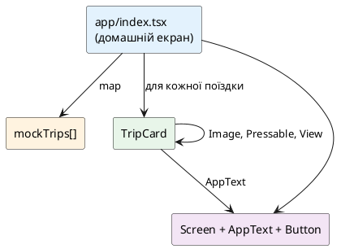

# Базові компоненти React Native

## Навіщо ця стаття

У попередніх матеріалах уже з’явилися `Screen`, `AppText` і `Button`. Під капотом вони зібрані з **базових** компонентів React Native. Тут ці «цеглини» розбираються окремо: що робить кожна, чим відрізняється від HTML, які типові помилки роблять люди з web-досвідом.

Після статті:

1. Зрозуміло, навіщо `View` і чому текст лише в `Text`.  
2. Як показати зображення (`Image`).  
3. Як реагувати на натискання (`Pressable`).  
4. Коли потрібен `ScrollView`, а коли ще рано (списки — окрема стаття).  
5. Що таке **safe area** і навіщо `Platform`.  
6. У **Nomad** — mock-картки поїздок на домашньому екрані.

::note
**Головна думка.** У браузері майже все — «коробка з вмістом» (`div`, `span`, `img`, `button`). У React Native **різні ролі розділені на різні компоненти**: контейнер (`View`), текст (`Text`), картинка (`Image`), зона натискання (`Pressable`). Змішати ролі «як у HTML» часто не виходить або дає попередження.
::

::tip
**Живі прев’ю.** У цій статті майже кожен примітив супроводжується `::react-native-preview` — рендер через **react-native-web** у рамці телефону. Це **не** симулятор iOS/Android: layout і core-компоненти близькі до нативу, але тіні, шрифти й native modules можуть відрізнятися. У прев’ю доступні лише `react` і `react-native` (без `@/…`, `expo-*`, Router).
::

---

## Місток з web React

| У браузері | У React Native | Коментар |
| ---------- | -------------- | -------- |
| `div`, `section`, `main` | `View` | Контейнер для layout, **без** тексту всередині «просто рядком» |
| `p`, `span`, `h1`… | `Text` | Усі видимі рядки для користувача |
| `img` | `Image` | Потрібні розміри / стиль; джерело — локальний файл або URI |
| `button`, `div onClick` | `Pressable` (або старі `Touchable*`) | `onPress`, не `onClick` |
| прокрутка сторінки | `ScrollView` / списки | Довгий контент не «їде» сам, як document |
| CSS `cursor`, hover | майже немає | Телефон — дотик, не миша |

::warning
**Найчастіша помилка після вебу.** Написати `{title}` або `'Привіт'` **безпосередньо** всередині `View`. У React Native рядок для UI має бути обгорнутий у `Text` (або в ваш `AppText`, який всередині використовує `Text`).
::

---

## `View` — контейнер layout

Офіційна ідея з [документації View](https://reactnative.dev/docs/view): **`View`** — найфундаментальніший компонент UI. Це контейнер, який підтримує:

- **layout** (у React Native — переважно Flexbox);
- **style** (фон, відступи, межі, прозорість…);
- частину **обробки дотиків** (responder-система; для кнопок у курсі беремо `Pressable`);
- **accessibility** (підказки для скрінрідера).

На нативній стороні `View` відповідає «рідному» контейнеру платформи (`UIView` на iOS, `android.view.View` на Android тощо). Компонент **розрахований на вкладеність**: у нього може бути від 0 до багатьох дітей будь-якого типу (інші `View`, `Text`, `Image`…).

::note
Документація радить стилізувати `View` через **`StyleSheet`** (ясність і дисципліна). Inline-стилі теж працюють, але в проєктах курсу — `StyleSheet.create` + tokens.
::

### Мінімальний приклад

Зовнішній `View` — рядок; внутрішні — кольорові квадрати; текст — **окремий** `Text`, не «рядок у View».

::react-native-preview{title="View — рядок коробок" device="iphone" filename="ViewRow.tsx"}

```tsx
import { View, Text, StyleSheet, useColorScheme } from 'react-native';

export default function App() {
  const scheme = useColorScheme();
  const isDark = scheme === 'dark';

  return (
    <View style={[styles.screen, isDark && { backgroundColor: '#000' }]}>
      <View style={styles.row}>
        <View style={[styles.box, { backgroundColor: '#2563EB' }]} />
        <View style={[styles.box, { backgroundColor: '#16A34A' }]} />
        <View style={[styles.box, { backgroundColor: '#DC2626' }]} />
        <Text style={{ color: isDark ? '#f5f5f7' : '#0f172a', fontSize: 16 }}>Підпис поруч</Text>
      </View>
      <Text style={[styles.hint, { color: isDark ? '#a1a1aa' : '#64748b' }]}>
        flexDirection: 'row' · gap: 8 · вкладені View
      </Text>
    </View>
  );
}

const styles = StyleSheet.create({
  screen: {
    flex: 1,
    justifyContent: 'center',
    backgroundColor: '#F8FAFC',
    padding: 24,
    gap: 16,
  },
  row: {
    flexDirection: 'row',
    alignItems: 'center',
    padding: 16,
    gap: 8,
    backgroundColor: 'rgba(37, 99, 235, 0.08)',
    borderRadius: 12,
  },
  box: {
    width: 40,
    height: 40,
    borderRadius: 8,
  },
  hint: {
    fontSize: 13,
  },
});
```

::

### Вкладеність: колонка, картка, «шапка»

`View` майже завжди **гніздиться**. Нижче — типова схема екрана: корінь → картка → шапка (рядок) + тіло.

::react-native-preview{title="View — вкладена картка" device="android" filename="ViewNesting.tsx"}

```tsx
import { View, Text, StyleSheet, useColorScheme } from 'react-native';

export default function App() {
  const scheme = useColorScheme();
  const isDark = scheme === 'dark';
  const text = isDark ? '#f5f5f7' : '#0f172a';
  const muted = isDark ? '#a1a1aa' : '#64748b';
  const surface = isDark ? '#1c1c1e' : '#fff';
  const border = isDark ? '#3a3a3c' : '#e2e8f0';

  return (
    <View style={[styles.screen, isDark && { backgroundColor: '#000' }]}>
      <View style={[styles.card, { backgroundColor: surface, borderColor: border }]}>
        <View style={styles.header}>
          <View style={styles.dot} />
          <Text style={[styles.title, { color: text }]}>Картка поїздки</Text>
        </View>
        <Text style={[styles.body, { color: muted }]}>
          Зовнішній View задає відступи екрана. Внутрішній — білу «картку». Ще один View у шапці
          тримає крапку й заголовок в один рядок.
        </Text>
      </View>
    </View>
  );
}

const styles = StyleSheet.create({
  screen: {
    flex: 1,
    backgroundColor: '#F8FAFC',
    padding: 20,
    justifyContent: 'center',
  },
  card: {
    borderRadius: 16,
    borderWidth: 1,
    padding: 16,
    gap: 12,
  },
  header: {
    flexDirection: 'row',
    alignItems: 'center',
    gap: 10,
  },
  dot: {
    width: 12,
    height: 12,
    borderRadius: 6,
    backgroundColor: '#2563EB',
  },
  title: {
    fontSize: 18,
    fontWeight: '700',
  },
  body: {
    fontSize: 15,
    lineHeight: 22,
  },
});
```

::

### Важливі props (не весь довідник)

Документація View містить довгий список props (accessibility, focus, responder…). Нижче — те, що **реально потрібно** на старті курсу.

::field-group

::field{name="style" type="ViewStyle | ViewStyle[]"}
Стилі контейнера. Масив стилів зливається зліва направо: пізніші перекривають попередні (`[styles.base, condition && styles.active]`).
::

::field{name="pointerEvents" type="'auto' | 'none' | 'box-none' | 'box-only'"}
Чи може цей `View` бути **ціллю** дотику.  
`auto` — так; `none` — ні (і діти теж «прозорі» для дотику в класичному сенсі); `box-none` — сам View не ловить, **діти** можуть; `box-only` — ловить лише «коробка», діти — ні. Корисно для оверлеїв і «дірявих» шарів.
::

::field{name="onLayout" type="(event) => void"}
Викликається після монтування й при зміні розміру/позиції. У `event.nativeEvent.layout` — `{ x, y, width, height }`. Зручно, коли треба виміряти блок (рідко на перших екранах).
::

::field{name="testID" type="string"}
Ідентифікатор для e2e-тестів (Maestro/Detox пізніше). Увага: у docs зазначено, що деякі props на кшталт `testID` / `nativeID` **вимикають** оптимізацію «layout-only view removal».
::

::field{name="collapsable" type="boolean (Android-орієнтована оптимізація)"}
Порожні «лише для layout» view інколи **прибирають** з нативного дерева. `collapsable={false}` залишає вузол, якщо він потрібен для вимірювань/рефів. За замовчуванням оптимізація увімкнена.
::

::field{name="hitSlop" type="Rect | number"}
Розширити **зону старту** дотику за межі видимого прямокутника (зручно для маленьких іконок). Зона **не** виходить за межі батька; при перекритті виграє z-index сусіда.
::

::field{name="accessible / accessibilityLabel / accessibilityRole" type="a11y"}
Чи елемент «видимий» для assistive tech, який текст озвучити, яку **роль** повідомити (`button`, `header`, `image`…). Повний прохід a11y — окрема стаття; звичка ставити label на інтерактив — уже зараз.
::

::field{name="removeClippedSubviews" type="boolean"}
Оптимізація для великих прокручуваних дерев: нативні дочірні view за межами екрана можуть відчіплятися. У docs є **попередження** про можливі баги з «зниклим» контентом — не вмикати навмання.
::

::

### Playground: як style-пропси змінюють `View`

Більшість «зовнішності» `View` задається не окремими HTML-атрибутами, а полем **`style`**. Нижче перемикайте варіанти — той самий синій блок змінює `flexDirection`, `borderRadius`, `opacity`, `padding`.

::react-native-preview{title="View style — варіанти props" device="iphone" filename="ViewPropsPlayground.tsx"}

```tsx
import { useState } from 'react';
import { View, Text, Pressable, StyleSheet, useColorScheme } from 'react-native';

type Dir = 'column' | 'row';
type Radius = 0 | 8 | 20 | 999;
type Opacity = 1 | 0.5 | 0.2;
type Pad = 4 | 12 | 24;

function Chip({
  label,
  active,
  onPress,
}: {
  label: string;
  active: boolean;
  onPress: () => void;
}) {
  return (
    <Pressable
      onPress={onPress}
      style={[styles.chip, active && styles.chipOn]}
    >
      <Text style={[styles.chipText, active && styles.chipTextOn]}>{label}</Text>
    </Pressable>
  );
}

export default function App() {
  const [dir, setDir] = useState<Dir>('column');
  const [radius, setRadius] = useState<Radius>(8);
  const [opacity, setOpacity] = useState<Opacity>(1);
  const [pad, setPad] = useState<Pad>(12);
  const scheme = useColorScheme();
  const isDark = scheme === 'dark';
  const text = isDark ? '#f5f5f7' : '#0f172a';
  const muted = isDark ? '#a1a1aa' : '#64748b';

  return (
    <View style={[styles.screen, isDark && { backgroundColor: '#000' }]}>
      <Text style={[styles.h, { color: text }]}>View · style playground</Text>

      <Text style={[styles.group, { color: muted }]}>flexDirection</Text>
      <View style={styles.row}>
        <Chip label="column" active={dir === 'column'} onPress={() => setDir('column')} />
        <Chip label="row" active={dir === 'row'} onPress={() => setDir('row')} />
      </View>

      <Text style={[styles.group, { color: muted }]}>borderRadius</Text>
      <View style={styles.row}>
        {([0, 8, 20, 999] as Radius[]).map((r) => (
          <Chip key={r} label={String(r)} active={radius === r} onPress={() => setRadius(r)} />
        ))}
      </View>

      <Text style={[styles.group, { color: muted }]}>opacity</Text>
      <View style={styles.row}>
        {([1, 0.5, 0.2] as Opacity[]).map((o) => (
          <Chip key={o} label={String(o)} active={opacity === o} onPress={() => setOpacity(o)} />
        ))}
      </View>

      <Text style={[styles.group, { color: muted }]}>padding</Text>
      <View style={styles.row}>
        {([4, 12, 24] as Pad[]).map((p) => (
          <Chip key={p} label={`${p}`} active={pad === p} onPress={() => setPad(p)} />
        ))}
      </View>

      <View
        style={[
          styles.demo,
          {
            flexDirection: dir,
            borderRadius: radius,
            opacity,
            padding: pad,
          },
        ]}
      >
        <View style={styles.childA} />
        <View style={styles.childB} />
        <Text style={styles.demoLabel}>A + B</Text>
      </View>

      <Text style={[styles.code, { color: muted }]}>
        {`flexDirection: '${dir}'\nborderRadius: ${radius}\nopacity: ${opacity}\npadding: ${pad}`}
      </Text>
    </View>
  );
}

const styles = StyleSheet.create({
  screen: {
    flex: 1,
    backgroundColor: '#F8FAFC',
    padding: 16,
    gap: 6,
  },
  h: { fontSize: 17, fontWeight: '700', marginBottom: 4 },
  group: { fontSize: 11, fontWeight: '600', marginTop: 6, textTransform: 'uppercase' },
  row: { flexDirection: 'row', flexWrap: 'wrap', gap: 6 },
  chip: {
    paddingHorizontal: 10,
    paddingVertical: 6,
    borderRadius: 8,
    backgroundColor: '#e2e8f0',
  },
  chipOn: { backgroundColor: '#2563EB' },
  chipText: { fontSize: 12, fontWeight: '600', color: '#0f172a' },
  chipTextOn: { color: '#fff' },
  demo: {
    marginTop: 12,
    backgroundColor: '#2563EB',
    minHeight: 100,
    alignItems: 'center',
    justifyContent: 'center',
    gap: 8,
  },
  childA: { width: 36, height: 36, backgroundColor: '#93c5fd', borderRadius: 4 },
  childB: { width: 36, height: 36, backgroundColor: '#fde68a', borderRadius: 4 },
  demoLabel: { color: '#fff', fontWeight: '700', fontSize: 12 },
  code: { marginTop: 8, fontSize: 11, fontFamily: 'monospace', lineHeight: 16 },
});
```

::

::tip
**Аналогія.** `View` — прозора коробка для зберігання: сама нічого не «говорить» користувачу текстом, але тримає форму layout. Усе, що треба **прочитати**, кладіть у `Text`. Props на кшталт `pointerEvents` / `testID` **не малюють** пікселі — вони впливають на дотик і тести. Зовнішність майже завжди = `style`.
::

::warning
Глибока **responder**-модель (`onStartShouldSetResponder`, `onResponderMove`…) у docs View описана для низькорівневих жестів. У курсі для кнопок і карток використовуємо **`Pressable`**, а не ручний responder на кожному `View`.
::

---

## `Text` — відображення тексту

За [документацією Text](https://reactnative.dev/docs/text): компонент для **показу тексту**. Підтримує вкладеність, стилі й навіть обробку натискань на самому тексті.

### Головне правило (strict isolation)

У React Native **не можна** покласти текстовий вузол безпосередньо в `View`. Лише обгортка `Text` (або ваш `AppText`):

```tsx
// ПОГАНО — runtime error / warning
<View>Привіт</View>

// ДОБРЕ
<View>
  <Text>Привіт</Text>
</View>
```

::react-native-preview{title="Text — лише всередині Text" device="iphone" filename="TextRule.tsx"}

```tsx
import { View, Text, StyleSheet, useColorScheme } from 'react-native';

export default function App() {
  const scheme = useColorScheme();
  const isDark = scheme === 'dark';

  return (
    <View style={[styles.screen, isDark && { backgroundColor: '#000' }]}>
      <View style={styles.ok}>
        <Text style={styles.okLabel}>ДОБРЕ</Text>
        <Text style={{ color: isDark ? '#f5f5f7' : '#0f172a', fontSize: 18 }}>
          Привіт з Text
        </Text>
      </View>
      <View style={styles.bad}>
        <Text style={styles.badLabel}>ПОГАНО (не робіть так)</Text>
        <Text style={{ color: '#7f1d1d', fontSize: 14, lineHeight: 20 }}>
          {'<View>Привіт</View>'} — рядок без Text → помилка / warning у RN
        </Text>
      </View>
    </View>
  );
}

const styles = StyleSheet.create({
  screen: {
    flex: 1,
    justifyContent: 'center',
    padding: 24,
    gap: 16,
    backgroundColor: '#F8FAFC',
  },
  ok: {
    backgroundColor: '#dcfce7',
    borderRadius: 12,
    padding: 16,
    gap: 8,
  },
  okLabel: {
    fontSize: 12,
    fontWeight: '700',
    color: '#166534',
  },
  bad: {
    backgroundColor: '#fee2e2',
    borderRadius: 12,
    padding: 16,
    gap: 8,
  },
  badLabel: {
    fontSize: 12,
    fontWeight: '700',
    color: '#991b1b',
  },
});
```

::

Це **навмисно суворіше**, ніж CSS inheritance у браузері. Офіційна мотивація (скорочено):

1. **Ізоляція компонентів** — вигляд не повинен «витікати» з батьків через успадкований font, інакше компонент поводиться по-різному в різних місцях.  
2. **Простіша реалізація** — не треба тягнути `fontFamily` через усе дерево view.

Практичний висновок docs: зробіть свій **`MyAppText` / `AppText`** із базовими стилями й використовуйте його скрізь (саме так у Nomad).

### Вкладений текст (nested text)

На iOS/Android форматований рядок (bold + color) — це нативні attributed/spannable strings. У RN обрали **веб-парадигму**: вкладені `<Text>`:

```tsx
<Text style={{ fontWeight: 'bold' }}>
  Я жирний{' '}
  <Text style={{ color: 'red' }}>і червоний</Text>
</Text>
```

Під капотом це зводиться до одного нативного текстового блоку з діапазонами стилів.

::react-native-preview{title="Text — nested styles" device="iphone" filename="NestedText.tsx"}

```tsx
import { View, Text, StyleSheet, useColorScheme } from 'react-native';

export default function App() {
  const scheme = useColorScheme();
  const isDark = scheme === 'dark';
  const text = isDark ? '#f5f5f7' : '#0f172a';

  return (
    <View style={[styles.screen, isDark && { backgroundColor: '#000' }]}>
      <Text style={[styles.line, { color: text }]}>
        Я <Text style={{ fontWeight: '700' }}>жирний</Text>
        {' і '}
        <Text style={{ color: '#DC2626' }}>червоний</Text>
        {', а ще '}
        <Text style={{ color: '#2563EB', textDecorationLine: 'underline' }}>посилання</Text>.
      </Text>
    </View>
  );
}

const styles = StyleSheet.create({
  screen: {
    flex: 1,
    justifyContent: 'center',
    padding: 24,
    backgroundColor: '#F8FAFC',
  },
  line: {
    fontSize: 20,
    lineHeight: 30,
  },
});
```

::

### Text усередині Text vs Text усередині View

| Контейнер | Поведінка |
| --------- | --------- |
| `<Text><Text>A</Text><Text>B</Text></Text>` | Текст **inline**: «A» і «B» течуть одним потоком, переносяться як один абзац |
| `<View><Text>A</Text><Text>B</Text></View>` | Кожен `Text` — **окремий блок** (як два абзаци / два flex-елементи) |

Це критично для підписів «ціна · залишок» vs два рядки одне під одним.

::react-native-preview{title="Inline vs block Text" device="android" filename="TextLayout.tsx"}

```tsx
import { View, Text, StyleSheet, useColorScheme } from 'react-native';

export default function App() {
  const scheme = useColorScheme();
  const isDark = scheme === 'dark';
  const text = isDark ? '#f5f5f7' : '#0f172a';
  const muted = isDark ? '#a1a1aa' : '#64748b';
  const panel = isDark ? '#1c1c1e' : '#fff';

  return (
    <View style={[styles.screen, isDark && { backgroundColor: '#000' }]}>
      <Text style={[styles.label, { color: muted }]}>Всередині Text (inline)</Text>
      <View style={[styles.panel, { backgroundColor: panel }]}>
        <Text style={{ color: text, fontSize: 16, lineHeight: 24 }}>
          Ціна <Text style={{ fontWeight: '700', color: '#2563EB' }}>2 499 ₴</Text>
          <Text style={{ color: muted }}> · </Text>
          <Text style={{ color: '#16A34A' }}>в наявності</Text>
        </Text>
      </View>

      <Text style={[styles.label, { color: muted, marginTop: 20 }]}>Всередині View (блоки)</Text>
      <View style={[styles.panel, { backgroundColor: panel, gap: 4 }]}>
        <Text style={{ color: text, fontSize: 16, fontWeight: '700' }}>2 499 ₴</Text>
        <Text style={{ color: '#16A34A', fontSize: 16 }}>в наявності</Text>
      </View>
    </View>
  );
}

const styles = StyleSheet.create({
  screen: {
    flex: 1,
    justifyContent: 'center',
    padding: 24,
    backgroundColor: '#F8FAFC',
  },
  label: {
    fontSize: 12,
    fontWeight: '600',
    marginBottom: 8,
    textTransform: 'uppercase',
    letterSpacing: 0.5,
  },
  panel: {
    borderRadius: 12,
    padding: 16,
  },
});
```

::

### Обрізання: `numberOfLines` + `ellipsizeMode`

Перемикайте **скільки рядків** і **як обрізати** — той самий довгий рядок виглядає інакше.

::react-native-preview{title="Text props — lines + ellipsis" device="iphone" filename="TextEllipsisPlayground.tsx"}

```tsx
import { useState } from 'react';
import { View, Text, Pressable, StyleSheet, useColorScheme } from 'react-native';

const long =
  'Довгий опис поїздки в Карпати: Говерла, полонини, чай біля каміну, ранок у тумані та ще багато деталей, які не мають роздувати картку на весь екран.';

type Lines = 1 | 2 | 3 | 0;
type Mode = 'head' | 'middle' | 'tail' | 'clip';

function Chip({
  label,
  active,
  onPress,
}: {
  label: string;
  active: boolean;
  onPress: () => void;
}) {
  return (
    <Pressable onPress={onPress} style={[styles.chip, active && styles.chipOn]}>
      <Text style={[styles.chipText, active && styles.chipTextOn]}>{label}</Text>
    </Pressable>
  );
}

export default function App() {
  const [lines, setLines] = useState<Lines>(2);
  const [mode, setMode] = useState<Mode>('tail');
  const scheme = useColorScheme();
  const isDark = scheme === 'dark';
  const text = isDark ? '#f5f5f7' : '#0f172a';
  const muted = isDark ? '#a1a1aa' : '#64748b';
  const panel = isDark ? '#1c1c1e' : '#fff';

  return (
    <View style={[styles.screen, isDark && { backgroundColor: '#000' }]}>
      <Text style={[styles.h, { color: text }]}>numberOfLines + ellipsizeMode</Text>

      <Text style={[styles.group, { color: muted }]}>numberOfLines (0 = без ліміту)</Text>
      <View style={styles.row}>
        {([1, 2, 3, 0] as Lines[]).map((n) => (
          <Chip
            key={n}
            label={n === 0 ? '0' : String(n)}
            active={lines === n}
            onPress={() => setLines(n)}
          />
        ))}
      </View>

      <Text style={[styles.group, { color: muted }]}>ellipsizeMode</Text>
      <View style={styles.row}>
        {(['head', 'middle', 'tail', 'clip'] as Mode[]).map((m) => (
          <Chip key={m} label={m} active={mode === m} onPress={() => setMode(m)} />
        ))}
      </View>

      <View style={[styles.panel, { backgroundColor: panel }]}>
        <Text
          style={[styles.body, { color: text }]}
          numberOfLines={lines === 0 ? undefined : lines}
          ellipsizeMode={mode}
        >
          {long}
        </Text>
      </View>

      <Text style={[styles.code, { color: muted }]}>
        {`numberOfLines={${lines === 0 ? '/* unlimited */' : lines}}\nellipsizeMode="${mode}"`}
      </Text>
      <Text style={[styles.note, { color: muted }]}>
        На Android при numberOfLines більше 1 надійніше працює tail.
      </Text>
    </View>
  );
}

const styles = StyleSheet.create({
  screen: { flex: 1, backgroundColor: '#F8FAFC', padding: 16, gap: 6 },
  h: { fontSize: 16, fontWeight: '700', marginBottom: 4 },
  group: { fontSize: 11, fontWeight: '600', marginTop: 8, textTransform: 'uppercase' },
  row: { flexDirection: 'row', flexWrap: 'wrap', gap: 6 },
  chip: {
    paddingHorizontal: 10,
    paddingVertical: 6,
    borderRadius: 8,
    backgroundColor: '#e2e8f0',
  },
  chipOn: { backgroundColor: '#2563EB' },
  chipText: { fontSize: 12, fontWeight: '600', color: '#0f172a' },
  chipTextOn: { color: '#fff' },
  panel: {
    marginTop: 12,
    borderRadius: 12,
    padding: 14,
    minHeight: 100,
    justifyContent: 'center',
  },
  body: { fontSize: 16, lineHeight: 24 },
  code: { marginTop: 10, fontSize: 11, fontFamily: 'monospace', lineHeight: 16 },
  note: { fontSize: 12, lineHeight: 18, marginTop: 4 },
});
```

::

### Важливі props

::field-group

::field{name="numberOfLines" type="number (default 0)"}
Максимум рядків після layout. `0` — без обмеження. Часто разом з `ellipsizeMode`.
::

::field{name="ellipsizeMode" type="'head' | 'middle' | 'tail' | 'clip'"}
Як обрізати, коли рядків забагато. Default — **`tail`** (`"abcd..."`).  
`head` — `"...wxyz"`; `middle` — `"ab...yz"`; `clip` — обрізати без «…».  
**Android:** при `numberOfLines > 1` коректно працює переважно `tail`.
::

::field{name="allowFontScaling" type="boolean (default true)"}
Чи масштабувати шрифт згідно з **розміром тексту в системі** (accessibility). Зазвичай лишають `true`.
::

::field{name="maxFontSizeMultiplier" type="number?"}
Верхня межа масштабу, коли scaling увімкнено (щоб величезний системний шрифт не розніс layout).
::

::field{name="adjustsFontSizeToFit" type="boolean"}
Автозменшення шрифту, щоб вміститися в задані обмеження (рідше; обережно з читабельністю).
::

::field{name="selectable" type="boolean (default false)"}
Дозволити виділення й системне copy/paste.
::

::field{name="onPress / onLongPress" type="функції"}
Текст може бути клікабельним (лінки). Для кнопок з іконками краще `Pressable`.
::

::field{name="style" type="TextStyle (+ частина View)"}
`fontSize`, `fontWeight`, `color`, `lineHeight`, `textAlign`, `letterSpacing`…  
`fontFamily` — **одне** ім’я шрифту (не CSS-список `"Arial, sans-serif"`).
::

::

### Playground: style-пропси `Text`

Типографіка теж живе в `style`. Порівняйте вирівнювання, вагу, розмір і колір на одному реченні.

::react-native-preview{title="Text style — варіанти" device="android" filename="TextStylePlayground.tsx"}

```tsx
import { useState } from 'react';
import { View, Text, Pressable, StyleSheet, useColorScheme } from 'react-native';

type Align = 'left' | 'center' | 'right';
type Weight = '400' | '600' | '700';
type Size = 14 | 18 | 24;

function Chip({
  label,
  active,
  onPress,
}: {
  label: string;
  active: boolean;
  onPress: () => void;
}) {
  return (
    <Pressable onPress={onPress} style={[styles.chip, active && styles.chipOn]}>
      <Text style={[styles.chipText, active && styles.chipTextOn]}>{label}</Text>
    </Pressable>
  );
}

export default function App() {
  const [align, setAlign] = useState<Align>('left');
  const [weight, setWeight] = useState<Weight>('400');
  const [size, setSize] = useState<Size>(18);
  const [colored, setColored] = useState(false);
  const scheme = useColorScheme();
  const isDark = scheme === 'dark';
  const text = isDark ? '#f5f5f7' : '#0f172a';
  const muted = isDark ? '#a1a1aa' : '#64748b';
  const panel = isDark ? '#1c1c1e' : '#fff';

  return (
    <View style={[styles.screen, isDark && { backgroundColor: '#000' }]}>
      <Text style={[styles.h, { color: text }]}>Text · style playground</Text>

      <Text style={[styles.group, { color: muted }]}>textAlign</Text>
      <View style={styles.row}>
        {(['left', 'center', 'right'] as Align[]).map((a) => (
          <Chip key={a} label={a} active={align === a} onPress={() => setAlign(a)} />
        ))}
      </View>

      <Text style={[styles.group, { color: muted }]}>fontWeight</Text>
      <View style={styles.row}>
        {(['400', '600', '700'] as Weight[]).map((w) => (
          <Chip key={w} label={w} active={weight === w} onPress={() => setWeight(w)} />
        ))}
      </View>

      <Text style={[styles.group, { color: muted }]}>fontSize</Text>
      <View style={styles.row}>
        {([14, 18, 24] as Size[]).map((s) => (
          <Chip key={s} label={String(s)} active={size === s} onPress={() => setSize(s)} />
        ))}
      </View>

      <Text style={[styles.group, { color: muted }]}>color</Text>
      <View style={styles.row}>
        <Chip label="default" active={!colored} onPress={() => setColored(false)} />
        <Chip label="primary" active={colored} onPress={() => setColored(true)} />
      </View>

      <View style={[styles.panel, { backgroundColor: panel }]}>
        <Text
          style={{
            color: colored ? '#2563EB' : text,
            textAlign: align,
            fontWeight: weight,
            fontSize: size,
            lineHeight: size + 8,
          }}
        >
          Карпати на вихідні — заголовок картки
        </Text>
      </View>

      <Text style={[styles.code, { color: muted }]}>
        {`textAlign: '${align}'\nfontWeight: '${weight}'\nfontSize: ${size}\ncolor: ${colored ? "'#2563EB'" : 'theme'}`}
      </Text>
    </View>
  );
}

const styles = StyleSheet.create({
  screen: { flex: 1, backgroundColor: '#F8FAFC', padding: 16, gap: 6 },
  h: { fontSize: 16, fontWeight: '700', marginBottom: 4 },
  group: { fontSize: 11, fontWeight: '600', marginTop: 8, textTransform: 'uppercase' },
  row: { flexDirection: 'row', flexWrap: 'wrap', gap: 6 },
  chip: {
    paddingHorizontal: 10,
    paddingVertical: 6,
    borderRadius: 8,
    backgroundColor: '#e2e8f0',
  },
  chipOn: { backgroundColor: '#2563EB' },
  chipText: { fontSize: 12, fontWeight: '600', color: '#0f172a' },
  chipTextOn: { color: '#fff' },
  panel: {
    marginTop: 12,
    borderRadius: 12,
    padding: 16,
    minHeight: 88,
    justifyContent: 'center',
  },
  code: { marginTop: 10, fontSize: 11, fontFamily: 'monospace', lineHeight: 16 },
});
```

::

::tip
**AppText у Nomad** = рекомендація docs «зробіть MyAppText». Варіанти `title` / `body` / `caption` — це ваші семантичні стилі поверх одного `Text` (фактично фіксовані набори `fontSize` + `fontWeight` + `color`).
::

---

## `Image` — зображення

За [документацією Image](https://reactnative.dev/docs/image): компонент для **різних типів** зображень — мережа, статичні ресурси проєкту, локальні файли, data URI.

::caution
**Мережеві й data-зображення:** розміри контейнера треба задати **вручну** (через `style` width/height або layout). Інакше часто побачите порожнє місце. Це прямо підкреслено в офіційних docs.
::

### Джерела: `source`

```tsx
// 1) Статичний файл у бандлі Metro
<Image source={require('./assets/logo.png')} style={{ width: 40, height: 40 }} />

// 2) Віддалений URL
<Image
  source={{ uri: 'https://reactnative.dev/img/tiny_logo.png' }}
  style={{ width: 40, height: 40 }}
/>

// 3) Кілька кандидатів (native обере найкращий uri під розмір контейнера)
<Image
  source={[
    { uri: 'https://example.com/img-1x.png', width: 100, height: 100 },
    { uri: 'https://example.com/img-2x.png', width: 200, height: 200 },
  ]}
  style={{ width: 100, height: 100 }}
/>
```

Об’єкт **ImageSource** (важливе):

| Поле | Навіщо |
| ---- | ------ |
| `uri` | http(s), шлях, data URI |
| `width` / `height` | відомі розміри (для вибору з масиву source) |
| `scale` | scale factor (за замовчуванням 1) |
| `headers` | HTTP-заголовки для remote |
| `method` / `body` | рідкісні HTTP-сценарії |
| `cache` (iOS) | стратегія кешу: `default`, `reload`, `force-cache`, `only-if-cached` |

Підтримувані формати (орієнтир docs): `png`, `jpg`/`jpeg`, `bmp`, `gif`, `webp`, `psd` (iOS)… На **iOS** `webp` у docs обмежений сценарієм бандлу з JS; на Android GIF/WebP у **custom native** збірках інколи потребують додаткових залежностей Fresco — у **Expo managed** це зазвичай уже вирішено шаблоном, але знати варто.

### `resizeMode` — як вписати картинку в рамку

Default у docs — **`cover`**.

| Значення | Поведінка |
| -------- | --------- |
| **cover** | Зберегти пропорції; заповнити view; можливе обрізання країв |
| **contain** | Умістити цілком; можливі «поля» |
| **stretch** | Розтягнути width і height незалежно (пропорції можуть зламатись) |
| **repeat** | Повторити зображення по view |
| **center** | Центрувати; якщо більше view — зменшити, щоб умістилось |

Порівняння режимів і інших props (потрібен інтернет для remote URI). Перемикайте значення — одна й та сама картинка змінюється в фіксованій рамці.

::react-native-preview{title="Image props playground" device="iphone" filename="ImagePropsPlayground.tsx"}

```tsx
import { useState } from 'react';
import { View, Text, Image, Pressable, StyleSheet, useColorScheme } from 'react-native';

const URI = 'https://images.unsplash.com/photo-1464822759023-fed622ff2c3b?w=600&q=80';

type Mode = 'cover' | 'contain' | 'stretch' | 'center';
type Blur = 0 | 4 | 12 | 24;
type H = 100 | 140 | 200;

function Chip({
  label,
  active,
  onPress,
}: {
  label: string;
  active: boolean;
  onPress: () => void;
}) {
  return (
    <Pressable onPress={onPress} style={[styles.chip, active && styles.chipOn]}>
      <Text style={[styles.chipText, active && styles.chipTextOn]}>{label}</Text>
    </Pressable>
  );
}

export default function App() {
  const [mode, setMode] = useState<Mode>('cover');
  const [blur, setBlur] = useState<Blur>(0);
  const [h, setH] = useState<H>(140);
  const [round, setRound] = useState(true);
  const scheme = useColorScheme();
  const isDark = scheme === 'dark';
  const text = isDark ? '#f5f5f7' : '#0f172a';
  const muted = isDark ? '#a1a1aa' : '#64748b';

  return (
    <View style={[styles.screen, isDark && { backgroundColor: '#000' }]}>
      <Text style={[styles.h, { color: text }]}>Image · props playground</Text>

      <Text style={[styles.group, { color: muted }]}>resizeMode</Text>
      <View style={styles.row}>
        {(['cover', 'contain', 'stretch', 'center'] as Mode[]).map((m) => (
          <Chip key={m} label={m} active={mode === m} onPress={() => setMode(m)} />
        ))}
      </View>

      <Text style={[styles.group, { color: muted }]}>blurRadius</Text>
      <View style={styles.row}>
        {([0, 4, 12, 24] as Blur[]).map((b) => (
          <Chip key={b} label={String(b)} active={blur === b} onPress={() => setBlur(b)} />
        ))}
      </View>

      <Text style={[styles.group, { color: muted }]}>style.height</Text>
      <View style={styles.row}>
        {([100, 140, 200] as H[]).map((v) => (
          <Chip key={v} label={`${v}`} active={h === v} onPress={() => setH(v)} />
        ))}
      </View>

      <Text style={[styles.group, { color: muted }]}>overflow + borderRadius (на батьку)</Text>
      <View style={styles.row}>
        <Chip label="square" active={!round} onPress={() => setRound(false)} />
        <Chip label="rounded 16" active={round} onPress={() => setRound(true)} />
      </View>

      <View
        style={[
          styles.frame,
          {
            height: h,
            borderRadius: round ? 16 : 0,
            backgroundColor: isDark ? '#333' : '#e2e8f0',
          },
        ]}
      >
        <Image
          source={{ uri: URI }}
          style={styles.img}
          resizeMode={mode}
          blurRadius={blur}
        />
      </View>

      <Text style={[styles.code, { color: muted }]}>
        {`resizeMode="${mode}"\nblurRadius={${blur}}\nstyle={{ width: '100%', height: ${h} }}\nborderRadius на View: ${round ? 16 : 0}`}
      </Text>
    </View>
  );
}

const styles = StyleSheet.create({
  screen: { flex: 1, backgroundColor: '#F8FAFC', padding: 14, gap: 4 },
  h: { fontSize: 16, fontWeight: '700', marginBottom: 2 },
  group: { fontSize: 11, fontWeight: '600', marginTop: 6, textTransform: 'uppercase' },
  row: { flexDirection: 'row', flexWrap: 'wrap', gap: 6 },
  chip: {
    paddingHorizontal: 9,
    paddingVertical: 5,
    borderRadius: 8,
    backgroundColor: '#e2e8f0',
  },
  chipOn: { backgroundColor: '#2563EB' },
  chipText: { fontSize: 11, fontWeight: '600', color: '#0f172a' },
  chipTextOn: { color: '#fff' },
  frame: {
    marginTop: 10,
    width: '100%',
    overflow: 'hidden',
    borderWidth: 1,
    borderColor: '#cbd5e1',
  },
  img: { width: '100%', height: '100%' },
  code: { marginTop: 8, fontSize: 11, fontFamily: 'monospace', lineHeight: 15 },
});
```

::

::note
**Чому `borderRadius` на батьку?** У `Image` скруглення інколи поводиться по-різному між платформами. Надійний патерн карток: `View` з `borderRadius` + `overflow: 'hidden'`, а `Image` всередині на `width/height: '100%'`.
::

::react-native-preview{title="Image — картка з cover" device="android" filename="ImageCard.tsx"}

```tsx
import { View, Text, Image, StyleSheet, useColorScheme } from 'react-native';

export default function App() {
  const scheme = useColorScheme();
  const isDark = scheme === 'dark';
  const text = isDark ? '#f5f5f7' : '#0f172a';
  const muted = isDark ? '#a1a1aa' : '#64748b';
  const surface = isDark ? '#1c1c1e' : '#fff';
  const border = isDark ? '#3a3a3c' : '#e2e8f0';

  return (
    <View style={[styles.screen, isDark && { backgroundColor: '#000' }]}>
      <View style={[styles.card, { backgroundColor: surface, borderColor: border }]}>
        <Image
          source={{
            uri: 'https://images.unsplash.com/photo-1507525428034-b723cf961d3e?w=800&q=80',
          }}
          style={styles.cover}
          resizeMode="cover"
        />
        <View style={styles.body}>
          <Text style={[styles.title, { color: text }]}>Одеса біля моря</Text>
          <Text style={{ color: muted, fontSize: 14 }}>
            width + height обовʼязкові для remote Image
          </Text>
        </View>
      </View>
    </View>
  );
}

const styles = StyleSheet.create({
  screen: {
    flex: 1,
    backgroundColor: '#F8FAFC',
    padding: 20,
    justifyContent: 'center',
  },
  card: {
    borderRadius: 16,
    borderWidth: 1,
    overflow: 'hidden',
  },
  cover: {
    width: '100%',
    height: 160,
    backgroundColor: '#e2e8f0',
  },
  body: {
    padding: 16,
    gap: 6,
  },
  title: {
    fontSize: 18,
    fontWeight: '700',
  },
});
```

::

### Корисні props

::field-group

::field{name="defaultSource" type="локальний ImageSource"}
Статична «заглушка», поки вантажиться основне. На Android у **debug** docs кажуть, що prop може ігноруватися.
::

::field{name="onLoadStart / onLoad / onLoadEnd / onError" type="колбеки"}
Життєвий цикл завантаження. `onLoad` дає `nativeEvent.source` з width/height/uri. `onError` — помилка мережі/формату.
::

::field{name="onProgress" type="({ nativeEvent: { loaded, total } })"}
Прогрес завантаження remote (не завжди рівномірний).
::

::field{name="blurRadius" type="number"}
Розмиття. На iOS docs радять значення **більше 5**, щоб ефект був помітний.
::

::field{name="fadeDuration" type="number (Android, default 300)"}
Тривалість fade-in після появи.
::

::field{name="alt / accessibilityLabel" type="string"}
Альтернативний опис для скрінрідера. `alt` також позначає елемент accessible.
::

::field{name="tintColor" type="color"}
Перефарбовує **непрозорі** пікселі (іконки-монохром).
::

::field{name="resizeMethod" type="Android: auto \| resize \| scale \| none"}
Як даунскейлити великий JPEG перед показом. `resize` — важкі фото в маленькій рамці; `scale` — швидше/якісніше коли різниця невелика; `none` — небезпечно по пам’яті.
::

::

### Статичні методи (коли знадобляться)

| Метод | Навіщо |
| ----- | ------ |
| `Image.getSize(uri)` | Дізнатися width/height remote **до** показу (Promise) |
| `Image.prefetch(url)` | Завантажити в disk cache наперед |
| `Image.queryCache(urls)` | Чи є url у memory/disk cache |
| `Image.resolveAssetSource(require(...))` | `uri`, `width`, `height`, `scale` для локального asset |
| `Image.abortPrefetch(id)` (Android) | Скасувати prefetch |

::tip
Для стрічки карток Nomad достатньо `source={{ uri }}` + фіксована висота cover + `resizeMode="cover"`. Prefetch/getSize — коли з’являться галереї й важкі фото.
::

::warning
Пізніше в курсі з’явиться **`expo-image`** (кращий кеш, blurhash). Базовий `Image` усе одно треба розуміти: його API — фундамент.
::

---

## `Pressable` — етапи натискання

За [документацією Pressable](https://reactnative.dev/docs/pressable): обгортка, що відстежує **стадії** press на будь-яких дітях.

### Як працює (офіційна модель)

На елементі всередині `Pressable`:

1. **`onPressIn`** — палець/курсор **активував** press.  
2. Далі одне з двох:  
   - палець швидко прибрали → **`onPressOut`**, потім **`onPress`**;  
   - тримали довше за поріг (default **500 ms**, див. `delayLongPress`) → **`onLongPress`**, а **`onPressOut`** усе одно буде, коли палець відпустять.

Додатково:

- **`hitSlop`** — розширити зону, з якої press **може початися** (HitRect).  
- **`pressRetentionOffset`** — як далеко можна **з’їхати** пальцем, лишаючись у стані press (PressRect; default близько `{ top: 20, left: 20, right: 20, bottom: 30 }`).  
- Зона дотику **не виходить** за bounds батька; при перекритті сусідів важливий z-order.

```tsx
<Pressable
  onPressIn={() => console.log('in')}
  onPressOut={() => console.log('out')}
  onPress={() => console.log('press')}
  onLongPress={() => console.log('long')}
  delayLongPress={500}
  hitSlop={8}
  style={({ pressed }) => [{ opacity: pressed ? 0.7 : 1 }]}
>
  <Text>Натисни</Text>
</Pressable>
```

### Етапи press уживу

Натисніть коротко, потім **утримуйте** кнопку ~0.5 с — у журналі з’являться `in` / `press` / `long` / `out`.

::react-native-preview{title="Pressable — етапи жесту" device="iphone" filename="PressableStages.tsx"}

```tsx
import { useState } from 'react';
import { View, Text, Pressable, StyleSheet, useColorScheme } from 'react-native';

export default function App() {
  const [log, setLog] = useState<string[]>([]);
  const scheme = useColorScheme();
  const isDark = scheme === 'dark';
  const text = isDark ? '#f5f5f7' : '#0f172a';
  const muted = isDark ? '#a1a1aa' : '#64748b';

  const push = (msg: string) => setLog((prev) => [msg, ...prev].slice(0, 8));

  return (
    <View style={[styles.screen, isDark && { backgroundColor: '#000' }]}>
      <Text style={[styles.title, { color: text }]}>Pressable</Text>
      <Text style={{ color: muted, marginBottom: 16, fontSize: 13 }}>
        Короткий тап і long press (~500 ms)
      </Text>

      <Pressable
        onPressIn={() => push('onPressIn')}
        onPressOut={() => push('onPressOut')}
        onPress={() => push('onPress')}
        onLongPress={() => push('onLongPress')}
        delayLongPress={500}
        style={({ pressed }) => [styles.btn, pressed && styles.btnPressed]}
      >
        {({ pressed }) => (
          <Text style={styles.btnText}>{pressed ? 'Утримуєте…' : 'Натисніть / утримайте'}</Text>
        )}
      </Pressable>

      <View style={styles.logBox}>
        {log.length === 0 ? (
          <Text style={{ color: muted, fontSize: 13 }}>Події з’являться тут</Text>
        ) : (
          log.map((line, i) => (
            <Text key={`${line}-${i}`} style={[styles.logLine, { color: text }]}>
              {line}
            </Text>
          ))
        )}
      </View>
    </View>
  );
}

const styles = StyleSheet.create({
  screen: {
    flex: 1,
    backgroundColor: '#F8FAFC',
    padding: 24,
    justifyContent: 'center',
  },
  title: {
    fontSize: 24,
    fontWeight: '700',
  },
  btn: {
    backgroundColor: '#2563EB',
    paddingVertical: 16,
    borderRadius: 14,
    alignItems: 'center',
  },
  btnPressed: {
    backgroundColor: '#1D4ED8',
    transform: [{ scale: 0.98 }],
  },
  btnText: {
    color: '#fff',
    fontSize: 16,
    fontWeight: '600',
  },
  logBox: {
    marginTop: 20,
    minHeight: 140,
    gap: 4,
  },
  logLine: {
    fontSize: 13,
    fontFamily: 'monospace',
  },
});
```

::

::react-native-preview{title="Pressable — лічильник" device="android" filename="PressableCounter.tsx"}

```tsx
import { useState } from 'react';
import { View, Text, Pressable, StyleSheet, useColorScheme } from 'react-native';

export default function App() {
  const [count, setCount] = useState(0);
  const scheme = useColorScheme();
  const isDark = scheme === 'dark';

  return (
    <View style={[styles.screen, isDark && { backgroundColor: '#000' }]}>
      <Text style={[styles.count, { color: isDark ? '#f5f5f7' : '#111827' }]}>{count}</Text>
      <View style={styles.row}>
        <Pressable
          onPress={() => setCount((c) => c - 1)}
          style={({ pressed }) => [styles.chip, pressed && { opacity: 0.8 }]}
        >
          <Text style={styles.chipText}>−1</Text>
        </Pressable>
        <Pressable
          onPress={() => setCount((c) => c + 1)}
          style={({ pressed }) => [styles.chip, styles.chipPrimary, pressed && { opacity: 0.8 }]}
        >
          <Text style={styles.chipText}>+1</Text>
        </Pressable>
      </View>
      <Pressable onPress={() => setCount(0)} hitSlop={12}>
        <Text style={{ color: isDark ? '#a1a1aa' : '#64748b', marginTop: 16 }}>Скинути</Text>
      </Pressable>
    </View>
  );
}

const styles = StyleSheet.create({
  screen: {
    flex: 1,
    justifyContent: 'center',
    alignItems: 'center',
    backgroundColor: '#F8FAFC',
    padding: 24,
  },
  count: {
    fontSize: 56,
    fontWeight: '700',
    marginBottom: 24,
  },
  row: {
    flexDirection: 'row',
    gap: 12,
  },
  chip: {
    backgroundColor: '#64748B',
    paddingVertical: 14,
    paddingHorizontal: 28,
    borderRadius: 14,
  },
  chipPrimary: {
    backgroundColor: '#2563EB',
  },
  chipText: {
    color: '#fff',
    fontSize: 18,
    fontWeight: '700',
  },
});
```

::

### Playground: props `Pressable` і вигляд feedback

Один і той самий напис «Дія», але різні комбінації: `disabled`, стиль `pressed`, `hitSlop` (зона дотику ширша за кнопку — корисно для маленьких цілей).

::react-native-preview{title="Pressable props playground" device="iphone" filename="PressablePropsPlayground.tsx"}

```tsx
import { useState } from 'react';
import { View, Text, Pressable, StyleSheet, useColorScheme } from 'react-native';

type Feedback = 'opacity' | 'scale' | 'color' | 'none';

function Chip({
  label,
  active,
  onPress,
}: {
  label: string;
  active: boolean;
  onPress: () => void;
}) {
  return (
    <Pressable onPress={onPress} style={[styles.chip, active && styles.chipOn]}>
      <Text style={[styles.chipText, active && styles.chipTextOn]}>{label}</Text>
    </Pressable>
  );
}

export default function App() {
  const [disabled, setDisabled] = useState(false);
  const [feedback, setFeedback] = useState<Feedback>('opacity');
  const [hit, setHit] = useState(0);
  const [taps, setTaps] = useState(0);
  const scheme = useColorScheme();
  const isDark = scheme === 'dark';
  const text = isDark ? '#f5f5f7' : '#0f172a';
  const muted = isDark ? '#a1a1aa' : '#64748b';

  return (
    <View style={[styles.screen, isDark && { backgroundColor: '#000' }]}>
      <Text style={[styles.h, { color: text }]}>Pressable · props</Text>
      <Text style={{ color: muted, fontSize: 13, marginBottom: 4 }}>Натискань: {taps}</Text>

      <Text style={[styles.group, { color: muted }]}>disabled</Text>
      <View style={styles.row}>
        <Chip label="false" active={!disabled} onPress={() => setDisabled(false)} />
        <Chip label="true" active={disabled} onPress={() => setDisabled(true)} />
      </View>

      <Text style={[styles.group, { color: muted }]}>style({'{ pressed }'})</Text>
      <View style={styles.row}>
        {(['opacity', 'scale', 'color', 'none'] as Feedback[]).map((f) => (
          <Chip key={f} label={f} active={feedback === f} onPress={() => setFeedback(f)} />
        ))}
      </View>

      <Text style={[styles.group, { color: muted }]}>hitSlop (розширити зону тапу)</Text>
      <View style={styles.row}>
        {[0, 12, 24].map((v) => (
          <Chip key={v} label={String(v)} active={hit === v} onPress={() => setHit(v)} />
        ))}
      </View>

      <View style={styles.stage}>
        {/* пунктир — умовна «розширена» зона hitSlop (візуальна підказка) */}
        {hit > 0 && (
          <View
            pointerEvents="none"
            style={[
              styles.hitHint,
              {
                top: -hit,
                left: -hit,
                right: -hit,
                bottom: -hit,
              },
            ]}
          />
        )}
        <Pressable
          disabled={disabled}
          hitSlop={hit}
          onPress={() => setTaps((n) => n + 1)}
          style={({ pressed }) => {
            const base = [styles.btn, disabled && styles.btnDisabled];
            if (!pressed || disabled || feedback === 'none') return base;
            if (feedback === 'opacity') return [...base, { opacity: 0.65 }];
            if (feedback === 'scale') return [...base, { transform: [{ scale: 0.96 }] }];
            if (feedback === 'color') return [...base, { backgroundColor: '#1D4ED8' }];
            return base;
          }}
        >
          <Text style={styles.btnText}>{disabled ? 'Вимкнено' : 'Дія'}</Text>
        </Pressable>
      </View>

      <Text style={[styles.code, { color: muted }]}>
        {`disabled={${disabled}}\nhitSlop={${hit}}\nfeedback: ${feedback}`}
      </Text>
      <Text style={[styles.note, { color: muted }]}>
        Пунктир навколо кнопки — лише ілюстрація hitSlop; у RN зона невидима.
      </Text>
    </View>
  );
}

const styles = StyleSheet.create({
  screen: { flex: 1, backgroundColor: '#F8FAFC', padding: 16, gap: 6 },
  h: { fontSize: 16, fontWeight: '700' },
  group: { fontSize: 11, fontWeight: '600', marginTop: 6, textTransform: 'uppercase' },
  row: { flexDirection: 'row', flexWrap: 'wrap', gap: 6 },
  chip: {
    paddingHorizontal: 10,
    paddingVertical: 6,
    borderRadius: 8,
    backgroundColor: '#e2e8f0',
  },
  chipOn: { backgroundColor: '#2563EB' },
  chipText: { fontSize: 12, fontWeight: '600', color: '#0f172a' },
  chipTextOn: { color: '#fff' },
  stage: {
    marginTop: 20,
    alignSelf: 'center',
    position: 'relative',
  },
  hitHint: {
    position: 'absolute',
    borderWidth: 1,
    borderStyle: 'dashed',
    borderColor: '#94a3b8',
    borderRadius: 18,
  },
  btn: {
    backgroundColor: '#2563EB',
    paddingVertical: 14,
    paddingHorizontal: 36,
    borderRadius: 14,
    alignItems: 'center',
  },
  btnDisabled: { backgroundColor: '#94a3b8' },
  btnText: { color: '#fff', fontSize: 16, fontWeight: '700' },
  code: { marginTop: 16, fontSize: 11, fontFamily: 'monospace', lineHeight: 16 },
  note: { fontSize: 12, lineHeight: 18 },
});
```

::

### Важливі props

::field-group

::field{name="onPress" type="(event) => void"}
Після успішного short press (після `onPressOut` у happy path).
::

::field{name="onPressIn / onPressOut" type="(event) => void"}
Початок і кінець жесту — для анімації «втопленої» кнопки.
::

::field{name="onLongPress" type="(event) => void"}
Довге утримання (меню, «обрати»).
::

::field{name="disabled" type="boolean"}
Вимкнути press-поведінку.
::

::field{name="hitSlop" type="number | Rect"}
Збільшити зону старту дотику (маленькі іконки).
::

::field{name="pressRetentionOffset" type="number | Rect"}
Допуск «з’їзду» пальця до скасування press.
::

::field{name="style" type="ViewStyle \| ({ pressed }) => ViewStyle"}
Стиль або **функція** від `{ pressed }` — головний DX Pressable.
::

::field{name="children" type="ReactNode \| ({ pressed }) => ReactNode"}
Діти теж можуть бути функцією від `pressed` (іконка/колір тексту).
::

::field{name="android_ripple" type="RippleConfig (Android)"}
Системна «хвиля»: `{ color, borderless, radius, foreground }`. `foreground: true` — ripple поверх дітей (корисно з Image).
::

::field{name="android_disableSound" type="boolean (Android)"}
Не грати системний звук натискання.
::

::field{name="delayLongPress" type="number (default 500)"}
Скільки ms від `onPressIn` до `onLongPress`.
::

::

::note
`Pressable` побудований на внутрішньому **Pressability** API. Старі `TouchableOpacity` / `TouchableHighlight` у legacy-коді ще живуть; для **нових** екранів курсу — `Pressable` (як у `Button` і `TripCard`).
::

::caution
Подія — **`onPress`**, не DOM-`onClick`.
::

---

## `ScrollView` — прокрутка

За [документацією ScrollView](https://reactnative.dev/docs/scrollview): обгортка над platform ScrollView з інтеграцією в touch/responder-систему RN.

### Критичне правило висоти

**ScrollView повинен мати обмежену (bounded) висоту.** Діти всередині можуть бути «вищими за екран», а сам ScrollView — ні: інакше немає куди скролити.

Типова помилка: забули `flex: 1` на ланцюжку батьків (`Screen` → … → `ScrollView`). Docs радять не фіксувати height навмання, а **передати bounded height зверху** через flex. Інспектор елементів швидко показує, хто «з’їв» висоту.

### ScrollView vs FlatList (офіційна рекомендація)

| | ScrollView | FlatList |
| - | ---------- | -------- |
| Рендер дітей | **Усі одразу** | **Ліниво** (майже видимі) |
| Пам’ять / CPU | Погано на довгих списках | Краще для довгих списків |
| Коли | Мало контенту, різнорідні блоки (форма + картки + кнопка) | Однотипні рядки, сотні елементів, separators, infinite scroll |

Для mock-стрічки з **3** поїздок `ScrollView` + `map` — нормально. Для 200 — стаття про списки.

### Прокрутка вживу

Проведіть пальцем (або коліщатком миші) по прев’ю: контент вищий за екран, `ScrollView` має `flex: 1`.

::react-native-preview{title="ScrollView — довгий контент" device="iphone" filename="ScrollDemo.tsx"}

```tsx
import { View, Text, ScrollView, StyleSheet, useColorScheme } from 'react-native';

const items = [
  'Шапка екрана',
  'Блок з описом',
  'Картка 1',
  'Картка 2',
  'Картка 3',
  'Картка 4',
  'Кнопка внизу',
  'Ще відступ',
];

export default function App() {
  const scheme = useColorScheme();
  const isDark = scheme === 'dark';
  const text = isDark ? '#f5f5f7' : '#0f172a';
  const muted = isDark ? '#a1a1aa' : '#64748b';
  const surface = isDark ? '#1c1c1e' : '#fff';
  const border = isDark ? '#3a3a3c' : '#e2e8f0';

  return (
    <View style={[styles.root, isDark && { backgroundColor: '#000' }]}>
      <Text style={[styles.hint, { color: muted }]}>style: flex 1 · contentContainerStyle: padding</Text>
      <ScrollView
        style={styles.scroll}
        contentContainerStyle={styles.content}
        showsVerticalScrollIndicator
      >
        {items.map((label, i) => (
          <View
            key={label}
            style={[
              styles.block,
              {
                backgroundColor: surface,
                borderColor: border,
                minHeight: i === 0 ? 56 : 88,
              },
            ]}
          >
            <Text style={{ color: text, fontWeight: '600', fontSize: 16 }}>{label}</Text>
            <Text style={{ color: muted, fontSize: 13, marginTop: 4 }}>
              Блок #{i + 1} — прокрутіть до кінця
            </Text>
          </View>
        ))}
        <Text style={{ color: muted, textAlign: 'center', paddingVertical: 12 }}>· кінець ·</Text>
      </ScrollView>
    </View>
  );
}

const styles = StyleSheet.create({
  root: {
    flex: 1,
    backgroundColor: '#F8FAFC',
  },
  hint: {
    fontSize: 11,
    paddingHorizontal: 16,
    paddingTop: 12,
    paddingBottom: 8,
    fontFamily: 'monospace',
  },
  scroll: {
    flex: 1,
  },
  content: {
    padding: 16,
    paddingBottom: 32,
    gap: 10,
  },
  block: {
    borderRadius: 12,
    borderWidth: 1,
    padding: 14,
  },
});
```

::

::react-native-preview{title="ScrollView horizontal" device="android" filename="ScrollHorizontal.tsx"}

```tsx
import { View, Text, ScrollView, StyleSheet, useColorScheme } from 'react-native';

const chips = ['Усі', 'Карпати', 'Міста', 'Море', 'Закордон', 'Кемпінг', 'Фото'];

export default function App() {
  const scheme = useColorScheme();
  const isDark = scheme === 'dark';
  const text = isDark ? '#f5f5f7' : '#0f172a';

  return (
    <View style={[styles.screen, isDark && { backgroundColor: '#000' }]}>
      <Text style={[styles.title, { color: text }]}>Фільтри</Text>
      <ScrollView horizontal showsHorizontalScrollIndicator={false} contentContainerStyle={styles.row}>
        {chips.map((c, i) => (
          <View key={c} style={[styles.chip, i === 0 && styles.chipActive]}>
            <Text style={[styles.chipText, i === 0 && styles.chipTextActive]}>{c}</Text>
          </View>
        ))}
      </ScrollView>
    </View>
  );
}

const styles = StyleSheet.create({
  screen: {
    flex: 1,
    backgroundColor: '#F8FAFC',
    justifyContent: 'center',
    paddingVertical: 24,
  },
  title: {
    fontSize: 18,
    fontWeight: '700',
    marginBottom: 12,
    paddingHorizontal: 16,
  },
  row: {
    paddingHorizontal: 16,
    gap: 8,
    alignItems: 'center',
  },
  chip: {
    paddingHorizontal: 16,
    paddingVertical: 10,
    borderRadius: 20,
    backgroundColor: '#e2e8f0',
  },
  chipActive: {
    backgroundColor: '#2563EB',
  },
  chipText: {
    fontSize: 14,
    fontWeight: '600',
    color: '#0f172a',
  },
  chipTextActive: {
    color: '#fff',
  },
});
```

::

### Playground: props `ScrollView`

Критична плутанина новачків: **`style`** (рамка скролу) vs **`contentContainerStyle`** (внутрішній контейнер дітей). Плюс `horizontal`, індикатор, `scrollEnabled`.

::react-native-preview{title="ScrollView props playground" device="iphone" filename="ScrollPropsPlayground.tsx"}

```tsx
import { useState } from 'react';
import {
  View,
  Text,
  ScrollView,
  Pressable,
  StyleSheet,
  useColorScheme,
} from 'react-native';

const items = ['Шапка', 'Картка 1', 'Картка 2', 'Картка 3', 'Картка 4', 'Картка 5', 'Низ'];

function Chip({
  label,
  active,
  onPress,
}: {
  label: string;
  active: boolean;
  onPress: () => void;
}) {
  return (
    <Pressable onPress={onPress} style={[styles.chip, active && styles.chipOn]}>
      <Text style={[styles.chipText, active && styles.chipTextOn]}>{label}</Text>
    </Pressable>
  );
}

export default function App() {
  const [horizontal, setHorizontal] = useState(false);
  const [indicator, setIndicator] = useState(true);
  const [enabled, setEnabled] = useState(true);
  const [contentPad, setContentPad] = useState(8);
  const [frameBg, setFrameBg] = useState(false);
  const scheme = useColorScheme();
  const isDark = scheme === 'dark';
  const text = isDark ? '#f5f5f7' : '#0f172a';
  const muted = isDark ? '#a1a1aa' : '#64748b';

  return (
    <View style={[styles.screen, isDark && { backgroundColor: '#000' }]}>
      <Text style={[styles.h, { color: text }]}>ScrollView · props</Text>

      <Text style={[styles.group, { color: muted }]}>horizontal</Text>
      <View style={styles.row}>
        <Chip label="false" active={!horizontal} onPress={() => setHorizontal(false)} />
        <Chip label="true" active={horizontal} onPress={() => setHorizontal(true)} />
      </View>

      <Text style={[styles.group, { color: muted }]}>shows*ScrollIndicator</Text>
      <View style={styles.row}>
        <Chip label="on" active={indicator} onPress={() => setIndicator(true)} />
        <Chip label="off" active={!indicator} onPress={() => setIndicator(false)} />
      </View>

      <Text style={[styles.group, { color: muted }]}>scrollEnabled</Text>
      <View style={styles.row}>
        <Chip label="true" active={enabled} onPress={() => setEnabled(true)} />
        <Chip label="false" active={!enabled} onPress={() => setEnabled(false)} />
      </View>

      <Text style={[styles.group, { color: muted }]}>contentContainerStyle.padding</Text>
      <View style={styles.row}>
        {[0, 8, 20].map((p) => (
          <Chip
            key={p}
            label={String(p)}
            active={contentPad === p}
            onPress={() => setContentPad(p)}
          />
        ))}
      </View>

      <Text style={[styles.group, { color: muted }]}>style (рамка) backgroundColor</Text>
      <View style={styles.row}>
        <Chip label="none" active={!frameBg} onPress={() => setFrameBg(false)} />
        <Chip label="amber" active={frameBg} onPress={() => setFrameBg(true)} />
      </View>

      <ScrollView
        horizontal={horizontal}
        scrollEnabled={enabled}
        showsVerticalScrollIndicator={indicator}
        showsHorizontalScrollIndicator={indicator}
        style={[
          styles.scroll,
          frameBg && { backgroundColor: '#fef3c7', borderRadius: 12 },
        ]}
        contentContainerStyle={[
          styles.content,
          horizontal && styles.contentH,
          { padding: contentPad },
        ]}
      >
        {items.map((label) => (
          <View
            key={label}
            style={[
              styles.block,
              horizontal && styles.blockH,
              { backgroundColor: isDark ? '#1c1c1e' : '#fff' },
            ]}
          >
            <Text style={{ color: text, fontWeight: '600' }}>{label}</Text>
          </View>
        ))}
      </ScrollView>

      <Text style={[styles.code, { color: muted }]}>
        {`horizontal={${horizontal}}\nscrollEnabled={${enabled}}\ncontent padding: ${contentPad}\nstyle bg: ${frameBg ? 'amber' : 'transparent'}`}
      </Text>
    </View>
  );
}

const styles = StyleSheet.create({
  screen: { flex: 1, backgroundColor: '#F8FAFC', padding: 12, gap: 4 },
  h: { fontSize: 15, fontWeight: '700' },
  group: { fontSize: 10, fontWeight: '600', marginTop: 4, textTransform: 'uppercase' },
  row: { flexDirection: 'row', flexWrap: 'wrap', gap: 5 },
  chip: {
    paddingHorizontal: 8,
    paddingVertical: 5,
    borderRadius: 8,
    backgroundColor: '#e2e8f0',
  },
  chipOn: { backgroundColor: '#2563EB' },
  chipText: { fontSize: 11, fontWeight: '600', color: '#0f172a' },
  chipTextOn: { color: '#fff' },
  scroll: {
    flex: 1,
    marginTop: 8,
    minHeight: 140,
    borderWidth: 1,
    borderColor: '#cbd5e1',
    borderRadius: 12,
  },
  content: { gap: 8 },
  contentH: { alignItems: 'center' },
  block: {
    padding: 14,
    borderRadius: 10,
    borderWidth: 1,
    borderColor: '#e2e8f0',
    minHeight: 56,
    justifyContent: 'center',
  },
  blockH: { width: 120, minHeight: 80, marginRight: 0 },
  code: { fontSize: 10, fontFamily: 'monospace', lineHeight: 14, marginTop: 4 },
});
```

::

### Важливі props

::field-group

::field{name="contentContainerStyle" type="ViewStyle"}
Стилі **внутрішнього** контейнера, що обгортає всіх дітей (padding, alignItems, minHeight). Не плутати зі `style` самого ScrollView (рамка скролу).
::

::field{name="horizontal" type="boolean (default false)"}
Горизонтальна прокрутка (галерея мініатюр).
::

::field{name="showsVerticalScrollIndicator / showsHorizontalScrollIndicator" type="boolean"}
Чи показувати смугу прокрутки (default true).
::

::field{name="scrollEnabled" type="boolean (default true)"}
Вимкнути жест скролу (програмний `scrollTo` усе одно можливий).
::

::field{name="keyboardShouldPersistTaps" type="'never' \| 'always' \| 'handled'"}
Що з клавіатурою при тапі по scroll-області.  
`never` (default) — тап поза інпутом ховає клавіатуру і **діти можуть не отримати** тап.  
`handled` — якщо дитина обробила тап, клавіатура не ховається автоматом.  
`always` — клавіатура сама не ховається.  
Критично на **формах** (наступні статті).
::

::field{name="keyboardDismissMode" type="'none' \| 'on-drag' \| 'interactive' (iOS)"}
Чи ховати клавіатуру під час **драгу** скролу.
::

::field{name="refreshControl" type="element"}
Pull-to-refresh через `<RefreshControl />` (лише вертикальний ScrollView). Детальніше з мережею.
::

::field{name="pagingEnabled" type="boolean"}
Зупинка на кратних розміру scroll view (простий пейджинг).
::

::field{name="stickyHeaderIndices" type="number[]"}
Індекси дітей, які «прилипають» зверху при скролі (не з `horizontal`).
::

::field{name="onScroll" type="(event) => void"}
Події скролу; у `nativeEvent` — `contentOffset`, `contentSize`, `layoutMeasurement`… Часто з `scrollEventThrottle` (мс між подіями; ≤16 ≈ кожен кадр).
::

::field{name="nestedScrollEnabled" type="boolean (Android)"}
Вкладений скрол на Android API 21+. Вкладені ScrollView усе одно важкі для UX — уникайте без потреби.
::

::

### Методи (через ref)

```tsx
const ref = useRef<ScrollView>(null);

ref.current?.scrollTo({ x: 0, y: 0, animated: true });
ref.current?.scrollToEnd({ animated: true });
ref.current?.flashScrollIndicators();
```

::warning
`removeClippedSubviews` у docs позначений як **ризикований** (можливий «зниклий» контент). Не вмикати «для швидкості» без вимірювань.
::

---

## Safe Area — вирізи екрана

Офіційний `SafeAreaView` з `react-native` існує, але в **Expo / сучасних** проєктах надійніший пакет **`react-native-safe-area-context`**:

- `SafeAreaProvider` (у дереві Router зазвичай уже є);
- `SafeAreaView` або `useSafeAreaInsets()` → `{ top, bottom, left, right }`.

Навіщо: notch, Dynamic Island, home indicator, вирізи Android. Контент без inset «заїжджає» під систему.

У Nomad примітив `Screen` використовує `SafeAreaView` з цього пакета. Глибше (клавіатура + insets) — у статті про layout.

---

## `Platform` — код під iOS / Android

За [Platform-Specific Code](https://reactnative.dev/docs/platform-specific-code) є **два** рівні.

### 1. Модуль `Platform` (дрібні відмінності)

```tsx
import { Platform, StyleSheet } from 'react-native';

// Просто перевірка
const height = Platform.OS === 'ios' ? 200 : 100;

// Вибір значення
const styles = StyleSheet.create({
  card: {
    flex: 1,
    ...Platform.select({
      ios: {
        shadowColor: '#000',
        shadowOpacity: 0.1,
        shadowRadius: 8,
        shadowOffset: { width: 0, height: 2 },
      },
      android: {
        elevation: 3,
      },
      default: {
        // web / інше
      },
    }),
  },
});
```

::field-group

::field{name="Platform.OS" type="'ios' | 'android' | …"}
Поточна платформа.
::

::field{name="Platform.select" type="helper"}
Ключі: `ios`, `android`, `native`, `default`. На телефоні спочатку `ios`/`android`, інакше `native`, інакше `default`.
::

::field{name="Platform.Version" type="number | string"}
**Android** — API level (число, напр. 34).  
**iOS** — рядок system version (напр. `"17.2"`); major: `parseInt(String(Platform.Version), 10)`.
::

::

Класичний кейс UI: **тіні** — `shadow*` на iOS, `elevation` на Android.

У прев’ю (web) спрацює гілка `default` / веб-тінь; на справжньому пристрої — `ios` або `android`:

::react-native-preview{title="Platform.select — тінь картки" device="iphone" filename="PlatformShadow.tsx"}

```tsx
import { View, Text, Platform, StyleSheet, useColorScheme } from 'react-native';

export default function App() {
  const scheme = useColorScheme();
  const isDark = scheme === 'dark';
  const text = isDark ? '#f5f5f7' : '#0f172a';
  const muted = isDark ? '#a1a1aa' : '#64748b';

  return (
    <View style={[styles.screen, isDark && { backgroundColor: '#000' }]}>
      <View style={styles.card}>
        <Text style={[styles.title, { color: text }]}>Картка з тінню</Text>
        <Text style={{ color: muted, fontSize: 14, lineHeight: 20 }}>
          Platform.OS у цьому прев’ю: {Platform.OS}. На iOS — shadow*, на Android — elevation, інакше
          — default (легка CSS-тінь у web).
        </Text>
      </View>
    </View>
  );
}

const styles = StyleSheet.create({
  screen: {
    flex: 1,
    backgroundColor: '#F8FAFC',
    padding: 24,
    justifyContent: 'center',
  },
  card: {
    backgroundColor: '#fff',
    borderRadius: 16,
    padding: 20,
    gap: 8,
    ...Platform.select({
      ios: {
        shadowColor: '#000',
        shadowOpacity: 0.12,
        shadowRadius: 12,
        shadowOffset: { width: 0, height: 4 },
      },
      android: {
        elevation: 4,
      },
      default: {
        // web / preview
        shadowColor: '#000',
        shadowOpacity: 0.12,
        shadowRadius: 12,
        shadowOffset: { width: 0, height: 4 },
      },
    }),
  },
  title: {
    fontSize: 18,
    fontWeight: '700',
  },
});
```

::

### 2. Розширення файлів (великі відмінності)

```text
BigButton.ios.tsx
BigButton.android.tsx
```

```tsx
import BigButton from './BigButton'; // Metro обере .ios або .android
```

Також є **`.native.tsx`** — спільний native (iOS+Android), окремо від web-бандлера.

::tip
У `TripCard` тінь зроблена через `Platform.select` у одному файлі — цього достатньо. Окремі `.ios`/`.android` файли лишайте для реально різної логіки/розмітки.
::

---

## Інші корисні примітиви (коротко)

::card-group

::card{title="ActivityIndicator" icon="i-lucide-loader"}
Індикатор завантаження (спінер). Props: `size`, `color`, `animating`.
::

::card{title="StatusBar / expo-status-bar" icon="i-lucide-panel-top"}
Стиль системного статусного рядка. У layout Nomad — `expo-status-bar`.
::

::card{title="Modal" icon="i-lucide-app-window"}
Модальне вікно поверх дерева. Багато сценаріїв пізніше закриють **модалки Router**.
::

::card{title="TextInput" icon="i-lucide-text-cursor-input"}
Поле вводу — окрема стаття про форми (клавіатура, `keyboardShouldPersistTaps`).
::

::

::react-native-preview{title="ActivityIndicator props" device="plain" filename="SpinnerProps.tsx"}

```tsx
import { useState } from 'react';
import {
  View,
  Text,
  ActivityIndicator,
  Pressable,
  StyleSheet,
  useColorScheme,
} from 'react-native';

function Chip({
  label,
  active,
  onPress,
}: {
  label: string;
  active: boolean;
  onPress: () => void;
}) {
  return (
    <Pressable onPress={onPress} style={[styles.chip, active && styles.chipOn]}>
      <Text style={[styles.chipText, active && styles.chipTextOn]}>{label}</Text>
    </Pressable>
  );
}

export default function App() {
  const [size, setSize] = useState<'small' | 'large'>('large');
  const [color, setColor] = useState('#2563EB');
  const [animating, setAnimating] = useState(true);
  const scheme = useColorScheme();
  const isDark = scheme === 'dark';
  const text = isDark ? '#f5f5f7' : '#0f172a';
  const muted = isDark ? '#a1a1aa' : '#64748b';

  return (
    <View style={[styles.screen, isDark && { backgroundColor: '#111' }]}>
      <Text style={[styles.h, { color: text }]}>ActivityIndicator</Text>

      <View style={styles.row}>
        <Chip label="small" active={size === 'small'} onPress={() => setSize('small')} />
        <Chip label="large" active={size === 'large'} onPress={() => setSize('large')} />
      </View>
      <View style={styles.row}>
        <Chip label="blue" active={color === '#2563EB'} onPress={() => setColor('#2563EB')} />
        <Chip label="green" active={color === '#16A34A'} onPress={() => setColor('#16A34A')} />
        <Chip label="red" active={color === '#DC2626'} onPress={() => setColor('#DC2626')} />
      </View>
      <View style={styles.row}>
        <Chip label="animating" active={animating} onPress={() => setAnimating(true)} />
        <Chip label="stopped" active={!animating} onPress={() => setAnimating(false)} />
      </View>

      <View style={styles.stage}>
        <ActivityIndicator size={size} color={color} animating={animating} />
        <Text style={{ color: muted, marginTop: 12, fontSize: 13 }}>
          size="{size}" · animating={'{'}
          {String(animating)}
          {'}'}
        </Text>
      </View>
    </View>
  );
}

const styles = StyleSheet.create({
  screen: { flex: 1, backgroundColor: '#F8FAFC', padding: 16, gap: 8 },
  h: { fontSize: 16, fontWeight: '700' },
  row: { flexDirection: 'row', flexWrap: 'wrap', gap: 6 },
  chip: {
    paddingHorizontal: 10,
    paddingVertical: 6,
    borderRadius: 8,
    backgroundColor: '#e2e8f0',
  },
  chipOn: { backgroundColor: '#2563EB' },
  chipText: { fontSize: 12, fontWeight: '600', color: '#0f172a' },
  chipTextOn: { color: '#fff' },
  stage: { flex: 1, justifyContent: 'center', alignItems: 'center' },
});
```

::

Офіційні довідники (глибше за курс, але канон):  
[View](https://reactnative.dev/docs/view) · [Text](https://reactnative.dev/docs/text) · [Image](https://reactnative.dev/docs/image) · [Pressable](https://reactnative.dev/docs/pressable) · [ScrollView](https://reactnative.dev/docs/scrollview) · [Platform](https://reactnative.dev/docs/platform-specific-code)

---

## Міні-проєкт «від А до Я»: картка товару

Цей міні-проєкт **не** є Nomad. Мета — один раз руками зібрати екран із базових компонентів, перш ніж переносити ту саму ідею на картку поїздки.

### Мета продукту

Один екран «товар у магазині»:

- фото зверху;
- назва й ціна;
- короткий опис (обрізаний до двох рядків);
- кнопка «У кошик», яка після натискання змінює підпис на «У кошику».

### Крок 1. Створити окремий проєкт

```bash
cd /path/to/kostyl.dev/projects
npx create-expo-app@latest product-card -t blank-typescript@sdk-54
cd product-card
```

Перевірити запуск:

```bash
npx expo start
```

Відкрити в Expo Go (SDK 54). Поки на екрані шаблонний текст — це нормально.

### Крок 2. Замінити `App.tsx` на повний екран

Нижче — **цілісний** файл. Вставте його замість вмісту `App.tsx` у blank-шаблоні (точка входу `index.ts` уже реєструє `App`).

У реальному проєкті краще обгорнути екран у `SafeAreaView` з `react-native` (або `react-native-safe-area-context` у Expo Router). У лістингу нижче — `SafeAreaView`, щоб одразу звикати до safe area. Повний лістинг **згорнуто** — розгорніть, коли будете копіювати в проєкт або звірятись.

::collapsible{title="Повний код App.tsx — розгорнути за потреби"}

```tsx
import { useState } from 'react';
import {
  Image,
  Platform,
  Pressable,
  SafeAreaView,
  ScrollView,
  StyleSheet,
  Text,
  View,
} from 'react-native';

export default function App() {
  const [inCart, setInCart] = useState(false);

  return (
    <SafeAreaView style={styles.safe}>
      <ScrollView contentContainerStyle={styles.scroll}>
        <View style={styles.card}>
          <Image
            source={{
              uri: 'https://images.unsplash.com/photo-1523275335684-37898b6baf30?w=800&q=80',
            }}
            style={styles.cover}
            resizeMode="cover"
          />

          <View style={styles.body}>
            <Text style={styles.title}>Наручний годинник Aurora</Text>
            <Text style={styles.price}>2 499 ₴</Text>
            <Text style={styles.description} numberOfLines={2}>
              Мінімалістичний дизайн, сапфірове скло, водозахист 5 ATM. Підходить для щоденного
              носіння та подорожей.
            </Text>

            <Pressable
              accessibilityRole="button"
              disabled={inCart}
              onPress={() => setInCart(true)}
              style={({ pressed }) => [
                styles.button,
                pressed && !inCart ? styles.buttonPressed : null,
                inCart ? styles.buttonDone : null,
              ]}
            >
              <Text style={styles.buttonLabel}>{inCart ? 'У кошику' : 'У кошик'}</Text>
            </Pressable>
          </View>
        </View>
      </ScrollView>
    </SafeAreaView>
  );
}

const styles = StyleSheet.create({
  safe: {
    flex: 1,
    backgroundColor: '#F8FAFC',
  },
  scroll: {
    padding: 16,
    paddingBottom: 32,
  },
  card: {
    backgroundColor: '#FFFFFF',
    borderRadius: 16,
    borderWidth: 1,
    borderColor: '#E2E8F0',
    overflow: 'hidden',
    ...Platform.select({
      ios: {
        shadowColor: '#000',
        shadowOpacity: 0.08,
        shadowRadius: 10,
        shadowOffset: { width: 0, height: 4 },
      },
      android: {
        elevation: 3,
      },
      default: {
        shadowColor: '#000',
        shadowOpacity: 0.08,
        shadowRadius: 10,
        shadowOffset: { width: 0, height: 4 },
      },
    }),
  },
  cover: {
    width: '100%',
    height: 220,
    backgroundColor: '#E2E8F0',
  },
  body: {
    padding: 16,
    gap: 8,
  },
  title: {
    fontSize: 20,
    fontWeight: '700',
    color: '#0F172A',
  },
  price: {
    fontSize: 18,
    fontWeight: '600',
    color: '#2563EB',
  },
  description: {
    fontSize: 16,
    lineHeight: 24,
    color: '#64748B',
  },
  button: {
    marginTop: 8,
    backgroundColor: '#2563EB',
    borderRadius: 12,
    paddingVertical: 12,
    alignItems: 'center',
  },
  buttonPressed: {
    backgroundColor: '#1D4ED8',
  },
  buttonDone: {
    backgroundColor: '#64748B',
  },
  buttonLabel: {
    color: '#FFFFFF',
    fontSize: 16,
    fontWeight: '600',
  },
});
```

::

### Крок 3. Анатомія коду (що саме тут відбувається)

::steps

### SafeAreaView

Обгортає весь екран, щоб заголовок і кнопка не залізли під системні вирізи. У blank-шаблоні ще немає вашого `Screen` — тому беремо `SafeAreaView` з `react-native` (для навчання достатньо; у Expo Router-проєктах частіше `react-native-safe-area-context`).
### ScrollView + contentContainerStyle

Навіть один товар на маленькому телефоні з великим шрифтом може не вміститися. `paddingBottom: 32` лишає повітря внизу.

### View styles.card

«Картка» — білий прямокутник з рамкою. `overflow: 'hidden'` обрізає кути **зображення** під `borderRadius` батька (інакше фото лишається з гострими кутами зверху).

### Image

`source={{ uri: 'https://...' }}` — картинка з мережі (потрібен інтернет).  
`style.cover` задає **width + height** — без цього `Image` часто не видно.  
`resizeMode="cover"` заповнює рамку 100% × 220.

### Text для назви, ціни, опису

Жодного рядка поза `Text`.  
`numberOfLines={2}` на описі: довгий текст обрізається, картка не роздувається.

### useState + Pressable

`inCart` зберігає, чи товар «додано».  
`onPress` виставляє `true`.  
`disabled={inCart}` блокує повторні натискання.  
Підпис кнопки залежить від стану: «У кошик» / «У кошику».  
`style` як **функція** від `{ pressed }` затемнює кнопку під час дотику.

### Platform.select у тіні

На iOS — `shadow*`, на Android — `elevation`. Один об’єкт стилю `card` отримує потрібний набір полів через spread `...Platform.select(...)`.

::

### Крок 4. Перевірка на пристрої

1. Зберегти `App.tsx`, дочекатися Fast Refresh.  
2. Побачити фото, назву, ціну, опис, кнопку.  
3. Натиснути «У кошик» → текст стає «У кошику», кнопка сірішає.  
4. Прокрутити (якщо екран низький) — низ не обрізаний «намертво».

### Критерій «готово»

- Немає «голого» тексту в `View`.  
- У `Image` є ширина й висота.  
- `onPress` змінює UI (не лише `console.log`, хоча лог теж можна додати).  
- Safe area не «з’їдає» контент під вирізом.

::collapsible{title="Орієнтир самоперевірки (після власної спроби)"}

1. Ієрархія: `SafeAreaView` → `ScrollView` → `View`(картка) → `Image` + тексти + `Pressable`.  
2. `resizeMode="cover"`.  
3. Тінь через `Platform.select`.  
4. Українські підписи.  
5. Друге натискання на кнопку нічого не ламає (`disabled`).

::

::note
Міні-проєкт навмисно **без** `@/`, tokens і feature-папок — щоб зосередитися на примітивах RN. У Nomad нижче ті самі ідеї з’являться вже в структурі курсу.
::

### Живе прев’ю (після кроків)

Коли код уже зрозумілий — можна покрутити той самий екран у браузері (react-native-web, не Expo Go). Натисніть «У кошик» — підпис і колір кнопки зміняться. У прев’ю корінь — `View` замість `SafeAreaView` (у web safe area майже не відчутна).

::react-native-preview{title="Картка товару" device="iphone" filename="ProductCard.tsx"}

```tsx
import { useState } from 'react';
import {
  Image,
  Platform,
  Pressable,
  ScrollView,
  StyleSheet,
  Text,
  View,
} from 'react-native';

export default function App() {
  const [inCart, setInCart] = useState(false);

  return (
    <View style={styles.safe}>
      <ScrollView contentContainerStyle={styles.scroll}>
        <View style={styles.card}>
          <Image
            source={{
              uri: 'https://images.unsplash.com/photo-1523275335684-37898b6baf30?w=800&q=80',
            }}
            style={styles.cover}
            resizeMode="cover"
          />

          <View style={styles.body}>
            <Text style={styles.title}>Наручний годинник Aurora</Text>
            <Text style={styles.price}>2 499 ₴</Text>
            <Text style={styles.description} numberOfLines={2}>
              Мінімалістичний дизайн, сапфірове скло, водозахист 5 ATM. Підходить для щоденного
              носіння та подорожей.
            </Text>

            <Pressable
              accessibilityRole="button"
              disabled={inCart}
              onPress={() => setInCart(true)}
              style={({ pressed }) => [
                styles.button,
                pressed && !inCart ? styles.buttonPressed : null,
                inCart ? styles.buttonDone : null,
              ]}
            >
              <Text style={styles.buttonLabel}>{inCart ? 'У кошику' : 'У кошик'}</Text>
            </Pressable>
          </View>
        </View>
      </ScrollView>
    </View>
  );
}

const styles = StyleSheet.create({
  safe: {
    flex: 1,
    backgroundColor: '#F8FAFC',
  },
  scroll: {
    padding: 16,
    paddingBottom: 32,
  },
  card: {
    backgroundColor: '#FFFFFF',
    borderRadius: 16,
    borderWidth: 1,
    borderColor: '#E2E8F0',
    overflow: 'hidden',
    ...Platform.select({
      ios: {
        shadowColor: '#000',
        shadowOpacity: 0.08,
        shadowRadius: 10,
        shadowOffset: { width: 0, height: 4 },
      },
      android: {
        elevation: 3,
      },
      default: {
        shadowColor: '#000',
        shadowOpacity: 0.08,
        shadowRadius: 10,
        shadowOffset: { width: 0, height: 4 },
      },
    }),
  },
  cover: {
    width: '100%',
    height: 220,
    backgroundColor: '#E2E8F0',
  },
  body: {
    padding: 16,
    gap: 8,
  },
  title: {
    fontSize: 20,
    fontWeight: '700',
    color: '#0F172A',
  },
  price: {
    fontSize: 18,
    fontWeight: '600',
    color: '#2563EB',
  },
  description: {
    fontSize: 16,
    lineHeight: 24,
    color: '#64748B',
  },
  button: {
    marginTop: 8,
    backgroundColor: '#2563EB',
    borderRadius: 12,
    paddingVertical: 12,
    alignItems: 'center',
  },
  buttonPressed: {
    backgroundColor: '#1D4ED8',
  },
  buttonDone: {
    backgroundColor: '#64748B',
  },
  buttonLabel: {
    color: '#FFFFFF',
    fontSize: 16,
    fontWeight: '600',
  },
});
```

::

---

## Nomad: mock-картки поїздок (повний розбір коду)

У `projects/nomad` переносимо ідею «картки» на домен подорожей: кілька **фіктивних** поїздок, компонент картки, прокручуваний домашній екран. Нижче — **покроково файли й код**; живе прев’ю — **в кінці** розділу, після коміту.

::plant-uml



::

### Крок 1. Тип поїздки

Створіть файл `src/features/trips/model/types.ts`.

```ts
export type Trip = {
  id: string;
  title: string;
  dateLabel: string;
  description: string;
  coverUri: string;
};
```

::field-group

::field{name="id" type="string"}
Стабільний ключ для `key={trip.id}` у списку. Пізніше збігатиметься з id на сервері.
::

::field{name="title" type="string"}
Назва поїздки для користувача («Карпати на вихідні»).
::

::field{name="dateLabel" type="string"}
Поки **рядок** для UI («12–14 бер. 2026»), а не `Date` — щоб не ускладнювати форматування дат на цьому кроці.
::

::field{name="description" type="string"}
Короткий текст; на картці обріжемо до двох рядків.
::

::field{name="coverUri" type="string"}
URL обкладинки для `Image` з `{ uri }`. Потрібен інтернет у Expo Go.
::

::

### Крок 2. Mock-дані

Файл `src/features/trips/model/mockTrips.ts`.

```ts
import type { Trip } from './types';

export const mockTrips: Trip[] = [
  {
    id: '1',
    title: 'Карпати на вихідні',
    dateLabel: '12–14 бер. 2026',
    description: 'Говерла, полонини й вечірній чай біля каміну в котеджі.',
    coverUri: 'https://images.unsplash.com/photo-1464822759023-fed622ff2c3b?w=800&q=80',
  },
  {
    id: '2',
    title: 'Львівський вікенд',
    dateLabel: '2–4 трав. 2026',
    description: 'Кава, площа Ринок, закапелки й нічний трамвай.',
    coverUri: 'https://images.unsplash.com/photo-1555881400-74d7acaacd8b?w=800&q=80',
  },
  {
    id: '3',
    title: 'Одеса біля моря',
    dateLabel: '18–22 лип. 2026',
    description: 'Схід сонця на набережній, рибний ринок і вечірній Привоз.',
    coverUri: 'https://images.unsplash.com/photo-1507525428034-b723cf961d3e?w=800&q=80',
  },
];
```

::tip
**Чому mock, а не API.** Мережа, Redux і RTK Query ще попереду. Зараз важлива **верстка й композиція** компонентів. Коли з’явиться API, масив замінять на дані зі store, а `TripCard` лишиться майже тим самим.
::

### Крок 3. Компонент `TripCard`

Файл `src/features/trips/ui/TripCard.tsx`.

#### Повний код

Лістинг згорнуто — розгорніть, щоб скопіювати або звіритись.

::collapsible{title="Повний код TripCard.tsx — розгорнути за потреби"}

```tsx
import { Image, Platform, Pressable, StyleSheet, View } from 'react-native';

import type { Trip } from '@/features/trips/model/types';
import { tokens } from '@/shared/theme';
import { AppText } from '@/shared/ui';

type TripCardProps = {
  trip: Trip;
  onPress?: (trip: Trip) => void;
};

export function TripCard({ trip, onPress }: TripCardProps) {
  return (
    <Pressable
      accessibilityRole="button"
      accessibilityLabel={`Поїздка ${trip.title}`}
      onPress={() => onPress?.(trip)}
      style={({ pressed }) => [styles.card, pressed && styles.cardPressed]}
    >
      <Image
        source={{ uri: trip.coverUri }}
        style={styles.cover}
        resizeMode="cover"
        accessibilityIgnoresInvertColors
      />
      <View style={styles.body}>
        <AppText variant="subtitle" numberOfLines={1}>
          {trip.title}
        </AppText>
        <AppText variant="caption" style={styles.dates}>
          {trip.dateLabel}
        </AppText>
        <AppText numberOfLines={2} style={styles.description}>
          {trip.description}
        </AppText>
        <View style={styles.footer}>
          <AppText variant="caption" color={tokens.colors.primary}>
            Відкрити
          </AppText>
        </View>
      </View>
    </Pressable>
  );
}

const styles = StyleSheet.create({
  card: {
    backgroundColor: tokens.colors.surface,
    borderRadius: tokens.radius.lg,
    borderWidth: 1,
    borderColor: tokens.colors.border,
    overflow: 'hidden',
    marginBottom: tokens.spacing.md,
    ...Platform.select({
      ios: {
        shadowColor: '#000',
        shadowOpacity: 0.08,
        shadowRadius: 10,
        shadowOffset: { width: 0, height: 4 },
      },
      android: {
        elevation: 3,
      },
      default: {},
    }),
  },
  cardPressed: {
    opacity: 0.92,
  },
  cover: {
    width: '100%',
    height: 160,
    backgroundColor: tokens.colors.border,
  },
  body: {
    padding: tokens.spacing.md,
    gap: tokens.spacing.xs,
  },
  dates: {
    marginTop: 2,
  },
  description: {
    marginTop: tokens.spacing.xs,
    color: tokens.colors.textSecondary,
  },
  footer: {
    marginTop: tokens.spacing.sm,
    alignItems: 'flex-start',
  },
});
```

::

#### Анатомія `TripCard`

::steps

### Пропси

`trip` — обов’язкові дані картки.  
`onPress?` — батько вирішує, **що** робити при натисканні (пізніше — навігація на деталі). Опційний callback: `onPress?.(trip)` не впаде, якщо prop не передали.

### Уся картка — Pressable

Не лише напис «Відкрити», а **вся** картка клікабельна — звична mobile-поведінка.  
`accessibilityRole="button"` і `accessibilityLabel` допомагають скрінрідеру озвучити сенс.

### style як функція

```tsx
style={({ pressed }) => [styles.card, pressed && styles.cardPressed]}
```

Поки палець на картці, `opacity` трохи зменшується — зворотний зв’язок без окремого state.

### Image обкладинки

`source={{ uri: trip.coverUri }}` — мережеве зображення.  
`height: 160` + `width: '100%'` — обов’язкові розміри.  
`backgroundColor` на cover — «заглушка», поки фото вантажиться.  
`resizeMode="cover"` — заповнити прямокутник без спотворення пропорцій (з обрізанням країв).

### Текстовий блок body

`AppText` з варіантами `subtitle` / `caption` / звичайний body.  
`numberOfLines={1}` на назві — довгі назви не ламають сітку.  
`numberOfLines={2}` на описі — картки однакової «ваги» по висоті тексту.

### Platform.select у styles.card

Тінь по-різному на iOS і Android. `default: {}` — на web або інших платформах просто без тіні, без помилки.

### Кольори й відступи з tokens

Не `#2563EB` розкидані по файлу, а `tokens.colors.*` / `tokens.spacing.*` — як домовились у статті 05.

::

### Крок 4. Зручний re-export фічі

Файл `src/features/trips/index.ts`:

```ts
export { mockTrips } from './model/mockTrips';
export type { Trip } from './model/types';
export { TripCard } from './ui/TripCard';
```

Тоді домашній екран імпортує коротко:

```ts
import { mockTrips, TripCard, type Trip } from '@/features/trips';
```

### Крок 5. Оновити `Screen` під Safe Area

Раніше `Screen` був на звичайному `View`. Для реальних телефонів краще **`SafeAreaView`** з `react-native-safe-area-context` (пакет уже стоїть разом з Expo Router).

Повний файл `src/shared/ui/Screen.tsx`:

```tsx
import { ReactNode } from 'react';
import { StyleSheet, ViewStyle } from 'react-native';
import { SafeAreaView } from 'react-native-safe-area-context';

import { tokens } from '@/shared/theme';

type ScreenProps = {
  children: ReactNode;
  style?: ViewStyle;
};

export function Screen({ children, style }: ScreenProps) {
  return <SafeAreaView style={[styles.root, style]}>{children}</SafeAreaView>;
}

const styles = StyleSheet.create({
  root: {
    flex: 1,
    backgroundColor: tokens.colors.background,
    paddingHorizontal: tokens.spacing.md,
  },
});
```

::field-group

::field{name="Чому не View" type="пояснення"}
`View` не знає про виріз камери й home indicator. `SafeAreaView` додає внутрішні відступи «безпечної» зони.
::

::field{name="paddingHorizontal у root" type="layout"}
Горизонтальні поля екрана за замовчуванням. На домашньому екрані нижче ми **скинемо** їх у 0 і віддамо padding `ScrollView`, щоб картки могли займати ширину узгоджено з прокруткою.
::

::field{name="style?" type="override"}
Батько може передати додаткові стилі масивом `[styles.root, style]`.
::

::

### Крок 6. Домашній екран `app/index.tsx`

Повний файл (згорнуто — розгорніть за потреби):

::collapsible{title="Повний код app/index.tsx — розгорнути за потреби"}

```tsx
import { ScrollView, StyleSheet, View } from 'react-native';

import { mockTrips, TripCard, type Trip } from '@/features/trips';
import { tokens } from '@/shared/theme';
import { AppText, Button, Screen } from '@/shared/ui';

export default function HomeScreen() {
  const handleOpenTrip = (trip: Trip) => {
    console.log('TODO: відкрити поїздку', trip.id, trip.title);
  };

  return (
    <Screen style={styles.screen}>
      <ScrollView
        contentContainerStyle={styles.scrollContent}
        showsVerticalScrollIndicator={false}
      >
        <View style={styles.header}>
          <AppText variant="title">Мандрівник</AppText>
          <AppText variant="caption" style={styles.caption}>
            Щоденник подорожей
          </AppText>
        </View>

        <AppText style={styles.sectionLabel}>Ваші поїздки</AppText>

        {mockTrips.map((trip) => (
          <TripCard key={trip.id} trip={trip} onPress={handleOpenTrip} />
        ))}

        <Button
          label="Нова поїздка"
          onPress={() => {
            console.log('TODO: відкрити створення поїздки');
          }}
          style={styles.cta}
        />
      </ScrollView>
    </Screen>
  );
}

const styles = StyleSheet.create({
  screen: {
    paddingHorizontal: 0,
  },
  scrollContent: {
    paddingHorizontal: tokens.spacing.md,
    paddingBottom: tokens.spacing.xl,
  },
  header: {
    marginBottom: tokens.spacing.lg,
    marginTop: tokens.spacing.sm,
    gap: tokens.spacing.xs,
  },
  caption: {
    marginTop: tokens.spacing.xs,
  },
  sectionLabel: {
    marginBottom: tokens.spacing.sm,
    fontWeight: '600',
  },
  cta: {
    marginTop: tokens.spacing.sm,
  },
});
```

::

#### Анатомія домашнього екрана

::steps

### Screen style.screen

`paddingHorizontal: 0` скасовує бічні відступи `Screen`, щоб **горизонтальний padding** жив у `contentContainerStyle` у `ScrollView`. Інакше легко отримати «подвійний» відступ або обрізану тінь карток.

### ScrollView

Три картки + кнопка можуть не вміститися по висоті.  
`showsVerticalScrollIndicator={false}` — естетика; для accessibility інколи лишають індикатор увімкненим.

### contentContainerStyle

`paddingBottom: tokens.spacing.xl` — остання кнопка не прилипає до home indicator.  
`paddingHorizontal` — єдине місце бічних полів стрічки.

### map по mockTrips

```tsx
{mockTrips.map((trip) => (
  <TripCard key={trip.id} trip={trip} onPress={handleOpenTrip} />
))}
```

`key={trip.id}` — стабільний ключ React.  
Поки елементів мало, `map` у `ScrollView` прийнятний. Для десятків і сотень — пізніше `FlatList`.

### handleOpenTrip

Поки лише `console.log` у Metro. У модулі навігації тут з’явиться `router.push(...)`.

### Button «Нова поїздка»

Спільний примітив з статті 05; теж поки з TODO у лог.

::

### Крок 7. Дерево файлів після змін

::code-tree

```ts [src/features/trips/model/types.ts]
export type Trip = {
  id: string;
  title: string;
  dateLabel: string;
  description: string;
  coverUri: string;
};
```

```ts [src/features/trips/model/mockTrips.ts]
// масив mockTrips — див. повний лістинг вище
import type { Trip } from './types';
export const mockTrips: Trip[] = [/* ... */];
```

```tsx [src/features/trips/ui/TripCard.tsx]
// Pressable + Image + AppText — повний лістинг вище
export function TripCard(/* ... */) { /* ... */ }
```

```ts [src/features/trips/index.ts]
export { mockTrips } from './model/mockTrips';
export type { Trip } from './model/types';
export { TripCard } from './ui/TripCard';
```

```tsx [src/shared/ui/Screen.tsx]
// SafeAreaView + tokens — повний лістинг вище
export function Screen(/* ... */) { /* ... */ }
```

```tsx [app/index.tsx]
// ScrollView + map(TripCard) — повний лістинг вище
export default function HomeScreen() { /* ... */ }
```

::

### Крок 8. Запуск і що має бути на екрані

```bash
cd /path/to/kostyl.dev/projects/nomad
npx expo start
```

Очікуваний результат:

1. Заголовок «Мандрівник», підзаголовок «Щоденник подорожей».  
2. Секція «Ваші поїздки».  
3. Три картки з фото, назвою, датами, описом, написом «Відкрити».  
4. Кнопка «Нова поїздка» внизу.  
5. Прокрутка працює.  
6. Тап по картці → у терміналі Metro рядок на кшталт `TODO: відкрити поїздку 1 Карпати на вихідні`.

::warning
Якщо фото сірі/порожні — перевірте інтернет на телефоні. `Image` з `https://images.unsplash.com/...` без мережі не завантажиться; сірий `backgroundColor` cover лишиться видимим.
::

### Крок 9. Git-коміт

З **кореня** monorepo kostyl.dev:

```bash
git add projects/nomad
git commit -m "$(cat <<'EOF'
feat: mock trip cards with core RN components

Material: content/15.react-native/06.core-components.md
EOF
)"
```

У репозиторії курсу референс `projects/nomad` супроводжується таким комітом; у матеріалі код наведений **повністю**, щоб можна було відтворити вручну.

### Живе прев’ю (після кроків)

Самодостатній демо-файл: mock-дані + `TripCard` + `ScrollView` **без** `@/` і без `AppText` (у проєкті ви вже розбили це на `features/trips` і `shared/ui`). Натисніть картку або «Нова поїздка» — з’явиться підпис-лог унизу.

::react-native-preview{title="Nomad — mock-стрічка поїздок" device="iphone" filename="NomadHome.tsx"}

```tsx
import { useState } from 'react';
import {
  Image,
  Platform,
  Pressable,
  ScrollView,
  StyleSheet,
  Text,
  View,
} from 'react-native';

type Trip = {
  id: string;
  title: string;
  dateLabel: string;
  description: string;
  coverUri: string;
};

const mockTrips: Trip[] = [
  {
    id: '1',
    title: 'Карпати на вихідні',
    dateLabel: '12–14 бер. 2026',
    description: 'Говерла, полонини й вечірній чай біля каміну в котеджі.',
    coverUri: 'https://images.unsplash.com/photo-1464822759023-fed622ff2c3b?w=800&q=80',
  },
  {
    id: '2',
    title: 'Львівський вікенд',
    dateLabel: '2–4 трав. 2026',
    description: 'Кава, площа Ринок, закапелки й нічний трамвай.',
    coverUri: 'https://images.unsplash.com/photo-1555881400-74d7acaacd8b?w=800&q=80',
  },
  {
    id: '3',
    title: 'Одеса біля моря',
    dateLabel: '18–22 лип. 2026',
    description: 'Схід сонця на набережній, рибний ринок і вечірній Привоз.',
    coverUri: 'https://images.unsplash.com/photo-1507525428034-b723cf961d3e?w=800&q=80',
  },
];

function TripCard({ trip, onPress }: { trip: Trip; onPress?: (t: Trip) => void }) {
  return (
    <Pressable
      accessibilityRole="button"
      accessibilityLabel={`Поїздка ${trip.title}`}
      onPress={() => onPress?.(trip)}
      style={({ pressed }) => [styles.card, pressed && styles.cardPressed]}
    >
      <Image source={{ uri: trip.coverUri }} style={styles.cover} resizeMode="cover" />
      <View style={styles.cardBody}>
        <Text style={styles.cardTitle} numberOfLines={1}>
          {trip.title}
        </Text>
        <Text style={styles.cardDates}>{trip.dateLabel}</Text>
        <Text style={styles.cardDesc} numberOfLines={2}>
          {trip.description}
        </Text>
        <Text style={styles.cardLink}>Відкрити</Text>
      </View>
    </Pressable>
  );
}

export default function App() {
  const [last, setLast] = useState('Оберіть поїздку');

  return (
    <View style={styles.screen}>
      <ScrollView contentContainerStyle={styles.scroll} showsVerticalScrollIndicator={false}>
        <Text style={styles.title}>Мандрівник</Text>
        <Text style={styles.caption}>Щоденник подорожей</Text>
        <Text style={styles.section}>Ваші поїздки</Text>

        {mockTrips.map((trip) => (
          <TripCard
            key={trip.id}
            trip={trip}
            onPress={(t) => setLast(`TODO: відкрити «${t.title}»`)}
          />
        ))}

        <Pressable
          style={({ pressed }) => [styles.cta, pressed && { backgroundColor: '#1D4ED8' }]}
          onPress={() => setLast('TODO: нова поїздка')}
        >
          <Text style={styles.ctaLabel}>Нова поїздка</Text>
        </Pressable>

        <Text style={styles.log}>{last}</Text>
      </ScrollView>
    </View>
  );
}

const styles = StyleSheet.create({
  screen: {
    flex: 1,
    backgroundColor: '#F8FAFC',
  },
  scroll: {
    padding: 16,
    paddingBottom: 40,
  },
  title: {
    fontSize: 28,
    fontWeight: '700',
    color: '#0F172A',
  },
  caption: {
    fontSize: 14,
    color: '#64748B',
    marginTop: 4,
    marginBottom: 20,
  },
  section: {
    fontSize: 16,
    fontWeight: '600',
    color: '#0F172A',
    marginBottom: 12,
  },
  card: {
    backgroundColor: '#FFFFFF',
    borderRadius: 16,
    borderWidth: 1,
    borderColor: '#E2E8F0',
    overflow: 'hidden',
    marginBottom: 16,
    ...Platform.select({
      ios: {
        shadowColor: '#000',
        shadowOpacity: 0.08,
        shadowRadius: 10,
        shadowOffset: { width: 0, height: 4 },
      },
      android: { elevation: 3 },
      default: {
        shadowColor: '#000',
        shadowOpacity: 0.08,
        shadowRadius: 10,
        shadowOffset: { width: 0, height: 4 },
      },
    }),
  },
  cardPressed: {
    opacity: 0.92,
  },
  cover: {
    width: '100%',
    height: 140,
    backgroundColor: '#E2E8F0',
  },
  cardBody: {
    padding: 14,
    gap: 4,
  },
  cardTitle: {
    fontSize: 18,
    fontWeight: '600',
    color: '#0F172A',
  },
  cardDates: {
    fontSize: 13,
    color: '#64748B',
  },
  cardDesc: {
    fontSize: 15,
    lineHeight: 22,
    color: '#64748B',
    marginTop: 4,
  },
  cardLink: {
    marginTop: 8,
    fontSize: 13,
    fontWeight: '600',
    color: '#2563EB',
  },
  cta: {
    backgroundColor: '#2563EB',
    borderRadius: 12,
    paddingVertical: 14,
    alignItems: 'center',
    marginTop: 4,
  },
  ctaLabel: {
    color: '#fff',
    fontSize: 16,
    fontWeight: '600',
  },
  log: {
    marginTop: 14,
    fontSize: 12,
    color: '#64748B',
    fontFamily: 'monospace',
  },
});
```

::

---

## Підсумок

::steps

### View — коробка layout без «голого» тексту

### Text / AppText — усе, що читають (вкладеність, numberOfLines)

### Image — source + явні розміри + resizeMode

### Pressable — onPress / onLongPress, не onClick

### ScrollView — мало контенту; багато рядків — пізніше FlatList

### Safe area — не лізти під системні вирізи

### Platform — дрібні відмінності (тіні, відступи)

### Зібрати картку — product-card + mock TripCard у Nomad

### Playground-и props — крутити значення й дивитися на UI

::

У статті є **інтерактивні playground** (чіпи зі значеннями props): `View` style, `Text` (lines/ellipsis + style), `Image` (resizeMode/blur/height), `Pressable` (disabled/feedback/hitSlop), `ScrollView` (horizontal/content padding/style), `ActivityIndicator`. Усі — через `::react-native-preview` (react-native-web). Для фінальної перевірки жестів, safe area й нативних тіней запустіть той самий код у Expo Go або симуляторі.

Далі — **Flexbox і layout** у React Native: `flexDirection` за замовчуванням `column`, вирівнювання, `gap`, клавіатура.

---

## Практичні завдання

### Базовий рівень

1. Пояснити, чому рядок не кладуть прямо в `View`.  
2. Зібрати картку з `Image` + двох `Text` + `Pressable`.  
3. Увімкнути `numberOfLines={2}` на довгому описі.

### Середній рівень

1. Зібрати mock-стрічку з 3+ `TripCard` у Nomad.  
2. Додати тінь картки через `Platform.select`.  
3. Обгорнути довгий екран у `ScrollView` з `contentContainerStyle` padding знизу.

### Професійний рівень

1. Зробити `TripCard` з пропсами TypeScript (`title`, `dateLabel`, `coverUri`, `onPress`).  
2. Додати стан «обрана картка» (підсвітка бордера) через `Pressable` / стан у батьку.  
3. Порівняти (абзац) `ScrollView` і майбутній `FlatList` для 200 поїздок.

---

## Часті запитання

::accordion

::accordion-item{label="Чому Image з uri сіра / порожня?" icon="i-lucide-circle-help"}
Немає розмірів у `style`, немає мережі, або HTTP заблоковано політикою (на Android для cleartext потрібні окремі налаштування — для навчання краще `https://`).
::

::accordion-item{label="Чи можна onClick для звички з вебу?" icon="i-lucide-circle-help"}
Ні, API React Native — `onPress`. Обгортки, які емулюють web-події, у курс не входимо.
::

::accordion-item{label="ScrollView всередині ScrollView" icon="i-lucide-circle-help"}
Працює погано (жест прокрутки «воює»). Уникайте вкладеності; для складних екранів — інші патерни (пізніше).
::

::accordion-item{label="Чи замінює AppText потребу знати Text?" icon="i-lucide-circle-help"}
Ні. `AppText` — домовленість проєкту **на базі** `Text`. Без розуміння `Text` важко дебажити обрізання, доступність і вкладені стилі.
::

::
