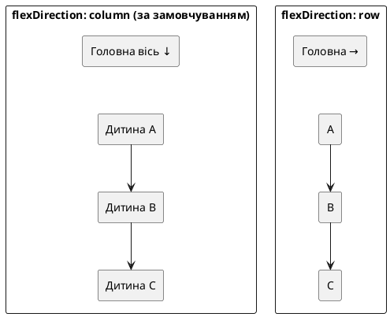

# Flexbox і layout у React Native

::tip
**Код Nomad.** Наскрізний застосунок курсу живе в окремому репозиторії: [https://github.com/arakviel/nomad](https://github.com/arakviel/nomad). Клонуйте його поруч із навчанням (`git clone https://github.com/arakviel/nomad.git`). Кожен коміт у тому репо відповідає статті (`Material: …` у тілі коміту). У monorepo kostyl.dev лише **матеріали** курсу (markdown); код застосунку — у репозиторії Nomad вище.
::

## Навіщо ця стаття

У попередній статті з’явилися «цеглини» UI: `View`, `Text`, `Image`, `Pressable`, `ScrollView`, safe area. Якщо просто скласти їх підряд, екран швидко виглядає «як стопка блоків»: заголовок прилип до краю, кнопка кудись зникла під клавіатурою, картки різної висоти «танцюють», а між елементами — або нуль, або випадкові `margin`.

**Layout** (розкладка) — це правила, за якими контейнер **розкладає дітей** у просторі: колонка чи рядок, хто розтягується, хто лишається фіксованим, куди йде «вільне місце», що робить екран, коли з’являється клавіатура.

У React Native майже весь layout будується на **Flexbox** — тій самій ідеї, що й у CSS Flexbox у браузері, але з кількома важливими відмінностями. Найчастіша помилка після вебу: чекати, що `View` поводиться як `div` з `display: block` і «рядком за замовчуванням».

Після статті:

1. Зрозуміло, що таке **головна** й **поперечна** вісь і чому за замовчуванням діти йдуть **колонкою**.  
2. Ви впевнено користуєтесь `justifyContent`, `alignItems`, `gap`, `flex`, `flexWrap`.  
3. Знаєте п’ять типових патернів екрана: header/body/footer, split, grid, sticky CTA, empty state.  
4. Розумієте, навіщо `KeyboardAvoidingView` і як узгодити його з safe area.  
5. У **Nomad** — чіткіша структура стрічки поїздок (шапка / список / закріплена кнопка).

::note
**Головна думка.** У React Native кожен `View` — уже flex-контейнер. Напрямок за замовчуванням — **колонка** (`flexDirection: 'column'`), а не рядок, як часто звикли з web-flex. Спочатку оберіть **вісь**, потім — **як розподілити місце** по ній (`justifyContent`) і **як вирівняти** поперек (`alignItems`).
::

::tip
**Живі прев’ю.** Як і в статті про базові компоненти, тут багато `::react-native-preview` (react-native-web у рамці телефону). Імпорти `@/…`, `expo-*` і Router у прев’ю **не працюють** — демо самодостатні. Клавіатура й системні вирізи в браузері відчуваються слабше, ніж на реальному пристрої: фінальну перевірку KAV і safe area робіть у Expo Go / симуляторі.
::

---

## Місток з web CSS

| У браузері (CSS) | У React Native | Коментар |
| ---------------- | -------------- | -------- |
| `display: flex` треба вмикати | `View` уже flex | Немає `display: block` / `inline` у тому ж сенсі |
| За замовчуванням `flex-direction: row` | За замовчуванням **`column`** | Найважливіша різниця |
| `justify-content` | `justifyContent` | camelCase у style-об’єкті |
| `align-items` | `alignItems` | Те саме |
| `gap` | `gap` (сучасний RN) | Зручніше за «margin на кожній дитині» |
| CSS Grid | немає в core RN | Сітки збирають **flex + wrap** або бібліотеками |
| `position: absolute` | є | Для оверлеїв і sticky-імітацій; основа все одно flex |
| `vh` / складні одиниці | обмежено | Частіше `%`, числа в dp, `flex: 1` |

::warning
**Web-звичка.** Написати `flexDirection: 'row'` «бо так у всіх туторіалах CSS» і дивуватися, чому «все стало в один рядок і роз’їхалось». У мобільному UI **колонка екрана** — норма: заголовок зверху, контент нижче, кнопка внизу. `row` — для **внутрішніх** рядків (іконка + текст, два стовпці, чіпи).
::

---

## Дві осі: main і cross

Уявіть шухляду, у яку ви складаєте книги.

- **Головна вісь (main axis)** — напрямок, у якому ви **кладете** книги одну за одною.  
- **Поперечна вісь (cross axis)** — напрямок «упоперек» до цього: якщо книги стопкою (зверху вниз), поперек — ліворуч/праворуч.

Властивість **`flexDirection`** обирає головну вісь:

| Значення | Головна вісь | Діти йдуть… |
| -------- | ------------ | ----------- |
| `column` (за замовчуванням) | зверху вниз | один під одним |
| `column-reverse` | знизу вгору | зворотний порядок |
| `row` | зліва направо | в один ряд |
| `row-reverse` | справа наліво | ряд у зворотному порядку |

::field-group

::field{name="justifyContent" type="уздовж головної осі"}
Розподіляє **вільне місце між дітьми** (і навколо них) **по головній осі**.  
`flex-start` — зібрати на початку; `center` — по центру; `flex-end` — в кінці; `space-between` / `space-around` / `space-evenly` — «розштовхати» з різною логікою проміжків.
::

::field{name="alignItems" type="уздовж поперечної осі"}
Вирівнює дітей **поперек** головної осі. За замовчуванням у RN часто **`stretch`**: дитина розтягується на всю «ширину» поперечної осі (у колонці — на всю ширину контейнера), якщо в неї немає фіксованого розміру в цьому напрямку.
::

::field{name="alignSelf" type="на одній дитині"}
Те саме, що `alignItems`, але **лише для одного** елемента. Зручно: контейнер `stretch`, а один бейдж — `alignSelf: 'flex-start'`, щоб не розтягувався на всю ширину.
::

::field{name="gap" type="number"}
Однаковий проміжок **між** дітьми (не зовні контейнера). Замінює «у кожної картки `marginBottom`, у останньої — нуль».
::

::

::plant-uml



::

### Живе демо: column vs row

::react-native-preview{title="flexDirection — column і row" device="iphone" filename="FlexDirectionDemo.tsx"}

```tsx
import { View, Text, StyleSheet, useColorScheme } from 'react-native';

function Box({ label, color }: { label: string; color: string }) {
  return (
    <View style={[styles.box, { backgroundColor: color }]}>
      <Text style={styles.boxText}>{label}</Text>
    </View>
  );
}

export default function App() {
  const isDark = useColorScheme() === 'dark';
  const text = isDark ? '#f5f5f7' : '#0f172a';
  const muted = isDark ? '#a1a1aa' : '#64748b';

  return (
    <View style={[styles.screen, isDark && { backgroundColor: '#000' }]}>
      <Text style={[styles.title, { color: text }]}>column (default)</Text>
      <View style={[styles.panel, isDark && styles.panelDark]}>
        <Box label="A" color="#2563EB" />
        <Box label="B" color="#16A34A" />
        <Box label="C" color="#DC2626" />
      </View>

      <Text style={[styles.title, { color: text, marginTop: 20 }]}>row</Text>
      <View style={[styles.panel, styles.row, isDark && styles.panelDark]}>
        <Box label="A" color="#2563EB" />
        <Box label="B" color="#16A34A" />
        <Box label="C" color="#DC2626" />
      </View>

      <Text style={[styles.hint, { color: muted }]}>
        У RN без flexDirection діти йдуть колонкою — як у першій панелі.
      </Text>
    </View>
  );
}

const styles = StyleSheet.create({
  screen: { flex: 1, backgroundColor: '#F8FAFC', padding: 20, gap: 8 },
  title: { fontSize: 15, fontWeight: '700' },
  panel: {
    backgroundColor: 'rgba(37,99,235,0.08)',
    borderRadius: 12,
    padding: 12,
    gap: 8,
  },
  panelDark: { backgroundColor: '#1c1c1e' },
  row: { flexDirection: 'row', alignItems: 'center' },
  box: {
    width: 52,
    height: 52,
    borderRadius: 10,
    alignItems: 'center',
    justifyContent: 'center',
  },
  boxText: { color: '#fff', fontWeight: '700', fontSize: 16 },
  hint: { fontSize: 13, lineHeight: 18, marginTop: 8 },
});
```

::

---

## `justifyContent` — місце вздовж головної осі

Коли контейнер **вищий** (у колонці) або **ширший** (у рядку), ніж сума дітей, з’являється **вільний простір**. `justifyContent` каже, куди його подіти.

| Значення | Що бачить користувач (колонка) |
| -------- | ------------------------------ |
| `flex-start` | Усе зверху, низ порожній |
| `flex-end` | Усе знизу, верх порожній |
| `center` | Блок по центру вертикалі |
| `space-between` | Перший біля старту, останній біля кінця, рівні дірки **між** |
| `space-around` | Напівпроміжки на краях, повні між елементами |
| `space-evenly` | Однакові відстані скрізь, включно з краями |

::tip
**Коли що.**  
- Екран «по центру» (логін, splash-контент) → `justifyContent: 'center'`.  
- Шапка зверху + кнопка внизу без «роз’їзду» середини → часто **не** `space-between` на весь екран, а схема **header / flex:1 body / footer** (нижче).  
- Чіпи в рядку з рівними дірками → `space-between` або краще `gap` + `flex-start`.
::

### Playground: justifyContent

::react-native-preview{title="justifyContent playground" device="iphone" filename="JustifyPlayground.tsx"}

```tsx
import { useState } from 'react';
import { View, Text, Pressable, StyleSheet, useColorScheme } from 'react-native';

type JC =
  | 'flex-start'
  | 'flex-end'
  | 'center'
  | 'space-between'
  | 'space-around'
  | 'space-evenly';

const OPTIONS: JC[] = [
  'flex-start',
  'flex-end',
  'center',
  'space-between',
  'space-around',
  'space-evenly',
];

function Chip({
  label,
  active,
  onPress,
}: {
  label: string;
  active: boolean;
  onPress: () => void;
}) {
  return (
    <Pressable onPress={onPress} style={[styles.chip, active && styles.chipOn]}>
      <Text style={[styles.chipText, active && styles.chipTextOn]}>{label}</Text>
    </Pressable>
  );
}

export default function App() {
  const [jc, setJc] = useState<JC>('flex-start');
  const isDark = useColorScheme() === 'dark';
  const text = isDark ? '#f5f5f7' : '#0f172a';
  const muted = isDark ? '#a1a1aa' : '#64748b';

  return (
    <View style={[styles.screen, isDark && { backgroundColor: '#000' }]}>
      <Text style={[styles.h, { color: text }]}>justifyContent</Text>
      <View style={styles.chips}>
        {OPTIONS.map((o) => (
          <Chip key={o} label={o} active={jc === o} onPress={() => setJc(o)} />
        ))}
      </View>

      <View style={[styles.arena, { justifyContent: jc }, isDark && styles.arenaDark]}>
        <View style={[styles.item, { backgroundColor: '#2563EB' }]} />
        <View style={[styles.item, { backgroundColor: '#16A34A' }]} />
        <View style={[styles.item, { backgroundColor: '#DC2626' }]} />
      </View>

      <Text style={[styles.code, { color: muted }]}>{`justifyContent: '${jc}'`}</Text>
      <Text style={[styles.hint, { color: muted }]}>
        Арена — колонка (flexDirection default). Міняється лише розподіл по вертикалі.
      </Text>
    </View>
  );
}

const styles = StyleSheet.create({
  screen: { flex: 1, backgroundColor: '#F8FAFC', padding: 14, gap: 8 },
  h: { fontSize: 17, fontWeight: '700' },
  chips: { flexDirection: 'row', flexWrap: 'wrap', gap: 6 },
  chip: {
    paddingHorizontal: 8,
    paddingVertical: 5,
    borderRadius: 8,
    backgroundColor: '#e2e8f0',
  },
  chipOn: { backgroundColor: '#2563EB' },
  chipText: { fontSize: 11, fontWeight: '600', color: '#0f172a' },
  chipTextOn: { color: '#fff' },
  arena: {
    flex: 1,
    marginTop: 8,
    borderRadius: 12,
    borderWidth: 2,
    borderColor: '#93c5fd',
    backgroundColor: '#fff',
    padding: 10,
    minHeight: 220,
  },
  arenaDark: { backgroundColor: '#1c1c1e', borderColor: '#3b82f6' },
  item: { height: 40, borderRadius: 8 },
  code: { fontSize: 13, fontFamily: 'monospace' },
  hint: { fontSize: 12, lineHeight: 17 },
});
```

::

---

## `alignItems` — вирівнювання поперек

У **колонці** поперечна вісь — горизонталь: `alignItems` керує «ліво / центр / право / розтягнути на всю ширину».  
У **рядку** поперечна — вертикаль: «верх / середина / низ / розтягнути по висоті».

| Значення | Типовий ефект у колонці |
| -------- | ------------------------ |
| `stretch` (часте default) | Діти без власної ширини займають усю ширину |
| `flex-start` | Притиснути вліво (у LTR) |
| `center` | По центру горизонталі |
| `flex-end` | Вправо |
| `baseline` | За базовими лініями тексту (рідше на старті) |

::warning
**Чому кнопка «на всю ширину».** Якщо батько — колонка з `alignItems: 'stretch'` (або default stretch), а в кнопки **немає** `alignSelf: 'flex-start'` і **немає** фіксованої `width`, вона розтягнеться. Це не баг — так працює stretch. Для «кнопки за вмістом» поставте `alignSelf: 'flex-start'` або оберніть у рядок.
::

### Playground: alignItems + row

::react-native-preview{title="alignItems playground" device="android" filename="AlignPlayground.tsx"}

```tsx
import { useState } from 'react';
import { View, Text, Pressable, StyleSheet, useColorScheme } from 'react-native';

type AI = 'flex-start' | 'flex-end' | 'center' | 'stretch';
const OPTIONS: AI[] = ['flex-start', 'center', 'flex-end', 'stretch'];

function Chip({
  label,
  active,
  onPress,
}: {
  label: string;
  active: boolean;
  onPress: () => void;
}) {
  return (
    <Pressable onPress={onPress} style={[styles.chip, active && styles.chipOn]}>
      <Text style={[styles.chipText, active && styles.chipTextOn]}>{label}</Text>
    </Pressable>
  );
}

export default function App() {
  const [ai, setAi] = useState<AI>('center');
  const isDark = useColorScheme() === 'dark';
  const text = isDark ? '#f5f5f7' : '#0f172a';
  const muted = isDark ? '#a1a1aa' : '#64748b';

  return (
    <View style={[styles.screen, isDark && { backgroundColor: '#000' }]}>
      <Text style={[styles.h, { color: text }]}>row · alignItems</Text>
      <View style={styles.chips}>
        {OPTIONS.map((o) => (
          <Chip key={o} label={o} active={ai === o} onPress={() => setAi(o)} />
        ))}
      </View>

      <View style={[styles.arena, { alignItems: ai }, isDark && styles.arenaDark]}>
        <View style={[styles.box, { height: 40, backgroundColor: '#2563EB' }]} />
        <View style={[styles.box, { height: 70, backgroundColor: '#16A34A' }]} />
        <View style={[styles.box, { height: 50, backgroundColor: '#DC2626' }]} />
      </View>

      <Text style={[styles.code, { color: muted }]}>
        {`flexDirection: 'row'\nalignItems: '${ai}'`}
      </Text>
      <Text style={[styles.hint, { color: muted }]}>
        stretch розтягує дітей по висоті арени (якщо height не зафіксовано — тут height є, тож
        stretch майже як flex-start для цих коробок).
      </Text>
    </View>
  );
}

const styles = StyleSheet.create({
  screen: { flex: 1, backgroundColor: '#F8FAFC', padding: 14, gap: 8 },
  h: { fontSize: 17, fontWeight: '700' },
  chips: { flexDirection: 'row', flexWrap: 'wrap', gap: 6 },
  chip: {
    paddingHorizontal: 10,
    paddingVertical: 6,
    borderRadius: 8,
    backgroundColor: '#e2e8f0',
  },
  chipOn: { backgroundColor: '#2563EB' },
  chipText: { fontSize: 12, fontWeight: '600', color: '#0f172a' },
  chipTextOn: { color: '#fff' },
  arena: {
    flexDirection: 'row',
    height: 160,
    marginTop: 8,
    borderRadius: 12,
    borderWidth: 2,
    borderColor: '#86efac',
    backgroundColor: '#fff',
    padding: 10,
    gap: 8,
  },
  arenaDark: { backgroundColor: '#1c1c1e', borderColor: '#22c55e' },
  box: { width: 48, borderRadius: 8 },
  code: { fontSize: 13, fontFamily: 'monospace' },
  hint: { fontSize: 12, lineHeight: 17 },
});
```

::

---

## `flex: 1` і «хто з’їдає вільне місце»

Число **`flex`** на **дитині** каже: «я хочу **частку** вільного місця батька вздовж головної осі».

- `flex: 1` — візьми **рівну частку** з іншими `flex: 1`.  
- `flex: 2` поруч із `flex: 1` — удвічі більшу частку.  
- Без `flex` (і без фіксованої висоти/ширини по осі) елемент зазвичай займає **лише стільки, скільки потрібно вмісту** (плюс padding/border).

Найкорисніший патерн екрана:

```text
View (flex: 1)                 ← екран на всю висоту
  Header (без flex)            ← висота за вмістом
  Body   (flex: 1)             ← «решта» висоти
  Footer (без flex)            ← висота за вмістом
```

Саме так кнопка «липне» до низу **без** абсолютного позиціонування: body забирає все, що лишилось між шапкою й футером.

::note
**`flex: 1` на корені екрана.** Корінь (`Screen` / `SafeAreaView` / зовнішній `View`) майже завжди має `flex: 1`, інакше контейнер «стискається» до вмісту й `justifyContent: 'center'` центрує в крихітній смужці, а не на весь телефон.
::

### Демо: flex-частки

::react-native-preview{title="flex: 1 / 2 / 3" device="iphone" filename="FlexGrowDemo.tsx"}

```tsx
import { View, Text, StyleSheet, useColorScheme } from 'react-native';

export default function App() {
  const isDark = useColorScheme() === 'dark';
  const text = isDark ? '#f5f5f7' : '#0f172a';

  return (
    <View style={[styles.screen, isDark && { backgroundColor: '#000' }]}>
      <Text style={[styles.title, { color: text }]}>Частки flex уздовж колонки</Text>
      <View style={styles.stack}>
        <View style={[styles.block, { flex: 1, backgroundColor: '#2563EB' }]}>
          <Text style={styles.label}>flex: 1</Text>
        </View>
        <View style={[styles.block, { flex: 2, backgroundColor: '#16A34A' }]}>
          <Text style={styles.label}>flex: 2</Text>
        </View>
        <View style={[styles.block, { flex: 3, backgroundColor: '#DC2626' }]}>
          <Text style={styles.label}>flex: 3</Text>
        </View>
      </View>
    </View>
  );
}

const styles = StyleSheet.create({
  screen: { flex: 1, backgroundColor: '#F8FAFC', padding: 16, gap: 12 },
  title: { fontSize: 16, fontWeight: '700' },
  stack: { flex: 1, gap: 8 },
  block: {
    borderRadius: 12,
    alignItems: 'center',
    justifyContent: 'center',
  },
  label: { color: '#fff', fontWeight: '700', fontSize: 16 },
});
```

::

### Grow, shrink, basis — три важелі замість «магічного» `flex: 1`

У CSS і в React Native запис **`flex: 1`** — це скорочення. Під капотом layout-рушій дивиться на три окремі властивості. Коли рядок «ламається», кнопка з’їдає текст, або блок не хоче рости — корисно крутити їх **окремо**, а не лише `flex: 1`.

::note
**Порядок думки (головна вісь).**  
1. **`flexBasis`** — з якого розміру **стартуємо** (бажана ширина в `row`, висота в `column`).  
2. Якщо після цього **залишилось** місце в контейнері → ділимо його за **`flexGrow`**.  
3. Якщо місця **не вистачає** → стискаємо за **`flexShrink`**.
::

::field-group

::field{name="flexBasis" type="number | 'auto'"}
**Стартовий** розмір уздовж головної осі **до** grow/shrink.  
- Число (наприклад `100`) — «хочу близько 100 dp».  
- `'auto'` — орієнтуйся на вміст / `width` / `height`.  
Це **не** жорсткий `width`: далі grow може розтягнути, shrink — стиснути.
::

::field{name="flexGrow" type="number (зазвичай 0 або 1+)"}
Наскільки елемент **росте**, коли в контейнері є **вільне** місце.  
- `0` — не рости (лишайся біля basis).  
- `1` — бери частку вільного місця.  
- Два сусіди з `flexGrow: 1` і `2` ділять «залишок» як 1 : 2.  
Саме grow «ховається» всередині звичного `flex: 1`.
::

::field{name="flexShrink" type="number (зазвичай 0 або 1)"}
Наскільки елемент **стискається**, коли basis-и **не влазять** у контейнер.  
- `1` (типово для тексту в рядку) — можна стиснути.  
- `0` — «не чіпай мій розмір» (іконка, бейдж, кнопка фіксованої ширини).  
Без shrink довгий заголовок у `row` часто **виштовхує** правий хвіст за край екрана.
::

::

::tip
**Зв’язок із `flex: 1`.** У більшості випадків `flex: 1` означає приблизно: «basis гнучкий / мінімальний, **рости** (`grow`), **умій стискатися** (`shrink`)». Для навчання нижче крутимо три поля окремо — так видно, *який* важіль що робить.
::

#### 1. `flexBasis` — стартовий розмір

Обидва блоки в одному рядку. У кожного свій **basis** (синій 80, зелений 160). `flexGrow: 0`, тож вони **не** розтягуються на всю ширину — видно «бажану» ширину.

::react-native-preview{title="flexBasis — стартові ширини" device="iphone" filename="FlexBasisDemo.tsx"}

```tsx
import { View, Text, StyleSheet, useColorScheme } from 'react-native';

export default function App() {
  const isDark = useColorScheme() === 'dark';
  const text = isDark ? '#f5f5f7' : '#0f172a';
  const muted = isDark ? '#a1a1aa' : '#64748b';

  return (
    <View style={[styles.screen, isDark && { backgroundColor: '#000' }]}>
      <Text style={[styles.h, { color: text }]}>flexBasis (grow = 0)</Text>
      <Text style={[styles.sub, { color: muted }]}>
        Рядок ширший за суму basis — лишається порожнє місце справа. Блоки не
        «з’їдають» його, бо grow вимкнено.
      </Text>

      <View style={[styles.row, isDark && styles.rowDark]}>
        <View style={[styles.box, { flexBasis: 80, backgroundColor: '#2563EB' }]}>
          <Text style={styles.boxText}>80</Text>
        </View>
        <View style={[styles.box, { flexBasis: 160, backgroundColor: '#16A34A' }]}>
          <Text style={styles.boxText}>160</Text>
        </View>
      </View>

      <Text style={[styles.code, { color: muted }]}>
        {`// обидва: flexGrow: 0, flexShrink: 1\nflexBasis: 80  |  flexBasis: 160`}
      </Text>
    </View>
  );
}

const styles = StyleSheet.create({
  screen: { flex: 1, backgroundColor: '#F8FAFC', padding: 16, gap: 10 },
  h: { fontSize: 17, fontWeight: '700' },
  sub: { fontSize: 13, lineHeight: 18 },
  row: {
    flexDirection: 'row',
    height: 72,
    borderRadius: 12,
    borderWidth: 2,
    borderColor: '#93c5fd',
    backgroundColor: '#fff',
    padding: 8,
    gap: 8,
    alignItems: 'stretch',
  },
  rowDark: { backgroundColor: '#1c1c1e', borderColor: '#3b82f6' },
  box: {
    flexGrow: 0,
    flexShrink: 1,
    borderRadius: 8,
    alignItems: 'center',
    justifyContent: 'center',
  },
  boxText: { color: '#fff', fontWeight: '700', fontSize: 16 },
  code: { fontSize: 12, fontFamily: 'monospace', lineHeight: 18 },
});
```

::

#### 2. `flexGrow` — хто забирає вільне місце

Ті самі basis (80 і 160), але тепер у **зеленого** `flexGrow: 1`, у синього `0`. Вільне місце справа «віддається» зеленому.

::react-native-preview{title="flexGrow — один росте" device="android" filename="FlexGrowOnlyDemo.tsx"}

```tsx
import { View, Text, StyleSheet, useColorScheme } from 'react-native';

export default function App() {
  const isDark = useColorScheme() === 'dark';
  const text = isDark ? '#f5f5f7' : '#0f172a';
  const muted = isDark ? '#a1a1aa' : '#64748b';

  return (
    <View style={[styles.screen, isDark && { backgroundColor: '#000' }]}>
      <Text style={[styles.h, { color: text }]}>flexGrow: 0 vs 1</Text>
      <Text style={[styles.sub, { color: muted }]}>
        Синій лишається ≈ basis 80. Зелений стартує з 100 і забирає весь залишок
        ширини рядка.
      </Text>

      <View style={[styles.row, isDark && styles.rowDark]}>
        <View
          style={[
            styles.box,
            {
              flexBasis: 80,
              flexGrow: 0,
              backgroundColor: '#2563EB',
            },
          ]}
        >
          <Text style={styles.boxText}>grow 0</Text>
        </View>
        <View
          style={[
            styles.box,
            {
              flexBasis: 100,
              flexGrow: 1,
              backgroundColor: '#16A34A',
            },
          ]}
        >
          <Text style={styles.boxText}>grow 1</Text>
        </View>
      </View>

      <Text style={[styles.hint, { color: muted }]}>
        Життєвий патерн: фіксована іконка зліва (grow 0) + текстовий блок посередині
        (grow 1 / flex: 1).
      </Text>
    </View>
  );
}

const styles = StyleSheet.create({
  screen: { flex: 1, backgroundColor: '#F8FAFC', padding: 16, gap: 10 },
  h: { fontSize: 17, fontWeight: '700' },
  sub: { fontSize: 13, lineHeight: 18 },
  row: {
    flexDirection: 'row',
    height: 72,
    borderRadius: 12,
    borderWidth: 2,
    borderColor: '#86efac',
    backgroundColor: '#fff',
    padding: 8,
    gap: 8,
  },
  rowDark: { backgroundColor: '#1c1c1e', borderColor: '#22c55e' },
  box: {
    flexShrink: 1,
    borderRadius: 8,
    alignItems: 'center',
    justifyContent: 'center',
  },
  boxText: { color: '#fff', fontWeight: '700', fontSize: 14 },
  hint: { fontSize: 13, lineHeight: 18 },
});
```

::

#### 3. `flexShrink` — хто поступається, коли тісно

Спеціально ставимо **великі** basis (сума більша за ширину рядка). Червоний з `flexShrink: 0` майже не здає ширину; синій з `flexShrink: 1` стискається.

::react-native-preview{title="flexShrink — хто стискається" device="iphone" filename="FlexShrinkDemo.tsx"}

```tsx
import { View, Text, StyleSheet, useColorScheme } from 'react-native';

export default function App() {
  const isDark = useColorScheme() === 'dark';
  const text = isDark ? '#f5f5f7' : '#0f172a';
  const muted = isDark ? '#a1a1aa' : '#64748b';

  return (
    <View style={[styles.screen, isDark && { backgroundColor: '#000' }]}>
      <Text style={[styles.h, { color: text }]}>flexShrink: 1 vs 0</Text>
      <Text style={[styles.sub, { color: muted }]}>
        Basis 200 + 200 не влазять у вузький рядок. Синій (shrink 1) стискається;
        червоний (shrink 0) тримається міцніше.
      </Text>

      <View style={[styles.row, isDark && styles.rowDark]}>
        <View
          style={[
            styles.box,
            {
              flexBasis: 200,
              flexGrow: 0,
              flexShrink: 1,
              backgroundColor: '#2563EB',
            },
          ]}
        >
          <Text style={styles.boxText} numberOfLines={2}>
            shrink 1{'\n'}basis 200
          </Text>
        </View>
        <View
          style={[
            styles.box,
            {
              flexBasis: 200,
              flexGrow: 0,
              flexShrink: 0,
              backgroundColor: '#DC2626',
            },
          ]}
        >
          <Text style={styles.boxText} numberOfLines={2}>
            shrink 0{'\n'}basis 200
          </Text>
        </View>
      </View>

      <Text style={[styles.hint, { color: muted }]}>
        На кнопках, цінах, шевронах часто shrink: 0. На довгій назві — shrink: 1 +
        numberOfLines, інакше «хвіст» вилізе за екран.
      </Text>
    </View>
  );
}

const styles = StyleSheet.create({
  screen: { flex: 1, backgroundColor: '#F8FAFC', padding: 16, gap: 10 },
  h: { fontSize: 17, fontWeight: '700' },
  sub: { fontSize: 13, lineHeight: 18 },
  row: {
    flexDirection: 'row',
    height: 88,
    borderRadius: 12,
    borderWidth: 2,
    borderColor: '#fca5a5',
    backgroundColor: '#fff',
    padding: 8,
    gap: 8,
    // без overflow видно, як shrink 0 «бореться» за місце
  },
  rowDark: { backgroundColor: '#1c1c1e', borderColor: '#ef4444' },
  box: {
    borderRadius: 8,
    alignItems: 'center',
    justifyContent: 'center',
    paddingHorizontal: 6,
  },
  boxText: {
    color: '#fff',
    fontWeight: '700',
    fontSize: 12,
    textAlign: 'center',
  },
  hint: { fontSize: 13, lineHeight: 18 },
});
```

::

#### 4. Playground: крутимо grow / shrink / basis разом

Нижче три блоки в **одному рядку**. Чіпами змінюйте властивості **середнього** (зеленого) — одразу видно, як змінюється розкладка. Краї (синій / червоний) фіксовані: basis 56, grow 0, shrink 0 — як іконки-«якорі».

::react-native-preview{title="grow · shrink · basis playground" device="iphone" filename="FlexGSBPlayground.tsx" height="700"}

```tsx
import { useState } from 'react';
import { View, Text, Pressable, StyleSheet, useColorScheme } from 'react-native';

type Grow = 0 | 1 | 2;
type Shrink = 0 | 1;
type Basis = 40 | 80 | 120 | 200;

function Chip({
  label,
  active,
  onPress,
}: {
  label: string;
  active: boolean;
  onPress: () => void;
}) {
  return (
    <Pressable onPress={onPress} style={[styles.chip, active && styles.chipOn]}>
      <Text style={[styles.chipText, active && styles.chipTextOn]}>{label}</Text>
    </Pressable>
  );
}

export default function App() {
  const [grow, setGrow] = useState<Grow>(1);
  const [shrink, setShrink] = useState<Shrink>(1);
  const [basis, setBasis] = useState<Basis>(80);
  const isDark = useColorScheme() === 'dark';
  const text = isDark ? '#f5f5f7' : '#0f172a';
  const muted = isDark ? '#a1a1aa' : '#64748b';

  return (
    <View style={[styles.screen, isDark && { backgroundColor: '#000' }]}>
      <Text style={[styles.h, { color: text }]}>Середній блок (зелений)</Text>

      <Text style={[styles.group, { color: muted }]}>flexBasis</Text>
      <View style={styles.chips}>
        {([40, 80, 120, 200] as Basis[]).map((b) => (
          <Chip key={b} label={String(b)} active={basis === b} onPress={() => setBasis(b)} />
        ))}
      </View>

      <Text style={[styles.group, { color: muted }]}>flexGrow</Text>
      <View style={styles.chips}>
        {([0, 1, 2] as Grow[]).map((g) => (
          <Chip key={g} label={String(g)} active={grow === g} onPress={() => setGrow(g)} />
        ))}
      </View>

      <Text style={[styles.group, { color: muted }]}>flexShrink</Text>
      <View style={styles.chips}>
        {([0, 1] as Shrink[]).map((s) => (
          <Chip key={s} label={String(s)} active={shrink === s} onPress={() => setShrink(s)} />
        ))}
      </View>

      <View style={[styles.row, isDark && styles.rowDark]}>
        <View style={[styles.side, { backgroundColor: '#2563EB' }]}>
          <Text style={styles.sideText}>L</Text>
        </View>
        <View
          style={[
            styles.mid,
            {
              flexBasis: basis,
              flexGrow: grow,
              flexShrink: shrink,
              backgroundColor: '#16A34A',
            },
          ]}
        >
          <Text style={styles.midText} numberOfLines={3}>
            mid{'\n'}b{basis} g{grow} s{shrink}
          </Text>
        </View>
        <View style={[styles.side, { backgroundColor: '#DC2626' }]}>
          <Text style={styles.sideText}>R</Text>
        </View>
      </View>

      <Text style={[styles.code, { color: muted }]}>
        {`// зелений\nflexBasis: ${basis}\nflexGrow: ${grow}\nflexShrink: ${shrink}\n\n// L і R: basis 56, grow 0, shrink 0`}
      </Text>

      <Text style={[styles.hint, { color: muted }]}>
        Спробуйте basis 200 + grow 0 + shrink 0 — середній «розпирає» рядок. Потім
        shrink 1 — він поступається. grow 2 при малому basis — забирає вільне місце
        сильніше, ніж grow 1 (тут сусіди grow 0, тож різниця 1 vs 2 менш помітна).
      </Text>
    </View>
  );
}

const styles = StyleSheet.create({
  screen: { flex: 1, backgroundColor: '#F8FAFC', padding: 14, gap: 6 },
  h: { fontSize: 16, fontWeight: '700', marginBottom: 4 },
  group: {
    fontSize: 11,
    fontWeight: '600',
    marginTop: 6,
    textTransform: 'uppercase',
  },
  chips: { flexDirection: 'row', flexWrap: 'wrap', gap: 6 },
  chip: {
    paddingHorizontal: 10,
    paddingVertical: 6,
    borderRadius: 8,
    backgroundColor: '#e2e8f0',
  },
  chipOn: { backgroundColor: '#2563EB' },
  chipText: { fontSize: 12, fontWeight: '600', color: '#0f172a' },
  chipTextOn: { color: '#fff' },
  row: {
    flexDirection: 'row',
    height: 88,
    marginTop: 12,
    borderRadius: 12,
    borderWidth: 2,
    borderColor: '#93c5fd',
    backgroundColor: '#fff',
    padding: 8,
    gap: 6,
    alignItems: 'stretch',
  },
  rowDark: { backgroundColor: '#1c1c1e', borderColor: '#3b82f6' },
  side: {
    flexBasis: 56,
    flexGrow: 0,
    flexShrink: 0,
    borderRadius: 8,
    alignItems: 'center',
    justifyContent: 'center',
  },
  sideText: { color: '#fff', fontWeight: '800', fontSize: 16 },
  mid: {
    borderRadius: 8,
    alignItems: 'center',
    justifyContent: 'center',
    paddingHorizontal: 4,
    minWidth: 0,
  },
  midText: {
    color: '#fff',
    fontWeight: '700',
    fontSize: 12,
    textAlign: 'center',
  },
  code: { fontSize: 12, fontFamily: 'monospace', lineHeight: 17, marginTop: 8 },
  hint: { fontSize: 12, lineHeight: 17, marginTop: 4 },
});
```

::

#### 5. Життєвий рядок: іконка · текст · ціна

Те саме трьома важелями без «демо-кольорів» — типовий list item.

| Зона | basis / width | grow | shrink | Навіщо |
| ---- | ------------- | ---- | ------ | ------ |
| Іконка зліва | фіксована 44 | 0 | 0 | не стискати, не розтягувати |
| Текст | `auto` / м’який | **1** | **1** | забрати середину, обрізатись при нестачі |
| Ціна справа | за вмістом | 0 | **0** | завжди читабельна |

::react-native-preview{title="List row · grow/shrink на практиці" device="android" filename="FlexGSBRealRow.tsx"}

```tsx
import { View, Text, StyleSheet, useColorScheme } from 'react-native';

const ROWS = [
  {
    title: 'Київ — Карпати, довга назва поїздки для обрізання',
    price: '4 200 ₴',
  },
  {
    title: 'Львів',
    price: '890 ₴',
  },
  {
    title: 'Одеса · море · ранок · вечірній Привоз',
    price: '12 500 ₴',
  },
];

export default function App() {
  const isDark = useColorScheme() === 'dark';
  const text = isDark ? '#f5f5f7' : '#0f172a';
  const muted = isDark ? '#a1a1aa' : '#64748b';
  const surface = isDark ? '#1c1c1e' : '#fff';
  const border = isDark ? '#3a3a3c' : '#e2e8f0';
  const bg = isDark ? '#000' : '#F8FAFC';

  return (
    <View style={[styles.screen, { backgroundColor: bg }]}>
      <Text style={[styles.h, { color: text }]}>Іконка · текст · ціна</Text>
      <Text style={[styles.sub, { color: muted }]}>
        Текст: flexGrow 1 + flexShrink 1 + numberOfLines. Ціна: shrink 0.
      </Text>

      <View style={styles.list}>
        {ROWS.map((r) => (
          <View
            key={r.title}
            style={[styles.row, { backgroundColor: surface, borderColor: border }]}
          >
            <View style={styles.icon}>
              <Text style={styles.iconText}>{r.title.slice(0, 1)}</Text>
            </View>

            <Text style={[styles.title, { color: text }]} numberOfLines={1}>
              {r.title}
            </Text>

            <Text style={[styles.price, { color: muted }]}>{r.price}</Text>
          </View>
        ))}
      </View>
    </View>
  );
}

const styles = StyleSheet.create({
  screen: { flex: 1, padding: 16, gap: 10 },
  h: { fontSize: 17, fontWeight: '700' },
  sub: { fontSize: 13, lineHeight: 18 },
  list: { gap: 8 },
  row: {
    flexDirection: 'row',
    alignItems: 'center',
    gap: 10,
    padding: 12,
    borderRadius: 12,
    borderWidth: 1,
  },
  icon: {
    // basis-еквівалент: фіксована ширина, grow/shrink 0
    width: 44,
    height: 44,
    borderRadius: 22,
    backgroundColor: '#2563EB',
    alignItems: 'center',
    justifyContent: 'center',
    flexGrow: 0,
    flexShrink: 0,
  },
  iconText: { color: '#fff', fontWeight: '700', fontSize: 16 },
  title: {
    flexGrow: 1,
    flexShrink: 1,
    flexBasis: 0, // стартувати «з нуля» і рости — зручно для рівних рядків
    minWidth: 0, // важливо для обрізання тексту в деяких деревах layout
    fontSize: 16,
    fontWeight: '600',
  },
  price: {
    flexGrow: 0,
    flexShrink: 0,
    fontSize: 14,
    fontWeight: '700',
  },
});
```

::

::tip
**`flexBasis: 0` + `flexGrow: 1` на тексті.** Частий прийом у рядках: «не орієнтуйся на довжину рядка як на basis, а одразу діли вільне місце і стискайся». Разом із `numberOfLines={1}` і (за потреби) `minWidth: 0` довгі назви коректно отримують `…`, а ціна не з’їжджає.
::

::warning
**Плутанина `width` vs `flexBasis`.**  
- `width: 100` — жорсткіша геометрія в багатьох випадках.  
- `flexBasis: 100` — **участь у flex-грі**: далі grow/shrink можуть змінити підсумковий розмір.  
Для «іконка завжди 44» достатньо `width`/`height`. Для «хочу ~120, але можу віддати місце» — basis + shrink.
::

---

## `gap`, `flexWrap` і «сітка» без CSS Grid

### `gap`

`gap: 12` на контейнері ставить **12** між сусідами. Не треба:

```tsx
// крихкіше
item: { marginBottom: 12 }
// і окремо «останній без margin»
```

Працює і для `row`, і для `column`, і для `wrap`.

### `flexWrap: 'wrap'`

Коли дітей більше, ніж вміщується в один ряд (при `flexDirection: 'row'`), вони **переносяться** на наступний. Так збирають:

- сітку іконок 2×N або 3×N;  
- «хмару» чіпів фільтрів;  
- плитки категорій.

Ширину плитки часто задають як **відсоток** від батька, з урахуванням gap (наприклад, дві колонки ≈ `'48%'` + `gap`, або точніший розрахунок).

### Демо: wrap-сітка

::react-native-preview{title="flexWrap — сітка 2 колонки" device="iphone" filename="WrapGridDemo.tsx"}

```tsx
import { View, Text, StyleSheet, useColorScheme } from 'react-native';

const CELLS = ['Київ', 'Львів', 'Одеса', 'Харків', 'Дніпро', 'Ужгород'];

export default function App() {
  const isDark = useColorScheme() === 'dark';
  const text = isDark ? '#f5f5f7' : '#0f172a';
  const muted = isDark ? '#a1a1aa' : '#64748b';
  const cellBg = isDark ? '#1c1c1e' : '#fff';
  const border = isDark ? '#3a3a3c' : '#e2e8f0';

  return (
    <View style={[styles.screen, isDark && { backgroundColor: '#000' }]}>
      <Text style={[styles.title, { color: text }]}>Міста · wrap grid</Text>
      <Text style={[styles.sub, { color: muted }]}>
        flexDirection: row · flexWrap: wrap · width ~48%
      </Text>
      <View style={styles.grid}>
        {CELLS.map((name) => (
          <View
            key={name}
            style={[styles.cell, { backgroundColor: cellBg, borderColor: border }]}
          >
            <Text style={[styles.cellText, { color: text }]}>{name}</Text>
          </View>
        ))}
      </View>
    </View>
  );
}

const styles = StyleSheet.create({
  screen: { flex: 1, backgroundColor: '#F8FAFC', padding: 16, gap: 8 },
  title: { fontSize: 18, fontWeight: '700' },
  sub: { fontSize: 13, marginBottom: 8 },
  grid: {
    flexDirection: 'row',
    flexWrap: 'wrap',
    gap: 10,
  },
  cell: {
    width: '48%',
    minHeight: 72,
    borderRadius: 12,
    borderWidth: 1,
    alignItems: 'center',
    justifyContent: 'center',
    padding: 12,
  },
  cellText: { fontSize: 16, fontWeight: '600' },
});
```

::

::tip
**Відсотки.** `width: '48%'` — відсоток від **ширини батька**. Дві клітинки + `gap` візуально дають дві колонки. На дуже вузьких екранах інколи переходять на одну колонку (`width: '100%'`) через перевірку ширини (`useWindowDimensions`) — це вже адаптив; базова ідея wrap та сама.
::

---

## Патерн: header / body / footer

Це **скелет** більшості мобільних екранів: фіксована шапка, прокручувана середина, стабільний низ (кнопка «Зберегти», «Далі», «Нова поїздка»).

::steps

### Корінь `flex: 1`

Екран займає всю доступну висоту (під safe area — окремо).

### Header без `flex`

Висота за текстом і відступами. Не розтягується.

### Body з `flex: 1`

Забирає **решту**. Усередині часто `ScrollView` з `style={{ flex: 1 }}` і `contentContainerStyle` для padding.

### Footer без `flex`

Кнопка завжди видима внизу (поки не відкрита клавіатура — про неї нижче).

::

::react-native-preview{title="Header / body / footer" device="iphone" filename="HeaderBodyFooter.tsx"}

```tsx
import { View, Text, ScrollView, Pressable, StyleSheet, useColorScheme } from 'react-native';

export default function App() {
  const isDark = useColorScheme() === 'dark';
  const text = isDark ? '#f5f5f7' : '#0f172a';
  const muted = isDark ? '#a1a1aa' : '#64748b';
  const surface = isDark ? '#1c1c1e' : '#fff';
  const border = isDark ? '#3a3a3c' : '#e2e8f0';
  const bg = isDark ? '#000' : '#F8FAFC';

  return (
    <View style={[styles.root, { backgroundColor: bg }]}>
      <View style={[styles.header, { backgroundColor: surface, borderBottomColor: border }]}>
        <Text style={[styles.headerTitle, { color: text }]}>Мої поїздки</Text>
        <Text style={[styles.headerSub, { color: muted }]}>3 активні</Text>
      </View>

      <ScrollView style={styles.body} contentContainerStyle={styles.bodyContent}>
        {['Київ — Карпати', 'Львівський вікенд', 'Одеса біля моря'].map((t) => (
          <View key={t} style={[styles.card, { backgroundColor: surface, borderColor: border }]}>
            <Text style={[styles.cardTitle, { color: text }]}>{t}</Text>
            <Text style={{ color: muted, fontSize: 13 }}>Торкніться, щоб відкрити (mock)</Text>
          </View>
        ))}
      </ScrollView>

      <View style={[styles.footer, { backgroundColor: surface, borderTopColor: border }]}>
        <Pressable style={styles.cta}>
          <Text style={styles.ctaText}>Нова поїздка</Text>
        </Pressable>
      </View>
    </View>
  );
}

const styles = StyleSheet.create({
  root: { flex: 1 },
  header: {
    paddingHorizontal: 16,
    paddingTop: 12,
    paddingBottom: 12,
    borderBottomWidth: 1,
    gap: 2,
  },
  headerTitle: { fontSize: 20, fontWeight: '700' },
  headerSub: { fontSize: 13 },
  body: { flex: 1 },
  bodyContent: { padding: 16, gap: 10, paddingBottom: 24 },
  card: {
    borderRadius: 12,
    borderWidth: 1,
    padding: 14,
    gap: 4,
  },
  cardTitle: { fontSize: 16, fontWeight: '600' },
  footer: {
    padding: 16,
    borderTopWidth: 1,
  },
  cta: {
    backgroundColor: '#2563EB',
    borderRadius: 12,
    paddingVertical: 14,
    alignItems: 'center',
  },
  ctaText: { color: '#fff', fontWeight: '700', fontSize: 16 },
});
```

::

::warning
**Поширена помилка.** Покласти кнопку **всередину** `ScrollView` в кінці списку — і на довгому списку користувач **не бачить** CTA, доки не долистає вниз. Для «завжди на виду» CTA виносять у **footer** поза скролом (sticky bottom). Для «природно в кінці форми» — лишають у скролі. Обидва варіанти валідні; питання продукту, не «єдиної істини».
::

---

## Патерн: split (два регіони)

**Split** — екран, поділений на дві зони: наприклад, карта зверху + список знизу, або ілюстрація + форма. Реалізація: колонка, дві дитини з `flex: 1` (порівну) або `flex: 2` / `flex: 1` (2/3 і 1/3).

::react-native-preview{title="Split 2/1" device="android" filename="SplitLayout.tsx"}

```tsx
import { View, Text, StyleSheet, useColorScheme } from 'react-native';

export default function App() {
  const isDark = useColorScheme() === 'dark';
  const text = isDark ? '#f5f5f7' : '#0f172a';

  return (
    <View style={[styles.root, isDark && { backgroundColor: '#000' }]}>
      <View style={[styles.top, isDark && { backgroundColor: '#1e3a5f' }]}>
        <Text style={styles.topLabel}>Зона A · flex: 2</Text>
        <Text style={[styles.topHint, { color: isDark ? '#93c5fd' : '#1e40af' }]}>
          Тут пізніше може бути карта або hero-зображення
        </Text>
      </View>
      <View style={[styles.bottom, isDark && { backgroundColor: '#1c1c1e' }]}>
        <Text style={[styles.bottomTitle, { color: text }]}>Зона B · flex: 1</Text>
        <Text style={{ color: isDark ? '#a1a1aa' : '#64748b', marginTop: 6 }}>
          Список місць, деталі, кнопки дій
        </Text>
      </View>
    </View>
  );
}

const styles = StyleSheet.create({
  root: { flex: 1, backgroundColor: '#F8FAFC' },
  top: {
    flex: 2,
    backgroundColor: '#dbeafe',
    alignItems: 'center',
    justifyContent: 'center',
    padding: 20,
    gap: 8,
  },
  topLabel: { fontSize: 18, fontWeight: '700', color: '#1e3a8a' },
  topHint: { fontSize: 13, textAlign: 'center' },
  bottom: {
    flex: 1,
    backgroundColor: '#fff',
    borderTopLeftRadius: 20,
    borderTopRightRadius: 20,
    marginTop: -12,
    padding: 20,
  },
  bottomTitle: { fontSize: 18, fontWeight: '700' },
});
```

::

---

## Патерн: sticky CTA

**Sticky CTA** (call to action, що «липне») — кнопка дії завжди в зоні великого пальця. Технічно це той самий footer з попереднього патерну; акцент на **продуктовій** ролі: «оплатити», «зберегти чернетку», «додати в кошик».

Іноді CTA малюють через `position: 'absolute', bottom: 0, left: 0, right: 0`. Це працює, але:

- треба **падінг знизу** в `ScrollView`, інакше останні рядки сховаються **під** кнопкою;  
- safe area знизу (home indicator) треба додати вручну (`useSafeAreaInsets().bottom`).

Схема header/body/footer без absolute зазвичай **простіша** для новачка.

---

## Патерн: empty state

Коли списку немає (немає поїздок, порожній пошук), показують **порожній стан**: ілюстрація або іконка, короткий текст, кнопка «що робити далі». Layout — колонка по центру (`flex: 1`, `justifyContent: 'center'`, `alignItems: 'center'`).

::react-native-preview{title="Empty state" device="iphone" filename="EmptyState.tsx"}

```tsx
import { View, Text, Pressable, StyleSheet, useColorScheme } from 'react-native';

export default function App() {
  const isDark = useColorScheme() === 'dark';
  const text = isDark ? '#f5f5f7' : '#0f172a';
  const muted = isDark ? '#a1a1aa' : '#64748b';
  const bg = isDark ? '#000' : '#F8FAFC';

  return (
    <View style={[styles.root, { backgroundColor: bg }]}>
      <View style={styles.header}>
        <Text style={[styles.headerTitle, { color: text }]}>Поїздки</Text>
      </View>

      <View style={styles.empty}>
        <View style={styles.iconCircle}>
          <Text style={styles.icon}>✈️</Text>
        </View>
        <Text style={[styles.title, { color: text }]}>Поки немає поїздок</Text>
        <Text style={[styles.desc, { color: muted }]}>
          Створіть першу — і тут з’явиться стрічка з датами та обкладинками.
        </Text>
        <Pressable style={styles.btn}>
          <Text style={styles.btnText}>Нова поїздка</Text>
        </Pressable>
      </View>
    </View>
  );
}

const styles = StyleSheet.create({
  root: { flex: 1 },
  header: { padding: 16, paddingTop: 12 },
  headerTitle: { fontSize: 20, fontWeight: '700' },
  empty: {
    flex: 1,
    alignItems: 'center',
    justifyContent: 'center',
    paddingHorizontal: 32,
    gap: 10,
  },
  iconCircle: {
    width: 72,
    height: 72,
    borderRadius: 36,
    backgroundColor: 'rgba(37,99,235,0.12)',
    alignItems: 'center',
    justifyContent: 'center',
    marginBottom: 8,
  },
  icon: { fontSize: 32 },
  title: { fontSize: 18, fontWeight: '700', textAlign: 'center' },
  desc: { fontSize: 15, lineHeight: 22, textAlign: 'center', marginBottom: 8 },
  btn: {
    backgroundColor: '#2563EB',
    paddingHorizontal: 20,
    paddingVertical: 12,
    borderRadius: 12,
    marginTop: 4,
  },
  btnText: { color: '#fff', fontWeight: '700', fontSize: 15 },
});
```

::

---

## Safe area глибше

У статті про компоненти вже був **safe area**: зона екрана, яку **не** перекривають виріз камери (notch / Dynamic Island), статус-бар, home indicator.

### Два API

| Підхід | Звідки | Коли |
| ------ | ------ | ---- |
| `SafeAreaView` з `react-native` | core | Швидкий прототип; на Android поведінка історично обмеженіша |
| `react-native-safe-area-context` | пакет (у Expo Router уже є) | **Рекомендовано** для продукту: `SafeAreaProvider`, `SafeAreaView`, `useSafeAreaInsets()` |

У Nomad примітив `Screen` уже на `SafeAreaView` з `safe-area-context`.

### `useSafeAreaInsets()`

Хук повертає `{ top, bottom, left, right }` у пікселях. Корисно, коли:

- sticky-кнопка з `position: 'absolute'` — додаєте `paddingBottom: insets.bottom + 16`;  
- кастомний хедер у модалці;  
- екран на весь зріст **під** статус-бар (картинка edge-to-edge), а текст — уже з `paddingTop: insets.top`.

::note
**Padding у `SafeAreaView`.** Офіційний `SafeAreaView` з core RN реалізує відступи через padding; **власний** padding на тому ж компоненті може ігноруватись або поводитись дивно. Тому padding контенту часто ставлять на **внутрішній** `View` / `ScrollView`, а не «все в один SafeAreaView-стиль».
::

### Краї та горизонталь

На iPhone з «вухами» інколи важливі `left` / `right` (landscape). Для більшості портретних екранів курсу достатньо top + bottom.

---

## Клавіатура: `KeyboardAvoidingView`

На телефоні екранна **клавіатура** наїжджає знизу й може **закрити** поле вводу або кнопку «Надіслати». Користувач не бачить, що друкує — і це виглядає як зламаний застосунок.

**`KeyboardAvoidingView`** — контейнер, який **зсуває або стискає** свій вміст, коли клавіатура відкрита.

::field-group

::field{name="behavior" type="'height' | 'position' | 'padding'"}
**Як** реагувати. На iOS часто `'padding'`, на Android — `'height'` (або інший варіант після перевірки на пристрої). Документація радить **завжди** задавати `behavior` явно — платформи інтерпретують його по-різному.
::

::field{name="keyboardVerticalOffset" type="number"}
Додатковий зсув, якщо над KAV є хедер навігації, статус-бар тощо. Якщо «не дотягує» або «перелітає» — крутять цей offset.
::

::field{name="enabled" type="boolean"}
Можна вимкнути на екранах без інпутів.
::

::

Типовий каркас:

```tsx
import {
  KeyboardAvoidingView,
  Platform,
  TextInput,
  View,
  StyleSheet,
} from 'react-native';

export function LoginForm() {
  return (
    <KeyboardAvoidingView
      style={styles.root}
      behavior={Platform.OS === 'ios' ? 'padding' : 'height'}
      keyboardVerticalOffset={Platform.OS === 'ios' ? 64 : 0}
    >
      <View style={styles.inner}>
        <TextInput placeholder="Email" style={styles.input} />
        {/* кнопка залишається видимою над клавіатурою */}
      </View>
    </KeyboardAvoidingView>
  );
}

const styles = StyleSheet.create({
  root: { flex: 1 },
  inner: { flex: 1, justifyContent: 'flex-end', padding: 16, gap: 12 },
  input: {
    borderWidth: 1,
    borderColor: '#E2E8F0',
    borderRadius: 12,
    padding: 12,
    fontSize: 16,
  },
});
```

::tabs

::tab{label="iOS"}
Часто `behavior="padding"`: контейнер додає padding знизу ≈ висоті клавіатури. Перевіряйте на симуляторі з різними розмірами телефонів. Якщо є кастомний header — підставте `keyboardVerticalOffset`.
::

::tab{label="Android"}
`windowSoftInputMode` у маніфесті (у Expo — налаштування в `app.json` / config) впливає на те, **чи** система сама ресайзить вікно. Іноді KAV на Android майже не потрібен, іноді — `behavior="height"`. **Завжди** перевіряйте на реальному пристрої/емуляторі, не лише в прев’ю web.
::

::

::tip
**Dismiss.** Щоб сховати клавіатуру тапом поза полем: `Keyboard.dismiss()` (наприклад, з `Pressable` на фон або `ScrollView` + `keyboardShouldPersistTaps`). Повний розбір форм — у статті про TextInput і валідацію.
::

::caution
**KAV + ScrollView + SafeArea.** Три шари легко «повоювати» за висоту. Практичне правило для старту:  
`SafeAreaView/Screen` → `KeyboardAvoidingView (flex:1)` → `ScrollView (flex:1)` → форма.  
Якщо щось стрибає — спрощуйте дерево, перевіряйте `flex: 1` на кожному рівні, підкручуйте offset. Бібліотеки на кшталт `react-native-keyboard-controller` — пізніше, коли базовий KAV не вистачає.
::

### Демо форми з KAV (у web клавіатура умовна)

::react-native-preview{title="KeyboardAvoidingView · форма" device="iphone" filename="KavForm.tsx" height="680"}

```tsx
import { useState } from 'react';
import {
  View,
  Text,
  TextInput,
  Pressable,
  KeyboardAvoidingView,
  Platform,
  StyleSheet,
  useColorScheme,
} from 'react-native';

export default function App() {
  const [name, setName] = useState('');
  const isDark = useColorScheme() === 'dark';
  const text = isDark ? '#f5f5f7' : '#0f172a';
  const muted = isDark ? '#a1a1aa' : '#64748b';
  const surface = isDark ? '#1c1c1e' : '#fff';
  const border = isDark ? '#3a3a3c' : '#e2e8f0';
  const bg = isDark ? '#000' : '#F8FAFC';

  return (
    <KeyboardAvoidingView
      style={[styles.root, { backgroundColor: bg }]}
      behavior={Platform.OS === 'ios' ? 'padding' : 'height'}
    >
      <View style={styles.header}>
        <Text style={[styles.title, { color: text }]}>Нова поїздка</Text>
        <Text style={{ color: muted, fontSize: 14 }}>
          У прев’ю браузера клавіатура може не з’явитися — на пристрої поле не має ховатися під нею.
        </Text>
      </View>

      <View style={styles.body}>
        <Text style={[styles.label, { color: muted }]}>Назва</Text>
        <TextInput
          value={name}
          onChangeText={setName}
          placeholder="Наприклад, Карпати 2026"
          placeholderTextColor={muted}
          style={[
            styles.input,
            { backgroundColor: surface, borderColor: border, color: text },
          ]}
        />
      </View>

      <View style={[styles.footer, { borderTopColor: border, backgroundColor: surface }]}>
        <Pressable style={styles.btn}>
          <Text style={styles.btnText}>Зберегти</Text>
        </Pressable>
      </View>
    </KeyboardAvoidingView>
  );
}

const styles = StyleSheet.create({
  root: { flex: 1 },
  header: { padding: 16, gap: 8 },
  title: { fontSize: 22, fontWeight: '700' },
  body: { flex: 1, padding: 16, justifyContent: 'flex-end', gap: 8 },
  label: { fontSize: 12, fontWeight: '600', textTransform: 'uppercase' },
  input: {
    borderWidth: 1,
    borderRadius: 12,
    paddingHorizontal: 14,
    paddingVertical: 12,
    fontSize: 16,
  },
  footer: { padding: 16, borderTopWidth: 1 },
  btn: {
    backgroundColor: '#2563EB',
    borderRadius: 12,
    paddingVertical: 14,
    alignItems: 'center',
  },
  btnText: { color: '#fff', fontWeight: '700', fontSize: 16 },
});
```

::

---

## Рядок «іконка + текст + хвіст» (дуже частий атом)

Майже кожен список у мобільному UI — **рядок**:

```text
[аватар/іконка]  Заголовок ..............  [шеврон / дата]
                 Підзаголовок
```

Збирається так:

1. Зовнішній `View` / `Pressable` з `flexDirection: 'row'`, `alignItems: 'center'`, `gap`.  
2. Фіксований квадрат зліва.  
3. Середина з `flex: 1` (забирає ширину, текст може обрізатись `numberOfLines`).  
4. Правий блок **без** `flex: 1` (ширина за вмістом).

::react-native-preview{title="Row atom · list item" device="iphone" filename="RowAtom.tsx"}

```tsx
import { View, Text, StyleSheet, useColorScheme } from 'react-native';

const ROWS = [
  { title: 'Київ — Карпати', sub: '12–18 черв. 2026', meta: '6 днів' },
  { title: 'Львівський вікенд', sub: '2–4 трав. 2026', meta: '3 дні' },
  { title: 'Одеса біля моря', sub: '18–22 лип. 2026', meta: '5 днів' },
];

export default function App() {
  const isDark = useColorScheme() === 'dark';
  const text = isDark ? '#f5f5f7' : '#0f172a';
  const muted = isDark ? '#a1a1aa' : '#64748b';
  const surface = isDark ? '#1c1c1e' : '#fff';
  const border = isDark ? '#3a3a3c' : '#e2e8f0';
  const bg = isDark ? '#000' : '#F8FAFC';

  return (
    <View style={[styles.screen, { backgroundColor: bg }]}>
      <Text style={[styles.h, { color: text }]}>Список рядків</Text>
      <View style={styles.list}>
        {ROWS.map((r) => (
          <View
            key={r.title}
            style={[styles.row, { backgroundColor: surface, borderColor: border }]}
          >
            <View style={styles.avatar}>
              <Text style={styles.avatarText}>{r.title.slice(0, 1)}</Text>
            </View>
            <View style={styles.mid}>
              <Text style={[styles.title, { color: text }]} numberOfLines={1}>
                {r.title}
              </Text>
              <Text style={{ color: muted, fontSize: 13 }} numberOfLines={1}>
                {r.sub}
              </Text>
            </View>
            <Text style={[styles.meta, { color: muted }]}>{r.meta}</Text>
          </View>
        ))}
      </View>
    </View>
  );
}

const styles = StyleSheet.create({
  screen: { flex: 1, padding: 16, gap: 12 },
  h: { fontSize: 18, fontWeight: '700' },
  list: { gap: 8 },
  row: {
    flexDirection: 'row',
    alignItems: 'center',
    gap: 12,
    padding: 12,
    borderRadius: 12,
    borderWidth: 1,
  },
  avatar: {
    width: 44,
    height: 44,
    borderRadius: 22,
    backgroundColor: '#2563EB',
    alignItems: 'center',
    justifyContent: 'center',
  },
  avatarText: { color: '#fff', fontWeight: '700', fontSize: 16 },
  mid: { flex: 1, gap: 2 },
  title: { fontSize: 16, fontWeight: '600' },
  meta: { fontSize: 12, fontWeight: '600' },
});
```

::

---

## Антипатерни layout

::accordion

::accordion-item{label="Забути flex: 1 на корені" icon="i-lucide-bug"}
`justifyContent: 'center'` «не центрує на екрані», бо батько висотою з контент. Додайте `flex: 1` на корінь екрана.
::

::accordion-item{label="margin замість gap скрізь" icon="i-lucide-bug"}
Працює, доки не з’явиться умовний рендер останнього елемента — подвійні відступи й «дірки». `gap` на контейнері стабільніший.
::

::accordion-item{label="Абсолютний footer без padding у списку" icon="i-lucide-bug"}
Останні картки ховаються під кнопкою. У `contentContainerStyle` потрібен `paddingBottom` ≥ висота footer + insets.
::

::accordion-item{label="Очікувати CSS Grid / float" icon="i-lucide-bug"}
У core RN їх немає. Сітка — `row` + `wrap` + ширини; складні макети — вкладені flex-контейнери.
::

::accordion-item{label="Один величезний ScrollView на все" icon="i-lucide-bug"}
Для 3–10 карток ок. Для сотень — віртуалізація (`FlatList` / FlashList) у наступних статтях. Уже зараз не кладіть важку логіку «на кожен піксель скролу».
::

::accordion-item{label="Плутати style і contentContainerStyle у ScrollView" icon="i-lucide-bug"}
`style` — сам viewport скролу. `contentContainerStyle` — **вміст** усередині (padding, `flexGrow: 1` для «короткого» контенту по центру).
::

::

---

## Міні-проєкт: «5 layout-екранів»

Окремий маленький застосунок **лише** на layout (не Nomad). Мета — перемикати п’ять екранів-патернів і **очима** побачити різницю.

### Постановка

Зібрати Expo blank TypeScript-проєкт, у якому:

1. **Shell** — header/body/footer зі списком.  
2. **Split** — дві flex-зони.  
3. **Grid** — wrap-сітка плиток.  
4. **Sticky CTA** — довгий скрол + кнопка внизу поза скролом.  
5. **Empty** — порожній стан по центру.

Перемикач екранів — рядок чіпів зверху (flex row + wrap).

### Крок 1. Створити проєкт

```bash
cd /path/to  # поруч: git clone https://github.com/arakviel/nomad.git
npx create-expo-app@latest layout-lab -t blank-typescript@sdk-54
cd layout-lab
npx expo start
```

Відкрити в Expo Go (SDK як у курсі).

### Крок 2. Замінити `App.tsx`

Нижче — **один** файл з п’ятьма екранами. У blank-шаблоні точка входу вже підключає `App`. Повний лістинг **згорнуто** — розгорніть, коли будете копіювати в проєкт або звірятись.

::collapsible{title="Повний код App.tsx — розгорнути за потреби"}

```tsx
import { useState } from 'react';
import {
  View,
  Text,
  Pressable,
  ScrollView,
  StyleSheet,
  SafeAreaView,
} from 'react-native';

type ScreenId = 'shell' | 'split' | 'grid' | 'sticky' | 'empty';

const TABS: { id: ScreenId; label: string }[] = [
  { id: 'shell', label: 'Shell' },
  { id: 'split', label: 'Split' },
  { id: 'grid', label: 'Grid' },
  { id: 'sticky', label: 'Sticky' },
  { id: 'empty', label: 'Empty' },
];

const CITIES = ['Київ', 'Львів', 'Одеса', 'Харків', 'Дніпро', 'Ужгород'];

export default function App() {
  const [screen, setScreen] = useState<ScreenId>('shell');

  return (
    <SafeAreaView style={styles.safe}>
      <View style={styles.tabs}>
        {TABS.map((t) => (
          <Pressable
            key={t.id}
            onPress={() => setScreen(t.id)}
            style={[styles.tab, screen === t.id && styles.tabOn]}
          >
            <Text style={[styles.tabText, screen === t.id && styles.tabTextOn]}>
              {t.label}
            </Text>
          </Pressable>
        ))}
      </View>

      <View style={styles.stage}>
        {screen === 'shell' && <ShellScreen />}
        {screen === 'split' && <SplitScreen />}
        {screen === 'grid' && <GridScreen />}
        {screen === 'sticky' && <StickyScreen />}
        {screen === 'empty' && <EmptyScreen />}
      </View>
    </SafeAreaView>
  );
}

function ShellScreen() {
  return (
    <View style={styles.fill}>
      <View style={styles.blockHeader}>
        <Text style={styles.h1}>Shell · H/B/F</Text>
        <Text style={styles.muted}>Шапка · скрол · футер</Text>
      </View>
      <ScrollView style={styles.flex} contentContainerStyle={styles.pad}>
        {Array.from({ length: 8 }, (_, i) => (
          <View key={i} style={styles.card}>
            <Text style={styles.cardTitle}>Картка {i + 1}</Text>
          </View>
        ))}
      </ScrollView>
      <View style={styles.blockFooter}>
        <Pressable style={styles.primaryBtn}>
          <Text style={styles.primaryBtnText}>Дія внизу</Text>
        </Pressable>
      </View>
    </View>
  );
}

function SplitScreen() {
  return (
    <View style={styles.fill}>
      <View style={[styles.splitTop, { flex: 2 }]}>
        <Text style={styles.splitLabel}>flex: 2</Text>
      </View>
      <View style={[styles.splitBottom, { flex: 1 }]}>
        <Text style={styles.h1}>Split</Text>
        <Text style={styles.muted}>Нижня панель · flex: 1</Text>
      </View>
    </View>
  );
}

function GridScreen() {
  return (
    <ScrollView contentContainerStyle={styles.pad}>
      <Text style={styles.h1}>Grid · wrap</Text>
      <View style={styles.grid}>
        {CITIES.map((c) => (
          <View key={c} style={styles.cell}>
            <Text style={styles.cardTitle}>{c}</Text>
          </View>
        ))}
      </View>
    </ScrollView>
  );
}

function StickyScreen() {
  // Багато абзаців навмисно: без sticky CTA кнопку «Прийняти» шукали б у кінці скролу.
  const paragraphs = [
    'Уявіть екран умов подорожі: користувач має прочитати (або хоча б прокрутити) довгий текст, але кнопка «Прийняти» має лишатися під рукою.',
    'Саме для цього sticky CTA: скролиться лише середина, а footer з кнопкою стоїть поза ScrollView.',
    'Абзац 3. Перед бронюванням перевірте дати виїзду та повернення. Зміна дат після оплати може коштувати додатково.',
    'Абзац 4. У вартість базового пакету входять нічліг за обраним тарифом і сніданок, якщо це зазначено в картці поїздки.',
    'Абзац 5. Трансфер з вокзалу або аеропорту бронюється окремо й не є частиною стандартної пропозиції, якщо інше не написано явно.',
    'Абзац 6. Скасування безкоштовне за 14 повних діб до старту. Пізніше утримується частка передоплати згідно з таблицею штрафів.',
    'Абзац 7. Документи: для внутрішніх маршрутів достатньо паспорта громадянина; для закордонних — закордонний паспорт із чинним терміном.',
    'Абзац 8. Медична страховка рекомендується для гірських і водних активностей. Організатор не замінює страхову компанію.',
    'Абзац 9. Погода в горах змінюється швидко. Гід може скоригувати маршрут з міркувань безпеки — це не є порушенням договору.',
    'Абзац 10. Особисті речі в спільному транспорті залишаються на відповідальності власника. Цінності краще тримати при собі.',
    'Абзац 11. Фото- та відеозйомка дозволена, якщо не порушує приватність інших учасників і правила локацій (монастирі, музеї, кордони).',
    'Абзац 12. Алкоголь у службовому транспорті заборонений. Порушення може призвести до відсторонення від програми без повернення коштів.',
    'Абзац 13. Діти до 12 років подорожують лише в супроводі дорослого. Окремі активності мають вікові обмеження — дивіться опис дня.',
    'Абзац 14. Харчові алергії повідомляйте під час бронювання. Ми передамо запит партнерам, але не гарантуємо 100% безглютенове меню скрізь.',
    'Абзац 15. Wi‑Fi у готелях і хостелах може бути нестабільним. Offline-карта маршруту зберігається в застосунку після першого завантаження.',
    'Абзац 16. Час збору групи вказано за місцевим часом пункту старту. Запізнення більше 15 хвилин може означати від’їзд без вас.',
    'Абзац 17. Багаж: одне місце ручної поклажі до 8 кг і одне здане до 20 кг, якщо в описі туру не зазначено інші ліміти.',
    'Абзац 18. Еко-правила: не залишайте сміття на стежках, не зривайте охоронювані рослини, не годуйте диких тварин.',
    'Абзац 19. Мобільний зв’язок у віддалених районах може зникати. Повідомте рідних про орієнтовний графік зв’язку заздалегідь.',
    'Абзац 20. Повернення коштів за невикористані послуги (наприклад, пропущений день екскурсії з вашої вини) зазвичай не передбачене.',
    'Абзац 21. Форс-мажор: стихійні лиха, страйки перевізників, закриття кордонів. У таких випадках пропонуємо перенесення або ваучер.',
    'Абзац 22. Скарги приймаються письмово протягом 7 днів після завершення поїздки на адресу підтримки в профілі застосунку.',
    'Абзац 23. Персональні дані обробляються для бронювання, зв’язку з партнерами та виконання вимог законодавства про облік.',
    'Абзац 24. Розсилки з ідеями маршрутів можна вимкнути в налаштуваннях сповіщень у будь-який момент без впливу на активні бронювання.',
    'Абзац 25. Рейтинг гіда та житла формується з відгуків після поїздки. Один акаунт — один відгук на бронювання.',
    'Абзац 26. Промокоди не сумуються, якщо в умовах акції прямо не сказано «можна комбінувати».',
    'Абзац 27. Оплата карткою проходить через платіжного провайдера; ми не зберігаємо повний номер картки на своїх серверах.',
    'Абзац 28. Часткова передоплата фіксує місце в групі. Повний розрахунок — згідно з графіком у підтвердженні бронювання.',
    'Абзац 29. Зміна учасника (передача квитка іншій людині) можлива не пізніше ніж за 5 діб і лише за згодою оператора.',
    'Абзац 30. На маршруті діють інструкції гіда щодо темпу, відстані й точок збору. Ігнорування інструкцій — на ваш ризик.',
    'Абзац 31. Обладнання для прокату (палиці, каски, жилети) видається під заставу або за паспортними даними — за правилами партнера.',
    'Абзац 32. Нічні переїзди можуть бути частиною програми. Навушники й маска для сну — ваша відповідальність для комфорту.',
    'Абзац 33. Фото з групових активностей інколи використовуються в маркетингу; відмову можна надіслати до старту поїздки.',
    'Абзац 34. Якщо ви загубилися, телефонуйте на екстрений контакт із ваучера. Геолокацію вмикайте лише за домовленістю з групою.',
    'Абзац 35. Підсумковий чек-лист: паспорт, страховка, зарядка, одяг за шарами, готівка на дрібні витрати, офлайн-карта.',
    'Абзац 36. Натискаючи «Прийняти умови», ви підтверджуєте, що прочитали (або свідомо пропустили) текст вище — кнопка лишалась видимою весь час скролу.',
    'Абзац 37. Це навчальний приклад layout: у реальному продукті юридичний текст узгоджують із юристом, а не копіюють із демо.',
    'Абзац 38. Прокрутіть ще трохи: якщо кнопка зникла — ви поклали її всередину ScrollView. У цьому екрані вона в footer поза скролом.',
    'Абзац 39. Останні абзаци спеціально «водянисті», щоб висота контенту гарантовано перевищувала висоту телефону в прев’ю й на пристрої.',
    'Абзац 40. Кінець списку. Sticky CTA досі внизу екрана — саме так користувач може прийняти умови, не долистуючи сюди навмисно.',
  ];

  return (
    <View style={styles.fill}>
      <ScrollView
        style={styles.flex}
        contentContainerStyle={[styles.pad, styles.stickyContent]}
        showsVerticalScrollIndicator
      >
        <Text style={styles.h1}>Умови поїздки</Text>
        <Text style={styles.muted}>
          Прокрутіть текст. Кнопка «Прийняти умови» завжди внизу — не в кінці документа.
        </Text>
        {paragraphs.map((p, i) => (
          <Text key={i} style={styles.muted}>
            {p}
          </Text>
        ))}
      </ScrollView>
      <View style={styles.blockFooter}>
        <Pressable style={styles.primaryBtn}>
          <Text style={styles.primaryBtnText}>Прийняти умови</Text>
        </Pressable>
      </View>
    </View>
  );
}

function EmptyScreen() {
  return (
    <View style={styles.empty}>
      <Text style={styles.emptyIcon}>📭</Text>
      <Text style={styles.h1}>Порожньо</Text>
      <Text style={[styles.muted, { textAlign: 'center' }]}>
        justifyContent + alignItems center · flex: 1
      </Text>
      <Pressable style={styles.primaryBtn}>
        <Text style={styles.primaryBtnText}>Створити</Text>
      </Pressable>
    </View>
  );
}

const styles = StyleSheet.create({
  safe: { flex: 1, backgroundColor: '#F8FAFC' },
  tabs: {
    flexDirection: 'row',
    flexWrap: 'wrap',
    gap: 6,
    paddingHorizontal: 12,
    paddingVertical: 8,
    borderBottomWidth: 1,
    borderBottomColor: '#E2E8F0',
    backgroundColor: '#fff',
  },
  tab: {
    paddingHorizontal: 10,
    paddingVertical: 6,
    borderRadius: 8,
    backgroundColor: '#E2E8F0',
  },
  tabOn: { backgroundColor: '#2563EB' },
  tabText: { fontSize: 12, fontWeight: '600', color: '#0F172A' },
  tabTextOn: { color: '#fff' },
  stage: { flex: 1 },
  fill: { flex: 1 },
  flex: { flex: 1 },
  pad: { padding: 16, gap: 10 },
  stickyContent: { gap: 14, paddingBottom: 28 },
  blockHeader: {
    padding: 16,
    backgroundColor: '#fff',
    borderBottomWidth: 1,
    borderBottomColor: '#E2E8F0',
    gap: 4,
  },
  blockFooter: {
    padding: 16,
    backgroundColor: '#fff',
    borderTopWidth: 1,
    borderTopColor: '#E2E8F0',
  },
  h1: { fontSize: 18, fontWeight: '700', color: '#0F172A' },
  muted: { fontSize: 14, color: '#64748B', lineHeight: 20 },
  card: {
    backgroundColor: '#fff',
    borderRadius: 12,
    borderWidth: 1,
    borderColor: '#E2E8F0',
    padding: 14,
  },
  cardTitle: { fontSize: 16, fontWeight: '600', color: '#0F172A' },
  primaryBtn: {
    backgroundColor: '#2563EB',
    borderRadius: 12,
    paddingVertical: 14,
    alignItems: 'center',
  },
  primaryBtnText: { color: '#fff', fontWeight: '700', fontSize: 16 },
  splitTop: {
    backgroundColor: '#DBEAFE',
    alignItems: 'center',
    justifyContent: 'center',
  },
  splitBottom: {
    backgroundColor: '#fff',
    padding: 20,
    borderTopLeftRadius: 16,
    borderTopRightRadius: 16,
    marginTop: -8,
    gap: 6,
  },
  splitLabel: { fontSize: 20, fontWeight: '700', color: '#1E3A8A' },
  grid: { flexDirection: 'row', flexWrap: 'wrap', gap: 10, marginTop: 8 },
  cell: {
    width: '48%',
    minHeight: 72,
    backgroundColor: '#fff',
    borderRadius: 12,
    borderWidth: 1,
    borderColor: '#E2E8F0',
    alignItems: 'center',
    justifyContent: 'center',
  },
  empty: {
    flex: 1,
    alignItems: 'center',
    justifyContent: 'center',
    padding: 32,
    gap: 10,
  },
  emptyIcon: { fontSize: 40, marginBottom: 4 },
});
```

::

### Крок 3. Анатомія

::steps

### SafeAreaView + tabs

Чіпи — `row` + `wrap` + `gap`. Активний таб підсвічується окремим стилем.

### stage з `flex: 1`

Уся **решта** висоти під табами — сцена для поточного патерну.

### Shell / Sticky

Однакова ідея: колонка `flex:1`, середина `ScrollView` з `flex:1`, низ — footer без flex.

### Split

Дві зони з `flex: 2` і `flex: 1` без скролу — чисто про частки висоти.

### Grid

`flexDirection: 'row'`, `flexWrap: 'wrap'`, `width: '48%'`.

### Empty

`flex: 1` + `justifyContent: 'center'` + `alignItems: 'center'`.

::

### Критерій «готово»

- Усі 5 табів щось показують без вильотів layout.  
- У Shell і Sticky кнопка **видима без** долистування вниз.  
- Grid має щонайменше 2 колонки на телефоні.  
- Empty виглядає відцентрованим, а не прибитим до верху.

::collapsible{title="Орієнтир самоперевірки"}

1. Корінь і сцена — `flex: 1`.  
2. Footer **поза** `ScrollView`.  
3. У Grid є `flexWrap: 'wrap'`.  
4. Немає «голого» тексту поза `Text`.  
5. Українські або нейтральні підписи зрозумілі без коментарів у коді.

::

### Живе прев’ю (після кроків)

::react-native-preview{title="Layout lab · 5 екранів" device="iphone" filename="LayoutLab.tsx" height="720"}

```tsx
import { useState } from 'react';
import { View, Text, Pressable, ScrollView, StyleSheet } from 'react-native';

type ScreenId = 'shell' | 'split' | 'grid' | 'sticky' | 'empty';

const TABS: { id: ScreenId; label: string }[] = [
  { id: 'shell', label: 'Shell' },
  { id: 'split', label: 'Split' },
  { id: 'grid', label: 'Grid' },
  { id: 'sticky', label: 'Sticky' },
  { id: 'empty', label: 'Empty' },
];

const CITIES = ['Київ', 'Львів', 'Одеса', 'Харків', 'Дніпро', 'Ужгород'];

export default function App() {
  const [screen, setScreen] = useState<ScreenId>('shell');

  return (
    <View style={styles.safe}>
      <View style={styles.tabs}>
        {TABS.map((t) => (
          <Pressable
            key={t.id}
            onPress={() => setScreen(t.id)}
            style={[styles.tab, screen === t.id && styles.tabOn]}
          >
            <Text style={[styles.tabText, screen === t.id && styles.tabTextOn]}>
              {t.label}
            </Text>
          </Pressable>
        ))}
      </View>

      <View style={styles.stage}>
        {screen === 'shell' && <ShellScreen />}
        {screen === 'split' && <SplitScreen />}
        {screen === 'grid' && <GridScreen />}
        {screen === 'sticky' && <StickyScreen />}
        {screen === 'empty' && <EmptyScreen />}
      </View>
    </View>
  );
}

function ShellScreen() {
  return (
    <View style={styles.fill}>
      <View style={styles.blockHeader}>
        <Text style={styles.h1}>Shell · H/B/F</Text>
        <Text style={styles.muted}>Шапка · скрол · футер</Text>
      </View>
      <ScrollView style={styles.flex} contentContainerStyle={styles.pad}>
        {Array.from({ length: 8 }, (_, i) => (
          <View key={i} style={styles.card}>
            <Text style={styles.cardTitle}>Картка {i + 1}</Text>
          </View>
        ))}
      </ScrollView>
      <View style={styles.blockFooter}>
        <Pressable style={styles.primaryBtn}>
          <Text style={styles.primaryBtnText}>Дія внизу</Text>
        </Pressable>
      </View>
    </View>
  );
}

function SplitScreen() {
  return (
    <View style={styles.fill}>
      <View style={[styles.splitTop, { flex: 2 }]}>
        <Text style={styles.splitLabel}>flex: 2</Text>
      </View>
      <View style={[styles.splitBottom, { flex: 1 }]}>
        <Text style={styles.h1}>Split</Text>
        <Text style={styles.muted}>Нижня панель · flex: 1</Text>
      </View>
    </View>
  );
}

function GridScreen() {
  return (
    <ScrollView contentContainerStyle={styles.pad}>
      <Text style={styles.h1}>Grid · wrap</Text>
      <View style={styles.grid}>
        {CITIES.map((c) => (
          <View key={c} style={styles.cell}>
            <Text style={styles.cardTitle}>{c}</Text>
          </View>
        ))}
      </View>
    </ScrollView>
  );
}

function StickyScreen() {
  const paragraphs = [
    'Уявіть екран умов подорожі: користувач має прочитати (або хоча б прокрутити) довгий текст, але кнопка «Прийняти» має лишатися під рукою.',
    'Саме для цього sticky CTA: скролиться лише середина, а footer з кнопкою стоїть поза ScrollView.',
    'Абзац 3. Перед бронюванням перевірте дати виїзду та повернення. Зміна дат після оплати може коштувати додатково.',
    'Абзац 4. У вартість базового пакету входять нічліг за обраним тарифом і сніданок, якщо це зазначено в картці поїздки.',
    'Абзац 5. Трансфер з вокзалу або аеропорту бронюється окремо й не є частиною стандартної пропозиції, якщо інше не написано явно.',
    'Абзац 6. Скасування безкоштовне за 14 повних діб до старту. Пізніше утримується частка передоплати згідно з таблицею штрафів.',
    'Абзац 7. Документи: для внутрішніх маршрутів достатньо паспорта громадянина; для закордонних — закордонний паспорт із чинним терміном.',
    'Абзац 8. Медична страховка рекомендується для гірських і водних активностей. Організатор не замінює страхову компанію.',
    'Абзац 9. Погода в горах змінюється швидко. Гід може скоригувати маршрут з міркувань безпеки — це не є порушенням договору.',
    'Абзац 10. Особисті речі в спільному транспорті залишаються на відповідальності власника. Цінності краще тримати при собі.',
    'Абзац 11. Фото- та відеозйомка дозволена, якщо не порушує приватність інших учасників і правила локацій (монастирі, музеї, кордони).',
    'Абзац 12. Алкоголь у службовому транспорті заборонений. Порушення може призвести до відсторонення від програми без повернення коштів.',
    'Абзац 13. Діти до 12 років подорожують лише в супроводі дорослого. Окремі активності мають вікові обмеження — дивіться опис дня.',
    'Абзац 14. Харчові алергії повідомляйте під час бронювання. Ми передамо запит партнерам, але не гарантуємо 100% безглютенове меню скрізь.',
    'Абзац 15. Wi‑Fi у готелях і хостелах може бути нестабільним. Offline-карта маршруту зберігається в застосунку після першого завантаження.',
    'Абзац 16. Час збору групи вказано за місцевим часом пункту старту. Запізнення більше 15 хвилин може означати від’їзд без вас.',
    'Абзац 17. Багаж: одне місце ручної поклажі до 8 кг і одне здане до 20 кг, якщо в описі туру не зазначено інші ліміти.',
    'Абзац 18. Еко-правила: не залишайте сміття на стежках, не зривайте охоронювані рослини, не годуйте диких тварин.',
    'Абзац 19. Мобільний зв’язок у віддалених районах може зникати. Повідомте рідних про орієнтовний графік зв’язку заздалегідь.',
    'Абзац 20. Повернення коштів за невикористані послуги (наприклад, пропущений день екскурсії з вашої вини) зазвичай не передбачене.',
    'Абзац 21. Форс-мажор: стихійні лиха, страйки перевізників, закриття кордонів. У таких випадках пропонуємо перенесення або ваучер.',
    'Абзац 22. Скарги приймаються письмово протягом 7 днів після завершення поїздки на адресу підтримки в профілі застосунку.',
    'Абзац 23. Персональні дані обробляються для бронювання, зв’язку з партнерами та виконання вимог законодавства про облік.',
    'Абзац 24. Розсилки з ідеями маршрутів можна вимкнути в налаштуваннях сповіщень у будь-який момент без впливу на активні бронювання.',
    'Абзац 25. Рейтинг гіда та житла формується з відгуків після поїздки. Один акаунт — один відгук на бронювання.',
    'Абзац 26. Промокоди не сумуються, якщо в умовах акції прямо не сказано «можна комбінувати».',
    'Абзац 27. Оплата карткою проходить через платіжного провайдера; ми не зберігаємо повний номер картки на своїх серверах.',
    'Абзац 28. Часткова передоплата фіксує місце в групі. Повний розрахунок — згідно з графіком у підтвердженні бронювання.',
    'Абзац 29. Зміна учасника (передача квитка іншій людині) можлива не пізніше ніж за 5 діб і лише за згодою оператора.',
    'Абзац 30. На маршруті діють інструкції гіда щодо темпу, відстані й точок збору. Ігнорування інструкцій — на ваш ризик.',
    'Абзац 31. Обладнання для прокату (палиці, каски, жилети) видається під заставу або за паспортними даними — за правилами партнера.',
    'Абзац 32. Нічні переїзди можуть бути частиною програми. Навушники й маска для сну — ваша відповідальність для комфорту.',
    'Абзац 33. Фото з групових активностей інколи використовуються в маркетингу; відмову можна надіслати до старту поїздки.',
    'Абзац 34. Якщо ви загубилися, телефонуйте на екстрений контакт із ваучера. Геолокацію вмикайте лише за домовленістю з групою.',
    'Абзац 35. Підсумковий чек-лист: паспорт, страховка, зарядка, одяг за шарами, готівка на дрібні витрати, офлайн-карта.',
    'Абзац 36. Натискаючи «Прийняти умови», ви підтверджуєте, що прочитали (або свідомо пропустили) текст вище — кнопка лишалась видимою весь час скролу.',
    'Абзац 37. Це навчальний приклад layout: у реальному продукті юридичний текст узгоджують із юристом, а не копіюють із демо.',
    'Абзац 38. Прокрутіть ще трохи: якщо кнопка зникла — ви поклали її всередину ScrollView. У цьому екрані вона в footer поза скролом.',
    'Абзац 39. Останні абзаци спеціально «водянисті», щоб висота контенту гарантовано перевищувала висоту телефону в прев’ю й на пристрої.',
    'Абзац 40. Кінець списку. Sticky CTA досі внизу екрана — саме так користувач може прийняти умови, не долистуючи сюди навмисно.',
  ];

  return (
    <View style={styles.fill}>
      <ScrollView
        style={styles.flex}
        contentContainerStyle={[styles.pad, styles.stickyContent]}
        showsVerticalScrollIndicator
      >
        <Text style={styles.h1}>Умови поїздки</Text>
        <Text style={styles.muted}>
          Прокрутіть текст. Кнопка «Прийняти умови» завжди внизу — не в кінці документа.
        </Text>
        {paragraphs.map((p, i) => (
          <Text key={i} style={styles.muted}>
            {p}
          </Text>
        ))}
      </ScrollView>
      <View style={styles.blockFooter}>
        <Pressable style={styles.primaryBtn}>
          <Text style={styles.primaryBtnText}>Прийняти умови</Text>
        </Pressable>
      </View>
    </View>
  );
}

function EmptyScreen() {
  return (
    <View style={styles.empty}>
      <Text style={styles.emptyIcon}>📭</Text>
      <Text style={styles.h1}>Порожньо</Text>
      <Text style={[styles.muted, { textAlign: 'center' }]}>
        justifyContent + alignItems center
      </Text>
      <Pressable style={[styles.primaryBtn, { paddingHorizontal: 24 }]}>
        <Text style={styles.primaryBtnText}>Створити</Text>
      </Pressable>
    </View>
  );
}

const styles = StyleSheet.create({
  safe: { flex: 1, backgroundColor: '#F8FAFC' },
  tabs: {
    flexDirection: 'row',
    flexWrap: 'wrap',
    gap: 6,
    paddingHorizontal: 12,
    paddingVertical: 8,
    borderBottomWidth: 1,
    borderBottomColor: '#E2E8F0',
    backgroundColor: '#fff',
  },
  tab: {
    paddingHorizontal: 10,
    paddingVertical: 6,
    borderRadius: 8,
    backgroundColor: '#E2E8F0',
  },
  tabOn: { backgroundColor: '#2563EB' },
  tabText: { fontSize: 12, fontWeight: '600', color: '#0F172A' },
  tabTextOn: { color: '#fff' },
  stage: { flex: 1 },
  fill: { flex: 1 },
  flex: { flex: 1 },
  pad: { padding: 16, gap: 10 },
  stickyContent: { gap: 14, paddingBottom: 28 },
  blockHeader: {
    padding: 16,
    backgroundColor: '#fff',
    borderBottomWidth: 1,
    borderBottomColor: '#E2E8F0',
    gap: 4,
  },
  blockFooter: {
    padding: 16,
    backgroundColor: '#fff',
    borderTopWidth: 1,
    borderTopColor: '#E2E8F0',
  },
  h1: { fontSize: 18, fontWeight: '700', color: '#0F172A' },
  muted: { fontSize: 14, color: '#64748B', lineHeight: 20 },
  card: {
    backgroundColor: '#fff',
    borderRadius: 12,
    borderWidth: 1,
    borderColor: '#E2E8F0',
    padding: 14,
  },
  cardTitle: { fontSize: 16, fontWeight: '600', color: '#0F172A' },
  primaryBtn: {
    backgroundColor: '#2563EB',
    borderRadius: 12,
    paddingVertical: 14,
    alignItems: 'center',
  },
  primaryBtnText: { color: '#fff', fontWeight: '700', fontSize: 16 },
  splitTop: {
    backgroundColor: '#DBEAFE',
    alignItems: 'center',
    justifyContent: 'center',
  },
  splitBottom: {
    backgroundColor: '#fff',
    padding: 20,
    borderTopLeftRadius: 16,
    borderTopRightRadius: 16,
    marginTop: -8,
    gap: 6,
  },
  splitLabel: { fontSize: 20, fontWeight: '700', color: '#1E3A8A' },
  grid: { flexDirection: 'row', flexWrap: 'wrap', gap: 10, marginTop: 8 },
  cell: {
    width: '48%',
    minHeight: 72,
    backgroundColor: '#fff',
    borderRadius: 12,
    borderWidth: 1,
    borderColor: '#E2E8F0',
    alignItems: 'center',
    justifyContent: 'center',
  },
  empty: {
    flex: 1,
    alignItems: 'center',
    justifyContent: 'center',
    padding: 32,
    gap: 10,
  },
  emptyIcon: { fontSize: 40, marginBottom: 4 },
});
```

::

::note
Міні-проєкт навмисно без tokens і `@/` — фокус на flex. У Nomad нижче ті самі ідеї з design tokens і feature-структурою.
::

---

## Nomad: структура стрічки поїздок

### Навіщо користувачу

На домашньому екрані важливі три речі:

1. **Зрозуміти, де я** — заголовок «Мандрівник».  
2. **Побачити поїздки** — прокручуваний список.  
3. **Швидко створити нову** — кнопка завжди під рукою, навіть якщо карток багато.

Зараз кнопка «Нова поїздка» лежить **у кінці** `ScrollView`: на довгій стрічці її треба шукати. Зробимо класичний **shell**: шапка + список (`flex: 1`) + **sticky footer** з CTA. Додамо рядок-мета («N поїздок») і порожній стан, якщо масив порожній (для перевірки — тимчасово).

### Крок 1. Оновити `app/index.tsx`

Структура екрана (повний файл згорнуто — розгорніть, щоб скопіювати):

::collapsible{title="Повний код app/index.tsx — розгорнути за потреби"}

```tsx
import { ScrollView, StyleSheet, View } from 'react-native';

import { mockTrips, TripCard, type Trip } from '@/features/trips';
import { tokens } from '@/shared/theme';
import { AppText, Button, Screen } from '@/shared/ui';

export default function HomeScreen() {
  const handleOpenTrip = (trip: Trip) => {
    console.log('TODO: відкрити поїздку', trip.id, trip.title);
  };

  const hasTrips = mockTrips.length > 0;

  return (
    <Screen style={styles.screen}>
      <View style={styles.header}>
        <AppText variant="title">Мандрівник</AppText>
        <AppText variant="caption" style={styles.caption}>
          Щоденник подорожей
        </AppText>
        <AppText variant="caption" style={styles.meta}>
          {hasTrips ? `${mockTrips.length} поїздки у списку` : 'Список порожній'}
        </AppText>
      </View>

      {hasTrips ? (
        <ScrollView
          style={styles.list}
          contentContainerStyle={styles.scrollContent}
          showsVerticalScrollIndicator={false}
        >
          <AppText style={styles.sectionLabel}>Ваші поїздки</AppText>
          <View style={styles.cards}>
            {mockTrips.map((trip) => (
              <TripCard key={trip.id} trip={trip} onPress={handleOpenTrip} />
            ))}
          </View>
        </ScrollView>
      ) : (
        <View style={styles.empty}>
          <AppText variant="subtitle" style={styles.emptyTitle}>
            Поки немає поїздок
          </AppText>
          <AppText variant="caption" style={styles.emptyDesc}>
            Створіть першу — і тут з’явиться стрічка з датами та обкладинками.
          </AppText>
        </View>
      )}

      <View style={styles.footer}>
        <Button
          label="Нова поїздка"
          onPress={() => {
            console.log('TODO: відкрити створення поїздки');
          }}
        />
      </View>
    </Screen>
  );
}

const styles = StyleSheet.create({
  screen: {
    paddingHorizontal: 0,
    // колонка: header / list|empty / footer
  },
  header: {
    paddingHorizontal: tokens.spacing.md,
    paddingTop: tokens.spacing.sm,
    paddingBottom: tokens.spacing.md,
    gap: tokens.spacing.xs,
    borderBottomWidth: 1,
    borderBottomColor: tokens.colors.border,
  },
  caption: {
    marginTop: tokens.spacing.xs,
  },
  meta: {
    marginTop: tokens.spacing.xs,
    color: tokens.colors.primary,
    fontWeight: '600',
  },
  list: {
    flex: 1,
  },
  scrollContent: {
    paddingHorizontal: tokens.spacing.md,
    paddingTop: tokens.spacing.md,
    paddingBottom: tokens.spacing.md,
  },
  sectionLabel: {
    marginBottom: tokens.spacing.sm,
    fontWeight: '600',
  },
  cards: {
    gap: tokens.spacing.md,
  },
  empty: {
    flex: 1,
    alignItems: 'center',
    justifyContent: 'center',
    paddingHorizontal: tokens.spacing.xl,
    gap: tokens.spacing.sm,
  },
  emptyTitle: {
    textAlign: 'center',
  },
  emptyDesc: {
    textAlign: 'center',
    color: tokens.colors.textSecondary,
  },
  footer: {
    paddingHorizontal: tokens.spacing.md,
    paddingTop: tokens.spacing.sm,
    paddingBottom: tokens.spacing.md,
    borderTopWidth: 1,
    borderTopColor: tokens.colors.border,
    backgroundColor: tokens.colors.background,
  },
});
```

::

### Крок 2. Прибрати подвійний margin у `TripCard`

Раніше картка мала `marginBottom`. Тепер проміжки задає батько через `gap` у `styles.cards` — так стабільніше.

У `src/features/trips/ui/TripCard.tsx` приберіть `marginBottom` з `styles.card`:

```tsx
  card: {
    backgroundColor: tokens.colors.surface,
    borderRadius: tokens.radius.lg,
    borderWidth: 1,
    borderColor: tokens.colors.border,
    overflow: 'hidden',
    // marginBottom прибрано — gap у батьківському списку
    ...Platform.select({
      // ...
    }),
  },
```

### Крок 3. Рядок у шапці картки (title + дата)

Покращимо **внутрішній** layout картки: назва і дата в один `row`, опис нижче. Це той самий «атом рядка», лише всередині картки.

```tsx
// усередині body TripCard
<View style={styles.titleRow}>
  <AppText variant="subtitle" numberOfLines={1} style={styles.titleFlex}>
    {trip.title}
  </AppText>
  <AppText variant="caption" style={styles.dates}>
    {trip.dateLabel}
  </AppText>
</View>
<AppText numberOfLines={2} style={styles.description}>
  {trip.description}
</AppText>
```

Стилі:

```tsx
  titleRow: {
    flexDirection: 'row',
    alignItems: 'center',
    gap: tokens.spacing.sm,
  },
  titleFlex: {
    flex: 1,
  },
  dates: {
    flexShrink: 0,
  },
```

`flex: 1` на назві віддає ширину тексту; дата **не стискається** зайве (`flexShrink: 0`) і лишається праворуч, коли місце є. На дуже вузькому екрані `numberOfLines={1}` обріже назву — дата лишиться читабельною.

### Крок 4. Перевірка

1. `npx expo start` у [Nomad](https://github.com/arakviel/nomad).  
2. Кнопка «Нова поїздка» **видима одразу**, без скролу вниз.  
3. Список між шапкою й кнопкою прокручується.  
4. У шапці є лічильник поїздок.  
5. У картці назва й дата в одному рядку.

### Коміт

У клоні [https://github.com/arakviel/nomad](https://github.com/arakviel/nomad):

```bash
cd /path/to/nomad
git add -A
git commit -m "$(cat <<'EOF'
feat: trips list shell layout with sticky CTA

Material: content/15.react-native/07.flexbox-and-layout.md
EOF
)"
git push
```


### Живе прев’ю результату Nomad

::react-native-preview{title="Nomad · shell стрічки" device="iphone" filename="NomadShell.tsx" height="700"}

```tsx
import { View, Text, ScrollView, Pressable, Image, StyleSheet } from 'react-native';

const TRIPS = [
  {
    id: '1',
    title: 'Київ — Карпати',
    dateLabel: '12–18 черв. 2026',
    description: 'Гори, полонини і ранки з кавою на терасі.',
    coverUri: 'https://images.unsplash.com/photo-1464822759023-fed622ff2c3b?w=800&q=80',
  },
  {
    id: '2',
    title: 'Львівський вікенд',
    dateLabel: '2–4 трав. 2026',
    description: 'Кава, площа Ринок, закапелки й нічний трамвай.',
    coverUri: 'https://images.unsplash.com/photo-1555881400-74d7acaacd8b?w=800&q=80',
  },
  {
    id: '3',
    title: 'Одеса біля моря',
    dateLabel: '18–22 лип. 2026',
    description: 'Схід сонця на набережній і вечірній Привоз.',
    coverUri: 'https://images.unsplash.com/photo-1507525428034-b723cf961d3e?w=800&q=80',
  },
];

export default function App() {
  return (
    <View style={styles.screen}>
      <View style={styles.header}>
        <Text style={styles.title}>Мандрівник</Text>
        <Text style={styles.caption}>Щоденник подорожей</Text>
        <Text style={styles.meta}>{TRIPS.length} поїздки у списку</Text>
      </View>

      <ScrollView style={styles.list} contentContainerStyle={styles.listContent}>
        <Text style={styles.section}>Ваші поїздки</Text>
        <View style={styles.cards}>
          {TRIPS.map((trip) => (
            <View key={trip.id} style={styles.card}>
              <Image source={{ uri: trip.coverUri }} style={styles.cover} />
              <View style={styles.body}>
                <View style={styles.titleRow}>
                  <Text style={styles.cardTitle} numberOfLines={1}>
                    {trip.title}
                  </Text>
                  <Text style={styles.dates}>{trip.dateLabel}</Text>
                </View>
                <Text style={styles.desc} numberOfLines={2}>
                  {trip.description}
                </Text>
              </View>
            </View>
          ))}
        </View>
      </ScrollView>

      <View style={styles.footer}>
        <Pressable style={styles.cta}>
          <Text style={styles.ctaText}>Нова поїздка</Text>
        </Pressable>
      </View>
    </View>
  );
}

const styles = StyleSheet.create({
  screen: { flex: 1, backgroundColor: '#F8FAFC' },
  header: {
    paddingHorizontal: 16,
    paddingTop: 12,
    paddingBottom: 16,
    gap: 4,
    borderBottomWidth: 1,
    borderBottomColor: '#E2E8F0',
    backgroundColor: '#F8FAFC',
  },
  title: { fontSize: 28, fontWeight: '700', color: '#0F172A' },
  caption: { fontSize: 14, color: '#64748B' },
  meta: { fontSize: 14, color: '#2563EB', fontWeight: '600', marginTop: 4 },
  list: { flex: 1 },
  listContent: { padding: 16, paddingBottom: 8 },
  section: { fontSize: 16, fontWeight: '600', marginBottom: 12, color: '#0F172A' },
  cards: { gap: 16 },
  card: {
    backgroundColor: '#fff',
    borderRadius: 16,
    borderWidth: 1,
    borderColor: '#E2E8F0',
    overflow: 'hidden',
  },
  cover: { width: '100%', height: 140, backgroundColor: '#E2E8F0' },
  body: { padding: 14, gap: 8 },
  titleRow: { flexDirection: 'row', alignItems: 'center', gap: 8 },
  cardTitle: { flex: 1, fontSize: 17, fontWeight: '700', color: '#0F172A' },
  dates: { fontSize: 12, color: '#64748B', flexShrink: 0 },
  desc: { fontSize: 14, lineHeight: 20, color: '#64748B' },
  footer: {
    padding: 16,
    borderTopWidth: 1,
    borderTopColor: '#E2E8F0',
    backgroundColor: '#F8FAFC',
  },
  cta: {
    backgroundColor: '#2563EB',
    borderRadius: 12,
    paddingVertical: 14,
    alignItems: 'center',
  },
  ctaText: { color: '#fff', fontWeight: '700', fontSize: 16 },
});
```

::

---

## Підсумок

::steps

### View уже flex; default — column

### Головна вісь → justifyContent; поперечна → alignItems

### flex: 1 віддає «решту» місця (header / body / footer)

### basis → grow (вільне місце) → shrink (тісно); playground для трьох

### gap і wrap — проміжки та сітки без CSS Grid

### Sticky CTA — поза ScrollView; empty — center у flex:1

### Safe area + KeyboardAvoidingView — краї екрана і клавіатура

### Nomad — shell стрічки з лічильником і кнопкою внизу

::

Далі — **StyleSheet і теми**: світла/темна, семантичні токени, як не розмазати кольори по всьому проєкту.

---

## Практичні завдання

### Базовий рівень

1. Пояснити своїми словами, чим `justifyContent` відрізняється від `alignItems` у **колонці**.  
2. Зібрати рядок «аватар + ім’я + шеврон» на `flexDirection: 'row'`.  
3. На екрані з `flex: 1` відцентрувати один `Text` по вертикалі й горизонталі.

### Середній рівень

1. У layout-lab додати шостий таб «Form» з `TextInput` + `KeyboardAvoidingView`.  
2. Зробити сітку 3 колонки (`width` ≈ 30% + gap) для 9 плиток.  
3. У Nomad тимчасово підставити `const trips: Trip[] = []` і перевірити empty state + sticky CTA.

### Професійний рівень

1. Sticky footer з `useSafeAreaInsets().bottom` (або padding у `Screen` edges) — щоб кнопка не лізла на home indicator, якщо вимкнути bottom safe area на корені.  
2. Картка поїздки в **компактному** режимі: cover зліва фіксованої ширини, текст справа (`row`).  
3. Порівняти (абзац у нотатках) absolute CTA vs footer-flex: плюси/мінуси для accessibility і клавіатури.

---

## Часті запитання

::accordion

::accordion-item{label="Чому в браузері row, а в RN column?" icon="i-lucide-circle-help"}
Історичне рішення RN під мобільні екрани: природний напрямок UI — зверху вниз. CSS Flexbox за замовчуванням орієнтований на горизонтальний «ряд» у документі. Просто **пам’ятайте різницю** і задавайте `flexDirection` свідомо.
::

::accordion-item{label="Чи потрібен display: 'flex'?" icon="i-lucide-circle-help"}
Для звичайного `View` — ні, він уже бере участь у flex-layout. Окремі випадки з `display` у новіших RN існують, але на старті курсу їх можна не чіпати.
::

::accordion-item{label="gap не спрацьовує" icon="i-lucide-circle-help"}
Потрібен відносно сучасний React Native. У дуже старих проєктах заміняють margin. У Expo SDK курсу `gap` підтримується.
::

::accordion-item{label="KeyboardAvoidingView «нічого не робить»" icon="i-lucide-circle-help"}
Перевірте: `behavior` задано; на контейнері є `flex: 1`; Android soft input mode; `keyboardVerticalOffset` під ваш header; тест **не** лише в react-native-web прев’ю.
::

::accordion-item{label="Коли вже FlatList?" icon="i-lucide-circle-help"}
Коли елементів багато (десятки+) і важливий перформанс прокрутки. Наступні статті модуля — списки й віртуалізація. Поки карток мало, `ScrollView` + flex-патерни достатньо.
::

::
