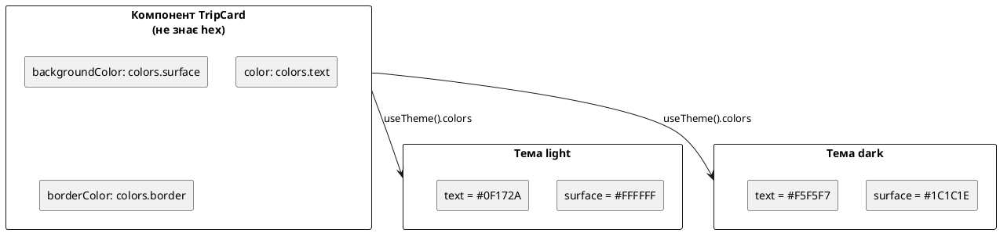
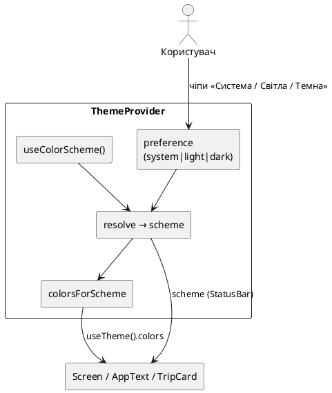

# StyleSheet і теми (light / dark)

::tip
**Код Nomad.** Наскрізний застосунок курсу живе в окремому репозиторії: [https://github.com/arakviel/nomad](https://github.com/arakviel/nomad). Клонуйте його поруч із навчанням (`git clone https://github.com/arakviel/nomad.git`). Кожен коміт у тому репо відповідає статті (`Material: …` у тілі коміту). У monorepo kostyl.dev лише **матеріали** курсу (markdown); код застосунку — у репозиторії Nomad вище.
::

## Навіщо ця стаття

Уявіть типовий вечір: людина відкриває щоденник подорожей у метро, у телефоні давно увімкнений **темний режим** (Dark Mode) — системна налаштування «темні екрани, менше сліпить». Більшість улюблених застосунків уже підлаштувались: фон темний, текст світлий, статус-бар читабельний. Якщо **ваш** застосунок лишається сліпучо-білим, користувач не думає «ой, у них ще не зробили StyleSheet.create». Він думає: «цей додаток виглядає застаріло / неввічливо до очей» — і закриває його.

У попередніх матеріалах стилі вже з’являлись: `StyleSheet.create`, `tokens.colors.primary`, інколи `useColorScheme` у прев’ю. Але в Nomad кольори досі були **одні** — світла палітра «намертво» вшита в об’єкт `tokens`. Перемикач системи **нічого** не змінював на екрані, бо компоненти питали не «який зараз режим?», а «який hex записаний у файлі раз і назавжди?».

Ця стаття з’єднує дві речі, які на вебі часто плутають:

1. **Як описувати вигляд** елемента в React Native (об’єкти стилів, `StyleSheet`, масиви) — аналог CSS, але **інший** механізм.  
2. **Як міняти «шкіру» всього застосунку** (світла / темна тема, семантичні імена кольорів) — аналог CSS-змінних і `prefers-color-scheme`, але знову ж **своїми** інструментами.

### Терміни простими словами (зразу)

**Стиль (style)** у React Native — це звичайний JavaScript-об’єкт (або зареєстрований через `StyleSheet` ідентифікатор), який каже нативному UI: «відступ 16, заокруглення 12, колір фону такий-то». Немає окремого файлу `.css`, немає селекторів `.card > .title`.

**Тема (theme, «тема оформлення»)** — узгоджений **набір значень** (передусім кольорів, інколи тіней) для **режиму відображення**. Найчастіше два режими: **світлий** (*light*) і **темний** (*dark*). Тема — не «красивий шаблон з Figma», а **словник**, з якого всі екрани беруть одні й ті самі ролі кольорів.

**Семантичний токен (semantic token)** — ім’я за **роллю**, а не за відтінком.  
Приклад: `surface` означає «поверхня картки / панелі», а не «білий». У light `surface` може бути `#FFFFFF`, у dark — `#1C1C1E`. Компонент пише `colors.surface` і **не знає**, який саме hex підставлять сьогодні.

**Схема кольорів (color scheme)** — відповідь операційної системи (або вашого перемикача): зараз світлий чи темний інтерфейс. Хук `useColorScheme` читає **системну** схему.

**Перевага користувача (preference)** у нашому коді — що **обрав** людина в застосунку: «як у системі», «завжди світла», «завжди темна». Це вже не чиста ОС, а **ваш** стан (поки в пам’яті; збереження на диск — пізніше).

Після статті ви зможете:

1. Пояснити, чим RN-стилі відрізняються від CSS і навіщо `StyleSheet.create`.  
2. Складати `style={[…]}` без сюрпризів із перекриттям.  
3. Відокремити **геометрію** (padding, radius) від **кольорів теми**.  
4. Зчитати системну тему і **перевизначити** її вибором користувача.  
5. У **Nomad** — жити з `ThemeProvider` і палітрами light/dark без «зашитого» лише білого UI.

::note
**Головна думка.** Стилі описують **форму** (відступи, радіус, flex, розташування). Тема описує **забарвлення ролей** (фон екрана, поверхня картки, основний текст, акцент кнопки). Якщо в компоненті написано `backgroundColor: '#fff'`, темна тема **ніколи** «сама» не з’явиться — рядок уже вирішив колір назавжди. Якщо написано `backgroundColor: colors.surface`, достатньо підмінити **словник** кольорів — компонент перемалюється з новою шкірою, без правок у десятках файлів.
::

::tip
**Живі прев’ю.** Як і раніше: `::react-native-preview` = react-native-web у рамці телефону. Імпорти `@/…` і `expo-*` у прев’ю **не** працюють — демо самодостатні. Системну тему прев’ю може підхопити з ОС / теми сайту через `useColorScheme`; це зручно для демо, але **не** замінює перевірку в Expo Go на телефоні (там інший StatusBar, інші відтінки, реальний Dark Mode системи).
::

---

## Місток з web React / CSS

На вебі ви звикли до трьох шарів:

1. **Розмітка** (JSX / HTML) — що є на сторінці.  
2. **CSS** — як воно виглядає (часто в іншому файлі або через Tailwind-класи).  
3. **Тема** — CSS variables, `data-theme`, `prefers-color-scheme`, інколи Context у React.

У React Native **розмітка** лишається JSX, але «CSS-файлу» немає. Замість нього — **prop `style`** на майже кожному візуальному компоненті. Значення — об’єкт (або масив об’єктів / зареєстрованих стилів). Під капотом RN перетворює це на властивості **нативних** view (UIView / android.view), а не на CSSOM браузера.

| У браузері | У React Native | Що це означає для вас |
| ---------- | -------------- | --------------------- |
| CSS-файл, CSS Modules, Tailwind | об’єкти + `StyleSheet` | Немає глобальних селекторів `.card { }`, немає «каскаду по дереву HTML» у класичному сенсі |
| `className="card active"` | `style={[styles.card, active && styles.active]}` | Стани вмикаєте **в JSX** умовами, не другим класом у рядку |
| CSS variables (`--bg`) | **токени** + тема (Context / props) | «Змінні» — ваш TypeScript-об’єкт, не `:root` |
| `prefers-color-scheme` | `useColorScheme()` / модуль `Appearance` | Система повідомляє light/dark; підписка через хук |
| `color-scheme` на `html` | `StatusBar` + кольори екрана | Системні іконки зверху **не** підлаштовуються самі лише від фону `View` |

### Що ламається, якщо мислити «як у CSS»

- **Немає** `!important`, немає специфічності селекторів. Є лише **порядок у масиві** `style={[a, b, c]}` — хто правіше, той перемагає в конфлікті ключів.  
- **Немає** успадкування `color` / `font-size` на всі вкладені `View` як у HTML. Текст живе в `Text`; стилі тексту не «просочуються» в дочірні `View`. (Вкладений `Text` у `Text` — окрема історія, вже була в core-components.)  
- **Немає** «підключив dark.css і все перефарбувалось». Поки компонент читає літерал `#fff`, ніякий Dark Mode ОС йому не допоможе.

::warning
**Web-звичка.** Шукати `dark:` як у Tailwind або `:root[data-theme=dark]` і чекати, що RN «зрозуміє». У шляху курсу (StyleSheet + токени, без NativeWind) темна тема — це **ваші** дві палітри + хук/контекст + дисципліна «не писати hex у компонентах». Це не гірше — просто **явніше**: ви бачите, звідки взявся колір.
::

::tip
**Аналогія.** CSS на сайті — як загальні правила будинку («усі двері коричневі»). Стилі RN — як **наклейка на кожні двері окремо**: «ця — 16 px padding, ось такий колір». Тема — як **палітра фарб на складі**: сьогодні видаємо світлі банки з етикеткою `surface`, завтра — темні з тією ж етикеткою. Майстер (компонент) просить «банку `surface`», а не «білу №12».
::

---

## Як RN малює «вигляд» (без CSS-рушія)

Коротко, щоб не здавалось магією:

1. Ви пишете `<View style={…} />`.  
2. React Native (разом із нативним шаром) застосовує ці властивості до **платформенного** прямокутника на екрані.  
3. Flexbox (попередня стаття) рахує **розміри й позиції**.  
4. Колір, бордер, тінь, прозорість — окремі властивості того ж стилю.

Тому «стилізація» у мобільному React — це не «підключити stylesheet до сторінки», а **проп на конкретному елементі**, плюс домовленість команди, **звідки** брати повторювані значення (токени, тема).

---

## `StyleSheet` — навіщо цей модуль

**`StyleSheet`** — вбудований модуль React Native для роботи зі стилями. Найчастіший виклик — **`StyleSheet.create({ … })`**: ви передаєте об’єкт «ім’я → опис вигляду», отримуєте об’єкт з тими ж ключами для `style={styles.card}`.

### Навіщо не писати все inline

Технічно так можна:

```tsx
<View style={{ flex: 1, padding: 16, backgroundColor: '#F8FAFC' }} />
```

На маленькому демо це читабельно. У реальному екрані з’являються проблеми:

- JSX **роздувається**: важко побачити структуру «шапка / список / кнопка» серед об’єктів.  
- Ті самі відступи й радіуси **копіюють** у п’ять місць — потім міняєте «16» на «12» і забуваєте одне.  
- Умови (`pressed`, `disabled`, `error`) перетворюють `style={{…}}` на важкий для читання вираз.

`StyleSheet.create` — домовленість «**вигляд зібрано окремо**, JSX описує склад». Це схоже на CSS Modules: імена локальні, але без окремого синтаксису CSS.

### Що реально дає `create` на практиці

1. **Ясність** — стилі внизу файлу (або в `Foo.styles.ts`); у JSX лишаються імена.  
2. **Підказки TypeScript / dev** — зайва властивість або неправильний тип частіше «світиться» раніше, ніж на пристрої.  
3. **Передбачуваний патерн у команді** — новий розробник шукає `StyleSheet.create` і одразу розуміє, де живе вигляд.  
4. **Оптимізації з боку RN** (історично: реєстрація стилів, менше «сирих» об’єктів на мості). Деталі змінювались між версіями; **не** будуйте архітектуру заради мікробенчмарків. Будуйте заради **читабельності** й єдиного місця правки.

::note
**Важливо.** `StyleSheet.create` **не** робить стилі «реактивними до теми» саме по собі. Якщо **всередині** `create` на рівні модуля ви написали `backgroundColor: '#F8FAFC'`, це значення зафіксоване в момент завантаження модуля. Темна тема підключається інакше: або різні об’єкти стилів, або (краще) **динамічний** колір у render: `[styles.card, { backgroundColor: colors.surface }]`.
::

::field-group

::field{name="StyleSheet.create(obj)" type="API"}
Приймає об’єкт `{ name: ViewStyle | TextStyle | ImageStyle }`, повертає об’єкт з тими ж ключами. Використовуйте: `style={styles.name}` або в масиві.
::

::field{name="StyleSheet.flatten(style)" type="API"}
Зводить масив / вкладені стилі до **одного** плоского об’єкта. Потрібно рідко в UI; зручно в тестах («який підсумковий fontSize?») або при дебазі. У звичайному JSX flatten викликає сам RN.
::

::field{name="StyleSheet.absoluteFill" type="preset"}
Готовий стиль: абсолютне позиціонування на всі чотири краї батька (`top/left/right/bottom: 0`). Типовий сценарій — напівпрозорий **оверлей** поверх картки чи екрана.
::

::field{name="StyleSheet.absoluteFillObject" type="preset"}
Те саме як **звичайний об’єкт** (не «зареєстрований» стиль): можна `...StyleSheet.absoluteFillObject` і додати `backgroundColor`, `zIndex`.
::

::field{name="StyleSheet.hairlineWidth" type="number"}
Найтонша лінія, яку платформа ще малює акуратно (часто менше за 1 логічний піксель). Для розділювачів `borderBottomWidth: StyleSheet.hairlineWidth` виглядає «як системний» список, а не груба смуга.
::

::

### Inline vs StyleSheet: коли що

```tsx
// Працює, але шумно, якщо так на кожному елементі
<View style={{ flex: 1, padding: 16, backgroundColor: '#F8FAFC' }} />

// Звичка курсу для геометрії
<View style={styles.screen} />

const styles = StyleSheet.create({
  screen: { flex: 1, padding: 16 },
});
```

**Inline доречний**, коли значення **обчислюється зараз** і не варте окремого імені:

```tsx
// Колір з поточної теми — так і треба
<View style={[styles.card, { backgroundColor: colors.surface }]} />
```

Тут `styles.card` тримає стабільне: `borderRadius`, `borderWidth`, `overflow`.  
`colors.surface` — з теми, може змінитись між light і dark без нового `StyleSheet.create`.

### Масив стилів — «каскад у мініатюрі»

У CSS кілька класів і специфічність. У RN ви **явно** складаєте шари:

```tsx
style={[
  styles.base,           // 1. база
  pressed && styles.pressed, // 2. стан жесту
  disabled && styles.disabled, // 3. стан «вимкнено»
  styleFromProps,        // 4. те, що передав батько (часто перемагає)
]}
```

**Порядок:** зліва направо. Якщо і `base`, і `pressed` задають `backgroundColor`, перемагає **пізніший**.

`false` / `null` / `undefined` у масиві **ігноруються**. Тому `cond && styles.x` безпечний: коли `cond` хибний, у масив потрапляє `false`, і RN його відкидає.

::tip
**Що бачить користувач.** Натискає кнопку — на мить темнішає (`pressed`). Це не окремий «CSS :active файл», а **той самий** `Pressable`, який у функціональному `style={({ pressed }) => […]}` підмішує другий шар. Розробник у коді бачить усі стани поруч; у DevTools вебу «Computed styles» у тому ж вигляді немає — дивіться код і прев’ю.
::

### Типова помилка: `create` всередині компонента на кожен render

```tsx
function Card() {
  const styles = StyleSheet.create({ box: { padding: 16 } }); // погана звичка
  return <View style={styles.box} />;
}
```

На кожному рендері створюється новий набір. Для теми це **не** вирішує light/dark. Виносьте **стабільну** геометрію на рівень модуля; динаміку — у масив у JSX.

### Платформа: тіні й hairline

Уже бачили `Platform.select` для тіні (iOS `shadow*`, Android `elevation`). Це **теж** частина стилізації, не теми. Тема може змінити `shadowOpacity` у dark (тінь на чорному майже невидима) — але спочатку відокремте: «як малюємо тінь» vs «які кольори ролей».

### Демо: StyleSheet + масив

::react-native-preview{title="StyleSheet · масив стилів" device="iphone" filename="StyleSheetArray.tsx"}

```tsx
import { useState } from 'react';
import { View, Text, Pressable, StyleSheet, useColorScheme } from 'react-native';

export default function App() {
  const [on, setOn] = useState(false);
  const isDark = useColorScheme() === 'dark';
  const text = isDark ? '#f5f5f7' : '#0f172a';

  return (
    <View style={[styles.screen, isDark && styles.screenDark]}>
      <Text style={[styles.title, { color: text }]}>Масив стилів</Text>
      <Pressable
        onPress={() => setOn((v) => !v)}
        style={({ pressed }) => [
          styles.btn,
          on && styles.btnOn,
          pressed && styles.btnPressed,
        ]}
      >
        <Text style={styles.btnText}>{on ? 'Увімкнено' : 'Вимкнено'}</Text>
      </Pressable>
      <Text style={[styles.hint, { color: isDark ? '#a1a1aa' : '#64748b' }]}>
        base → (on ? on) → (pressed ? pressed). Натисніть кілька разів.
      </Text>
    </View>
  );
}

const styles = StyleSheet.create({
  screen: {
    flex: 1,
    backgroundColor: '#F8FAFC',
    padding: 24,
    justifyContent: 'center',
    gap: 16,
  },
  screenDark: { backgroundColor: '#000' },
  title: { fontSize: 20, fontWeight: '700' },
  btn: {
    backgroundColor: '#94a3b8',
    paddingVertical: 14,
    borderRadius: 12,
    alignItems: 'center',
  },
  btnOn: { backgroundColor: '#2563EB' },
  btnPressed: { opacity: 0.85 },
  btnText: { color: '#fff', fontWeight: '700', fontSize: 16 },
  hint: { fontSize: 13, lineHeight: 18 },
});
```

::

### `absoluteFill` — оверлей

::react-native-preview{title="absoluteFill overlay" device="android" filename="AbsoluteFillDemo.tsx"}

```tsx
import { View, Text, StyleSheet, useColorScheme } from 'react-native';

export default function App() {
  const isDark = useColorScheme() === 'dark';

  return (
    <View style={[styles.screen, isDark && { backgroundColor: '#000' }]}>
      <View style={styles.card}>
        <Text style={styles.cardText}>Картка під оверлеєм</Text>
        <View style={[StyleSheet.absoluteFill, styles.overlay]}>
          <Text style={styles.overlayText}>Оверлей</Text>
        </View>
      </View>
      <Text style={{ color: isDark ? '#a1a1aa' : '#64748b', marginTop: 16, fontSize: 13 }}>
        StyleSheet.absoluteFill розтягує View на весь батько.
      </Text>
    </View>
  );
}

const styles = StyleSheet.create({
  screen: { flex: 1, backgroundColor: '#F8FAFC', padding: 24, justifyContent: 'center' },
  card: {
    height: 160,
    borderRadius: 16,
    backgroundColor: '#dbeafe',
    alignItems: 'center',
    justifyContent: 'center',
    overflow: 'hidden',
  },
  cardText: { fontSize: 16, fontWeight: '600', color: '#1e3a8a' },
  overlay: {
    backgroundColor: 'rgba(15, 23, 42, 0.55)',
    alignItems: 'center',
    justifyContent: 'center',
  },
  overlayText: { color: '#fff', fontWeight: '700', fontSize: 18 },
});
```

::

---

## Семантичні токени (не «синій», а «primary»)

### Звідки взялась ідея

У статті 05 з’явився файл **tokens** — словник відступів, радіусів, кольорів. Тоді мета була простіша: **не розмножувати** `#2563EB` у десяти кнопках. Тепер додаємо другий вимір: той самий словник має вміти **дві шкіри** (light і dark), не ламаючи компоненти.

На вебі в дизайн-системах (і в Figma) розрізняють рівні приблизно так:

1. **Примітивні** значення: `blue-600 = #2563EB`, `gray-50 = #F8FAFC` — «як у віялі фарб».  
2. **Семантичні** ролі: `color.bg.canvas`, `color.fg.default`, `color.action.primary` — «для чого ця фарба на екрані».

У малому навчальному застосунку ми **не** будуємо повну трирівневу систему з сотнею токенів. Але правило одне: **у JSX компонентів живуть ролі**, а hex — лише в таблицях light/dark.

### Погано vs добре

| Погано (прив’язка до відтінку) | Краще (роль) | Чому |
| ----------------------------- | ------------ | ---- |
| `blue500` у `TripCard` | `primary` | Бренд може змінити синій — роль «головна дія» лишається |
| `#fff` у двадцяти файлах | `colors.surface` | Dark не білий; одне місце правки |
| `gray900` для тексту | `colors.text` | У dark текст світлий, не «сірий-900» |
| «темна тема = інвертувати все» | **друга таблиця** з тими ж ключами | Фото, карта, логотип бренду **не** інвертують |

### Ролі, які реально потрібні на старті Nomad

::field-group

::field{name="background" type="роль"}
Фон **екрана** (полотно). У light — світло-сірий/off-white, у dark — майже чорний. Користувач бачить «колір застосунку за картками».
::

::field{name="surface" type="роль"}
Поверхня **піднятого** блоку: картка, модалка, нижня панель. Зазвичай трохи **інша**, ніж `background`, щоб картка відділялась від полотна без обов’язкової жирної рамки.
::

::field{name="text / textSecondary" type="роль"}
Основний і другорядний текст. Secondary — підписи, дати, підказки: менший контраст, але все ще читабельний.
::

::field{name="primary / primaryPressed" type="роль"}
Акцент дій (кнопка «Нова поїздка», активний чіп). Pressed — трохи темніший/світліший відтінок на час дотику.
::

::field{name="border" type="роль"}
Лінії розділення, обводка картки. У dark бордери часто **світліші за фон**, але не білі «як крейда».
::

::field{name="onPrimary" type="роль"}
Текст/іконка **на** тлі `primary` (зазвичай білий). Окрема роль, щоб не плутати з `text` екрана.
::

::field{name="danger" type="роль"}
Помилки, деструктивні дії. У dark часто трохи м’якший червоний, щоб не «палав» на чорному.
::

::

::plant-uml



::

**Правило однією фразою:** компонент знає *роль* («я поверхня картки»), тема знає *конкретний колір* для light і dark.

### Що зазвичай **не** міняють між темами

- **Відступи** (`spacing`: 4, 8, 16…) — ритм сітки той самий.  
- **Радіуси** карток і кнопок.  
- **Розміри шрифтів** (інколи в dark трохи збільшують міжрядковість, але це вже полірування).

Міняються переважно **кольори** і інколи **тіні** (на темному тлі важка тінь майже невидима — інколи зменшують opacity або покладаються на `border`).

### Що бачить користувач / що ламається

- **Добре:** перемкнув тему — екран і картки узгоджено змінили шкіру, кнопка лишилась «головною дією» (primary), фото обкладинки поїздки **не** інвертувалось.  
- **Погано:** фон став чорним, а текст у `AppText` лишився `#0F172A` — майже невидимий. Причина: десь лишився зашитий hex або `tokens.colors` зі старої світлої-only таблиці.

---

## Системна тема: що це в житті

На iPhone: **Налаштування → Екран і яскравість → Світлий / Темний / Авто**.  
На Android: схожий перемикач у налаштуваннях дисплея (назви залежать від виробника).

Коли користувач обирає темний режим, **система** повідомляє застосункам: «зараз dark». Багато системних екранів і «чемних» застосунків підлаштовуються. Ваш код отримає це через API **Appearance** / хук **`useColorScheme`**.

### `useColorScheme()`

**`useColorScheme()`** — хук React Native, який повертає поточну **схему кольорів**:

- `'light'` — світла;  
- `'dark'` — темна;  
- `null` — модуль Appearance недоступний (рідко на реальному телефоні; трапляється в нестандартних середовищах).

Хук **підписується** на зміни: користувач увімкнув Dark Mode — компонент **перерендериться** з новим значенням. Вам не треба самим крутити таймери чи «перевіряти раз на хвилину».

Під капотом — модуль **`Appearance`**:

- `Appearance.getColorScheme()` — зчитати зараз (без підписки);  
- `Appearance.addChangeListener(...)` — імперативна підписка.

У UI-коді курсу достатньо хука: він уже підписаний і зручний у функційних компонентах.

::tip
**Аналогія з вебом.** `window.matchMedia('(prefers-color-scheme: dark)')` + listener. У RN — `useColorScheme()`, без ручного `matchMedia`.
::

::react-native-preview{title="useColorScheme" device="iphone" filename="UseColorSchemeDemo.tsx"}

```tsx
import { View, Text, StyleSheet, useColorScheme } from 'react-native';

export default function App() {
  const scheme = useColorScheme();
  const isDark = scheme === 'dark';

  return (
    <View style={[styles.screen, { backgroundColor: isDark ? '#000' : '#F8FAFC' }]}>
      <Text style={[styles.label, { color: isDark ? '#a1a1aa' : '#64748b' }]}>
        useColorScheme()
      </Text>
      <Text style={[styles.value, { color: isDark ? '#f5f5f7' : '#0f172a' }]}>
        {scheme ?? 'null'}
      </Text>
      <Text style={[styles.hint, { color: isDark ? '#a1a1aa' : '#64748b' }]}>
        Змініть тему ОС або тему сайту — прев’ю може оновитись. У Expo Go
        перемикайте appearance симулятора / телефону.
      </Text>
    </View>
  );
}

const styles = StyleSheet.create({
  screen: { flex: 1, padding: 24, justifyContent: 'center', gap: 8 },
  label: { fontSize: 13, fontWeight: '600', textTransform: 'uppercase' },
  value: { fontSize: 32, fontWeight: '800' },
  hint: { fontSize: 13, lineHeight: 18, marginTop: 8 },
});
```

::

::tip
**Лише система — мало для продукту.** Багато людей хочуть: «телефон у мене темний, але **цей** застосунок лиши світлим» (наприклад, читати при денному світлі) або навпаки. Тому зрілі продукти дають вибір:

- **Як у системі** (*system*) — слухаємо `useColorScheme`;  
- **Завжди світла** (*light*);  
- **Завжди темна** (*dark*).

Тоді `useColorScheme` — **один із входів** для режиму `system`, а не єдине джерело істини для всього UI. Нижче з’явиться `preference` + функція `resolve`.
::

::warning
**Прев’ю в браузері ≠ телефон.** У `::react-native-preview` `useColorScheme` може йти від теми **сайту** або браузера. У Expo Go — від **симулятора/телефона**. Завжди перевіряйте Dark Mode там, де користувач реально відкриє Nomad.
::

---

## Дві палітри з **однаковими** ключами

Чому саме **дві таблиці**, а не `isDark ? '#000' : '#fff'` у кожному рядку?

1. **Один контракт для TypeScript** — `ColorTokens` з тими ж полями; забутий ключ у dark видно одразу.  
2. **Дизайн узгоджує набори**, а не «випадкові тернарники» в 40 файлах.  
3. **Компонент не розгалужується** на light/dark — лише читає `colors.X`.

```ts
export const lightColors = {
  background: '#F8FAFC',
  surface: '#FFFFFF',
  text: '#0F172A',
  textSecondary: '#64748B',
  primary: '#2563EB',
  primaryPressed: '#1D4ED8',
  border: '#E2E8F0',
  danger: '#DC2626',
  onPrimary: '#FFFFFF',
} as const;

export const darkColors = {
  background: '#000000',
  surface: '#1C1C1E',
  text: '#F5F5F7',
  textSecondary: '#A1A1AA',
  primary: '#3B82F6',
  primaryPressed: '#2563EB',
  border: '#3A3A3C',
  danger: '#F87171',
  onPrimary: '#FFFFFF',
} as const;
```

Перемикання в одному місці:

```ts
function colorsForScheme(scheme: 'light' | 'dark') {
  return scheme === 'dark' ? darkColors : lightColors;
}

const colors = colorsForScheme(scheme);
```

Усі екрани читають `colors.*` — **жодного** `#F8FAFC` у `TripCard`.

### `background` vs `surface` — навіщо два «темні» / два «світлі»

Якщо і екран, і картка одного кольору, список **зливається** в одну пляму. У світлій темі часто: полотно злегка сіре (`background`), картка біла (`surface`). У темній: полотно чорне, картка темно-сіра (`#1C1C1E` тощо). Користувач **відчуває глибину** без важких тіней.

### Контраст і доступність (на рівні інтуїції)

::warning
**Контраст.** У dark не достатньо «зробити фон чорним». Сірий текст `#64748B` на `#000` може стати **занадто** тьмяним; інколи secondary у dark роблять світлішим (`#A1A1AA`). Перевіряйте на реальному екрані (яскравість, OLED), не лише в прев’ю. Повний аудит a11y — окрема стаття пізніше; зараз мінімум: **прочитати** заголовок і підпис очима.
::

### Чого **не** класти в палітру теми

- URL фото обкладинки;  
- «магічні» відступи layout (вони в `spacing`);  
- колір, який **завжди** білий на логотипі вендора (окремий виняток, не `text`).

---

## ThemeProvider: system / light / dark

### Навіщо Context, якщо є `useColorScheme`

Можна в **кожному** екрані писати:

```tsx
const scheme = useColorScheme() === 'dark' ? 'dark' : 'light';
const colors = colorsForScheme(scheme);
```

На трьох екранах це стерпно. Далі з’являються проблеми:

- скрізь дублюється resolve;  
- **немає** спільного «завжди темна», бо кожен екран слухає лише систему;  
- примітиви (`Button`, `AppText`) не знають, звідки брати кольори, якщо не передавати `colors` пропсами крізь 10 рівнів.

**React Context** (контекст) — спосіб віддати значення **всім нащадкам** без проп-дрілінгу. На вебі ви вже бачили Context для теми або i18n. Тут так само:

1. Зверху дерево обгортає **`ThemeProvider`**.  
2. Всередині — стан **`preference`** і обчислення **`scheme`** + **`colors`**.  
3. Будь-який нащадок викликає **`useTheme()`** і отримує той самий словник.

Redux / Zustand для теми **можна** (пізніше в курсі з’явиться store для налаштувань). На цьому кроці Context **достатньо** і прозоріше для навчання: видно потік даних без зайвої інфраструктури.

### Алгоритм resolve (словами)

::steps

### Користувач обрав preference

`system` | `light` | `dark` — наприклад, чіпами на домашньому екрані.

### Читаємо систему

`useColorScheme()` → `'light' | 'dark' | null`.

### Рахуємо scheme (фактична шкіра)

- якщо preference = `light` або `dark` → **scheme = preference** (система ігнорується);  
- якщо preference = `system` → **scheme =** системна (а `null` трактуємо як light, щоб UI не «завис»).

### Рахуємо colors

`colors = colorsForScheme(scheme)`.

### UI читає лише colors (і scheme для StatusBar)

Компоненти не знають, *чому* зараз dark — лише *які* кольори малювати.

::

::plant-uml



::

### Патерн у корені Expo Router

У `app/_layout.tsx` Provider має обгортати **все**, що викликає `useTheme`. Типова помилка:

```tsx
// Погано: useTheme у тому ж компоненті, де ще немає Provider «нижче себе»
export default function RootLayout() {
  const { colors } = useTheme(); // вибухне
  return (
    <ThemeProvider>
      <Stack />
    </ThemeProvider>
  );
}
```

Правильно — **внутрішній** компонент під Provider:

```tsx
export default function RootLayout() {
  return (
    <ThemeProvider>
      <RootNavigator />
    </ThemeProvider>
  );
}

function RootNavigator() {
  const { colors, scheme } = useTheme();
  return (
    <>
      <StatusBar style={scheme === 'dark' ? 'light' : 'dark'} />
      <Stack screenOptions={{ contentStyle: { backgroundColor: colors.background } }} />
    </>
  );
}
```

### Що віддає `useTheme()` (контракт курсу)

| Поле | Навіщо |
| ---- | ------ |
| `scheme` | Фактична light/dark (для StatusBar, підписів «зараз темна») |
| `preference` | Що обрано в UI (підсвітка чіпа) |
| `setPreference` | Змінити вибір |
| `colors` | Семантична палітра |
| `spacing` / `radius` / `fontSize` | Токени форми (спільні для тем) |

### StyleSheet + тема разом (формула)

```tsx
const { colors, spacing } = useTheme();

// геометрія — зі styles (модуль)
// колір і інколи відступ з теми — у масиві
<View
  style={[
    styles.card,
    {
      backgroundColor: colors.surface,
      borderColor: colors.border,
      padding: spacing.md,
    },
  ]}
/>
```

Так ви **не** намагаєтесь «пересоздати» `StyleSheet` на кожну зміну теми і **не** ховаєте hex у create на рівні файлу.

### StatusBar — окремий шар «системного хрома»

**Status bar** (рядок стану) — зона зверху з годинником, батареєю, сигналом. Її малює **система**, не ваш `View`. Колір **іконок** на ній треба узгодити з фоном:

- темний фон екрана → **світлі** іконки;  
- світлий фон → **темні** іконки.

З пакетом **`expo-status-bar`** (уже в Expo-проєктах):

```tsx
import { StatusBar } from 'expo-status-bar';

<StatusBar style={scheme === 'dark' ? 'light' : 'dark'} />
```

Тут плутанина в назвах:

- `style="light"` означає **світлі** іконки (для **темного** фону);  
- `style="dark"` — **темні** іконки (для **світлого** фону).

У core API `StatusBar` з `react-native` інші рядки: `barStyle="light-content" | "dark-content"` — той самий сенс, інші слова. У міні-проєкті blank можна core; у Nomad зручніше `expo-status-bar`.

::caution
**Що ламається.** Забули StatusBar при dark: чорний фон + чорні іконки → користувач не бачить час і батарею. Це виглядає як «зламаний» застосунок, хоча «основний» UI ок.
::

---

## Playground: light / dark картка

::react-native-preview{title="Семантичні кольори · toggle" device="iphone" filename="ThemeTogglePlayground.tsx"}

```tsx
import { useState } from 'react';
import { View, Text, Pressable, StyleSheet } from 'react-native';

const light = {
  background: '#F8FAFC',
  surface: '#FFFFFF',
  text: '#0F172A',
  textSecondary: '#64748B',
  primary: '#2563EB',
  border: '#E2E8F0',
  onPrimary: '#FFFFFF',
};

const dark = {
  background: '#000000',
  surface: '#1C1C1E',
  text: '#F5F5F7',
  textSecondary: '#A1A1AA',
  primary: '#3B82F6',
  border: '#3A3A3C',
  onPrimary: '#FFFFFF',
};

export default function App() {
  const [mode, setMode] = useState<'light' | 'dark'>('light');
  const c = mode === 'dark' ? dark : light;

  return (
    <View style={[styles.screen, { backgroundColor: c.background }]}>
      <View style={styles.row}>
        <Pressable
          onPress={() => setMode('light')}
          style={[
            styles.chip,
            {
              backgroundColor: mode === 'light' ? c.primary : c.surface,
              borderColor: c.border,
            },
          ]}
        >
          <Text
            style={{
              color: mode === 'light' ? c.onPrimary : c.text,
              fontWeight: '600',
            }}
          >
            Світла
          </Text>
        </Pressable>
        <Pressable
          onPress={() => setMode('dark')}
          style={[
            styles.chip,
            {
              backgroundColor: mode === 'dark' ? c.primary : c.surface,
              borderColor: c.border,
            },
          ]}
        >
          <Text
            style={{
              color: mode === 'dark' ? c.onPrimary : c.text,
              fontWeight: '600',
            }}
          >
            Темна
          </Text>
        </Pressable>
      </View>

      <View
        style={[
          styles.card,
          { backgroundColor: c.surface, borderColor: c.border },
        ]}
      >
        <Text style={[styles.cardTitle, { color: c.text }]}>Карпати 2026</Text>
        <Text style={{ color: c.textSecondary, marginTop: 6, lineHeight: 20 }}>
          Кольори з палітри «{mode}». Той самий JSX — інші значення токенів.
        </Text>
        <View style={[styles.badge, { backgroundColor: c.primary }]}>
          <Text style={{ color: c.onPrimary, fontWeight: '700', fontSize: 12 }}>
            primary
          </Text>
        </View>
      </View>
    </View>
  );
}

const styles = StyleSheet.create({
  screen: { flex: 1, padding: 20, gap: 16, justifyContent: 'center' },
  row: { flexDirection: 'row', gap: 8 },
  chip: {
    paddingHorizontal: 14,
    paddingVertical: 10,
    borderRadius: 10,
    borderWidth: 1,
  },
  card: {
    borderRadius: 16,
    borderWidth: 1,
    padding: 16,
  },
  cardTitle: { fontSize: 18, fontWeight: '700' },
  badge: {
    alignSelf: 'flex-start',
    marginTop: 12,
    paddingHorizontal: 10,
    paddingVertical: 6,
    borderRadius: 8,
  },
});
```

::

---

## Антипатерни (і що замість)

Ці помилки з’являються не тому, що хтось «не знає API», а тому, що тема **розмазується** по проєкту без єдиного правила.

::accordion

::accordion-item{label="Hex у кожному компоненті" icon="i-lucide-bug"}
**Симптом:** темна тема = PR на 40 файлів.  
**Чому болить:** колір продублювали, половину забули.  
**Замість:** hex лише в `lightColors` / `darkColors` (або майбутній design-tokens pipeline). У JSX — `colors.*`.
::

::accordion-item{label="StyleSheet.create усередині render" icon="i-lucide-bug"}
**Симптом:** «я створюю create від isDark на кожен render».  
**Чому болить:** зайва робота, складно дебажити, все одно дублюєте палітри.  
**Замість:** геометрія в `create` на рівні модуля; кольори — `[styles.x, { color: colors.text }]`.
::

::accordion-item{label="colors зашиті в create на рівні файлу" icon="i-lucide-bug"}
**Симптом:** `StyleSheet.create({ box: { backgroundColor: tokens.colors.background } })` раз при імпорті — dark не підхоплюється.  
**Замість:** не класти **темозалежні** кольори в модульний `create`, або створювати стилі від `colors` через хук обережно (у курсі — масив у JSX).
::

::accordion-item{label="Забути StatusBar" icon="i-lucide-bug"}
**Симптом:** темний UI, «немає» годинника.  
**Замість:** `StatusBar` / `expo-status-bar` від `scheme`.
::

::accordion-item{label="Лише isDark && styles.dark у 30 місцях" icon="i-lucide-bug"}
**Симптом:** кожен екран винаходить свій dark.  
**Замість:** `colorsForScheme` + `useTheme()` один раз.
::

::accordion-item{label="Інверсія «всіх» кольорів фільтром" icon="i-lucide-bug"}
**Симптом:** фото поїздки виглядає як негатив; логотип бренду «перекинувся».  
**Замість:** семантичні ролі; контентні зображення не чіпати.
::

::accordion-item{label="useTheme поза Provider" icon="i-lucide-bug"}
**Симптом:** червоний екран / throw при старті.  
**Замість:** `ThemeProvider` у корені; хук лише в нащадках.
::

::

---

## Міні-проєкт «від А до Я»: Тема світла / темна

Окремий blank-проєкт (не Nomad). Мета — **один** екран з карткою профілю й перемикачем appearance.

### Постановка

1. Expo blank TypeScript.  
2. Дві палітри `light` / `dark` з однаковими ключами.  
3. Стан `mode: 'light' | 'dark'` (для міні-проєкту без «system» достатньо; system додасте в Nomad).  
4. Картка й фон беруть кольори **лише** з палітри.  
5. Підпис показує поточний режим.

### Крок 1. Проєкт

```bash
cd /path/to  # поруч: git clone https://github.com/arakviel/nomad.git
npx create-expo-app@latest theme-lab -t blank-typescript@sdk-54
cd theme-lab
npx expo start
```

### Крок 2. Замінити `App.tsx`

Повний лістинг згорнуто — розгорніть, щоб скопіювати.

::collapsible{title="Повний код App.tsx — розгорнути за потреби"}

```tsx
import { useState } from 'react';
import {
  View,
  Text,
  Pressable,
  StyleSheet,
  SafeAreaView,
  StatusBar,
} from 'react-native';

const light = {
  background: '#F8FAFC',
  surface: '#FFFFFF',
  text: '#0F172A',
  textSecondary: '#64748B',
  primary: '#2563EB',
  border: '#E2E8F0',
  onPrimary: '#FFFFFF',
};

const dark = {
  background: '#000000',
  surface: '#1C1C1E',
  text: '#F5F5F7',
  textSecondary: '#A1A1AA',
  primary: '#3B82F6',
  border: '#3A3A3C',
  onPrimary: '#FFFFFF',
};

type Mode = 'light' | 'dark';

export default function App() {
  const [mode, setMode] = useState<Mode>('light');
  const c = mode === 'dark' ? dark : light;

  return (
    <SafeAreaView style={[styles.safe, { backgroundColor: c.background }]}>
      <StatusBar barStyle={mode === 'dark' ? 'light-content' : 'dark-content'} />

      <View style={styles.header}>
        <Text style={[styles.title, { color: c.text }]}>Theme Lab</Text>
        <Text style={{ color: c.textSecondary, marginTop: 4 }}>
          Зараз: {mode === 'dark' ? 'темна' : 'світла'} тема
        </Text>
      </View>

      <View style={styles.row}>
        {(['light', 'dark'] as Mode[]).map((m) => {
          const active = mode === m;
          return (
            <Pressable
              key={m}
              onPress={() => setMode(m)}
              style={[
                styles.chip,
                {
                  backgroundColor: active ? c.primary : c.surface,
                  borderColor: c.border,
                },
              ]}
            >
              <Text
                style={{
                  color: active ? c.onPrimary : c.text,
                  fontWeight: '700',
                }}
              >
                {m === 'light' ? 'Світла' : 'Темна'}
              </Text>
            </Pressable>
          );
        })}
      </View>

      <View
        style={[
          styles.card,
          { backgroundColor: c.surface, borderColor: c.border },
        ]}
      >
        <View style={[styles.avatar, { backgroundColor: c.primary }]}>
          <Text style={{ color: c.onPrimary, fontWeight: '800', fontSize: 22 }}>Н</Text>
        </View>
        <Text style={[styles.name, { color: c.text }]}>Мандрівник Nomad</Text>
        <Text style={{ color: c.textSecondary, marginTop: 6, lineHeight: 20 }}>
          Кольори картки — семантичні токени. Перемкніть тему: той самий розмітка,
          інша палітра.
        </Text>
      </View>
    </SafeAreaView>
  );
}

const styles = StyleSheet.create({
  safe: { flex: 1 },
  header: { paddingHorizontal: 20, paddingTop: 12 },
  title: { fontSize: 28, fontWeight: '800' },
  row: {
    flexDirection: 'row',
    gap: 10,
    paddingHorizontal: 20,
    marginTop: 20,
  },
  chip: {
    paddingHorizontal: 16,
    paddingVertical: 12,
    borderRadius: 12,
    borderWidth: 1,
  },
  card: {
    margin: 20,
    marginTop: 24,
    padding: 20,
    borderRadius: 16,
    borderWidth: 1,
  },
  avatar: {
    width: 56,
    height: 56,
    borderRadius: 28,
    alignItems: 'center',
    justifyContent: 'center',
    marginBottom: 12,
  },
  name: { fontSize: 20, fontWeight: '700' },
});
```

::

### Крок 3. Анатомія

::steps

### Дві палітри, одні ключі

`light` і `dark` — однакові поля. Компонент ніколи не пише `#000` напряму для фону екрана.

### `const c = mode === 'dark' ? dark : light`

Один об’єкт `c` на рендер — усі `c.surface`, `c.text`.

### StyleSheet для геометрії

`padding`, `borderRadius`, `flex` — у `styles`. Кольори — у масиві / inline від `c`.

### StatusBar

`barStyle` залежить від `mode` (у core `StatusBar`; у Expo-проєктах часто `expo-status-bar` з `style="light" | "dark"`).

::

### Критерій «готово»

- Перемикач реально змінює фон, картку, текст.  
- У JSX картки **немає** hex поза палітрами.  
- Статус-бар читабельний в обох режимах.

### Живе прев’ю

::react-native-preview{title="Theme Lab" device="iphone" filename="ThemeLab.tsx" height="640"}

```tsx
import { useState } from 'react';
import { View, Text, Pressable, StyleSheet } from 'react-native';

const light = {
  background: '#F8FAFC',
  surface: '#FFFFFF',
  text: '#0F172A',
  textSecondary: '#64748B',
  primary: '#2563EB',
  border: '#E2E8F0',
  onPrimary: '#FFFFFF',
};

const dark = {
  background: '#000000',
  surface: '#1C1C1E',
  text: '#F5F5F7',
  textSecondary: '#A1A1AA',
  primary: '#3B82F6',
  border: '#3A3A3C',
  onPrimary: '#FFFFFF',
};

type Mode = 'light' | 'dark';

export default function App() {
  const [mode, setMode] = useState<Mode>('light');
  const c = mode === 'dark' ? dark : light;

  return (
    <View style={[styles.safe, { backgroundColor: c.background }]}>
      <View style={styles.header}>
        <Text style={[styles.title, { color: c.text }]}>Theme Lab</Text>
        <Text style={{ color: c.textSecondary, marginTop: 4 }}>
          Зараз: {mode === 'dark' ? 'темна' : 'світла'} тема
        </Text>
      </View>

      <View style={styles.row}>
        {(['light', 'dark'] as Mode[]).map((m) => {
          const active = mode === m;
          return (
            <Pressable
              key={m}
              onPress={() => setMode(m)}
              style={[
                styles.chip,
                {
                  backgroundColor: active ? c.primary : c.surface,
                  borderColor: c.border,
                },
              ]}
            >
              <Text
                style={{
                  color: active ? c.onPrimary : c.text,
                  fontWeight: '700',
                }}
              >
                {m === 'light' ? 'Світла' : 'Темна'}
              </Text>
            </Pressable>
          );
        })}
      </View>

      <View
        style={[
          styles.card,
          { backgroundColor: c.surface, borderColor: c.border },
        ]}
      >
        <View style={[styles.avatar, { backgroundColor: c.primary }]}>
          <Text style={{ color: c.onPrimary, fontWeight: '800', fontSize: 22 }}>Н</Text>
        </View>
        <Text style={[styles.name, { color: c.text }]}>Мандрівник Nomad</Text>
        <Text style={{ color: c.textSecondary, marginTop: 6, lineHeight: 20 }}>
          Кольори картки — семантичні токени. Перемкніть тему: той самий розмітка,
          інша палітра.
        </Text>
      </View>
    </View>
  );
}

const styles = StyleSheet.create({
  safe: { flex: 1 },
  header: { paddingHorizontal: 20, paddingTop: 12 },
  title: { fontSize: 28, fontWeight: '800' },
  row: {
    flexDirection: 'row',
    gap: 10,
    paddingHorizontal: 20,
    marginTop: 20,
  },
  chip: {
    paddingHorizontal: 16,
    paddingVertical: 12,
    borderRadius: 12,
    borderWidth: 1,
  },
  card: {
    margin: 20,
    marginTop: 24,
    padding: 20,
    borderRadius: 16,
    borderWidth: 1,
  },
  avatar: {
    width: 56,
    height: 56,
    borderRadius: 28,
    alignItems: 'center',
    justifyContent: 'center',
    marginBottom: 12,
  },
  name: { fontSize: 20, fontWeight: '700' },
});
```

::

---

## Nomad: light / dark + токени

### Навіщо користувачу

У метро ввечері білий екран сліпить. Хтось навпаки любить світлу тему завжди. Nomad має:

1. Слідувати **системі** за замовчуванням.  
2. Дозволити примусово **світлу** або **темну**.  
3. Малювати картки, тексти, кнопки з **однієї** палітри `useTheme().colors`.

### Структура файлів

Компонент `::code-tree` будує дерево **автоматично** з шляхів у квадратних дужках у кожного блоку коду (не з ASCII-гілок `├──`). Повні реалізації — у collapsible нижче; тут — огляд ролей файлів.

::code-tree

```ts [src/shared/theme/colors.ts]
// lightColors, darkColors, colorsForScheme — семантичні палітри light/dark.
```

```ts [src/shared/theme/tokens.ts]
// space, radius, fontSize (+ legacy tokens.colors як fallback).
```

```tsx [src/shared/theme/ThemeProvider.tsx]
// preference: system | light | dark → scheme + colors; useTheme().
```

```ts [src/shared/theme/index.ts]
// Реекспорт colors, tokens, ThemeProvider, useTheme.
```

```tsx [app/_layout.tsx]
// ThemeProvider + StatusBar + Stack (корінь застосунку).
```

```tsx [app/index.tsx]
// Домашній екран: чіпи теми + стрічка поїздок.
```

```tsx [src/shared/ui/Screen.tsx]
// SafeArea + colors.background з useTheme().
```

```tsx [src/shared/ui/AppText.tsx]
// Текст: colors.text / textSecondary.
```

```tsx [src/shared/ui/Button.tsx]
// Кнопка: primary / onPrimary з теми.
```

```tsx [src/features/trips/ui/TripCard.tsx]
// Картка: surface, border, textSecondary з useTheme().
```

::

::tip
Кожен файл у `::code-tree` — окремий fenced-блок: мова підсвітки + шлях у `[дужках]`. Переглядач покаже дерево зліва й вміст вибраного файлу справа.
::

### Крок 1. `colors.ts`

Семантичні палітри light/dark (повний файл у репозиторії [Nomad](https://github.com/arakviel/nomad)).

::collapsible{title="Повний код colors.ts — розгорнути за потреби"}

```ts
export const lightColors = {
  background: '#F8FAFC',
  surface: '#FFFFFF',
  text: '#0F172A',
  textSecondary: '#64748B',
  primary: '#2563EB',
  primaryPressed: '#1D4ED8',
  border: '#E2E8F0',
  danger: '#DC2626',
  onPrimary: '#FFFFFF',
} as const;

export const darkColors = {
  background: '#000000',
  surface: '#1C1C1E',
  text: '#F5F5F7',
  textSecondary: '#A1A1AA',
  primary: '#3B82F6',
  primaryPressed: '#2563EB',
  border: '#3A3A3C',
  danger: '#F87171',
  onPrimary: '#FFFFFF',
} as const;

export type ColorTokens = {
  [K in keyof typeof lightColors]: string;
};

export type ColorSchemeName = 'light' | 'dark';

export function colorsForScheme(scheme: ColorSchemeName): ColorTokens {
  return scheme === 'dark' ? { ...darkColors } : { ...lightColors };
}
```

::

### Крок 2. `ThemeProvider` + `useTheme`

::collapsible{title="Повний код ThemeProvider.tsx — розгорнути за потреби"}

```tsx
import {
  createContext,
  ReactNode,
  useCallback,
  useContext,
  useMemo,
  useState,
} from 'react';
import { useColorScheme as useSystemColorScheme } from 'react-native';

import {
  colorsForScheme,
  type ColorSchemeName,
  type ColorTokens,
} from './colors';
import { fontSize, radius, space } from './tokens';

export type ThemePreference = 'system' | ColorSchemeName;

type ThemeContextValue = {
  scheme: ColorSchemeName;
  preference: ThemePreference;
  setPreference: (value: ThemePreference) => void;
  colors: ColorTokens;
  spacing: typeof space;
  radius: typeof radius;
  fontSize: typeof fontSize;
};

const ThemeContext = createContext<ThemeContextValue | null>(null);

function resolveScheme(
  preference: ThemePreference,
  system: string | null | undefined,
): ColorSchemeName {
  if (preference === 'light' || preference === 'dark') {
    return preference;
  }
  return system === 'dark' ? 'dark' : 'light';
}

export function ThemeProvider({
  children,
  initialPreference = 'system',
}: {
  children: ReactNode;
  initialPreference?: ThemePreference;
}) {
  const systemScheme = useSystemColorScheme();
  const [preference, setPreferenceState] =
    useState<ThemePreference>(initialPreference);

  const setPreference = useCallback((value: ThemePreference) => {
    setPreferenceState(value);
  }, []);

  const scheme = resolveScheme(preference, systemScheme);
  const colors = useMemo(() => colorsForScheme(scheme), [scheme]);

  const value = useMemo<ThemeContextValue>(
    () => ({
      scheme,
      preference,
      setPreference,
      colors,
      spacing: space,
      radius,
      fontSize,
    }),
    [scheme, preference, setPreference, colors],
  );

  return (
    <ThemeContext.Provider value={value}>{children}</ThemeContext.Provider>
  );
}

export function useTheme(): ThemeContextValue {
  const ctx = useContext(ThemeContext);
  if (!ctx) {
    throw new Error('useTheme() потрібно викликати всередині <ThemeProvider>.');
  }
  return ctx;
}
```

::

### Крок 3. Обгорнути корінь у `app/_layout.tsx`

```tsx
import { Stack } from 'expo-router';
import { StatusBar } from 'expo-status-bar';

import { ThemeProvider, useTheme } from '@/shared/theme';

function RootNavigator() {
  const { colors, scheme } = useTheme();

  return (
    <>
      <StatusBar style={scheme === 'dark' ? 'light' : 'dark'} />
      <Stack
        screenOptions={{
          headerShown: false,
          contentStyle: { backgroundColor: colors.background },
        }}
      />
    </>
  );
}

export default function RootLayout() {
  return (
    <ThemeProvider>
      <RootNavigator />
    </ThemeProvider>
  );
}
```

`RootNavigator` — **окремий** компонент: `useTheme` має викликатись **всередині** Provider.

### Крок 4. Примітиви на `useTheme`

- **`Screen`** — `backgroundColor: colors.background`.  
- **`AppText`** — `colors.text` / `textSecondary` за варіантом.  
- **`Button`** — `primary` / `primaryPressed` / `onPrimary`.  
- **`TripCard`** — `surface`, `border`, `textSecondary`.

Геометрію лишайте в `StyleSheet.create` на рівні модуля; кольори — з хука.

### Крок 5. Чіпи теми на домашньому екрані

Три `Pressable`: Система / Світла / Темна → `setPreference`. Підпис «тема: світла|темна» показує **resolved** `scheme`.

### Крок 6. Перевірка

1. `npx expo start` у [Nomad](https://github.com/arakviel/nomad).  
2. Чіп «Темна» — чорний фон, світлий текст, темні картки.  
3. «Світла» — як раніше.  
4. «Система» — збігається з Dark Mode телефона/симулятора.  
5. Статус-бар не «зливається» з фоном.

### Коміт

```bash
cd /path/to/nomad
git add -A
git commit -m "$(cat <<'EOF'
feat: light/dark theme with semantic color tokens

Material: content/15.react-native/08.stylesheet-and-theming.md
EOF
)"
git push
```

### Живе прев’ю (імітація shell + чіпи)

::react-native-preview{title="Nomad · theme chips" device="iphone" filename="NomadTheme.tsx" height="700"}

```tsx
import { useState } from 'react';
import { View, Text, Pressable, ScrollView, StyleSheet, Image } from 'react-native';

const light = {
  background: '#F8FAFC',
  surface: '#FFFFFF',
  text: '#0F172A',
  textSecondary: '#64748B',
  primary: '#2563EB',
  border: '#E2E8F0',
  onPrimary: '#FFFFFF',
};

const dark = {
  background: '#000000',
  surface: '#1C1C1E',
  text: '#F5F5F7',
  textSecondary: '#A1A1AA',
  primary: '#3B82F6',
  border: '#3A3A3C',
  onPrimary: '#FFFFFF',
};

type Pref = 'system' | 'light' | 'dark';

const TRIPS = [
  {
    title: 'Київ — Карпати',
    date: '12–18 черв. 2026',
    desc: 'Гори, полонини і ранки з кавою.',
    cover: 'https://images.unsplash.com/photo-1464822759023-fed622ff2c3b?w=800&q=80',
  },
  {
    title: 'Львівський вікенд',
    date: '2–4 трав. 2026',
    desc: 'Кава, площа Ринок, закапелки.',
    cover: 'https://images.unsplash.com/photo-1555881400-74d7acaacd8b?w=800&q=80',
  },
];

export default function App() {
  // У прев’ю «system» ≈ light (немає реального Appearance)
  const [pref, setPref] = useState<Pref>('light');
  const scheme = pref === 'dark' ? 'dark' : 'light';
  const c = scheme === 'dark' ? dark : light;

  return (
    <View style={[styles.screen, { backgroundColor: c.background }]}>
      <View style={[styles.header, { borderBottomColor: c.border }]}>
        <Text style={[styles.title, { color: c.text }]}>Мандрівник</Text>
        <Text style={{ color: c.textSecondary, marginTop: 4 }}>
          Тема: {scheme === 'dark' ? 'темна' : 'світла'}
        </Text>
        <View style={styles.chips}>
          {(
            [
              ['system', 'Система'],
              ['light', 'Світла'],
              ['dark', 'Темна'],
            ] as const
          ).map(([id, label]) => {
            const active = pref === id;
            return (
              <Pressable
                key={id}
                onPress={() => setPref(id)}
                style={[
                  styles.chip,
                  {
                    backgroundColor: active ? c.primary : c.surface,
                    borderColor: c.border,
                  },
                ]}
              >
                <Text
                  style={{
                    color: active ? c.onPrimary : c.text,
                    fontWeight: '600',
                    fontSize: 13,
                  }}
                >
                  {label}
                </Text>
              </Pressable>
            );
          })}
        </View>
      </View>

      <ScrollView contentContainerStyle={styles.list}>
        {TRIPS.map((t) => (
          <View
            key={t.title}
            style={[styles.card, { backgroundColor: c.surface, borderColor: c.border }]}
          >
            <Image source={{ uri: t.cover }} style={styles.cover} />
            <View style={styles.body}>
              <Text style={[styles.cardTitle, { color: c.text }]} numberOfLines={1}>
                {t.title}
              </Text>
              <Text style={{ color: c.textSecondary, fontSize: 12, marginTop: 4 }}>
                {t.date}
              </Text>
              <Text style={{ color: c.textSecondary, marginTop: 6 }} numberOfLines={2}>
                {t.desc}
              </Text>
            </View>
          </View>
        ))}
      </ScrollView>

      <View style={[styles.footer, { borderTopColor: c.border, backgroundColor: c.background }]}>
        <Pressable style={[styles.cta, { backgroundColor: c.primary }]}>
          <Text style={{ color: c.onPrimary, fontWeight: '700' }}>Нова поїздка</Text>
        </Pressable>
      </View>
    </View>
  );
}

const styles = StyleSheet.create({
  screen: { flex: 1 },
  header: { padding: 16, borderBottomWidth: 1, gap: 4 },
  title: { fontSize: 28, fontWeight: '700' },
  chips: { flexDirection: 'row', flexWrap: 'wrap', gap: 8, marginTop: 10 },
  chip: {
    paddingHorizontal: 12,
    paddingVertical: 8,
    borderRadius: 8,
    borderWidth: 1,
  },
  list: { padding: 16, gap: 14, paddingBottom: 24 },
  card: { borderRadius: 16, borderWidth: 1, overflow: 'hidden' },
  cover: { width: '100%', height: 120, backgroundColor: '#ccc' },
  body: { padding: 14 },
  cardTitle: { fontSize: 17, fontWeight: '700' },
  footer: { padding: 16, borderTopWidth: 1 },
  cta: {
    borderRadius: 12,
    paddingVertical: 14,
    alignItems: 'center',
  },
});
```

::

---

## Підсумок

Якщо стиснути статтю до ланцюжка рішень:

1. **Форма** екрана — Flexbox + `StyleSheet` (відступи, радіуси, flex).  
2. **Шкіра** — словник ролей `colors.*`, не розкиданий hex.  
3. **Звідки шкіра** — system (ОС) і/або вибір користувача → один `scheme` → `colorsForScheme`.  
4. **Як рознести по дереву** — `ThemeProvider` + `useTheme` (без prop-drilling).  
5. **Системний хром** — StatusBar узгодити з `scheme`.  
6. **Перевірка** — очима на телефоні в light і dark, не лише в прев’ю сайту.

::steps

### StyleSheet.create — геометрія й дисципліна стилів

### Масив style — умовні стани, порядок перекриття зліва направо

### Семантичні токени — role (surface/text/primary), не hex у JSX

### useColorScheme / Appearance — що каже операційна система

### preference system|light|dark + resolve + colorsForScheme

### ThemeProvider / useTheme у корені; StatusBar від scheme

### У компонентах: [styles.geometry, { color from theme }]

::

Далі — **списки й віртуалізація**: `FlatList`, секції, pull-to-refresh — коли карток стає багато. Тема лишиться з вами: віртуалізований список теж малює `colors.surface` на рядках.

---

## Практичні завдання

### Базовий рівень

1. Пояснити різницю між `colors.surface` і `#FFFFFF` у коді компонента.  
2. Зібрати `style={[styles.base, on && styles.on]}` на кнопці.  
3. Показати `useColorScheme()` текстом на екрані.

### Середній рівень

1. У theme-lab додати третій режим «system» через `useColorScheme`.  
2. У Nomad змінити `primary` у dark-палітрі й перевірити кнопку + чіпи.  
3. Винести `hairlineWidth` на розділювач header/footer.

### Професійний рівень

1. Зберегти `preference` у `AsyncStorage` (або MMKV пізніше) між перезапусками.  
2. Додати `elevation` / тінь, що слабшає в dark (окремі токени `shadowOpacity`).  
3. Порівняти (абзац) Context-тему vs майбутній RTK slice `settings.theme`.

---

## Часті запитання

::accordion

::accordion-item{label="Чому colors у StyleSheet.create на модулі «не темнішають»?" icon="i-lucide-circle-help"}
`StyleSheet.create` на рівні файлу виконується **один раз**. Якщо туди зашили `tokens.colors.background` зі світлої палітри, dark не підхопиться. Динамічні кольори — з `useTheme()` у render (inline / масив).
::

::accordion-item{label="Чи потрібен NativeWind / Tailwind для теми?" icon="i-lucide-circle-help"}
Ні для шляху курсу. Utility-CSS можливий окремо; тут — StyleSheet + семантичні токени.
::

::accordion-item{label="preference скидається після reload" icon="i-lucide-circle-help"}
Поки стан лише в `useState`. Персист — завдання Pro / пізніші статті про storage.
::

::accordion-item{label="useTheme кидає помилку" icon="i-lucide-circle-help"}
Компонент рендериться **поза** `ThemeProvider`. Перевірте `_layout.tsx`: Provider має обгортати дерево з `useTheme`.
::

::accordion-item{label="Фото на картці «не темніє»" icon="i-lucide-circle-help"}
Так і має бути: зображення контенту не інвертують. Темнішають **chrome** UI (фон, текст, бордери).
::

::
