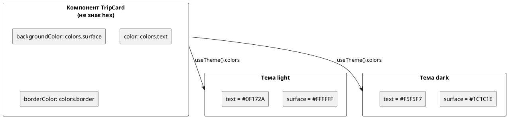
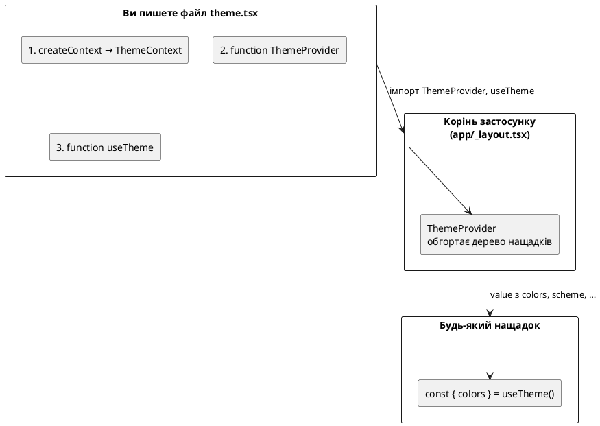

# StyleSheet і теми (light / dark)

## Навіщо ця стаття

{.diagram-img}

Уявіть вечір у метро: людина відкриває щоденник подорожей, у телефоні давно увімкнений **темний режим** (Dark Mode). Системні екрани й більшість улюблених застосунків уже темні: фон глибокий, текст світлий, статус-бар читабельний. Якщо ваш застосунок лишається сліпучо-білим, користувач не думає «ой, у них ще не зробили StyleSheet.create». Він думає: «цей додаток виглядає застаріло» — і закриває його.

У попередніх статтях стилі вже з’являлись: `StyleSheet.create`, `tokens.colors.primary`, інколи `useColorScheme` у демо. Але кольори в Nomad досі були **одні** — світла палітра «намертво» вшита в об’єкт `tokens`. Перемикач системи **нічого** не змінював на екрані, бо компоненти питали не «який зараз режим?», а «який hex записаний у файлі раз і назавжди?».

Ця стаття з’єднує дві речі, які на вебі часто плутають:

1. **Як описувати вигляд** елемента в React Native (об’єкти стилів, `StyleSheet`, масиви) — аналог CSS, але **інший** механізм.
2. **Як міняти theme (тему) всього застосунку** (світла / темна тема, семантичні імена кольорів) — аналог CSS-змінних і `prefers-color-scheme`, своїми інструментами.

### Терміни простими словами

**Стиль (style)** у React Native — звичайний JavaScript-об’єкт (або зареєстрований через `StyleSheet` ідентифікатор), який каже нативному UI: «відступ 16, заокруглення 12, колір фону такий-то». Немає окремого файлу `.css`, немає селекторів `.card > .title`.

**Тема (theme)** — узгоджений **набір значень** (передусім кольорів) для **режиму відображення**. Найчастіше два режими: **світлий** (*light*) і **темний** (*dark*). Тема — не «красивий шаблон з Figma», а **словник**, з якого всі екрани беруть одні й ті самі ролі кольорів.

**Семантичний токен (semantic token)** — ім’я за **роллю**, а не за відтінком.  
Приклад: `surface` означає «поверхня картки / панелі», а не «білий». У light `surface` може бути `#FFFFFF`, у dark — `#1C1C1E`. Компонент пише `colors.surface` і **не знає**, який саме hex підставлять сьогодні.

**Схема кольорів (color scheme)** — відповідь операційної системи (або вашого перемикача): зараз світлий чи темний інтерфейс. Хук `useColorScheme` читає **системну** схему.

**Перевага користувача (preference)** у нашому коді — що **обрав** людина в застосунку: «як у системі», «завжди світла», «завжди темна». Це вже не чиста ОС, а **ваш** стан (поки в пам’яті; збереження на диск — пізніше).

Після статті ви зможете:

1. Пояснити, чим RN-стилі відрізняються від CSS і навіщо `StyleSheet.create`.
2. Складати `style={[…]}` без сюрпризів із перекриттям.
3. Відокремити **геометрію** (padding, radius) від **кольорів теми**.
4. Зчитати системну тему і **перевизначити** її вибором користувача.
5. **Самі** зібрати `ThemeProvider` + `useTheme` на React Context і підключити light/dark у **Nomad**.

::note
**Головна думка.** Стилі описують **форму** (відступи, радіус, flex, розташування). Тема описує **забарвлення ролей** (фон екрана, поверхня картки, основний текст, акцент кнопки). Якщо в компоненті написано `backgroundColor: '#fff'`, темна тема **ніколи** «сама» не з’явиться — рядок уже вирішив колір назавжди. Якщо написано `backgroundColor: colors.surface`, достатньо підмінити **словник** кольорів — компонент перемалюється з новою theme, без правок у десятках файлів.
::

---

## Місток з web React / CSS

На вебі ви звикли до трьох шарів:

1. **Розмітка** (JSX / HTML) — що є на сторінці.
2. **CSS** — як воно виглядає (часто в іншому файлі або через Tailwind-класи).
3. **Тема** — CSS variables, `data-theme`, `prefers-color-scheme`, інколи Context у React.

У React Native **розмітка** лишається JSX, але «CSS-файлу» немає. Замість нього — **prop `style`** на майже кожному візуальному компоненті. Значення — об’єкт (або масив об’єктів / зареєстрованих стилів). Під капотом RN перетворює це на властивості **нативних** view (UIView / android.view), а не на CSSOM браузера.

| У браузері | У React Native | Що це означає для вас |
| ---------- | -------------- | --------------------- |
| CSS-файл, CSS Modules, Tailwind | об’єкти + `StyleSheet` | Немає глобальних селекторів `.card { }`, немає «каскаду по дереву HTML» у класичному сенсі |
| `className="card active"` | `style={[styles.card, active && styles.active]}` | Стани вмикаєте **в JSX** умовами, не другим класом у рядку |
| CSS variables (`--bg`) | **токени** + тема (Context / props) | «Змінні» — ваш TypeScript-об’єкт, не `:root` |
| `prefers-color-scheme` | `useColorScheme()` / модуль `Appearance` | Система повідомляє light/dark; підписка через хук |
| `color-scheme` на `html` | `StatusBar` + кольори екрана | Системні іконки зверху **не** підлаштовуються самі лише від фону `View` |

### Що ламається, якщо мислити «як у CSS»

- **Немає** `!important`, немає специфічності селекторів. Є лише **порядок у масиві** `style={[a, b, c]}` — хто правіше, той перемагає в конфлікті ключів.
- **Немає** успадкування `color` / `font-size` на всі вкладені `View` як у HTML. Текст живе в `Text`; стилі тексту не «просочуються» в дочірні `View`.
- **Немає** «підключив dark.css і все перефарбувалось». Поки компонент читає літерал `#fff`, ніякий Dark Mode ОС йому не допоможе.

::warning
**Web-звичка.** Шукати `dark:` як у Tailwind або `:root[data-theme=dark]` і чекати, що RN «зрозуміє». У нашому шляху (StyleSheet + токени, без NativeWind) темна тема — це **ваші** дві палітри + хук/контекст + дисципліна «не писати hex у компонентах». Це не гірше — просто **явніше**: ви бачите, звідки взявся колір.
::

::tip
**Аналогія.** CSS на сайті — як загальні правила будинку («усі двері коричневі»). Стилі RN — як **наклейка на кожні двері окремо**: «ця — 16 px padding, ось такий колір». Тема — як **палітра фарб на складі**: сьогодні видаємо світлі банки з етикеткою `surface`, завтра — темні з тією ж етикеткою. Майстер (компонент) просить «банку `surface`», а не «білу №12».
::

---

## Як RN малює «вигляд»

Коротко, щоб не здавалось магією:

1. Ви пишете `<View style={…} />`.
2. React Native (разом із нативним шаром) застосовує ці властивості до **платформенного** прямокутника на екрані.
3. Flexbox (попередня стаття) рахує **розміри й позиції**.
4. Колір, бордер, тінь, прозорість — окремі властивості того ж стилю.

Тому «стилізація» у мобільному React — це не «підключити stylesheet до сторінки», а **проп на конкретному елементі**, плюс домовленість команди, **звідки** брати повторювані значення (токени, тема).

---

## `StyleSheet` — навіщо цей модуль

**`StyleSheet`** — вбудований модуль React Native для роботи зі стилями. Найчастіший виклик — **`StyleSheet.create({ … })`**: ви передаєте об’єкт «ім’я → опис вигляду», отримуєте об’єкт з тими ж ключами для `style={styles.card}`.

### Навіщо не писати все inline

Технічно так можна:

```tsx
<View style={{ flex: 1, padding: 16, backgroundColor: '#F8FAFC' }} />
```

На маленькому демо це читабельно. У реальному екрані з’являються проблеми:

- JSX **роздувається**: важко побачити структуру «шапка / список / кнопка» серед об’єктів.
- Ті самі відступи й радіуси **копіюють** у п’ять місць — потім міняєте «16» на «12» і забуваєте одне.
- Умови (`pressed`, `disabled`, `error`) перетворюють `style={{…}}` на важкий для читання вираз.

`StyleSheet.create` — домовленість «**вигляд зібрано окремо**, JSX описує склад». Це схоже на CSS Modules: імена локальні, але без окремого синтаксису CSS.

### Що реально дає `create` на практиці

1. **Ясність** — стилі внизу файлу (або в `Foo.styles.ts`); у JSX лишаються імена.
2. **Підказки TypeScript / dev** — зайва властивість або неправильний тип частіше «світиться» раніше, ніж на пристрої.
3. **Передбачуваний патерн у команді** — новий розробник шукає `StyleSheet.create` і одразу розуміє, де живе вигляд.
4. **Оптимізації з боку RN** (історично: реєстрація стилів, менше «сирих» об’єктів на мості). Деталі змінювались між версіями; **не** будуйте архітектуру заради мікробенчмарків. Будуйте заради **читабельності** й єдиного місця правки.

::note
**Важливо.** `StyleSheet.create` **не** робить стилі «реактивними до теми» саме по собі. Якщо **всередині** `create` на рівні модуля ви написали `backgroundColor: '#F8FAFC'`, це значення зафіксоване в момент завантаження модуля. Темна тема підключається інакше: або різні об’єкти стилів, або (краще) **динамічний** колір у render: `[styles.card, { backgroundColor: colors.surface }]`.
::

### API `StyleSheet` — що це і **що видно на екрані**

Нижче — коротко API, а одразу після — демо: спочатку по одному інструменту, потім **усе разом**.

::field-group

::field{name="StyleSheet.create(obj)" type="API"}
Приймає об’єкт `{ name: ViewStyle | TextStyle | ImageStyle }`, повертає об’єкт з тими ж ключами.  
**На екрані:** JSX лишається коротким (`style={styles.card}`), а «паспорт» вигляду — внизу файлу. Без `create` той самий UI виглядає **так само**, але код роздувається.
::

::field{name="StyleSheet.flatten(style)" type="API"}
Зводить масив / вкладені стилі до **одного** плоского об’єкта (`{ fontSize: 18, color: '…', … }`).  
**На екрані:** користувач **нічого** не «бачить» окремо — flatten для **вас** (тест, лог, дебаг). У звичайному JSX flatten робить сам RN.  
**Коли треба руками:** «який підсумковий `fontSize` після трьох шарів?» → `JSON.stringify(StyleSheet.flatten([…]))`.
::

::field{name="StyleSheet.absoluteFill" type="preset"}
Готовий стиль: `position: 'absolute'` + `top/left/right/bottom: 0` — розтягнути на **всього батька**.  
**На екрані:** напівпрозорий шар поверх фото/картки («Завантаження…», «Недоступно»), затемнення під модалкою.
::

::field{name="StyleSheet.absoluteFillObject" type="preset"}
Те саме **як звичайний JS-об’єкт** (його можна спредити).  
**На екрані:** те саме, що `absoluteFill`, але ви пишете  
`{ ...StyleSheet.absoluteFillObject, backgroundColor: 'rgba(0,0,0,0.5)', zIndex: 2 }` — один об’єкт, без другого шару в масиві.
::

::field{name="StyleSheet.hairlineWidth" type="number"}
Найтонша лінія, яку платформа ще малює акуратно (часто менше за 1 логічний піксель).  
**На екрані:** розділювачі списку «як у Налаштуваннях iOS», а не жирна смуга `borderWidth: 1`. Порівняйте hairline vs `1` у демо нижче.
::

::

### Демо 1: `create` + масив стилів

`create` тримає **базу** кнопки. Масив у `Pressable` додає шари: «увімкнено» і «натиснуто». Порядок зліва направо — пізніший ключ перемагає.

::react-native-preview{title="create + масив стилів" device="iphone" filename="StyleSheetCreateArray.tsx"}

```tsx
import { useState } from 'react';
import { View, Text, Pressable, StyleSheet } from 'react-native';

export default function App() {
  const [on, setOn] = useState(false);

  return (
    <View style={styles.screen}>
      <Text style={styles.title}>create + масив</Text>
      <Text style={styles.hint}>
        styles.btn → (on ? btnOn) → (pressed ? btnPressed)
      </Text>
      <Pressable
        onPress={() => setOn((v) => !v)}
        style={({ pressed }) => [
          styles.btn,
          on && styles.btnOn,
          pressed && styles.btnPressed,
        ]}
      >
        <Text style={styles.btnText}>{on ? 'Увімкнено' : 'Вимкнено'}</Text>
      </Pressable>
    </View>
  );
}

const styles = StyleSheet.create({
  screen: {
    flex: 1,
    backgroundColor: '#F8FAFC',
    padding: 24,
    justifyContent: 'center',
    gap: 12,
  },
  title: { fontSize: 20, fontWeight: '700', color: '#0f172a' },
  hint: { fontSize: 13, color: '#64748b', lineHeight: 18 },
  btn: {
    backgroundColor: '#94a3b8',
    paddingVertical: 14,
    borderRadius: 12,
    alignItems: 'center',
  },
  btnOn: { backgroundColor: '#2563EB' },
  btnPressed: { opacity: 0.85 },
  btnText: { color: '#fff', fontWeight: '700', fontSize: 16 },
});
```

::

### Демо 2: `flatten` — «що вийшло в сумі»

Два шари стилів заголовка + колір з теми. На екрані — текст **і** JSON підсумкового об’єкта після `StyleSheet.flatten`. У продакшені UI так рідко показують; тут — щоб **побачити** злиття ключів.

::react-native-preview{title="StyleSheet.flatten" device="iphone" filename="StyleSheetFlatten.tsx"}

```tsx
import { View, Text, StyleSheet } from 'react-native';

export default function App() {
  const flat = StyleSheet.flatten([
    styles.titleBase,       // fontSize: 16, color: gray
    styles.titleEmphasis,   // fontSize: 22, fontWeight — перекриває size
    { color: '#2563EB' },   // color перемагає
  ]);

  return (
    <View style={styles.screen}>
      <Text style={flat}>Заголовок після flatten</Text>
      <View style={styles.panel}>
        <Text style={styles.label}>StyleSheet.flatten([...]) →</Text>
        <Text style={styles.code}>{JSON.stringify(flat, null, 2)}</Text>
      </View>
      <Text style={styles.hint}>
        fontSize: 22 (з emphasis), color: #2563EB (з останнього шару).
      </Text>
    </View>
  );
}

const styles = StyleSheet.create({
  screen: { flex: 1, backgroundColor: '#F8FAFC', padding: 20, justifyContent: 'center', gap: 14 },
  titleBase: { fontSize: 16, color: '#64748b' },
  titleEmphasis: { fontSize: 22, fontWeight: '800' },
  panel: {
    backgroundColor: '#fff',
    borderRadius: 12,
    borderWidth: 1,
    borderColor: '#E2E8F0',
    padding: 12,
  },
  label: { fontSize: 12, fontWeight: '600', color: '#64748b', marginBottom: 6 },
  code: { fontFamily: 'monospace', fontSize: 12, color: '#0f172a', lineHeight: 18 },
  hint: { fontSize: 13, color: '#64748b', lineHeight: 18 },
});
```

::

### Демо 3: `absoluteFill` vs `absoluteFillObject`

Обидві картки тягнуть шар на весь батько. Зліва — `StyleSheet.absoluteFill` + другий стиль у масиві. Справа — один об’єкт через `...absoluteFillObject` (зручно додати `backgroundColor` / `zIndex` «на місці»).

::react-native-preview{title="absoluteFill vs absoluteFillObject" device="android" filename="AbsoluteFillCompare.tsx" height="560"}

```tsx
import { View, Text, StyleSheet } from 'react-native';

export default function App() {
  return (
    <View style={styles.screen}>
      <Text style={styles.h}>absoluteFill</Text>
      <View style={styles.card}>
        <Text style={styles.cardText}>Фон картки</Text>
        <View style={[StyleSheet.absoluteFill, styles.overlayA]}>
          <Text style={styles.overlayText}>Fill</Text>
        </View>
      </View>

      <Text style={styles.h}>absoluteFillObject</Text>
      <View style={styles.card}>
        <Text style={styles.cardText}>Фон картки</Text>
        <View
          style={{
            ...StyleSheet.absoluteFillObject,
            backgroundColor: 'rgba(37, 99, 235, 0.55)',
            alignItems: 'center',
            justifyContent: 'center',
          }}
        >
          <Text style={styles.overlayText}>Object</Text>
        </View>
      </View>

      <Text style={styles.hint}>
        Обидва покривають батька. Object зручний, коли хочете один style-об’єкт
        зі спред-оператором.
      </Text>
    </View>
  );
}

const styles = StyleSheet.create({
  screen: { flex: 1, backgroundColor: '#F8FAFC', padding: 20, justifyContent: 'center', gap: 10 },
  h: { fontSize: 14, fontWeight: '700', color: '#0f172a' },
  card: {
    height: 100,
    borderRadius: 14,
    backgroundColor: '#dbeafe',
    alignItems: 'center',
    justifyContent: 'center',
    overflow: 'hidden',
  },
  cardText: { fontSize: 15, fontWeight: '600', color: '#1e3a8a' },
  overlayA: {
    backgroundColor: 'rgba(15, 23, 42, 0.55)',
    alignItems: 'center',
    justifyContent: 'center',
  },
  overlayText: { color: '#fff', fontWeight: '800', fontSize: 16 },
  hint: { fontSize: 13, color: '#64748b', lineHeight: 18, marginTop: 4 },
});
```

::

### Демо 4: `hairlineWidth` vs `1`

Два рядки списку: зверху розділювач **hairline**, знизу — звичайна `1`. На Retina/високій щільності hairline виглядає тоншою й «системнішою».

::react-native-preview{title="hairlineWidth vs 1" device="iphone" filename="HairlineDemo.tsx"}

```tsx
import { View, Text, StyleSheet } from 'react-native';

export default function App() {
  return (
    <View style={styles.screen}>
      <Text style={styles.title}>Розділювачі</Text>

      <View style={styles.list}>
        <Text style={styles.row}>Рядок A</Text>
        <View style={styles.hairline} />
        <Text style={styles.row}>Рядок B (після hairline)</Text>
        <View style={styles.thick} />
        <Text style={styles.row}>Рядок C (після border 1)</Text>
      </View>

      <Text style={styles.meta}>
        hairlineWidth = {String(StyleSheet.hairlineWidth)} (залежить від екрана)
      </Text>
      <Text style={styles.hint}>
        Верхня лінія — StyleSheet.hairlineWidth. Нижня — borderWidth: 1.
      </Text>
    </View>
  );
}

const styles = StyleSheet.create({
  screen: { flex: 1, backgroundColor: '#F8FAFC', padding: 24, justifyContent: 'center', gap: 14 },
  title: { fontSize: 20, fontWeight: '700', color: '#0f172a' },
  list: {
    backgroundColor: '#fff',
    borderRadius: 12,
    borderWidth: 1,
    borderColor: '#E2E8F0',
    overflow: 'hidden',
  },
  row: { paddingHorizontal: 16, paddingVertical: 14, fontSize: 16, color: '#0f172a' },
  hairline: {
    height: StyleSheet.hairlineWidth,
    backgroundColor: '#94a3b8',
    marginHorizontal: 16,
  },
  thick: {
    height: 1,
    backgroundColor: '#94a3b8',
    marginHorizontal: 16,
  },
  meta: { fontSize: 13, fontWeight: '600', color: '#2563EB' },
  hint: { fontSize: 13, color: '#64748b', lineHeight: 18 },
});
```

::

### Демо 5: **усе разом** (`create` · `flatten` · `absoluteFill` · `absoluteFillObject` · `hairlineWidth`)

Один екран-«візитка»: геометрія з `create`, тонкі лінії hairline, підсумок `flatten` у підписі, кнопка відкриває оверлей через `absoluteFill`, бейдж «PRO» — через `absoluteFillObject` у куті.

::react-native-preview{title="StyleSheet API · усе разом" device="iphone" filename="StyleSheetAllApi.tsx" height="700"}

```tsx
import { useState } from 'react';
import { View, Text, Pressable, StyleSheet } from 'react-native';

export default function App() {
  const [locked, setLocked] = useState(false);

  const titleFlat = StyleSheet.flatten([
    styles.titleBase,
    styles.titleStrong,
    { color: '#0f172a' },
  ]);

  return (
    <View style={styles.screen}>
      <Text style={titleFlat}>StyleSheet · all-in-one</Text>
      <Text style={styles.sub}>
        flatten title → fontSize {String((titleFlat as { fontSize?: number }).fontSize)}
      </Text>

      <View style={styles.card}>
        {/* absoluteFillObject: кутовий бейдж */}
        <View
          style={{
            ...StyleSheet.absoluteFillObject,
            top: 10,
            left: undefined,
            right: 10,
            bottom: undefined,
            width: 44,
            height: 22,
            borderRadius: 6,
            backgroundColor: '#2563EB',
            alignItems: 'center',
            justifyContent: 'center',
          }}
        >
          <Text style={styles.badgeText}>PRO</Text>
        </View>

        <Text style={styles.name}>Карпати 2026</Text>
        <Text style={styles.desc}>create тримає картку; hairline — розділювач.</Text>

        <View style={styles.hairline} />

        <Text style={styles.meta}>12–18 червня · 6 днів</Text>

        {/* absoluteFill: затемнення поверх картки */}
        {locked && (
          <View style={[StyleSheet.absoluteFill, styles.lockOverlay]}>
            <Text style={styles.lockText}>Заблоковано</Text>
          </View>
        )}
      </View>

      <Pressable
        onPress={() => setLocked((v) => !v)}
        style={({ pressed }) => [
          styles.btn,
          locked && styles.btnOn,
          pressed && styles.btnPressed,
        ]}
      >
        <Text style={styles.btnText}>
          {locked ? 'Зняти оверлей (absoluteFill)' : 'Накрити absoluteFill'}
        </Text>
      </Pressable>

      <Text style={styles.hint}>
        create · flatten · absoluteFill · absoluteFillObject · hairlineWidth
      </Text>
    </View>
  );
}

const styles = StyleSheet.create({
  screen: {
    flex: 1,
    backgroundColor: '#F8FAFC',
    padding: 20,
    justifyContent: 'center',
    gap: 12,
  },
  titleBase: { fontSize: 16 },
  titleStrong: { fontSize: 20, fontWeight: '800' },
  sub: { fontSize: 12, color: '#64748b', marginTop: -4 },
  card: {
    backgroundColor: '#fff',
    borderRadius: 16,
    borderWidth: 1,
    borderColor: '#E2E8F0',
    padding: 16,
    minHeight: 150,
    overflow: 'hidden',
  },
  badgeText: { color: '#fff', fontSize: 11, fontWeight: '800' },
  name: { fontSize: 18, fontWeight: '700', color: '#0f172a', marginTop: 4 },
  desc: { fontSize: 14, color: '#64748b', marginTop: 6, lineHeight: 20 },
  hairline: {
    height: StyleSheet.hairlineWidth,
    backgroundColor: '#cbd5e1',
    marginVertical: 12,
  },
  meta: { fontSize: 13, color: '#64748b' },
  lockOverlay: {
    backgroundColor: 'rgba(15, 23, 42, 0.62)',
    alignItems: 'center',
    justifyContent: 'center',
  },
  lockText: { color: '#fff', fontWeight: '800', fontSize: 16 },
  btn: {
    backgroundColor: '#94a3b8',
    paddingVertical: 14,
    borderRadius: 12,
    alignItems: 'center',
  },
  btnOn: { backgroundColor: '#2563EB' },
  btnPressed: { opacity: 0.85 },
  btnText: { color: '#fff', fontWeight: '700', fontSize: 14 },
  hint: { fontSize: 12, color: '#94a3b8', textAlign: 'center' },
});
```

::

### Inline vs StyleSheet: коли що

```tsx
// Працює, але шумно, якщо так на кожному елементі
<View style={{ flex: 1, padding: 16, backgroundColor: '#F8FAFC' }} />

// Звичка для геометрії
<View style={styles.screen} />

const styles = StyleSheet.create({
  screen: { flex: 1, padding: 16 },
});
```

**Inline доречний**, коли значення **обчислюється зараз** і не варте окремого імені:

```tsx
// Колір з поточної теми — так і треба
<View style={[styles.card, { backgroundColor: colors.surface }]} />
```

Тут `styles.card` тримає стабільне: `borderRadius`, `borderWidth`, `overflow`.  
`colors.surface` — з теми, може змінитись між light і dark без нового `StyleSheet.create`.

### Масив стилів — «каскад у мініатюрі»

У CSS кілька класів і специфічність. У RN ви **явно** складаєте шари:

```tsx
style={[
  styles.base,              // 1. база
  pressed && styles.pressed, // 2. стан жесту
  disabled && styles.disabled, // 3. стан «вимкнено»
  styleFromProps,           // 4. те, що передав батько (часто перемагає)
]}
```

**Порядок:** зліва направо. Якщо і `base`, і `pressed` задають `backgroundColor`, перемагає **пізніший**.

`false` / `null` / `undefined` у масиві **ігноруються**. Тому `cond && styles.x` безпечний: коли `cond` хибний, у масив потрапляє `false`, і RN його відкидає.

::tip
**Що бачить користувач.** Натискає кнопку — на мить темнішає (`pressed`). Це не окремий «CSS :active файл», а **той самий** `Pressable`, який у функціональному `style={({ pressed }) => […]}` підмішує другий шар. Усі стани видно в коді поруч.
::

### Типова помилка: `create` всередині компонента на кожен render

```tsx
function Card() {
  const styles = StyleSheet.create({ box: { padding: 16 } }); // погана звичка
  return <View style={styles.box} />;
}
```

На кожному рендері створюється новий набір. Для теми це **не** вирішує light/dark. Виносьте **стабільну** геометрію на рівень модуля; динаміку — у масив у JSX.

### Платформа: тіні й hairline

Уже бачили `Platform.select` для тіні (iOS `shadow*`, Android `elevation`). Це **теж** частина стилізації, не теми. Тема може змінити `shadowOpacity` у dark (тінь на чорному майже невидима) — але спочатку відокремте: «як малюємо тінь» vs «які кольори ролей».

---

## Семантичні токени (не «синій», а «primary»)

{.diagram-img}

### Звідки взялась ідея

У статті 05 з’явився файл **tokens** — словник відступів, радіусів, кольорів. Тоді мета була простіша: **не розмножувати** `#2563EB` у десяти кнопках. Тепер додаємо другий вимір: той самий словник має вміти **дві themes** (light і dark), не ламаючи компоненти.

На вебі в дизайн-системах (і в Figma) розрізняють рівні приблизно так:

1. **Примітивні** значення: `blue-600 = #2563EB`, `gray-50 = #F8FAFC` — «як у віялі фарб».
2. **Семантичні** ролі: `color.bg.canvas`, `color.fg.default`, `color.action.primary` — «для чого ця фарба на екрані».

У малому застосунку ми **не** будуємо повну трирівневу систему з сотнею токенів. Але правило одне: **у JSX компонентів живуть ролі**, а hex — лише в таблицях light/dark.

### Погано vs добре

| Погано (прив’язка до відтінку) | Краще (роль) | Чому |
| ----------------------------- | ------------ | ---- |
| `blue500` у `TripCard` | `primary` | Бренд може змінити синій — роль «головна дія» лишається |
| `#fff` у двадцяти файлах | `colors.surface` | Dark не білий; одне місце правки |
| `gray900` для тексту | `colors.text` | У dark текст світлий, не «сірий-900» |
| «темна тема = інвертувати все» | **друга таблиця** з тими ж ключами | Фото, карта, логотип бренду **не** інвертують |

### Популярні схеми імен (як називають «у світі»)

Різні дизайн-системи кажуть **те саме різними словами**. Важливо не «вгадати священну назву», а **узгодити словник** у команді й тримати **однакові ключі** в light і dark.

| Роль змістом | Плоскі імена (як у Nomad) | Material / M3-ish | «bg / fg» (часто в web DS) | Apple HIG-орієнтир |
| ------------ | ------------------------- | ----------------- | -------------------------- | ------------------ |
| Фон екрана | `background` | `surface` / `background` | `bg.canvas` / `bg.app` | system background |
| Картка, панель | `surface` | `surfaceContainer` | `bg.elevated` / `bg.card` | secondary system background |
| Основний текст | `text` | `onSurface` | `fg.default` | label (primary) |
| Другорядний текст | `textSecondary` | `onSurfaceVariant` | `fg.muted` / `fg.subtle` | secondary label |
| Головна дія | `primary` | `primary` | `accent` / `brand` | tintColor |
| Текст **на** primary | `onPrimary` | `onPrimary` | `fg.onAccent` | (контраст на tint) |
| Обводка / розділювач | `border` | `outline` | `border.default` | separator |
| Помилка / небезпека | `danger` | `error` | `fg.danger` / `bg.danger` | system red (семантика) |
| Успіх (опційно) | `success` | `tertiary` / custom | `fg.success` | system green |
| Попередження (опційно) | `warning` | custom | `fg.warning` | system orange |
| Приглушений / disabled | `muted` / `disabled` | `onSurface` + opacity | `fg.disabled` | quaternary label |

::tabs

::tabs-item{label="Плоский словник (Nomad)"}
Прості ключі в одному об’єкті — зручно на старті:

```ts
colors.background
colors.surface
colors.text
colors.textSecondary
colors.primary
colors.onPrimary
colors.border
colors.danger
```

Мало вкладеності, легко читати в JSX: `colors.surface`.
::

::tabs-item{label="Вкладений bg / fg"}
Часто на вебі (і в Figma-токенах):

```ts
colors.bg.canvas
colors.bg.surface
colors.fg.default
colors.fg.muted
colors.border.default
colors.action.primary
```

Добре, коли ролей багато: «усі фони» vs «усі тексти» лежать у різних гілках.
::

::tabs-item{label="Material-ish"}
Близько до Material You / M3:

```ts
colors.surface
colors.surfaceContainer
colors.onSurface
colors.onSurfaceVariant
colors.primary
colors.onPrimary
colors.outline
colors.error
```

`onX` = «колір контенту **поверх** ролі X» — та сама ідея, що наш `onPrimary`.
::

::

::tip
**Що обрати.** Для Nomad і більшості навчальних / середніх продуктів вистачає **плоского** словника з 8–12 ключів. Вкладені `bg/fg` або повний M3 мають сенс, коли ролей десятки й дизайн уже так назвав токени в Figma. **Не змішуйте** в одному проєкті `primary` і `brand` і `accent` для тієї ж кнопки.
::

### Ролі, які реально потрібні на старті Nomad

::field-group

::field{name="background" type="роль"}
Фон **екрана** (background / canvas). У light — світло-сірий/off-white, у dark — майже чорний. Користувач бачить «колір застосунку за картками». Синоніми в інших системах: `bg.canvas`, system background.
::

::field{name="surface" type="роль"}
Поверхня **піднятого** блоку: картка, модалка, нижня панель. Зазвичай трохи **інша**, ніж `background`, щоб картка відділялась від полотна без обов’язкової жирної рамки. Синоніми: `bg.card`, `surfaceContainer`.
::

::field{name="text / textSecondary" type="роль"}
Основний і другорядний текст. Secondary — підписи, дати, підказки: менший контраст, але все ще читабельний. Синоніми: `onSurface` / `onSurfaceVariant`, `fg.default` / `fg.muted`.
::

::field{name="primary / primaryPressed" type="роль"}
Акцент дій (кнопка «Нова поїздка», активний чіп). Pressed — трохи темніший/світліший відтінок на час дотику. Синоніми: `brand`, `accent`, `tintColor`.
::

::field{name="border" type="роль"}
Лінії розділення, обводка картки. У dark бордери часто **світліші за фон**, але не білі «як крейда». Синоніми: `outline`, `separator`.
::

::field{name="onPrimary" type="роль"}
Текст/іконка **на** тлі `primary` (зазвичай білий). Окрема роль, щоб не плутати з `text` екрана. Синонім у M3: `onPrimary`.
::

::field{name="danger" type="роль"}
Помилки, деструктивні дії. У dark часто трохи м’якший червоний, щоб не «палав» на чорному. Синоніми: `error`, `destructive`.
::

::

::plant-uml



::

**Правило однією фразою:** компонент знає *роль* («я поверхня картки»), тема знає *конкретний колір* для light і dark.

### Демо: семантичні ролі + весь `StyleSheet` API

Нижче — один екран, де:

| Що | Де в демо |
| -- | --------- |
| `colors.background` / `surface` / `text` / `textSecondary` / `primary` / `onPrimary` / `border` / `danger` | фон, картка, тексти, кнопка, обводка, рядок помилки |
| `StyleSheet.create` | геометрія `styles.*` |
| `StyleSheet.flatten` | підпис «title fontSize = …» |
| `StyleSheet.hairlineWidth` | лінія під заголовком картки |
| `StyleSheet.absoluteFillObject` | бейдж «NEW» у куті |
| `StyleSheet.absoluteFill` | оверлей «Видалення…» поверх картки |
| масив стилів | кнопка primary / pressed / danger |

Перемикач light/dark змінює **лише** словник `c` — JSX і `styles` ті самі.

::react-native-preview{title="Токени + StyleSheet API" device="iphone" filename="TokensAndStyleSheetAll.tsx" height="720"}

```tsx
import { useState } from 'react';
import { View, Text, Pressable, StyleSheet } from 'react-native';

const light = {
  background: '#F8FAFC',
  surface: '#FFFFFF',
  text: '#0F172A',
  textSecondary: '#64748B',
  primary: '#2563EB',
  primaryPressed: '#1D4ED8',
  border: '#E2E8F0',
  danger: '#DC2626',
  onPrimary: '#FFFFFF',
};

const dark = {
  background: '#000000',
  surface: '#1C1C1E',
  text: '#F5F5F7',
  textSecondary: '#A1A1AA',
  primary: '#3B82F6',
  primaryPressed: '#2563EB',
  border: '#3A3A3C',
  danger: '#F87171',
  onPrimary: '#FFFFFF',
};

export default function App() {
  const [mode, setMode] = useState<'light' | 'dark'>('light');
  const [busy, setBusy] = useState(false);
  const c = mode === 'dark' ? dark : light;

  const titleFlat = StyleSheet.flatten([
    styles.titleBase,
    styles.titleStrong,
    { color: c.text },
  ]);

  return (
    <View style={[styles.screen, { backgroundColor: c.background }]}>
      <View style={styles.row}>
        {(['light', 'dark'] as const).map((m) => {
          const active = mode === m;
          return (
            <Pressable
              key={m}
              onPress={() => setMode(m)}
              style={[
                styles.chip,
                {
                  backgroundColor: active ? c.primary : c.surface,
                  borderColor: c.border,
                },
              ]}
            >
              <Text
                style={{
                  color: active ? c.onPrimary : c.text,
                  fontWeight: '600',
                  fontSize: 13,
                }}
              >
                {m === 'light' ? 'Світла' : 'Темна'}
              </Text>
            </Pressable>
          );
        })}
      </View>

      <Text style={titleFlat}>Поїздка · токени</Text>
      <Text style={{ color: c.textSecondary, fontSize: 12 }}>
        flatten → fontSize {(titleFlat as { fontSize?: number }).fontSize}
      </Text>

      <View
        style={[
          styles.card,
          { backgroundColor: c.surface, borderColor: c.border },
        ]}
      >
        {/* absoluteFillObject — кутовий бейдж */}
        <View
          style={{
            ...StyleSheet.absoluteFillObject,
            top: 10,
            left: undefined,
            right: 10,
            bottom: undefined,
            width: 40,
            height: 22,
            borderRadius: 6,
            backgroundColor: c.primary,
            alignItems: 'center',
            justifyContent: 'center',
          }}
        >
          <Text style={{ color: c.onPrimary, fontSize: 10, fontWeight: '800' }}>
            NEW
          </Text>
        </View>

        <Text style={[styles.cardTitle, { color: c.text }]}>Київ — Карпати</Text>
        <Text style={{ color: c.textSecondary, marginTop: 4, lineHeight: 18 }}>
          surface + text + textSecondary. Hex лише в таблицях light/dark.
        </Text>

        {/* hairlineWidth */}
        <View
          style={{
            height: StyleSheet.hairlineWidth,
            backgroundColor: c.border,
            marginVertical: 12,
          }}
        />

        <Text style={{ color: c.danger, fontSize: 13, fontWeight: '600' }}>
          danger · «Скасувати бронювання»
        </Text>

        {/* absoluteFill — оверлей стану */}
        {busy && (
          <View style={[StyleSheet.absoluteFill, styles.overlay]}>
            <Text style={{ color: c.onPrimary, fontWeight: '800' }}>
              Видалення…
            </Text>
          </View>
        )}
      </View>

      <Pressable
        onPress={() => setBusy((v) => !v)}
        style={({ pressed }) => [
          styles.btn,
          { backgroundColor: pressed ? c.primaryPressed : c.primary },
        ]}
      >
        <Text style={{ color: c.onPrimary, fontWeight: '700' }}>
          {busy ? 'Сховати absoluteFill' : 'Показати absoluteFill'}
        </Text>
      </Pressable>

      <Text style={{ color: c.textSecondary, fontSize: 12, lineHeight: 17 }}>
        create · flatten · hairline · absoluteFill · absoluteFillObject ·
        background/surface/text/primary/border/danger/onPrimary
      </Text>
    </View>
  );
}

const styles = StyleSheet.create({
  screen: { flex: 1, padding: 18, justifyContent: 'center', gap: 10 },
  row: { flexDirection: 'row', gap: 8 },
  chip: {
    paddingHorizontal: 12,
    paddingVertical: 8,
    borderRadius: 8,
    borderWidth: 1,
  },
  titleBase: { fontSize: 16 },
  titleStrong: { fontSize: 20, fontWeight: '800' },
  card: {
    borderRadius: 16,
    borderWidth: 1,
    padding: 16,
    minHeight: 150,
    overflow: 'hidden',
  },
  cardTitle: { fontSize: 17, fontWeight: '700', marginTop: 4 },
  overlay: {
    backgroundColor: 'rgba(15, 23, 42, 0.65)',
    alignItems: 'center',
    justifyContent: 'center',
  },
  btn: {
    paddingVertical: 14,
    borderRadius: 12,
    alignItems: 'center',
  },
});
```

::

### Що зазвичай **не** міняють між темами

- **Відступи** (`spacing`: 4, 8, 16…) — ритм сітки той самий.
- **Радіуси** карток і кнопок.
- **Розміри шрифтів** (інколи в dark трохи збільшують міжрядковість, але це вже полірування).

Міняються переважно **кольори** і інколи **тіні** (на темному тлі важка тінь майже невидима — інколи зменшують opacity або покладаються на `border`).

### Що бачить користувач / що ламається

- **Добре:** перемкнув тему — екран і картки узгоджено змінили theme, кнопка лишилась «головною дією» (primary), фото обкладинки поїздки **не** інвертувалось.
- **Погано:** фон став чорним, а текст у `AppText` лишився `#0F172A` — майже невидимий. Причина: десь лишився зашитий hex або `tokens.colors` зі старої світлої-only таблиці.

---

## Системна тема: що це в житті

На iPhone: **Налаштування → Екран і яскравість → Світлий / Темний / Авто**.  
На Android: схожий перемикач у налаштуваннях дисплея (назви залежать від виробника).

Коли користувач обирає темний режим, **система** повідомляє застосункам: «зараз dark». Багато системних екранів і якісних застосунків підлаштовуються. Ваш код отримає це через API **Appearance** / хук **`useColorScheme`**.

### `useColorScheme()`

**`useColorScheme()`** — хук React Native, який повертає поточну **схему кольорів**:

- `'light'` — світла;
- `'dark'` — темна;
- `null` — модуль Appearance недоступний (рідко на реальному телефоні; трапляється в нестандартних середовищах).

Хук **підписується** на зміни: користувач увімкнув Dark Mode — компонент **перерендериться** з новим значенням. Вам не треба самим крутити таймери чи «перевіряти раз на хвилину».

Під капотом — модуль **`Appearance`**:

- `Appearance.getColorScheme()` — зчитати зараз (без підписки);
- `Appearance.addChangeListener(...)` — імперативна підписка.

У UI-коді достатньо хука: він уже підписаний і зручний у функційних компонентах.

::tip
**Аналогія з вебом.** `window.matchMedia('(prefers-color-scheme: dark)')` + listener. У RN — `useColorScheme()`, без ручного `matchMedia`.
::

::react-native-preview{title="useColorScheme" device="iphone" filename="UseColorSchemeDemo.tsx"}

```tsx
import { View, Text, StyleSheet, useColorScheme } from 'react-native';

export default function App() {
  const scheme = useColorScheme();
  const isDark = scheme === 'dark';

  return (
    <View style={[styles.screen, { backgroundColor: isDark ? '#000' : '#F8FAFC' }]}>
      <Text style={[styles.label, { color: isDark ? '#a1a1aa' : '#64748b' }]}>
        useColorScheme()
      </Text>
      <Text style={[styles.value, { color: isDark ? '#f5f5f7' : '#0f172a' }]}>
        {scheme ?? 'null'}
      </Text>
      <Text style={[styles.hint, { color: isDark ? '#a1a1aa' : '#64748b' }]}>
        Змініть тему ОС (або тему сайту в браузері) — значення може оновитись.
        У Expo Go перемикайте appearance симулятора / телефону.
      </Text>
    </View>
  );
}

const styles = StyleSheet.create({
  screen: { flex: 1, padding: 24, justifyContent: 'center', gap: 8 },
  label: { fontSize: 13, fontWeight: '600', textTransform: 'uppercase' },
  value: { fontSize: 32, fontWeight: '800' },
  hint: { fontSize: 13, lineHeight: 18, marginTop: 8 },
});
```

::

::tip
**Лише система — мало для продукту.** Багато людей хочуть: «телефон у мене темний, але **цей** застосунок лиши світлим» (наприклад, читати при денному світлі) або навпаки. Тому зрілі продукти дають вибір:

- **Як у системі** (*system*) — слухаємо `useColorScheme`;
- **Завжди світла** (*light*);
- **Завжди темна** (*dark*).

Тоді `useColorScheme` — **один із входів** для режиму `system`, а не єдине джерело істини для всього UI. Нижче з’явиться `preference` + функція `resolve`.
::

::warning
**Браузер ≠ телефон.** У `::react-native-preview` `useColorScheme` може йти від теми **сайту** або браузера. У Expo Go — від **симулятора/телефона**. Завжди перевіряйте Dark Mode там, де користувач реально відкриє застосунок.
::

---

## Дві палітри з **однаковими** ключами

Чому саме **дві таблиці**, а не `isDark ? '#000' : '#fff'` у кожному рядку?

1. **Один контракт для TypeScript** — `ColorTokens` з тими ж полями; забутий ключ у dark видно одразу.
2. **Дизайн узгоджує набори**, а не «випадкові тернарники» в 40 файлах.
3. **Компонент не розгалужується** на light/dark — лише читає `colors.X`.

```ts
export const lightColors = {
  background: '#F8FAFC',
  surface: '#FFFFFF',
  text: '#0F172A',
  textSecondary: '#64748B',
  primary: '#2563EB',
  primaryPressed: '#1D4ED8',
  border: '#E2E8F0',
  danger: '#DC2626',
  onPrimary: '#FFFFFF',
} as const;

export const darkColors = {
  background: '#000000',
  surface: '#1C1C1E',
  text: '#F5F5F7',
  textSecondary: '#A1A1AA',
  primary: '#3B82F6',
  primaryPressed: '#2563EB',
  border: '#3A3A3C',
  danger: '#F87171',
  onPrimary: '#FFFFFF',
} as const;
```

Перемикання в одному місці:

```ts
function colorsForScheme(scheme: 'light' | 'dark') {
  return scheme === 'dark' ? darkColors : lightColors;
}

const colors = colorsForScheme(scheme);
```

Усі екрани читають `colors.*` — **жодного** `#F8FAFC` у `TripCard`.

### `background` vs `surface` — навіщо два «темні» / два «світлі»

Якщо і екран, і картка одного кольору, список **зливається** в одну пляму. У світлій темі часто: фон екрана злегка сірий (`background`), картка біла (`surface`). У темній: фон чорний, картка темно-сіра (`#1C1C1E` тощо). Користувач **відчуває глибину** без важких тіней.

### Контраст і доступність (на рівні інтуїції)

::warning
**Контраст.** У dark не достатньо «зробити фон чорним». Сірий текст `#64748B` на `#000` може стати **занадто** тьмяним; інколи secondary у dark роблять світлішим (`#A1A1AA`). Перевіряйте на реальному екрані (яскравість, OLED). Повний аудит a11y — окрема тема пізніше; зараз мінімум: **прочитати** заголовок і підпис очима.
::

### Чого **не** класти в палітру теми

- URL фото обкладинки;
- «магічні» відступи layout (вони в `spacing`);
- колір, який **завжди** білий на логотипі вендора (окремий виняток, не `text`).

### Приклад: перемикач + семантичні кольори

::react-native-preview{title="Семантичні кольори · toggle" device="iphone" filename="ThemeTogglePlayground.tsx"}

```tsx
import { useState } from 'react';
import { View, Text, Pressable, StyleSheet } from 'react-native';

const light = {
  background: '#F8FAFC',
  surface: '#FFFFFF',
  text: '#0F172A',
  textSecondary: '#64748B',
  primary: '#2563EB',
  border: '#E2E8F0',
  onPrimary: '#FFFFFF',
};

const dark = {
  background: '#000000',
  surface: '#1C1C1E',
  text: '#F5F5F7',
  textSecondary: '#A1A1AA',
  primary: '#3B82F6',
  border: '#3A3A3C',
  onPrimary: '#FFFFFF',
};

export default function App() {
  const [mode, setMode] = useState<'light' | 'dark'>('light');
  const c = mode === 'dark' ? dark : light;

  return (
    <View style={[styles.screen, { backgroundColor: c.background }]}>
      <View style={styles.row}>
        <Pressable
          onPress={() => setMode('light')}
          style={[
            styles.chip,
            {
              backgroundColor: mode === 'light' ? c.primary : c.surface,
              borderColor: c.border,
            },
          ]}
        >
          <Text
            style={{
              color: mode === 'light' ? c.onPrimary : c.text,
              fontWeight: '600',
            }}
          >
            Світла
          </Text>
        </Pressable>
        <Pressable
          onPress={() => setMode('dark')}
          style={[
            styles.chip,
            {
              backgroundColor: mode === 'dark' ? c.primary : c.surface,
              borderColor: c.border,
            },
          ]}
        >
          <Text
            style={{
              color: mode === 'dark' ? c.onPrimary : c.text,
              fontWeight: '600',
            }}
          >
            Темна
          </Text>
        </Pressable>
      </View>

      <View
        style={[
          styles.card,
          { backgroundColor: c.surface, borderColor: c.border },
        ]}
      >
        <Text style={[styles.cardTitle, { color: c.text }]}>Карпати 2026</Text>
        <Text style={{ color: c.textSecondary, marginTop: 6, lineHeight: 20 }}>
          Кольори з палітри «{mode}». Той самий JSX — інші значення токенів.
        </Text>
        <View style={[styles.badge, { backgroundColor: c.primary }]}>
          <Text style={{ color: c.onPrimary, fontWeight: '700', fontSize: 12 }}>
            primary
          </Text>
        </View>
      </View>
    </View>
  );
}

const styles = StyleSheet.create({
  screen: { flex: 1, padding: 20, gap: 16, justifyContent: 'center' },
  row: { flexDirection: 'row', gap: 8 },
  chip: {
    paddingHorizontal: 14,
    paddingVertical: 10,
    borderRadius: 10,
    borderWidth: 1,
  },
  card: {
    borderRadius: 16,
    borderWidth: 1,
    padding: 16,
  },
  cardTitle: { fontSize: 18, fontWeight: '700' },
  badge: {
    alignSelf: 'flex-start',
    marginTop: 12,
    paddingHorizontal: 10,
    paddingVertical: 6,
    borderRadius: 8,
  },
});
```

::

---

## Тема в усьому застосунку: ми **самі** пишемо `ThemeProvider`

{.diagram-img}

::note
**Головне, щоб не загубитись.**  
`ThemeProvider` і `useTheme` — **не** готові API з React Native і **не** «магія Expo». Їх **пишемо ми** (у Nomad — файли в `src/shared/theme/`).  
React дає лише загальний механізм **Context** («коробка зі значенням для нащадків»). Ми кладемо в цю коробку **тему** і даємо зручні імена: Provider і хук.
::

Досі в демо тема жила **всередині одного екрана**:

```tsx
const [mode, setMode] = useState<'light' | 'dark'>('light');
const c = mode === 'dark' ? dark : light;
```

Це нормально для однієї сторінки. У реальному застосунку з’являються `Home`, `TripCard`, `Button`, `AppText`, `Screen` — і всім потрібен **той самий** `colors`. Якщо передавати `colors` пропсом зверху вниз через п’ять рівнів — це **prop drilling** (prop drilling): «прокидання» даних лише заради того, щоб дістатися до далекого нащадка.

```text
App
 └─ colors={c} → Layout
      └─ colors={c} → Home
           └─ colors={c} → TripCard   ← насправді колір потрібен лише тут і в Button
```

Хочеться інакше: **один** раз покласти тему «зверху», а будь-який компонент глибоко в дереві сказав: «дай мені поточні `colors`».

### Звідки береться ідея: React Context (коротко з нуля)

У React (і на вебі, і в RN) є три цеглини:

| Цеглина | Що це | Аналогія |
| ------- | ----- | -------- |
| `createContext` | Створює **канал** (контекст) — «про що ми говоримо» (тема, мова, user…) | Спільний «канал» ThemeContext |
| `<Context.Provider value={…}>` | **Кладе** значення в канал для всіх нащадків усередині | Кладете value у Provider |
| `useContext(Context)` | **Читає** значення з найближчого Provider вище по дереву | Будь-який нащадок читає value |

::warning
**Без Provider читати нічого.** Якщо викликати `useContext` (або наш майбутній `useTheme`) **поза** `<Provider>`, отримаєте `null` / дефолт / помилку — бо Provider вище по дереву немає. Це найчастіша помилка новачка.
::

`ThemeProvider` у нашому коді — це **звичайний React-компонент**, який:

1. тримає стан (що обрав користувач: system / light / dark);
2. читає систему через `useColorScheme`;
3. рахує `scheme` і `colors`;
4. обгортає `children` у `<ThemeContext.Provider value={…}>`.

`useTheme` — **короткий хук**, який робить `useContext(ThemeContext)` і кидає зрозумілу помилку, якщо Provider немає.

::plant-uml



::

### Крок за кроком: збираємо тему самі

Нижче — **логіка того самого коду**, що потім ляже в `src/shared/theme/ThemeProvider.tsx` у Nomad. Читайте по порядку: кожен крок додає одну ідею.

#### Крок 1. Палітри й resolve (уже були)

Ми вже маємо `lightColors`, `darkColors`, `colorsForScheme(scheme)`.  
Додаємо **два** поняття, які часто плутають:

| Слово | Значення |
| ----- | -------- |
| **preference** | *Що обрав користувач у застосунку:* `'system' \| 'light' \| 'dark'` |
| **scheme** | *Яка theme зараз фактично на екрані:* тільки `'light' \| 'dark'` |

Якщо preference = `system`, scheme береться з `useColorScheme()`.  
Якщо preference = `light` або `dark`, scheme **дорівнює** preference — система ігнорується.

```ts
type ThemePreference = 'system' | 'light' | 'dark';
type ColorSchemeName = 'light' | 'dark';

function resolveScheme(
  preference: ThemePreference,
  system: string | null | undefined,
): ColorSchemeName {
  if (preference === 'light' || preference === 'dark') {
    return preference; // користувач примусово
  }
  // preference === 'system'
  return system === 'dark' ? 'dark' : 'light'; // null → light
}
```

::steps

### Користувач тисне чіп

`setPreference('dark')` / `'light'` / `'system'`.

### Provider читає ОС

`const system = useColorScheme()` — `'light' | 'dark' | null`.

### Рахуємо scheme

`resolveScheme(preference, system)`.

### Рахуємо colors

`colors = colorsForScheme(scheme)` — словник hex за ролями.

### Нащадки лише читають

`const { colors, scheme } = useTheme()` — без знання, *чому* зараз dark.

::

#### Крок 2. Створюємо Context — «канал теми»

```tsx
import { createContext, useContext, useMemo, useState, useCallback, ReactNode } from 'react';
import { useColorScheme } from 'react-native';

// що лежить у «скриньці» для всіх нащадків
type ThemeContextValue = {
  scheme: 'light' | 'dark';
  preference: 'system' | 'light' | 'dark';
  setPreference: (value: 'system' | 'light' | 'dark') => void;
  colors: typeof lightColors; // той самий набір ключів
};

// null = «Provider ще не обгорнув» (так ми зловимо помилку в useTheme)
const ThemeContext = createContext<ThemeContextValue | null>(null);
```

`ThemeContext` — **не** компонент. Це об’єкт-канал. Компонент — `ThemeContext.Provider`.

#### Крок 3. Пишемо компонент `ThemeProvider` — **ми його створюємо**

Ім’я `ThemeProvider` — домовленість (як `AuthProvider`, `StoreProvider`). React його «не знає», поки ви не оголосите функцію:

```tsx
export function ThemeProvider({
  children,
  initialPreference = 'system',
}: {
  children: ReactNode;
  initialPreference?: 'system' | 'light' | 'dark';
}) {
  // 1) що обрав користувач у застосунку
  const [preference, setPreferenceState] = useState(initialPreference);

  // 2) що каже операційна система
  const systemScheme = useColorScheme();

  // 3) фактична theme (scheme)
  const scheme = resolveScheme(preference, systemScheme);

  // 4) словник кольорів для цього scheme
  const colors = useMemo(() => colorsForScheme(scheme), [scheme]);

  const setPreference = useCallback((value: typeof preference) => {
    setPreferenceState(value);
  }, []);

  // 5) пакуємо все, що віддамо нащадкам
  const value = useMemo(
    () => ({ scheme, preference, setPreference, colors }),
    [scheme, preference, setPreference, colors],
  );

  // 6) кладемо value у Context і рендеримо `children`
  return (
    <ThemeContext.Provider value={value}>
      {children}
    </ThemeContext.Provider>
  );
}
```

**Хто «створює» ThemeProvider?** Ви — у файлі `ThemeProvider.tsx` (або поруч із палітрами).  
**Хто його «вмикає»?** Корінь застосунку — обгортає дерево: `<ThemeProvider>…</ThemeProvider>`.  
Без цієї обгортки `useTheme` нижче **немає звідки** взяти value.

#### Крок 4. Пишемо `useTheme` — зручне читання Context

Замість того щоб у кожному файлі писати `useContext(ThemeContext)` і перевіряти `null`, робимо **один** хук:

```tsx
export function useTheme(): ThemeContextValue {
  const ctx = useContext(ThemeContext);
  if (!ctx) {
    throw new Error(
      'useTheme() потрібно викликати всередині <ThemeProvider>. ' +
        'Обгорніть корінь застосунку в ThemeProvider.',
    );
  }
  return ctx;
}
```

Тепер у `TripCard`, `Button`, `Screen`:

```tsx
const { colors } = useTheme();
// colors.surface, colors.text, …
```

`useTheme` **з’являється не з повітря** — це 5 рядків, які ви експортуєте з того ж модуля, що й `ThemeProvider`.

#### Крок 5. Підключаємо в корені (Expo Router)

У Expo Router корінь екранів — `app/_layout.tsx`. Саме тут Provider має **обгорнути** все, що викликає `useTheme`.

::tabs

::tabs-item{label="Погано"}
```tsx
// useTheme у тому ж компоненті, де Provider ще «не вище себе»
export default function RootLayout() {
  const { colors } = useTheme(); // 💥 немає Provider-предка
  return (
    <ThemeProvider>
      <Stack />
    </ThemeProvider>
  );
}
```

Хук дивиться **вгору** по дереву. Сам `RootLayout` **не** є дитиною свого `return` — Provider з’являється лише для `<Stack />`.
::

::tabs-item{label="Добре"}
```tsx
export default function RootLayout() {
  return (
    <ThemeProvider>
      <RootNavigator />
    </ThemeProvider>
  );
}

// Окремий компонент — уже ВСЕРЕДИНІ Provider
function RootNavigator() {
  const { colors, scheme } = useTheme();
  return (
    <>
      <StatusBar style={scheme === 'dark' ? 'light' : 'dark'} />
      <Stack
        screenOptions={{
          contentStyle: { backgroundColor: colors.background },
        }}
      />
    </>
  );
}
```
::

::

::tip
**Правило.** `useTheme()` — лише в компонентах, які **рендеряться як нащадки** `<ThemeProvider>`. Якщо треба тема в корені — винесіть «внутрішній» компонент під Provider (як `RootNavigator` вище).
::

### Що саме лежить у `useTheme()` (контракт)

| Поле | Тип (ідея) | Навіщо |
| ---- | ---------- | ------ |
| `scheme` | `'light' \| 'dark'` | Фактичний scheme: StatusBar, підпис «зараз темна» |
| `preference` | `'system' \| 'light' \| 'dark'` | Що обрано в UI (який чіп підсвітити) |
| `setPreference` | функція | Змінити вибір (чіпи на домашньому екрані) |
| `colors` | словник ролей | `background`, `surface`, `text`, `primary`… |
| `spacing` / `radius` / `fontSize` | (у Nomad) | Токени форми — спільні для light і dark |

У мінімальному варіанті достатньо перших чотирьох полів; spacing можна додати, коли вже є `tokens.ts`.

### StyleSheet + тема разом (формула)

```tsx
const { colors, spacing } = useTheme();

// геометрія — зі styles (модуль, один раз)
// колір — з теми (на кожен render, якщо scheme змінився)
<View
  style={[
    styles.card,
    {
      backgroundColor: colors.surface,
      borderColor: colors.border,
      padding: spacing?.md ?? 16,
    },
  ]}
/>
```

Так ви **не** пересоздаєте `StyleSheet` на кожну зміну теми і **не** ховаєте hex у `create` на рівні файлу.

### Демо: мінімальний ThemeProvider «з нуля» в одному файлі

Нижче — **повний** цикл у demо: `createContext` → `ThemeProvider` → `useTheme` → екран з чіпами. Це та сама ідея, що в Nomad, лише без окремих файлів і без Router (у прев’ю немає `@/…`).

::react-native-preview{title="ThemeProvider · збираємо самі" device="iphone" filename="MiniThemeProvider.tsx" height="700"}

```tsx
import {
  createContext,
  useCallback,
  useContext,
  useMemo,
  useState,
  type ReactNode,
} from 'react';
import {
  View,
  Text,
  Pressable,
  StyleSheet,
  useColorScheme,
} from 'react-native';

// ——— 1. Палітри (у Nomad: colors.ts) ———
const lightColors = {
  background: '#F8FAFC',
  surface: '#FFFFFF',
  text: '#0F172A',
  textSecondary: '#64748B',
  primary: '#2563EB',
  border: '#E2E8F0',
  onPrimary: '#FFFFFF',
};

const darkColors = {
  background: '#000000',
  surface: '#1C1C1E',
  text: '#F5F5F7',
  textSecondary: '#A1A1AA',
  primary: '#3B82F6',
  border: '#3A3A3C',
  onPrimary: '#FFFFFF',
};

type Colors = typeof lightColors;
type Preference = 'system' | 'light' | 'dark';
type Scheme = 'light' | 'dark';

function colorsForScheme(scheme: Scheme): Colors {
  return scheme === 'dark' ? darkColors : lightColors;
}

function resolveScheme(
  preference: Preference,
  system: string | null | undefined,
): Scheme {
  if (preference === 'light' || preference === 'dark') return preference;
  return system === 'dark' ? 'dark' : 'light';
}

// ——— 2. Context + Provider + useTheme (у Nomad: ThemeProvider.tsx) ———
type ThemeValue = {
  scheme: Scheme;
  preference: Preference;
  setPreference: (p: Preference) => void;
  colors: Colors;
};

const ThemeContext = createContext<ThemeValue | null>(null);

function ThemeProvider({ children }: { children: ReactNode }) {
  const system = useColorScheme();
  const [preference, setPreferenceState] = useState<Preference>('system');

  const setPreference = useCallback((p: Preference) => {
    setPreferenceState(p);
  }, []);

  const scheme = resolveScheme(preference, system);
  const colors = useMemo(() => colorsForScheme(scheme), [scheme]);

  const value = useMemo(
    () => ({ scheme, preference, setPreference, colors }),
    [scheme, preference, setPreference, colors],
  );

  return (
    <ThemeContext.Provider value={value}>{children}</ThemeContext.Provider>
  );
}

function useTheme(): ThemeValue {
  const ctx = useContext(ThemeContext);
  if (!ctx) {
    throw new Error('useTheme() лише всередині <ThemeProvider>');
  }
  return ctx;
}

// ——— 3. UI читає тему через хук (у Nomad: Screen, TripCard, …) ———
function HomeScreen() {
  const { colors, scheme, preference, setPreference } = useTheme();

  return (
    <View style={[styles.screen, { backgroundColor: colors.background }]}>
      <Text style={[styles.title, { color: colors.text }]}>Мій ThemeProvider</Text>
      <Text style={{ color: colors.textSecondary, marginBottom: 12 }}>
        preference: {preference} · scheme: {scheme}
      </Text>

      <View style={styles.row}>
        {(['system', 'light', 'dark'] as Preference[]).map((p) => {
          const active = preference === p;
          return (
            <Pressable
              key={p}
              onPress={() => setPreference(p)}
              style={[
                styles.chip,
                {
                  backgroundColor: active ? colors.primary : colors.surface,
                  borderColor: colors.border,
                },
              ]}
            >
              <Text
                style={{
                  color: active ? colors.onPrimary : colors.text,
                  fontWeight: '600',
                  fontSize: 13,
                }}
              >
                {p === 'system' ? 'Система' : p === 'light' ? 'Світла' : 'Темна'}
              </Text>
            </Pressable>
          );
        })}
      </View>

      <View
        style={[
          styles.card,
          { backgroundColor: colors.surface, borderColor: colors.border },
        ]}
      >
        <Text style={[styles.cardTitle, { color: colors.text }]}>
          Картка через useTheme()
        </Text>
        <Text style={{ color: colors.textSecondary, marginTop: 6, lineHeight: 20 }}>
          Цей екран не знає hex. Він просить colors у Context, який наповнив
          ThemeProvider вище по дереву.
        </Text>
      </View>
    </View>
  );
}

// ——— 4. Корінь: ОБОВʼЯЗКОВО обгорнути Provider ———
export default function App() {
  return (
    <ThemeProvider>
      <HomeScreen />
    </ThemeProvider>
  );
}

const styles = StyleSheet.create({
  screen: { flex: 1, padding: 20, justifyContent: 'center', gap: 8 },
  title: { fontSize: 22, fontWeight: '800' },
  row: { flexDirection: 'row', flexWrap: 'wrap', gap: 8, marginBottom: 8 },
  chip: {
    paddingHorizontal: 12,
    paddingVertical: 10,
    borderRadius: 10,
    borderWidth: 1,
  },
  card: { borderRadius: 16, borderWidth: 1, padding: 16, marginTop: 8 },
  cardTitle: { fontSize: 17, fontWeight: '700' },
});
```

::

Розбір демо:

1. **`ThemeContext = createContext(null)`** — порожній канал.
2. **`ThemeProvider`** — ваш компонент: state + `useColorScheme` + `Provider value={…}`.
3. **`useTheme`** — читає канал; без Provider кине помилку.
4. **`HomeScreen`** — ніколи не імпортує `lightColors` напряму; лише `useTheme().colors`.
5. **`export default function App`** — **єдине** місце, де з’являється обгортка `<ThemeProvider><HomeScreen /></ThemeProvider>`.

Якщо прибрати обгортку й лишити лише `<HomeScreen />` — червоний екран: «useTheme() лише всередині ThemeProvider».

### Зв’язок з файлами Nomad

У проєкті те саме розкладають по файлах (читабельність), але **суть ідентична**:

| Файл | Відповідальність |
| ---- | ---------------- |
| `src/shared/theme/colors.ts` | `lightColors`, `darkColors`, `colorsForScheme` |
| `src/shared/theme/tokens.ts` | `space`, `radius`, `fontSize` (форма, не light/dark) |
| `src/shared/theme/ThemeProvider.tsx` | Context + `ThemeProvider` + `useTheme` |
| `src/shared/theme/index.ts` | реекспорт, щоб імпортувати `@/shared/theme` |
| `app/_layout.tsx` | **вмикає** `<ThemeProvider>` навколо навігації |

::note
**Підсумок одним реченням.** React дає Context; **ви** створюєте `ThemeProvider` і `useTheme`; **корінь застосунку** один раз обгортає дерево; **кожен екран/кнопка** читає `useTheme().colors` замість hex і замість prop drillingу.
::

### StatusBar — окремий шар «системного хрома»

**Status bar** (рядок стану) — зона зверху з годинником, батареєю, сигналом. Її малює **система**, не ваш `View`. Колір **іконок** на ній треба узгодити з фоном:

- темний фон екрана → **світлі** іконки;
- світлий фон → **темні** іконки.

З пакетом **`expo-status-bar`** (уже в Expo-проєктах), у компоненті **всередині** Provider:

```tsx
import { StatusBar } from 'expo-status-bar';
import { useTheme } from '@/shared/theme';

const { scheme } = useTheme();
<StatusBar style={scheme === 'dark' ? 'light' : 'dark'} />
```

Плутанина в назвах:

- `style="light"` означає **світлі** іконки (для **темного** фону);
- `style="dark"` — **темні** іконки (для **світлого** фону).

У core API `StatusBar` з `react-native`: `barStyle="light-content" | "dark-content"` — той самий сенс, інші слова. У міні-проєкті blank можна core; у Nomad зручніше `expo-status-bar`.

::caution
**Що ламається.** Забули StatusBar при dark: чорний фон + чорні іконки → користувач не бачить час і батарею. Це виглядає як «зламаний» застосунок, хоча «основний» UI ок.
::

---

## Антипатерни (і що замість)

Ці помилки з’являються не тому, що хтось «не знає API», а тому, що тема **роз’їжджається** (дублюється) по проєкту без єдиного правила.

::accordion

::accordion-item{label="Hex у кожному компоненті" icon="i-lucide-bug"}
**Симптом:** темна тема = PR на 40 файлів.  
**Чому болить:** колір продублювали, половину забули.  
**Замість:** hex лише в `lightColors` / `darkColors`. У JSX — `colors.*`.
::

::accordion-item{label="StyleSheet.create усередині render" icon="i-lucide-bug"}
**Симптом:** «я створюю create від isDark на кожен render».  
**Чому болить:** зайва робота, складно дебажити, все одно дублюєте палітри.  
**Замість:** геометрія в `create` на рівні модуля; кольори — `[styles.x, { color: colors.text }]`.
::

::accordion-item{label="colors зашиті в create на рівні файлу" icon="i-lucide-bug"}
**Симптом:** `StyleSheet.create({ box: { backgroundColor: tokens.colors.background } })` раз при імпорті — dark не підхоплюється.  
**Замість:** не класти **темозалежні** кольори в модульний `create`; динаміка — у масиві в JSX.
::

::accordion-item{label="Забути StatusBar" icon="i-lucide-bug"}
**Симптом:** темний UI, «немає» годинника.  
**Замість:** `StatusBar` / `expo-status-bar` від `scheme`.
::

::accordion-item{label="Лише isDark && styles.dark у 30 місцях" icon="i-lucide-bug"}
**Симптом:** кожен екран винаходить свій dark.  
**Замість:** `colorsForScheme` + `useTheme()` один раз.
::

::accordion-item{label="Інверсія «всіх» кольорів фільтром" icon="i-lucide-bug"}
**Симптом:** фото поїздки виглядає як негатив; логотип бренду «перекинувся».  
**Замість:** семантичні ролі; контентні зображення не чіпати.
::

::accordion-item{label="useTheme поза Provider" icon="i-lucide-bug"}
**Симптом:** червоний екран / throw при старті.  
**Замість:** `ThemeProvider` у корені; хук лише в нащадках.
::

::

---

## Міні-проєкт: Theme Lab

Окремий blank-проєкт (не Nomad). Мета — **один** екран з карткою профілю й перемикачем appearance.

### Постановка

1. Expo blank TypeScript.
2. Дві палітри `light` / `dark` з однаковими ключами.
3. Стан `mode: 'light' | 'dark'` (для міні-проєкту без «system» достатньо; system додасте в Nomad).
4. Картка й фон беруть кольори **лише** з палітри.
5. Підпис показує поточний режим.

### Крок 1. Проєкт

```bash
npx create-expo-app@latest theme-lab -t blank-typescript@sdk-54
cd theme-lab
npx expo start
```

### Крок 2. Замінити `App.tsx`

Повний лістинг згорнуто — розгорніть, щоб скопіювати.

::collapsible{title="Повний код App.tsx — розгорнути за потреби"}

```tsx
import { useState } from 'react';
import {
  View,
  Text,
  Pressable,
  StyleSheet,
  SafeAreaView,
  StatusBar,
} from 'react-native';

const light = {
  background: '#F8FAFC',
  surface: '#FFFFFF',
  text: '#0F172A',
  textSecondary: '#64748B',
  primary: '#2563EB',
  border: '#E2E8F0',
  onPrimary: '#FFFFFF',
};

const dark = {
  background: '#000000',
  surface: '#1C1C1E',
  text: '#F5F5F7',
  textSecondary: '#A1A1AA',
  primary: '#3B82F6',
  border: '#3A3A3C',
  onPrimary: '#FFFFFF',
};

type Mode = 'light' | 'dark';

export default function App() {
  const [mode, setMode] = useState<Mode>('light');
  const c = mode === 'dark' ? dark : light;

  return (
    <SafeAreaView style={[styles.safe, { backgroundColor: c.background }]}>
      <StatusBar barStyle={mode === 'dark' ? 'light-content' : 'dark-content'} />

      <View style={styles.header}>
        <Text style={[styles.title, { color: c.text }]}>Theme Lab</Text>
        <Text style={{ color: c.textSecondary, marginTop: 4 }}>
          Зараз: {mode === 'dark' ? 'темна' : 'світла'} тема
        </Text>
      </View>

      <View style={styles.row}>
        {(['light', 'dark'] as Mode[]).map((m) => {
          const active = mode === m;
          return (
            <Pressable
              key={m}
              onPress={() => setMode(m)}
              style={[
                styles.chip,
                {
                  backgroundColor: active ? c.primary : c.surface,
                  borderColor: c.border,
                },
              ]}
            >
              <Text
                style={{
                  color: active ? c.onPrimary : c.text,
                  fontWeight: '700',
                }}
              >
                {m === 'light' ? 'Світла' : 'Темна'}
              </Text>
            </Pressable>
          );
        })}
      </View>

      <View
        style={[
          styles.card,
          { backgroundColor: c.surface, borderColor: c.border },
        ]}
      >
        <View style={[styles.avatar, { backgroundColor: c.primary }]}>
          <Text style={{ color: c.onPrimary, fontWeight: '800', fontSize: 22 }}>Н</Text>
        </View>
        <Text style={[styles.name, { color: c.text }]}>Мандрівник Nomad</Text>
        <Text style={{ color: c.textSecondary, marginTop: 6, lineHeight: 20 }}>
          Кольори картки — семантичні токени. Перемкніть тему: та сама розмітка,
          інша палітра.
        </Text>
      </View>
    </SafeAreaView>
  );
}

const styles = StyleSheet.create({
  safe: { flex: 1 },
  header: { paddingHorizontal: 20, paddingTop: 12 },
  title: { fontSize: 28, fontWeight: '800' },
  row: {
    flexDirection: 'row',
    gap: 10,
    paddingHorizontal: 20,
    marginTop: 20,
  },
  chip: {
    paddingHorizontal: 16,
    paddingVertical: 12,
    borderRadius: 12,
    borderWidth: 1,
  },
  card: {
    margin: 20,
    marginTop: 24,
    padding: 20,
    borderRadius: 16,
    borderWidth: 1,
  },
  avatar: {
    width: 56,
    height: 56,
    borderRadius: 28,
    alignItems: 'center',
    justifyContent: 'center',
    marginBottom: 12,
  },
  name: { fontSize: 20, fontWeight: '700' },
});
```

::

### Крок 3. Анатомія

::steps

### Дві палітри, одні ключі

`light` і `dark` — однакові поля. Компонент ніколи не пише `#000` напряму для фону екрана.

### `const c = mode === 'dark' ? dark : light`

Один об’єкт `c` на рендер — усі `c.surface`, `c.text`.

### StyleSheet для геометрії

`padding`, `borderRadius`, `flex` — у `styles`. Кольори — у масиві / inline від `c`.

### StatusBar

`barStyle` залежить від `mode` (у core `StatusBar`; у Expo-проєктах часто `expo-status-bar` з `style="light" | "dark"`).

::

### Критерій «готово»

- Перемикач реально змінює фон, картку, текст.
- У JSX картки **немає** hex поза палітрами.
- Статус-бар читабельний в обох режимах.

### Результат міні-проєкту

::react-native-preview{title="Theme Lab" device="iphone" filename="ThemeLab.tsx" height="640"}

```tsx
import { useState } from 'react';
import { View, Text, Pressable, StyleSheet } from 'react-native';

const light = {
  background: '#F8FAFC',
  surface: '#FFFFFF',
  text: '#0F172A',
  textSecondary: '#64748B',
  primary: '#2563EB',
  border: '#E2E8F0',
  onPrimary: '#FFFFFF',
};

const dark = {
  background: '#000000',
  surface: '#1C1C1E',
  text: '#F5F5F7',
  textSecondary: '#A1A1AA',
  primary: '#3B82F6',
  border: '#3A3A3C',
  onPrimary: '#FFFFFF',
};

type Mode = 'light' | 'dark';

export default function App() {
  const [mode, setMode] = useState<Mode>('light');
  const c = mode === 'dark' ? dark : light;

  return (
    <View style={[styles.safe, { backgroundColor: c.background }]}>
      <View style={styles.header}>
        <Text style={[styles.title, { color: c.text }]}>Theme Lab</Text>
        <Text style={{ color: c.textSecondary, marginTop: 4 }}>
          Зараз: {mode === 'dark' ? 'темна' : 'світла'} тема
        </Text>
      </View>

      <View style={styles.row}>
        {(['light', 'dark'] as Mode[]).map((m) => {
          const active = mode === m;
          return (
            <Pressable
              key={m}
              onPress={() => setMode(m)}
              style={[
                styles.chip,
                {
                  backgroundColor: active ? c.primary : c.surface,
                  borderColor: c.border,
                },
              ]}
            >
              <Text
                style={{
                  color: active ? c.onPrimary : c.text,
                  fontWeight: '700',
                }}
              >
                {m === 'light' ? 'Світла' : 'Темна'}
              </Text>
            </Pressable>
          );
        })}
      </View>

      <View
        style={[
          styles.card,
          { backgroundColor: c.surface, borderColor: c.border },
        ]}
      >
        <View style={[styles.avatar, { backgroundColor: c.primary }]}>
          <Text style={{ color: c.onPrimary, fontWeight: '800', fontSize: 22 }}>Н</Text>
        </View>
        <Text style={[styles.name, { color: c.text }]}>Мандрівник Nomad</Text>
        <Text style={{ color: c.textSecondary, marginTop: 6, lineHeight: 20 }}>
          Кольори картки — семантичні токени. Перемкніть тему: та сама розмітка,
          інша палітра.
        </Text>
      </View>
    </View>
  );
}

const styles = StyleSheet.create({
  safe: { flex: 1 },
  header: { paddingHorizontal: 20, paddingTop: 12 },
  title: { fontSize: 28, fontWeight: '800' },
  row: {
    flexDirection: 'row',
    gap: 10,
    paddingHorizontal: 20,
    marginTop: 20,
  },
  chip: {
    paddingHorizontal: 16,
    paddingVertical: 12,
    borderRadius: 12,
    borderWidth: 1,
  },
  card: {
    margin: 20,
    marginTop: 24,
    padding: 20,
    borderRadius: 16,
    borderWidth: 1,
  },
  avatar: {
    width: 56,
    height: 56,
    borderRadius: 28,
    alignItems: 'center',
    justifyContent: 'center',
    marginBottom: 12,
  },
  name: { fontSize: 20, fontWeight: '700' },
});
```

::

---

## Nomad: light / dark + семантичні токени

{.diagram-img}

### Навіщо користувачу

У метро ввечері білий екран сліпить. Nomad має слідувати системі або примусовій light/dark і малювати UI з **однієї** семантичної палітри.

### Нитка проєкту

**Уже є** (з попередніх статей — **не викидаємо**):

- Shell home: header + ScrollView зі стрічкою + sticky «Нова поїздка» (07).
- Кольори з **однієї** світлої палітри в `tokens` (темна тема ще не працювала).

**Додаємо в цій статті:**

- `colors.ts` — light/dark палітри; `ThemeProvider` + `useTheme`.
- Примітиви (`Screen`, `AppText`, `Button`) і `TripCard` читають `colors.*` з теми.
- На home — **чіпи** Система / Світла / Темна (лишаються в шапці).
- `StatusBar` підлаштовується під scheme у `_layout`.

### Повний знімок проєкту після цієї статті

::tip
**Готовий код 1:1** з [Nomad](https://github.com/arakviel/nomad). Найшвидший шлях: `git pull` у клоні репо. Нижче — **весь** проєкт на момент цієї статті (усі файли з кодом), не фрагмент «лише нові папки». Клік по файлу в дереві → повний вміст для копіпасту.
::

```bash
cd /path/to/nomad
git pull
npm install
npx expo start
```

::code-tree

```json [package.json]
{
  "name": "nomad",
  "version": "1.0.0",
  "main": "expo-router/entry",
  "scripts": {
    "start": "expo start",
    "android": "expo start --android",
    "ios": "expo start --ios",
    "web": "expo start --web"
  },
  "dependencies": {
    "expo": "~54.0.35",
    "expo-constants": "~18.0.13",
    "expo-linking": "~8.0.12",
    "expo-router": "~6.0.24",
    "expo-status-bar": "~3.0.9",
    "react": "19.1.0",
    "react-native": "0.81.5",
    "react-native-safe-area-context": "~5.6.0",
    "react-native-screens": "~4.16.0"
  },
  "devDependencies": {
    "@types/react": "~19.1.0",
    "typescript": "~5.9.2"
  },
  "private": true
}
```

```json [app.json]
{
  "expo": {
    "name": "Nomad",
    "slug": "nomad",
    "version": "1.0.0",
    "orientation": "portrait",
    "icon": "./assets/icon.png",
    "userInterfaceStyle": "light",
    "scheme": "nomad",
    "newArchEnabled": true,
    "splash": {
      "image": "./assets/splash-icon.png",
      "resizeMode": "contain",
      "backgroundColor": "#ffffff"
    },
    "ios": {
      "supportsTablet": true
    },
    "android": {
      "adaptiveIcon": {
        "foregroundImage": "./assets/adaptive-icon.png",
        "backgroundColor": "#ffffff"
      },
      "edgeToEdgeEnabled": true,
      "predictiveBackGestureEnabled": false
    },
    "web": {
      "favicon": "./assets/favicon.png"
    },
    "plugins": ["expo-router"]
  }
}
```

```json [tsconfig.json]
{
  "extends": "expo/tsconfig.base",
  "compilerOptions": {
    "strict": true,
    "paths": {
      "@/*": [
        "./src/*"
      ]
    }
  },
  "include": [
    "**/*.ts",
    "**/*.tsx"
  ]
}
```

```tsx [app/_layout.tsx]
import { Stack } from 'expo-router';
import { StatusBar } from 'expo-status-bar';

import { ThemeProvider, useTheme } from '@/shared/theme';

function RootNavigator() {
  const { colors, scheme } = useTheme();

  return (
    <>
      <StatusBar style={scheme === 'dark' ? 'light' : 'dark'} />
      <Stack
        screenOptions={{
          headerShown: false,
          contentStyle: { backgroundColor: colors.background },
        }}
      />
    </>
  );
}

export default function RootLayout() {
  return (
    <ThemeProvider>
      <RootNavigator />
    </ThemeProvider>
  );
}
```

```tsx [app/index.tsx]
import { Pressable, ScrollView, StyleSheet, View } from 'react-native';

import { mockTrips, TripCard, type Trip } from '@/features/trips';
import { useTheme, type ThemePreference } from '@/shared/theme';
import { AppText, Button, Screen } from '@/shared/ui';

const PREFS: { id: ThemePreference; label: string }[] = [
  { id: 'system', label: 'Система' },
  { id: 'light', label: 'Світла' },
  { id: 'dark', label: 'Темна' },
];

export default function HomeScreen() {
  const { colors, spacing, preference, setPreference, scheme } = useTheme();

  const handleOpenTrip = (trip: Trip) => {
    console.log('TODO: відкрити поїздку', trip.id, trip.title);
  };

  const hasTrips = mockTrips.length > 0;

  return (
    <Screen style={styles.screen}>
      <View
        style={[
          styles.header,
          {
            paddingHorizontal: spacing.md,
            paddingTop: spacing.sm,
            paddingBottom: spacing.md,
            gap: spacing.xs,
            borderBottomColor: colors.border,
          },
        ]}
      >
        <AppText variant="title">Мандрівник</AppText>
        <AppText variant="caption" style={{ marginTop: spacing.xs }}>
          Щоденник подорожей · тема: {scheme === 'dark' ? 'темна' : 'світла'}
        </AppText>
        <AppText
          variant="caption"
          style={{
            marginTop: spacing.xs,
            color: colors.primary,
            fontWeight: '600',
          }}
        >
          {hasTrips ? `${mockTrips.length} поїздки у списку` : 'Список порожній'}
        </AppText>

        <View style={[styles.themeRow, { gap: spacing.sm, marginTop: spacing.sm }]}>
          {PREFS.map((p) => {
            const active = preference === p.id;
            return (
              <Pressable
                key={p.id}
                onPress={() => setPreference(p.id)}
                style={[
                  styles.themeChip,
                  {
                    backgroundColor: active ? colors.primary : colors.surface,
                    borderColor: colors.border,
                  },
                ]}
                accessibilityRole="button"
                accessibilityState={{ selected: active }}
                accessibilityLabel={`Тема: ${p.label}`}
              >
                <AppText
                  variant="caption"
                  color={active ? colors.onPrimary : colors.text}
                  style={styles.themeChipText}
                >
                  {p.label}
                </AppText>
              </Pressable>
            );
          })}
        </View>
      </View>

      {hasTrips ? (
        <ScrollView
          style={styles.list}
          contentContainerStyle={{
            paddingHorizontal: spacing.md,
            paddingTop: spacing.md,
            paddingBottom: spacing.md,
          }}
          showsVerticalScrollIndicator={false}
        >
          <AppText style={{ marginBottom: spacing.sm, fontWeight: '600' }}>
            Ваші поїздки
          </AppText>
          <View style={{ gap: spacing.md }}>
            {mockTrips.map((trip) => (
              <TripCard key={trip.id} trip={trip} onPress={handleOpenTrip} />
            ))}
          </View>
        </ScrollView>
      ) : (
        <View
          style={[
            styles.empty,
            {
              paddingHorizontal: spacing.xl,
              gap: spacing.sm,
            },
          ]}
        >
          <AppText variant="subtitle" style={styles.emptyTitle}>
            Поки немає поїздок
          </AppText>
          <AppText
            variant="caption"
            color={colors.textSecondary}
            style={styles.emptyDesc}
          >
            Створіть першу — і тут з’явиться стрічка з датами та обкладинками.
          </AppText>
        </View>
      )}

      <View
        style={[
          styles.footer,
          {
            paddingHorizontal: spacing.md,
            paddingTop: spacing.sm,
            paddingBottom: spacing.md,
            borderTopColor: colors.border,
            backgroundColor: colors.background,
          },
        ]}
      >
        <Button
          label="Нова поїздка"
          onPress={() => {
            console.log('TODO: відкрити створення поїздки');
          }}
        />
      </View>
    </Screen>
  );
}

const styles = StyleSheet.create({
  screen: {
    paddingHorizontal: 0,
  },
  header: {
    borderBottomWidth: 1,
  },
  themeRow: {
    flexDirection: 'row',
    flexWrap: 'wrap',
  },
  themeChip: {
    paddingHorizontal: 12,
    paddingVertical: 8,
    borderRadius: 8,
    borderWidth: 1,
  },
  themeChipText: {
    fontWeight: '600',
  },
  list: {
    flex: 1,
  },
  empty: {
    flex: 1,
    alignItems: 'center',
    justifyContent: 'center',
  },
  emptyTitle: {
    textAlign: 'center',
  },
  emptyDesc: {
    textAlign: 'center',
  },
  footer: {
    borderTopWidth: 1,
  },
});
```

```ts [src/features/trips/index.ts]
export { mockTrips } from './model/mockTrips';
export type { Trip } from './model/types';
export { TripCard } from './ui/TripCard';
```

```ts [src/features/trips/model/mockTrips.ts]
import type { Trip } from './types';

export const mockTrips: Trip[] = [
  {
    id: '1',
    title: 'Карпати на вихідні',
    dateLabel: '12–14 бер. 2026',
    description: 'Говерла, полонини й вечірній чай біля каміну в котеджі.',
    coverUri: 'https://images.unsplash.com/photo-1464822759023-fed622ff2c3b?w=800&q=80',
  },
  {
    id: '2',
    title: 'Львівський вікенд',
    dateLabel: '2–4 трав. 2026',
    description: 'Кава, площа Ринок, закапелки й нічний трамвай.',
    coverUri: 'https://images.unsplash.com/photo-1555881400-74d7acaacd8b?w=800&q=80',
  },
  {
    id: '3',
    title: 'Одеса біля моря',
    dateLabel: '18–22 лип. 2026',
    description: 'Схід сонця на набережній, рибний ринок і вечірній Привоз.',
    coverUri: 'https://images.unsplash.com/photo-1507525428034-b723cf961d3e?w=800&q=80',
  },
];
```

```ts [src/features/trips/model/types.ts]
export type Trip = {
  id: string;
  title: string;
  dateLabel: string;
  description: string;
  coverUri: string;
};
```

```tsx [src/features/trips/ui/TripCard.tsx]
import { Image, Platform, Pressable, StyleSheet, View } from 'react-native';

import type { Trip } from '@/features/trips/model/types';
import { useTheme } from '@/shared/theme';
import { AppText } from '@/shared/ui';

type TripCardProps = {
  trip: Trip;
  onPress?: (trip: Trip) => void;
};

export function TripCard({ trip, onPress }: TripCardProps) {
  const { colors, spacing, radius } = useTheme();

  return (
    <Pressable
      accessibilityRole="button"
      accessibilityLabel={`Поїздка ${trip.title}`}
      onPress={() => onPress?.(trip)}
      style={({ pressed }) => [
        styles.card,
        {
          backgroundColor: colors.surface,
          borderColor: colors.border,
          borderRadius: radius.lg,
        },
        pressed && styles.cardPressed,
      ]}
    >
      <Image
        source={{ uri: trip.coverUri }}
        style={[styles.cover, { backgroundColor: colors.border }]}
        resizeMode="cover"
        accessibilityIgnoresInvertColors
      />
      <View style={[styles.body, { padding: spacing.md, gap: spacing.xs }]}>
        <View style={[styles.titleRow, { gap: spacing.sm }]}>
          <AppText variant="subtitle" numberOfLines={1} style={styles.titleFlex}>
            {trip.title}
          </AppText>
          <AppText variant="caption" style={styles.dates}>
            {trip.dateLabel}
          </AppText>
        </View>
        <AppText
          numberOfLines={2}
          style={{ marginTop: spacing.xs, color: colors.textSecondary }}
        >
          {trip.description}
        </AppText>
        <View style={[styles.footer, { marginTop: spacing.sm }]}>
          <AppText variant="caption" color={colors.primary}>
            Відкрити
          </AppText>
        </View>
      </View>
    </Pressable>
  );
}

const styles = StyleSheet.create({
  card: {
    borderWidth: 1,
    overflow: 'hidden',
    ...Platform.select({
      ios: {
        shadowColor: '#000',
        shadowOpacity: 0.08,
        shadowRadius: 10,
        shadowOffset: { width: 0, height: 4 },
      },
      android: {
        elevation: 3,
      },
      default: {},
    }),
  },
  cardPressed: {
    opacity: 0.92,
  },
  cover: {
    width: '100%',
    height: 160,
  },
  body: {},
  titleRow: {
    flexDirection: 'row',
    alignItems: 'center',
  },
  titleFlex: {
    flex: 1,
  },
  dates: {
    flexShrink: 0,
  },
  footer: {
    alignItems: 'flex-start',
  },
});
```

```tsx [src/shared/theme/ThemeProvider.tsx]
import {
  createContext,
  ReactNode,
  useCallback,
  useContext,
  useMemo,
  useState,
} from 'react';
import { useColorScheme as useSystemColorScheme } from 'react-native';

import {
  colorsForScheme,
  type ColorSchemeName,
  type ColorTokens,
} from './colors';
import { fontSize, radius, space } from './tokens';

/** Що обрав користувач: слідувати системі або примусово light/dark. */
export type ThemePreference = 'system' | ColorSchemeName;

type ThemeContextValue = {
  /** Фактична схема, якою малюємо UI. */
  scheme: ColorSchemeName;
  preference: ThemePreference;
  setPreference: (value: ThemePreference) => void;
  colors: ColorTokens;
  spacing: typeof space;
  radius: typeof radius;
  fontSize: typeof fontSize;
};

const ThemeContext = createContext<ThemeContextValue | null>(null);

function resolveScheme(
  preference: ThemePreference,
  system: string | null | undefined,
): ColorSchemeName {
  if (preference === 'light' || preference === 'dark') {
    return preference;
  }
  return system === 'dark' ? 'dark' : 'light';
}

type ThemeProviderProps = {
  children: ReactNode;
  /** Початкова перевага (за замовчуванням — як у системі). */
  initialPreference?: ThemePreference;
};

export function ThemeProvider({
  children,
  initialPreference = 'system',
}: ThemeProviderProps) {
  const systemScheme = useSystemColorScheme();
  const [preference, setPreferenceState] =
    useState<ThemePreference>(initialPreference);

  const setPreference = useCallback((value: ThemePreference) => {
    setPreferenceState(value);
  }, []);

  const scheme = resolveScheme(preference, systemScheme);
  const colors = useMemo(() => colorsForScheme(scheme), [scheme]);

  const value = useMemo<ThemeContextValue>(
    () => ({
      scheme,
      preference,
      setPreference,
      colors,
      spacing: space,
      radius,
      fontSize,
    }),
    [scheme, preference, setPreference, colors],
  );

  return (
    <ThemeContext.Provider value={value}>{children}</ThemeContext.Provider>
  );
}

export function useTheme(): ThemeContextValue {
  const ctx = useContext(ThemeContext);
  if (!ctx) {
    throw new Error('useTheme() потрібно викликати всередині <ThemeProvider>.');
  }
  return ctx;
}
```

```ts [src/shared/theme/colors.ts]
/**
 * Семантичні кольори: назва = роль на екрані, не «синій-500».
 * light / dark — дві палітри з однаковими ключами.
 */

export const lightColors = {
  background: '#F8FAFC',
  surface: '#FFFFFF',
  text: '#0F172A',
  textSecondary: '#64748B',
  primary: '#2563EB',
  primaryPressed: '#1D4ED8',
  border: '#E2E8F0',
  danger: '#DC2626',
  onPrimary: '#FFFFFF',
} as const;

export const darkColors = {
  background: '#000000',
  surface: '#1C1C1E',
  text: '#F5F5F7',
  textSecondary: '#A1A1AA',
  primary: '#3B82F6',
  primaryPressed: '#2563EB',
  border: '#3A3A3C',
  danger: '#F87171',
  onPrimary: '#FFFFFF',
} as const;

export type ColorTokens = {
  [K in keyof typeof lightColors]: string;
};

export type ColorSchemeName = 'light' | 'dark';

export function colorsForScheme(scheme: ColorSchemeName): ColorTokens {
  return scheme === 'dark' ? { ...darkColors } : { ...lightColors };
}
```

```ts [src/shared/theme/index.ts]
export { lightColors, darkColors, colorsForScheme } from './colors';
export type { ColorTokens, ColorSchemeName } from './colors';
export { tokens, space, radius, fontSize } from './tokens';
export type { Tokens } from './tokens';
export { ThemeProvider, useTheme } from './ThemeProvider';
export type { ThemePreference } from './ThemeProvider';
```

```ts [src/shared/theme/tokens.ts]
/**
 * Токени, що **не** залежать від light/dark:
 * відступи, радіуси, розміри шрифтів.
 * Кольори — у colors.ts + ThemeProvider.
 */

export const space = {
  xs: 4,
  sm: 8,
  md: 16,
  lg: 24,
  xl: 32,
} as const;

export const radius = {
  sm: 8,
  md: 12,
  lg: 16,
} as const;

export const fontSize = {
  sm: 14,
  md: 16,
  lg: 20,
  xl: 28,
} as const;

/** @deprecated Використовуйте useTheme() для кольорів; space/radius/fontSize — нижче. */
export const tokens = {
  /** Світла палітра (fallback, якщо хтось імпортує tokens.colors без теми). */
  colors: {
    background: '#F8FAFC',
    surface: '#FFFFFF',
    text: '#0F172A',
    textSecondary: '#64748B',
    primary: '#2563EB',
    primaryPressed: '#1D4ED8',
    border: '#E2E8F0',
    danger: '#DC2626',
    onPrimary: '#FFFFFF',
  },
  spacing: space,
  radius,
  fontSize,
} as const;

export type Tokens = typeof tokens;
```

```tsx [src/shared/ui/AppText.tsx]
import { ReactNode } from 'react';
import { StyleSheet, Text, TextProps, TextStyle } from 'react-native';

import { useTheme } from '@/shared/theme';

type AppTextVariant = 'body' | 'title' | 'subtitle' | 'caption';

type AppTextProps = TextProps & {
  children: ReactNode;
  variant?: AppTextVariant;
  /** Якщо не передано — body/title/subtitle → text, caption → textSecondary. */
  color?: string;
  style?: TextStyle | TextStyle[];
};

export function AppText({
  children,
  variant = 'body',
  color,
  style,
  ...rest
}: AppTextProps) {
  const { colors, fontSize } = useTheme();
  const resolvedColor =
    color ??
    (variant === 'caption' ? colors.textSecondary : colors.text);

  return (
    <Text
      style={[
        styles.base,
        variant === 'body' && { fontSize: fontSize.md, lineHeight: 24 },
        variant === 'title' && {
          fontSize: fontSize.xl,
          fontWeight: '700',
          lineHeight: 34,
        },
        variant === 'subtitle' && {
          fontSize: fontSize.lg,
          fontWeight: '600',
          lineHeight: 28,
        },
        variant === 'caption' && {
          fontSize: fontSize.sm,
          lineHeight: 20,
        },
        { color: resolvedColor },
        style,
      ]}
      {...rest}
    >
      {children}
    </Text>
  );
}

const styles = StyleSheet.create({
  base: {},
});
```

```tsx [src/shared/ui/Button.tsx]
import { Pressable, StyleSheet, Text, ViewStyle } from 'react-native';

import { useTheme } from '@/shared/theme';

type ButtonProps = {
  label: string;
  onPress: () => void;
  disabled?: boolean;
  style?: ViewStyle;
};

export function Button({ label, onPress, disabled = false, style }: ButtonProps) {
  const { colors, spacing, radius, fontSize } = useTheme();

  return (
    <Pressable
      accessibilityRole="button"
      disabled={disabled}
      onPress={onPress}
      style={({ pressed }) => [
        styles.base,
        {
          backgroundColor: colors.primary,
          paddingVertical: spacing.sm + 4,
          paddingHorizontal: spacing.md,
          borderRadius: radius.md,
        },
        pressed && !disabled ? { backgroundColor: colors.primaryPressed } : null,
        disabled ? styles.disabled : null,
        style,
      ]}
    >
      <Text
        style={[
          styles.label,
          { color: colors.onPrimary, fontSize: fontSize.md },
        ]}
      >
        {label}
      </Text>
    </Pressable>
  );
}

const styles = StyleSheet.create({
  base: {
    alignItems: 'center',
  },
  disabled: {
    opacity: 0.5,
  },
  label: {
    fontWeight: '600',
  },
});
```

```tsx [src/shared/ui/Screen.tsx]
import { ReactNode } from 'react';
import { StyleSheet, ViewStyle } from 'react-native';
import { SafeAreaView } from 'react-native-safe-area-context';

import { space, useTheme } from '@/shared/theme';

type ScreenProps = {
  children: ReactNode;
  style?: ViewStyle;
};

export function Screen({ children, style }: ScreenProps) {
  const { colors } = useTheme();

  return (
    <SafeAreaView
      style={[styles.root, { backgroundColor: colors.background }, style]}
    >
      {children}
    </SafeAreaView>
  );
}

const styles = StyleSheet.create({
  root: {
    flex: 1,
    paddingHorizontal: space.md,
  },
});
```

```ts [src/shared/ui/index.ts]
export { AppText } from './AppText';
export { Button } from './Button';
export { Screen } from './Screen';
```

::
### Перевірка

1. Чіп «Темна» — темний фон, світлий текст, темні картки.
2. «Світла» / «Система» працюють як очікується.
3. Статус-бар не зливається з фоном.

### Коміт

Якщо збирали вручну (не через `git pull` на вже запушений репо):

```bash
cd /path/to/nomad
git add -A
git commit -m "$(cat <<'EOF'
feat: light/dark theme with semantic color tokens

Material: content/15.react-native/08.stylesheet-and-theming.md
EOF
)"
git push
```

У публічному репо цей коміт **уже є** — після `git pull` повторно комітити не потрібно, якщо ви не змінювали код локально.

### Результат: чіпи теми + стрічка

::react-native-preview{title="Nomad · theme chips" device="iphone" filename="NomadTheme.tsx" height="700"}

```tsx
import { useState } from 'react';
import { View, Text, Pressable, ScrollView, StyleSheet, Image } from 'react-native';

const light = {
  background: '#F8FAFC',
  surface: '#FFFFFF',
  text: '#0F172A',
  textSecondary: '#64748B',
  primary: '#2563EB',
  border: '#E2E8F0',
  onPrimary: '#FFFFFF',
};

const dark = {
  background: '#000000',
  surface: '#1C1C1E',
  text: '#F5F5F7',
  textSecondary: '#A1A1AA',
  primary: '#3B82F6',
  border: '#3A3A3C',
  onPrimary: '#FFFFFF',
};

type Pref = 'system' | 'light' | 'dark';

const TRIPS = [
  {
    title: 'Київ — Карпати',
    date: '12–18 черв. 2026',
    desc: 'Гори, полонини і ранки з кавою.',
    cover: 'https://images.unsplash.com/photo-1464822759023-fed622ff2c3b?w=800&q=80',
  },
  {
    title: 'Львівський вікенд',
    date: '2–4 трав. 2026',
    desc: 'Кава, площа Ринок, закапелки.',
    cover: 'https://images.unsplash.com/photo-1555881400-74d7acaacd8b?w=800&q=80',
  },
];

export default function App() {
  // У демо «system» ≈ light (немає реального Appearance)
  const [pref, setPref] = useState<Pref>('light');
  const scheme = pref === 'dark' ? 'dark' : 'light';
  const c = scheme === 'dark' ? dark : light;

  return (
    <View style={[styles.screen, { backgroundColor: c.background }]}>
      <View style={[styles.header, { borderBottomColor: c.border }]}>
        <Text style={[styles.title, { color: c.text }]}>Мандрівник</Text>
        <Text style={{ color: c.textSecondary, marginTop: 4 }}>
          Тема: {scheme === 'dark' ? 'темна' : 'світла'}
        </Text>
        <View style={styles.chips}>
          {(
            [
              ['system', 'Система'],
              ['light', 'Світла'],
              ['dark', 'Темна'],
            ] as const
          ).map(([id, label]) => {
            const active = pref === id;
            return (
              <Pressable
                key={id}
                onPress={() => setPref(id)}
                style={[
                  styles.chip,
                  {
                    backgroundColor: active ? c.primary : c.surface,
                    borderColor: c.border,
                  },
                ]}
              >
                <Text
                  style={{
                    color: active ? c.onPrimary : c.text,
                    fontWeight: '600',
                    fontSize: 13,
                  }}
                >
                  {label}
                </Text>
              </Pressable>
            );
          })}
        </View>
      </View>

      <ScrollView contentContainerStyle={styles.list}>
        {TRIPS.map((t) => (
          <View
            key={t.title}
            style={[styles.card, { backgroundColor: c.surface, borderColor: c.border }]}
          >
            <Image source={{ uri: t.cover }} style={styles.cover} />
            <View style={styles.body}>
              <Text style={[styles.cardTitle, { color: c.text }]} numberOfLines={1}>
                {t.title}
              </Text>
              <Text style={{ color: c.textSecondary, fontSize: 12, marginTop: 4 }}>
                {t.date}
              </Text>
              <Text style={{ color: c.textSecondary, marginTop: 6 }} numberOfLines={2}>
                {t.desc}
              </Text>
            </View>
          </View>
        ))}
      </ScrollView>

      <View style={[styles.footer, { borderTopColor: c.border, backgroundColor: c.background }]}>
        <Pressable style={[styles.cta, { backgroundColor: c.primary }]}>
          <Text style={{ color: c.onPrimary, fontWeight: '700' }}>Нова поїздка</Text>
        </Pressable>
      </View>
    </View>
  );
}

const styles = StyleSheet.create({
  screen: { flex: 1 },
  header: { padding: 16, borderBottomWidth: 1, gap: 4 },
  title: { fontSize: 28, fontWeight: '700' },
  chips: { flexDirection: 'row', flexWrap: 'wrap', gap: 8, marginTop: 10 },
  chip: {
    paddingHorizontal: 12,
    paddingVertical: 8,
    borderRadius: 8,
    borderWidth: 1,
  },
  list: { padding: 16, gap: 14, paddingBottom: 24 },
  card: { borderRadius: 16, borderWidth: 1, overflow: 'hidden' },
  cover: { width: '100%', height: 120, backgroundColor: '#ccc' },
  body: { padding: 14 },
  cardTitle: { fontSize: 17, fontWeight: '700' },
  footer: { padding: 16, borderTopWidth: 1 },
  cta: {
    borderRadius: 12,
    paddingVertical: 14,
    alignItems: 'center',
  },
});
```

::


---

## Підсумок

Якщо стиснути статтю до ланцюжка рішень:

1. **Форма** екрана — Flexbox + `StyleSheet` (відступи, радіуси, flex).
2. **Theme** — словник ролей `colors.*`, не розкиданий hex.
3. **Звідки theme** — system (ОС) і/або вибір користувача → один `scheme` → `colorsForScheme`.
4. **Як рознести по дереву** — ми пишемо `ThemeProvider` + `useTheme` на React Context (без prop-drilling).
5. **Системний хром** — StatusBar узгодити з `scheme`.
6. **Перевірка** — очима на телефоні в light і dark.

::steps

### StyleSheet.create — геометрія й дисципліна стилів

### Масив style — умовні стани, порядок перекриття зліва направо

### Семантичні токени — role (surface/text/primary), не hex у JSX

### useColorScheme / Appearance — що каже операційна система

### preference system|light|dark + resolve + colorsForScheme

### ThemeProvider / useTheme — **наш** код на Context; обгортка в корені; StatusBar від scheme

### У компонентах: [styles.geometry, { color from theme }]

::

Далі — **списки й віртуалізація**: `FlatList`, секції, pull-to-refresh — коли карток стає багато. Тема лишиться з вами: віртуалізований список теж малює `colors.surface` на рядках.

---

## Практичні завдання

### Базовий рівень

1. Пояснити різницю між `colors.surface` і `#FFFFFF` у коді компонента.
2. Зібрати `style={[styles.base, on && styles.on]}` на кнопці.
3. Показати `useColorScheme()` текстом на екрані.

### Середній рівень

1. У theme-lab додати третій режим «system» через `useColorScheme`.
2. У Nomad змінити `primary` у dark-палітрі й перевірити кнопку + чіпи.
3. Винести `hairlineWidth` на розділювач header/footer.

### Професійний рівень

1. Зберегти `preference` у `AsyncStorage` (або MMKV пізніше) між перезапусками.
2. Додати `elevation` / тінь, що слабшає в dark (окремі токени `shadowOpacity`).
3. Порівняти (абзац) Context-тему vs майбутній RTK slice `settings.theme`.

---

## Часті запитання

::accordion

::accordion-item{label="Чому colors у StyleSheet.create на модулі «не темнішають»?" icon="i-lucide-circle-help"}
`StyleSheet.create` на рівні файлу виконується **один раз**. Якщо туди зашили `tokens.colors.background` зі світлої палітри, dark не підхопиться. Динамічні кольори — з `useTheme()` у render (inline / масив).
::

::accordion-item{label="Чи потрібен NativeWind / Tailwind для теми?" icon="i-lucide-circle-help"}
Ні для цього шляху. Utility-CSS можливий окремо; тут — StyleSheet + семантичні токени.
::

::accordion-item{label="preference скидається після reload" icon="i-lucide-circle-help"}
Поки стан лише в `useState`. Персист — завдання Pro / пізніші статті про storage.
::

::accordion-item{label="useTheme кидає помилку" icon="i-lucide-circle-help"}
Компонент рендериться **поза** `ThemeProvider` (або Provider взагалі не підключили в `_layout.tsx`). `useTheme` — це ваш хук над `useContext`: без `<ThemeProvider>` вище по дереву в Context лежить `null` → throw. Обгорніть корінь і викликайте хук лише в **нащадках**.
::

::accordion-item{label="ThemeProvider — це з бібліотеки?" icon="i-lucide-circle-help"}
Ні. У React Native **немає** готового `ThemeProvider` для ваших семантичних кольорів. Є лише `useColorScheme` / `Appearance`. `ThemeProvider` і `useTheme` — **ваш** код на React Context (див. розділ «Тема в усьому застосунку»).
::

::accordion-item{label="Фото на картці «не темніє»" icon="i-lucide-circle-help"}
Так і має бути: зображення контенту не інвертують. Темнішають **chrome** UI (фон, текст, бордери).
::

::
