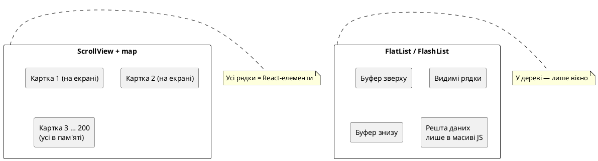

# Списки та віртуалізація

## Навіщо ця стаття

Уявіть стрічку поїздок: не три картки «для демо», а **сотні** записів за роки — з обкладинками, датами, короткими описами. Користувач гортає пальцем униз у метро. Якщо застосунок одразу створює **усі** картки в пам’яті (як `array.map` усередині `ScrollView`), телефон починає «заїкатися»: довге перше відкриття, ривки при скролі, нагрів, інколи навіть закриття застосунку системою.

У статті про базові компоненти ми вже розвели ролі: `ScrollView` — для **невеликого** прокручуваного контенту (форма, стаття, 3–5 карток). Офіційна документація React Native прямо радить: для **довгих однотипних списків** брати **`FlatList`** (або сильніший аналог), а не мапити все в `ScrollView`.

Ця стаття — про те, **як** малювати довгі списки так, щоб телефон тримав лише «вікно» рядків біля екрана. Це і є **віртуалізація** (virtualization).

Після статті ви зможете:

1. Пояснити різницю між `ScrollView` + `map` і віртуалізованим списком.  
2. Зібрати `FlatList` з `data`, `renderItem`, `keyExtractor`.  
3. Показати **порожній** стан (`ListEmptyComponent`), **шапку/підвал** списку, **pull-to-refresh**.  
4. Зрозуміти UI **пагінації** (`onEndReached`) — без справжнього API (мережа буде пізніше).  
5. Згрупувати дані в `SectionList` (наприклад, книги за жанром).  
6. Знати, навіщо **`FlashList`** і коли його ставити замість `FlatList`.  
7. У **Nomad** — віртуалізована стрічка поїздок + горизонтальний список місць.

::note
**Головна думка.** Довгий список на телефоні **не** малює всі тисячі рядків одразу. Він тримає в дереві React лише ті, що (майже) видно на екрані, плюс невеликий запас зверху й знизу. Коли ви скролите, старі рядки **знімаються** (або **переробляються** під нові дані), а нові з’являються. Користувач бачить нескінченну стрічку; телефон — лише «вікно» в масив.
::

::tip
**Живі прев’ю.** Демо нижче — через `::react-native-preview` (react-native-web). `FlatList` / `SectionList` / `RefreshControl` у прев’ю працюють. **`FlashList` у iframe немає** (окремий пакет) — його розбираємо в тексті й підключаємо в Nomad / міні-проєкті на пристрої. Скрол у браузері зручніший мишею/трекпадом; «рідний» feel — у Expo Go.
::

---

## Місток з web React

| У браузері | У React Native | Коментар |
| ---------- | -------------- | -------- |
| `<ul>{items.map(…)}</ul>` на сторінці | `ScrollView` + `map` | Усе в DOM / у нативному дереві **одразу** |
| `window` + document scroll | `ScrollView` | Одна довга «сторінка» контенту |
| `react-window`, `react-virtualized`, TanStack Virtual | `FlatList` / `SectionList` / `FlashList` | **Віртуалізація**: малюємо лише visible (+ buffer) |
| Infinite scroll (IntersectionObserver) | `onEndReached` | Підвантаження, коли близько до кінця |
| Pull-to-refresh (мобільні веб-патерни) | `RefreshControl` | «Потягнути вниз — оновити» |

::warning
**Web-звичка.** Написати `{trips.map(t => <TripCard … />)}` всередині `ScrollView` і вважати, що «це ж той самий React». Для **3** карток — нормально. Для **200** — ви створюєте 200 нативних view з картинками **до** першого кадру. На слабкому Android це відчувається одразу.
::

---

## Що ламається без віртуалізації

### Життєва сцена

Ви відкрили «Мандрівник». На екрані видно **дві** картки поїздок. Решта — нижче, за межами екрана. Питання: чи **потрібно** телефону зараз тримати в пам’яті ще 198 карток з `Image`?

Якщо відповідь «так, бо ми зробили `map`» — ви платите CPU і RAM за те, чого користувач **не бачить**.

### `ScrollView` + `map` — що відбувається

::steps

### 1. Завантаження екрана
React будує **усі** дочірні елементи масиву. Кожна картка — окремий піддерево (`Pressable`, `Image`, тексти).

### 2. Layout
Нативний шар рахує висоту **всього** вмісту (навіть за екраном), щоб знати, наскільки довгий скрол.

### 3. Скрол
Пам’ять уже зайнята; під час скролу ще йдуть оновлення зображень, тіні, перерахунки — телефон «пихтить».

### 4. Що бачить користувач
Ривки, білі спалахи, довгий cold start. Людина не каже «віртуалізація погана» — каже «додаток гальмує».

::

{.diagram-img}

::plant-uml



::

---

## Віртуалізація простими словами

**Віртуалізація (virtualization)** — техніка, коли UI **не створює** одночасно всі елементи довгого списку, а малює лише ті, що потрібні для поточного положення скролу (плюс невеликий **буфер** поза екраном, щоб скрол був плавним).

![Віртуалізація: data[], вікно змонтованих рядків і recycle](/images/react-native/lists-and-virtualization/02.svg){.diagram-img}

Аналогія з вебом: якщо ви колись підключали `react-window` до таблиці на 10 000 рядків — ідея та сама. У React Native «дефолтний» інструмент для цього — **`FlatList`** (під капотом — `VirtualizedList`).

::field-group

::field{name="data" type="масив"}
Джерело правди: усі елементи списку в JavaScript. Це **не** означає, що всі вони змонтовані як UI.
::

::field{name="вікно (window)" type="поняття"}
Підмножина `data`, для якої зараз існують нативні view. Рухається разом зі скролом.
::

::field{name="recycle / reuse" type="ідея"}
Деякі списки (зокрема **FlashList**) **перевикористовують** уже створені рядки: знімають старі props і підставляють нові дані, замість знищити компонент і створити новий. Менше алокацій — плавніший скрол.
::

::field{name="key / keyExtractor" type="ідентичність"}
Стабільний **ідентифікатор** рядка (краще `id` з даних, не індекс масиву). React і список мають розуміти «це той самий trip, лише зсунувся», а не «зовсім новий елемент».
::

::

---

## `FlatList` — базовий віртуалізований список

**`FlatList`** — компонент React Native для відображення **довгого** прокручуваного списку **однотипних** елементів з віртуалізацією. Ви передаєте масив і функцію «як намалювати один елемент»; список сам вирішує, **які** елементи зараз живуть у дереві.

Мінімальний каркас:

```tsx
import { FlatList, Text, View } from 'react-native';

type Item = { id: string; title: string };

const DATA: Item[] = [
  { id: '1', title: 'Перший' },
  { id: '2', title: 'Другий' },
  { id: '3', title: 'Третій' },
];

export function SimpleList() {
  return (
    <FlatList
      data={DATA}
      keyExtractor={(item) => item.id}
      renderItem={({ item }) => (
        <View>
          <Text>{item.title}</Text>
        </View>
      )}
    />
  );
}
```

### Анатомія props

::field-group

::field{name="data" type="ArrayLike"}
Масив (або масивоподібний) елементів. Коли `data` змінюється за **посиланням** і вмістом — список оновлюється. Для «виділили рядок» див. `extraData`.
::

::field{name="renderItem" type="({ item, index, separators }) => ReactElement"}
Функція, яка малює **один** рядок. Викликається для елементів у вікні (і при recycle). Тримайте її **стабільною** (`useCallback`) або виносьте компонент рядка назовні.
::

::field{name="keyExtractor" type="(item, index) => string"}
Повертає унікальний ключ. За замовчуванням FlatList шукає `item.key` або `item.id`. Краще **явний** `keyExtractor`, якщо поле інше.
::

::field{name="ListEmptyComponent" type="component | element"}
Що показати, коли `data` порожній (або довжина 0). Порожній стан — частина UX, не «білий екран».
::

::field{name="ListHeaderComponent / ListFooterComponent" type="component | element"}
Шапка й підвал **всередині** скролу (заголовок секції, фільтри, спінер «завантажуємо ще…»).
::

::field{name="ItemSeparatorComponent" type="component"}
Розділювач **між** рядками (лінія, відступ). Зручніше, ніж `marginBottom` на кожній картці з «у останньої нуль».
::

::field{name="contentContainerStyle" type="style"}
Стиль **внутрішнього** контейнера вмісту (padding списку). Як у `ScrollView`: не плутати зі `style` самої «рамки» списку.
::

::field{name="style" type="style"}
Стиль зовнішнього контейнера списку. Часто `flex: 1`, щоб зайняти місце між шапкою екрана і sticky-кнопкою.
::

::field{name="extraData" type="any"}
Якщо рядок залежить від стану **поза** `item` (наприклад, `selectedId`), передайте цей стан у `extraData`, інакше FlatList може **не** перемалювати рядки (він оптимізує оновлення).
::

::field{name="refreshing + onRefresh / refreshControl" type="refresh"}
Pull-to-refresh: або пара props `refreshing` / `onRefresh`, або повний `<RefreshControl />` через `refreshControl={…}`.
::

::field{name="onEndReached + onEndReachedThreshold" type="pagination UI"}
Колбек, коли скрол близько до кінця. `threshold` — частка видимої довжини (наприклад `0.3` ≈ «за 30% екрана до кінця»). Для «підвантажити ще сторінку».
::

::field{name="horizontal" type="boolean"}
Горизонтальний список (чіпи, «останні місця», карусель). Тоді «кінець» — праворуч.
::

::

### Демо: простий `FlatList`

::react-native-preview{title="FlatList · базовий" device="iphone" filename="FlatListBasic.tsx" height="560"}

```tsx
import { FlatList, StyleSheet, Text, View, useColorScheme } from 'react-native';

type Row = { id: string; title: string; subtitle: string };

const DATA: Row[] = Array.from({ length: 40 }, (_, i) => ({
  id: String(i + 1),
  title: `Поїздка ${i + 1}`,
  subtitle: i % 2 === 0 ? 'Гори' : 'Місто',
}));

export default function App() {
  const dark = useColorScheme() === 'dark';
  const bg = dark ? '#000' : '#F8FAFC';
  const surface = dark ? '#1c1c1e' : '#fff';
  const text = dark ? '#f5f5f7' : '#0f172a';
  const muted = dark ? '#a1a1aa' : '#64748b';
  const border = dark ? '#3a3a3c' : '#e2e8f0';

  return (
    <View style={[styles.screen, { backgroundColor: bg }]}>
      <Text style={[styles.h, { color: text }]}>FlatList · 40 рядків</Text>
      <Text style={{ color: muted, marginBottom: 8, fontSize: 13 }}>
        У дереві — лише видимі. Прокрутіть список.
      </Text>
      <FlatList
        style={styles.list}
        data={DATA}
        keyExtractor={(item) => item.id}
        contentContainerStyle={{ paddingBottom: 16, gap: 8 }}
        renderItem={({ item }) => (
          <View
            style={[
              styles.row,
              { backgroundColor: surface, borderColor: border },
            ]}
          >
            <Text style={[styles.title, { color: text }]}>{item.title}</Text>
            <Text style={{ color: muted, fontSize: 13 }}>{item.subtitle}</Text>
          </View>
        )}
      />
    </View>
  );
}

const styles = StyleSheet.create({
  screen: { flex: 1, padding: 16, paddingTop: 24 },
  h: { fontSize: 20, fontWeight: '800', marginBottom: 4 },
  list: { flex: 1 },
  row: {
    borderWidth: 1,
    borderRadius: 12,
    padding: 14,
  },
  title: { fontSize: 16, fontWeight: '700', marginBottom: 4 },
});
```

::

::tip
**Bounded height.** Як і `ScrollView`, список потребує **обмеженої висоти** батька (`flex: 1` у ланцюжку Screen → область списку). Якщо батько «висота за контентом», віртуалізація ламається або скрол не з’являється.
::

---

## `keyExtractor`: чому не індекс

```tsx
// Погано для динамічних списків
keyExtractor={(_, index) => String(index)}

// Добре
keyExtractor={(item) => item.id}
```

**Що бачить користувач при «поганих» ключах:** після видалення/вставки рядка «стрибають» стани (розкрита картка, локальний `useState` у рядку), картинки «липнуть» не до тих об’єктів, анімації дивні.

**Правило:** ключ = **стабільна бізнес-ідентичність** (`trip.id`), не позиція в масиві.

::warning
**Не ставте `key={…}` вручну на корені того, що повертає `renderItem` «замість» `keyExtractor`.** Список сам керує ключами через `keyExtractor`. Дублювання плутає recycle (особливо у FlashList).
::

---

## Порожній стан, шапка, розділювачі

Порожній список — не баг. Це нормальний екран: «Поки немає поїздок» + підказка, що робити далі.

::react-native-preview{title="ListEmptyComponent" device="android" filename="ListEmpty.tsx" height="520"}

```tsx
import { useState } from 'react';
import {
  FlatList,
  Pressable,
  StyleSheet,
  Text,
  View,
  useColorScheme,
} from 'react-native';

type Row = { id: string; title: string };

export default function App() {
  const dark = useColorScheme() === 'dark';
  const bg = dark ? '#000' : '#F8FAFC';
  const surface = dark ? '#1c1c1e' : '#fff';
  const text = dark ? '#f5f5f7' : '#0f172a';
  const muted = dark ? '#a1a1aa' : '#64748b';
  const primary = dark ? '#3b82f6' : '#2563eb';
  const border = dark ? '#3a3a3c' : '#e2e8f0';

  const [data, setData] = useState<Row[]>([]);

  return (
    <View style={[styles.screen, { backgroundColor: bg }]}>
      <View style={styles.toolbar}>
        <Pressable
          onPress={() =>
            setData((prev) => [
              ...prev,
              { id: String(Date.now()), title: `Книга ${prev.length + 1}` },
            ])
          }
          style={[styles.btn, { backgroundColor: primary }]}
        >
          <Text style={styles.btnText}>Додати</Text>
        </Pressable>
        <Pressable
          onPress={() => setData([])}
          style={[styles.btn, { backgroundColor: surface, borderColor: border, borderWidth: 1 }]}
        >
          <Text style={{ color: text, fontWeight: '700' }}>Очистити</Text>
        </Pressable>
      </View>

      <FlatList
        style={{ flex: 1 }}
        data={data}
        keyExtractor={(item) => item.id}
        contentContainerStyle={
          data.length === 0 ? styles.emptyContainer : { paddingBottom: 16, gap: 8 }
        }
        ListHeaderComponent={
          <Text style={[styles.h, { color: text }]}>Моя полиця</Text>
        }
        ListEmptyComponent={
          <View style={styles.empty}>
            <Text style={[styles.emptyTitle, { color: text }]}>Порожньо</Text>
            <Text style={{ color: muted, textAlign: 'center', lineHeight: 20 }}>
              Натисніть «Додати» — з’явиться перший рядок. ListEmptyComponent
              замінює «нічого».
            </Text>
          </View>
        }
        renderItem={({ item }) => (
          <View style={[styles.row, { backgroundColor: surface, borderColor: border }]}>
            <Text style={{ color: text, fontWeight: '600' }}>{item.title}</Text>
          </View>
        )}
      />
    </View>
  );
}

const styles = StyleSheet.create({
  screen: { flex: 1, padding: 16, paddingTop: 24 },
  toolbar: { flexDirection: 'row', gap: 8, marginBottom: 12 },
  btn: {
    paddingHorizontal: 14,
    paddingVertical: 10,
    borderRadius: 10,
  },
  btnText: { color: '#fff', fontWeight: '700' },
  h: { fontSize: 18, fontWeight: '800', marginBottom: 12 },
  emptyContainer: { flexGrow: 1 },
  empty: {
    flex: 1,
    minHeight: 220,
    alignItems: 'center',
    justifyContent: 'center',
    gap: 8,
    paddingHorizontal: 12,
  },
  emptyTitle: { fontSize: 18, fontWeight: '700' },
  row: {
    borderWidth: 1,
    borderRadius: 12,
    padding: 14,
  },
});
```

::

::tip
**`contentContainerStyle` + empty.** Щоб порожній стан **вирівняти по центру** вертикально, часто ставлять `contentContainerStyle={{ flexGrow: 1 }}` (коли `data.length === 0`). Інакше empty «прилипає» до верху скролу.
::

---

## Pull-to-refresh (`RefreshControl`)

**Pull-to-refresh** — жест «потягнути список вниз і відпустити», після якого застосунок **оновлює** дані. На iOS звичний спінер зверху; на Android — свій Material-індикатор.

{.diagram-img}

У React Native це компонент **`RefreshControl`**, який передають у `refreshControl` у `ScrollView` / `FlatList` / `SectionList` (вертикальний скрол).

::field-group

::field{name="refreshing" type="boolean"}
Чи зараз іде оновлення. `true` — крутиться індикатор, навіть якщо жест уже відпущено.
::

::field{name="onRefresh" type="() => void"}
Колбек після жесту. Тут ви ставите `refreshing = true`, вантажите дані, потім `false`.
::

::field{name="tintColor / colors" type="стиль"}
iOS: `tintColor`. Android: `colors={[…]}` — колір індикатора під ваш primary.
::

::

### Демо: оновлення списку

::react-native-preview{title="Pull-to-refresh" device="iphone" filename="PullRefresh.tsx" height="560"}

```tsx
import { useCallback, useState } from 'react';
import {
  FlatList,
  RefreshControl,
  StyleSheet,
  Text,
  View,
  useColorScheme,
} from 'react-native';

type Row = { id: string; title: string; stamp: number };

function makeRows(seed: number): Row[] {
  return Array.from({ length: 12 }, (_, i) => ({
    id: `${seed}-${i}`,
    title: `Елемент ${i + 1}`,
    stamp: seed,
  }));
}

export default function App() {
  const dark = useColorScheme() === 'dark';
  const bg = dark ? '#000' : '#F8FAFC';
  const surface = dark ? '#1c1c1e' : '#fff';
  const text = dark ? '#f5f5f7' : '#0f172a';
  const muted = dark ? '#a1a1aa' : '#64748b';
  const primary = dark ? '#3b82f6' : '#2563eb';
  const border = dark ? '#3a3a3c' : '#e2e8f0';

  const [seed, setSeed] = useState(1);
  const [data, setData] = useState(() => makeRows(1));
  const [refreshing, setRefreshing] = useState(false);

  const onRefresh = useCallback(() => {
    setRefreshing(true);
    setTimeout(() => {
      const next = seed + 1;
      setSeed(next);
      setData(makeRows(next));
      setRefreshing(false);
    }, 800);
  }, [seed]);

  return (
    <View style={[styles.screen, { backgroundColor: bg }]}>
      <Text style={[styles.h, { color: text }]}>Потягніть униз</Text>
      <Text style={{ color: muted, marginBottom: 8, fontSize: 13 }}>
        Оновлення №{seed} · mock-затримка 800 ms
      </Text>
      <FlatList
        style={{ flex: 1 }}
        data={data}
        keyExtractor={(item) => item.id}
        contentContainerStyle={{ gap: 8, paddingBottom: 16 }}
        refreshControl={
          <RefreshControl
            refreshing={refreshing}
            onRefresh={onRefresh}
            tintColor={primary}
            colors={[primary]}
          />
        }
        renderItem={({ item }) => (
          <View
            style={[styles.row, { backgroundColor: surface, borderColor: border }]}
          >
            <Text style={{ color: text, fontWeight: '600' }}>{item.title}</Text>
            <Text style={{ color: muted, fontSize: 12 }}>batch {item.stamp}</Text>
          </View>
        )}
      />
    </View>
  );
}

const styles = StyleSheet.create({
  screen: { flex: 1, padding: 16, paddingTop: 24 },
  h: { fontSize: 20, fontWeight: '800' },
  row: {
    borderWidth: 1,
    borderRadius: 12,
    padding: 14,
    flexDirection: 'row',
    justifyContent: 'space-between',
    alignItems: 'center',
  },
});
```

::

У прев’ю потягніть список **униз** (на тачпаді / з зажатою кнопкою миші). На реальному телефоні жест природніший.

Мережевий шар (справжній GET, помилки, offline) — у статті про networking. Тут важливий **UI-контракт**: `refreshing` чесний, індикатор зникає, дані оновлюються або показується помилка.

---

## Пагінація UI: `onEndReached`

**Пагінація** — підвантаження даних **порціями** (сторінками), а не «усі 10 000 з сервера одразу».

На мобільному UX часто:

1. Перша порція (наприклад, 20 елементів).  
2. Користувач доскролив майже до кінця.  
3. Показуємо footer «Завантаження…».  
4. Дописуємо наступну порцію в `data`.  
5. Якщо сервер сказав «більше немає» — footer зникає / «Це все».

`onEndReached` викликається, коли скрол наближається до кінця списку. **`onEndReachedThreshold`** — наскільки рано (частка visible length).

::warning
**Обережно з подвійними викликами.** Під час швидкого скролу або зміни `data` колбек може спрацювати знову. Захист: прапорець `loadingMore`, перевірка `hasMore`, не стартувати другий fetch, поки перший не закінчився. У цій статті — mock; з RTK Query / TanStack Query захист ляже на шар даних.
::

### Демо: «ще 10», коли внизу

::react-native-preview{title="onEndReached · mock pages" device="iphone" filename="PaginationUI.tsx" height="600"}

```tsx
import { useCallback, useState } from 'react';
import {
  ActivityIndicator,
  FlatList,
  StyleSheet,
  Text,
  View,
  useColorScheme,
} from 'react-native';

type Row = { id: string; title: string };

const PAGE = 10;
const MAX = 50;

function pageItems(from: number, count: number): Row[] {
  return Array.from({ length: count }, (_, i) => {
    const n = from + i + 1;
    return { id: String(n), title: `Книга №${n}` };
  });
}

export default function App() {
  const dark = useColorScheme() === 'dark';
  const bg = dark ? '#000' : '#F8FAFC';
  const surface = dark ? '#1c1c1e' : '#fff';
  const text = dark ? '#f5f5f7' : '#0f172a';
  const muted = dark ? '#a1a1aa' : '#64748b';
  const primary = dark ? '#3b82f6' : '#2563eb';
  const border = dark ? '#3a3a3c' : '#e2e8f0';

  const [data, setData] = useState(() => pageItems(0, PAGE));
  const [loadingMore, setLoadingMore] = useState(false);
  const hasMore = data.length < MAX;

  const loadMore = useCallback(() => {
    if (loadingMore || !hasMore) return;
    setLoadingMore(true);
    setTimeout(() => {
      setData((prev) => {
        const next = pageItems(prev.length, Math.min(PAGE, MAX - prev.length));
        return [...prev, ...next];
      });
      setLoadingMore(false);
    }, 700);
  }, [loadingMore, hasMore]);

  return (
    <View style={[styles.screen, { backgroundColor: bg }]}>
      <Text style={[styles.h, { color: text }]}>Пагінація UI</Text>
      <Text style={{ color: muted, marginBottom: 8, fontSize: 13 }}>
        {data.length} / {MAX} · долистайте вниз
      </Text>
      <FlatList
        style={{ flex: 1 }}
        data={data}
        keyExtractor={(item) => item.id}
        onEndReached={loadMore}
        onEndReachedThreshold={0.3}
        contentContainerStyle={{ gap: 8, paddingBottom: 16 }}
        ListFooterComponent={
          loadingMore ? (
            <View style={styles.footer}>
              <ActivityIndicator color={primary} />
              <Text style={{ color: muted, marginTop: 8 }}>Завантаження…</Text>
            </View>
          ) : !hasMore ? (
            <Text style={{ color: muted, textAlign: 'center', padding: 12 }}>
              Це всі книги (mock)
            </Text>
          ) : null
        }
        renderItem={({ item }) => (
          <View
            style={[styles.row, { backgroundColor: surface, borderColor: border }]}
          >
            <Text style={{ color: text, fontWeight: '600' }}>{item.title}</Text>
          </View>
        )}
      />
    </View>
  );
}

const styles = StyleSheet.create({
  screen: { flex: 1, padding: 16, paddingTop: 24 },
  h: { fontSize: 20, fontWeight: '800' },
  row: { borderWidth: 1, borderRadius: 12, padding: 14 },
  footer: { paddingVertical: 16, alignItems: 'center' },
});
```

::

---

## Стан помилки списку

Порожній масив після **успішного** відповіді «у вас 0 поїздок» і порожній екран після **мережевої помилки** — різні речі. Не зводьте обидва до одного `ListEmptyComponent` без розрізнення.

Типова модель UI (ще до RTK Query):

| Стан | Що на екрані |
| ---- | ------------ |
| `loading` (перший раз) | скелетон / спінер по центру, **не** empty |
| `success` + `data.length === 0` | `ListEmptyComponent` («Створіть першу поїздку») |
| `success` + є дані | `FlatList` з рядками |
| `error` | банер / повний error-state з «Спробувати знову» (часто **замість** списку або над ним) |
| `refreshing` | список лишається, зверху `RefreshControl` |

::note
Поки в курсі mock-дані в пам’яті, error-state можна зімітувати кнопкою «Зіпсувати завантаження». У проді помилка прийде з шару мережі — але **розмітка екрана** лишиться тією ж ідеєю.
::

---

## `SectionList` — секції з заголовками

**`SectionList`** — віртуалізований список, де дані розбиті на **секції** (sections). У кожної секції є заголовок (`title` / `renderSectionHeader`) і свій масив `data`.

{.diagram-img}

Аналогія: контакти в телефоні, згруповані за літерою; меню ресторану за категоріями; **каталог книг за жанром**.

Форма даних:

```tsx
type Section = {
  title: string;
  data: Book[];
};

const sections: Section[] = [
  { title: 'Фантастика', data: [/* … */] },
  { title: 'Детектив', data: [/* … */] },
];
```

```tsx
<SectionList
  sections={sections}
  keyExtractor={(item) => item.id}
  renderItem={({ item }) => <BookRow book={item} />}
  renderSectionHeader={({ section: { title } }) => (
    <Text style={styles.sectionHeader}>{title}</Text>
  )}
  stickySectionHeadersEnabled
/>
```

::tabs

::tab{label="iOS"}
`stickySectionHeadersEnabled` за замовчуванням **`true`**: заголовок секції «липне» зверху, доки його не витіснить наступний. Звичний патерн системних списків Apple.
::

::tab{label="Android"}
За замовчуванням sticky-заголовки **вимкнені** (`false`) — на Android це не такий універсальний системний жест. Можна ввімкнути явно, якщо дизайн цього хоче; перевірте на реальному пристрої, що заголовки не перекривають контент дивно.
::

::

### Демо: секції

::react-native-preview{title="SectionList · жанри" device="iphone" filename="SectionListDemo.tsx" height="620"}

```tsx
import {
  SectionList,
  StyleSheet,
  Text,
  View,
  useColorScheme,
} from 'react-native';

type Book = { id: string; title: string; author: string };

const SECTIONS: { title: string; data: Book[] }[] = [
  {
    title: 'Фантастика',
    data: [
      { id: '1', title: 'Дюна', author: 'Ф. Герберт' },
      { id: '2', title: 'Ліва рука темряви', author: 'У. Ле Ґуїн' },
      { id: '3', title: 'Нейромант', author: 'В. Ґібсон' },
    ],
  },
  {
    title: 'Детектив',
    data: [
      { id: '4', title: 'Ім’я троянди', author: 'У. Еко' },
      { id: '5', title: 'Дівчина з тату', author: 'С. Ларссон' },
    ],
  },
  {
    title: 'Подорожі',
    data: [
      { id: '6', title: 'Дорога', author: 'Дж. Керуак' },
      { id: '7', title: 'Холод', author: 'А. Камю' },
      { id: '8', title: 'Nomad notes', author: 'Анонім' },
    ],
  },
];

export default function App() {
  const dark = useColorScheme() === 'dark';
  const bg = dark ? '#000' : '#F8FAFC';
  const surface = dark ? '#1c1c1e' : '#fff';
  const text = dark ? '#f5f5f7' : '#0f172a';
  const muted = dark ? '#a1a1aa' : '#64748b';
  const primary = dark ? '#3b82f6' : '#2563eb';
  const border = dark ? '#3a3a3c' : '#e2e8f0';
  const headerBg = dark ? '#111' : '#e2e8f0';

  return (
    <View style={[styles.screen, { backgroundColor: bg }]}>
      <Text style={[styles.h, { color: text }]}>Каталог · SectionList</Text>
      <SectionList
        style={{ flex: 1 }}
        sections={SECTIONS}
        keyExtractor={(item) => item.id}
        stickySectionHeadersEnabled
        contentContainerStyle={{ paddingBottom: 24 }}
        renderSectionHeader={({ section: { title } }) => (
          <View style={[styles.sec, { backgroundColor: headerBg }]}>
            <Text style={{ color: primary, fontWeight: '800' }}>{title}</Text>
          </View>
        )}
        renderItem={({ item }) => (
          <View
            style={[styles.row, { backgroundColor: surface, borderColor: border }]}
          >
            <Text style={{ color: text, fontWeight: '700' }}>{item.title}</Text>
            <Text style={{ color: muted, marginTop: 4 }}>{item.author}</Text>
          </View>
        )}
        ItemSeparatorComponent={() => <View style={{ height: 8 }} />}
        SectionSeparatorComponent={() => <View style={{ height: 12 }} />}
      />
    </View>
  );
}

const styles = StyleSheet.create({
  screen: { flex: 1, padding: 16, paddingTop: 24 },
  h: { fontSize: 20, fontWeight: '800', marginBottom: 12 },
  sec: {
    paddingVertical: 8,
    paddingHorizontal: 10,
    borderRadius: 8,
    marginBottom: 8,
  },
  row: {
    borderWidth: 1,
    borderRadius: 12,
    padding: 14,
  },
});
```

::

---

## Продуктивність рядка: `memo`, стабільні колбеки

Віртуалізація **не скасовує** дорогий рядок. Якщо кожен `TripCard` тягне величезне зображення без розмірів, робить важкі обчислення в render і слухає зайвий контекст — список усе одно гальмуватиме.

Практичні звички (достатньо «на зараз»; глибокий profiling — окрема стаття):

1. **`React.memo` на компоненті рядка** — не перемальовувати, якщо `trip` і `onPress` ті самі за посиланням.  
2. **`useCallback` для `renderItem` / `onPress`** — щоб memo мав шанс спрацювати.  
3. **Не створювати нову функцію-обгортку в JSX без потреби** в кожному рядку, якщо можна передати `item` і стабільний handler.  
4. **Картинки:** фіксована висота обкладинки, розумний розмір URI (`w=800`), пізніше — кеш / `expo-image`.  
5. **`getItemLayout`** (опційно), якщо **усі** рядки **однакової** висоти — список швидше рахує offsets без вимірювання. Для карток різної висоти часто **не** використовують.

```tsx
const renderItem = useCallback(
  ({ item }: { item: Trip }) => (
    <TripCard trip={item} onPress={handleOpenTrip} />
  ),
  [handleOpenTrip],
);
```

::tip
**`extraData`.** Виділення рядка (`selectedId`) живе **поза** `item`. Без `extraData={selectedId}` FlatList може вирішити, що `data` не змінився, і не оновити підсвітку. Передавайте все «зовнішнє», від чого залежить вигляд рядка.
::

---

## `FlashList` — коли FlatList уже «не тягне»

**FlashList** (`@shopify/flash-list`) — список від Shopify з **більш агресивним recycling** рядків і зазвичай **кращою** продуктивністю на довгих/складних списках, ніж у вбудованого `FlatList`. API навмисно близький до FlatList: часто міграція — це зміна імпорту й кілька props.

### Навіщо він з’явився

`FlatList` достатній для багатьох екранів. Але на стрічках з картинками, змінною висотою, складними картками з’являються «порожні дірки» під час швидкого скролу, jank, зайві mount/unmount. FlashList **перевикористовує** view-рядків (ідея близька до Android `RecyclerView`).

### Встановлення (Expo)

```bash
npx expo install @shopify/flash-list
# або
npm install @shopify/flash-list
```

Сумісний з Expo Go (окремий native config plugin для базового сценарію зазвичай не потрібен).

### Міграція з FlatList (ідея)

```tsx
// було
import { FlatList } from 'react-native';
<FlatList data={…} renderItem={…} keyExtractor={…} />

// стало
import { FlashList } from '@shopify/flash-list';
<FlashList data={…} renderItem={…} keyExtractor={…} />
```

::tabs

::tab{label="FlashList v1"}
Часто вимагав **`estimatedItemSize`** — приблизну висоту (або ширину) рядка в dp. Без оцінки layout «стрибав». Брали середню висоту картки (наприклад, `220`).
::

::tab{label="FlashList v2"}
У v2 props на кшталт `estimatedItemSize` / `estimatedListSize` **прибрали**: розміри рахуються сучасніше. Дивіться версію в `package.json` і [migration notes](https://shopify.github.io/flash-list/) для вашої major-версії.
::

::

### Важливі відмінності від FlatList

| Тема | Що знати |
| ---- | -------- |
| Recycling | Рядок може **одержати нові props** без повного unmount — локальний `useState` у рядку «переїде» на інший item, якщо не синхронізувати зі `item.id` |
| `key` у дереві item | Не розставляйте зайві `key` всередині item tree «по-старому» — суперечить recycle |
| Nested lists | Горизонтальний список у header — ок; важкі вкладені вертикальні списки все одно болючі для UX |
| Прев’ю на сайті курсу | У `::react-native-preview` пакета **немає** — перевірка на пристрої / симуляторі |

::caution
**Стан усередині item-компонента.** Якщо в рядку `const [open, setOpen] = useState(false)` і користувач розкрив акордеон, після recycle цей же компонент-інстанс може показати **інший** `item` уже з `open === true`. Або ключуйте стан словником `id → state` зверху, або скидайте стан у `useEffect` від `item.id`.
::

::note
У **Nomad** на домашньому екрані стрічка поїздок — **`FlashList`**. Горизонтальні «останні місця» — **`FlatList` horizontal** (короткий список, API з коробки). Обидва підходи законні; головне — не мапити 200 карток у `ScrollView`.
::

---

## Антипатерни

| Антипатерн | Чому погано | Що замість |
| ---------- | ----------- | ---------- |
| `ScrollView` + `data.map` на 100+ | Усе в пам’яті одразу | `FlatList` / `FlashList` |
| `keyExtractor` = index | Плутанина ідентичності | `item.id` |
| Новий `renderItem={() => …}` без memo-стратегії | Зайві ререндери | `useCallback` + `memo` на рядку |
| Список без `flex: 1` | Немає bounded height | Ланцюг flex від Screen |
| Empty і error — один екран | Користувач не розуміє причину | Окремі стани |
| `onEndReached` без `loadingMore` | Подвійні запити | Прапорець / захист у data-шарі |
| Ігнорувати recycle у FlashList | «Липкий» UI-стан рядка | Стан від `item.id` |

---

## Міні-проєкт: «Каталог книг»

### Що має вийти

Окремий маленький Expo-екран (можна тимчасовий проєкт `npx create-expo-app book-catalog` або окремий файл у пісочниці):

1. **200+** mock-книг.  
2. Групування в **секції за жанром** (`SectionList`).  
3. **Pull-to-refresh** (перемішує / оновлює «рейтинг» mock).  
4. Порожній стан (кнопка «Очистити полицю» / «Заповнити знову»).  
5. (Опційно) footer пагінації **або** одразу всі 200 у `sections` — на вибір; головне — віртуалізація, не `ScrollView`.

### Модель даних

```ts
type Book = {
  id: string;
  title: string;
  author: string;
  genre: string;
  year: number;
};

type BookSection = {
  title: string;
  data: Book[];
};
```

### Кроки

::steps

### 1. Згенерувати mock
Масив жанрів: `['Фантастика', 'Детектив', 'Подорожі', 'Історія', 'Поезія']`.  
Цикл на 220 елементів: `id`, назва `Книга ${i}`, автор, жанр по модулю, рік.

### 2. Згрупувати в sections
`reduce` / `Map` за `genre` → масив `{ title, data }`, відсортувати `title`.

### 3. `SectionList`
`renderItem` — рядок (назва, автор, рік).  
`renderSectionHeader` — жанр.  
`stickySectionHeadersEnabled` — увімкнути й глянути на iOS/Android.

### 4. Refresh
`RefreshControl`: під час refresh — `setSeed(s => s+1)` і перезібрати mock (інші «рейтинги» в підзаголовку).

### 5. Empty
Кнопка «Очистити» → `sections = []` → `ListEmptyComponent`.  
«Заповнити» → знову generate.

### 6. Перевірка
Скрол має бути плавним; у React DevTools / логіці ви **не** монтуєте 220 важких дерев одночасно як у ScrollView (перевірка «на око»: швидкий fling без багатосекундного freeze на старті).

::

### Повний орієнтир коду (згорнуто)

Код **повний** — розгорніть, щоб скопіювати в `App.tsx` пісочниці. У прев’ю нижче — стисліша версія для браузера.

::collapsible{title="Повний код App.tsx каталогу — розгорнути за потреби"}

```tsx
import { useCallback, useMemo, useState } from 'react';
import {
  Pressable,
  RefreshControl,
  SectionList,
  StyleSheet,
  Text,
  View,
} from 'react-native';
import { SafeAreaView } from 'react-native-safe-area-context';

type Book = {
  id: string;
  title: string;
  author: string;
  genre: string;
  year: number;
  rating: number;
};

type BookSection = { title: string; data: Book[] };

const GENRES = ['Фантастика', 'Детектив', 'Подорожі', 'Історія', 'Поезія'] as const;
const AUTHORS = ['Коваленко', 'Шевченко', 'Лис', 'Мельник', 'Бондар'];

function buildBooks(seed: number, count = 220): Book[] {
  return Array.from({ length: count }, (_, i) => {
    const genre = GENRES[i % GENRES.length];
    return {
      id: `${seed}-${i}`,
      title: `Книга ${i + 1}`,
      author: AUTHORS[i % AUTHORS.length],
      genre,
      year: 1990 + (i % 35),
      rating: ((seed + i) % 50) / 10 + 5, // 5.0–9.9
    };
  });
}

function toSections(books: Book[]): BookSection[] {
  const map = new Map<string, Book[]>();
  for (const b of books) {
    const list = map.get(b.genre) ?? [];
    list.push(b);
    map.set(b.genre, list);
  }
  return [...map.entries()]
    .sort(([a], [b]) => a.localeCompare(b, 'uk'))
    .map(([title, data]) => ({ title, data }));
}

export default function App() {
  const [seed, setSeed] = useState(1);
  const [books, setBooks] = useState(() => buildBooks(1));
  const [refreshing, setRefreshing] = useState(false);

  const sections = useMemo(() => toSections(books), [books]);

  const onRefresh = useCallback(() => {
    setRefreshing(true);
    setTimeout(() => {
      setSeed((s) => {
        const next = s + 1;
        setBooks(buildBooks(next));
        return next;
      });
      setRefreshing(false);
    }, 700);
  }, []);

  return (
    <SafeAreaView style={styles.safe}>
      <View style={styles.toolbar}>
        <Text style={styles.h}>Каталог книг</Text>
        <Text style={styles.muted}>
          {books.length} книг · seed {seed}
        </Text>
        <View style={styles.row}>
          <Pressable
            style={styles.btn}
            onPress={() => {
              setBooks(buildBooks(seed));
            }}
          >
            <Text style={styles.btnText}>Заповнити</Text>
          </Pressable>
          <Pressable
            style={[styles.btn, styles.btnGhost]}
            onPress={() => setBooks([])}
          >
            <Text style={styles.btnGhostText}>Очистити</Text>
          </Pressable>
        </View>
      </View>

      <SectionList
        sections={sections}
        style={styles.list}
        keyExtractor={(item) => item.id}
        stickySectionHeadersEnabled
        refreshControl={
          <RefreshControl refreshing={refreshing} onRefresh={onRefresh} />
        }
        contentContainerStyle={
          books.length === 0 ? styles.grow : { paddingBottom: 24 }
        }
        ListEmptyComponent={
          <View style={styles.empty}>
            <Text style={styles.emptyTitle}>Полиця порожня</Text>
            <Text style={styles.muted}>Натисніть «Заповнити» або pull-to-refresh.</Text>
          </View>
        }
        renderSectionHeader={({ section: { title, data } }) => (
          <View style={styles.sec}>
            <Text style={styles.secText}>
              {title} · {data.length}
            </Text>
          </View>
        )}
        renderItem={({ item }) => (
          <View style={styles.card}>
            <Text style={styles.title}>{item.title}</Text>
            <Text style={styles.muted}>
              {item.author} · {item.year} · ★ {item.rating.toFixed(1)}
            </Text>
          </View>
        )}
        ItemSeparatorComponent={() => <View style={{ height: 8 }} />}
      />
    </SafeAreaView>
  );
}

const styles = StyleSheet.create({
  safe: { flex: 1, backgroundColor: '#F8FAFC' },
  toolbar: { padding: 16, gap: 6, borderBottomWidth: 1, borderColor: '#E2E8F0' },
  h: { fontSize: 22, fontWeight: '800', color: '#0F172A' },
  muted: { color: '#64748B', fontSize: 13 },
  row: { flexDirection: 'row', gap: 8, marginTop: 8 },
  btn: {
    backgroundColor: '#2563EB',
    paddingHorizontal: 12,
    paddingVertical: 10,
    borderRadius: 10,
  },
  btnText: { color: '#fff', fontWeight: '700' },
  btnGhost: { backgroundColor: '#fff', borderWidth: 1, borderColor: '#E2E8F0' },
  btnGhostText: { color: '#0F172A', fontWeight: '700' },
  list: { flex: 1, paddingHorizontal: 16, paddingTop: 12 },
  grow: { flexGrow: 1 },
  empty: { flex: 1, minHeight: 240, alignItems: 'center', justifyContent: 'center', gap: 8 },
  emptyTitle: { fontSize: 18, fontWeight: '700', color: '#0F172A' },
  sec: {
    backgroundColor: '#E2E8F0',
    paddingVertical: 8,
    paddingHorizontal: 10,
    borderRadius: 8,
    marginBottom: 8,
  },
  secText: { fontWeight: '800', color: '#2563EB' },
  card: {
    backgroundColor: '#fff',
    borderRadius: 12,
    borderWidth: 1,
    borderColor: '#E2E8F0',
    padding: 14,
  },
  title: { fontWeight: '700', color: '#0F172A', marginBottom: 4 },
});
```

::

### Живе прев’ю (після кроків)

::react-native-preview{title="Каталог книг · SectionList" device="iphone" filename="BookCatalog.tsx" height="700"}

```tsx
import { useCallback, useMemo, useState } from 'react';
import {
  Pressable,
  RefreshControl,
  SectionList,
  StyleSheet,
  Text,
  View,
  useColorScheme,
} from 'react-native';

type Book = {
  id: string;
  title: string;
  author: string;
  genre: string;
  year: number;
  rating: number;
};

const GENRES = ['Фантастика', 'Детектив', 'Подорожі', 'Історія', 'Поезія'] as const;
const AUTHORS = ['Коваленко', 'Шевченко', 'Лис', 'Мельник', 'Бондар'];

function buildBooks(seed: number, count = 80): Book[] {
  return Array.from({ length: count }, (_, i) => ({
    id: `${seed}-${i}`,
    title: `Книга ${i + 1}`,
    author: AUTHORS[i % AUTHORS.length],
    genre: GENRES[i % GENRES.length],
    year: 1990 + (i % 35),
    rating: ((seed + i) % 50) / 10 + 5,
  }));
}

function toSections(books: Book[]) {
  const map = new Map<string, Book[]>();
  for (const b of books) {
    const list = map.get(b.genre) ?? [];
    list.push(b);
    map.set(b.genre, list);
  }
  return [...map.entries()]
    .sort(([a], [b]) => a.localeCompare(b, 'uk'))
    .map(([title, data]) => ({ title, data }));
}

export default function App() {
  const dark = useColorScheme() === 'dark';
  const bg = dark ? '#000' : '#F8FAFC';
  const surface = dark ? '#1c1c1e' : '#fff';
  const text = dark ? '#f5f5f7' : '#0f172a';
  const muted = dark ? '#a1a1aa' : '#64748b';
  const primary = dark ? '#3b82f6' : '#2563eb';
  const border = dark ? '#3a3a3c' : '#e2e8f0';
  const headerBg = dark ? '#111' : '#e2e8f0';

  const [seed, setSeed] = useState(1);
  const [books, setBooks] = useState(() => buildBooks(1));
  const [refreshing, setRefreshing] = useState(false);
  const sections = useMemo(() => toSections(books), [books]);

  const onRefresh = useCallback(() => {
    setRefreshing(true);
    setTimeout(() => {
      setSeed((s) => {
        const next = s + 1;
        setBooks(buildBooks(next));
        return next;
      });
      setRefreshing(false);
    }, 700);
  }, []);

  return (
    <View style={[styles.safe, { backgroundColor: bg }]}>
      <View style={[styles.toolbar, { borderColor: border }]}>
        <Text style={[styles.h, { color: text }]}>Каталог книг</Text>
        <Text style={{ color: muted, fontSize: 13 }}>
          {books.length} · seed {seed} · SectionList
        </Text>
        <View style={styles.rowBtns}>
          <Pressable
            style={[styles.btn, { backgroundColor: primary }]}
            onPress={() => setBooks(buildBooks(seed))}
          >
            <Text style={styles.btnText}>Заповнити</Text>
          </Pressable>
          <Pressable
            style={[styles.btn, { backgroundColor: surface, borderColor: border, borderWidth: 1 }]}
            onPress={() => setBooks([])}
          >
            <Text style={{ color: text, fontWeight: '700' }}>Очистити</Text>
          </Pressable>
        </View>
      </View>

      <SectionList
        style={{ flex: 1 }}
        sections={sections}
        keyExtractor={(item) => item.id}
        stickySectionHeadersEnabled
        refreshControl={
          <RefreshControl
            refreshing={refreshing}
            onRefresh={onRefresh}
            tintColor={primary}
            colors={[primary]}
          />
        }
        contentContainerStyle={
          books.length === 0
            ? { flexGrow: 1, padding: 16 }
            : { padding: 16, paddingBottom: 24 }
        }
        ListEmptyComponent={
          <View style={styles.empty}>
            <Text style={[styles.emptyTitle, { color: text }]}>Полиця порожня</Text>
            <Text style={{ color: muted, textAlign: 'center' }}>
              Заповніть або pull-to-refresh
            </Text>
          </View>
        }
        renderSectionHeader={({ section: { title, data } }) => (
          <View style={[styles.sec, { backgroundColor: headerBg }]}>
            <Text style={{ color: primary, fontWeight: '800' }}>
              {title} · {data.length}
            </Text>
          </View>
        )}
        renderItem={({ item }) => (
          <View style={[styles.card, { backgroundColor: surface, borderColor: border }]}>
            <Text style={{ color: text, fontWeight: '700' }}>{item.title}</Text>
            <Text style={{ color: muted, marginTop: 4, fontSize: 13 }}>
              {item.author} · {item.year} · ★ {item.rating.toFixed(1)}
            </Text>
          </View>
        )}
        ItemSeparatorComponent={() => <View style={{ height: 8 }} />}
        SectionSeparatorComponent={() => <View style={{ height: 10 }} />}
      />
    </View>
  );
}

const styles = StyleSheet.create({
  safe: { flex: 1 },
  toolbar: { padding: 16, gap: 6, borderBottomWidth: 1 },
  h: { fontSize: 20, fontWeight: '800' },
  rowBtns: { flexDirection: 'row', gap: 8, marginTop: 8 },
  btn: { paddingHorizontal: 12, paddingVertical: 10, borderRadius: 10 },
  btnText: { color: '#fff', fontWeight: '700' },
  empty: {
    flex: 1,
    minHeight: 220,
    alignItems: 'center',
    justifyContent: 'center',
    gap: 8,
  },
  emptyTitle: { fontSize: 18, fontWeight: '700' },
  sec: {
    paddingVertical: 8,
    paddingHorizontal: 10,
    borderRadius: 8,
    marginBottom: 8,
  },
  card: { borderWidth: 1, borderRadius: 12, padding: 14 },
});
```

::

---

## Nomad: віртуалізовані поїздки та місця

### Навіщо користувачу

Стрічка росте. Потрібна віртуалізація, pull-to-refresh і горизонтальні «останні місця», **без** втрати теми й sticky CTA з попередніх статей.

### Нитка проєкту

**Уже є** (з попередніх статей — **не викидаємо**):

- **Тема (08):** `ThemeProvider`, чіпи Система/Світла/Темна в **sticky header**.
- **Shell (07):** header + середня зона + sticky «Нова поїздка».
- **Картки (06):** `TripCard` + `mockTrips` (було 3; список через `ScrollView` + `map`).

**Додаємо в цій статті:**

- Залежність `@shopify/flash-list`; стрічка поїздок — **`FlashList`** (не `ScrollView` + `map`).
- Більше mock-поїздок; поле `region` на `Trip`.
- Фіча місць: `Place`, `mockPlaces`, `PlaceChip`, horizontal `FlatList` у `ListHeaderComponent`.
- `RefreshControl`, `ListEmptyComponent`; `TripCard` / `PlaceChip` у `memo`.
- **Не прибираємо** чіпи теми з 08 — вони лишаються в sticky header.

{.diagram-img}

### Повний знімок проєкту після цієї статті

::tip
**Готовий код 1:1** з [Nomad](https://github.com/arakviel/nomad). Найшвидший шлях: `git pull` у клоні репо. Нижче — **весь** проєкт на момент цієї статті (усі файли з кодом), не фрагмент «лише нові папки». Клік по файлу в дереві → повний вміст для копіпасту.
::

```bash
cd /path/to/nomad
git pull
npm install
npx expo start
```

::code-tree

```json [package.json]
{
  "name": "nomad",
  "version": "1.0.0",
  "main": "expo-router/entry",
  "scripts": {
    "start": "expo start",
    "android": "expo start --android",
    "ios": "expo start --ios",
    "web": "expo start --web"
  },
  "dependencies": {
    "@shopify/flash-list": "^2.3.2",
    "expo": "~54.0.35",
    "expo-constants": "~18.0.13",
    "expo-linking": "~8.0.12",
    "expo-router": "~6.0.24",
    "expo-status-bar": "~3.0.9",
    "react": "19.1.0",
    "react-native": "0.81.5",
    "react-native-safe-area-context": "~5.6.0",
    "react-native-screens": "~4.16.0"
  },
  "devDependencies": {
    "@types/react": "~19.1.0",
    "typescript": "~5.9.2"
  },
  "private": true
}
```

```json [app.json]
{
  "expo": {
    "name": "Nomad",
    "slug": "nomad",
    "version": "1.0.0",
    "orientation": "portrait",
    "icon": "./assets/icon.png",
    "userInterfaceStyle": "light",
    "scheme": "nomad",
    "newArchEnabled": true,
    "splash": {
      "image": "./assets/splash-icon.png",
      "resizeMode": "contain",
      "backgroundColor": "#ffffff"
    },
    "ios": {
      "supportsTablet": true
    },
    "android": {
      "adaptiveIcon": {
        "foregroundImage": "./assets/adaptive-icon.png",
        "backgroundColor": "#ffffff"
      },
      "edgeToEdgeEnabled": true,
      "predictiveBackGestureEnabled": false
    },
    "web": {
      "favicon": "./assets/favicon.png"
    },
    "plugins": ["expo-router"]
  }
}
```

```json [tsconfig.json]
{
  "extends": "expo/tsconfig.base",
  "compilerOptions": {
    "strict": true,
    "paths": {
      "@/*": [
        "./src/*"
      ]
    }
  },
  "include": [
    "**/*.ts",
    "**/*.tsx"
  ]
}
```

```tsx [app/_layout.tsx]
import { Stack } from 'expo-router';
import { StatusBar } from 'expo-status-bar';

import { ThemeProvider, useTheme } from '@/shared/theme';

function RootNavigator() {
  const { colors, scheme } = useTheme();

  return (
    <>
      <StatusBar style={scheme === 'dark' ? 'light' : 'dark'} />
      <Stack
        screenOptions={{
          headerShown: false,
          contentStyle: { backgroundColor: colors.background },
        }}
      />
    </>
  );
}

export default function RootLayout() {
  return (
    <ThemeProvider>
      <RootNavigator />
    </ThemeProvider>
  );
}
```

```tsx [app/index.tsx]
import { useCallback, useState } from 'react';
import {
  FlatList,
  Pressable,
  RefreshControl,
  StyleSheet,
  View,
} from 'react-native';
import { FlashList } from '@shopify/flash-list';

import {
  mockPlaces,
  mockTrips,
  PlaceChip,
  TripCard,
  type Place,
  type Trip,
} from '@/features/trips';
import { useTheme, type ThemePreference } from '@/shared/theme';
import { AppText, Button, Screen } from '@/shared/ui';

const PREFS: { id: ThemePreference; label: string }[] = [
  { id: 'system', label: 'Система' },
  { id: 'light', label: 'Світла' },
  { id: 'dark', label: 'Темна' },
];

export default function HomeScreen() {
  const { colors, spacing, preference, setPreference, scheme } = useTheme();
  const [trips, setTrips] = useState<Trip[]>(mockTrips);
  const [places] = useState<Place[]>(mockPlaces);
  const [refreshing, setRefreshing] = useState(false);

  const handleOpenTrip = useCallback((trip: Trip) => {
    console.log('TODO: відкрити поїздку', trip.id, trip.title);
  }, []);

  const handleOpenPlace = useCallback((place: Place) => {
    console.log('TODO: відкрити місце', place.id, place.name);
  }, []);

  const onRefresh = useCallback(() => {
    setRefreshing(true);
    // Mock pull-to-refresh: «мережа» ще не підключена — імітуємо затримку.
    setTimeout(() => {
      setTrips([...mockTrips]);
      setRefreshing(false);
    }, 900);
  }, []);

  const renderTrip = useCallback(
    ({ item }: { item: Trip }) => (
      <TripCard trip={item} onPress={handleOpenTrip} />
    ),
    [handleOpenTrip],
  );

  const keyExtractor = useCallback((item: Trip) => item.id, []);

  // Шапка списку: місця + підпис секції. Чіпи теми лишаються в sticky header (як у статті 08).
  const listHeader = (
    <View style={{ gap: spacing.md, marginBottom: spacing.md }}>
      {places.length > 0 ? (
        <View style={{ gap: spacing.sm }}>
          <AppText style={{ fontWeight: '600' }}>Останні місця</AppText>
          <FlatList
            horizontal
            data={places}
            keyExtractor={(item) => item.id}
            renderItem={({ item }) => (
              <PlaceChip place={item} onPress={handleOpenPlace} />
            )}
            showsHorizontalScrollIndicator={false}
            ItemSeparatorComponent={() => <View style={{ width: spacing.sm }} />}
            contentContainerStyle={{ paddingVertical: 2 }}
          />
        </View>
      ) : null}

      <AppText style={{ fontWeight: '600' }}>Ваші поїздки</AppText>
    </View>
  );

  const listEmpty = (
    <View
      style={[
        styles.empty,
        {
          paddingHorizontal: spacing.sm,
          paddingVertical: spacing.xl,
          gap: spacing.sm,
        },
      ]}
    >
      <AppText variant="subtitle" style={styles.emptyTitle}>
        Поки немає поїздок
      </AppText>
      <AppText
        variant="caption"
        color={colors.textSecondary}
        style={styles.emptyDesc}
      >
        Потягніть список униз, щоб «оновити», або натисніть «Нова поїздка».
      </AppText>
    </View>
  );

  return (
    <Screen style={styles.screen}>
      {/* Sticky header з 08: бренд + тема + чіпи — не скроляться зі списком */}
      <View
        style={[
          styles.header,
          {
            paddingHorizontal: spacing.md,
            paddingTop: spacing.sm,
            paddingBottom: spacing.md,
            gap: spacing.xs,
            borderBottomColor: colors.border,
          },
        ]}
      >
        <AppText variant="title">Мандрівник</AppText>
        <AppText variant="caption" style={{ marginTop: spacing.xs }}>
          Щоденник подорожей · тема: {scheme === 'dark' ? 'темна' : 'світла'}
        </AppText>
        <AppText
          variant="caption"
          style={{
            marginTop: spacing.xs,
            color: colors.primary,
            fontWeight: '600',
          }}
        >
          {trips.length > 0
            ? `${trips.length} поїздок · ${places.length} місць`
            : 'Список порожній'}
        </AppText>

        <View style={[styles.themeRow, { gap: spacing.sm, marginTop: spacing.sm }]}>
          {PREFS.map((p) => {
            const active = preference === p.id;
            return (
              <Pressable
                key={p.id}
                onPress={() => setPreference(p.id)}
                style={[
                  styles.themeChip,
                  {
                    backgroundColor: active ? colors.primary : colors.surface,
                    borderColor: colors.border,
                  },
                ]}
                accessibilityRole="button"
                accessibilityState={{ selected: active }}
                accessibilityLabel={`Тема: ${p.label}`}
              >
                <AppText
                  variant="caption"
                  color={active ? colors.onPrimary : colors.text}
                  style={styles.themeChipText}
                >
                  {p.label}
                </AppText>
              </Pressable>
            );
          })}
        </View>
      </View>

      <View style={styles.listWrap}>
        <FlashList
          data={trips}
          renderItem={renderTrip}
          keyExtractor={keyExtractor}
          ListHeaderComponent={listHeader}
          ListEmptyComponent={listEmpty}
          contentContainerStyle={{
            paddingHorizontal: spacing.md,
            paddingTop: spacing.md,
            paddingBottom: spacing.md,
          }}
          ItemSeparatorComponent={() => <View style={{ height: spacing.md }} />}
          refreshControl={
            <RefreshControl
              refreshing={refreshing}
              onRefresh={onRefresh}
              tintColor={colors.primary}
              colors={[colors.primary]}
            />
          }
          showsVerticalScrollIndicator={false}
        />
      </View>

      <View
        style={[
          styles.footer,
          {
            paddingHorizontal: spacing.md,
            paddingTop: spacing.sm,
            paddingBottom: spacing.md,
            borderTopColor: colors.border,
            backgroundColor: colors.background,
          },
        ]}
      >
        <Button
          label="Нова поїздка"
          onPress={() => {
            console.log('TODO: відкрити створення поїздки');
          }}
        />
      </View>
    </Screen>
  );
}

const styles = StyleSheet.create({
  screen: {
    paddingHorizontal: 0,
  },
  header: {
    borderBottomWidth: 1,
  },
  themeRow: {
    flexDirection: 'row',
    flexWrap: 'wrap',
  },
  themeChip: {
    paddingHorizontal: 12,
    paddingVertical: 8,
    borderRadius: 8,
    borderWidth: 1,
  },
  themeChipText: {
    fontWeight: '600',
  },
  listWrap: {
    flex: 1,
  },
  empty: {
    alignItems: 'center',
    justifyContent: 'center',
  },
  emptyTitle: {
    textAlign: 'center',
  },
  emptyDesc: {
    textAlign: 'center',
  },
  footer: {
    borderTopWidth: 1,
  },
});
```

```ts [src/features/trips/index.ts]
export { mockTrips } from './model/mockTrips';
export { mockPlaces } from './model/mockPlaces';
export type { Trip, Place } from './model/types';
export { TripCard } from './ui/TripCard';
export { PlaceChip } from './ui/PlaceChip';
```

```ts [src/features/trips/model/mockPlaces.ts]
import type { Place } from './types';

/** Місця всередині поїздок — для горизонтальної стрічки на home. */
export const mockPlaces: Place[] = [
  {
    id: 'p1',
    tripId: '1',
    name: 'Говерла',
    city: 'Карпати',
    note: 'Схід сонця з вершини',
  },
  {
    id: 'p2',
    tripId: '1',
    name: 'Котедж біля полонини',
    city: 'Карпати',
    note: 'Вечірній чай і камін',
  },
  {
    id: 'p3',
    tripId: '2',
    name: 'Площа Ринок',
    city: 'Львів',
    note: 'Ратуша й кав’ярні',
  },
  {
    id: 'p4',
    tripId: '2',
    name: 'Високий Замок',
    city: 'Львів',
    note: 'Панорама міста',
  },
  {
    id: 'p5',
    tripId: '3',
    name: 'Дерибасівська',
    city: 'Одеса',
    note: 'Прогулянка ввечері',
  },
  {
    id: 'p6',
    tripId: '3',
    name: 'Ланжерон',
    city: 'Одеса',
    note: 'Пляж і набережна',
  },
  {
    id: 'p7',
    tripId: '4',
    name: 'Андріївський узвіз',
    city: 'Київ',
    note: 'Галереї й бруківка',
  },
  {
    id: 'p8',
    tripId: '6',
    name: 'Стара фортеця',
    city: 'Кам’янець',
    note: 'Фото з мосту',
  },
  {
    id: 'p9',
    tripId: '9',
    name: 'Ужгородський замок',
    city: 'Ужгород',
    note: 'Музей і сад',
  },
  {
    id: 'p10',
    tripId: '12',
    name: 'Водоспад Пробій',
    city: 'Яремче',
    note: 'Шум води й місток',
  },
];
```

```ts [src/features/trips/model/mockTrips.ts]
import type { Trip } from './types';

/**
 * Mock-стрічка поїздок. Більше за 3–5 елементів — щоб віртуалізація
 * (FlashList / FlatList) мала сенс на домашньому екрані.
 */
export const mockTrips: Trip[] = [
  {
    id: '1',
    title: 'Карпати на вихідні',
    dateLabel: '12–14 бер. 2026',
    description: 'Говерла, полонини й вечірній чай біля каміну в котеджі.',
    coverUri:
      'https://images.unsplash.com/photo-1464822759023-fed622ff2c3b?w=800&q=80',
    region: 'Карпати',
  },
  {
    id: '2',
    title: 'Львівський вікенд',
    dateLabel: '2–4 трав. 2026',
    description: 'Кава, площа Ринок, закапелки й нічний трамвай.',
    coverUri:
      'https://images.unsplash.com/photo-1555881400-74d7acaacd8b?w=800&q=80',
    region: 'Захід',
  },
  {
    id: '3',
    title: 'Одеса біля моря',
    dateLabel: '18–22 лип. 2026',
    description: 'Схід сонця на набережній, рибний ринок і вечірній Привоз.',
    coverUri:
      'https://images.unsplash.com/photo-1507525428034-b723cf961d3e?w=800&q=80',
    region: 'Південь',
  },
  {
    id: '4',
    title: 'Київ на три дні',
    dateLabel: '5–7 черв. 2026',
    description: 'Поділ, Андріївський узвіз, вечірня прогулянка Хрещатиком.',
    coverUri:
      'https://images.unsplash.com/photo-1565008576549-57569a49371d?w=800&q=80',
    region: 'Центр',
  },
  {
    id: '5',
    title: 'Чернівці: університет і дворики',
    dateLabel: '20–22 вер. 2026',
    description: 'Резиденція митрополитів, кава на Кобилянській, нічний двір.',
    coverUri:
      'https://images.unsplash.com/photo-1519681393784-d120267933ba?w=800&q=80',
    region: 'Захід',
  },
  {
    id: '6',
    title: 'Кам’янець-Подільський',
    dateLabel: '11–13 квіт. 2026',
    description: 'Фортеця, каньйон Смотрича, захід сонця з оглядового майданчика.',
    coverUri:
      'https://images.unsplash.com/photo-1506905925346-21bda4d32df4?w=800&q=80',
    region: 'Захід',
  },
  {
    id: '7',
    title: 'Харків: місто й парки',
    dateLabel: '8–10 серп. 2026',
    description: 'Саржин яр, набережна, вечірні вогні Сумської.',
    coverUri:
      'https://images.unsplash.com/photo-1449824913935-59a10b8d2000?w=800&q=80',
    region: 'Схід',
  },
  {
    id: '8',
    title: 'Дніпро: мости й пагорби',
    dateLabel: '15–17 трав. 2026',
    description: 'Мереживо мостів, прогулянка набережною, кава з видом на річку.',
    coverUri:
      'https://images.unsplash.com/photo-1476514525535-07fb3b4ae5f1?w=800&q=80',
    region: 'Центр',
  },
  {
    id: '9',
    title: 'Ужгород і виноград',
    dateLabel: '25–27 жовт. 2026',
    description: 'Замок, липова алея, дегустація біля місцевих виноробів.',
    coverUri:
      'https://images.unsplash.com/photo-1500530855697-b586d89ba3ee?w=800&q=80',
    region: 'Карпати',
  },
  {
    id: '10',
    title: 'Полтава: смаки й історія',
    dateLabel: '3–5 лип. 2026',
    description: 'Котлета по-київськи — ні, галушки; музей і тихі двори.',
    coverUri:
      'https://images.unsplash.com/photo-1469474968028-56623f02e42e?w=800&q=80',
    region: 'Центр',
  },
  {
    id: '11',
    title: 'Затока: пісок і шторм',
    dateLabel: '1–7 серп. 2026',
    description: 'Ранкові купання, вечірній вітер, книжка під парасолькою.',
    coverUri:
      'https://images.unsplash.com/photo-1507525428034-b723cf961d3e?w=600&q=80',
    region: 'Південь',
  },
  {
    id: '12',
    title: 'Яремче: водоспад і ліс',
    dateLabel: '19–21 черв. 2026',
    description: 'Прогулянка до водоспаду, гуцульська кухня, туман над смереками.',
    coverUri:
      'https://images.unsplash.com/photo-1441974231531-c6227db76b6e?w=800&q=80',
    region: 'Карпати',
  },
];
```

```ts [src/features/trips/model/types.ts]
export type Trip = {
  id: string;
  title: string;
  dateLabel: string;
  description: string;
  coverUri: string;
  /** Рік / період для групування (навчальні секції пізніше). */
  region: string;
};

export type Place = {
  id: string;
  tripId: string;
  name: string;
  city: string;
  note: string;
};
```

```tsx [src/features/trips/ui/PlaceChip.tsx]
import { memo } from 'react';
import { Pressable, StyleSheet } from 'react-native';

import type { Place } from '@/features/trips/model/types';
import { useTheme } from '@/shared/theme';
import { AppText } from '@/shared/ui';

type PlaceChipProps = {
  place: Place;
  onPress?: (place: Place) => void;
};

function PlaceChipComponent({ place, onPress }: PlaceChipProps) {
  const { colors, spacing, radius } = useTheme();

  return (
    <Pressable
      accessibilityRole="button"
      accessibilityLabel={`Місце ${place.name}, ${place.city}`}
      onPress={() => onPress?.(place)}
      style={({ pressed }) => [
        styles.chip,
        {
          backgroundColor: colors.surface,
          borderColor: colors.border,
          borderRadius: radius.md,
          padding: spacing.sm,
          opacity: pressed ? 0.9 : 1,
        },
      ]}
    >
      <AppText variant="subtitle" numberOfLines={1} style={styles.name}>
        {place.name}
      </AppText>
      <AppText variant="caption" color={colors.primary} style={styles.city}>
        {place.city}
      </AppText>
      <AppText variant="caption" numberOfLines={2} style={styles.note}>
        {place.note}
      </AppText>
    </Pressable>
  );
}

export const PlaceChip = memo(PlaceChipComponent);

const styles = StyleSheet.create({
  chip: {
    width: 160,
    borderWidth: 1,
    minHeight: 96,
  },
  name: {
    fontSize: 16,
  },
  city: {
    marginTop: 4,
    fontWeight: '600',
  },
  note: {
    marginTop: 6,
  },
});
```

```tsx [src/features/trips/ui/TripCard.tsx]
import { memo } from 'react';
import { Image, Platform, Pressable, StyleSheet, View } from 'react-native';

import type { Trip } from '@/features/trips/model/types';
import { useTheme } from '@/shared/theme';
import { AppText } from '@/shared/ui';

type TripCardProps = {
  trip: Trip;
  onPress?: (trip: Trip) => void;
};

function TripCardComponent({ trip, onPress }: TripCardProps) {
  const { colors, spacing, radius } = useTheme();

  return (
    <Pressable
      accessibilityRole="button"
      accessibilityLabel={`Поїздка ${trip.title}`}
      onPress={() => onPress?.(trip)}
      style={({ pressed }) => [
        styles.card,
        {
          backgroundColor: colors.surface,
          borderColor: colors.border,
          borderRadius: radius.lg,
        },
        pressed && styles.cardPressed,
      ]}
    >
      <Image
        source={{ uri: trip.coverUri }}
        style={[styles.cover, { backgroundColor: colors.border }]}
        resizeMode="cover"
        accessibilityIgnoresInvertColors
      />
      <View style={[styles.body, { padding: spacing.md, gap: spacing.xs }]}>
        <View style={[styles.titleRow, { gap: spacing.sm }]}>
          <AppText variant="subtitle" numberOfLines={1} style={styles.titleFlex}>
            {trip.title}
          </AppText>
          <AppText variant="caption" style={styles.dates}>
            {trip.dateLabel}
          </AppText>
        </View>
        <AppText variant="caption" color={colors.primary} style={styles.region}>
          {trip.region}
        </AppText>
        <AppText
          numberOfLines={2}
          style={{ marginTop: spacing.xs, color: colors.textSecondary }}
        >
          {trip.description}
        </AppText>
        <View style={[styles.footer, { marginTop: spacing.sm }]}>
          <AppText variant="caption" color={colors.primary}>
            Відкрити
          </AppText>
        </View>
      </View>
    </Pressable>
  );
}

/** memo: рядок списку не перемальовується, якщо props ті самі. */
export const TripCard = memo(TripCardComponent);

const styles = StyleSheet.create({
  card: {
    borderWidth: 1,
    overflow: 'hidden',
    ...Platform.select({
      ios: {
        shadowColor: '#000',
        shadowOpacity: 0.08,
        shadowRadius: 10,
        shadowOffset: { width: 0, height: 4 },
      },
      android: {
        elevation: 3,
      },
      default: {},
    }),
  },
  cardPressed: {
    opacity: 0.92,
  },
  cover: {
    width: '100%',
    height: 160,
  },
  body: {},
  titleRow: {
    flexDirection: 'row',
    alignItems: 'center',
  },
  titleFlex: {
    flex: 1,
  },
  dates: {
    flexShrink: 0,
  },
  region: {
    fontWeight: '600',
  },
  footer: {
    alignItems: 'flex-start',
  },
});
```

```tsx [src/shared/theme/ThemeProvider.tsx]
import {
  createContext,
  ReactNode,
  useCallback,
  useContext,
  useMemo,
  useState,
} from 'react';
import { useColorScheme as useSystemColorScheme } from 'react-native';

import {
  colorsForScheme,
  type ColorSchemeName,
  type ColorTokens,
} from './colors';
import { fontSize, radius, space } from './tokens';

/** Що обрав користувач: слідувати системі або примусово light/dark. */
export type ThemePreference = 'system' | ColorSchemeName;

type ThemeContextValue = {
  /** Фактична схема, якою малюємо UI. */
  scheme: ColorSchemeName;
  preference: ThemePreference;
  setPreference: (value: ThemePreference) => void;
  colors: ColorTokens;
  spacing: typeof space;
  radius: typeof radius;
  fontSize: typeof fontSize;
};

const ThemeContext = createContext<ThemeContextValue | null>(null);

function resolveScheme(
  preference: ThemePreference,
  system: string | null | undefined,
): ColorSchemeName {
  if (preference === 'light' || preference === 'dark') {
    return preference;
  }
  return system === 'dark' ? 'dark' : 'light';
}

type ThemeProviderProps = {
  children: ReactNode;
  /** Початкова перевага (за замовчуванням — як у системі). */
  initialPreference?: ThemePreference;
};

export function ThemeProvider({
  children,
  initialPreference = 'system',
}: ThemeProviderProps) {
  const systemScheme = useSystemColorScheme();
  const [preference, setPreferenceState] =
    useState<ThemePreference>(initialPreference);

  const setPreference = useCallback((value: ThemePreference) => {
    setPreferenceState(value);
  }, []);

  const scheme = resolveScheme(preference, systemScheme);
  const colors = useMemo(() => colorsForScheme(scheme), [scheme]);

  const value = useMemo<ThemeContextValue>(
    () => ({
      scheme,
      preference,
      setPreference,
      colors,
      spacing: space,
      radius,
      fontSize,
    }),
    [scheme, preference, setPreference, colors],
  );

  return (
    <ThemeContext.Provider value={value}>{children}</ThemeContext.Provider>
  );
}

export function useTheme(): ThemeContextValue {
  const ctx = useContext(ThemeContext);
  if (!ctx) {
    throw new Error('useTheme() потрібно викликати всередині <ThemeProvider>.');
  }
  return ctx;
}
```

```ts [src/shared/theme/colors.ts]
/**
 * Семантичні кольори: назва = роль на екрані, не «синій-500».
 * light / dark — дві палітри з однаковими ключами.
 */

export const lightColors = {
  background: '#F8FAFC',
  surface: '#FFFFFF',
  text: '#0F172A',
  textSecondary: '#64748B',
  primary: '#2563EB',
  primaryPressed: '#1D4ED8',
  border: '#E2E8F0',
  danger: '#DC2626',
  onPrimary: '#FFFFFF',
} as const;

export const darkColors = {
  background: '#000000',
  surface: '#1C1C1E',
  text: '#F5F5F7',
  textSecondary: '#A1A1AA',
  primary: '#3B82F6',
  primaryPressed: '#2563EB',
  border: '#3A3A3C',
  danger: '#F87171',
  onPrimary: '#FFFFFF',
} as const;

export type ColorTokens = {
  [K in keyof typeof lightColors]: string;
};

export type ColorSchemeName = 'light' | 'dark';

export function colorsForScheme(scheme: ColorSchemeName): ColorTokens {
  return scheme === 'dark' ? { ...darkColors } : { ...lightColors };
}
```

```ts [src/shared/theme/index.ts]
export { lightColors, darkColors, colorsForScheme } from './colors';
export type { ColorTokens, ColorSchemeName } from './colors';
export { tokens, space, radius, fontSize } from './tokens';
export type { Tokens } from './tokens';
export { ThemeProvider, useTheme } from './ThemeProvider';
export type { ThemePreference } from './ThemeProvider';
```

```ts [src/shared/theme/tokens.ts]
/**
 * Токени, що **не** залежать від light/dark:
 * відступи, радіуси, розміри шрифтів.
 * Кольори — у colors.ts + ThemeProvider.
 */

export const space = {
  xs: 4,
  sm: 8,
  md: 16,
  lg: 24,
  xl: 32,
} as const;

export const radius = {
  sm: 8,
  md: 12,
  lg: 16,
} as const;

export const fontSize = {
  sm: 14,
  md: 16,
  lg: 20,
  xl: 28,
} as const;

/** @deprecated Використовуйте useTheme() для кольорів; space/radius/fontSize — нижче. */
export const tokens = {
  /** Світла палітра (fallback, якщо хтось імпортує tokens.colors без теми). */
  colors: {
    background: '#F8FAFC',
    surface: '#FFFFFF',
    text: '#0F172A',
    textSecondary: '#64748B',
    primary: '#2563EB',
    primaryPressed: '#1D4ED8',
    border: '#E2E8F0',
    danger: '#DC2626',
    onPrimary: '#FFFFFF',
  },
  spacing: space,
  radius,
  fontSize,
} as const;

export type Tokens = typeof tokens;
```

```tsx [src/shared/ui/AppText.tsx]
import { ReactNode } from 'react';
import { StyleSheet, Text, TextProps, TextStyle } from 'react-native';

import { useTheme } from '@/shared/theme';

type AppTextVariant = 'body' | 'title' | 'subtitle' | 'caption';

type AppTextProps = TextProps & {
  children: ReactNode;
  variant?: AppTextVariant;
  /** Якщо не передано — body/title/subtitle → text, caption → textSecondary. */
  color?: string;
  style?: TextStyle | TextStyle[];
};

export function AppText({
  children,
  variant = 'body',
  color,
  style,
  ...rest
}: AppTextProps) {
  const { colors, fontSize } = useTheme();
  const resolvedColor =
    color ??
    (variant === 'caption' ? colors.textSecondary : colors.text);

  return (
    <Text
      style={[
        styles.base,
        variant === 'body' && { fontSize: fontSize.md, lineHeight: 24 },
        variant === 'title' && {
          fontSize: fontSize.xl,
          fontWeight: '700',
          lineHeight: 34,
        },
        variant === 'subtitle' && {
          fontSize: fontSize.lg,
          fontWeight: '600',
          lineHeight: 28,
        },
        variant === 'caption' && {
          fontSize: fontSize.sm,
          lineHeight: 20,
        },
        { color: resolvedColor },
        style,
      ]}
      {...rest}
    >
      {children}
    </Text>
  );
}

const styles = StyleSheet.create({
  base: {},
});
```

```tsx [src/shared/ui/Button.tsx]
import { Pressable, StyleSheet, Text, ViewStyle } from 'react-native';

import { useTheme } from '@/shared/theme';

type ButtonProps = {
  label: string;
  onPress: () => void;
  disabled?: boolean;
  style?: ViewStyle;
};

export function Button({ label, onPress, disabled = false, style }: ButtonProps) {
  const { colors, spacing, radius, fontSize } = useTheme();

  return (
    <Pressable
      accessibilityRole="button"
      disabled={disabled}
      onPress={onPress}
      style={({ pressed }) => [
        styles.base,
        {
          backgroundColor: colors.primary,
          paddingVertical: spacing.sm + 4,
          paddingHorizontal: spacing.md,
          borderRadius: radius.md,
        },
        pressed && !disabled ? { backgroundColor: colors.primaryPressed } : null,
        disabled ? styles.disabled : null,
        style,
      ]}
    >
      <Text
        style={[
          styles.label,
          { color: colors.onPrimary, fontSize: fontSize.md },
        ]}
      >
        {label}
      </Text>
    </Pressable>
  );
}

const styles = StyleSheet.create({
  base: {
    alignItems: 'center',
  },
  disabled: {
    opacity: 0.5,
  },
  label: {
    fontWeight: '600',
  },
});
```

```tsx [src/shared/ui/Screen.tsx]
import { ReactNode } from 'react';
import { StyleSheet, ViewStyle } from 'react-native';
import { SafeAreaView } from 'react-native-safe-area-context';

import { space, useTheme } from '@/shared/theme';

type ScreenProps = {
  children: ReactNode;
  style?: ViewStyle;
};

export function Screen({ children, style }: ScreenProps) {
  const { colors } = useTheme();

  return (
    <SafeAreaView
      style={[styles.root, { backgroundColor: colors.background }, style]}
    >
      {children}
    </SafeAreaView>
  );
}

const styles = StyleSheet.create({
  root: {
    flex: 1,
    paddingHorizontal: space.md,
  },
});
```

```ts [src/shared/ui/index.ts]
export { AppText } from './AppText';
export { Button } from './Button';
export { Screen } from './Screen';
```

::
### Перевірка

1. Чіпи теми в шапці **залишились** і працюють (light/dark/system).
2. Стрічка поїздок скролиться (12 карток); місця — горизонтально під шапкою (у header списку).
3. Pull-to-refresh — спінер ~0.9 с.
4. Sticky «Нова поїздка» внизу на місці.

### Коміт

Якщо збирали вручну (не через `git pull` на вже запушений репо):

```bash
cd /path/to/nomad
git add -A
git commit -m "$(cat <<'EOF'
feat: virtualized trips and places lists

Material: content/15.react-native/09.lists-and-virtualization.md
EOF
)"
git push
```

У публічному репо цей коміт **уже є** — після `git pull` повторно комітити не потрібно, якщо ви не змінювали код локально.

### Результат (прев’ю)

Самодостатнє демо для сайту (core RN). У репо — `FlashList` + `@/…` + `ThemeProvider` (див. дерево вище). **Чіпи теми** й sticky CTA — як у живому Nomad.

::react-native-preview{title="Nomad · theme + lists" device="iphone" filename="NomadLists.tsx" height="720"}

```tsx
import { useCallback, useState } from 'react';
import {
  FlatList,
  Image,
  Pressable,
  RefreshControl,
  StyleSheet,
  Text,
  View,
  useColorScheme,
} from 'react-native';

type Trip = {
  id: string;
  title: string;
  dateLabel: string;
  region: string;
  coverUri: string;
};

type Place = { id: string; name: string; city: string };

const light = {
  bg: '#F8FAFC', surface: '#fff', text: '#0f172a', muted: '#64748b',
  primary: '#2563eb', border: '#e2e8f0', onPrimary: '#fff',
};
const dark = {
  bg: '#000', surface: '#1c1c1e', text: '#f5f5f7', muted: '#a1a1aa',
  primary: '#3b82f6', border: '#3a3a3c', onPrimary: '#fff',
};

const TRIPS: Trip[] = Array.from({ length: 12 }, (_, i) => ({
  id: String(i + 1),
  title: ['Карпати', 'Львів', 'Одеса', 'Київ', 'Чернівці', 'Кам’янець',
    'Харків', 'Дніпро', 'Ужгород', 'Полтава', 'Затока', 'Яремче'][i],
  dateLabel: `${i + 1}–${i + 3} бер. 2026`,
  region: i % 2 === 0 ? 'Карпати' : 'Місто',
  coverUri: `https://picsum.photos/seed/nomad${i}/800/400`,
}));

const PLACES: Place[] = [
  { id: 'p1', name: 'Говерла', city: 'Карпати' },
  { id: 'p2', name: 'Ринок', city: 'Львів' },
  { id: 'p3', name: 'Ланжерон', city: 'Одеса' },
  { id: 'p4', name: 'Поділ', city: 'Київ' },
  { id: 'p5', name: 'Фортеця', city: 'Кам’янець' },
];

export default function App() {
  const systemDark = useColorScheme() === 'dark';
  const [pref, setPref] = useState<'system' | 'light' | 'dark'>('system');
  const isDark = pref === 'dark' || (pref === 'system' && systemDark);
  const c = isDark ? dark : light;

  const [trips, setTrips] = useState(TRIPS);
  const [refreshing, setRefreshing] = useState(false);

  const onRefresh = useCallback(() => {
    setRefreshing(true);
    setTimeout(() => {
      setTrips([...TRIPS]);
      setRefreshing(false);
    }, 700);
  }, []);

  const listHeader = (
    <View style={{ gap: 12, marginBottom: 12 }}>
      <Text style={{ color: c.text, fontWeight: '700' }}>Останні місця</Text>
      <FlatList
        horizontal
        data={PLACES}
        keyExtractor={(p) => p.id}
        showsHorizontalScrollIndicator={false}
        ItemSeparatorComponent={() => <View style={{ width: 8 }} />}
        renderItem={({ item }) => (
          <View style={[styles.place, { backgroundColor: c.surface, borderColor: c.border }]}>
            <Text style={{ color: c.text, fontWeight: '700' }}>{item.name}</Text>
            <Text style={{ color: c.primary, marginTop: 4, fontSize: 12 }}>{item.city}</Text>
          </View>
        )}
      />
      <Text style={{ color: c.text, fontWeight: '700' }}>Ваші поїздки</Text>
    </View>
  );

  return (
    <View style={[styles.screen, { backgroundColor: c.bg }]}>
      <View style={[styles.top, { borderColor: c.border }]}>
        <Text style={[styles.brand, { color: c.text }]}>Мандрівник</Text>
        <Text style={{ color: c.muted, fontSize: 13, marginTop: 4 }}>
          тема: {isDark ? 'темна' : 'світла'} · {trips.length} поїздок · {PLACES.length} місць
        </Text>
        <View style={styles.chips}>
          {([
            ['system', 'Система'],
            ['light', 'Світла'],
            ['dark', 'Темна'],
          ] as const).map(([id, label]) => {
            const on = pref === id;
            return (
              <Pressable
                key={id}
                onPress={() => setPref(id)}
                style={[
                  styles.chip,
                  {
                    backgroundColor: on ? c.primary : c.surface,
                    borderColor: c.border,
                  },
                ]}
              >
                <Text style={{ color: on ? c.onPrimary : c.text, fontWeight: '700', fontSize: 12 }}>
                  {label}
                </Text>
              </Pressable>
            );
          })}
        </View>
      </View>

      <FlatList
        style={{ flex: 1 }}
        data={trips}
        keyExtractor={(t) => t.id}
        ListHeaderComponent={listHeader}
        contentContainerStyle={{ padding: 16, paddingBottom: 12 }}
        ItemSeparatorComponent={() => <View style={{ height: 12 }} />}
        refreshControl={
          <RefreshControl
            refreshing={refreshing}
            onRefresh={onRefresh}
            tintColor={c.primary}
            colors={[c.primary]}
          />
        }
        renderItem={({ item }) => (
          <View style={[styles.card, { backgroundColor: c.surface, borderColor: c.border }]}>
            <Image source={{ uri: item.coverUri }} style={styles.cover} />
            <View style={{ padding: 12 }}>
              <Text style={{ color: c.text, fontWeight: '700', fontSize: 16 }}>{item.title}</Text>
              <Text style={{ color: c.muted, marginTop: 4, fontSize: 13 }}>
                {item.dateLabel} · {item.region}
              </Text>
            </View>
          </View>
        )}
      />

      <View style={[styles.footer, { borderColor: c.border, backgroundColor: c.bg }]}>
        <Pressable style={[styles.cta, { backgroundColor: c.primary }]}>
          <Text style={{ color: c.onPrimary, fontWeight: '800' }}>Нова поїздка</Text>
        </Pressable>
      </View>
    </View>
  );
}

const styles = StyleSheet.create({
  screen: { flex: 1 },
  top: { padding: 16, borderBottomWidth: 1 },
  brand: { fontSize: 24, fontWeight: '800' },
  chips: { flexDirection: 'row', flexWrap: 'wrap', gap: 8, marginTop: 10 },
  chip: { paddingHorizontal: 12, paddingVertical: 8, borderRadius: 8, borderWidth: 1 },
  place: { width: 140, borderWidth: 1, borderRadius: 12, padding: 10, minHeight: 72 },
  card: { borderWidth: 1, borderRadius: 16, overflow: 'hidden' },
  cover: { width: '100%', height: 120, backgroundColor: '#cbd5e1' },
  footer: { borderTopWidth: 1, padding: 16 },
  cta: { paddingVertical: 14, borderRadius: 12, alignItems: 'center' },
});
```

::

---

## Практичні завдання

### Базовий рівень

1. Своїми словами пояснити, чим `ScrollView` + `map` відрізняється від `FlatList`.  
2. Зібрати `FlatList` на 30 рядків з `keyExtractor` по `id`.  
3. Додати `ListEmptyComponent` і кнопку, що очищує `data`.

### Середній рівень

1. Міні-проєкт «Каталог книг»: 200+ items, `SectionList` за жанром, pull-to-refresh.  
2. У Nomad тимчасово підмінити `FlashList` на `FlatList` і назад — порівняти код (майже drop-in).  
3. Додати mock `onEndReached`: дописувати по 5 поїздок, поки не стане 30.

### Професійний рівень

1. Error-state: кнопка «Симулювати помилку» ховає список і показує «Спробувати знову».  
2. `React.memo` + логіка «чому рядок ререндериться» (тимчасовий `console.log` у `TripCard`).  
3. Горизонтальний `FlashList` місць замість `FlatList` (якщо версія API це зручно підтримує) і нотатка про nested scrolling.

---

## Часті запитання

::accordion

::accordion-item{label="Коли ще можна ScrollView + map?" icon="i-lucide-circle-help"}
Коли елементів **мало** і вони **різнотипні** (екран налаштувань, коротка форма, 3 промо-картки). Як тільки з’являється «стрічка однотипних карток, яка ростиме» — одразу список з віртуалізацією.
::

::accordion-item{label="FlatList не скролиться / висота 0" icon="i-lucide-circle-help"}
Немає bounded height: батьки без `flex: 1`, або список у вкладеному контейнері без висоти. Перевірте ланцюг `Screen` → `listWrap` → `FlashList`/`FlatList`.
::

::accordion-item{label="Навіщо extraData?" icon="i-lucide-circle-help"}
Коли вигляд рядка залежить від стану **поза** об’єктом `item` (виділення, multi-select). Інакше FlatList може пропустити оновлення рядків.
::

::accordion-item{label="FlashList обов’язковий?" icon="i-lucide-circle-help"}
Ні. Для навчання й багатьох екранів `FlatList` достатній. FlashList — практичний default для «важких» стрічок у продакшені; у Nomad ставимо його рано, щоб звикнути до API.
::

::accordion-item{label="Чому в прев’ю сайту немає FlashList?" icon="i-lucide-circle-help"}
Host `react-native-preview` підключає лише `react` + `react-native`. Сторонні пакети туди не входять. FlashList перевіряйте в Expo Go / симуляторі.
::

::accordion-item{label="SectionList vs «кілька FlatList»" icon="i-lucide-circle-help"}
Один `SectionList` — одна віртуалізація на всі секції. Кілька незалежних `FlatList` на одному екрані (вертикально) зазвичай гірший UX (вкладений скрол). Горизонтальний список **у header** вертикального — нормальний патерн.
::

::accordion-item{label="pull-to-refresh не з’являється" icon="i-lucide-circle-help"}
Список має бути **вертикальним** і реально скролитись (контент вищий за вікно, або iOS bounce). Перевірте, що `refreshControl` переданий саме в список, а не в сусідній `View`.
::

::

---

## Що далі

Далі — **форми**: `TextInput`, клавіатура, валідація (RHF + Zod), екран створення поїздки. Списки вже вміють показувати результат; форми навчать **додавати** дані в ці списки.

[FlatList](https://reactnative.dev/docs/flatlist) · [SectionList](https://reactnative.dev/docs/sectionlist) · [VirtualizedList](https://reactnative.dev/docs/virtualizedlist) · [RefreshControl](https://reactnative.dev/docs/refreshcontrol) · [FlashList](https://shopify.github.io/flash-list/) · [Nomad](https://github.com/arakviel/nomad)
