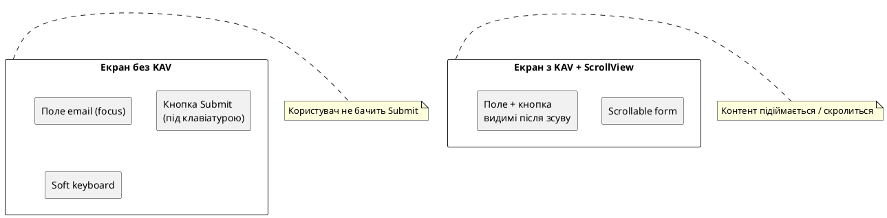
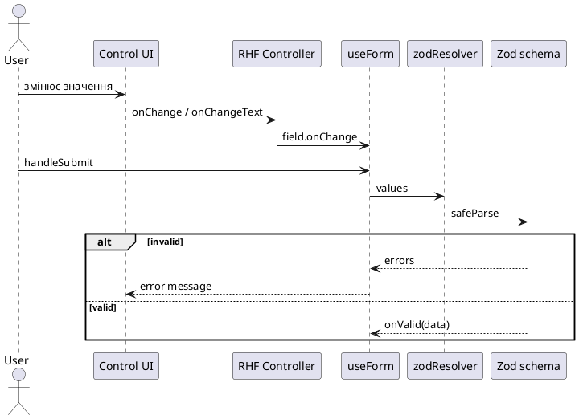

# Форми, ввід і валідація

## З чого почати

У попередній статті ми навчилися **показувати** довгі списки: поїздки гортаються, місця лежать у горизонтальній стрічці, pull-to-refresh імітує оновлення. Але щоденник подорожей, у якому не можна **додати** нову поїздку, — це музей чужих карток. Користувач натискає «Нова поїздка» і очікує **форму**: назву, регіон, дати, опис, можливо кілька перемикачів і згоду «я розумію, куди дінуться дані».

Якщо поля лишити порожніми і натиснути «Створити», застосунок не повинен мовчки нічого не зробити і не повинен «падати». Він має **пояснити**, що не так — людською мовою, **поруч із полем**, а не одним загальним `Alert` на весь екран.

У вебі ви вже, ймовірно, збирали форми на React: `<input>`, `onChange`, інколи **React Hook Form** і **Zod**. На телефоні **ідеї** ті самі (стан, правила, submit), але **середовище** інше.

1. Замість HTML-елементів — **нативні контроли** операційної системи (або бібліотеки, які їх обгортають).  
2. Замість вільної висоти вікна браузера — **програмна клавіатура** (*soft keyboard*), яка може закрити половину екрана.  
3. Замість одного «універсального» `<input type="…">` — **різні компоненти** під різні типи відповідей: текст, так/ні, список, число з діапазону, дата.

Мета цієї статті — не «швидко показати TextInput», а **зібрати словник контролів форми** і навчитися зв’язувати їх із валідацією. Складні теми навігації (глибокий Expo Router) і мережі (справжній API) з’являться пізніше; тут ми свідомо тримаємося форм і стану на клієнті.

Після статті ви зможете:

1. Пояснити, **які** контроли існують і **коли** який обирати.  
2. Зібрати **контрольований** `TextInput` і зрозуміти `value` + `onChangeText`.  
3. Зробити дію форми через **`Pressable`** і зрозуміти, чим він відрізняється від системного **`Button`**.  
4. Підключити **`Switch`**, **Checkbox**, **Slider**, **Picker**, **date picker**.  
5. Не «вбити» UX клавіатурою (`KeyboardAvoidingView`, `ScrollView`, `keyboardShouldPersistTaps`).  
6. Зв’язати все через **React Hook Form** (`Controller`) і **Zod** (`zodResolver`).  
7. Зібрати міні-проєкт «Реєстрація на подію» і форму створення поїздки в **Nomad**.

::note
**Головна думка.** Форма на телефоні — це не один `TextInput`. Це набір **типів відповіді** (текст, прапорець, список, діапазон, дата) плюс **стан і правила** (чи можна відправити) плюс **layout навколо клавіатури**. Клієнтська валідація допомагає людині; вона **не** замінює перевірку на сервері, коли з’явиться API.
::

::tip
**Живі прев’ю на цій сторінці.** У курсі є блок «телефон у браузері» (`::react-native-preview`). Він крутить **react-native-web**: знайомі компоненти з `react-native` (`TextInput`, `Switch`, `Pressable`) там видно одразу.

Чого **не** буде в цьому iframe так само, як на телефоні:

- «справжньої» програмної клавіатури iPhone/Android;
- системного календаря дати;
- пакетів на кшталт Picker / Checkbox / Slider;
- бібліотек React Hook Form і Zod (їх немає в бандлі прев’ю).

Тому: ідею UX дивіться в демо на сторінці, а повну поведінку — у **Expo Go** або симуляторі на коді міні-проєкту й Nomad.
::

Код наскрізного застосунку: [github.com/arakviel/nomad](https://github.com/arakviel/nomad).

---

## Що таке форма на телефоні (простими словами)

**Форма** (*form*) — це екран (або частина екрана), де застосунок **запитує дані** в людини, щоб потім щось із ними зробити: створити запис, увійти в акаунт, змінити налаштування, відфільтрувати список.

На вебі форма часто виглядає як прямокутники для тексту + кнопка «Надіслати». На телефоні картинка ширша. Людині зручніше **не друкувати**, якщо можна обрати:

| Питання до користувача | Зручний контроль |
| ---------------------- | ---------------- |
| «Як назвати поїздку?» | вільний текст → `TextInput` |
| «Який регіон із наших?» | фіксований список → `Picker` |
| «Коли початок?» | дата → date picker |
| «Поїздка приватна?» | так/ні одним рухом → `Switch` |
| «Є план маршруту?» | галочка → Checkbox |
| «Скільки днів орієнтовно?» | число з діапазону → `Slider` |
| «Зберегти / скасувати» | дія → `Pressable` / `Button` |

Якщо на все ставити лише `TextInput`, форма стає довгою, повільною для заповнення однією рукою і повною помилок друку («Карпатт» замість «Карпати»).

{.diagram-img}

::card-group

::card{title="TextInput" icon="i-lucide-text-cursor-input"}
Вільний текст і багаторядковий опис. Відкриває клавіатуру.
::

::card{title="Pressable / Button" icon="i-lucide-mouse-pointer-click"}
Дія: submit, скасувати, «далі». Не поле даних, а **команда**.
::

::card{title="Switch" icon="i-lucide-toggle-right"}
Один бінарний стан у вигляді перемикача «увімкнено / вимкнено».
::

::card{title="Checkbox" icon="i-lucide-check-square"}
Галочка: згода, опція «так маю». Часто в списках опцій.
::

::card{title="Slider" icon="i-lucide-sliders-horizontal"}
Число з діапазону без клавіатури (гучність, дні, рейтинг).
::

::card{title="Picker" icon="i-lucide-list-chevrons-down-up"}
Один варіант із **фіксованого** списку (регіон, валюта, статус).
::

::card{title="Date picker" icon="i-lucide-calendar"}
Системний UI дати/часу. Не «рядок 12.03.26» руками.
::

::card{title="RHF + Zod" icon="i-lucide-shield-check"}
Стан форми, правила, повідомлення про помилки, submit.
::

::

---

## Місток з web React (не таблицею «для своїх»)

У браузері ви думаєте категоріями HTML. На телефоні HTML **немає**. Нижче — не «словник жаргону», а пояснення, **що саме змінюється в голові**.

### Поле тексту

У вебі: `<input>` або `<textarea>`, подія `onChange`, значення часто з `event.target.value`.

У React Native: компонент **`TextInput`**. Подія зручніше читається як **`onChangeText`**: у колбек одразу приходить **рядок**, без розгортання `event`. Якщо поле **контрольоване**, ви передаєте `value={…}` і в `onChangeText` оновлюєте state (або RHF).

### Тип поля

У вебі один prop `type="email"` одночасно натякає браузеру: і яку клавіатуру показати на телефоні, і яку базову перевірку зробити, і як малювати поле. У React Native **немає одного еквівалента `type`**.

Замість цього ви збираєте поведінку з кількох незалежних props:

- **`keyboardType`** — яку програмну клавіатуру відкрити (`email-address`, `numeric`, `phone-pad`, …). Це впливає на **розкладку**, не на те, чи рядок «справді email».  
- **`secureTextEntry`** — чи маскувати символи (пароль). Окремий прапорець, бо «пароль» — це не тип клавіатури, а режим відображення.  
- **`multiline`** — одне поле чи кілька рядків (роль textarea).  
- плюс ваші **стилі** (висота, бордер) і **валідація** (Zod).

Чому так важливо не плутати клавіатуру з валідацією: людина може відкрити `keyboardType="email-address"` і все одно **вставити з буфера** рядок без `@`. Система не зобов’язана заборонити вставку. Тому зручна клавіатура — для швидкості вводу, а Zod — для відповіді «це ще не схоже на email» під полем.

### Кнопка

У вебі кнопка часто живе всередині `<form>`: `type="submit"` сам знає, що «натисни Enter / цю кнопку = відправити форму». Браузер збирає поля й ініціює submit.

У React Native **немає HTML-форми** і немає вбудованого «enter = submit усієї форми» для змішаного екрана. Тому submit — це **явний** обробник:

1. Людина тапає ваш **`Pressable`** (або системний `Button` — про нього нижче).  
2. У `onPress` ви викликаєте `handleSubmit(onValid)` з React Hook Form (або свою перевірку).  
3. Якщо дані ок — виконуєте збереження / навігацію; якщо ні — показуєте `errors` під полями.

Клавіша Return на soft keyboard **може** допомогти через `onSubmitEditing` на конкретному `TextInput`, але:

- на iOS і Android підписи й поведінка Return відрізняються;  
- `Switch`, `Slider`, `Picker`, Checkbox **не** відкривають клавіатуру — Return там просто немає;  
- багато людей ніколи не шукають Return і одразу тиснуть велику кнопку внизу.

Отже, велика кнопка «Створити» / «Надіслати» — **обов’язковий** елемент форми, а не опційний декор.

### Списки вибору, галочки, повзунки

У вебі: `<select>`, `<input type="checkbox">`, `<input type="range">`, `<input type="date">`.

У React Native:

| Web | React Native (типовий шлях у цьому курсі) |
| --- | ----------------------------------------- |
| `<select>` | `@react-native-picker/picker` |
| checkbox | `@react-native-community/checkbox` (або свій UI на `Pressable`) |
| range | `@react-native-community/slider` |
| date | `@react-native-community/datetimepicker` (Expo) |
| toggle «як iOS» | вбудований `Switch` з `react-native` |

Частина рядків у правій колонці — не «з коробки React Native», а **окремі пакети спільноти** (*community packages*). Історично деякі контроли жили в core, потім їх винесли в окремі репозиторії (легше оновлювати, різні команди підтримки). Інші ніколи не були універсальними для iOS+Android в одному core-API.

Практичний висновок для вас:

1. Ставите їх командою **`npx expo install ім’я-пакета`** (не «голим» `npm install` навмання) — Expo підбере версію, сумісну з **вашим SDK**.  
2. Після install інколи з’являється рядок у `plugins` у `app.json` (як для date picker) — це нормально.  
3. У прев’ю на сайті курсу цих пакетів **немає** — перевірка лише в Expo Go / симуляторі.

### React Hook Form (коротко на містку; деталі — нижче)

**React Hook Form** — бібліотека, яка тримає **стан усієї форми** (значення полів, помилки, факт submit) і зменшує кількість ручного `useState` на кожне поле.

У **веб**-документації RHF часто показують так:

```tsx
<input {...register('email')} />
```

`register` «підписує» DOM-input до форми через ref і події браузера. У React Native **немає** того самого DOM і тих самих ref-інпутів. Тому офіційний шлях для RN — компонент **`Controller`**: ви кажете «поле називається `email`», а в `render` самі з’єднуєте `value` / `onChange` / `onBlur` зі своїм `TextInput`, `Switch` тощо.

Повний розбір RHF + Zod — у розділі нижче в цій статті. На містку з вебом важливо лише: **звичка RHF лишається**, спосіб підключення контролу — через `Controller`, не через `register` + spread на `<input>`.

::warning
**Web-звичка, яка болить.** На кожне поле — свій `useState`, у кнопці — купа `if (!email) …`, помилки — один `Alert.alert('Помилка')`. Для двох полів це терпимо. Для екрана з десятьма контролями правила роз’їжджаються, повідомлення не біля поля, тестувати важко. Тому в курсі для «справжніх» форм беремо **схему (Zod) + RHF**.
::

---

## Життєва сцена: клавіатура з’їла Submit

Уявіть реєстрацію однією рукою в метро. Фокус у полі «Email» — знизу виїхала **програмна клавіатура** і закрила кнопку «Надіслати». Ви свайпаєте навмання, втрачаєте фокус, клавіатура ховається, кнопка знову з’являється. Людина не каже «немає KeyboardAvoidingView» — каже «форма крива».

Важливо: **Switch, Checkbox, Slider, Picker** клавіатуру самі **не відкривають**. Проблема «кнопка під клавіатурою» стосується переважно екранів, де є **`TextInput`**. Для боротьби з нею в React Native є контейнер **`KeyboardAvoidingView`** (часто скорочують **KAV**): він зсуває або стискає вміст, коли клавіатура відкрита. Деталі — у розділі про клавіатуру нижче.

Але форма часто **змішана**: зверху текст, знизу галочки, ще нижче кнопка. Тому типовий каркас — **завжди** `ScrollView` (форма довша за екран або стане такою з клавіатурою) + за потреби `KeyboardAvoidingView`, навіть якщо «не всі» поля текстові.

{.diagram-img}

::plant-uml



::

---

## Контрольовані значення: одна ідея для всіх контролів

Перш ніж розбирати кожен компонент, зафіксуємо **спільний патерн**.

У React (і на вебі, і в RN) поле називають **контрольованим** (*controlled*), коли **джерело правди** — ваш state (або RHF), а UI лише **відображає** це значення і повідомляє про зміни.

| Контрол | Prop значення | Prop зміни |
| ------- | ------------- | ---------- |
| `TextInput` | `value` (string) | `onChangeText` |
| `Switch` | `value` (boolean) | `onValueChange` |
| Checkbox | `value` (boolean) | `onValueChange` |
| `Slider` | `value` (number) | `onValueChange` |
| `Picker` | `selectedValue` | `onValueChange` |
| DateTimePicker | `value` (Date) | `onChange` (event, date) |

{.diagram-img}

Якщо передати prop значення (`value` / `selectedValue`), але **не** оновлювати state у колбеці зміни, контроль **«залипне»**. Людина друкує — символи не з’являються; тягне Switch — він стрибає назад; крутить Slider — підпис не змінюється. З боку виглядає як «зламаний компонент», хоча насправді зламаний **зв’язок** «UI → state → знову UI».

Це одна з найчастіших помилок на старті. Правило одне на всі контроли таблиці вище: **є value — є onChange, який це value оновлює**.

---

## `TextInput` — поле для тексту

**`TextInput`** — вбудований компонент React Native для введення тексту.

Важлива відмінність від вебу: на екрані з’являється **не** HTML-елемент `<input>`, а **справжнє поле операційної системи**. На iPhone це механізм на кшталт UITextField, на Android — EditText (назви з нативних SDK; вам їх не треба імпортувати вручну). React Native лише каже системі: «намалюй текстове поле ось тут і повідом, коли текст зміниться».

Тому поле «відчувається» як у інших застосунках телефону: своя клавіатура, своє виділення тексту, свої жести. І тому стилізація обмеженіша, ніж у CSS для `<input>`: ви задаєте рамку, колір, відступи, але не перетворюєте поле на довільний веб-віджет.

### Навіщо він потрібен

`TextInput` потрібен там, де відповідь — **вільний текст**, який людина має **набрати**, а не обрати з короткого списку:

- ім’я, email, пароль;
- назва й опис поїздки;
- коментар, пошуковий запит, номер у вільному форматі.

Якщо варіанти заздалегідь відомі («Карпати / Південь / …») — краще Picker. Якщо відповідь «так/ні» — Switch або Checkbox. `TextInput` — коли без клавіатури не обійтися.

### Мінімальний контрольований приклад

```tsx
import { useState } from 'react';
import { TextInput, View, Text } from 'react-native';

export function NameField() {
  const [name, setName] = useState('');

  return (
    <View>
      <Text>Ім’я</Text>
      <TextInput
        value={name}
        onChangeText={setName}
        placeholder="Ваше ім’я"
        autoCapitalize="words"
      />
    </View>
  );
}
```

Що тут відбувається крок за кроком:

1. У state лежить рядок `name` (спочатку порожній).  
2. `value={name}` каже полю: «покажи саме це».  
3. Коли людина друкує, викликається `onChangeText` з новим рядком.  
4. `setName` оновлює state → React перемальовує → у полі знову актуальний текст.

### Label і placeholder

**Placeholder** — сірий підказковий текст *всередині* порожнього поля. Він **зникає**, щойно з’явився хоч один символ. Тому для форми з кількома полями майже завжди потрібен окремий **label** зверху («Назва поїздки», «Email»): інакше після заповнення людина не пам’ятає, що це за рядок.

У Nomad для цього є обгортка **`TextField`**: label + `TextInput` + текст помилки або hint.

### Корисні props (розгорнуто)

::field-group

::field{name="value" type="string"}
Текст, який **зараз** має бути видно в полі. Якщо ви передаєте `value`, React Native вважає поле **контрольованим**: нативний control більше не «живе сам», а показує те, що ви йому дали з state / RHF.

Практично: після кожного `setState` / `field.onChange` компонент перемальовується, і в рамці з’являється вже новий рядок. Якщо `value` передали, а оновлювати забули — поле **залипне** (друкуєте, а символи не з’являються або одразу зникають).
::

::field{name="onChangeText" type="(text: string) => void"}
Колбек, який викликається **на кожну** зміну тексту (літера, backspace, вставка з буфера). На відміну від вебу, аргумент — одразу **готовий рядок** усього вмісту поля, а не `event` з `event.target.value`.

Типове використання: `onChangeText={setEmail}` або в RHF `onChangeText={onChange}` (те, що дав `Controller`). Саме тут ви синхронізуєте UI зі state.
::

::field{name="defaultValue" type="string"}
Початковий текст для **неконтрольованого** поля — тобто коли **немає** prop `value`, і нативний control сам тримає вміст. Зручно для разового демо, але для форми з валідацією майже завжди гірше: важче прочитати поточне значення, показати помилку й скинути форму.

У зв’язці з React Hook Form і Zod курс тримається **controlled**-шляху (`value` + `onChangeText`), а `defaultValue` залишає для винятків.
::

::field{name="placeholder" type="string"}
Сірий підказковий текст *всередині* поля, поки воно порожнє («you@example.com», «Назва поїздки»). Як тільки з’явився хоч один символ — placeholder **зникає**.

Тому placeholder **не замінює** підпис поля (label) зверху: у довгій формі після заповнення людина вже не бачить, що це було «регіон» чи «місто». Label лишається завжди; placeholder лише підказує формат або приклад.
::

::field{name="placeholderTextColor" type="color"}
Окремий колір для placeholder. Якщо його не задати, система обере дефолт, який у **темній темі** часто виглядає як «сіре на сірому» або навпаки занадто контрастний.

У Nomad `TextField` бере `placeholderTextColor` з `colors.textSecondary` теми, щоб light/dark залишались читабельними без ручного підбору на кожному екрані.
::

::field{name="editable" type="boolean"}
Чи можна змінювати текст. `false` — поле **видно**, але тап не відкриває клавіатуру і не дає редагувати (стан «тільки перегляд», прев’ю даних, тимчасово заблоковане поле під час submit).

Це не те саме, що прибрати поле з екрана: layout лишається, людина розуміє «тут буде / тут лежить значення», просто зараз його не чіпають.
::

::field{name="multiline" type="boolean"}
Увімкнути **кілька рядків** (аналог `<textarea>`). Потрібно для опису поїздки, коментаря, адреси з переносами.

На Android текст часто «стрибає» по вертикалі всередині рамки: додайте `textAlignVertical="top"`, щоб рядки починались зверху. Також задайте `minHeight` (або фіксовану висоту) у стилі — інакше поле може бути занадто низьким для зручного вводу.
::

::field{name="maxLength" type="number"}
Жорстка стеля довжини **на рівні UI**: далі символи просто не вводяться. Корисно, щоб назва не роздулась до тисячі символів і щоб узгодити ліміт із бекендом «наперед».

Важливо: `maxLength` **не замінює** повідомлення валідації. Zod усе одно варто тримати (інше формулювання помилки, trim, мінімум символів). `maxLength` — захист від випадковості; Zod — зрозумілий фідбек і єдині правила.
::

::field{name="secureTextEntry" type="boolean"}
Маскує введені символи (крапки / зірочки) — класичне поле **пароля**. Працює лише в однорядковому режимі: з `multiline={true}` документація прямо каже, що secure mode **не** підтримується.

Окремо продумайте «показати пароль» (іконка ока): це зазвичай `secureTextEntry={hide}` + `Pressable`, а не магія самого TextInput.
::

::field{name="keyboardType" type="enum"}
Яку **розкладку програмної клавіатури** показати системі: `default`, `email-address` (часто є `@` і `.` під рукою), `numeric` / `number-pad`, `phone-pad`, `url` тощо.

Це **зручність**, не валідація. Людина все одно може вставити з буфера «не email» у поле з `email-address`. Тому після вводу (або на submit) правила Zod лишаються обов’язковими.
::

::field{name="autoCapitalize" type="'none' \| 'sentences' \| 'words' \| 'characters'"}
Чи підставляти великі літери автоматично: лише на початку речення, кожного слова, усіх символів, або **ніколи** (`none`).

Для **email**, пароля, кодів підтвердження, нікнеймів майже завжди ставте `none`: інакше система зробить `You@Example.com`, і людина дивуватиметься, чому «логін не підходить» (хоча проблема в регістрі / автокапіталізації).
::

::field{name="autoCorrect" type="boolean"}
Чи пропонувати автовиправлення й підказки словника. Для звичайної української/англійської нотатки — інколи корисно. Для email, токенів, номерів, нікнеймів — ставте **`false`**, щоб система не «виправляла» адресу на випадкове слово зі словника.
::

::field{name="returnKeyType" type="enum"}
Текст/іконка кнопки Return на клавіатурі: `next` («далі»), `done` («готово»), `send` («надіслати»), `search` («пошук») тощо. Це **підказка наміру** для людини, а не автоматичний submit форми на всіх платформах однаково.

Узгоджуйте з реальною поведінкою: якщо Return веде на наступне поле — `next`; якщо це останнє поле й відправка — `send` / `done` + `onSubmitEditing`.
::

::field{name="onSubmitEditing" type="() => void"}
Колбек, коли натиснули Return на клавіатурі. Типові сценарії: перевести **focus** на наступне поле (`ref.current?.focus()`) або викликати `handleSubmit` на останньому полі.

Не покладайте **лише** на цей колбек як єдиний спосіб відправити форму: частина користувачів завжди шукає велику кнопку «Створити» пальцем, а не Return.
::

::field{name="blurOnSubmit" type="boolean"}
Чи **зняти фокус** (і часто сховати клавіатуру) після Return. Для ланцюжка «поле 1 → поле 2» зазвичай ставлять `blurOnSubmit={false}` на першому полі, щоб після Return одразу сфокусувати наступне **без** зайвого блимання клавіатури.

На останньому полі навпаки часто залишають поведінку за замовчуванням / `true`, щоб після send клавіатура сховалась.
::

::field{name="onBlur / onFocus" type="callbacks"}
`onFocus` — поле стало активним (клавіатура, курсор). `onBlur` — фокус пішов (тапнули в інше місце, наступне поле, сховали клавіатуру).

У React Hook Form `onBlur` з `Controller` потрібен, якщо валідуєте в режимах на кшталт `onBlur` / `onTouched`: помилка з’являється не на кожну літеру, а коли людина **пішла** з поля. Навіть у `mode: 'onSubmit'` передавати `onBlur` корисно для узгодженості з RHF.
::

::

### Демо: різні типи клавіатур

::react-native-preview{title="TextInput · keyboardType" device="iphone" filename="TextInputTypes.tsx" height="640"}

```tsx
import { useState } from 'react';
import {
  ScrollView,
  StyleSheet,
  Text,
  TextInput,
  useColorScheme,
} from 'react-native';

export default function App() {
  const dark = useColorScheme() === 'dark';
  const bg = dark ? '#000' : '#F8FAFC';
  const surface = dark ? '#1c1c1e' : '#fff';
  const text = dark ? '#f5f5f7' : '#0f172a';
  const muted = dark ? '#a1a1aa' : '#64748b';
  const border = dark ? '#3a3a3c' : '#e2e8f0';

  const [email, setEmail] = useState('');
  const [phone, setPhone] = useState('');
  const [note, setNote] = useState('');

  return (
    <ScrollView
      style={{ flex: 1, backgroundColor: bg }}
      contentContainerStyle={{ padding: 16, gap: 14 }}
      keyboardShouldPersistTaps="handled"
    >
      <Text style={{ color: text, fontWeight: '800', fontSize: 22 }}>Типи вводу</Text>
      <Text style={{ color: muted, fontSize: 13 }}>
        На пристрої змінюється розкладка клавіатури. У прев’ю — ті самі props.
      </Text>

      <Text style={[styles.label, { color: muted }]}>Email</Text>
      <TextInput
        value={email}
        onChangeText={setEmail}
        placeholder="you@example.com"
        placeholderTextColor={muted}
        keyboardType="email-address"
        autoCapitalize="none"
        autoCorrect={false}
        style={[styles.input, { backgroundColor: surface, borderColor: border, color: text }]}
      />

      <Text style={[styles.label, { color: muted }]}>Телефон</Text>
      <TextInput
        value={phone}
        onChangeText={setPhone}
        placeholder="+380…"
        placeholderTextColor={muted}
        keyboardType="phone-pad"
        style={[styles.input, { backgroundColor: surface, borderColor: border, color: text }]}
      />

      <Text style={[styles.label, { color: muted }]}>Нотатка (multiline)</Text>
      <TextInput
        value={note}
        onChangeText={setNote}
        placeholder="Кілька рядків…"
        placeholderTextColor={muted}
        multiline
        textAlignVertical="top"
        style={[
          styles.input,
          styles.multi,
          { backgroundColor: surface, borderColor: border, color: text },
        ]}
      />
    </ScrollView>
  );
}

const styles = StyleSheet.create({
  label: { fontSize: 12, fontWeight: '700', textTransform: 'uppercase' },
  input: {
    borderWidth: 1,
    borderRadius: 12,
    paddingHorizontal: 14,
    paddingVertical: 12,
    fontSize: 16,
    minHeight: 48,
  },
  multi: { minHeight: 100 },
});
```

::

---

## `Pressable` і `Button` — дії форми

Поля збирають **дані**. Кнопка збирає **намір**: «зберегти», «скасувати», «далі», «увійти». Без кнопки (або еквівалента) форма — лише набір значень, з якими нічого не сталося.

### `Pressable` (основний інструмент курсу)

**`Pressable`** — компонент React Native, який робить **будь-який** вкладений вміст «натискабельним»: `View` + `Text`, іконка, ціла картка. Ми вже використовували його для карток і sticky CTA; у формах той самий інструмент стає **кнопкою відправки**.

Чому не «окремий HTML button»? Бо HTML немає. Ви самі малюєте вигляд (колір primary, скруглення, підпис) і вішаєте логіку на `onPress`.

Що дає `Pressable` у формі:

1. **`onPress`** — головна дія (викликати `handleSubmit`, закрити екран, скинути поля).  
2. **`style={({ pressed }) => …}`** — функція стилю: поки палець на кнопці, `pressed === true`, можна трохи затемнити фон. Людина **бачить**, що тап спрацював.  
3. **`disabled`** — не реагувати на тапи (під час збереження, поки форма невалідна за бажанням дизайну).  
4. **`hitSlop`** (за потреби) — розширити зону тапу, якщо кнопка візуально маленька.  
5. **`onLongPress`** — довге утримання; для звичайного Submit майже не потрібен.

```tsx
<Pressable
  onPress={handleSubmit(onValid)}
  disabled={submitting}
  style={({ pressed }) => [
    styles.btn,
    pressed && !submitting && styles.btnPressed,
    submitting && styles.btnDisabled,
  ]}
>
  <Text style={styles.btnText}>
    {submitting ? 'Зберігаємо…' : 'Створити'}
  </Text>
</Pressable>
```

Розбір цього фрагмента:

- `handleSubmit(onValid)` — **не** викликає `onValid` одразу. Спочатку React Hook Form (+ Zod) перевіряє поля; якщо є помилки, кнопка «ніби натиснулась», але збереження не відбувається, натомість з’являються `errors` під полями. (Повний розбір `handleSubmit` — у розділі RHF + Zod нижче; тут важливий лише зв’язок «кнопка → перевірка → дія».)  
- `submitting` — ваш прапорець «зараз виконуємо збереження» (навіть якщо це просто локальний `addTrip` без мережі). Поки `true`, `disabled` не дає натиснути двічі й створити дві однакові поїздки.  
- Підпис кнопки змінюється на «Зберігаємо…», щоб було видно прогрес без окремого спінера (спінер можна додати пізніше).

У Nomad компонент **`Button`** з `@/shared/ui` — це зручна обгортка: всередині той самий `Pressable`, ззовні — props `label`, `variant` (`primary` / `secondary`), кольори з теми. Так на екранах не копіюють одні й ті самі стилі кнопки.

### Системний `Button` з `react-native`

У бібліотеці `react-native` є ще компонент з ім’ям **`Button`**. Він мінімалістичний: `title`, `onPress`, інколи `color` і `disabled`. Вигляд малює **система**: на iOS одна естетика, на Android — інша (Material-подібна). Ви **майже не** контролюєте скруглення, шрифт, відступи так, як у своїй дизайн-системі з токенами.

Тому:

- для швидкого експерименту в playground — ок;  
- для Nomad і «справжнього» UI курсу — **свій** button на `Pressable` (як `Button` у `shared/ui`).

Не плутайте назви: «Button у shared» ≠ «Button з core React Native». У розмові команди краще казати «наш Button» / «Pressable-кнопка» vs «системний RN Button».

### Що бачить користувач (і що ламається)

**Успішний шлях:** тап → коротка анімація `pressed` → (якщо все валідно) дані зберігаються / екран змінюється.

**Невалідна форма:** тап → поля підсвічуються помилками, екран **не** «мовчить». Якщо забути показати `errors`, людина подумає, що кнопка зламалась.

**Подвійний тап:** без `disabled` під час submit можна двічі додати одну поїздку. Навіть локально це псує список; з API — подвійний запит.

::react-native-preview{title="Pressable · submit" device="iphone" filename="FormPressable.tsx" height="420"}

```tsx
import { useState } from 'react';
import { Pressable, StyleSheet, Text, View, useColorScheme } from 'react-native';

export default function App() {
  const dark = useColorScheme() === 'dark';
  const bg = dark ? '#000' : '#F8FAFC';
  const text = dark ? '#f5f5f7' : '#0f172a';
  const primary = dark ? '#3b82f6' : '#2563eb';
  const [n, setN] = useState(0);

  return (
    <View style={[styles.screen, { backgroundColor: bg }]}>
      <Text style={{ color: text, fontWeight: '800', fontSize: 20 }}>Дія форми</Text>
      <Text style={{ color: text, marginVertical: 12 }}>Натискань: {n}</Text>
      <Pressable
        onPress={() => setN((x) => x + 1)}
        style={({ pressed }) => [
          styles.btn,
          { backgroundColor: primary, opacity: pressed ? 0.85 : 1 },
        ]}
      >
        <Text style={styles.btnText}>Надіслати</Text>
      </Pressable>
    </View>
  );
}

const styles = StyleSheet.create({
  screen: { flex: 1, padding: 16, justifyContent: 'center' },
  btn: { paddingVertical: 14, borderRadius: 12, alignItems: 'center' },
  btnText: { color: '#fff', fontWeight: '800' },
});
```

::

---

## `Switch` — перемикач так / ні

**`Switch`** — вбудований компонент React Native, який показує **бінарний** стан у вигляді перемикача (як «Wi‑Fi увімкнено» в налаштуваннях телефону).

### Коли обирати Switch, а не Checkbox

- **Switch** — налаштування, що «живе» постійно: приватність, темна тема, «надсилати сповіщення». Очікування: посунув — **одразу** застосувалось (або одразу потрапило в state форми).  
- **Checkbox** — згода, пункт у списку опцій, «я маю план маршруту». Візуально ближче до «позначити галочкою».

Обидва тримають `boolean`. Різниця — **UX-звичка** і вигляд.

### Базовий приклад

```tsx
import { useState } from 'react';
import { Switch, Text, View } from 'react-native';

export function PrivateToggle() {
  const [isPrivate, setIsPrivate] = useState(false);

  return (
    <View style={{ flexDirection: 'row', alignItems: 'center', gap: 12 }}>
      <Text style={{ flex: 1 }}>Приватна поїздка</Text>
      <Switch value={isPrivate} onValueChange={setIsPrivate} />
    </View>
  );
}
```

### Props

::field-group

::field{name="value" type="boolean"}
Поточний стан перемикача: `true` — «увімкнено» (thumb праворуч / активний колір), `false` — «вимкнено». Як і в `TextInput`, для контрольованого режиму ви **зобов’язані** тримати це значення в state або RHF і оновлювати його з `onValueChange`.

Якщо передати `value={true}` і ніколи не змінювати — Switch виглядатиме увімкненим, але жест користувача «не прилипне» до даних форми.
::

::field{name="onValueChange" type="(value: boolean) => void"}
Викликається, коли людина **завершила** жест перемикання. Аргумент — уже **новий** boolean (не event). Сюди кладуть `setIsPrivate` або `onChange` з `Controller`.

На відміну від слайдера, тут немає «проміжних» значень під час анімації: прийшов `true` або `false` — і це фінальний стан після жесту.
::

::field{name="disabled" type="boolean"}
Забороняє зміну. Візуально Switch зазвичай стає тьмянішим; тапи ігноруються. Корисно під час submit («зачекайте, зберігаємо…») або коли опція недоступна через інше поле (наприклад, приватність вимкнена політикою акаунта).
::

::field{name="trackColor" type="{ false?: color, true?: color }"}
Колір **доріжки** (фону «ковбаски») окремо для вимкненого й увімкненого стану. У світлій темі часто: вимкнено — нейтральний border/gray, увімкнено — `primary` бренду.

Без налаштування отримаєте системні кольори, які можуть **не** збігатися з вашою темою Nomad / light-dark.
::

::field{name="thumbColor" type="color"}
Колір **кружечка** (thumb), який їздить по доріжці. На Android без явного кольору thumb інколи зливається з треком. У курсових прикладах часто білий/onPrimary на кольоровому primary-треку.
::

::field{name="ios_backgroundColor" type="color"}
Специфічно для **iOS**: колір фону треку, коли Switch **вимкнений**. Якщо його не задати, у темній темі вимкнений Switch інколи майже зливається з фоном картки.

На Android цей prop ігнорується — там достатньо `trackColor.false`.
::

::

### Демо

::react-native-preview{title="Switch · приватність" device="iphone" filename="SwitchDemo.tsx" height="360"}

```tsx
import { useState } from 'react';
import { StyleSheet, Switch, Text, View, useColorScheme } from 'react-native';

export default function App() {
  const dark = useColorScheme() === 'dark';
  const bg = dark ? '#000' : '#F8FAFC';
  const surface = dark ? '#1c1c1e' : '#fff';
  const text = dark ? '#f5f5f7' : '#0f172a';
  const muted = dark ? '#a1a1aa' : '#64748b';
  const border = dark ? '#3a3a3c' : '#e2e8f0';
  const primary = dark ? '#3b82f6' : '#2563eb';
  const [on, setOn] = useState(false);

  return (
    <View style={[styles.screen, { backgroundColor: bg }]}>
      <View style={[styles.row, { backgroundColor: surface, borderColor: border }]}>
        <View style={{ flex: 1 }}>
          <Text style={{ color: text, fontWeight: '700' }}>Приватна поїздка</Text>
          <Text style={{ color: muted, marginTop: 4, fontSize: 13 }}>
            {on ? 'Не показувати в спільній стрічці' : 'Видно у загальному списку'}
          </Text>
        </View>
        <Switch
          value={on}
          onValueChange={setOn}
          trackColor={{ false: border, true: primary }}
          thumbColor="#fff"
        />
      </View>
    </View>
  );
}

const styles = StyleSheet.create({
  screen: { flex: 1, padding: 16, justifyContent: 'center' },
  row: {
    flexDirection: 'row',
    alignItems: 'center',
    gap: 12,
    padding: 16,
    borderRadius: 12,
    borderWidth: 1,
  },
});
```

::

---

## Checkbox — галочка (`@react-native-community/checkbox`)

**Checkbox** (прапорець, «галочка») — контроль, де людина **позначає** опцію: «згодна / не згодна», «маю / не маю». Візуально це квадратик (або коло), у якому з’являється ✓.

На відміну від `Switch` (перемикач «увімкнено як налаштування»), checkbox у формах часто читається як **пункт зі списку умов** або **підтвердження** («я прочитав правила»). Обидва тримають `boolean`; відрізняється очікування людини й малюнок.

У core React Native **немає** одного готового Checkbox, який однаково виглядає на iOS і Android «з коробки». Тому в екосистемі ставлять пакет **`@react-native-community/checkbox`**. Альтернатива на майбутнє — намалювати свій: `Pressable` + іконка; для навчання community-пакет коротший шлях.

### Встановлення (Expo)

```bash
npx expo install @react-native-community/checkbox
```

::warning
**Попередження про New Architecture.** Під час `expo install` інколи з’являється текст на кшталт «does not support the New Architecture».

**New Architecture** (нова архітектура React Native) — сучасніший спосіб, яким JavaScript-частина спілкується з нативним UI телефону. Деталі — в окремих статтях курсу про runtime; зараз достатньо знати: **деякі старіші community-пакети** ще не повністю оновлені під цей шлях, і Expo чесно попереджає.

У навчальному Nomad на Expo SDK 54 `@react-native-community/checkbox` зазвичай **ставить і працює** в Expo Go для звичайних форм. Якщо в майбутньому пакет «відвалиться» на вашій версії SDK, запасний план простий: намалювати свій чекбокс — `Pressable` + іконка «порожній / з галочкою» і той самий `value` / `onValueChange` у state. Для продукту перед релізом перевірте issue-трекер пакета й реальні збірки iOS/Android.
::

### Базовий приклад

```tsx
import { useState } from 'react';
import { Text, View } from 'react-native';
import Checkbox from '@react-native-community/checkbox';

export function TermsBox() {
  const [accepted, setAccepted] = useState(false);

  return (
    <View style={{ flexDirection: 'row', alignItems: 'center', gap: 12 }}>
      <Checkbox value={accepted} onValueChange={setAccepted} />
      <Text style={{ flex: 1 }}>Погоджуюсь із збереженням даних на пристрої</Text>
    </View>
  );
}
```

### Типові props

::field-group

::field{name="value" type="boolean"}
Чи **стоїть галочка** зараз: `true` — позначено, `false` — порожній квадрат/коло. Це те саме «контрольоване boolean», що й у `Switch`, лише інша візуальна метафора.

У формі з обов’язковою згодою default майже завжди `false`: людина має **свідомо** поставити галочку, а не отримати «вже погоджено» з коробки.
::

::field{name="onValueChange" type="(value: boolean) => void"}
Колбек після тапу по чекбоксу. Нове значення приходить аргументом. Підключайте до `setState` або до `onChange` з RHF `Controller` — інакше галочка «не липне» або стрибає назад.
::

::field{name="disabled" type="boolean"}
Забороняє зміну (наприклад, поки не прочитали текст угоди, або під час відправки). Зазвичай супроводжується приглушеним виглядом; точна відрисовка залежить від платформи й версії пакета.
::

::field{name="tintColors" type="{ true?: color, false?: color }"}
Переважно **Android**: колір акценту, коли галочка стоїть (`true`), і колір рамки/контролу, коли порожньо (`false`). Підтягніть `true` до `colors.primary` теми, щоб чекбокс не виглядав «системно-зеленим» посеред синього бренду.
::

::field{name="onCheckColor / onFillColor / onTintColor" type="color (iOS)"}
Тонше фарбування на **iOS** (props community-пакета):

- **onCheckColor** — колір самої «галочки» (ліній ✓);
- **onFillColor** — заливка квадрата, коли обрано;
- **onTintColor** — колір рамки в активному стані.

Без них iOS візьме системні відтінки, які знову ж можуть розійтися з вашою палітрою light/dark.
::

::field{name="boxType" type="'circle' \| 'square' (iOS)"}
Форма контейнера на iOS: круглий або квадратний чекбокс. На Android форма зазвичай квадратна за гайдлайнами Material; `boxType` там не дає того самого ефекту.

Обирайте `square` для «згоди з умовами» (звичніше в формах) і `circle` лише якщо дизайн свідомо хоче radio-like вигляд — але пам’ятайте: це все одно **не** radio group (один з багатьох).
::

::

### Обов’язкова згода в Zod

Часто треба не просто boolean, а **саме `true`**:

```ts
acceptedLocalSave: z.literal(true, {
  error: 'Підтвердіть, що дані поки зберігаються лише на пристрої',
});
```

Тут важлива відмінність між «будь-який boolean» і «саме true».

- `z.boolean()` приймає і `true`, і `false` — підходить для опції «є план маршруту», де «ні» — нормальна відповідь.  
- `z.literal(true)` приймає **лише** `true`. Якщо в формі `false` (галочку не поставили) — схема невалідна, у `errors` з’являється ваше повідомлення під рядком згоди.

У `defaultValues` для такої згоди свідомо ставлять `false` (або «ще не true»), щоб галочка не була увімкнена «з коробки». Інакше юридично й UX-ом ви «підписали» за людину.

У Nomad два checkbox поруч ілюструють обидва випадки:

1. **`hasItinerary`** — `z.boolean()`, опційно, без обов’язку;  
2. **`acceptedLocalSave`** — `z.literal(true)`, без галочки submit не пройде.

---

## `Slider` — число з діапазону (`@react-native-community/slider`)

**Slider** (повзунок) — контроль для вибору **числа** між мінімумом і максимумом **без** набору з клавіатури: палець тягне «ручку» вздовж лінії, значення змінюється.

У самій бібліотеці `react-native` слайдера як стабільного core-API для курсу ми не використовуємо — ставлять пакет спільноти **`@react-native-community/slider`** (та сама історія, що з Picker/Checkbox: окремий репозиторій, `npx expo install`).

### Коли доречно

Слайдер хороший, коли важливий **порядок величини**, а не «довільний рядок цифр»:

- орієнтовна кількість днів (1–14);  
- гучність, яскравість у власних налаштуваннях;  
- рейтинг 1–10;  
- бюджет «приблизно» (інколи два слайдери «від–до»).

### Коли не доречно

- точний номер телефону, email — це не діапазон;  
- сума з копійками для бухгалтерії — людина хоче **набрати** `199.99`, а не влучити повзунком;  
- будь-що, де помилка на одиницю критична й варіантів мало — інколи краще Picker з готовими числами.

Правило: якщо на вебі ви б поставили `type="range"` — думайте про Slider; якщо `type="number"` з точним вводом — `TextInput` + `keyboardType`.

### Встановлення

```bash
npx expo install @react-native-community/slider
```

### Базовий приклад

```tsx
import { useState } from 'react';
import { Text, View } from 'react-native';
import Slider from '@react-native-community/slider';

export function DaysSlider() {
  const [days, setDays] = useState(3);

  return (
    <View>
      <Text>Тривалість: {days} дн.</Text>
      <Slider
        minimumValue={1}
        maximumValue={14}
        step={1}
        value={days}
        onValueChange={setDays}
      />
    </View>
  );
}
```

### Props

::field-group

::field{name="value" type="number"}
Поточна позиція повзунка **числовим** значенням (наприклад `3` дні). Має лежати між `minimumValue` і `maximumValue`. Для контрольованого режиму тримайте число в state / RHF і показуйте його текстом поряд («Тривалість: 3 дні») — сам Slider **не** малює підпис значення.
::

::field{name="onValueChange" type="(value: number) => void"}
Викликається **багаторазово під час** перетягування, щойно значення змінилось (з урахуванням `step`). Підходить, щоб **одразу** оновлювати підпис «3 дні → 4 дні» і писати в RHF.

Мінус: якщо на кожну зміну ганяти важку логіку (мережа, важкий перерахунок) — буде зайве навантаження. Тоді дивіться `onSlidingComplete`.
::

::field{name="onSlidingComplete" type="(value: number) => void"}
Спрацьовує **один раз**, коли палець **відпустили** після жесту. Зручно для «дорогих» побічних ефектів: аналітика, запит, запис у storage.

Частий патерн: у `onValueChange` оновлювати лише локальний UI-стан, а в `onSlidingComplete` — комітити в форму / бекенд. У простій формі Nomad достатньо `onValueChange` → RHF.
::

::field{name="minimumValue / maximumValue" type="number"}
Ліва й права межі діапазону. Наприклад `1` і `14` для «від одного до двох тижнів». Якщо `value` вийде за межі (через баг у коді), поведінка залежить від платформи — краще завжди клампити значення в схемі Zod (`z.number().min(1).max(14)`).
::

::field{name="step" type="number"}
Крок квантування. `step={1}` — лише цілі числа (дні, кількість місць). `step={0.5}` — половинки. Без `step` значення може бути «сирим» float з багатьма знаками після коми — для UI «дні» це зазвичай погано.
::

::field{name="minimumTrackTintColor / maximumTrackTintColor / thumbTintColor" type="color"}
Три кольори візуалу:

- **minimumTrackTintColor** — уже «пройдена» частина треку (зліва від thumb), часто `primary`;
- **maximumTrackTintColor** — ще «порожня» частина справа, часто `border` / сірий;
- **thumbTintColor** — кружечок, яким тягнуть.

Без них слайдер виглядає системно й може випадати з light/dark теми застосунку.
::

::field{name="disabled" type="boolean"}
Повзунок не рухається. Корисно, коли діапазон залежить від іншої опції («спочатку оберіть тип поїздки») або йде submit.
::

::

У формі Nomad слайдер відповідає полю **`plannedDays`**: «орієнтовно скільки днів триватиме поїздка» (1–14). Це **навчально відокремлено** від точних `startDate` / `endDate` у date picker.

Навіщо два механізми? Дати відповідають на «**коли** саме». Слайдер — на «**як довго** я зараз думаю в голові», навіть якщо календарний діапазон ще рухають. У реальному продукті їх часто синхронізують (змінив дати → перерахував дні). У курсі лишаємо незалежними, щоб ви побачили Slider як окремий тип контролю, а не «дубль календаря».

---

## `Picker` — вибір зі списку (`@react-native-picker/picker`)

**Picker** — контроль «обери **один** варіант із заздалегідь відомого списку».

На вебі ту саму задачу вирішує `<select>`: розкрив список → тапнув рядок → значення зафіксувалось. У React Native **немає** вбудованого універсального `<select>` у core. Раніше picker жив ближче до самої бібліотеки; зараз у проєктах ставлять пакет спільноти **`@react-native-picker/picker`**.

Що отримує користувач: не друкує «Карпати» вручну, а обирає з **вашого** списку — менше помилок, однакові значення в даних.

### Коли Picker, а не TextInput

**Picker доречний**, коли варіанти **відомі наперед** і їх небагато (орієнтир — до одного-двох десятків):

- регіон із фіксованого набору («Карпати», «Південь», …);  
- валюта, мова інтерфейсу, статус заявки («чернетка / опубліковано»);  
- тип квитка, одиниця виміру.

**TextInput доречніший**, коли варіантів тисячі (місто світу) або значення справді вільне (назва улюбленого місця своїми словами).

Якщо варіантів **багато і потрібен пошук** — часто роблять окремий екран «оберіть зі списку» з рядком пошуку (комбінація навігації + `FlatList`; природно ляже після модуля навігації). Для 5–15 пунктів без пошуку Picker — найпростіший шлях.

### Встановлення

```bash
npx expo install @react-native-picker/picker
```

### Базовий приклад

```tsx
import { useState } from 'react';
import { View } from 'react-native';
import { Picker } from '@react-native-picker/picker';

const REGIONS = ['Карпати', 'Захід', 'Південь', 'Центр', 'Схід', 'Інше'] as const;

export function RegionPicker() {
  const [region, setRegion] = useState<(typeof REGIONS)[number]>('Карпати');

  return (
    <View>
      <Picker selectedValue={region} onValueChange={(v) => setRegion(v)}>
        {REGIONS.map((r) => (
          <Picker.Item key={r} label={r} value={r} />
        ))}
      </Picker>
    </View>
  );
}
```

### Props

::field-group

::field{name="selectedValue" type="string | number | …"}
Який пункт **зараз обраний**. Значення має **точно збігатися** з одним із `value` у дочірніх `Picker.Item`. Якщо в state лежить рядок, якого немає в списку (старі дані, опечатка, інша локаль) — UI може показати порожньо або перший пункт, а дані форми будуть «криві».

Тому для регіонів у Nomad і список `TRIP_REGIONS`, і `z.enum(TRIP_REGIONS)` будуються з **одного** джерела констант.
::

::field{name="onValueChange" type="(itemValue, itemIndex) => void"}
Колбек після вибору. Перший аргумент — `value` обраного item (те, що піде в state), другий — індекс у списку (рідше потрібен). У RHF зазвичай достатньо `onValueChange={onChange}`.

На iOS колбек може спрацювати вже під час прокрутки барабана (залежно від версії / UX) — перевіряйте на пристрої, якщо кожна зміна дорога.
::

::field{name="enabled" type="boolean"}
Чи можна змінювати вибір. `false` — picker «заморожений» (наприклад, регіон фіксується після створення поїздки). Зверніть увагу: prop називається **`enabled`**, а не `disabled`, на відміну від багатьох інших контролів RN.
::

::field{name="mode" type="'dialog' \| 'dropdown' (Android)"}
Лише **Android**: як показати варіанти — у діалозі поверх екрана (`dialog`) чи як випадаючий список біля поля (`dropdown`). На iOS цей prop не перетворює wheel на HTML-select; там інша модель UI.

Якщо дизайн «як combobox на Material» — дивіться `dropdown` і тестуйте на реальних щільностях екрана.
::

::field{name="Picker.Item" type="child component"}
Один рядок списку. **`label`** — те, що читає людина («Карпати»). **`value`** — те, що потрапляє в `selectedValue` / форму (може збігатися з label або бути кодом на кшталт `carpathians`).

Додатково на частині платформ є `color` для тексту item — корисно в dark theme, щоб білий текст не зник на білому колесі. Не змішуйте в одному Picker items з різними типами `value` (string vs number) без потреби — ускладнює схему Zod.
::

::

::tabs

::tabs-item{label="iOS" icon="i-lucide-smartphone"}
На iPhone `Picker` часто виглядає як **барабан** (*wheel*): кілька рядків списку, поточний варіант по центру, сусідні — трохи блідіші. Такий UI **займає багато висоти** (десятки пікселів), тому в формі його або кладуть у контейнер із явною `minHeight`, або відкривають у `Modal` / bottom sheet, а в рядку форми показують лише поточний label («Карпати ▾»).

Якщо просто вставити `Picker` між двома `TextInput` без запасу по висоті, сусідні поля «поїдуть», а на маленькому екрані частина барабана обріжеться. Перевіряйте на SE / mini, не лише на Pro Max.
::

::tabs-item{label="Android" icon="i-lucide-smartphone"}
На Android типова поведінка ближча до вебового **dropdown** або системного **dialog**: спочатку видно поточне значення, після тапу — список варіантів поверх екрана. Висота в спокійному стані менша, ніж у iOS-барабана, тому Android-верстка часто «компактніша» без додаткового Modal.

Prop `mode` (`dialog` / `dropdown`) впливає саме на Android. Тестуйте обидва, якщо UX-дизайнер очікує конкретний вигляд; не припускайте, що «як на iOS у симуляторі» = «як у користувача з Pixel».
::

::

У Zod для значень з Picker зручно **`z.enum([...])`** (або `z.union` літералів): схема приймає лише рядки з білого списку. Якщо колись у state потрапить `"Карпатти"` або старий код регіону, якого вже немає в UI, submit не пройде, і ви побачите помилку — замість тихого запису сміття в список поїздок.

Ідеально, коли масив для `Picker.Item` і аргумент `z.enum` — **одна константа** (як `TRIP_REGIONS` у Nomad). Тоді додати регіон = змінити одне місце.

---

## Date picker — системна дата

**Date picker** — UI для вибору дати (і/або часу) у **стилі операційної системи**. Пакет для Expo SDK 54: **`@react-native-community/datetimepicker`**.

```bash
npx expo install @react-native-community/datetimepicker
```

### Чому не TextInput «12.03.2026»

Теоретично можна попросити людину набрати дату руками. На практиці це майже завжди гірший UX:

1. **Локалі.** Хтось звик до `ДД.ММ.РРРР`, хтось до `ММ/ДД/РРРР`, хтось до ISO `РРРР-ММ-ДД`. Одна й та сама «03/04/2026» — березень чи квітень?  
2. **Помилки друку.** Зайва крапка, двозначний рік, «31 лютого» — ви витратите час на парсер і повідомлення, які системний календар уже розв’язав.  
3. **Timezone і «північ».** Рядок без часу перетворюється на `Date` по-різному в JS залежно від формату й середовища; легко отримати «день раніше» на сервері.  
4. **Звичка.** На телефоні люди роками обирають дату **барабаном / календарем** у налаштуваннях і інших застосунках. Ламати цей патерн у вашій формі — зайве тертя.

Тому в state тримаємо об’єкт **`Date`** (або ISO-рядок, який ви самі стабільно серіалізуєте), а на екрані — системний picker + окрема функція форматування для підпису («12–14 бер. 2026»).

### iOS vs Android (поведінка)

::tabs

::tabs-item{label="Android" icon="i-lucide-smartphone"}
На Android date picker зазвичай відкривається як **системний діалог** поверх застосунку. Користувач обирає день у календарі (або крутить значення — залежить від версії / `display`) і натискає OK або скасовує.

У колбеку `onChange` приходить `event` і опційна `selectedDate`. Важливо дивитися **`event.type`**:

- **`set`** — людина підтвердила вибір; беріть `selectedDate` і записуйте в state / RHF;
- **`dismissed`** — закрила діалог без підтвердження; **не** перезаписуйте дату «на всяк випадок».

Після будь-якої з цих подій діалог сам зникає, але ваш React-стан `open` треба скинути в `false`, інакше наступного разу picker може повестися дивно (подвійне відкриття / «залипший» прапорець).
::

::tabs-item{label="iOS" icon="i-lucide-smartphone"}
На iOS часто показують **spinner** (барабан дати) або compact-календар — залежно від `display`. Spinner **не завжди** є модальним діалогом: він може лишатися в дереві UI, поки ви самі його не сховаєте.

Зручний UX: тап по рядку «12.03.2026» → `Modal` знизу з spinner + кнопки **«Готово»** / **«Скасувати»**. Поки крутять барабан, тримайте **draft**-дату; у форму записуйте лише по «Готово». Так людина може передумати, не зіпсувавши вже збережене значення поля.

Саме цей патерн у Nomad зібрано в обгортці **`DateField`**: один API для форми, всередині — гілки `Platform.OS`.
::

::

### Зв’язок із формою

Розведіть **два шари**:

1. **Дані форми** — тип `Date` (або пара `startDate` / `endDate`) у RHF. Саме їх валідує Zod (`z.date()`, `refine` «кінець ≥ початок»).  
2. **Підпис для людини** — рядок на кшталт «12–14 бер. 2026», який **не** є джерелом правди. Його будує окрема функція форматування *після* успішного submit (у Nomad — `formatTripDateLabel`), коли збираєте об’єкт `Trip` для списку.

Якщо зберігати в формі вже відформатований рядок, ви знову повертаєтесь до парсингу й порівняння дат «як текстів». Тримайте `Date` до останнього моменту, рядок — лише для UI картки.

---

## Клавіатура: щоб форма лишалась керованою

### Що відбувається

1. Людина тапає `TextInput`.  
2. ОС показує soft keyboard.  
3. Видима висота контенту зменшується.  
4. Нижні поля й Submit можуть опинитися **під** клавіатурою.

### Інструменти

::field-group

::field{name="KeyboardAvoidingView" type="component"}
Контейнер, який **реагує на появу програмної клавіатури**: піднімає, стискає або додає відступ своєму вмісту, щоб нижні поля й кнопка Submit не опинились «під» клавіатурою.

Prop **`behavior`** задає стратегію. На **iOS** найчастіше ставлять `padding` (знизу з’являється padding ≈ висоті клавіатури). На **Android** інколи допомагає `height`, інколи `padding`, інколи система й так ресайзить window (залежить від `windowSoftInputMode` / edge-to-edge). Немає одного значення «на всі телефони світу» — перевіряйте на реальному пристрої.

`KeyboardAvoidingView` має сенс, коли в дереві є `TextInput`. Для екрана лише зі Switch/Slider він майже нічого не змінить.
::

::field{name="keyboardVerticalOffset" type="number"}
Додаткові пікселі зсуву **понад** те, що KAV порахував сам. Потрібні, коли над формою є **кастомний header**, sticky-шапка, відступ safe area, який KAV «не бачить» у своєму розрахунку.

Симптом «майже дістало, але кнопка ще наполовину під клавіатурою» часто лікується саме offset (наприклад 8–64), а не новою бібліотекою. Підкручуйте на симуляторі з **різною** висотою екрана.
::

::field{name="ScrollView" type="component"}
Вертикальний скрол умісту форми. Потрібен з двох незалежних причин:

1. Форма **довша** за екран (багато контролів) — без скролу нижні поля недосяжні навіть без клавіатури.  
2. З **клавіатурою** видима область коротшає — скрол дає дістатись Submit, навіть якщо KAV не ідеальний.

На `ScrollView` форми майже завжди ставлять `keyboardShouldPersistTaps` (див. нижче) і часто `contentContainerStyle` з `paddingBottom`, щоб остання кнопка не липла до краю.
::

::field{name="keyboardShouldPersistTaps" type="'never' \| 'always' \| 'handled'"}
Що робити, коли клавіатура відкрита, а людина тапає **не** по TextInput (наприклад, по кнопці «Створити»).

- **`never`** (часто дефолт) — перший тап лише **ховає** клавіатуру, `onPress` кнопки **не** викликається. Здається, що «кнопка зламана».  
- **`handled`** — якщо тап обробив дочірній touchable (кнопка), клавіатура може лишитись / поведінка узгоджена, і **onPress спрацьовує з першого разу**. Це типовий вибір для форм.  
- **`always`** — тапи проходять ще агресивніше; використовуйте рідше, коли розумієте побічні ефекти.

::

::field{name="keyboardDismissMode" type="'none' \| 'on-drag' \| 'interactive'"}
Чи ховати клавіатуру **жестом скролу**. `on-drag` — почали тягнути список/форму пальцем вниз/вгору, клавіатура тікає. Зручно, коли хочете швидко побачити нижню частину екрана.

`interactive` (переважно iOS) дозволяє «прив’язати» ховання клавіатури до жесту більш плавно. `none` — скрол клавіатуру сам не чіпає (тоді лишаються Return, тап поза полем, `Keyboard.dismiss`).
::

::field{name="Keyboard.dismiss()" type="API з react-native"}
Функція модуля `Keyboard`: **програмно** сховати soft keyboard. Викликають після успішного submit, по тапу на «порожній» фон (`Pressable` обгортка), інколи після переходу на наступний екран.

Це не заміна KAV: dismiss лише ховає клавіатуру, а KAV + ScrollView відповідають за те, щоб **під час** вводу все ще було видно.
::

::

### Типове дерево екрана форми

```text
SafeArea / Screen          ← не лізе під чубчик і home-індикатор
  └── KeyboardAvoidingView (flex: 1)
        └── ScrollView (flex: 1, keyboardShouldPersistTaps="handled")
              └── поля (TextInput, Switch, Picker, …)
              └── кнопки Submit / Скасувати
```

Чому саме так:

1. **`flex: 1` на KAV і ScrollView** — щоб колонка зайняла всю висоту між safe area, а не стиснулась «по контенту» у верхівці екрана. Без цього скрол і уникнення клавіатури часто «не працюють».  
2. **Спочатку KAV, всередині ScrollView** — KAV змінює доступну висоту, ScrollView дає прокрутити те, що лишилось.  
3. **Кнопки всередині скролу** (або sticky footer з окремим продуманим offset) — на довгій формі Submit має бути досяжний. У Nomad кнопки внизу `CreateTripForm` всередині `ScrollView`.

::warning
Прев’ю на сайті курсу **не** відтворює soft keyboard iPhone/Android один в один. Остаточну перевірку «чи видно Submit» робіть у **Expo Go** або симуляторі, з фокусом у нижньому `TextInput`.
::

---

## Валідація: навіщо правила окремо від UI

**Валідація** (*validation*) — відповідь на питання: «чи можна **вже зараз** прийняти ці дані й іти далі?» Наприклад: назва не порожня, email схожий на email, дата кінця не раніше початку, галочка згоди стоїть.

### Навіщо взагалі перевіряти на телефоні

Уявіть, що кнопки «Створити» **немає** перевірки. Людина залишає порожню назву, тисне — і в списку з’являється картка без заголовка, або застосунок падає, або «нічого не відбувається». Усі три варіанти гірші за червоний текст «Назва має містити щонайменше 2 символи» прямо під полем.

Перевірка на телефоні (**клієнтська**) дає:

- миттєвий фідбек без мережі;  
- менше випадкових порожніх записів у локальному стейті;  
- зрозумілі повідомлення **вашою** мовою UI.

Коли з’явиться сервер (API), з’явиться **другий** рівень: навіть якщо хтось обійде UI, сервер не прийме сміття. Клієнт **не замінює** сервер — він допомагає чесній людині не помилитись.

| Рівень | Хто виконує | Навіщо |
| ------ | ----------- | ------ |
| Клієнт (телефон) | Zod + React Hook Form у цій статті | Швидкий фідбек, зручність |
| Сервер | API (пізніше в курсі) | Справжній захист і бізнес-правила |

Сьогодні свідомо лишаємось на **клієнті**: зберігаємо поїздку в пам’яті застосунку (`TripsProvider`), без HTTP.

{.diagram-img}

### Як показувати помилку (UX)

**Погано:** один `Alert.alert('Помилка')` на всі поля — неясно, *що* виправити.

**Добре:**

1. Підпис поля (label) лишається.  
2. Рамка поля може стати кольору `danger`.  
3. Під полем — **коротке українське** речення з Zod (`errors.title?.message`).  
4. Після першого невдалого submit подальші виправлення одразу прибирають помилку (`reValidateMode: 'onChange'`).

Опційний **hint** («Мінімум 10 символів») показують, коли помилки ще немає — це підказка, не покарання.

---

## React Hook Form + Zod

Цей розділ з’єднує **UI-контроли** (все, що вище) з **правилами** і **submit**. Якщо контролі — «руки й очі» форми, то RHF + Zod — її «пам’ять і суддя».

### Яку біль знімаємо

Без бібліотек типовий новачок пише:

```tsx
const [title, setTitle] = useState('');
const [region, setRegion] = useState('Карпати');
// … ще 8 useState
const [errorTitle, setErrorTitle] = useState('');
// … ще купа error-стейтів

const onPress = () => {
  if (title.trim().length < 2) {
    setErrorTitle('…');
    return;
  }
  // ще if-и…
};
```

На п’яти полях це терпимо. На екрані з датами, слайдером, двома галочками й picker — легко заплутатись: десь забули скинути помилку, десь правило в UI і «на бекенді» роз’їхались, TypeScript не знає форми даних після submit.

**React Hook Form** забирає на себе values + errors + момент submit.  
**Zod** описує правила **одним** об’єктом-схемою і дає TypeScript-тип «безкоштовно».  
**`zodResolver`** зшиває їх: «на submit прожени values через цю схему».

### React Hook Form простими словами

**React Hook Form** (часто скорочують **RHF**) — бібліотека для React, яка:

1. Тримає поточні **значення** всіх полів форми.  
2. Тримає **помилки** після перевірки.  
3. Дає **`handleSubmit`**: «спочатку перевір, потім виклич мій `onValid`».  
4. Намагається **менше** перемальовувати весь екран на кожну літеру, ніж наївний `useState` на кожне поле (деталь оптимізації не обов’язково розуміти на старті — важливий API).

Головний хук: **`useForm`**. З нього ви дістаєте `control`, `handleSubmit`, `formState: { errors }`, `watch` тощо.

### Zod простими словами

**Zod** — бібліотека, де ви **описуєте форму даних** як схему:

```ts
const schema = z.object({
  title: z.string().trim().min(2, 'Назва занадто коротка'),
});
```

На **runtime** (під час роботи застосунку) можна зробити `schema.safeParse(data)` і дізнатись: ок чи список помилок.  
На **етапі TypeScript** пишете `type FormValues = z.infer<typeof schema>` — і тип полів збігається зі схемою, без ручного дублювання інтерфейсу.

Повідомлення в `.min(2, '…')` — ті самі рядки, які потім побачить користувач під полем (якщо ви їх показуєте з `errors`).

### `zodResolver` — місток між ними

RHF **не** вміє «з коробки» читати Zod-схеми. Пакет **`@hookform/resolvers`** дає функцію **`zodResolver(schema)`**. Ви передаєте її в `useForm({ resolver: … })`, і на submit RHF:

1. збирає поточні values;  
2. віддає їх resolver;  
3. resolver ганяє Zod;  
4. при помилках заповнює `formState.errors`;  
5. при успіху викликає ваш `onValid(data)`.

Без resolver довелось би вручну кликати `schema.safeParse` у кнопці — можливо, але тоді ви самі дублюєте те, що RHF уже вміє з errors і focus.

{.diagram-img}

::plant-uml



::

### `Controller` — як підключити будь-який контроль

**`Controller`** — компонент React Hook Form. Він каже: «я відповідаю за **одне** поле форми з іменем `name`». Усередині `render` ви малюєте **свій** UI і підставляєте з `field` три речі:

| З `field` | Навіщо |
| --------- | ------ |
| `value` | що показати в контролі зараз |
| `onChange` | як повідомити RHF про нове значення |
| `onBlur` | як повідомити, що поле втратило фокус |

Prop **`control`** — об’єкт з `useForm()`, «пульт» усієї форми. Без нього `Controller` не знає, до якої форми належить поле.

Prop **`name`** — рядок-ключ у values і в `errors` (`"title"`, `"isPrivate"`). Той самий ключ має бути в `defaultValues` і в Zod-схемі.

Різні контроли лише **по-різному** називають props значення/зміни — ідея та сама:

```tsx
// TextInput: value + onChangeText
<Controller
  control={control}
  name="title"
  render={({ field: { onChange, onBlur, value } }) => (
    <TextInput value={value} onChangeText={onChange} onBlur={onBlur} />
  )}
/>

// Switch: value + onValueChange (boolean)
<Controller
  control={control}
  name="isPrivate"
  render={({ field: { onChange, value } }) => (
    <Switch value={value} onValueChange={onChange} />
  )}
/>

// Slider: value + onValueChange (number)
<Controller
  control={control}
  name="plannedDays"
  render={({ field: { onChange, value } }) => (
    <Slider
      value={value}
      onValueChange={onChange}
      minimumValue={1}
      maximumValue={14}
      step={1}
    />
  )}
/>

// Picker: selectedValue + onValueChange
<Controller
  control={control}
  name="region"
  render={({ field: { onChange, value } }) => (
    <Picker selectedValue={value} onValueChange={onChange}>
      {/* Picker.Item … */}
    </Picker>
  )}
/>
```

Помилку під полем читаєте **поруч**, не всередині `Controller` обов’язково:

```tsx
{errors.title ? <Text>{errors.title.message}</Text> : null}
```

У Nomad це вже загорнуто в `TextField` / `FormRow` (`error={errors.title?.message}`).

### `useForm` — що налаштовуємо

::field-group

::field{name="resolver" type="zodResolver(schema)"}
**Хто** перевіряє values перед успішним submit. `zodResolver` з пакета `@hookform/resolvers` бере вашу Zod-схему, ганяє `safeParse` (внутрішньо) і перетворює помилки Zod на формат `formState.errors`, зрозумілий RHF.

Без resolver лишаються лише rules у кожному `Controller` — для великої форми це швидко роз’їжджається. З resolver **одне місце правди** для правил: файл схеми.
::

::field{name="defaultValues" type="object"}
Початкові значення **кожного** поля форми в момент `useForm`. Для controlled-інпутів це критично: якщо ключа немає, `value` може бути `undefined`, і React видасть warning / поле поводитиметься дивно.

Приклади: порожні рядки `''` для TextInput, `false` для Switch/Checkbox, число для Slider, перший елемент enum для Picker, `new Date()` для дат. Для обов’язкової згоди `z.literal(true)` у default свідомо ставлять `false`, щоб галочку поставили руками.
::

::field{name="mode" type="'onSubmit' \| 'onChange' \| 'onBlur' \| 'onTouched' \| 'all'"}
**Коли вперше** запускати валідацію.

- **`onSubmit`** (часто найспокійніший UX): помилки з’являються після натискання «Створити», а не коли людина ще друкує першу літеру.  
- **`onChange`** — перевірка на кожну зміну (агресивно, інколи втомлює).  
- **`onBlur`** — коли пішли з поля.

У Nomad для створення поїздки обрано `onSubmit` + `reValidateMode: 'onChange'`: спочатку не кричати, після першої спроби — допомагати виправляти одразу.
::

::field{name="reValidateMode" type="'onChange' \| 'onBlur' \| 'onSubmit'"}
**Після** того, як форма вже була invalid (або вже сабмітилась), *коли* перераховувати помилки знову. `onChange` означає: виправили текст — помилка під полем зникає без повторного натискання Submit. Це відчувається «живо» і зменшує роздратування.
::

::field{name="handleSubmit(onValid, onInvalid?)" type="function"}
Функція-обгортка для кнопки: `onPress={handleSubmit(onValid)}`. Спочатку RHF (+ resolver) перевіряє всі поля. Якщо ок — викликає **`onValid(data)`** уже з **провалідованими** даними (і з типами з Zod). Якщо ні — заповнює `errors`, фокус на помилку (за налаштуваннями), `onValid` **не** викликається.

Опційний другий аргумент `onInvalid` рідко потрібен у простих формах; інколи використовують для аналітики «скільки разів провалили submit».
::

::field{name="formState.errors" type="object"}
Словник помилок по іменах полів. Для поля `title` читаєте `errors.title?.message` — це рядок, який ви самі задали в Zod (`'Назва має містити…'`). Саме його показують під `TextField` / `FormRow`.

Поки поле валідне (або ще не валідували) — відповідного ключа немає або message порожній. Не плутайте з exceptions: невалідна форма — **нормальний** UX-стан, не crash.
::

::field{name="watch(name?)" type="value | values"}
Підписка на поточні values **без** submit. `watch('startDate')` повертає дату початку, щоб передати її в `minimumDate` для поля кінця. `watch()` без аргументів — увесь об’єкт (обережно: більше ререндерів).

`watch` зручний для UI, що **залежить** від інших полів (показати блок, обмежити slider, порахувати підсумок). Для submit-логіки все одно покладайтесь на `handleSubmit` + схему.
::

::

### Демо UX помилок (без RHF у preview-host)

::react-native-preview{title="Форма · помилки під полями" device="iphone" filename="FormErrorsDemo.tsx" height="700"}

```tsx
import { useState } from 'react';
import {
  KeyboardAvoidingView,
  Platform,
  Pressable,
  ScrollView,
  StyleSheet,
  Text,
  TextInput,
  Switch,
  View,
  useColorScheme,
} from 'react-native';

type Errors = { name?: string; email?: string; terms?: string };

export default function App() {
  const dark = useColorScheme() === 'dark';
  const bg = dark ? '#000' : '#F8FAFC';
  const surface = dark ? '#1c1c1e' : '#fff';
  const text = dark ? '#f5f5f7' : '#0f172a';
  const muted = dark ? '#a1a1aa' : '#64748b';
  const border = dark ? '#3a3a3c' : '#e2e8f0';
  const danger = dark ? '#f87171' : '#dc2626';
  const primary = dark ? '#3b82f6' : '#2563eb';

  const [name, setName] = useState('');
  const [email, setEmail] = useState('');
  const [terms, setTerms] = useState(false);
  const [errors, setErrors] = useState<Errors>({});
  const [done, setDone] = useState(false);

  const onSubmit = () => {
    const e: Errors = {};
    if (name.trim().length < 2) e.name = 'Ім’я — щонайменше 2 символи';
    if (!email.includes('@') || email.trim().length < 5) e.email = 'Схоже, це не email';
    if (!terms) e.terms = 'Потрібна згода';
    setErrors(e);
    setDone(Object.keys(e).length === 0);
  };

  if (done) {
    return (
      <View style={[styles.center, { backgroundColor: bg }]}>
        <Text style={{ color: text, fontWeight: '800', fontSize: 22 }}>Готово</Text>
        <Text style={{ color: muted, marginTop: 8 }}>{name} · {email}</Text>
        <Pressable
          onPress={() => {
            setDone(false);
            setName('');
            setEmail('');
            setTerms(false);
          }}
          style={[styles.btn, { backgroundColor: primary, marginTop: 16 }]}
        >
          <Text style={styles.btnText}>Ще раз</Text>
        </Pressable>
      </View>
    );
  }

  return (
    <KeyboardAvoidingView
      style={{ flex: 1, backgroundColor: bg }}
      behavior={Platform.OS === 'ios' ? 'padding' : 'height'}
    >
      <ScrollView contentContainerStyle={{ padding: 16, gap: 10 }} keyboardShouldPersistTaps="handled">
        <Text style={{ color: text, fontWeight: '800', fontSize: 22 }}>Реєстрація</Text>
        <Text style={{ color: muted, fontSize: 13 }}>
          Текст + Switch-згода. Натисніть «Далі» з порожніми полями.
        </Text>

        <Text style={[styles.label, { color: muted }]}>Ім’я</Text>
        <TextInput
          value={name}
          onChangeText={setName}
          placeholder="Олена"
          placeholderTextColor={muted}
          style={[
            styles.input,
            { backgroundColor: surface, borderColor: errors.name ? danger : border, color: text },
          ]}
        />
        {errors.name ? <Text style={{ color: danger }}>{errors.name}</Text> : null}

        <Text style={[styles.label, { color: muted }]}>Email</Text>
        <TextInput
          value={email}
          onChangeText={setEmail}
          keyboardType="email-address"
          autoCapitalize="none"
          placeholder="you@example.com"
          placeholderTextColor={muted}
          style={[
            styles.input,
            { backgroundColor: surface, borderColor: errors.email ? danger : border, color: text },
          ]}
        />
        {errors.email ? <Text style={{ color: danger }}>{errors.email}</Text> : null}

        <View style={styles.row}>
          <Text style={{ color: text, flex: 1 }}>Погоджуюсь на обробку</Text>
          <Switch value={terms} onValueChange={setTerms} trackColor={{ true: primary, false: border }} />
        </View>
        {errors.terms ? <Text style={{ color: danger }}>{errors.terms}</Text> : null}

        <Pressable onPress={onSubmit} style={[styles.btn, { backgroundColor: primary }]}>
          <Text style={styles.btnText}>Далі</Text>
        </Pressable>
      </ScrollView>
    </KeyboardAvoidingView>
  );
}

const styles = StyleSheet.create({
  center: { flex: 1, alignItems: 'center', justifyContent: 'center', padding: 16 },
  label: { fontSize: 12, fontWeight: '700', textTransform: 'uppercase', marginTop: 6 },
  input: {
    borderWidth: 1,
    borderRadius: 12,
    paddingHorizontal: 14,
    paddingVertical: 12,
    fontSize: 16,
    minHeight: 48,
  },
  row: { flexDirection: 'row', alignItems: 'center', gap: 12, marginTop: 8 },
  btn: { marginTop: 12, paddingVertical: 14, borderRadius: 12, alignItems: 'center' },
  btnText: { color: '#fff', fontWeight: '800' },
});
```

::

---

## Антипатерни (і чому вони болять)

### 1. Усе через `TextInput`

Регіон набирають руками, «так/ні» пишуть словами «так». Наслідки: помилки друку, різний регістр, неможливість нормально агрегувати дані («Карпати» vs «карпати»). Обирайте контроль під **тип відповіді**.

### 2. Лише `Alert` для помилок

Один діалог «Щось не так» змушує людину згадувати всю форму. Правило: помилка **біля поля**, яке її викликало; Alert — лише для рідкісних глобальних збоїв (немає місця на диску тощо).

### 3. Правила тільки в `onPress` без схеми

Купка `if` у кнопці дублюється, коли з’явиться другий екран редагування. Схема Zod — одне місце; її ж можна ганяти в тестах без UI.

### 4. Форма без `ScrollView`

На SE / маленькому Android з відкритою клавіатурою нижня кнопка недосяжна. Навіть «коротка» форма з п’ятьма полями часто потребує скролу.

### 5. Забутий `keyboardShouldPersistTaps="handled"`

Симптом: «перший тап по Submit нічого не робить». Насправді перший тап лише ховає клавіатуру. Користувач думає, що застосунок глючить.

### 6. Email з `autoCapitalize="sentences"`

Система робить велику літеру на початку — і раптом «Email вже зайнятий» / «невірний логін» через регістр. Для email, пароля, кодів — `autoCapitalize="none"` і зазвичай `autoCorrect={false}`.

### 7. Дата як вільний текст

Парсери, локалі, timezone — див. розділ про date picker. Не відтворюйте цей біль без вагомої причини.

### 8. «У нас Zod, отже безпечно»

Zod на телефоні бачить лише те, що пройшло через **ваш** UI. Зловмисник може надіслати запит на API в обхід застосунку. Клієнтська схема — для UX; серверна перевірка — для безпеки (коли з’явиться API).

---

## Міні-проєкт: «Реєстрація на подію»

### Мета

Окремий застосунок **поза** Nomad. Нижче — шлях **від А до Я**: команди, структура, **повний код** файлів. Можна копіювати й запускати без «домалюйте самі».

Сюжет: реєстрація на умовну подію. Два стани без Router:

1. **Форма** (усі типи контролів + RHF + Zod).  
2. **Успіх** (підсумок + «Ще раз»).

### Що має вийти

| Поле | Контрол |
| ---- | ------- |
| Ім’я | `TextInput` |
| Email | `TextInput` + `keyboardType="email-address"` |
| Місць 1–5 | `Slider` |
| Тип квитка | `Picker` |
| Нагадування | `Switch` |
| Згода з правилами | Checkbox + `z.literal(true)` |
| Коментар | `TextInput` multiline |
| Submit | `Pressable` + `handleSubmit` |

Обов’язково: `SafeAreaProvider` → `KeyboardAvoidingView` → `ScrollView` + `keyboardShouldPersistTaps="handled"`.

### Структура

```text
event-signup/
  App.tsx          ← увесь застосунок (повний код нижче)
  package.json
  app.json
  index.ts
  …
```

### Крок 1. Створити проєкт і поставити пакети

::steps

### 1. Скарфолд

```bash
npx create-expo-app@latest event-signup -t blank-typescript
cd event-signup
```

### 2. Залежності

```bash
npx expo install react-native-safe-area-context @react-native-community/slider @react-native-community/checkbox @react-native-picker/picker
npm install react-hook-form @hookform/resolvers zod
```

Якщо npm свариться на peers:

```bash
npm install react-hook-form @hookform/resolvers zod --legacy-peer-deps
```

### 3. Запуск після підстановки App.tsx

```bash
npx expo start
```

Відкрийте в Expo Go.

::

### Крок 2. Повний код `App.tsx`

**Повністю замініть** файл `App.tsx` на код нижче (розгорніть collapsible і скопіюйте цілком).

::collapsible{title="Повний App.tsx — розгорнути й скопіювати"}

```tsx
import { useState } from 'react';
import {
  KeyboardAvoidingView,
  Platform,
  Pressable,
  ScrollView,
  StyleSheet,
  Switch,
  Text,
  TextInput,
  View,
} from 'react-native';
import { SafeAreaProvider, SafeAreaView } from 'react-native-safe-area-context';
import { Controller, useForm } from 'react-hook-form';
import { zodResolver } from '@hookform/resolvers/zod';
import { z } from 'zod';
import { Picker } from '@react-native-picker/picker';
import Checkbox from '@react-native-community/checkbox';
import Slider from '@react-native-community/slider';

const TICKETS = [
  { value: 'standard' as const, label: 'Звичайний' },
  { value: 'student' as const, label: 'Студентський' },
  { value: 'child' as const, label: 'Дитячий' },
];

const signupSchema = z.object({
  name: z.string().trim().min(2, 'Вкажіть ім’я (мін. 2 символи)'),
  email: z.string().trim().email('Некоректний email'),
  seats: z.number().min(1, 'Мін. 1 місце').max(5, 'Макс. 5 місць'),
  ticketType: z.enum(['standard', 'student', 'child']),
  remindMe: z.boolean(),
  acceptedRules: z.literal(true, {
    error: 'Потрібно прийняти правила події',
  }),
  note: z
    .string()
    .trim()
    .max(200, 'Коментар — макс. 200 символів')
    .optional()
    .or(z.literal('')),
});

type SignupValues = z.infer<typeof signupSchema>;

const ticketLabel: Record<SignupValues['ticketType'], string> = {
  standard: 'Звичайний',
  student: 'Студентський',
  child: 'Дитячий',
};

function FieldLabel({ children }: { children: string }) {
  return <Text style={styles.label}>{children}</Text>;
}

function FieldError({ message }: { message?: string }) {
  if (!message) return null;
  return <Text style={styles.error}>{message}</Text>;
}

function SignupForm({ onSuccess }: { onSuccess: (data: SignupValues) => void }) {
  const {
    control,
    handleSubmit,
    watch,
    formState: { errors },
  } = useForm<SignupValues>({
    resolver: zodResolver(signupSchema),
    defaultValues: {
      name: '',
      email: '',
      seats: 1,
      ticketType: 'standard',
      remindMe: true,
      acceptedRules: false as unknown as true,
      note: '',
    },
    mode: 'onSubmit',
    reValidateMode: 'onChange',
  });

  const seats = watch('seats');

  return (
    <KeyboardAvoidingView
      style={styles.flex}
      behavior={Platform.OS === 'ios' ? 'padding' : 'height'}
    >
      <ScrollView
        style={styles.flex}
        contentContainerStyle={styles.form}
        keyboardShouldPersistTaps="handled"
        keyboardDismissMode="on-drag"
      >
        <Text style={styles.title}>Реєстрація на подію</Text>
        <Text style={styles.muted}>
          Заповніть поля. Помилки з’являться після «Зареєструватись», якщо щось
          не так.
        </Text>

        <FieldLabel>Ім’я</FieldLabel>
        <Controller
          control={control}
          name="name"
          render={({ field: { onChange, onBlur, value } }) => (
            <TextInput
              style={[styles.input, errors.name && styles.inputErr]}
              value={value}
              onChangeText={onChange}
              onBlur={onBlur}
              placeholder="Олена Коваленко"
              autoCapitalize="words"
              returnKeyType="next"
            />
          )}
        />
        <FieldError message={errors.name?.message} />

        <FieldLabel>Email</FieldLabel>
        <Controller
          control={control}
          name="email"
          render={({ field: { onChange, onBlur, value } }) => (
            <TextInput
              style={[styles.input, errors.email && styles.inputErr]}
              value={value}
              onChangeText={onChange}
              onBlur={onBlur}
              placeholder="you@example.com"
              keyboardType="email-address"
              autoCapitalize="none"
              autoCorrect={false}
              returnKeyType="next"
            />
          )}
        />
        <FieldError message={errors.email?.message} />

        <FieldLabel>Тип квитка</FieldLabel>
        <Controller
          control={control}
          name="ticketType"
          render={({ field: { onChange, value } }) => (
            <View style={[styles.pickerWrap, errors.ticketType && styles.inputErr]}>
              <Picker selectedValue={value} onValueChange={onChange}>
                {TICKETS.map((t) => (
                  <Picker.Item key={t.value} label={t.label} value={t.value} />
                ))}
              </Picker>
            </View>
          )}
        />
        <FieldError message={errors.ticketType?.message} />

        <FieldLabel>Кількість місць: {seats}</FieldLabel>
        <Controller
          control={control}
          name="seats"
          render={({ field: { onChange, value } }) => (
            <Slider
              minimumValue={1}
              maximumValue={5}
              step={1}
              value={value}
              onValueChange={onChange}
              minimumTrackTintColor="#2563EB"
              maximumTrackTintColor="#E2E8F0"
              thumbTintColor="#2563EB"
            />
          )}
        />
        <FieldError message={errors.seats?.message} />

        <Controller
          control={control}
          name="remindMe"
          render={({ field: { onChange, value } }) => (
            <View style={styles.row}>
              <View style={styles.rowText}>
                <Text style={styles.rowTitle}>Нагадування</Text>
                <Text style={styles.muted}>
                  Switch: надіслати нагадування перед подією
                </Text>
              </View>
              <Switch
                value={value}
                onValueChange={onChange}
                trackColor={{ false: '#E2E8F0', true: '#2563EB' }}
                thumbColor="#FFFFFF"
              />
            </View>
          )}
        />

        <Controller
          control={control}
          name="acceptedRules"
          render={({ field: { onChange, value } }) => (
            <View style={styles.row}>
              <View style={styles.rowText}>
                <Text style={styles.rowTitle}>Згода з правилами</Text>
                <Text style={styles.muted}>
                  Обов’язкова галочка (без неї submit не пройде)
                </Text>
              </View>
              <Checkbox
                value={Boolean(value)}
                onValueChange={onChange}
                tintColors={{ true: '#2563EB', false: '#94A3B8' }}
                onCheckColor="#FFFFFF"
                onFillColor="#2563EB"
                onTintColor="#2563EB"
                boxType="square"
              />
            </View>
          )}
        />
        <FieldError message={errors.acceptedRules?.message} />

        <FieldLabel>Коментар (необов’язково)</FieldLabel>
        <Controller
          control={control}
          name="note"
          render={({ field: { onChange, onBlur, value } }) => (
            <TextInput
              style={[styles.input, styles.multi, errors.note && styles.inputErr]}
              value={value}
              onChangeText={onChange}
              onBlur={onBlur}
              placeholder="Алергії, побажання до місця…"
              multiline
              textAlignVertical="top"
              maxLength={200}
            />
          )}
        />
        <FieldError message={errors.note?.message} />

        <Pressable style={styles.btn} onPress={handleSubmit(onSuccess)}>
          <Text style={styles.btnText}>Зареєструватись</Text>
        </Pressable>
      </ScrollView>
    </KeyboardAvoidingView>
  );
}

function SuccessScreen({
  data,
  onAgain,
}: {
  data: SignupValues;
  onAgain: () => void;
}) {
  return (
    <View style={styles.center}>
      <Text style={styles.title}>Ви зареєстровані</Text>
      <Text style={styles.muted}>{data.name}</Text>
      <Text style={styles.muted}>{data.email}</Text>
      <Text style={styles.summary}>
        Квиток: {ticketLabel[data.ticketType]} · місць: {data.seats}
      </Text>
      <Text style={styles.summary}>
        Нагадування: {data.remindMe ? 'так' : 'ні'}
      </Text>
      {data.note ? (
        <Text style={[styles.muted, { marginTop: 8 }]}>{data.note}</Text>
      ) : null}
      <Pressable style={[styles.btn, { marginTop: 24 }]} onPress={onAgain}>
        <Text style={styles.btnText}>Ще раз</Text>
      </Pressable>
    </View>
  );
}

export default function App() {
  const [done, setDone] = useState<SignupValues | null>(null);

  return (
    <SafeAreaProvider>
      <SafeAreaView style={styles.safe}>
        {done ? (
          <SuccessScreen data={done} onAgain={() => setDone(null)} />
        ) : (
          <SignupForm onSuccess={(data) => setDone(data)} />
        )}
      </SafeAreaView>
    </SafeAreaProvider>
  );
}

const styles = StyleSheet.create({
  safe: { flex: 1, backgroundColor: '#F8FAFC' },
  flex: { flex: 1 },
  form: { padding: 16, gap: 6, paddingBottom: 40 },
  center: {
    flex: 1,
    padding: 24,
    justifyContent: 'center',
    alignItems: 'center',
  },
  title: {
    fontSize: 24,
    fontWeight: '800',
    color: '#0F172A',
    marginBottom: 4,
  },
  muted: { color: '#64748B', fontSize: 13, marginBottom: 8 },
  label: {
    marginTop: 10,
    fontSize: 12,
    fontWeight: '700',
    color: '#64748B',
    textTransform: 'uppercase',
  },
  input: {
    borderWidth: 1,
    borderColor: '#E2E8F0',
    backgroundColor: '#FFFFFF',
    borderRadius: 12,
    paddingHorizontal: 14,
    paddingVertical: 12,
    fontSize: 16,
    minHeight: 48,
    color: '#0F172A',
  },
  multi: { minHeight: 96 },
  inputErr: { borderColor: '#DC2626' },
  error: { color: '#DC2626', fontSize: 13, marginTop: 4 },
  pickerWrap: {
    borderWidth: 1,
    borderColor: '#E2E8F0',
    borderRadius: 12,
    backgroundColor: '#FFFFFF',
    overflow: 'hidden',
  },
  row: {
    flexDirection: 'row',
    alignItems: 'center',
    gap: 12,
    marginTop: 12,
  },
  rowText: { flex: 1, gap: 2 },
  rowTitle: { fontWeight: '700', color: '#0F172A' },
  btn: {
    marginTop: 20,
    backgroundColor: '#2563EB',
    paddingVertical: 14,
    borderRadius: 12,
    alignItems: 'center',
  },
  btnText: { color: '#FFFFFF', fontWeight: '800', fontSize: 16 },
  summary: { color: '#0F172A', marginTop: 6, fontWeight: '600' },
});
```

::

### Крок 3. Що всередині (короткий розбір)

::steps

### Схема
`signupSchema` — одне місце правил. `acceptedRules: z.literal(true)` вимагає галочку. `ticketType` збігається з `Picker`.

### useForm
`resolver: zodResolver(signupSchema)`, `defaultValues` (згода спочатку `false`), `mode: 'onSubmit'`, `reValidateMode: 'onChange'`.

### Controller
Кожне поле підключене явно: TextInput → `onChangeText`; Switch/Checkbox/Slider → `onValueChange`; Picker → `selectedValue` / `onValueChange`.

### Два екрани
`done === null` — форма; інакше — успіх. «Ще раз» скидає `done` у `null`.

::

### Крок 4. Ручна перевірка

1. `npx expo start` → Expo Go.  
2. Одразу «Зареєструватись» → помилки під полями.  
3. Коректні дані + галочка → екран успіху.  
4. «Ще раз» → порожня форма.  
5. Фокус у коментарі на малому екрані — кнопка доступна скролом.

### Критерій «готово»

- [ ] Проєкт створено командами кроку 1  
- [ ] `App.tsx` — **повний** код з collapsible (усі контроли)  
- [ ] Порожній submit показує помилки під полями  
- [ ] Без згоди немає екрана успіху  
- [ ] Успіх + «Ще раз»  
- [ ] KAV + ScrollView + `keyboardShouldPersistTaps`  

::note
**Zod 3 vs 4.** У прикладі синтаксис ближчий до Zod 4 (`error` у `literal`). На Zod 3 підставте API повідомлень з docs вашої major-версії — ідея схеми та сама.
::

---

## Nomad: форма створення поїздки

{.diagram-img}

### Навіщо користувачу

До цієї статті кнопка «Нова поїздка» або нічого не робила, або лише логувала в консоль. Тепер вона **відкриває екран форми**. Людина заповнює назву, регіон зі списку, дати, опис, тривалість повзунком, за бажанням позначає «приватна» / «є план», підтверджує локальне збереження — і після успіху **повертається** на стрічку, де нова картка лежить **зверху**.

На картці видно не лише title: мітки «приватна», «є план», орієнтовну кількість днів — щоб було видно, що boolean/slider реально потрапили в модель `Trip`.

### Нитка проєкту

**Уже є з попередніх статей (і це не зникає):**

- `ThemeProvider`, чіпи light/dark/system;  
- `Screen`, `AppText`, shared `Button`;  
- домашня стрічка на FlashList + горизонтальні місця;  
- pull-to-refresh, sticky CTA «Нова поїздка»;  
- mock-поїздки й mock-місця.

**Що з’являється саме в цій статті:**

| Шматок | Роль |
| ------ | ---- |
| Пакети RHF, Zod, picker, slider, checkbox, datetimepicker | залежності форми |
| `createTripSchema` | правила Zod |
| `TripsProvider` / `useTrips` | спільний список між home і формою |
| `TextField`, `FormRow`, `DateField` | UI-обгортки контролів |
| `CreateTripForm` | уся форма + Controller |
| `app/create-trip.tsx` | екран-маршрут |
| розширення типу `Trip` | `isPrivate`, `plannedDays`, `hasItinerary` |

Стан поїздок піднято в **Context** (`TripsProvider`), бо форма на **іншому екрані**, ніж список. Без спільного стейту `router.back()` не знав би, куди ділась щойно створена поїздка. Пізніше в курсі Context замінять / доповнять RTK — ідея «одне джерело списку» лишиться.

::tip
**Навігація навмисно тонка.** `router.push('/create-trip')` і `router.back()` — мінімум Expo Router, щоб форма жила на окремому екрані. Як влаштовані layouts, tabs, typed routes — **наступні статті** модуля навігації. Зараз достатньо: файл `app/create-trip.tsx` ↔ адреса `/create-trip`.
::

### Встановлення

```bash
cd /path/to/nomad
npx expo install @react-native-community/datetimepicker @react-native-picker/picker @react-native-community/slider @react-native-community/checkbox
npm install react-hook-form @hookform/resolvers zod
```

### Повний знімок проєкту

::code-tree{title="Nomad після форми створення поїздки (усі контроли)"}

```json [package.json]
{
  "name": "nomad",
  "version": "1.0.0",
  "main": "expo-router/entry",
  "scripts": {
    "start": "expo start",
    "android": "expo start --android",
    "ios": "expo start --ios",
    "web": "expo start --web"
  },
  "dependencies": {
    "@hookform/resolvers": "^5.7.1",
    "@react-native-community/checkbox": "^0.6.0",
    "@react-native-community/datetimepicker": "8.4.4",
    "@react-native-community/slider": "5.0.1",
    "@react-native-picker/picker": "2.11.1",
    "@shopify/flash-list": "^2.3.2",
    "expo": "~54.0.35",
    "expo-constants": "~18.0.13",
    "expo-linking": "~8.0.12",
    "expo-router": "~6.0.24",
    "expo-status-bar": "~3.0.9",
    "react": "19.1.0",
    "react-hook-form": "^7.84.0",
    "react-native": "0.81.5",
    "react-native-safe-area-context": "~5.6.0",
    "react-native-screens": "~4.16.0",
    "zod": "^4.4.3"
  },
  "devDependencies": {
    "@expo/ngrok": "^4.1.3",
    "@types/react": "~19.1.0",
    "typescript": "~5.9.2"
  },
  "private": true
}
```

```json [app.json]
{
  "expo": {
    "name": "Nomad",
    "slug": "nomad",
    "version": "1.0.0",
    "orientation": "portrait",
    "icon": "./assets/icon.png",
    "userInterfaceStyle": "light",
    "scheme": "nomad",
    "newArchEnabled": true,
    "splash": {
      "image": "./assets/splash-icon.png",
      "resizeMode": "contain",
      "backgroundColor": "#ffffff"
    },
    "ios": {
      "supportsTablet": true
    },
    "android": {
      "adaptiveIcon": {
        "foregroundImage": "./assets/adaptive-icon.png",
        "backgroundColor": "#ffffff"
      },
      "edgeToEdgeEnabled": true,
      "predictiveBackGestureEnabled": false
    },
    "web": {
      "favicon": "./assets/favicon.png"
    },
    "plugins": [
      "expo-router",
      "@react-native-community/datetimepicker"
    ]
  }
}
```

```json [tsconfig.json]
{
  "extends": "expo/tsconfig.base",
  "compilerOptions": {
    "strict": true,
    "paths": {
      "@/*": [
        "./src/*"
      ]
    }
  },
  "include": [
    "**/*.ts",
    "**/*.tsx"
  ]
}
```

```tsx [app/_layout.tsx]
import { Stack } from 'expo-router';
import { StatusBar } from 'expo-status-bar';

import { TripsProvider } from '@/features/trips';
import { ThemeProvider, useTheme } from '@/shared/theme';

function RootNavigator() {
  const { colors, scheme } = useTheme();

  return (
    <>
      <StatusBar style={scheme === 'dark' ? 'light' : 'dark'} />
      <Stack
        screenOptions={{
          headerShown: false,
          contentStyle: { backgroundColor: colors.background },
        }}
      />
    </>
  );
}

export default function RootLayout() {
  return (
    <ThemeProvider>
      <TripsProvider>
        <RootNavigator />
      </TripsProvider>
    </ThemeProvider>
  );
}
```

```tsx [app/index.tsx]
import { useCallback, useState } from 'react';
import {
  FlatList,
  Pressable,
  RefreshControl,
  StyleSheet,
  View,
} from 'react-native';
import { FlashList } from '@shopify/flash-list';
import { useRouter } from 'expo-router';

import {
  mockPlaces,
  PlaceChip,
  TripCard,
  useTrips,
  type Place,
  type Trip,
} from '@/features/trips';
import { useTheme, type ThemePreference } from '@/shared/theme';
import { AppText, Button, Screen } from '@/shared/ui';

const PREFS: { id: ThemePreference; label: string }[] = [
  { id: 'system', label: 'Система' },
  { id: 'light', label: 'Світла' },
  { id: 'dark', label: 'Темна' },
];

export default function HomeScreen() {
  const router = useRouter();
  const { trips, resetToMock } = useTrips();
  const { colors, spacing, preference, setPreference, scheme } = useTheme();
  const [places] = useState<Place[]>(mockPlaces);
  const [refreshing, setRefreshing] = useState(false);

  const handleOpenTrip = useCallback((trip: Trip) => {
    console.log('TODO: відкрити поїздку', trip.id, trip.title);
  }, []);

  const handleOpenPlace = useCallback((place: Place) => {
    console.log('TODO: відкрити місце', place.id, place.name);
  }, []);

  const onRefresh = useCallback(() => {
    setRefreshing(true);
    // Mock pull-to-refresh: повертаємо seed mock (локально створені зникають).
    setTimeout(() => {
      resetToMock();
      setRefreshing(false);
    }, 900);
  }, [resetToMock]);

  const renderTrip = useCallback(
    ({ item }: { item: Trip }) => (
      <TripCard trip={item} onPress={handleOpenTrip} />
    ),
    [handleOpenTrip],
  );

  const keyExtractor = useCallback((item: Trip) => item.id, []);

  const listHeader = (
    <View style={{ gap: spacing.md, marginBottom: spacing.md }}>
      {places.length > 0 ? (
        <View style={{ gap: spacing.sm }}>
          <AppText style={{ fontWeight: '600' }}>Останні місця</AppText>
          <FlatList
            horizontal
            data={places}
            keyExtractor={(item) => item.id}
            renderItem={({ item }) => (
              <PlaceChip place={item} onPress={handleOpenPlace} />
            )}
            showsHorizontalScrollIndicator={false}
            ItemSeparatorComponent={() => <View style={{ width: spacing.sm }} />}
            contentContainerStyle={{ paddingVertical: 2 }}
          />
        </View>
      ) : null}

      <AppText style={{ fontWeight: '600' }}>Ваші поїздки</AppText>
    </View>
  );

  const listEmpty = (
    <View
      style={[
        styles.empty,
        {
          paddingHorizontal: spacing.sm,
          paddingVertical: spacing.xl,
          gap: spacing.sm,
        },
      ]}
    >
      <AppText variant="subtitle" style={styles.emptyTitle}>
        Поки немає поїздок
      </AppText>
      <AppText
        variant="caption"
        color={colors.textSecondary}
        style={styles.emptyDesc}
      >
        Потягніть список униз, щоб «оновити», або натисніть «Нова поїздка».
      </AppText>
    </View>
  );

  return (
    <Screen style={styles.screen}>
      <View
        style={[
          styles.header,
          {
            paddingHorizontal: spacing.md,
            paddingTop: spacing.sm,
            paddingBottom: spacing.md,
            gap: spacing.xs,
            borderBottomColor: colors.border,
          },
        ]}
      >
        <AppText variant="title">Мандрівник</AppText>
        <AppText variant="caption" style={{ marginTop: spacing.xs }}>
          Щоденник подорожей · тема: {scheme === 'dark' ? 'темна' : 'світла'}
        </AppText>
        <AppText
          variant="caption"
          style={{
            marginTop: spacing.xs,
            color: colors.primary,
            fontWeight: '600',
          }}
        >
          {trips.length > 0
            ? `${trips.length} поїздок · ${places.length} місць`
            : 'Список порожній'}
        </AppText>

        <View style={[styles.themeRow, { gap: spacing.sm, marginTop: spacing.sm }]}>
          {PREFS.map((p) => {
            const active = preference === p.id;
            return (
              <Pressable
                key={p.id}
                onPress={() => setPreference(p.id)}
                style={[
                  styles.themeChip,
                  {
                    backgroundColor: active ? colors.primary : colors.surface,
                    borderColor: colors.border,
                  },
                ]}
                accessibilityRole="button"
                accessibilityState={{ selected: active }}
                accessibilityLabel={`Тема: ${p.label}`}
              >
                <AppText
                  variant="caption"
                  color={active ? colors.onPrimary : colors.text}
                  style={styles.themeChipText}
                >
                  {p.label}
                </AppText>
              </Pressable>
            );
          })}
        </View>
      </View>

      <View style={styles.listWrap}>
        <FlashList
          data={trips}
          renderItem={renderTrip}
          keyExtractor={keyExtractor}
          ListHeaderComponent={listHeader}
          ListEmptyComponent={listEmpty}
          contentContainerStyle={{
            paddingHorizontal: spacing.md,
            paddingTop: spacing.md,
            paddingBottom: spacing.md,
          }}
          ItemSeparatorComponent={() => <View style={{ height: spacing.md }} />}
          refreshControl={
            <RefreshControl
              refreshing={refreshing}
              onRefresh={onRefresh}
              tintColor={colors.primary}
              colors={[colors.primary]}
            />
          }
          showsVerticalScrollIndicator={false}
        />
      </View>

      <View
        style={[
          styles.footer,
          {
            paddingHorizontal: spacing.md,
            paddingTop: spacing.sm,
            paddingBottom: spacing.md,
            borderTopColor: colors.border,
            backgroundColor: colors.background,
          },
        ]}
      >
        <Button
          label="Нова поїздка"
          onPress={() => {
            router.push('/create-trip');
          }}
        />
      </View>
    </Screen>
  );
}

const styles = StyleSheet.create({
  screen: {
    paddingHorizontal: 0,
  },
  header: {
    borderBottomWidth: 1,
  },
  themeRow: {
    flexDirection: 'row',
    flexWrap: 'wrap',
  },
  themeChip: {
    paddingHorizontal: 12,
    paddingVertical: 8,
    borderRadius: 8,
    borderWidth: 1,
  },
  themeChipText: {
    fontWeight: '600',
  },
  listWrap: {
    flex: 1,
  },
  empty: {
    alignItems: 'center',
    justifyContent: 'center',
  },
  emptyTitle: {
    textAlign: 'center',
  },
  emptyDesc: {
    textAlign: 'center',
  },
  footer: {
    borderTopWidth: 1,
  },
});
```

```tsx [app/create-trip.tsx]
import { Pressable, StyleSheet, View } from 'react-native';
import { useRouter } from 'expo-router';

import { CreateTripForm, useTrips } from '@/features/trips';
import { useTheme } from '@/shared/theme';
import { AppText, Screen } from '@/shared/ui';

/**
 * Екран створення поїздки.
 * Навігацію (Stack, back) детальніше розберемо в статті про Expo Router;
 * тут — мінімальний router.push / router.back.
 */
export default function CreateTripScreen() {
  const router = useRouter();
  const { addTrip } = useTrips();
  const { colors, spacing } = useTheme();

  return (
    <Screen style={styles.screen}>
      <View
        style={[
          styles.header,
          {
            paddingHorizontal: spacing.md,
            paddingTop: spacing.sm,
            paddingBottom: spacing.md,
            borderBottomColor: colors.border,
          },
        ]}
      >
        <Pressable
          accessibilityRole="button"
          accessibilityLabel="Назад"
          onPress={() => router.back()}
          hitSlop={12}
        >
          <AppText color={colors.primary} style={styles.back}>
            ← Назад
          </AppText>
        </Pressable>
        <AppText variant="title" style={{ marginTop: spacing.sm }}>
          Нова поїздка
        </AppText>
        <AppText variant="caption" style={{ marginTop: spacing.xs }}>
          Форма з валідацією · RHF + Zod
        </AppText>
      </View>

      <CreateTripForm
        onSubmitSuccess={(trip) => {
          addTrip(trip);
          router.back();
        }}
        onCancel={() => router.back()}
      />
    </Screen>
  );
}

const styles = StyleSheet.create({
  screen: {
    paddingHorizontal: 0,
  },
  header: {
    borderBottomWidth: 1,
  },
  back: {
    fontWeight: '600',
  },
});
```

```ts [src/features/trips/index.ts]
export { mockTrips } from './model/mockTrips';
export { mockPlaces } from './model/mockPlaces';
export type { Trip, Place, TripRegion } from './model/types';
export { TRIP_REGIONS } from './model/types';
export { TripCard } from './ui/TripCard';
export { PlaceChip } from './ui/PlaceChip';
export { CreateTripForm } from './ui/CreateTripForm';
export { DateField } from './ui/DateField';
export { FormRow } from './ui/FormRow';
export { TripsProvider, useTrips } from './model/TripsProvider';
export {
  createTripSchema,
  type CreateTripFormValues,
} from './model/createTripSchema';
export { formatTripDateLabel } from './model/formatTripDates';
```

```ts [src/features/trips/model/types.ts]
export type Trip = {
  id: string;
  title: string;
  dateLabel: string;
  description: string;
  coverUri: string;
  /** Регіон / макрозона (з Picker у формі створення). */
  region: string;
  /** Приватна поїздка (Switch) — навчальна мітка на картці. */
  isPrivate?: boolean;
  /** Скільки днів плануємо (Slider 1–14). */
  plannedDays?: number;
  /** Є попередній план маршруту (Checkbox). */
  hasItinerary?: boolean;
};

export type Place = {
  id: string;
  tripId: string;
  name: string;
  city: string;
  note: string;
};

/** Варіанти регіону для Picker — ті самі рядки, що в mock-стрічці. */
export const TRIP_REGIONS = [
  'Карпати',
  'Захід',
  'Південь',
  'Центр',
  'Схід',
  'Інше',
] as const;

export type TripRegion = (typeof TRIP_REGIONS)[number];
```

```ts [src/features/trips/model/createTripSchema.ts]
import { z } from 'zod';

import { TRIP_REGIONS } from './types';

/**
 * Схема створення поїздки (Zod).
 * Повідомлення — українською: саме їх побачить користувач під полем.
 *
 * Покриває різні типи контролів:
 * - string → TextInput
 * - enum → Picker
 * - date → DateTimePicker
 * - boolean → Switch / Checkbox
 * - number → Slider
 */
export const createTripSchema = z
  .object({
    title: z
      .string()
      .trim()
      .min(2, 'Назва має містити щонайменше 2 символи')
      .max(80, 'Назва занадто довга (макс. 80)'),
    region: z.enum(TRIP_REGIONS, {
      error: 'Оберіть регіон зі списку',
    }),
    description: z
      .string()
      .trim()
      .min(10, 'Опис — щонайменше 10 символів')
      .max(500, 'Опис занадто довгий (макс. 500)'),
    startDate: z.date({ error: 'Оберіть дату початку' }),
    endDate: z.date({ error: 'Оберіть дату завершення' }),
    /** Switch: чи ховати поїздку з «публічної» стрічки (навчальна семантика). */
    isPrivate: z.boolean(),
    /** Slider: орієнтовна тривалість у днях. */
    plannedDays: z
      .number()
      .min(1, 'Мінімум 1 день')
      .max(14, 'У формі максимум 14 днів'),
    /** Checkbox: чи є план маршруту. */
    hasItinerary: z.boolean(),
    /**
     * Checkbox з обов’язковою згодою.
     * `true` — єдине прийнятне значення (як «прийняти умови»).
     */
    acceptedLocalSave: z.literal(true, {
      error: 'Підтвердіть, що дані поки зберігаються лише на пристрої',
    }),
  })
  .refine((data) => data.endDate.getTime() >= data.startDate.getTime(), {
    message: 'Дата завершення не може бути раніше початку',
    path: ['endDate'],
  });

export type CreateTripFormValues = z.infer<typeof createTripSchema>;
```

```ts [src/features/trips/model/formatTripDates.ts]
const MONTHS_UK_SHORT = [
  'січ.',
  'лют.',
  'бер.',
  'квіт.',
  'трав.',
  'черв.',
  'лип.',
  'серп.',
  'вер.',
  'жовт.',
  'лист.',
  'груд.',
] as const;

function dayMonth(d: Date): string {
  return `${d.getDate()} ${MONTHS_UK_SHORT[d.getMonth()]}`;
}

/**
 * Людський підпис періоду, як у mock-стрічці:
 * «12–14 бер. 2026» або «28 бер. – 2 квіт. 2026».
 */
export function formatTripDateLabel(start: Date, end: Date): string {
  const y1 = start.getFullYear();
  const y2 = end.getFullYear();
  const m1 = start.getMonth();
  const m2 = end.getMonth();
  const d1 = start.getDate();
  const d2 = end.getDate();

  if (y1 === y2 && m1 === m2) {
    if (d1 === d2) {
      return `${dayMonth(start)} ${y1}`;
    }
    return `${d1}–${d2} ${MONTHS_UK_SHORT[m1]} ${y1}`;
  }

  if (y1 === y2) {
    return `${dayMonth(start)} – ${dayMonth(end)} ${y1}`;
  }

  return `${dayMonth(start)} ${y1} – ${dayMonth(end)} ${y2}`;
}
```

```tsx [src/features/trips/model/TripsProvider.tsx]
import {
  createContext,
  ReactNode,
  useCallback,
  useContext,
  useMemo,
  useState,
} from 'react';

import { mockTrips } from './mockTrips';
import type { Trip } from './types';

type TripsContextValue = {
  trips: Trip[];
  /** Додати нову поїздку на початок стрічки (найсвіжіша зверху). */
  addTrip: (trip: Trip) => void;
  /** Mock «оновити з сервера» — повертає seed mockTrips (без локально створених). */
  resetToMock: () => void;
};

const TripsContext = createContext<TripsContextValue | null>(null);

type TripsProviderProps = {
  children: ReactNode;
};

export function TripsProvider({ children }: TripsProviderProps) {
  const [trips, setTrips] = useState<Trip[]>(() => [...mockTrips]);

  const addTrip = useCallback((trip: Trip) => {
    setTrips((prev) => [trip, ...prev]);
  }, []);

  const resetToMock = useCallback(() => {
    setTrips([...mockTrips]);
  }, []);

  const value = useMemo(
    () => ({ trips, addTrip, resetToMock }),
    [trips, addTrip, resetToMock],
  );

  return (
    <TripsContext.Provider value={value}>{children}</TripsContext.Provider>
  );
}

export function useTrips(): TripsContextValue {
  const ctx = useContext(TripsContext);
  if (!ctx) {
    throw new Error('useTrips треба викликати всередині TripsProvider');
  }
  return ctx;
}
```

```ts [src/features/trips/model/mockTrips.ts]
import type { Trip } from './types';

/**
 * Mock-стрічка поїздок. Більше за 3–5 елементів — щоб віртуалізація
 * (FlashList / FlatList) мала сенс на домашньому екрані.
 */
export const mockTrips: Trip[] = [
  {
    id: '1',
    title: 'Карпати на вихідні',
    dateLabel: '12–14 бер. 2026',
    description: 'Говерла, полонини й вечірній чай біля каміну в котеджі.',
    coverUri:
      'https://images.unsplash.com/photo-1464822759023-fed622ff2c3b?w=800&q=80',
    region: 'Карпати',
  },
  {
    id: '2',
    title: 'Львівський вікенд',
    dateLabel: '2–4 трав. 2026',
    description: 'Кава, площа Ринок, закапелки й нічний трамвай.',
    coverUri:
      'https://images.unsplash.com/photo-1555881400-74d7acaacd8b?w=800&q=80',
    region: 'Захід',
  },
  {
    id: '3',
    title: 'Одеса біля моря',
    dateLabel: '18–22 лип. 2026',
    description: 'Схід сонця на набережній, рибний ринок і вечірній Привоз.',
    coverUri:
      'https://images.unsplash.com/photo-1507525428034-b723cf961d3e?w=800&q=80',
    region: 'Південь',
  },
  {
    id: '4',
    title: 'Київ на три дні',
    dateLabel: '5–7 черв. 2026',
    description: 'Поділ, Андріївський узвіз, вечірня прогулянка Хрещатиком.',
    coverUri:
      'https://images.unsplash.com/photo-1565008576549-57569a49371d?w=800&q=80',
    region: 'Центр',
  },
  {
    id: '5',
    title: 'Чернівці: університет і дворики',
    dateLabel: '20–22 вер. 2026',
    description: 'Резиденція митрополитів, кава на Кобилянській, нічний двір.',
    coverUri:
      'https://images.unsplash.com/photo-1519681393784-d120267933ba?w=800&q=80',
    region: 'Захід',
  },
  {
    id: '6',
    title: 'Кам’янець-Подільський',
    dateLabel: '11–13 квіт. 2026',
    description: 'Фортеця, каньйон Смотрича, захід сонця з оглядового майданчика.',
    coverUri:
      'https://images.unsplash.com/photo-1506905925346-21bda4d32df4?w=800&q=80',
    region: 'Захід',
  },
  {
    id: '7',
    title: 'Харків: місто й парки',
    dateLabel: '8–10 серп. 2026',
    description: 'Саржин яр, набережна, вечірні вогні Сумської.',
    coverUri:
      'https://images.unsplash.com/photo-1449824913935-59a10b8d2000?w=800&q=80',
    region: 'Схід',
  },
  {
    id: '8',
    title: 'Дніпро: мости й пагорби',
    dateLabel: '15–17 трав. 2026',
    description: 'Мереживо мостів, прогулянка набережною, кава з видом на річку.',
    coverUri:
      'https://images.unsplash.com/photo-1476514525535-07fb3b4ae5f1?w=800&q=80',
    region: 'Центр',
  },
  {
    id: '9',
    title: 'Ужгород і виноград',
    dateLabel: '25–27 жовт. 2026',
    description: 'Замок, липова алея, дегустація біля місцевих виноробів.',
    coverUri:
      'https://images.unsplash.com/photo-1500530855697-b586d89ba3ee?w=800&q=80',
    region: 'Карпати',
  },
  {
    id: '10',
    title: 'Полтава: смаки й історія',
    dateLabel: '3–5 лип. 2026',
    description: 'Котлета по-київськи — ні, галушки; музей і тихі двори.',
    coverUri:
      'https://images.unsplash.com/photo-1469474968028-56623f02e42e?w=800&q=80',
    region: 'Центр',
  },
  {
    id: '11',
    title: 'Затока: пісок і шторм',
    dateLabel: '1–7 серп. 2026',
    description: 'Ранкові купання, вечірній вітер, книжка під парасолькою.',
    coverUri:
      'https://images.unsplash.com/photo-1507525428034-b723cf961d3e?w=600&q=80',
    region: 'Південь',
  },
  {
    id: '12',
    title: 'Яремче: водоспад і ліс',
    dateLabel: '19–21 черв. 2026',
    description: 'Прогулянка до водоспаду, гуцульська кухня, туман над смереками.',
    coverUri:
      'https://images.unsplash.com/photo-1441974231531-c6227db76b6e?w=800&q=80',
    region: 'Карпати',
  },
];
```

```ts [src/features/trips/model/mockPlaces.ts]
import type { Place } from './types';

/** Місця всередині поїздок — для горизонтальної стрічки на home. */
export const mockPlaces: Place[] = [
  {
    id: 'p1',
    tripId: '1',
    name: 'Говерла',
    city: 'Карпати',
    note: 'Схід сонця з вершини',
  },
  {
    id: 'p2',
    tripId: '1',
    name: 'Котедж біля полонини',
    city: 'Карпати',
    note: 'Вечірній чай і камін',
  },
  {
    id: 'p3',
    tripId: '2',
    name: 'Площа Ринок',
    city: 'Львів',
    note: 'Ратуша й кав’ярні',
  },
  {
    id: 'p4',
    tripId: '2',
    name: 'Високий Замок',
    city: 'Львів',
    note: 'Панорама міста',
  },
  {
    id: 'p5',
    tripId: '3',
    name: 'Дерибасівська',
    city: 'Одеса',
    note: 'Прогулянка ввечері',
  },
  {
    id: 'p6',
    tripId: '3',
    name: 'Ланжерон',
    city: 'Одеса',
    note: 'Пляж і набережна',
  },
  {
    id: 'p7',
    tripId: '4',
    name: 'Андріївський узвіз',
    city: 'Київ',
    note: 'Галереї й бруківка',
  },
  {
    id: 'p8',
    tripId: '6',
    name: 'Стара фортеця',
    city: 'Кам’янець',
    note: 'Фото з мосту',
  },
  {
    id: 'p9',
    tripId: '9',
    name: 'Ужгородський замок',
    city: 'Ужгород',
    note: 'Музей і сад',
  },
  {
    id: 'p10',
    tripId: '12',
    name: 'Водоспад Пробій',
    city: 'Яремче',
    note: 'Шум води й місток',
  },
];
```

```tsx [src/features/trips/ui/CreateTripForm.tsx]
import { useState } from 'react';
import {
  KeyboardAvoidingView,
  Platform,
  ScrollView,
  StyleSheet,
  Switch,
  View,
} from 'react-native';
import { Controller, useForm } from 'react-hook-form';
import { zodResolver } from '@hookform/resolvers/zod';
import { Picker } from '@react-native-picker/picker';
import Checkbox from '@react-native-community/checkbox';
import Slider from '@react-native-community/slider';

import {
  createTripSchema,
  type CreateTripFormValues,
} from '@/features/trips/model/createTripSchema';
import { formatTripDateLabel } from '@/features/trips/model/formatTripDates';
import { TRIP_REGIONS, type Trip } from '@/features/trips/model/types';
import { DateField } from '@/features/trips/ui/DateField';
import { FormRow } from '@/features/trips/ui/FormRow';
import { useTheme } from '@/shared/theme';
import { AppText, Button, TextField } from '@/shared/ui';

type CreateTripFormProps = {
  onSubmitSuccess: (trip: Trip) => void;
  onCancel?: () => void;
};

function startOfToday(): Date {
  const d = new Date();
  d.setHours(12, 0, 0, 0);
  return d;
}

function addDays(base: Date, days: number): Date {
  const d = new Date(base);
  d.setDate(d.getDate() + days);
  return d;
}

/**
 * Форма «Нова поїздка»: усі основні form-контроли + RHF + Zod.
 * Не залежить від навігації — батько вирішує, куди піти після submit.
 */
export function CreateTripForm({
  onSubmitSuccess,
  onCancel,
}: CreateTripFormProps) {
  const { colors, spacing, radius } = useTheme();
  const [submitting, setSubmitting] = useState(false);

  const {
    control,
    handleSubmit,
    watch,
    formState: { errors },
  } = useForm<CreateTripFormValues>({
    resolver: zodResolver(createTripSchema),
    defaultValues: {
      title: '',
      region: 'Карпати',
      description: '',
      startDate: startOfToday(),
      endDate: addDays(startOfToday(), 2),
      isPrivate: false,
      plannedDays: 3,
      hasItinerary: false,
      // literal true — у default false, щоб користувач свідомо поставив галочку
      acceptedLocalSave: false as unknown as true,
    },
    mode: 'onSubmit',
    reValidateMode: 'onChange',
  });

  const startDate = watch('startDate');
  const plannedDays = watch('plannedDays');

  const onValid = (values: CreateTripFormValues) => {
    setSubmitting(true);
    const trip: Trip = {
      id: `local-${Date.now()}`,
      title: values.title,
      region: values.region,
      description: values.description,
      dateLabel: formatTripDateLabel(values.startDate, values.endDate),
      coverUri: `https://picsum.photos/seed/${encodeURIComponent(values.title)}/800/400`,
      isPrivate: values.isPrivate,
      plannedDays: values.plannedDays,
      hasItinerary: values.hasItinerary,
    };
    onSubmitSuccess(trip);
    setSubmitting(false);
  };

  return (
    <KeyboardAvoidingView
      style={styles.flex}
      behavior={Platform.OS === 'ios' ? 'padding' : 'height'}
      keyboardVerticalOffset={Platform.OS === 'ios' ? 8 : 0}
    >
      <ScrollView
        style={styles.flex}
        contentContainerStyle={[
          styles.content,
          { padding: spacing.md, gap: spacing.md, paddingBottom: spacing.xl },
        ]}
        keyboardShouldPersistTaps="handled"
        keyboardDismissMode="on-drag"
        showsVerticalScrollIndicator={false}
      >
        <AppText variant="caption" color={colors.textSecondary}>
          Заповніть поля. Помилки з’являться після натискання «Створити», якщо
          щось не так. Тут зібрані різні типи контролів: текст, список, дати,
          перемикач, галочка, повзунок.
        </AppText>

        {/* ——— TextInput ——— */}
        <Controller
          control={control}
          name="title"
          render={({ field: { onChange, onBlur, value } }) => (
            <TextField
              label="Назва поїздки"
              placeholder="Наприклад, Карпати на вихідні"
              value={value}
              onChangeText={onChange}
              onBlur={onBlur}
              error={errors.title?.message}
              autoCapitalize="sentences"
              returnKeyType="next"
              maxLength={80}
            />
          )}
        />

        {/* ——— Picker ——— */}
        <Controller
          control={control}
          name="region"
          render={({ field: { onChange, value } }) => (
            <FormRow
              label="Регіон"
              description="Оберіть зі списку (Picker), а не вводьте вручну"
              error={errors.region?.message}
              stacked
              control={
                <View
                  style={[
                    styles.pickerWrap,
                    {
                      borderColor: errors.region
                        ? colors.danger
                        : colors.border,
                      backgroundColor: colors.surface,
                      borderRadius: radius.md,
                    },
                  ]}
                >
                  <Picker
                    selectedValue={value}
                    onValueChange={onChange}
                    dropdownIconColor={colors.text}
                    style={{ color: colors.text }}
                  >
                    {TRIP_REGIONS.map((region) => (
                      <Picker.Item
                        key={region}
                        label={region}
                        value={region}
                        color={colors.text}
                      />
                    ))}
                  </Picker>
                </View>
              }
            />
          )}
        />

        {/* ——— DateTimePicker через DateField ——— */}
        <Controller
          control={control}
          name="startDate"
          render={({ field: { onChange, onBlur, value } }) => (
            <DateField
              label="Дата початку"
              value={value}
              onChange={onChange}
              onBlur={onBlur}
              error={errors.startDate?.message}
            />
          )}
        />

        <Controller
          control={control}
          name="endDate"
          render={({ field: { onChange, onBlur, value } }) => (
            <DateField
              label="Дата завершення"
              value={value}
              onChange={onChange}
              onBlur={onBlur}
              error={errors.endDate?.message}
              minimumDate={startDate}
            />
          )}
        />

        {/* ——— TextInput multiline ——— */}
        <Controller
          control={control}
          name="description"
          render={({ field: { onChange, onBlur, value } }) => (
            <TextField
              label="Опис"
              placeholder="Коротко: що плануєте побачити, з ким їдете…"
              value={value}
              onChangeText={onChange}
              onBlur={onBlur}
              error={errors.description?.message}
              multiline
              numberOfLines={4}
              textAlignVertical="top"
              style={styles.multiline}
              maxLength={500}
              hint="Мінімум 10 символів"
            />
          )}
        />

        {/* ——— Slider ——— */}
        <Controller
          control={control}
          name="plannedDays"
          render={({ field: { onChange, value } }) => (
            <FormRow
              label={`Тривалість: ${value} ${daysWord(value)}`}
              description="Повзунок (Slider) — зручно для діапазону 1–14"
              error={errors.plannedDays?.message}
              stacked
              control={
                <Slider
                  minimumValue={1}
                  maximumValue={14}
                  step={1}
                  value={value}
                  onValueChange={onChange}
                  minimumTrackTintColor={colors.primary}
                  maximumTrackTintColor={colors.border}
                  thumbTintColor={colors.primary}
                />
              }
            />
          )}
        />
        <AppText variant="caption" color={colors.textSecondary}>
          Зараз на слайдері: {plannedDays}{' '}
          {daysWord(plannedDays ?? 1)} (можна не збігатися з датами — це
          окреме «орієнтовне» поле для навчання).
        </AppText>

        {/* ——— Switch ——— */}
        <Controller
          control={control}
          name="isPrivate"
          render={({ field: { onChange, value } }) => (
            <FormRow
              label="Приватна поїздка"
              description="Switch: увімкнено — мітка «приватна» на картці"
              error={errors.isPrivate?.message}
              control={
                <Switch
                  value={value}
                  onValueChange={onChange}
                  trackColor={{
                    false: colors.border,
                    true: colors.primary,
                  }}
                  thumbColor={colors.onPrimary}
                  ios_backgroundColor={colors.border}
                />
              }
            />
          )}
        />

        {/* ——— Checkbox (опційний прапорець) ——— */}
        <Controller
          control={control}
          name="hasItinerary"
          render={({ field: { onChange, value } }) => (
            <FormRow
              label="Є план маршруту"
              description="Checkbox: так / ні, без обов’язковості"
              error={errors.hasItinerary?.message}
              control={
                <Checkbox
                  value={value}
                  onValueChange={onChange}
                  tintColors={{
                    true: colors.primary,
                    false: colors.border,
                  }}
                  onCheckColor={colors.onPrimary}
                  onFillColor={colors.primary}
                  onTintColor={colors.primary}
                  boxType="square"
                />
              }
            />
          )}
        />

        {/* ——— Checkbox (обов’язкова згода) ——— */}
        <Controller
          control={control}
          name="acceptedLocalSave"
          render={({ field: { onChange, value } }) => (
            <FormRow
              label="Згода на локальне збереження"
              description="Поки немає API: дані лишаються в пам’яті застосунку"
              error={errors.acceptedLocalSave?.message}
              control={
                <Checkbox
                  value={Boolean(value)}
                  onValueChange={onChange}
                  tintColors={{
                    true: colors.primary,
                    false: colors.border,
                  }}
                  onCheckColor={colors.onPrimary}
                  onFillColor={colors.primary}
                  onTintColor={colors.primary}
                  boxType="square"
                />
              }
            />
          )}
        />

        {/* ——— Button (Pressable-обгортка з shared/ui) ——— */}
        <View style={{ gap: spacing.sm, marginTop: spacing.sm }}>
          <Button
            label={submitting ? 'Створюємо…' : 'Створити поїздку'}
            onPress={handleSubmit(onValid)}
            disabled={submitting}
          />
          {onCancel ? (
            <Button
              label="Скасувати"
              variant="secondary"
              onPress={onCancel}
              disabled={submitting}
            />
          ) : null}
        </View>
      </ScrollView>
    </KeyboardAvoidingView>
  );
}

function daysWord(n: number): string {
  const abs = Math.abs(n) % 100;
  const last = abs % 10;
  if (abs > 10 && abs < 20) return 'днів';
  if (last === 1) return 'день';
  if (last >= 2 && last <= 4) return 'дні';
  return 'днів';
}

const styles = StyleSheet.create({
  flex: {
    flex: 1,
  },
  content: {
    flexGrow: 1,
  },
  multiline: {
    minHeight: 110,
  },
  pickerWrap: {
    borderWidth: 1,
    overflow: 'hidden',
  },
});
```

```tsx [src/features/trips/ui/DateField.tsx]
import { useState } from 'react';
import {
  Modal,
  Platform,
  Pressable,
  StyleSheet,
  View,
} from 'react-native';
import DateTimePicker, {
  type DateTimePickerEvent,
} from '@react-native-community/datetimepicker';

import { useTheme } from '@/shared/theme';
import { AppText, Button } from '@/shared/ui';

type DateFieldProps = {
  label: string;
  value: Date;
  onChange: (date: Date) => void;
  onBlur?: () => void;
  error?: string;
  /** Мінімальна дата (наприклад, endDate ≥ startDate). */
  minimumDate?: Date;
  maximumDate?: Date;
};

/**
 * Поле дати: натискання відкриває системний date picker.
 * iOS — spinner у Modal; Android — нативний діалог.
 */
export function DateField({
  label,
  value,
  onChange,
  onBlur,
  error,
  minimumDate,
  maximumDate,
}: DateFieldProps) {
  const { colors, spacing, radius } = useTheme();
  const [open, setOpen] = useState(false);
  /** Тимчасове значення на iOS, поки користувач крутить spinner. */
  const [draft, setDraft] = useState(value);

  const hasError = Boolean(error);

  const openPicker = () => {
    setDraft(value);
    setOpen(true);
  };

  const closePicker = () => {
    setOpen(false);
    onBlur?.();
  };

  const applyIos = () => {
    onChange(draft);
    closePicker();
  };

  const onAndroidChange = (event: DateTimePickerEvent, selected?: Date) => {
    // Android закриває діалог сам; event.type: set | dismissed
    setOpen(false);
    if (event.type === 'set' && selected) {
      onChange(selected);
    }
    onBlur?.();
  };

  const onIosChange = (_event: DateTimePickerEvent, selected?: Date) => {
    if (selected) {
      setDraft(selected);
    }
  };

  const display = formatDisplay(value);

  return (
    <View style={{ gap: spacing.xs }}>
      <AppText variant="caption" style={styles.label}>
        {label}
      </AppText>
      <Pressable
        accessibilityRole="button"
        accessibilityLabel={`${label}: ${display}`}
        onPress={openPicker}
        style={[
          styles.field,
          {
            borderColor: hasError ? colors.danger : colors.border,
            backgroundColor: colors.surface,
            borderRadius: radius.md,
            paddingVertical: spacing.sm + 4,
            paddingHorizontal: spacing.md,
          },
        ]}
      >
        <AppText>{display}</AppText>
      </Pressable>
      {hasError ? (
        <AppText variant="caption" color={colors.danger}>
          {error}
        </AppText>
      ) : null}

      {/* Android: системний діалог; iOS/web: spinner у Modal */}
      {Platform.OS === 'android' && open ? (
        <DateTimePicker
          value={value}
          mode="date"
          display="default"
          onChange={onAndroidChange}
          minimumDate={minimumDate}
          maximumDate={maximumDate}
        />
      ) : null}

      {Platform.OS !== 'android' ? (
        <Modal
          visible={open}
          transparent
          animationType="slide"
          onRequestClose={closePicker}
        >
          <Pressable style={styles.backdrop} onPress={closePicker} />
          <View
            style={[
              styles.sheet,
              {
                backgroundColor: colors.surface,
                borderColor: colors.border,
                paddingBottom: spacing.lg,
              },
            ]}
          >
            <View
              style={[
                styles.sheetHeader,
                { paddingHorizontal: spacing.md, paddingTop: spacing.md },
              ]}
            >
              <AppText variant="subtitle">{label}</AppText>
            </View>
            <DateTimePicker
              value={draft}
              mode="date"
              display="spinner"
              onChange={onIosChange}
              minimumDate={minimumDate}
              maximumDate={maximumDate}
              style={{ alignSelf: 'center' }}
            />
            <View
              style={[
                styles.sheetActions,
                { paddingHorizontal: spacing.md, gap: spacing.sm },
              ]}
            >
              <Button label="Готово" onPress={applyIos} />
              <Pressable onPress={closePicker} style={styles.cancel}>
                <AppText color={colors.textSecondary}>Скасувати</AppText>
              </Pressable>
            </View>
          </View>
        </Modal>
      ) : null}
    </View>
  );
}

function formatDisplay(d: Date): string {
  const dd = String(d.getDate()).padStart(2, '0');
  const mm = String(d.getMonth() + 1).padStart(2, '0');
  const yyyy = d.getFullYear();
  return `${dd}.${mm}.${yyyy}`;
}

const styles = StyleSheet.create({
  label: {
    fontWeight: '600',
  },
  field: {
    borderWidth: 1,
    minHeight: 48,
    justifyContent: 'center',
  },
  backdrop: {
    flex: 1,
    backgroundColor: 'rgba(0,0,0,0.35)',
  },
  sheet: {
    borderTopLeftRadius: 16,
    borderTopRightRadius: 16,
    borderTopWidth: 1,
  },
  sheetHeader: {
    alignItems: 'center',
  },
  sheetActions: {
    marginTop: 8,
  },
  cancel: {
    alignItems: 'center',
    paddingVertical: 10,
  },
});
```

```tsx [src/features/trips/ui/FormRow.tsx]
import { ReactNode } from 'react';
import { StyleSheet, View } from 'react-native';

import { useTheme } from '@/shared/theme';
import { AppText } from '@/shared/ui';

type FormRowProps = {
  label: string;
  /** Короткий опис під label (для Switch / Checkbox / Slider). */
  description?: string;
  error?: string;
  /** Правий слот: Switch, Checkbox тощо. */
  control: ReactNode;
  /** Якщо true — control під label на всю ширину (Slider, Picker). */
  stacked?: boolean;
};

/**
 * Рядок форми для не-текстових контролів:
 * label + опис зліва, control справа (або stacked).
 */
export function FormRow({
  label,
  description,
  error,
  control,
  stacked = false,
}: FormRowProps) {
  const { colors, spacing } = useTheme();

  return (
    <View style={[styles.wrap, { gap: spacing.xs }]}>
      <View
        style={[
          stacked ? styles.stacked : styles.row,
          !stacked && { gap: spacing.md },
        ]}
      >
        <View style={styles.texts}>
          <AppText variant="caption" style={styles.label}>
            {label}
          </AppText>
          {description ? (
            <AppText variant="caption" color={colors.textSecondary}>
              {description}
            </AppText>
          ) : null}
        </View>
        <View style={stacked ? styles.fullControl : styles.sideControl}>
          {control}
        </View>
      </View>
      {error ? (
        <AppText variant="caption" color={colors.danger}>
          {error}
        </AppText>
      ) : null}
    </View>
  );
}

const styles = StyleSheet.create({
  wrap: {
    width: '100%',
  },
  row: {
    flexDirection: 'row',
    alignItems: 'center',
    justifyContent: 'space-between',
  },
  stacked: {
    flexDirection: 'column',
    alignItems: 'stretch',
  },
  texts: {
    flex: 1,
    gap: 2,
  },
  label: {
    fontWeight: '600',
  },
  sideControl: {
    flexShrink: 0,
  },
  fullControl: {
    marginTop: 8,
    width: '100%',
  },
});
```

```tsx [src/features/trips/ui/TripCard.tsx]
import { memo } from 'react';
import { Image, Platform, Pressable, StyleSheet, View } from 'react-native';

import type { Trip } from '@/features/trips/model/types';
import { useTheme } from '@/shared/theme';
import { AppText } from '@/shared/ui';

type TripCardProps = {
  trip: Trip;
  onPress?: (trip: Trip) => void;
};

function TripCardComponent({ trip, onPress }: TripCardProps) {
  const { colors, spacing, radius } = useTheme();

  return (
    <Pressable
      accessibilityRole="button"
      accessibilityLabel={`Поїздка ${trip.title}`}
      onPress={() => onPress?.(trip)}
      style={({ pressed }) => [
        styles.card,
        {
          backgroundColor: colors.surface,
          borderColor: colors.border,
          borderRadius: radius.lg,
        },
        pressed && styles.cardPressed,
      ]}
    >
      <Image
        source={{ uri: trip.coverUri }}
        style={[styles.cover, { backgroundColor: colors.border }]}
        resizeMode="cover"
        accessibilityIgnoresInvertColors
      />
      <View style={[styles.body, { padding: spacing.md, gap: spacing.xs }]}>
        <View style={[styles.titleRow, { gap: spacing.sm }]}>
          <AppText variant="subtitle" numberOfLines={1} style={styles.titleFlex}>
            {trip.title}
          </AppText>
          <AppText variant="caption" style={styles.dates}>
            {trip.dateLabel}
          </AppText>
        </View>
        <AppText variant="caption" color={colors.primary} style={styles.region}>
          {trip.region}
          {trip.plannedDays
            ? ` · ${trip.plannedDays} ${trip.plannedDays === 1 ? 'день' : 'дні'}`
            : ''}
        </AppText>
        {(trip.isPrivate || trip.hasItinerary) && (
          <View style={[styles.badges, { gap: spacing.xs, marginTop: spacing.xs }]}>
            {trip.isPrivate ? (
              <AppText
                variant="caption"
                style={[styles.badge, { color: colors.textSecondary }]}
              >
                приватна
              </AppText>
            ) : null}
            {trip.hasItinerary ? (
              <AppText
                variant="caption"
                style={[styles.badge, { color: colors.primary }]}
              >
                є план
              </AppText>
            ) : null}
          </View>
        )}
        <AppText
          numberOfLines={2}
          style={{ marginTop: spacing.xs, color: colors.textSecondary }}
        >
          {trip.description}
        </AppText>
        <View style={[styles.footer, { marginTop: spacing.sm }]}>
          <AppText variant="caption" color={colors.primary}>
            Відкрити
          </AppText>
        </View>
      </View>
    </Pressable>
  );
}

/** memo: рядок списку не перемальовується, якщо props ті самі. */
export const TripCard = memo(TripCardComponent);

const styles = StyleSheet.create({
  card: {
    borderWidth: 1,
    overflow: 'hidden',
    ...Platform.select({
      ios: {
        shadowColor: '#000',
        shadowOpacity: 0.08,
        shadowRadius: 10,
        shadowOffset: { width: 0, height: 4 },
      },
      android: {
        elevation: 3,
      },
      default: {},
    }),
  },
  cardPressed: {
    opacity: 0.92,
  },
  cover: {
    width: '100%',
    height: 160,
  },
  body: {},
  titleRow: {
    flexDirection: 'row',
    alignItems: 'center',
  },
  titleFlex: {
    flex: 1,
  },
  dates: {
    flexShrink: 0,
  },
  region: {
    fontWeight: '600',
  },
  badges: {
    flexDirection: 'row',
    flexWrap: 'wrap',
  },
  badge: {
    fontWeight: '600',
    fontSize: 12,
  },
  footer: {
    alignItems: 'flex-start',
  },
});
```

```tsx [src/features/trips/ui/PlaceChip.tsx]
import { memo } from 'react';
import { Pressable, StyleSheet } from 'react-native';

import type { Place } from '@/features/trips/model/types';
import { useTheme } from '@/shared/theme';
import { AppText } from '@/shared/ui';

type PlaceChipProps = {
  place: Place;
  onPress?: (place: Place) => void;
};

function PlaceChipComponent({ place, onPress }: PlaceChipProps) {
  const { colors, spacing, radius } = useTheme();

  return (
    <Pressable
      accessibilityRole="button"
      accessibilityLabel={`Місце ${place.name}, ${place.city}`}
      onPress={() => onPress?.(place)}
      style={({ pressed }) => [
        styles.chip,
        {
          backgroundColor: colors.surface,
          borderColor: colors.border,
          borderRadius: radius.md,
          padding: spacing.sm,
          opacity: pressed ? 0.9 : 1,
        },
      ]}
    >
      <AppText variant="subtitle" numberOfLines={1} style={styles.name}>
        {place.name}
      </AppText>
      <AppText variant="caption" color={colors.primary} style={styles.city}>
        {place.city}
      </AppText>
      <AppText variant="caption" numberOfLines={2} style={styles.note}>
        {place.note}
      </AppText>
    </Pressable>
  );
}

export const PlaceChip = memo(PlaceChipComponent);

const styles = StyleSheet.create({
  chip: {
    width: 160,
    borderWidth: 1,
    minHeight: 96,
  },
  name: {
    fontSize: 16,
  },
  city: {
    marginTop: 4,
    fontWeight: '600',
  },
  note: {
    marginTop: 6,
  },
});
```

```ts [src/shared/theme/colors.ts]
/**
 * Семантичні кольори: назва = роль на екрані, не «синій-500».
 * light / dark — дві палітри з однаковими ключами.
 */

export const lightColors = {
  background: '#F8FAFC',
  surface: '#FFFFFF',
  text: '#0F172A',
  textSecondary: '#64748B',
  primary: '#2563EB',
  primaryPressed: '#1D4ED8',
  border: '#E2E8F0',
  danger: '#DC2626',
  onPrimary: '#FFFFFF',
} as const;

export const darkColors = {
  background: '#000000',
  surface: '#1C1C1E',
  text: '#F5F5F7',
  textSecondary: '#A1A1AA',
  primary: '#3B82F6',
  primaryPressed: '#2563EB',
  border: '#3A3A3C',
  danger: '#F87171',
  onPrimary: '#FFFFFF',
} as const;

export type ColorTokens = {
  [K in keyof typeof lightColors]: string;
};

export type ColorSchemeName = 'light' | 'dark';

export function colorsForScheme(scheme: ColorSchemeName): ColorTokens {
  return scheme === 'dark' ? { ...darkColors } : { ...lightColors };
}
```

```ts [src/shared/theme/tokens.ts]
/**
 * Токени, що **не** залежать від light/dark:
 * відступи, радіуси, розміри шрифтів.
 * Кольори — у colors.ts + ThemeProvider.
 */

export const space = {
  xs: 4,
  sm: 8,
  md: 16,
  lg: 24,
  xl: 32,
} as const;

export const radius = {
  sm: 8,
  md: 12,
  lg: 16,
} as const;

export const fontSize = {
  sm: 14,
  md: 16,
  lg: 20,
  xl: 28,
} as const;

/** @deprecated Використовуйте useTheme() для кольорів; space/radius/fontSize — нижче. */
export const tokens = {
  /** Світла палітра (fallback, якщо хтось імпортує tokens.colors без теми). */
  colors: {
    background: '#F8FAFC',
    surface: '#FFFFFF',
    text: '#0F172A',
    textSecondary: '#64748B',
    primary: '#2563EB',
    primaryPressed: '#1D4ED8',
    border: '#E2E8F0',
    danger: '#DC2626',
    onPrimary: '#FFFFFF',
  },
  spacing: space,
  radius,
  fontSize,
} as const;

export type Tokens = typeof tokens;
```

```tsx [src/shared/theme/ThemeProvider.tsx]
import {
  createContext,
  ReactNode,
  useCallback,
  useContext,
  useMemo,
  useState,
} from 'react';
import { useColorScheme as useSystemColorScheme } from 'react-native';

import {
  colorsForScheme,
  type ColorSchemeName,
  type ColorTokens,
} from './colors';
import { fontSize, radius, space } from './tokens';

/** Що обрав користувач: слідувати системі або примусово light/dark. */
export type ThemePreference = 'system' | ColorSchemeName;

type ThemeContextValue = {
  /** Фактична схема, якою малюємо UI. */
  scheme: ColorSchemeName;
  preference: ThemePreference;
  setPreference: (value: ThemePreference) => void;
  colors: ColorTokens;
  spacing: typeof space;
  radius: typeof radius;
  fontSize: typeof fontSize;
};

const ThemeContext = createContext<ThemeContextValue | null>(null);

function resolveScheme(
  preference: ThemePreference,
  system: string | null | undefined,
): ColorSchemeName {
  if (preference === 'light' || preference === 'dark') {
    return preference;
  }
  return system === 'dark' ? 'dark' : 'light';
}

type ThemeProviderProps = {
  children: ReactNode;
  /** Початкова перевага (за замовчуванням — як у системі). */
  initialPreference?: ThemePreference;
};

export function ThemeProvider({
  children,
  initialPreference = 'system',
}: ThemeProviderProps) {
  const systemScheme = useSystemColorScheme();
  const [preference, setPreferenceState] =
    useState<ThemePreference>(initialPreference);

  const setPreference = useCallback((value: ThemePreference) => {
    setPreferenceState(value);
  }, []);

  const scheme = resolveScheme(preference, systemScheme);
  const colors = useMemo(() => colorsForScheme(scheme), [scheme]);

  const value = useMemo<ThemeContextValue>(
    () => ({
      scheme,
      preference,
      setPreference,
      colors,
      spacing: space,
      radius,
      fontSize,
    }),
    [scheme, preference, setPreference, colors],
  );

  return (
    <ThemeContext.Provider value={value}>{children}</ThemeContext.Provider>
  );
}

export function useTheme(): ThemeContextValue {
  const ctx = useContext(ThemeContext);
  if (!ctx) {
    throw new Error('useTheme() потрібно викликати всередині <ThemeProvider>.');
  }
  return ctx;
}
```

```ts [src/shared/theme/index.ts]
export { lightColors, darkColors, colorsForScheme } from './colors';
export type { ColorTokens, ColorSchemeName } from './colors';
export { tokens, space, radius, fontSize } from './tokens';
export type { Tokens } from './tokens';
export { ThemeProvider, useTheme } from './ThemeProvider';
export type { ThemePreference } from './ThemeProvider';
```

```tsx [src/shared/ui/AppText.tsx]
import { ReactNode } from 'react';
import { StyleSheet, Text, TextProps, TextStyle } from 'react-native';

import { useTheme } from '@/shared/theme';

type AppTextVariant = 'body' | 'title' | 'subtitle' | 'caption';

type AppTextProps = TextProps & {
  children: ReactNode;
  variant?: AppTextVariant;
  /** Якщо не передано — body/title/subtitle → text, caption → textSecondary. */
  color?: string;
  style?: TextStyle | TextStyle[];
};

export function AppText({
  children,
  variant = 'body',
  color,
  style,
  ...rest
}: AppTextProps) {
  const { colors, fontSize } = useTheme();
  const resolvedColor =
    color ??
    (variant === 'caption' ? colors.textSecondary : colors.text);

  return (
    <Text
      style={[
        styles.base,
        variant === 'body' && { fontSize: fontSize.md, lineHeight: 24 },
        variant === 'title' && {
          fontSize: fontSize.xl,
          fontWeight: '700',
          lineHeight: 34,
        },
        variant === 'subtitle' && {
          fontSize: fontSize.lg,
          fontWeight: '600',
          lineHeight: 28,
        },
        variant === 'caption' && {
          fontSize: fontSize.sm,
          lineHeight: 20,
        },
        { color: resolvedColor },
        style,
      ]}
      {...rest}
    >
      {children}
    </Text>
  );
}

const styles = StyleSheet.create({
  base: {},
});
```

```tsx [src/shared/ui/Button.tsx]
import { Pressable, StyleSheet, Text, ViewStyle } from 'react-native';

import { useTheme } from '@/shared/theme';

type ButtonVariant = 'primary' | 'secondary';

type ButtonProps = {
  label: string;
  onPress: () => void;
  disabled?: boolean;
  style?: ViewStyle;
  variant?: ButtonVariant;
};

export function Button({
  label,
  onPress,
  disabled = false,
  style,
  variant = 'primary',
}: ButtonProps) {
  const { colors, spacing, radius, fontSize } = useTheme();
  const isPrimary = variant === 'primary';

  return (
    <Pressable
      accessibilityRole="button"
      disabled={disabled}
      onPress={onPress}
      style={({ pressed }) => [
        styles.base,
        {
          paddingVertical: spacing.sm + 4,
          paddingHorizontal: spacing.md,
          borderRadius: radius.md,
          backgroundColor: isPrimary ? colors.primary : colors.surface,
          borderWidth: isPrimary ? 0 : 1,
          borderColor: colors.border,
        },
        pressed && !disabled
          ? isPrimary
            ? { backgroundColor: colors.primaryPressed }
            : { opacity: 0.85 }
          : null,
        disabled ? styles.disabled : null,
        style,
      ]}
    >
      <Text
        style={[
          styles.label,
          {
            color: isPrimary ? colors.onPrimary : colors.text,
            fontSize: fontSize.md,
          },
        ]}
      >
        {label}
      </Text>
    </Pressable>
  );
}

const styles = StyleSheet.create({
  base: {
    alignItems: 'center',
  },
  disabled: {
    opacity: 0.5,
  },
  label: {
    fontWeight: '600',
  },
});
```

```tsx [src/shared/ui/Screen.tsx]
import { ReactNode } from 'react';
import { StyleSheet, ViewStyle } from 'react-native';
import { SafeAreaView } from 'react-native-safe-area-context';

import { space, useTheme } from '@/shared/theme';

type ScreenProps = {
  children: ReactNode;
  style?: ViewStyle;
};

export function Screen({ children, style }: ScreenProps) {
  const { colors } = useTheme();

  return (
    <SafeAreaView
      style={[styles.root, { backgroundColor: colors.background }, style]}
    >
      {children}
    </SafeAreaView>
  );
}

const styles = StyleSheet.create({
  root: {
    flex: 1,
    paddingHorizontal: space.md,
  },
});
```

```tsx [src/shared/ui/TextField.tsx]
import { ReactNode } from 'react';
import {
  StyleSheet,
  TextInput,
  TextInputProps,
  View,
  ViewStyle,
} from 'react-native';

import { useTheme } from '@/shared/theme';
import { AppText } from './AppText';

type TextFieldProps = TextInputProps & {
  label: string;
  error?: string;
  /** Допоміжний текст під полем (коли немає error). */
  hint?: string;
  containerStyle?: ViewStyle;
  /** Опційний правий слот (іконка, кнопка дати). */
  rightSlot?: ReactNode;
};

/**
 * Поле форми: label + TextInput + помилка/підказка.
 * Контрольоване ззовні (value / onChangeText) — зручно з RHF Controller.
 */
export function TextField({
  label,
  error,
  hint,
  containerStyle,
  rightSlot,
  style,
  ...inputProps
}: TextFieldProps) {
  const { colors, spacing, radius, fontSize } = useTheme();
  const hasError = Boolean(error);

  return (
    <View style={[styles.wrap, { gap: spacing.xs }, containerStyle]}>
      <AppText variant="caption" style={styles.label}>
        {label}
      </AppText>
      <View
        style={[
          styles.row,
          {
            borderColor: hasError ? colors.danger : colors.border,
            backgroundColor: colors.surface,
            borderRadius: radius.md,
          },
        ]}
      >
        <TextInput
          placeholderTextColor={colors.textSecondary}
          style={[
            styles.input,
            {
              color: colors.text,
              fontSize: fontSize.md,
              paddingVertical: spacing.sm + 4,
              paddingHorizontal: spacing.md,
            },
            style,
          ]}
          {...inputProps}
        />
        {rightSlot}
      </View>
      {hasError ? (
        <AppText variant="caption" color={colors.danger}>
          {error}
        </AppText>
      ) : hint ? (
        <AppText variant="caption" color={colors.textSecondary}>
          {hint}
        </AppText>
      ) : null}
    </View>
  );
}

const styles = StyleSheet.create({
  wrap: {
    width: '100%',
  },
  label: {
    fontWeight: '600',
  },
  row: {
    flexDirection: 'row',
    alignItems: 'center',
    borderWidth: 1,
    overflow: 'hidden',
  },
  input: {
    flex: 1,
    minHeight: 48,
  },
});
```

```ts [src/shared/ui/index.ts]
export { AppText } from './AppText';
export { Button } from './Button';
export { Screen } from './Screen';
export { TextField } from './TextField';
```

::

### Перевірка

1. Чіпи теми на home працюють.  
2. Списки поїздок і місць — як раніше.  
3. «Нова поїздка» → форма з TextInput, Picker, датами, Slider, Switch, Checkbox.  
4. Порожній submit / без згоди → помилки під полями.  
5. Успіх → картка зверху; мітки приватності / плану.  
6. Pull-to-refresh скидає до mock (локальні зникають — до offline-модуля).

### Коміт

```bash
cd /path/to/nomad
git add -A
git commit -m "$(cat <<'EOF'
feat: create trip form with validation

Material: content/15.react-native/10.forms-input-validation.md
EOF
)"
git push
```

У публічному репо коміт з’явиться після push; локально — `git pull`.

### Результат (прев’ю UX)

Host прев’ю **без** community-пакетів і RHF — імітація екранів. Повний стек — у репо й Expo Go.

::react-native-preview{title="Nomad · create trip UX" device="iphone" filename="NomadCreateTrip.tsx" height="720"}

```tsx
import { useState } from 'react';
import {
  FlatList,
  Image,
  Pressable,
  StyleSheet,
  Switch,
  Text,
  TextInput,
  View,
  useColorScheme,
} from 'react-native';

type Trip = {
  id: string;
  title: string;
  dateLabel: string;
  region: string;
  coverUri: string;
  isPrivate?: boolean;
};

const light = {
  bg: '#F8FAFC', surface: '#fff', text: '#0f172a', muted: '#64748b',
  primary: '#2563eb', border: '#e2e8f0', onPrimary: '#fff', danger: '#dc2626',
};
const dark = {
  bg: '#000', surface: '#1c1c1e', text: '#f5f5f7', muted: '#a1a1aa',
  primary: '#3b82f6', border: '#3a3a3c', onPrimary: '#fff', danger: '#f87171',
};

const SEED: Trip[] = [
  {
    id: '1',
    title: 'Карпати на вихідні',
    dateLabel: '12–14 бер. 2026',
    region: 'Карпати',
    coverUri: 'https://picsum.photos/seed/nomad1/800/400',
  },
];

export default function App() {
  const systemDark = useColorScheme() === 'dark';
  const [pref, setPref] = useState<'system' | 'light' | 'dark'>('system');
  const isDark = pref === 'dark' || (pref === 'system' && systemDark);
  const c = isDark ? dark : light;

  const [screen, setScreen] = useState<'home' | 'form'>('home');
  const [trips, setTrips] = useState(SEED);
  const [title, setTitle] = useState('');
  const [isPrivate, setIsPrivate] = useState(false);
  const [accepted, setAccepted] = useState(false);
  const [errors, setErrors] = useState<{ title?: string; accepted?: string }>({});

  const submit = () => {
    const e: typeof errors = {};
    if (title.trim().length < 2) e.title = 'Назва — мін. 2 символи';
    if (!accepted) e.accepted = 'Потрібна згода';
    setErrors(e);
    if (Object.keys(e).length) return;
    setTrips((prev) => [
      {
        id: `local-${Date.now()}`,
        title: title.trim(),
        region: 'Карпати',
        dateLabel: 'сьогодні',
        coverUri: `https://picsum.photos/seed/${encodeURIComponent(title)}/800/400`,
        isPrivate,
      },
      ...prev,
    ]);
    setTitle('');
    setIsPrivate(false);
    setAccepted(false);
    setScreen('home');
  };

  if (screen === 'form') {
    return (
      <View style={[styles.screen, { backgroundColor: c.bg }]}>
        <View style={[styles.top, { borderColor: c.border }]}>
          <Pressable onPress={() => setScreen('home')}>
            <Text style={{ color: c.primary, fontWeight: '700' }}>← Назад</Text>
          </Pressable>
          <Text style={[styles.brand, { color: c.text, marginTop: 8 }]}>Нова поїздка</Text>
        </View>
        <View style={{ padding: 16, gap: 12 }}>
          <Text style={{ color: c.muted, fontSize: 12, fontWeight: '700' }}>НАЗВА (TextInput)</Text>
          <TextInput
            value={title}
            onChangeText={setTitle}
            placeholder="Карпати на вихідні"
            placeholderTextColor={c.muted}
            style={[
              styles.input,
              {
                backgroundColor: c.surface,
                borderColor: errors.title ? c.danger : c.border,
                color: c.text,
              },
            ]}
          />
          {errors.title ? <Text style={{ color: c.danger }}>{errors.title}</Text> : null}

          <View style={styles.row}>
            <Text style={{ color: c.text, flex: 1 }}>Приватна (Switch)</Text>
            <Switch
              value={isPrivate}
              onValueChange={setIsPrivate}
              trackColor={{ true: c.primary, false: c.border }}
            />
          </View>

          <View style={styles.row}>
            <Text style={{ color: c.text, flex: 1 }}>Згода (імітація Checkbox)</Text>
            <Switch
              value={accepted}
              onValueChange={setAccepted}
              trackColor={{ true: c.primary, false: c.border }}
            />
          </View>
          {errors.accepted ? <Text style={{ color: c.danger }}>{errors.accepted}</Text> : null}

          <Pressable onPress={submit} style={[styles.cta, { backgroundColor: c.primary }]}>
            <Text style={{ color: c.onPrimary, fontWeight: '800' }}>Створити (Pressable)</Text>
          </Pressable>
        </View>
      </View>
    );
  }

  return (
    <View style={[styles.screen, { backgroundColor: c.bg }]}>
      <View style={[styles.top, { borderColor: c.border }]}>
        <Text style={[styles.brand, { color: c.text }]}>Мандрівник</Text>
        <Text style={{ color: c.muted, fontSize: 13, marginTop: 4 }}>
          {trips.length} поїздок · форма з різними контролями
        </Text>
      </View>
      <FlatList
        style={{ flex: 1 }}
        data={trips}
        keyExtractor={(t) => t.id}
        contentContainerStyle={{ padding: 16 }}
        renderItem={({ item }) => (
          <View style={[styles.card, { backgroundColor: c.surface, borderColor: c.border }]}>
            <Image source={{ uri: item.coverUri }} style={styles.cover} />
            <View style={{ padding: 12 }}>
              <Text style={{ color: c.text, fontWeight: '700', fontSize: 16 }}>{item.title}</Text>
              <Text style={{ color: c.muted, marginTop: 4, fontSize: 13 }}>
                {item.dateLabel} · {item.region}
                {item.isPrivate ? ' · приватна' : ''}
              </Text>
            </View>
          </View>
        )}
      />
      <View style={[styles.footer, { borderColor: c.border, backgroundColor: c.bg }]}>
        <Pressable onPress={() => setScreen('form')} style={[styles.cta, { backgroundColor: c.primary }]}>
          <Text style={{ color: c.onPrimary, fontWeight: '800' }}>Нова поїздка</Text>
        </Pressable>
      </View>
    </View>
  );
}

const styles = StyleSheet.create({
  screen: { flex: 1 },
  top: { padding: 16, borderBottomWidth: 1 },
  brand: { fontSize: 24, fontWeight: '800' },
  card: { borderWidth: 1, borderRadius: 16, overflow: 'hidden', marginBottom: 12 },
  cover: { width: '100%', height: 120, backgroundColor: '#cbd5e1' },
  footer: { borderTopWidth: 1, padding: 16 },
  cta: { paddingVertical: 14, borderRadius: 12, alignItems: 'center' },
  input: { borderWidth: 1, borderRadius: 12, paddingHorizontal: 14, paddingVertical: 12, fontSize: 16 },
  row: { flexDirection: 'row', alignItems: 'center', gap: 12 },
});
```

::

---

## Практичні завдання

### Базовий рівень

1. Своїми словами пояснити, коли `Switch`, а коли Checkbox.  
2. Зібрати `TextInput` + `Switch` + `Pressable` без RHF.  
3. Пояснити, навіщо `value` + колбек зміни на **будь-якому** контролі.

### Середній рівень

1. Міні-проєкт «Реєстрація на подію» з RHF + Zod і щонайменше чотирма типами контролів.  
2. У Nomad додати Picker.Item «Закордон» у `TRIP_REGIONS` і прогнати схему.  
3. Ланцюжок focus між двома TextInput через `returnKeyType="next"`.

### Професійний рівень

1. Порівняти `mode: 'onBlur'` і `onSubmit` на формі з 6+ полями — короткий висновок.  
2. Unit-тести на `createTripSchema.safeParse` (без UI).  
3. Нотатка: Checkbox і New Architecture — що каже warning Expo і який план Б (`Pressable` + іконка).

---

## Часті запитання

::accordion

::accordion-item{label="Чому не register() як у web RHF?" icon="i-lucide-circle-help"}
У React Native немає тієї ж DOM-моделі. Стабільний шлях — `Controller` (або `useController`) і ручна прив’язка props до контролу.
::

::accordion-item{label="Switch і Checkbox — це не одне й те саме?" icon="i-lucide-circle-help"}
Обидва — boolean, але різний UX. Switch — перемикач налаштування; Checkbox — позначка / згода / пункт списку.
::

::accordion-item{label="Кнопка не реагує з першого тапу" icon="i-lucide-circle-help"}
`keyboardShouldPersistTaps="handled"` на `ScrollView`.
::

::accordion-item{label="Picker порожній / дивний на iOS" icon="i-lucide-circle-help"}
Wheel займає висоту. Задайте контейнеру minHeight, перевірте кольори `Picker.Item` у dark theme.
::

::accordion-item{label="Checkbox і New Architecture" icon="i-lucide-circle-help"}
Community checkbox може попереджати про NA. Для критичного production — слідкуйте за оновленнями або зробіть свій control.
::

::accordion-item{label="Куди діваються створені поїздки після reload?" icon="i-lucide-circle-help"}
Лише React state (`TripsProvider`). Персист — у модулі MMKV/SQLite.
::

::accordion-item{label="Чи обов’язковий RHF для двох полів?" icon="i-lucide-circle-help"}
Ні. Для крихітних форм вистачить `useState`. RHF виправдовує себе на середніх/великих формах і спільному стилі з web.
::

::

---

## Що далі

Тепер у вас є **словник контролів** і спосіб зв’язати їх правилами. Далі — [**основи Expo Router**](/react-native/expo-router-basics): тека `app/`, layout, Tabs і Stack, `Link` і `useRouter`. Екран `create-trip` уже натякає на стопку екранів; наступна стаття робить навігацію свідомою моделлю всього застосунку (вкладки «Поїздки / Місця / Ще»).

[TextInput](https://reactnative.dev/docs/textinput) · [Pressable](https://reactnative.dev/docs/pressable) · [Button](https://reactnative.dev/docs/button) · [Switch](https://reactnative.dev/docs/switch) · [Slider](https://github.com/callstack/react-native-slider) · [Picker](https://github.com/react-native-picker/picker) · [Checkbox](https://github.com/react-native-checkbox/react-native-checkbox) · [DateTimePicker (Expo)](https://docs.expo.dev/versions/latest/sdk/date-time-picker/) · [React Hook Form](https://react-hook-form.com/) · [Zod](https://zod.dev/) · [Nomad](https://github.com/arakviel/nomad)
