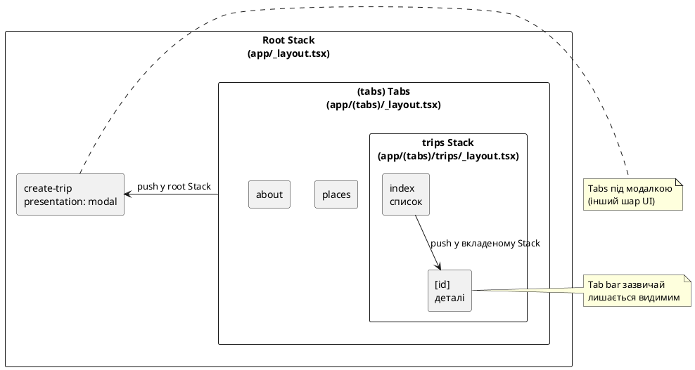

# Вкладені навігатори та модалки

## З чого почати

У попередній статті ми зібрали **базову карту** маршрутів Expo Router: кореневий `Stack`, група `(tabs)` із трьома вкладками, окремий файл `create-trip`, переходи через `Link` і `useRouter`. Для навчального «три розділи + одна форма» цього вже вистачало.

Але варто відкрити майже будь-який зрілий застосунок на телефоні — і картина складніша. На вкладці «Стрічка» тап по картці відкриває **деталі**, при цьому **нижня панель вкладок часто лишається** (або зникає — залежно від продукту). Форма «щось швидко додати» виїжджає **зверху / як sheet**, а не «вклеюється» в ту саму історію, що й глибокий перегляд. Якщо користувач набрав текст і випадково свайпнув «назад», з’являється питання: **«Вийти без збереження?»** Окремо існує «світ гостя» (вхід / реєстрація) і «світ авторизованого користувача» (вкладки, профіль) — це вже не один плоский список екранів.

Ця стаття якраз про **другий поверх** навігації:

1. **Вкладені навігатори** (*nested navigators*) — Stack **усередині** вкладки Tabs.  
2. **Модальні екрани** — той самий Stack, але з іншим `presentation`.  
3. **Групи маршрутів** на кшталт `(auth)` — організація «різних світів» UI.  
4. **Guard на back** — перехоплення виходу з екрана з незбереженими даними.

Глибокий розбір query-параметрів, cold start і universal links лишаємо **наступній** статті. Динамічний сегмент `[id]` тут з’являється лише в обсязі, потрібному для екрана деталей.

Після матеріалу ви зможете:

1. Пояснити людською мовою, **навіщо** вкладати Stack у Tabs, а не тримати все в одному стеку.  
2. Намалювати на папері дерево layout для list → detail **зі збереженим tab bar**.  
3. Налаштувати `presentation: 'modal'` і пояснити, чим це відрізняється від звичайного `push`.  
4. Сказати, **який** саме стек реагує на `router.back()` у різних ситуаціях.  
5. Описати ідею груп `(auth)` / «захищених» маршрутів без плутанини з безпекою API.  
6. Реалізувати guard «форма брудна → підтвердження».  
7. Зібрати міні-проєкт **«Нотатки»** за повним кодом і перенести ідеї в **Nomad**.

::note
**Головна думка.** У Expo Router (і в React Navigation під ним) навігатори — це не «один глобальний список екранів», а **дерево**. Батьківський layout обгортає дітей; дитина може бути **ще одним** навігатором. Modal — це переважно **спосіб показати** екран у Stack, а не окрема бібліотека. Guard на back — шар **поведінки при leave**, поверх геометрії маршрутів.
::

::tip
Живі жести, tab bar і модальна анімація **не** відтворюються в `::react-native-preview` на сайті. У статті — послідовне пояснення, схеми й код; перевірка — у **Expo Go** або симуляторі.
::

Код наскрізного застосунку: [github.com/arakviel/nomad](https://github.com/arakviel/nomad).

---

## Життєва сцена: що ламається без вкладеності

Уявіть Nomad лише з «плоским» root Stack і без вкладеного стека у «Поїздках».

Користувач на стрічці тапає «Карпати на вихідні». Якщо деталі покласти **на root Stack** поруч із вкладками, часто виходить так: екран деталей відкривається **на весь застосунок**, нижня панель **зникає**. Це нормальний і навіть бажаний UX для деяких продуктів (читалка, відео). Але для щоденника подорожей часто хочуть інше: «я всередині розділу Поїздки, можу швидко глянути Місця, не гублячи контекст».

Інший провал — навпаки: форму створення теж запхати **всередину** вкладки як звичайний push. Тоді «Нова поїздка» виглядає як ще один «глибокий» екран розділу, tab bar може лишатись під довгою формою, а жест «закрити задачу» менш очевидний, ніж у модалки «відкрив → зберіг / закрив».

Третій провал — ігнорувати **історію**. Користувач відкрив форму, почав друкувати, випадково свайпнув dismiss — і все зникло. Людина не каже «не було usePreventRemove»; каже «додаток з’їв мою нотатку».

Отже, тема статті — не «ще три API», а **три різні задачі UX**, які розв’язують вкладеністю, modal і guard.

---

## Що таке «вкладений навігатор» простими словами

**Навігатор** (*navigator*) — компонент, який вирішує, **який із набору екранів зараз видимий** і **як** між ними перемикатися (стопка, вкладки, drawer…).

У статті 11 ми вже мали:

- **Tabs** — кілька розділів «поруч»;  
- **Stack** — екрани «один на одному» з історією back.

**Вкладений навігатор** (*nested navigator*) — ситуація, коли **один навігатор є екраном (або гілкою) іншого**.

Приклад, який ми збираємо в Nomad:

1. **Корінь** — `Stack` (файл `app/_layout.tsx`).  
2. Один із «екранів» кореня — **ціла група вкладок** `(tabs)` (усередині — `Tabs`).  
3. Одна з вкладок — не «просто сторінка», а **знову Stack** (тека `trips/` зі своїм `_layout.tsx`).  
4. У цьому внутрішньому Stack: `index` (список) і `[id]` (деталі).  
5. Окремо на **кореневому** Stack — `create-trip` з `presentation: 'modal'`.

Користувач цього дерева «не бачить». Він бачить: вкладки, стрічку, деталі, модалку. Але **розробник** зобов’язаний тримати дерево в голові: інакше `router.back()` «не туди», tab bar «зник», modal «не закривається».

{.diagram-img}

::plant-uml



::

---

## Навіщо не тримати «все в одному Stack»

Можна уявити радикально простий варіант: один кореневий Stack і **жодних** Tabs — Home, TripDetail, Places, About, Create, Login як послідовні екрани. Технічно це працює. Продуктово — ні, щойно з’являються **постійні розділи**.

Типові болі «плоского» стека:

1. **Немає «дому» для розділу.** Користувач звик, що «Поїздки / Місця / Ще» завжди внизу.  
2. **Back плутає розділи.** З «Місць» back може вийти на «деталі поїздки», хоча людина вже «змінила тему».  
3. **Довга історія.** Десять push підряд — і системний back довго «відмотує» те, чого користувач уже не пам’ятає.  
4. **Складно зберігати стан розділу.** Вкладки як раз і дають паралельні «гілки» з власною (вкладеною) історією.

**Tabs** розв’язують паралельність.  
**Stack усередині вкладки** розв’язує глибину **в одній** гілці.

Це не догма. Іноді деталі **свідомо** виносять на root Stack, щоб сховати tab bar і дати більше місця. Важливо **обрати** свідомо, а не отримати побічний ефект «так вийшло з файлами».

---

## Місток зі статті 11 (не таблицею «для своїх»)

Після статті 11 у вас уже є:

- розуміння `app/`, `_layout.tsx`, `index`, груп `(tabs)`;  
- Tabs і root Stack;  
- `Link`, `router.push`, `router.back`;  
- уявлення про typed routes.

Що змінюється зараз — **глибина дерева**, а не «інший Router».

| Було (типово після ст. 11) | Стає (ця стаття) |
| -------------------------- | ---------------- |
| Вкладка = один файл (`index.tsx`) | Вкладка = **тека** з власним Stack (`trips/`) |
| Усі «другі екрани» на root | Деталі — **в** гілці вкладки; modal — **на** root |
| `create-trip` як звичайний card | `create-trip` як **modal** |
| `back` «просто назад» | Питання: **назад у якому стеку?** |
| Auth «колись потім» | Карта груп `(auth)` / app (без повного login у Nomad) |
| — | Guard на leave з брудної форми |

---

## Як влаштований вкладений Stack у вкладці

### Від одного файлу до каталогу

У статті 11 вкладка «Поїздки» могла бути просто `app/(tabs)/index.tsx`. Цього мало, щойно з’являється **другий** екран того ж розділу.

Трансформація:

```text
# було
app/(tabs)/
  index.tsx          ← і список, і «куди ж діти деталі?»

# стало
app/(tabs)/
  trips/
    _layout.tsx      ← Stack тільки для гілки «Поїздки»
    index.tsx        ← список  → маршрут /trips
    [id].tsx         ← деталі → маршрут /trips/42
  places.tsx
  about.tsx
```

У `app/(tabs)/_layout.tsx` замість `name="index"` з’являється `name="trips"` — бо вкладка тепер **тека**, а не файл.

### Що відчуває користувач

1. Відкриває вкладку «Поїздки» — бачить список (як раніше).  
2. Тапає картку — анімація push **всередині** розділу; **внизу лишаються** Поїздки / Місця / Ще.  
3. Тисне «назад» (header або жест) — знову список **цієї** вкладки, а не «виліт» із розділу.  
4. Перемикає на «Місця» — інший розділ; повернувшись на «Поїздки», часто знову бачить **той самий** вкладений стан (залежить від того, чи екран розмонтували — але ідея гілки саме така).

Порівняйте з modal «Нова поїздка»: там вкладки **під** модалкою, задача відчувається як **оверлей**, не як «глибше в список».

### Коли обирати nested detail, а коли root detail

**Nested Stack (tabs видно)** доречний, коли:

- деталі — природне **продовження** стрічки того ж розділу;  
- користувач часто **стрибає** між вкладками;  
- не потрібен «кіношний» повноекранний режим.

**Detail на root Stack (tabs ховаються)** доречний, коли:

- потрібна максимальна площа (медіа, карта на весь екран);  
- flow «зайшов у деталі = тимчасово вийшов з tab-світу»;  
- той самий detail відкривають **з кількох** вкладок і хочуть **одну** повноекранну реалізацію.

У **Nomad** для поїздок обрано nested: щоденник — це розділ зі стрічкою й карткою, tabs корисні поруч. Форма створення — modal на root: окрема **задача**, не ще один рядок стрічки.

### Мінімальний код вкладеного layout

```tsx
// app/(tabs)/trips/_layout.tsx
import { Stack } from 'expo-router';

export default function TripsStackLayout() {
  return (
    <Stack>
      <Stack.Screen name="index" options={{ headerShown: false }} />
      <Stack.Screen
        name="[id]"
        options={{ title: 'Поїздка', headerBackTitle: 'Список' }}
      />
    </Stack>
  );
}
```

Список відкриває деталі:

```tsx
router.push(`/trips/${trip.id}`);
// або <Link href={`/trips/${trip.id}`} asChild>…
```

Зверніть увагу на шлях: **`/trips/...`**, бо сегмент теки `trips` **входить** у URL (на відміну від групи `(tabs)`, яка в URL **не** видно).

### Хто ким керує

::field-group

::field{name="Tabs layout" type="app/(tabs)/_layout.tsx"}
Знає лише **вкладки**: `trips`, `places`, `about`. Він **не** перелічує екрани `trips/[id]` — для нього вкладка `trips` — «один слот», усередині якого вже живе свій навігатор.
::

::field{name="Вкладений Stack layout" type="app/(tabs)/trips/_layout.tsx"}
Знає екрани **гілки поїздок**: `index` і `[id]`. Саме він малює header деталей і обробляє back **зі списку на деталі й назад**.
::

::field{name="Root Stack layout" type="app/_layout.tsx"}
Знає «великі» гілки: `(tabs)` як ціле і, наприклад, `create-trip` як modal. Root **не** займається push між списком і деталями поїздки — це робота nested Stack.
::

::field{name="headerShown: false на index" type="options"}
Список часто з **власним** заголовком у контенті (як у Nomad: «Мандрівник», чіпи теми). Системний header там зайвий. На деталях header, навпаки, зручний: title + системна «назад».
::

::field{name="headerBackTitle" type="string (особливо iOS)"}
Текст біля стрілки «назад» на iOS. «Список» або «Поїздки» підказує, **куди** повернетесь — важливіше, ніж здається на демо з одним екраном.
::

::

### Який `router.back()` спрацьовує

Це місце, де «суха» документація найчастіше підводить.

- Стоїте на **`/trips/3`** (деталі у nested Stack) → `router.back()` зазвичай веде на **`/trips`** (список). Tab bar як був.  
- Стоїте на **`/create-trip`** (modal на root) → `router.back()` **закриває modal** і повертає туди, звідки відкрили (список, about, навіть деталі).  
- Якщо зробити `router.push('/')` «аби як закрити» після форми — можете **накласти** зайвий екран в історію; back потім відкриє **порожню форму** знову. Після modal майже завжди **`back()`** або `replace`, не «push home».

Правило: **back знімає верхівку того стека, у якому цей екран лежить.** Nested detail і root modal — різні стеки.

---

## Modal докладніше: не «інший Router», а інший показ

### Що таке modal у термінах UX

**Модальний екран** (*modal screen*) — UI, який **перериває** поточний контекст і вимагає дії (заповнити, підтвердити, закрити), після чого людина **повертається** туди, де була.

Приклади з життя телефону: «Новий контакт», «Фільтри», «Поділитись», «Швидка нотатка».

Це відрізняється від:

- **вкладки** — довгоживучий розділ;  
- **detail push** — поглиблення в контент того ж розділу.

{.diagram-img}

### Що таке modal у термінах Expo Router / React Navigation

У Stack у кожного екрана є опції показу. Ключова — **`presentation`**:

- **`card`** (часто за замовчуванням) — «звичайний» перехід у стос екранів;  
- **`modal`** — модальний стиль (на iOS часто card-over-card / sheet-подібна метафора; на Android — свій material-перехід).

Тобто файл `create-trip.tsx` — **той самий** тип маршруту, що й інші. Відрізняється **options** на `Stack.Screen` у layout.

```tsx
<Stack.Screen
  name="create-trip"
  options={{
    presentation: 'modal',
    title: 'Нова поїздка',
    headerBackTitle: 'Закрити',
  }}
/>
```

Відкриття **не** потребує окремого API:

```tsx
router.push('/create-trip');
```

Закриття:

```tsx
router.back(); // після submit або «Скасувати»
```

### Де фізично лежить файл modal

Практичне правило курсу:

- **`(tabs)/...`** — довгоживучі розділи й їхня внутрішня глибина;  
- **поруч із `(tabs)` на root Stack** — modal і інші «оверлейні» задачі.

Якщо покласти modal **всередину** `trips/` Stack, він стане частиною історії **вкладки**. Інколи це потрібно; для «Нова поїздка» в Nomad зручніше root: форма одна, відкривається з home, about, деталей — і **завжди** виглядає як глобальна задача.

### `unstable_settings` і якір

```tsx
export const unstable_settings = {
  initialRouteName: '(tabs)',
};
```

Навіщо: якщо застосунок **перезавантажили** або відкрили deep link одразу на modal, навігатору потрібен **якір** — базовий екран, «від якого» існує історія. Інакше кнопка «закрити» може повести себе дивно (немає куди back). Назва `unstable_settings` у Expo — історична; опція широко використовується. Слідкуйте за docs вашого SDK.

### Після submit: хто оновлює список

Modal **не** «повертає props» батькові як React-колбек між деревами файлів. У Nomad список живе в **`TripsProvider`** (Context) **вище** за Stack. Форма викликає `addTrip(trip)` і `router.back()`. Вкладка зі списком **уже** підписана на той самий Context — картка з’являється без «перезавантаження маршруту».

Це важливий архітектурний урок: **стан, спільний для кількох гілок навігації, піднімають над навігаторами** (Context зараз, RTK пізніше).

### iOS і Android

::tabs

::tabs-item{label="iOS" icon="i-lucide-smartphone"}
Modal часто асоціюється з карткою, що наїжджає, інколи зі свайпом dismiss. Підпис у header («Закрити» / back title) варто задати явно — дефолт може бути англійським або невдалим. Перевіряйте жест dismiss: якщо форма dirty, знадобиться guard (див. нижче), інакше свайп **тихо** знищить введене.
::

::tabs-item{label="Android" icon="i-lucide-smartphone"}
Перехід і вигляд modal ближчі до повноцінного екрана з material-анімацією (залежить від версії RN / Navigation). Системна кнопка **Back** зазвичай **знімає (робить pop)** modal з кореневого (root) Stack — тобто «закрити». Завжди проганяйте сценарій: відкрити форму з tabs → Back → чи повернулись на вкладку, а не вийшли із застосунку.
::

::

::field-group

::field{name="presentation" type="'card' \| 'modal' \| 'transparentModal' \| …"}
Головний важіль «як виглядає push». Для курсу й Nomad достатньо пари **card vs modal**. Існують також formSheet та інші режими — вони дають sheet зі snap points; підключайте, коли вже стабільні базові modal, і обов’язково перевіряйте на реальних iOS/Android вашого SDK.
::

::field{name="файл create-trip.tsx" type="маршрут"}
Звичайний екран із default export. Modal-поведінка задається **не** ім’ям файлу, а `Stack.Screen` options у layout (хоча ім’я файлу = `name` маршруту).
::

::field{name="header на modal" type="options"}
Часто `headerShown: true`, title «Нова поїздка», back/close. Можна сховати header і намалювати свій — тоді не забудьте доступний спосіб закрити (кнопка + Back).
::

::field{name="провайдери" type="архітектура"}
`ThemeProvider` / `TripsProvider` мають обгортати **root Stack**, а не лише `(tabs)`. Інакше modal «не бачить» `useTrips()` або тему.
::

::

---

## Групи `(auth)`: два світи інтерфейсу

У Nomad повноцінний login ще попереду (SecureStore, сесія). Але **картографію** маршрутів закладають рано, щоб потім не переписувати все дерево.

{.diagram-img}

### Проблема

Екрани «Увійти» / «Зареєструватись» **не** повинні сидіти всередині `(tabs)` як «ще одна вкладка». І навпаки: стрічку поїздок **не** показують гостю так само, як користувачу, який увійшов (або показують, але з іншим guard — залежить від продукту).

### Ідея груп

Використовують **групи** тек (дужки, як `(tabs)`):

```text
app/
  _layout.tsx
  (auth)/
    login.tsx
    register.tsx
  (app)/          # або одразу (tabs)
    (tabs)/...
```

Група **не** додає сегмент у URL, але дозволяє:

- окремі layout (без tab bar на логіні);  
- умовний редірект: «немає сесії → login»;  
- `replace` після успішного входу, щоб **Back не повернув** на форму пароля.

### Stack.Protected і класичний редірект

У новіших версіях Expo Router з’являється декларативний **`Stack.Protected`** з `guard={isLoggedIn}` — екрани всередині рендеряться / доступні лише коли guard істинний. Класичний підхід: у root layout читаєте сесію і робите `router.replace('/login')` або `replace('/(tabs)')`.

Обидва підходи — **про UI-маршрути**. Вони **не** замінюють:

- перевірку JWT на сервері;  
- secure storage;  
- захист API.

::warning
**Часта плутанина.** «Ми сховали вкладки, доки немає логіну» ≠ «дані захищені». Зловмисник не зобов’язаний користуватись вашим UI. Auth-групи — UX і порядок екранів; безпека — на бекенді й у правильному зберіганні сесії (окремі статті курсу).
::

У **цій** статті для Nomad повний `(auth)` **не** впроваджуємо — лише закладаємо розуміння. Міні-проєкт зосереджений на nested + modal + guard.

---

## Guard на «назад»: не втратити введене

### Сценарій

Користувач відкрив modal «Нова нотатка», написав абзац, випадково:

- свайпнув dismiss на iOS;  
- натиснув системний Back на Android;  
- тапнув «закрити» в header.

Без додаткової логіки екран **просто знімається**, текст зникає. Це не «баг React», а **відсутність продуктового правила**.

{.diagram-img}

### Терміни

**Dirty** (*брудна форма*) — користувач уже щось змінив порівняно з початковим станом. У React Hook Form це `formState.isDirty`. У простому `useState` — наприклад `title.trim() || body.trim()`.

**Leave / remove** — подія «цей екран хочуть прибрати з навігаційної історії» (back, dismiss, replace тощо).

**Guard** — логіка «не прибирати одразу, а спитати / перевірити».

### `usePreventRemove`

У React Navigation (Expo Router стоїть на ньому) є хук **`usePreventRemove`** з пакета `@react-navigation/native`.

Ідея API:

```tsx
usePreventRemove(dirty, ({ data }) => {
  // dirty === true → сюди потрапляємо замість миттєвого leave
  Alert.alert('Вийти без збереження?', '…', [
    { text: 'Лишитись', style: 'cancel' },
    {
      text: 'Вийти',
      style: 'destructive',
      onPress: () => navigation.dispatch(data.action),
    },
  ]);
});
```

Покроково:

1. Користувач ініціює back/dismiss.  
2. Якщо `dirty === false` — хук **не** блокує; екран іде як завжди.  
3. Якщо `dirty === true` — навігація **зупиняється**, викликається callback.  
4. У callback лежить **`data.action`** — та дія, яку хотіли виконати.  
5. «Лишитись» — нічого не dispatch-имо; екран лишається.  
6. «Вийти» — `navigation.dispatch(data.action)` — **дозволяємо** відкладений leave.

Після **успішного збереження** важливо скинути dirty (окремий прапорець `saved` або reset форми), інакше `back()` після save знову покаже діалог.

::field-group

::field{name="dirty" type="boolean"}
Умова блокування. Рахуйте чесно: порожня форма не повинна питати «вийти?». Після save — `dirty` має стати false **до** або узгоджено з `router.back()`.
::

::field{name="usePreventRemove" type="хук"}
Підписується на спробу remove екрана. Працює в контексті React Navigation; екран має бути змонтований у навігаторі (modal / stack screen).
::

::field{name="data.action" type="NavigationAction"}
«Що саме хотіли зробити» (goBack тощо). Без `dispatch(action)` після «Вийти» екран **не** закриється — ви лише показали Alert.
::

::field{name="navigation" type="useNavigation()"}
Потрібен для `dispatch`. Імпорт з `expo-router` / React Navigation — за docs вашої версії; у міні-проєкті показано робочий варіант.
::

::field{name="Alert" type="діалог"}
Системне підтвердження. На різних платформах виглядає по-своєму, але патерн «cancel / destructive» зрозумілий користувачу.
::

::

У **create-trip** Nomad guard у цій статті **не** додаємо (форма вже велика; Pro-завдання — перенести патерн). У міні-проєкті «Нотатки» — **повна** реалізація.

---

## Динамічний сегмент `[id]` — рівно стільки, скільки треба для деталей

Файл:

```text
app/(tabs)/trips/[id].tsx
```

Маршрути:

- `/trips/1`  
- `/trips/local-1710000000` (локально створена поїздка)

Читання параметра:

```tsx
import { useLocalSearchParams } from 'expo-router';

const { id } = useLocalSearchParams<{ id: string }>();
// інколи приходить string[] — нормалізуємо:
const tripId = Array.isArray(id) ? id[0] : id;
```

Далі:

```tsx
const trip = tripId ? getTrip(tripId) : undefined;
if (!trip) {
  // екран «не знайдено» + кнопка назад
}
```

Чому параметр може бути масивом — нюанси парсингу URL/Router; захист `Array.isArray` — добра звичка.

**Чого ми свідомо не робимо в цій статті:** query string, universal links, cold start з пуша. Це **стаття 13**. Тут `[id]` — лише ключ, щоб відкрити **конкретну** поїздку з уже відомого списку в пам’яті.

---

## Зв’язок ідей на одному прикладі (Nomad)

Пройдімо шлях користувача й позначимо **який** механізм працює.

{.diagram-img}

::steps

### 1. Вкладка «Поїздки»
Працює **Tabs**. Контент — `trips/index` у **nested Stack**. Header списку свій; tab bar видимий.

### 2. Тап по картці
`router.push('/trips/' + id)` — push у **вкладеному** Stack. Анімація «вперед»; tab bar **лишається**.

### 3. Екран деталей
Той самий nested Stack. Header системний («назад» → список). Можна відкрити modal «Нова поїздка» — це вже **root** Stack.

### 4. Modal create-trip
`presentation: 'modal'` на root. Tabs **під** модалкою. Submit → `addTrip` у Context → `router.back()` → знову деталі або список (звідки відкрили).

### 5. Вкладка «Місця» → тап
`push` на `/trips/{tripId}` — знову nested detail. Користувач потрапляє в гілку «Поїздки» на екрані деталей.

::

Якщо на кроці 2 помилково зробити detail root-екраном без nested layout, на кроці 2 tab bar зникне — і ви отримаєте **інший** продукт, навіть «з тим самим» React-компонентом картки.

---

## Антипатерни (і чому вони болять)

### 1. Деталі винесено на root без свідомого рішення про tab bar

Симптом: «чомусь пропали вкладки». Насправді файл лежить не в `trips/` Stack, а на root. Або навпаки — хотіли full screen, а вклали в tabs. **Спочатку UX, потім шлях файлу.**

### 2. Modal як п’ята вкладка

«Нова поїздка» в tab bar завжди висить і скидає стан. Modal-задача — **тимчасова**; їй місце в Stack options, не в Tabs.

### 3. Закрити modal через `push('/')`

Псує історію: back повертає на форму. Після успіху — **`back()`** або `replace` осмислено.

### 4. Плутати back nested і back root

З деталей чекаєте «закрити застосунок», а отримуєте список — або навпаки. Малюйте дерево навігаторів, перш ніж звинувачувати Router.

### 5. Dirty-форма без guard

Тиха втрата тексту = втрата довіри. Навіть простий Alert рятує.

### 6. «Auth = сховали кнопку Увійти»

Без розділення маршрутів / redirect користувач з deep link може опинитись «всередині» без сесії. Групи й guard маршрутів — про **послідовність екранів**, плюс потім справжня сесія.

### 7. Товста бізнес-логіка в кожному layout

Layout має з’єднувати навігатори й options, а не тягнути fetch на 200 рядків. Дані — у features / providers (як `TripsProvider`).

---

## Міні-проєкт: «Нотатки» (від А до Я)

### Мета

Окремий застосунок поза Nomad. **Увесь код** — у collapsible нижче.

1. Tabs: Нотатки | Про застосунок.  
2. У «Нотатки» — nested Stack: список → деталі.  
3. Modal «Нова нотатка» + **guard** на back.  
4. Збережені нотатки з’являються в списку.

### Структура

```text
notes-app/
  app/
    _layout.tsx
    (tabs)/
      _layout.tsx
      notes/
        _layout.tsx
        index.tsx
        [id].tsx
      about.tsx
    modal/
      new.tsx
  src/data/notesStore.ts
```

### Крок 1. Створити проєкт

::steps

### 1. Скарфолд

```bash
npx create-expo-app@latest notes-app -t tabs
cd notes-app
```

### 2. Іконки (за потреби)

```bash
npx expo install @expo/vector-icons
```

### 3. Після підстановки файлів

```bash
npx expo start
```

Видаліть зайві екрани шаблону (`explore` тощо), залиште структуру як вище.

::

### Крок 2. `src/data/notesStore.ts`

::collapsible{title="Повний src/data/notesStore.ts — розгорнути"}

```ts
export type Note = {
  id: string;
  title: string;
  body: string;
  createdAt: number;
};

type Listener = () => void;

let notes: Note[] = [
  {
    id: '1',
    title: 'Список речей',
    body: 'Павербанк, дощовик, копія квитків.',
    createdAt: Date.now() - 86400000,
  },
  {
    id: '2',
    title: 'Ідеї маршруту',
    body: 'Ранок — музей, обід — ринок, вечір — набережна.',
    createdAt: Date.now() - 3600000,
  },
];

const listeners = new Set<Listener>();

function emit() {
  listeners.forEach((l) => l());
}

export function getNotes(): Note[] {
  return [...notes].sort((a, b) => b.createdAt - a.createdAt);
}

export function getNote(id: string): Note | undefined {
  return notes.find((n) => n.id === id);
}

export function addNote(title: string, body: string): Note {
  const note: Note = {
    id: String(Date.now()),
    title: title.trim() || 'Без назви',
    body: body.trim(),
    createdAt: Date.now(),
  };
  notes = [note, ...notes];
  emit();
  return note;
}

export function subscribe(listener: Listener): () => void {
  listeners.add(listener);
  return () => {
    listeners.delete(listener);
  };
}
```

::

### Крок 3. `app/_layout.tsx`

::collapsible{title="Повний app/_layout.tsx — розгорнути"}

```tsx
import { Stack } from 'expo-router';
import { StatusBar } from 'expo-status-bar';

export const unstable_settings = {
  initialRouteName: '(tabs)',
};

export default function RootLayout() {
  return (
    <>
      <StatusBar style="dark" />
      <Stack
        screenOptions={{
          headerStyle: { backgroundColor: '#F8FAFC' },
          headerTintColor: '#2563EB',
          headerTitleStyle: { color: '#0F172A', fontWeight: '600' },
          contentStyle: { backgroundColor: '#F8FAFC' },
        }}
      >
        <Stack.Screen name="(tabs)" options={{ headerShown: false }} />
        <Stack.Screen
          name="modal/new"
          options={{
            presentation: 'modal',
            title: 'Нова нотатка',
            headerBackTitle: 'Закрити',
          }}
        />
      </Stack>
    </>
  );
}
```

::

### Крок 4. `app/(tabs)/_layout.tsx`

::collapsible{title="Повний app/(tabs)/_layout.tsx — розгорнути"}

```tsx
import { Tabs } from 'expo-router';
import { Ionicons } from '@expo/vector-icons';

export default function TabsLayout() {
  return (
    <Tabs
      screenOptions={{
        headerShown: false,
        tabBarActiveTintColor: '#2563EB',
        tabBarInactiveTintColor: '#64748B',
        tabBarStyle: {
          backgroundColor: '#F8FAFC',
          borderTopColor: '#E2E8F0',
        },
        tabBarLabelStyle: { fontSize: 12, fontWeight: '600' },
      }}
    >
      <Tabs.Screen
        name="notes"
        options={{
          title: 'Нотатки',
          tabBarIcon: ({ color, size }) => (
            <Ionicons name="document-text-outline" size={size} color={color} />
          ),
        }}
      />
      <Tabs.Screen
        name="about"
        options={{
          title: 'Про застосунок',
          tabBarIcon: ({ color, size }) => (
            <Ionicons
              name="information-circle-outline"
              size={size}
              color={color}
            />
          ),
        }}
      />
    </Tabs>
  );
}
```

::

### Крок 5. Nested stack — `app/(tabs)/notes/_layout.tsx`

::collapsible{title="Повний app/(tabs)/notes/_layout.tsx — розгорнути"}

```tsx
import { Stack } from 'expo-router';

export default function NotesStackLayout() {
  return (
    <Stack
      screenOptions={{
        headerStyle: { backgroundColor: '#F8FAFC' },
        headerTintColor: '#2563EB',
        headerTitleStyle: { color: '#0F172A', fontWeight: '600' },
      }}
    >
      <Stack.Screen name="index" options={{ headerShown: false }} />
      <Stack.Screen
        name="[id]"
        options={{ title: 'Нотатка', headerBackTitle: 'Список' }}
      />
    </Stack>
  );
}
```

::

### Крок 6. Список — `app/(tabs)/notes/index.tsx`

::collapsible{title="Повний app/(tabs)/notes/index.tsx — розгорнути"}

```tsx
import { useEffect, useState } from 'react';
import {
  FlatList,
  Pressable,
  StyleSheet,
  Text,
  View,
} from 'react-native';
import { Link, useRouter } from 'expo-router';
import { SafeAreaView } from 'react-native-safe-area-context';

import { getNotes, subscribe, type Note } from '../../../src/data/notesStore';

export default function NotesListScreen() {
  const [notes, setNotes] = useState<Note[]>(() => getNotes());
  const router = useRouter();

  useEffect(() => subscribe(() => setNotes(getNotes())), []);

  return (
    <SafeAreaView style={styles.safe} edges={['top']}>
      <View style={styles.header}>
        <Text style={styles.title}>Нотатки</Text>
        <Text style={styles.muted}>
          Nested Stack · modal · guard · {notes.length}
        </Text>
      </View>

      <FlatList
        data={notes}
        keyExtractor={(item) => item.id}
        contentContainerStyle={styles.list}
        ItemSeparatorComponent={() => <View style={{ height: 10 }} />}
        ListEmptyComponent={
          <Text style={styles.muted}>Порожньо. Створіть першу нотатку.</Text>
        }
        renderItem={({ item }) => (
          <Link href={`/notes/${item.id}`} asChild>
            <Pressable style={styles.card}>
              <Text style={styles.cardTitle}>{item.title}</Text>
              <Text style={styles.cardBody} numberOfLines={2}>
                {item.body || 'Без тексту'}
              </Text>
            </Pressable>
          </Link>
        )}
      />

      <View style={styles.footer}>
        <Pressable
          style={styles.btn}
          onPress={() => router.push('/modal/new')}
        >
          <Text style={styles.btnText}>Нова нотатка (modal)</Text>
        </Pressable>
      </View>
    </SafeAreaView>
  );
}

const styles = StyleSheet.create({
  safe: { flex: 1, backgroundColor: '#F8FAFC' },
  header: {
    paddingHorizontal: 16,
    paddingTop: 8,
    paddingBottom: 12,
    borderBottomWidth: 1,
    borderBottomColor: '#E2E8F0',
  },
  title: { fontSize: 24, fontWeight: '800', color: '#0F172A' },
  muted: { marginTop: 4, color: '#64748B', fontSize: 13 },
  list: { padding: 16, paddingBottom: 24, flexGrow: 1 },
  card: {
    backgroundColor: '#fff',
    borderRadius: 12,
    borderWidth: 1,
    borderColor: '#E2E8F0',
    padding: 14,
  },
  cardTitle: { fontSize: 17, fontWeight: '700', color: '#0F172A' },
  cardBody: { marginTop: 6, color: '#64748B', fontSize: 14 },
  footer: {
    padding: 16,
    borderTopWidth: 1,
    borderTopColor: '#E2E8F0',
  },
  btn: {
    backgroundColor: '#2563EB',
    paddingVertical: 14,
    borderRadius: 12,
    alignItems: 'center',
  },
  btnText: { color: '#fff', fontWeight: '800' },
});
```

::

### Крок 7. Деталі — `app/(tabs)/notes/[id].tsx`

::collapsible{title="Повний app/(tabs)/notes/[id].tsx — розгорнути"}

```tsx
import { ScrollView, StyleSheet, Text, View } from 'react-native';
import { Stack, useLocalSearchParams, useRouter } from 'expo-router';

import { getNote } from '../../../src/data/notesStore';

export default function NoteDetailsScreen() {
  const { id } = useLocalSearchParams<{ id: string }>();
  const noteId = Array.isArray(id) ? id[0] : id;
  const note = noteId ? getNote(noteId) : undefined;
  const router = useRouter();

  if (!note) {
    return (
      <View style={styles.center}>
        <Stack.Screen options={{ title: 'Не знайдено' }} />
        <Text style={styles.title}>Нотатку не знайдено</Text>
        <Text style={styles.muted} onPress={() => router.back()}>
          ← Назад до списку
        </Text>
      </View>
    );
  }

  return (
    <ScrollView contentContainerStyle={styles.body}>
      <Stack.Screen options={{ title: note.title }} />
      <Text style={styles.title}>{note.title}</Text>
      <Text style={styles.muted}>
        {new Date(note.createdAt).toLocaleString('uk-UA')}
      </Text>
      <Text style={styles.bodyText}>{note.body || 'Порожня нотатка.'}</Text>
    </ScrollView>
  );
}

const styles = StyleSheet.create({
  body: { padding: 16, paddingBottom: 40 },
  center: {
    flex: 1,
    alignItems: 'center',
    justifyContent: 'center',
    padding: 24,
    backgroundColor: '#F8FAFC',
  },
  title: { fontSize: 24, fontWeight: '800', color: '#0F172A' },
  muted: { marginTop: 8, color: '#64748B' },
  bodyText: {
    marginTop: 16,
    fontSize: 16,
    lineHeight: 24,
    color: '#334155',
  },
});
```

::

### Крок 8. Modal + guard — `app/modal/new.tsx`

::collapsible{title="Повний app/modal/new.tsx — розгорнути"}

```tsx
import { useState } from 'react';
import {
  Alert,
  KeyboardAvoidingView,
  Platform,
  Pressable,
  StyleSheet,
  Text,
  TextInput,
  View,
} from 'react-native';
import { useNavigation } from 'expo-router';
import { useRouter } from 'expo-router';
import { usePreventRemove } from '@react-navigation/native';

import { addNote } from '../../src/data/notesStore';

export default function NewNoteModal() {
  const router = useRouter();
  const navigation = useNavigation();
  const [title, setTitle] = useState('');
  const [body, setBody] = useState('');
  /** Після успішного save — дозволяємо leave без діалогу. */
  const [saved, setSaved] = useState(false);

  const dirty =
    !saved && (title.trim().length > 0 || body.trim().length > 0);

  usePreventRemove(dirty, ({ data }) => {
    Alert.alert(
      'Вийти без збереження?',
      'Текст нотатки буде втрачено.',
      [
        { text: 'Лишитись', style: 'cancel' },
        {
          text: 'Вийти',
          style: 'destructive',
          onPress: () => navigation.dispatch(data.action),
        },
      ],
    );
  });

  const onSave = () => {
    if (!title.trim() && !body.trim()) {
      Alert.alert('Порожньо', 'Введіть заголовок або текст.');
      return;
    }
    addNote(title, body);
    setSaved(true);
    // після setState dirty стане false на наступному рендері;
    // back у requestAnimationFrame / setTimeout(0) надійніше:
    setTimeout(() => router.back(), 0);
  };

  return (
    <KeyboardAvoidingView
      style={styles.flex}
      behavior={Platform.OS === 'ios' ? 'padding' : undefined}
    >
      <View style={styles.body}>
        <Text style={styles.hint}>
          Якщо є текст і ви тиснете «назад» / dismiss — з’явиться підтвердження
          (usePreventRemove).
        </Text>
        <Text style={styles.label}>Заголовок</Text>
        <TextInput
          style={styles.input}
          value={title}
          onChangeText={setTitle}
          placeholder="Наприклад, Список речей"
        />
        <Text style={styles.label}>Текст</Text>
        <TextInput
          style={[styles.input, styles.multi]}
          value={body}
          onChangeText={setBody}
          placeholder="Нотатка…"
          multiline
          textAlignVertical="top"
        />
        <Pressable style={styles.btn} onPress={onSave}>
          <Text style={styles.btnText}>Зберегти</Text>
        </Pressable>
      </View>
    </KeyboardAvoidingView>
  );
}

const styles = StyleSheet.create({
  flex: { flex: 1, backgroundColor: '#F8FAFC' },
  body: { flex: 1, padding: 16, gap: 8 },
  hint: { color: '#64748B', fontSize: 13, marginBottom: 8 },
  label: {
    marginTop: 8,
    fontSize: 12,
    fontWeight: '700',
    color: '#64748B',
    textTransform: 'uppercase',
  },
  input: {
    borderWidth: 1,
    borderColor: '#E2E8F0',
    backgroundColor: '#fff',
    borderRadius: 12,
    paddingHorizontal: 14,
    paddingVertical: 12,
    fontSize: 16,
    color: '#0F172A',
  },
  multi: { minHeight: 140 },
  btn: {
    marginTop: 20,
    backgroundColor: '#2563EB',
    paddingVertical: 14,
    borderRadius: 12,
    alignItems: 'center',
  },
  btnText: { color: '#fff', fontWeight: '800' },
});
```

::

### Крок 9. About

::collapsible{title="Повний app/(tabs)/about.tsx — розгорнути"}

```tsx
import { ScrollView, StyleSheet, Text } from 'react-native';
import { Link } from 'expo-router';
import { SafeAreaView } from 'react-native-safe-area-context';

export default function AboutScreen() {
  return (
    <SafeAreaView style={styles.safe} edges={['top']}>
      <ScrollView contentContainerStyle={styles.body}>
        <Text style={styles.title}>Про застосунок</Text>
        <Text style={styles.p}>
          Міні-проєкт статті про вкладені навігатори: Tabs → Stack нотаток →
          деталі; окремо root modal створення з guard на back.
        </Text>
        <Link href="/notes" style={styles.link}>
          ← До нотаток
        </Link>
      </ScrollView>
    </SafeAreaView>
  );
}

const styles = StyleSheet.create({
  safe: { flex: 1, backgroundColor: '#F8FAFC' },
  body: { padding: 16, gap: 12 },
  title: { fontSize: 24, fontWeight: '800', color: '#0F172A' },
  p: { fontSize: 16, lineHeight: 24, color: '#334155' },
  link: { marginTop: 8, color: '#2563EB', fontWeight: '700', fontSize: 16 },
});
```

::

### Перевірка міні-проєкту

1. Список нотаток + вкладка «Про застосунок».  
2. Тап по нотатці → деталі, tab bar лишається, back → список.  
3. «Нова нотатка» → modal.  
4. Ввести текст, натиснути back → діалог. «Лишитись» / «Вийти».  
5. «Зберегти» → modal закривається, нотатка в списку.

### Критерій «готово»

- [ ] Усі файли з **повним** кодом підставлено  
- [ ] Nested Stack у `notes/`  
- [ ] Modal `modal/new`  
- [ ] Guard на dirty  
- [ ] Немає `useState('screen')` замість Router  

---

## Nomad: стек деталей поїздки та модалки

{.diagram-img}

### Навіщо користувачу

- Тап по картці поїздки відкриває **деталі** (опис, мітки, місця поїздки).  
- Tab bar **лишається** — можна перейти в «Місця» / «Ще».  
- «Нова поїздка» відкривається як **modal** (з форми на home, з about Link, з деталей).  
- Місця з вкладки «Місця» ведуть на деталі відповідної поїздки.

### Нитка

**Уже є:** tabs Поїздки/Місця/Ще, форма RHF, TripsProvider, тема, FlashList.

**Додаємо:**

| Зміна | Навіщо |
| ----- | ------ |
| `(tabs)/trips/` + nested Stack | список + `[id]` |
| `getTrip`, `getPlacesForTrip` | дані деталей |
| `create-trip` → `presentation: 'modal'` | модальна форма |
| `unstable_settings.initialRouteName` | якір для modal |
| навігація з places / chips | у деталі поїздки |

### Повний знімок

::code-tree{title="Nomad після nested stack + modal"}

```json [package.json]
{
  "name": "nomad",
  "version": "1.0.0",
  "main": "expo-router/entry",
  "scripts": {
    "start": "expo start",
    "android": "expo start --android",
    "ios": "expo start --ios",
    "web": "expo start --web"
  },
  "dependencies": {
    "@expo/vector-icons": "^15.1.1",
    "@hookform/resolvers": "^5.7.1",
    "@react-native-community/checkbox": "^0.6.0",
    "@react-native-community/datetimepicker": "8.4.4",
    "@react-native-community/slider": "5.0.1",
    "@react-native-picker/picker": "2.11.1",
    "@shopify/flash-list": "^2.3.2",
    "expo": "~54.0.35",
    "expo-constants": "~18.0.13",
    "expo-linking": "~8.0.12",
    "expo-router": "~6.0.24",
    "expo-status-bar": "~3.0.9",
    "react": "19.1.0",
    "react-hook-form": "^7.84.0",
    "react-native": "0.81.5",
    "react-native-safe-area-context": "~5.6.0",
    "react-native-screens": "~4.16.0",
    "zod": "^4.4.3"
  },
  "devDependencies": {
    "@expo/ngrok": "^4.1.3",
    "@types/react": "~19.1.0",
    "typescript": "~5.9.2"
  },
  "private": true
}
```

```json [app.json]
{
  "expo": {
    "name": "Nomad",
    "slug": "nomad",
    "version": "1.0.0",
    "orientation": "portrait",
    "icon": "./assets/icon.png",
    "userInterfaceStyle": "light",
    "scheme": "nomad",
    "newArchEnabled": true,
    "splash": {
      "image": "./assets/splash-icon.png",
      "resizeMode": "contain",
      "backgroundColor": "#ffffff"
    },
    "ios": {
      "supportsTablet": true
    },
    "android": {
      "adaptiveIcon": {
        "foregroundImage": "./assets/adaptive-icon.png",
        "backgroundColor": "#ffffff"
      },
      "edgeToEdgeEnabled": true,
      "predictiveBackGestureEnabled": false
    },
    "web": {
      "favicon": "./assets/favicon.png"
    },
    "plugins": [
      "expo-router",
      "@react-native-community/datetimepicker"
    ],
    "experiments": {
      "typedRoutes": true
    }
  }
}
```

```json [tsconfig.json]
{
  "extends": "expo/tsconfig.base",
  "compilerOptions": {
    "strict": true,
    "paths": {
      "@/*": [
        "./src/*"
      ]
    }
  },
  "include": [
    "**/*.ts",
    "**/*.tsx"
  ]
}
```

```tsx [app/_layout.tsx]
import { Stack } from 'expo-router';
import { StatusBar } from 'expo-status-bar';

import { TripsProvider } from '@/features/trips';
import { ThemeProvider, useTheme } from '@/shared/theme';

/**
 * Кореневий Stack:
 * - (tabs) — вкладки (всередині «Поїздки» ще один Stack)
 * - create-trip — modal поверх усього (вкладки ховаються)
 *
 * initialRouteName: щоб deep link / reload на modal мав куди «спертись».
 */
export const unstable_settings = {
  initialRouteName: '(tabs)',
};

function RootNavigator() {
  const { colors, scheme } = useTheme();

  return (
    <>
      <StatusBar style={scheme === 'dark' ? 'light' : 'dark'} />
      <Stack
        screenOptions={{
          contentStyle: { backgroundColor: colors.background },
          headerStyle: { backgroundColor: colors.background },
          headerTintColor: colors.primary,
          headerTitleStyle: { color: colors.text, fontWeight: '600' },
          headerShadowVisible: false,
        }}
      >
        <Stack.Screen name="(tabs)" options={{ headerShown: false }} />
        <Stack.Screen
          name="create-trip"
          options={{
            headerShown: true,
            title: 'Нова поїздка',
            presentation: 'modal',
            headerBackTitle: 'Закрити',
          }}
        />
      </Stack>
    </>
  );
}

export default function RootLayout() {
  return (
    <ThemeProvider>
      <TripsProvider>
        <RootNavigator />
      </TripsProvider>
    </ThemeProvider>
  );
}
```

```tsx [app/(tabs)/_layout.tsx]
import { Tabs } from 'expo-router';
import { Ionicons } from '@expo/vector-icons';

import { useTheme } from '@/shared/theme';

/**
 * Нижня панель вкладок.
 * «Поїздки» — вкладений Stack (список + деталі), не один index-файл.
 */
export default function TabsLayout() {
  const { colors } = useTheme();

  return (
    <Tabs
      screenOptions={{
        headerShown: false,
        tabBarActiveTintColor: colors.primary,
        tabBarInactiveTintColor: colors.textSecondary,
        tabBarStyle: {
          backgroundColor: colors.background,
          borderTopColor: colors.border,
        },
        tabBarLabelStyle: {
          fontSize: 12,
          fontWeight: '600',
        },
      }}
    >
      <Tabs.Screen
        name="trips"
        options={{
          title: 'Поїздки',
          tabBarIcon: ({ color, size }) => (
            <Ionicons name="map-outline" size={size} color={color} />
          ),
        }}
      />
      <Tabs.Screen
        name="places"
        options={{
          title: 'Місця',
          tabBarIcon: ({ color, size }) => (
            <Ionicons name="location-outline" size={size} color={color} />
          ),
        }}
      />
      <Tabs.Screen
        name="about"
        options={{
          title: 'Ще',
          tabBarIcon: ({ color, size }) => (
            <Ionicons
              name="ellipsis-horizontal-circle-outline"
              size={size}
              color={color}
            />
          ),
        }}
      />
    </Tabs>
  );
}
```

```tsx [app/(tabs)/trips/_layout.tsx]
import { Stack } from 'expo-router';

import { useTheme } from '@/shared/theme';

/**
 * Вкладений Stack усередині вкладки «Поїздки».
 * Список (index) → деталі ([id]); tab bar лишається видимим.
 */
export default function TripsStackLayout() {
  const { colors } = useTheme();

  return (
    <Stack
      screenOptions={{
        headerStyle: { backgroundColor: colors.background },
        headerTintColor: colors.primary,
        headerTitleStyle: { color: colors.text, fontWeight: '600' },
        headerShadowVisible: false,
        contentStyle: { backgroundColor: colors.background },
      }}
    >
      <Stack.Screen name="index" options={{ headerShown: false }} />
      <Stack.Screen
        name="[id]"
        options={{
          title: 'Поїздка',
          headerBackTitle: 'Список',
        }}
      />
    </Stack>
  );
}
```

```tsx [app/(tabs)/trips/index.tsx]
import { useCallback, useState } from 'react';
import {
  FlatList,
  Pressable,
  RefreshControl,
  StyleSheet,
  View,
} from 'react-native';
import { FlashList } from '@shopify/flash-list';
import { useRouter } from 'expo-router';

import {
  mockPlaces,
  PlaceChip,
  TripCard,
  useTrips,
  type Place,
  type Trip,
} from '@/features/trips';
import { useTheme, type ThemePreference } from '@/shared/theme';
import { AppText, Button, Screen } from '@/shared/ui';

const PREFS: { id: ThemePreference; label: string }[] = [
  { id: 'system', label: 'Система' },
  { id: 'light', label: 'Світла' },
  { id: 'dark', label: 'Темна' },
];

export default function HomeScreen() {
  const router = useRouter();
  const { trips, resetToMock } = useTrips();
  const { colors, spacing, preference, setPreference, scheme } = useTheme();
  const [places] = useState<Place[]>(mockPlaces);
  const [refreshing, setRefreshing] = useState(false);

  const handleOpenTrip = useCallback(
    (trip: Trip) => {
      router.push(`/trips/${trip.id}`);
    },
    [router],
  );

  const handleOpenPlace = useCallback(
    (place: Place) => {
      // Місце належить поїздці — відкриваємо її деталі у вкладеному Stack.
      router.push(`/trips/${place.tripId}`);
    },
    [router],
  );

  const onRefresh = useCallback(() => {
    setRefreshing(true);
    // Mock pull-to-refresh: повертаємо seed mock (локально створені зникають).
    setTimeout(() => {
      resetToMock();
      setRefreshing(false);
    }, 900);
  }, [resetToMock]);

  const renderTrip = useCallback(
    ({ item }: { item: Trip }) => (
      <TripCard trip={item} onPress={handleOpenTrip} />
    ),
    [handleOpenTrip],
  );

  const keyExtractor = useCallback((item: Trip) => item.id, []);

  const listHeader = (
    <View style={{ gap: spacing.md, marginBottom: spacing.md }}>
      {places.length > 0 ? (
        <View style={{ gap: spacing.sm }}>
          <AppText style={{ fontWeight: '600' }}>Останні місця</AppText>
          <FlatList
            horizontal
            data={places}
            keyExtractor={(item) => item.id}
            renderItem={({ item }) => (
              <PlaceChip place={item} onPress={handleOpenPlace} />
            )}
            showsHorizontalScrollIndicator={false}
            ItemSeparatorComponent={() => <View style={{ width: spacing.sm }} />}
            contentContainerStyle={{ paddingVertical: 2 }}
          />
        </View>
      ) : null}

      <AppText style={{ fontWeight: '600' }}>Ваші поїздки</AppText>
    </View>
  );

  const listEmpty = (
    <View
      style={[
        styles.empty,
        {
          paddingHorizontal: spacing.sm,
          paddingVertical: spacing.xl,
          gap: spacing.sm,
        },
      ]}
    >
      <AppText variant="subtitle" style={styles.emptyTitle}>
        Поки немає поїздок
      </AppText>
      <AppText
        variant="caption"
        color={colors.textSecondary}
        style={styles.emptyDesc}
      >
        Потягніть список униз, щоб «оновити», або натисніть «Нова поїздка».
      </AppText>
    </View>
  );

  return (
    <Screen style={styles.screen}>
      <View
        style={[
          styles.header,
          {
            paddingHorizontal: spacing.md,
            paddingTop: spacing.sm,
            paddingBottom: spacing.md,
            gap: spacing.xs,
            borderBottomColor: colors.border,
          },
        ]}
      >
        <AppText variant="title">Мандрівник</AppText>
        <AppText variant="caption" style={{ marginTop: spacing.xs }}>
          Щоденник подорожей · тема: {scheme === 'dark' ? 'темна' : 'світла'}
        </AppText>
        <AppText
          variant="caption"
          style={{
            marginTop: spacing.xs,
            color: colors.primary,
            fontWeight: '600',
          }}
        >
          {trips.length > 0
            ? `${trips.length} поїздок · ${places.length} місць`
            : 'Список порожній'}
        </AppText>

        <View style={[styles.themeRow, { gap: spacing.sm, marginTop: spacing.sm }]}>
          {PREFS.map((p) => {
            const active = preference === p.id;
            return (
              <Pressable
                key={p.id}
                onPress={() => setPreference(p.id)}
                style={[
                  styles.themeChip,
                  {
                    backgroundColor: active ? colors.primary : colors.surface,
                    borderColor: colors.border,
                  },
                ]}
                accessibilityRole="button"
                accessibilityState={{ selected: active }}
                accessibilityLabel={`Тема: ${p.label}`}
              >
                <AppText
                  variant="caption"
                  color={active ? colors.onPrimary : colors.text}
                  style={styles.themeChipText}
                >
                  {p.label}
                </AppText>
              </Pressable>
            );
          })}
        </View>
      </View>

      <View style={styles.listWrap}>
        <FlashList
          data={trips}
          renderItem={renderTrip}
          keyExtractor={keyExtractor}
          ListHeaderComponent={listHeader}
          ListEmptyComponent={listEmpty}
          contentContainerStyle={{
            paddingHorizontal: spacing.md,
            paddingTop: spacing.md,
            paddingBottom: spacing.md,
          }}
          ItemSeparatorComponent={() => <View style={{ height: spacing.md }} />}
          refreshControl={
            <RefreshControl
              refreshing={refreshing}
              onRefresh={onRefresh}
              tintColor={colors.primary}
              colors={[colors.primary]}
            />
          }
          showsVerticalScrollIndicator={false}
        />
      </View>

      <View
        style={[
          styles.footer,
          {
            paddingHorizontal: spacing.md,
            paddingTop: spacing.sm,
            paddingBottom: spacing.md,
            borderTopColor: colors.border,
            backgroundColor: colors.background,
          },
        ]}
      >
        <Button
          label="Нова поїздка"
          onPress={() => {
            router.push('/create-trip');
          }}
        />
      </View>
    </Screen>
  );
}

const styles = StyleSheet.create({
  screen: {
    paddingHorizontal: 0,
  },
  header: {
    borderBottomWidth: 1,
  },
  themeRow: {
    flexDirection: 'row',
    flexWrap: 'wrap',
  },
  themeChip: {
    paddingHorizontal: 12,
    paddingVertical: 8,
    borderRadius: 8,
    borderWidth: 1,
  },
  themeChipText: {
    fontWeight: '600',
  },
  listWrap: {
    flex: 1,
  },
  empty: {
    alignItems: 'center',
    justifyContent: 'center',
  },
  emptyTitle: {
    textAlign: 'center',
  },
  emptyDesc: {
    textAlign: 'center',
  },
  footer: {
    borderTopWidth: 1,
  },
});
```

```tsx [app/(tabs)/trips/[id].tsx]
import { useCallback, useMemo } from 'react';
import {
  Image,
  Platform,
  ScrollView,
  StyleSheet,
  View,
} from 'react-native';
import { Stack, useLocalSearchParams, useRouter } from 'expo-router';

import {
  getPlacesForTrip,
  useTrips,
  type Place,
} from '@/features/trips';
import { useTheme } from '@/shared/theme';
import { AppText, Button, Screen } from '@/shared/ui';

/**
 * Деталі поїздки — вкладений Stack у вкладці «Поїздки».
 * Tab bar знизу лишається (на відміну від root-modal create-trip).
 */
export default function TripDetailsScreen() {
  const { id } = useLocalSearchParams<{ id: string }>();
  const tripId = Array.isArray(id) ? id[0] : id;
  const { getTrip } = useTrips();
  const trip = tripId ? getTrip(tripId) : undefined;
  const places = useMemo(
    () => (tripId ? getPlacesForTrip(tripId) : []),
    [tripId],
  );
  const { colors, spacing, radius } = useTheme();
  const router = useRouter();

  const openCreateModal = useCallback(() => {
    router.push('/create-trip');
  }, [router]);

  if (!trip) {
    return (
      <Screen>
        <Stack.Screen options={{ title: 'Не знайдено' }} />
        <View style={[styles.center, { padding: spacing.lg }]}>
          <AppText variant="subtitle">Поїздку не знайдено</AppText>
          <AppText
            variant="caption"
            color={colors.textSecondary}
            style={{ marginTop: spacing.sm, textAlign: 'center' }}
          >
            Немає запису з id: {String(tripId)}. Можливо, список скинули
            pull-to-refresh.
          </AppText>
          <Button
            label="До списку"
            onPress={() => router.back()}
            style={{ marginTop: spacing.md }}
          />
        </View>
      </Screen>
    );
  }

  return (
    <Screen style={styles.screen}>
      <Stack.Screen options={{ title: trip.title }} />
      <ScrollView
        contentContainerStyle={{
          paddingBottom: spacing.xl,
        }}
        showsVerticalScrollIndicator={false}
      >
        <Image
          source={{ uri: trip.coverUri }}
          style={[styles.cover, { backgroundColor: colors.border }]}
          resizeMode="cover"
        />
        <View style={{ padding: spacing.md, gap: spacing.sm }}>
          <AppText variant="title">{trip.title}</AppText>
          <AppText variant="caption" color={colors.primary} style={styles.meta}>
            {trip.dateLabel} · {trip.region}
            {trip.plannedDays
              ? ` · ${trip.plannedDays} дн.`
              : ''}
          </AppText>

          <View style={[styles.badges, { gap: spacing.sm }]}>
            {trip.isPrivate ? (
              <AppText variant="caption" color={colors.textSecondary}>
                приватна
              </AppText>
            ) : null}
            {trip.hasItinerary ? (
              <AppText variant="caption" color={colors.primary}>
                є план маршруту
              </AppText>
            ) : null}
          </View>

          <AppText style={{ marginTop: spacing.sm, lineHeight: 24 }}>
            {trip.description}
          </AppText>

          <AppText
            style={{ fontWeight: '700', marginTop: spacing.md }}
          >
            Місця в цій поїздці
          </AppText>
          {places.length === 0 ? (
            <AppText variant="caption" color={colors.textSecondary}>
              Поки немає точок у mock-даних для цієї поїздки.
            </AppText>
          ) : (
            places.map((place) => (
              <PlaceRow key={place.id} place={place} />
            ))
          )}

          <View style={{ gap: spacing.sm, marginTop: spacing.lg }}>
            <Button
              label="Нова поїздка (modal)"
              onPress={openCreateModal}
            />
            <AppText variant="caption" color={colors.textSecondary}>
              Кнопка відкриває create-trip як modal на кореневому Stack —
              вкладки ховаються під модалкою.
            </AppText>
          </View>
        </View>
      </ScrollView>
    </Screen>
  );
}

function PlaceRow({ place }: { place: Place }) {
  const { colors, spacing, radius } = useTheme();
  return (
    <View
      style={[
        styles.place,
        {
          backgroundColor: colors.surface,
          borderColor: colors.border,
          borderRadius: radius.md,
          padding: spacing.sm,
        },
      ]}
    >
      <AppText style={{ fontWeight: '700' }}>{place.name}</AppText>
      <AppText variant="caption" color={colors.primary}>
        {place.city}
      </AppText>
      <AppText variant="caption" color={colors.textSecondary}>
        {place.note}
      </AppText>
    </View>
  );
}

const styles = StyleSheet.create({
  screen: {
    paddingHorizontal: 0,
  },
  center: {
    flex: 1,
    alignItems: 'center',
    justifyContent: 'center',
  },
  cover: {
    width: '100%',
    height: 200,
  },
  meta: {
    fontWeight: '600',
  },
  badges: {
    flexDirection: 'row',
    flexWrap: 'wrap',
  },
  place: {
    borderWidth: 1,
    marginTop: 8,
    ...Platform.select({
      ios: {
        shadowColor: '#000',
        shadowOpacity: 0.04,
        shadowRadius: 6,
        shadowOffset: { width: 0, height: 2 },
      },
      android: { elevation: 1 },
      default: {},
    }),
  },
});
```

```tsx [app/(tabs)/places.tsx]
import { useCallback, useState } from 'react';
import { FlatList, StyleSheet, View } from 'react-native';
import { useRouter } from 'expo-router';

import { mockPlaces, PlaceChip, type Place } from '@/features/trips';
import { useTheme } from '@/shared/theme';
import { AppText, Screen } from '@/shared/ui';

/**
 * Вкладка «Місця» — повний список місць (раніше лише горизонтальна стрічка на home).
 */
export default function PlacesScreen() {
  const router = useRouter();
  const { colors, spacing } = useTheme();
  const [places] = useState<Place[]>(mockPlaces);

  const handleOpenPlace = useCallback(
    (place: Place) => {
      router.push(`/trips/${place.tripId}`);
    },
    [router],
  );

  return (
    <Screen style={styles.screen}>
      <View
        style={[
          styles.header,
          {
            paddingHorizontal: spacing.md,
            paddingTop: spacing.sm,
            paddingBottom: spacing.md,
            borderBottomColor: colors.border,
          },
        ]}
      >
        <AppText variant="title">Місця</AppText>
        <AppText variant="caption" style={{ marginTop: spacing.xs }}>
          Усі збережені точки з mock-даних · {places.length}
        </AppText>
      </View>

      <FlatList
        data={places}
        keyExtractor={(item) => item.id}
        numColumns={2}
        columnWrapperStyle={{
          gap: spacing.sm,
          paddingHorizontal: spacing.md,
        }}
        contentContainerStyle={{
          paddingTop: spacing.md,
          paddingBottom: spacing.xl,
          gap: spacing.sm,
        }}
        renderItem={({ item }) => (
          <View style={styles.cell}>
            <PlaceChip place={item} onPress={handleOpenPlace} />
          </View>
        )}
        ListEmptyComponent={
          <View style={styles.empty}>
            <AppText variant="subtitle" style={styles.center}>
              Місць поки немає
            </AppText>
            <AppText variant="caption" color={colors.textSecondary} style={styles.center}>
              Вони з’являться разом із поїздками.
            </AppText>
          </View>
        }
        showsVerticalScrollIndicator={false}
      />
    </Screen>
  );
}

const styles = StyleSheet.create({
  screen: {
    paddingHorizontal: 0,
  },
  header: {
    borderBottomWidth: 1,
  },
  cell: {
    flex: 1,
  },
  empty: {
    padding: 32,
    gap: 8,
  },
  center: {
    textAlign: 'center',
  },
});
```

```tsx [app/(tabs)/about.tsx]
import { Pressable, ScrollView, StyleSheet, View } from 'react-native';
import { Link } from 'expo-router';

import { useTheme, type ThemePreference } from '@/shared/theme';
import { AppText, Screen } from '@/shared/ui';

const PREFS: { id: ThemePreference; label: string }[] = [
  { id: 'system', label: 'Система' },
  { id: 'light', label: 'Світла' },
  { id: 'dark', label: 'Темна' },
];

/**
 * Вкладка «Ще» — про застосунок, тема, посилання на створення поїздки (Link).
 */
export default function AboutScreen() {
  const { colors, spacing, preference, setPreference, scheme } = useTheme();

  return (
    <Screen style={styles.screen}>
      <ScrollView
        contentContainerStyle={{
          paddingHorizontal: spacing.md,
          paddingTop: spacing.sm,
          paddingBottom: spacing.xl,
          gap: spacing.md,
        }}
        showsVerticalScrollIndicator={false}
      >
        <AppText variant="title">Мандрівник</AppText>
        <AppText variant="caption" color={colors.textSecondary}>
          Навчальний щоденник подорожей курсу React Native (Nomad). Тема зараз:{' '}
          {scheme === 'dark' ? 'темна' : 'світла'}.
        </AppText>

        <View
          style={[
            styles.card,
            {
              backgroundColor: colors.surface,
              borderColor: colors.border,
              padding: spacing.md,
              gap: spacing.sm,
            },
          ]}
        >
          <AppText style={{ fontWeight: '700' }}>Тема оформлення</AppText>
          <AppText variant="caption" color={colors.textSecondary}>
            Ті самі чіпи, що були на головному екрані — винесені також сюди, щоб
            налаштування жили на окремій вкладці.
          </AppText>
          <View style={[styles.themeRow, { gap: spacing.sm }]}>
            {PREFS.map((p) => {
              const active = preference === p.id;
              return (
                <Pressable
                  key={p.id}
                  onPress={() => setPreference(p.id)}
                  style={[
                    styles.themeChip,
                    {
                      backgroundColor: active ? colors.primary : colors.surface,
                      borderColor: colors.border,
                    },
                  ]}
                  accessibilityRole="button"
                  accessibilityState={{ selected: active }}
                  accessibilityLabel={`Тема: ${p.label}`}
                >
                  <AppText
                    variant="caption"
                    color={active ? colors.onPrimary : colors.text}
                    style={styles.themeChipText}
                  >
                    {p.label}
                  </AppText>
                </Pressable>
              );
            })}
          </View>
        </View>

        <View
          style={[
            styles.card,
            {
              backgroundColor: colors.surface,
              borderColor: colors.border,
              padding: spacing.md,
              gap: spacing.sm,
            },
          ]}
        >
          <AppText style={{ fontWeight: '700' }}>Навігація (Expo Router)</AppText>
          <AppText variant="caption" color={colors.textSecondary}>
            Нижні вкладки — група маршрутів (tabs). «Нова поїздка» відкривається
            поверх вкладок у Stack. Нижче — приклад компонента Link (як якір на
            вебі).
          </AppText>
          <Link href="/create-trip" asChild>
            {/* presentation: modal задано в кореневому Stack */}

            <Pressable
              style={[
                styles.linkBtn,
                {
                  backgroundColor: colors.primary,
                  paddingVertical: spacing.sm + 4,
                  borderRadius: 12,
                },
              ]}
            >
              <AppText color={colors.onPrimary} style={{ fontWeight: '700' }}>
                Відкрити форму (Link)
              </AppText>
            </Pressable>
          </Link>
        </View>

        <AppText variant="caption" color={colors.textSecondary}>
          Репозиторій: github.com/arakviel/nomad
        </AppText>
      </ScrollView>
    </Screen>
  );
}

const styles = StyleSheet.create({
  screen: {
    paddingHorizontal: 0,
  },
  card: {
    borderWidth: 1,
    borderRadius: 12,
  },
  themeRow: {
    flexDirection: 'row',
    flexWrap: 'wrap',
  },
  themeChip: {
    paddingHorizontal: 12,
    paddingVertical: 8,
    borderRadius: 8,
    borderWidth: 1,
  },
  themeChipText: {
    fontWeight: '600',
  },
  linkBtn: {
    alignItems: 'center',
  },
});
```

```tsx [app/create-trip.tsx]
import { StyleSheet } from 'react-native';
import { useRouter } from 'expo-router';

import { CreateTripForm, useTrips } from '@/features/trips';
import { Screen } from '@/shared/ui';

/**
 * Екран створення поїздки — Stack-екран поза Tabs.
 * Заголовок і системна кнопка «назад» задаються в app/_layout.tsx (Stack.Screen options).
 */
export default function CreateTripScreen() {
  const router = useRouter();
  const { addTrip } = useTrips();

  return (
    <Screen style={styles.screen}>
      <CreateTripForm
        onSubmitSuccess={(trip) => {
          addTrip(trip);
          router.back();
        }}
        onCancel={() => router.back()}
      />
    </Screen>
  );
}

const styles = StyleSheet.create({
  screen: {
    paddingHorizontal: 0,
  },
});
```

```ts [src/features/trips/index.ts]
export { mockTrips } from './model/mockTrips';
export { mockPlaces } from './model/mockPlaces';
export { getPlacesForTrip } from './model/placesHelpers';
export type { Trip, Place, TripRegion } from './model/types';
export { TRIP_REGIONS } from './model/types';
export { TripCard } from './ui/TripCard';
export { PlaceChip } from './ui/PlaceChip';
export { CreateTripForm } from './ui/CreateTripForm';
export { DateField } from './ui/DateField';
export { FormRow } from './ui/FormRow';
export { TripsProvider, useTrips } from './model/TripsProvider';
export {
  createTripSchema,
  type CreateTripFormValues,
} from './model/createTripSchema';
export { formatTripDateLabel } from './model/formatTripDates';
```

```ts [src/features/trips/model/types.ts]
export type Trip = {
  id: string;
  title: string;
  dateLabel: string;
  description: string;
  coverUri: string;
  /** Регіон / макрозона (з Picker у формі створення). */
  region: string;
  /** Приватна поїздка (Switch) — навчальна мітка на картці. */
  isPrivate?: boolean;
  /** Скільки днів плануємо (Slider 1–14). */
  plannedDays?: number;
  /** Є попередній план маршруту (Checkbox). */
  hasItinerary?: boolean;
};

export type Place = {
  id: string;
  tripId: string;
  name: string;
  city: string;
  note: string;
};

/** Варіанти регіону для Picker — ті самі рядки, що в mock-стрічці. */
export const TRIP_REGIONS = [
  'Карпати',
  'Захід',
  'Південь',
  'Центр',
  'Схід',
  'Інше',
] as const;

export type TripRegion = (typeof TRIP_REGIONS)[number];
```

```ts [src/features/trips/model/createTripSchema.ts]
import { z } from 'zod';

import { TRIP_REGIONS } from './types';

/**
 * Схема створення поїздки (Zod).
 * Повідомлення — українською: саме їх побачить користувач під полем.
 *
 * Покриває різні типи контролів:
 * - string → TextInput
 * - enum → Picker
 * - date → DateTimePicker
 * - boolean → Switch / Checkbox
 * - number → Slider
 */
export const createTripSchema = z
  .object({
    title: z
      .string()
      .trim()
      .min(2, 'Назва має містити щонайменше 2 символи')
      .max(80, 'Назва занадто довга (макс. 80)'),
    region: z.enum(TRIP_REGIONS, {
      error: 'Оберіть регіон зі списку',
    }),
    description: z
      .string()
      .trim()
      .min(10, 'Опис — щонайменше 10 символів')
      .max(500, 'Опис занадто довгий (макс. 500)'),
    startDate: z.date({ error: 'Оберіть дату початку' }),
    endDate: z.date({ error: 'Оберіть дату завершення' }),
    /** Switch: чи ховати поїздку з «публічної» стрічки (навчальна семантика). */
    isPrivate: z.boolean(),
    /** Slider: орієнтовна тривалість у днях. */
    plannedDays: z
      .number()
      .min(1, 'Мінімум 1 день')
      .max(14, 'У формі максимум 14 днів'),
    /** Checkbox: чи є план маршруту. */
    hasItinerary: z.boolean(),
    /**
     * Checkbox з обов’язковою згодою.
     * `true` — єдине прийнятне значення (як «прийняти умови»).
     */
    acceptedLocalSave: z.literal(true, {
      error: 'Підтвердіть, що дані поки зберігаються лише на пристрої',
    }),
  })
  .refine((data) => data.endDate.getTime() >= data.startDate.getTime(), {
    message: 'Дата завершення не може бути раніше початку',
    path: ['endDate'],
  });

export type CreateTripFormValues = z.infer<typeof createTripSchema>;
```

```ts [src/features/trips/model/formatTripDates.ts]
const MONTHS_UK_SHORT = [
  'січ.',
  'лют.',
  'бер.',
  'квіт.',
  'трав.',
  'черв.',
  'лип.',
  'серп.',
  'вер.',
  'жовт.',
  'лист.',
  'груд.',
] as const;

function dayMonth(d: Date): string {
  return `${d.getDate()} ${MONTHS_UK_SHORT[d.getMonth()]}`;
}

/**
 * Людський підпис періоду, як у mock-стрічці:
 * «12–14 бер. 2026» або «28 бер. – 2 квіт. 2026».
 */
export function formatTripDateLabel(start: Date, end: Date): string {
  const y1 = start.getFullYear();
  const y2 = end.getFullYear();
  const m1 = start.getMonth();
  const m2 = end.getMonth();
  const d1 = start.getDate();
  const d2 = end.getDate();

  if (y1 === y2 && m1 === m2) {
    if (d1 === d2) {
      return `${dayMonth(start)} ${y1}`;
    }
    return `${d1}–${d2} ${MONTHS_UK_SHORT[m1]} ${y1}`;
  }

  if (y1 === y2) {
    return `${dayMonth(start)} – ${dayMonth(end)} ${y1}`;
  }

  return `${dayMonth(start)} ${y1} – ${dayMonth(end)} ${y2}`;
}
```

```tsx [src/features/trips/model/TripsProvider.tsx]
import {
  createContext,
  ReactNode,
  useCallback,
  useContext,
  useMemo,
  useState,
} from 'react';

import { mockTrips } from './mockTrips';
import type { Trip } from './types';

type TripsContextValue = {
  trips: Trip[];
  /** Знайти поїздку за id (екран деталей). */
  getTrip: (id: string) => Trip | undefined;
  /** Додати нову поїздку на початок стрічки (найсвіжіша зверху). */
  addTrip: (trip: Trip) => void;
  /** Mock «оновити з сервера» — повертає seed mockTrips (без локально створених). */
  resetToMock: () => void;
};

const TripsContext = createContext<TripsContextValue | null>(null);

type TripsProviderProps = {
  children: ReactNode;
};

export function TripsProvider({ children }: TripsProviderProps) {
  const [trips, setTrips] = useState<Trip[]>(() => [...mockTrips]);

  const getTrip = useCallback(
    (id: string) => trips.find((t) => t.id === id),
    [trips],
  );

  const addTrip = useCallback((trip: Trip) => {
    setTrips((prev) => [trip, ...prev]);
  }, []);

  const resetToMock = useCallback(() => {
    setTrips([...mockTrips]);
  }, []);

  const value = useMemo(
    () => ({ trips, getTrip, addTrip, resetToMock }),
    [trips, getTrip, addTrip, resetToMock],
  );

  return (
    <TripsContext.Provider value={value}>{children}</TripsContext.Provider>
  );
}

export function useTrips(): TripsContextValue {
  const ctx = useContext(TripsContext);
  if (!ctx) {
    throw new Error('useTrips треба викликати всередині TripsProvider');
  }
  return ctx;
}
```

```ts [src/features/trips/model/mockTrips.ts]
import type { Trip } from './types';

/**
 * Mock-стрічка поїздок. Більше за 3–5 елементів — щоб віртуалізація
 * (FlashList / FlatList) мала сенс на домашньому екрані.
 */
export const mockTrips: Trip[] = [
  {
    id: '1',
    title: 'Карпати на вихідні',
    dateLabel: '12–14 бер. 2026',
    description: 'Говерла, полонини й вечірній чай біля каміну в котеджі.',
    coverUri:
      'https://images.unsplash.com/photo-1464822759023-fed622ff2c3b?w=800&q=80',
    region: 'Карпати',
  },
  {
    id: '2',
    title: 'Львівський вікенд',
    dateLabel: '2–4 трав. 2026',
    description: 'Кава, площа Ринок, закапелки й нічний трамвай.',
    coverUri:
      'https://images.unsplash.com/photo-1555881400-74d7acaacd8b?w=800&q=80',
    region: 'Захід',
  },
  {
    id: '3',
    title: 'Одеса біля моря',
    dateLabel: '18–22 лип. 2026',
    description: 'Схід сонця на набережній, рибний ринок і вечірній Привоз.',
    coverUri:
      'https://images.unsplash.com/photo-1507525428034-b723cf961d3e?w=800&q=80',
    region: 'Південь',
  },
  {
    id: '4',
    title: 'Київ на три дні',
    dateLabel: '5–7 черв. 2026',
    description: 'Поділ, Андріївський узвіз, вечірня прогулянка Хрещатиком.',
    coverUri:
      'https://images.unsplash.com/photo-1565008576549-57569a49371d?w=800&q=80',
    region: 'Центр',
  },
  {
    id: '5',
    title: 'Чернівці: університет і дворики',
    dateLabel: '20–22 вер. 2026',
    description: 'Резиденція митрополитів, кава на Кобилянській, нічний двір.',
    coverUri:
      'https://images.unsplash.com/photo-1519681393784-d120267933ba?w=800&q=80',
    region: 'Захід',
  },
  {
    id: '6',
    title: 'Кам’янець-Подільський',
    dateLabel: '11–13 квіт. 2026',
    description: 'Фортеця, каньйон Смотрича, захід сонця з оглядового майданчика.',
    coverUri:
      'https://images.unsplash.com/photo-1506905925346-21bda4d32df4?w=800&q=80',
    region: 'Захід',
  },
  {
    id: '7',
    title: 'Харків: місто й парки',
    dateLabel: '8–10 серп. 2026',
    description: 'Саржин яр, набережна, вечірні вогні Сумської.',
    coverUri:
      'https://images.unsplash.com/photo-1449824913935-59a10b8d2000?w=800&q=80',
    region: 'Схід',
  },
  {
    id: '8',
    title: 'Дніпро: мости й пагорби',
    dateLabel: '15–17 трав. 2026',
    description: 'Мереживо мостів, прогулянка набережною, кава з видом на річку.',
    coverUri:
      'https://images.unsplash.com/photo-1476514525535-07fb3b4ae5f1?w=800&q=80',
    region: 'Центр',
  },
  {
    id: '9',
    title: 'Ужгород і виноград',
    dateLabel: '25–27 жовт. 2026',
    description: 'Замок, липова алея, дегустація біля місцевих виноробів.',
    coverUri:
      'https://images.unsplash.com/photo-1500530855697-b586d89ba3ee?w=800&q=80',
    region: 'Карпати',
  },
  {
    id: '10',
    title: 'Полтава: смаки й історія',
    dateLabel: '3–5 лип. 2026',
    description: 'Котлета по-київськи — ні, галушки; музей і тихі двори.',
    coverUri:
      'https://images.unsplash.com/photo-1469474968028-56623f02e42e?w=800&q=80',
    region: 'Центр',
  },
  {
    id: '11',
    title: 'Затока: пісок і шторм',
    dateLabel: '1–7 серп. 2026',
    description: 'Ранкові купання, вечірній вітер, книжка під парасолькою.',
    coverUri:
      'https://images.unsplash.com/photo-1507525428034-b723cf961d3e?w=600&q=80',
    region: 'Південь',
  },
  {
    id: '12',
    title: 'Яремче: водоспад і ліс',
    dateLabel: '19–21 черв. 2026',
    description: 'Прогулянка до водоспаду, гуцульська кухня, туман над смереками.',
    coverUri:
      'https://images.unsplash.com/photo-1441974231531-c6227db76b6e?w=800&q=80',
    region: 'Карпати',
  },
];
```

```ts [src/features/trips/model/mockPlaces.ts]
import type { Place } from './types';

/** Місця всередині поїздок — для горизонтальної стрічки на home. */
export const mockPlaces: Place[] = [
  {
    id: 'p1',
    tripId: '1',
    name: 'Говерла',
    city: 'Карпати',
    note: 'Схід сонця з вершини',
  },
  {
    id: 'p2',
    tripId: '1',
    name: 'Котедж біля полонини',
    city: 'Карпати',
    note: 'Вечірній чай і камін',
  },
  {
    id: 'p3',
    tripId: '2',
    name: 'Площа Ринок',
    city: 'Львів',
    note: 'Ратуша й кав’ярні',
  },
  {
    id: 'p4',
    tripId: '2',
    name: 'Високий Замок',
    city: 'Львів',
    note: 'Панорама міста',
  },
  {
    id: 'p5',
    tripId: '3',
    name: 'Дерибасівська',
    city: 'Одеса',
    note: 'Прогулянка ввечері',
  },
  {
    id: 'p6',
    tripId: '3',
    name: 'Ланжерон',
    city: 'Одеса',
    note: 'Пляж і набережна',
  },
  {
    id: 'p7',
    tripId: '4',
    name: 'Андріївський узвіз',
    city: 'Київ',
    note: 'Галереї й бруківка',
  },
  {
    id: 'p8',
    tripId: '6',
    name: 'Стара фортеця',
    city: 'Кам’янець',
    note: 'Фото з мосту',
  },
  {
    id: 'p9',
    tripId: '9',
    name: 'Ужгородський замок',
    city: 'Ужгород',
    note: 'Музей і сад',
  },
  {
    id: 'p10',
    tripId: '12',
    name: 'Водоспад Пробій',
    city: 'Яремче',
    note: 'Шум води й місток',
  },
];
```

```ts [src/features/trips/model/placesHelpers.ts]
import { mockPlaces } from './mockPlaces';
import type { Place } from './types';

/** Місця, прив’язані до поїздки (mock). */
export function getPlacesForTrip(tripId: string): Place[] {
  return mockPlaces.filter((p) => p.tripId === tripId);
}
```

```tsx [src/features/trips/ui/CreateTripForm.tsx]
import { useState } from 'react';
import {
  KeyboardAvoidingView,
  Platform,
  ScrollView,
  StyleSheet,
  Switch,
  View,
} from 'react-native';
import { Controller, useForm } from 'react-hook-form';
import { zodResolver } from '@hookform/resolvers/zod';
import { Picker } from '@react-native-picker/picker';
import Checkbox from '@react-native-community/checkbox';
import Slider from '@react-native-community/slider';

import {
  createTripSchema,
  type CreateTripFormValues,
} from '@/features/trips/model/createTripSchema';
import { formatTripDateLabel } from '@/features/trips/model/formatTripDates';
import { TRIP_REGIONS, type Trip } from '@/features/trips/model/types';
import { DateField } from '@/features/trips/ui/DateField';
import { FormRow } from '@/features/trips/ui/FormRow';
import { useTheme } from '@/shared/theme';
import { AppText, Button, TextField } from '@/shared/ui';

type CreateTripFormProps = {
  onSubmitSuccess: (trip: Trip) => void;
  onCancel?: () => void;
};

function startOfToday(): Date {
  const d = new Date();
  d.setHours(12, 0, 0, 0);
  return d;
}

function addDays(base: Date, days: number): Date {
  const d = new Date(base);
  d.setDate(d.getDate() + days);
  return d;
}

/**
 * Форма «Нова поїздка»: усі основні form-контроли + RHF + Zod.
 * Не залежить від навігації — батько вирішує, куди піти після submit.
 */
export function CreateTripForm({
  onSubmitSuccess,
  onCancel,
}: CreateTripFormProps) {
  const { colors, spacing, radius } = useTheme();
  const [submitting, setSubmitting] = useState(false);

  const {
    control,
    handleSubmit,
    watch,
    formState: { errors },
  } = useForm<CreateTripFormValues>({
    resolver: zodResolver(createTripSchema),
    defaultValues: {
      title: '',
      region: 'Карпати',
      description: '',
      startDate: startOfToday(),
      endDate: addDays(startOfToday(), 2),
      isPrivate: false,
      plannedDays: 3,
      hasItinerary: false,
      // literal true — у default false, щоб користувач свідомо поставив галочку
      acceptedLocalSave: false as unknown as true,
    },
    mode: 'onSubmit',
    reValidateMode: 'onChange',
  });

  const startDate = watch('startDate');
  const plannedDays = watch('plannedDays');

  const onValid = (values: CreateTripFormValues) => {
    setSubmitting(true);
    const trip: Trip = {
      id: `local-${Date.now()}`,
      title: values.title,
      region: values.region,
      description: values.description,
      dateLabel: formatTripDateLabel(values.startDate, values.endDate),
      coverUri: `https://picsum.photos/seed/${encodeURIComponent(values.title)}/800/400`,
      isPrivate: values.isPrivate,
      plannedDays: values.plannedDays,
      hasItinerary: values.hasItinerary,
    };
    onSubmitSuccess(trip);
    setSubmitting(false);
  };

  return (
    <KeyboardAvoidingView
      style={styles.flex}
      behavior={Platform.OS === 'ios' ? 'padding' : 'height'}
      keyboardVerticalOffset={Platform.OS === 'ios' ? 8 : 0}
    >
      <ScrollView
        style={styles.flex}
        contentContainerStyle={[
          styles.content,
          { padding: spacing.md, gap: spacing.md, paddingBottom: spacing.xl },
        ]}
        keyboardShouldPersistTaps="handled"
        keyboardDismissMode="on-drag"
        showsVerticalScrollIndicator={false}
      >
        <AppText variant="caption" color={colors.textSecondary}>
          Заповніть поля. Помилки з’являться після натискання «Створити», якщо
          щось не так. Тут зібрані різні типи контролів: текст, список, дати,
          перемикач, галочка, повзунок.
        </AppText>

        {/* ——— TextInput ——— */}
        <Controller
          control={control}
          name="title"
          render={({ field: { onChange, onBlur, value } }) => (
            <TextField
              label="Назва поїздки"
              placeholder="Наприклад, Карпати на вихідні"
              value={value}
              onChangeText={onChange}
              onBlur={onBlur}
              error={errors.title?.message}
              autoCapitalize="sentences"
              returnKeyType="next"
              maxLength={80}
            />
          )}
        />

        {/* ——— Picker ——— */}
        <Controller
          control={control}
          name="region"
          render={({ field: { onChange, value } }) => (
            <FormRow
              label="Регіон"
              description="Оберіть зі списку (Picker), а не вводьте вручну"
              error={errors.region?.message}
              stacked
              control={
                <View
                  style={[
                    styles.pickerWrap,
                    {
                      borderColor: errors.region
                        ? colors.danger
                        : colors.border,
                      backgroundColor: colors.surface,
                      borderRadius: radius.md,
                    },
                  ]}
                >
                  <Picker
                    selectedValue={value}
                    onValueChange={onChange}
                    dropdownIconColor={colors.text}
                    style={{ color: colors.text }}
                  >
                    {TRIP_REGIONS.map((region) => (
                      <Picker.Item
                        key={region}
                        label={region}
                        value={region}
                        color={colors.text}
                      />
                    ))}
                  </Picker>
                </View>
              }
            />
          )}
        />

        {/* ——— DateTimePicker через DateField ——— */}
        <Controller
          control={control}
          name="startDate"
          render={({ field: { onChange, onBlur, value } }) => (
            <DateField
              label="Дата початку"
              value={value}
              onChange={onChange}
              onBlur={onBlur}
              error={errors.startDate?.message}
            />
          )}
        />

        <Controller
          control={control}
          name="endDate"
          render={({ field: { onChange, onBlur, value } }) => (
            <DateField
              label="Дата завершення"
              value={value}
              onChange={onChange}
              onBlur={onBlur}
              error={errors.endDate?.message}
              minimumDate={startDate}
            />
          )}
        />

        {/* ——— TextInput multiline ——— */}
        <Controller
          control={control}
          name="description"
          render={({ field: { onChange, onBlur, value } }) => (
            <TextField
              label="Опис"
              placeholder="Коротко: що плануєте побачити, з ким їдете…"
              value={value}
              onChangeText={onChange}
              onBlur={onBlur}
              error={errors.description?.message}
              multiline
              numberOfLines={4}
              textAlignVertical="top"
              style={styles.multiline}
              maxLength={500}
              hint="Мінімум 10 символів"
            />
          )}
        />

        {/* ——— Slider ——— */}
        <Controller
          control={control}
          name="plannedDays"
          render={({ field: { onChange, value } }) => (
            <FormRow
              label={`Тривалість: ${value} ${daysWord(value)}`}
              description="Повзунок (Slider) — зручно для діапазону 1–14"
              error={errors.plannedDays?.message}
              stacked
              control={
                <Slider
                  minimumValue={1}
                  maximumValue={14}
                  step={1}
                  value={value}
                  onValueChange={onChange}
                  minimumTrackTintColor={colors.primary}
                  maximumTrackTintColor={colors.border}
                  thumbTintColor={colors.primary}
                />
              }
            />
          )}
        />
        <AppText variant="caption" color={colors.textSecondary}>
          Зараз на слайдері: {plannedDays}{' '}
          {daysWord(plannedDays ?? 1)} (можна не збігатися з датами — це
          окреме «орієнтовне» поле для навчання).
        </AppText>

        {/* ——— Switch ——— */}
        <Controller
          control={control}
          name="isPrivate"
          render={({ field: { onChange, value } }) => (
            <FormRow
              label="Приватна поїздка"
              description="Switch: увімкнено — мітка «приватна» на картці"
              error={errors.isPrivate?.message}
              control={
                <Switch
                  value={value}
                  onValueChange={onChange}
                  trackColor={{
                    false: colors.border,
                    true: colors.primary,
                  }}
                  thumbColor={colors.onPrimary}
                  ios_backgroundColor={colors.border}
                />
              }
            />
          )}
        />

        {/* ——— Checkbox (опційний прапорець) ——— */}
        <Controller
          control={control}
          name="hasItinerary"
          render={({ field: { onChange, value } }) => (
            <FormRow
              label="Є план маршруту"
              description="Checkbox: так / ні, без обов’язковості"
              error={errors.hasItinerary?.message}
              control={
                <Checkbox
                  value={value}
                  onValueChange={onChange}
                  tintColors={{
                    true: colors.primary,
                    false: colors.border,
                  }}
                  onCheckColor={colors.onPrimary}
                  onFillColor={colors.primary}
                  onTintColor={colors.primary}
                  boxType="square"
                />
              }
            />
          )}
        />

        {/* ——— Checkbox (обов’язкова згода) ——— */}
        <Controller
          control={control}
          name="acceptedLocalSave"
          render={({ field: { onChange, value } }) => (
            <FormRow
              label="Згода на локальне збереження"
              description="Поки немає API: дані лишаються в пам’яті застосунку"
              error={errors.acceptedLocalSave?.message}
              control={
                <Checkbox
                  value={Boolean(value)}
                  onValueChange={onChange}
                  tintColors={{
                    true: colors.primary,
                    false: colors.border,
                  }}
                  onCheckColor={colors.onPrimary}
                  onFillColor={colors.primary}
                  onTintColor={colors.primary}
                  boxType="square"
                />
              }
            />
          )}
        />

        {/* ——— Button (Pressable-обгортка з shared/ui) ——— */}
        <View style={{ gap: spacing.sm, marginTop: spacing.sm }}>
          <Button
            label={submitting ? 'Створюємо…' : 'Створити поїздку'}
            onPress={handleSubmit(onValid)}
            disabled={submitting}
          />
          {onCancel ? (
            <Button
              label="Скасувати"
              variant="secondary"
              onPress={onCancel}
              disabled={submitting}
            />
          ) : null}
        </View>
      </ScrollView>
    </KeyboardAvoidingView>
  );
}

function daysWord(n: number): string {
  const abs = Math.abs(n) % 100;
  const last = abs % 10;
  if (abs > 10 && abs < 20) return 'днів';
  if (last === 1) return 'день';
  if (last >= 2 && last <= 4) return 'дні';
  return 'днів';
}

const styles = StyleSheet.create({
  flex: {
    flex: 1,
  },
  content: {
    flexGrow: 1,
  },
  multiline: {
    minHeight: 110,
  },
  pickerWrap: {
    borderWidth: 1,
    overflow: 'hidden',
  },
});
```

```tsx [src/features/trips/ui/DateField.tsx]
import { useState } from 'react';
import {
  Modal,
  Platform,
  Pressable,
  StyleSheet,
  View,
} from 'react-native';
import DateTimePicker, {
  type DateTimePickerEvent,
} from '@react-native-community/datetimepicker';

import { useTheme } from '@/shared/theme';
import { AppText, Button } from '@/shared/ui';

type DateFieldProps = {
  label: string;
  value: Date;
  onChange: (date: Date) => void;
  onBlur?: () => void;
  error?: string;
  /** Мінімальна дата (наприклад, endDate ≥ startDate). */
  minimumDate?: Date;
  maximumDate?: Date;
};

/**
 * Поле дати: натискання відкриває системний date picker.
 * iOS — spinner у Modal; Android — нативний діалог.
 */
export function DateField({
  label,
  value,
  onChange,
  onBlur,
  error,
  minimumDate,
  maximumDate,
}: DateFieldProps) {
  const { colors, spacing, radius } = useTheme();
  const [open, setOpen] = useState(false);
  /** Тимчасове значення на iOS, поки користувач крутить spinner. */
  const [draft, setDraft] = useState(value);

  const hasError = Boolean(error);

  const openPicker = () => {
    setDraft(value);
    setOpen(true);
  };

  const closePicker = () => {
    setOpen(false);
    onBlur?.();
  };

  const applyIos = () => {
    onChange(draft);
    closePicker();
  };

  const onAndroidChange = (event: DateTimePickerEvent, selected?: Date) => {
    // Android закриває діалог сам; event.type: set | dismissed
    setOpen(false);
    if (event.type === 'set' && selected) {
      onChange(selected);
    }
    onBlur?.();
  };

  const onIosChange = (_event: DateTimePickerEvent, selected?: Date) => {
    if (selected) {
      setDraft(selected);
    }
  };

  const display = formatDisplay(value);

  return (
    <View style={{ gap: spacing.xs }}>
      <AppText variant="caption" style={styles.label}>
        {label}
      </AppText>
      <Pressable
        accessibilityRole="button"
        accessibilityLabel={`${label}: ${display}`}
        onPress={openPicker}
        style={[
          styles.field,
          {
            borderColor: hasError ? colors.danger : colors.border,
            backgroundColor: colors.surface,
            borderRadius: radius.md,
            paddingVertical: spacing.sm + 4,
            paddingHorizontal: spacing.md,
          },
        ]}
      >
        <AppText>{display}</AppText>
      </Pressable>
      {hasError ? (
        <AppText variant="caption" color={colors.danger}>
          {error}
        </AppText>
      ) : null}

      {/* Android: системний діалог; iOS/web: spinner у Modal */}
      {Platform.OS === 'android' && open ? (
        <DateTimePicker
          value={value}
          mode="date"
          display="default"
          onChange={onAndroidChange}
          minimumDate={minimumDate}
          maximumDate={maximumDate}
        />
      ) : null}

      {Platform.OS !== 'android' ? (
        <Modal
          visible={open}
          transparent
          animationType="slide"
          onRequestClose={closePicker}
        >
          <Pressable style={styles.backdrop} onPress={closePicker} />
          <View
            style={[
              styles.sheet,
              {
                backgroundColor: colors.surface,
                borderColor: colors.border,
                paddingBottom: spacing.lg,
              },
            ]}
          >
            <View
              style={[
                styles.sheetHeader,
                { paddingHorizontal: spacing.md, paddingTop: spacing.md },
              ]}
            >
              <AppText variant="subtitle">{label}</AppText>
            </View>
            <DateTimePicker
              value={draft}
              mode="date"
              display="spinner"
              onChange={onIosChange}
              minimumDate={minimumDate}
              maximumDate={maximumDate}
              style={{ alignSelf: 'center' }}
            />
            <View
              style={[
                styles.sheetActions,
                { paddingHorizontal: spacing.md, gap: spacing.sm },
              ]}
            >
              <Button label="Готово" onPress={applyIos} />
              <Pressable onPress={closePicker} style={styles.cancel}>
                <AppText color={colors.textSecondary}>Скасувати</AppText>
              </Pressable>
            </View>
          </View>
        </Modal>
      ) : null}
    </View>
  );
}

function formatDisplay(d: Date): string {
  const dd = String(d.getDate()).padStart(2, '0');
  const mm = String(d.getMonth() + 1).padStart(2, '0');
  const yyyy = d.getFullYear();
  return `${dd}.${mm}.${yyyy}`;
}

const styles = StyleSheet.create({
  label: {
    fontWeight: '600',
  },
  field: {
    borderWidth: 1,
    minHeight: 48,
    justifyContent: 'center',
  },
  backdrop: {
    flex: 1,
    backgroundColor: 'rgba(0,0,0,0.35)',
  },
  sheet: {
    borderTopLeftRadius: 16,
    borderTopRightRadius: 16,
    borderTopWidth: 1,
  },
  sheetHeader: {
    alignItems: 'center',
  },
  sheetActions: {
    marginTop: 8,
  },
  cancel: {
    alignItems: 'center',
    paddingVertical: 10,
  },
});
```

```tsx [src/features/trips/ui/FormRow.tsx]
import { ReactNode } from 'react';
import { StyleSheet, View } from 'react-native';

import { useTheme } from '@/shared/theme';
import { AppText } from '@/shared/ui';

type FormRowProps = {
  label: string;
  /** Короткий опис під label (для Switch / Checkbox / Slider). */
  description?: string;
  error?: string;
  /** Правий слот: Switch, Checkbox тощо. */
  control: ReactNode;
  /** Якщо true — control під label на всю ширину (Slider, Picker). */
  stacked?: boolean;
};

/**
 * Рядок форми для не-текстових контролів:
 * label + опис зліва, control справа (або stacked).
 */
export function FormRow({
  label,
  description,
  error,
  control,
  stacked = false,
}: FormRowProps) {
  const { colors, spacing } = useTheme();

  return (
    <View style={[styles.wrap, { gap: spacing.xs }]}>
      <View
        style={[
          stacked ? styles.stacked : styles.row,
          !stacked && { gap: spacing.md },
        ]}
      >
        <View style={styles.texts}>
          <AppText variant="caption" style={styles.label}>
            {label}
          </AppText>
          {description ? (
            <AppText variant="caption" color={colors.textSecondary}>
              {description}
            </AppText>
          ) : null}
        </View>
        <View style={stacked ? styles.fullControl : styles.sideControl}>
          {control}
        </View>
      </View>
      {error ? (
        <AppText variant="caption" color={colors.danger}>
          {error}
        </AppText>
      ) : null}
    </View>
  );
}

const styles = StyleSheet.create({
  wrap: {
    width: '100%',
  },
  row: {
    flexDirection: 'row',
    alignItems: 'center',
    justifyContent: 'space-between',
  },
  stacked: {
    flexDirection: 'column',
    alignItems: 'stretch',
  },
  texts: {
    flex: 1,
    gap: 2,
  },
  label: {
    fontWeight: '600',
  },
  sideControl: {
    flexShrink: 0,
  },
  fullControl: {
    marginTop: 8,
    width: '100%',
  },
});
```

```tsx [src/features/trips/ui/TripCard.tsx]
import { memo } from 'react';
import { Image, Platform, Pressable, StyleSheet, View } from 'react-native';

import type { Trip } from '@/features/trips/model/types';
import { useTheme } from '@/shared/theme';
import { AppText } from '@/shared/ui';

type TripCardProps = {
  trip: Trip;
  onPress?: (trip: Trip) => void;
};

function TripCardComponent({ trip, onPress }: TripCardProps) {
  const { colors, spacing, radius } = useTheme();

  return (
    <Pressable
      accessibilityRole="button"
      accessibilityLabel={`Поїздка ${trip.title}`}
      onPress={() => onPress?.(trip)}
      style={({ pressed }) => [
        styles.card,
        {
          backgroundColor: colors.surface,
          borderColor: colors.border,
          borderRadius: radius.lg,
        },
        pressed && styles.cardPressed,
      ]}
    >
      <Image
        source={{ uri: trip.coverUri }}
        style={[styles.cover, { backgroundColor: colors.border }]}
        resizeMode="cover"
        accessibilityIgnoresInvertColors
      />
      <View style={[styles.body, { padding: spacing.md, gap: spacing.xs }]}>
        <View style={[styles.titleRow, { gap: spacing.sm }]}>
          <AppText variant="subtitle" numberOfLines={1} style={styles.titleFlex}>
            {trip.title}
          </AppText>
          <AppText variant="caption" style={styles.dates}>
            {trip.dateLabel}
          </AppText>
        </View>
        <AppText variant="caption" color={colors.primary} style={styles.region}>
          {trip.region}
          {trip.plannedDays
            ? ` · ${trip.plannedDays} ${trip.plannedDays === 1 ? 'день' : 'дні'}`
            : ''}
        </AppText>
        {(trip.isPrivate || trip.hasItinerary) && (
          <View style={[styles.badges, { gap: spacing.xs, marginTop: spacing.xs }]}>
            {trip.isPrivate ? (
              <AppText
                variant="caption"
                style={[styles.badge, { color: colors.textSecondary }]}
              >
                приватна
              </AppText>
            ) : null}
            {trip.hasItinerary ? (
              <AppText
                variant="caption"
                style={[styles.badge, { color: colors.primary }]}
              >
                є план
              </AppText>
            ) : null}
          </View>
        )}
        <AppText
          numberOfLines={2}
          style={{ marginTop: spacing.xs, color: colors.textSecondary }}
        >
          {trip.description}
        </AppText>
        <View style={[styles.footer, { marginTop: spacing.sm }]}>
          <AppText variant="caption" color={colors.primary}>
            Відкрити
          </AppText>
        </View>
      </View>
    </Pressable>
  );
}

/** memo: рядок списку не перемальовується, якщо props ті самі. */
export const TripCard = memo(TripCardComponent);

const styles = StyleSheet.create({
  card: {
    borderWidth: 1,
    overflow: 'hidden',
    ...Platform.select({
      ios: {
        shadowColor: '#000',
        shadowOpacity: 0.08,
        shadowRadius: 10,
        shadowOffset: { width: 0, height: 4 },
      },
      android: {
        elevation: 3,
      },
      default: {},
    }),
  },
  cardPressed: {
    opacity: 0.92,
  },
  cover: {
    width: '100%',
    height: 160,
  },
  body: {},
  titleRow: {
    flexDirection: 'row',
    alignItems: 'center',
  },
  titleFlex: {
    flex: 1,
  },
  dates: {
    flexShrink: 0,
  },
  region: {
    fontWeight: '600',
  },
  badges: {
    flexDirection: 'row',
    flexWrap: 'wrap',
  },
  badge: {
    fontWeight: '600',
    fontSize: 12,
  },
  footer: {
    alignItems: 'flex-start',
  },
});
```

```tsx [src/features/trips/ui/PlaceChip.tsx]
import { memo } from 'react';
import { Pressable, StyleSheet } from 'react-native';

import type { Place } from '@/features/trips/model/types';
import { useTheme } from '@/shared/theme';
import { AppText } from '@/shared/ui';

type PlaceChipProps = {
  place: Place;
  onPress?: (place: Place) => void;
};

function PlaceChipComponent({ place, onPress }: PlaceChipProps) {
  const { colors, spacing, radius } = useTheme();

  return (
    <Pressable
      accessibilityRole="button"
      accessibilityLabel={`Місце ${place.name}, ${place.city}`}
      onPress={() => onPress?.(place)}
      style={({ pressed }) => [
        styles.chip,
        {
          backgroundColor: colors.surface,
          borderColor: colors.border,
          borderRadius: radius.md,
          padding: spacing.sm,
          opacity: pressed ? 0.9 : 1,
        },
      ]}
    >
      <AppText variant="subtitle" numberOfLines={1} style={styles.name}>
        {place.name}
      </AppText>
      <AppText variant="caption" color={colors.primary} style={styles.city}>
        {place.city}
      </AppText>
      <AppText variant="caption" numberOfLines={2} style={styles.note}>
        {place.note}
      </AppText>
    </Pressable>
  );
}

export const PlaceChip = memo(PlaceChipComponent);

const styles = StyleSheet.create({
  chip: {
    width: 160,
    borderWidth: 1,
    minHeight: 96,
  },
  name: {
    fontSize: 16,
  },
  city: {
    marginTop: 4,
    fontWeight: '600',
  },
  note: {
    marginTop: 6,
  },
});
```

```ts [src/shared/theme/colors.ts]
/**
 * Семантичні кольори: назва = роль на екрані, не «синій-500».
 * light / dark — дві палітри з однаковими ключами.
 */

export const lightColors = {
  background: '#F8FAFC',
  surface: '#FFFFFF',
  text: '#0F172A',
  textSecondary: '#64748B',
  primary: '#2563EB',
  primaryPressed: '#1D4ED8',
  border: '#E2E8F0',
  danger: '#DC2626',
  onPrimary: '#FFFFFF',
} as const;

export const darkColors = {
  background: '#000000',
  surface: '#1C1C1E',
  text: '#F5F5F7',
  textSecondary: '#A1A1AA',
  primary: '#3B82F6',
  primaryPressed: '#2563EB',
  border: '#3A3A3C',
  danger: '#F87171',
  onPrimary: '#FFFFFF',
} as const;

export type ColorTokens = {
  [K in keyof typeof lightColors]: string;
};

export type ColorSchemeName = 'light' | 'dark';

export function colorsForScheme(scheme: ColorSchemeName): ColorTokens {
  return scheme === 'dark' ? { ...darkColors } : { ...lightColors };
}
```

```ts [src/shared/theme/tokens.ts]
/**
 * Токени, що **не** залежать від light/dark:
 * відступи, радіуси, розміри шрифтів.
 * Кольори — у colors.ts + ThemeProvider.
 */

export const space = {
  xs: 4,
  sm: 8,
  md: 16,
  lg: 24,
  xl: 32,
} as const;

export const radius = {
  sm: 8,
  md: 12,
  lg: 16,
} as const;

export const fontSize = {
  sm: 14,
  md: 16,
  lg: 20,
  xl: 28,
} as const;

/** @deprecated Використовуйте useTheme() для кольорів; space/radius/fontSize — нижче. */
export const tokens = {
  /** Світла палітра (fallback, якщо хтось імпортує tokens.colors без теми). */
  colors: {
    background: '#F8FAFC',
    surface: '#FFFFFF',
    text: '#0F172A',
    textSecondary: '#64748B',
    primary: '#2563EB',
    primaryPressed: '#1D4ED8',
    border: '#E2E8F0',
    danger: '#DC2626',
    onPrimary: '#FFFFFF',
  },
  spacing: space,
  radius,
  fontSize,
} as const;

export type Tokens = typeof tokens;
```

```tsx [src/shared/theme/ThemeProvider.tsx]
import {
  createContext,
  ReactNode,
  useCallback,
  useContext,
  useMemo,
  useState,
} from 'react';
import { useColorScheme as useSystemColorScheme } from 'react-native';

import {
  colorsForScheme,
  type ColorSchemeName,
  type ColorTokens,
} from './colors';
import { fontSize, radius, space } from './tokens';

/** Що обрав користувач: слідувати системі або примусово light/dark. */
export type ThemePreference = 'system' | ColorSchemeName;

type ThemeContextValue = {
  /** Фактична схема, якою малюємо UI. */
  scheme: ColorSchemeName;
  preference: ThemePreference;
  setPreference: (value: ThemePreference) => void;
  colors: ColorTokens;
  spacing: typeof space;
  radius: typeof radius;
  fontSize: typeof fontSize;
};

const ThemeContext = createContext<ThemeContextValue | null>(null);

function resolveScheme(
  preference: ThemePreference,
  system: string | null | undefined,
): ColorSchemeName {
  if (preference === 'light' || preference === 'dark') {
    return preference;
  }
  return system === 'dark' ? 'dark' : 'light';
}

type ThemeProviderProps = {
  children: ReactNode;
  /** Початкова перевага (за замовчуванням — як у системі). */
  initialPreference?: ThemePreference;
};

export function ThemeProvider({
  children,
  initialPreference = 'system',
}: ThemeProviderProps) {
  const systemScheme = useSystemColorScheme();
  const [preference, setPreferenceState] =
    useState<ThemePreference>(initialPreference);

  const setPreference = useCallback((value: ThemePreference) => {
    setPreferenceState(value);
  }, []);

  const scheme = resolveScheme(preference, systemScheme);
  const colors = useMemo(() => colorsForScheme(scheme), [scheme]);

  const value = useMemo<ThemeContextValue>(
    () => ({
      scheme,
      preference,
      setPreference,
      colors,
      spacing: space,
      radius,
      fontSize,
    }),
    [scheme, preference, setPreference, colors],
  );

  return (
    <ThemeContext.Provider value={value}>{children}</ThemeContext.Provider>
  );
}

export function useTheme(): ThemeContextValue {
  const ctx = useContext(ThemeContext);
  if (!ctx) {
    throw new Error('useTheme() потрібно викликати всередині <ThemeProvider>.');
  }
  return ctx;
}
```

```ts [src/shared/theme/index.ts]
export { lightColors, darkColors, colorsForScheme } from './colors';
export type { ColorTokens, ColorSchemeName } from './colors';
export { tokens, space, radius, fontSize } from './tokens';
export type { Tokens } from './tokens';
export { ThemeProvider, useTheme } from './ThemeProvider';
export type { ThemePreference } from './ThemeProvider';
```

```tsx [src/shared/ui/AppText.tsx]
import { ReactNode } from 'react';
import { StyleSheet, Text, TextProps, TextStyle } from 'react-native';

import { useTheme } from '@/shared/theme';

type AppTextVariant = 'body' | 'title' | 'subtitle' | 'caption';

type AppTextProps = TextProps & {
  children: ReactNode;
  variant?: AppTextVariant;
  /** Якщо не передано — body/title/subtitle → text, caption → textSecondary. */
  color?: string;
  style?: TextStyle | TextStyle[];
};

export function AppText({
  children,
  variant = 'body',
  color,
  style,
  ...rest
}: AppTextProps) {
  const { colors, fontSize } = useTheme();
  const resolvedColor =
    color ??
    (variant === 'caption' ? colors.textSecondary : colors.text);

  return (
    <Text
      style={[
        styles.base,
        variant === 'body' && { fontSize: fontSize.md, lineHeight: 24 },
        variant === 'title' && {
          fontSize: fontSize.xl,
          fontWeight: '700',
          lineHeight: 34,
        },
        variant === 'subtitle' && {
          fontSize: fontSize.lg,
          fontWeight: '600',
          lineHeight: 28,
        },
        variant === 'caption' && {
          fontSize: fontSize.sm,
          lineHeight: 20,
        },
        { color: resolvedColor },
        style,
      ]}
      {...rest}
    >
      {children}
    </Text>
  );
}

const styles = StyleSheet.create({
  base: {},
});
```

```tsx [src/shared/ui/Button.tsx]
import { Pressable, StyleSheet, Text, ViewStyle } from 'react-native';

import { useTheme } from '@/shared/theme';

type ButtonVariant = 'primary' | 'secondary';

type ButtonProps = {
  label: string;
  onPress: () => void;
  disabled?: boolean;
  style?: ViewStyle;
  variant?: ButtonVariant;
};

export function Button({
  label,
  onPress,
  disabled = false,
  style,
  variant = 'primary',
}: ButtonProps) {
  const { colors, spacing, radius, fontSize } = useTheme();
  const isPrimary = variant === 'primary';

  return (
    <Pressable
      accessibilityRole="button"
      disabled={disabled}
      onPress={onPress}
      style={({ pressed }) => [
        styles.base,
        {
          paddingVertical: spacing.sm + 4,
          paddingHorizontal: spacing.md,
          borderRadius: radius.md,
          backgroundColor: isPrimary ? colors.primary : colors.surface,
          borderWidth: isPrimary ? 0 : 1,
          borderColor: colors.border,
        },
        pressed && !disabled
          ? isPrimary
            ? { backgroundColor: colors.primaryPressed }
            : { opacity: 0.85 }
          : null,
        disabled ? styles.disabled : null,
        style,
      ]}
    >
      <Text
        style={[
          styles.label,
          {
            color: isPrimary ? colors.onPrimary : colors.text,
            fontSize: fontSize.md,
          },
        ]}
      >
        {label}
      </Text>
    </Pressable>
  );
}

const styles = StyleSheet.create({
  base: {
    alignItems: 'center',
  },
  disabled: {
    opacity: 0.5,
  },
  label: {
    fontWeight: '600',
  },
});
```

```tsx [src/shared/ui/Screen.tsx]
import { ReactNode } from 'react';
import { StyleSheet, ViewStyle } from 'react-native';
import { SafeAreaView } from 'react-native-safe-area-context';

import { space, useTheme } from '@/shared/theme';

type ScreenProps = {
  children: ReactNode;
  style?: ViewStyle;
};

export function Screen({ children, style }: ScreenProps) {
  const { colors } = useTheme();

  return (
    <SafeAreaView
      style={[styles.root, { backgroundColor: colors.background }, style]}
    >
      {children}
    </SafeAreaView>
  );
}

const styles = StyleSheet.create({
  root: {
    flex: 1,
    paddingHorizontal: space.md,
  },
});
```

```tsx [src/shared/ui/TextField.tsx]
import { ReactNode } from 'react';
import {
  StyleSheet,
  TextInput,
  TextInputProps,
  View,
  ViewStyle,
} from 'react-native';

import { useTheme } from '@/shared/theme';
import { AppText } from './AppText';

type TextFieldProps = TextInputProps & {
  label: string;
  error?: string;
  /** Допоміжний текст під полем (коли немає error). */
  hint?: string;
  containerStyle?: ViewStyle;
  /** Опційний правий слот (іконка, кнопка дати). */
  rightSlot?: ReactNode;
};

/**
 * Поле форми: label + TextInput + помилка/підказка.
 * Контрольоване ззовні (value / onChangeText) — зручно з RHF Controller.
 */
export function TextField({
  label,
  error,
  hint,
  containerStyle,
  rightSlot,
  style,
  ...inputProps
}: TextFieldProps) {
  const { colors, spacing, radius, fontSize } = useTheme();
  const hasError = Boolean(error);

  return (
    <View style={[styles.wrap, { gap: spacing.xs }, containerStyle]}>
      <AppText variant="caption" style={styles.label}>
        {label}
      </AppText>
      <View
        style={[
          styles.row,
          {
            borderColor: hasError ? colors.danger : colors.border,
            backgroundColor: colors.surface,
            borderRadius: radius.md,
          },
        ]}
      >
        <TextInput
          placeholderTextColor={colors.textSecondary}
          style={[
            styles.input,
            {
              color: colors.text,
              fontSize: fontSize.md,
              paddingVertical: spacing.sm + 4,
              paddingHorizontal: spacing.md,
            },
            style,
          ]}
          {...inputProps}
        />
        {rightSlot}
      </View>
      {hasError ? (
        <AppText variant="caption" color={colors.danger}>
          {error}
        </AppText>
      ) : hint ? (
        <AppText variant="caption" color={colors.textSecondary}>
          {hint}
        </AppText>
      ) : null}
    </View>
  );
}

const styles = StyleSheet.create({
  wrap: {
    width: '100%',
  },
  label: {
    fontWeight: '600',
  },
  row: {
    flexDirection: 'row',
    alignItems: 'center',
    borderWidth: 1,
    overflow: 'hidden',
  },
  input: {
    flex: 1,
    minHeight: 48,
  },
});
```

```ts [src/shared/ui/index.ts]
export { AppText } from './AppText';
export { Button } from './Button';
export { Screen } from './Screen';
export { TextField } from './TextField';
```

::

### Перевірка Nomad

1. Вкладка «Поїздки» — список як раніше.  
2. Тап по картці → деталі, **tabs знизу**. Back → список.  
3. «Нова поїздка» → **modal** поверх. Зберегти / скасувати → dismiss.  
4. З деталей кнопка «Нова поїздка (modal)» теж відкриває modal.  
5. Вкладка «Місця» → тап → деталі поїздки цього місця.  
6. Тема / форма / списки не зламані.

### Коміт

```bash
cd /path/to/nomad
git add -A
git commit -m "$(cat <<'EOF'
feat: trip details stack and modals

Material: content/15.react-native/12.nested-navigators-and-modals.md
EOF
)"
git push
```

---

## Практичні завдання

### Базовий

1. Своїми словами: card vs modal.  
2. Чому tabs лишаються на `/trips/1`, але ховаються під create-trip modal.  
3. Навіщо `initialRouteName: '(tabs)'`.

### Середній

1. Міні-проєкт «Нотатки» повністю.  
2. У Nomad додати `headerRight` на деталях — кнопка «Поділитись» (поки `Alert`).  
3. Guard на create-trip, якщо `formState.isDirty`.

### Професійний

1. Порівняти detail **у nested stack** vs detail на **root** Stack (tabs hide) — короткий висновок UX.  
2. Нарис структури `(auth)` + `Stack.Protected` без повного SecureStore.  
3. `presentation: 'formSheet'` на iOS (якщо SDK дозволяє) — нотатка з відмінностей.

---

## Часті запитання

::accordion

::accordion-item{label="Back закриває весь застосунок" icon="i-lucide-circle-help"}
Немає історії в поточному стеку. Перевірте, чи detail push був у правильний navigator; чи modal не replace-нув tabs.
::

::accordion-item{label="Tab bar зник на деталях" icon="i-lucide-circle-help"}
Деталі, ймовірно, на **root** Stack, а не у `trips/` nested. Перенесіть файл під теку вкладки зі Stack layout.
::

::accordion-item{label="Modal не схожий на iOS sheet" icon="i-lucide-circle-help"}
`presentation: 'modal'` vs formSheet / transparentModal — різні режими. Дивіться docs вашого SDK і тестуйте на девайсі.
::

::accordion-item{label="usePreventRemove не спрацьовує" icon="i-lucide-circle-help"}
Перевірте, що `dirty === true`, що хук на **тому** екрані, який знімають, і що після Save вимикаєте dirty (`saved` flag).
::

::accordion-item{label="id масив, не рядок" icon="i-lucide-circle-help"}
`useLocalSearchParams` інколи дає `string | string[]`. Нормалізуйте: `Array.isArray(id) ? id[0] : id`.
::

::

---

## Що далі

Вкладеність і modal закривають «геометрію» навігації. Далі — [**deep linking і params**](/react-native/deep-linking-and-params): параметри маршруту, scheme, universal links і cold start.

[Expo Router nested](https://docs.expo.dev/router/advanced/nesting-navigators/) · [Modals](https://docs.expo.dev/router/advanced/modals/) · [Common patterns](https://docs.expo.dev/router/basics/common-navigation-patterns/) · [Nomad](https://github.com/arakviel/nomad)
