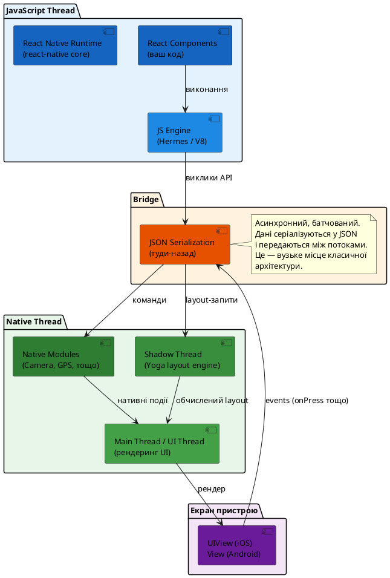
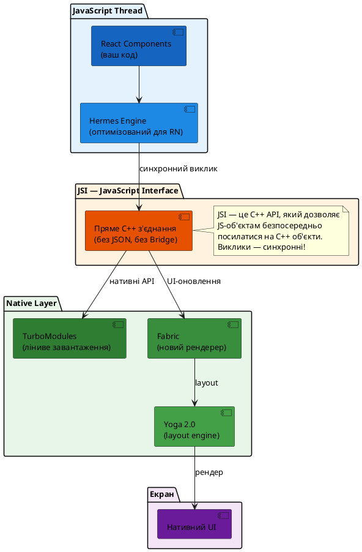
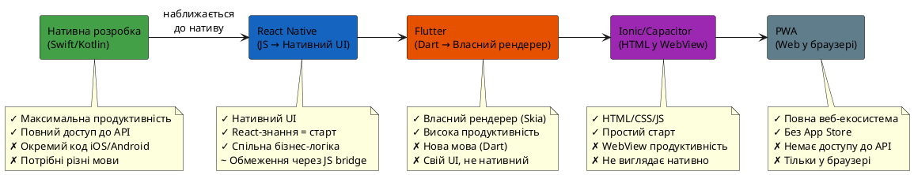
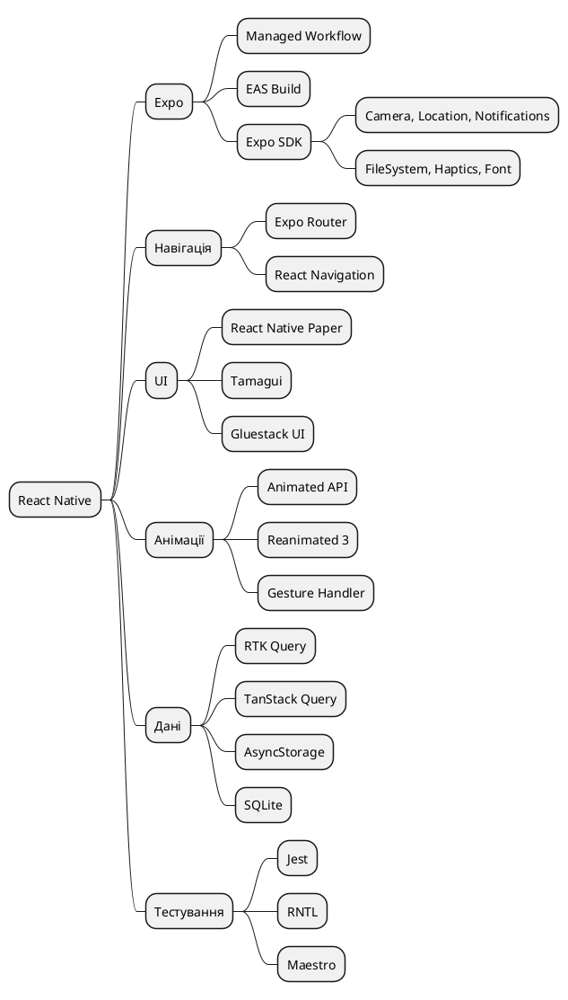

# Що таке React Native

## Задача, яку вирішував Марк Цукерберг у 2012 році

У 2012 році Facebook зіткнувся з проблемою, яка болить і сьогодні у багатьох командах: мобільний застосунок Facebook на iOS був написаний на HTML5, загорнутий у нативну оболонку. Він виглядав як нативний, але відчувався інакше — анімації «смикалися», скролінг запізнювався, а продуктивність залишала бажати кращого. У підсумку Цукерберг публічно назвав ставку на HTML5 «найбільшою стратегічною помилкою» компанії і анонсував перехід на повністю нативні застосунки.

Але перехід на нативну розробку створив іншу проблему: тепер потрібні були дві незалежні команди — одна на Objective-C для iOS, інша на Java для Android. Кожна фіча розроблялась двічі, кожна помилка виправлялась двічі, кожне код-рев'ю проходилось двічі.

Саме з цієї напруги між **продуктивністю нативу** та **ефективністю спільної кодової бази** народився React Native.

---

## Від хакатону до production у мільярда пристроїв

У 2013 році інженер Facebook Джордан Волк (Jordan Walke) запропонував революційну ідею на внутрішньому хакатоні: що якщо використовувати JavaScript та React для написання мобільних застосунків, але рендерити не HTML-елементи у WebView, а справжні нативні компоненти платформи?

Ця ідея стала фундаментом React Native.

::note
**Ключова відмінність від PhoneGap/Ionic:** React Native не «обгортає» веб-сторінку у нативний контейнер. Він використовує JavaScript для опису **логіки та структури** застосунку, а потім рендерить **справжні нативні компоненти** — `UIView` на iOS, `android.view.View` на Android. Те, що ви бачите на екрані — не HTML. Це справжній нативний UI.
::

**Хронологія ключових подій:**

| Рік | Подія |
| --- | ----- |
| 2013 | Внутрішній хакатон Facebook — народження ідеї |
| 2015 | Відкритий вихідний код на React Conf (лютий) |
| 2016 | Microsoft додає підтримку Windows та macOS |
| 2018 | Facebook анонсує масштабний рефакторинг архітектури |
| 2021 | Початок поступового розгортання New Architecture |
| 2024 | New Architecture стає стандартом за замовчуванням |

Сьогодні React Native використовується у застосунках Facebook, Instagram, Shopify, Discord, Microsoft Teams, Walmart та тисячах інших. За даними State of JS 2023, це найпопулярніша технологія для cross-platform мобільної розробки серед JavaScript-розробників.

---

## Як це працює: від `setState` до пікселя на екрані

Щоб зрозуміти React Native, потрібно зрозуміти, яким шляхом проходить ваш код від виклику `setState` до зміни пікселів на фізичному екрані телефону. Ця подорож принципово відрізняється від того, що відбувається у браузері.

### Архітектура «Bridge» (до 2024 року)

Класична архітектура React Native складається з трьох потоків (threads), які працюють паралельно і спілкуються між собою:

::plant-uml

::

**Що відбувається, коли ви натискаєте кнопку:**

::steps

### JavaScript Thread отримує подію

Native Thread фіксує натискання (touch event) і серіалізує його у JSON. Bridge передає цей JSON у JavaScript Thread.

### React перераховує стан

Ваш `onPress` обробник виконується у JS Thread. Якщо він викликає `setState`, React перераховує Virtual DOM та обчислює різницю (reconciliation).

### Різниця передається через Bridge

Список змін (які View оновити, які властивості змінити) серіалізується у JSON і передається через Bridge у Native Thread.

### Shadow Thread обчислює layout

Yoga — бібліотека layout-обчислень Facebook — перераховує позиції та розміри елементів на основі Flexbox-правил.

### UI Thread рендерить результат

Main Thread застосовує зміни до нативних View. Те, що бачить користувач — це справжні `UIView` на iOS або `View` на Android.

::

::tip
**Чому це важливо розуміти?** Класична архітектура має критичний недолік: **асинхронність Bridge**. Всі виклики між JS та Native — асинхронні та батчуються. Це означає, що якщо ви робите анімацію і оновлюєте 60 кадрів на секунду, кожен кадр має пройти через Bridge. Якщо JS Thread зайнятий важкими обчисленнями — анімація «смикатиметься». Саме тому в React Native так важливо розуміти, де виконується код.
::

### New Architecture: JSI, Fabric та TurboModules (2024)

Facebook розробляв нову архітектуру React Native майже шість років. У 2024 році вона стала **стандартом за замовчуванням** у нових проєктах. Вона вирішує фундаментальні проблеми Bridge:

::plant-uml

::

**Три ключові компоненти New Architecture:**

::card-group

::card{title="JSI (JavaScript Interface)" icon="i-lucide-zap"}

**C++ шар**, який замінює JSON-міст (Bridge). Дозволяє JavaScript-об'єктам безпосередньо посилатися на C++-об'єкти та викликати C++-методи **синхронно**. Немає серіалізації. Немає затримок.

::

::card{title="TurboModules" icon="i-lucide-package"}

Нова система нативних модулів. Модулі завантажуються **ліниво** (лише коли вони потрібні), а не всі одразу при запуску. Значно скорочує час холодного старту.

::

::card{title="Fabric" icon="i-lucide-layers"}

Новий рендерер UI. Дозволяє рендеринг **синхронно** або **конкурентно** (разом з React Concurrent Mode). Shadow Tree тепер живе у C++, а не у JavaScript.

::

::

::note
**Для практичного курсу:** більшість матеріалів цього курсу однаково застосовуються як до класичної архітектури, так і до New Architecture — API компонентів (View, Text, FlatList тощо) не змінились. Різниця — «під капотом». Ми будемо зазначати специфічні моменти там, де вони мають практичне значення.
::

---

## React Native проти інших підходів

Щоб остаточно зрозуміти, що таке React Native, варто порівняти його з альтернативами. На ринку існує кілька різних підходів до cross-platform мобільної розробки, і кожен з них вирішує задачу по-своєму.

### Спектр підходів

::plant-uml

::

### Детальне порівняння

| Критерій | Нативна розробка | React Native | Flutter | Ionic/Capacitor |
| -------- | :---: | :---: | :---: | :---: |
| **Мова** | Swift, Kotlin | JavaScript/TypeScript | Dart | HTML/CSS/JS |
| **UI рендеринг** | Нативний | Нативний | Власний (Skia/Impeller) | WebView (HTML) |
| **Продуктивність** | ⭐⭐⭐⭐⭐ | ⭐⭐⭐⭐ | ⭐⭐⭐⭐ | ⭐⭐⭐ |
| **Вигляд UI** | Платформений | Платформений | Кастомний | Схожий на веб |
| **Кодова база** | Окрема | Спільна | Спільна | Спільна |
| **Поріг входу\n(для JS-розробника)** | Дуже високий | Низький | Середній | Дуже низький |
| **Доступ до Native API** | Повний | Через модулі | Через плагіни | Через плагіни |
| **Розмір спільноти** | Велика | Дуже велика | Велика | Середня |

::tip
**Чому не Flutter?** Flutter — чудова технологія з відмінною продуктивністю. Але вона має два недоліки з точки зору React-розробника: **нова мова** (Dart) та **власний рендерер** (Skia/Impeller), що означає, що компоненти виглядають однаково на всіх платформах, але не завжди так само, як нативні додатки платформи. React Native дає нативний look-and-feel «з коробки».
::

### Коли React Native — правильний вибір?

React Native оптимальний, коли:

- У вас **вже є React-команда** і ви хочете вийти на мобільний ринок
- Потрібен **нативний look-and-feel** — тобто застосунок має виглядати і відчуватися як iOS/Android, а не як «порт» сайту
- **Продуктивність критична**, але не настільки, щоб вимагати повністю нативну розробку
- Потрібний **швидкий старт**: React Native з Expo дозволяє запустити перший застосунок за 15 хвилин
- Велика частина логіки — **бізнес-логіка**, а не специфічний для платформи код (анімації, жести, апаратні можливості)

::caution
React Native **не підходить**, якщо ваш застосунок є **graphically intensive** (3D-ігри, відеоредактори, застосунки з AR, що вимагають максимального контролю над GPU). Для таких випадків краще обрати або нативну розробку, або спеціалізовані рушії (Unity, Unreal, Metal/Vulkan).
::

---

## React Native очима React-розробника

Ви вже знаєте React. Компоненти, хуки, JSX, однонаправлений потік даних, Virtual DOM — все це залишається. React Native **не замінює** React, він **розширює** його на нову платформу.

Що залишається **рівно таким самим:**

- Компонентна модель (`function App() { return <...> }`)
- Хуки: `useState`, `useEffect`, `useRef`, `useMemo`, `useCallback` — всі вони
- `useContext`, `useReducer`, Redux, Zustand — вся система стану
- `props`, `children`, `key`, умовний рендеринг — все це
- Типізація TypeScript — інтерфейси, дженерики, типи пропсів
- Npm/yarn пакети (більшість, якщо вони не залежать від DOM)
- Тестування з Jest

Що змінюється **фундаментально:**

::field-group

::field{name="Немає HTML-елементів" type="зміна"}
Замість `
`, ``, `
`, `<button>`, `<input>` — нативні компоненти: `<View>`, `<Text>`, `<Pressable>`, `<TextInput>`. Їх не можна змішувати з HTML. Ніколи.
::

::field{name="Немає CSS" type="зміна"}
Немає `.css` файлів, `className`, CSS-селекторів, псевдоелементів, медіазапитів. Є `StyleSheet.create()` — об'єкт зі стилями, підмножина CSS-властивостей. Лише Flexbox для layout. Немає Grid, Float, Position: fixed.
::

::field{name="Немає браузерних API" type="зміна"}
Немає `window`, `document`, `localStorage`, `navigator.geolocation` (є нативні аналоги), `fetch` є. Немає `requestAnimationFrame` в тому ж вигляді — є `Animated` API.
::

::field{name="Дві платформи" type="зміна"}
Ваш код виконується одночасно на iOS та Android. Вони поводяться по-різному: жести, шрифти, тіні, навігація, клавіатура, дозволи. Потрібно тримати обидва у голові.
::

::field{name="Немає DevTools браузера" type="зміна"}
Замість F12 — React Native DevTools, Expo DevTools, Flipper. Немає інспекції CSS у реальному часі. Зміни стилів — через гарячу перезавантаження (Fast Refresh).
::

::

::note
**Правило першого дня:** якщо ви ловите себе на думці «хочу написати `
`», зупиніться. У React Native це завжди `<View style={styles.container}>`. Ця рефлекторна заміна — перший крок до мислення у категоріях React Native.
::

### Екосистема: що вас чекає

React Native — це не лише бібліотека. Це ціла екосистема:

::plant-uml

::

---

## Практика

::accordion

::accordion-item{label="Запитання 1 — Чому React Native рендерить нативні компоненти, а не HTML?" icon="i-lucide-circle-help"}

Поясніть власними словами: яка принципова різниця між підходом Ionic (WebView) і підходом React Native? Чому це важливо для продуктивності та look-and-feel?

**Підказка:** подумайте, що рендерує кожен підхід: HTML-елементи чи нативні View.

::

::accordion-item{label="Запитання 2 — Що вирішує New Architecture?" icon="i-lucide-circle-help"}

Класична архітектура React Native має Bridge з JSON-серіалізацією. Які проблеми це створює? Як JSI вирішує ці проблеми? Чому синхронність важлива для анімацій?

::

::accordion-item{label="Завдання — Таблиця переходу" icon="i-lucide-table"}

Заповніть таблицю переходу з React (веб) на React Native:

| React (веб) | React Native | Пояснення |
| ----------- | ------------ | --------- |
| `
` | ? | Базовий контейнер |
| `` | ? | Рядковий текст |
| `
` | ? | Параграф |
| `<button onClick={fn}>` | ? | Кнопка з обробником |
| `<input type="text">` | ? | Текстове введення |
| `` | ? | Зображення |
| `className="container"` | ? | Стилізація |
| `style={{ color: 'red' }}` | ? | Inline стиль |
| `window.localStorage` | ? | Локальне зберігання |

Відповіді — у наступній статті «Від React до React Native».

::

::

