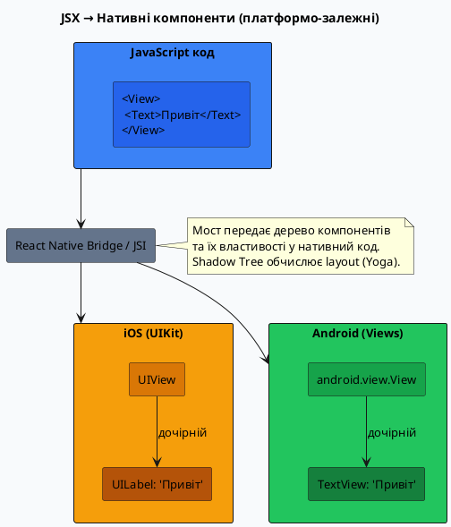
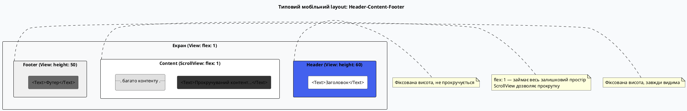

# View та Text — фундаментальні будівельні блоки

## Чому все починається з View та Text

Якщо ви прийшли з веб-розробки, ви звикли до багатого набору HTML-елементів: `<div>`, `<span>`, `<p>`, `<h1>`, `<section>`, `<article>`, `<header>`, `<footer>`. Кожен з них має семантичне значення, стандартизовані стилі за замовчуванням та специфічну поведінку. Це роками відшліфовані інструменти для створення документо-орієнтованих інтерфейсів.

У React Native цього різноманіття немає. Замість десятків тегів є **два первинних будівельних блоки**:

- **`<View>`** — універсальний контейнер для будь-якого візуального елемента
- **`<Text>`** — єдиний компонент для відображення тексту

Це може здаватися обмеженням, але насправді це — **свобода**. Замість того, щоб запам'ятовувати семантику десятків тегів, ви будуєте все з двох примітивів, явно визначаючи поведінку через стилі та пропси. Це компонентно-орієнтований підхід у чистому вигляді.


У цій статті ми детально розберемо, що таке `View` і `Text`, чим вони відрізняються від HTML-аналогів, які правила їх використання та які патерни з ними пов'язані. До кінця у вас буде повне розуміння фундаменту, на якому будується весь UI у React Native.

---

## View — це `<div>`, але не зовсім

### Що таке View у нативному світі

Коли ви пишете `<View>` у React Native, він не створює HTML-елемент. Натомість:

- На **iOS** створюється екземпляр класу `UIView` з фреймворку UIKit
- На **Android** — екземпляр `android.view.View`
- На **вебі** (через react-native-web) — звичайний `<div>`

Це нативні платформенні об'єкти, які мають власну ієрархію, lifecycle, механізм малювання. React Nativebridge (а у New Architecture — JSI) передає інструкції з JavaScript у нативний код, де створюється реальний UI-елемент.

::plant-uml



::


### View як контейнер: фундаментальне призначення

`View` — це **контейнер**. Він не має жодного візуального змісту сам по собі — це прозора коробка, яка:

1. **Групує дочірні елементи** — організовує їх у візуальну ієрархію
2. **Визначає layout** — через Flexbox-властивості (про це окрема стаття)
3. **Надає стилізацію** — фон, рамки, тіні, заокруглення кутів
4. **Обробляє події** — може реагувати на дотики через `onPress` (у поєднанні з `Pressable`)
5. **Керує accessibility** — accessibility props для screen readers

Аналогія з будівництвом: якщо `<Text>` — це цегла з написом, то `<View>` — це каркас будівлі, що тримає ці цегли разом у потрібній формі.

### Базовий приклад View

```tsx [BasicView.tsx] showLineNumbers
import { View, StyleSheet } from 'react-native'

export default function BasicViewExample() {
    return (
        <View style={styles.container}>
            <View style={styles.box} />
        </View>
    )
}

const styles = StyleSheet.create({
    container: {
        flex: 1,
        backgroundColor: '#f0f0f0',
        padding: 20,
    },
    box: {
        width: 100,
        height: 100,
        backgroundColor: '#4361ee',
        borderRadius: 12,
    },
})
```


У цьому прикладі:

- Зовнішній `<View>` — це контейнер всього екрану (`flex: 1` розтягує його на всю висоту)
- Внутрішній `<View>` — це кольоровий квадрат з заокругленими кутами
- Жодного тексту чи зображення — просто структура контейнерів

::note
**Ментальна модель:** `<View>` у React Native = `<div>` у HTML + Flexbox за замовчуванням. Кожного разу, коли у вебі ви б написали `<div>`, у React Native пишіть `<View>`. Якщо потрібен семантичний елемент (`<header>`, `<section>`) — у RN це теж `<View>` + accessibility props.
::

---

## Text — єдиний спосіб відобразити текст

### Категоричне правило: текст тільки всередині `<Text>`

У HTML текст може існувати практично де завгодно:

```html
<!-- HTML — все це валідно: -->
<div>Текст безпосередньо у div</div>
<p>Параграф</p>
<span>Інлайн-текст</span>
<button>Кнопка</button>
```

У React Native це **неможливо**. Будь-який текстовий контент **повинен** бути загорнутий у компонент `<Text>`. Спроба помістити текст безпосередньо у `<View>` викличе помилку:

```tsx
// ❌ ПОМИЛКА — текст не може бути безпосередньо у View
<View>
  Цей текст викличе runtime error
</View>

// ✅ ПРАВИЛЬНО
<View>
  <Text>Цей текст відобразиться коректно</Text>
</View>
```


Чому така жорсткість? Тому що на нативних платформах текст — це окремий тип компонента з власними можливостями:

- **iOS:** `UILabel`, `UITextField`, `UITextView` — спеціалізовані класи для тексту
- **Android:** `TextView`, `EditText` — теж окремі класи

Текст не може «просто існувати» — він завжди повинен бути всередині текстового компонента. React Native переносить це обмеження у JavaScript-світ для консистентності.

### Text як нативний компонент

Коли ви пишете `<Text>`, він перетворюється на:

- `UILabel` на iOS
- `TextView` на Android
- `<span>` або `<p>` на вебі (react-native-web)

Це означає, що `<Text>` має:

- Власні можливості стилізації (fontSize, fontWeight, color, lineHeight, textAlign)
- Обробку перенесення рядків
- Підтримку Unicode, емодзі, RTL-мов (справа наліво)
- Accessibility для screen readers

### Базовий приклад Text

```tsx [BasicText.tsx] showLineNumbers
import { View, Text, StyleSheet } from 'react-native'

export default function BasicTextExample() {
    return (
        <View style={styles.container}>
            <Text style={styles.title}>Заголовок</Text>
            <Text style={styles.body}>
                Це звичайний текст. У React Native немає семантичних тегів як <code>&lt;h1&gt;</code>,{' '}
                <code>&lt;p&gt;</code>, <code>&lt;span&gt;</code> — є лише <code>&lt;Text&gt;</code>.
                Стилі визначають, як текст виглядає.
            </Text>
        </View>
    )
}

const styles = StyleSheet.create({
    container: {
        padding: 20,
    },
    title: {
        fontSize: 24,
        fontWeight: '700',
        color: '#1a1a2e',
        marginBottom: 12,
    },
    body: {
        fontSize: 16,
        color: '#4a4a4a',
        lineHeight: 24,
    },
})
```


::warning
**Часта помилка новачків:** спроба використати HTML-теги у тексті. `<Text>Це <strong>жирний</strong> текст</Text>` **не працює**. Замість цього використовуйте вкладені `<Text>` з власними стилями або бібліотеку для markdown/HTML-рендерингу.
::

---

## Ключова відмінність від HTML: вкладеність та стилі

### Вкладеність Text: успадкування стилів

На відміну від `<View>`, компоненти `<Text>` **можуть бути вкладеними один в одного**, і дочірні `<Text>` **успадковують** деякі стилі від батьківських. Це єдиний випадок «каскаду» у React Native:

```tsx [NestedText.tsx] showLineNumbers
import { Text, StyleSheet } from 'react-native'

export default function NestedTextExample() {
    return (
        <Text style={styles.paragraph}>
            Це звичайний текст. <Text style={styles.bold}>Цей фрагмент жирний.</Text>{' '}
            <Text style={styles.colored}>Цей — кольоровий.</Text> А це знову звичайний.
        </Text>
    )
}

const styles = StyleSheet.create({
    paragraph: {
        fontSize: 16,
        color: '#333333',
        lineHeight: 24,
    },
    bold: {
        fontWeight: '700',
        // fontSize та color успадковуються від paragraph
    },
    colored: {
        color: '#4361ee',
        // fontSize успадковується
    },
})
```


Що успадковується у вкладених `<Text>`:

::field-group

::field{name="fontSize" type="number"}
Розмір шрифту. Якщо не вказаний у дочірньому — береться з батьківського.
::

::field{name="fontFamily" type="string"}
Назва шрифту. Дочірній Text використовує той самий шрифт, якщо не перевизначений.
::

::field{name="fontWeight" type="string"}
Вага шрифту ('400', '700', 'bold'). Дочірній може перевизначити.
::

::field{name="fontStyle" type="'normal' | 'italic'"}
Стиль шрифту. Успадковується, але можна перевизначити.
::

::field{name="color" type="string"}
Колір тексту. Успадковується від батьківського Text.
::

::field{name="lineHeight" type="number"}
Міжрядковий інтервал. Успадковується.
::

::field{name="textAlign" type="'left' | 'center' | 'right' | 'justify'"}
Вирівнювання тексту. Успадковується лише у вкладених Text.
::

::field{name="letterSpacing" type="number"}
Відстань між літерами. Успадковується.
::

::field{name="textDecorationLine" type="'none' | 'underline' | 'line-through'"}
Підкреслення чи закреслення. Успадковується.
::

::

::tip
**Практичний патерн:** створюйте базовий компонент `<Typography>` з пресетами стилів (Heading1, Heading2, Body, Caption) та використовуйте вкладені `<Text>` для акцентів (жирний, посилання, код). Це забезпечує консистентність дизайну без дублювання стилів.
::


### Text не може містити View

Важливе обмеження: `<Text>` може містити тільки інші `<Text>` та рядкові літерали. Спроба вкласти `<View>` у `<Text>` викличе помилку:

```tsx
// ❌ ПОМИЛКА — View не може бути всередині Text
<Text>
  Текст та
  <View style={{ width: 20, height: 20, backgroundColor: 'red' }} />
  квадрат
</Text>

// ✅ ПРАВИЛЬНО — Text всередині View
<View style={{ flexDirection: 'row', alignItems: 'center' }}>
  <Text>Текст та </Text>
  <View style={{ width: 20, height: 20, backgroundColor: 'red' }} />
  <Text> квадрат</Text>
</View>
```

Це логічно: на нативному рівні `UILabel` (iOS) та `TextView` (Android) не можуть містити довільні view-компоненти всередині тексту. Вони створені для відображення **лише тексту**.

---

## Порівняльна таблиця: View vs Text

| Аспект                          | View                                         | Text                                     |
| ------------------------------- | -------------------------------------------- | ---------------------------------------- |
| **HTML-аналог**                 | `<div>`                                      | `<p>`, `<span>`, `<h1>`–`<h6>`           |
| **Нативний компонент (iOS)**    | `UIView`                                     | `UILabel`                                |
| **Нативний компонент (Android)** | `android.view.View`                         | `TextView`                               |
| **Може містити текст напряму**  | ❌ Ні (викличе помилку)                      | ✅ Так (єдиний спосіб)                   |
| **Може містити інші View**      | ✅ Так                                        | ❌ Ні                                    |
| **Може містити інші Text**      | ✅ Так (але текст має бути у `<Text>`)       | ✅ Так (вкладеність)                     |
| **Успадкування стилів**         | ❌ Ні (кожен View — незалежний)              | ✅ Так (fontSize, color, font* properties) |
| **Layout-можливості**           | ✅ Повний Flexbox                            | Обмежений (тільки текстові властивості)  |
| **Фон, рамки, тіні**            | ✅ Так                                        | ✅ Так (але рідко використовується)      |
| **Обробка дотиків**             | Через `<Pressable>` або `<TouchableOpacity>` | Через `onPress` prop (працює напряму)    |
| **accessibility**               | Через props (`accessibilityRole`)            | Через props + автоматично як текст       |


---

## Layout-патерни з View

Оскільки `<View>` є основним контейнером, практично всі layout-рішення будуються через комбінацію View-компонентів зі стилями Flexbox. Ось найпоширеніші патерни:

### Патерн 1: Вертикальний стек (за замовчуванням)

За замовчуванням `flexDirection` у React Native — `'column'` (на відміну від веб-CSS, де за замовчуванням `'row'`). Тому View автоматично розташовує дочірні елементи **вертикально**:

```tsx [VerticalStack.tsx] showLineNumbers
import { View, Text, StyleSheet } from 'react-native'

export default function VerticalStack() {
    return (
        <View style={styles.container}>
            <View style={styles.box}>
                <Text>Елемент 1</Text>
            </View>
            <View style={styles.box}>
                <Text>Елемент 2</Text>
            </View>
            <View style={styles.box}>
                <Text>Елемент 3</Text>
            </View>
        </View>
    )
}

const styles = StyleSheet.create({
    container: {
        padding: 20,
        // flexDirection: 'column' — за замовчуванням, можна не писати
    },
    box: {
        backgroundColor: '#e0e0e0',
        padding: 16,
        marginBottom: 12,
        borderRadius: 8,
    },
})
```


### Патерн 2: Горизонтальний ряд

Щоб розташувати елементи горизонтально, явно встановіть `flexDirection: 'row'`:

```tsx [HorizontalRow.tsx] showLineNumbers
import { View, Text, StyleSheet } from 'react-native'

export default function HorizontalRow() {
    return (
        <View style={styles.row}>
            <View style={styles.item}>
                <Text>1</Text>
            </View>
            <View style={styles.item}>
                <Text>2</Text>
            </View>
            <View style={styles.item}>
                <Text>3</Text>
            </View>
        </View>
    )
}

const styles = StyleSheet.create({
    row: {
        flexDirection: 'row',
        padding: 20,
        justifyContent: 'space-between', // рівномірний розподіл
    },
    item: {
        width: 80,
        height: 80,
        backgroundColor: '#4361ee',
        alignItems: 'center',
        justifyContent: 'center',
        borderRadius: 8,
    },
})
```

::note
**Flexbox у React Native** — окрема стаття курсу, де детально розглядаються всі властивості (`justifyContent`, `alignItems`, `flex`, `gap` тощо). Тут ми лише показуємо базові приклади використання View для layout.
::


### Патерн 3: Центрування вмісту

Одне з найчастіших завдань — відцентрувати елемент всередині контейнера:

```tsx [CenteredContent.tsx] showLineNumbers
import { View, Text, StyleSheet } from 'react-native'

export default function CenteredContent() {
    return (
        <View style={styles.container}>
            <View style={styles.card}>
                <Text style={styles.text}>Я відцентрований</Text>
            </View>
        </View>
    )
}

const styles = StyleSheet.create({
    container: {
        flex: 1, // займає всю доступну висоту
        justifyContent: 'center', // вертикальне центрування
        alignItems: 'center', // горизонтальне центрування
        backgroundColor: '#f5f5f5',
    },
    card: {
        width: 200,
        padding: 24,
        backgroundColor: '#ffffff',
        borderRadius: 12,
        shadowColor: '#000',
        shadowOffset: { width: 0, height: 2 },
        shadowOpacity: 0.1,
        shadowRadius: 4,
        elevation: 3,
    },
    text: {
        fontSize: 16,
        textAlign: 'center',
        color: '#333',
    },
})
```

::tip
**Швидкий спосіб центрування:** `justifyContent: 'center'` + `alignItems: 'center'` на батьківському View. Це працює для будь-якого вмісту — тексту, зображень, кнопок.
::


### Патерн 4: Header-Content-Footer (класичний мобільний layout)

Типова структура екрану: фіксована шапка, контент що прокручується, фіксований футер:

```tsx [ScreenLayout.tsx] showLineNumbers
import { View, Text, StyleSheet, ScrollView } from 'react-native'

export default function ScreenLayout() {
    return (
        <View style={styles.screen}>
            {/* Header */}
            <View style={styles.header}>
                <Text style={styles.headerText}>Заголовок</Text>
            </View>

            {/* Content (прокручується) */}
            <ScrollView style={styles.content}>
                <Text style={styles.paragraph}>
                    Це контент, який може бути довгим і прокручуватись. Lorem ipsum dolor sit amet...
                </Text>
                {/* Багато контенту */}
            </ScrollView>

            {/* Footer */}
            <View style={styles.footer}>
                <Text style={styles.footerText}>Футер</Text>
            </View>
        </View>
    )
}

const styles = StyleSheet.create({
    screen: {
        flex: 1, // займає весь екран
    },
    header: {
        height: 60,
        backgroundColor: '#4361ee',
        justifyContent: 'center',
        alignItems: 'center',
    },
    headerText: {
        color: '#ffffff',
        fontSize: 18,
        fontWeight: '600',
    },
    content: {
        flex: 1, // займає весь простір між header та footer
        backgroundColor: '#ffffff',
    },
    paragraph: {
        padding: 20,
        fontSize: 16,
        lineHeight: 24,
    },
    footer: {
        height: 50,
        backgroundColor: '#f0f0f0',
        justifyContent: 'center',
        alignItems: 'center',
        borderTopWidth: 1,
        borderTopColor: '#e0e0e0',
    },
    footerText: {
        fontSize: 14,
        color: '#666',
    },
})
```


::plant-uml



::


---

## Живий приклад: Картка профілю

Об'єднаємо все вивчене у практичному прикладі — картка користувача з аватаром, ім'ям, описом та кнопкою:

::react-native-preview

```tsx
import { View, Text, Image, Pressable, StyleSheet } from 'react-native'
import { useState } from 'react'

export default function ProfileCard() {
    const [following, setFollowing] = useState(false)

    return (
        <View style={styles.container}>
            <View style={styles.card}>
                {/* Аватар */}
                <Image
                    source={{ uri: 'https://i.pravatar.cc/150?img=12' }}
                    style={styles.avatar}
                />

                {/* Текстовий блок */}
                <View style={styles.textBlock}>
                    <Text style={styles.name}>Олександра Коваленко</Text>
                    <Text style={styles.role}>Senior React Native Developer</Text>
                    <Text style={styles.bio}>
                        Захоплююсь мобільною розробкою та Open Source. Люблю TypeScript, анімації та
                        чистий код.
                    </Text>
                </View>

                {/* Кнопка */}
                <Pressable
                    style={[styles.button, following && styles.buttonFollowing]}
                    onPress={() => setFollowing(!following)}
                >
                    <Text style={[styles.buttonText, following && styles.buttonTextFollowing]}>
                        {following ? '✓ Ви стежите' : '+ Стежити'}
                    </Text>
                </Pressable>
            </View>
        </View>
    )
}

const styles = StyleSheet.create({
    container: {
        flex: 1,
        justifyContent: 'center',
        alignItems: 'center',
        backgroundColor: '#f0f2f5',
        padding: 20,
    },
    card: {
        width: '100%',
        maxWidth: 400,
        backgroundColor: '#ffffff',
        borderRadius: 16,
        padding: 24,
        shadowColor: '#000',
        shadowOffset: { width: 0, height: 4 },
        shadowOpacity: 0.1,
        shadowRadius: 12,
        elevation: 5,
    },
    avatar: {
        width: 80,
        height: 80,
        borderRadius: 40,
        marginBottom: 16,
        alignSelf: 'center',
    },
    textBlock: {
        marginBottom: 20,
    },
    name: {
        fontSize: 22,
        fontWeight: '700',
        color: '#1a1a2e',
        textAlign: 'center',
        marginBottom: 4,
    },
    role: {
        fontSize: 14,
        color: '#6c757d',
        textAlign: 'center',
        marginBottom: 12,
    },
    bio: {
        fontSize: 14,
        color: '#4a4a4a',
        lineHeight: 20,
        textAlign: 'center',
    },
    button: {
        backgroundColor: '#4361ee',
        paddingVertical: 14,
        paddingHorizontal: 24,
        borderRadius: 10,
        alignItems: 'center',
    },
    buttonFollowing: {
        backgroundColor: '#e8f0fe',
        borderWidth: 1,
        borderColor: '#4361ee',
    },
    buttonText: {
        color: '#ffffff',
        fontSize: 16,
        fontWeight: '600',
    },
    buttonTextFollowing: {
        color: '#4361ee',
    },
})
```

::


У цьому прикладі:

::card-group

::card{title="Структура View" icon="i-lucide-layout"}

Три вкладені рівні: `container` (фон екрану) → `card` (картка) → внутрішні блоки (аватар, текст, кнопка). Кожен View має чітке призначення.

::

::card{title="Text стилі" icon="i-lucide-type"}

`name`, `role`, `bio` — різні стилі для різних рівнів тексту. Немає `<h1>` чи `<p>` — лише `<Text>` з явними стилями.

::

::card{title="Умовні стилі" icon="i-lucide-git-branch"}

`[styles.button, following && styles.buttonFollowing]` — масив стилів, де другий стиль застосовується лише при `following === true`.

::

::card{title="Pressable взаємодія" icon="i-lucide-hand"}

Кнопка змінює свій вигляд та текст при натисканні через стан `following`. Це типовий мобільний патерн.

::

::

---

## Поширені помилки та їх вирішення

::accordion

::accordion-item{label="Помилка: «Text strings must be rendered within a <Text> component»"}

**Причина:** спроба помістити текст безпосередньо у `<View>` без `<Text>`.

```tsx
// ❌ Неправильно
<View>
  Привіт, світ!
</View>

// ✅ Правильно
<View>
  <Text>Привіт, світ!</Text>
</View>
```

::


::accordion-item{label="Помилка: «Views cannot have a Text node as a child»"}

**Причина:** спроба вкласти `<View>` всередину `<Text>`.

```tsx
// ❌ Неправильно
<Text>
  Текст і
  <View style={{ width: 20, height: 20 }} />
</Text>

// ✅ Правильно
<View style={{ flexDirection: 'row' }}>
  <Text>Текст і </Text>
  <View style={{ width: 20, height: 20 }} />
</View>
```

::

::accordion-item{label="Проблема: текст «обрізається» або не видний"}

**Причина:** батьківський `<View>` не має достатньої висоти, або текст виходить за межі з `overflow: 'hidden'`.

**Рішення:**

1. Видаліть фіксовану `height` з батьківського View або збільште її
2. Перевірте `overflow` — за замовчуванням `'visible'`, але якщо встановлено `'hidden'`, текст може обрізатися
3. Для ScrollView: переконайтесь, що `contentContainerStyle` має достатній `padding`

::

::accordion-item{label="Проблема: Text не переноситься на новий рядок"}

**Причина:** батьківський View має `flexDirection: 'row'` без `flexWrap: 'wrap'`, або Text обмежений `numberOfLines`.

**Рішення:**

```tsx
// Якщо Text у горизонтальному View:
<View style={{ flexDirection: 'row', flexWrap: 'wrap' }}>
  <Text>Довгий текст буде переноситися</Text>
</View>

// Або обмежте ширину View:
<View style={{ width: 200 }}>
  <Text>Текст автоматично перенесеться</Text>
</View>
```

::

::accordion-item{label="Проблема: стилі Text не застосовуються"}

**Причина:** спроба застосувати layout-властивості (`flex`, `margin`, `padding`, `width`) безпосередньо на `<Text>`.

**Рішення:** `<Text>` підтримує лише **текстові стилі** (`fontSize`, `color`, `fontWeight` тощо) та обмежений набір layout-властивостей. Для повноцінного layout оберніть Text у View:

```tsx
// ❌ Не спрацює коректно
<Text style={{ margin: 20, flex: 1 }}>Текст</Text>

// ✅ Правильно
<View style={{ margin: 20, flex: 1 }}>
  <Text>Текст</Text>
</View>
```

::

::


---

## Практика

::accordion

::accordion-item{label="Завдання 1 — Створіть компонент Card" icon="i-lucide-square"}

Створіть компонент `Card`, що приймає `title`, `description` та `children` як пропси. Картка має мати:

- Білий фон з заокругленими кутами (12px)
- Тінь (для iOS та Android)
- Внутрішній padding 16px
- Заголовок (fontSize: 18, fontWeight: '700')
- Опис (fontSize: 14, color: '#666')
- Довільний вміст через `children`

Використайте компонент так:

```tsx
<Card title="Моя картка" description="Опис картки">
  <Text>Довільний вміст всередині</Text>
</Card>
```

::

::accordion-item{label="Завдання 2 — Layout: два стовпці" icon="i-lucide-columns-2"}

Створіть layout з двома стовпцями однакової ширини, де у кожному стовпці є по 3 елементи (View з кольоровим фоном та Text всередині). Використайте `flexDirection: 'row'` та `flex: 1`.

**Очікуваний результат:**

```
┌──────────┬──────────┐
│ Елемент 1│ Елемент 4│
│ Елемент 2│ Елемент 5│
│ Елемент 3│ Елемент 6│
└──────────┴──────────┘
```

::

::accordion-item{label="Завдання 3 — Вкладений Text з акцентами" icon="i-lucide-type"}

Створіть компонент `RichText`, що рендерить параграф з:

- Звичайним текстом (fontSize: 16, color: '#333')
- **Жирним фрагментом** (fontWeight: '700')
- _Курсивним фрагментом_ (fontStyle: 'italic')
- Кольоровим посиланням (color: '#4361ee', textDecorationLine: 'underline')

Використайте вкладені `<Text>` та успадкування стилів.

::

::accordion-item{label="Завдання 4 — Відтворіть макет" icon="i-lucide-layout-template"}

За наведеним зображенням макету (уявна картка продукту) відтворіть компонент з:

- Зображенням товару зверху (Image)
- Назвою товару (Text, жирний, 20px)
- Ціною (Text, 24px, синій колір)
- Описом товару (Text, 14px, сірий, обмежений 3 рядками через `numberOfLines={3}`)
- Кнопкою "Додати до кошика" (Pressable + Text)

Використайте тільки `<View>`, `<Text>`, `<Image>` та `<Pressable>`.

::

::


---

## Резюме

::card-group

::card{title="🔲 View — універсальний контейнер" icon="i-lucide-square"}

- Аналог `<div>` у HTML, але без семантичних варіантів
- Перетворюється на `UIView` (iOS) та `android.view.View` (Android)
- Використовується для **структури**, **layout** (Flexbox) та **стилізації**
- Може містити інші View, Text, Image та будь-які компоненти
- **Не може** містити текст напряму — тільки через `<Text>`

::

::card{title="📝 Text — єдиний спосіб відобразити текст" icon="i-lucide-type"}

- Перетворюється на `UILabel` (iOS) та `TextView` (Android)
- **Категоричне правило:** будь-який текст має бути у `<Text>`
- Може містити інші `<Text>` (вкладеність) — **успадкування стилів**
- **Не може** містити `<View>` — тільки текстові вузли та інші Text
- Підтримує текстові стилі: `fontSize`, `color`, `fontWeight`, `lineHeight`, `textAlign`

::

::card{title="🎨 Стилі та каскад" icon="i-lucide-palette"}

- У View **немає каскаду** — кожен компонент має власні стилі
- У вкладених Text **є каскад** — fontSize, color, fontFamily успадковуються
- Використовуйте `StyleSheet.create()` для оптимізації та типізації
- Масив стилів `[style1, style2]` — другий перекриває перший

::

::card{title="📐 Layout-патерни" icon="i-lucide-layout-grid"}

- За замовчуванням: `flexDirection: 'column'` (вертикальний стек)
- Горизонтальний ряд: `flexDirection: 'row'`
- Центрування: `justifyContent: 'center'` + `alignItems: 'center'`
- Header-Content-Footer: комбінація фіксованих висот та `flex: 1`

::

::card{title="⚠️ Поширені помилки" icon="i-lucide-alert-triangle"}

- Текст напряму у View → **помилка**
- View всередині Text → **помилка**
- Layout-властивості на Text (flex, margin) → **не спрацює коректно**
- Використання HTML-тегів (`<div>`, `<p>`) → **помилка**
- Забути `width`/`height` для Image з мережі → **не відобразиться**

::

::card{title="🎯 Що далі" icon="i-lucide-arrow-right"}

Наступна стаття — **StyleSheet та стилізація**. Детально розглянемо, які CSS-властивості доступні, як працює `StyleSheet.create()`, що таке `ViewStyle`, `TextStyle`, `ImageStyle`, та як організувати стилі у великому проєкті.

::

::

