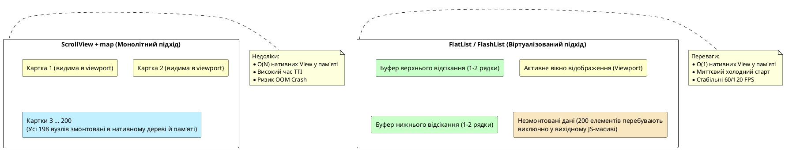

# Списки та віртуалізація

## Навіщо ця стаття

У мобільних застосунках списки є домінуючим патерном представлення інформації: стрічки соціальних мереж, каталоги інтернет-магазинів, списки транзакцій, чати та аудіоплеєри побудовані на базі прокручуваних масивів елементів. У навчальних прикладах часто оперують невеликими масивами з 3–5 об’єктів, де будь-який підхід до рендерингу видається швидким. Проте в реальних умовах мобільний клієнт повинен відображати сотні або тисячі складних сутностей, кожна з яких містить векторну графіку, растрові зображення, стилізовану типографіку та обробники жестів.

Якщо підійти до рендерингу довгого списку наївно — наприклад, використати стандартний контейнер `ScrollView` та виконати пряму ітерацію `array.map()` — застосунок миттєво зіткнеться з фундаментальними апаратними обмеженнями мобільного пристрою. Створення сотень нативних представлень (*native views*) в один момент спричиняє різке зростання споживання оперативної пам'яті (RAM), блокування головного потоку JavaScript та графічного потоку UI, просідання частоти кадрів (jank/frame drops) і, в найгіршому випадку, аварійне завершення процесу операційною системою через Out-Of-Memory (OOM).

У попередніх розділах було визначено функціональні межі `ScrollView`: цей компонент призначений для **статичного контенту фіксованого розміру** (форми введення, статті, налаштування). Для **динамічних та довгих однотипних колекцій даних** інженерний стандарт React Native вимагає застосування **віртуалізованих списків** — `FlatList`, `SectionList` або спеціалізованих рішень на кшталт `FlashList`.

Цей розділ присвячено фундаментальній концепції **віртуалізації інтерфейсу (UI Virtualization)**, її математичним і архітектурним принципам, внутрішній будові компонентів `FlatList` та `SectionList`, механізмам рециклінгу представлень у `FlashList`, а також патернам управління станами списку (пагінація, pull-to-refresh, обробка помилок та порожніх станів).

Після опрацювання матеріалу ви зможете:

1. **Глибоко розуміти фізичну різницю** між нативним рендерингом `ScrollView + map` та віртуалізованим віконним відображенням.
2. **Проєктувати високоефективні компоненти на базі `FlatList`**, бездоганно налаштовуючи зв'язку `data`, `renderItem`, `keyExtractor` та параметри буферизації.
3. **Реалізовувати повноцінний UX-контракт списку**: відображення порожнього стану (`ListEmptyComponent`), композицію шапки (`ListHeaderComponent`) та підвалу (`ListFooterComponent`), а також двонаправлене оновлення за допомогою жесту `RefreshControl`.
4. **Конструювати надійні механізми нескінченної пагінації (`onEndReached`)**, коректно контролюючи порогові значення та запобігаючи стану гонитви (race conditions).
5. **Структурувати складні ієрархічні дані за допомогою `SectionList`**, налаштовуючи поведінку закріплення заголовків (`stickySectionHeadersEnabled`) з урахуванням специфіки iOS та Android.
6. **Аналізувати та усувати вузькі місця продуктивності**, застосовуючи мемоізацію рядків (`React.memo`), стабільні посилання (`useCallback`), попереднє обчислення геометрії (`getItemLayout`) та зовнішній стан (`extraData`).
7. **Оцінювати доцільність переходу на `FlashList`**, розуміючи концептуальну різницю між циклічним видаленням/монтуванням вузлів та парадигмою рециклінгу комірок (*Cell Recycling*).
8. **Інтегрувати багаторівневі списки в архітектуру реального проєкту** на прикладі стрічки поїздок та горизонтального каталогу місць у застосунку Nomad.

::note
**Фундаментальний принцип віртуалізації.** Мобільний пристрій не повинен створювати нативні графічні об'єкти для даних, які перебувають поза межами видимого екрана (viewport). Віртуалізований список підтримує в активному дереві рендерингу лише мінімальну підмножину елементів — так зване «вікно перегляду» плюс невеликий буфер попереднього завантаження зверху та знизу. Під час прокручування елементи, що виходять за межі буфера, демонтуються або перевикористовуються, а нові монтуються динамічно. Користувач сприймає стрічку як нескінченну та цілісну, тоді як споживання пам'яті залишається константним: $O(1)$ щодо загальної кількості елементів масиву.
::

::tip
**Особливості інтерактивних демонстрацій.** Усі приклади в цій статті забезпечені живими прев'ю на базі `::react-native-preview` (середовище `react-native-web`). Стандартні компоненти `FlatList`, `SectionList` та `RefreshControl` функціонують у веб-пісочниці повноцінно. Зверніть увагу: бібліотека `FlashList` є зовнішнім нативним модулем і відсутня у браузерному iframe; її архітектуру, API та інтеграцію детально розглянуто в теоретичній частині та в кодовій базі повноцінного проєкту Nomad.
::

---

## Порівняльний аналіз: Web React та React Native

Розробники, які переходять у React Native з екосистеми веб-розробки, часто переносять звичні підходи до побудови списків без урахування специфіки мобільних рушіїв рендерингу. У браузері створення кількох сотень простих DOM-вузлів `<li>` є відносно дешевою операцією, оскільки сучасні рушії (V8, Blink, Gecko) оптимізовані для швидкого парсингу HTML-дерева. У React Native кожен візуальний елемент — це не просто запис у пам'яті JS-рушія, а реальний нативний віджет операційної системи (`UIView` в iOS або `android.view.ViewGroup` в Android) із власними графічними контекстами, пам'яттю під текстури та прорахунком розкладки в рушії Yoga.

| Концепція у Web React | Еквівалент у React Native | Архітектурна та поведінкова різниця |
| :--- | :--- | :--- |
| `<ul>{items.map(...)}</ul>` | `ScrollView` + `map` | **Повний монолітний рендеринг.** Усі нативні вузли та зображення інстанціюються одночасно до першого показу екрана. |
| Глобальний скрол вікна (`window`) | `ScrollView` | Контейнер з фіксованими або розтягнутими межами, що реалізує нативну механіку інерційної прокрутки. |
| `react-window`, `react-virtualized`, `@tanstack/virtual` | `FlatList` / `SectionList` / `FlashList` | **Віртуалізований рендеринг.** Створюються лише елементи, наближені до поточної координати прокручування. |
| `IntersectionObserver` (Infinite Scroll) | `onEndReached` у списках | Розрахунок відносного зміщення скролу для завчасного підвантаження порцій даних із сервера. |
| CSS pull-to-refresh / Touch events | `RefreshControl` | Пряма обгортка над системними віджетами оновлення (`UIRefreshControl` в iOS та `SwipeRefreshLayout` в Android). |

::warning
**Типова пастка веброзробника.** Конструкція `{trips.map(trip => <TripCard key={trip.id} {...trip} />)}` всередині `ScrollView` є допустимою виключно для гарантовано обмежених вибірок (до 5–10 елементів). Якщо передати в таку структуру масив із 100 карток з обкладинками, додаток ініціалізує 100 нативних об'єктів зображень і прорахує повний лейаут всього полотна. На пристроях середнього та бюджетного сегментів це гарантовано призведе до тривалого «зависання» інтерфейсу (TTI / Time to Interactive) та деградації пам'яті.
::

---

## Що ламається без віртуалізації: анатомія наївного рендерингу

Щоб чітко усвідомити необхідність віртуалізації, розглянемо життєвий цикл екрана, на якому відображається стрічка з 200 карток поїздок через `ScrollView + map`.

### Поетапний аналіз наївного рендерингу

::steps

### 1. Фаза ініціалізації та узгодження (Reconciliation)
React виконує функцію компонента і генерує віртуальне дерево (Virtual DOM) для всіх 200 елементів масиву. Якщо кожна картка містить 10 дочірніх вузлів (`View`, `Text`, `Image`, `Pressable`), рушій JavaScript створює понад 2000 віртуальних об'єктів. Відбувається масове виділення пам'яті під JS-об'єкти, що створює значний тиск на збирач сміття (Garbage Collector).

### 2. Серіалізація та міст / JSI виклики
Опис дерева передається через міст (або через прямі C++ біндінги JSI в новій архітектурі) у нативний шар. Створюються 2000 нативних представлень операційної системи. Кожен компонент `Image` починає паралельне або послідовне завантаження, декодування растрових зображень та розміщення їхніх бітових карт (bitmaps) у відеопам'яті (VRAM).

### 3. Розрахунок геометрії (Yoga Layout Engine)
Нативний компоновочний рушій Yoga розраховує координати (`x`, `y`, `width`, `height`) для кожного з 2000 вузлів на всю теоретичну висоту полотна (яка може складати десятки тисяч пікселів), попри те, що на екрані пристрою фізично вміщується лише 2–3 картки.

### 4. Рендеринг та інерційна прокрутка
Коли користувач торкається екрана і починає скролити, графічний процесор (GPU) змушений оперувати гігантським шаром компонування. Будь-яка зміна стану одного з компонентів призводить до каскадного перерахунку всього масиву. З'являються мікрофризи, пропуски кадрів, а у випадку вичерпання ліміту пам'яті операційна система надсилає сигнал `SIGKILL` (Out of Memory termination).

::

{.diagram-img}

::plant-uml



::

---

## Фундаментальні концепції віртуалізації списків

**Віртуалізація списків (List Virtualization / Windowing)** — це алгоритмічний підхід до рендерингу великих або потенційно нескінченних наборів даних, за якого кількість створених візуальних елементів інтерфейсу пропорційна розміру видимої області екрана, а не загальній довжині вхідного масиву даних.

У React Native базовим вбудованим інструментом віртуалізації є компонент **`FlatList`**, побудований поверх низькорівневого абстрактного компонента **`VirtualizedList`**.

![Віртуалізація: data[], вікно змонтованих рядків і recycle](/images/react-native/lists-and-virtualization/02.svg){.diagram-img}

Для розуміння математики віртуалізованого списку необхідно виділити ключові сутності:

::field-group

::field{name="Вхідний набір даних (Data Source)" type="T[]"}
Вихідний масив елементів у пам'яті JavaScript. Сам по собі масив із навіть 100 000 простих JavaScript-об'єктів займає лише кілька мегабайтів RAM і не створює навантаження на графічну підсистему, доки ці об'єкти не перетворено на нативні візуальні вузли.
::

::field{name="Вікно перегляду (Viewport / Render Window)" type="Геометрична область"}
Діапазон координат по осі прокручування, який відповідає фізичним розмірам компонента списку на екрані плюс заданий коефіцієнт буферизації. Список відстежує поточне зміщення скролу (`contentOffset.y`) і динамічно обчислює індекси елементів `[startIndex, endIndex]`, які потрапляють у цю область.
::

::field{name="Буфер відсікання (Overscan / Window Size)" type="Множник розміру"}
Кількість додаткових екранів контенту, які монтуються вище та нижче фізичного вікна перегляду. Буфер необхідний для того, щоб під час швидкого скролу користувач не бачив білих порожнеч (blank areas) до моменту, поки React встигне змонтувати нові рядки.
::

::field{name="Демонтування проти рециклінгу (Unmount vs Recycle)" type="Архітектурна модель"}
Два фундаментальні підходи до звільнення ресурсів:
1. **Unmount (FlatList):** елементи, що виходять за межі буфера, повністю видаляються з дерева React і нативного дерева, звільняючи пам'ять. При повторному скролі вони інстанціюються наново.
2. **Recycle (FlashList):** фізичні нативні представлення не знищуються, а зберігаються в пулі (pool) і повторно заповнюються новими даними (`props`), що мінімізує алокацію пам'яті та навантаження на GC.
::

::field{name="Ключ ідентичності (Key Extraction)" type="(item: T, index: number) => string"}
Механізм визначення стабільної бізнес-ідентичності елемента. Дозволяє алгоритму Reconciliation точно визначати, чи елемент змістив свою позицію, чи був доданий/видалений, чи змінив внутрішній стан.
::

::

---

## `FlatList` — архітектура та анатомія базового списку

`FlatList` — це високорівневий декларативний компонент, оптимізований для плоских (незгрупованих) однотипних або гетерогенних списків. Він інкапсулює математику обчислення видимого діапазону, роботу з подіями прокручування, оновлення при зміні орієнтації пристрою та інтеграцію системних жестів.

Мінімальний структурний шаблон виглядає так:

```tsx
import { FlatList, Text, View, StyleSheet } from 'react-native';

interface ArticleItem {
  id: string;
  title: string;
}

const ARTICLES: ArticleItem[] = [
  { id: 'art-1', title: 'Архітектура мобільних застосунків' },
  { id: 'art-2', title: 'Оптимізація пам’яті в React Native' },
  { id: 'art-3', title: 'Патерни віртуалізації списків' },
];

export function MinimalArticleList() {
  return (
    <FlatList
      data={ARTICLES}
      keyExtractor={(item) => item.id}
      renderItem={({ item }) => (
        <View style={styles.card}>
          <Text style={styles.title}>{item.title}</Text>
        </View>
      )}
    />
  );
}

const styles = StyleSheet.create({
  card: { padding: 16, borderBottomWidth: StyleSheet.hairlineWidth, borderColor: '#ccc' },
  title: { fontSize: 16, fontWeight: '500' },
});
```

### Повний огляд параметрів (Props) `FlatList`

Для побудови надійного і продуктивного інтерфейсу необхідно володіти повною картою параметрів `FlatList`:

::field-group

::field{name="data" type="readonly ItemT[] | null | undefined"}
Основне джерело даних. `FlatList` здійснює неглибоке порівняння (*shallow comparison*) посилання на масив `data`. Зміна вмісту масиву без зміни посилання не викличе перерендер списку.
::

::field{name="renderItem" type="(info: { item: ItemT, index: number, separators: ... }) => ReactElement | null"}
Функція-фабрика, що повертає візуальний компонент для конкретного елемента. Викликається тільки для елементів, які потрапляють у вікно віртуалізації. **Критично важливо:** функція має бути стабільною (огорнута в `useCallback` або винесена за межі рендера батьківського компонента), щоб уникнути непотрібної інвалідації всіх видимих рядків.
::

::field{name="keyExtractor" type="(item: ItemT, index: number) => string"}
Функція отримання унікального рядкового ідентифікатора. За замовчуванням `FlatList` перевіряє наявність поля `item.key` або `item.id`. Явне визначення `keyExtractor` є обов'язковим стандартом, якщо структура ваших даних відрізняється від дефолтної.
::

::field{name="ListHeaderComponent / ListFooterComponent" type="React.ComponentType<any> | React.ReactElement | null"}
Компоненти шапки та підвалу, які розміщуються **всередині загального прокручуваного простору**. Вони скроляться разом з елементами списку, на відміну від фіксованих зовнішніх блоків.
::

::field{name="ListEmptyComponent" type="React.ComponentType<any> | React.ReactElement | null"}
Компонент, що автоматично монтується, коли масив `data` порожній (`data.length === 0`). Дозволяє декларативно описувати стан відсутності даних.
::

::field{name="ItemSeparatorComponent" type="React.ComponentType<any> | null"}
Рендериться між сусідніми елементами списку. Не відображається перед першим і після останнього елемента, що вирішує класичну проблему зайвих `margin` або ліній розділення.
::

::field{name="contentContainerStyle" type="StyleProp<ViewStyle>"}
Стильовий об'єкт, що застосовується до внутрішнього контейнера скролу (нативного полотна, на якому розташовуються всі елементи). Використовується для завдання внутрішніх відступів (`padding`) списку та властивості `flexGrow: 1`.
::

::field{name="style" type="StyleProp<ViewStyle>"}
Стиль зовнішнього контейнера списку (рамки вікна перегляду). Зазвичай містить `flex: 1` для обмеження висоти списку розмірами батьківського екрана.
::

::field{name="extraData" type="any"}
Маркер інвалідації кешу віртуалізації. Якщо рендеринг рядків залежить від зовнішнього стану (наприклад, стан вибраного ID, локалізація, глобальна тема), цей стан необхідно передати в `extraData`. Оскільки `renderItem` оптимізовано через `PureComponent`/`memo`, без зміни `extraData` список проігнорує оновлення зовнішніх залежностей.
::

::field{name="refreshControl / refreshing + onRefresh" type="React.ReactElement<RefreshControlProps>"}
Механізм підтримки жесту Pull-to-Refresh. Дозволяє підключити системний компонент `<RefreshControl />` для асинхронного перезавантаження вибірки.
::

::field{name="onEndReached / onEndReachedThreshold" type="() => void / number"}
Колбек та числовий коефіцієнт (від `0` до `1`) для реалізації пагінації. Значення `0.5` означає, що функція `onEndReached` спрацює, коли нижня межа списку буде на відстані половини висоти вікна перегляду від кінця контенту.
::

::field{name="horizontal" type="boolean"}
Перемикає орієнтацію списку з вертикальної на горизонтальну. При цьому головна вісь прокручування стає горизонтальною, а розділювачі та шапки адаптують своє розташування.
::

::field{name="initialNumToRender" type="number (дефолт: 10)"}
Кількість елементів, що монтуються в початковому пакеті рендерингу. Безпосередньо впливає на час до першого відмалювання екрана (TTI / First Contentful Paint). Зменшення цього числа прискорює відкриття екрана, але занизьке значення може призвести до миготіння порожнього простору на високих екранах.
::

::field{name="maxToRenderPerBatch" type="number (дефолт: 10)"}
Максимальна кількість елементів, які список додає в дерево за один інкрементний крок під час прокручування. Дозволяє балансувати між навантаженням на процесор і плавністю появи нових рядків.
::

::field{name="updateCellsBatchingPeriod" type="number (дефолт: 50 мс)"}
Часовий інтервал у мілісекундах між пакетами інкрементного рендерингу.
::

::field{name="removeClippedSubviews" type="boolean (дефолт: true на Android)"}
Нативна оптимізація пам'яті: від'єднує позаекранні нативні представлення (`UIView`/`View`) від віконної ієрархії на рівні ОС. Суттєво знижує споживання VRAM, але на iOS іноді може викликати тимчасові артефакти зникнення складного вкладеного контенту або текстових полів.
::

::field{name="numColumns" type="number (дефолт: 1)"}
Кількість колонок для побудови сітки (Grid Layout). Перетворює список на матрицю.
::

::field{name="columnWrapperStyle" type="StyleProp<ViewStyle>"}
Стиль для обгортки рядка колонок, коли `numColumns > 1` (наприклад, для рівномірного розподілу карток через `justifyContent: 'space-between'`).
::

::field{name="inverted" type="boolean (дефолт: false)"}
Інвертує напрямок осі прокручування. Список починається знизу (нульовий елемент внизу), скрол іде вгору, а подія `onEndReached` генерується при наближенні до верхнього краю. Базовий патерн для екранів чатів та стрічок повідомлень.
::

::field{name="getItemLayout" type="(data, index) => { length: number, offset: number, index: number }"}
Опціональна, але вкрай потужна оптимізація. Якщо всі елементи списку мають **фіксовану та наперед відому висоту**, ця функція дозволяє списку миттєво обчислювати позицію будь-якого елемента без проходження фази нативного динамічного вимірювання (Layout Measurement).
::

::

### Демо: простий `FlatList`

::react-native-preview{title="FlatList · базовий" device="iphone" filename="FlatListBasic.tsx" height="560"}

```tsx
import { FlatList, StyleSheet, Text, View, useColorScheme } from 'react-native';

type Row = { id: string; title: string; subtitle: string };

const DATA: Row[] = Array.from({ length: 40 }, (_, i) => ({
  id: String(i + 1),
  title: `Поїздка ${i + 1}`,
  subtitle: i % 2 === 0 ? 'Гори' : 'Місто',
}));

export default function App() {
  const dark = useColorScheme() === 'dark';
  const bg = dark ? '#000' : '#F8FAFC';
  const surface = dark ? '#1c1c1e' : '#fff';
  const text = dark ? '#f5f5f7' : '#0f172a';
  const muted = dark ? '#a1a1aa' : '#64748b';
  const border = dark ? '#3a3a3c' : '#e2e8f0';

  return (
    <View style={[styles.screen, { backgroundColor: bg }]}>
      <Text style={[styles.h, { color: text }]}>FlatList · 40 рядків</Text>
      <Text style={{ color: muted, marginBottom: 8, fontSize: 13 }}>
        У дереві — лише видимі. Прокрутіть список.
      </Text>
      <FlatList
        style={styles.list}
        data={DATA}
        keyExtractor={(item) => item.id}
        contentContainerStyle={{ paddingBottom: 16, gap: 8 }}
        renderItem={({ item }) => (
          <View
            style={[
              styles.row,
              { backgroundColor: surface, borderColor: border },
            ]}
          >
            <Text style={[styles.title, { color: text }]}>{item.title}</Text>
            <Text style={{ color: muted, fontSize: 13 }}>{item.subtitle}</Text>
          </View>
        )}
      />
    </View>
  );
}

const styles = StyleSheet.create({
  screen: { flex: 1, padding: 16, paddingTop: 24 },
  h: { fontSize: 20, fontWeight: '800', marginBottom: 4 },
  list: { flex: 1 },
  row: {
    borderWidth: 1,
    borderRadius: 12,
    padding: 14,
  },
  title: { fontSize: 16, fontWeight: '700', marginBottom: 4 },
});
```

::

::tip
**Правило обмеженої висоти (Bounded Height Constraint).** Як і базовий контейнер `ScrollView`, віртуалізований список вимагає **жорстко обмеженої геометрії батьківського контейнера** вздовж осі прокручування (зазвичай через `flex: 1` у всьому ланцюжку: `Screen` → `View-обгортка` → `FlatList`). Якщо список помістити в батьківський блок із необмеженою висотою (наприклад, усередину іншого вертикального `ScrollView` або в контейнер з автоматичною висотою `height: 'auto'`), `FlatList` не зможе визначити межі фізичного вікна перегляду. У результаті він спробує розгорнути все своє полотно на повну висоту, змонтувавши абсолютно всі рядки одночасно, що повністю нівелює ефект віртуалізації.
::

---

## `keyExtractor`: алгоритм узгодження та стабільність ідентичності

У React Native механізм `keyExtractor` відіграє вирішальну роль у функціонуванні алгоритму узгодження (**Reconciliation Algorithm**). Під час кожної зміни структури або порядку масиву даних React порівнює попереднє дерево віртуальних вузлів із новим. Ключ (`key`) є єдиним критерієм, за яким рушій визначає, чи конкретний елемент зберігся, змістився на нову позицію, був доданий або видалений.

```tsx
// ❌ Категорично заборонено для динамічних або змінних списків:
keyExtractor={(_, index) => String(index)}

// ✅ Інженерний стандарт: унікальний та незмінний бізнес-ідентифікатор:
keyExtractor={(item) => item.id}
```

### Чому індекс масиву руйнує роботу списку?

Використання порядкового індексу (`index`) як ключа є критичним антипатерном, який призводить до трьох категорій дефектів:

1. **Витік та зміщення внутрішнього стану (Component State Leakage).** Якщо компонент рядка містить локальний стан (`useState`, `useRef`, стан розгорнутого акордеона або текст у полі вводу), цей стан прив'язується React до *ключа*, а не до *бізнес-об'єкта*. Якщо видалити перший елемент масиву (індекс 0), елемент з колишнім індексом 1 тепер отримує індекс 0. React вважає, що компонент залишився тим самим, і «успадковує» внутрішній стан видаленого елемента для нових даних.
2. **Деградація продуктивності через масовий ререндер.** При додаванні нового елемента на початок списку індекси всіх наступних 100 елементів змінюються ($0 \to 1$, $1 \to 2$, ...). React змушений повністю перемалювати все вікно віртуалізації, замість того щоб виконати одну операцію вставки нативного представлення.
3. **Руйнування рециклінгу та нативних анімацій.** У бібліотеках з рециклінгом (`FlashList`) або при використанні `LayoutAnimation` невірні ключі призводять до візуальних артефактів: мерехтіння зображень, некоректного прикріплення асинхронно завантажених текстур та стрибків скролу.

::warning
**Заборона ручного встановлення `key` у `renderItem`.** Ніколи не передавайте проп `key={item.id}` на кореневий елемент, який повертається з функції `renderItem`. `FlatList` автоматично огортає кожен рядок у внутрішній контейнер `CellRenderer` і самостійно управляє ключами на основі результату функції `keyExtractor`. Ручне дублювання ключів створює конфлікти в дереві рендерингу та ламає механізми перевірки оновлень.
::

---

## Порожній стан, шапка, підвал та розділювачі

Професійно спроєктований список повинен коректно обробляти всі можливі стани інтерфейсу: початкове завантаження, відображення даних, стан відсутності результатів та структуроване обрамлення.

### Архітектурна композиція списку

1. **`ListHeaderComponent` та `ListFooterComponent`:** інтегруються безпосередньо в координату прокручування. Шапка з'являється над першим елементом, підвал — під останнім. Це ідеальне місце для пошукових панелей, банерів, фільтрів або індикаторів завантаження наступної сторінки.
2. **`ItemSeparatorComponent`:** вирішує класичну проблему відступів між плитками. На відміну від статичного `marginVertical` на картці, розділювач не рендериться перед нульовим елементом і після фінального, гарантуючи ідеальну посадку контенту в межах контейнера.
3. **`ListEmptyComponent`:** монтується тоді й лише тоді, коли `data.length === 0` (і при цьому `data` не є `null`/`undefined`). Порожній стан — це не екранний збій, а важлива частина комунікації з користувачем (Empty State UX), що пояснює причину відсутності записів і пропонує дію (кнопка «Оновити», «Створити поїздку» тощо).

::react-native-preview{title="ListEmptyComponent" device="android" filename="ListEmpty.tsx" height="520"}

```tsx
import { useState } from 'react';
import {
  FlatList,
  Pressable,
  StyleSheet,
  Text,
  View,
  useColorScheme,
} from 'react-native';

type Row = { id: string; title: string };

export default function App() {
  const dark = useColorScheme() === 'dark';
  const bg = dark ? '#000' : '#F8FAFC';
  const surface = dark ? '#1c1c1e' : '#fff';
  const text = dark ? '#f5f5f7' : '#0f172a';
  const muted = dark ? '#a1a1aa' : '#64748b';
  const primary = dark ? '#3b82f6' : '#2563eb';
  const border = dark ? '#3a3a3c' : '#e2e8f0';

  const [data, setData] = useState<Row[]>([]);

  return (
    <View style={[styles.screen, { backgroundColor: bg }]}>
      <View style={styles.toolbar}>
        <Pressable
          onPress={() =>
            setData((prev) => [
              ...prev,
              { id: String(Date.now()), title: `Книга ${prev.length + 1}` },
            ])
          }
          style={[styles.btn, { backgroundColor: primary }]}
        >
          <Text style={styles.btnText}>Додати</Text>
        </Pressable>
        <Pressable
          onPress={() => setData([])}
          style={[styles.btn, { backgroundColor: surface, borderColor: border, borderWidth: 1 }]}
        >
          <Text style={{ color: text, fontWeight: '700' }}>Очистити</Text>
        </Pressable>
      </View>

      <FlatList
        style={{ flex: 1 }}
        data={data}
        keyExtractor={(item) => item.id}
        contentContainerStyle={
          data.length === 0 ? styles.emptyContainer : { paddingBottom: 16, gap: 8 }
        }
        ListHeaderComponent={
          <Text style={[styles.h, { color: text }]}>Моя полиця</Text>
        }
        ListEmptyComponent={
          <View style={styles.empty}>
            <Text style={[styles.emptyTitle, { color: text }]}>Порожньо</Text>
            <Text style={{ color: muted, textAlign: 'center', lineHeight: 20 }}>
              Натисніть «Додати» — з’явиться перший рядок. ListEmptyComponent
              замінює «нічого».
            </Text>
          </View>
        }
        renderItem={({ item }) => (
          <View style={[styles.row, { backgroundColor: surface, borderColor: border }]}>
            <Text style={{ color: text, fontWeight: '600' }}>{item.title}</Text>
          </View>
        )}
      />
    </View>
  );
}

const styles = StyleSheet.create({
  screen: { flex: 1, padding: 16, paddingTop: 24 },
  toolbar: { flexDirection: 'row', gap: 8, marginBottom: 12 },
  btn: {
    paddingHorizontal: 14,
    paddingVertical: 10,
    borderRadius: 10,
  },
  btnText: { color: '#fff', fontWeight: '700' },
  h: { fontSize: 18, fontWeight: '800', marginBottom: 12 },
  emptyContainer: { flexGrow: 1 },
  empty: {
    flex: 1,
    minHeight: 220,
    alignItems: 'center',
    justifyContent: 'center',
    gap: 8,
    paddingHorizontal: 12,
  },
  emptyTitle: { fontSize: 18, fontWeight: '700' },
  row: {
    borderWidth: 1,
    borderRadius: 12,
    padding: 14,
  },
});
```

::

::tip
**Центрування порожнього стану через `flexGrow: 1`.** Типова проблема верстки: при відсутності даних `ListEmptyComponent` «прилипає» до верхнього краю екрана, оскільки висота внутрішнього полотна списку дорівнює нулю. Щоб розмістити порожній стан по центру екрана, задайте `contentContainerStyle={{ flexGrow: 1 }}` (динамічно або постійно). На відміну від `flex: 1`, який жорстко фіксує розмір і ламає прокручування при появі довгих даних, властивість `flexGrow: 1` дозволяє контейнеру займати щонайменше 100% висоти батька, якщо контенту мало, але вільно розширюватися далі, коли з'являються записи.
::

---

## Мультиколонкові сітки (Grids): `numColumns` та динамічна перебудова

У React Native немає вбудованого аналога CSS Grid. Проте `FlatList` надає нативну підтримку сіткових розкладок через параметр **`numColumns`**.

Коли `numColumns > 1`, список групує елементи в горизонтальні рядки і застосовує до кожного такого рядка додатковий контейнер-обгортку:

```tsx
<FlatList
  data={photos}
  keyExtractor={(item) => item.id}
  numColumns={2}
  columnWrapperStyle={styles.rowWrapper}
  renderItem={({ item }) => <PhotoCard photo={item} />}
/>
```

```ts
const styles = StyleSheet.create({
  rowWrapper: {
    justifyContent: 'space-between',
    gap: 12,
    marginBottom: 12,
  },
});
```

::warning
**Динамічна зміна кількості колонок.** Рушій `FlatList` не підтримує зміну `numColumns` «на льоту» без скидання внутрішнього стану рендерингу (виникає виняток: *«Changing numColumns on the fly is not supported without changing the key prop»*). Якщо ваш інтерфейс дозволяє перемикати вигляд між 1 та 2 колонками (наприклад, перемикач «Список / Сітка»), обов'язково прив'яжіть `numColumns` до ключа самого списку: `<FlatList key={`grid-${numColumns}`} numColumns={numColumns} ... />`.
::

---

## Імперативне управління скролом: робота з `ref`

У реальних мобільних сценаріях часто виникає потреба програмного переміщення до певної точки списку: кнопка «Повернутися вгору» (Scroll to top), перехід до непрочитаного повідомлення в чаті або синхронізація з календарем.

Для цього використовується `ref`-посилання на екземпляр `FlatList`:

```tsx
import { useRef } from 'react';
import { FlatList } from 'react-native';

export function TripListScreen() {
  const listRef = useRef<FlatList<Trip>>(null);

  const scrollToTop = () => {
    listRef.current?.scrollToOffset({ offset: 0, animated: true });
  };

  const scrollToTripIndex = (index: number) => {
    listRef.current?.scrollToIndex({
      index,
      animated: true,
      viewPosition: 0.5, // 0 = зверху, 0.5 = по центру, 1 = знизу
    });
  };

  return <FlatList ref={listRef} data={trips} ... />;
}
```

### Методи імперативного API

| Метод | Сигнатура | Призначення та особливості |
| :--- | :--- | :--- |
| **`scrollToOffset`** | `{ offset: number, animated?: boolean }` | Прокручує полотно списку до точної координати у пікселях/dp вздовж осі скролу. |
| **`scrollToIndex`** | `{ index: number, animated?: boolean, viewPosition?: number, viewOffset?: number }` | Переміщує вікно перегляду до елемента за його індексом у масиві `data`. |
| **`scrollToEnd`** | `{ animated?: boolean }` | Прокручує список до самого кінця (часто використовується в чатах при надсиланні нового повідомлення). |
| **`scrollToItem`** | `{ item: ItemT, animated?: boolean, viewPosition?: number }` | Прокручує список до об'єкта, знаходячи його через пряме порівняння посилань у `data`. |

::caution
**Пастка `scrollToIndex` без `getItemLayout`.** Якщо викликати `scrollToIndex({ index: 85 })` для елемента, який ще **не був змонтований** і знаходиться далеко за межами поточного вікна віртуалізації, `FlatList` не знає його точної фізичної координати `y`. Це призведе до падіння з помилкою: *«scrollToIndex out of range»*.  
**Рішення:** для гарантовано надійного переходу до довільних індексів обов'язково визначайте функцію **`getItemLayout`**, яка повідомляє списку точні координати без попереднього вимірювання.
::

---

## Pull-to-refresh: архітектура нативного оновлення

**Pull-to-refresh (потягни для оновлення)** — фундаментальний мобільний патерн взаємодії, за якого користувач здійснює вертикальний жест протягування списку вниз від нульової координати скролу, ініціюючи повторне завантаження або синхронізацію вибірки даних.

На відміну від веб-рішень на основі JavaScript-анімацій, у React Native цей жест делегується системним віджетам операційної системи:
- **iOS:** компонент `UIRefreshControl`, інтегрований у нативний `UIScrollView`, з автентичною фізикою пружини (spring physics) та фірмовим індикатором активності.
- **Android:** системний контейнер `SwipeRefreshLayout` із Material Design циркулярним індикатором прогресу, що плаває поверх списку.

{.diagram-img}

### Життєвий цикл та UI-контракт `RefreshControl`

Компонент `<RefreshControl />` передається у властивість `refreshControl` будь-якого вертикального списку (`FlatList`, `SectionList`, `ScrollView`). Робота з ним базується на суворому двосторонньому контракті станів:

::field-group

::field{name="refreshing" type="boolean"}
Булевий стан, що сигналізує про активну фазу синхронізації. Коли `refreshing === true`, системний спінер залишається видимим та обертається, навіть якщо користувач уже відпустив палець від екрана.
::

::field{name="onRefresh" type="() => void | Promise<void>"}
Функція зворотного виклику (callback), яка спрацьовує, коли жест подолав порогову відстань спрацьовування. У цій функції встановлюється прапорець `refreshing = true` та ініціюється мережевий запит. Після завершення операції (успіх або помилка) прапорець **обов'язково** скидається у `false`.
::

::field{name="tintColor (iOS) / colors (Android)" type="string / string[]"}
Параметри стилізації індикатора під брендову палітру застосунку. На iOS колір спінера задається через рядок `tintColor`, на Android — масивом шістнадцяткових кодів `colors={[primaryColor]}`, що визначає кольорову послідовність дуги індикатора.
::

::

::note
**Збереження контексту при оновленні.** Під час виконання pull-to-refresh список **не повинен** демонтувати вже наявні рядки чи замінювати їх на повноцінний скелетон по центру екрана. Патерн вимагає збереження поточного стану (Stale Data), поки у фоновому режимі надходять свіжі дані (Fresh Data).
::

### Демо: оновлення списку

::react-native-preview{title="Pull-to-refresh" device="iphone" filename="PullRefresh.tsx" height="560"}

```tsx
import { useCallback, useState } from 'react';
import {
  FlatList,
  RefreshControl,
  StyleSheet,
  Text,
  View,
  useColorScheme,
} from 'react-native';

type Row = { id: string; title: string; stamp: number };

function makeRows(seed: number): Row[] {
  return Array.from({ length: 12 }, (_, i) => ({
    id: `${seed}-${i}`,
    title: `Елемент ${i + 1}`,
    stamp: seed,
  }));
}

export default function App() {
  const dark = useColorScheme() === 'dark';
  const bg = dark ? '#000' : '#F8FAFC';
  const surface = dark ? '#1c1c1e' : '#fff';
  const text = dark ? '#f5f5f7' : '#0f172a';
  const muted = dark ? '#a1a1aa' : '#64748b';
  const primary = dark ? '#3b82f6' : '#2563eb';
  const border = dark ? '#3a3a3c' : '#e2e8f0';

  const [seed, setSeed] = useState(1);
  const [data, setData] = useState(() => makeRows(1));
  const [refreshing, setRefreshing] = useState(false);

  const onRefresh = useCallback(() => {
    setRefreshing(true);
    setTimeout(() => {
      const next = seed + 1;
      setSeed(next);
      setData(makeRows(next));
      setRefreshing(false);
    }, 800);
  }, [seed]);

  return (
    <View style={[styles.screen, { backgroundColor: bg }]}>
      <Text style={[styles.h, { color: text }]}>Потягніть униз</Text>
      <Text style={{ color: muted, marginBottom: 8, fontSize: 13 }}>
        Оновлення №{seed} · mock-затримка 800 ms
      </Text>
      <FlatList
        style={{ flex: 1 }}
        data={data}
        keyExtractor={(item) => item.id}
        contentContainerStyle={{ gap: 8, paddingBottom: 16 }}
        refreshControl={
          <RefreshControl
            refreshing={refreshing}
            onRefresh={onRefresh}
            tintColor={primary}
            colors={[primary]}
          />
        }
        renderItem={({ item }) => (
          <View
            style={[styles.row, { backgroundColor: surface, borderColor: border }]}
          >
            <Text style={{ color: text, fontWeight: '600' }}>{item.title}</Text>
            <Text style={{ color: muted, fontSize: 12 }}>batch {item.stamp}</Text>
          </View>
        )}
      />
    </View>
  );
}

const styles = StyleSheet.create({
  screen: { flex: 1, padding: 16, paddingTop: 24 },
  h: { fontSize: 20, fontWeight: '800' },
  row: {
    borderWidth: 1,
    borderRadius: 12,
    padding: 14,
    flexDirection: 'row',
    justifyContent: 'space-between',
    alignItems: 'center',
  },
});
```

::

У прев’ю потягніть список **униз** (на тачпаді / з зажатою кнопкою миші). На реальному телефоні жест природніший.

Мережевий шар (справжній GET, помилки, offline) — у статті про networking. Тут важливий **UI-контракт**: `refreshing` чесний, індикатор зникає, дані оновлюються або показується помилка.

---

## Пагінація UI: нескінченний скрол та `onEndReached`

**Пагінація (Pagination / Infinite Scrolling)** — стратегія поетапного порційного завантаження даних, яка мінімізує початковий мережевий трафік і час очікування відповіді (TTFB / Time to First Byte). Замість передачі масиву з 10 000 об'єктів сервер повертає дані сторінками (наприклад, по 20 записів), а клієнтський застосунок підвантажує наступний блок у момент, коли користувач наближається до кінця списку.

### Математична модель розрахунку порогу

Компонент `FlatList` безперервно відстежує метрики скролу:
- $H_{\text{content}}$ — повна висота внутрішнього вмісту (`contentSize.height`);
- $H_{\text{viewport}}$ — фізична висота вікна перегляду списку (`layoutMeasurement.height`);
- $Y_{\text{offset}}$ — поточне вертикальне зміщення (`contentOffset.y`).

Подія **`onEndReached`** генерується тоді, коли відстань від нижньої межі видимого вікна до кінця вмісту стає меншою або рівною добутку висоти вікна на пороговий коефіцієнт **`onEndReachedThreshold`**:

$$(H_{\text{content}} - (Y_{\text{offset}} + H_{\text{viewport}})) \le H_{\text{viewport}} \times \text{onEndReachedThreshold}$$

Наприклад, при `onEndReachedThreshold={0.5}` подія спрацює, коли користувачеві залишиться прокрутити відстань, що дорівнює **половині висоти видимого екрана**.

```tsx
<FlatList
  data={items}
  renderItem={renderRow}
  keyExtractor={(item) => item.id}
  onEndReached={handleLoadMore}
  onEndReachedThreshold={0.3}
  ListFooterComponent={renderFooter}
/>
```

### Запобігання стану гонитви (Race Conditions) та хибним спрацьовуванням

Без належного архітектурного контролю обробник `onEndReached` стає джерелом критичних багів:

1. **Хибний старт при ініціалізації.** Якщо початковий масив містить лише 2–3 елементи, висота контенту $H_{\text{content}}$ може бути меншою за висоту екрана $H_{\text{viewport}}$. У цьому випадку умова спрацювання виконується автоматично під час першого монтування списку.
2. **Паралельні дублюючі запити (Duplicate Triggers).** Під час швидкого інерційного скролу подія `onEndReached` може викликатися багаторазово за короткий проміжок часу. Якщо перший асинхронний запит ще перебуває в процесі виконання, запуск другого запиту призведе до дублювання сторінок або розсинхронізації курсорів пагінації.

::warning
**Інженерний захист пагінації.** Завжди блокуйте повторний виклик завантаження за допомогою комбінації перевірок:
`if (isLoadingMore || !hasMore) return;`  
Стан `isLoadingMore` встановлюється в `true` перед запитом і скидається в `finally`-блоці, а `hasMore` визначається відповіддю сервера (наявність наступної сторінки або досягнення ліміту).
::

### Демо: «ще 10», коли внизу

::react-native-preview{title="onEndReached · mock pages" device="iphone" filename="PaginationUI.tsx" height="600"}

```tsx
import { useCallback, useState } from 'react';
import {
  ActivityIndicator,
  FlatList,
  StyleSheet,
  Text,
  View,
  useColorScheme,
} from 'react-native';

type Row = { id: string; title: string };

const PAGE = 10;
const MAX = 50;

function pageItems(from: number, count: number): Row[] {
  return Array.from({ length: count }, (_, i) => {
    const n = from + i + 1;
    return { id: String(n), title: `Книга №${n}` };
  });
}

export default function App() {
  const dark = useColorScheme() === 'dark';
  const bg = dark ? '#000' : '#F8FAFC';
  const surface = dark ? '#1c1c1e' : '#fff';
  const text = dark ? '#f5f5f7' : '#0f172a';
  const muted = dark ? '#a1a1aa' : '#64748b';
  const primary = dark ? '#3b82f6' : '#2563eb';
  const border = dark ? '#3a3a3c' : '#e2e8f0';

  const [data, setData] = useState(() => pageItems(0, PAGE));
  const [loadingMore, setLoadingMore] = useState(false);
  const hasMore = data.length < MAX;

  const loadMore = useCallback(() => {
    if (loadingMore || !hasMore) return;
    setLoadingMore(true);
    setTimeout(() => {
      setData((prev) => {
        const next = pageItems(prev.length, Math.min(PAGE, MAX - prev.length));
        return [...prev, ...next];
      });
      setLoadingMore(false);
    }, 700);
  }, [loadingMore, hasMore]);

  return (
    <View style={[styles.screen, { backgroundColor: bg }]}>
      <Text style={[styles.h, { color: text }]}>Пагінація UI</Text>
      <Text style={{ color: muted, marginBottom: 8, fontSize: 13 }}>
        {data.length} / {MAX} · долистайте вниз
      </Text>
      <FlatList
        style={{ flex: 1 }}
        data={data}
        keyExtractor={(item) => item.id}
        onEndReached={loadMore}
        onEndReachedThreshold={0.3}
        contentContainerStyle={{ gap: 8, paddingBottom: 16 }}
        ListFooterComponent={
          loadingMore ? (
            <View style={styles.footer}>
              <ActivityIndicator color={primary} />
              <Text style={{ color: muted, marginTop: 8 }}>Завантаження…</Text>
            </View>
          ) : !hasMore ? (
            <Text style={{ color: muted, textAlign: 'center', padding: 12 }}>
              Це всі книги (mock)
            </Text>
          ) : null
        }
        renderItem={({ item }) => (
          <View
            style={[styles.row, { backgroundColor: surface, borderColor: border }]}
          >
            <Text style={{ color: text, fontWeight: '600' }}>{item.title}</Text>
          </View>
        )}
      />
    </View>
  );
}

const styles = StyleSheet.create({
  screen: { flex: 1, padding: 16, paddingTop: 24 },
  h: { fontSize: 20, fontWeight: '800' },
  row: { borderWidth: 1, borderRadius: 12, padding: 14 },
  footer: { paddingVertical: 16, alignItems: 'center' },
});
```

::

---

## Відстеження видимості елементів: `viewabilityConfig` та аналітика показів

У багатьох мобільних застосунках недостатньо просто відрендерити список — необхідно точно знати, які саме елементи користувач **фактично бачить на екрані** в конкретний момент часу.

Типові сценарії використання:
1. **Автоматичне відтворення медіа:** запуск відеоролика, коли картка з'являється у видимій області на 60%+, та пауза при виході за межі екрана (патерн стрічок Instagram/TikTok).
2. **Маркетингова аналітика показів (Ad Impressions):** фіксація факту перегляду рекламного банера за стандартом IAB (наприклад, елемент видно на 50%+ протягом щонайменше 1000 мс).
3. **Оновлення навігаційних індикаторів:** підсвічування активного розділу або дати при прокручуванні стрічки.

`FlatList` реалізує це через пару пропсів: конфігуратор **`viewabilityConfig`** та обробник подій **`onViewableItemsChanged`**:

```tsx
import { useRef } from 'react';
import { FlatList, ViewToken } from 'react-native';

export function MonitoredTripList() {
  // 1. Конфігурація правил видимості
  const viewabilityConfig = useRef({
    itemVisiblePercentThreshold: 60, // Елемент вважається видимим, якщо 60% його площі у viewport
    minimumViewTime: 300, // Час утримання в мілісекундах для зарахування показу
  }).current;

  // 2. Колбек фіксації зміни видимості
  const onViewableItemsChanged = useRef(
    ({ viewableItems, changed }: { viewableItems: ViewToken[]; changed: ViewToken[] }) => {
      viewableItems.forEach((token) => {
        if (token.isViewable) {
          console.log(`Елемент у фокусі користувача: ID ${token.item.id}, індекс ${token.index}`);
        }
      });
    },
  ).current;

  return (
    <FlatList
      data={trips}
      renderItem={renderTrip}
      viewabilityConfig={viewabilityConfig}
      onViewableItemsChanged={onViewableItemsChanged}
    />
  );
}
```

::warning
**Вимога незмінності посилання `viewabilityConfig`.** Рушій React Native вимагає, щоб об'єкт `viewabilityConfig` та функція `onViewableItemsChanged` були абсолютно **стабільними за посиланням** протягом усього життєвого циклу компонента. Зміна цих параметрів під час роботи викличе фатальну помилку: *«Changing onViewableItemsChanged on the fly is not supported»*. Завжди фіксуйте їх через `useRef(...).current`.
::

---

## Управління станами списку: скінченний автомат відображення

Поширеною архітектурною помилкою початківців є зведення всіх нетипових станів інтерфейсу до єдиного прапорця `isLoading` або використання `ListEmptyComponent` як універсального контейнера для помилок.

Надійний інтерфейс списку функціонує як **скінченний автомат станів (State Machine)**, що гарантує відсутність взаємовиключних або амбівалентних відображень:

| Стан автомата | Умови виникнення | Візуальне представлення в UI | Архітектурна поведінка |
| :--- | :--- | :--- | :--- |
| **`InitialLoading`** | Перший запуск екрана, дані в кеші відсутні. | Скелетонна розмітка (Skeleton Views) або центральний `ActivityIndicator`. | Список `FlatList` не монтується; `ListEmptyComponent` заблокований, щоб не спалахувати перед завантаженням. |
| **`SuccessWithData`** | Дані успішно отримані, `data.length > 0`. | Повноцінний віртуалізований `FlatList` із рядками. | Працює віртуалізація, доступні жести та скрол. |
| **`SuccessEmpty`** | Успішна відповідь сервера (HTTP 200), але масив порожній (`data.length === 0`). | `ListEmptyComponent` із роз'ясненням та CTA-кнопкою (наприклад, «Створити першу поїздку»). | Полотно розтягується через `contentContainerStyle={{ flexGrow: 1 }}`. |
| **`Error`** | Збій мережі (Network Failure), помилка сервера (5xx/4xx) або парсингу. | Повноекранний стан помилки з ілюстрацією та кнопкою повторної спроби (*Retry*). | Замінює список або відображається поверх нього у вигляді плаваючого банера. |
| **`Refreshing`** | Користувач виконав жест pull-to-refresh під час наявності даних. | Поточні дані залишаються на екрані, зверху обертається індикатор `RefreshControl`. | Оптимістичне збереження попереднього стану (Stale-While-Revalidate). |
| **`LoadingMore`** | Виконується довантаження наступної сторінки при скролі вниз. | Список залишається інтерактивним, у `ListFooterComponent` монтується міні-спінер. | Блокується повторний запуск `onEndReached` до отримання відповіді. |

::note
**Декларативне розділення помилки та порожнечі.** Ніколи не підміняйте масив даних порожнім масивом `[]` у випадку помилки мережі. Порожній список означає: «Ми успішно перевірили базу даних, і там дійсно 0 записів». Помилка означає: «Ми не змогли зв'язатися з сервером, тому не знаємо, скільки там записів».
::

---

## `SectionList` — ієрархічні та груповані структури даних

У практиці розробки мобільних застосунків дані часто мають природну двовимірну ієрархію: телефонна книга з контактами за літерами алфавіту, розклад подій за днями тижня, фінансові транзакції за місяцями або **каталог книг за жанрами**.

Для таких сценаріїв React Native надає спеціалізований віртуалізований компонент **`SectionList`**.

{.diagram-img}

### Структура даних та типізація секцій

На відміну від `FlatList`, де проп `data` приймає одновимірний масив `T[]`, `SectionList` оперує пропом `sections`, що приймає масив секційних об'єктів формату `SectionListData<ItemT, SectionT>[]`:

```tsx
interface Book {
  id: string;
  title: string;
  author: string;
}

interface BookSection {
  title: string;
  data: Book[];
}

const CATALOG_SECTIONS: BookSection[] = [
  {
    title: 'Фантастика',
    data: [
      { id: 'b-1', title: 'Дюна', author: 'Френк Герберт' },
      { id: 'b-2', title: 'Нейромант', author: 'Вільям Ґібсон' },
    ],
  },
  {
    title: 'Детективи',
    data: [
      { id: 'b-3', title: 'Ім’я троянди', author: 'Умберто Еко' },
    ],
  },
];
```

### Анатомія рендерингу `SectionList`

`SectionList` використовує роздільні фабрики рендерингу для елементів та заголовків:
- **`renderItem`:** відповідає за відображення одного елемента `item` з внутрішнього масиву `section.data`.
- **`renderSectionHeader`:** відповідає за відображення заголовка секції (`section.title`).
- **`renderSectionFooter`** (опціонально): дозволяє виводити підсумкову інформацію секції (наприклад, сумарний баланс за місяць).

```tsx
<SectionList
  sections={CATALOG_SECTIONS}
  keyExtractor={(item) => item.id}
  renderItem={({ item }) => <BookRow book={item} />}
  renderSectionHeader={({ section: { title } }) => (
    <View style={styles.header}>
      <Text style={styles.headerTitle}>{title}</Text>
    </View>
  )}
  stickySectionHeadersEnabled
/>
```

### Механіка прилипання заголовків (Sticky Headers)

Властивість **`stickySectionHeadersEnabled`** визначає поведінку заголовків під час прокручування:

::tabs

::tab{label="iOS"}
За замовчуванням властивість має значення **`true`**. Заголовок поточної секції «прилипає» до верхньої межі вікна перегляду списку і залишається нерухомим, доки знизу не підійде заголовок наступної секції, який плавно виштовхує попередній за межі екрана. Це автентична поведінка нативних таблиць iOS (`UITableViewStylePlain`).
::

::tab{label="Android"}
За замовчуванням властивість має значення **`false`**, оскільки історично в Android Material Guidelines прилипання заголовків у `RecyclerView` не було стандартним патерном. Якщо дизайн-система вимагає липких заголовків на обох платформах, встановіть `stickySectionHeadersEnabled={true}` явно та перевірте відсутність артефактів накладання тіней.
::

::

::

### Демо: секції

::react-native-preview{title="SectionList · жанри" device="iphone" filename="SectionListDemo.tsx" height="620"}

```tsx
import {
  SectionList,
  StyleSheet,
  Text,
  View,
  useColorScheme,
} from 'react-native';

type Book = { id: string; title: string; author: string };

const SECTIONS: { title: string; data: Book[] }[] = [
  {
    title: 'Фантастика',
    data: [
      { id: '1', title: 'Дюна', author: 'Ф. Герберт' },
      { id: '2', title: 'Ліва рука темряви', author: 'У. Ле Ґуїн' },
      { id: '3', title: 'Нейромант', author: 'В. Ґібсон' },
    ],
  },
  {
    title: 'Детектив',
    data: [
      { id: '4', title: 'Ім’я троянди', author: 'У. Еко' },
      { id: '5', title: 'Дівчина з тату', author: 'С. Ларссон' },
    ],
  },
  {
    title: 'Подорожі',
    data: [
      { id: '6', title: 'Дорога', author: 'Дж. Керуак' },
      { id: '7', title: 'Холод', author: 'А. Камю' },
      { id: '8', title: 'Nomad notes', author: 'Анонім' },
    ],
  },
];

export default function App() {
  const dark = useColorScheme() === 'dark';
  const bg = dark ? '#000' : '#F8FAFC';
  const surface = dark ? '#1c1c1e' : '#fff';
  const text = dark ? '#f5f5f7' : '#0f172a';
  const muted = dark ? '#a1a1aa' : '#64748b';
  const primary = dark ? '#3b82f6' : '#2563eb';
  const border = dark ? '#3a3a3c' : '#e2e8f0';
  const headerBg = dark ? '#111' : '#e2e8f0';

  return (
    <View style={[styles.screen, { backgroundColor: bg }]}>
      <Text style={[styles.h, { color: text }]}>Каталог · SectionList</Text>
      <SectionList
        style={{ flex: 1 }}
        sections={SECTIONS}
        keyExtractor={(item) => item.id}
        stickySectionHeadersEnabled
        contentContainerStyle={{ paddingBottom: 24 }}
        renderSectionHeader={({ section: { title } }) => (
          <View style={[styles.sec, { backgroundColor: headerBg }]}>
            <Text style={{ color: primary, fontWeight: '800' }}>{title}</Text>
          </View>
        )}
        renderItem={({ item }) => (
          <View
            style={[styles.row, { backgroundColor: surface, borderColor: border }]}
          >
            <Text style={{ color: text, fontWeight: '700' }}>{item.title}</Text>
            <Text style={{ color: muted, marginTop: 4 }}>{item.author}</Text>
          </View>
        )}
        ItemSeparatorComponent={() => <View style={{ height: 8 }} />}
        SectionSeparatorComponent={() => <View style={{ height: 12 }} />}
      />
    </View>
  );
}

const styles = StyleSheet.create({
  screen: { flex: 1, padding: 16, paddingTop: 24 },
  h: { fontSize: 20, fontWeight: '800', marginBottom: 12 },
  sec: {
    paddingVertical: 8,
    paddingHorizontal: 10,
    borderRadius: 8,
    marginBottom: 8,
  },
  row: {
    borderWidth: 1,
    borderRadius: 12,
    padding: 14,
  },
});
```

::

---

## Продуктивність списків та оптимізація рендерингу рядка

Віртуалізація списку вирішує проблему *кількості* одночасно змонтованих елементів, але **не нівелює обчислювальної складності рендерингу окремого рядка**.

У мобільній розробці інтерфейс має оновлюватися із частотою 60 кадрів/с (бюджет часу на один кадр: **16.6 мс**) або 120 кадрів/с на екранах ProMotion / 120Hz (бюджет: **8.3 мс**). Будь-яка затримка в потоці JavaScript або нативному графічному потоці призводить до випадання кадрів (*Dropped Frames / UI Jank*). Якщо функція `renderItem` містить важку логіку, немемоізовані об'єкти чи неефективну роботу з графікою, швидкий скрол супроводжуватиметься мікрозависаннями та білими спалахами.

### Фундаментальні правила оптимізації комірки

::steps

### 1. Ізоляція та мемоізація компонента рядка (`React.memo`)
Компонент рядка слід виносити в окрему функцію та загортати в `React.memo`. Мемоізований компонент перемальовується лише тоді, коли змінюються його безпосередні `props` (наприклад, посилання на об'єкт `trip` або колбек `onPress`), запобігаючи масовому ререндеру всього вікна віртуалізації при оновленні батьківського екрана.

### 2. Стабільність функціональних посилань (`useCallback`)
Функції `renderItem`, `keyExtractor` та обробники натискань **обов'язково** огортаються в `useCallback` або визначаються поза тілом функціонального компонента екрана. Якщо передавати в `renderItem` анонімну стрілочну функцію `renderItem={({ item }) => <TripCard ... />}директивно в JSX`, на кожному рендері батьківського екрана створюватиметься нове посилання, що повністю анулює оптимізацію `React.memo`.

### 3. Оптимізація графічних шарів та растрових зображень
Зображення є найбільш ресурсомісткими об'єктами списку. Необхідно жорстко задавати фіксовані розміри контейнера картинки (`width`, `height`), використовувати попереднє масштабування на стороні CDN/сервера (`?w=800&q=80`) та уникати важких динамічних ефектів (комбінації великих радіусів згладжування `borderRadius` разом з `overflow: 'hidden'` та нативними тінями `elevation`/`shadowColor` на рівні кожного рядка).

### 4. Попереднє обчислення геометрії (`getItemLayout`)
За замовчуванням список обчислює координати кожного рядка динамічно через асинхронні вимірювання нативного шару (Layout Measurement Phase). Якщо всі рядки мають **однакову фіксовану висоту**, функція `getItemLayout` дозволяє повністю пропустити цю фазу, миттєво обчислюючи зміщення за формулою $O(1)$:

```tsx
const ITEM_HEIGHT = 80;
const SEPARATOR_HEIGHT = 8;

const getItemLayout = (data: any, index: number) => ({
  length: ITEM_HEIGHT,
  offset: (ITEM_HEIGHT + SEPARATOR_HEIGHT) * index,
  index,
});
```

### 5. Інвалідація віртуалізації через `extraData`
Оскільки `FlatList` оптимізує рендеринг і перевіряє тільки зміни масиву `data`, зміна зовнішнього стану (наприклад, глобальна зміна теми оформлення чи виділення активного рядка `selectedId`) не викличе перерендер рядків автоматично. Проп `extraData={selectedId}` вказує віртуалізатору на необхідність інвалідації кешу при зміні цього значення.

::

```tsx
const renderItem = useCallback(
  ({ item }: { item: Trip }) => (
    <TripCard trip={item} onPress={handleOpenTrip} />
  ),
  [handleOpenTrip],
);
```

::tip
**Чому `extraData` рятує від застарілих замикань.** Якщо передати `selectedId` всередину `TripCard`, але не вказати `extraData={selectedId}`, `FlatList` порівняє посилання на масив `data` (яке не змінилося) і пропустить повторний рендеринг видимих рядків. Завжди транслюйте в `extraData` будь-який стан поза `data`, від якого залежить візуальний вигляд елементів.
::

---

## `FlashList` — парадигма Cell Recycling

Хоча `FlatList` покриває більшість базових потреб, на складних інтерфейсах (стрічки соціальних мереж із гетерогенним контентом, динамічними медіа та швидким скролом) він демонструє фундаментальний архітектурний недолік: **циклічне створення та видалення вузлів**.

Коли елемент виходить за межі буфера, `FlatList` повністю демонтує компонент React і знищує нативний `UIView`/`ViewGroup`. Коли користувач скролить назад або вперед, пам'ять під цей компонент виділяється наново. Це призводить до постійного навантаження на CPU, стрибків виділення пам'яті та роботи Garbage Collector.

### Архітектура рециклінгу (Cell Recycling)

Бібліотека **`@shopify/flash-list`** кардинально змінює парадигму роботи з пам'яттю, реалізуючи підхід **Cell Recycling** (аналогічно до нативних `UICollectionView` в iOS та `RecyclerView` в Android):

1. `FlashList` створює у нативній пам'яті лише мінімально необхідний пул контейнерів (наприклад, 10–15 комірок, достатніх для заповнення екрана та буфера).
2. Коли комірка виходить за верхню межу екрана, вона **не знищується**. Її нативне представлення переміщується в нижню частину списку.
3. React не монтує новий компонент, а виконує швидке оновлення властивостей (`props reconciliation`) у вже існуючому екземплярі.
4. В результаті кількість операцій створення/знищення нативних вузлів зводиться майже до нуля, забезпечуючи приріст продуктивності у 5–10 разів.

{.diagram-img}

### Порівняльний аналіз `FlatList` та `FlashList`

| Критерій порівняння | `FlatList` (Core React Native) | `FlashList` (`@shopify/flash-list`) |
| :--- | :--- | :--- |
| **Архітектурна модель** | Unmount / Remount (знищення та створення) | Cell Recycling (перевикористання нативних комірок) |
| **Продуктивність при швидкому скролі** | Схильний до появи білих зон (blank areas) та jank | Стабільні 60/120 FPS без просідань |
| **Навантаження на пам'ять і GC** | Хвилеподібне (постійні алокації та збір сміття) | Стабільне $O(1)$ з константним пулом вузлів |
| **Залежність від платформи** | Вбудований у React Native (чистий JS/TS + Core) | Зовнішній пакет з нативними біндінг-оптимізаціями |
| **Підтримка в браузері (`react-native-web`)** | Повна підтримка з коробки | Вимагає нативного рантайму або polyfill |

### Встановлення та інтеграція

```bash
npx expo install @shopify/flash-list
```

API `FlashList` спеціально спроєктовано як максимально наближене до `FlatList`, тому міграція зазвичай потребує лише заміни імпорту:

```tsx
// 1. Початковий варіант:
import { FlatList } from 'react-native';
<FlatList data={trips} renderItem={renderTrip} keyExtractor={keyExtractor} />

// 2. Оптимізований варіант з FlashList:
import { FlashList } from '@shopify/flash-list';
<FlashList data={trips} renderItem={renderTrip} keyExtractor={keyExtractor} />
```

::tabs

::tab{label="FlashList v1 (Legacy)"}
У першій мажорній версії `FlashList` обов'язково вимагав передачі пропу **`estimatedItemSize`** (приблизної середньої висоти комірки в dp, наприклад `estimatedItemSize={220}`). Без цього параметра компонування списку могло зазнавати різких стрибків під час розрахунку полотна.
::

::tab{label="FlashList v2 (Сучасний стандарт)"}
У версії **FlashList v2** архітектуру прорахунку розкладки було повністю перероблено: параметр `estimatedItemSize` було усунено, а розміри та зміщення обчислюються автоматично та адаптивно в режимі реального часу.
::

::

### Гетерогенні списки та типізація комірок (`getItemType`)

У складних стрічках контент часто є неоднорідним: наприклад, звичайна картка поїздки з фото (`type: 'trip'`), повноширинний рекламний банер (`type: 'ad'`) або коротка текстова цитата (`type: 'quote'`).

Якщо не повідомити `FlashList` про структурну різницю між елементами, рециклінг намагатиметься перетворити існуючий нативний контейнер простої цитати на важку картку з фотографією. Це змушує рушій демонтувати одні нативні піддерева і монтувати інші безпосередньо під час прокручування, руйнуючи переваги рециклінгу.

Для оптимізації гетерогенних списків використовується проп **`getItemType`**:

```tsx
type FeedItem =
  | { type: 'trip'; id: string; title: string; coverUri: string }
  | { type: 'quote'; id: string; text: string }
  | { type: 'ad'; id: string; bannerUrl: string };

export function HeterogeneousFeed({ items }: { items: FeedItem[] }) {
  return (
    <FlashList
      data={items}
      keyExtractor={(item) => item.id}
      getItemType={(item) => item.type}
      renderItem={({ item }) => {
        switch (item.type) {
          case 'trip':
            return <TripCard trip={item} />;
          case 'quote':
            return <QuoteCard quote={item} />;
          case 'ad':
            return <AdBanner ad={item} />;
        }
      }}
    />
  );
}
```

::note
**Ізольовані пули рециклінгу.** Завдяки `getItemType` бібліотека `FlashList` створює **окремий незалежний пул нативних комірок для кожного типу**. Контейнери від рекламних банерів перевикористовуються виключно для нових рекламних банерів, а картки поїздок — для поїздок, гарантуючи нульові витрати на перебудову компоновки.
::

---

## Класифікація типових антипатернів

| Антипатерн | Механізм виникнення | Наслідки для системи | Коректне інженерне рішення |
| :--- | :--- | :--- | :--- |
| **`ScrollView + map` для великих масивів** | Рендеринг усього масиву без віртуалізації. | Стрибок споживання RAM, блокування UI-потоку, OOM Crash. | Застосування `FlatList` або `FlashList`. |
| **Використання `index` у `keyExtractor`** | Ключ прив'язаний до позиції, а не до сутності. | Витік стану, некоректні анімації, поломка рециклінгу. | Використання незмінного `item.id`. |
| **Анонімні стрілочні функції в `renderItem`** | Створення нового посилання на кожному рендері батька. | Неможливість мемоізації через `React.memo`, надлишковий ререндер. | Огортання обробників у `useCallback` та винесення рядка. |
| **Список у контейнері без фіксованої висоти** | Відсутність обмежень у компоновці Flexbox. | Список розгортає всі 10 000 рядків, втрачаючи скрол. | Забезпечення ланцюжка `flex: 1` від кореневого екрана. |
| **Зведення помилки та порожнечі до `ListEmptyComponent`** | Відсутність скінченного автомата станів. | Користувач бачить «Порожньо» під час відсутності інтернету. | Чітке розділення станів `loading`, `error`, `empty`, `success`. |
| **Пагінація без блокування стану гонитви** | Виклик `onEndReached` під час активного запиту. | Дублювання сторінок, спам мережевими запитами. | Встановлення захисних прапорців `isLoadingMore` та `hasMore`. |
| **Локальний `useState` у комірці `FlashList`** | Збереження стану в рецикльованому контейнері. | «Перетікання» прапорців на інші елементи масиву. | Нормалізований стан у батьківському сховищі за `item.id`. |

---

## Міні-проєкт: «Каталог книг» на базі `SectionList`

### Мета та архітектурні вимоги

Метою практичного міні-проєкту є консолідація отриманих знань про ієрархічні структури даних, віртуалізацію та обробку станів інтерфейсу в ізольованому навчальному екрані.

Застосунок повинен реалізувати:
1. **Генерацію великого набору даних:** 200+ сутностей книг із полями `id`, `title`, `author`, `genre`, `year`, `rating`.
2. **Двовимірну кластеризацію:** динамічне групування плоского масиву в масив секцій `BookSection[]` за допомогою алгоритму `toSections`.
3. **Віртуалізоване відображення (`SectionList`):** підтримка липких заголовків жанрів (`stickySectionHeadersEnabled`) та розділювачів елементів.
4. **Асинхронний життєвий цикл (Pull-to-refresh):** імітація оновлення рейтингів та синхронізації з сервером через `<RefreshControl />`.
5. **Обробку порожнього стану:** коректне центрування та поведінка `ListEmptyComponent` при повному очищенні колекції.

### Модель даних

```ts
interface Book {
  id: string;
  title: string;
  author: string;
  genre: string;
  year: number;
  rating: number;
}

interface BookSection {
  title: string;
  data: Book[];
}
```

### Поетапний план реалізації

::steps

### 1. Генерація детермінованого набору mock-даних
Створюємо чисту функцію `buildBooks(seed: number, count = 220)`, яка на основі seed-значення генерує масив книг із розподілом за 5 жанрами та псевдовипадковими рейтингами.

### 2. Алгоритм трансформації даних у секційну структуру
Реалізуємо чисту функцію `toSections(books: Book[]): BookSection[]` на базі структури даних `Map<string, Book[]>`. Функція групує книги за жанром, сортує назви жанрів в алфавітному порядку за локаллю `uk` та повертає нормалізований масив для `SectionList`. Результат мемоізуємо через `useMemo(() => toSections(books), [books])`.

### 3. Конфігурація компонента `SectionList`
Визначаємо стабільні функції `renderItem`, `renderSectionHeader`, `keyExtractor` та налаштовуємо властивість `stickySectionHeadersEnabled`. Додаємо `ItemSeparatorComponent` для забезпечення візуального ритму карток.

### 4. Інтеграція механізму Pull-to-refresh
Підключаємо `<RefreshControl refreshing={refreshing} onRefresh={onRefresh} />`. Під час спрацьовування жесту інкрементуємо `seed`, ініціюємо таймер затримки (імітація мережі) та оновлюємо стан `books`.

### 5. Обробка порожнього стану та центрування
Забезпечуємо перемикання стилю `contentContainerStyle={books.length === 0 ? styles.grow : { paddingBottom: 24 }}` для забезпечення ідеального вертикального центрування `ListEmptyComponent`.

### 6. Верифікація продуктивності
Переконуємося у відсутності просідання FPS під час швидкої інерційної прокрутки 200+ елементів та стабільності роботи липких заголовків.

::

### Повний еталонний код реалізації

Нижче наведено вичерпний самодостатній код екрана `App.tsx`. Розгорніть блок для детального аналізу або копіювання:

::collapsible{title="Повний код App.tsx каталогу — розгорнути за потреби"}

```tsx
import { useCallback, useMemo, useState } from 'react';
import {
  Pressable,
  RefreshControl,
  SectionList,
  StyleSheet,
  Text,
  View,
} from 'react-native';
import { SafeAreaView } from 'react-native-safe-area-context';

type Book = {
  id: string;
  title: string;
  author: string;
  genre: string;
  year: number;
  rating: number;
};

type BookSection = { title: string; data: Book[] };

const GENRES = ['Фантастика', 'Детектив', 'Подорожі', 'Історія', 'Поезія'] as const;
const AUTHORS = ['Коваленко', 'Шевченко', 'Лис', 'Мельник', 'Бондар'];

function buildBooks(seed: number, count = 220): Book[] {
  return Array.from({ length: count }, (_, i) => {
    const genre = GENRES[i % GENRES.length];
    return {
      id: `${seed}-${i}`,
      title: `Книга ${i + 1}`,
      author: AUTHORS[i % AUTHORS.length],
      genre,
      year: 1990 + (i % 35),
      rating: ((seed + i) % 50) / 10 + 5, // 5.0–9.9
    };
  });
}

function toSections(books: Book[]): BookSection[] {
  const map = new Map<string, Book[]>();
  for (const b of books) {
    const list = map.get(b.genre) ?? [];
    list.push(b);
    map.set(b.genre, list);
  }
  return [...map.entries()]
    .sort(([a], [b]) => a.localeCompare(b, 'uk'))
    .map(([title, data]) => ({ title, data }));
}

export default function App() {
  const [seed, setSeed] = useState(1);
  const [books, setBooks] = useState(() => buildBooks(1));
  const [refreshing, setRefreshing] = useState(false);

  const sections = useMemo(() => toSections(books), [books]);

  const onRefresh = useCallback(() => {
    setRefreshing(true);
    setTimeout(() => {
      setSeed((s) => {
        const next = s + 1;
        setBooks(buildBooks(next));
        return next;
      });
      setRefreshing(false);
    }, 700);
  }, []);

  return (
    <SafeAreaView style={styles.safe}>
      <View style={styles.toolbar}>
        <Text style={styles.h}>Каталог книг</Text>
        <Text style={styles.muted}>
          {books.length} книг · seed {seed}
        </Text>
        <View style={styles.row}>
          <Pressable
            style={styles.btn}
            onPress={() => {
              setBooks(buildBooks(seed));
            }}
          >
            <Text style={styles.btnText}>Заповнити</Text>
          </Pressable>
          <Pressable
            style={[styles.btn, styles.btnGhost]}
            onPress={() => setBooks([])}
          >
            <Text style={styles.btnGhostText}>Очистити</Text>
          </Pressable>
        </View>
      </View>

      <SectionList
        sections={sections}
        style={styles.list}
        keyExtractor={(item) => item.id}
        stickySectionHeadersEnabled
        refreshControl={
          <RefreshControl refreshing={refreshing} onRefresh={onRefresh} />
        }
        contentContainerStyle={
          books.length === 0 ? styles.grow : { paddingBottom: 24 }
        }
        ListEmptyComponent={
          <View style={styles.empty}>
            <Text style={styles.emptyTitle}>Полиця порожня</Text>
            <Text style={styles.muted}>Натисніть «Заповнити» або pull-to-refresh.</Text>
          </View>
        }
        renderSectionHeader={({ section: { title, data } }) => (
          <View style={styles.sec}>
            <Text style={styles.secText}>
              {title} · {data.length}
            </Text>
          </View>
        )}
        renderItem={({ item }) => (
          <View style={styles.card}>
            <Text style={styles.title}>{item.title}</Text>
            <Text style={styles.muted}>
              {item.author} · {item.year} · ★ {item.rating.toFixed(1)}
            </Text>
          </View>
        )}
        ItemSeparatorComponent={() => <View style={{ height: 8 }} />}
      />
    </SafeAreaView>
  );
}

const styles = StyleSheet.create({
  safe: { flex: 1, backgroundColor: '#F8FAFC' },
  toolbar: { padding: 16, gap: 6, borderBottomWidth: 1, borderColor: '#E2E8F0' },
  h: { fontSize: 22, fontWeight: '800', color: '#0F172A' },
  muted: { color: '#64748B', fontSize: 13 },
  row: { flexDirection: 'row', gap: 8, marginTop: 8 },
  btn: {
    backgroundColor: '#2563EB',
    paddingHorizontal: 12,
    paddingVertical: 10,
    borderRadius: 10,
  },
  btnText: { color: '#fff', fontWeight: '700' },
  btnGhost: { backgroundColor: '#fff', borderWidth: 1, borderColor: '#E2E8F0' },
  btnGhostText: { color: '#0F172A', fontWeight: '700' },
  list: { flex: 1, paddingHorizontal: 16, paddingTop: 12 },
  grow: { flexGrow: 1 },
  empty: { flex: 1, minHeight: 240, alignItems: 'center', justifyContent: 'center', gap: 8 },
  emptyTitle: { fontSize: 18, fontWeight: '700', color: '#0F172A' },
  sec: {
    backgroundColor: '#E2E8F0',
    paddingVertical: 8,
    paddingHorizontal: 10,
    borderRadius: 8,
    marginBottom: 8,
  },
  secText: { fontWeight: '800', color: '#2563EB' },
  card: {
    backgroundColor: '#fff',
    borderRadius: 12,
    borderWidth: 1,
    borderColor: '#E2E8F0',
    padding: 14,
  },
  title: { fontWeight: '700', color: '#0F172A', marginBottom: 4 },
});
```

::

### Живе прев’ю (після кроків)

::react-native-preview{title="Каталог книг · SectionList" device="iphone" filename="BookCatalog.tsx" height="700"}

```tsx
import { useCallback, useMemo, useState } from 'react';
import {
  Pressable,
  RefreshControl,
  SectionList,
  StyleSheet,
  Text,
  View,
  useColorScheme,
} from 'react-native';

type Book = {
  id: string;
  title: string;
  author: string;
  genre: string;
  year: number;
  rating: number;
};

const GENRES = ['Фантастика', 'Детектив', 'Подорожі', 'Історія', 'Поезія'] as const;
const AUTHORS = ['Коваленко', 'Шевченко', 'Лис', 'Мельник', 'Бондар'];

function buildBooks(seed: number, count = 80): Book[] {
  return Array.from({ length: count }, (_, i) => ({
    id: `${seed}-${i}`,
    title: `Книга ${i + 1}`,
    author: AUTHORS[i % AUTHORS.length],
    genre: GENRES[i % GENRES.length],
    year: 1990 + (i % 35),
    rating: ((seed + i) % 50) / 10 + 5,
  }));
}

function toSections(books: Book[]) {
  const map = new Map<string, Book[]>();
  for (const b of books) {
    const list = map.get(b.genre) ?? [];
    list.push(b);
    map.set(b.genre, list);
  }
  return [...map.entries()]
    .sort(([a], [b]) => a.localeCompare(b, 'uk'))
    .map(([title, data]) => ({ title, data }));
}

export default function App() {
  const dark = useColorScheme() === 'dark';
  const bg = dark ? '#000' : '#F8FAFC';
  const surface = dark ? '#1c1c1e' : '#fff';
  const text = dark ? '#f5f5f7' : '#0f172a';
  const muted = dark ? '#a1a1aa' : '#64748b';
  const primary = dark ? '#3b82f6' : '#2563eb';
  const border = dark ? '#3a3a3c' : '#e2e8f0';
  const headerBg = dark ? '#111' : '#e2e8f0';

  const [seed, setSeed] = useState(1);
  const [books, setBooks] = useState(() => buildBooks(1));
  const [refreshing, setRefreshing] = useState(false);
  const sections = useMemo(() => toSections(books), [books]);

  const onRefresh = useCallback(() => {
    setRefreshing(true);
    setTimeout(() => {
      setSeed((s) => {
        const next = s + 1;
        setBooks(buildBooks(next));
        return next;
      });
      setRefreshing(false);
    }, 700);
  }, []);

  return (
    <View style={[styles.safe, { backgroundColor: bg }]}>
      <View style={[styles.toolbar, { borderColor: border }]}>
        <Text style={[styles.h, { color: text }]}>Каталог книг</Text>
        <Text style={{ color: muted, fontSize: 13 }}>
          {books.length} · seed {seed} · SectionList
        </Text>
        <View style={styles.rowBtns}>
          <Pressable
            style={[styles.btn, { backgroundColor: primary }]}
            onPress={() => setBooks(buildBooks(seed))}
          >
            <Text style={styles.btnText}>Заповнити</Text>
          </Pressable>
          <Pressable
            style={[styles.btn, { backgroundColor: surface, borderColor: border, borderWidth: 1 }]}
            onPress={() => setBooks([])}
          >
            <Text style={{ color: text, fontWeight: '700' }}>Очистити</Text>
          </Pressable>
        </View>
      </View>

      <SectionList
        style={{ flex: 1 }}
        sections={sections}
        keyExtractor={(item) => item.id}
        stickySectionHeadersEnabled
        refreshControl={
          <RefreshControl
            refreshing={refreshing}
            onRefresh={onRefresh}
            tintColor={primary}
            colors={[primary]}
          />
        }
        contentContainerStyle={
          books.length === 0
            ? { flexGrow: 1, padding: 16 }
            : { padding: 16, paddingBottom: 24 }
        }
        ListEmptyComponent={
          <View style={styles.empty}>
            <Text style={[styles.emptyTitle, { color: text }]}>Полиця порожня</Text>
            <Text style={{ color: muted, textAlign: 'center' }}>
              Заповніть або pull-to-refresh
            </Text>
          </View>
        }
        renderSectionHeader={({ section: { title, data } }) => (
          <View style={[styles.sec, { backgroundColor: headerBg }]}>
            <Text style={{ color: primary, fontWeight: '800' }}>
              {title} · {data.length}
            </Text>
          </View>
        )}
        renderItem={({ item }) => (
          <View style={[styles.card, { backgroundColor: surface, borderColor: border }]}>
            <Text style={{ color: text, fontWeight: '700' }}>{item.title}</Text>
            <Text style={{ color: muted, marginTop: 4, fontSize: 13 }}>
              {item.author} · {item.year} · ★ {item.rating.toFixed(1)}
            </Text>
          </View>
        )}
        ItemSeparatorComponent={() => <View style={{ height: 8 }} />}
        SectionSeparatorComponent={() => <View style={{ height: 10 }} />}
      />
    </View>
  );
}

const styles = StyleSheet.create({
  safe: { flex: 1 },
  toolbar: { padding: 16, gap: 6, borderBottomWidth: 1 },
  h: { fontSize: 20, fontWeight: '800' },
  rowBtns: { flexDirection: 'row', gap: 8, marginTop: 8 },
  btn: { paddingHorizontal: 12, paddingVertical: 10, borderRadius: 10 },
  btnText: { color: '#fff', fontWeight: '700' },
  empty: {
    flex: 1,
    minHeight: 220,
    alignItems: 'center',
    justifyContent: 'center',
    gap: 8,
  },
  emptyTitle: { fontSize: 18, fontWeight: '700' },
  sec: {
    paddingVertical: 8,
    paddingHorizontal: 10,
    borderRadius: 8,
    marginBottom: 8,
  },
  card: { borderWidth: 1, borderRadius: 12, padding: 14 },
});
```

::

---

## Nomad: архітектура комбінованого віртуалізованого екрана

### Архітектурна мотивація

У міру розвитку функціоналу щоденника подорожей Nomad статичний рендеринг через `ScrollView + map` стає неприпустимим: зростає кількість поїздок, додаються високоякісні фотообкладинки та з'являється новий бізнес-модуль «Останні відвідані місця» з горизонтальним скролом.

Головний екран Nomad вимагає побудови **комбінованого віртуалізованого макета (Compound Virtualized Layout)**:
1. **Фіксований верхній блок (Sticky Shell Header):** брендинг, статус теми та селектор `ThemeProvider` (закріплені над списком).
2. **Головна вертикальна стрічка поїздок:** реалізована на базі високопродуктивного **`FlashList`** для забезпечення рециклінгу карток.
3. **Вкладений горизонтальний каталог місць:** реалізований через компактний **`FlatList horizontal`**, вбудований у `ListHeaderComponent` основного списку. Таке компонування повністю виключає конфлікти жестів (Nested Scroll Conflicts), оскільки списки мають взаємно перпендикулярні осі прокручування.
4. **Фіксований підвал (Sticky CTA):** закріплена кнопка «Нова поїздка», розташована за межами скрол-контейнера.

### Еволюція кодової бази проєкту

**Успадковано з попередніх розділів:**
- Модуль теми (`ThemeProvider`, `useTheme`, селектор кольорової схеми `system`/`light`/`dark`).
- Базовий каркас екрана (`Screen`, `AppText`, `Button`).
- Презентаційний шар поїздок (`TripCard`, модель `Trip`).

**Архітектурні нововведення цього розділу:**
- Інтеграція `@shopify/flash-list` як основного рушія рендерингу поїздок.
- Розширення моделі даних: типи `Place`, mock-набір `mockPlaces`, компонент `PlaceChip`.
- Застосування `React.memo` для компонентів `TripCard` та `PlaceChip` для запобігання зайвим фазам перемальовування.
- Інтеграція системного жесту оновлення `<RefreshControl />` та декларативного порожнього стану `ListEmptyComponent`.

{.diagram-img}

### Повний знімок проєкту після цієї статті

::tip
**Готовий код 1:1** з [Nomad](https://github.com/arakviel/nomad). Найшвидший шлях: `git pull` у клоні репо. Нижче — **весь** проєкт на момент цієї статті (усі файли з кодом), не фрагмент «лише нові папки». Клік по файлу в дереві → повний вміст для копіпасту.
::

```bash
cd /path/to/nomad
git pull
npm install
npx expo start
```

::code-tree

```json [package.json]
{
  "name": "nomad",
  "version": "1.0.0",
  "main": "expo-router/entry",
  "scripts": {
    "start": "expo start",
    "android": "expo start --android",
    "ios": "expo start --ios",
    "web": "expo start --web"
  },
  "dependencies": {
    "@shopify/flash-list": "^2.3.2",
    "expo": "~54.0.35",
    "expo-constants": "~18.0.13",
    "expo-linking": "~8.0.12",
    "expo-router": "~6.0.24",
    "expo-status-bar": "~3.0.9",
    "react": "19.1.0",
    "react-native": "0.81.5",
    "react-native-safe-area-context": "~5.6.0",
    "react-native-screens": "~4.16.0"
  },
  "devDependencies": {
    "@types/react": "~19.1.0",
    "typescript": "~5.9.2"
  },
  "private": true
}
```

```json [app.json]
{
  "expo": {
    "name": "Nomad",
    "slug": "nomad",
    "version": "1.0.0",
    "orientation": "portrait",
    "icon": "./assets/icon.png",
    "userInterfaceStyle": "light",
    "scheme": "nomad",
    "newArchEnabled": true,
    "splash": {
      "image": "./assets/splash-icon.png",
      "resizeMode": "contain",
      "backgroundColor": "#ffffff"
    },
    "ios": {
      "supportsTablet": true
    },
    "android": {
      "adaptiveIcon": {
        "foregroundImage": "./assets/adaptive-icon.png",
        "backgroundColor": "#ffffff"
      },
      "edgeToEdgeEnabled": true,
      "predictiveBackGestureEnabled": false
    },
    "web": {
      "favicon": "./assets/favicon.png"
    },
    "plugins": ["expo-router"]
  }
}
```

```json [tsconfig.json]
{
  "extends": "expo/tsconfig.base",
  "compilerOptions": {
    "strict": true,
    "paths": {
      "@/*": [
        "./src/*"
      ]
    }
  },
  "include": [
    "**/*.ts",
    "**/*.tsx"
  ]
}
```

```tsx [app/_layout.tsx]
import { Stack } from 'expo-router';
import { StatusBar } from 'expo-status-bar';

import { ThemeProvider, useTheme } from '@/shared/theme';

function RootNavigator() {
  const { colors, scheme } = useTheme();

  return (
    <>
      <StatusBar style={scheme === 'dark' ? 'light' : 'dark'} />
      <Stack
        screenOptions={{
          headerShown: false,
          contentStyle: { backgroundColor: colors.background },
        }}
      />
    </>
  );
}

export default function RootLayout() {
  return (
    <ThemeProvider>
      <RootNavigator />
    </ThemeProvider>
  );
}
```

```tsx [app/index.tsx]
import { useCallback, useState } from 'react';
import {
  FlatList,
  Pressable,
  RefreshControl,
  StyleSheet,
  View,
} from 'react-native';
import { FlashList } from '@shopify/flash-list';

import {
  mockPlaces,
  mockTrips,
  PlaceChip,
  TripCard,
  type Place,
  type Trip,
} from '@/features/trips';
import { useTheme, type ThemePreference } from '@/shared/theme';
import { AppText, Button, Screen } from '@/shared/ui';

const PREFS: { id: ThemePreference; label: string }[] = [
  { id: 'system', label: 'Система' },
  { id: 'light', label: 'Світла' },
  { id: 'dark', label: 'Темна' },
];

export default function HomeScreen() {
  const { colors, spacing, preference, setPreference, scheme } = useTheme();
  const [trips, setTrips] = useState<Trip[]>(mockTrips);
  const [places] = useState<Place[]>(mockPlaces);
  const [refreshing, setRefreshing] = useState(false);

  const handleOpenTrip = useCallback((trip: Trip) => {
    console.log('TODO: відкрити поїздку', trip.id, trip.title);
  }, []);

  const handleOpenPlace = useCallback((place: Place) => {
    console.log('TODO: відкрити місце', place.id, place.name);
  }, []);

  const onRefresh = useCallback(() => {
    setRefreshing(true);
    // Mock pull-to-refresh: «мережа» ще не підключена — імітуємо затримку.
    setTimeout(() => {
      setTrips([...mockTrips]);
      setRefreshing(false);
    }, 900);
  }, []);

  const renderTrip = useCallback(
    ({ item }: { item: Trip }) => (
      <TripCard trip={item} onPress={handleOpenTrip} />
    ),
    [handleOpenTrip],
  );

  const keyExtractor = useCallback((item: Trip) => item.id, []);

  // Шапка списку: місця + підпис секції. Чіпи теми лишаються в sticky header (як у статті 08).
  const listHeader = (
    <View style={{ gap: spacing.md, marginBottom: spacing.md }}>
      {places.length > 0 ? (
        <View style={{ gap: spacing.sm }}>
          <AppText style={{ fontWeight: '600' }}>Останні місця</AppText>
          <FlatList
            horizontal
            data={places}
            keyExtractor={(item) => item.id}
            renderItem={({ item }) => (
              <PlaceChip place={item} onPress={handleOpenPlace} />
            )}
            showsHorizontalScrollIndicator={false}
            ItemSeparatorComponent={() => <View style={{ width: spacing.sm }} />}
            contentContainerStyle={{ paddingVertical: 2 }}
          />
        </View>
      ) : null}

      <AppText style={{ fontWeight: '600' }}>Ваші поїздки</AppText>
    </View>
  );

  const listEmpty = (
    <View
      style={[
        styles.empty,
        {
          paddingHorizontal: spacing.sm,
          paddingVertical: spacing.xl,
          gap: spacing.sm,
        },
      ]}
    >
      <AppText variant="subtitle" style={styles.emptyTitle}>
        Поки немає поїздок
      </AppText>
      <AppText
        variant="caption"
        color={colors.textSecondary}
        style={styles.emptyDesc}
      >
        Потягніть список униз, щоб «оновити», або натисніть «Нова поїздка».
      </AppText>
    </View>
  );

  return (
    <Screen style={styles.screen}>
      {/* Sticky header з 08: бренд + тема + чіпи — не скроляться зі списком */}
      <View
        style={[
          styles.header,
          {
            paddingHorizontal: spacing.md,
            paddingTop: spacing.sm,
            paddingBottom: spacing.md,
            gap: spacing.xs,
            borderBottomColor: colors.border,
          },
        ]}
      >
        <AppText variant="title">Мандрівник</AppText>
        <AppText variant="caption" style={{ marginTop: spacing.xs }}>
          Щоденник подорожей · тема: {scheme === 'dark' ? 'темна' : 'світла'}
        </AppText>
        <AppText
          variant="caption"
          style={{
            marginTop: spacing.xs,
            color: colors.primary,
            fontWeight: '600',
          }}
        >
          {trips.length > 0
            ? `${trips.length} поїздок · ${places.length} місць`
            : 'Список порожній'}
        </AppText>

        <View style={[styles.themeRow, { gap: spacing.sm, marginTop: spacing.sm }]}>
          {PREFS.map((p) => {
            const active = preference === p.id;
            return (
              <Pressable
                key={p.id}
                onPress={() => setPreference(p.id)}
                style={[
                  styles.themeChip,
                  {
                    backgroundColor: active ? colors.primary : colors.surface,
                    borderColor: colors.border,
                  },
                ]}
                accessibilityRole="button"
                accessibilityState={{ selected: active }}
                accessibilityLabel={`Тема: ${p.label}`}
              >
                <AppText
                  variant="caption"
                  color={active ? colors.onPrimary : colors.text}
                  style={styles.themeChipText}
                >
                  {p.label}
                </AppText>
              </Pressable>
            );
          })}
        </View>
      </View>

      <View style={styles.listWrap}>
        <FlashList
          data={trips}
          renderItem={renderTrip}
          keyExtractor={keyExtractor}
          ListHeaderComponent={listHeader}
          ListEmptyComponent={listEmpty}
          contentContainerStyle={{
            paddingHorizontal: spacing.md,
            paddingTop: spacing.md,
            paddingBottom: spacing.md,
          }}
          ItemSeparatorComponent={() => <View style={{ height: spacing.md }} />}
          refreshControl={
            <RefreshControl
              refreshing={refreshing}
              onRefresh={onRefresh}
              tintColor={colors.primary}
              colors={[colors.primary]}
            />
          }
          showsVerticalScrollIndicator={false}
        />
      </View>

      <View
        style={[
          styles.footer,
          {
            paddingHorizontal: spacing.md,
            paddingTop: spacing.sm,
            paddingBottom: spacing.md,
            borderTopColor: colors.border,
            backgroundColor: colors.background,
          },
        ]}
      >
        <Button
          label="Нова поїздка"
          onPress={() => {
            console.log('TODO: відкрити створення поїздки');
          }}
        />
      </View>
    </Screen>
  );
}

const styles = StyleSheet.create({
  screen: {
    paddingHorizontal: 0,
  },
  header: {
    borderBottomWidth: 1,
  },
  themeRow: {
    flexDirection: 'row',
    flexWrap: 'wrap',
  },
  themeChip: {
    paddingHorizontal: 12,
    paddingVertical: 8,
    borderRadius: 8,
    borderWidth: 1,
  },
  themeChipText: {
    fontWeight: '600',
  },
  listWrap: {
    flex: 1,
  },
  empty: {
    alignItems: 'center',
    justifyContent: 'center',
  },
  emptyTitle: {
    textAlign: 'center',
  },
  emptyDesc: {
    textAlign: 'center',
  },
  footer: {
    borderTopWidth: 1,
  },
});
```

```ts [src/features/trips/index.ts]
export { mockTrips } from './model/mockTrips';
export { mockPlaces } from './model/mockPlaces';
export type { Trip, Place } from './model/types';
export { TripCard } from './ui/TripCard';
export { PlaceChip } from './ui/PlaceChip';
```

```ts [src/features/trips/model/mockPlaces.ts]
import type { Place } from './types';

/** Місця всередині поїздок — для горизонтальної стрічки на home. */
export const mockPlaces: Place[] = [
  {
    id: 'p1',
    tripId: '1',
    name: 'Говерла',
    city: 'Карпати',
    note: 'Схід сонця з вершини',
  },
  {
    id: 'p2',
    tripId: '1',
    name: 'Котедж біля полонини',
    city: 'Карпати',
    note: 'Вечірній чай і камін',
  },
  {
    id: 'p3',
    tripId: '2',
    name: 'Площа Ринок',
    city: 'Львів',
    note: 'Ратуша й кав’ярні',
  },
  {
    id: 'p4',
    tripId: '2',
    name: 'Високий Замок',
    city: 'Львів',
    note: 'Панорама міста',
  },
  {
    id: 'p5',
    tripId: '3',
    name: 'Дерибасівська',
    city: 'Одеса',
    note: 'Прогулянка ввечері',
  },
  {
    id: 'p6',
    tripId: '3',
    name: 'Ланжерон',
    city: 'Одеса',
    note: 'Пляж і набережна',
  },
  {
    id: 'p7',
    tripId: '4',
    name: 'Андріївський узвіз',
    city: 'Київ',
    note: 'Галереї й бруківка',
  },
  {
    id: 'p8',
    tripId: '6',
    name: 'Стара фортеця',
    city: 'Кам’янець',
    note: 'Фото з мосту',
  },
  {
    id: 'p9',
    tripId: '9',
    name: 'Ужгородський замок',
    city: 'Ужгород',
    note: 'Музей і сад',
  },
  {
    id: 'p10',
    tripId: '12',
    name: 'Водоспад Пробій',
    city: 'Яремче',
    note: 'Шум води й місток',
  },
];
```

```ts [src/features/trips/model/mockTrips.ts]
import type { Trip } from './types';

/**
 * Mock-стрічка поїздок. Більше за 3–5 елементів — щоб віртуалізація
 * (FlashList / FlatList) мала сенс на домашньому екрані.
 */
export const mockTrips: Trip[] = [
  {
    id: '1',
    title: 'Карпати на вихідні',
    dateLabel: '12–14 бер. 2026',
    description: 'Говерла, полонини й вечірній чай біля каміну в котеджі.',
    coverUri:
      'https://images.unsplash.com/photo-1464822759023-fed622ff2c3b?w=800&q=80',
    region: 'Карпати',
  },
  {
    id: '2',
    title: 'Львівський вікенд',
    dateLabel: '2–4 трав. 2026',
    description: 'Кава, площа Ринок, закапелки й нічний трамвай.',
    coverUri:
      'https://images.unsplash.com/photo-1555881400-74d7acaacd8b?w=800&q=80',
    region: 'Захід',
  },
  {
    id: '3',
    title: 'Одеса біля моря',
    dateLabel: '18–22 лип. 2026',
    description: 'Схід сонця на набережній, рибний ринок і вечірній Привоз.',
    coverUri:
      'https://images.unsplash.com/photo-1507525428034-b723cf961d3e?w=800&q=80',
    region: 'Південь',
  },
  {
    id: '4',
    title: 'Київ на три дні',
    dateLabel: '5–7 черв. 2026',
    description: 'Поділ, Андріївський узвіз, вечірня прогулянка Хрещатиком.',
    coverUri:
      'https://images.unsplash.com/photo-1565008576549-57569a49371d?w=800&q=80',
    region: 'Центр',
  },
  {
    id: '5',
    title: 'Чернівці: університет і дворики',
    dateLabel: '20–22 вер. 2026',
    description: 'Резиденція митрополитів, кава на Кобилянській, нічний двір.',
    coverUri:
      'https://images.unsplash.com/photo-1519681393784-d120267933ba?w=800&q=80',
    region: 'Захід',
  },
  {
    id: '6',
    title: 'Кам’янець-Подільський',
    dateLabel: '11–13 квіт. 2026',
    description: 'Фортеця, каньйон Смотрича, захід сонця з оглядового майданчика.',
    coverUri:
      'https://images.unsplash.com/photo-1506905925346-21bda4d32df4?w=800&q=80',
    region: 'Захід',
  },
  {
    id: '7',
    title: 'Харків: місто й парки',
    dateLabel: '8–10 серп. 2026',
    description: 'Саржин яр, набережна, вечірні вогні Сумської.',
    coverUri:
      'https://images.unsplash.com/photo-1449824913935-59a10b8d2000?w=800&q=80',
    region: 'Схід',
  },
  {
    id: '8',
    title: 'Дніпро: мости й пагорби',
    dateLabel: '15–17 трав. 2026',
    description: 'Мереживо мостів, прогулянка набережною, кава з видом на річку.',
    coverUri:
      'https://images.unsplash.com/photo-1476514525535-07fb3b4ae5f1?w=800&q=80',
    region: 'Центр',
  },
  {
    id: '9',
    title: 'Ужгород і виноград',
    dateLabel: '25–27 жовт. 2026',
    description: 'Замок, липова алея, дегустація біля місцевих виноробів.',
    coverUri:
      'https://images.unsplash.com/photo-1500530855697-b586d89ba3ee?w=800&q=80',
    region: 'Карпати',
  },
  {
    id: '10',
    title: 'Полтава: смаки й історія',
    dateLabel: '3–5 лип. 2026',
    description: 'Котлета по-київськи — ні, галушки; музей і тихі двори.',
    coverUri:
      'https://images.unsplash.com/photo-1469474968028-56623f02e42e?w=800&q=80',
    region: 'Центр',
  },
  {
    id: '11',
    title: 'Затока: пісок і шторм',
    dateLabel: '1–7 серп. 2026',
    description: 'Ранкові купання, вечірній вітер, книжка під парасолькою.',
    coverUri:
      'https://images.unsplash.com/photo-1507525428034-b723cf961d3e?w=600&q=80',
    region: 'Південь',
  },
  {
    id: '12',
    title: 'Яремче: водоспад і ліс',
    dateLabel: '19–21 черв. 2026',
    description: 'Прогулянка до водоспаду, гуцульська кухня, туман над смереками.',
    coverUri:
      'https://images.unsplash.com/photo-1441974231531-c6227db76b6e?w=800&q=80',
    region: 'Карпати',
  },
];
```

```ts [src/features/trips/model/types.ts]
export type Trip = {
  id: string;
  title: string;
  dateLabel: string;
  description: string;
  coverUri: string;
  /** Рік / період для групування (навчальні секції пізніше). */
  region: string;
};

export type Place = {
  id: string;
  tripId: string;
  name: string;
  city: string;
  note: string;
};
```

```tsx [src/features/trips/ui/PlaceChip.tsx]
import { memo } from 'react';
import { Pressable, StyleSheet } from 'react-native';

import type { Place } from '@/features/trips/model/types';
import { useTheme } from '@/shared/theme';
import { AppText } from '@/shared/ui';

type PlaceChipProps = {
  place: Place;
  onPress?: (place: Place) => void;
};

function PlaceChipComponent({ place, onPress }: PlaceChipProps) {
  const { colors, spacing, radius } = useTheme();

  return (
    <Pressable
      accessibilityRole="button"
      accessibilityLabel={`Місце ${place.name}, ${place.city}`}
      onPress={() => onPress?.(place)}
      style={({ pressed }) => [
        styles.chip,
        {
          backgroundColor: colors.surface,
          borderColor: colors.border,
          borderRadius: radius.md,
          padding: spacing.sm,
          opacity: pressed ? 0.9 : 1,
        },
      ]}
    >
      <AppText variant="subtitle" numberOfLines={1} style={styles.name}>
        {place.name}
      </AppText>
      <AppText variant="caption" color={colors.primary} style={styles.city}>
        {place.city}
      </AppText>
      <AppText variant="caption" numberOfLines={2} style={styles.note}>
        {place.note}
      </AppText>
    </Pressable>
  );
}

export const PlaceChip = memo(PlaceChipComponent);

const styles = StyleSheet.create({
  chip: {
    width: 160,
    borderWidth: 1,
    minHeight: 96,
  },
  name: {
    fontSize: 16,
  },
  city: {
    marginTop: 4,
    fontWeight: '600',
  },
  note: {
    marginTop: 6,
  },
});
```

```tsx [src/features/trips/ui/TripCard.tsx]
import { memo } from 'react';
import { Image, Platform, Pressable, StyleSheet, View } from 'react-native';

import type { Trip } from '@/features/trips/model/types';
import { useTheme } from '@/shared/theme';
import { AppText } from '@/shared/ui';

type TripCardProps = {
  trip: Trip;
  onPress?: (trip: Trip) => void;
};

function TripCardComponent({ trip, onPress }: TripCardProps) {
  const { colors, spacing, radius } = useTheme();

  return (
    <Pressable
      accessibilityRole="button"
      accessibilityLabel={`Поїздка ${trip.title}`}
      onPress={() => onPress?.(trip)}
      style={({ pressed }) => [
        styles.card,
        {
          backgroundColor: colors.surface,
          borderColor: colors.border,
          borderRadius: radius.lg,
        },
        pressed && styles.cardPressed,
      ]}
    >
      <Image
        source={{ uri: trip.coverUri }}
        style={[styles.cover, { backgroundColor: colors.border }]}
        resizeMode="cover"
        accessibilityIgnoresInvertColors
      />
      <View style={[styles.body, { padding: spacing.md, gap: spacing.xs }]}>
        <View style={[styles.titleRow, { gap: spacing.sm }]}>
          <AppText variant="subtitle" numberOfLines={1} style={styles.titleFlex}>
            {trip.title}
          </AppText>
          <AppText variant="caption" style={styles.dates}>
            {trip.dateLabel}
          </AppText>
        </View>
        <AppText variant="caption" color={colors.primary} style={styles.region}>
          {trip.region}
        </AppText>
        <AppText
          numberOfLines={2}
          style={{ marginTop: spacing.xs, color: colors.textSecondary }}
        >
          {trip.description}
        </AppText>
        <View style={[styles.footer, { marginTop: spacing.sm }]}>
          <AppText variant="caption" color={colors.primary}>
            Відкрити
          </AppText>
        </View>
      </View>
    </Pressable>
  );
}

/** memo: рядок списку не перемальовується, якщо props ті самі. */
export const TripCard = memo(TripCardComponent);

const styles = StyleSheet.create({
  card: {
    borderWidth: 1,
    overflow: 'hidden',
    ...Platform.select({
      ios: {
        shadowColor: '#000',
        shadowOpacity: 0.08,
        shadowRadius: 10,
        shadowOffset: { width: 0, height: 4 },
      },
      android: {
        elevation: 3,
      },
      default: {},
    }),
  },
  cardPressed: {
    opacity: 0.92,
  },
  cover: {
    width: '100%',
    height: 160,
  },
  body: {},
  titleRow: {
    flexDirection: 'row',
    alignItems: 'center',
  },
  titleFlex: {
    flex: 1,
  },
  dates: {
    flexShrink: 0,
  },
  region: {
    fontWeight: '600',
  },
  footer: {
    alignItems: 'flex-start',
  },
});
```

```tsx [src/shared/theme/ThemeProvider.tsx]
import {
  createContext,
  ReactNode,
  useCallback,
  useContext,
  useMemo,
  useState,
} from 'react';
import { useColorScheme as useSystemColorScheme } from 'react-native';

import {
  colorsForScheme,
  type ColorSchemeName,
  type ColorTokens,
} from './colors';
import { fontSize, radius, space } from './tokens';

/** Що обрав користувач: слідувати системі або примусово light/dark. */
export type ThemePreference = 'system' | ColorSchemeName;

type ThemeContextValue = {
  /** Фактична схема, якою малюємо UI. */
  scheme: ColorSchemeName;
  preference: ThemePreference;
  setPreference: (value: ThemePreference) => void;
  colors: ColorTokens;
  spacing: typeof space;
  radius: typeof radius;
  fontSize: typeof fontSize;
};

const ThemeContext = createContext<ThemeContextValue | null>(null);

function resolveScheme(
  preference: ThemePreference,
  system: string | null | undefined,
): ColorSchemeName {
  if (preference === 'light' || preference === 'dark') {
    return preference;
  }
  return system === 'dark' ? 'dark' : 'light';
}

type ThemeProviderProps = {
  children: ReactNode;
  /** Початкова перевага (за замовчуванням — як у системі). */
  initialPreference?: ThemePreference;
};

export function ThemeProvider({
  children,
  initialPreference = 'system',
}: ThemeProviderProps) {
  const systemScheme = useSystemColorScheme();
  const [preference, setPreferenceState] =
    useState<ThemePreference>(initialPreference);

  const setPreference = useCallback((value: ThemePreference) => {
    setPreferenceState(value);
  }, []);

  const scheme = resolveScheme(preference, systemScheme);
  const colors = useMemo(() => colorsForScheme(scheme), [scheme]);

  const value = useMemo<ThemeContextValue>(
    () => ({
      scheme,
      preference,
      setPreference,
      colors,
      spacing: space,
      radius,
      fontSize,
    }),
    [scheme, preference, setPreference, colors],
  );

  return (
    <ThemeContext.Provider value={value}>{children}</ThemeContext.Provider>
  );
}

export function useTheme(): ThemeContextValue {
  const ctx = useContext(ThemeContext);
  if (!ctx) {
    throw new Error('useTheme() потрібно викликати всередині <ThemeProvider>.');
  }
  return ctx;
}
```

```ts [src/shared/theme/colors.ts]
/**
 * Семантичні кольори: назва = роль на екрані, не «синій-500».
 * light / dark — дві палітри з однаковими ключами.
 */

export const lightColors = {
  background: '#F8FAFC',
  surface: '#FFFFFF',
  text: '#0F172A',
  textSecondary: '#64748B',
  primary: '#2563EB',
  primaryPressed: '#1D4ED8',
  border: '#E2E8F0',
  danger: '#DC2626',
  onPrimary: '#FFFFFF',
} as const;

export const darkColors = {
  background: '#000000',
  surface: '#1C1C1E',
  text: '#F5F5F7',
  textSecondary: '#A1A1AA',
  primary: '#3B82F6',
  primaryPressed: '#2563EB',
  border: '#3A3A3C',
  danger: '#F87171',
  onPrimary: '#FFFFFF',
} as const;

export type ColorTokens = {
  [K in keyof typeof lightColors]: string;
};

export type ColorSchemeName = 'light' | 'dark';

export function colorsForScheme(scheme: ColorSchemeName): ColorTokens {
  return scheme === 'dark' ? { ...darkColors } : { ...lightColors };
}
```

```ts [src/shared/theme/index.ts]
export { lightColors, darkColors, colorsForScheme } from './colors';
export type { ColorTokens, ColorSchemeName } from './colors';
export { tokens, space, radius, fontSize } from './tokens';
export type { Tokens } from './tokens';
export { ThemeProvider, useTheme } from './ThemeProvider';
export type { ThemePreference } from './ThemeProvider';
```

```ts [src/shared/theme/tokens.ts]
/**
 * Токени, що **не** залежать від light/dark:
 * відступи, радіуси, розміри шрифтів.
 * Кольори — у colors.ts + ThemeProvider.
 */

export const space = {
  xs: 4,
  sm: 8,
  md: 16,
  lg: 24,
  xl: 32,
} as const;

export const radius = {
  sm: 8,
  md: 12,
  lg: 16,
} as const;

export const fontSize = {
  sm: 14,
  md: 16,
  lg: 20,
  xl: 28,
} as const;

/** @deprecated Використовуйте useTheme() для кольорів; space/radius/fontSize — нижче. */
export const tokens = {
  /** Світла палітра (fallback, якщо хтось імпортує tokens.colors без теми). */
  colors: {
    background: '#F8FAFC',
    surface: '#FFFFFF',
    text: '#0F172A',
    textSecondary: '#64748B',
    primary: '#2563EB',
    primaryPressed: '#1D4ED8',
    border: '#E2E8F0',
    danger: '#DC2626',
    onPrimary: '#FFFFFF',
  },
  spacing: space,
  radius,
  fontSize,
} as const;

export type Tokens = typeof tokens;
```

```tsx [src/shared/ui/AppText.tsx]
import { ReactNode } from 'react';
import { StyleSheet, Text, TextProps, TextStyle } from 'react-native';

import { useTheme } from '@/shared/theme';

type AppTextVariant = 'body' | 'title' | 'subtitle' | 'caption';

type AppTextProps = TextProps & {
  children: ReactNode;
  variant?: AppTextVariant;
  /** Якщо не передано — body/title/subtitle → text, caption → textSecondary. */
  color?: string;
  style?: TextStyle | TextStyle[];
};

export function AppText({
  children,
  variant = 'body',
  color,
  style,
  ...rest
}: AppTextProps) {
  const { colors, fontSize } = useTheme();
  const resolvedColor =
    color ??
    (variant === 'caption' ? colors.textSecondary : colors.text);

  return (
    <Text
      style={[
        styles.base,
        variant === 'body' && { fontSize: fontSize.md, lineHeight: 24 },
        variant === 'title' && {
          fontSize: fontSize.xl,
          fontWeight: '700',
          lineHeight: 34,
        },
        variant === 'subtitle' && {
          fontSize: fontSize.lg,
          fontWeight: '600',
          lineHeight: 28,
        },
        variant === 'caption' && {
          fontSize: fontSize.sm,
          lineHeight: 20,
        },
        { color: resolvedColor },
        style,
      ]}
      {...rest}
    >
      {children}
    </Text>
  );
}

const styles = StyleSheet.create({
  base: {},
});
```

```tsx [src/shared/ui/Button.tsx]
import { Pressable, StyleSheet, Text, ViewStyle } from 'react-native';

import { useTheme } from '@/shared/theme';

type ButtonProps = {
  label: string;
  onPress: () => void;
  disabled?: boolean;
  style?: ViewStyle;
};

export function Button({ label, onPress, disabled = false, style }: ButtonProps) {
  const { colors, spacing, radius, fontSize } = useTheme();

  return (
    <Pressable
      accessibilityRole="button"
      disabled={disabled}
      onPress={onPress}
      style={({ pressed }) => [
        styles.base,
        {
          backgroundColor: colors.primary,
          paddingVertical: spacing.sm + 4,
          paddingHorizontal: spacing.md,
          borderRadius: radius.md,
        },
        pressed && !disabled ? { backgroundColor: colors.primaryPressed } : null,
        disabled ? styles.disabled : null,
        style,
      ]}
    >
      <Text
        style={[
          styles.label,
          { color: colors.onPrimary, fontSize: fontSize.md },
        ]}
      >
        {label}
      </Text>
    </Pressable>
  );
}

const styles = StyleSheet.create({
  base: {
    alignItems: 'center',
  },
  disabled: {
    opacity: 0.5,
  },
  label: {
    fontWeight: '600',
  },
});
```

```tsx [src/shared/ui/Screen.tsx]
import { ReactNode } from 'react';
import { StyleSheet, ViewStyle } from 'react-native';
import { SafeAreaView } from 'react-native-safe-area-context';

import { space, useTheme } from '@/shared/theme';

type ScreenProps = {
  children: ReactNode;
  style?: ViewStyle;
};

export function Screen({ children, style }: ScreenProps) {
  const { colors } = useTheme();

  return (
    <SafeAreaView
      style={[styles.root, { backgroundColor: colors.background }, style]}
    >
      {children}
    </SafeAreaView>
  );
}

const styles = StyleSheet.create({
  root: {
    flex: 1,
    paddingHorizontal: space.md,
  },
});
```

```ts [src/shared/ui/index.ts]
export { AppText } from './AppText';
export { Button } from './Button';
export { Screen } from './Screen';
```

::
### Перевірка

1. Чіпи теми в шапці **залишились** і працюють (light/dark/system).
2. Стрічка поїздок скролиться (12 карток); місця — горизонтально під шапкою (у header списку).
3. Pull-to-refresh — спінер ~0.9 с.
4. Sticky «Нова поїздка» внизу на місці.

### Коміт

Якщо збирали вручну (не через `git pull` на вже запушений репо):

```bash
cd /path/to/nomad
git add -A
git commit -m "$(cat <<'EOF'
feat: virtualized trips and places lists

Material: content/15.react-native/09.lists-and-virtualization.md
EOF
)"
git push
```

У публічному репо цей коміт **уже є** — після `git pull` повторно комітити не потрібно, якщо ви не змінювали код локально.

### Результат (прев’ю)

Самодостатнє демо для сайту (core RN). У репо — `FlashList` + `@/…` + `ThemeProvider` (див. дерево вище). **Чіпи теми** й sticky CTA — як у живому Nomad.

::react-native-preview{title="Nomad · theme + lists" device="iphone" filename="NomadLists.tsx" height="720"}

```tsx
import { useCallback, useState } from 'react';
import {
  FlatList,
  Image,
  Pressable,
  RefreshControl,
  StyleSheet,
  Text,
  View,
  useColorScheme,
} from 'react-native';

type Trip = {
  id: string;
  title: string;
  dateLabel: string;
  region: string;
  coverUri: string;
};

type Place = { id: string; name: string; city: string };

const light = {
  bg: '#F8FAFC', surface: '#fff', text: '#0f172a', muted: '#64748b',
  primary: '#2563eb', border: '#e2e8f0', onPrimary: '#fff',
};
const dark = {
  bg: '#000', surface: '#1c1c1e', text: '#f5f5f7', muted: '#a1a1aa',
  primary: '#3b82f6', border: '#3a3a3c', onPrimary: '#fff',
};

const TRIPS: Trip[] = Array.from({ length: 12 }, (_, i) => ({
  id: String(i + 1),
  title: ['Карпати', 'Львів', 'Одеса', 'Київ', 'Чернівці', 'Кам’янець',
    'Харків', 'Дніпро', 'Ужгород', 'Полтава', 'Затока', 'Яремче'][i],
  dateLabel: `${i + 1}–${i + 3} бер. 2026`,
  region: i % 2 === 0 ? 'Карпати' : 'Місто',
  coverUri: `https://picsum.photos/seed/nomad${i}/800/400`,
}));

const PLACES: Place[] = [
  { id: 'p1', name: 'Говерла', city: 'Карпати' },
  { id: 'p2', name: 'Ринок', city: 'Львів' },
  { id: 'p3', name: 'Ланжерон', city: 'Одеса' },
  { id: 'p4', name: 'Поділ', city: 'Київ' },
  { id: 'p5', name: 'Фортеця', city: 'Кам’янець' },
];

export default function App() {
  const systemDark = useColorScheme() === 'dark';
  const [pref, setPref] = useState<'system' | 'light' | 'dark'>('system');
  const isDark = pref === 'dark' || (pref === 'system' && systemDark);
  const c = isDark ? dark : light;

  const [trips, setTrips] = useState(TRIPS);
  const [refreshing, setRefreshing] = useState(false);

  const onRefresh = useCallback(() => {
    setRefreshing(true);
    setTimeout(() => {
      setTrips([...TRIPS]);
      setRefreshing(false);
    }, 700);
  }, []);

  const listHeader = (
    <View style={{ gap: 12, marginBottom: 12 }}>
      <Text style={{ color: c.text, fontWeight: '700' }}>Останні місця</Text>
      <FlatList
        horizontal
        data={PLACES}
        keyExtractor={(p) => p.id}
        showsHorizontalScrollIndicator={false}
        ItemSeparatorComponent={() => <View style={{ width: 8 }} />}
        renderItem={({ item }) => (
          <View style={[styles.place, { backgroundColor: c.surface, borderColor: c.border }]}>
            <Text style={{ color: c.text, fontWeight: '700' }}>{item.name}</Text>
            <Text style={{ color: c.primary, marginTop: 4, fontSize: 12 }}>{item.city}</Text>
          </View>
        )}
      />
      <Text style={{ color: c.text, fontWeight: '700' }}>Ваші поїздки</Text>
    </View>
  );

  return (
    <View style={[styles.screen, { backgroundColor: c.bg }]}>
      <View style={[styles.top, { borderColor: c.border }]}>
        <Text style={[styles.brand, { color: c.text }]}>Мандрівник</Text>
        <Text style={{ color: c.muted, fontSize: 13, marginTop: 4 }}>
          тема: {isDark ? 'темна' : 'світла'} · {trips.length} поїздок · {PLACES.length} місць
        </Text>
        <View style={styles.chips}>
          {([
            ['system', 'Система'],
            ['light', 'Світла'],
            ['dark', 'Темна'],
          ] as const).map(([id, label]) => {
            const on = pref === id;
            return (
              <Pressable
                key={id}
                onPress={() => setPref(id)}
                style={[
                  styles.chip,
                  {
                    backgroundColor: on ? c.primary : c.surface,
                    borderColor: c.border,
                  },
                ]}
              >
                <Text style={{ color: on ? c.onPrimary : c.text, fontWeight: '700', fontSize: 12 }}>
                  {label}
                </Text>
              </Pressable>
            );
          })}
        </View>
      </View>

      <FlatList
        style={{ flex: 1 }}
        data={trips}
        keyExtractor={(t) => t.id}
        ListHeaderComponent={listHeader}
        contentContainerStyle={{ padding: 16, paddingBottom: 12 }}
        ItemSeparatorComponent={() => <View style={{ height: 12 }} />}
        refreshControl={
          <RefreshControl
            refreshing={refreshing}
            onRefresh={onRefresh}
            tintColor={c.primary}
            colors={[c.primary]}
          />
        }
        renderItem={({ item }) => (
          <View style={[styles.card, { backgroundColor: c.surface, borderColor: c.border }]}>
            <Image source={{ uri: item.coverUri }} style={styles.cover} />
            <View style={{ padding: 12 }}>
              <Text style={{ color: c.text, fontWeight: '700', fontSize: 16 }}>{item.title}</Text>
              <Text style={{ color: c.muted, marginTop: 4, fontSize: 13 }}>
                {item.dateLabel} · {item.region}
              </Text>
            </View>
          </View>
        )}
      />

      <View style={[styles.footer, { borderColor: c.border, backgroundColor: c.bg }]}>
        <Pressable style={[styles.cta, { backgroundColor: c.primary }]}>
          <Text style={{ color: c.onPrimary, fontWeight: '800' }}>Нова поїздка</Text>
        </Pressable>
      </View>
    </View>
  );
}

const styles = StyleSheet.create({
  screen: { flex: 1 },
  top: { padding: 16, borderBottomWidth: 1 },
  brand: { fontSize: 24, fontWeight: '800' },
  chips: { flexDirection: 'row', flexWrap: 'wrap', gap: 8, marginTop: 10 },
  chip: { paddingHorizontal: 12, paddingVertical: 8, borderRadius: 8, borderWidth: 1 },
  place: { width: 140, borderWidth: 1, borderRadius: 12, padding: 10, minHeight: 72 },
  card: { borderWidth: 1, borderRadius: 16, overflow: 'hidden' },
  cover: { width: '100%', height: 120, backgroundColor: '#cbd5e1' },
  footer: { borderTopWidth: 1, padding: 16 },
  cta: { paddingVertical: 14, borderRadius: 12, alignItems: 'center' },
});
```

::

---

## Практичні завдання

### Базовий рівень

1. Своїми словами пояснити, чим `ScrollView` + `map` відрізняється від `FlatList`.  
2. Зібрати `FlatList` на 30 рядків з `keyExtractor` по `id`.  
3. Додати `ListEmptyComponent` і кнопку, що очищує `data`.

### Середній рівень

1. Міні-проєкт «Каталог книг»: 200+ items, `SectionList` за жанром, pull-to-refresh.  
2. У Nomad тимчасово підмінити `FlashList` на `FlatList` і назад — порівняти код (майже drop-in).  
3. Додати mock `onEndReached`: дописувати по 5 поїздок, поки не стане 30.

### Професійний рівень

1. Error-state: кнопка «Симулювати помилку» ховає список і показує «Спробувати знову».  
2. `React.memo` + логіка «чому рядок ререндериться» (тимчасовий `console.log` у `TripCard`).  
3. Горизонтальний `FlashList` місць замість `FlatList` (якщо версія API це зручно підтримує) і нотатка про nested scrolling.

---

## Часті запитання

::accordion

::accordion-item{label="У яких випадках виправдано використання ScrollView + map замість віртуалізованого списку?" icon="i-lucide-circle-help"}
Пряма ітерація масиву усередині `ScrollView` є архітектурно допустимою виключно тоді, коли вибірка є **гарантовано обмеженою** (до 5–10 елементів), контент має **гетерогенну природу** (наприклад, екран налаштувань профілю або складна форма реєстрації) і не передбачає динамічного росту. Як тільки сутності представляють однотипну колекцію, що надходить з бекенду або бази даних, інженерним стандартом є застосування віртуалізованого списку (`FlatList` або `FlashList`).
::

::accordion-item{label="Чому FlatList не скролиться або має нульову висоту на екрані?" icon="i-lucide-circle-help"}
Головною причиною є порушення **правила обмеженої висоти (Bounded Height Constraint)** у дереві Flexbox. Список розраховує свій скрол відносно жорстких меж батьківського контейнера. Якщо батьківський блок не має властивості `flex: 1` або висоти, заданої у фізичних одиницях (`height: 300`), висота списку схлопується до нуля або він намагається розтягнути полотно на всю висоту контенту без активації внутрішнього нативного скролу.
::

::accordion-item{label="Для чого потрібен параметр extraData і коли його необхідно передавати?" icon="i-lucide-circle-help"}
`FlatList` оптимізує рендеринг за рахунок неглибокого порівняння посилання на масив `data`. Якщо візуальний стан рядка залежить від зовнішніх змінних (наприклад, ID виділеного елемента `selectedId`, активна мова застосунку, стан глобальної теми), зміна цих змінних не змінює посилання на `data`. Передача таких залежностей у проп `extraData={selectedId}` інвалідує внутрішній кеш віртуалізатора і форсує перерендер видимих комірок.
::

::accordion-item{label="Чи є бібліотека FlashList обов'язковою для кожного мобільного проєкту?" icon="i-lucide-circle-help"}
Ні. Для невеликих або середніх списків із відносно простими картками стандартного `FlatList` із `React.memo` та `getItemLayout` більш ніж достатньо. Бібліотеку `@shopify/flash-list` варто інтегрувати в проєкт, коли екран містить важкі динамічні стрічки (соціальні мережі, маркетплейси), де `FlatList` демонструє появу білих порожнеч при швидкому скролі через витрати на циклічне створення та видалення нативних представлень.
::

::accordion-item{label="Чому в онлайн-прев'ю на сайті курсу використовується FlatList, а не FlashList?" icon="i-lucide-circle-help"}
Пісочниця `::react-native-preview` працює на базі `react-native-web` у браузерному середовищі, куди підключено лише стандартний набір компонентів ядра React Native. Бібліотека `@shopify/flash-list` містить платформозалежний C++/нативний код і призначена для запуску на реальних мобільних пристроях або в симуляторах iOS/Android (включно з клієнтом Expo Go).
::

::accordion-item{label="У чому перевага SectionList перед вертикальним стеком із кількох FlatList?" icon="i-lucide-circle-help"}
`SectionList` формує **єдине віртуалізоване вікно перегляду** для всіх секцій одночасно, спільно управляючи пам'яттю та чергою рендерингу. Розміщення кількох вертикальних `FlatList` один під одним усередині загального `ScrollView` призводить до конфліктів скролу (Nested Scroll Conflicts), втрати віртуалізації та надлишкового споживання ресурсів. Водночас розміщення горизонтального списку в `ListHeaderComponent` вертикального списку є стандартним і безпечним патерном.
::

::accordion-item{label="Чому жест Pull-to-refresh не ініціюється або не відображає спінер?" icon="i-lucide-circle-help"}
Жест pull-to-refresh працює виключно для **вертикальних скролів**. Перевірте, що компонент `<RefreshControl />` передано безпосередньо у проп `refreshControl` списку, а не обгорнуто в зовнішній `View`. Також переконайтеся, що стан `refreshing` змінюється на `true` у функції `onRefresh` та коректно скидається у `false` після завершення асинхронної операції.
::

::

---

## Що далі

Далі — **форми**: `TextInput`, клавіатура, валідація (RHF + Zod), екран створення поїздки. Списки вже вміють показувати результат; форми навчать **додавати** дані в ці списки.

[FlatList](https://reactnative.dev/docs/flatlist) · [SectionList](https://reactnative.dev/docs/sectionlist) · [VirtualizedList](https://reactnative.dev/docs/virtualizedlist) · [RefreshControl](https://reactnative.dev/docs/refreshcontrol) · [FlashList](https://shopify.github.io/flash-list/) · [Nomad](https://github.com/arakviel/nomad)
