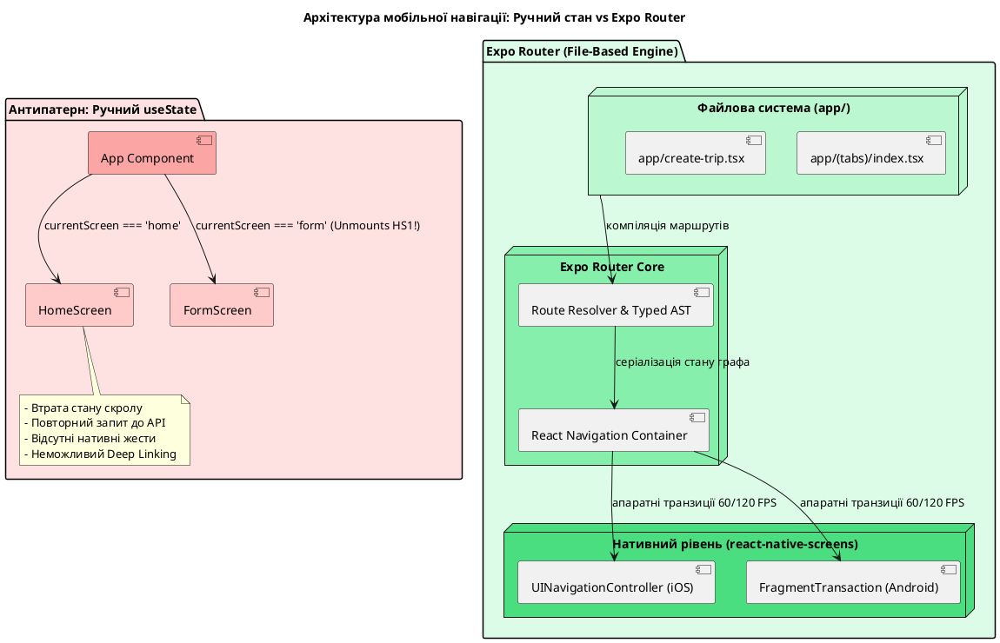
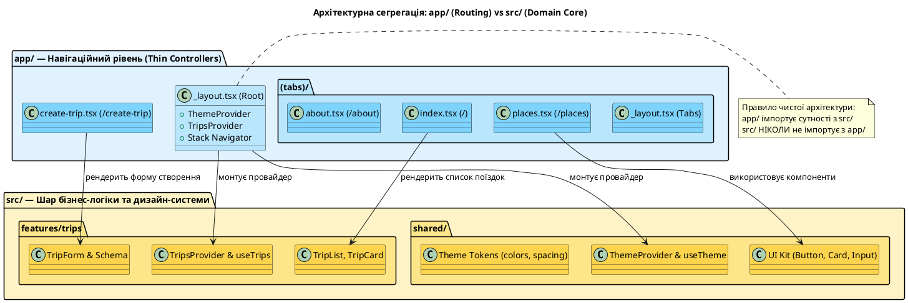
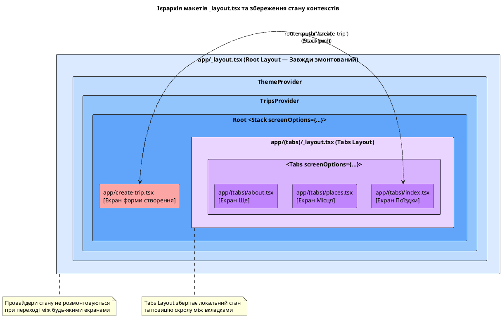
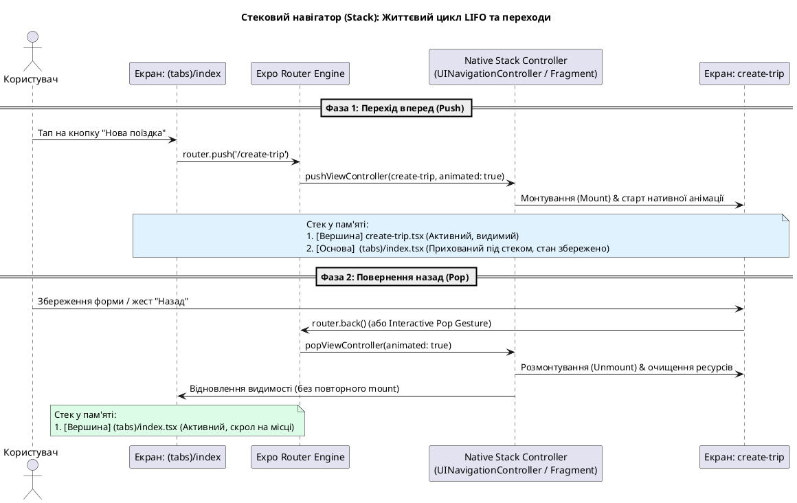
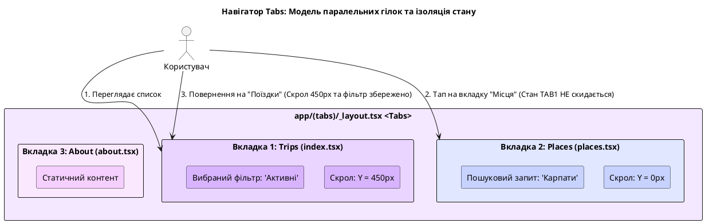
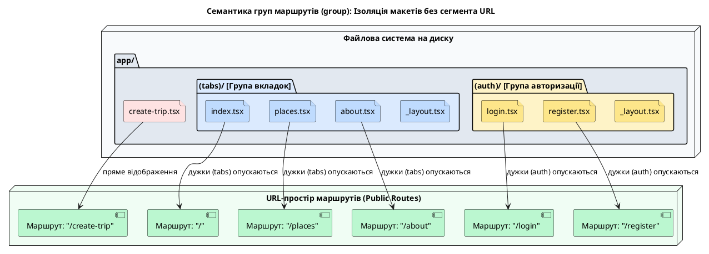
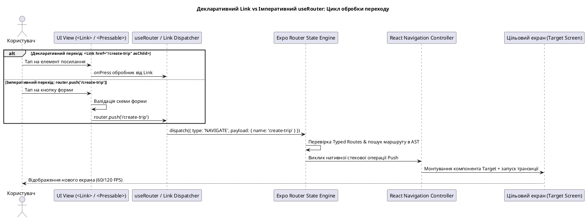
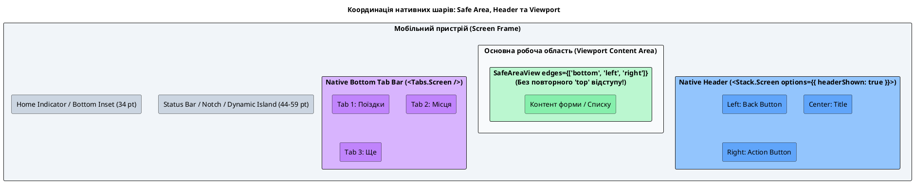
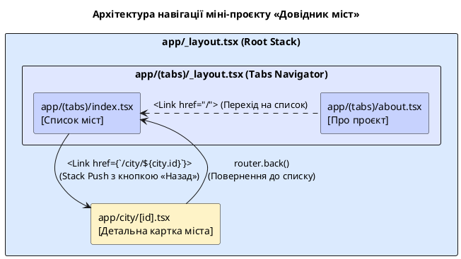

# Основи Expo Router

## Вступ: Навігація в мобільних додатках та файловий роутинг (File-Based Routing)

У процесі розвитку мобільного застосунку навантаження на інтерфейсний шар неминуче зростає. На початкових етапах розробки проєкт Nomad функціонував як монолітний одноекранний інтерфейс: спискове відображення поїздок, блок збережених локацій у заголовку списку та плаваюча кнопка переходу до форми створення. Попередній виніс форми створення поїздки в окремий модуль `create-trip.tsx` з активацією через виклик методу `router.push` продемонстрував базову можливість зміни стану екрана, проте залишив поза увагою принципи функціонування навігаційного рушія, життєвий цикл мобільних контейнерів та ієрархію глобальної оболонки застосунку.

Реальний мобільний продукт ніколи не обмежується одним екраном. У ньому завжди є десятки різних екранів: новинні стрічки, детальні картки, панелі налаштувань, пошук, авторизація та модальні діалоги. Взаємодія з користувачем на мобільних пристроях ґрунтується на зрозумілих та звичних патернах:

1. **Нижні навігаційні вкладки (Bottom Tabs):** основний орієнтир застосунку для швидкого доступу до головних розділів (як у банківських додатках чи соцмережах).
2. **Ієрархічна стопка екранів (Navigation Stack):** організовує переходи углиб контенту за принципом «від списку до деталей» зі збереженням історії переходів та можливістю повернення назад свайпом чи кнопкою «Назад».
3. **Коректна обробка системних жестів та кнопок:** підтримка апаратної кнопки повернення на Android та жестової смуги навігації на iOS.

**Expo Router** — це спеціалізований фреймворк маршрутизації та навігації для екосистеми Expo та React Native, який використовує **файловий роутинг (File-Based Routing)**. Головна ідея запозичена з сучасних веб-фреймворків (зокрема Next.js App Router): структура файлів і папок усередині каталогу `app/` автоматично перетворюється на навігаційні маршрути (*Routes*) та контейнери застосунку.

### Навчальні цілі розділу:

- Опанувати концепцію **File-Based Routing** у нативному мобільному середовищі та засвоїти правила архітектурного розмежування між каталогом маршрутів `app/` та шаром бізнес-логіки й компонентів `src/`.
- Дослідити архітектуру макетів **`_layout.tsx`** як постійної контекстної оболонки, що інкапсулює спільні провайдери станів (*State Providers*) та нативні навігатори.
- Сконфігурувати базові навігаційні контейнери: паралельні вкладки **Tabs** та ієрархічну стопку **Stack**.
- Засвоїти механізми переходами між маршрутами за допомогою декларативного компонента **`Link`** (з підтримкою властивості `asChild`) та імперативного хука **`useRouter`** (методи `push`, `back`, `replace`, `canGoBack`).
- Зрозуміти семантику ізольованих груп маршрутів у круглих дужках **`(group)`**, призначення файлів **`index.tsx`**, а також правила конфігурації нативного заголовка (*Header*) та безпечних зон (*Safe Area Insets*).
- Активувати та інтегрувати механізм статичної типізації маршрутів **Typed Routes** для компіляційної верифікації шляхів навігації.
- Розробити автономний навчальний міні-проєкт «Довідник міст» та здійснити рефакторинг проєкту **Nomad** на повноцінну навігаційну структуру з вкладками та модальною стопкою.

::note
**Головний принцип:** Екран в Expo Router — це не просто випадковий компонент, який рендериться за умовою в `switch` або тернарному операторі. Це **експортований за замовчуванням React-компонент у файлі всередині каталогу `app/`**, який маршрутизатор перетворює на повноцінний вузол графа навігації. Файл `_layout.tsx` формує спільний каркас навколо дочірніх сегментів, тоді як навігатори `Stack` і `Tabs` визначають структуру та анімацію переходу між цими екранами.
::

::tip
**Особливості тестування навігації.** Інтерактивні прев'ю на веб-сайті (`::react-native-preview`) виконуються в ізольованому пісочничному оточенні без підключення нативного рушія Expo Router. Тому повноцінну перевірку переходів, стеків, жестів та збереження станів слід виконувати безпосередньо в середовищі **Expo Go** або нативному симуляторі/емуляторі. У тексті статті наведено вичерпні архітектурні схеми, код та аналітичні розбори.
::

Вихідний код репозиторію проєкту Nomad: [github.com/arakviel/nomad](https://github.com/arakviel/nomad).

---

## Архітектурна необхідність виділеної системи навігації

У традиційній веб-розробці зміна представлення тісно пов'язана з адресним рядком браузера (URL), об'єктом `window.history` та подіями `popstate`. На мобільних пристроях адресний рядок відсутній, проте задачі залишаються тими самими: передбачувано відобразити потрібний екран, зберегти історію переходів та надати користувачеві можливість повернутися назад без втрати стану даних.

Початківці часто намагаються реалізувати перемикання екранів за допомогою локального реактивного стану:

```tsx
const [currentScreen, setCurrentScreen] = useState<'home' | 'form'>('home');

if (currentScreen === 'form') {
  return <TripFormScreen onBack={() => setCurrentScreen('home')} />;
}

return <HomeScreen onOpenForm={() => setCurrentScreen('form')} />;
```

Такий спрощений підхід, хоча й працює для примітивних демонстрацій із двох екранів, виявляється абсолютно нежиттєздатним у масштабованих архітектурах через низку критичних проблем:

1. **Руйнування життєвого циклу компонентів і втрата стану:** Умовний рендеринг через тернарний оператор або `if` повністю розмонтовує попередній компонент (`HomeScreen`). При поверненні назад дерево монтується заново, що призводить до втрати положення скролу у списках, скидання тимчасових фільтрів і повторного виконання мережевих запитів.
2. **Відсутність підтримки складних навігаційних ієрархій:** Спроба вручну синхронізувати вкладені стопки переходів (наприклад, `Home -> Details -> Edit -> Confirm`), незалежні паралельні вкладки та модальні діалоги призводить до експоненційного ускладнення коду (*State Explosion*) та появи важковловимих багів.
3. **Повна втрата нативних анімацій та системних жестів:** Ручне перемикання екранів не використовує апаратні транзиції операційної системи. Користувач втрачає плавний інерційний свайп повернення на iOS (*Interactive Pop Gesture*) та обробку системної кнопки «Назад» на Android.
4. **Неможливість обробки глибоких посилань (Deep Linking):** Застосунок не здатний коректно запуститися за зовнішнім URL-посиланням (наприклад, `nomad://trips/42` з push-повідомлення чи браузера), оскільки відсутній шар зіставлення рядкової адреси з вузлом дерева екранів.

```
       РУЧНЕ КЕРУВАННЯ СТАНОМ                          EXPO ROUTER (FILE-BASED)
+------------------------------------+       +-----------------------------------------+
|  useState('home' | 'form')         |       |  app/                                   |
|  - Повна втрата стану при unmount  |  vs   |  ├── (tabs)/index.tsx  (Маршрут "/")    |
|  - Відсутні нативні жести/свайпи   |       |  └── create-trip.tsx   (Маршрут "/...") |
|  - Неможливий Deep Linking         |       +-----------------------------------------+
|  - Складний спагеті-код переходів  |       | • Нативна оптимізація пам'яті (Screens) |
+------------------------------------+       | • Збереження стану та позиції скролу    |
                                             | • Нативна підтримка Deep Linking та URL |
                                             +-----------------------------------------+
```

::plant-uml



::

### Рівні абстракції: React Navigation та Expo Router

Для вирішення цих викликів у спільноті React Native було створено бібліотеку **React Navigation** — де-факто стандарт навігації, який забезпечує низькорівневі нативні примітиви (стековий навігатор на базі `react-native-screens`, нижні панелі вкладок, бокові панелі Drawer).

**Expo Router** побудований як надбудова **поверх React Navigation**. Він усуває необхідність громіздкої імперативної конфігурації екранів через велетенські JS-об'єкти чи вкладені JSX-структури (`<NavigationContainer>`, `<Stack.Navigator>`, `<Stack.Screen>`), замінюючи її декларативним зіставленням файлової системи. Фреймворк автоматично генерує граф переходів, серіалізує стан навігації в URL-подібну структуру та надає повну підтримку універсального рендерингу (iOS, Android, Web).

У рамках нашого курсу основним стандартом обрано саме **Expo Router**, оскільки проєкт Nomad побудований на сучасному стеку Expo, а файлова маршрутизація є офіційним вектором розвитку всієї екосистеми React Native.

---

## Концептуальний місток: Веб-орієнтований React проти Expo Router

Для спеціалістів, які мають досвід роботи з веб-версією React (зокрема з React Router DOM або Next.js), концепції Expo Router будуть інтуїтивно близькими. Проте через специфіку функціонування мобільних операційних систем існують важливі архітектурні відмінності:

| Концепція у Web (Next.js / React Router) | Відповідник у Expo Router | Інженерний коментар та семантика |
| :--- | :--- | :--- |
| Браузерний URL `/about` | Маршрут `/about` (файл `app/about.tsx`) | Шлях у файловій системі визначає точку входу в застосунок. |
| Каталог сторінок `app/` у Next.js | Каталог `app/` у корені проєкту | Концепція File-Based Routing: файли автоматично стають маршрутами. |
| Тег `<a href="...">` або `<Link>` з Next.js | Компонент `<Link href="...">` з `expo-router` | Декларативний механізм навігації з підтримкою доступності (Accessibility). |
| Метод `router.push('/path')` | Метод `router.push('/path')` з `useRouter()` | Імперативний перехід, що виконується в обробниках подій та колбеках. |
| Файл макета `layout.tsx` (Next.js) | Файл макета `_layout.tsx` | Компонентна оболонка сегмента; зберігає стан під час перемикання дітей. |
| Вкладені макети (Nested Layouts) | Вкладені `_layout.tsx` у піддиректоріях | Дозволяє комбінувати різні типи навігаторів (наприклад, Tabs усередині Stack). |
| Query/Path-параметри URL | Хуки `useLocalSearchParams` та `useGlobalSearchParams` | Передача динамічних аргументів між екранами. |

::warning
**Критичне застереження.** Пакет `react-router-dom`, призначений для веб-браузерів, **категорично не використовується** в розробці під React Native. Веб-роутери маніпулюють DOM-деревом (`window.history`, `document.location`), які відсутні в нативному середовищі. Навігація в мобільних додатках здійснюється через пакет `expo-router`, який транслює дії в нативні команди мобільної ОС через бібліотеку `react-native-screens`.
::

### Переваги підходу «Файл як маршрут» (File-as-a-Route)

Організація структури застосунку на основі файлового роутингу надає суттєві переваги для масштабування кодової бази та командної взаємодії:

1. **Самодокументована архітектура:** Дерево каталогів усередині `app/` є наочною ментальною картою застосунку. Будь-який розробник одразу розуміє, які екрани існують у продукті та як вони згруповані.
2. **Відсутність централізованого монолітного реєстру:** Зникає потреба підтримувати велетенські файли конфігурації навігації, де вручну реєструються сотні екранів та зв'язків між ними (що в командах часто ставало джерелом конфліктів злиття у системі контролю версій Git).
3. **Природна уніфікація Deep Linking:** Оскільки кожен екран автоматично прив'язаний до статичного або динамічного рядкового шляху, конфігурація вхідних посилань (наприклад, `myapp://trip/123`) починає працювати автоматично без ручного написання складних регулярних виразів для парсингу URL.

Водночас необхідно враховувати базові правила файлового роутера:
- Не кожен файл у директорії `app/` є кінцевим екраном: файли з префіксом підкреслення (зокрема `_layout.tsx`) виконують службову роль макетів-оболонок.
- Назви директорій у круглих дужках `(group)` є логічними групами й не створюють сегментів у фінальному URL.
- Розробник зобов'язаний явно вказувати тип навігаційного контейнера для кожного рівня (Stack чи Tabs) та конфігурувати заголовки й безпечні зони.

{.diagram-img}

---

## Фізична організація проєкту: Сегрегація директорій `app/` та `src/`

У структурі архітектури нашого навчального курсу встановлено суворе розділення відповідальностей між двома ключовими каталогами:

```
                            АРХІТЕКТУРНА СЕГРЕГАЦІЯ
+---------------------------------------+   +---------------------------------------+
|                 app/                  |   |                 src/                  |
|        (Навігаційний рівень)          |   |       (Рівень бізнес-логіки)          |
+---------------------------------------+   +---------------------------------------+
| • Маршрутизація та точки входу        |   | • Доменні сутності (Features)         |
| • Конфігурація нативних макетів       |   | • UI-компоненти та дизайн-система     |
| • _layout.tsx (Stack, Tabs)           |   | • Стан, хуки, схеми валідації         |
| • «Тонкі контролери» (Thin Screens)   |   | • Чисті сервіси та утиліти            |
+---------------------------------------+   +---------------------------------------+
                   \                                     /
                    \--- Імпортує необхідні сутності ---/
```

- **Директорія `app/` — шар навігації та макетів:**
  Містить виключно файли маршрутів і файли макетів (`_layout.tsx`). Компоненти, розташовані тут, повинні залишатися **«тонкими екранами» (Thin Screens)**. Їхнє єдине завдання — отримати навігаційні параметри (наприклад, через хук `useLocalSearchParams`), підключити відповідні доменні хуки або сервіси та змонтувати готові складені компоненти з шару `src/`.
- **Директорія `src/` — шар бізнес-логіки, доменних фіч та дизайн-системи:**
  Містить ізольовані модулі функціоналу (`features/trips`), спільні UI-компоненти (`shared/ui`), конфігурацію теми (`shared/theme`) та клієнти взаємодії з даними. Цей шар нічого не знає про файлову структуру `app/`, що забезпечує високий рівень повторного використання коду та спрощує модульне тестування.

Якщо розміщувати важку бізнес-логіку, стан форм чи складні алгоритми безпосередньо у файлах `app/`, екрани швидко перетворюються на важкі антипатерні модулі (*God Objects*), які неможливо повторно перевикористати або протестувати в ізоляції.

Структура каталогу проєкту Nomad після впровадження повноцінної навігації:

```text
app/
  _layout.tsx           ← Кореневий макет: глобальні провайдери + головний Stack
  (tabs)/
    _layout.tsx         ← Навігатор нижніх вкладок (Tabs Layout)
    index.tsx           ← Маршрут "/" (Головна вкладка «Поїздки»)
    places.tsx          ← Маршрут "/places" (Вкладка «Місця»)
    about.tsx           ← Маршрут "/about" (Вкладка «Ще»)
  create-trip.tsx       ← Маршрут "/create-trip" (Екран у Stack поверх вкладок)
src/
  features/trips/       ← Доменна бізнес-логіка поїздок (моделі, форми, картки)
  shared/               ← Спільні компоненти UI, токени теми та утиліти
```

::plant-uml



::

---

## Семантичні одиниці: Маршрут (Route) та Екран (Screen)

Для побудови коректної ментальної моделі необхідно чітко розрізняти дві базові абстракції:

1. **Маршрут (Route):**
   Це абстрактна логічна адреса (ідентифікатор) у навіційній системі застосунку, наприклад `/`, `/places` або `/create-trip`. Маршрут визначає, *куди* спрямовується навігаційний потік і як цей стан серіалізується для механізмів Deep Linking або історії переходів.
2. **Екран (Screen):**
   Це конкретний візуальний React-компонент, який монтується та відмальовується у вікні перегляду, коли відповідний маршрут стає активним. У системі Expo Router екран завжди декларується як експорт за замовчуванням (`export default function Screen()`) із відповідного файлу в `app/`.

Хоча на мобільних платформах користувач не взаємодіє з текстовим рядком URL напряму (на відміну від веб-версії, де URL синхронізується з адресним рядком браузера), уся навігаційна підсистема функціонує за тими самими принципами просторової адресації.

---

## `_layout.tsx` — Декларативна оболонка та межа сегмента

Файл з конвенційною назвою **`_layout.tsx`** є ключовим будівельним блоком Expo Router. Він розміщується в корені директорії `app/` або в будь-якій її піддиректорії.

На відміну від звичайних файлів, `_layout.tsx` **ніколи не стає самостійною кінцевою сторінкою в навігації**. Це постійний компонент-обгортка (*Layout Wrapper*), який обрамляє всі маршрути поточної директорії та її підкаталогів.

```
                           АРХІТЕКТУРА МАКЕТІВ
+-------------------------------------------------------------------------+
| _layout.tsx (Кореневий макет: ThemeProvider + TripsProvider + Stack)    |
|                                                                         |
|  +-------------------------------------------------------------------+  |
|  | (tabs)/_layout.tsx (Вкладений макет: Tabs Navigator)              |  |
|  |                                                                   |  |
|  |  [index.tsx (Поїздки)]  [places.tsx (Місця)]  [about.tsx (Ще)]    |  |
|  +-------------------------------------------------------------------+  |
|                                                                         |
|  +-------------------------------------------------------------------+  |
|  | create-trip.tsx (Stack Screen поверх панелі вкладок)              |  |
|  +-------------------------------------------------------------------+  |
+-------------------------------------------------------------------------+
```

### Основні інженерні обов'язки кореневого макета (`app/_layout.tsx`):

1. **Ініціалізація глобальних провайдерів стану:** Підключення контекстів теми (`ThemeProvider`), глобальних доменних сховищ (`TripsProvider`), клієнтів кешування даних чи авторизації.
2. **Конфігурація кореневого навігаційного контейнера:** Декларація типу головного навігатора застосунку (найчастіше це кореневий `Stack`, який керує переходами між основними розділами та модальними вікнами).
3. **Управління системними елементами ОС:** Конфігурація нативного статус-бара (`StatusBar`), глобальних фонових кольорів вікна та обробка нативних екранів завантаження (*Splash Screen*).

### Життєвий цикл макета та збереження стану

Найважливіша перевага `_layout.tsx` полягає в його персистентності. Коли користувач здійснює навігацію між дочірніми маршрутами (наприклад, переходить із головного екрана `/` на форму `/create-trip`), сам компонент `_layout.tsx` **не розмонтовується**.

Це гарантує, що:
- Усі вкладені React-провайдери зберігають свій актуальний стан у пам'яті (тема оформлення, закешовані списки та дані авторизації не ініціалізуються повторно).
- Не відбувається зайвих повторних рендерів глобальних підсистем застосунку.

{.diagram-img}

::plant-uml



::

::field-group

::field{name="_layout.tsx" type="спеціальний файл-макет"}
Декларативна оболонка сегмента файлової системи. Префікс нижнього підкреслення є конвенцією Expo Router, що виключає файл зі списку доступних публічних маршрутів. Тіло компонента зазвичай повертає навігатор (`<Stack />` або `<Tabs />`), передаючи спільні опції всім дочірнім екранам.
::

::field{name="Slot" type="компонент виведення дочірніх маршрутів"}
Базовий примітив Expo Router (`import { Slot } from 'expo-router'`), що слугує геометричним місцем рендерингу активного дочірнього маршруту сегмента, якщо розробник будує кастомний макет без використання вбудованих нативних контейнерів Stack або Tabs.
::

::field{name="screenOptions" type="об’єкт або функція конфігурації"}
Універсальний словник параметрів за замовчуванням для всіх екранів даного навігатора. Дозволяє централізовано визначити видимість заголовків (`headerShown`), палітру кольорів навігаційної смуги, анімаційні переходи та нативні стилі тексту.
::

::

### Приклад конфігурації кореневого макета

У наведеному лістингу продемонстровано архітектурний патерн правильного розташування глобальних провайдерів навколо стекового навігатора:

```tsx
import { Stack } from 'expo-router';
import { StatusBar } from 'expo-status-bar';
import { TripsProvider } from '@/features/trips';
import { ThemeProvider, useTheme } from '@/shared/theme';

function RootNavigator() {
  const { colors, scheme } = useTheme();

  return (
    <>
      <StatusBar style={scheme === 'dark' ? 'light' : 'dark'} />
      <Stack
        screenOptions={{
          headerStyle: { backgroundColor: colors.background },
          headerTintColor: colors.primary,
          headerTitleStyle: { color: colors.text, fontWeight: '600' },
          contentStyle: { backgroundColor: colors.background },
        }}
      >
        {/* Група вкладок: заголовок кореневого стека приховується */}
        <Stack.Screen name="(tabs)" options={{ headerShown: false }} />
        {/* Окремий екран форми: заголовок стека активний з кнопкою повернення */}
        <Stack.Screen
          name="create-trip"
          options={{
            title: 'Нова поїздка',
            headerShown: true,
            presentation: 'card',
            headerBackTitle: 'Назад',
          }}
        />
      </Stack>
    </>
  );
}

export default function RootLayout() {
  return (
    <ThemeProvider>
      <TripsProvider>
        <RootNavigator />
      </TripsProvider>
    </ThemeProvider>
  );
}
```

Зверніть увагу: провайдери `ThemeProvider` та `TripsProvider` обгортають компонент `RootNavigator`. Завдяки цьому дочірні екрани обох гілок (як вкладки `(tabs)`, так і окрема форма `create-trip`) мають однаковий доступ до контекстів через призначені хуки `useTheme()` та `useTrips()`.

---

## Конвенції файлової структури та маршрутизація `index`

Expo Router використовує строгі конвенції зіставлення шляхів файлів із маршрутами застосунку:

| Шлях до файлу на диску | Згенерований маршрут у системі | Інженерне призначення |
| :--- | :--- | :--- |
| `app/index.tsx` | `/` | Головний стартовий екран кореневого рівня. |
| `app/places.tsx` | `/places` | Окремий статичний екран першого рівня. |
| `app/create-trip.tsx` | `/create-trip` | Окремий екран створення поїздки. |
| `app/(tabs)/index.tsx` | `/` | Головний екран групи `(tabs)`, що відповідає кореневому URL `/`. |
| `app/(tabs)/places.tsx` | `/places` | Екран списку місць усередині групи вкладок. |
| `app/city/[id].tsx` | `/city/:id` (напр. `/city/kyiv`) | Динамічний параметризований маршрут. |

### Семантична роль файлів `index.tsx`

Файл з назвою **`index.tsx`** завжди позначає кореневий (дефолтний) маршрут того каталогу, в якому він розташований. Якщо такий файл знаходиться безпосередньо в `app/index.tsx` або всередині групи `app/(tabs)/index.tsx`, він стає точкою входу для базового шляху `/`.

### Рекомендації щодо найменування файлів:
- Для назв файлів слід використовувати виключно стиль **kebab-case** (наприклад, `create-trip.tsx`, `user-profile.tsx`), оскільки імена файлів безпосередньо формують сегменти URL.
- Категорично заборонено використовувати пробіли, службові символи та символи нелатинських абеток (кирилицю) в іменах файлів маршрутів.

---

## Навігатор Stack: Модель стекової стопки екранів (LIFO)

**Stack-навігатор (Navigation Stack)** моделює поведінку просторової стопки карток за класичним принципом інформатики **LIFO (Last In, First Out — останнім прийшов, першим пішов)**. 

Коли користувач ініціює перехід до нового екрана, новий інтерфейсний шар «наштовхується» (**push**) на вершину стека, повністю або частково перекриваючи попередній. При поверненні назад верхній екран «знімається» зі стека (**pop**), відновлюючи видимість попереднього представлення разом із його незмінним станом пам'яті.

```
       ОПЕРАЦІЯ PUSH (router.push)                ОПЕРАЦІЯ POP (router.back)
+------------------------------------+       +------------------------------------+
|  [Вершина] create-trip.tsx         |  -->  |  [Знято зі стека і знищено]        |
+------------------------------------+       +------------------------------------+
|  [Основа]  (tabs) / index.tsx      |  <--  |  [Відновлено стан] (tabs)/index.tsx|
+------------------------------------+       +------------------------------------+
```

::plant-uml



::

### Типові сценарії застосування Stack:
- Ієрархічний перехід «Список сутностей → Детальна інформація про сутність».
- Відкриття допоміжних форм введення даних або майстрів налаштування (*Wizards*).
- Заглиблення в дерево налаштувань («Налаштування → Безпека → Зміна пароля»).

На рівні операційної системи Stack-навігатор Expo Router транслюється у високопродуктивні нативні контролери: `UINavigationController` в iOS та відповідні фрагментні транзакції `FragmentTransaction` в AndroidX. Це гарантує нативну швидкість анімацій зі швидкістю 60/120 кадрів на секунду та мінімальне навантаження на головний потік JavaScript.

{.diagram-img}

::field-group

::field{name="Stack" type="компонент навігатора"}
Контейнер стекової навігації (`import { Stack } from 'expo-router'`). Дочірні файли поточної директорії автоматично реєструються як доступні екрани цього стека.
::

::field{name="Stack.Screen" type="компонент конфігурації екрана"}
Декларативний елемент налаштування конкретного маршруту в стеку. Атрибут `name` повинен точно відповідати імені файлу маршруту (без розширення `.tsx`). Властивість `options` дозволяє задати параметри відображення заголовка, анімацій та кнопок.
::

::field{name="options.presentation" type="'card' | 'modal' | 'transparentModal'"}
Визначає візуальну модальність появи екрана. Значення `'card'` (стандартне) виконує класичний горизонтальний зсув картки праворуч. Значення `'modal'` транслює екран у модальне вікно, що виїжджає знизу екрана (глибше розглядається в наступних розділах).
::

::field{name="options.headerShown" type="boolean"}
Визначає видимість нативної смуги заголовка (`UINavigationBar` / `Toolbar`). Якщо екран використовує кастомний заголовок, зверстаний засобами React Native, цей параметр встановлюють у `false`.
::

::field{name="options.headerBackTitle" type="string (iOS)"}
Конфігурує текстовий підпис біля стрілки повернення назад на платформі iOS (наприклад, «Назад» або назву попереднього екрана).
::

::

### Механіка обробки системного повернення «Назад»

Нативна інтеграція Stack-навігатора забезпечує узгоджену поведінку з платформовими гайдлайнами:
- **iOS:** Підтримується плавний інерційний жест повернення змахуванням від лівого краю екрана (*Interactive Swipe-to-Back*) та нативна кнопка повернення у смузі заголовка.
- **Android:** Навігатор автоматично перехоплює натискання системної апаратної/програмної кнопки «Назад» або сучасний жест від краю екрана (*Back Gesture*), коректно викликаючи операцію `pop` для активного стека.

Програмний виклик методу `router.back()` ініціює аналогічну операцію: перевіряє історію переходів і повертає користувача на один рівень назад.

---

## Навігатор Tabs: Модель паралельних розділів інтерфейсу

**Навігатор вкладок (Bottom Tabs Navigator)** організовує кілька рівноправних функціональних доменів застосунку, перемикання між якими здійснюється через фіксовану панель у нижній частині дисплея.

На відміну від Stack-навігатора, перемикання між вкладками **не створює лінійної стопки переходів**. Кожна вкладка є автономним кореневим простором, який функціонує паралельно з іншими.

```
                     НАВІГАЦІЙНЕ ДЕРЕВО ВКЛАДОК
               +------------------------------------+
               |           Tabs Navigator           |
               +------------------------------------+
                 /                |               \
                /                 |                \
    +-----------------+  +-----------------+  +-----------------+
    | Вкладка:        |  | Вкладка:        |  | Вкладка:        |
    | «Поїздки» (/)   |  | «Місця» (/places)| | «Ще» (/about)   |
    +-----------------+  +-----------------+  +-----------------+
```

::plant-uml



::

### Ергономічні вимоги до панелі вкладок:
- Кожна вкладка повинна містити чітку семантичну векторну іконку та лаконічний підпис (до 10–12 символів).
- Активний стан вкладки зобов'язаний візуально виділятися акцентним кольором теми бренду (`tabBarActiveTintColor`).
- Перемикання вкладок повинно зберігати внутрішній стан кожної з них (наприклад, поточну позицію скролу списку поїздок при переході на вкладку місць і назад).

::field-group

::field{name="Tabs" type="компонент навігатора"}
Контейнер нижніх вкладок (`import { Tabs } from 'expo-router'`). Файл `_layout.tsx` усередині директорії вкладок експортує компонент, що повертає розмітку `<Tabs>…</Tabs>`.
::

::field{name="Tabs.Screen" type="компонент конфігурації вкладки"}
Реєструє окрему вкладку в навігаційній панелі. Параметр `name` задає ім'я цільового файлу маршруту (`index`, `places`, `about`).
::

::field{name="options.tabBarIcon" type="({ color, size, focused }) => ReactNode"}
Функція зворотного виклику, що повертає компонент векторної іконки. Expo Router автоматично передає в цю функцію обчислений колір (`color`) та рекомендований геометричний розмір (`size`) залежно від активності вкладки.
::

::field{name="options.tabBarActiveTintColor / tabBarInactiveTintColor" type="ColorValue"}
Кольори для активного та неактивного станів іконок і підписів вкладки. Повинні синхронізуватися з поточною темою оформлення (`colors.primary` та `colors.textSecondary`).
::

::field{name="options.tabBarStyle" type="ViewStyle"}
Об'єкт стилізації контейнера панелі вкладок (висота, колір фону, колір верхньої розділової межі). У темній темі вимагає обов'язкового налаштування для запобігання появі білої смуги на темному тлі контенту.
::

::

### Інтеграція векторних іконок (`@expo/vector-icons`)

Для оформлення таб-бару використовується бібліотека **`@expo/vector-icons`**, яка постачається з популярними наборами гліфів (Ionicons, MaterialIcons, Feather, FontAwesome):

```bash
npx expo install @expo/vector-icons
```

Приклад конфігурації іконки у вкладці:

```tsx
<Tabs.Screen
  name="places"
  options={{
    title: 'Місця',
    tabBarIcon: ({ color, size }) => (
      <Ionicons name="location-outline" size={size} color={color} />
    ),
  }}
/>
```

---

## Довідник `screenOptions`: Конфігурація заголовків, стека та вкладок

У проєктах на базі Expo Router конфігурація візуального відображення та поведінки екранів здійснюється за допомогою універсального словника параметрів **`screenOptions`** (на рівні макета-навігатора) або властивості **`options`** (на рівні конкретного компонента `<Stack.Screen />` чи `<Tabs.Screen />`).

Розуміння повної карти полів `screenOptions` критично важливе для побудови професійних інтерфейсів: від нативних розмитих шапок у стилі iOS до адаптивних таб-барів, системних статус-барів і модальних переходів.

### Ієрархія та каскад спадкування конфігурацій

Налаштування екранів застосовуються за трирівневою каскадною моделлю з чітким пріоритетом:

```
[Рівень 1: Глобальні screenOptions] ──▶ [Рівень 2: Декларативні options екрана] ──▶ [Рівень 3: Рантайм setOptions()]
   (Базові стилі для всього стека)           (Перевизначення для конкретного маршруту)         (Динамічні зміни під час роботи)
```

::plant-uml

```plantuml
@startuml
skinparam style plain
skinparam backgroundColor #ffffff

title "Анатомія screenOptions: Каскад спадкування та пріоритет перевизначення"

rectangle "Рівень 1: Глобальні налаштування навігатора\n<Stack screenOptions={{ ... }}> або <Tabs screenOptions={{ ... }}>" as L1 #dbeafe {
  note right
    - headerShown: true
    - headerStyle: { backgroundColor: colors.background }
    - headerTintColor: colors.primary
    - headerTitleStyle: { fontWeight: '600' }
    - contentStyle: { backgroundColor: colors.background }
  end note
}

rectangle "Рівень 2: Декларативне перевизначення для конкретного маршруту\n<Stack.Screen name='create-trip' options={{ ... }}>" as L2 #fef3c7 {
  note right
    - title: 'Нова поїздка'
    - presentation: 'modal'
    - headerBackTitle: 'Назад'
    - headerRight: () => <SaveButton />
  end note
}

rectangle "Рівень 3: Динамічне виконання під час рендеру\nnavigation.setOptions({ title: item.title, headerRight: ... })" as L3 #dcfce7 {
  note right
    - Динамічний заголовок за даними з API
    - Активність кнопки збереження (disabled / enabled)
    - Найвищий пріоритет у рантаймі!
  end note
}

L1 -down-> L2 : Спадкується за замовчуванням
L2 -down-> L3 : Перевизначається динамічно
@enduml
```

::

---

### 1. Загальні параметри нативного заголовка (Header Screen Options)

Ці параметри доступні як у `Stack`, так і в `Tabs` та відповідають за рендеринг верхньої навігаційної смуги (`UINavigationBar` в iOS / `Toolbar` в Android):

::field-group

::field{name="headerShown" type="boolean" default="true"}
Визначає видимість нативної смуги заголовка. Встановлення значення `false` повністю приховує заголовок операційної системи, передаючи керування верхньою частиною екрана верстці React Native або компоненту `SafeAreaView`.
::

::field{name="headerTitle" type="string | ((props: HeaderTitleProps) => ReactNode)" default="ім'я файлу"}
Текстовий заголовок екрана або функціональний React-компонент для рендерингу складного вмісту по центру шапки (наприклад, логотипу, перемикача сегментів чи аватара з підписом).
::

::field{name="headerTitleAlign" type="'left' | 'center'" default="iOS: 'center', Android: 'left'"}
Горизонтальне вирівнювання заголовка. За замовчуванням на платформі iOS заголовок центрується, тоді як на Android притискається до лівого краю.
::

::field{name="headerTitleStyle" type="TextStyle" default="нативний стиль ОС"}
Об'єкт стилізації тексту заголовка: `fontSize`, `fontWeight`, `fontFamily`, `color`, `letterSpacing`.
::

::field{name="headerTintColor" type="ColorValue" default="колір системного акценту"}
Колір відтінку інтерактивних елементів заголовка: іконки та тексту кнопки «Назад», іконок дій у `headerLeft`/`headerRight` та стандартного заголовка.
::

::field{name="headerStyle" type="ViewStyle" default="нативний фон"}
Стиль контейнера панелі заголовка: `backgroundColor`, `elevation` (Android), `shadowOpacity` (iOS), `borderBottomWidth`, `borderBottomColor`.
::

::field{name="headerTransparent" type="boolean" default="false"}
Вмикає абсолютне позиціонування заголовка поверх контенту екрана. При значенні `true` контент починається з верхнього краю дисплея `y = 0` (ідеально для екранів з фотообкладинками та мапами).
::

::field{name="headerBlurEffect" type="'regular' | 'prominent' | 'extraLight' | 'light' | 'dark' (iOS)"}
Вмикає нативне розмиття фону заголовка в стилі iOS (застосовується разом із напівпрозорим фоном або `headerTransparent: true`).
::

::field{name="headerBackground" type="() => ReactNode"}
Функція повернення кастомного фонового компонента для хедера (наприклад, `BlurView` з `expo-blur` або градієнта `LinearGradient`).
::

::field{name="headerLeft" type="((props: { tintColor?: string, canGoBack?: boolean, label?: string }) => ReactNode)"}
Кастомний React-компонент для лівої частини заголовка (замінює або доповнює стандартну кнопку повернення «Назад»).
::

::field{name="headerRight" type="((props: { tintColor?: string }) => ReactNode)"}
Кастомний React-компонент для правої частини заголовка (кнопки збереження, іконки фільтрів, шестерня налаштувань, аватар профілю).
::

::field{name="headerBackVisible" type="boolean" default="true"}
Чи показувати стандартну стрілку/кнопку повернення «Назад». Якщо встановити в `false`, кнопка приховується навіть за наявності попередніх екранів у стеку.
::

::field{name="headerBackTitle" type="string (iOS)" default="назва попереднього екрана"}
Текстовий підпис кнопки повернення на платформі iOS (наприклад, «Назад» або «Скасувати»).
::

::field{name="headerBackTitleVisible" type="boolean (iOS)" default="true"}
Чи відображати текстовий підпис біля стрілки «Назад» на iOS (якщо `false`, відображається лише шеврон без тексту).
::

::field{name="headerBackTitleStyle" type="TextStyle (iOS)"}
Стиль шрифту текстового підпису кнопки «Назад».
::

::field{name="headerShadowVisible" type="boolean" default="true"}
Чи відображати нативну тінь (iOS) або смугу розділення/elevation (Android) під заголовком. Значення `false` робить перехід між заголовком і тілом екрана безшовним.
::

::field{name="headerLargeTitle" type="boolean (iOS)" default="false"}
Вмикає підтримку великого заголовка в стилі iOS (Large Title), який плавно згортається у звичайний заголовок під час скролу списку.
::

::field{name="headerLargeTitleStyle" type="TextStyle (iOS)"}
Стиль тексту великого заголовка (наприклад, `fontSize: 34, fontWeight: '700'`).
::

::field{name="headerLargeTitleShadowVisible" type="boolean (iOS)" default="true"}
Видимість розділової тіні під великим заголовком.
::

::field{name="headerSearchBarOptions" type="HeaderSearchBarOptions (iOS/Android)"}
Інтегрує нативний рядок пошуку безпосередньо в заголовок (`UISearchController` на iOS / `SearchView` на Android). Приймає об'єкт з полями `placeholder`, `onChangeText`, `onSearchButtonPress`, `hideWhenScrolling`, `tintColor`.
::

::field{name="headerPressColorAndroid" type="string (Android)"}
Колір хвильового ефекту торкання (*Ripple effect*) для кнопок у заголовку на платформі Android.
::

::

---

### 2. Специфічні параметри стекового навігатора (Stack Screen Options)

Ці параметри конфігурують поведінку LIFO-стека, модальність вікон, системні статус-бари та анімації переходу нативного стека (`@react-navigation/native-stack`):

::field-group

::field{name="presentation" type="'card' | 'modal' | 'transparentModal' | 'containedModal' | 'fullScreenModal' | 'formSheet'" default="'card'"}
Тип візуального представлення та модальності екрана:
- `'card'` — стандартний екран стека з горизонтальним зсувом;
- `'modal'` — нативне модальне вікно (на iOS з'являється знизу з ефектом масштабування батьківського екрана);
- `'transparentModal'` — модальне вікно з прозорим фоном, крізь який видно попередній екран;
- `'fullScreenModal'` — модальне вікно, що перекриває весь дисплей включно зі статус-баром;
- `'formSheet'` — модальний лист у стилі iPad/планшетів.
::

::field{name="animation" type="'default' | 'fade' | 'fade_from_bottom' | 'flip' | 'simple_push' | 'slide_from_bottom' | 'slide_from_right' | 'slide_from_left' | 'none'" default="'default'"}
Тип нативної анімації переходу між екранами:
- `'slide_from_right'` — класичний перехід Android/iOS;
- `'slide_from_bottom'` — виїзд знизу;
- `'fade'` — плавне згасання/поява;
- `'none'` — миттєве перемикання без анімації.
::

::field{name="animationDuration" type="number (мс)"}
Тривалість нативної анімації переходу в мілісекундах.
::

::field{name="gestureEnabled" type="boolean" default="iOS: true, Android: false"}
Чи увімкнений нативний жест повернення змахуванням (*Interactive Pop Gesture* на iOS або свайп назад).
::

::field{name="gestureDirection" type="'horizontal' | 'vertical' | 'horizontal-inverted' | 'vertical-inverted'" default="'horizontal'"}
Напрямок жесту пальця для повернення на попередній екран.
::

::field{name="fullScreenGestureEnabled" type="boolean (iOS)" default="false"}
Дозволяє здійснювати жест повернення назад свайпом з **будь-якої точки дисплея**, а не лише від самого лівого краю.
::

::field{name="contentStyle" type="ViewStyle"}
Стиль кореневого нативного контейнера екрана (`backgroundColor: colors.background`). Запобігає білим спалахам під час анімацій у темній темі.
::

::field{name="autoHideHomeIndicator" type="boolean (iOS)" default="false"}
Автоматичне приховування смуги домашнього індикатора жестів на iOS без рамки.
::

::field{name="orientation" type="'default' | 'all' | 'portrait' | 'portrait_up' | 'portrait_down' | 'landscape' | 'landscape_left' | 'landscape_right'" default="'default'"}
Примусова орієнтація екрана (наприклад, блокування в портретному режимі для форми або альбомному для перегляду медіа).
::

::field{name="statusBarColor" type="string (Android)"}
Колір фону системного статус-бара на платформі Android.
::

::field{name="statusBarStyle" type="'auto' | 'inverted' | 'light' | 'dark'"}
Стиль іконок і тексту системного статус-бара (`'light'` — білий текст для темного фону, `'dark'` — темний текст для світлого).
::

::field{name="statusBarHidden" type="boolean" default="false"}
Чи приховувати системний статус-бар при переході на даний екран.
::

::field{name="statusBarTranslucent" type="boolean (Android)" default="false"}
Чи робити статус-бар напівпрозорим на Android, дозволяючи контенту рендеритися під ним.
::

::field{name="navigationBarColor" type="string (Android)"}
Колір фону нижньої системної панелі керування операційної системи Android.
::

::field{name="navigationBarHidden" type="boolean (Android)" default="false"}
Чи приховувати нижню системну навігаційну смугу на Android.
::

::field{name="freezeOnBlur" type="boolean" default="true"}
Оптимізація пам'яті через бібліотеку `react-freeze`: заморожує повторний рендеринг компонентів екрана, коли він перекритий іншим екраном стека.
::

::

---

### 3. Специфічні параметри панелі вкладок (Bottom Tabs Options)

Ці параметри керують конфігурацією нижньої панелі вкладок `<Tabs />` (`@react-navigation/bottom-tabs`):

::field-group

::field{name="tabBarShowLabel" type="boolean" default="true"}
Чи показувати текстові підписи під іконками вкладок. Якщо встановити у `false`, таб-бар відображатиме виключно іконки.
::

::field{name="tabBarLabel" type="string | ((props: { focused: boolean, color: string, position: LabelPosition, children: string }) => ReactNode)"}
Текстовий підпис вкладки або кастомна функція його рендерингу (перевизначає параметр `title` спеціально для нижньої панелі).
::

::field{name="tabBarLabelPosition" type="'below-icon' | 'beside-icon'" default="'below-icon'"}
Позиція текстового підпису: під іконкою чи праворуч від неї (актуально для планшетів та ландшафтного режиму).
::

::field{name="tabBarLabelStyle" type="TextStyle"}
Об'єкт стилізації тексту вкладки (`fontSize`, `fontWeight`, `fontFamily`).
::

::field{name="tabBarIcon" type="((props: { focused: boolean, color: string, size: number }) => ReactNode)"}
Функція зворотного виклику для рендерингу векторної іконки вкладки. Отримує обчислений стан фокусу `focused`, розмір `size` (зазвичай 24–28) та колір `color`.
::

::field{name="tabBarBadge" type="string | number"}
Бейдж над іконкою вкладки (наприклад, лічильник непрочитаних сповіщень `3` або точка `'!'`).
::

::field{name="tabBarBadgeStyle" type="TextStyle"}
Стиль бейджа сповіщень: `backgroundColor`, `color`, `fontSize`.
::

::field{name="tabBarActiveTintColor / tabBarInactiveTintColor" type="ColorValue"}
Колір іконки та тексту для активної (вибраної) та неактивної вкладки відповідно.
::

::field{name="tabBarActiveBackgroundColor / tabBarInactiveBackgroundColor" type="ColorValue"}
Колір фону окремого елемента вкладки в активному та неактивному станах.
::

::field{name="tabBarStyle" type="ViewStyle"}
Стиль контейнера нижньої панелі вкладок: `backgroundColor`, `height`, `borderTopColor`, `position: 'absolute'`, `bottom`, `borderRadius` (для створення плаваючого таб-бару з тінню).
::

::field{name="tabBarBackground" type="() => ReactNode"}
Кастомний фоновий компонент для панелі вкладок (наприклад, `BlurView` для напівпрозорого розмиття контенту під панеллю).
::

::field{name="tabBarButton" type="((props: BottomTabBarButtonProps) => ReactNode)"}
Кастомний React-компонент кнопки вкладки (використовується для створення опуклих центральних кнопок «+» або кастомних анімацій при тапі).
::

::field{name="tabBarItemStyle" type="ViewStyle"}
Стилізація контейнера кожного окремого елемента вкладки.
::

::field{name="tabBarHideOnKeyboard" type="boolean (Android)" default="false"}
Чи приховувати панель вкладок при відкритті екранної клавіатури, запобігаючи її накладанню на поля вводу.
::

::field{name="tabBarAccessibilityLabel" type="string"}
Текстовий підпис доступності для екранних дикторів VoiceOver / TalkBack.
::

::field{name="lazy" type="boolean" default="true"}
Ліниве монтування екранів вкладок: екран рендериться лише тоді, коли користувач вперше переходить на відповідну вкладку.
::

::field{name="unmountOnBlur" type="boolean" default="false"}
Чи повністю розмонтовувати екран при переході на іншу вкладку. За замовчуванням `false` (стан та скрол зберігаються); встановлення `true` очищує пам'ять та скидає стан екрана.
::

::

---

### 4. Динамічна функціональна форма `screenOptions` та хук `useNavigation`

Параметр `screenOptions` може приймати не лише статичний об'єкт, а й **функцію зворотного виклику**, яка отримує поточний маршрут (`route`) та об'єкт навігації (`navigation`):

```tsx
<Stack
  screenOptions={({ route }) => ({
    headerTitle: route.name === 'create-trip' ? 'Створення' : 'Nomad',
    headerShown: !route.name.startsWith('('),
  })}
/>
```

Крім того, будь-який компонент екрана всередині `app/` може динамічно оновлювати власні `options` під час роботи за допомогою хука **`useNavigation`**:

```tsx
import { useLayoutEffect } from 'react';
import { useNavigation } from 'expo-router';
import { Pressable, Text } from 'react-native';

export default function EditTripScreen() {
  const navigation = useNavigation();

  useLayoutEffect(() => {
    navigation.setOptions({
      title: 'Редагування поїздки',
      headerRight: () => (
        <Pressable onPress={() => alert('Збережено!')}>
          <Text style={{ color: '#2563eb', fontWeight: '600' }}>Готово</Text>
        </Pressable>
      ),
    });
  }, [navigation]);

  return null;
}
```

---

## Логічне групування маршрутів: Семантика директорій `(group)`

У структурі файлового роутера назви директорій, взяті в **круглі дужки**, наприклад **`app/(tabs)/`** або **`app/(auth)/`**, називаються **групами маршрутів (Route Groups)**.

Круглі дужки є спеціальним синтаксичним маркером, який повідомляє компілятору Expo Router: **ця директорія слугує виключно для логічної організації файлів та ізоляції макетів, але не додає власний сегмент до фінального рядка URL-маршруту**.

```
  ФАЙЛОВА СТРУКТУРА НА ДИСКУ                     РЕЗУЛЬТУЮЧИЙ МАРШРУТ (URL)
+-----------------------------------+       +-----------------------------------+
| app/                              |       |                                   |
| └── (tabs)/                       |  -->  | (Сегмент "(tabs)" ігнорується)   |
|     ├── index.tsx                 |  -->  | "/"                               |
|     ├── places.tsx                |  -->  | "/places"                         |
|     └── about.tsx                 |  -->  | "/about"                          |
+-----------------------------------+       +-----------------------------------+
```

::plant-uml



::

Якби директорія називалася без дужок `app/tabs/places.tsx`, фінальний маршрут набув би вигляду `/tabs/places`, що створювало б зайву вкладеність в адресації.

### Архітектурні сценарії використання груп:
1. **Ізоляція макетів (Layout Scoping):** Об'єднання екранів, які повинні мати спільну панель вкладок `Tabs`, окремо від екранів, які повинні відображатися на весь дисплей у `Stack`.
2. **Сегрегація авторизаційних потоків:** Створення груп `(auth)` (для екранів входу та реєстрації зі своїм макетом) та `(app)` (для основної робочої зони авторизованого користувача).
3. **Підтримка чистоти кореневого простору імен:** Дозволяє утримувати лаконічні та семантично чисті URL першого рівня (`/`, `/places`, `/profile`), одночасно структурувавши десятки файлів проєкту за окремими підкаталогами.

---

## Програмне та декларативне керування переходами: `Link` та `useRouter`

Expo Router надає два взаємодоповнюючі механізми для реалізації переходів між маршрутами: **декларативний** (компонент `Link`) та **імперативний** (хук `useRouter`).

{.diagram-img}

::plant-uml



::

### 1. Декларативний підхід: компонент `Link`

Компонент **`Link`** призначений для розміщення навігаційних посилань безпосередньо в JSX-дереві. Цей підхід подібний до веб-елемента гіперпосилання, забезпечуючи високу декларативність та повну підтримку систем доступності для екранних дикторів (*Screen Readers*).

Базовий синтаксис:

```tsx
import { Link } from 'expo-router';
import { Text } from 'react-native';

<Link href="/create-trip">
  <Text>Створити нову поїздку</Text>
</Link>
```

#### Властивість `asChild` та інтеграція з кастомними кнопками

За замовчуванням компонент `Link` огортає переданий дочірній текст власним текстовим представленням. Якщо розробнику необхідно надати посиланню вигляд складної кнопки (`Pressable`), картки або інтерактивного блоку зі стилями, застосовується властивість **`asChild`**.

Властивість `asChild` повідомляє `Link`, що він не повинен створювати додатковий DOM/Native-вузол у дереві, а натомість зобов'язаний передати всі необхідні навігаційні обробники подій дотику (`onPress`) та атрибути доступності безпосередньо своєму першому дочірньому елементу:

```tsx
import { Link } from 'expo-router';
import { Pressable, StyleSheet, Text } from 'react-native';

<Link href="/create-trip" asChild>
  <Pressable style={styles.actionButton}>
    <Text style={styles.actionButtonText}>Нова поїздка</Text>
  </Pressable>
</Link>
```

### 2. Імперативний підхід: хук `useRouter`

Хук **`useRouter()`** повертає інкапсульований об'єкт маршрутизатора для програмного виконання переходів. Імперативна навігація застосовується у випадках, коли перехід є наслідком певної логічної операції, а не простого тапу на посилання:
- Після успішної валідації та відправки форми на сервер.
- У відповідь на асинхронні події (завершення таймера, отримання push-повідомлення).
- За необхідності попередньої перевірки умов авторизації перед відкриттям екрана.

::field-group

::field{name="router.push(href)" type="метод: (href: Href) => void"}
Додає новий маршрут на вершину поточного навігаційного стека (`Stack.push`). Попередній екран залишається в історії, а на новому екрані автоматично стає доступною кнопка та жест повернення «Назад».
::

::field{name="router.replace(href)" type="метод: (href: Href) => void"}
Замінює поточний запис у навігаційній історії новим маршрутом. Використовується після успішної автентифікації або скидання пароля, щоб користувач не міг повернутися на екран вводу облікових даних через кнопку «Назад».
::

::field{name="router.back()" type="метод: () => void"}
Знімає верхній екран зі стека, здійснюючи повернення до попереднього стану навігаційної історії. Якщо форма створення зберегла поїздку, виклик `router.back()` закриває форму і показує оновлений список на вкладках.
::

::field{name="router.canGoBack()" type="метод: () => boolean"}
Повертає логічне значення `true`, якщо в стеку навігації є хоча б один попередній екран, до якого можна повернутися. Запобігає виклику `back()` в умовах порожнього стека (наприклад, при прямому холодному старті за Deep Link).
::

::field{name="router.dismiss(count?)" type="метод: (count?: number) => void"}
Закриває активне модальне вікно або знімає вказану кількість екранів із вершини стека.
::

::

Приклад застосування `useRouter` в обробнику подій:

```tsx
import { useRouter } from 'expo-router';

export function CreateTripController() {
  const router = useRouter();

  const handleFormComplete = async (tripData: unknown) => {
    // 1. Асинхронне збереження даних
    await saveTrip(tripData);
    
    // 2. Програмне повернення до попереднього списку
    if (router.canGoBack()) {
      router.back();
    } else {
      router.replace('/');
    }
  };

  return <TripForm onSubmit={handleFormComplete} />;
}
```

### Матриця вибору навігаційного інструменту

| Сценарій використання | Рекомендований інструмент | Обґрунтування вибору |
| :--- | :--- | :--- |
| Елемент меню, посилання в тексті, статична картка | `<Link href="...">` | Чітка декларативність у розмірці, підтримка Screen Reader. |
| Кнопка зі складним кастомним оформленням | `<Link href="..." asChild><Pressable>…</Link>` | Повне збереження кастомних стилів кнопки без спагеті-коду в `onPress`. |
| Колбек завершення відправки форми | `router.back()` | Перехід ініціюється тільки після успішного виконання асинхронного коду. |
| Завершення процедури авторизації / виходу | `router.replace('/...')` | Очищення навігаційного стека від екранів авторизації. |

---

## Структура посилань `href` та статичні шляхи

Параметр **`href`** приймає рядок або об'єкт, який точно вказує цільову адресу маршруту в навігаційному дереві застосунку.

На етапі вивчення базової маршрутизації використовуються **статичні шляхи**:
- `"/"` — кореневий маршрут (головний екран списку поїздок у групі `(tabs)`);
- `"/places"` — екран каталогу локацій;
- `"/about"` — інформаційний екран «Про додаток»;
- `"/create-trip"` — стековий екран створення поїздки.

Динамічні параметризовані сегменти (наприклад, `app/city/[id].tsx`, де `:id` виступає змінною частиною URL) детально досліджуються у наступних розділах курсу.

::warning
**Вимога існування маршруту.** Цільовий рядок `href` повинен гарантовано вказувати на існуючий фізичний файл у каталозі `app/`. Будь-яка механічна помилка в назві (наприклад, випадкова одруківка `href="/crate-trip"`) призведе до помилки часу виконання «Unmatched Route» (маршрут не знайдено) та відображення білого екрана або системного екрана 404.
::

---

## Статична типізація навігаційних шляхів (Typed Routes)

Для запобігання помилкам, пов'язаним з ручним введенням рядків `href`, Expo Router пропонує інструмент компіляційного контролю — **Typed Routes (Типізовані маршрути)**.

При активації цієї функції компілятор Expo Router автоматично сканує вміст директорії `app/` і на льоту генерує TypeScript-декларації глобального об'єкта шляхів, типізуючи пропси компонента `Link` та параметри методів `router.push`/`router.replace`.

### Активація типізації у файлі `app.json`:

```json
{
  "expo": {
    "name": "Nomad",
    "slug": "nomad",
    "experiments": {
      "typedRoutes": true
    }
  }
}
```

Після ввімкнення експериментального прапорця та перезапуску сервера розробки Metro (`npx expo start`), будь-яка спроба передати неіснуючий рядок шляху викличе помилку компілятора TypeScript ще до запуску застосунку на пристрої:

```tsx
// TypeScript видасть помилку: Argument of type '"/unknown-screen"' is not assignable to parameter of type 'Href'
router.push('/unknown-screen'); 

// Успішна валідація з підтримкою автодоповнення в IDE:
router.push('/create-trip');
```

---

## Координація нативних шарів: Header, SafeAreaView та розрахунок відступів

Під час конструювання мобільних інтерфейсів розробники регулярно стикаються з проблемою розрахунку верхніх і нижніх відступів під системні елементи пристрою: вирізи камер (*Notch*, *Dynamic Island*), рядок стану (*Status Bar*) та домашній індикатор жестів (*Home Indicator*).

Для ізоляції контенту від накладання на системні елементи використовується компонент `SafeAreaView` з бібліотеки `react-native-safe-area-context`. Проте при роботі з нативними навігаторами виникає специфічний конфлікт геометрії:

```
          КОНФЛІКТ ПОДВІЙНОГО ВІДСТУПУ (DOUBLE INSET BUG)
+-------------------------------------------------------------------------+
| [Status Bar / Notch / Dynamic Island]                                   |
| +---------------------------------------------------------------------+ |
| | Native Header (Вже містить власний безпечний відступ зверху)         | |
| +---------------------------------------------------------------------+ |
| | [ЗАЙВИЙ ВІДСТУП!] SafeAreaView edges={['top']} додає ще 44–59 pt     | |
| | +-----------------------------------------------------------------+ | |
| | | Контент форми (Невиправдано зміщений далеко вниз)               | | |
| | +-----------------------------------------------------------------+ | |
+-------------------------------------------------------------------------+
```

::plant-uml



::

### Правила координації геометрії:
1. **Екрани з активним нативним заголовком (`headerShown: true`):**
   Нативний компонент заголовка `Stack.Screen` автоматично резервує необхідний простір під системний статус-бар. Якщо контент такого екрана додатково обгорнути в `SafeAreaView` з верхнім відступом, виникає дефект **подвійного порожнього зазору** (*Double Padding Bug*). Тому на таких екранах верхній край SafeAreaView повинен бути вимкнений (`edges={['bottom', 'left', 'right']}`).
2. **Екрани з прихованим заголовком (`headerShown: false`):**
   На екранах вкладок `(tabs)`, де системний заголовок вимкнено на користь власної верстки назви розділу, верхній відступ повинен повністю компенсуватися компонентом `Screen` або `SafeAreaView` (`edges={['top']}`).

---

## Архітектурні антипатерни та типові помилки проєктування навігації

### 1. Емуляція навігації через локальний стан `useState('screen')`
- **Проблема:** Спроба будувати навігацію великого додатку через умовний рендеринг за станом створює спагеті-код, руйнує кешування екранів, блокує апаратні жести повернення та унеможливлює Deep Linking.
- **Рішення:** Використовувати виключно декларативні можливості Expo Router (`app/`, `Stack`, `Tabs`).

### 2. Концентрація складної бізнес-логіки у файлах маршрутів `app/`
- **Проблема:** Перетворення файлів у `app/` на монолітні компоненти обсягом понад 500 рядків унеможливлює повторне використання UI-блоків та ізольоване тестування.
- **Рішення:** Зберігати маршрути в `app/` максимально тонкими, делегуючи верстку та бізнес-логіку модулям із `src/features/` та `src/shared/`.

### 3. Плутанина між логічними групами `(group)` та фізичними сегментами URL
- **Проблема:** Очікування, що файл `app/(tabs)/places.tsx` буде доступний за маршрутом `/tabs/places`, і спроби звертатися до нього через цей некоректний шлях.
- **Рішення:** Пам'ятати, що круглі дужки в іменах директорій виключаються з фінального рядка URL. Правильний шлях — `/places`.

### 4. Виклик `push('/')` замість `back()` після успішного збереження форми
- **Проблема:** Якщо після збереження сутності у формі викликати `router.push('/')`, навігатор не повернеться на існуючий екран, а створить і наштовхне **новий дублікат головного екрана** на вершину стека. При спробі користувача натиснути системну кнопку «Назад» він не вийде із застосунку, а повернеться назад на щойно заповнену форму.
- **Рішення:** Після завершення роботи з формою завжди викликати `router.back()` (або `router.replace('/')`, якщо повернення в історію неприпустиме).

### 5. Ігнорування колірних токенів теми для навігаційних панелей
- **Проблема:** Застосунок підтримує темну тему, але панель вкладок залишається яскраво-білою за замовчуванням через відсутність конфігурації `tabBarStyle` та `headerStyle`.
- **Рішення:** Обов'язково зв'язувати параметри навігаторів (`tabBarStyle`, `headerStyle`, `tabBarActiveTintColor`) із семантичними токенами дизайн-системи (`colors.background`, `colors.border`, `colors.primary`).

### 6. Вкладення модальних форм створення безпосередньо в список вкладок
- **Проблема:** Додавання форми `create-trip` як четвертої постійної вкладки в нижню панель спотворює UX: форма не є рівноправним розділом застосунку, а таб-бар заважає введенню даних.
- **Рішення:** Організовувати форми як окремі екрани кореневого стека `Stack`, що відкриваються поверх панелі вкладок.

---

## Міні-проєкт: «Довідник міст»

### Мета

Окремий застосунок **поза** Nomad. Шлях **від А до Я**: команди, структура тек, **повний код кожного файлу**. Можна відтворити без домислів.

Сюжет:

1. Tabs: **Список** | **Про нас**.  
2. Список міст → тап → Stack-екран **деталей** із системною «назад».  
3. «Про нас» — текст + `Link` на список.

### Кінцева структура

```text
city-guide/
  package.json
  app.json
  app/
    _layout.tsx
    (tabs)/
      _layout.tsx
      index.tsx
      about.tsx
    city/
      [id].tsx
  src/
    data/
      cities.ts
```

::plant-uml



::

### Крок 1. Створити проєкт

::steps

### 1. Шаблон з tabs і Router

```bash
npx create-expo-app@latest city-guide -t tabs
cd city-guide
```

У `package.json` має бути `"main": "expo-router/entry"` (у шаблоні вже так).

### 2. Іконки (якщо TypeScript не знаходить пакет)

```bash
npx expo install @expo/vector-icons
```

### 3. Після підстановки всіх файлів

```bash
npx expo start
```

::

### Крок 2. Дані — `src/data/cities.ts`

Створіть теки `src/data/` і файл цілком:

::collapsible{title="Повний src/data/cities.ts — розгорнути"}

```ts
export type City = {
  id: string;
  name: string;
  region: string;
  population: string;
  description: string;
};

export const cities: City[] = [
  {
    id: 'kyiv',
    name: 'Київ',
    region: 'м. Київ',
    population: '≈ 2,9 млн',
    description:
      'Столиця України. Поділ, Хрещатик, правий і лівий береги Дніпра. Зручна відправна точка для подорожей центром країни.',
  },
  {
    id: 'lviv',
    name: 'Львів',
    region: 'Львівська область',
    population: '≈ 720 тис.',
    description:
      'Місто на заході з площею Ринок, кавою й щільною історичною забудовою. Добре для вікенду пішки.',
  },
  {
    id: 'odesa',
    name: 'Одеса',
    region: 'Одеська область',
    population: '≈ 1 млн',
    description:
      'Порт на Чорному морі. Дерибасівська, набережна, особливий гумор і кухня. Літній ритм міста інший, ніж узимку.',
  },
  {
    id: 'kharkiv',
    name: 'Харків',
    region: 'Харківська область',
    population: '≈ 1,4 млн',
    description:
      'Велике місто на сході. Університети, парки, широкі проспекти. Важливий культурний і промисловий осередок.',
  },
  {
    id: 'dnipro',
    name: 'Дніпро',
    region: 'Дніпропетровська область',
    population: '≈ 970 тис.',
    description:
      'Місто на річці Дніпро з довгою набережною й мостами. Зручний вузол між сходом і центром.',
  },
];

export function getCityById(id: string): City | undefined {
  return cities.find((c) => c.id === id);
}
```

::

### Крок 3. Корінь Stack — `app/_layout.tsx`

**Повністю замініть** вміст:

::collapsible{title="Повний app/_layout.tsx — розгорнути"}

```tsx
import { Stack } from 'expo-router';
import { StatusBar } from 'expo-status-bar';

export default function RootLayout() {
  return (
    <>
      <StatusBar style="dark" />
      <Stack
        screenOptions={{
          headerStyle: { backgroundColor: '#F8FAFC' },
          headerTintColor: '#2563EB',
          headerTitleStyle: { fontWeight: '600', color: '#0F172A' },
          contentStyle: { backgroundColor: '#F8FAFC' },
        }}
      >
        <Stack.Screen name="(tabs)" options={{ headerShown: false }} />
        <Stack.Screen
          name="city/[id]"
          options={{
            title: 'Про місто',
            headerBackTitle: 'Назад',
          }}
        />
      </Stack>
    </>
  );
}
```

::

### Крок 4. Tabs — `app/(tabs)/_layout.tsx`

**Повністю замініть** вміст. Лише дві вкладки: `index` і `about`.

::collapsible{title="Повний app/(tabs)/_layout.tsx — розгорнути"}

```tsx
import { Tabs } from 'expo-router';
import { Ionicons } from '@expo/vector-icons';

export default function TabsLayout() {
  return (
    <Tabs
      screenOptions={{
        headerShown: false,
        tabBarActiveTintColor: '#2563EB',
        tabBarInactiveTintColor: '#64748B',
        tabBarStyle: {
          backgroundColor: '#F8FAFC',
          borderTopColor: '#E2E8F0',
        },
        tabBarLabelStyle: { fontSize: 12, fontWeight: '600' },
      }}
    >
      <Tabs.Screen
        name="index"
        options={{
          title: 'Список',
          tabBarIcon: ({ color, size }) => (
            <Ionicons name="list-outline" size={size} color={color} />
          ),
        }}
      />
      <Tabs.Screen
        name="about"
        options={{
          title: 'Про нас',
          tabBarIcon: ({ color, size }) => (
            <Ionicons
              name="information-circle-outline"
              size={size}
              color={color}
            />
          ),
        }}
      />
    </Tabs>
  );
}
```

::

### Крок 5. Список — `app/(tabs)/index.tsx`

**Повністю замініть** вміст:

::collapsible{title="Повний app/(tabs)/index.tsx — розгорнути"}

```tsx
import { FlatList, Pressable, StyleSheet, Text, View } from 'react-native';
import { Link } from 'expo-router';
import { SafeAreaView } from 'react-native-safe-area-context';

import { cities } from '../../src/data/cities';

export default function CitiesListScreen() {
  return (
    <SafeAreaView style={styles.safe} edges={['top']}>
      <View style={styles.header}>
        <Text style={styles.title}>Довідник міст</Text>
        <Text style={styles.muted}>{cities.length} міст · тапніть картку</Text>
      </View>

      <FlatList
        data={cities}
        keyExtractor={(item) => item.id}
        contentContainerStyle={styles.list}
        ItemSeparatorComponent={() => <View style={{ height: 10 }} />}
        renderItem={({ item }) => (
          <Link href={`/city/${item.id}`} asChild>
            <Pressable style={styles.card}>
              <Text style={styles.cardTitle}>{item.name}</Text>
              <Text style={styles.cardMeta}>{item.region}</Text>
              <Text style={styles.linkHint}>Деталі →</Text>
            </Pressable>
          </Link>
        )}
      />
    </SafeAreaView>
  );
}

const styles = StyleSheet.create({
  safe: { flex: 1, backgroundColor: '#F8FAFC' },
  header: {
    paddingHorizontal: 16,
    paddingTop: 8,
    paddingBottom: 12,
    borderBottomWidth: 1,
    borderBottomColor: '#E2E8F0',
  },
  title: { fontSize: 24, fontWeight: '800', color: '#0F172A' },
  muted: { marginTop: 4, color: '#64748B', fontSize: 13 },
  list: { padding: 16, paddingBottom: 32 },
  card: {
    backgroundColor: '#FFFFFF',
    borderRadius: 12,
    borderWidth: 1,
    borderColor: '#E2E8F0',
    padding: 14,
  },
  cardTitle: { fontSize: 18, fontWeight: '700', color: '#0F172A' },
  cardMeta: { marginTop: 4, color: '#64748B', fontSize: 13 },
  linkHint: {
    marginTop: 10,
    color: '#2563EB',
    fontWeight: '700',
    fontSize: 13,
  },
});
```

::

### Крок 6. «Про нас» — `app/(tabs)/about.tsx`

**Повністю замініть** (або створіть, якщо не було):

::collapsible{title="Повний app/(tabs)/about.tsx — розгорнути"}

```tsx
import { ScrollView, StyleSheet, Text } from 'react-native';
import { Link } from 'expo-router';
import { SafeAreaView } from 'react-native-safe-area-context';

export default function AboutScreen() {
  return (
    <SafeAreaView style={styles.safe} edges={['top']}>
      <ScrollView contentContainerStyle={styles.body}>
        <Text style={styles.title}>Про довідник</Text>
        <Text style={styles.p}>
          Навчальний міні-проєкт курсу React Native: дві вкладки (Tabs) і екран
          деталей у Stack. Дані — локальний масив міст, без мережі.
        </Text>
        <Text style={styles.p}>
          Список відкриває маршрут /city/[id] через компонент Link. Кнопка
          «назад» на екрані деталей — системна (Stack header).
        </Text>
        <Link href="/" style={styles.link}>
          ← До списку міст
        </Link>
      </ScrollView>
    </SafeAreaView>
  );
}

const styles = StyleSheet.create({
  safe: { flex: 1, backgroundColor: '#F8FAFC' },
  body: { padding: 16, gap: 12, paddingBottom: 40 },
  title: { fontSize: 24, fontWeight: '800', color: '#0F172A' },
  p: { fontSize: 16, lineHeight: 24, color: '#334155' },
  link: {
    marginTop: 8,
    color: '#2563EB',
    fontWeight: '700',
    fontSize: 16,
  },
});
```

::

### Крок 7. Деталі — `app/city/[id].tsx`

Створіть теку `app/city/` і файл `[id].tsx` **цілком**:

::collapsible{title="Повний app/city/[id].tsx — розгорнути"}

```tsx
import { ScrollView, StyleSheet, Text, View } from 'react-native';
import { Stack, useLocalSearchParams } from 'expo-router';

import { getCityById } from '../../src/data/cities';

export default function CityDetailsScreen() {
  const { id } = useLocalSearchParams<{ id: string }>();
  const cityId = Array.isArray(id) ? id[0] : id;
  const city = cityId ? getCityById(cityId) : undefined;

  if (!city) {
    return (
      <View style={styles.center}>
        <Stack.Screen options={{ title: 'Не знайдено' }} />
        <Text style={styles.title}>Місто не знайдено</Text>
        <Text style={styles.muted}>Немає запису з id: {String(cityId)}</Text>
      </View>
    );
  }

  return (
    <ScrollView contentContainerStyle={styles.body}>
      <Stack.Screen options={{ title: city.name }} />
      <Text style={styles.title}>{city.name}</Text>
      <Text style={styles.meta}>{city.region}</Text>
      <Text style={styles.meta}>Населення: {city.population}</Text>
      <Text style={styles.p}>{city.description}</Text>
    </ScrollView>
  );
}

const styles = StyleSheet.create({
  body: { padding: 16, gap: 8, paddingBottom: 40 },
  center: {
    flex: 1,
    padding: 24,
    justifyContent: 'center',
    alignItems: 'center',
    backgroundColor: '#F8FAFC',
  },
  title: { fontSize: 26, fontWeight: '800', color: '#0F172A' },
  meta: { fontSize: 14, color: '#64748B', fontWeight: '600' },
  muted: { marginTop: 8, color: '#64748B' },
  p: { marginTop: 12, fontSize: 16, lineHeight: 24, color: '#334155' },
});
```

::

`useLocalSearchParams` читає `id` з шляху `/city/kyiv`. Глибше про params і deep links — у статті 13; тут мінімум, щоб Stack мав сенс.

### Крок 8. Прибрати зайве з шаблону `tabs`

1. Видаліть `app/(tabs)/explore.tsx` (або інший другий tab шаблону), якщо він є.  
2. У `(tabs)/_layout.tsx` мають лишитись лише `index` і `about` (як у нашому файлі).  
3. Видаліть невикористані компоненти/ассети шаблону за бажанням.

Опційно в `app.json` всередині `expo`:

```json
"experiments": {
  "typedRoutes": true
}
```

### Крок 9. Перевірка

::steps

### 1. Старт
`npx expo start` → Expo Go / симулятор.

### 2. Вкладки
Внизу «Список» і «Про нас»; перемикання змінює екран.

### 3. Деталі
Тап «Львів» → опис; header зі стрілкою / «Назад»; жест назад на iOS/Android.

### 4. Про нас
Текст і `Link` «До списку міст».

### 5. Невідомий id
Якщо відкрити `/city/xxx` (через Link у коді тимчасово) — «Місто не знайдено».

::

### Критерій «готово»

- [ ] `create-expo-app -t tabs`  
- [ ] Усі файли кроків 2–7 з **повним** кодом (не фрагменти «допишіть»)  
- [ ] Дві вкладки українською  
- [ ] Список → деталі → назад  
- [ ] Немає `useState('screen')` замість Router  
- [ ] Дані в `src/data/cities.ts`  

### Карта ідей курсу → файли

| Ідея | Де |
| ---- | -- |
| File-based routing | `app/**` |
| Tabs | `(tabs)/_layout.tsx` |
| Stack + back | кореневий `_layout` + `city/[id]` |
| Link | список, about |
| Група `(tabs)` | не в URL |
| Динамічний сегмент | `[id]` + `useLocalSearchParams` |

---

## Nomad: file-based navigation structure

{.diagram-img}

### Навіщо користувачу

Застосунок перестає бути «одним довгим екраном». З’являються **розділи**:

- **Поїздки** — стрічка, тема, sticky «Нова поїздка» (як раніше);  
- **Місця** — усі mock-місця сіткою;  
- **Ще** — опис, тема, приклад `Link` на форму.

Форма створення — **окремий stack-екран** із системним заголовком і «назад», без дубльованого UI «← Назад» у контенті.

### Нитка проєкту

**Уже є (і зберігаємо):**

- ThemeProvider, чіпи теми (на вкладці Поїздки; також на «Ще»);  
- FlashList поїздок, pull-to-refresh, TripCard, місця в header списку;  
- CreateTripForm (RHF+Zod, усі контроли);  
- TripsProvider, addTrip, картки з мітками.

**Додаємо / змінюємо:**

| Зміна | Навіщо |
| ----- | ------ |
| `app/(tabs)/` + Tabs layout | три головні розділи |
| перенесення home → `(tabs)/index.tsx` | маршрут `/` у вкладках |
| `places.tsx`, `about.tsx` | нові вкладки |
| кореневий Stack з options для `create-trip` | header + back |
| `typedRoutes: true` | підтримка типізації шляхів |
| `@expo/vector-icons` | іконки tab bar |
| спрощення `create-trip.tsx` | без свого back-рядка |

### Встановлення іконок (якщо збираєте вручну)

```bash
cd /path/to/nomad
npx expo install @expo/vector-icons
# за peer-конфліктів npm: npm install @expo/vector-icons --legacy-peer-deps
```

### Повний знімок проєкту

::code-tree{title="Nomad після file-based navigation (tabs + create-trip)"}

```json [package.json]
{
  "name": "nomad",
  "version": "1.0.0",
  "main": "expo-router/entry",
  "scripts": {
    "start": "expo start",
    "android": "expo start --android",
    "ios": "expo start --ios",
    "web": "expo start --web"
  },
  "dependencies": {
    "@expo/vector-icons": "^15.1.1",
    "@hookform/resolvers": "^5.7.1",
    "@react-native-community/checkbox": "^0.6.0",
    "@react-native-community/datetimepicker": "8.4.4",
    "@react-native-community/slider": "5.0.1",
    "@react-native-picker/picker": "2.11.1",
    "@shopify/flash-list": "^2.3.2",
    "expo": "~54.0.35",
    "expo-constants": "~18.0.13",
    "expo-linking": "~8.0.12",
    "expo-router": "~6.0.24",
    "expo-status-bar": "~3.0.9",
    "react": "19.1.0",
    "react-hook-form": "^7.84.0",
    "react-native": "0.81.5",
    "react-native-safe-area-context": "~5.6.0",
    "react-native-screens": "~4.16.0",
    "zod": "^4.4.3"
  },
  "devDependencies": {
    "@expo/ngrok": "^4.1.3",
    "@types/react": "~19.1.0",
    "typescript": "~5.9.2"
  },
  "private": true
}
```

```json [app.json]
{
  "expo": {
    "name": "Nomad",
    "slug": "nomad",
    "version": "1.0.0",
    "orientation": "portrait",
    "icon": "./assets/icon.png",
    "userInterfaceStyle": "light",
    "scheme": "nomad",
    "newArchEnabled": true,
    "splash": {
      "image": "./assets/splash-icon.png",
      "resizeMode": "contain",
      "backgroundColor": "#ffffff"
    },
    "ios": {
      "supportsTablet": true
    },
    "android": {
      "adaptiveIcon": {
        "foregroundImage": "./assets/adaptive-icon.png",
        "backgroundColor": "#ffffff"
      },
      "edgeToEdgeEnabled": true,
      "predictiveBackGestureEnabled": false
    },
    "web": {
      "favicon": "./assets/favicon.png"
    },
    "plugins": [
      "expo-router",
      "@react-native-community/datetimepicker"
    ],
    "experiments": {
      "typedRoutes": true
    }
  }
}
```

```json [tsconfig.json]
{
  "extends": "expo/tsconfig.base",
  "compilerOptions": {
    "strict": true,
    "paths": {
      "@/*": [
        "./src/*"
      ]
    }
  },
  "include": [
    "**/*.ts",
    "**/*.tsx"
  ]
}
```

```tsx [app/_layout.tsx]
import { Stack } from 'expo-router';
import { StatusBar } from 'expo-status-bar';

import { TripsProvider } from '@/features/trips';
import { ThemeProvider, useTheme } from '@/shared/theme';

/**
 * Кореневий layout застосунку.
 * Stack: (tabs) — нижні вкладки; create-trip — окремий екран «поверх» вкладок.
 */
function RootNavigator() {
  const { colors, scheme } = useTheme();

  return (
    <>
      <StatusBar style={scheme === 'dark' ? 'light' : 'dark'} />
      <Stack
        screenOptions={{
          contentStyle: { backgroundColor: colors.background },
          headerStyle: { backgroundColor: colors.background },
          headerTintColor: colors.primary,
          headerTitleStyle: { color: colors.text, fontWeight: '600' },
          headerShadowVisible: false,
        }}
      >
        <Stack.Screen name="(tabs)" options={{ headerShown: false }} />
        <Stack.Screen
          name="create-trip"
          options={{
            headerShown: true,
            title: 'Нова поїздка',
            presentation: 'card',
            headerBackTitle: 'Назад',
          }}
        />
      </Stack>
    </>
  );
}

export default function RootLayout() {
  return (
    <ThemeProvider>
      <TripsProvider>
        <RootNavigator />
      </TripsProvider>
    </ThemeProvider>
  );
}
```

```tsx [app/(tabs)/_layout.tsx]
import { Tabs } from 'expo-router';
import { Ionicons } from '@expo/vector-icons';

import { useTheme } from '@/shared/theme';

/**
 * Нижня панель вкладок (Tabs).
 * Імена name= збігаються з файлами в цій теці (index, places, about).
 */
export default function TabsLayout() {
  const { colors } = useTheme();

  return (
    <Tabs
      screenOptions={{
        headerShown: false,
        tabBarActiveTintColor: colors.primary,
        tabBarInactiveTintColor: colors.textSecondary,
        tabBarStyle: {
          backgroundColor: colors.background,
          borderTopColor: colors.border,
        },
        tabBarLabelStyle: {
          fontSize: 12,
          fontWeight: '600',
        },
      }}
    >
      <Tabs.Screen
        name="index"
        options={{
          title: 'Поїздки',
          tabBarIcon: ({ color, size }) => (
            <Ionicons name="map-outline" size={size} color={color} />
          ),
        }}
      />
      <Tabs.Screen
        name="places"
        options={{
          title: 'Місця',
          tabBarIcon: ({ color, size }) => (
            <Ionicons name="location-outline" size={size} color={color} />
          ),
        }}
      />
      <Tabs.Screen
        name="about"
        options={{
          title: 'Ще',
          tabBarIcon: ({ color, size }) => (
            <Ionicons name="ellipsis-horizontal-circle-outline" size={size} color={color} />
          ),
        }}
      />
    </Tabs>
  );
}
```

```tsx [app/(tabs)/index.tsx]
import { useCallback, useState } from 'react';
import {
  FlatList,
  Pressable,
  RefreshControl,
  StyleSheet,
  View,
} from 'react-native';
import { FlashList } from '@shopify/flash-list';
import { useRouter } from 'expo-router';

import {
  mockPlaces,
  PlaceChip,
  TripCard,
  useTrips,
  type Place,
  type Trip,
} from '@/features/trips';
import { useTheme, type ThemePreference } from '@/shared/theme';
import { AppText, Button, Screen } from '@/shared/ui';

const PREFS: { id: ThemePreference; label: string }[] = [
  { id: 'system', label: 'Система' },
  { id: 'light', label: 'Світла' },
  { id: 'dark', label: 'Темна' },
];

export default function HomeScreen() {
  const router = useRouter();
  const { trips, resetToMock } = useTrips();
  const { colors, spacing, preference, setPreference, scheme } = useTheme();
  const [places] = useState<Place[]>(mockPlaces);
  const [refreshing, setRefreshing] = useState(false);

  const handleOpenTrip = useCallback((trip: Trip) => {
    console.log('TODO: відкрити поїздку', trip.id, trip.title);
  }, []);

  const handleOpenPlace = useCallback((place: Place) => {
    console.log('TODO: відкрити місце', place.id, place.name);
  }, []);

  const onRefresh = useCallback(() => {
    setRefreshing(true);
    // Mock pull-to-refresh: повертаємо seed mock (локально створені зникають).
    setTimeout(() => {
      resetToMock();
      setRefreshing(false);
    }, 900);
  }, [resetToMock]);

  const renderTrip = useCallback(
    ({ item }: { item: Trip }) => (
      <TripCard trip={item} onPress={handleOpenTrip} />
    ),
    [handleOpenTrip],
  );

  const keyExtractor = useCallback((item: Trip) => item.id, []);

  const listHeader = (
    <View style={{ gap: spacing.md, marginBottom: spacing.md }}>
      {places.length > 0 ? (
        <View style={{ gap: spacing.sm }}>
          <AppText style={{ fontWeight: '600' }}>Останні місця</AppText>
          <FlatList
            horizontal
            data={places}
            keyExtractor={(item) => item.id}
            renderItem={({ item }) => (
              <PlaceChip place={item} onPress={handleOpenPlace} />
            )}
            showsHorizontalScrollIndicator={false}
            ItemSeparatorComponent={() => <View style={{ width: spacing.sm }} />}
            contentContainerStyle={{ paddingVertical: 2 }}
          />
        </View>
      ) : null}

      <AppText style={{ fontWeight: '600' }}>Ваші поїздки</AppText>
    </View>
  );

  const listEmpty = (
    <View
      style={[
        styles.empty,
        {
          paddingHorizontal: spacing.sm,
          paddingVertical: spacing.xl,
          gap: spacing.sm,
        },
      ]}
    >
      <AppText variant="subtitle" style={styles.emptyTitle}>
        Поки немає поїздок
      </AppText>
      <AppText
        variant="caption"
        color={colors.textSecondary}
        style={styles.emptyDesc}
      >
        Потягніть список униз, щоб «оновити», або натисніть «Нова поїздка».
      </AppText>
    </View>
  );

  return (
    <Screen style={styles.screen}>
      <View
        style={[
          styles.header,
          {
            paddingHorizontal: spacing.md,
            paddingTop: spacing.sm,
            paddingBottom: spacing.md,
            gap: spacing.xs,
            borderBottomColor: colors.border,
          },
        ]}
      >
        <AppText variant="title">Мандрівник</AppText>
        <AppText variant="caption" style={{ marginTop: spacing.xs }}>
          Щоденник подорожей · тема: {scheme === 'dark' ? 'темна' : 'світла'}
        </AppText>
        <AppText
          variant="caption"
          style={{
            marginTop: spacing.xs,
            color: colors.primary,
            fontWeight: '600',
          }}
        >
          {trips.length > 0
            ? `${trips.length} поїздок · ${places.length} місць`
            : 'Список порожній'}
        </AppText>

        <View style={[styles.themeRow, { gap: spacing.sm, marginTop: spacing.sm }]}>
          {PREFS.map((p) => {
            const active = preference === p.id;
            return (
              <Pressable
                key={p.id}
                onPress={() => setPreference(p.id)}
                style={[
                  styles.themeChip,
                  {
                    backgroundColor: active ? colors.primary : colors.surface,
                    borderColor: colors.border,
                  },
                ]}
                accessibilityRole="button"
                accessibilityState={{ selected: active }}
                accessibilityLabel={`Тема: ${p.label}`}
              >
                <AppText
                  variant="caption"
                  color={active ? colors.onPrimary : colors.text}
                  style={styles.themeChipText}
                >
                  {p.label}
                </AppText>
              </Pressable>
            );
          })}
        </View>
      </View>

      <View style={styles.listWrap}>
        <FlashList
          data={trips}
          renderItem={renderTrip}
          keyExtractor={keyExtractor}
          ListHeaderComponent={listHeader}
          ListEmptyComponent={listEmpty}
          contentContainerStyle={{
            paddingHorizontal: spacing.md,
            paddingTop: spacing.md,
            paddingBottom: spacing.md,
          }}
          ItemSeparatorComponent={() => <View style={{ height: spacing.md }} />}
          refreshControl={
            <RefreshControl
              refreshing={refreshing}
              onRefresh={onRefresh}
              tintColor={colors.primary}
              colors={[colors.primary]}
            />
          }
          showsVerticalScrollIndicator={false}
        />
      </View>

      <View
        style={[
          styles.footer,
          {
            paddingHorizontal: spacing.md,
            paddingTop: spacing.sm,
            paddingBottom: spacing.md,
            borderTopColor: colors.border,
            backgroundColor: colors.background,
          },
        ]}
      >
        <Button
          label="Нова поїздка"
          onPress={() => {
            router.push('/create-trip');
          }}
        />
      </View>
    </Screen>
  );
}

const styles = StyleSheet.create({
  screen: {
    paddingHorizontal: 0,
  },
  header: {
    borderBottomWidth: 1,
  },
  themeRow: {
    flexDirection: 'row',
    flexWrap: 'wrap',
  },
  themeChip: {
    paddingHorizontal: 12,
    paddingVertical: 8,
    borderRadius: 8,
    borderWidth: 1,
  },
  themeChipText: {
    fontWeight: '600',
  },
  listWrap: {
    flex: 1,
  },
  empty: {
    alignItems: 'center',
    justifyContent: 'center',
  },
  emptyTitle: {
    textAlign: 'center',
  },
  emptyDesc: {
    textAlign: 'center',
  },
  footer: {
    borderTopWidth: 1,
  },
});
```

```tsx [app/(tabs)/places.tsx]
import { useCallback, useState } from 'react';
import { FlatList, StyleSheet, View } from 'react-native';

import { mockPlaces, PlaceChip, type Place } from '@/features/trips';
import { useTheme } from '@/shared/theme';
import { AppText, Screen } from '@/shared/ui';

/**
 * Вкладка «Місця» — повний список місць (раніше лише горизонтальна стрічка на home).
 */
export default function PlacesScreen() {
  const { colors, spacing } = useTheme();
  const [places] = useState<Place[]>(mockPlaces);

  const handleOpenPlace = useCallback((place: Place) => {
    console.log('TODO: відкрити місце', place.id, place.name);
  }, []);

  return (
    <Screen style={styles.screen}>
      <View
        style={[
          styles.header,
          {
            paddingHorizontal: spacing.md,
            paddingTop: spacing.sm,
            paddingBottom: spacing.md,
            borderBottomColor: colors.border,
          },
        ]}
      >
        <AppText variant="title">Місця</AppText>
        <AppText variant="caption" style={{ marginTop: spacing.xs }}>
          Усі збережені точки з mock-даних · {places.length}
        </AppText>
      </View>

      <FlatList
        data={places}
        keyExtractor={(item) => item.id}
        numColumns={2}
        columnWrapperStyle={{
          gap: spacing.sm,
          paddingHorizontal: spacing.md,
        }}
        contentContainerStyle={{
          paddingTop: spacing.md,
          paddingBottom: spacing.xl,
          gap: spacing.sm,
        }}
        renderItem={({ item }) => (
          <View style={styles.cell}>
            <PlaceChip place={item} onPress={handleOpenPlace} />
          </View>
        )}
        ListEmptyComponent={
          <View style={styles.empty}>
            <AppText variant="subtitle" style={styles.center}>
              Місць поки немає
            </AppText>
            <AppText variant="caption" color={colors.textSecondary} style={styles.center}>
              Вони з’являться разом із поїздками.
            </AppText>
          </View>
        }
        showsVerticalScrollIndicator={false}
      />
    </Screen>
  );
}

const styles = StyleSheet.create({
  screen: {
    paddingHorizontal: 0,
  },
  header: {
    borderBottomWidth: 1,
  },
  cell: {
    flex: 1,
  },
  empty: {
    padding: 32,
    gap: 8,
  },
  center: {
    textAlign: 'center',
  },
});
```

```tsx [app/(tabs)/about.tsx]
import { Pressable, ScrollView, StyleSheet, View } from 'react-native';
import { Link } from 'expo-router';

import { useTheme, type ThemePreference } from '@/shared/theme';
import { AppText, Screen } from '@/shared/ui';

const PREFS: { id: ThemePreference; label: string }[] = [
  { id: 'system', label: 'Система' },
  { id: 'light', label: 'Світла' },
  { id: 'dark', label: 'Темна' },
];

/**
 * Вкладка «Ще» — про застосунок, тема, посилання на створення поїздки (Link).
 */
export default function AboutScreen() {
  const { colors, spacing, preference, setPreference, scheme } = useTheme();

  return (
    <Screen style={styles.screen}>
      <ScrollView
        contentContainerStyle={{
          paddingHorizontal: spacing.md,
          paddingTop: spacing.sm,
          paddingBottom: spacing.xl,
          gap: spacing.md,
        }}
        showsVerticalScrollIndicator={false}
      >
        <AppText variant="title">Мандрівник</AppText>
        <AppText variant="caption" color={colors.textSecondary}>
          Навчальний щоденник подорожей курсу React Native (Nomad). Тема зараз:{' '}
          {scheme === 'dark' ? 'темна' : 'світла'}.
        </AppText>

        <View
          style={[
            styles.card,
            {
              backgroundColor: colors.surface,
              borderColor: colors.border,
              padding: spacing.md,
              gap: spacing.sm,
            },
          ]}
        >
          <AppText style={{ fontWeight: '700' }}>Тема оформлення</AppText>
          <AppText variant="caption" color={colors.textSecondary}>
            Ті самі чіпи, що були на головному екрані — винесені також сюди, щоб
            налаштування жили на окремій вкладці.
          </AppText>
          <View style={[styles.themeRow, { gap: spacing.sm }]}>
            {PREFS.map((p) => {
              const active = preference === p.id;
              return (
                <Pressable
                  key={p.id}
                  onPress={() => setPreference(p.id)}
                  style={[
                    styles.themeChip,
                    {
                      backgroundColor: active ? colors.primary : colors.surface,
                      borderColor: colors.border,
                    },
                  ]}
                  accessibilityRole="button"
                  accessibilityState={{ selected: active }}
                  accessibilityLabel={`Тема: ${p.label}`}
                >
                  <AppText
                    variant="caption"
                    color={active ? colors.onPrimary : colors.text}
                    style={styles.themeChipText}
                  >
                    {p.label}
                  </AppText>
                </Pressable>
              );
            })}
          </View>
        </View>

        <View
          style={[
            styles.card,
            {
              backgroundColor: colors.surface,
              borderColor: colors.border,
              padding: spacing.md,
              gap: spacing.sm,
            },
          ]}
        >
          <AppText style={{ fontWeight: '700' }}>Навігація (Expo Router)</AppText>
          <AppText variant="caption" color={colors.textSecondary}>
            Нижні вкладки — група маршрутів (tabs). «Нова поїздка» відкривається
            поверх вкладок у Stack. Нижче — приклад компонента Link (як якір на
            вебі).
          </AppText>
          <Link href="/create-trip" asChild>
            <Pressable
              style={[
                styles.linkBtn,
                {
                  backgroundColor: colors.primary,
                  paddingVertical: spacing.sm + 4,
                  borderRadius: 12,
                },
              ]}
            >
              <AppText color={colors.onPrimary} style={{ fontWeight: '700' }}>
                Відкрити форму (Link)
              </AppText>
            </Pressable>
          </Link>
        </View>

        <AppText variant="caption" color={colors.textSecondary}>
          Репозиторій: github.com/arakviel/nomad
        </AppText>
      </ScrollView>
    </Screen>
  );
}

const styles = StyleSheet.create({
  screen: {
    paddingHorizontal: 0,
  },
  card: {
    borderWidth: 1,
    borderRadius: 12,
  },
  themeRow: {
    flexDirection: 'row',
    flexWrap: 'wrap',
  },
  themeChip: {
    paddingHorizontal: 12,
    paddingVertical: 8,
    borderRadius: 8,
    borderWidth: 1,
  },
  themeChipText: {
    fontWeight: '600',
  },
  linkBtn: {
    alignItems: 'center',
  },
});
```

```tsx [app/create-trip.tsx]
import { StyleSheet } from 'react-native';
import { useRouter } from 'expo-router';

import { CreateTripForm, useTrips } from '@/features/trips';
import { Screen } from '@/shared/ui';

/**
 * Екран створення поїздки — Stack-екран поза Tabs.
 * Заголовок і системна кнопка «назад» задаються в app/_layout.tsx (Stack.Screen options).
 */
export default function CreateTripScreen() {
  const router = useRouter();
  const { addTrip } = useTrips();

  return (
    <Screen style={styles.screen}>
      <CreateTripForm
        onSubmitSuccess={(trip) => {
          addTrip(trip);
          router.back();
        }}
        onCancel={() => router.back()}
      />
    </Screen>
  );
}

const styles = StyleSheet.create({
  screen: {
    paddingHorizontal: 0,
  },
});
```

```ts [src/features/trips/index.ts]
export { mockTrips } from './model/mockTrips';
export { mockPlaces } from './model/mockPlaces';
export type { Trip, Place, TripRegion } from './model/types';
export { TRIP_REGIONS } from './model/types';
export { TripCard } from './ui/TripCard';
export { PlaceChip } from './ui/PlaceChip';
export { CreateTripForm } from './ui/CreateTripForm';
export { DateField } from './ui/DateField';
export { FormRow } from './ui/FormRow';
export { TripsProvider, useTrips } from './model/TripsProvider';
export {
  createTripSchema,
  type CreateTripFormValues,
} from './model/createTripSchema';
export { formatTripDateLabel } from './model/formatTripDates';
```

```ts [src/features/trips/model/types.ts]
export type Trip = {
  id: string;
  title: string;
  dateLabel: string;
  description: string;
  coverUri: string;
  /** Регіон / макрозона (з Picker у формі створення). */
  region: string;
  /** Приватна поїздка (Switch) — навчальна мітка на картці. */
  isPrivate?: boolean;
  /** Скільки днів плануємо (Slider 1–14). */
  plannedDays?: number;
  /** Є попередній план маршруту (Checkbox). */
  hasItinerary?: boolean;
};

export type Place = {
  id: string;
  tripId: string;
  name: string;
  city: string;
  note: string;
};

/** Варіанти регіону для Picker — ті самі рядки, що в mock-стрічці. */
export const TRIP_REGIONS = [
  'Карпати',
  'Захід',
  'Південь',
  'Центр',
  'Схід',
  'Інше',
] as const;

export type TripRegion = (typeof TRIP_REGIONS)[number];
```

```ts [src/features/trips/model/createTripSchema.ts]
import { z } from 'zod';

import { TRIP_REGIONS } from './types';

/**
 * Схема створення поїздки (Zod).
 * Повідомлення — українською: саме їх побачить користувач під полем.
 *
 * Покриває різні типи контролів:
 * - string → TextInput
 * - enum → Picker
 * - date → DateTimePicker
 * - boolean → Switch / Checkbox
 * - number → Slider
 */
export const createTripSchema = z
  .object({
    title: z
      .string()
      .trim()
      .min(2, 'Назва має містити щонайменше 2 символи')
      .max(80, 'Назва занадто довга (макс. 80)'),
    region: z.enum(TRIP_REGIONS, {
      error: 'Оберіть регіон зі списку',
    }),
    description: z
      .string()
      .trim()
      .min(10, 'Опис — щонайменше 10 символів')
      .max(500, 'Опис занадто довгий (макс. 500)'),
    startDate: z.date({ error: 'Оберіть дату початку' }),
    endDate: z.date({ error: 'Оберіть дату завершення' }),
    /** Switch: чи ховати поїздку з «публічної» стрічки (навчальна семантика). */
    isPrivate: z.boolean(),
    /** Slider: орієнтовна тривалість у днях. */
    plannedDays: z
      .number()
      .min(1, 'Мінімум 1 день')
      .max(14, 'У формі максимум 14 днів'),
    /** Checkbox: чи є план маршруту. */
    hasItinerary: z.boolean(),
    /**
     * Checkbox з обов’язковою згодою.
     * `true` — єдине прийнятне значення (як «прийняти умови»).
     */
    acceptedLocalSave: z.literal(true, {
      error: 'Підтвердіть, що дані поки зберігаються лише на пристрої',
    }),
  })
  .refine((data) => data.endDate.getTime() >= data.startDate.getTime(), {
    message: 'Дата завершення не може бути раніше початку',
    path: ['endDate'],
  });

export type CreateTripFormValues = z.infer<typeof createTripSchema>;
```

```ts [src/features/trips/model/formatTripDates.ts]
const MONTHS_UK_SHORT = [
  'січ.',
  'лют.',
  'бер.',
  'квіт.',
  'трав.',
  'черв.',
  'лип.',
  'серп.',
  'вер.',
  'жовт.',
  'лист.',
  'груд.',
] as const;

function dayMonth(d: Date): string {
  return `${d.getDate()} ${MONTHS_UK_SHORT[d.getMonth()]}`;
}

/**
 * Людський підпис періоду, як у mock-стрічці:
 * «12–14 бер. 2026» або «28 бер. – 2 квіт. 2026».
 */
export function formatTripDateLabel(start: Date, end: Date): string {
  const y1 = start.getFullYear();
  const y2 = end.getFullYear();
  const m1 = start.getMonth();
  const m2 = end.getMonth();
  const d1 = start.getDate();
  const d2 = end.getDate();

  if (y1 === y2 && m1 === m2) {
    if (d1 === d2) {
      return `${dayMonth(start)} ${y1}`;
    }
    return `${d1}–${d2} ${MONTHS_UK_SHORT[m1]} ${y1}`;
  }

  if (y1 === y2) {
    return `${dayMonth(start)} – ${dayMonth(end)} ${y1}`;
  }

  return `${dayMonth(start)} ${y1} – ${dayMonth(end)} ${y2}`;
}
```

```tsx [src/features/trips/model/TripsProvider.tsx]
import {
  createContext,
  ReactNode,
  useCallback,
  useContext,
  useMemo,
  useState,
} from 'react';

import { mockTrips } from './mockTrips';
import type { Trip } from './types';

type TripsContextValue = {
  trips: Trip[];
  /** Додати нову поїздку на початок стрічки (найсвіжіша зверху). */
  addTrip: (trip: Trip) => void;
  /** Mock «оновити з сервера» — повертає seed mockTrips (без локально створених). */
  resetToMock: () => void;
};

const TripsContext = createContext<TripsContextValue | null>(null);

type TripsProviderProps = {
  children: ReactNode;
};

export function TripsProvider({ children }: TripsProviderProps) {
  const [trips, setTrips] = useState<Trip[]>(() => [...mockTrips]);

  const addTrip = useCallback((trip: Trip) => {
    setTrips((prev) => [trip, ...prev]);
  }, []);

  const resetToMock = useCallback(() => {
    setTrips([...mockTrips]);
  }, []);

  const value = useMemo(
    () => ({ trips, addTrip, resetToMock }),
    [trips, addTrip, resetToMock],
  );

  return (
    <TripsContext.Provider value={value}>{children}</TripsContext.Provider>
  );
}

export function useTrips(): TripsContextValue {
  const ctx = useContext(TripsContext);
  if (!ctx) {
    throw new Error('useTrips треба викликати всередині TripsProvider');
  }
  return ctx;
}
```

```ts [src/features/trips/model/mockTrips.ts]
import type { Trip } from './types';

/**
 * Mock-стрічка поїздок. Більше за 3–5 елементів — щоб віртуалізація
 * (FlashList / FlatList) мала сенс на домашньому екрані.
 */
export const mockTrips: Trip[] = [
  {
    id: '1',
    title: 'Карпати на вихідні',
    dateLabel: '12–14 бер. 2026',
    description: 'Говерла, полонини й вечірній чай біля каміну в котеджі.',
    coverUri:
      'https://images.unsplash.com/photo-1464822759023-fed622ff2c3b?w=800&q=80',
    region: 'Карпати',
  },
  {
    id: '2',
    title: 'Львівський вікенд',
    dateLabel: '2–4 трав. 2026',
    description: 'Кава, площа Ринок, закапелки й нічний трамвай.',
    coverUri:
      'https://images.unsplash.com/photo-1555881400-74d7acaacd8b?w=800&q=80',
    region: 'Захід',
  },
  {
    id: '3',
    title: 'Одеса біля моря',
    dateLabel: '18–22 лип. 2026',
    description: 'Схід сонця на набережній, рибний ринок і вечірній Привоз.',
    coverUri:
      'https://images.unsplash.com/photo-1507525428034-b723cf961d3e?w=800&q=80',
    region: 'Південь',
  },
  {
    id: '4',
    title: 'Київ на три дні',
    dateLabel: '5–7 черв. 2026',
    description: 'Поділ, Андріївський узвіз, вечірня прогулянка Хрещатиком.',
    coverUri:
      'https://images.unsplash.com/photo-1565008576549-57569a49371d?w=800&q=80',
    region: 'Центр',
  },
  {
    id: '5',
    title: 'Чернівці: університет і дворики',
    dateLabel: '20–22 вер. 2026',
    description: 'Резиденція митрополитів, кава на Кобилянській, нічний двір.',
    coverUri:
      'https://images.unsplash.com/photo-1519681393784-d120267933ba?w=800&q=80',
    region: 'Захід',
  },
  {
    id: '6',
    title: 'Кам’янець-Подільський',
    dateLabel: '11–13 квіт. 2026',
    description: 'Фортеця, каньйон Смотрича, захід сонця з оглядового майданчика.',
    coverUri:
      'https://images.unsplash.com/photo-1506905925346-21bda4d32df4?w=800&q=80',
    region: 'Захід',
  },
  {
    id: '7',
    title: 'Харків: місто й парки',
    dateLabel: '8–10 серп. 2026',
    description: 'Саржин яр, набережна, вечірні вогні Сумської.',
    coverUri:
      'https://images.unsplash.com/photo-1449824913935-59a10b8d2000?w=800&q=80',
    region: 'Схід',
  },
  {
    id: '8',
    title: 'Дніпро: мости й пагорби',
    dateLabel: '15–17 трав. 2026',
    description: 'Мереживо мостів, прогулянка набережною, кава з видом на річку.',
    coverUri:
      'https://images.unsplash.com/photo-1476514525535-07fb3b4ae5f1?w=800&q=80',
    region: 'Центр',
  },
  {
    id: '9',
    title: 'Ужгород і виноград',
    dateLabel: '25–27 жовт. 2026',
    description: 'Замок, липова алея, дегустація біля місцевих виноробів.',
    coverUri:
      'https://images.unsplash.com/photo-1500530855697-b586d89ba3ee?w=800&q=80',
    region: 'Карпати',
  },
  {
    id: '10',
    title: 'Полтава: смаки й історія',
    dateLabel: '3–5 лип. 2026',
    description: 'Котлета по-київськи — ні, галушки; музей і тихі двори.',
    coverUri:
      'https://images.unsplash.com/photo-1469474968028-56623f02e42e?w=800&q=80',
    region: 'Центр',
  },
  {
    id: '11',
    title: 'Затока: пісок і шторм',
    dateLabel: '1–7 серп. 2026',
    description: 'Ранкові купання, вечірній вітер, книжка під парасолькою.',
    coverUri:
      'https://images.unsplash.com/photo-1507525428034-b723cf961d3e?w=600&q=80',
    region: 'Південь',
  },
  {
    id: '12',
    title: 'Яремче: водоспад і ліс',
    dateLabel: '19–21 черв. 2026',
    description: 'Прогулянка до водоспаду, гуцульська кухня, туман над смереками.',
    coverUri:
      'https://images.unsplash.com/photo-1441974231531-c6227db76b6e?w=800&q=80',
    region: 'Карпати',
  },
];
```

```ts [src/features/trips/model/mockPlaces.ts]
import type { Place } from './types';

/** Місця всередині поїздок — для горизонтальної стрічки на home. */
export const mockPlaces: Place[] = [
  {
    id: 'p1',
    tripId: '1',
    name: 'Говерла',
    city: 'Карпати',
    note: 'Схід сонця з вершини',
  },
  {
    id: 'p2',
    tripId: '1',
    name: 'Котедж біля полонини',
    city: 'Карпати',
    note: 'Вечірній чай і камін',
  },
  {
    id: 'p3',
    tripId: '2',
    name: 'Площа Ринок',
    city: 'Львів',
    note: 'Ратуша й кав’ярні',
  },
  {
    id: 'p4',
    tripId: '2',
    name: 'Високий Замок',
    city: 'Львів',
    note: 'Панорама міста',
  },
  {
    id: 'p5',
    tripId: '3',
    name: 'Дерибасівська',
    city: 'Одеса',
    note: 'Прогулянка ввечері',
  },
  {
    id: 'p6',
    tripId: '3',
    name: 'Ланжерон',
    city: 'Одеса',
    note: 'Пляж і набережна',
  },
  {
    id: 'p7',
    tripId: '4',
    name: 'Андріївський узвіз',
    city: 'Київ',
    note: 'Галереї й бруківка',
  },
  {
    id: 'p8',
    tripId: '6',
    name: 'Стара фортеця',
    city: 'Кам’янець',
    note: 'Фото з мосту',
  },
  {
    id: 'p9',
    tripId: '9',
    name: 'Ужгородський замок',
    city: 'Ужгород',
    note: 'Музей і сад',
  },
  {
    id: 'p10',
    tripId: '12',
    name: 'Водоспад Пробій',
    city: 'Яремче',
    note: 'Шум води й місток',
  },
];
```

```tsx [src/features/trips/ui/CreateTripForm.tsx]
import { useState } from 'react';
import {
  KeyboardAvoidingView,
  Platform,
  ScrollView,
  StyleSheet,
  Switch,
  View,
} from 'react-native';
import { Controller, useForm } from 'react-hook-form';
import { zodResolver } from '@hookform/resolvers/zod';
import { Picker } from '@react-native-picker/picker';
import Checkbox from '@react-native-community/checkbox';
import Slider from '@react-native-community/slider';

import {
  createTripSchema,
  type CreateTripFormValues,
} from '@/features/trips/model/createTripSchema';
import { formatTripDateLabel } from '@/features/trips/model/formatTripDates';
import { TRIP_REGIONS, type Trip } from '@/features/trips/model/types';
import { DateField } from '@/features/trips/ui/DateField';
import { FormRow } from '@/features/trips/ui/FormRow';
import { useTheme } from '@/shared/theme';
import { AppText, Button, TextField } from '@/shared/ui';

type CreateTripFormProps = {
  onSubmitSuccess: (trip: Trip) => void;
  onCancel?: () => void;
};

function startOfToday(): Date {
  const d = new Date();
  d.setHours(12, 0, 0, 0);
  return d;
}

function addDays(base: Date, days: number): Date {
  const d = new Date(base);
  d.setDate(d.getDate() + days);
  return d;
}

/**
 * Форма «Нова поїздка»: усі основні form-контроли + RHF + Zod.
 * Не залежить від навігації — батько вирішує, куди піти після submit.
 */
export function CreateTripForm({
  onSubmitSuccess,
  onCancel,
}: CreateTripFormProps) {
  const { colors, spacing, radius } = useTheme();
  const [submitting, setSubmitting] = useState(false);

  const {
    control,
    handleSubmit,
    watch,
    formState: { errors },
  } = useForm<CreateTripFormValues>({
    resolver: zodResolver(createTripSchema),
    defaultValues: {
      title: '',
      region: 'Карпати',
      description: '',
      startDate: startOfToday(),
      endDate: addDays(startOfToday(), 2),
      isPrivate: false,
      plannedDays: 3,
      hasItinerary: false,
      // literal true — у default false, щоб користувач свідомо поставив галочку
      acceptedLocalSave: false as unknown as true,
    },
    mode: 'onSubmit',
    reValidateMode: 'onChange',
  });

  const startDate = watch('startDate');
  const plannedDays = watch('plannedDays');

  const onValid = (values: CreateTripFormValues) => {
    setSubmitting(true);
    const trip: Trip = {
      id: `local-${Date.now()}`,
      title: values.title,
      region: values.region,
      description: values.description,
      dateLabel: formatTripDateLabel(values.startDate, values.endDate),
      coverUri: `https://picsum.photos/seed/${encodeURIComponent(values.title)}/800/400`,
      isPrivate: values.isPrivate,
      plannedDays: values.plannedDays,
      hasItinerary: values.hasItinerary,
    };
    onSubmitSuccess(trip);
    setSubmitting(false);
  };

  return (
    <KeyboardAvoidingView
      style={styles.flex}
      behavior={Platform.OS === 'ios' ? 'padding' : 'height'}
      keyboardVerticalOffset={Platform.OS === 'ios' ? 8 : 0}
    >
      <ScrollView
        style={styles.flex}
        contentContainerStyle={[
          styles.content,
          { padding: spacing.md, gap: spacing.md, paddingBottom: spacing.xl },
        ]}
        keyboardShouldPersistTaps="handled"
        keyboardDismissMode="on-drag"
        showsVerticalScrollIndicator={false}
      >
        <AppText variant="caption" color={colors.textSecondary}>
          Заповніть поля. Помилки з’являться після натискання «Створити», якщо
          щось не так. Тут зібрані різні типи контролів: текст, список, дати,
          перемикач, галочка, повзунок.
        </AppText>

        {/* ——— TextInput ——— */}
        <Controller
          control={control}
          name="title"
          render={({ field: { onChange, onBlur, value } }) => (
            <TextField
              label="Назва поїздки"
              placeholder="Наприклад, Карпати на вихідні"
              value={value}
              onChangeText={onChange}
              onBlur={onBlur}
              error={errors.title?.message}
              autoCapitalize="sentences"
              returnKeyType="next"
              maxLength={80}
            />
          )}
        />

        {/* ——— Picker ——— */}
        <Controller
          control={control}
          name="region"
          render={({ field: { onChange, value } }) => (
            <FormRow
              label="Регіон"
              description="Оберіть зі списку (Picker), а не вводьте вручну"
              error={errors.region?.message}
              stacked
              control={
                <View
                  style={[
                    styles.pickerWrap,
                    {
                      borderColor: errors.region
                        ? colors.danger
                        : colors.border,
                      backgroundColor: colors.surface,
                      borderRadius: radius.md,
                    },
                  ]}
                >
                  <Picker
                    selectedValue={value}
                    onValueChange={onChange}
                    dropdownIconColor={colors.text}
                    style={{ color: colors.text }}
                  >
                    {TRIP_REGIONS.map((region) => (
                      <Picker.Item
                        key={region}
                        label={region}
                        value={region}
                        color={colors.text}
                      />
                    ))}
                  </Picker>
                </View>
              }
            />
          )}
        />

        {/* ——— DateTimePicker через DateField ——— */}
        <Controller
          control={control}
          name="startDate"
          render={({ field: { onChange, onBlur, value } }) => (
            <DateField
              label="Дата початку"
              value={value}
              onChange={onChange}
              onBlur={onBlur}
              error={errors.startDate?.message}
            />
          )}
        />

        <Controller
          control={control}
          name="endDate"
          render={({ field: { onChange, onBlur, value } }) => (
            <DateField
              label="Дата завершення"
              value={value}
              onChange={onChange}
              onBlur={onBlur}
              error={errors.endDate?.message}
              minimumDate={startDate}
            />
          )}
        />

        {/* ——— TextInput multiline ——— */}
        <Controller
          control={control}
          name="description"
          render={({ field: { onChange, onBlur, value } }) => (
            <TextField
              label="Опис"
              placeholder="Коротко: що плануєте побачити, з ким їдете…"
              value={value}
              onChangeText={onChange}
              onBlur={onBlur}
              error={errors.description?.message}
              multiline
              numberOfLines={4}
              textAlignVertical="top"
              style={styles.multiline}
              maxLength={500}
              hint="Мінімум 10 символів"
            />
          )}
        />

        {/* ——— Slider ——— */}
        <Controller
          control={control}
          name="plannedDays"
          render={({ field: { onChange, value } }) => (
            <FormRow
              label={`Тривалість: ${value} ${daysWord(value)}`}
              description="Повзунок (Slider) — зручно для діапазону 1–14"
              error={errors.plannedDays?.message}
              stacked
              control={
                <Slider
                  minimumValue={1}
                  maximumValue={14}
                  step={1}
                  value={value}
                  onValueChange={onChange}
                  minimumTrackTintColor={colors.primary}
                  maximumTrackTintColor={colors.border}
                  thumbTintColor={colors.primary}
                />
              }
            />
          )}
        />
        <AppText variant="caption" color={colors.textSecondary}>
          Зараз на слайдері: {plannedDays}{' '}
          {daysWord(plannedDays ?? 1)} (можна не збігатися з датами — це
          окреме «орієнтовне» поле для навчання).
        </AppText>

        {/* ——— Switch ——— */}
        <Controller
          control={control}
          name="isPrivate"
          render={({ field: { onChange, value } }) => (
            <FormRow
              label="Приватна поїздка"
              description="Switch: увімкнено — мітка «приватна» на картці"
              error={errors.isPrivate?.message}
              control={
                <Switch
                  value={value}
                  onValueChange={onChange}
                  trackColor={{
                    false: colors.border,
                    true: colors.primary,
                  }}
                  thumbColor={colors.onPrimary}
                  ios_backgroundColor={colors.border}
                />
              }
            />
          )}
        />

        {/* ——— Checkbox (опційний прапорець) ——— */}
        <Controller
          control={control}
          name="hasItinerary"
          render={({ field: { onChange, value } }) => (
            <FormRow
              label="Є план маршруту"
              description="Checkbox: так / ні, без обов’язковості"
              error={errors.hasItinerary?.message}
              control={
                <Checkbox
                  value={value}
                  onValueChange={onChange}
                  tintColors={{
                    true: colors.primary,
                    false: colors.border,
                  }}
                  onCheckColor={colors.onPrimary}
                  onFillColor={colors.primary}
                  onTintColor={colors.primary}
                  boxType="square"
                />
              }
            />
          )}
        />

        {/* ——— Checkbox (обов’язкова згода) ——— */}
        <Controller
          control={control}
          name="acceptedLocalSave"
          render={({ field: { onChange, value } }) => (
            <FormRow
              label="Згода на локальне збереження"
              description="Поки немає API: дані лишаються в пам’яті застосунку"
              error={errors.acceptedLocalSave?.message}
              control={
                <Checkbox
                  value={Boolean(value)}
                  onValueChange={onChange}
                  tintColors={{
                    true: colors.primary,
                    false: colors.border,
                  }}
                  onCheckColor={colors.onPrimary}
                  onFillColor={colors.primary}
                  onTintColor={colors.primary}
                  boxType="square"
                />
              }
            />
          )}
        />

        {/* ——— Button (Pressable-обгортка з shared/ui) ——— */}
        <View style={{ gap: spacing.sm, marginTop: spacing.sm }}>
          <Button
            label={submitting ? 'Створюємо…' : 'Створити поїздку'}
            onPress={handleSubmit(onValid)}
            disabled={submitting}
          />
          {onCancel ? (
            <Button
              label="Скасувати"
              variant="secondary"
              onPress={onCancel}
              disabled={submitting}
            />
          ) : null}
        </View>
      </ScrollView>
    </KeyboardAvoidingView>
  );
}

function daysWord(n: number): string {
  const abs = Math.abs(n) % 100;
  const last = abs % 10;
  if (abs > 10 && abs < 20) return 'днів';
  if (last === 1) return 'день';
  if (last >= 2 && last <= 4) return 'дні';
  return 'днів';
}

const styles = StyleSheet.create({
  flex: {
    flex: 1,
  },
  content: {
    flexGrow: 1,
  },
  multiline: {
    minHeight: 110,
  },
  pickerWrap: {
    borderWidth: 1,
    overflow: 'hidden',
  },
});
```

```tsx [src/features/trips/ui/DateField.tsx]
import { useState } from 'react';
import {
  Modal,
  Platform,
  Pressable,
  StyleSheet,
  View,
} from 'react-native';
import DateTimePicker, {
  type DateTimePickerEvent,
} from '@react-native-community/datetimepicker';

import { useTheme } from '@/shared/theme';
import { AppText, Button } from '@/shared/ui';

type DateFieldProps = {
  label: string;
  value: Date;
  onChange: (date: Date) => void;
  onBlur?: () => void;
  error?: string;
  /** Мінімальна дата (наприклад, endDate ≥ startDate). */
  minimumDate?: Date;
  maximumDate?: Date;
};

/**
 * Поле дати: натискання відкриває системний date picker.
 * iOS — spinner у Modal; Android — нативний діалог.
 */
export function DateField({
  label,
  value,
  onChange,
  onBlur,
  error,
  minimumDate,
  maximumDate,
}: DateFieldProps) {
  const { colors, spacing, radius } = useTheme();
  const [open, setOpen] = useState(false);
  /** Тимчасове значення на iOS, поки користувач крутить spinner. */
  const [draft, setDraft] = useState(value);

  const hasError = Boolean(error);

  const openPicker = () => {
    setDraft(value);
    setOpen(true);
  };

  const closePicker = () => {
    setOpen(false);
    onBlur?.();
  };

  const applyIos = () => {
    onChange(draft);
    closePicker();
  };

  const onAndroidChange = (event: DateTimePickerEvent, selected?: Date) => {
    // Android закриває діалог сам; event.type: set | dismissed
    setOpen(false);
    if (event.type === 'set' && selected) {
      onChange(selected);
    }
    onBlur?.();
  };

  const onIosChange = (_event: DateTimePickerEvent, selected?: Date) => {
    if (selected) {
      setDraft(selected);
    }
  };

  const display = formatDisplay(value);

  return (
    <View style={{ gap: spacing.xs }}>
      <AppText variant="caption" style={styles.label}>
        {label}
      </AppText>
      <Pressable
        accessibilityRole="button"
        accessibilityLabel={`${label}: ${display}`}
        onPress={openPicker}
        style={[
          styles.field,
          {
            borderColor: hasError ? colors.danger : colors.border,
            backgroundColor: colors.surface,
            borderRadius: radius.md,
            paddingVertical: spacing.sm + 4,
            paddingHorizontal: spacing.md,
          },
        ]}
      >
        <AppText>{display}</AppText>
      </Pressable>
      {hasError ? (
        <AppText variant="caption" color={colors.danger}>
          {error}
        </AppText>
      ) : null}

      {/* Android: системний діалог; iOS/web: spinner у Modal */}
      {Platform.OS === 'android' && open ? (
        <DateTimePicker
          value={value}
          mode="date"
          display="default"
          onChange={onAndroidChange}
          minimumDate={minimumDate}
          maximumDate={maximumDate}
        />
      ) : null}

      {Platform.OS !== 'android' ? (
        <Modal
          visible={open}
          transparent
          animationType="slide"
          onRequestClose={closePicker}
        >
          <Pressable style={styles.backdrop} onPress={closePicker} />
          <View
            style={[
              styles.sheet,
              {
                backgroundColor: colors.surface,
                borderColor: colors.border,
                paddingBottom: spacing.lg,
              },
            ]}
          >
            <View
              style={[
                styles.sheetHeader,
                { paddingHorizontal: spacing.md, paddingTop: spacing.md },
              ]}
            >
              <AppText variant="subtitle">{label}</AppText>
            </View>
            <DateTimePicker
              value={draft}
              mode="date"
              display="spinner"
              onChange={onIosChange}
              minimumDate={minimumDate}
              maximumDate={maximumDate}
              style={{ alignSelf: 'center' }}
            />
            <View
              style={[
                styles.sheetActions,
                { paddingHorizontal: spacing.md, gap: spacing.sm },
              ]}
            >
              <Button label="Готово" onPress={applyIos} />
              <Pressable onPress={closePicker} style={styles.cancel}>
                <AppText color={colors.textSecondary}>Скасувати</AppText>
              </Pressable>
            </View>
          </View>
        </Modal>
      ) : null}
    </View>
  );
}

function formatDisplay(d: Date): string {
  const dd = String(d.getDate()).padStart(2, '0');
  const mm = String(d.getMonth() + 1).padStart(2, '0');
  const yyyy = d.getFullYear();
  return `${dd}.${mm}.${yyyy}`;
}

const styles = StyleSheet.create({
  label: {
    fontWeight: '600',
  },
  field: {
    borderWidth: 1,
    minHeight: 48,
    justifyContent: 'center',
  },
  backdrop: {
    flex: 1,
    backgroundColor: 'rgba(0,0,0,0.35)',
  },
  sheet: {
    borderTopLeftRadius: 16,
    borderTopRightRadius: 16,
    borderTopWidth: 1,
  },
  sheetHeader: {
    alignItems: 'center',
  },
  sheetActions: {
    marginTop: 8,
  },
  cancel: {
    alignItems: 'center',
    paddingVertical: 10,
  },
});
```

```tsx [src/features/trips/ui/FormRow.tsx]
import { ReactNode } from 'react';
import { StyleSheet, View } from 'react-native';

import { useTheme } from '@/shared/theme';
import { AppText } from '@/shared/ui';

type FormRowProps = {
  label: string;
  /** Короткий опис під label (для Switch / Checkbox / Slider). */
  description?: string;
  error?: string;
  /** Правий слот: Switch, Checkbox тощо. */
  control: ReactNode;
  /** Якщо true — control під label на всю ширину (Slider, Picker). */
  stacked?: boolean;
};

/**
 * Рядок форми для не-текстових контролів:
 * label + опис зліва, control справа (або stacked).
 */
export function FormRow({
  label,
  description,
  error,
  control,
  stacked = false,
}: FormRowProps) {
  const { colors, spacing } = useTheme();

  return (
    <View style={[styles.wrap, { gap: spacing.xs }]}>
      <View
        style={[
          stacked ? styles.stacked : styles.row,
          !stacked && { gap: spacing.md },
        ]}
      >
        <View style={styles.texts}>
          <AppText variant="caption" style={styles.label}>
            {label}
          </AppText>
          {description ? (
            <AppText variant="caption" color={colors.textSecondary}>
              {description}
            </AppText>
          ) : null}
        </View>
        <View style={stacked ? styles.fullControl : styles.sideControl}>
          {control}
        </View>
      </View>
      {error ? (
        <AppText variant="caption" color={colors.danger}>
          {error}
        </AppText>
      ) : null}
    </View>
  );
}

const styles = StyleSheet.create({
  wrap: {
    width: '100%',
  },
  row: {
    flexDirection: 'row',
    alignItems: 'center',
    justifyContent: 'space-between',
  },
  stacked: {
    flexDirection: 'column',
    alignItems: 'stretch',
  },
  texts: {
    flex: 1,
    gap: 2,
  },
  label: {
    fontWeight: '600',
  },
  sideControl: {
    flexShrink: 0,
  },
  fullControl: {
    marginTop: 8,
    width: '100%',
  },
});
```

```tsx [src/features/trips/ui/TripCard.tsx]
import { memo } from 'react';
import { Image, Platform, Pressable, StyleSheet, View } from 'react-native';

import type { Trip } from '@/features/trips/model/types';
import { useTheme } from '@/shared/theme';
import { AppText } from '@/shared/ui';

type TripCardProps = {
  trip: Trip;
  onPress?: (trip: Trip) => void;
};

function TripCardComponent({ trip, onPress }: TripCardProps) {
  const { colors, spacing, radius } = useTheme();

  return (
    <Pressable
      accessibilityRole="button"
      accessibilityLabel={`Поїздка ${trip.title}`}
      onPress={() => onPress?.(trip)}
      style={({ pressed }) => [
        styles.card,
        {
          backgroundColor: colors.surface,
          borderColor: colors.border,
          borderRadius: radius.lg,
        },
        pressed && styles.cardPressed,
      ]}
    >
      <Image
        source={{ uri: trip.coverUri }}
        style={[styles.cover, { backgroundColor: colors.border }]}
        resizeMode="cover"
        accessibilityIgnoresInvertColors
      />
      <View style={[styles.body, { padding: spacing.md, gap: spacing.xs }]}>
        <View style={[styles.titleRow, { gap: spacing.sm }]}>
          <AppText variant="subtitle" numberOfLines={1} style={styles.titleFlex}>
            {trip.title}
          </AppText>
          <AppText variant="caption" style={styles.dates}>
            {trip.dateLabel}
          </AppText>
        </View>
        <AppText variant="caption" color={colors.primary} style={styles.region}>
          {trip.region}
          {trip.plannedDays
            ? ` · ${trip.plannedDays} ${trip.plannedDays === 1 ? 'день' : 'дні'}`
            : ''}
        </AppText>
        {(trip.isPrivate || trip.hasItinerary) && (
          <View style={[styles.badges, { gap: spacing.xs, marginTop: spacing.xs }]}>
            {trip.isPrivate ? (
              <AppText
                variant="caption"
                style={[styles.badge, { color: colors.textSecondary }]}
              >
                приватна
              </AppText>
            ) : null}
            {trip.hasItinerary ? (
              <AppText
                variant="caption"
                style={[styles.badge, { color: colors.primary }]}
              >
                є план
              </AppText>
            ) : null}
          </View>
        )}
        <AppText
          numberOfLines={2}
          style={{ marginTop: spacing.xs, color: colors.textSecondary }}
        >
          {trip.description}
        </AppText>
        <View style={[styles.footer, { marginTop: spacing.sm }]}>
          <AppText variant="caption" color={colors.primary}>
            Відкрити
          </AppText>
        </View>
      </View>
    </Pressable>
  );
}

/** memo: рядок списку не перемальовується, якщо props ті самі. */
export const TripCard = memo(TripCardComponent);

const styles = StyleSheet.create({
  card: {
    borderWidth: 1,
    overflow: 'hidden',
    ...Platform.select({
      ios: {
        shadowColor: '#000',
        shadowOpacity: 0.08,
        shadowRadius: 10,
        shadowOffset: { width: 0, height: 4 },
      },
      android: {
        elevation: 3,
      },
      default: {},
    }),
  },
  cardPressed: {
    opacity: 0.92,
  },
  cover: {
    width: '100%',
    height: 160,
  },
  body: {},
  titleRow: {
    flexDirection: 'row',
    alignItems: 'center',
  },
  titleFlex: {
    flex: 1,
  },
  dates: {
    flexShrink: 0,
  },
  region: {
    fontWeight: '600',
  },
  badges: {
    flexDirection: 'row',
    flexWrap: 'wrap',
  },
  badge: {
    fontWeight: '600',
    fontSize: 12,
  },
  footer: {
    alignItems: 'flex-start',
  },
});
```

```tsx [src/features/trips/ui/PlaceChip.tsx]
import { memo } from 'react';
import { Pressable, StyleSheet } from 'react-native';

import type { Place } from '@/features/trips/model/types';
import { useTheme } from '@/shared/theme';
import { AppText } from '@/shared/ui';

type PlaceChipProps = {
  place: Place;
  onPress?: (place: Place) => void;
};

function PlaceChipComponent({ place, onPress }: PlaceChipProps) {
  const { colors, spacing, radius } = useTheme();

  return (
    <Pressable
      accessibilityRole="button"
      accessibilityLabel={`Місце ${place.name}, ${place.city}`}
      onPress={() => onPress?.(place)}
      style={({ pressed }) => [
        styles.chip,
        {
          backgroundColor: colors.surface,
          borderColor: colors.border,
          borderRadius: radius.md,
          padding: spacing.sm,
          opacity: pressed ? 0.9 : 1,
        },
      ]}
    >
      <AppText variant="subtitle" numberOfLines={1} style={styles.name}>
        {place.name}
      </AppText>
      <AppText variant="caption" color={colors.primary} style={styles.city}>
        {place.city}
      </AppText>
      <AppText variant="caption" numberOfLines={2} style={styles.note}>
        {place.note}
      </AppText>
    </Pressable>
  );
}

export const PlaceChip = memo(PlaceChipComponent);

const styles = StyleSheet.create({
  chip: {
    width: 160,
    borderWidth: 1,
    minHeight: 96,
  },
  name: {
    fontSize: 16,
  },
  city: {
    marginTop: 4,
    fontWeight: '600',
  },
  note: {
    marginTop: 6,
  },
});
```

```ts [src/shared/theme/colors.ts]
/**
 * Семантичні кольори: назва = роль на екрані, не «синій-500».
 * light / dark — дві палітри з однаковими ключами.
 */

export const lightColors = {
  background: '#F8FAFC',
  surface: '#FFFFFF',
  text: '#0F172A',
  textSecondary: '#64748B',
  primary: '#2563EB',
  primaryPressed: '#1D4ED8',
  border: '#E2E8F0',
  danger: '#DC2626',
  onPrimary: '#FFFFFF',
} as const;

export const darkColors = {
  background: '#000000',
  surface: '#1C1C1E',
  text: '#F5F5F7',
  textSecondary: '#A1A1AA',
  primary: '#3B82F6',
  primaryPressed: '#2563EB',
  border: '#3A3A3C',
  danger: '#F87171',
  onPrimary: '#FFFFFF',
} as const;

export type ColorTokens = {
  [K in keyof typeof lightColors]: string;
};

export type ColorSchemeName = 'light' | 'dark';

export function colorsForScheme(scheme: ColorSchemeName): ColorTokens {
  return scheme === 'dark' ? { ...darkColors } : { ...lightColors };
}
```

```ts [src/shared/theme/tokens.ts]
/**
 * Токени, що **не** залежать від light/dark:
 * відступи, радіуси, розміри шрифтів.
 * Кольори — у colors.ts + ThemeProvider.
 */

export const space = {
  xs: 4,
  sm: 8,
  md: 16,
  lg: 24,
  xl: 32,
} as const;

export const radius = {
  sm: 8,
  md: 12,
  lg: 16,
} as const;

export const fontSize = {
  sm: 14,
  md: 16,
  lg: 20,
  xl: 28,
} as const;

/** @deprecated Використовуйте useTheme() для кольорів; space/radius/fontSize — нижче. */
export const tokens = {
  /** Світла палітра (fallback, якщо хтось імпортує tokens.colors без теми). */
  colors: {
    background: '#F8FAFC',
    surface: '#FFFFFF',
    text: '#0F172A',
    textSecondary: '#64748B',
    primary: '#2563EB',
    primaryPressed: '#1D4ED8',
    border: '#E2E8F0',
    danger: '#DC2626',
    onPrimary: '#FFFFFF',
  },
  spacing: space,
  radius,
  fontSize,
} as const;

export type Tokens = typeof tokens;
```

```tsx [src/shared/theme/ThemeProvider.tsx]
import {
  createContext,
  ReactNode,
  useCallback,
  useContext,
  useMemo,
  useState,
} from 'react';
import { useColorScheme as useSystemColorScheme } from 'react-native';

import {
  colorsForScheme,
  type ColorSchemeName,
  type ColorTokens,
} from './colors';
import { fontSize, radius, space } from './tokens';

/** Що обрав користувач: слідувати системі або примусово light/dark. */
export type ThemePreference = 'system' | ColorSchemeName;

type ThemeContextValue = {
  /** Фактична схема, якою малюємо UI. */
  scheme: ColorSchemeName;
  preference: ThemePreference;
  setPreference: (value: ThemePreference) => void;
  colors: ColorTokens;
  spacing: typeof space;
  radius: typeof radius;
  fontSize: typeof fontSize;
};

const ThemeContext = createContext<ThemeContextValue | null>(null);

function resolveScheme(
  preference: ThemePreference,
  system: string | null | undefined,
): ColorSchemeName {
  if (preference === 'light' || preference === 'dark') {
    return preference;
  }
  return system === 'dark' ? 'dark' : 'light';
}

type ThemeProviderProps = {
  children: ReactNode;
  /** Початкова перевага (за замовчуванням — як у системі). */
  initialPreference?: ThemePreference;
};

export function ThemeProvider({
  children,
  initialPreference = 'system',
}: ThemeProviderProps) {
  const systemScheme = useSystemColorScheme();
  const [preference, setPreferenceState] =
    useState<ThemePreference>(initialPreference);

  const setPreference = useCallback((value: ThemePreference) => {
    setPreferenceState(value);
  }, []);

  const scheme = resolveScheme(preference, systemScheme);
  const colors = useMemo(() => colorsForScheme(scheme), [scheme]);

  const value = useMemo<ThemeContextValue>(
    () => ({
      scheme,
      preference,
      setPreference,
      colors,
      spacing: space,
      radius,
      fontSize,
    }),
    [scheme, preference, setPreference, colors],
  );

  return (
    <ThemeContext.Provider value={value}>{children}</ThemeContext.Provider>
  );
}

export function useTheme(): ThemeContextValue {
  const ctx = useContext(ThemeContext);
  if (!ctx) {
    throw new Error('useTheme() потрібно викликати всередині <ThemeProvider>.');
  }
  return ctx;
}
```

```ts [src/shared/theme/index.ts]
export { lightColors, darkColors, colorsForScheme } from './colors';
export type { ColorTokens, ColorSchemeName } from './colors';
export { tokens, space, radius, fontSize } from './tokens';
export type { Tokens } from './tokens';
export { ThemeProvider, useTheme } from './ThemeProvider';
export type { ThemePreference } from './ThemeProvider';
```

```tsx [src/shared/ui/AppText.tsx]
import { ReactNode } from 'react';
import { StyleSheet, Text, TextProps, TextStyle } from 'react-native';

import { useTheme } from '@/shared/theme';

type AppTextVariant = 'body' | 'title' | 'subtitle' | 'caption';

type AppTextProps = TextProps & {
  children: ReactNode;
  variant?: AppTextVariant;
  /** Якщо не передано — body/title/subtitle → text, caption → textSecondary. */
  color?: string;
  style?: TextStyle | TextStyle[];
};

export function AppText({
  children,
  variant = 'body',
  color,
  style,
  ...rest
}: AppTextProps) {
  const { colors, fontSize } = useTheme();
  const resolvedColor =
    color ??
    (variant === 'caption' ? colors.textSecondary : colors.text);

  return (
    <Text
      style={[
        styles.base,
        variant === 'body' && { fontSize: fontSize.md, lineHeight: 24 },
        variant === 'title' && {
          fontSize: fontSize.xl,
          fontWeight: '700',
          lineHeight: 34,
        },
        variant === 'subtitle' && {
          fontSize: fontSize.lg,
          fontWeight: '600',
          lineHeight: 28,
        },
        variant === 'caption' && {
          fontSize: fontSize.sm,
          lineHeight: 20,
        },
        { color: resolvedColor },
        style,
      ]}
      {...rest}
    >
      {children}
    </Text>
  );
}

const styles = StyleSheet.create({
  base: {},
});
```

```tsx [src/shared/ui/Button.tsx]
import { Pressable, StyleSheet, Text, ViewStyle } from 'react-native';

import { useTheme } from '@/shared/theme';

type ButtonVariant = 'primary' | 'secondary';

type ButtonProps = {
  label: string;
  onPress: () => void;
  disabled?: boolean;
  style?: ViewStyle;
  variant?: ButtonVariant;
};

export function Button({
  label,
  onPress,
  disabled = false,
  style,
  variant = 'primary',
}: ButtonProps) {
  const { colors, spacing, radius, fontSize } = useTheme();
  const isPrimary = variant === 'primary';

  return (
    <Pressable
      accessibilityRole="button"
      disabled={disabled}
      onPress={onPress}
      style={({ pressed }) => [
        styles.base,
        {
          paddingVertical: spacing.sm + 4,
          paddingHorizontal: spacing.md,
          borderRadius: radius.md,
          backgroundColor: isPrimary ? colors.primary : colors.surface,
          borderWidth: isPrimary ? 0 : 1,
          borderColor: colors.border,
        },
        pressed && !disabled
          ? isPrimary
            ? { backgroundColor: colors.primaryPressed }
            : { opacity: 0.85 }
          : null,
        disabled ? styles.disabled : null,
        style,
      ]}
    >
      <Text
        style={[
          styles.label,
          {
            color: isPrimary ? colors.onPrimary : colors.text,
            fontSize: fontSize.md,
          },
        ]}
      >
        {label}
      </Text>
    </Pressable>
  );
}

const styles = StyleSheet.create({
  base: {
    alignItems: 'center',
  },
  disabled: {
    opacity: 0.5,
  },
  label: {
    fontWeight: '600',
  },
});
```

```tsx [src/shared/ui/Screen.tsx]
import { ReactNode } from 'react';
import { StyleSheet, ViewStyle } from 'react-native';
import { SafeAreaView } from 'react-native-safe-area-context';

import { space, useTheme } from '@/shared/theme';

type ScreenProps = {
  children: ReactNode;
  style?: ViewStyle;
};

export function Screen({ children, style }: ScreenProps) {
  const { colors } = useTheme();

  return (
    <SafeAreaView
      style={[styles.root, { backgroundColor: colors.background }, style]}
    >
      {children}
    </SafeAreaView>
  );
}

const styles = StyleSheet.create({
  root: {
    flex: 1,
    paddingHorizontal: space.md,
  },
});
```

```tsx [src/shared/ui/TextField.tsx]
import { ReactNode } from 'react';
import {
  StyleSheet,
  TextInput,
  TextInputProps,
  View,
  ViewStyle,
} from 'react-native';

import { useTheme } from '@/shared/theme';
import { AppText } from './AppText';

type TextFieldProps = TextInputProps & {
  label: string;
  error?: string;
  /** Допоміжний текст під полем (коли немає error). */
  hint?: string;
  containerStyle?: ViewStyle;
  /** Опційний правий слот (іконка, кнопка дати). */
  rightSlot?: ReactNode;
};

/**
 * Поле форми: label + TextInput + помилка/підказка.
 * Контрольоване ззовні (value / onChangeText) — зручно з RHF Controller.
 */
export function TextField({
  label,
  error,
  hint,
  containerStyle,
  rightSlot,
  style,
  ...inputProps
}: TextFieldProps) {
  const { colors, spacing, radius, fontSize } = useTheme();
  const hasError = Boolean(error);

  return (
    <View style={[styles.wrap, { gap: spacing.xs }, containerStyle]}>
      <AppText variant="caption" style={styles.label}>
        {label}
      </AppText>
      <View
        style={[
          styles.row,
          {
            borderColor: hasError ? colors.danger : colors.border,
            backgroundColor: colors.surface,
            borderRadius: radius.md,
          },
        ]}
      >
        <TextInput
          placeholderTextColor={colors.textSecondary}
          style={[
            styles.input,
            {
              color: colors.text,
              fontSize: fontSize.md,
              paddingVertical: spacing.sm + 4,
              paddingHorizontal: spacing.md,
            },
            style,
          ]}
          {...inputProps}
        />
        {rightSlot}
      </View>
      {hasError ? (
        <AppText variant="caption" color={colors.danger}>
          {error}
        </AppText>
      ) : hint ? (
        <AppText variant="caption" color={colors.textSecondary}>
          {hint}
        </AppText>
      ) : null}
    </View>
  );
}

const styles = StyleSheet.create({
  wrap: {
    width: '100%',
  },
  label: {
    fontWeight: '600',
  },
  row: {
    flexDirection: 'row',
    alignItems: 'center',
    borderWidth: 1,
    overflow: 'hidden',
  },
  input: {
    flex: 1,
    minHeight: 48,
  },
});
```

```ts [src/shared/ui/index.ts]
export { AppText } from './AppText';
export { Button } from './Button';
export { Screen } from './Screen';
export { TextField } from './TextField';
```

::

### Перевірка

1. Внизу три вкладки: **Поїздки**, **Місця**, **Ще** (іконки + підписи).  
2. На «Поїздки» — стрічка, тема, місця в header, sticky «Нова поїздка».  
3. «Нова поїздка» → екран із **системним** заголовком і назад; форма як раніше.  
4. Успішне створення → `back` на вкладки, картка **зверху** списку.  
5. «Місця» — сітка всіх mock-місць.  
6. «Ще» — текст + тема + `Link` на форму.  
7. Перемикання вкладок **не** губить тему (провайдер на корені).

### Коміт

```bash
cd /path/to/nomad
git add -A
git commit -m "$(cat <<'EOF'
feat: file-based navigation structure

Material: content/15.react-native/11.expo-router-basics.md
EOF
)"
git push
```

### Прев’ю (обмежене)

У iframe Router немає. Нижче — **макет** трьох «вкладок» на state (ідея UX). Повна поведінка — у Expo Go.

::react-native-preview{title="Nomad · tabs shell (макет)" device="iphone" filename="NomadTabsMock.tsx" height="720"}

```tsx
import { useState } from 'react';
import { Pressable, StyleSheet, Text, View, useColorScheme } from 'react-native';

const light = { bg: '#F8FAFC', text: '#0f172a', muted: '#64748b', primary: '#2563eb', border: '#e2e8f0', surface: '#fff', on: '#fff' };
const dark = { bg: '#000', text: '#f5f5f7', muted: '#a1a1aa', primary: '#3b82f6', border: '#3a3a3c', surface: '#1c1c1e', on: '#fff' };

export default function App() {
  const sys = useColorScheme() === 'dark';
  const c = sys ? dark : light;
  const [tab, setTab] = useState<'trips' | 'places' | 'about'>('trips');

  return (
    <View style={[styles.root, { backgroundColor: c.bg }]}>
      <View style={{ flex: 1, padding: 16 }}>
        {tab === 'trips' && (
          <>
            <Text style={[styles.h, { color: c.text }]}>Поїздки</Text>
            <Text style={{ color: c.muted, marginTop: 8 }}>Стрічка · FlashList · CTA внизу (у репо)</Text>
            <View style={[styles.card, { backgroundColor: c.surface, borderColor: c.border }]}>
              <Text style={{ color: c.text, fontWeight: '700' }}>Карпати на вихідні</Text>
              <Text style={{ color: c.muted, marginTop: 4 }}>12–14 бер. 2026</Text>
            </View>
          </>
        )}
        {tab === 'places' && (
          <>
            <Text style={[styles.h, { color: c.text }]}>Місця</Text>
            <Text style={{ color: c.muted, marginTop: 8 }}>Окрема вкладка замість лише горизонтальної стрічки</Text>
          </>
        )}
        {tab === 'about' && (
          <>
            <Text style={[styles.h, { color: c.text }]}>Ще</Text>
            <Text style={{ color: c.muted, marginTop: 8 }}>Тема, Link, про застосунок — у репо на Expo Router</Text>
          </>
        )}
      </View>
      <View style={[styles.bar, { borderColor: c.border, backgroundColor: c.bg }]}>
        {([
          ['trips', 'Поїздки'],
          ['places', 'Місця'],
          ['about', 'Ще'],
        ] as const).map(([id, label]) => {
          const on = tab === id;
          return (
            <Pressable key={id} onPress={() => setTab(id)} style={styles.tab}>
              <Text style={{ color: on ? c.primary : c.muted, fontWeight: '700', fontSize: 12 }}>{label}</Text>
            </Pressable>
          );
        })}
      </View>
    </View>
  );
}

const styles = StyleSheet.create({
  root: { flex: 1 },
  h: { fontSize: 24, fontWeight: '800' },
  card: { marginTop: 16, padding: 14, borderRadius: 12, borderWidth: 1 },
  bar: { flexDirection: 'row', borderTopWidth: 1, paddingVertical: 10 },
  tab: { flex: 1, alignItems: 'center', paddingVertical: 8 },
});
```

::

---

## Практичні завдання

### Базовий рівень

1. Своїми словами: чим Stack відрізняється від Tabs для користувача.  
2. Пояснити, чому `(tabs)` не потрапляє в URL.  
3. Назвати різницю між `Link` і `router.push`.

### Середній рівень

1. Міні-проєкт «Довідник міст».  
2. У Nomad додати четверту вкладку «Чернетки»-заглушку (екран з текстом) і прибрати її з tab bar через `href: null` (див. docs) — або просто три вкладки без заглушки.  
3. Замінити один `router.push` на `Link` + `asChild` на кнопці «Нова поїздка».

### Професійний рівень

1. Увімкнути typed routes і навмисно зламати `href` — показати помилку TS.  
2. Порівняти `push` vs `replace` після create-trip (що з кнопкою «назад»).  
3. Нотатка: що станеться, якщо `TripsProvider` покласти **всередину** лише `(tabs)` layout, а не root — і чому форма тоді «не бачить» trips.

---

## Часті запитання

::accordion

::accordion-item{label="Expo Router — це заміна React Navigation?" icon="i-lucide-circle-help"}
Ні. Expo Router **використовує** React Navigation під капотом і додає file-based шар, інтеграцію з Expo, deep linking. Ви все одно зустрінете терміни Stack/Tabs з екосистеми React Navigation.
::

::accordion-item{label="Чому екран білий / не знаходить route?" icon="i-lucide-circle-help"}
Перевірте шлях файлу, ім’я `index`, групу `(tabs)`, перезапуск Metro. Опечатка в `href` — часта причина.
::

::accordion-item{label="header і SafeArea подвоюють відступ" icon="i-lucide-circle-help"}
Якщо Stack показує header, не додавайте зайвий top safe padding «як на екрані без header». Або вимкніть header і малюйте свій.
::

::accordion-item{label="Стан вкладки скидається" icon="i-lucide-circle-help"}
Залежить від unmount/lazy. Для критичного стейту тримайте дані **вище** (Context/Redux), не лише в локальному state екрана, який можуть розмонтувати.
::

::accordion-item{label="Чи потрібен React Router з npm?" icon="i-lucide-circle-help"}
Для нативного Nomad — **ні**. Використовуйте `expo-router`.
::

::accordion-item{label="create-trip у URL як вкладка" icon="i-lucide-circle-help"}
Не кладіть форму як tab screen без сильної причини. Stack поверх tabs — звичніший патерн «відкрили → заповнили → назад».
::

::

---

## Що далі

Базова карта маршрутів готова: **tabs + stack**. Далі — [**вкладені навігатори та модалки**](/react-native/nested-navigators-and-modals): Stack усередині вкладки, `presentation: 'modal'`, групи auth, guard на back. Потім — **params і deep links**.

[Expo Router](https://docs.expo.dev/router/introduction/) · [File-based routing](https://docs.expo.dev/develop/file-based-routing/) · [Tabs](https://docs.expo.dev/router/advanced/tabs/) · [Typed routes](https://docs.expo.dev/router/reference/typed-routes/) · [Nomad](https://github.com/arakviel/nomad)
