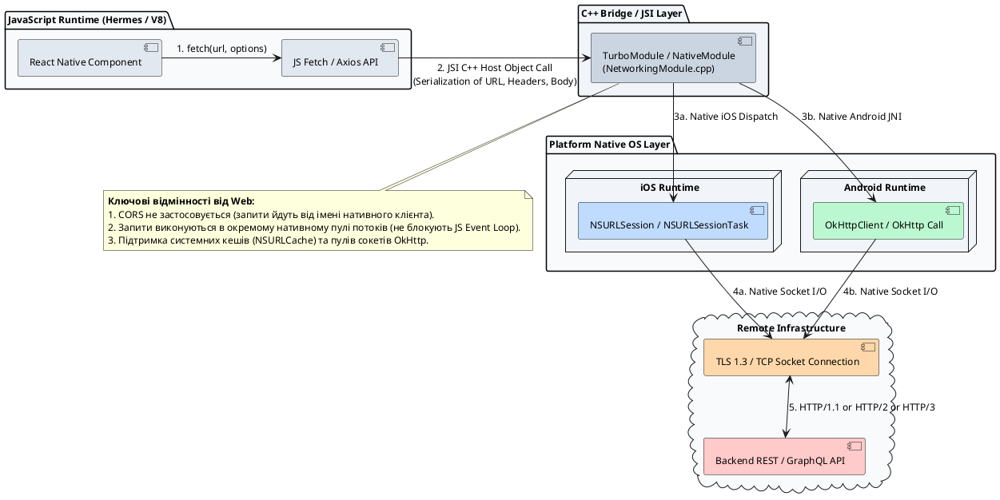
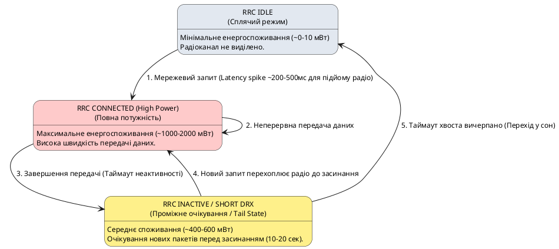
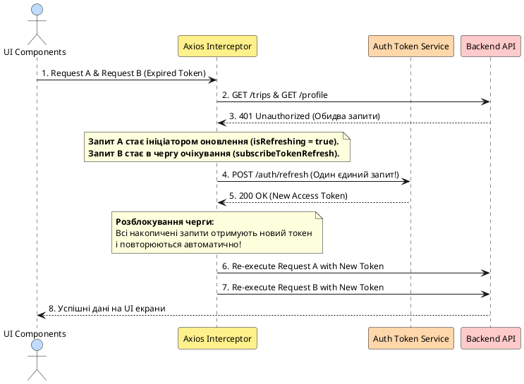
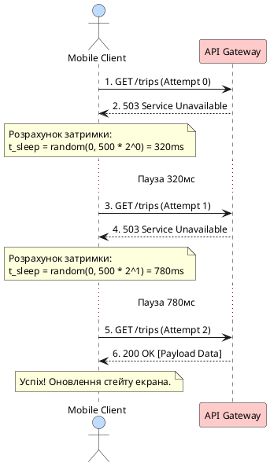
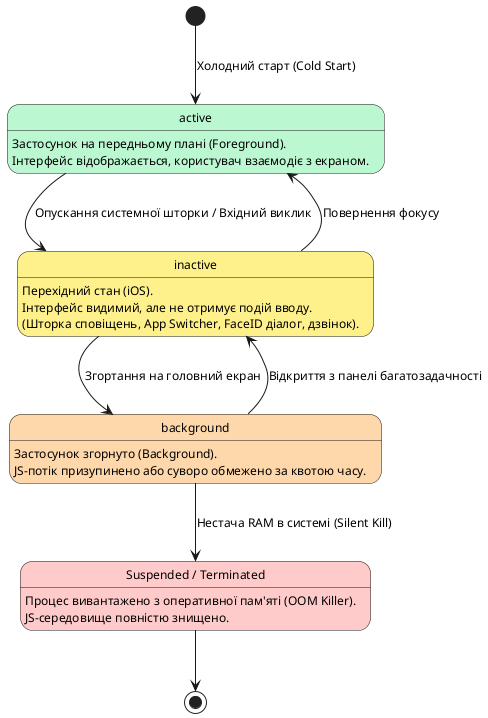

# Робота з мережею та життєвий цикл застосунку

## Вступ: Особливості мобільної мережі та життєвий цикл застосунку

У класичній веб-розробці клієнтський застосунок функціонує в середовищі умовної стабільності: браузер запущений на стаціонарному комп'ютері або лептопі з постійним підключенням до мережі Ethernet чи стаціонарного Wi-Fi. Якщо зв'язок обривається, браузер бере на себе візуалізацію збою або користувач просто перезавантажує сторінку. Крім того, вкладка веб-переглядача або активна, або закрита; концепція призупинення процесів операційною системою у вебі здебільшого прихована від інженера.

У мобільній розробці на **React Native** середовище є **нестабільним, непередбачуваним та обмеженим у ресурсах**. Смартфон постійно переміщується у фізичному просторі, перемикається між стільниковими вежами різних стандартів (2G, 3G, LTE, 5G) та публічними точками доступу Wi-Fi. Під час цього процесу змінюються IP-адреси, виникають зони радіотіні (ліфти, підземні паркінги, тунелі) та спостерігається суттєва втрата мережевих пакетів (_packet loss_).

Одночасно з мережевою нестабільністю мобільна операційна система (iOS чи Android) веде жорсткий моніторинг енергоспоживання та використання оперативної пам'яті (RAM). Застосунок може бути щомиті переведений у фоновий режим, «заморожений» (_suspended_) або примусово завершений системним диспетчером (_Out-Of-Memory Killer_) без виклику фінальних обробників чи очищення пам'яті в JavaScript.

### Навчальні цілі розділу:

- Зрозуміти різницю між роботою мережі у вебі та мобільних додатках: відсутність браузерного пісочника CORS, пряма взаємодія з нативними сокетами ОС.
- Простежити шлях HTTP-запиту: від виклику в рушії **Hermes** через **JSI / TurboModules** до системних стеків **`NSURLSession`** (iOS) та **`OkHttpClient`** (Android).
- Розібратися, як працює мобільний модем (стани **RRC**) і чому неконтрольовані запити швидко розряджають акумулятор.
- Опанувати архітектуру **нормалізованого клієнтського стану (Normalized State: `byId` + `allIds`)**: чому збереження масивів об'єктів з API є антипатерном для мобільних додатків і як досягти складності вибірки та оновлення :math-formula{tex="O(1)" inline}.
- Порівняти стандартний поліфіл **`fetch`** та бібліотеку **`axios`**: керування таймаутами, перехоплювачі (_interceptors_), обробка скасування через **`AbortController`** та безпечна десеріалізація відповідей.
- Створити надійну **чергу оновлення токенів (Mutex Token Refresh Queue)** на базі Axios Interceptors для усунення стану гонитви (_Race Condition_) при паралельних запитах з простроченим токеном.
- Розібрати **класифікацію та типізацію мережевих помилок**: розмежування транспортних збоїв, серверних відмов, бізнес-помилок авторизації та валідації схем (Zod).
- Засвоїти формулу та логіку алгоритму **Exponential Backoff із Jitter**, щоб захистити сервер від перевантаження при одночасних повторних запитах (_Thundering Herd_).
- Створити типізований клас помилок **`AppError`** для уніфікації збоїв з різних джерел.
- Дослідити бібліотеку **`@react-native-community/netinfo`**: різниця між фізичним з'єднанням (`isConnected`) та верифікованою доступністю Інтернету (`isInternetReachable`), обробка Captive Portals.
- Вивчити стани життєвого циклу **`AppState`** (`active`, `inactive`, `background`), їхню кореляцію з нативними подіями iOS/Android та сценарії захисту конфіденційних даних (_Privacy Shield_).
- Реалізувати розумне автооновлення даних (**Smart Refetch on Focus & Reconnect**) при поверненні в додаток або відновленні зв'язку.
- Побудувати повноцінний міні-проєкт «Курси валют» та інтегрувати нормалізований мережевий шар з обробкою життєвого циклу в наскрізний проєкт **Nomad**.

::note
**Головне правило мобільного розробника:** проєктуйте клієнт із розрахунку на те, що мережі **немає за замовчуванням**, будь-який запит може завершитися за таймаутом або обірватися на середині передачі байтів, а процес програми може бути знищений операційною системою будь-якої секунди після переходу у фоновий стан.
::

---

## Як працює мережа: від JS-коду до нативного стека ОС

Щоб усвідомити, як функціонує мережа в React Native, необхідно простежити шлях HTTP-запиту крізь шари абстракції платформи.

### Чому в React Native відсутній CORS?

У веб-розробці головним джерелом складнощів при роботі з API є політика однакового джерела — **Same-Origin Policy (SOP)** та механізм **Cross-Origin Resource Sharing (CORS)**. CORS — це **виключно браузерний механізм безпеки**, розроблений для захисту користувача від міжсайтових атак (наприклад, коли шкідливий скрипт на `evil.com` намагається через браузер виконати запит з кукі-файлами до `bank.com`).

Мобільний застосунок не є веб-сторінкою, завантаженою з віддаленого хоста. Це скомпільований бінарний пакет, встановлений локально в ізольованій пісочниці (_Sandbox_) операційної системи. Нативний код мобільного пристрою здійснює HTTP-запити через системні сокети TCP/TLS так само, як утиліта `curl`, клієнт Postman або бекенд-сервіс на Node.js чи Go.

::plant-uml



::

### Механізм виконання запиту крізь шари платформи

Розглянемо послідовні фази проходження мережевого виклику:

1. **Ініціалізація в JS-шарі:** Код застосунку викликає глобальний метод `fetch()` або метод екземпляра `axios.get()`.
2. **Маршрутизація через JSI (JavaScript Interface):** Замість застарілого асинхронного JSON-моста (_Legacy Bridge_) сучасна архітектура React Native (New Architecture) використовує C++ TurboModules. Запит серіалізується у структури пам'яті C++ безпосередньо через JSI.
3. **Делегування нативній підсистемі:**
    - В **iOS** запит передається в середовище Foundation до класу **`NSURLSession`**. Він керує пулом системних потоків, підтримкою HTTP/2 та HTTP/3 (QUIC), сертифікатами безпеки та нативним дисковим кешем `NSURLCache`.
    - В **Android** запит делегується бібліотеці **`OkHttpClient`**. Вона оптимізує повторне використання відкритих TCP-з'єднань (_Connection Pooling_), прозоро стискає трафік за алгоритмом GZIP/Brotli та взаємодіє з Android Network Security Configuration.
4. **Транспортний рівень:** Нативна підсистема встановлює TLS-хендшейк та здійснює обмін байтами через мережевий адаптер пристрою.
5. **Зворотне сповіщення:** Отримані байти збираються в буфер пам'яті нативної частини, перетворюються на відповідні типи C++/JS і повертають Promise у JavaScript Event Loop як завершену операцію.

::tip
**Пул потоків та швидкодія.** Виконання мережевих запитів у нативному шарі означає, що важкі операції шифрування TLS, парсингу заголовків і завантаження великих бінарних тіл (наприклад, фотографій) відбуваються в окремих нативних системних потоках і **жодним чином не блокують головний потік рендерингу UI або потік виконання JavaScript**.
::

---

## Як мобільний модем витрачає батарею: стани RRC та енергоспоживання

Одна з найбільших помилок інженера, який прийшов з веб-розробки, — сприймати передачу даних мобільним пристроєм як «безкоштовну» операцію, де єдиним ресурсом є пропускна здатність (_bandwidth_). У мобільних пристроях головним обмеженням є **енерговитрати радіомодуля (Baseband Radio Processor)**.

### Модель станів RRC (Radio Resource Control)

Радіомодуль стільникового зв'язку (LTE/5G) не може постійно працювати на повній потужності, оскільки акумулятор смартфона розрядився б за 2–3 години. Для економії енергії операційна система та модемний чип перемикають радіомодуль між кількома станами **RRC**:

::plant-uml



::

### Чому частий Polling вбиває батарею: «Ефект хвоста» (_Tail Energy_)

Коли застосунок відправляє хоча б один крихітний пакет розміром 50 байт:

1. Модем переходить зі стану `IDLE` у стан `CONNECTED`. Цей перехід займає від 100 до 500 мс і супроводжується різким піком енергоспоживання.
2. Пакет передається за кілька мілісекунд.
3. Радіомодуль **не засинає миттєво**. Він залишається в проміжному стані (_Tail State_) протягом 10–20 секунд, очікуючи на ймовірні наступні пакети від оператора.

Якщо ваш застосунок виконує наївний polling (наприклад, опитування сервера через `setInterval` кожні 15 секунд), **радіомодуль смартфона ніколи не перейде в режим сну (IDLE)**. Пристрій постійно спалює енергію акумулятора у фоновому режимі, що викликає нагрівання телефону та невдоволення користувачів.

::warning
**Правило мобільного мережевого дизайну:** Замість частих дрібних запитів об'єднуйте дані в пакети (_Batching_) або використовуйте двонаправлені протоколи реального часу з оптимізованим серцебиттям (WebSocket, Server-Sent Events або Push-сповіщення Apple APNs / Google FCM).
::

---

## Організація даних клієнта: Нормалізація серверного стану (`byId` + `allIds`)

Більшість REST API повертають колекції сутностей у вигляді простих масивів JSON-об'єктів:

```json
[
  { "id": "t1", "title": "Карпати", "likes": 12 },
  { "id": "t2", "title": "Львів", "likes": 45 }
]
```

У веб-проєктах розробники часто зберігають такий масив безпосередньо в `useState<Trip[]>([])`. Проте в мобільних застосунках із насиченими списками, деталізацією, модальними вікнами та оптимістичними оновленнями збереження звичайного масиву **суттєво сповільнює роботу інтерфейсу**.

### Чому масиви об'єктів — це антипатерн для мобільного сховища

Розглянемо алгоритмічну складність типових операцій над масивом :math-formula{tex="N" inline} елементів:

1. **Пошук елемента за ідентифікатором (`find`):** Складність :math-formula{tex="O(N)" inline}. При відкритті екрана деталей поїздки `/trips/t2` доводиться виконувати лінійний перебір усього масиву.
2. **Оновлення одиничного елемента (наприклад, лайк або перейменування):** Складність :math-formula{tex="O(N)" inline}. Необхідно створити новий масив через `items.map(item => item.id === id ? { ...item, ...patch } : item)`.
3. **Видалення сутності зі списку:** Складність :math-formula{tex="O(N)" inline} через `items.filter(item => item.id !== id)`.
4. **Розсинхронізація дубльованого стану:** Якщо один і той самий об'єкт відображається у стрічці поїздок, у списку обраного та на екрані деталей, зміна одного екземпляра в масиві призводить до розбіжності даних на інших екранах.

### Структура нормалізованого стану

Нормалізація (за аналогією з реляційними базами даних) полягає у розділенні сутностей на таблицю за ідентифікаторами та впорядкований масив ключів:

::math-formula
\text{NormalizedState} = \{ \text{byId}: \text{Record}\langle\text{ID}, \text{Entity}\rangle, \; \text{allIds}: \text{ID}[] \}
::

```
         СЕРВЕРНА ВІДПОВІДЬ (ARRAY)                   НОРМАЛІЗОВАНИЙ СТЕЙТ КЛІЄНТА
  +-------------------------------------+       +-----------------------------------------+
  | [                                   |       | {                                       |
  |   { "id": "t1", "title": "Карпати" },|  ==> |   byId: {                               |
  |   { "id": "t2", "title": "Львів" }   |       |     "t1": { "id": "t1", title: "..." }, |
  | ]                                   |       |     "t2": { "id": "t2", title: "..." }  |
  +-------------------------------------+       |   },                                    |
                                                |   allIds: ["t1", "t2"]                  |
                                                | }                                       |
                                                +-----------------------------------------+
```

| Операція | Масив (`Entity[]`) | Нормалізований стан (`byId` + `allIds`) |
| :--- | :--- | :--- |
| **Вибірка за ID (`getById`)** | :math-formula{tex="O(N)" inline} — `list.find()` | :math-formula{tex="O(1)" inline} — `state.byId[id]` |
| **Оновлення сутності (`patch`)** | :math-formula{tex="O(N)" inline} — `list.map()` | :math-formula{tex="O(1)" inline} — `state.byId[id] = { ...item, ...patch }` |
| **Видалення сутності (`delete`)** | :math-formula{tex="O(N)" inline} — `list.filter()` | :math-formula{tex="O(1)" inline} у словнику + :math-formula{tex="O(N)" inline} у масиві ID |
| **Перевірка наявності (`has`)** | :math-formula{tex="O(N)" inline} — `list.some()` | :math-formula{tex="O(1)" inline} — `Boolean(state.byId[id])` |

### Практична реалізація: Утиліти нормалізації та типізований менеджер стану

Розглянемо повний цикл нормалізації та денормалізації на TypeScript:

::tabs

::tabs-item{label="src/utils/normalize.ts"}

```typescript
export interface NormalizedEntities<T extends { id: string }> {
    byId: Record<string, T>
    allIds: string[]
}

/**
 * Перетворює масив серверних сутностей у нормалізовану структуру
 */
export function normalizeEntities<T extends { id: string }>(items: T[]): NormalizedEntities<T> {
    const byId: Record<string, T> = {}
    const allIds: string[] = []

    for (const item of items) {
        byId[item.id] = item
        allIds.push(item.id)
    }

    return { byId, allIds }
}

/**
 * Відновлює впорядкований масив сутностей для передачі у FlatList
 */
export function denormalizeEntities<T extends { id: string }>(normalized: NormalizedEntities<T>): T[] {
    return normalized.allIds.map((id) => normalized.byId[id]).filter((item): item is T => Boolean(item))
}

/**
 * Оновлює одну сутність зі складністю O(1)
 */
export function updateEntity<T extends { id: string }>(
    state: NormalizedEntities<T>,
    id: string,
    patch: Partial<T>,
): NormalizedEntities<T> {
    const existing = state.byId[id]
    if (!existing) return state

    return {
        ...state,
        byId: {
            ...state.byId,
            [id]: { ...existing, ...patch },
        },
    }
}

/**
 * Додає або оновлює нову сутність
 */
export function upsertEntity<T extends { id: string }>(
    state: NormalizedEntities<T>,
    entity: T,
): NormalizedEntities<T> {
    const isNew = !state.byId[entity.id]

    return {
        byId: {
            ...state.byId,
            [entity.id]: entity,
        },
        allIds: isNew ? [entity.id, ...state.allIds] : state.allIds,
    }
}
```

::

::tabs-item{label="Приклад використання в компоненті"}

```tsx
import React, { useState } from 'react'
import { View, Text, Button } from 'react-native'
import { normalizeEntities, updateEntity, denormalizeEntities, NormalizedEntities } from './normalize'

interface Trip {
    id: string
    title: string
    likes: number
}

export function TripManager() {
    const rawApiData: Trip[] = [
        { id: '1', title: 'Карпати', likes: 10 },
        { id: '2', title: 'Львів', likes: 25 },
    ]

    // Ініціалізуємо стан у нормалізованій формі
    const [tripsState, setTripsState] = useState<NormalizedEntities<Trip>>(() => normalizeEntities(rawApiData))

    // Швидка вибірка O(1) для будь-якого екрана чи модалки
    const selectedTrip = tripsState.byId['2']

    // Оптимістичне миттєве оновлення O(1)
    const handleLike = (tripId: string) => {
        setTripsState((prevState) => {
            const current = prevState.byId[tripId]
            if (!current) return prevState
            return updateEntity(prevState, tripId, { likes: current.likes + 1 })
        })
    }

    // Денормалізація лише для рендерингу FlatList
    const listForRender = denormalizeEntities(tripsState)

    return (
        <View style={{ padding: 16 }}>
            <Text style={{ fontSize: 18, fontWeight: 'bold' }}>Вибрана поїздка: {selectedTrip?.title}</Text>
            {listForRender.map((trip) => (
                <View key={trip.id} style={{ marginVertical: 8 }}>
                    <Text>
                        {trip.title} — Лайків: {trip.likes}
                    </Text>
                    <Button title="👍 Лайкнути" onPress={() => handleLike(trip.id)} />
                </View>
            ))}
        </View>
    )
}
```

::

::

---

## HTTP-клієнти: `fetch` проти `axios`

У React Native стандартною є наявність глобальної функції `fetch`, що відповідає стандарту W3C/WHATWG Fetch API. Проте в реальних проєктах частіше використовують перевірені бібліотеки, такі як `axios`. Розглянемо ключову різницю між ними.

### Реалізація `fetch` у React Native та підводні камені

Поліфіл `fetch` у React Native побудований поверх внутрішньої нативної реалізації `XMLHttpRequest` (`RCTNetworking`). Незважаючи на стандартизований інтерфейс, пряме використання `fetch` у мобільних додатках створює низку практичних проблем:

::field-group

::field{name="1. Відсутність таймауту за замовчуванням" type="Проблема / Обмеження"}
Специфікація `fetch` не містить параметра `timeout`. Якщо смартфон увійшов у тунель метро, де TCP-пакети губляться без явного скидання з'єднання (_TCP Silent Drop_), Promise запиту `fetch` перебуватиме у стані очікування (_Pending_) **невизначено довго** (іноді до 10–15 хвилин, поки операційна система не розірве сокет).
::

::field{name="2. Помилкова семантика HTTP-статусів" type="Проблема / Обмеження"}
`fetch` переходить у стан відхилення (_Rejected_) **лише при фізичній помилці мережі** (відсутній DNS, немає з'єднання). Якщо сервер повернув відповідь `401 Unauthorized`, `404 Not Found` або `500 Internal Server Error`, Promise переходить у стан `Resolved`. Розробник зобов'язаний вручну перевіряти властивість `response.ok`.
::

::field{name="3. Ручна двокрокова десеріалізація" type="Проблема / Обмеження"}
Для отримання JSON-структури потрібно викликати `await response.json()`. Якщо сервер через аварію проксі-сервера (наприклад, Nginx) повернув HTML-сторінку з помилкою замість JSON, виклик `.json()` впаде з неінформативною синтаксичною помилкою `SyntaxError: Unexpected token < in JSON at position 0`.
::

::

### Керування таймаутом і життєвим циклом запиту через `AbortController`

Для безпечного використання `fetch` у мобільному застосунку необхідно вручну зв'язувати його з екземпляром **`AbortController`**:

```typescript
/**
 * Виконує безпечний HTTP-запит з гарантованим таймаутом та обробкою HTTP-помилок
 */
async function executeFetchWithTimeout<T>(
    url: string,
    options: RequestInit = {},
    timeoutMs: number = 8000,
): Promise<T> {
    const controller = new AbortController()
    const { signal } = controller

    // Реєструємо таймер примусового скасування запиту
    const timerId = setTimeout(() => {
        controller.abort()
    }, timeoutMs)

    try {
        const response = await fetch(url, {
            ...options,
            signal,
            headers: {
                Accept: 'application/json',
                'Content-Type': 'application/json',
                ...options.headers,
            },
        })

        clearTimeout(timerId)

        // Валідація діапазону успішних статусів (200-299)
        if (!response.ok) {
            throw new Error(`HTTP_${response.status}: ${response.statusText}`)
        }

        const contentType = response.headers.get('content-type')
        if (!contentType || !contentType.includes('application/json')) {
            throw new Error('INVALID_CONTENT_TYPE: Очікувався application/json')
        }

        return (await response.json()) as T
    } catch (error: unknown) {
        clearTimeout(timerId)

        if (error instanceof Error && error.name === 'AbortError') {
            throw new Error(`TIMEOUT: Запит перевищив ліміт очікування у ${timeoutMs} мс`)
        }

        throw error
    }
}
```

### Чому на практиці обирають `axios`

Бібліотека `axios` вирішує ці проблеми з коробки завдяки зручному API:

- **Декларативні таймаути:** Властивість `timeout: 8000` на рівні інстансу або запиту автоматично скасовує операцію за допомогою коду помилки `ECONNABORTED`.
- **Автоматична десеріалізація та трансформація:** `axios` самостійно парсить JSON і надає дані у властивості `response.data`.
- **Єдина модель винятків:** Будь-який HTTP-статус за межами діапазону `2xx` автоматично генерує об'єкт `AxiosError`, який містить повний контекст (запит, статус, відповідь).
- **Конвеєр перехоплювачів (Interceptors Pipeline):** Дозволяє модифікувати конфігурацію запитів перед відправкою (додавання Bearer токенів) та перехоплювати відповіді перед передачею в компоненти (централізована обробка викликів `401 Unauthorized`).

### Порівняльний аналіз можливостей

| Критерій порівняння | Нативний `fetch` | Бібліотека `axios` |
| :--- | :--- | :--- |
| **Розмір бандла** | 0 КБ (вбудований у рантайм) | ~12–15 КБ (незначно для мобільного бандла) |
| **Керування таймаутом** | Лише через ручний `AbortController` | Вбудоване поле `timeout` у конфігурації |
| **Поведінка при HTTP 4xx/5xx** | Вважає успіхом (`Resolved`, `ok: false`) | Генерує виняток (`Rejected`) |
| **Глобальні інтерцептори** | Потребує власної обгортки-монкипатчингу | Нативна підтримка `interceptors.request / response` |
| **Трансформація тіла (Body)** | Вимагає ручного `JSON.stringify()` / `.json()` | Автоматична серіалізація/десеріалізація JSON |
| **Відстеження прогресу завантаження** | Складно (через `ReadableStream`) | Вбудовані колбеки `onUploadProgress`, `onDownloadProgress` |

---

## Налаштування мережевого клієнта на базі `axios`

Побудуємо надійний клієнт, що враховує специфіку мобільних операційних систем, середовища емуляторів, автентифікації та черги оновлення токенів.

### Проблема мережевої адресації: `localhost` на мобільних пристроях

Початківці часто стикаються з помилкою `Network Error` при спробі звернутися за адресою `http://localhost:3000`. Необхідно розуміти мережеву топологію середовищ:

- **iOS Simulator:** Працює як звичайний процес у macOS і ділить з хостом єдиний мережевий стек. `http://localhost:3000` працює коректно.
- **Android Emulator:** Запущений всередині віртуальної машини QEMU з власним ізольованим мережевим маршрутизатором. Для нього `127.0.0.1` — це внутрішній інтерфейс віртуального Android-пристрою. Звернення до хост-машини розробника здійснюється за зарезервованою IP-адресою **`http://10.0.2.2:3000`**.
- **Фізичний пристрій (iOS/Android):** Знаходиться в локальній мережі Wi-Fi. Для доступу до комп'ютера розробника потрібна явна IP-адреса хоста в локальній мережі (наприклад, `http://192.168.1.150:3000`). Пакет `expo-constants` дозволяє отримати її динамічно з маніфесту сервера Metro.

### Черга оновлення токенів (Refresh Token Mutex Queue)

Коли термін дії Access Token закінчується, клієнт отримує помилку `401 Unauthorized`. Якщо на екрані одночасно ініціалізується 5 паралельних запитів (наприклад, профіль, список поїздок, сповіщення, баланс і налаштування), без належної координації клієнт надішле **5 одночасних запитів `/auth/refresh`**. Це призведе до інвалідації сесії на бекенді через десинхронізацію Refresh Token.

Для розв'язання цієї проблеми створюється **черга на базі промісів (Promise-based Mutex Queue)**:

::plant-uml



::

Розглянемо повну реалізацію мережевого клієнта з чергою токенів:

::tabs

::tabs-item{label="src/api/client.ts"}

```typescript
import axios, { AxiosInstance, AxiosError, InternalAxiosRequestConfig } from 'axios'
import { Platform } from 'react-native'
import Constants from 'expo-constants'

function resolveBaseUrl(): string {
    if (Platform.OS === 'android' && !Constants.isDevice) {
        return 'http://10.0.2.2:3000/api/v1'
    }

    const hostUri = Constants.expoConfig?.hostUri
    if (hostUri) {
        const hostIp = hostUri.split(':')[0]
        return `http://${hostIp}:3000/api/v1`
    }

    return 'http://localhost:3000/api/v1'
}

export const apiClient: AxiosInstance = axios.create({
    baseURL: resolveBaseUrl(),
    timeout: 8000,
    headers: {
        Accept: 'application/json',
        'Content-Type': 'application/json',
        'X-Client-Platform': Platform.OS,
        'X-Client-Version': Constants.expoConfig?.version ?? '1.0.0',
    },
})

// Змінні стану оновлення сесії
let isRefreshing = false
let failedQueue: Array<{
    resolve: (token: string) => void
    reject: (error: unknown) => void
}> = []

const processQueue = (error: unknown, token: string | null = null) => {
    failedQueue.forEach((prom) => {
        if (error) {
            prom.reject(error)
        } else if (token) {
            prom.resolve(token)
        }
    })
    failedQueue = []
}

// 1. Інтерцептор запитів: Додавання токена авторизації
apiClient.interceptors.request.use(
    async (config: InternalAxiosRequestConfig) => {
        const token: string | null = 'mock-access-token' // У реальному додатку: await SecureStore.getItemAsync('token')
        if (token && config.headers) {
            config.headers.Authorization = `Bearer ${token}`
        }
        return config
    },
    (error) => Promise.reject(error),
)

// 2. Інтерцептор відповідей: Черга оновлення токена при 401
apiClient.interceptors.response.use(
    (response) => response,
    async (error: AxiosError) => {
        const originalRequest = error.config as InternalAxiosRequestConfig & { _retry?: boolean }

        // Якщо помилка не 401 або запит уже був повторений - повертаємо виняток
        if (error.response?.status !== 401 || !originalRequest || originalRequest._retry) {
            return Promise.reject(error)
        }

        // Якщо оновлення вже відбувається іншим запитом, ставимо цей запит у чергу
        if (isRefreshing) {
            return new Promise((resolve, reject) => {
                failedQueue.push({
                    resolve: (newToken: string) => {
                        if (originalRequest.headers) {
                            originalRequest.headers.Authorization = `Bearer ${newToken}`
                        }
                        resolve(apiClient(originalRequest))
                    },
                    reject: (err: unknown) => {
                        reject(err)
                    },
                })
            })
        }

        originalRequest._retry = true
        isRefreshing = true

        try {
            // Виконуємо запит на оновлення токена
            // Важливо: використовуємо базовий axios, щоб оминути інтерцептори клієнта!
            const refreshResponse = await axios.post<{ accessToken: string }>(
                `${resolveBaseUrl()}/auth/refresh`,
                { refreshToken: 'mock-refresh-token' },
                { timeout: 5000 },
            )

            const newAccessToken = refreshResponse.data.accessToken

            // Зберігаємо новий токен у безпечне сховище
            // await SecureStore.setItemAsync('token', newAccessToken)

            processQueue(null, newAccessToken)

            if (originalRequest.headers) {
                originalRequest.headers.Authorization = `Bearer ${newAccessToken}`
            }

            return apiClient(originalRequest)
        } catch (refreshError) {
            processQueue(refreshError, null)
            // Тут ініціюється вихід із системи (Logout)
            return Promise.reject(refreshError)
        } finally {
            isRefreshing = false
        }
    },
)
```

::

::tabs-item{label="Встановлення залежностей"}

```bash
# Встановлення необхідних модулів у проєкт
npx expo install expo-constants
npm install axios
```

::

::

---

## Класифікація мережевих помилок та стійкість до збоїв

Стійкість мобільного застосунку визначається тим, наскільки коректно він ізолює збої та інтерпретує помилки для користувача.

### Класифікація помилок за рівнями абстракції

Мережеві винятки поділяються на 4 взаємовиключні рівні:

::field-group

::field{name="1. Транспортний / Мережевий рівень (Network Layer)" type="Клас помилки"}
**Симптоми:** Немає сигналу, обрив сокета, збій дозволу DNS-імені, спрацювання клієнтського таймауту.
**Характеристика:** Запит або не вийшов з пристрою, або відповідь не досягла клієнта за відведений ліміт часу.
**Стратегія відновлення:** Перевірка стану підключення, показ Offline-індикатора, очікування відновлення мережі або повтор запиту з ручної ініціативи.
::

::field{name="2. Серверний інфраструктурний рівень (HTTP 5xx)" type="Клас помилки"}
**Симптоми:** `500 Internal Server Error`, `502 Bad Gateway`, `503 Service Unavailable`, `504 Gateway Timeout`.
**Характеристика:** Сервер перевантажений, аварійно завершив роботу або виконує розгортання нової версії.
**Стратегія відновлення:** Автоматичний повтор запитів за алгоритмом **Exponential Backoff із випадковим зсувом (Jitter)**.
::

::field{name="3. Авторизаційний та бізнес-рівень (HTTP 4xx)" type="Клас помилки"}
**Симптоми:** `400 Bad Request`, `401 Unauthorized`, `403 Forbidden`, `404 Not Found`, `422 Unprocessable Entity`.
**Характеристика:** Помилка в даних клієнта або недійсний сесійний токен.
**Стратегія відновлення:**

- При `401`: Запуск процедури оновлення токена (_Token Refresh Flow_) або вихід у стан деавтентифікації.
- При `422`: Відображення тексту помилок біля полів вводу.
- **Категорична заборона автоматичного Retry** (повтор того самого некоректного тіла запиту завжди повертатиме ту саму помилку 4xx).

::

::field{name="4. Рівень узгодження контрактів (Schema / Deserialization)" type="Клас помилки"}
**Симптоми:** Відповідь успішна (`200 OK`), але структура JSON змінилася або містить неочікуваний тип (наприклад, замість масиву об'єктів прийшов `null`).
**Характеристика:** Розсинхронізація версій клієнта та сервера (_API Contract Break_).
**Стратегія відновлення:** Логування критичної події в систему телеметрії (Sentry, Datadog), відображення безпечного аварійного екрана (_Fallback UI_).
::

::

### Алгоритм та формула: Exponential Backoff із Jitter

Коли сотні тисяч мобільних пристроїв стикаються з падінням сервера (HTTP 503) і починають одночасно повторювати запити через фіксований інтервал (наприклад, щосекунди), виникає явище **«шторму запитів» (Thundering Herd Problem)**. Відновлений сервер миттєво падає знову під піковим навантаженням.

Для вирішення цієї проблеми використовують алгоритм **Full Jitter Exponential Backoff**, запропонований дослідниками інфраструктури AWS:

Інтервал очікування перед :math-formula{tex="n" inline}-ю спробою розраховується за формулою:

::math-formula
t_{\text{sleep}} = \text{random}(0, \min(t_{\text{max}}, t_{\text{base}} \cdot 2^{n}))
::

де:

- :math-formula{tex="t_{\text{base}}" inline} — базовий інтервал затримки (наприклад, 500 мс);
- :math-formula{tex="n" inline} — порядковий номер поточної спроби повтору (:math-formula{tex="n \in [0, N-1]" inline});
- :math-formula{tex="t_{\text{max}}" inline} — граничний ліміт інтервалу затримки (наприклад, 10 000 мс);
- :math-formula{tex="\text{random}(0, x)" inline} — функція рівномірного розподілу випадкової величини на відрізку :math-formula{tex="[0, x]" inline}.

::plant-uml



::

### Програмна реалізація алгоритму повторних спроб

Створимо універсальну утиліту `retryWithBackoff`:

```typescript
// src/utils/retryWithBackoff.ts
export interface RetryOptions {
    maxRetries?: number
    baseDelayMs?: number
    maxDelayMs?: number
    shouldRetry?: (error: unknown) => boolean
}

/**
 * Виконує асинхронну операцію з алгоритмом Full Jitter Exponential Backoff
 */
export async function retryWithBackoff<T>(operation: () => Promise<T>, options: RetryOptions = {}): Promise<T> {
    const {
        maxRetries = 3,
        baseDelayMs = 500,
        maxDelayMs = 8000,
        shouldRetry = (err: any) => {
            // За замовчуванням повторюємо лише мережеві збої та 5xx статуси
            if (err?.response?.status && err.response.status >= 400 && err.response.status < 500) {
                return false // Ніколи не повторюємо 4xx
            }
            return true
        },
    } = options

    let attempt = 0

    while (attempt < maxRetries) {
        try {
            return await operation()
        } catch (error) {
            attempt++

            if (attempt >= maxRetries || !shouldRetry(error)) {
                throw error
            }

            // Розрахунок експоненційного діапазону: base * 2^attempt
            const calculatedCap = Math.min(maxDelayMs, baseDelayMs * Math.pow(2, attempt))
            // Full Jitter: рівномірний випадковий вибір від 0 до calculatedCap
            const jitterDelay = Math.random() * calculatedCap

            await new Promise((resolve) => setTimeout(resolve, jitterDelay))
        }
    }

    throw new Error('RETRY_EXHAUSTED')
}
```

---

## Уніфікована обробка помилок: клас `AppError`

Створимо клас `AppError`, який зводить різнорідні помилки від `axios`, `fetch` та рантайму JavaScript до єдиного типізованого формату:

```typescript
// src/api/AppError.ts
import axios, { AxiosError } from 'axios'

export enum ErrorKind {
    Network = 'NETWORK',
    Timeout = 'TIMEOUT',
    Server = 'SERVER',
    Unauthorized = 'UNAUTHORIZED',
    Forbidden = 'FORBIDDEN',
    NotFound = 'NOT_FOUND',
    Validation = 'VALIDATION',
    SchemaMismatch = 'SCHEMA_MISMATCH',
    Unknown = 'UNKNOWN',
}

export class AppError extends Error {
    public readonly kind: ErrorKind
    public readonly userMessage: string
    public readonly statusCode?: number
    public readonly originalError?: unknown

    constructor(params: { kind: ErrorKind; userMessage: string; statusCode?: number; originalError?: unknown }) {
        super(params.userMessage)
        this.name = 'AppError'
        this.kind = params.kind
        this.userMessage = params.userMessage
        this.statusCode = params.statusCode
        this.originalError = params.originalError

        // Зберігаємо коректний прототип для перевірки через instanceof
        Object.setPrototypeOf(this, AppError.prototype)
    }

    /**
     * Фабричний метод для приведення будь-якого невідомого винятку до стандарту AppError
     */
    public static from(error: unknown): AppError {
        if (error instanceof AppError) {
            return error
        }

        if (axios.isAxiosError(error)) {
            const axiosError = error as AxiosError<{ message?: string; error?: string }>

            // 1. Помилка таймауту
            if (axiosError.code === 'ECONNABORTED' || axiosError.message.includes('timeout')) {
                return new AppError({
                    kind: ErrorKind.Timeout,
                    userMessage: 'Час очікування відповіді вичерпано. Перевірте швидкість інтернету.',
                    originalError: error,
                })
            }

            // 2. Відсутність фізичного з'єднання або DNS збій
            if (!axiosError.response) {
                return new AppError({
                    kind: ErrorKind.Network,
                    userMessage: "Зв'язок із сервером відсутній. Перевірте мережеве з'єднання.",
                    originalError: error,
                })
            }

            const status = axiosError.response.status
            const serverMessage = axiosError.response.data?.message

            // 3. Авторизаційні помилки
            if (status === 401) {
                return new AppError({
                    kind: ErrorKind.Unauthorized,
                    userMessage: 'Сесія завершилася. Будь ласка, виконайте вхід повторно.',
                    statusCode: status,
                    originalError: error,
                })
            }

            if (status === 403) {
                return new AppError({
                    kind: ErrorKind.Forbidden,
                    userMessage: 'У вас немає прав для виконання цієї дії.',
                    statusCode: status,
                    originalError: error,
                })
            }

            if (status === 404) {
                return new AppError({
                    kind: ErrorKind.NotFound,
                    userMessage: serverMessage ?? 'Запитуваний ресурс не знайдено на сервері.',
                    statusCode: status,
                    originalError: error,
                })
            }

            if (status === 422 || status === 400) {
                return new AppError({
                    kind: ErrorKind.Validation,
                    userMessage: serverMessage ?? 'Надіслані дані містять помилки валідації.',
                    statusCode: status,
                    originalError: error,
                })
            }

            // 4. Серверні помилки 5xx
            if (status >= 500) {
                return new AppError({
                    kind: ErrorKind.Server,
                    userMessage: 'На сервері сталася технічна помилка. Ми вже працюємо над її усуненням.',
                    statusCode: status,
                    originalError: error,
                })
            }
        }

        // 5. Нерозпізнані або синтаксичні винятки
        return new AppError({
            kind: ErrorKind.Unknown,
            userMessage: 'Сталася непередбачена помилка. Спробуйте пізніше.',
            originalError: error,
        })
    }
}
```

---

## Моніторинг стану зв'язку в реальному часі: `@react-native-community/netinfo`

У мобільних застосунках недостатньо реагувати на помилку вже після її виникнення. Інтерфейс повинен проактивно адаптуватися до відсутності зв'язку: блокувати відправку важких форм, показувати плашку режиму офлайн та перемикатися на локальний кеш.

### Різниця між прапорцями: `isConnected` проти `isInternetReachable`

Модуль `@react-native-community/netinfo` надає детальний знімок стану мережі пристрою. Найважливішим аспектом є розрізнення двох логічних властивостей:

::field-group

::field{name="isConnected" type="boolean | null"}
**Фізичний лінк.** Показує, чи підключений пристрій до будь-якого локального мережевого інтерфейсу (Wi-Fi роутер, мобільна вежа стільникового зв'язку, Bluetooth PAN чи USB Ethernet).
`isConnected === true` **не гарантує наявності Інтернету**. Якщо ви підключилися до публічного Wi-Fi у кафе, який вимагає авторизації (_Captive Portal_), або домашній роутер втратив зв'язок із провайдером, `isConnected` буде дорівнювати `true`.
::

::field{name="isInternetReachable" type="boolean | null"}
**Фактичний вихід у глобальну мережу.** Показує, чи зміг нативний мережевий стек успішно виконати фоновий зондувальний запит (_Probe Request_) до контрольного сервера перевірки доступності Інтернету (наприклад, `http://clients3.google.com/generate_204` на Android або `http://captive.apple.com/hotspot-detect.html` на iOS).

- `null` — стан доступності ще визначається (початковий стан при холодному старті).
- `false` — фізичний канал є, але Інтернет недоступний (Captive Portal або аварія провайдера).
- `true` — Інтернет функціонує повноцінно.
  ::

::

::warning
**Типова критична помилка:** Перевірка `if (!state.isConnected) return showOfflineBanner();`. Якщо користувач знаходиться в мережі без Інтернету, прапорець `isConnected` дорівнює `true`, банер не показується, а всі реальні запити застосунку аварійно падають за таймаутом. **Завжди використовуйте перевірку `isInternetReachable === false` або комбіновану умову `!isConnected || isInternetReachable === false`**.
::

### Проєктування хука `useNetworkStatus`

Створимо реактивний хук, що ізолює підписку на системні події та нормалізує стан:

```typescript
// src/hooks/useNetworkStatus.ts
import { useEffect, useState } from 'react'
import NetInfo, { NetInfoState, NetInfoStateType } from '@react-native-community/netinfo'

export interface NetworkState {
    isConnected: boolean
    isInternetReachable: boolean
    isOffline: boolean
    connectionType: NetInfoStateType
    isExpensive: boolean
}

export function useNetworkStatus(): NetworkState {
    const [networkState, setNetworkState] = useState<NetworkState>({
        isConnected: true,
        isInternetReachable: true,
        isOffline: false,
        connectionType: NetInfoStateType.unknown,
        isExpensive: false,
    })

    useEffect(() => {
        // 1. Отримуємо початковий стан з'єднання
        NetInfo.fetch().then((state: NetInfoState) => {
            updateState(state)
        })

        // 2. Підписуємося на динамічні зміни радіоінтерфейсів
        const unsubscribe = NetInfo.addEventListener((state: NetInfoState) => {
            updateState(state)
        })

        function updateState(state: NetInfoState) {
            const isConnected = state.isConnected ?? false
            // Якщо стан доступності ще не визначено (null), оптимістично вважаємо його доступним
            // за умови наявності фізичного з'єднання
            const isInternetReachable = state.isInternetReachable ?? isConnected
            const isOffline = !isConnected || !isInternetReachable

            setNetworkState({
                isConnected,
                isInternetReachable,
                isOffline,
                connectionType: state.type,
                isExpensive: state.details ? ((state.details as any).isConnectionExpensive ?? false) : false,
            })
        }

        return () => {
            unsubscribe()
        }
    }, [])

    return networkState
}
```

---

## Життєвий цикл мобільного застосунку: стани `AppState`

На відміну від традиційного веб-сайту, мобільний застосунок є керованим клієнтом у багатозадачному середовищі операційної системи.

### Схема станів `AppState`

React Native транслює нативні стани життєвого циклу iOS (`UIApplicationState`) та Android (`Activity Lifecycle`) у три стандартизовані рядкові стани:

::plant-uml



::

### Деталізація станів

::field-group

::field{name="active" type="AppState"}
Застосунок виконується на передньому плані, має повний доступ до ресурсів графічного прискорювача та процесора, обробляє жести користувача та анімації з частотою 60/120 FPS.
::

::field{name="inactive" type="AppState"}
Специфічний для iOS перехідний стан. Застосунок все ще рендериться на екрані, але операційна система перехопила фокус вводу.
**Типові тригери:**

- Відкриття Центру сповіщень (_Notification Center_) або Пункту керування (_Control Center_);
- Активація системного біометричного діалогу (Face ID / Touch ID);
- Вхідний телефонний виклик або спрацювання системного будильника;
- Жест переходу в панель перемикання застосунків (_App Switcher_).
  ::

::field{name="background" type="AppState"}
Застосунок повністю прихований від користувача. Операційна система надає JS-потоку від 5 до 30 секунд для завершення поточних операцій, після чого повністю заморожує виконання потоків (_Suspend_). Якщо системі знадобиться пам'ять для іншої програми, процес буде безшумно знищено (_Killed_) без виклику будь-яких React-хуків чи `componentWillUnmount`.
::

::

### Що потрібно робити при зміні `AppState`

Коректна обробка `AppState` необхідна для:

1. **Ресинхронізації застарілого кешу (Stale Cache Invalidation):** Якщо користувач відкрив застосунок через 4 години після згортання, дані на екрані втратили актуальність. Перехід `background -> active` повинен викликати тихе фонове оновлення.
2. **Зупинки енергоємних процесів:** При переході в `background` необхідно зупиняти таймери, скасовувати активні анімації, закривати постійні з'єднання WebSocket та зупиняти фоновий Polling.
3. **Безпеки та приватності (Privacy Screen Overlay):** Банківські та медичні застосунки зобов'язані накладати непрозорий екран-заглушку (_Blur Mask_) у стані `inactive`, щоб конфіденційні дані не зберігалися у знімках панелі багатозадачності ОС (_App Switcher Snapshots_).

### Приклад компонента PrivacyShield

```tsx
// src/components/PrivacyShield.tsx
import React, { useEffect, useState } from 'react'
import { StyleSheet, View, Text, AppState, AppStateStatus } from 'react-native'

/**
 * Накладає захисну маску, коли застосунок згортається у фон або переходить в App Switcher
 */
export const PrivacyShield: React.FC<{ children: React.ReactNode }> = ({ children }) => {
    const [isShieldVisible, setIsShieldVisible] = useState(false)

    useEffect(() => {
        const subscription = AppState.addEventListener('change', (nextState: AppStateStatus) => {
            // На iOS при відкритті App Switcher стан стає 'inactive'
            // На Android при згортанні стан стає 'background'
            const shouldHideData = nextState === 'inactive' || nextState === 'background'
            setIsShieldVisible(shouldHideData)
        })

        return () => subscription.remove()
    }, [])

    return (
        <View style={styles.container}>
            {children}
            {isShieldVisible && (
                <View style={styles.overlay}>
                    <Text style={styles.shieldText}>🔒 Дані захищено</Text>
                </View>
            )}
        </View>
    )
}

const styles = StyleSheet.create({
    container: { flex: 1 },
    overlay: {
        ...StyleSheet.absoluteFillObject,
        backgroundColor: '#0f172a',
        justifyContent: 'center',
        alignItems: 'center',
        zIndex: 99999,
    },
    shieldText: { color: '#ffffff', fontSize: 20, fontWeight: '700' },
})
```

---

## Поєднання підсистем: Патерн Smart Refetch on Focus & Network

Об'єднаємо відстеження життєвого циклу застосунку та моніторинг мережі в єдиний комплексний хук реактивної ресинхронізації даних:

```typescript
// src/hooks/useRefetchOnFocusAndNetwork.ts
import { useEffect, useRef } from 'react'
import { AppState, AppStateStatus } from 'react-native'
import { useNetworkStatus } from './useNetworkStatus'

interface RefetchOptions {
    /**
     * Мінімальний інтервал між повторними запитами в мілісекундах (захист від Throttling)
     * @default 5000
     */
    throttleIntervalMs?: number
}

/**
 * Автоматично викликає колбек оновлення даних при:
 * 1. Поверненні застосунку з фону в активний стан (background -> active);
 * 2. Відновленні доступу до Інтернету після офлайну.
 */
export function useRefetchOnFocusAndNetwork(onRefetch: () => void | Promise<void>, options: RefetchOptions = {}): void {
    const { throttleIntervalMs = 5000 } = options
    const { isOffline } = useNetworkStatus()

    const prevAppStateRef = useRef<AppStateStatus>(AppState.currentState)
    const prevOfflineRef = useRef<boolean>(isOffline)
    const lastRefetchTimestampRef = useRef<number>(Date.now())
    const onRefetchRef = useRef(onRefetch)

    // Оновлюємо актуальне посилання на функцію без перезапуску ефекту
    useEffect(() => {
        onRefetchRef.current = onRefetch
    }, [onRefetch])

    useEffect(() => {
        function executeThrottledRefetch(reason: string) {
            const now = Date.now()
            if (now - lastRefetchTimestampRef.current < throttleIntervalMs) {
                return // Запобігаємо надто частим запитам
            }

            if (!isOffline) {
                lastRefetchTimestampRef.current = now
                onRefetchRef.current()
            }
        }

        // 1. Слухач життєвого циклу застосунку
        const subscription = AppState.addEventListener('change', (nextAppState: AppStateStatus) => {
            const isComingToForeground =
                prevAppStateRef.current.match(/inactive|background/) && nextAppState === 'active'

            if (isComingToForeground) {
                executeThrottledRefetch('APP_ENTERED_FOREGROUND')
            }

            prevAppStateRef.current = nextAppState
        })

        // 2. Реакція на відновлення мережі
        const wasOffline = prevOfflineRef.current
        const isNowOnline = !isOffline

        if (wasOffline && isNowOnline) {
            executeThrottledRefetch('NETWORK_RECONNECTED')
        }

        prevOfflineRef.current = isOffline

        return () => {
            subscription.remove()
        }
    }, [isOffline, throttleIntervalMs])
}
```

---

## Міні-проєкт: «Монітор курсів валют НБУ» з нормалізованим сховищем

Створимо завершений міні-застосунок для моніторингу офіційних курсів валют, що демонструє всі досліджені концепції:
- Отримання даних з реального публічного REST API Національного банку України;
- Нормалізація отриманих даних (`byId` + `allIds`) для оптимізації :math-formula{tex="O(1)" inline};
- Керування станами завантаження, помилок та ручного оновлення (_Pull-to-Refresh_);
- Індикація відсутності мережі через `OfflineBanner`;
- Автоматичне фонове оновлення даних при поверненні в додаток та відновленні зв'язку.

### Структура файлової системи міні-проєкту

::code-tree

```typescript [src/api/types.ts]
// Інтерфейси DTO моделі даних Національного банку України
```

```typescript [src/utils/normalize.ts]
// Утиліти нормалізації та денормалізації стану (byId + allIds)
```

```typescript [src/api/currencyService.ts]
// Мережевий сервіс axios з таймаутом та обробкою помилок
```

```typescript [src/api/AppError.ts]
// Класифікатор помилок AppError та перелік ErrorKind
```

```typescript [src/hooks/useNetworkStatus.ts]
// Реактивний хук стану з'єднання NetInfo
```

```typescript [src/hooks/useRefetchOnFocusAndNetwork.ts]
// Хук синхронізації життєвого циклу та мережі
```

```typescript [src/components/OfflineBanner.tsx]
// Компонент верхньої панелі статусу офлайн
```

```typescript [src/components/ErrorView.tsx]
// Компонент стану відмови з кнопкою повтору
```

```typescript [src/screens/CurrencyRatesScreen.tsx]
// Головний екран відображення курсів з FlatList
```

```typescript [App.tsx]
// Точка входу в застосунок
```

::

### Покрокова інженерна реалізація

::steps

### Крок 1. Опис типів даних та моделі API

```typescript
// src/api/types.ts
export interface NbuCurrencyDto {
    r030: number // Цифровий код валюти (наприклад, 840)
    txt: string // Назва валюти українською (наприклад, "Долар США")
    rate: number // Офіційний курс відносно гривні
    cc: string // Літерний код валюти за ISO 4217 (USD, EUR)
    exchangedate: string // Дата встановлення курсу
}

export interface CurrencyItem {
    id: string
    code: string
    name: string
    rate: string
    date: string
}
```

### Крок 2. Побудова мережевого сервісу валют

```typescript
// src/api/currencyService.ts
import axios from 'axios'
import { NbuCurrencyDto, CurrencyItem } from './types'
import { AppError } from './AppError'

const nbuClient = axios.create({
    baseURL: 'https://bank.gov.ua/NBUStatService/v1/statdirectory',
    timeout: 8000,
    headers: {
        Accept: 'application/json',
    },
})

const TARGET_CURRENCIES = ['USD', 'EUR', 'GBP', 'PLN', 'CHF', 'CAD']

export async function fetchNbuRates(): Promise<CurrencyItem[]> {
    try {
        const response = await nbuClient.get<NbuCurrencyDto[]>('/exchange?json')

        return response.data
            .filter((item) => TARGET_CURRENCIES.includes(item.cc))
            .map((item) => ({
                id: String(item.r030),
                code: item.cc,
                name: item.txt,
                rate: item.rate.toFixed(2),
                date: item.exchangedate,
            }))
    } catch (error) {
        throw AppError.from(error)
    }
}
```

### Крок 3. Реалізація візуальних компонентів стану (OfflineBanner та ErrorView)

```typescript
// src/components/OfflineBanner.tsx
import React from 'react'
import { View, Text, StyleSheet } from 'react-native'
import { useNetworkStatus } from '../hooks/useNetworkStatus'

export const OfflineBanner: React.FC = () => {
    const { isOffline } = useNetworkStatus()

    if (!isOffline) return null

    return (
        <View style={styles.container}>
            <Text style={styles.text}>⚠️ Відсутнє підключення до Інтернету</Text>
        </View>
    )
}

const styles = StyleSheet.create({
    container: {
        backgroundColor: '#b91c1c',
        paddingVertical: 6,
        paddingHorizontal: 16,
        alignItems: 'center',
        justifyContent: 'center',
    },
    text: {
        color: '#ffffff',
        fontSize: 12,
        fontWeight: '700',
        letterSpacing: 0.2,
    },
})
```

```typescript
// src/components/ErrorView.tsx
import React from 'react'
import { View, Text, Pressable, StyleSheet } from 'react-native'
import { AppError } from '../api/AppError'

interface ErrorViewProps {
    error: AppError
    onRetry: () => void
}

export const ErrorView: React.FC<ErrorViewProps> = ({ error, onRetry }) => {
    return (
        <View style={styles.container}>
            <Text style={styles.icon}>📡</Text>
            <Text style={styles.title}>Помилка завантаження даних</Text>
            <Text style={styles.message}>{error.userMessage}</Text>
            <Pressable style={styles.button} onPress={onRetry}>
                <Text style={styles.buttonText}>Повторити спробу</Text>
            </Pressable>
        </View>
    )
}

const styles = StyleSheet.create({
    container: {
        flex: 1,
        justifyContent: 'center',
        alignItems: 'center',
        padding: 24,
    },
    icon: {
        fontSize: 48,
        marginBottom: 16,
    },
    title: {
        fontSize: 18,
        fontWeight: '700',
        color: '#0f172a',
        marginBottom: 8,
        textAlign: 'center',
    },
    message: {
        fontSize: 14,
        color: '#64748b',
        textAlign: 'center',
        marginBottom: 20,
        lineHeight: 20,
    },
    button: {
        backgroundColor: '#2563eb',
        paddingHorizontal: 20,
        paddingVertical: 12,
        borderRadius: 8,
    },
    buttonText: {
        color: '#ffffff',
        fontSize: 15,
        fontWeight: '600',
    },
})
```

### Крок 4. Головний екран із нормалізованим сховищем та фільтрацією

```typescript
// src/screens/CurrencyRatesScreen.tsx
import React, { useState, useEffect, useCallback, useMemo } from 'react'
import {
    View,
    Text,
    TextInput,
    FlatList,
    ActivityIndicator,
    RefreshControl,
    StyleSheet,
} from 'react-native'
import { fetchNbuRates } from '../api/currencyService'
import { CurrencyItem } from '../api/types'
import { AppError } from '../api/AppError'
import { ErrorView } from '../components/ErrorView'
import { normalizeEntities, denormalizeEntities, NormalizedEntities } from '../utils/normalize'
import { useRefetchOnFocusAndNetwork } from '../hooks/useRefetchOnFocusAndNetwork'

export const CurrencyRatesScreen: React.FC = () => {
    const [ratesState, setRatesState] = useState<NormalizedEntities<CurrencyItem>>({
        byId: {},
        allIds: [],
    })
    const [searchQuery, setSearchQuery] = useState<string>('')
    const [isLoading, setIsLoading] = useState<boolean>(true)
    const [isRefreshing, setIsRefreshing] = useState<boolean>(false)
    const [error, setError] = useState<AppError | null>(null)

    const loadData = useCallback(async (isManualRefresh = false) => {
        if (isManualRefresh) {
            setIsRefreshing(true)
        } else {
            setIsLoading(true)
        }
        setError(null)

        try {
            const data = await fetchNbuRates()
            // Зберігаємо у нормалізованій формі
            setRatesState(normalizeEntities(data))
        } catch (err) {
            setError(AppError.from(err))
        } finally {
            setIsLoading(false)
            setIsRefreshing(false)
        }
    }, [])

    useEffect(() => {
        loadData()
    }, [loadData])

    // Автоматична ресинхронізація при поверненні в додаток або відновленні мережі
    useRefetchOnFocusAndNetwork(() => {
        loadData(true)
    })

    // Фільтрація денормалізованого списку
    const filteredRates = useMemo(() => {
        const fullList = denormalizeEntities(ratesState)
        if (!searchQuery.trim()) return fullList

        const query = searchQuery.toLowerCase()
        return fullList.filter(
            (item) => item.code.toLowerCase().includes(query) || item.name.toLowerCase().includes(query),
        )
    }, [ratesState, searchQuery])

    if (isLoading && !isRefreshing) {
        return (
            <View style={styles.centerContainer}>
                <ActivityIndicator size="large" color="#2563eb" />
                <Text style={styles.loadingText}>Отримання офіційних курсів НБУ...</Text>
            </View>
        )
    }

    if (error && ratesState.allIds.length === 0) {
        return <ErrorView error={error} onRetry={() => loadData()} />
    }

    return (
        <View style={styles.container}>
            <View style={styles.searchContainer}>
                <TextInput
                    style={styles.searchInput}
                    placeholder="Пошук валюти (USD, EUR, гривня...)"
                    placeholderTextColor="#94a3b8"
                    value={searchQuery}
                    onChangeText={setSearchQuery}
                    clearButtonMode="while-editing"
                />
            </View>

            <FlatList
                data={filteredRates}
                keyExtractor={(item) => item.id}
                contentContainerStyle={styles.listContainer}
                refreshControl={
                    <RefreshControl
                        refreshing={isRefreshing}
                        onRefresh={() => loadData(true)}
                        colors={['#2563eb']}
                        tintColor="#2563eb"
                    />
                }
                renderItem={({ item }) => (
                    <View style={styles.card}>
                        <View style={styles.codeBadge}>
                            <Text style={styles.codeText}>{item.code}</Text>
                        </View>
                        <View style={styles.infoContainer}>
                            <Text style={styles.currencyName}>{item.name}</Text>
                            <Text style={styles.dateText}>на {item.date}</Text>
                        </View>
                        <Text style={styles.rateValue}>{item.rate} ₴</Text>
                    </View>
                )}
            />
        </View>
    )
}

const styles = StyleSheet.create({
    container: { flex: 1, backgroundColor: '#f8fafc' },
    centerContainer: {
        flex: 1,
        justifyContent: 'center',
        alignItems: 'center',
        backgroundColor: '#f8fafc',
    },
    loadingText: {
        marginTop: 12,
        fontSize: 14,
        color: '#64748b',
    },
    searchContainer: {
        paddingHorizontal: 16,
        paddingTop: 12,
        paddingBottom: 4,
    },
    searchInput: {
        backgroundColor: '#ffffff',
        borderWidth: 1,
        borderColor: '#e2e8f0',
        borderRadius: 10,
        paddingHorizontal: 14,
        paddingVertical: 10,
        fontSize: 14,
        color: '#0f172a',
    },
    listContainer: {
        padding: 16,
    },
    card: {
        flexDirection: 'row',
        alignItems: 'center',
        backgroundColor: '#ffffff',
        padding: 16,
        borderRadius: 12,
        marginBottom: 12,
        shadowColor: '#000',
        shadowOffset: { width: 0, height: 1 },
        shadowOpacity: 0.05,
        shadowRadius: 3,
        elevation: 2,
    },
    codeBadge: {
        backgroundColor: '#eff6ff',
        paddingVertical: 8,
        paddingHorizontal: 12,
        borderRadius: 8,
        marginRight: 12,
    },
    codeText: {
        fontSize: 16,
        fontWeight: '800',
        color: '#1d4ed8',
    },
    infoContainer: {
        flex: 1,
    },
    currencyName: {
        fontSize: 15,
        fontWeight: '600',
        color: '#0f172a',
    },
    dateText: {
        fontSize: 12,
        color: '#94a3b8',
        marginTop: 2,
    },
    rateValue: {
        fontSize: 18,
        fontWeight: '800',
        color: '#047857',
    },
})
```

### Крок 5. Збирання кореневого компонента `App.tsx`

```typescript
// App.tsx
import React from 'react'
import { SafeAreaView, View, Text, StyleSheet, StatusBar } from 'react-native'
import { OfflineBanner } from './src/components/OfflineBanner'
import { CurrencyRatesScreen } from './src/screens/CurrencyRatesScreen'

export default function App() {
    return (
        <SafeAreaView style={styles.safeArea}>
            <StatusBar barStyle="dark-content" backgroundColor="#ffffff" />
            <OfflineBanner />
            <View style={styles.header}>
                <Text style={styles.headerTitle}>Курси валют НБУ</Text>
                <Text style={styles.headerSubtitle}>Нормалізоване сховище та авторесинхронізація</Text>
            </View>
            <CurrencyRatesScreen />
        </SafeAreaView>
    )
}

const styles = StyleSheet.create({
    safeArea: {
        flex: 1,
        backgroundColor: '#ffffff',
    },
    header: {
        padding: 16,
        borderBottomWidth: 1,
        borderBottomColor: '#e2e8f0',
        backgroundColor: '#ffffff',
    },
    headerTitle: {
        fontSize: 22,
        fontWeight: '800',
        color: '#0f172a',
    },
    headerSubtitle: {
        fontSize: 13,
        color: '#64748b',
        marginTop: 2,
    },
})
```

::

---

## Інтеграція в наскрізний проєкт Nomad: Нормалізований TripsProvider

У щоденнику подорожей **Nomad** ми замінюємо статичний стан списку поїздок на динамічне завантаження з мок-сервера `json-server`, зберігаємо поїздки в нормалізованому словнику `byId`, додаємо відстеження мережі та обробку життєвого циклу.

### 1. Конфігурація мок-сервера `json-server`

У корені репозиторію Nomad створюємо файл даних `db.json` та додаємо команду запуску з прив'язкою до всіх мережевих інтерфейсів (`--host 0.0.0.0`):

```json [db.json]
{
    "trips": [
        {
            "id": "1",
            "title": "Карпати: Сходження на Говерлу",
            "dateLabel": "12–15 травня 2026",
            "description": "Триденний похід Чорногірським хребтом з ночівлею в колибах.",
            "coverUri": "https://images.unsplash.com/photo-1464822759023-fed622ff2c3b?w=800&q=80",
            "region": "Карпати"
        },
        {
            "id": "2",
            "title": "Вікенд у старому Львові",
            "dateLabel": "20–22 червня 2026",
            "description": "Кавові мануфактури, дворики та вулична музика.",
            "coverUri": "https://images.unsplash.com/photo-1555881400-74d7acaacd8b?w=800&q=80",
            "region": "Захід"
        }
    ]
}
```

```json [package.json]
{
    "scripts": {
        "api": "json-server --watch db.json --port 3000 --host 0.0.0.0"
    }
}
```

### 2. Створення API-клієнта поїздок

```typescript
// src/api/tripsApi.ts
import { apiClient } from './client'
import { AppError } from './AppError'

export interface TripDto {
    id: string
    title: string
    dateLabel: string
    description: string
    coverUri: string
    region: string
}

export async function getTrips(): Promise<TripDto[]> {
    try {
        const response = await apiClient.get<TripDto[]>('/trips')
        return response.data
    } catch (error) {
        throw AppError.from(error)
    }
}

export async function getTripById(id: string): Promise<TripDto> {
    try {
        const response = await apiClient.get<TripDto>(`/trips/${id}`)
        return response.data
    } catch (error) {
        throw AppError.from(error)
    }
}
```

### 3. Нормалізований `TripsProvider` зі швидким доступом :math-formula{tex="O(1)" inline}

```tsx
// src/features/trips/model/TripsProvider.tsx
import React, { createContext, useContext, useState, useEffect, useCallback, useMemo } from 'react'
import { getTrips, TripDto } from '../../../api/tripsApi'
import { AppError } from '../../../api/AppError'
import {
    normalizeEntities,
    denormalizeEntities,
    updateEntity,
    upsertEntity,
    NormalizedEntities,
} from '../../../utils/normalize'
import { useRefetchOnFocusAndNetwork } from '../../../hooks/useRefetchOnFocusAndNetwork'

interface TripsContextType {
    trips: TripDto[]
    tripsById: Record<string, TripDto>
    isLoading: boolean
    isRefreshing: boolean
    error: AppError | null
    getTrip: (id: string) => TripDto | undefined
    patchTrip: (id: string, patch: Partial<TripDto>) => void
    addTrip: (trip: TripDto) => void
    refetch: (isManual?: boolean) => Promise<void>
}

const TripsContext = createContext<TripsContextType | undefined>(undefined)

export const TripsProvider: React.FC<{ children: React.ReactNode }> = ({ children }) => {
    const [tripsState, setTripsState] = useState<NormalizedEntities<TripDto>>({
        byId: {},
        allIds: [],
    })
    const [isLoading, setIsLoading] = useState<boolean>(true)
    const [isRefreshing, setIsRefreshing] = useState<boolean>(false)
    const [error, setError] = useState<AppError | null>(null)

    const fetchTripsData = useCallback(async (isManual = false) => {
        if (isManual) {
            setIsRefreshing(true)
        } else {
            setIsLoading(true)
        }
        setError(null)

        try {
            const data = await getTrips()
            // Зберігаємо нормалізовану структуру
            setTripsState(normalizeEntities(data))
        } catch (err) {
            setError(AppError.from(err))
        } finally {
            setIsLoading(false)
            setIsRefreshing(false)
        }
    }, [])

    useEffect(() => {
        fetchTripsData()
    }, [fetchTripsData])

    // Автоматична ресинхронізація
    useRefetchOnFocusAndNetwork(() => {
        fetchTripsData(true)
    })

    // Швидка вибірка O(1) за ID
    const getTrip = useCallback((id: string) => tripsState.byId[id], [tripsState.byId])

    // Миттєве оновлення O(1)
    const patchTrip = useCallback((id: string, patch: Partial<TripDto>) => {
        setTripsState((prev) => updateEntity(prev, id, patch))
    }, [])

    // Додавання нової поїздки O(1)
    const addTrip = useCallback((trip: TripDto) => {
        setTripsState((prev) => upsertEntity(prev, trip))
    }, [])

    // Мемоізований список для компонентів-списків
    const tripsArray = useMemo(() => denormalizeEntities(tripsState), [tripsState])

    return (
        <TripsContext.Provider
            value={{
                trips: tripsArray,
                tripsById: tripsState.byId,
                isLoading,
                isRefreshing,
                error,
                getTrip,
                patchTrip,
                addTrip,
                refetch: fetchTripsData,
            }}
        >
            {children}
        </TripsContext.Provider>
    )
}

export function useTrips(): TripsContextType {
    const context = useContext(TripsContext)
    if (!context) {
        throw new Error('useTrips must be used within a TripsProvider')
    }
    return context
}
```

### 4. Інтеграція `OfflineBanner` у кореневий макет `_layout.tsx`

```tsx
// app/_layout.tsx
import { Stack } from 'expo-router'
import { TripsProvider } from '../src/features/trips/model/TripsProvider'
import { OfflineBanner } from '../src/components/OfflineBanner'
import { SafeAreaView, StyleSheet } from 'react-native'

export default function RootLayout() {
    return (
        <SafeAreaView style={styles.root}>
            <OfflineBanner />
            <TripsProvider>
                <Stack screenOptions={{ headerShown: false }} />
            </TripsProvider>
        </SafeAreaView>
    )
}

const styles = StyleSheet.create({
    root: {
        flex: 1,
        backgroundColor: '#0f172a',
    },
})
```

---

## Резюме розділу

::card-group

::card{title="🌐 Мережевий стек React Native" icon="i-lucide-network"}
HTTP-запити виконуються нативними рушіями ОС (`NSURLSession` на iOS, `OkHttpClient` на Android) через JSI/TurboModules. Політика CORS відсутня на рівні платформи.
::

::card{title="📦 Нормалізація стану" icon="i-lucide-database"}
Збереження масивів з API сповільнює додаток до :math-formula{tex="O(N)" inline}. Нормалізуйте дані в структуру `byId` + `allIds` для забезпечення вибірки та оновлення зі складністю :math-formula{tex="O(1)" inline}.
::

::card{title="🔒 Черга оновлення токенів" icon="i-lucide-key-round"}
Запобігайте стану гонитви при паралельних 401 помилках за допомогою Mutex-черги в Axios Response Interceptor.
::

::card{title="📊 Класифікація помилок та Jitter" icon="i-lucide-shield-alert"}
Розрізняйте транспортні (Network/Timeout), серверні (5xx) та клієнтські (4xx) помилки. Повторюйте збої 5xx через Full Jitter Exponential Backoff і ніколи не робіть автоповтор для 4xx.
::

::card{title="🔋 Життєвий цикл і зв'язок" icon="i-lucide-refresh-cw"}
Використовуйте `NetInfo` (`isInternetReachable`) та `AppState` (`active`/`background`) для побудови патерну Smart Refetch, що підтримує інтерфейс актуальним без зайвих навантажень на батарею.
::

::

---

## Практичні завдання

| Рівень складності | Назва завдання | Формулювання вимог |
| :--- | :--- | :--- |
| **Базовий (Basic)** | Пошук та фільтрація валют | Додати у міні-проєкт поле `TextInput` для динамічної фільтрації списку валют за назвою або ISO-кодом. Реалізувати скидання фільтра при оновленні списку через `RefreshControl`. |
| **Середній (Intermediate)** | Кастомний хук `useFetchWithAbort` | Спроєктувати типізований хук `useFetchWithAbort<T>(url: string)`, який автоматично створює екземпляр `AbortController`, скасовує активний мережевий запит при розмонтуванні компонента (`unmount`) та повертає об'єкт `{ data, isLoading, error, refetch }`. |
| **Просунутий (Advanced)** | Офлайн-черга мутацій (Offline Mutation Queue) | Реалізувати чергу відкладених дій: якщо користувач створює поїздку в режимі офлайн, запис зберігається в локальному сховищі (AsyncStorage / MMKV) з прапорцем `isPending: true`. При відновленні мережі (`isInternetReachable === true`) черга автоматично синхронізується з сервером через метод `POST /trips`. |

---

## Поширені запитання (FAQ)

::accordion

::accordion-item{title="Чому Android-емулятор повертає Network Error при зверненні до localhost:3000?" icon="i-lucide-help-circle"}
Android-емулятор є повноцінною віртуальною машиною з власною віртуальною мережею. Для нього адреса `127.0.0.1` вказує на сам віртуальний телефон. Щоб звернутися до сервера розробки, запущеного на вашому комп'ютері, необхідно використовувати зарезервовану IP-адресу моста маршрутизатора Android QEMU: **`http://10.0.2.2:3000`**.
::

::accordion-item{title="Чому нормалізація стану краща за збереження масиву?" icon="i-lucide-database"}
При збереженні звичайного масиву `items.find()` та `items.map()` виконуються зі складністю :math-formula{tex="O(N)" inline} при кожному перегляді або лайку. У нормалізованому стані `{ byId, allIds }` будь-яка сутність вилучається та оновлюється миттєво за :math-formula{tex="O(1)" inline}, а зміни відображаються узгоджено на всіх екранах.
::

::accordion-item{title="Чи працюють cookie-файли у React Native так само, як у браузері?" icon="i-lucide-cookie"}
Ні. У браузері рушій автоматично зберігає та надсилає заголовок `Set-Cookie` / `Cookie`. У React Native нативний шар (`NSURLSession` та `OkHttpClient`) має власне сховище `CookieJar`, але поведінка збереження між перезапусками застосунку різниться на платформах. Для надійної автентифікації в мобільних додатках загальноприйнятим стандартом є використання заголовка `Authorization: Bearer <JWT>` у поєднанні з безпечним сховищем `expo-secure-store`.
::

::accordion-item{title="Що відбувається з активним запитом, коли користувач блокує екран або згортає додаток?" icon="i-lucide-smartphone"}
Нативний сокет операційної системи може завершити передачу байтів, якщо це відбудеться протягом кількох секунд після згортання. Проте, коли ОС переводить процес у стан `Suspended`, потік виконання JavaScript зупиняється. Обробники `then()`, `catch()` або продовження після `await` виконаються лише тоді, коли користувач поверне застосунок у стан `active`.
::

::accordion-item{title="Чому не можна покладатися лише на прапорець NetInfo.isConnected?" icon="i-lucide-wifi-off"}
Прапорець `isConnected` лише сигналізує про наявність фізичного каналу зв'язку з локальною точкою доступу або вежею (наприклад, телефон підключений до Wi-Fi в літаку або до готельного Captive Portal). Він не гарантує маршрутизації до глобальної мережі Інтернет. Завжди перевіряйте значення **`isInternetReachable === true`**.
::

::
