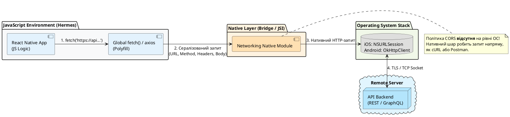
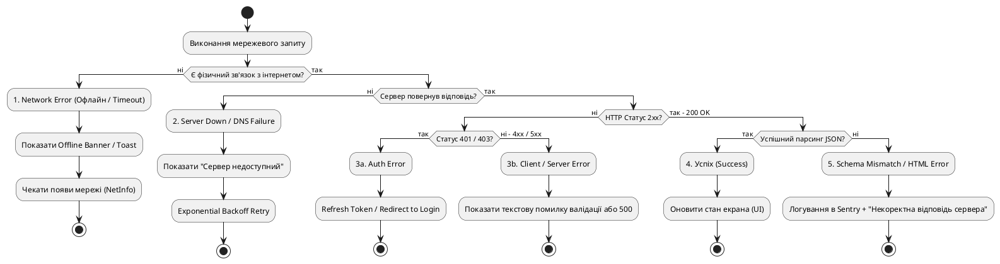
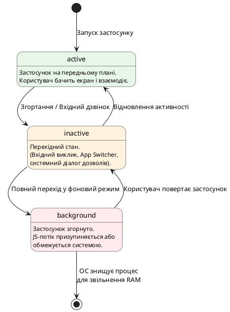

# Робота з мережею та життєвий цикл застосунку

## Від вебу до мобільного пристрою: чому мережа в React Native працює інакше

У веб-розробці ми звикли до відносно стабільного середовища. Користувач відкриває сайт у браузері на ноутбуці чи комп'ютері, де майже завжди є стабільний Ethernet або Wi-Fi. Якщо інтернет зникає, браузер сам покаже стандартну сторінку помилки з «динозавриком», а розробник у коді React рідко переймається тим, що запит `fetch('/api/users')` раптово обірветься на пів дорозі через вхід у ліфт чи тунель метро.

У мобільних застосунках **мережеве середовище агресивне й нестабільне**. Телефон постійно рухається у просторі:

1. **Перемикання базових станцій та мереж** — пристрій переходить з Wi-Fi кав'ярні на LTE/5G мобільного оператора. У цей момент змінюється IP-адреса пристрою, а відкриті TCP-з'єднання обриваються.
2. **Зони з нульовим покриттям («мертві зони»)** — ліфти, підземні паркінги, тунелі метро, заміські траси. Запит виходить з пристрою, але відповідь не повертається.
3. **Обмеження ресурсомісткості ОС** — операційна система (iOS чи Android) стежить за зарядом батареї. Якщо ваш застосунок згортають у фоновий режим під час виконання запиту, ОС може примусово «приспати» мережевий socket або взагалі завершити процес.

Крім того, існує фундаментальна різниця у тому, **хто саме** виконує мережевий запит у мобільному застосунку.

### Місток від Web React до React Native: що відбувається під капотом

У браузері запит виконує двигун браузера (Chrome V8, Firefox Gecko, Safari WebKit), який суворо дотримується політики безпеки **CORS (Cross-Origin Resource Sharing)**. Якщо сервер не надіслав правильні заголовки `Access-Control-Allow-Origin`, браузер заблокує відповідь.

У React Native ситуація інша. Хоча ви пишете звичайний JS-код:

```typescript
fetch('https://api.nomad.app/v1/trips');
```

JavaScript-рушій Hermes **не виконує мережеві запити сам**. Він передає цей намір нативному шару операційної системи.

- На **iOS** запит виконується через нативний системний модуль **`NSURLSession`**.
- На **Android** запит виконується через нативну бібліотеку **`OkHttpClient`** (або системний `HttpURLConnection`).

::plant-uml



::

::note
**Ключовий висновок:** Мережевий запит у React Native проходить шлях від JS-коду через JSI (JavaScript Interface) до нативних мережевих стеків операційної системи. З одного боку, це звільняє вас від обмежень CORS. З іншого — накладає відповідальність за обробку системних таймаутів, енергозбереження та стан з'єднання.
::

---

## Анатомія HTTP-запитів: `fetch` vs `axios` у мобільному середовищі

Оскільки глобальна функція `fetch` доступна в React Native «з коробки», багато новачків починають саме з неї. Проте в мобільній розробці є критичні нюанси, які відрізняють `fetch` від сторонніх бібліотек на кшталт `axios`.

### Глобальний `fetch` у React Native та його пастки

React Native надає поліфіл `fetch`, який відтворює стандартний браузерний W3C Fetch API. Проте в мобільному середовищі у `fetch` є дві небезпечні особливості:

1. **Відсутність таймауту за замовчуванням.** Якщо пристрій потрапить у зону слабкого покриття, де пакети втрачаються (packet loss), `fetch` чекатиме відповіді **нескінченно довго**. Запит «висить», з'єднання не закривається, пам'ять та акумулятор виснажуються, а користувач бачить вічний індикатор завантаження.
2. **`fetch` не вважає статус 4xx або 5xx помилкою.** Якщо сервер відповів `500 Internal Server Error` або `404 Not Found`, проміс `fetch` успішно виконається (`resolved`), і вам потрібно вручну перевіряти властивість `response.ok`.

Щоб вирішити проблему з таймаутом у `fetch`, використовують контролер скасування **`AbortController`**:

```typescript
async function fetchTripsWithTimeout(timeoutMs = 8000) {
  const controller = new AbortController();
  // Встановлюємо таймер примусового скасування
  const timerId = setTimeout(() => controller.abort(), timeoutMs);

  try {
    const response = await fetch('https://api.nomad.app/v1/trips', {
      signal: controller.signal,
      headers: {
        'Accept': 'application/json',
      },
    });

    if (!response.ok) {
      throw new Error(`HTTP error! status: ${response.status}`);
    }

    const data = await response.json();
    return data;
  } catch (error: any) {
    if (error.name === 'AbortError') {
      throw new Error('Мережевий запит перевищив ліміт часу (Timeout)');
    }
    throw error;
  } finally {
    clearTimeout(timerId);
  }
}
```

### Чому в реальних мобільних проєктах часто обирають `axios`

Бібліотека `axios` вирішує більшість рутинних задач мобільної мережі «із коробки»:

- **Вбудовані таймаути:** достатньо вказати `timeout: 10000` у мілісекундах.
- **Автоматична трансформація JSON:** не потрібно викликати `.json()` вручну.
- **Перехоплювачі (Interceptors):** дозволяють підставляти токени автентифікації в кожен запит та централізовано обробляти помилки (наприклад, оновлювати expired-токен при 401).
- **Автоматична автоматика викидання помилок:** будь-який HTTP-код за межами 2xx одразу потрапляє в блок `catch`.

Порівняємо обидва підходи:

::tabs

::tabs-item{label="axios (Рекомендовано)"}

```typescript
import axios from 'axios';

// Створюємо налаштований екземпляр для нашого API
export const apiClient = axios.create({
  baseURL: 'https://api.nomad.app/v1',
  timeout: 10000, // 10 секунд таймаут
  headers: {
    'Content-Type': 'application/json',
  },
});

// Додаємо інтерцептор для токена
apiClient.interceptors.request.use((config) => {
  const token = 'user-auth-token-placeholder'; // Отримаємо з SecureStore
  if (token) {
    config.headers.Authorization = `Bearer ${token}`;
  }
  return config;
});

// Використання
async function getTrips() {
  try {
    const response = await apiClient.get('/trips');
    return response.data; // Автоматично розпарсений JSON
  } catch (error) {
    if (axios.isAxiosError(error)) {
      if (error.code === 'ECONNABORTED') {
        console.error('Таймаут з'єднання з сервером');
      } else {
        console.error(`Помилка сервера: ${error.response?.status}`);
      }
    }
    throw error;
  }
}
```

::

::tabs-item{label="fetch"}

```typescript
// Ручна обробка заголовків, таймауту та статусів
async function getTripsFetch() {
  const controller = new AbortController();
  const timerId = setTimeout(() => controller.abort(), 10000);

  try {
    const token = 'user-auth-token-placeholder';
    const response = await fetch('https://api.nomad.app/v1/trips', {
      method: 'GET',
      signal: controller.signal,
      headers: {
        'Content-Type': 'application/json',
        'Authorization': `Bearer ${token}`,
      },
    });

    if (!response.ok) {
      throw new Error(`HTTP Status ${response.status}`);
    }

    return await response.json();
  } catch (error: any) {
    if (error.name === 'AbortError') {
      console.error('Таймаут запиту');
    }
    throw error;
  } finally {
    clearTimeout(timerId);
  }
}
```

::

::

### Анатомія конфігурації мережевого запиту

При побудові мережевого шару мобільного застосунку звертайте увагу на наступні параметри:

::field-group

::field{name="baseURL" type="string" required="true"}
Базовий URL вашого сервера API (наприклад, `https://api.nomad.app/v1`). Дозволяє не дублювати доменне ім'я в кожному запиті.
::

::field{name="timeout" type="number" default="10000"}
Час очікування відповіді в мілісекундах. У мобільних застосунках оптимальним значенням є **5000–10000 мс (5–10 секунд)**. Чекати довше 15 секунд немає сенсу — користувач, швидше за все, уже закриє екран.
::

::field{name="headers" type="object"}
Заголовки HTTP-запиту. Для мобільних додатків обов'язково передавати `Accept: application/json`, а також корисні кастомні заголовки: `User-Agent` (наприклад, `Nomad/1.0 (iOS 17.2)`), `X-App-Version`, `X-Platform` (`ios` або `android`).
::

::field{name="signal" type="AbortSignal"}
Об'єкт сигналу для скасування запиту. Використовується, коли користувач залишає екран (unmount компонента), не дочекавшись завантаження даних.
::

::

::warning
**Типова помилка новачка у вебі:** Залишати таймаути 30–60 секунд або не обробляти `unmount` компонента. Якщо користувач відкрив екран деталей поїздки, за чекання в 10 секунд натиснув «Назад», а запит повернувся пізніше і спробував оновити стан розмонтованого екрана — у старіших версіях React ви отримаєте memory leak warning, а у застосунку виникне марне споживання трафіку та акумулятора.
::

---

## Таксономія помилок мережі (Error Taxonomy) та стратегії повторних спроб

У мобільних застосунках найгірше, що можна зробити при виникненні помилки мережі — це показати користувачу технічний екран з текстом `AxiosError: Network Error` або незрозумілий `alert(error.message)`.

Щоб побудувати надійну систему обробки помилок, їх потрібно розділити на **чотири чіткі рівні** (таксономія). Кожен рівень вимагає власної стратегії інформування користувача та повторних спроб.

::plant-uml



::

### 4 рівні помилок та реакція застосунку

::field-group

::field{name="1. Мережевий рівень (Network & Timeout)" type="рівень помилки"}
**Причини:** відсутність інтернету, втрата пакетів у 4G, розрив TCP-з'єднання, перевищення таймауту (Timeout).
**Що бачити користувач:** «Немає підключення до мережі» або «Час очікування вичерпано».
**Реакція системи:** не завалювати сервер повторними запитами. Запропонувати кнопку «Повторити спробу» (Retry) або автоматично повторити запит, коли пристрій відновить зв'язок з інтернетом.
::

::field{name="2. Серверний рівень (HTTP 5xx)" type="рівень помилки"}
**Причини:** `500 Internal Server Error`, `502 Bad Gateway`, `503 Service Unavailable`. Сервер перезавантажується або не впорається з навантаженням.
**Що бачити користувач:** «Сервер тимчасово недоступний. Ми вже лагодимо це».
**Реакція системи:** **Exponential Backoff із Jitter** — повторна спроба через 1с, потім 2с, 4с, 8с з додаванням рандомної затримки. Це запобігає «шторму запитів» (Thundering Herd Problem), коли тисячі мобільних пристроїв одночасно намагаються перепідключитися до відновленого сервера.
::

::field{name="3. Авторизаційний та бізнес-рівень (HTTP 4xx)" type="рівень помилки"}
**Причини:** `401 Unauthorized` (застарілий access-токен), `403 Forbidden` (немає прав), `422 Unprocessable Entity` (помилка валідації форми).
**Що бачити користувач:** підказки біля полів форми або перенаправлення на екран входу.
**Реакція системи:** при `401` — спробувати фоново оновити токен через Refresh Token. Якщо не вдалося — очистити сесію та перенаправити на Auth-екран. **Ніколи не робити автоматичні retry для помилок 4xx**, оскільки повторний запит з тими самими даними дасть той самий негативний результат!
::

::field{name="4. Рівень парсингу даних (Schema & Parsing)" type="рівень помилки"}
**Причини:** сервер замість JSON повернув HTML-сторінку помилки Nginx, або змістилися назви полів у JSON.
**Що бачити користувач:** «Помилка обробки даних».
**Реакція системи:** відправка трасування та стеку помилки у системи моніторингу (Sentry, Bugsnag).
::

::

### Створення уніфікованого нормалізатора помилок (`AppError`)

Щоб не обробляти Axios-помилки розкидано по всьому коду, створюють єдиний клас-нормалізатор:

```typescript
export enum ErrorKind {
  Network = 'NETWORK',
  Timeout = 'TIMEOUT',
  Server = 'SERVER',
  Unauthorized = 'UNAUTHORIZED',
  NotFound = 'NOT_FOUND',
  Validation = 'VALIDATION',
  Unknown = 'UNKNOWN',
}

export class AppError extends Error {
  constructor(
    public readonly kind: ErrorKind,
    public readonly userMessage: string,
    public readonly statusCode?: number,
    public readonly originalError?: unknown
  ) {
    super(userMessage);
    this.name = 'AppError';
  }

  static from(error: unknown): AppError {
    if (error instanceof AppError) return error;

    // Якщо це помилка Axios
    if (typeof error === 'object' && error !== null && 'isAxiosError' in error) {
      const axiosErr = error as any;

      if (axiosErr.code === 'ECONNABORTED') {
        return new AppError(
          ErrorKind.Timeout,
          'Запит тривав занадто довго. Перевірте з'єднання.',
          undefined,
          error
        );
      }

      if (!axiosErr.response) {
        return new AppError(
          ErrorKind.Network,
          'Відсутнє з'єднання з інтернетом або сервером.',
          undefined,
          error
        );
      }

      const status = axiosErr.response.status;
      if (status === 401) {
        return new AppError(ErrorKind.Unauthorized, 'Сесія вичерпана. Увійдіть знову.', status, error);
      }
      if (status === 404) {
        return new AppError(ErrorKind.NotFound, 'Запитуваний ресурс не знайдено.', status, error);
      }
      if (status >= 500) {
        return new AppError(ErrorKind.Server, 'На сервері сталася помилка. Спробуйте пізніше.', status, error);
      }
    }

    return new AppError(ErrorKind.Unknown, 'Сталася несподівана помилка.', undefined, error);
  }
}
```

### Приклади використання `AppError` у реальному коді

Тепер подивимося, як використовувати `AppError` у різних сценаріях мобільного застосунку:

::tabs

::tabs-item{label="Базове використання в API-функції"}

```typescript
import { apiClient } from './client';
import { AppError } from './AppError';

export async function fetchTrips() {
  try {
    const response = await apiClient.get('/trips');
    return response.data;
  } catch (error) {
    // Нормалізуємо будь-яку помилку до AppError
    throw AppError.from(error);
  }
}

// Використання в компоненті
async function loadTrips() {
  try {
    const trips = await fetchTrips();
    setTrips(trips);
  } catch (error) {
    const appError = AppError.from(error);
    
    // Відображаємо зрозуміле повідомлення користувачу
    Alert.alert('Помилка', appError.userMessage);
    
    // Логування технічних деталей для розробника
    console.error('[LoadTrips Error]', {
      kind: appError.kind,
      status: appError.statusCode,
      original: appError.originalError,
    });
  }
}
```

::

::tabs-item{label="Умовна логіка на основі типу помилки"}

```typescript
import { AppError, ErrorKind } from './AppError';

async function handleTripUpdate(tripId: string, data: TripData) {
  try {
    const response = await apiClient.put(`/trips/${tripId}`, data);
    return response.data;
  } catch (error) {
    const appError = AppError.from(error);

    // Різна обробка залежно від типу помилки
    switch (appError.kind) {
      case ErrorKind.Network:
      case ErrorKind.Timeout:
        // Пропонуємо повторити запит
        Alert.alert(
          'Проблеми з мережею',
          appError.userMessage,
          [
            { text: 'Скасувати', style: 'cancel' },
            { text: 'Повторити', onPress: () => handleTripUpdate(tripId, data) }
          ]
        );
        break;

      case ErrorKind.Unauthorized:
        // Перенаправляємо на екран авторизації
        navigation.navigate('Login');
        break;

      case ErrorKind.NotFound:
        // Показуємо, що поїздка більше не існує
        Alert.alert('Поїздка не знайдена', 'Можливо, вона була видалена.');
        navigation.goBack();
        break;

      case ErrorKind.Server:
        // Логуємо в Sentry для моніторингу
        Sentry.captureException(appError.originalError);
        Alert.alert('Помилка сервера', appError.userMessage);
        break;

      default:
        Alert.alert('Помилка', appError.userMessage);
    }

    throw appError;
  }
}
```

::

::tabs-item{label="Інтеграція з React State"}

```typescript
import React, { useState, useEffect } from 'react';
import { View, Text, ActivityIndicator, Button } from 'react-native';
import { AppError, ErrorKind } from '../api/AppError';
import { fetchTrips } from '../api/tripsApi';

export const TripsListScreen: React.FC = () => {
  const [trips, setTrips] = useState([]);
  const [loading, setLoading] = useState(true);
  const [error, setError] = useState<AppError | null>(null);

  const loadTrips = async () => {
    setLoading(true);
    setError(null);

    try {
      const data = await fetchTrips();
      setTrips(data);
    } catch (err) {
      setError(AppError.from(err));
    } finally {
      setLoading(false);
    }
  };

  useEffect(() => {
    loadTrips();
  }, []);

  if (loading) {
    return (
      <View style={{ flex: 1, justifyContent: 'center', alignItems: 'center' }}>
        <ActivityIndicator size="large" />
      </View>
    );
  }

  if (error) {
    return (
      <View style={{ flex: 1, justifyContent: 'center', alignItems: 'center', padding: 24 }}>
        <Text style={{ fontSize: 18, fontWeight: 'bold', marginBottom: 8 }}>
          {error.kind === ErrorKind.Network ? '📡 Немає з'єднання' : '⚠️ Помилка'}
        </Text>
        <Text style={{ textAlign: 'center', color: '#666', marginBottom: 16 }}>
          {error.userMessage}
        </Text>
        <Button title="Повторити спробу" onPress={loadTrips} />
      </View>
    );
  }

  return (
    <FlatList
      data={trips}
      renderItem={({ item }) => <TripCard trip={item} />}
      keyExtractor={(item) => item.id}
    />
  );
};
```

::

::tabs-item{label="Кастомний хук з AppError"}

```typescript
import { useState, useCallback } from 'react';
import { AppError } from '../api/AppError';

export function useApiRequest<T>(apiFunc: () => Promise<T>) {
  const [data, setData] = useState<T | null>(null);
  const [loading, setLoading] = useState(false);
  const [error, setError] = useState<AppError | null>(null);

  const execute = useCallback(async () => {
    setLoading(true);
    setError(null);

    try {
      const result = await apiFunc();
      setData(result);
      return result;
    } catch (err) {
      const appError = AppError.from(err);
      setError(appError);
      throw appError;
    } finally {
      setLoading(false);
    }
  }, [apiFunc]);

  const reset = useCallback(() => {
    setData(null);
    setError(null);
    setLoading(false);
  }, []);

  return { data, loading, error, execute, reset };
}

// Використання хука
function MyComponent() {
  const { data, loading, error, execute } = useApiRequest(() => fetchTrips());

  useEffect(() => {
    execute();
  }, []);

  // Тепер error завжди має тип AppError з передбачуваною структурою
  if (error) {
    return <ErrorView message={error.userMessage} onRetry={execute} />;
  }

  // ...решта логіки
}
```

::

::

::tip
**Практична порада:** Нормалізатор `AppError` дозволяє розділити технічні деталі (які відправляються в логи/Sentry) від повідомлень для UI, які бачить звичайний користувач у банерах чи модальних вікнах. Завдяки enum `ErrorKind` ви отримуєте type-safe перевірку типу помилки через `switch/case`, що робить код надійнішим та зручнішим для рефакторингу.
::

---

## Відстеження стану мережі у реальному часі: `@react-native-community/netinfo`

Дізнатися про відсутність інтернету **до** того, як користувач натисне кнопку і чекатиме 10 секунд таймауту — це ознака якісного мобільного застосунку.

Оскільки в самому core-пакеті React Native модуля мережевого стану немає (його винесли в процесі Lean Core), стандартним рішенням у спільноті є пакет **`@react-native-community/netinfo`**.

### Установка в Expo

```bash
npx expo install @react-native-community/netinfo
```

### Плутанина двох прапорців: `isConnected` vs `isInternetReachable`

Коли ви запитуєте стан мережі у `NetInfo`, об'єкт стану повертає дві ключові boolean-властивості:

::field-group

::field{name="isConnected" type="boolean"}
Показує, чи пристрій підключений до **мережевого інтерфейсу** (Wi-Fi роутера, мобільної вежі 3G/4G/5G, Ethernet).
`true` означає лише те, що телефон має мережевий зв'язок з локальним пристроєм/роутером. Це **не гарантує**, що через цей роутер є вихід у глобальний інтернет!
::

::field{name="isInternetReachable" type="boolean | null"}
Показує, чи пристрій дійсно може **достукатися до глобального інтернету**.
Система перевіряє це шляхом фонового надсилання короткачасового запиту на системні сервери (Apple чи Google).
* `null` — стан ще перевіряється (при старті);
* `false` — Wi-Fi є (наприклад, у готелі з Captive Portal сторінкою входу або в метро), але інтернет **не доступний**;
* `true` — інтернет повністю функціонує.
::

::

::warning
**Плутанина прапорців:** Перевірка `if (state.isConnected)` — це найпоширеніша помилка. Якщо користувач підключився до Wi-Fi у потягу, який їде лісом (Wi-Fi роутер у вагоні працює, але супутникового/мобільного зв'язку у роутера немає), `isConnected` буде `true`, але реальні запити падатимуть. **Завжди орієнтуйтесь на `isInternetReachable === true`** або сукупність двох прапорців!
::

### Кастомний React-хук: `useNetworkStatus`

Створимо зручний хук для використання у будь-якому компоненті:

```typescript
import { useEffect, useState } from 'react';
import NetInfo, { NetInfoState } from '@react-native-community/netinfo';

export interface NetworkStatus {
  isConnected: boolean;
  isInternetReachable: boolean;
  isOffline: boolean;
  type: string;
}

export function useNetworkStatus(): NetworkStatus {
  const [status, setStatus] = useState<NetworkStatus>({
    isConnected: true,
    isInternetReachable: true,
    isOffline: false,
    type: 'unknown',
  });

  useEffect(() => {
    // Передплата на зміни стану мережі в реальному часі
    const unsubscribe = NetInfo.addEventListener((state: NetInfoState) => {
      const isConnected = state.isConnected ?? false;
      const isInternetReachable = state.isInternetReachable ?? false;

      // Пристрій вважається офлайн, якщо немає з'єднання АБО інтернет недосяжний
      const isOffline = !isConnected || !isInternetReachable;

      setStatus({
        isConnected,
        isInternetReachable,
        isOffline,
        type: state.type,
      });
    });

    return () => unsubscribe();
  }, []);

  return status;
}
```

### Приклад UI: Індикатор відсутності мережі (Offline Banner)

Використовуючи хук `useNetworkStatus`, ми можемо показати ненав'язливий плаваючий плашка-банер у шапці застосунку:

```typescript
import React from 'react';
import { View, Text, StyleSheet } from 'react-native';
import { useNetworkStatus } from './useNetworkStatus';

export const OfflineBanner: React.FC = () => {
  const { isOffline } = useNetworkStatus();

  if (!isOffline) return null;

  return (
    <View style={styles.banner}>
      <Text style={styles.text}>
        Немає підключення до інтернету. Робота в офлайн-режимі.
      </Text>
    </View>
  );
};

const styles = StyleSheet.create({
  banner: {
    backgroundColor: '#D32F2F', // Червоний застережливий колір
    paddingVertical: 8,
    paddingHorizontal: 16,
    alignItems: 'center',
    justifyContent: 'center',
  },
  text: {
    color: '#FFFFFF',
    fontSize: 13,
    fontWeight: '600',
  },
});
```

---

## Життєвий цикл мобільного застосунку: `AppState`

На відміну від веб-сторінки, де користувач або відкрив вкладку, або закрив її, мобільний застосунок живе у складі складної операційної системи з жорстким керуванням пам'яттю та ресурсами.

Коли користувач натискає кнопку Home, перемикається на Telegram чи йому надходить вхідний дзвінок — ваш застосунок не закривається повністю, а змінює свій **стан життєвого циклу (AppState)**.

### Три стани `AppState`

Операційні системи iOS та Android визначають три основні стани застосунку:

::plant-uml



::

::field-group

::field{name="active" type="стан AppState"}
Застосунок працює на передньому плані (foreground), видимий на екрані та реагує на всі жести й натискання користувача.
::

::field{name="inactive" type="стан AppState"}
Перехідний стан. Застосунок все ще видимий (або напіввидимий), але не отримує подій дотику.
**Коли виникає:**
* Увімкнення iOS App Switcher (панель перемикання між застосунками);
* Вхідний телефонний дзвінок або будильник;
* Системне вікно запиту дозволу (наприклад, «Надати доступ до геопозиції?»);
* Опускання верхньої шторки сповіщень.
::

::field{name="background" type="стан AppState"}
Застосунок згорнуто і він не видимий користувачу. Він перебуває в пам'яті RAM, але операційна система істотно обмежує виконання JavaScript-коду для економії заряду акумулятора. В будь-який момент при нестачі оперативної пам'яті ОС може **тихо знищити (kill)** процес застосунку без виклику будь-яких destructors!
::

::

### Навіщо розробнику стежити за `AppState`

Робота з `AppState` необхідна для трьох критичних сценаріїв:

1. **Автоматичне поновлення застарілих даних (Refetch on App Active):**
   Якщо користувач відкрив список поїздок о 09:00, згорнув застосунок, а повернувся о 14:00 — дані на екрані застаріли. При переході з `background` у `active` потрібно автоматично підтягнути нові дані з API.
2. **Пауза таймерів, фонової анімації та polling-запитів:**
   Якщо у вас працює `setInterval`, який кожні 5 секунд запитує нові повідомлення з сервера — його **обов'язково потрібно призупиняти** при переході в `background`. Інакше при поверненні в активний стан ви отримаєте пачку накопичених запитів, або акумулятор пристрою буде прискорено розряджатися.
3. **Безпека та приватність (Blur overlay):**
   Банківські додаткові або застосунки з приватними нотатками у стані `inactive` / `background` накривають екран розмитим фоном чи логотипом, щоб у панелі відкритих застосунків (App Switcher) випадковий перехожий не побачив баланс рахунку або особисті фото.

### Кастомний React-хук: `useAppState`

Модуль `AppState` входить до складу ядра React Native. Напишемо зручний хук для відстеження змін стану:

```typescript
import { useEffect, useState } from 'react';
import { AppState, AppStateStatus } from 'react-native';

export function useAppState(): AppStateStatus {
  const [appState, setAppState] = useState<AppStateStatus>(AppState.currentState);

  useEffect(() => {
    // Передплата на зміну стану життєвого циклу
    const subscription = AppState.addEventListener('change', (nextAppState: AppStateStatus) => {
      setAppState(nextAppState);
    });

    return () => {
      subscription.remove();
    };
  }, []);

  return appState;
}
```

---

## Поєднуємо життєвий цикл та мережу: Сценарії автоматичного поновлення даних

Тепер поєднаємо знання про мережу та життєвий цикл застосунку.

У реальному мобільному додатку користувач очікує, що дані на екрані **завжди свіжі**, без необхідності постійно тиснути кнопку «Оновити».

Створимо комплексний хук `useRefetchOnFocusAndNetwork`, який trigger-ить оновлення даних у двох випадках:
1. Користувач повернувся в застосунок із фону (`background` ➔ `active`).
2. Пристрій відновив інтернет-з'єднання після офлайну (`isOffline: true` ➔ `isOffline: false`).

```typescript
import { useEffect, useRef } from 'react';
import { AppStateStatus } from 'react-native';
import { useAppState } from './useAppState';
import { useNetworkStatus } from './useNetworkStatus';

export function useRefetchOnFocusAndNetwork(onRefetch: () => void) {
  const appState = useAppState();
  const { isOffline } = useNetworkStatus();

  // Зберігаємо попередні значення у ref, щоб порівнювати їх без зайвих re-renders
  const prevAppStateRef = useRef<AppStateStatus>(appState);
  const prevOfflineRef = useRef<boolean>(isOffline);

  useEffect(() => {
    // 1. Сценарій повернення з фону у активний стан
    const isReturningToActive =
      prevAppStateRef.current.match(/inactive|background/) && appState === 'active';

    // 2. Сценарій відновлення мережевого підключення
    const isReconnectingToNetwork = prevOfflineRef.current === true && isOffline === false;

    if ((isReturningToActive || isReconnectingToNetwork) && !isOffline) {
      console.log('Поновлення даних: новий фокус або відновлення мережі');
      onRefetch();
    }

    // Оновлюємо refs
    prevAppStateRef.current = appState;
    prevOfflineRef.current = isOffline;
  }, [appState, isOffline, onRefetch]);
}
```

::tip
**Сучасні бібліотеки (RTK Query / TanStack Query):**
У наступних статтях ми побачимо, що бібліотеки управління стейтом на кшталт **RTK Query** або **TanStack Query** (React Query) вже мають вбудовану підтримку `setupListeners` з `NetInfo` та `AppState`. Проте розуміння того, як це працює «під капотом» через нативні події, критично важливе для написання власного мережевого шару або кастомних ефектів.
::

---

## Міні-проєкт: «Курси валют»

У цьому міні-проєкті ми побудуємо самодостатній застосунок для моніторингу курсів валют, який об'єднує всі вивчені концепції мережі та життєвого циклу:

- Отримання даних з публічного API з таймаутом та скасуванням запиту;
- Індикатори завантаження (`ActivityIndicator`), помилки з логікою повторних спроб (Retry);
- Автоматичний індикатор відсутності зв'язку (Offline Banner via `NetInfo`);
- Автоматичне поновлення даних при поверненні в застосунок з фону (`AppState`).

### Структура проєкту

::code-tree

```typescript [src/api/client.ts]
// Налаштований екземпляр axios з таймаутом 8 секунд
```

```typescript [src/api/types.ts]
// TypeScript-інтерфейси курсів валют
```

```typescript [src/hooks/useNetworkStatus.ts]
// Хук для відстеження isInternetReachable
```

```typescript [src/hooks/useAppState.ts]
// Хук для відстеження AppState (active/background)
```

```typescript [src/hooks/useRefetchOnFocusAndNetwork.ts]
// Хук для автоматичного поновлення даних
```

```typescript [src/components/OfflineBanner.tsx]
// Плаваючий плашка-індикатор офлайну
```

```typescript [src/components/ErrorView.tsx]
// Екран помилки з кнопкою повтору
```

```typescript [src/screens/CurrencyRatesScreen.tsx]
// Головний екран зі списком валют
```

```typescript [App.tsx]
// Точка входу застосунку
```

::

### Кроки реалізації

::steps

### Крок 1. Налаштування мережевого клієнта

Створюємо мережевий клієнт з обмеженням таймауту у 8 секунд для публічного API Національного банку України (або будь-якого REST API курсів валют):

```typescript
// src/api/client.ts
import axios from 'axios';

export const currencyApi = axios.create({
  baseURL: 'https://bank.gov.ua/NBUStatService/v1/statdirectory',
  timeout: 8000, // 8 секунд таймаут
  headers: {
    'Accept': 'application/json',
  },
});
```

### Крок 2. Побудова компонента обробки помилок (ErrorView)

Якщо запит завершився з помилкою (наприклад, таймаут або 500 статус), показуємо дружній інтерфейс із можливістю повторити запит вручну:

```typescript
// src/components/ErrorView.tsx
import React from 'react';
import { View, Text, Pressable, StyleSheet } from 'react-native';

interface ErrorViewProps {
  message: string;
  onRetry: () => void;
}

export const ErrorView: React.FC<ErrorViewProps> = ({ message, onRetry }) => (
  <View style={styles.container}>
    <Text style={styles.title}>Помилка завантаження</Text>
    <Text style={styles.message}>{message}</Text>
    <Pressable style={styles.button} onPress={onRetry}>
      <Text style={styles.buttonText}>Повторити спробу</Text>
    </Pressable>
  </View>
);

const styles = StyleSheet.create({
  container: { flex: 1, justifyContent: 'center', alignItems: 'center', padding: 24 },
  title: { fontSize: 18, fontWeight: '700', color: '#111827', marginBottom: 8 },
  message: { fontSize: 14, color: '#6B7280', textAlign: 'center', marginBottom: 16 },
  button: { backgroundColor: '#2563EB', paddingVertical: 12, paddingHorizontal: 24, borderRadius: 8 },
  buttonText: { color: '#FFFFFF', fontWeight: '600', fontSize: 15 },
});
```

### Крок 3. Визначення TypeScript-типів для курсів валют

Створюємо інтерфейс для структури даних, які повертає API Національного банку:

```typescript
// src/api/types.ts
export interface CurrencyRate {
  r030: number;        // Код валюти (цифровий)
  txt: string;         // Назва валюти українською
  rate: number;        // Курс відносно гривні
  cc: string;          // Код валюти (ISO 4217)
  exchangedate: string; // Дата курсу
}
```

### Крок 4. Створення хуку для відстеження стану мережі

Реалізуємо хук, який підписується на події `NetInfo` та повертає актуальний стан з'єднання:

```typescript
// src/hooks/useNetworkStatus.ts
import { useEffect, useState } from 'react';
import NetInfo, { NetInfoState } from '@react-native-community/netinfo';

export interface NetworkStatus {
  isConnected: boolean;
  isInternetReachable: boolean;
  isOffline: boolean;
  type: string;
}

export function useNetworkStatus(): NetworkStatus {
  const [status, setStatus] = useState<NetworkStatus>({
    isConnected: true,
    isInternetReachable: true,
    isOffline: false,
    type: 'unknown',
  });

  useEffect(() => {
    const unsubscribe = NetInfo.addEventListener((state: NetInfoState) => {
      const isConnected = state.isConnected ?? false;
      const isInternetReachable = state.isInternetReachable ?? false;
      const isOffline = !isConnected || !isInternetReachable;

      setStatus({
        isConnected,
        isInternetReachable,
        isOffline,
        type: state.type,
      });
    });

    return () => unsubscribe();
  }, []);

  return status;
}
```

### Крок 5. Створення хуку для відстеження життєвого циклу застосунку

Реалізуємо хук для моніторингу переходів між станами `active`, `inactive` та `background`:

```typescript
// src/hooks/useAppState.ts
import { useEffect, useState } from 'react';
import { AppState, AppStateStatus } from 'react-native';

export function useAppState(): AppStateStatus {
  const [appState, setAppState] = useState<AppStateStatus>(AppState.currentState);

  useEffect(() => {
    const subscription = AppState.addEventListener('change', (nextAppState: AppStateStatus) => {
      setAppState(nextAppState);
    });

    return () => {
      subscription.remove();
    };
  }, []);

  return appState;
}
```

### Крок 6. Створення хуку автоматичного поновлення даних

Об'єднуємо `useAppState` та `useNetworkStatus` для автоматичного оновлення при поверненні з фону або відновленні мережі:

```typescript
// src/hooks/useRefetchOnFocusAndNetwork.ts
import { useEffect, useRef } from 'react';
import { AppStateStatus } from 'react-native';
import { useAppState } from './useAppState';
import { useNetworkStatus } from './useNetworkStatus';

export function useRefetchOnFocusAndNetwork(onRefetch: () => void) {
  const appState = useAppState();
  const { isOffline } = useNetworkStatus();

  const prevAppStateRef = useRef<AppStateStatus>(appState);
  const prevOfflineRef = useRef<boolean>(isOffline);

  useEffect(() => {
    // Сценарій 1: Повернення з фону у активний стан
    const isReturningToActive =
      prevAppStateRef.current.match(/inactive|background/) && appState === 'active';

    // Сценарій 2: Відновлення мережевого підключення
    const isReconnectingToNetwork = prevOfflineRef.current === true && isOffline === false;

    if ((isReturningToActive || isReconnectingToNetwork) && !isOffline) {
      console.log('[Refetch] Поновлення даних: новий фокус або відновлення мережі');
      onRefetch();
    }

    prevAppStateRef.current = appState;
    prevOfflineRef.current = isOffline;
  }, [appState, isOffline, onRefetch]);
}
```

### Крок 7. Створення компонента Offline Banner

Реалізуємо індикатор відсутності інтернету, який з'являється зверху екрана:

```typescript
// src/components/OfflineBanner.tsx
import React from 'react';
import { View, Text, StyleSheet } from 'react-native';
import { useNetworkStatus } from '../hooks/useNetworkStatus';

export const OfflineBanner: React.FC = () => {
  const { isOffline } = useNetworkStatus();

  if (!isOffline) return null;

  return (
    <View style={styles.banner}>
      <Text style={styles.text}>
        📡 Немає підключення до інтернету
      </Text>
    </View>
  );
};

const styles = StyleSheet.create({
  banner: {
    backgroundColor: '#DC2626',
    paddingVertical: 8,
    paddingHorizontal: 16,
    alignItems: 'center',
    justifyContent: 'center',
  },
  text: {
    color: '#FFFFFF',
    fontSize: 13,
    fontWeight: '600',
  },
});
```

### Крок 8. Складання головного екрана зі списком валют

Об'єднуємо всі попередні компоненти у єдиний функціональний екран з підтримкою завантаження, помилок та pull-to-refresh:

```typescript
// src/screens/CurrencyRatesScreen.tsx
import React, { useCallback, useEffect, useState } from 'react';
import {
  View,
  Text,
  FlatList,
  ActivityIndicator,
  StyleSheet,
  RefreshControl,
} from 'react-native';
import { currencyApi } from '../api/client';
import { CurrencyRate } from '../api/types';
import { AppError } from '../api/AppError';
import { ErrorView } from '../components/ErrorView';
import { useRefetchOnFocusAndNetwork } from '../hooks/useRefetchOnFocusAndNetwork';

export const CurrencyRatesScreen: React.FC = () => {
  const [rates, setRates] = useState<CurrencyRate[]>([]);
  const [loading, setLoading] = useState<boolean>(true);
  const [refreshing, setRefreshing] = useState<boolean>(false);
  const [error, setError] = useState<AppError | null>(null);

  const fetchRates = useCallback(async (isManualRefresh = false) => {
    if (isManualRefresh) {
      setRefreshing(true);
    } else {
      setLoading(true);
    }
    setError(null);

    try {
      const response = await currencyApi.get<CurrencyRate[]>('/exchange?json');
      // Фільтруємо популярні валюти
      const popular = response.data.filter((item) =>
        ['USD', 'EUR', 'PLN', 'GBP', 'CHF'].includes(item.cc)
      );
      setRates(popular);
    } catch (err) {
      setError(AppError.from(err));
    } finally {
      setLoading(false);
      setRefreshing(false);
    }
  }, []);

  // Первинне завантаження
  useEffect(() => {
    fetchRates();
  }, [fetchRates]);

  // Автоматичне поновлення при фокусі та відновленні мережі
  useRefetchOnFocusAndNetwork(() => fetchRates());

  if (loading && !refreshing) {
    return (
      <View style={styles.center}>
        <ActivityIndicator size="large" color="#2563EB" />
        <Text style={styles.loadingText}>Отримання актуальних курсів...</Text>
      </View>
    );
  }

  if (error) {
    return <ErrorView message={error.userMessage} onRetry={() => fetchRates()} />;
  }

  return (
    <FlatList
      data={rates}
      keyExtractor={(item) => item.cc}
      refreshControl={
        <RefreshControl
          refreshing={refreshing}
          onRefresh={() => fetchRates(true)}
          colors={['#2563EB']}
        />
      }
      renderItem={({ item }) => (
        <View style={styles.card}>
          <View>
            <Text style={styles.currencyCode}>{item.cc}</Text>
            <Text style={styles.currencyName}>{item.txt}</Text>
          </View>
          <Text style={styles.rateValue}>{item.rate.toFixed(2)} ₴</Text>
        </View>
      )}
      contentContainerStyle={styles.listContent}
    />
  );
};

const styles = StyleSheet.create({
  center: { flex: 1, justifyContent: 'center', alignItems: 'center' },
  loadingText: { marginTop: 12, color: '#6B7280', fontSize: 14 },
  listContent: { padding: 16 },
  card: {
    flexDirection: 'row',
    justifyContent: 'space-between',
    alignItems: 'center',
    backgroundColor: '#FFFFFF',
    padding: 16,
    borderRadius: 12,
    marginBottom: 12,
    shadowColor: '#000',
    shadowOpacity: 0.05,
    shadowRadius: 4,
    elevation: 2,
  },
  currencyCode: { fontSize: 18, fontWeight: '700', color: '#111827' },
  currencyName: { fontSize: 13, color: '#6B7280', marginTop: 2 },
  rateValue: { fontSize: 20, fontWeight: '700', color: '#059669' },
});
```

### Крок 9. Інтеграція всіх компонентів у точці входу App.tsx

Фінальний крок — збираємо повний застосунок з шапкою, офлайн-банером та екраном курсів:

```typescript
// App.tsx
import React from 'react';
import { SafeAreaView, View, Text, StyleSheet, StatusBar } from 'react-native';
import { OfflineBanner } from './src/components/OfflineBanner';
import { CurrencyRatesScreen } from './src/screens/CurrencyRatesScreen';

export default function App() {
  return (
    <SafeAreaView style={styles.safeArea}>
      <StatusBar barStyle="dark-content" backgroundColor="#FFFFFF" />
      
      {/* Офлайн-індикатор */}
      <OfflineBanner />

      {/* Шапка застосунку */}
      <View style={styles.header}>
        <Text style={styles.headerTitle}>Курси валют НБУ</Text>
        <Text style={styles.headerSubtitle}>
          Автопоновлення при поверненні в додаток
        </Text>
      </View>

      {/* Головний екран зі списком */}
      <CurrencyRatesScreen />
    </SafeAreaView>
  );
}

const styles = StyleSheet.create({
  safeArea: { 
    flex: 1, 
    backgroundColor: '#F9FAFB' 
  },
  header: { 
    padding: 16, 
    backgroundColor: '#FFFFFF', 
    borderBottomWidth: 1, 
    borderBottomColor: '#E5E7EB' 
  },
  headerTitle: { 
    fontSize: 22, 
    fontWeight: '800', 
    color: '#111827' 
  },
  headerSubtitle: { 
    fontSize: 13, 
    color: '#6B7280', 
    marginTop: 2 
  },
});
```

::

---

## Практичний крок у Nomad

У наскрізному мобільному щоденнику подорожей **Nomad** ми підключаємо інтеграцію з мок-сервером або віддаленим API для завантаження списку поїздок користувача.

### Навіщо це користувачу

Користувач бачить реальний список своїх подорожей, завантажений із сервера API. Якщо інтернет у дорозі зникає, додаток інформує про офлайн-стан, не падінням або білим екраном, а з можливістю переглядати раніше завантажені поїздки.

### Поточний стан та нові зміни

- **Уже є:** Базова структура навігації, дизайн-токени, картки поїздок та списки.
- **Додаємо в цій статті:**
  - Мережевий шар `src/api/` (`client.ts`, `tripsApi.ts`, `AppError.ts`);
  - Локальний мок-сервер на базі **`json-server`** (`db.json` + `npm run api`);
  - Завантаження списку поїздок через HTTP при старті (`TripsProvider` + GET `/trips`);
  - Індикатори стану: Loading, Error + Retry, Pull-to-Refresh;
  - Хуки `useNetworkStatus`, `useAppState`, `useRefetchOnFocusAndNetwork`;
  - `OfflineBanner` у кореневому `_layout.tsx`.

### Локальне API на базі `json-server`

Для реалістичного розробницького середовища ми використовуємо **`json-server`**. Він дозволяє створити повноцінне REST API з підтримкою фільтрації, пагінації та затримок без написання серверного коду.

#### 1. Створення файлу мок-даних `db.json`

У корені проєкту Nomad створюємо файл `db.json`:

Форма записів збігається з типом `Trip` у застосунку (щоб `TripCard` і деталі працювали без додаткового мапінгу). Скорочений приклад:

```json
{
  "trips": [
    {
      "id": "1",
      "title": "Карпати на вихідні",
      "dateLabel": "12–14 бер. 2026",
      "description": "Говерла, полонини й вечірній чай біля каміну в котеджі.",
      "coverUri": "https://images.unsplash.com/photo-1464822759023-fed622ff2c3b?w=800&q=80",
      "region": "Карпати"
    },
    {
      "id": "2",
      "title": "Львівський вікенд",
      "dateLabel": "2–4 трав. 2026",
      "description": "Кава, площа Ринок, закапелки й нічний трамвай.",
      "coverUri": "https://images.unsplash.com/photo-1555881400-74d7acaacd8b?w=800&q=80",
      "region": "Захід"
    }
  ]
}
```

Повний seed (12 поїздок) — у `db.json` репозиторію Nomad.

#### 2. Запуск з прив'язкою до `--host 0.0.0.0`

::warning
**Обов'язковий прапорець `--host 0.0.0.0`:** За замовчуванням `json-server` слухає лише `127.0.0.1`. Мобільний пристрій або емулятор вважає `127.0.0.1` **власною адресою**, тому спроба зробити запит до `http://127.0.0.1:3000` з Android-емулятора або смартфона завершиться помилкою `Network Error`.
::

Додаємо скрипт у `package.json` та запускаємо його:

```json
"scripts": {
  "api": "json-server --watch db.json --port 3000 --host 0.0.0.0"
}
```

#### 3. Динамічне визначення `baseURL` для різних пристроїв

Оскільки iOS Симулятор, Android Емулятор та фізичний телефон через Expo Go підключаються до вашого комп'ютера по-різному, налаштовуємо мережевий клієнт у `src/api/client.ts`:

```typescript
import { Platform } from 'react-native';
import Constants from 'expo-constants';
import axios from 'axios';

const getBaseUrl = (): string => {
  // 1. Android Emulator використовує спеціальний псевдонім 10.0.2.2
  if (Platform.OS === 'android') {
    return 'http://10.0.2.2:3000';
  }

  // 2. Для реального смартфона (Expo Go) беремо IP-адресу ПК з конфігурації Expo
  const hostUri = Constants.expoConfig?.hostUri;
  if (hostUri) {
    const ip = hostUri.split(':').shift();
    return `http://${ip}:3000`;
  }

  // 3. iOS Simulator може звертатися через localhost
  return 'http://localhost:3000';
};

export const apiClient = axios.create({
  baseURL: getBaseUrl(),
  timeout: 8000,
  headers: {
    'Content-Type': 'application/json',
  },
});
```

::tip
**Як перевірити:** Після запуску `npm run api` та `npx expo start`, клієнт автоматично вибере потрібну IP-адресу залежно від того, де саме запущено застосунок (на симуляторі Mac, Android Studio чи на реальному пристрої через QR-код).
::

### Знімок файлової структури проєкту Nomad

::code-tree

```json [db.json]
// Seed для json-server (масив trips)
```

```typescript [app/_layout.tsx]
// OfflineBanner + TripsProvider + root Stack
```

```typescript [app/(tabs)/trips/index.tsx]
// Список: loading / error / pull-to-refresh / дані з API
```

```typescript [src/api/client.ts]
// Axios (baseURL + timeout 8 с)
```

```typescript [src/api/tripsApi.ts]
// fetchTrips(), fetchTripById()
```

```typescript [src/api/AppError.ts]
// Таксономія помилок → userMessage
```

```typescript [src/components/OfflineBanner.tsx]
// Плашка "немає інтернету"
```

```typescript [src/hooks/useNetworkStatus.ts]
// NetInfo (isOffline)
```

```typescript [src/hooks/useAppState.ts]
// AppState
```

```typescript [src/hooks/useRefetchOnFocusAndNetwork.ts]
// Refetch при active / reconnect
```

```typescript [src/features/trips/model/TripsProvider.tsx]
// Завантаження з API, refetch, локальний addTrip
```

::

### Перевірка роботи

1. Запустіть проєкт у Expo Go або емуляторі: `npx expo start`.
2. При завантаженні списку поїздок відображається індикатор `ActivityIndicator`.
3. Увімкніть Режим польоту (Airplane Mode) на телефоні або вимкніть Wi-Fi на емуляторі: зверху екрана миттєво з'явиться червоний банер **«Немає підключення до інтернету»**.
4. Згорніть додаток, увімкніть мережу та розгорніть додаток — список поїздок фоново поновиться без додаткових дій користувача.

### Повідомлення коміту в репозиторії Nomad

```bash
git commit -m "$(cat <<'EOF'
feat: fetch trips from API

Material: content/15.react-native/14.networking-and-app-lifecycle.md
EOF
)"
```

---

## Самостійні практичні завдання

| Рівень | Завдання |
| :--- | :--- |
| **Basic** | Додати у міні-проєкт «Курси валют» поле `input` для пошуку / фільтрації за назвою валюти. Реалізувати виклики `fetchRates()` через стандартну кнопку «Оновити». |
| **Intermediate** | Написати кастомний хук `useFetch<T>(url: string)`, який приймає URL, створює `AbortController`, скасовує запит при размонтировании компонента (unmount) та повертає `{ data, loading, error, refetch }`. |
| **Pro** | Реалізувати перехоплювач Axios (Interceptor) для оновлення застарілого токена авторизації (Refresh Token Flow). Якщо запит повертає `401 Unauthorized`, перехоплювач повинен поставити наступні запити на чергу (queue), виконати один фоновий `POST /auth/refresh`, оновити токен у SecureStore та повторити зупинені запити. |

---

## Поширені запитання (FAQ)

::accordion

::accordion-item{title="Чому у моєму мобільному додатку виникає Network Error при зверненні до localhost?"}
У мобільному емуляторі `localhost` або `127.0.0.1` посилається на **сам емулятор/телефон**, а не на ваш комп'ютер, де запущено сервер API!
- Для **Android Emulator**: використовуйте спеціальну IP-адресу `http://10.0.2.2:3000`.
- Для **iOS Simulator**: можна використовувати `http://localhost:3000` або локальну IP-адресу комп'ютера в мережі Wi-Fi (наприклад `http://192.168.1.50:3000`).
- Для **фізичного телефону**: телефон та комп'ютер повинні бути в одній Wi-Fi мережі, і в якості URL слід вказувати локальну IP-адресу вашого комп'ютера.
::

::accordion-item{title="Чи працює CORS у React Native?"}
Ні. Політика безпеки CORS — це обмеження, яке впроваджується виключно **браузерами**. Нативні мережеві стеки iOS (`NSURLSession`) та Android (`OkHttpClient`) роблять HTTP-запити напряму без перевірки заголовків CORS.
::

::accordion-item{title="Що відбувається із запитом fetch, якщо користувач згортає додаток?"}
Якщо запит вже виконується на нативному рівні ОС, він може завершитися, але якщо додаток перебуває у фоні понад кілька секунд, операційна система призупиняє JS-потік, і обробник `.then()` або `await` виконається лише тоді, коли користувач поверне додаток в активний стан.
::

::

