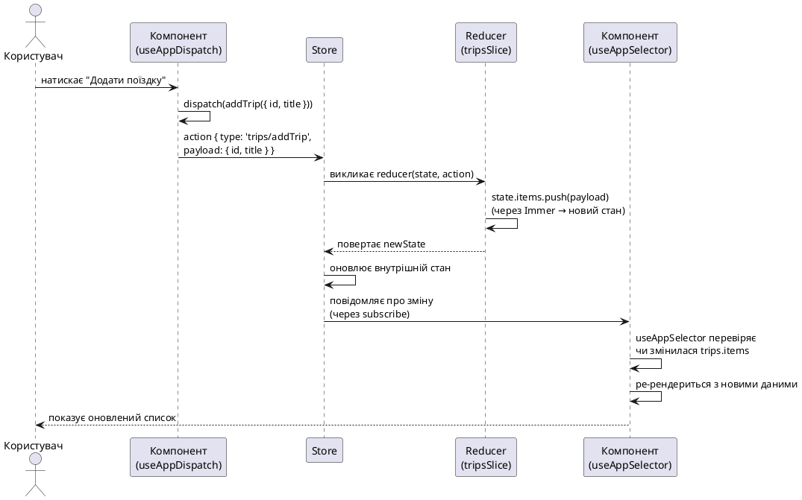

# Redux Toolkit на мобільних платформах

## Навіщо централізоване сховище на мобільному пристрої

Уявіть, що ви працюєте над мобільним застосунком з кількома екранами: список поїздок, деталі кожної поїздки, форма створення нової поїздки, екран налаштувань користувача з перемикачем теми. Кожен екран потребує доступу до частини загального стану — наприклад, обрана тема має відображатися скрізь одночасно, а список поїздок має оновлюватися відразу після додавання нової.

У веб-застосунку React ви, ймовірно, вже стикалися з подібною задачею і знаєте кілька підходів: локальний стан компонента, підняття стану вгору, Context API або бібліотека керування станом на кшталт Redux. У мобільному застосунку React Native ситуація аналогічна — ті самі React-компоненти, той самий однонаправлений потік даних, але з кількома важливими нюансами, властивими мобільній платформі.

По-перше, **навігація між екранами** в React Native працює інакше, ніж у браузері. Коли користувач переходить на новий екран, попередній екран може залишатися змонтованим у пам'яті (залежно від структури навігації), або може бути розмонтований і змонтований знову при поверненні. Якщо стан зберігається локально всередині компонента екрана, при розмонтуванні він загубиться. Централізоване сховище допомагає зберегти стан незалежно від життєвого циклу окремих екранів.

По-друге, **обсяг пам'яті на мобільному пристрої обмежений** порівняно з десктопним браузером. Операційна система може вивантажити застосунок із пам'яті, якщо користувач згортає його на тривалий час. Коли застосунок повертається з фону, React Native запускає JavaScript-середовище заново — усі змінні, стан компонентів, локальні дані губляться. Центральне сховище (store) у поєднанні з персистентністю (збереженням у локальне сховище пристрою) дозволяє відновити стан застосунку після перезапуску.

По-третє, **асинхронні операції** (завантаження даних із сервера, збереження у локальну базу даних, обробка жестів користувача) є невід'ємною частиною мобільного досвіду. Redux Toolkit (скорочено RTK) надає інструменти для керування асинхронною логікою (`createAsyncThunk`), що робить код передбачуваним і зрозумілим.

Нарешті, **тестування й дебаг** мобільних застосунків можуть бути складнішими, ніж веб-застосунків, оскільки девтули браузера не завжди доступні в тій самій формі. Redux DevTools (доступний через React Native Debugger або Flipper) дозволяє інспектувати стан, бачити історію дій (actions), перемотувати стан назад і вперед — це істотно полегшує розробку.

::note
**Головна думка:** централізоване сховище стану в мобільному застосунку вирішує проблеми життєвого циклу екранів, обмеженості пам'яті, асинхронних операцій і складності дебагу. Redux Toolkit — це офіційний, рекомендований спосіб використання Redux, який зменшує обсяг шаблонного коду (boilerplate) і надає зручні інструменти для типізації та асинхронної логіки.
::

У цій статті ми розглянемо, як інтегрувати Redux Toolkit у React Native застосунок, створити перше сховище (store), написати slice для керування списком поїздок, налаштувати типізовані хуки для безпечного доступу до стану з компонентів, а також зрозуміємо, чому серіалізованість даних критична в Redux і як це впливає на мобільну розробку. В кінці ми застосуємо всі ці знання в проєкті Nomad — створимо `tripsSlice`, підключимо store до кореневого layout і побачимо, як список поїздок стає керованим через центральне сховище.


## Що таке Redux Toolkit і чому він з'явився

### Історія та контекст

Redux — це бібліотека для керування станом JavaScript-застосунку, створена Деном Абрамовим (Dan Abramov) у 2015 році. Основна ідея Redux полягає в тому, що весь стан застосунку зберігається в **одному глобальному об'єкті** (store), зміна якого відбувається через **чисті функції** (reducers), що приймають поточний стан і дію (action) і повертають новий стан. Завдяки цьому підходу стан стає передбачуваним, легко тестується, і можна реалізувати time-travel debugging (перемотування історії змін стану).

Проте класичний Redux вимагав написання великої кількості шаблонного коду: окремі файли для типів дій (action types), функцій-творців дій (action creators), reducer-ів, middleware для асинхронної логіки (наприклад, redux-thunk або redux-saga). Розробники скаржилися, що для додавання однієї простої фічі потрібно редагувати п'ять різних файлів і писати десятки рядків повторюваного коду.

У 2019 році команда Redux представила **Redux Toolkit (RTK)** — офіційний набір інструментів, який спрощує роботу з Redux і включає:

- **`configureStore`** — функцію для створення store з розумними налаштуваннями за замовчуванням (включає redux-thunk, DevTools extension, перевірки на мутації та серіалізованість у development-режимі).
- **`createSlice`** — функцію, яка генерує reducer і action creators автоматично на основі об'єкта з описом стану та дій. Більше не потрібно писати switch/case вручну.
- **`createAsyncThunk`** — помічника для асинхронних операцій, який автоматично генерує дії для станів pending, fulfilled, rejected.
- **Immer всередині** — бібліотеку, яка дозволяє писати "мутуючий" код у reducer-ах (наприклад, `state.items.push(newItem)`), але насправді створює іммутабельну копію стану. Це робить код коротшим і зрозумілішим.

Redux Toolkit став **стандартним способом** використання Redux. Офіційна документація Redux рекомендує починати нові проєкти саме з RTK, а не з класичного Redux.


### Особливості Redux Toolkit на мобільних платформах

Усі переваги Redux Toolkit, описані вище, працюють і в React Native — це той самий JavaScript, ті самі React-компоненти, та сама бібліотека. Але є кілька нюансів, про які варто знати:

**1. Серіалізованість даних (serializability)**

Redux вимагає, щоб усі дані в store були **серіалізованими** — тобто їх можна перетворити на JSON і назад без втрати інформації. Це означає, що в store не можна зберігати:

- Екземпляри класів (class instances) зі своїми методами.
- Функції.
- Об'єкти `Date`, `Map`, `Set`, `RegExp` (за винятком спеціальної обробки).
- Циклічні посилання.

Чому це важливо на мобільних платформах? Тому що при збереженні стану в локальне сховище (для персистентності між перезапусками застосунку) ви будете серіалізувати store у JSON. Якщо в store лежить, наприклад, екземпляр класу `Date`, після серіалізації він стане рядком, і при десеріалізації ви отримаєте рядок, а не об'єкт `Date`. Redux Toolkit у development-режимі автоматично перевіряє серіалізованість і виводить попередження в консоль, якщо знайде несеріалізовані дані.

**Типова помилка новачка:** зберігати у Redux відповідь від API «як є», якщо в ній є поля з датами у форматі ISO-рядка (`"2026-08-11T10:00:00Z"`). Технічно рядок серіалізований, але якщо ви перетворюєте його на `new Date(...)` і кладете об'єкт Date у store — це вже порушення. Правильний підхід: зберігати дати як ISO-рядки або як Unix timestamp (число мілісекунд), а перетворювати у `Date` лише в компонентах або селекторах.

**2. Розмір пам'яті та продуктивність**

Мобільні пристрої мають менше оперативної пам'яті, ніж сучасні комп'ютери. Якщо ви завантажите в store список із тисяч об'єктів (наприклад, усі повідомлення з чату за весь час), це може призвести до уповільнення застосунку або навіть краху через нестачу пам'яті.

**Рекомендації:**

- Зберігати в store лише дані, які **дійсно потрібні зараз**. Наприклад, список останніх 50 поїздок, а не всі поїздки користувача за все життя.
- Використовувати пагінацію або віртуалізацію списків (FlashList, FlatList з `windowSize`).
- Для великих обсягів даних застосовувати нормалізацію — зберігати дані у вигляді словника (об'єкта) з ключами-ідентифікаторами, а не масиву об'єктів. Це прискорює пошук і оновлення конкретного елемента.

**3. Інтеграція з DevTools**

У веб-застосунку Redux DevTools Extension встановлюється як розширення браузера. У React Native для доступу до DevTools потрібен окремий інструмент:

- **React Native Debugger** — standalone-застосунок з вбудованими Redux DevTools.
- **Flipper** — платформа для дебагу від Meta, з плагіном для Redux.
- **Reactotron** — інструмент з підтримкою Redux.

`configureStore` з Redux Toolkit автоматично підключає DevTools у development-режимі, якщо вони доступні. Вам не потрібно нічого додатково налаштовувати — просто запустіть Debugger, і ви побачите store, actions, diff змін стану.

**4. Middleware та асинхронна логіка**

У React Native багато операцій асинхронні: запити до API, читання/запис у локальну базу даних, запит дозволів (permissions) на камеру чи геолокацію. Redux Toolkit включає **redux-thunk** middleware за замовчуванням, що дозволяє писати action creators, які повертають функцію замість об'єкта дії. Також є `createAsyncThunk` — хелпер, який автоматично генерує дії для трьох станів асинхронної операції: `pending` (запит почався), `fulfilled` (успішно завершено), `rejected` (помилка).

Це робить код асинхронної логіки структурованим і зрозумілим — не потрібно вручну диспатчити три різні дії і обробляти їх у reducer.

::tip
**Порівняння з веб-застосунком:** у веб-застосунку ви могли користуватися Context API для невеликого глобального стану (тема, мова інтерфейсу). У мобільному застосунку Context також працює, але для складного стану з асинхронними операціями та історією змін Redux Toolkit дає більше інструментів і кращу продуктивність (завдяки shallow equality перевіркам у `useSelector`).
::


## Анатомія Redux Toolkit: ключові поняття

Перш ніж писати код, розберемо основні терміни та концепції Redux Toolkit. Якщо ви вже знайомі з Redux, багато буде звучати знайомо, але RTK вводить кілька нових абстракцій, які варто зрозуміти.

### Store (сховище)

**Store** — це об'єкт, який зберігає весь стан застосунку. У Redux може бути лише один store на застосунок (на відміну від Context API, де можна створити кілька різних контекстів). Store створюється функцією `configureStore` з Redux Toolkit.

Store має три основні методи:

- **`getState()`** — повертає поточний стан. У компонентах ви рідко викликаєте цей метод напряму, замість цього використовуєте хук `useSelector`.
- **`dispatch(action)`** — відправляє дію (action) у store, що призводить до виклику reducer-ів і зміни стану. У компонентах викликається через хук `useDispatch`.
- **`subscribe(listener)`** — підписує функцію-слухача на зміни стану. React Redux (бібліотека для інтеграції Redux з React) використовує цей метод всередині, щоб автоматично оновлювати компоненти при зміні стану.

**Життєвий приклад:** уявіть store як централізований склад даних для всього застосунку. Кожен компонент може прийти на склад і запитати «дай мені список поїздок» (через `useSelector`), або відправити замовлення «додай нову поїздку» (через `dispatch`). Склад обробляє замовлення, оновлює свої дані, і всі, хто підписаний на зміни, отримують оновлену інформацію.


### Action (дія)

**Action** — це звичайний JavaScript-об'єкт з обов'язковим полем `type` (рядок), який описує, що сталося. Наприклад:

```ts
{ type: 'trips/add', payload: { id: '1', title: 'Париж' } }
```

`type` — це унікальний ідентифікатор дії, зазвичай у форматі `'sliceName/actionName'`. `payload` — це дані, які потрібні для виконання дії (не обов'язково, але часто присутнє).

У класичному Redux вам потрібно було вручну писати функції-творці дій (action creators):

```ts
function addTrip(trip) {
  return { type: 'trips/add', payload: trip };
}
```

У Redux Toolkit **action creators генеруються автоматично** функцією `createSlice`. Ви просто описуєте reducers, і RTK створює відповідні action creators з тими самими іменами.

### Reducer (редуктор)

**Reducer** — це чиста функція, яка приймає поточний стан і дію, і повертає новий стан. «Чиста» означає, що функція не має побічних ефектів (side effects): не змінює вхідні аргументи, не виконує асинхронні операції, не звертається до глобальних змінних. Для тих самих вхідних даних reducer завжди повертає той самий результат.

Приклад класичного reducer:

```ts
function tripsReducer(state = initialState, action) {
  switch (action.type) {
    case 'trips/add':
      return {
        ...state,
        items: [...state.items, action.payload],
      };
    default:
      return state;
  }
}
```

У Redux Toolkit завдяки **Immer** (бібліотеці, вбудованій у `createSlice`) ви можете писати код, який виглядає як мутація, але насправді створює нову копію стану:

```ts
// Усередині createSlice:
addTrip(state, action) {
  state.items.push(action.payload); // Виглядає як мутація, але це іммутабельно!
}
```

Immer перехоплює такі операції і створює новий об'єкт стану з оновленими даними. Це значно спрощує код і зменшує ймовірність помилок.

::warning
**Типова плутанина для новачків з web React:** у локальному стані компонента (`useState`) ви **не можете** мутувати об'єкт або масив напряму — потрібно створювати нову копію (`setState([...oldArray, newItem])`). У Redux без RTK — те саме правило. Але **у Redux Toolkit всередині reducer-ів, створених через `createSlice`**, ви **можете** писати мутуючий код — Immer автоматично перетворить його на іммутабельні оновлення. Однак **поза reducer-ами** (наприклад, у компонентах, селекторах, middleware) мутації заборонені, як завжди.
::


### Slice (зріз стану)

**Slice** — це фрагмент глобального стану з власним reducer-ом і набором дій. Наприклад, у застосунку Nomad може бути slice для поїздок (`tripsSlice`), slice для налаштувань користувача (`settingsSlice`), slice для аутентифікації (`authSlice`). Кожен slice відповідає за свою частину стану і не знає про інші slice-и.

Функція `createSlice` приймає об'єкт з полями:

- **`name`** — ім'я slice, яке буде префіксом для типів дій (наприклад, `'trips'` → дії `'trips/add'`, `'trips/remove'`).
- **`initialState`** — початковий стан цього slice.
- **`reducers`** — об'єкт з функціями-reducer-ами. Кожна функція описує, як змінити стан у відповідь на певну дію. RTK автоматично створює action creator з тим самим ім'ям.
- **`extraReducers`** (необов'язково) — для обробки дій з інших slice-ів або асинхронних thunk-ів.

Приклад структури slice:

```ts
import { createSlice, PayloadAction } from '@reduxjs/toolkit';

interface Trip {
  id: string;
  title: string;
  startDate: string; // ISO рядок
}

interface TripsState {
  items: Trip[];
  loading: boolean;
}

const initialState: TripsState = {
  items: [],
  loading: false,
};

const tripsSlice = createSlice({
  name: 'trips',
  initialState,
  reducers: {
    addTrip(state, action: PayloadAction<Trip>) {
      state.items.push(action.payload);
    },
    removeTrip(state, action: PayloadAction<string>) {
      state.items = state.items.filter(trip => trip.id !== action.payload);
    },
  },
});

export const { addTrip, removeTrip } = tripsSlice.actions;
export default tripsSlice.reducer;
```

Після створення slice ви експортуєте:

- **actions** (`addTrip`, `removeTrip`) — функції-творці дій, згенеровані автоматично.
- **reducer** — функцію reducer, яка обробляє дії цього slice. Цей reducer ви додаєте в `configureStore`.

::tip
**Аналогія з компонентами:** якщо компонент — це інкапсульований шматок UI з власним станом і логікою, то slice — це інкапсульований шматок глобального стану з власними діями і reducer-ом. Slice не знає, як влаштовані інші slice-и, так само як компонент не знає внутрішнього стану інших компонентів.
::


### Selector (селектор)

**Selector** — це функція, яка приймає весь стан store і повертає потрібну частину стану або обчислене значення на основі стану. Селектори використовуються всередині хука `useSelector` у компонентах.

Простий селектор:

```ts
const selectAllTrips = (state: RootState) => state.trips.items;
```

Селектори можуть обчислювати похідні дані (derived data):

```ts
const selectTripCount = (state: RootState) => state.trips.items.length;
```

Для складніших обчислень, які потребують мемоїзації (щоб не перераховувати при кожному рендері, якщо вхідні дані не змінилися), використовується бібліотека **Reselect** з функцією `createSelector`. Redux Toolkit реекспортує `createSelector`, тож ви можете імпортувати її з `@reduxjs/toolkit`:

```ts
import { createSelector } from '@reduxjs/toolkit';

const selectUpcomingTrips = createSelector(
  [selectAllTrips],
  (trips) => trips.filter(trip => new Date(trip.startDate) > new Date())
);
```

`createSelector` запам'ятовує результат обчислення і повертає закешоване значення, якщо вхідні дані (список поїздок) не змінилися. Це підвищує продуктивність, особливо для дорогих обчислень.

### Типізовані хуки (typed hooks)

React Redux надає хуки `useSelector` і `useDispatch` для доступу до store з компонентів. Проте ці хуки за замовчуванням не знають про типи вашого стану — TypeScript не може автоматично вивести, яка структура даних лежить у store.

Рекомендований підхід — створити **типізовані версії** цих хуків у окремому файлі (зазвичай `store/hooks.ts`):

```ts
import { useDispatch, useSelector, TypedUseSelectorHook } from 'react-redux';
import type { RootState, AppDispatch } from './store';

export const useAppDispatch = () => useDispatch<AppDispatch>();
export const useAppSelector: TypedUseSelectorHook<RootState> = useSelector;
```

Тепер у компонентах ви імпортуєте `useAppSelector` замість `useSelector`, і TypeScript автоматично знає про структуру стану:

```ts
import { useAppSelector } from '@/store/hooks';

function TripsScreen() {
  // TypeScript знає, що trips — це Trip[]
  const trips = useAppSelector(state => state.trips.items);
  // ...
}
```

Це запобігає помилкам типізації і надає автодоповнення у редакторі коду.

::field-group

::field{name="Store" type="об'єкт"}
Центральне сховище всього стану застосунку. Створюється через `configureStore`. Має методи `getState()`, `dispatch(action)`, `subscribe(listener)`.
::

::field{name="Action" type="об'єкт {type, payload}"}
Опис того, що сталося. Має обов'язкове поле `type` (рядок-ідентифікатор) і необов'язковий `payload` (дані дії). Генерується автоматично через `createSlice`.
::

::field{name="Reducer" type="функція (state, action) => newState"}
Чиста функція, яка приймає поточний стан і дію, і повертає новий стан. У RTK пишеться всередині `createSlice` і може використовувати мутуючий синтаксис завдяки Immer.
::

::field{name="Slice" type="фрагмент стану + reducer + actions"}
Логічно відокремлена частина store з власним reducer-ом і набором дій. Створюється через `createSlice`. Наприклад, `tripsSlice`, `authSlice`.
::

::field{name="Selector" type="функція (state) => дані"}
Функція для витягування частини стану або обчислення похідних даних. Використовується в `useAppSelector`. Може бути мемоїзованою через `createSelector`.
::

::field{name="Типізовані хуки" type="useAppDispatch, useAppSelector"}
Обгортки над `useDispatch` і `useSelector` з типами TypeScript для безпечного доступу до store з компонентів.
::

::


## Серіалізованість даних: чому це критично

Одна з найважливіших вимог Redux — **серіалізованість стану**. Це означає, що будь-які дані в store мають бути представлені у вигляді простих JavaScript-значень: рядків, чисел, булевих, масивів, об'єктів (plain objects). Значення має бути можливість перетворити в JSON і назад без втрати інформації.

### Що не можна зберігати в Redux store

::caution
**Заборонені типи даних у Redux store:**

1. **Функції** — `(x) => x * 2` не можна серіалізувати в JSON.
2. **Екземпляри класів** — `new Date()`, `new Map()`, `new Set()`, користувацькі класи. При серіалізації втрачаються методи і прототип.
3. **Символи (Symbols)** — `Symbol('unique')` не серіалізується.
4. **Циклічні посилання** — об'єкт A посилається на об'єкт B, який посилається назад на A. JSON.stringify викине помилку.
5. **DOM-вузли** — у React Native їх немає, але в веб-застосунках зберігати посилання на DOM-елементи в Redux заборонено.
::

Чому це важливо?

**1. Redux DevTools**  
DevTools серіалізує стан і дії в JSON для відображення в інтерфейсі. Якщо в store лежить функція або екземпляр класу, DevTools не зможе коректно показати стан, або виведе помилку.

**2. Персистентність (збереження стану)**  
У мобільному застосунку часто потрібно зберегти стан між перезапусками (наприклад, обрана тема, список поїздок офлайн). Для цього стан серіалізується в JSON і зберігається в AsyncStorage, MMKV або іншому локальному сховищі. При наступному запуску стан десеріалізується і відновлюється. Якщо в store є `Date` або `Map`, після десеріалізації ви отримаєте не той тип даних.

**3. Передбачуваність і тестування**  
Чисті об'єкти легше порівнювати, копіювати, тестувати. Функції та класи вносять складність — їх неможливо порівняти через `===` (кожна функція — унікальний об'єкт), важко замокати в тестах.

### Як правильно зберігати дати та складні типи

**Проблема:**  
API повертає дату у форматі ISO-рядка: `"2026-08-11T10:00:00.000Z"`. Ви перетворюєте її на `new Date(...)` і кладете в Redux:

```ts
// ПОГАНО ❌
const trip = {
  id: '1',
  title: 'Париж',
  startDate: new Date('2026-08-11T10:00:00.000Z'), // об'єкт Date
};
```

При серіалізації `JSON.stringify(trip)` об'єкт Date перетвориться на рядок автоматично, але при десеріалізації `JSON.parse(...)` ви отримаєте рядок, а не Date.

**Рішення:**  
Зберігати дату як **ISO-рядок** або **Unix timestamp** (число мілісекунд з 1 січня 1970):

```ts
// ДОБРЕ ✅
const trip = {
  id: '1',
  title: 'Париж',
  startDate: '2026-08-11T10:00:00.000Z', // рядок
};

// або
const trip = {
  id: '1',
  title: 'Париж',
  startDate: 1754985600000, // число (timestamp)
};
```

У компонентах або селекторах перетворюєте рядок/число на Date при потребі:

```ts
const startDate = new Date(trip.startDate);
```

Те саме стосується `Map`, `Set` — зберігайте їх як масиви або об'єкти. Наприклад, `Map<string, number>` можна представити як `Record<string, number>` (звичайний об'єкт).


### Перевірка серіалізованості в Redux Toolkit

Redux Toolkit автоматично включає middleware для перевірки серіалізованості у **development-режимі**. Якщо ви випадково покладете в store несеріалізоване значення (функцію, Date, Map), у консолі з'явиться попередження:

```
A non-serializable value was detected in an action, in the path: `payload.startDate`.
Value: Date { ... }
Take a look at the reducer(s) handling this action type: trips/addTrip.
```

Це допомагає виявити помилки на ранній стадії. У production-режимі ця перевірка вимкнена для продуктивності.

Якщо у вас є **обґрунтована причина** зберігати несеріалізовані дані (наприклад, велика форма з екземплярами класів, яку ви не персистите), можна вимкнути перевірку для конкретних шляхів у `configureStore`:

```ts
const store = configureStore({
  reducer: rootReducer,
  middleware: (getDefaultMiddleware) =>
    getDefaultMiddleware({
      serializableCheck: {
        ignoredActions: ['trips/addTrip'],
        ignoredPaths: ['trips.draftForm'],
      },
    }),
});
```

Але це рідкісний випадок — краще дотримуватися серіалізованості скрізь.

## Потік даних у Redux: від дії до оновлення UI

Щоб зрозуміти, як Redux працює під капотом, розглянемо повний цикл оновлення стану:

::plant-uml



::

**Покроковий розбір:**

1. **Користувач натискає кнопку** "Додати поїздку" у компоненті.
2. **Компонент викликає `dispatch(addTrip(...))`** — відправляє дію в store. `addTrip` — це action creator, згенерований `createSlice`, який повертає об'єкт `{ type: 'trips/addTrip', payload: {...} }`.
3. **Store отримує дію** і передає її всім reducer-ам. Кожен reducer перевіряє, чи відноситься дія до нього (за `type`). `tripsSlice.reducer` розпізнає `'trips/addTrip'` і викликає відповідну функцію з `reducers`.
4. **Reducer оновлює стан** — виконує `state.items.push(action.payload)`. Завдяки Immer це не мутує оригінальний стан, а створює новий об'єкт стану з доданим елементом.
5. **Store зберігає новий стан** і викликає всі підписки (subscriptions). React Redux автоматично підписаний на зміни store.
6. **React Redux перевіряє компоненти**, які використовують `useAppSelector`. Якщо селектор повернув інше значення (порівняння через `===`), компонент ре-рендериться.
7. **Компонент малює оновлений UI** — користувач бачить нову поїздку в списку.

Увесь цикл відбувається **синхронно** і дуже швидко (мілісекунди). Redux гарантує, що стан змінюється передбачувано: для тих самих дій і початкового стану ви завжди отримаєте той самий результат.


## Міні-проєкт: «Лічильник налаштувань» з Redux Toolkit

Тепер застосуємо теорію на практиці. Створимо маленький окремий застосунок, де буде:

- **Slice для налаштувань** (`settingsSlice`) з темою (light/dark) і мовою інтерфейсу (locale).
- **Store** з одним slice.
- **Екран налаштувань** з перемикачами, які змінюють стан через Redux.
- **Інтеграція Redux DevTools** для перегляду стану і дій.

Цей проєкт — самодостатній приклад, який не є частиною Nomad. Він допоможе вам зрозуміти, як налаштувати Redux Toolkit з нуля, перш ніж інтегрувати його в більший застосунок.

### Постановка задачі

**Що має вийти в кінці:**

Мобільний застосунок з одним екраном "Налаштування", на якому є:

- Два перемикачі (на основі `Pressable` або кастомного компонента):
  - Тема: Light / Dark.
  - Мова: English / Українська.
- Поточні значення зберігаються в Redux store.
- При зміні перемикача стан оновлюється через `dispatch`, і UI одразу відображає зміни.
- У консолі Redux DevTools (через React Native Debugger або Flipper) можна бачити дії `settings/setTheme`, `settings/setLocale` і зміни стану.

**Технології:**

- Expo (ініціалізація через `create-expo-app`).
- TypeScript.
- Redux Toolkit (`@reduxjs/toolkit`, `react-redux`).
- React Native core компоненти (View, Text, Pressable).

### Структура файлів

::code-tree

```text [app/_layout.tsx]
Кореневий layout, обгортає Provider
```

```text [app/index.tsx]
Головний екран налаштувань
```

```text [store/index.ts]
Створення store через configureStore
```

```text [store/hooks.ts]
Типізовані хуки useAppDispatch, useAppSelector
```

```text [store/slices/settingsSlice.ts]
Slice для theme і locale
```

```text [package.json]
Залежності проєкту
```

```text [tsconfig.json]
Конфігурація TypeScript
```

::


### Кроки реалізації

::steps

### Крок 1: Ініціалізація проєкту

Створіть новий Expo-проєкт з TypeScript:

```bash
npx create-expo-app@latest settings-counter --template expo-template-blank-typescript
cd settings-counter
```

Встановіть Redux Toolkit та React Redux:

```bash
npm install @reduxjs/toolkit react-redux
```

Ці дві бібліотеки — все, що потрібно для роботи з Redux у React Native. `@reduxjs/toolkit` містить Redux + інструменти (Immer, Reselect, redux-thunk), а `react-redux` — біндінги для React (хуки `useSelector`, `useDispatch`, компонент `Provider`).

### Крок 2: Створення slice для налаштувань

Створіть папку `store/slices` і файл `settingsSlice.ts`:

```bash
mkdir -p store/slices
```


Тепер напишіть `store/slices/settingsSlice.ts`:

```ts [store/slices/settingsSlice.ts]
import { createSlice, PayloadAction } from '@reduxjs/toolkit';

// Типи для нашого стану
export type Theme = 'light' | 'dark';
export type Locale = 'en' | 'uk';

interface SettingsState {
  theme: Theme;
  locale: Locale;
}

// Початковий стан
const initialState: SettingsState = {
  theme: 'light',
  locale: 'uk',
};

// Створення slice
const settingsSlice = createSlice({
  name: 'settings',
  initialState,
  reducers: {
    setTheme(state, action: PayloadAction<Theme>) {
      state.theme = action.payload;
    },
    setLocale(state, action: PayloadAction<Locale>) {
      state.locale = action.payload;
    },
    toggleTheme(state) {
      state.theme = state.theme === 'light' ? 'dark' : 'light';
    },
  },
});

// Експортуємо action creators
export const { setTheme, setLocale, toggleTheme } = settingsSlice.actions;

// Експортуємо reducer
export default settingsSlice.reducer;
```

**Розбір коду:**

- `initialState` — початкове значення стану. Світла тема і українська мова за замовчуванням.
- `reducers` — об'єкт з функціями, які змінюють стан. Кожна функція автоматично стає action creator з таким самим іменем.
- `setTheme` — приймає нову тему через `action.payload` і записує її в `state.theme`. Immer робить це іммутабельно під капотом.
- `toggleTheme` — перемикає тему між light і dark. Не потребує payload.
- `settingsSlice.actions` — об'єкт з функціями `setTheme`, `setLocale`, `toggleTheme`. Вони повертають action-об'єкти `{ type: 'settings/setTheme', payload: 'dark' }`.
- `settingsSlice.reducer` — функція, яка обробляє всі дії цього slice.


### Крок 3: Створення store

Створіть файл `store/index.ts`:

```ts [store/index.ts]
import { configureStore } from '@reduxjs/toolkit';

import settingsReducer from './slices/settingsSlice';

export const store = configureStore({
  reducer: {
    settings: settingsReducer,
  },
});

// Типи для TypeScript
export type RootState = ReturnType<typeof store.getState>;
export type AppDispatch = typeof store.dispatch;
```

**Розбір:**

- `configureStore` — функція, яка створює store з розумними налаштуваннями. Автоматично включає redux-thunk middleware, DevTools extension, перевірки на мутації та серіалізованість у development.
- `reducer: { settings: settingsReducer }` — об'єкт, де ключ `settings` відповідає за slice налаштувань. Якщо б у вас було кілька slice-ів, ви б додали їх сюди: `{ settings: ..., trips: ..., auth: ... }`.
- `RootState` — тип для всього стану store. `store.getState()` повертає `{ settings: SettingsState }`.
- `AppDispatch` — тип для dispatch функції. Потрібен для типізованих хуків.

### Крок 4: Типізовані хуки

Створіть `store/hooks.ts`:

```ts [store/hooks.ts]
import { useDispatch, useSelector, TypedUseSelectorHook } from 'react-redux';

import type { RootState, AppDispatch } from './index';

export const useAppDispatch = () => useDispatch<AppDispatch>();
export const useAppSelector: TypedUseSelectorHook<RootState> = useSelector;
```

Ці хуки — обгортки над `useDispatch` і `useSelector` з типами. Тепер TypeScript знає структуру стану і не дозволить вам помилитися.

**Чому це важливо:**

Без типізованих хуків ви б писали:

```ts
const theme = useSelector((state: any) => state.settings.theme); // any — погано
```

З типізованими хуками:

```ts
const theme = useAppSelector((state) => state.settings.theme); // TypeScript знає, що theme — це Theme
```

Автодоповнення у редакторі, перевірка типів під час компіляції — все працює.


### Крок 5: Підключення Provider

Відкрийте `App.tsx` (або `app/_layout.tsx` у Expo Router) і обгорніть застосунок у `Provider`:

```tsx [App.tsx]
import { Provider } from 'react-redux';
import { SafeAreaView, StyleSheet } from 'react-native';

import { store } from './store';
import SettingsScreen from './SettingsScreen';

export default function App() {
  return (
    <Provider store={store}>
      <SafeAreaView style={styles.container}>
        <SettingsScreen />
      </SafeAreaView>
    </Provider>
  );
}

const styles = StyleSheet.create({
  container: {
    flex: 1,
  },
});
```

`<Provider store={store}>` робить store доступним для всіх компонентів через React Context. Це обов'язковий крок — без Provider хуки `useAppSelector` і `useAppDispatch` не працюватимуть.

### Крок 6: Екран налаштувань з Redux

Створіть `SettingsScreen.tsx`:

```tsx [SettingsScreen.tsx]
import { View, Text, Pressable, StyleSheet } from 'react-native';

import { useAppSelector, useAppDispatch } from './store/hooks';
import { setTheme, setLocale, type Theme, type Locale } from './store/slices/settingsSlice';

export default function SettingsScreen() {
  const dispatch = useAppDispatch();
  const theme = useAppSelector((state) => state.settings.theme);
  const locale = useAppSelector((state) => state.settings.locale);

  const themes: Theme[] = ['light', 'dark'];
  const locales: { id: Locale; label: string }[] = [
    { id: 'en', label: 'English' },
    { id: 'uk', label: 'Українська' },
  ];

  const bgColor = theme === 'dark' ? '#1a1a1a' : '#ffffff';
  const textColor = theme === 'dark' ? '#ffffff' : '#000000';
  const activeColor = '#3b82f6';
  const inactiveColor = theme === 'dark' ? '#374151' : '#e5e7eb';

  return (
    <View style={[styles.container, { backgroundColor: bgColor }]}>
      <Text style={[styles.title, { color: textColor }]}>Налаштування</Text>
      <Text style={[styles.subtitle, { color: textColor, opacity: 0.6 }]}>
        Redux Toolkit Demo
      </Text>

      <View style={styles.section}>
        <Text style={[styles.label, { color: textColor }]}>Тема</Text>
        <View style={styles.row}>
          {themes.map((t) => (
            <Pressable
              key={t}
              onPress={() => dispatch(setTheme(t))}
              style={[
                styles.chip,
                { backgroundColor: theme === t ? activeColor : inactiveColor },
              ]}
            >
              <Text style={[styles.chipText, { color: theme === t ? '#fff' : textColor }]}>
                {t === 'light' ? 'Світла' : 'Темна'}
              </Text>
            </Pressable>
          ))}
        </View>
      </View>

      <View style={styles.section}>
        <Text style={[styles.label, { color: textColor }]}>Мова</Text>
        <View style={styles.row}>
          {locales.map((l) => (
            <Pressable
              key={l.id}
              onPress={() => dispatch(setLocale(l.id))}
              style={[
                styles.chip,
                { backgroundColor: locale === l.id ? activeColor : inactiveColor },
              ]}
            >
              <Text style={[styles.chipText, { color: locale === l.id ? '#fff' : textColor }]}>
                {l.label}
              </Text>
            </Pressable>
          ))}
        </View>
      </View>

      <View style={styles.status}>
        <Text style={[styles.statusText, { color: textColor, opacity: 0.7 }]}>
          Поточний стан: theme={theme}, locale={locale}
        </Text>
      </View>
    </View>
  );
}

const styles = StyleSheet.create({
  container: {
    flex: 1,
    padding: 24,
  },
  title: {
    fontSize: 28,
    fontWeight: '700',
    marginBottom: 8,
  },
  subtitle: {
    fontSize: 14,
    marginBottom: 32,
  },
  section: {
    marginBottom: 24,
  },
  label: {
    fontSize: 16,
    fontWeight: '600',
    marginBottom: 12,
  },
  row: {
    flexDirection: 'row',
    gap: 12,
  },
  chip: {
    paddingHorizontal: 20,
    paddingVertical: 12,
    borderRadius: 12,
  },
  chipText: {
    fontSize: 14,
    fontWeight: '600',
  },
  status: {
    marginTop: 40,
    padding: 16,
    borderRadius: 12,
    backgroundColor: '#f3f4f6',
  },
  statusText: {
    fontSize: 12,
    fontFamily: 'Courier',
  },
});
```

**Розбір компонента:**

1. `useAppSelector` — читаємо `theme` і `locale` зі store.
2. `useAppDispatch` — отримуємо функцію dispatch.
3. При натисканні на чіп теми викликаємо `dispatch(setTheme('dark'))`. Redux оновлює стан, компонент автоматично ре-рендериться з новим значенням `theme`.
4. Кольори UI змінюються залежно від теми — якщо `theme === 'dark'`, фон чорний, текст білий.

::


### Перевірка роботи

Запустіть проєкт:

```bash
npx expo start
```

Натисніть `i` для iOS Simulator або `a` для Android Emulator (або скануйте QR-код у Expo Go на фізичному пристрої).

**Що маєте побачити:**

1. Екран "Налаштування" з двома групами чіпів: "Тема" (Світла / Темна) і "Мова" (English / Українська).
2. При натисканні на чіп фон екрана і кольори змінюються миттєво.
3. Внизу — рядок з поточним станом: `theme=light, locale=uk`.
4. Якщо відкрити React Native Debugger (або Flipper з плагіном Redux), у вкладці Redux DevTools ви побачите:
   - Поточний стан store: `{ settings: { theme: 'light', locale: 'uk' } }`.
   - Історію дій: `settings/setTheme`, `settings/setLocale` з payload.

**Експеримент:**

- Натисніть "Темна". У DevTools з'явиться дія `{ type: 'settings/setTheme', payload: 'dark' }`. Стан зміниться на `{ settings: { theme: 'dark', locale: 'uk' } }`.
- Натисніть "English". Дія `settings/setLocale` з payload `'en'`.
- Перезапустіть застосунок (Reload). Стан скинеться до `initialState` — світла тема, українська мова. Це нормально, бо ми ще не додали персистентність (збереження в AsyncStorage/MMKV).

::tip
**Інтеграція Redux DevTools:** якщо ви використовуєте React Native Debugger, Redux DevTools вже вбудовані. Просто відкрийте Debugger (`Cmd+D` → "Debug JS Remotely" в iOS Simulator) і перейдіть у вкладку Redux. Там ви побачите стан, дії, можете перемотати стан назад (time-travel debugging).
::


## Наскрізний проєкт: Nomad

Тепер застосуємо Redux Toolkit у реальному проєкті — щоденнику подорожей Nomad. Ми замінимо Context-based `TripsProvider` на централізований Redux store, створимо `tripsSlice` для керування списком поїздок і інтегруємо асинхронне завантаження через `createAsyncThunk`.

### Навіщо користувачу

- **Єдине джерело істини**: список поїздок, стан завантаження і помилки живуть в одному місці — Redux store.
- **Передбачуваність**: будь-які зміни стану відбуваються через дії (actions), які можна відтворити, протестувати і подивитися в DevTools.
- **Готовність до масштабування**: коли додамо автентифікацію, офлайн-синхронізацію, фільтри — усе буде в одному store з чіткою структурою.

### Нитка проєкту

**Уже є (з попередніх статей):**

- Expo Router з файловою навігацією: `(tabs)/trips/index.tsx`, `(tabs)/trips/[id].tsx`, modal `create-trip.tsx`.
- Тема (light/dark) через `ThemeProvider` (Context API) — поки лишаємо, але можна перенести в Redux пізніше.
- Sticky CTA "Нова поїздка" внизу екрана списку.
- Форма створення поїздки з валідацією (React Hook Form + Zod).
- Mock API (`json-server`) на `http://localhost:3000/trips` — GET / POST поїздок.
- `TripsProvider` (Context) з `useTrips()` хуком — завантаження, додавання, refetch.

**Додаємо в цій статті:**

- Redux Toolkit store з `tripsSlice`.
- Типізовані хуки `useAppDispatch`, `useAppSelector`.
- Async thunk `fetchTripsThunk` для завантаження поїздок з API.
- Селектори для доступу до даних (`selectAllTrips`, `selectTripById`).
- Міграція компонентів з `useTrips()` (Context) на `useAppSelector` (Redux).

::note
**Чому не видаляємо Context одразу:** ThemeProvider лишається Context-based, бо тема — локальна налаштування UI, яка не потребує складної логіки. TripsProvider замінюємо на Redux, бо список поїздок — серверні дані з асинхронними операціями, помилками, кешуванням. Redux тут дає більше переваг.
::


### Повний знімок проєкту

Нижче — структура файлів Nomad після додавання Redux Toolkit. Показано лише ключові файли для цієї статті (повна структура з попередніх статей зберігається).

::code-tree

```json [package.json]
{
  "dependencies": {
    "@reduxjs/toolkit": "^2.12.0",
    "react-redux": "^9.3.0",
    "expo": "~54.0.35",
    "expo-router": "~6.0.24",
    "react": "19.1.0",
    "react-native": "0.81.5"
  }
}
```

```ts [src/store/index.ts]
import { configureStore } from '@reduxjs/toolkit';

import tripsReducer from './slices/tripsSlice';

export const store = configureStore({
  reducer: {
    trips: tripsReducer,
  },
});

export type RootState = ReturnType<typeof store.getState>;
export type AppDispatch = typeof store.dispatch;

export { fetchTripsThunk } from './thunks/fetchTripsThunk';
export { addTrip, clearError } from './slices/tripsSlice';
export * from './selectors';
export * from './hooks';
```

```ts [src/store/hooks.ts]
import { useDispatch, useSelector, TypedUseSelectorHook } from 'react-redux';

import type { RootState, AppDispatch } from './index';

export const useAppDispatch = () => useDispatch<AppDispatch>();
export const useAppSelector: TypedUseSelectorHook<RootState> = useSelector;
```

```ts [src/store/selectors.ts]
import { createSelector } from '@reduxjs/toolkit';

import type { RootState } from './index';

export const selectTripsState = (state: RootState) => state.trips;

export const selectAllTrips = (state: RootState) => state.trips.items;

export const selectTripsLoading = (state: RootState) => state.trips.loading;

export const selectTripsError = (state: RootState) => state.trips.error;

export const selectTripById = (id: string) =>
  createSelector([selectAllTrips], (trips) => trips.find((t) => t.id === id));

export const selectTripsCount = createSelector(
  [selectAllTrips],
  (trips) => trips.length,
);
```

```ts [src/store/slices/tripsSlice.ts]
import { createSlice, PayloadAction } from '@reduxjs/toolkit';

import type { Trip } from '@/features/trips';

import { fetchTripsThunk } from '../thunks/fetchTripsThunk';

interface TripsState {
  items: Trip[];
  loading: boolean;
  error: string | null;
}

const initialState: TripsState = {
  items: [],
  loading: false,
  error: null,
};

const tripsSlice = createSlice({
  name: 'trips',
  initialState,
  reducers: {
    addTrip(state, action: PayloadAction<Trip>) {
      state.items.unshift(action.payload);
    },
    clearError(state) {
      state.error = null;
    },
  },
  extraReducers: (builder) => {
    builder
      .addCase(fetchTripsThunk.pending, (state) => {
        state.loading = true;
        state.error = null;
      })
      .addCase(fetchTripsThunk.fulfilled, (state, action) => {
        state.items = action.payload;
        state.loading = false;
        state.error = null;
      })
      .addCase(fetchTripsThunk.rejected, (state, action) => {
        state.loading = false;
        state.error = action.error.message || 'Не вдалося завантажити поїздки';
      });
  },
});

export const { addTrip, clearError } = tripsSlice.actions;
export default tripsSlice.reducer;
```

```ts [src/store/thunks/fetchTripsThunk.ts]
import { createAsyncThunk } from '@reduxjs/toolkit';

import { fetchTrips } from '@/api/tripsApi';

export const fetchTripsThunk = createAsyncThunk(
  'trips/fetchTrips',
  async () => {
    const trips = await fetchTrips();
    return trips;
  },
);
```

::

**Ключові зміни в архітектурі:**

1. **`src/store/`** — нова папка з Redux-логікою.
2. **`tripsSlice`** — містить стан `items`, `loading`, `error` і reducers для додавання поїздки та очищення помилки.
3. **`fetchTripsThunk`** — async thunk, який викликає API і автоматично генерує дії `pending`, `fulfilled`, `rejected`.
4. **`extraReducers`** — обробляє дії з thunk-а. `builder.addCase` додає обробники для кожного стану асинхронної операції.
5. **Селектори** — функції для витягування даних зі store з мемоїзацією.


Тепер оновлений кореневий layout з Redux Provider:

::collapsible{title="app/_layout.tsx — розгорнути повний код"}

```tsx [app/_layout.tsx]
import { Stack } from 'expo-router';
import { StatusBar } from 'expo-status-bar';
import { Provider } from 'react-redux';

import { OfflineBanner } from '@/components/OfflineBanner';
import { TripsProvider } from '@/features/trips';
import { ThemeProvider, useTheme } from '@/shared/theme';
import { store } from '@/store';

export const unstable_settings = {
  initialRouteName: '(tabs)',
};

function RootNavigator() {
  const { colors, scheme } = useTheme();

  return (
    <>
      <StatusBar style={scheme === 'dark' ? 'light' : 'dark'} />
      <OfflineBanner />
      <Stack
        screenOptions={{
          contentStyle: { backgroundColor: colors.background },
          headerStyle: { backgroundColor: colors.background },
          headerTintColor: colors.primary,
          headerTitleStyle: { color: colors.text, fontWeight: '600' },
          headerShadowVisible: false,
        }}
      >
        <Stack.Screen name="(tabs)" options={{ headerShown: false }} />
        <Stack.Screen
          name="create-trip"
          options={{
            headerShown: true,
            title: 'Нова поїздка',
            presentation: 'modal',
            headerBackTitle: 'Закрити',
          }}
        />
      </Stack>
    </>
  );
}

export default function RootLayout() {
  return (
    <Provider store={store}>
      <ThemeProvider>
        <TripsProvider>
          <RootNavigator />
        </TripsProvider>
      </ThemeProvider>
    </Provider>
  );
}
```

::

**Зміни:**

- Імпорт `Provider` з `react-redux` та `store` з `@/store`.
- Обгортка `<Provider store={store}>` на найвищому рівні — це робить store доступним для всіх компонентів через хуки.
- `ThemeProvider` і `TripsProvider` лишаються — поступова міграція. У наступних статтях можна перенести тему в Redux або залишити Context, якщо це простіша логіка.

::warning
**Типова помилка:** забути обгорнути застосунок у `<Provider>`. Якщо ви спробуєте викликати `useAppSelector` без Provider, отримаєте помилку: "could not find react-redux context value; please ensure the component is wrapped in a <Provider>".
::

### Перевірка

Запустіть mock API (якщо ще не запущено):

```bash
npm run api
```

У другому терміналі:

```bash
npm start
```

Відкрийте застосунок на симуляторі/емуляторі або у Expo Go.

**Що маєте побачити:**

1. **Домашній екран** `(tabs)/trips/index.tsx` завантажує список поїздок через Redux.
2. У консолі або Redux DevTools (React Native Debugger / Flipper):
   - Дія `trips/fetchTrips/pending` при запуску.
   - Дія `trips/fetchTrips/fulfilled` з payload (масив поїздок) після успішного GET `/trips`.
   - Стан store: `{ trips: { items: [...], loading: false, error: null } }`.
3. Список поїздок відображається на екрані — ті самі картки, що й раніше.
4. Натисніть "Нова поїздка", заповніть форму, створіть поїздку — нова поїздка з'явиться у списку (через action `addTrip`).

**Експеримент:**

- Вимкніть mock API (`Ctrl+C` у терміналі з `npm run api`).
- Оновіть список (pull-to-refresh).
- Побачите дію `trips/fetchTrips/rejected` і помилку у стані: `error: "Network Error"` або подібне.
- DevTools покажуть повну історію дій — можете перемотати стан назад до моменту до помилки.


### Коміт

Зміни в Nomad зафіксовано в коміті:

```
feat: rtk store and trips slice

Material: content/15.react-native/version2/15.redux-toolkit-on-mobile.md
```

Щоб отримати цей коміт (якщо ви клонували репо):

```bash
git pull origin main
```

Або подивитися конкретний коміт:

```bash
git show HEAD
```

::tip
**Репозиторій Nomad:** [https://github.com/arakviel/nomad](https://github.com/arakviel/nomad)

Кожен коміт відповідає одній статті курсу React Native. У тілі коміту є посилання на матеріал: `Material: content/15.react-native/version2/<файл>.md`.
::

## Практичні завдання

### Basic

1. **Додати новий slice для локальних налаштувань**

   Створіть `settingsSlice` з полем `showCompletedTrips: boolean` (показувати завершені поїздки). Додайте action `toggleShowCompleted` і підключіть до store. У компоненті домашнього екрана додайте чекбокс, який диспатчить цю дію, і відфільтруйте список поїздок залежно від стану.

2. **Написати селектор для фільтрації поїздок за регіоном**

   Створіть селектор `selectTripsByRegion(region: string)`, який повертає лише поїздки з заданим регіоном. Використайте `createSelector` для мемоїзації. Додайте у UI випадаючий список регіонів (Picker) і покажіть відфільтрований список.

3. **Перевірити серіалізованість: спробувати покласти Date у store**

   У `tripsSlice` додайте поле `lastUpdated: Date` і спробуйте записати туди `new Date()`. Подивіться попередження у консолі Redux Toolkit. Виправте: замініть `Date` на ISO-рядок або timestamp. Переконайтеся, що попередження зникло.

### Intermediate

4. **Додати pessimistic update для створення поїздки**

   Зараз нова поїздка додається локально через `addTrip` (optimistic). Створіть async thunk `createTripThunk`, який робить POST `/trips` і лише після успішної відповіді додає поїздку в store. Обробіть стан `pending` (показувати індикатор завантаження) і `rejected` (показати помилку).

5. **Реалізувати pull-to-refresh через Redux**

   У домашньому екрані при pull-to-refresh викликайте `dispatch(fetchTripsThunk())`. Покажіть `RefreshControl` з `refreshing={loading}`. Переконайтеся, що при повторному завантаженні список оновлюється, і старі дані не дублюються.

6. **Нормалізувати список поїздок**

   Замість `items: Trip[]` зберігайте поїздки як `{ byId: Record<string, Trip>, allIds: string[] }`. Напишіть селектор `selectAllTripsNormalized`, який повертає масив поїздок. Переваги: швидший пошук за ID, простіше оновлення однієї поїздки.

### Pro

7. **Інтегрувати Redux DevTools у production-режимі (обережно)**

   За замовчуванням Redux DevTools вимкнені у production. Дослідіть, як увімкнути їх у внутрішніх (internal) збірках для QA-команди, але вимкнути у публічних релізах. Використайте `__DEV__` або environment-змінні.

8. **Додати middleware для логування дій**

   Напишіть кастомний middleware, який логує кожну дію в консоль у форматі: `[Action] trips/fetchTrips/pending`. Додайте його у `configureStore`. Переконайтеся, що логи з'являються лише у development-режимі.

9. **Реалізувати undo/redo для видалення поїздки**

   Додайте action `removeTrip(id)` і `undoRemove`. При видаленні поїздки зберігайте її у тимчасовому буфері (`deletedTrips: Trip[]`). Покажіть Snackbar з кнопкою "Скасувати". При натисканні — dispatch `undoRemove`, який повертає поїздку зі списку видалених. Через 5 секунд видаліть поїздку остаточно.

::note
**Підказка для Pro-завдань:** для undo/redo зручно використовувати бібліотеку `redux-undo`, але спробуйте спочатку реалізувати вручну — це допоможе глибше зрозуміти іммутабельність і історію стану.
::

---

**Наступна стаття:** `16.rtk-query-mobile.md` — RTK Query для серверного стану, автоматичний рефетч при фокусі, оптимістичні оновлення, pagination. Ми замінимо ручні `fetchTripsThunk` на декларативні API-ендпоінти з кешуванням.
