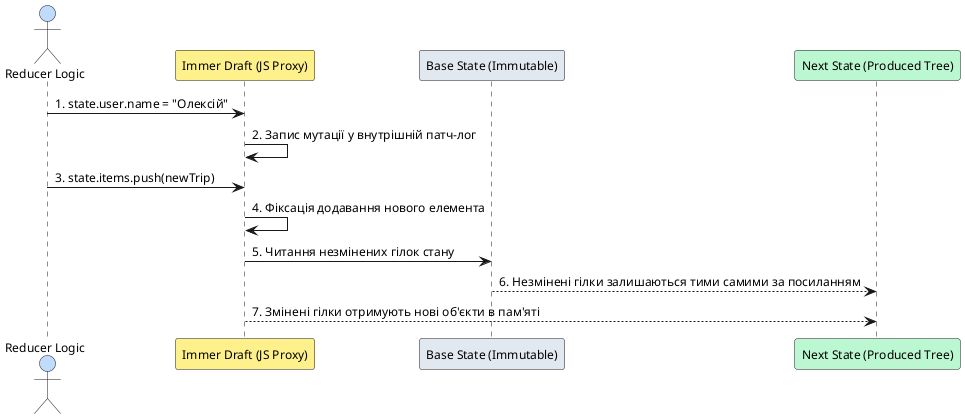
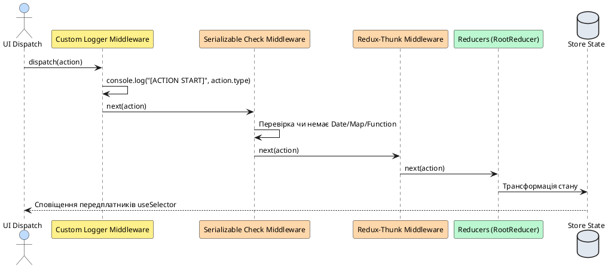
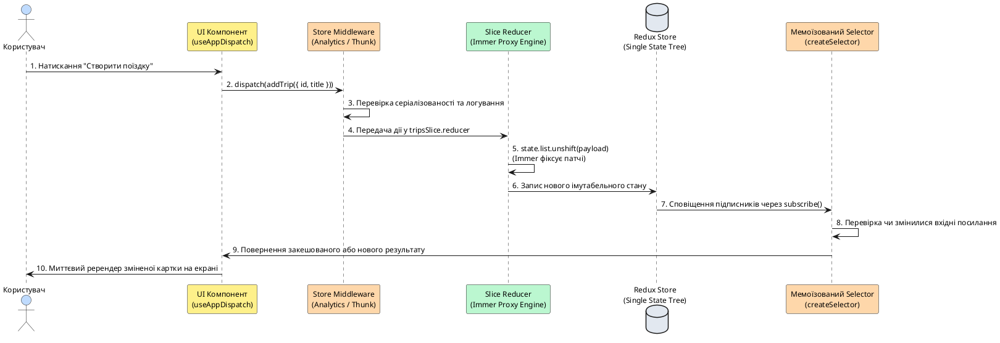

# Redux Toolkit на мобільних платформах

## Навіщо централізоване сховище на мобільному пристрої

Уявіть, що ви розробляєте складний мобільний продукт: стрічка поїздок, екран детального перегляду маршруту, модальне вікно створення нової локації, панель фільтрації, екран профілю користувача з налаштуваннями теми та офлайн-сховище. Кожен із цих екранів потребує доступу до спільних даних: зміна статусу поїздки в деталях повинна миттєво відобразитися у стрічці, а оновлення теми в налаштуваннях має без затримок перефарбувати всі навігаційні панелі.

У веб-розробці для цього застосовують локальний стан компонентів, підняття стану вгору (_Lifting State Up_), Context API або глобальні стейт-менеджери. Проте в мобільному середовищі на **React Native** з'являються критичні фактори, які роблять архітектуру керування станом значно складнішою:

::field-group

::field{name="1. Життєвий цикл навігаційного стека (Navigation Stack Lifecycle)" type="Мобільний фактор"}
На відміну від браузера, де перехід за посиланням зазвичай розмонтовує попередню сторінку, стек мобільної навігації (наприклад, у React Navigation або Expo Router) зберігає попередні екрани **змонтованими у пам'яті**, щоб забезпечити миттєву анімацію жесту повернення назад (_Swipe Back_). Якщо стан зберігається локально в `useState` одного з екранів, спроба оновити його з модального вікна вимагає громіздкого передавання колбеків крізь навігаційні параметри, що призводить до заплутаного коду та витоків пам'яті.
::

::field{name="2. Обмеженість пам'яті та примусове вивантаження процесу (OOM Killer)" type="Мобільний фактор"}
Мобільна операційна система (iOS чи Android) у будь-який момент може примусово «вбити» фоновий процес застосунку для вивільнення оперативної пам'яті для вхідного дзвінка або камери. При поверненні користувача JavaScript-рантайм запускається «з нуля». Централізоване сховище дозволяє легко налаштувати **персистентність (State Rehydration)** — автоматичне збереження та відновлення всього дерева стану з дискового сховища (MMKV або AsyncStorage).
::

::field{name="3. Асинхронні ланцюжки та робота в нестабільній мережі" type="Мобільний фактор"}
Мобільні застосунки постійно виконують паралельні асинхронні задачі: запити до API, фонове визначення геолокації, читання з локальної бази SQLite та роботу в режимі офлайн. Без жорстко структурованого потоку даних застосунок швидко скочується до стану гонитви (_Race Conditions_) та неконсистентності UI.
::

::field{name="4. Дебаг та інспектування стану у виробничому середовищі" type="Мобільний фактор"}
Дебаг мобільного клієнта на реальному фізичному пристрої значно складніший за веб-інспектор. Інтеграція Redux DevTools дозволяє записувати історію дій, досліджувати знімки пам'яті та проводити перемотування стану (_Time-Travel Debugging_) безпосередньо під час тестування жестів та переходів.
::

::

::note
**Фундаментальний висновок:** Централізоване сховище в мобільному застосунку виступає **єдиним джерелом істини (Single Source of Truth)**, що відокремлює бізнес-логіку та роботу з даними від візуального життєвого циклу екранів. **Redux Toolkit (RTK)** є офіційним промисловим стандартом Redux, який усуває понад 80% шаблонного коду, гарантує безпеку типізації та оптимізує рендеринг за рахунок поверхневого порівняння селекторів.
::

---

## Що таке Redux Toolkit: Еволюція та архітектурні переваги

### Історія та еволюція від Legacy Redux до RTK

Класичний Redux, створений Деном Абрамовим у 2015 році, базувався на трьох фундаментальних принципах:
1. **Єдине джерело істини:** Весь глобальний стан зберігається в єдиному дереві всередині одного Store.
2. **Стан доступний лише для читання:** Єдиний спосіб змінити стан — відправити дію (**Action**), що описує подію, яка відбулася.
3. **Зміни вносяться чистими функціями:** Логіка трансформації описується **Редюсерами (Reducers)**, які приймають поточний стан і дію та повертають новий стан без побічних ефектів.

Незважаючи на елегантність математичної моделі, так званий «Legacy Redux» мав величезну ваду — **колосальний обсяг шаблонного коду (Boilerplate)**. Для додавання навіть простого поля потрібно було:
- Створити строкову константу `const ADD_TRIP = 'trips/ADD_TRIP'`;
- Написати функцію-творець дії `const addTrip = (trip) => ({ type: ADD_TRIP, payload: trip })`;
- Описати громіздкий `switch/case` у файлі редюсера;
- Вручну копіювати кожен рівень вкладеності через spread-оператори (`...state`, `...state.items`), щоб не порушити іммутабельність;
- Вручну налаштовувати підключення `redux-thunk`, DevTools extension та middleware для перевірки мутацій.

У 2019 році команда розробників випустила **Redux Toolkit (`@reduxjs/toolkit`)**, що повністю переосмислив досвід роботи з Redux:

```
┌──────────────────────────────────────────────────────────────────────────────────────────┐
│                                 REDUX TOOLKIT (RTK)                                      │
├──────────────────────────┬───────────────────────────────┬───────────────────────────────┤
│    configureStore()      │        createSlice()          │      createAsyncThunk()       │
│  Автоматичний thunk,     │  Об'єднує Actions + Reducers  │  Стандартизує async lifecycle │
│  DevTools та middleware  │   з підтримкою Immer Proxy    │   (pending/fulfilled/rejected)│
├──────────────────────────┼───────────────────────────────┼───────────────────────────────┤
│  createEntityAdapter()   │       createSelector()        │   createListenerMiddleware()  │
│   Нормалізація O(1)      │      Reselect мемоїзація      │    Легковагі сайд-ефекти      │
│  (byId + allIds CRUD)    │    для важких списків RN      │    замість важкої Saga        │
└──────────────────────────┴───────────────────────────────┴───────────────────────────────┘
```

---

## Детальна анатомія ключових концепцій Redux Toolkit

Розглянемо кожну абстракцію RTK на глибокому рівні з детальними прикладами коду.

### 1. Action (Дія) та Action Creator (Творець дії)

**Action** — це звичайний JavaScript-об'єкт, який повідомляє сховищу про те, що в застосунку відбулася певна подія. У сучасному Redux усі дії відповідають специфікації **Flux Standard Action (FSA)**:

```typescript
interface FluxStandardAction<Payload = any, Meta = any> {
    type: string // Обов'язковий унікальний ідентифікатор події
    payload?: Payload // Дані дії (корисне навантаження)
    error?: boolean // Прапорець, що вказує на наявність помилки в payload
    meta?: Meta // Додаткові метадані (наприклад, analyticsId, timestamp)
}
```

**Action Creator** — це функція, яка інкапсулює створення та валідацію об'єкта дії.

#### Ручне створення дії через `createAction`

Хоча зазвичай дії генеруються автоматично всередині `createSlice`, утиліта `createAction` дозволяє створювати автономні дії:

```typescript
import { createAction, nanoid } from '@reduxjs/toolkit'

// Базовий Action Creator:
export const resetAllFilters = createAction('filters/reset')
// Виклик resetAllFilters() повертає { type: 'filters/reset' }

// Action Creator з функцією підготовки (Prepare Callback):
export const addCustomTrip = createAction('trips/addCustom', (title: string, region: string) => {
    return {
        payload: {
            id: nanoid(), // Генерація унікального ID
            title,
            region,
            createdAt: new Date().toISOString(), // Серіалізована дата!
        },
        meta: {
            analyticsEvent: 'TRIP_CREATED_MANUALLY',
        },
    }
})

// Використання:
const action = addCustomTrip('Карпати', 'Захід')
console.log(action)
// {
//   type: 'trips/addCustom',
//   payload: { id: 'V1StGXR8_Z5jdHi6B-myT', title: 'Карпати', region: 'Захід', createdAt: '...' },
//   meta: { analyticsEvent: 'TRIP_CREATED_MANUALLY' }
// }
```

#### Механізм зіставлення дій (`action.match`)

Action Creators, створені в RTK, мають вбудований предикатний метод `match(action)`:

```typescript
const action: unknown = { type: 'filters/reset' }

if (resetAllFilters.match(action)) {
    // TypeScript автоматично звужує тип action до PayloadAction
    console.log('Це дійсно дія скидання фільтрів!')
}
```

---

### 2. Reducer (Редуктор) та механіка Immer під капотом

**Reducer** — це чиста математична функція трансформації стану:

::math-formula
f: (\text{PreviousState}, \text{Action}) \longrightarrow \text{NewState}
::

#### Чому редуктор зобов'язаний бути чистою функцією?

У редукторі **категорично заборонено**:
1. Виконувати асинхронні виклики (HTTP-запити, таймери `setTimeout`);
2. Генерувати недетерміновані значення (`Math.random()`, `nanoid()`, `new Date()`, `Date.now()`);
3. Змінювати глобальні змінні або викликати побічні ефекти (_Side Effects_).

Якщо для однакового стану та однакової дії редуктор повертатиме різні результати, детермінізм Redux руйнується, а Time-Travel Debugging стає неможливим.

#### Як Immer забезпечує безпеку мутуючого синтаксису

У класичному Redux оновлення вкладеного поля вимагало жахливого «spread hell»:

```typescript
// СТАРИЙ ПІДХІД (Legacy Redux): Складно читати, легко зробити помилку!
function legacyReducer(state = initialState, action) {
    switch (action.type) {
        case 'trips/updatePlaceRating':
            return {
                ...state,
                trips: state.trips.map((trip) => {
                    if (trip.id !== action.payload.tripId) return trip
                    return {
                        ...trip,
                        places: trip.places.map((place) => {
                            if (place.id !== action.payload.placeId) return place
                            return {
                                ...place,
                                rating: action.payload.rating,
                            }
                        }),
                    }
                }),
            }
        default:
            return state
    }
}
```

У Redux Toolkit всі редуктори всередині `createSlice` використовують бібліотеку **Immer**. Immer огортає стан у нативний JavaScript-об'єкт **`Proxy`** (механіка _Copy-on-Write_):

```typescript
// СУЧАСНИЙ ПІДХІД (Redux Toolkit + Immer):
updatePlaceRating(state, action: PayloadAction<{ tripId: string; placeId: string; rating: number }>) {
  const trip = state.trips.find(t => t.id === action.payload.tripId);
  const place = trip?.places.find(p => p.id === action.payload.placeId);
  if (place) {
    place.rating = action.payload.rating; // Пряма мутація draft-об'єкта!
  }
}
```

::plant-uml



::

::warning
**Два критичних правила роботи з Immer:**
1. **Або мутуємо, або повертаємо нове значення:**
   ```typescript
   // ❌ ПОМИЛКА: Не можна одночасно мутувати draft і повертати значення!
   badReducer(state, action) {
     state.loading = false;
     return action.payload; // Кине помилку в рантаймі!
   }

   // ✅ ПРАВИЛЬНО (варіант 1 — мутація draft):
   goodReducer1(state, action) {
     state.loading = false;
     state.data = action.payload;
   }

   // ✅ ПРАВИЛЬНО (варіант 2 — повернення абсолютно нового стану):
   goodReducer2(state, action) {
     return { loading: false, data: action.payload };
   }
   ```
2. **Дебаг об'єктів Draft у console.log:**
   Якщо ви виведете `console.log(state)` всередині редуктора, ви побачите нечитабельний Proxy-об'єкт. Для перегляду реального вмісту використовуйте утиліту `current()` з `@reduxjs/toolkit`:
   ```typescript
   import { current } from '@reduxjs/toolkit'

   myReducer(state, action) {
     console.log('Поточний стан:', current(state)); // Покаже чистий JS-об'єкт!
   }
   ```
::

---

### 3. Slice (`createSlice`) та розділення логіки

**Slice** — це логічно відокремлений модуль стану, що об'єднує в собі початковий стан (`initialState`), редюсери для обробки внутрішніх дій (`reducers`) та обробники зовнішніх/асинхронних подій (`extraReducers`).

#### Розширений синтаксис редюсерів з `prepare`

Якщо дія вимагає генерації унікального ID або попередньої обробки аргументів перед попаданням у редуктор, `createSlice` підтримує об'єктний синтаксис `{ reducer, prepare }`:

```typescript
import { createSlice, PayloadAction, nanoid } from '@reduxjs/toolkit'

interface TripItem {
    id: string
    title: string
    createdAt: string
}

interface TripsState {
    list: TripItem[]
}

const initialState: TripsState = { list: [] }

export const tripsSlice = createSlice({
    name: 'trips',
    initialState,
    reducers: {
        // Простий редюсер
        clearAllTrips(state) {
            state.list = []
        },

        // Редюсер з функцією попередньої підготовки (prepare)
        addTripWithAutoId: {
            reducer(state, action: PayloadAction<TripItem>) {
                state.list.unshift(action.payload)
            },
            prepare(title: string) {
                return {
                    payload: {
                        id: nanoid(),
                        title,
                        createdAt: new Date().toISOString(),
                    },
                }
            },
        },
    },
})

export const { clearAllTrips, addTripWithAutoId } = tripsSlice.actions
export default tripsSlice.reducer
```

#### Обробка зовнішніх дій через `extraReducers` та Розширені матчери (`isAnyOf`)

У великих мобільних застосунках часто потрібно показувати єдиний індикатор завантаження або централізовано очищувати помилки при запуску будь-якого з десятка асинхронних запитів. Утиліти `isAnyOf`, `isAllOf`, `isPending`, `isFulfilled`, `isRejected` дозволяють елегантно скоротити код:

```typescript
import { createSlice, isAnyOf } from '@reduxjs/toolkit'
import { resetAllFilters } from './filtersActions'
import { fetchTripsThunk, createTripThunk, deleteTripThunk } from './tripsThunks'

export const tripsSlice = createSlice({
    name: 'trips',
    initialState,
    reducers: {},
    extraReducers: (builder) => {
        builder
            // 1. Точна обробка успішного завершення
            .addCase(fetchTripsThunk.fulfilled, (state, action) => {
                state.list = action.payload
            })
            .addCase(resetAllFilters, (state) => {
                state.list = []
            })

            // 2. Матчер: Об'єднання всіх станів завантаження
            .addMatcher(
                isAnyOf(fetchTripsThunk.pending, createTripThunk.pending, deleteTripThunk.pending),
                (state) => {
                    state.loading = true
                    state.error = null
                },
            )

            // 3. Матчер: Загальне завершення операцій
            .addMatcher(
                isAnyOf(fetchTripsThunk.fulfilled, createTripThunk.fulfilled, deleteTripThunk.fulfilled),
                (state) => {
                    state.loading = false
                },
            )

            // 4. Матчер: Універсальне перехоплення помилок
            .addMatcher(
                isAnyOf(fetchTripsThunk.rejected, createTripThunk.rejected, deleteTripThunk.rejected),
                (state, action) => {
                    state.loading = false
                    state.error = (action.payload as string) ?? action.error.message ?? 'Невідома помилка'
                },
            )
    },
})
```

---

### 4. Store (`configureStore`) та конвеєр Middleware

**Store** створюється функцією `configureStore`, яка об'єднує всі слайси в єдине дерево та автоматично налаштовує стандартний конвеєр проміжного ПЗ (_Middleware Pipeline_).

#### Налаштування Middleware та користувацькі перехоплювачі

Middleware — це функція вищого порядку, яка перехоплює кожну дію перед тим, як вона потрапить у редуктор:

::plant-uml



::

Створимо користувацький middleware для моніторингу дій та налаштуємо `configureStore`:

```typescript
// src/store/middleware/analyticsLogger.ts
import { Middleware } from '@reduxjs/toolkit'
import type { RootState } from '../index'

/**
 * Логує кожну дію та час її виконання у консоль під час розробки
 */
export const analyticsLoggerMiddleware: Middleware<{}, RootState> = (storeApi) => (next) => (action: any) => {
    if (__DEV__) {
        const startTime = Date.now()
        console.log(`%c[ACTION] ${action.type}`, 'color: #2563eb; font-weight: bold;', action.payload)

        const result = next(action)

        const duration = Date.now() - startTime
        console.log(`%c[STATE AFTER] (${duration}ms)`, 'color: #059669;', storeApi.getState())

        return result
    }

    return next(action)
}
```

```typescript
// src/store/index.ts
import { configureStore, combineReducers } from '@reduxjs/toolkit'
import tripsReducer from './slices/tripsSlice'
import settingsReducer from './slices/settingsSlice'
import { analyticsLoggerMiddleware } from './middleware/analyticsLogger'

const rootReducer = combineReducers({
    trips: tripsReducer,
    settings: settingsReducer,
})

export const store = configureStore({
    reducer: rootReducer,
    middleware: (getDefaultMiddleware) =>
        getDefaultMiddleware({
            // Налаштування стандартних перевірок RTK
            thunk: true,
            immutableCheck: { warnAfter: 128 },
            serializableCheck: {
                ignoredActions: ['persist/PERSIST'],
            },
        }).concat(analyticsLoggerMiddleware),
    devTools: process.env.NODE_ENV !== 'production',
})

// Експорт глобальних типів
export type RootState = ReturnType<typeof store.getState>
export type AppDispatch = typeof store.dispatch
```

---

### 5. Сучасні легковагі сайд-ефекти: `createListenerMiddleware`

Раніше для складних реактивних ланцюжків (наприклад, «при зміні теми записати значення в MMKV», «при вході користувача запустити підключення WebSocket», «скасувати пошуковий запит при швидкому введенні тексту») використовували важкі бібліотеки на кшталт `redux-saga` чи `redux-observable`.

У сучасному Redux Toolkit офіційним інструментом є **`createListenerMiddleware`** — потужний, легкий (~2.5 КБ) і повністю типізований менеджер побічних ефектів:

```typescript
// src/store/listenerMiddleware.ts
import { createListenerMiddleware, isAnyOf } from '@reduxjs/toolkit'
import type { RootState, AppDispatch } from './index'
import { setTheme, setLocale } from './slices/settingsSlice'
import { addTrip } from './slices/tripsSlice'

export const listenerMiddleware = createListenerMiddleware()

export const startAppListening = listenerMiddleware.startListening.withTypes<RootState, AppDispatch>()

// 1. Слухач для збереження налаштувань у сховище при будь-якій зміні теми чи мови
startAppListening({
    matcher: isAnyOf(setTheme, setLocale),
    effect: async (action, listenerApi) => {
        const state = listenerApi.getState()
        console.log('[PERSIST SYNC] Збереження налаштувань на диск:', state.settings)
        // Тут виконується асинхронний запис у MMKV / AsyncStorage
    },
})

// 2. Слухач з можливістю Debounce (затримки та скасування попередньої спроби)
startAppListening({
    actionCreator: addTrip,
    effect: async (action, listenerApi) => {
        // Скасовуємо попередні незавершені ефекти цього слухача
        listenerApi.cancelActiveListeners()

        // Очікуємо 500мс (Debounce)
        await listenerApi.delay(500)

        // Відправляємо аналітичну подію
        console.log('[ANALYTICS] Подія: Поїздку успішно створено', action.payload.title)
    },
})
```

Підключення listener middleware до store:

```typescript
export const store = configureStore({
    reducer: rootReducer,
    middleware: (getDefaultMiddleware) => getDefaultMiddleware().prepend(listenerMiddleware.middleware),
})
```

---

### 6. Селектори та мемоїзація за допомогою `createSelector` (Reselect)

**Селектор** — це чиста функція, що приймає глобальний об'єкт `RootState` і повертає необхідний фрагмент даних або обчислює похідні значення.

#### Проблема відсутності мемоїзації

Розглянемо неефективний селектор:

```typescript
// ❌ АНТИПАТЕРН: Постійне створення нового масиву в пам'яті!
const selectFilteredTrips = (state: RootState) => {
    return state.trips.list.filter((t) => t.isFavorite) // filter() повертає [] з новим посиланням!
}

function FavoriteTripsList() {
    // Цей компонент буде ререндеритися при БУДЬ-ЯКІЙ зміні стану в store (навіть при зміні теми!),
    // оскільки посилання на результат selectFilteredTrips ЗАВЖДИ нове!
    const favorites = useAppSelector(selectFilteredTrips)
    // ...
}
```

#### Вирішення: Мемоїзований селектор `createSelector`

`createSelector` запам'ятовує (_кешує_) останній результат обчислення. Якщо посилання на вхідні аргументи не змінилися, він миттєво повертає збережений результат без виконання важких обчислень:

```typescript
import { createSelector } from '@reduxjs/toolkit'
import type { RootState } from '../index'

// 1. Вхідні базові селектори
const selectTripsList = (state: RootState) => state.trips.list
const selectSearchQuery = (state: RootState) => state.filters.searchQuery
const selectSelectedRegion = (state: RootState) => state.filters.region

// 2. Складений мемоїзований селектор
export const selectFilteredTrips = createSelector(
    [selectTripsList, selectSearchQuery, selectSelectedRegion],
    (trips, query, region) => {
        console.log('Виконання важкої фільтрації списку...')
        return trips.filter((trip) => {
            const matchesQuery = trip.title.toLowerCase().includes(query.toLowerCase())
            const matchesRegion = region === 'all' || trip.region === region
            return matchesQuery && matchesRegion
        })
    },
)
```

#### Пастка параметризованих селекторів та Selector Factories

Коли селектор приймає динамічний аргумент (наприклад, `tripId`), використання одного селектора у кількох компонентах списку призводить до **постійного скидання кешу** (оскільки кеш `createSelector` за замовчуванням має розмір 1):

```typescript
// ❌ НЕПРАВИЛЬНО ДЛЯ БАГАТЬОХ ЕКЗЕМПЛЯРІВ:
export const selectTripById = (tripId: string) =>
    createSelector([selectTripsList], (trips) => trips.find((t) => t.id === tripId))

// Якщо ComponentA викликає selectTripById('1') і ComponentB викликає selectTripById('2'),
// кеш розміром 1 буде перезаписуватися при кожному виклику!
```

**Архітектурно правильне рішення — Фабрика селекторів (Selector Factory):**

```typescript
// ✅ ПРАВИЛЬНО: Створення персонального екземпляра селектора для кожного компонента
export const makeSelectTripById = () =>
    createSelector([selectTripsList, (_state: RootState, tripId: string) => tripId], (trips, tripId) =>
        trips.find((t) => t.id === tripId),
    )

// Використання в компоненті картки:
function TripCard({ tripId }: { tripId: string }) {
    // Створюємо персональний мемоїзований селектор один раз при монтуванні
    const selectTrip = useMemo(makeSelectTripById, [])
    const trip = useAppSelector((state) => selectTrip(state, tripId))

    return <Text>{trip?.title}</Text>
}
```

---

### 7. Типізовані хуки: `useAppDispatch` та `useAppSelector`

Стандартні хуки `useDispatch` та `useSelector` з бібліотеки `react-redux` не знають про структуру вашого застосунку. Тому створюються строго типізовані аліаси:

```typescript
// src/store/hooks.ts
import { useDispatch, useSelector, TypedUseSelectorHook } from 'react-redux'
import type { RootState, AppDispatch } from './index'

// Типізований dispatch знає про всі AsyncThunkActions
export const useAppDispatch = () => useDispatch<AppDispatch>()

// Типізований selector надає повне автодоповнення полів RootState
export const useAppSelector: TypedUseSelectorHook<RootState> = useSelector
```

#### Оптимізація вибірки кількох полів через `shallowEqual`

Якщо селектор повертає новий об'єкт із кількома полями, використовуйте функцію `shallowEqual`, щоб уникнути ререндеру при незмінних значеннях:

```tsx
import { shallowEqual } from 'react-redux'
import { useAppSelector } from '@/store/hooks'

function HeaderProfile() {
    // Ререндер відбудеться лише якщо зміниться name АБО avatar (поверхова перевірка властивостей)
    const { name, avatar } = useAppSelector(
        (state) => ({
            name: state.user.profile?.name,
            avatar: state.user.profile?.avatarUrl,
        }),
        shallowEqual,
    )

    return (
        <View>
            <Text>{name}</Text>
        </View>
    )
}
```

---

### 8. Нормалізація стану за допомогою `createEntityAdapter`

У попередній статті ми з'ясували, чому збереження простих масивів з API призводить до деградації швидкодії до $O(N)$. Redux Toolkit надає потужну вбудовану утиліту **`createEntityAdapter`**, яка автоматизує роботу з нормалізованими структурами `{ ids: string[], entities: Record<string, Entity> }`:

```typescript
import { createSlice, createEntityAdapter } from '@reduxjs/toolkit'
import type { RootState } from '../index'

export interface Trip {
    id: string
    title: string
    region: string
    likes: number
}

// 1. Створюємо адаптер сутностей з сортуванням за назвою
export const tripsAdapter = createEntityAdapter<Trip>({
    selectId: (trip) => trip.id,
    sortComparer: (a, b) => a.title.localeCompare(b.title),
})

// 2. Отримуємо початковий стан: { ids: [], entities: {} } + кастомні поля
const initialState = tripsAdapter.getInitialState({
    isLoading: false,
    error: null as string | null,
})

// 3. Слайс із вбудованими CRUD-мутаціями адаптера
export const tripsNormalizedSlice = createSlice({
    name: 'tripsNormalized',
    initialState,
    reducers: {
        // Додавання однієї поїздки зі складністю O(1)
        addTrip: tripsAdapter.addOne,

        // Оновлення поїздки зі складністю O(1)
        updateTripLikes(state, action: { payload: { id: string; likes: number } }) {
            tripsAdapter.updateOne(state, {
                id: action.payload.id,
                changes: { likes: action.payload.likes },
            })
        },

        // Видалення поїздки
        removeTrip: tripsAdapter.removeOne,

        // Повне перезаписування списку
        setAllTrips: tripsAdapter.setAll,
    },
})

// 4. Автоматично згенеровані високопродуктивні селектори
export const {
    selectAll: selectAllNormalizedTrips, // Повертає впорядкований масив Trip[]
    selectById: selectNormalizedTripById, // Вибірка за ID зі складністю O(1)
    selectIds: selectTripIds, // Повертає масив id []
    selectTotal: selectTotalTripsCount, // Повертає загальну кількість
} = tripsAdapter.getSelectors((state: RootState) => state.tripsNormalized)
```

---

### 9. Асинхронні операції: `createAsyncThunk` у деталях

У класичному Redux виконання асинхронного запиту вимагало ручного створення трьох окремих типів дій (`FETCH_START`, `FETCH_SUCCESS`, `FETCH_FAILURE`) та написання функції thunk, яка їх послідовно відправляє. У Redux Toolkit функція **`createAsyncThunk`** автоматизує весь цей життєвий цикл.

#### Приклад GET та POST запитів через Thunk

Розглянемо практичний приклад завантаження та створення поїздки:

```typescript
// src/store/thunks/tripsThunks.ts
import { createAsyncThunk } from '@reduxjs/toolkit'
import { apiClient } from '@/api/client'
import { AppError } from '@/api/AppError'
import type { RootState, AppDispatch } from '../index'
import type { Trip, CreateTripDto } from '@/features/trips/types'

/**
 * 1. GET: Завантаження списку поїздок з підтримкою AbortController та Guard Condition
 */
export const fetchTripsThunk = createAsyncThunk<
    Trip[], // Тип успішного результату (Returned)
    void, // Вхідний аргумент (ThunkArg)
    {
        state: RootState
        dispatch: AppDispatch
        rejectValue: string
    }
>(
    'trips/fetchTrips',
    async (_, { rejectWithValue, signal }) => {
        try {
            // Передаємо signal для скасування запиту при unmount екрана
            const response = await apiClient.get<Trip[]>('/trips', { signal })
            return response.data
        } catch (error) {
            const appError = AppError.from(error)
            return rejectWithValue(appError.userMessage)
        }
    },
    {
        // Guard Condition: запобігаємо повторному запиту, якщо завантаження вже триває
        condition: (_, { getState }) => {
            const { loading } = getState().trips
            if (loading) {
                console.log('[Thunk Guard] Запит уже виконується, скасування дубліката.')
                return false
            }
            return true
        },
    },
)

/**
 * 2. POST: Створення нової поїздки з передачею payload
 */
export const createTripThunk = createAsyncThunk<
    Trip,
    CreateTripDto,
    {
        state: RootState
        rejectValue: string
    }
>('trips/createTrip', async (newTripDto, { rejectWithValue }) => {
    try {
        const response = await apiClient.post<Trip>('/trips', newTripDto)
        return response.data
    } catch (error) {
        const appError = AppError.from(error)
        return rejectWithValue(appError.userMessage)
    }
})
```

#### Обробка в Slice через `extraReducers`

```typescript
// src/store/slices/tripsSlice.ts
import { createSlice } from '@reduxjs/toolkit'
import { fetchTripsThunk, createTripThunk } from '../thunks/tripsThunks'
import type { Trip } from '@/features/trips/types'

interface TripsState {
    items: Trip[]
    loading: boolean
    isCreating: boolean
    error: string | null
}

const initialState: TripsState = {
    items: [],
    loading: false,
    isCreating: false,
    error: null,
}

export const tripsSlice = createSlice({
    name: 'trips',
    initialState,
    reducers: {
        clearError(state) {
            state.error = null
        },
    },
    extraReducers: (builder) => {
        builder
            // Обробка GET fetchTrips
            .addCase(fetchTripsThunk.pending, (state) => {
                state.loading = true
                state.error = null
            })
            .addCase(fetchTripsThunk.fulfilled, (state, action) => {
                state.loading = false
                state.items = action.payload
            })
            .addCase(fetchTripsThunk.rejected, (state, action) => {
                state.loading = false
                state.error = action.payload ?? 'Не вдалося завантажити поїздки'
            })

            // Обробка POST createTrip
            .addCase(createTripThunk.pending, (state) => {
                state.isCreating = true
                state.error = null
            })
            .addCase(createTripThunk.fulfilled, (state, action) => {
                state.isCreating = false
                state.items.unshift(action.payload)
            })
            .addCase(createTripThunk.rejected, (state, action) => {
                state.isCreating = false
                state.error = action.payload ?? 'Не вдалося створити поїздку'
            })
    },
})
```

#### Скасування Thunk при розмонтуванні компонента

```tsx
import React, { useEffect } from 'react'
import { useAppDispatch } from '@/store/hooks'
import { fetchTripsThunk } from '@/store/thunks/tripsThunks'

export function TripsListScreen() {
    const dispatch = useAppDispatch()

    useEffect(() => {
        // Запускаємо запит і зберігаємо обіцянку
        const promise = dispatch(fetchTripsThunk())

        return () => {
            // При розмонтуванні екрана (перехід назад) скасовуємо HTTP-запит!
            promise.abort()
        }
    }, [dispatch])

    // ...
}
```

---

## Плюси та мінуси асинхронних запитів через Thunk

Використання `createAsyncThunk` для керування серверними даними має чіткі інженерні компроміси, які важливо розуміти перед вибором архітектури.

::tabs

::tabs-item{label="Переваги (Плюси) ✅"}

1. **Єдине глобальне джерело істини:**
   Усі компоненти застосунку мають миттєвий доступ до завантажених даних, стану `loading` та `error` через єдиний селектор без передавання пропсів через дерево.
2. **Повний контроль над логікою трансформації:**
   Усередині thunk або редуктора ви маєте прямий доступ до `getState()` і можете комбінувати дані з різних слайсів, нормалізувати структуру через `createEntityAdapter` чи виконувати багатоетапні ланцюжки запитів.
3. **Передбачуваність і Time-Travel Debugging:**
   Кожен крок запиту (`pending`, `fulfilled`, `rejected`) фіксується як окрема дія у Redux DevTools з точним payload і таймстемпом. Це дозволяє легко відтворювати баги мережі.
4. **Легкість тестування:**
   Thunk і редуктори можна ізольовано протестувати модульними тестами Jest без потреби мокати DOM чи рендерити компоненти.
5. **Вбудовані засоби захисту (`condition` та `AbortController`):**
   Можливість легко скасовувати запити при unmount та блокувати паралельні дублікати запитів без сторонніх бібліотек.

::

::tabs-item{label="Недоліки (Мінуси) ⚠️"}

1. **Великий обсяг шаблонного коду (Boilerplate):**
   Для кожного ендпоінта потрібно вручну оголошувати поля у стані (`items`, `loading`, `error`), створювати thunk і прописувати три кейси в `extraReducers`.
2. **Відсутність автоматичного кешування та дедуплікації:**
   Якщо два незалежних компоненти на одному екрані викликають `dispatch(fetchTripsThunk())`, буде виконано два реальних HTTP-запити (якщо не налаштувати `condition` вручну).
3. **Складність підтримки інвалідації кешу:**
   Після виклику `createTripThunk` розробник повинен вручну оновити стан у `tripsSlice` або вручну викликати `fetchTripsThunk()`, щоб синхронізувати список.
4. **Немає вбудованого Polling, Refetch on Focus / Network Reconnect:**
   Для повторного завантаження при поверненні застосунку з фону чи появі інтернету потрібно писати кастомні хуки або слухачі `AppState` та `NetInfo`.
5. **Ручне керування пам'яттю (Garbage Collection):**
   Дані залишаються в пам'яті store назавжди, доки їх явно не очистять.

::

::

### Порівняльна таблиця: Підходи до асинхронних запитів у React Native

| Критерій | `createAsyncThunk` (RTK) | `RTK Query` / `TanStack Query` | `useEffect` + локальний `useState` |
| :--- | :--- | :--- | :--- |
| **Призначення** | Глобальний клієнтський стан + складні ланцюжки дій | Декларативний серверний стан і кеш | Локальний стан одного компонента |
| **Обсяг коду (Boilerplate)** | Середній (потрібні слайс + thunk + extraReducers) | Мінімальний (лише опис ендпоінта) | Мінімальний для одного компонента |
| **Автоматичне кешування** | ❌ Потрібно писати вручну | ✅ Автоматично з TTL та Garbage Collection | ❌ Відсутнє |
| **Авто-рефетч при фокусі/мережі**| ❌ Потрібно писати вручну | ✅ Вбудовано з коробки | ❌ Потрібно писати вручну |
| **Оптимістичні оновлення** | ✅ Гнучкий повний контроль над Rollback | ✅ Підтримується через `onQueryStarted` | ⚠️ Складно реалізувати масштабовано |
| **Дебаг у DevTools** | ✅ Повний таймлайн дій у Redux DevTools | ✅ Спеціалізовані інспектори кешу | ❌ Лише `console.log` або React Profiler |

::tip
**Коли обирати createAsyncThunk:**
- Коли асинхронна дія є частиною складного клієнтського процесу (наприклад, мультистеп майстер створення поїздки, збереження в SQLite та паралельне оновлення кількох слайсів).
- Коли для роботи застосунку потрібен максимальний контроль над кожною мутацією стану.
- Для стандартного отримання списків та CRUD операцій з кешуванням у наступній статті ми розглянемо **RTK Query**, який усуває потребу писати thunk-и вручну.
::

---

## Патерн: Оптимістичні оновлення (Optimistic Updates) у Redux

При повільному 3G-інтернеті користувач не повинен чекати 2 секунди, щоб побачити зафарбоване сердечко «Лайк». Інтерфейс повинен змінюватися **миттєво**, а у випадку серверної помилки — автоматично повертатися до попереднього стану (_Rollback_):

```typescript
// src/store/slices/likesSlice.ts
import { createSlice, createAsyncThunk } from '@reduxjs/toolkit'
import { apiClient } from '@/api/client'
import type { RootState } from '../index'

export const toggleTripLikeThunk = createAsyncThunk<
    { tripId: string; isLiked: boolean },
    { tripId: string },
    { state: RootState; rejectValue: { tripId: string; previousLikedState: boolean } }
>('trips/toggleLike', async ({ tripId }, { getState, rejectWithValue }) => {
    const previousLikedState = getState().likes.byTripId[tripId] ?? false
    try {
        const response = await apiClient.post(`/trips/${tripId}/like`, {
            liked: !previousLikedState,
        })
        return { tripId, isLiked: response.data.liked }
    } catch (error) {
        // У разі збою повертаємо попередній стан для відкату!
        return rejectWithValue({ tripId, previousLikedState })
    }
})

interface LikesState {
    byTripId: Record<string, boolean>
}

const initialState: LikesState = { byTripId: {} }

export const likesSlice = createSlice({
    name: 'likes',
    initialState,
    reducers: {},
    extraReducers: (builder) => {
        builder
            // 1. ОПТИМІСТИЧНЕ ОНОВЛЕННЯ: Миттєво змінюємо UI при pending!
            .addCase(toggleTripLikeThunk.pending, (state, action) => {
                const { tripId } = action.meta.arg
                const current = state.byTripId[tripId] ?? false
                state.byTripId[tripId] = !current
            })
            // 2. У разі успіху фіксуємо точну відповідь сервера
            .addCase(toggleTripLikeThunk.fulfilled, (state, action) => {
                state.byTripId[action.payload.tripId] = action.payload.isLiked
            })
            // 3. ВІДКАТ (ROLLBACK): Повертаємо попереднє значення при помилці
            .addCase(toggleTripLikeThunk.rejected, (state, action) => {
                if (action.payload) {
                    state.byTripId[action.payload.tripId] = action.payload.previousLikedState
                }
            })
    },
})
```

---

## Серіалізованість даних: чому це критично

Одна з найважливіших вимог Redux — **серіалізованість стану**. Це означає, що будь-які дані в store мають бути представлені у вигляді простих JavaScript-значень: рядків, чисел, булевих прапорців, масивів та простих об'єктів (_Plain Old JavaScript Objects_). Значення має бути можливим перетворити в рядок JSON і розпарсити назад без втрати інформації та методів.

### Що категорично заборонено зберігати в Redux store

::caution
**Заборонені типи даних у Redux store:**

1. **Функції та методи** — `(x) => x * 2` неможливо серіалізувати в JSON.
2. **Екземпляри класів** — `new Date()`, `new Map()`, `new Set()`, `new RegExp()` та користувацькі класи. При серіалізації в JSON втрачаються методи, прототипи та спеціальні внутрішні слоти.
3. **Символи (Symbols)** — `Symbol('id')` відкидається при серіалізації `JSON.stringify`.
4. **Циклічні посилання** — коли об'єкт $A$ посилається на об'єкт $B$, який посилається назад на $A$. Виклик `JSON.stringify` впаде з помилкою `TypeError: Converting circular structure to JSON`.
5. **Нативні дескриптори та посилання** — посилання на елементи інтерфейсу, нативні сокети або файлові потоки.
::

### Чому серіалізованість критична для мобільних застосунків?

1. **Персистентність та відновлення сесії (Rehydration):**
   При згортанні застосунку операційна система може вивантажити процес із пам'яті. Щоб користувач не втратив дані, стан Redux серіалізується в JSON і записується в постійну пам'ять пристрою (AsyncStorage, MMKV або SQLite). Якщо в store знаходився екземпляр класу `Date`, після відновлення ви отримаєте звичайний рядок, що призведе до помилок на кшталт `trip.startDate.getFullYear is not a function`.
2. **Time-Travel Debugging у Redux DevTools:**
   DevTools створює знімки дій і стану у форматі JSON. Несеріалізовані об'єкти ламають функціонал перемотування та експорту/імпорту стану.
3. **Чистота тестування:**
   Прості серіалізовані структури можна порівнювати через `toEqual`, легко мокати у юніт-тестах без необхідності створювати екземпляри складних класів.

### Як правильно зберігати дати та складні типи

Подивимося на порівняння правильного та помилкового підходів:

::tabs

::tabs-item{label="Погано ❌ (Несеріалізований об'єкт Date)"}

```typescript
// НЕКОРЕКТНО: збереження екземпляра Date
interface TripState {
    id: string
    title: string
    startDate: Date // ❌ Порушення серіалізованості!
}

const trip: TripState = {
    id: '1',
    title: 'Похід на Говерлу',
    startDate: new Date('2026-08-11T10:00:00.000Z'),
}
```

::

::tabs-item{label="Добре ✅ (ISO 8601 рядок)"}

```typescript
// РЕКОМЕНДОВАНО: ISO 8601 рядок або Unix timestamp
interface TripState {
    id: string
    title: string
    startDate: string // ✅ Серіалізований ISO-рядок: "2026-08-11T10:00:00.000Z"
    createdAtTimestamp: number // ✅ Серіалізований Unix timestamp: 1754985600000
}

const trip: TripState = {
    id: '1',
    title: 'Похід на Говерлу',
    startDate: '2026-08-11T10:00:00.000Z',
    createdAtTimestamp: 1754985600000,
}

// Перетворення на Date виконується локально в компоненті або селекторі:
const formattedDate = new Date(trip.startDate).toLocaleDateString('uk-UA')
```

::

::tabs-item{label="Добре ✅ (Заміна Map та Set)"}

```typescript
// Замість Map<string, Trip> використовуйте звичайний Record<string, Trip>
interface NormalizedTripsState {
    byId: Record<string, Trip> // ✅ Серіалізований словник
    allIds: string[] // ✅ Замість Set<string> використовуємо масив унікальних ID
}
```

::

::

---

## Тестування Redux логіки у React Native

Оскільки редюсери та селектори є чистими функціями, їх тестування виконується блискавично без монтування важких компонентів React:

```typescript
// src/store/slices/__tests__/tripsSlice.test.ts
import tripsReducer, { addTrip, clearTripsError } from '../tripsSlice'

describe('tripsSlice Reducer', () => {
    const initialState = {
        items: [{ id: '1', title: 'Київ', region: 'Центр' }],
        loading: false,
        error: 'Попередня помилка',
    }

    it('повинен додавати нову поїздку на початок списку через addTrip', () => {
        const newTrip = { id: '2', title: 'Одеса', region: 'Південь' }
        const nextState = tripsReducer(initialState as any, addTrip(newTrip as any))

        expect(nextState.items).toHaveLength(2)
        expect(nextState.items[0]).toEqual(newTrip)
    })

    it('повинен очищувати помилку через clearTripsError', () => {
        const nextState = tripsReducer(initialState as any, clearTripsError())
        expect(nextState.error).toBeNull()
    })
})
```

---

## Повний цикл потоку даних у Redux Toolkit

::plant-uml



::

---

## Міні-проєкт: «Керування налаштуваннями та профілем» з Redux Toolkit

Побудуємо повнофункціональний окремий застосунок, де продемонструємо:
- Конфігурацію Store з кількома слайсами (`settingsSlice` та `userSlice`);
- Типізовані хуки `useAppDispatch` та `useAppSelector`;
- Роботу з діями, перемиканням теми інтерфейсу та оновленням профілю.

### Структура файлової системи міні-проєкту

::code-tree

```text [src/store/index.ts]
Конфігурація configureStore, експорт RootState та AppDispatch
```

```text [src/store/hooks.ts]
Типізовані хуки useAppDispatch, useAppSelector
```

```text [src/store/slices/settingsSlice.ts]
Слайс теми, мови та статусу сповіщень
```

```text [src/store/slices/userSlice.ts]
Слайс автентифікації та профілю користувача
```

```text [src/screens/SettingsScreen.tsx]
Екран налаштувань із взаємодією через Redux
```

```text [App.tsx]
Точка входу з підключенням Provider
```

::

### Кроки реалізації

::steps

### Крок 1. Встановлення залежностей

```bash
npx create-expo-app@latest settings-demo --template expo-template-blank-typescript
cd settings-demo
npm install @reduxjs/toolkit react-redux
```

### Крок 2. Створення `settingsSlice` та `userSlice`

```typescript
// src/store/slices/settingsSlice.ts
import { createSlice, PayloadAction } from '@reduxjs/toolkit'

export type ThemeMode = 'light' | 'dark'
export type Locale = 'uk' | 'en'

interface SettingsState {
    theme: ThemeMode
    locale: Locale
    notificationsEnabled: boolean
}

const initialState: SettingsState = {
    theme: 'light',
    locale: 'uk',
    notificationsEnabled: true,
}

export const settingsSlice = createSlice({
    name: 'settings',
    initialState,
    reducers: {
        setTheme(state, action: PayloadAction<ThemeMode>) {
            state.theme = action.payload
        },
        toggleTheme(state) {
            state.theme = state.theme === 'light' ? 'dark' : 'light'
        },
        setLocale(state, action: PayloadAction<Locale>) {
            state.locale = action.payload
        },
        toggleNotifications(state) {
            state.notificationsEnabled = !state.notificationsEnabled
        },
    },
})

export const { setTheme, toggleTheme, setLocale, toggleNotifications } = settingsSlice.actions
export default settingsSlice.reducer
```

```typescript
// src/store/slices/userSlice.ts
import { createSlice, PayloadAction } from '@reduxjs/toolkit'

interface UserProfile {
    id: string
    name: string
    email: string
    tripsCount: number
}

interface UserState {
    profile: UserProfile | null
    isAuthenticated: boolean
}

const initialState: UserState = {
    profile: {
        id: 'u1',
        name: 'Олексій',
        email: 'alex@nomad.app',
        tripsCount: 12,
    },
    isAuthenticated: true,
}

export const userSlice = createSlice({
    name: 'user',
    initialState,
    reducers: {
        updateUserName(state, action: PayloadAction<string>) {
            if (state.profile) {
                state.profile.name = action.payload
            }
        },
        logout(state) {
            state.profile = null
            state.isAuthenticated = false
        },
    },
})

export const { updateUserName, logout } = userSlice.actions
export default userSlice.reducer
```

### Крок 3. Налаштування Store та типізованих хуків

```typescript
// src/store/index.ts
import { configureStore } from '@reduxjs/toolkit'
import settingsReducer from './slices/settingsSlice'
import userReducer from './slices/userSlice'

export const store = configureStore({
    reducer: {
        settings: settingsReducer,
        user: userReducer,
    },
    devTools: __DEV__,
})

export type RootState = ReturnType<typeof store.getState>
export type AppDispatch = typeof store.dispatch
```

```typescript
// src/store/hooks.ts
import { useDispatch, useSelector, TypedUseSelectorHook } from 'react-redux'
import type { RootState, AppDispatch } from './index'

export const useAppDispatch = () => useDispatch<AppDispatch>()
export const useAppSelector: TypedUseSelectorHook<RootState> = useSelector
```

### Крок 4. Створення екрана налаштувань

```tsx
// src/screens/SettingsScreen.tsx
import React from 'react'
import { View, Text, Pressable, StyleSheet } from 'react-native'
import { useAppSelector, useAppDispatch } from '../store/hooks'
import { setTheme, setLocale, toggleNotifications, type ThemeMode, type Locale } from '../store/slices/settingsSlice'

export default function SettingsScreen() {
    const dispatch = useAppDispatch()
    const { theme, locale, notificationsEnabled } = useAppSelector((state) => state.settings)
    const user = useAppSelector((state) => state.user.profile)

    const isDark = theme === 'dark'
    const bgColor = isDark ? '#0f172a' : '#ffffff'
    const textColor = isDark ? '#f8fafc' : '#0f172a'
    const cardBg = isDark ? '#1e293b' : '#f1f5f9'

    const themes: ThemeMode[] = ['light', 'dark']
    const locales: { id: Locale; label: string }[] = [
        { id: 'uk', label: 'Українська' },
        { id: 'en', label: 'English' },
    ]

    return (
        <View style={[styles.container, { backgroundColor: bgColor }]}>
            <Text style={[styles.title, { color: textColor }]}>Налаштування</Text>

            {user && (
                <View style={[styles.userCard, { backgroundColor: cardBg }]}>
                    <Text style={[styles.userName, { color: textColor }]}>{user.name}</Text>
                    <Text style={styles.userEmail}>{user.email}</Text>
                    <Text style={styles.userTrips}>Всього поїздок: {user.tripsCount}</Text>
                </View>
            )}

            <View style={styles.section}>
                <Text style={[styles.sectionTitle, { color: textColor }]}>Тема інтерфейсу</Text>
                <View style={styles.row}>
                    {themes.map((t) => (
                        <Pressable
                            key={t}
                            onPress={() => dispatch(setTheme(t))}
                            style={[
                                styles.chip,
                                { backgroundColor: theme === t ? '#2563eb' : cardBg },
                            ]}
                        >
                            <Text style={{ color: theme === t ? '#ffffff' : textColor, fontWeight: '600' }}>
                                {t === 'light' ? '☀️ Світла' : '🌙 Темна'}
                            </Text>
                        </Pressable>
                    ))}
                </View>
            </View>

            <View style={styles.section}>
                <Text style={[styles.sectionTitle, { color: textColor }]}>Мова застосунку</Text>
                <View style={styles.row}>
                    {locales.map((l) => (
                        <Pressable
                            key={l.id}
                            onPress={() => dispatch(setLocale(l.id))}
                            style={[
                                styles.chip,
                                { backgroundColor: locale === l.id ? '#2563eb' : cardBg },
                            ]}
                        >
                            <Text style={{ color: locale === l.id ? '#ffffff' : textColor, fontWeight: '600' }}>
                                {l.label}
                            </Text>
                        </Pressable>
                    ))}
                </View>
            </View>

            <View style={styles.section}>
                <Pressable
                    onPress={() => dispatch(toggleNotifications())}
                    style={[styles.toggleButton, { backgroundColor: cardBg }]}
                >
                    <Text style={[styles.toggleText, { color: textColor }]}>Сповіщення</Text>
                    <Text style={{ color: notificationsEnabled ? '#059669' : '#dc2626', fontWeight: '700' }}>
                        {notificationsEnabled ? 'УВІМКНЕНО' : 'ВИМКНЕНО'}
                    </Text>
                </Pressable>
            </View>
        </View>
    )
}

const styles = StyleSheet.create({
    container: { flex: 1, padding: 20 },
    title: { fontSize: 28, fontWeight: '800', marginBottom: 20 },
    userCard: { padding: 16, borderRadius: 12, marginBottom: 24 },
    userName: { fontSize: 18, fontWeight: '700' },
    userEmail: { fontSize: 13, color: '#64748b', marginTop: 2 },
    userTrips: { fontSize: 13, color: '#2563eb', fontWeight: '600', marginTop: 8 },
    section: { marginBottom: 20 },
    sectionTitle: { fontSize: 15, fontWeight: '600', marginBottom: 10 },
    row: { flexDirection: 'row', gap: 10 },
    chip: { paddingVertical: 10, paddingHorizontal: 16, borderRadius: 8 },
    toggleButton: {
        flexDirection: 'row',
        justifyContent: 'space-between',
        alignItems: 'center',
        padding: 16,
        borderRadius: 12,
    },
    toggleText: { fontSize: 15, fontWeight: '600' },
})
```

### Крок 5. Підключення Provider у `App.tsx`

```tsx
// App.tsx
import React from 'react'
import { SafeAreaView, StyleSheet } from 'react-native'
import { Provider } from 'react-redux'
import { store } from './src/store'
import SettingsScreen from './src/screens/SettingsScreen'

export default function App() {
    return (
        <Provider store={store}>
            <SafeAreaView style={styles.container}>
                <SettingsScreen />
            </SafeAreaView>
        </Provider>
    )
}

const styles = StyleSheet.create({
    container: { flex: 1 },
})
```

::

---

## Наскрізний проєкт: Nomad

Тепер інтегруємо Redux Toolkit у щоденник подорожей Nomad для централізованого керування поїздками, стану асинхронного завантаження та фільтрації.

### 1. Асинхронний Thunk завантаження поїздок

```typescript
// src/store/thunks/tripsThunks.ts
import { createAsyncThunk } from '@reduxjs/toolkit'
import { apiClient } from '@/api/client'
import { AppError } from '@/api/AppError'
import type { Trip } from '@/features/trips/types'

export const fetchTripsThunk = createAsyncThunk<Trip[], void, { rejectValue: string }>(
    'trips/fetchTrips',
    async (_, { rejectWithValue }) => {
        try {
            const response = await apiClient.get<Trip[]>('/trips')
            return response.data
        } catch (error) {
            const appError = AppError.from(error)
            return rejectWithValue(appError.userMessage)
        }
    },
)
```

### 2. Створення `tripsSlice`

```typescript
// src/store/slices/tripsSlice.ts
import { createSlice, PayloadAction } from '@reduxjs/toolkit'
import type { Trip } from '@/features/trips/types'
import { fetchTripsThunk } from '../thunks/tripsThunks'

interface TripsState {
    items: Trip[]
    loading: boolean
    error: string | null
}

const initialState: TripsState = {
    items: [],
    loading: false,
    error: null,
}

export const tripsSlice = createSlice({
    name: 'trips',
    initialState,
    reducers: {
        addTrip(state, action: PayloadAction<Trip>) {
            state.items.unshift(action.payload)
        },
        removeTrip(state, action: PayloadAction<string>) {
            state.items = state.items.filter((trip) => trip.id !== action.payload)
        },
        clearTripsError(state) {
            state.error = null
        },
    },
    extraReducers: (builder) => {
        builder
            .addCase(fetchTripsThunk.pending, (state) => {
                state.loading = true
                state.error = null
            })
            .addCase(fetchTripsThunk.fulfilled, (state, action) => {
                state.items = action.payload
                state.loading = false
                state.error = null
            })
            .addCase(fetchTripsThunk.rejected, (state, action) => {
                state.loading = false
                state.error = action.payload ?? 'Не вдалося завантажити поїздки'
            })
    },
})

export const { addTrip, removeTrip, clearTripsError } = tripsSlice.actions
export default tripsSlice.reducer
```

### 3. Мемоїзовані селектори поїздок

```typescript
// src/store/selectors/tripsSelectors.ts
import { createSelector } from '@reduxjs/toolkit'
import type { RootState } from '../index'

export const selectTripsState = (state: RootState) => state.trips

export const selectAllTrips = createSelector([selectTripsState], (tripsState) => tripsState.items)

export const selectTripsLoading = createSelector([selectTripsState], (tripsState) => tripsState.loading)

export const selectTripsError = createSelector([selectTripsState], (tripsState) => tripsState.error)

export const selectTripById = (tripId: string) =>
    createSelector([selectAllTrips], (trips) => trips.find((trip) => trip.id === tripId))
```

### 4. Підключення Redux до кореневого макета `app/_layout.tsx`

```tsx
// app/_layout.tsx
import React from 'react'
import { Stack } from 'expo-router'
import { StatusBar } from 'expo-status-bar'
import { Provider } from 'react-redux'
import { store } from '@/store'
import { OfflineBanner } from '@/components/OfflineBanner'
import { ThemeProvider, useTheme } from '@/shared/theme'

function RootNavigator() {
    const { colors, scheme } = useTheme()

    return (
        <>
            <StatusBar style={scheme === 'dark' ? 'light' : 'dark'} />
            <OfflineBanner />
            <Stack
                screenOptions={{
                    contentStyle: { backgroundColor: colors.background },
                    headerStyle: { backgroundColor: colors.background },
                    headerTintColor: colors.primary,
                    headerTitleStyle: { color: colors.text, fontWeight: '600' },
                    headerShadowVisible: false,
                }}
            >
                <Stack.Screen name="(tabs)" options={{ headerShown: false }} />
                <Stack.Screen
                    name="create-trip"
                    options={{
                        headerShown: true,
                        title: 'Нова поїздка',
                        presentation: 'modal',
                        headerBackTitle: 'Закрити',
                    }}
                />
            </Stack>
        </>
    )
}

export default function RootLayout() {
    return (
        <Provider store={store}>
            <ThemeProvider>
                <RootNavigator />
            </ThemeProvider>
        </Provider>
    )
}
```

---

## Резюме розділу

::card-group

::card{title="🏗️ Архітектура Store та Slice" icon="i-lucide-layers"}
`configureStore` автоматично створює сховище з `redux-thunk`, DevTools та валідацією серіалізованості. `createSlice` генерує редюсери та творці дій без зайвого коду.
::

::card{title="⚡ Механіка Immer Proxy" icon="i-lucide-sparkles"}
Immer використовує механізм `Proxy` для безпечного перетворення мутуючого коду всередині редюсера на новий іммутабельний стан за принципом Copy-on-Write.
::

::card{title="📦 Сувора Серіалізованість" icon="i-lucide-file-json"}
Зберігайте лише JSON-сумісні типи. Дати представляйте у вигляді ISO 8601 рядків або Unix timestamp для безпечного збереження на диск та дебагу.
::

::card{title="🎯 Reselect Мемоїзація" icon="i-lucide-filter"}
Використовуйте `createSelector` для захисту мобільних компонентів від повторних рендерингів при обчисленні похідних даних.
::

::

---

## Практичні завдання

| Рівень складності | Назва завдання | Формулювання вимог |
| :--- | :--- | :--- |
| **Базовий (Basic)** | Фільтрація поїздок за регіоном | Створити селектор `selectTripsByRegion(region: string)` за допомогою `createSelector`. Підключити Picker або горизонтальний список чіпів для фільтрації списку на екрані `(tabs)/trips/index.tsx`. |
| **Середній (Intermediate)** | Оптимістичний лайк з Rollback | Реалізувати слайс `likesSlice` та thunk `toggleTripLikeThunk`, що миттєво оновлює стан сердечка у стрічці, а при помилці мережі виконує автоматичний відкат значення. |
| **Просунутий (Advanced)** | Персистентність на базі `createListenerMiddleware` | Створити слухач через `createListenerMiddleware`, який при кожній дії з префіксом `settings/` або `trips/` асинхронно записує актуальний JSON-стан у швидке локальне сховище MMKV. |

---

## Поширені запитання (FAQ)

::accordion

::accordion-item{title="Чому не можна мутувати state за межами createSlice?" icon="i-lucide-alert-triangle"}
Immer перехоплює мутації через `Proxy` **лише всередині функцій reducers**, переданих у `createSlice`. Якщо ви мутуєте стан у компоненті, селекторі або thunk (наприклад, `trips.push(...)`), ви безпосередньо ламаєте іммутабельність об'єкта, що призведе до пропуску рендерингу в React та непередбачуваних багів.
::

::accordion-item{title="Чим createListenerMiddleware кращий за Redux-Saga у React Native?" icon="i-lucide-zap"}
`createListenerMiddleware` вбудований у Redux Toolkit, має крихітний розмір (~2.5 КБ), повністю підтримує async/await, не вимагає генераторів `function*` і на відміну від Saga забезпечує 100% точну типізацію TypeScript з коробки.
::

::accordion-item{title="Чим createAsyncThunk відрізняється від звичайного виклику API у useEffect?" icon="i-lucide-git-pull-request"}
`createAsyncThunk` стандартизує асинхронний життєвий цикл (`pending`, `fulfilled`, `rejected`), автоматично диспатчить відповідні дії, дозволяє обробляти стан завантаження глобально в store, підтримує перевірку `condition` (захист від дублікатів) та скасування запитів через `signal` з `AbortController`.
::

::accordion-item{title="Чи замінює Redux Toolkit повністю React Context?" icon="i-lucide-help-circle"}
Ні. Для простого, локального стану з рідкісними змінами (наприклад, стан поточної теми UI або системні налаштування доступності) React Context є відмінним легковаговим рішенням. Redux Toolkit застосовується там, де є складні бізнес-дані, асинхронні запити, часті оновлення та потреба в інспектуванні через DevTools.
::

::
