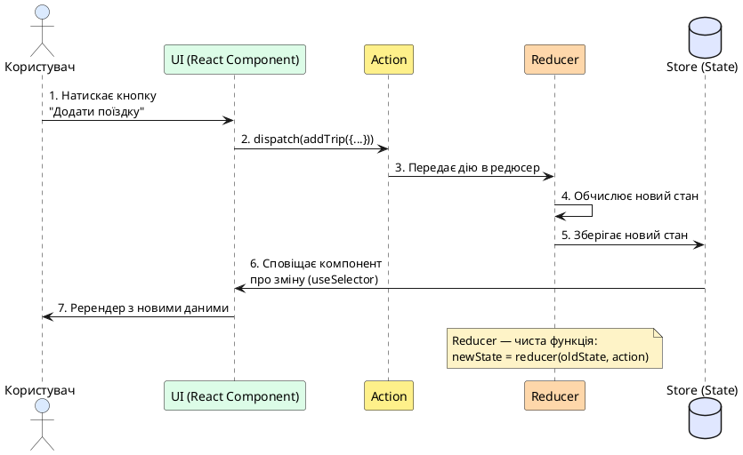
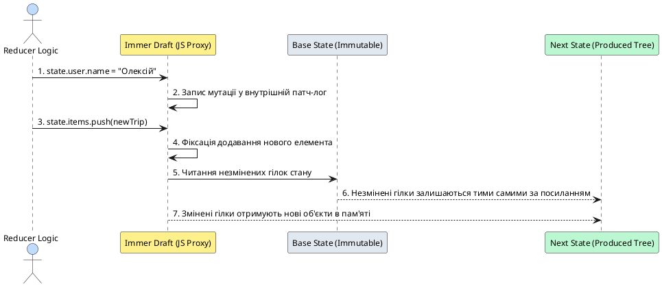
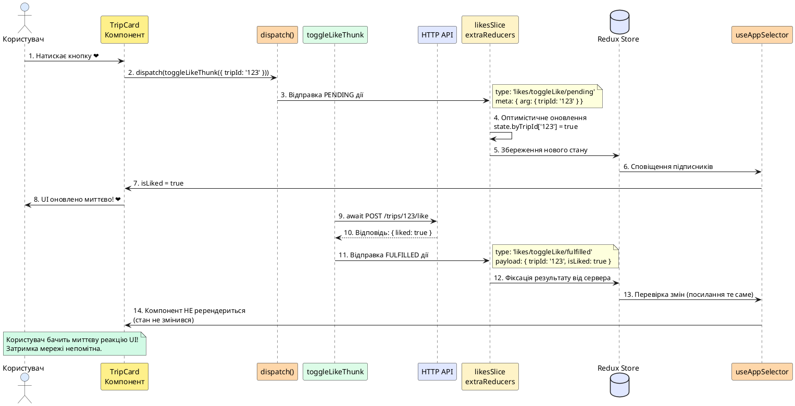
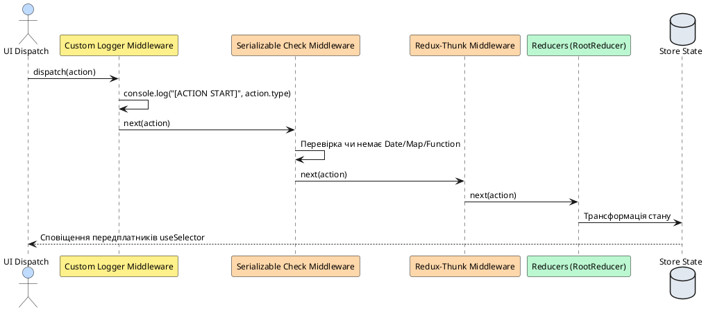
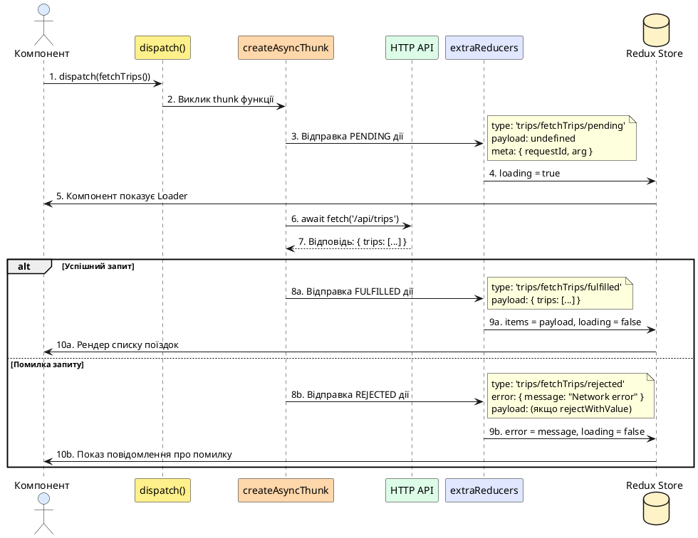
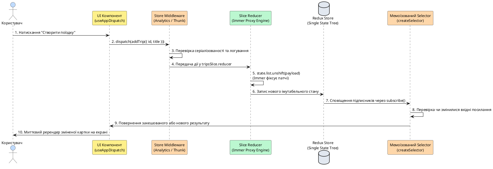

# Redux Toolkit на мобільних платформах

## Встановлення та налаштування у React Native проєкті

Перед тим як заглибитися у концепції Redux Toolkit, давайте встановимо необхідні бібліотеки та створимо базову структуру проєкту.

### Крок 1: Встановлення залежностей

Redux Toolkit та React-Redux є окремими npm-пакетами, які потрібно додати до вашого проєкту:

::tabs

::tabs-item{label="npm"}

```bash
npm install @reduxjs/toolkit react-redux
```

::

::tabs-item{label="yarn"}

```bash
yarn add @reduxjs/toolkit react-redux
```

::

::tabs-item{label="pnpm"}

```bash
pnpm add @reduxjs/toolkit react-redux
```

::

::

**Що ми встановили:**

- **`@reduxjs/toolkit`** — офіційний набір інструментів Redux, який включає `createSlice`, `configureStore`, `createAsyncThunk` та інші утиліти
- **`react-redux`** — офіційні React-біндінги для Redux, які надають `Provider`, `useSelector` та `useDispatch` хуки

::note
**Версії:** Переконайтеся, що використовуєте актуальні версії:

- `@reduxjs/toolkit`: ^2.0.0 або новіша
- `react-redux`: ^9.0.0 або новіша

Ці версії повністю сумісні з React Native та підтримують TypeScript з коробки.
::

### Крок 2: Створення структури директорій

Створіть наступну файлову структуру у вашому проєкті:

```
src/
├── store/
│   ├── index.ts           # Налаштування Store
│   ├── hooks.ts           # Типізовані хуки
│   ├── slices/            # Модулі стану (Slices)
│   │   ├── tripsSlice.ts
│   │   └── settingsSlice.ts
│   └── thunks/            # Асинхронні дії
│       └── tripsThunks.ts
```

Ця структура допоможе організувати код та полегшить масштабування застосунку.

### Крок 3: Базова конфігурація Store

Створимо мінімальний робочий Store, який ви зможете розширювати:

```typescript
// src/store/index.ts
import { configureStore } from '@reduxjs/toolkit'

// Поки що створюємо порожній Store
export const store = configureStore({
    reducer: {
        // Тут будуть підключатися наші slices
    },
})

// Експортуємо типи для TypeScript
export type RootState = ReturnType<typeof store.getState>
export type AppDispatch = typeof store.dispatch
```

**Що робить `configureStore`:**

- Автоматично налаштовує Redux DevTools Extension (для дебагу)
- Додає `redux-thunk` middleware (для асинхронних дій)
- Підключає перевірки на мутації та серіалізованість у режимі розробки
- Комбінує всі редюсери в єдине дерево стану

### Крок 4: Підключення Provider до застосунку

Огорніть кореневий компонент вашого застосунку у `Provider`:

::tabs

::tabs-item{label="Expo Router"}

```tsx
// app/_layout.tsx
import { Provider } from 'react-redux'
import { store } from '@/store'
import { Stack } from 'expo-router'

export default function RootLayout() {
    return (
        <Provider store={store}>
            <Stack>
                <Stack.Screen name="(tabs)" options={{ headerShown: false }} />
            </Stack>
        </Provider>
    )
}
```

::

::tabs-item{label="React Navigation"}

```tsx
// App.tsx
import { Provider } from 'react-redux'
import { store } from './src/store'
import { NavigationContainer } from '@react-navigation/native'
import { RootNavigator } from './src/navigation'

export default function App() {
    return (
        <Provider store={store}>
            <NavigationContainer>
                <RootNavigator />
            </NavigationContainer>
        </Provider>
    )
}
```

::

::

::warning
**Важливо:** `Provider` має бути **найвищим** компонентом в ієрархії, щоб усі дочірні компоненти мали доступ до Redux store через хуки `useSelector` та `useDispatch`.
::

Тепер ваш проєкт готовий до роботи з Redux Toolkit! У наступних розділах ми розглянемо, як створювати slices, працювати з даними та будувати складні застосунки.

---

## Навіщо централізоване сховище на мобільному пристрої

Уявіть, що ви розробляєте складний мобільний продукт: стрічка поїздок, екран детального перегляду маршруту, модальне вікно створення нової локації, панель фільтрації, екран профілю користувача з налаштуваннями теми та офлайн-сховище. Кожен із цих екранів потребує доступу до спільних даних: зміна статусу поїздки в деталях повинна миттєво відобразитися у стрічці, а оновлення теми в налаштуваннях має без затримок перефарбувати всі навігаційні панелі.

У веб-розробці для цього застосовують локальний стан компонентів, підняття стану вгору (_Lifting State Up_), Context API або глобальні стейт-менеджери. Проте в мобільному середовищі на **React Native** з'являються критичні фактори, які роблять архітектуру керування станом значно складнішою:

::field-group

::field{name="1. Життєвий цикл навігаційного стека (Navigation Stack Lifecycle)" type="Мобільний фактор"}
На відміну від браузера, де перехід за посиланням зазвичай розмонтовує попередню сторінку, стек мобільної навігації (наприклад, у React Navigation або Expo Router) зберігає попередні екрани **змонтованими у пам'яті**, щоб забезпечити миттєву анімацію жесту повернення назад (_Swipe Back_). Якщо стан зберігається локально в `useState` одного з екранів, спроба оновити його з модального вікна вимагає громіздкого передавання колбеків крізь навігаційні параметри, що призводить до заплутаного коду та витоків пам'яті.
::

::field{name="2. Обмеженість пам'яті та примусове вивантаження процесу (OOM Killer)" type="Мобільний фактор"}
Мобільна операційна система (iOS чи Android) у будь-який момент може примусово «вбити» фоновий процес застосунку для вивільнення оперативної пам'яті для вхідного дзвінка або камери. При поверненні користувача JavaScript-рантайм запускається «з нуля». Централізоване сховище дозволяє легко налаштувати **персистентність (State Rehydration)** — автоматичне збереження та відновлення всього дерева стану з дискового сховища (MMKV або AsyncStorage).
::

::field{name="3. Асинхронні ланцюжки та робота в нестабільній мережі" type="Мобільний фактор"}
Мобільні застосунки постійно виконують паралельні асинхронні задачі: запити до API, фонове визначення геолокації, читання з локальної бази SQLite та роботу в режимі офлайн. Без жорстко структурованого потоку даних застосунок швидко скочується до стану гонитви (_Race Conditions_) та неконсистентності UI.
::

::field{name="4. Дебаг та інспектування стану у виробничому середовищі" type="Мобільний фактор"}
Дебаг мобільного клієнта на реальному фізичному пристрої значно складніший за веб-інспектор. Інтеграція Redux DevTools дозволяє записувати історію дій, досліджувати знімки пам'яті та проводити перемотування стану (_Time-Travel Debugging_) безпосередньо під час тестування жестів та переходів.
::

::

::note
**Головний висновок:** Централізоване сховище в мобільному застосунку є **єдиним джерелом істини (Single Source of Truth)**, що відокремлює бізнес-логіку та роботу з даними від візуального життєвого циклу екранів. **Redux Toolkit (RTK)** є офіційним стандартом Redux, який усуває понад 80% шаблонного коду, гарантує безпеку типізації та оптимізує рендеринг за рахунок поверхневого порівняння селекторів.
::

---

## Що таке Redux Toolkit: Еволюція та архітектурні переваги

### Історія та еволюція від Legacy Redux до RTK

Класичний Redux, створений Деном Абрамовим у 2015 році, базувався на трьох базових принципах:

1. **Єдине джерело істини:** Весь глобальний стан зберігається в єдиному дереві всередині одного Store.
2. **Стан доступний лише для читання:** Єдиний спосіб змінити стан — відправити дію (**Action**), що описує подію, яка відбулася.
3. **Зміни вносяться чистими функціями:** Логіка оновлення стану описується **Редюсерами (Reducers)**, які приймають поточний стан і дію та повертають новий стан без побічних ефектів.

Незважаючи на просту концепцію, класичний «Legacy Redux» мав великий мінус — **величезну кількість шаблонного коду (Boilerplate)**. Для додавання навіть простого поля потрібно було:

- Створити строкову константу `const ADD_TRIP = 'trips/ADD_TRIP'`;
- Написати функцію-творець дії `const addTrip = (trip) => ({ type: ADD_TRIP, payload: trip })`;
- Описати громіздкий `switch/case` у файлі редюсера;
- Вручну копіювати кожен рівень вкладеності через spread-оператори (`...state`, `...state.items`), щоб не порушити іммутабельність;
- Вручну налаштовувати підключення `redux-thunk`, DevTools extension та middleware для перевірки мутацій.

У 2019 році команда розробників випустила **Redux Toolkit (`@reduxjs/toolkit`)**, що повністю переосмислив досвід роботи з Redux:

```
┌──────────────────────────────────────────────────────────────────────────────────────────┐
│                                 REDUX TOOLKIT (RTK)                                      │
├──────────────────────────┬───────────────────────────────┬───────────────────────────────┤
│    configureStore()      │        createSlice()          │      createAsyncThunk()       │
│  Автоматичний thunk,     │  Об'єднує Actions + Reducers  │  Стандартизує async lifecycle │
│  DevTools та middleware  │   з підтримкою Immer Proxy    │   (pending/fulfilled/rejected)│
├──────────────────────────┼───────────────────────────────┼───────────────────────────────┤
│  createEntityAdapter()   │       createSelector()        │   createListenerMiddleware()  │
│   Нормалізація O(1)      │      Reselect мемоїзація      │    Легковагі сайд-ефекти      │
│  (byId + allIds CRUD)    │    для важких списків RN      │    замість важкої Saga        │
└──────────────────────────┴───────────────────────────────┴───────────────────────────────┘
```

---

## Базові концепції Redux: Нагадування основ

Перед тим як заглибитися у Redux Toolkit, важливо чітко розуміти три фундаментальні концепції Redux, на яких побудована вся архітектура.

### Що таке Store (Сховище)?

**Store** — це центральний об'єкт, який зберігає **весь** глобальний стан вашого застосунку у вигляді єдиного JavaScript-об'єкта. Уявіть його як велику базу даних в пам'яті.

```typescript
// Приклад стану у Store
{
    trips: {
        items: [
            { id: '1', title: 'Карпати', region: 'Захід' },
            { id: '2', title: 'Одеса', region: 'Південь' }
        ],
        loading: false,
        error: null
    },
    user: {
        profile: { name: 'Олександр', email: 'alex@example.com' },
        isAuthenticated: true
    },
    settings: {
        theme: 'dark',
        language: 'uk'
    }
}
```

**Головні правила Store:**

1. У застосунку має бути **лише один** Store (Single Source of Truth)
2. Стан Store **доступний лише для читання** — не можна змінювати його напряму
3. Єдиний спосіб змінити стан — відправити **Action** (дію)

### Що таке Action (Дія)?

**Action** — це звичайний JavaScript-об'єкт, який описує **що саме сталося** у застосунку. Це як повідомлення або команда.

```typescript
// Приклад простої дії
{
    type: 'trips/addTrip',           // Тип дії (обов'язковий)
    payload: {                        // Дані дії (опціонально)
        id: '3',
        title: 'Київ',
        region: 'Центр'
    }
}
```

**Анатомія Action:**

- **`type`** (обов'язковий) — унікальний рядок, що ідентифікує подію. Зазвичай у форматі `'sliceName/actionName'`
- **`payload`** (опціонально) — дані, які потрібні для обробки цієї дії
- **`meta`**, **`error`** (опціонально) — додаткові поля для метаданих або помилок

::tip
**Називання дій:** Використовуйте формат `'domain/eventType'`, наприклад:

- `'trips/addTrip'` — додати поїздку
- `'user/loginSuccess'` — успішний логін
- `'settings/toggleTheme'` — перемкнути тему

Це допомагає швидко зрозуміти, до якої частини застосунку належить дія.
::

### Що таке Reducer (Редюсер)?

**Reducer** — це чиста функція, яка приймає **поточний стан** та **дію**, і повертає **новий стан**. Це єдине місце, де дозволено змінювати стан.

```typescript
// Простий приклад редюсера (без Redux Toolkit)
function tripsReducer(state = initialState, action) {
    // Перевіряємо тип дії
    if (action.type === 'trips/addTrip') {
        // Повертаємо НОВИЙ стан (не мутуємо старий!)
        return {
            ...state,
            items: [action.payload, ...state.items],
        }
    }

    // Якщо дія не для нас — повертаємо стан без змін
    return state
}
```

**Правила Reducer:**

1. **Чиста функція** — однакові вхідні дані завжди дають однаковий результат
2. **Іммутабельність** — ніколи не змінюємо вхідний `state` напряму, завжди створюємо новий
3. **Без побічних ефектів** — не робимо HTTP-запити, не змінюємо глобальні змінні, не генеруємо випадкові числа

::note
**Чому іммутабельність важлива?**

React і Redux порівнюють стан за **посиланням** (`oldState === newState`), а не за вмістом. Якщо ви змінюєте об'єкт напряму (мутуєте), посилання залишається тим самим, і React не помітить змін — компонент не оновиться.

```typescript
// ❌ ПОГАНО: Мутація (посилання не змінилося)
state.items.push(newItem)
return state // Той самий об'єкт!

// ✅ ДОБРЕ: Створюємо новий масив
return {
    ...state,
    items: [...state.items, newItem], // Нове посилання!
}
```

::

### Життєвий цикл даних у Redux

Тепер з'єднаємо все разом та подивимось, як дані рухаються через Redux:

::plant-uml{alt="Життєвий цикл Redux"}



::

**Покроковий опис:**

1. **Користувач діє** — натискає кнопку, вводить текст тощо
2. **Компонент відправляє дію** — `dispatch(addTrip({ title: 'Київ' }))`
3. **Store передає дію в Reducer** — викликає функцію редюсера з поточним станом
4. **Reducer обчислює новий стан** — обробляє дію та повертає оновлений стан
5. **Store зберігає новий стан** — замінює старий стан на новий
6. **Store сповіщає підписників** — усі компоненти з `useSelector` отримують нотифікацію
7. **React ререндерить компоненти** — які використовують змінені дані

---

## Що таке Redux Toolkit та навіщо він потрібен?

Тепер, коли ми пригадали основи Redux, поговоримо про те, чому був створений Redux Toolkit.

### Проблеми класичного Redux

У «старому» Redux (який ще називають Legacy Redux) для додавання простої функції додавання поїздки потрібно було написати **багато** коду:

::code-group

```typescript [1. Константи типів]
// constants/actionTypes.ts
export const ADD_TRIP = 'trips/ADD_TRIP'
export const REMOVE_TRIP = 'trips/REMOVE_TRIP'
export const FETCH_TRIPS_START = 'trips/FETCH_TRIPS_START'
export const FETCH_TRIPS_SUCCESS = 'trips/FETCH_TRIPS_SUCCESS'
export const FETCH_TRIPS_FAILURE = 'trips/FETCH_TRIPS_FAILURE'
```

```typescript [2. Action Creators]
// actions/tripsActions.ts
import { ADD_TRIP, REMOVE_TRIP } from '../constants/actionTypes'

export const addTrip = (trip) => ({
    type: ADD_TRIP,
    payload: trip,
})

export const removeTrip = (id) => ({
    type: REMOVE_TRIP,
    payload: id,
})
```

```typescript [3. Reducer]
// reducers/tripsReducer.ts
import { ADD_TRIP, REMOVE_TRIP, FETCH_TRIPS_START /* ... */ } from '../constants/actionTypes'

const initialState = {
    items: [],
    loading: false,
    error: null,
}

export function tripsReducer(state = initialState, action) {
    switch (action.type) {
        case ADD_TRIP:
            return {
                ...state,
                items: [...state.items, action.payload],
            }
        case REMOVE_TRIP:
            return {
                ...state,
                items: state.items.filter((t) => t.id !== action.payload),
            }
        case FETCH_TRIPS_START:
            return {
                ...state,
                loading: true,
                error: null,
            }
        // ... ще 5-10 кейсів
        default:
            return state
    }
}
```

```typescript [4. Store]
// store/index.ts
import { createStore, applyMiddleware, combineReducers } from 'redux'
import thunk from 'redux-thunk'
import { composeWithDevTools } from 'redux-devtools-extension'
import { tripsReducer } from './reducers/tripsReducer'

const rootReducer = combineReducers({
    trips: tripsReducer,
})

export const store = createStore(rootReducer, composeWithDevTools(applyMiddleware(thunk)))
```

::

**Підрахунок:** Для однієї простої функції ми написали **4 файли** та близько **80 рядків коду**!

### Рішення: Redux Toolkit

Redux Toolkit скорочує код у **5-10 разів** та робить його читабельнішим:

```typescript
// src/store/slices/tripsSlice.ts
import { createSlice, PayloadAction } from '@reduxjs/toolkit'

interface Trip {
    id: string
    title: string
    region: string
}

interface TripsState {
    items: Trip[]
    loading: boolean
    error: string | null
}

const initialState: TripsState = {
    items: [],
    loading: false,
    error: null,
}

// ВСЕ В ОДНОМУ МІСЦІ!
export const tripsSlice = createSlice({
    name: 'trips',
    initialState,
    reducers: {
        // Додавання поїздки
        addTrip(state, action: PayloadAction<Trip>) {
            // Можемо мутувати state напряму! (Immer під капотом)
            state.items.push(action.payload)
        },
        // Видалення поїздки
        removeTrip(state, action: PayloadAction<string>) {
            state.items = state.items.filter((t) => t.id !== action.payload)
        },
        // Початок завантаження
        setLoading(state, action: PayloadAction<boolean>) {
            state.loading = action.payload
        },
    },
})

// Експортуємо action creators (згенеровані автоматично!)
export const { addTrip, removeTrip, setLoading } = tripsSlice.actions

// Експортуємо reducer
export default tripsSlice.reducer
```

**Що ми отримали:**

- ✅ Весь код в **одному файлі** замість чотирьох
- ✅ **Автоматична генерація** action creators
- ✅ Можемо **мутувати стан** напряму (Immer робить його іммутабельним)
- ✅ **TypeScript підтримка** з коробки
- ✅ Менше коду — менше помилок

::tip
**Redux Toolkit = "Batteries Included"**

Redux Toolkit включає все необхідне з коробки:

- ✅ `redux` — базова бібліотека
- ✅ `redux-thunk` — для асинхронних дій
- ✅ `immer` — для безпечних "мутацій"
- ✅ `reselect` — для мемоїзації селекторів
- ✅ Redux DevTools — для дебагу

Не потрібно встановлювати окремо!
::

---

## Ключові концепції Redux Toolkit та як вони працюють

Розглянемо кожну абстракцію RTK на глибокому рівні з детальними прикладами коду.

### 1. Action (Дія) та Action Creator (Творець дії)

**Action** — це звичайний JavaScript-об'єкт, який повідомляє сховищу про те, що в застосунку відбулася певна подія. У сучасному Redux усі дії відповідають специфікації **Flux Standard Action (FSA)**:

```typescript
interface FluxStandardAction<Payload = any, Meta = any> {
    type: string // Обов'язковий унікальний ідентифікатор події
    payload?: Payload // Дані дії (корисне навантаження)
    error?: boolean // Прапорець, що вказує на наявність помилки в payload
    meta?: Meta // Додаткові метадані (наприклад, analyticsId, timestamp)
}
```

**Action Creator** — це функція, яка інкапсулює створення та валідацію об'єкта дії.

#### Ручне створення дії через `createAction`

Хоча зазвичай дії генеруються автоматично всередині `createSlice`, утиліта `createAction` дозволяє створювати автономні дії:

```typescript
import { createAction, nanoid } from '@reduxjs/toolkit'

// Базовий Action Creator:
export const resetAllFilters = createAction('filters/reset')
// Виклик resetAllFilters() повертає { type: 'filters/reset' }

// Action Creator з функцією підготовки (Prepare Callback):
export const addCustomTrip = createAction('trips/addCustom', (title: string, region: string) => {
    return {
        payload: {
            id: nanoid(), // Генерація унікального ID
            title,
            region,
            createdAt: new Date().toISOString(), // Серіалізована дата!
        },
        meta: {
            analyticsEvent: 'TRIP_CREATED_MANUALLY',
        },
    }
})

// Використання:
const action = addCustomTrip('Карпати', 'Захід')
console.log(action)
// {
//   type: 'trips/addCustom',
//   payload: { id: 'V1StGXR8_Z5jdHi6B-myT', title: 'Карпати', region: 'Захід', createdAt: '...' },
//   meta: { analyticsEvent: 'TRIP_CREATED_MANUALLY' }
// }
```

#### Механізм зіставлення дій (`action.match`)

Action Creators, створені в RTK, мають вбудований предикатний метод `match(action)`:

```typescript
const action: unknown = { type: 'filters/reset' }

if (resetAllFilters.match(action)) {
    // TypeScript автоматично звужує тип action до PayloadAction
    console.log('Це дійсно дія скидання фільтрів!')
}
```

---

### 2. Reducer (Редуктор) та механіка Immer під капотом

**Reducer** — це чиста функція для оновлення стану:

::math-formula
f: (\text{PreviousState}, \text{Action}) \longrightarrow \text{NewState}
::

#### Чому редуктор зобов'язаний бути чистою функцією?

У редукторі **категорично заборонено**:

1. Виконувати асинхронні виклики (HTTP-запити, таймери `setTimeout`);
2. Генерувати недетерміновані значення (`Math.random()`, `nanoid()`, `new Date()`, `Date.now()`);
3. Змінювати глобальні змінні або викликати побічні ефекти (_Side Effects_).

Якщо для однакового стану та однакової дії редуктор повертатиме різні результати, передбачуваність стану Redux руйнується, а Time-Travel Debugging стає неможливим.

#### Як Immer забезпечує безпеку мутуючого синтаксису

У класичному Redux оновлення вкладеного поля вимагало жахливого «spread hell»:

```typescript
// СТАРИЙ ПІДХІД (Legacy Redux): Складно читати, легко зробити помилку!
function legacyReducer(state = initialState, action) {
    switch (action.type) {
        case 'trips/updatePlaceRating':
            return {
                ...state,
                trips: state.trips.map((trip) => {
                    if (trip.id !== action.payload.tripId) return trip
                    return {
                        ...trip,
                        places: trip.places.map((place) => {
                            if (place.id !== action.payload.placeId) return place
                            return {
                                ...place,
                                rating: action.payload.rating,
                            }
                        }),
                    }
                }),
            }
        default:
            return state
    }
}
```

У Redux Toolkit всі редуктори всередині `createSlice` використовують бібліотеку **Immer**. Immer огортає стан у нативний JavaScript-об'єкт **`Proxy`** (механіка _Copy-on-Write_):

```typescript
// СУЧАСНИЙ ПІДХІД (Redux Toolkit + Immer):
updatePlaceRating(state, action: PayloadAction<{ tripId: string; placeId: string; rating: number }>) {
  const trip = state.trips.find(t => t.id === action.payload.tripId);
  const place = trip?.places.find(p => p.id === action.payload.placeId);
  if (place) {
    place.rating = action.payload.rating; // Пряма мутація draft-об'єкта!
  }
}
```

::plant-uml



::

::warning
**Два критичних правила роботи з Immer:**

1. **Або мутуємо, або повертаємо нове значення:**

    ```typescript
    // ❌ ПОМИЛКА: Не можна одночасно мутувати draft і повертати значення!
    badReducer(state, action) {
      state.loading = false;
      return action.payload; // Кине помилку в рантаймі!
    }

    // ✅ ПРАВИЛЬНО (варіант 1 — мутація draft):
    goodReducer1(state, action) {
      state.loading = false;
      state.data = action.payload;
    }

    // ✅ ПРАВИЛЬНО (варіант 2 — повернення абсолютно нового стану):
    goodReducer2(state, action) {
      return { loading: false, data: action.payload };
    }
    ```

2. **Дебаг об'єктів Draft у console.log:**
   Якщо ви виведете `console.log(state)` всередині редуктора, ви побачите нечитабельний Proxy-об'єкт. Для перегляду реального вмісту використовуйте утиліту `current()` з `@reduxjs/toolkit`:

    ```typescript
    import { current } from '@reduxjs/toolkit'

    myReducer(state, action) {
      console.log('Поточний стан:', current(state)); // Покаже чистий JS-об'єкт!
    }
    ```

::

---

### 3. Slice (`createSlice`): Повний розбір

**Slice** (з англ. "зріз", "шматок") — це логічно відокремлений модуль стану в Redux Toolkit, який об'єднує в собі:

- **Початковий стан** (`initialState`)
- **Редюсери** для внутрішніх дій (`reducers`)
- **Обробники зовнішніх подій** (`extraReducers`)
- **Автоматично згенеровані action creators**

::tip
**Аналогія зі світу React:**

Якщо уявити Redux Store як велику базу даних, то Slice — це окрема **таблиця** в цій базі.

- `userSlice` → таблиця користувачів
- `tripsSlice` → таблиця поїздок
- `settingsSlice` → таблиця налаштувань

Кожна таблиця має свою схему (initialState) та методи для роботи з даними (reducers).
::

#### Анатомія createSlice: Всі параметри

```typescript
import { createSlice, PayloadAction } from '@reduxjs/toolkit'

interface Trip {
    id: string
    title: string
    region: string
    likes: number
}

interface TripsState {
    items: Trip[]
    loading: boolean
    error: string | null
    selectedTripId: string | null
}

const initialState: TripsState = {
    items: [],
    loading: false,
    error: null,
    selectedTripId: null,
}

export const tripsSlice = createSlice({
    // 1️⃣ name — Назва slice (використовується у типах дій)
    name: 'trips',

    // 2️⃣ initialState — Початковий стан slice
    initialState,

    // 3️⃣ reducers — Внутрішні дії та їх обробники
    reducers: {
        // Простий редюсер без payload
        clearTrips(state) {
            state.items = []
        },

        // Редюсер з payload (типізований через PayloadAction)
        addTrip(state, action: PayloadAction<Trip>) {
            state.items.unshift(action.payload)
        },

        // Редюсер з підготовкою (prepare callback)
        addTripWithAutoId: {
            reducer(state, action: PayloadAction<Trip>) {
                state.items.unshift(action.payload)
            },
            prepare(title: string, region: string) {
                return {
                    payload: {
                        id: nanoid(), // Генерація ID
                        title,
                        region,
                        likes: 0,
                    },
                }
            },
        },

        // Оновлення вкладеного поля
        updateTripLikes(state, action: PayloadAction<{ id: string; likes: number }>) {
            const trip = state.items.find((t) => t.id === action.payload.id)
            if (trip) {
                trip.likes = action.payload.likes // Immer дозволяє мутацію!
            }
        },

        // Видалення за ID
        removeTrip(state, action: PayloadAction<string>) {
            state.items = state.items.filter((t) => t.id !== action.payload)
        },
    },

    // 4️⃣ extraReducers — Обробка зовнішніх дій
    extraReducers: (builder) => {
        // Обробка асинхронних thunk-ів
        builder
            .addCase(fetchTripsThunk.pending, (state) => {
                state.loading = true
            })
            .addCase(fetchTripsThunk.fulfilled, (state, action) => {
                state.items = action.payload
                state.loading = false
            })
    },
})

// 5️⃣ Експорт згенерованих action creators
export const { clearTrips, addTrip, addTripWithAutoId, updateTripLikes, removeTrip } = tripsSlice.actions

// 6️⃣ Експорт reducer для підключення до store
export default tripsSlice.reducer
```

#### Детальний розбір кожної секції

##### 1. name — Простір імен для дій

Параметр `name` використовується як **префікс** для всіх автоматично згенерованих типів дій:

```typescript
createSlice({
    name: 'trips',
    reducers: {
        addTrip: ...,
        removeTrip: ...
    }
})

// Згенеровані типи дій:
// - trips/addTrip
// - trips/removeTrip
```

::warning
**Правила найменування:**

- ✅ Використовуйте **singular** (однина): `'trip'`, `'user'`, `'setting'`
- ✅ Або **множина** для колекцій: `'trips'`, `'users'`, `'settings'`
- ❌ Уникайте префіксів `Slice` або `State`: ~~`'tripsSlice'`~~, ~~`'tripsState'`~~
- ✅ Використовуйте camelCase: `'userProfile'`, `'appSettings'`

::

##### 2. initialState — Початковий стан

**Початковий стан** визначає структуру даних та їх дефолтні значення:

```typescript
// Простий стан
const initialState = {
    items: [],
    loading: false,
}

// Складний стан з TypeScript інтерфейсом
interface TripsState {
    items: Trip[]
    loading: boolean
    error: string | null
    filters: {
        region: string
        search: string
    }
    pagination: {
        page: number
        pageSize: number
        total: number
    }
}

const initialState: TripsState = {
    items: [],
    loading: false,
    error: null,
    filters: {
        region: 'all',
        search: '',
    },
    pagination: {
        page: 1,
        pageSize: 20,
        total: 0,
    },
}
```

::tip
**Best Practices для initialState:**

1. **Завжди ініціалізуйте всі поля** — не залишайте `undefined`
2. **Використовуйте `null` для відсутніх даних** замість `undefined`
3. **Серіалізовані типи** — тільки JSON-сумісні значення
4. **Дати як рядки** — ISO 8601 формат: `'2026-08-29T10:00:00.000Z'`

::

##### 3. reducers — Внутрішні дії slice

Редюсери в `reducers` автоматично генерують **action creators** з тим самим іменем:

```typescript
reducers: {
    // 1. Редюсер без аргументів
    clearTrips(state) {
        state.items = []
    }
}

// Використання:
dispatch(clearTrips())  // Викликаємо БЕЗ аргументів

// Згенерована дія:
// { type: 'trips/clearTrips' }
```

```typescript
reducers: {
    // 2. Редюсер з одним аргументом
    addTrip(state, action: PayloadAction<Trip>) {
        state.items.push(action.payload)
    }
}

// Використання:
dispatch(addTrip({ id: '1', title: 'Київ' }))

// Згенерована дія:
// {
//   type: 'trips/addTrip',
//   payload: { id: '1', title: 'Київ' }
// }
```

```typescript
reducers: {
    // 3. Редюсер з prepare callback (багато аргументів)
    addTripWithMetadata: {
        reducer(state, action: PayloadAction<Trip>) {
            state.items.push(action.payload)
        },
        prepare(title: string, region: string, userId: string) {
            return {
                payload: {
                    id: nanoid(),
                    title,
                    region,
                    createdAt: new Date().toISOString(),
                    createdBy: userId
                }
            }
        }
    }
}

// Використання:
dispatch(addTripWithMetadata('Карпати', 'Захід', 'user-123'))

// Згенерована дія:
// {
//   type: 'trips/addTripWithMetadata',
//   payload: {
//     id: 'V1StGXR8_Z5jd...',
//     title: 'Карпати',
//     region: 'Захід',
//     createdAt: '2026-08-29T10:30:00.000Z',
//     createdBy: 'user-123'
//   }
// }
```

::note
**Чому потрібен prepare callback?**

Редюсери мають бути **чистими функціями** — не можуть генерувати випадкові значення або дати. Функція `prepare` виконується **до** редюсера і може:

- Генерувати ID (`nanoid()`, `uuid()`)
- Додавати timestamps (`Date.now()`)
- Валідувати вхідні дані
- Трансформувати аргументи в payload

::

##### Типові патерни роботи зі станом

```typescript
reducers: {
    // Додавання елемента на початок
    addTripToStart(state, action: PayloadAction<Trip>) {
        state.items.unshift(action.payload)  // Immer дозволяє!
    },

    // Оновлення за ID
    updateTrip(state, action: PayloadAction<{ id: string; changes: Partial<Trip> }>) {
        const { id, changes } = action.payload
        const trip = state.items.find(t => t.id === id)
        if (trip) {
            Object.assign(trip, changes)  // Immer дозволяє!
        }
    },

    // Видалення за умовою
    removeCompletedTrips(state) {
        state.items = state.items.filter(t => !t.isCompleted)
    },

    // Оновлення вкладеного об'єкта
    updateFilter(state, action: PayloadAction<{ key: keyof Filters; value: string }>) {
        const { key, value } = action.payload
        state.filters[key] = value
    },

    // Скидання до початкового стану
    resetTrips(state) {
        return initialState  // Повертаємо новий об'єкт
    }
}
```

::accordion

::accordion-item{label="Чи можна мутувати state напряму?" icon="i-lucide-alert-triangle"}
✅ **Так, але ТІЛЬКИ всередині reducers у createSlice!**

Immer автоматично перетворює мутації в іммутабельні операції:

```typescript
// ✅ МОЖНА (всередині createSlice):
reducers: {
    addTrip(state, action) {
        state.items.push(action.payload)  // Працює завдяки Immer!
    }
}

// ❌ НЕ МОЖНА (поза createSlice):
function MyComponent() {
    const trips = useAppSelector(state => state.trips.items)
    trips.push(newTrip)  // ❌ ПОМИЛКА! Мутація стану!
}
```

::

::accordion-item{label="Як оновити глибоко вкладене поле?" icon="i-lucide-layers"}
Завдяки Immer можна писати як звичайний JavaScript:

```typescript
// Стан:
// state.trips.items[0].places[0].rating = 3

// Старий Redux (складно читати):
return {
    ...state,
    items: state.items.map((trip, index) =>
        index === 0
            ? {
                ...trip,
                places: trip.places.map((place, pIndex) =>
                    pIndex === 0
                        ? { ...place, rating: 5 }
                        : place
                )
            }
            : trip
    )
}

// Redux Toolkit (просто і зрозуміло):
updatePlaceRating(state, action: PayloadAction<{ tripIndex: number; placeIndex: number; rating: number }>) {
    const { tripIndex, placeIndex, rating } = action.payload
    state.items[tripIndex].places[placeIndex].rating = rating
}
```

::

::accordion-item{label="Чому не можна одночасно мутувати і повертати значення?" icon="i-lucide-x-circle"}
Це обмеження Immer:

```typescript
// ❌ ПОМИЛКА:
badReducer(state, action) {
    state.loading = false      // Мутація
    return action.payload      // І повернення нового стану
}
// Помилка: "Cannot return value while mutating draft"

// ✅ ВАРІАНТ 1 — Тільки мутація:
goodReducer1(state, action) {
    state.loading = false
    state.data = action.payload
}

// ✅ ВАРІАНТ 2 — Тільки повернення:
goodReducer2(state, action) {
    return {
        loading: false,
        data: action.payload
    }
}
```

::

::

#### Розширений синтаксис редюсерів з `prepare`

Якщо дія вимагає генерації унікального ID або попередньої обробки аргументів перед попаданням у редуктор, `createSlice` підтримує об'єктний синтаксис `{ reducer, prepare }`:

```typescript
import { createSlice, PayloadAction, nanoid } from '@reduxjs/toolkit'

interface TripItem {
    id: string
    title: string
    createdAt: string
}

interface TripsState {
    list: TripItem[]
}

const initialState: TripsState = { list: [] }

export const tripsSlice = createSlice({
    name: 'trips',
    initialState,
    reducers: {
        // Простий редюсер
        clearAllTrips(state) {
            state.list = []
        },

        // Редюсер з функцією попередньої підготовки (prepare)
        addTripWithAutoId: {
            reducer(state, action: PayloadAction<TripItem>) {
                state.list.unshift(action.payload)
            },
            prepare(title: string) {
                return {
                    payload: {
                        id: nanoid(),
                        title,
                        createdAt: new Date().toISOString(),
                    },
                }
            },
        },
    },
})

export const { clearAllTrips, addTripWithAutoId } = tripsSlice.actions
export default tripsSlice.reducer
```

#### Обробка зовнішніх дій через `extraReducers`: Детальний розбір

**`extraReducers`** — це спеціальна секція в `createSlice`, яка дозволяє обробляти дії, **створені поза межами поточного slice**. Це критична функція для роботи з асинхронними thunk-ами (`createAsyncThunk`) або діями з інших slices.

::tip
**Коли використовувати `extraReducers`:**

1. ✅ Обробка асинхронних дій з `createAsyncThunk` (pending/fulfilled/rejected)
2. ✅ Реагування на дії з інших slices (наприклад, `logout` з `userSlice` має очистити дані в `tripsSlice`)
3. ✅ Обробка дій, створених через `createAction` окремо

**Коли НЕ потрібен `extraReducers`:**

- ❌ Для дій, які належать **поточному slice** — використовуйте звичайний `reducers`

::

##### Формат запису `extraReducers`: Builder Callback Pattern

Redux Toolkit рекомендує використовувати **builder callback notation** замість об'єктного синтаксису:

```typescript
import { createSlice, PayloadAction } from '@reduxjs/toolkit'
import { fetchTripsThunk, createTripThunk } from '../thunks/tripsThunks'
import { logout } from './userSlice' // Дія з іншого slice!

export const tripsSlice = createSlice({
    name: 'trips',
    initialState,
    reducers: {
        // Власні дії slice
        clearTrips(state) {
            state.items = []
        },
    },
    extraReducers: (builder) => {
        // Builder має 3 методи:
        // - addCase: обробка конкретної дії
        // - addMatcher: обробка групи дій за умовою
        // - addDefaultCase: обробка всіх неопрацьованих дій

        builder
            // 1. ОБРОБКА КОНКРЕТНОЇ ДІЇ (addCase)
            .addCase(fetchTripsThunk.pending, (state) => {
                state.loading = true
                state.error = null
            })
            .addCase(fetchTripsThunk.fulfilled, (state, action: PayloadAction<Trip[]>) => {
                state.loading = false
                state.items = action.payload // Дані прийшли з сервера
            })
            .addCase(fetchTripsThunk.rejected, (state, action) => {
                state.loading = false
                state.error = action.payload ?? 'Помилка завантаження'
            })

            // 2. РЕАГУВАННЯ НА ДІЇ З ІНШОГО SLICE
            .addCase(logout, (state) => {
                // Коли користувач виходить — очищаємо поїздки
                state.items = []
                state.loading = false
                state.error = null
            })
    },
})
```

::note
**Різниця між `reducers` та `extraReducers`:**

| Властивість                               | `reducers`                  | `extraReducers`                       |
| ----------------------------------------- | --------------------------- | ------------------------------------- |
| **Власність slice**                       | ✅ Дії належать цьому slice | ❌ Дії створені ззовні                |
| **Автоматична генерація action creators** | ✅ Генеруються автоматично  | ❌ Потрібно імпортувати окремо        |
| **Використання**                          | Внутрішня логіка slice      | Асинхронні дії, міжслайсова логіка    |
| **Приклад**                               | `addTrip`, `removeTrip`     | `fetchTripsThunk.fulfilled`, `logout` |

::

##### Розширені матчери (`addMatcher`): Об'єднання груп дій

У великих мобільних застосунках часто потрібно показувати єдиний індикатор завантаження або централізовано очищувати помилки при запуску будь-якого з десятка асинхронних запитів. Утиліти `isAnyOf`, `isAllOf`, `isPending`, `isFulfilled`, `isRejected` дозволяють елегантно скоротити код:

```typescript
import { createSlice, isAnyOf, isPending, isFulfilled, isRejected } from '@reduxjs/toolkit'
import { resetAllFilters } from './filtersActions'
import { fetchTripsThunk, createTripThunk, deleteTripThunk, updateTripThunk } from './tripsThunks'

export const tripsSlice = createSlice({
    name: 'trips',
    initialState,
    reducers: {},
    extraReducers: (builder) => {
        builder
            // 1. ТОЧНА ОБРОБКА конкретних успішних дій
            .addCase(fetchTripsThunk.fulfilled, (state, action) => {
                state.items = action.payload
            })
            .addCase(createTripThunk.fulfilled, (state, action) => {
                state.items.unshift(action.payload) // Додаємо на початок
            })
            .addCase(deleteTripThunk.fulfilled, (state, action) => {
                state.items = state.items.filter((t) => t.id !== action.payload)
            })

            // 2. РЕАГУВАННЯ НА ДІЮ З ІНШОГО SLICE
            .addCase(resetAllFilters, (state) => {
                state.items = []
            })

            // 3. МАТЧЕР: Об'єднання ВСІХ станів завантаження (pending)
            // Замість копіювання коду для кожного thunk окремо!
            .addMatcher(
                isAnyOf(
                    fetchTripsThunk.pending,
                    createTripThunk.pending,
                    deleteTripThunk.pending,
                    updateTripThunk.pending,
                ),
                (state) => {
                    state.loading = true
                    state.error = null
                },
            )

            // 4. МАТЧЕР: Загальне завершення операцій (fulfilled)
            .addMatcher(
                isAnyOf(
                    fetchTripsThunk.fulfilled,
                    createTripThunk.fulfilled,
                    deleteTripThunk.fulfilled,
                    updateTripThunk.fulfilled,
                ),
                (state) => {
                    state.loading = false
                },
            )

            // 5. МАТЧЕР: Універсальне перехоплення ВСІХ помилок (rejected)
            .addMatcher(
                isAnyOf(
                    fetchTripsThunk.rejected,
                    createTripThunk.rejected,
                    deleteTripThunk.rejected,
                    updateTripThunk.rejected,
                ),
                (state, action) => {
                    state.loading = false
                    state.error = (action.payload as string) ?? action.error.message ?? 'Невідома помилка'
                },
            )
    },
})
```

::warning
**Порядок виконання має значення!**

Redux Toolkit виконує обробники у строгому порядку:

1. Спочатку всі `.addCase()` (точні збіги)
2. Потім всі `.addMatcher()` (умовні збіги)
3. Нарешті `.addDefaultCase()` (якщо жодне правило не спрацювало)

Якщо дія підпадає і під `addCase`, і під `addMatcher` — **виконаються ОБА** обробники!

```typescript
builder
    .addCase(fetchTripsThunk.fulfilled, (state, action) => {
        console.log('1. Конкретний обробник')
        state.items = action.payload
    })
    .addMatcher(isFulfilled, (state) => {
        console.log('2. Загальний matcher для всіх fulfilled')
        state.loading = false
    })
// При fetchTripsThunk.fulfilled виведеться:
// "1. Конкретний обробник"
// "2. Загальний matcher для всіх fulfilled"
```

::

##### Альтернативні матчери для різних сценаріїв

Redux Toolkit надає готові утиліти для роботи з групами дій:

```typescript
import {
    isAnyOf, // Хоча б одна умова істинна (OR)
    isAllOf, // Всі умови істинні (AND)
    isPending, // Дія має тип *.pending
    isFulfilled, // Дія має тип *.fulfilled
    isRejected, // Дія має тип *.rejected
    isAsyncThunkAction, // Будь-яка дія від createAsyncThunk
} from '@reduxjs/toolkit'

// Приклад: Універсальний індикатор завантаження для ВСІХ thunk-ів
builder.addMatcher(
    isAsyncThunkAction, // Будь-яка асинхронна дія
    (state, action) => {
        if (isPending(action)) {
            state.globalLoading = true
        }
        if (isFulfilled(action) || isRejected(action)) {
            state.globalLoading = false
        }
    },
)

// Приклад: Логування помилок тільки для конкретних thunk-ів
builder.addMatcher(
    isAllOf(isRejected, (action) => action.type.startsWith('trips/')),
    (state, action) => {
        console.error('[TRIPS ERROR]', action.error)
    },
)
```

::accordion

::accordion-item{title="Коли використовувати addCase vs addMatcher?" icon="i-lucide-help-circle"}
**Використовуйте `addCase`, коли:**

- Потрібна унікальна логіка для **конкретної дії**
- Наприклад: оновлення конкретного поля після `fetchUserProfile.fulfilled`

**Використовуйте `addMatcher`, коли:**

- Потрібна **спільна логіка** для групи дій
- Наприклад: показ індикатора завантаження для всіх `*.pending` дій
- Або централізоване логування всіх помилок з `*.rejected`

::

::accordion-item{title="Чи можна комбінувати addCase і addMatcher для однієї дії?" icon="i-lucide-layers"}
✅ **Так!** Це дозволяє мати загальну логіку (через matcher) та специфічну логіку (через case).

```typescript
builder
    // Специфічна логіка для конкретного fulfilled
    .addCase(fetchTripsThunk.fulfilled, (state, action) => {
        state.trips = action.payload
    })
    // Загальна логіка для ВСІХ fulfilled (включно з fetchTripsThunk)
    .addMatcher(isFulfilled, (state) => {
        state.loading = false
        state.lastUpdated = Date.now()
    })
```

::

::accordion-item{title="Що таке addDefaultCase і коли його використовувати?" icon="i-lucide-info"}
`addDefaultCase` — це "catch-all" обробник, який спрацьовує, якщо **жодна** дія не була оброблена через `addCase` або `addMatcher`.

```typescript
builder.addDefaultCase((state, action) => {
    // Логування всіх необроблених дій (корисно для дебагу)
    if (__DEV__) {
        console.log('Unhandled action:', action.type)
    }
})
```

⚠️ **Використовуйте обережно:** Це може призвести до непотрібних перерендерів, якщо ви змінюєте стан для кожної дії!
::

::

##### Практичний приклад: Міжслайсова синхронізація

Уявімо, що при виході користувача (`logout`) потрібно очистити дані у всіх slice-ах:

```typescript
// src/store/slices/userSlice.ts
export const userSlice = createSlice({
    name: 'user',
    initialState,
    reducers: {
        logout(state) {
            state.profile = null
            state.isAuthenticated = false
        },
    },
})

export const { logout } = userSlice.actions

// src/store/slices/tripsSlice.ts
import { logout } from './userSlice'

export const tripsSlice = createSlice({
    name: 'trips',
    initialState,
    reducers: {},
    extraReducers: (builder) => {
        builder.addCase(logout, (state) => {
            // Реагуємо на logout з userSlice
            state.items = []
            state.error = null
        })
    },
})

// src/store/slices/favoritesSlice.ts
import { logout } from './userSlice'

export const favoritesSlice = createSlice({
    name: 'favorites',
    initialState,
    reducers: {},
    extraReducers: (builder) => {
        builder.addCase(logout, (state) => {
            // Також очищаємо улюблені поїздки
            state.favoriteIds = []
        })
    },
})
```

Тепер один `dispatch(logout())` автоматично синхронізує три slice-и!

---

---

### 4. Store (`configureStore`) та конвеєр Middleware

**Store** створюється функцією `configureStore`, яка об'єднує всі слайси в єдине дерево та автоматично налаштовує стандартний конвеєр проміжного ПЗ (_Middleware Pipeline_).

---

## Практичний приклад: Повний цикл від дії до UI

Щоб зрозуміти, як усе працює разом, розглянемо реальний сценарій: **користувач натискає кнопку "Лайк" на картці поїздки**.

### Крок 1: Користувач натискає кнопку

```tsx
// src/components/TripCard.tsx
import React from 'react'
import { Pressable, Text } from 'react-native'
import { useAppDispatch, useAppSelector } from '@/store/hooks'
import { toggleLikeThunk } from '@/store/thunks/likesThunks'

export function TripCard({ tripId }: { tripId: string }) {
    const dispatch = useAppDispatch()

    // Отримуємо стан лайка зі store
    const isLiked = useAppSelector((state) => state.likes.byTripId[tripId] ?? false)
    const isLoading = useAppSelector((state) => state.likes.loading)

    const handleLike = () => {
        // 1️⃣ Користувач натискає — відправляємо дію
        dispatch(toggleLikeThunk({ tripId }))
    }

    return (
        <Pressable onPress={handleLike} disabled={isLoading}>
            <Text>{isLiked ? '❤️' : '🤍'}</Text>
        </Pressable>
    )
}
```

### Крок 2: Dispatch відправляє дію в Store

```typescript
// Коли ви викликаєте dispatch(toggleLikeThunk({ tripId: '123' }))
// відбувається наступне:

// 1. Redux відправляє PENDING дію:
{
    type: 'likes/toggleLike/pending',
    meta: {
        requestId: 'xR3k...',
        arg: { tripId: '123' }
    }
}
```

### Крок 3: Thunk виконує асинхронну логіку

```typescript
// src/store/thunks/likesThunks.ts
import { createAsyncThunk } from '@reduxjs/toolkit'
import { apiClient } from '@/api/client'
import type { RootState } from '../index'

export const toggleLikeThunk = createAsyncThunk<
    { tripId: string; isLiked: boolean }, // Успішний результат
    { tripId: string }, // Вхідний аргумент
    {
        state: RootState
        rejectValue: { tripId: string; previousState: boolean }
    }
>('likes/toggleLike', async ({ tripId }, { getState, rejectWithValue }) => {
    // 2️⃣ Зберігаємо поточний стан для можливого rollback
    const previousState = getState().likes.byTripId[tripId] ?? false

    try {
        // 3️⃣ Відправляємо запит на сервер
        const response = await apiClient.post(`/trips/${tripId}/like`, {
            liked: !previousState,
        })

        // 4️⃣ Успіх — повертаємо нові дані
        return {
            tripId,
            isLiked: response.data.liked,
        }
    } catch (error) {
        // 5️⃣ Помилка — повертаємо дані для rollback
        return rejectWithValue({
            tripId,
            previousState,
        })
    }
})
```

### Крок 4: Slice обробляє дії в extraReducers

```typescript
// src/store/slices/likesSlice.ts
import { createSlice, PayloadAction } from '@reduxjs/toolkit'
import { toggleLikeThunk } from '../thunks/likesThunks'

interface LikesState {
    byTripId: Record<string, boolean> // { '123': true, '456': false }
    loading: boolean
    error: string | null
}

const initialState: LikesState = {
    byTripId: {},
    loading: false,
    error: null,
}

export const likesSlice = createSlice({
    name: 'likes',
    initialState,
    reducers: {
        // Внутрішні дії (якщо потрібні)
    },
    extraReducers: (builder) => {
        builder
            // 1️⃣ PENDING: Оптимістичне оновлення UI
            .addCase(toggleLikeThunk.pending, (state, action) => {
                const { tripId } = action.meta.arg
                const currentState = state.byTripId[tripId] ?? false

                // Миттєво змінюємо UI (не чекаємо сервер!)
                state.byTripId[tripId] = !currentState
                state.loading = true
                state.error = null

                console.log('🟡 PENDING: UI оновлено миттєво')
            })

            // 2️⃣ FULFILLED: Фіксуємо результат від сервера
            .addCase(toggleLikeThunk.fulfilled, (state, action) => {
                const { tripId, isLiked } = action.payload

                // Встановлюємо точний стан від сервера
                state.byTripId[tripId] = isLiked
                state.loading = false

                console.log('🟢 FULFILLED: Сервер підтвердив:', isLiked)
            })

            // 3️⃣ REJECTED: Відкат до попереднього стану
            .addCase(toggleLikeThunk.rejected, (state, action) => {
                if (action.payload) {
                    const { tripId, previousState } = action.payload

                    // ROLLBACK: повертаємо попереднє значення
                    state.byTripId[tripId] = previousState
                    state.loading = false
                    state.error = 'Не вдалося оновити лайк'

                    console.log('🔴 REJECTED: Повернуто до:', previousState)
                }
            })
    },
})

export default likesSlice.reducer
```

### Крок 5: Компонент ререндериться автоматично

```tsx
// React автоматично виявляє зміни в store через useAppSelector
export function TripCard({ tripId }: { tripId: string }) {
    // 6️⃣ Цей селектор підписаний на зміни в state.likes.byTripId
    const isLiked = useAppSelector((state) => state.likes.byTripId[tripId] ?? false)

    // 7️⃣ Коли state.likes.byTripId[tripId] змінюється:
    //    - React виявляє зміну (нове посилання)
    //    - Компонент ререндериться
    //    - UI оновлюється (❤️ або 🤍)

    return <Text>{isLiked ? '❤️ Лайкнуто' : '🤍 Лайкнути'}</Text>
}
```

### Візуалізація повного циклу

::plant-uml{alt="Повний цикл Redux операції"}



::

### Типові помилки та їх вирішення

::accordion

::accordion-item{title="Помилка: Компонент не ререндериться після dispatch" icon="i-lucide-alert-circle"}
**Причина:** Селектор повертає той самий об'єкт за посиланням.

```typescript
// ❌ ПОГАНО: Створює новий масив при кожному виклику
const trips = useAppSelector((state) => state.trips.items.filter((t) => t.region === 'Захід'))
// Компонент ререндериться навіть якщо дані не змінились!

// ✅ ДОБРЕ: Використовуйте мемоїзований селектор
const selectWesternTrips = createSelector([(state) => state.trips.items], (items) =>
    items.filter((t) => t.region === 'Захід'),
)

const trips = useAppSelector(selectWesternTrips)
// Компонент ререндериться тільки якщо результат дійсно змінився
```

::

::accordion-item{title="Помилка: 'Cannot mutate draft outside reducer'" icon="i-lucide-x-circle"}
**Причина:** Спроба змінити стан поза межами reducer.

```typescript
// ❌ ПОГАНО:
function MyComponent() {
    const trips = useAppSelector((state) => state.trips.items)

    const handleClick = () => {
        trips.push(newTrip) // ❌ Мутація стану напряму!
    }
}

// ✅ ДОБРЕ:
function MyComponent() {
    const dispatch = useAppDispatch()

    const handleClick = () => {
        dispatch(addTrip(newTrip)) // ✅ Через дію!
    }
}
```

::

::accordion-item{title="Помилка: Асинхронна логіка в reducer" icon="i-lucide-clock"}
**Причина:** Редюсери мають бути синхронними.

```typescript
// ❌ ПОГАНО:
reducers: {
    async loadTrips(state) {
        const data = await fetch('/api/trips')
        state.items = data
    }
}

// ✅ ДОБРЕ: Використовуйте createAsyncThunk
export const loadTripsThunk = createAsyncThunk(
    'trips/load',
    async () => {
        const response = await fetch('/api/trips')
        return response.json()
    }
)
```

::

::

---

### 4. Store (`configureStore`) та конвеєр Middleware (продовження)

#### Налаштування Middleware та користувацькі перехоплювачі

Middleware — це функція вищого порядку, яка перехоплює кожну дію перед тим, як вона потрапить у редуктор:

::plant-uml



::

Створимо користувацький middleware для моніторингу дій та налаштуємо `configureStore`:

```typescript
// src/store/middleware/analyticsLogger.ts
import { Middleware } from '@reduxjs/toolkit'
import type { RootState } from '../index'

/**
 * Логує кожну дію та час її виконання у консоль під час розробки
 */
export const analyticsLoggerMiddleware: Middleware<{}, RootState> = (storeApi) => (next) => (action: any) => {
    if (__DEV__) {
        const startTime = Date.now()
        console.log(`%c[ACTION] ${action.type}`, 'color: #2563eb; font-weight: bold;', action.payload)

        const result = next(action)

        const duration = Date.now() - startTime
        console.log(`%c[STATE AFTER] (${duration}ms)`, 'color: #059669;', storeApi.getState())

        return result
    }

    return next(action)
}
```

```typescript
// src/store/index.ts
import { configureStore, combineReducers } from '@reduxjs/toolkit'
import tripsReducer from './slices/tripsSlice'
import settingsReducer from './slices/settingsSlice'
import { analyticsLoggerMiddleware } from './middleware/analyticsLogger'

const rootReducer = combineReducers({
    trips: tripsReducer,
    settings: settingsReducer,
})

export const store = configureStore({
    reducer: rootReducer,
    middleware: (getDefaultMiddleware) =>
        getDefaultMiddleware({
            // Налаштування стандартних перевірок RTK
            thunk: true,
            immutableCheck: { warnAfter: 128 },
            serializableCheck: {
                ignoredActions: ['persist/PERSIST'],
            },
        }).concat(analyticsLoggerMiddleware),
    devTools: process.env.NODE_ENV !== 'production',
})

// Експорт глобальних типів
export type RootState = ReturnType<typeof store.getState>
export type AppDispatch = typeof store.dispatch
```

---

### 5. Сучасні легковагі сайд-ефекти: `createListenerMiddleware`

Раніше для складних реактивних ланцюжків (наприклад, «при зміні теми записати значення в MMKV», «при вході користувача запустити підключення WebSocket», «скасувати пошуковий запит при швидкому введенні тексту») використовували важкі бібліотеки на кшталт `redux-saga` чи `redux-observable`.

У сучасному Redux Toolkit офіційним інструментом є **`createListenerMiddleware`** — потужний, легкий (~2.5 КБ) і повністю типізований менеджер побічних ефектів:

```typescript
// src/store/listenerMiddleware.ts
import { createListenerMiddleware, isAnyOf } from '@reduxjs/toolkit'
import type { RootState, AppDispatch } from './index'
import { setTheme, setLocale } from './slices/settingsSlice'
import { addTrip } from './slices/tripsSlice'

export const listenerMiddleware = createListenerMiddleware()

export const startAppListening = listenerMiddleware.startListening.withTypes<RootState, AppDispatch>()

// 1. Слухач для збереження налаштувань у сховище при будь-якій зміні теми чи мови
startAppListening({
    matcher: isAnyOf(setTheme, setLocale),
    effect: async (action, listenerApi) => {
        const state = listenerApi.getState()
        console.log('[PERSIST SYNC] Збереження налаштувань на диск:', state.settings)
        // Тут виконується асинхронний запис у MMKV / AsyncStorage
    },
})

// 2. Слухач з можливістю Debounce (затримки та скасування попередньої спроби)
startAppListening({
    actionCreator: addTrip,
    effect: async (action, listenerApi) => {
        // Скасовуємо попередні незавершені ефекти цього слухача
        listenerApi.cancelActiveListeners()

        // Очікуємо 500мс (Debounce)
        await listenerApi.delay(500)

        // Відправляємо аналітичну подію
        console.log('[ANALYTICS] Подія: Поїздку успішно створено', action.payload.title)
    },
})
```

Підключення listener middleware до store:

```typescript
export const store = configureStore({
    reducer: rootReducer,
    middleware: (getDefaultMiddleware) => getDefaultMiddleware().prepend(listenerMiddleware.middleware),
})
```

---

### 6. Селектори та мемоїзація за допомогою `createSelector` (Reselect)

**Селектор** — це чиста функція, що приймає глобальний об'єкт `RootState` і повертає необхідний фрагмент даних або обчислює похідні значення.

#### Проблема відсутності мемоїзації

Розглянемо неефективний селектор:

```typescript
// ❌ АНТИПАТЕРН: Постійне створення нового масиву в пам'яті!
const selectFilteredTrips = (state: RootState) => {
    return state.trips.list.filter((t) => t.isFavorite) // filter() повертає [] з новим посиланням!
}

function FavoriteTripsList() {
    // Цей компонент буде ререндеритися при БУДЬ-ЯКІЙ зміні стану в store (навіть при зміні теми!),
    // оскільки посилання на результат selectFilteredTrips ЗАВЖДИ нове!
    const favorites = useAppSelector(selectFilteredTrips)
    // ...
}
```

#### Вирішення: Мемоїзований селектор `createSelector`

`createSelector` запам'ятовує (_кешує_) останній результат обчислення. Якщо посилання на вхідні аргументи не змінилися, він миттєво повертає збережений результат без виконання важких обчислень:

```typescript
import { createSelector } from '@reduxjs/toolkit'
import type { RootState } from '../index'

// 1. Вхідні базові селектори
const selectTripsList = (state: RootState) => state.trips.list
const selectSearchQuery = (state: RootState) => state.filters.searchQuery
const selectSelectedRegion = (state: RootState) => state.filters.region

// 2. Складений мемоїзований селектор
export const selectFilteredTrips = createSelector(
    [selectTripsList, selectSearchQuery, selectSelectedRegion],
    (trips, query, region) => {
        console.log('Виконання важкої фільтрації списку...')
        return trips.filter((trip) => {
            const matchesQuery = trip.title.toLowerCase().includes(query.toLowerCase())
            const matchesRegion = region === 'all' || trip.region === region
            return matchesQuery && matchesRegion
        })
    },
)
```

#### Пастка параметризованих селекторів та Selector Factories

Коли селектор приймає динамічний аргумент (наприклад, `tripId`), використання одного селектора у кількох компонентах списку призводить до **постійного скидання кешу** (оскільки кеш `createSelector` за замовчуванням має розмір 1):

```typescript
// ❌ НЕПРАВИЛЬНО ДЛЯ БАГАТЬОХ ЕКЗЕМПЛЯРІВ:
export const selectTripById = (tripId: string) =>
    createSelector([selectTripsList], (trips) => trips.find((t) => t.id === tripId))

// Якщо ComponentA викликає selectTripById('1') і ComponentB викликає selectTripById('2'),
// кеш розміром 1 буде перезаписуватися при кожному виклику!
```

**Архітектурно правильне рішення — Фабрика селекторів (Selector Factory):**

```typescript
// ✅ ПРАВИЛЬНО: Створення персонального екземпляра селектора для кожного компонента
export const makeSelectTripById = () =>
    createSelector([selectTripsList, (_state: RootState, tripId: string) => tripId], (trips, tripId) =>
        trips.find((t) => t.id === tripId),
    )

// Використання в компоненті картки:
function TripCard({ tripId }: { tripId: string }) {
    // Створюємо персональний мемоїзований селектор один раз при монтуванні
    const selectTrip = useMemo(makeSelectTripById, [])
    const trip = useAppSelector((state) => selectTrip(state, tripId))

    return <Text>{trip?.title}</Text>
}
```

---

### 7. Типізовані хуки: `useAppDispatch` та `useAppSelector`

Стандартні хуки `useDispatch` та `useSelector` з бібліотеки `react-redux` не знають про структуру вашого застосунку. Тому створюються строго типізовані аліаси:

```typescript
// src/store/hooks.ts
import { useDispatch, useSelector, TypedUseSelectorHook } from 'react-redux'
import type { RootState, AppDispatch } from './index'

// Типізований dispatch знає про всі AsyncThunkActions
export const useAppDispatch = () => useDispatch<AppDispatch>()

// Типізований selector надає повне автодоповнення полів RootState
export const useAppSelector: TypedUseSelectorHook<RootState> = useSelector
```

#### Оптимізація вибірки кількох полів через `shallowEqual`

Якщо селектор повертає новий об'єкт із кількома полями, використовуйте функцію `shallowEqual`, щоб уникнути ререндеру при незмінних значеннях:

```tsx
import { shallowEqual } from 'react-redux'
import { useAppSelector } from '@/store/hooks'

function HeaderProfile() {
    // Ререндер відбудеться лише якщо зміниться name АБО avatar (поверхова перевірка властивостей)
    const { name, avatar } = useAppSelector(
        (state) => ({
            name: state.user.profile?.name,
            avatar: state.user.profile?.avatarUrl,
        }),
        shallowEqual,
    )

    return (
        <View>
            <Text>{name}</Text>
        </View>
    )
}
```

---

### 8. Нормалізація стану за допомогою `createEntityAdapter`

У попередній статті ми з'ясували, чому збереження звичайних масивів з API сповільнює роботу до :math-formula{tex="O(N)" inline}. Redux Toolkit надає потужну вбудовану утиліту **`createEntityAdapter`**, яка автоматизує роботу з нормалізованими структурами `{ ids: string[], entities: Record<string, Entity> }`:

```typescript
import { createSlice, createEntityAdapter } from '@reduxjs/toolkit'
import type { RootState } from '../index'

export interface Trip {
    id: string
    title: string
    region: string
    likes: number
}

// 1. Створюємо адаптер сутностей з сортуванням за назвою
export const tripsAdapter = createEntityAdapter<Trip>({
    selectId: (trip) => trip.id,
    sortComparer: (a, b) => a.title.localeCompare(b.title),
})

// 2. Отримуємо початковий стан: { ids: [], entities: {} } + кастомні поля
const initialState = tripsAdapter.getInitialState({
    isLoading: false,
    error: null as string | null,
})

// 3. Слайс із вбудованими CRUD-мутаціями адаптера
export const tripsNormalizedSlice = createSlice({
    name: 'tripsNormalized',
    initialState,
    reducers: {
        // Додавання однієї поїздки зі складністю O(1)
        addTrip: tripsAdapter.addOne,

        // Оновлення поїздки зі складністю O(1)
        updateTripLikes(state, action: { payload: { id: string; likes: number } }) {
            tripsAdapter.updateOne(state, {
                id: action.payload.id,
                changes: { likes: action.payload.likes },
            })
        },

        // Видалення поїздки
        removeTrip: tripsAdapter.removeOne,

        // Повне перезаписування списку
        setAllTrips: tripsAdapter.setAll,
    },
})

// 4. Автоматично згенеровані високопродуктивні селектори
export const {
    selectAll: selectAllNormalizedTrips, // Повертає впорядкований масив Trip[]
    selectById: selectNormalizedTripById, // Вибірка за ID зі складністю O(1)
    selectIds: selectTripIds, // Повертає масив id []
    selectTotal: selectTotalTripsCount, // Повертає загальну кількість
} = tripsAdapter.getSelectors((state: RootState) => state.tripsNormalized)
```

---

### 9. Асинхронні операції: `createAsyncThunk` у деталях

У класичному Redux виконання асинхронного запиту вимагало ручного створення трьох окремих типів дій (`FETCH_START`, `FETCH_SUCCESS`, `FETCH_FAILURE`) та написання функції thunk, яка їх послідовно відправляє. У Redux Toolkit функція **`createAsyncThunk`** автоматизує весь цей життєвий цикл.

#### Що таке Thunk та навіщо він потрібен?

**Thunk** (з англ. "відкладене обчислення") — це функція, яка повертає іншу функцію. У контексті Redux це дозволяє писати **асинхронну логіку**, яка взаємодіє зі store.

**Проблема без Thunk:**

```typescript
// ❌ ПОМИЛКА: Редюсери НЕ МОЖУТЬ бути асинхронними!
const tripsSlice = createSlice({
    name: 'trips',
    initialState,
    reducers: {
        // ❌ Це НЕ ПРАЦЮЄ — редюсер має бути синхронним!
        async loadTrips(state) {
            const response = await fetch('/api/trips')
            state.items = await response.json()
        },
    },
})
```

**Рішення: createAsyncThunk**

`createAsyncThunk` — це утиліта, яка створює спеціальну функцію, котра:

1. **Автоматично генерує 3 типи дій** (`pending`, `fulfilled`, `rejected`)
2. **Виконує асинхронний код** (HTTP-запити, читання з бази даних)
3. **Диспатчить відповідні дії** залежно від результату

```typescript
import { createAsyncThunk } from '@reduxjs/toolkit'

// createAsyncThunk автоматично створює:
// - fetchTrips.pending    → 'trips/fetchTrips/pending'
// - fetchTrips.fulfilled  → 'trips/fetchTrips/fulfilled'
// - fetchTrips.rejected   → 'trips/fetchTrips/rejected'

export const fetchTrips = createAsyncThunk(
    'trips/fetchTrips', // Префікс для типів дій
    async () => {
        // Асинхронна функція (payload creator)
        const response = await fetch('/api/trips')
        return response.json() // Це стане payload у fulfilled дії
    },
)
```

#### Життєвий цикл createAsyncThunk: Покрокове пояснення

Коли ви викликаєте `dispatch(fetchTrips())`, відбувається наступна послідовність:

::plant-uml{alt="Життєвий цикл createAsyncThunk"}



::

#### Анатомія createAsyncThunk: Всі параметри

```typescript
const myThunk = createAsyncThunk<
    ReturnType, // Тип успішного результату (fulfilled payload)
    ArgType, // Тип вхідного аргументу
    ThunkApiConfig // Конфігурація (state, dispatch, rejectValue тощо)
>(
    'slice/actionName', // 1. Префікс типу дії
    payloadCreator, // 2. Асинхронна функція
    options, // 3. Додаткові опції (condition, dispatchConditionRejection)
)
```

**Детальний розбір кожного параметра:**

```typescript
export const fetchTripById = createAsyncThunk<
    // 1️⃣ ReturnType — тип даних, які повертаємо при успіху
    Trip,
    // 2️⃣ ArgType — тип аргументу, який передаємо при виклику
    string, // tripId
    // 3️⃣ ThunkApiConfig — конфігурація для TypeScript
    {
        state: RootState // Доступ до getState()
        dispatch: AppDispatch // Типізований dispatch
        rejectValue: string // Тип payload при rejectWithValue()
    }
>(
    // Префікс дії (обов'язковий)
    'trips/fetchById',

    // Payload Creator — асинхронна функція (обов'язкова)
    async (tripId: string, thunkAPI) => {
        // thunkAPI надає корисні методи:
        // - getState()    → поточний стан store
        // - dispatch()    → відправка інших дій
        // - extra         → додаткові аргументи (наприклад, API client)
        // - requestId     → унікальний ID запиту
        // - signal        → AbortSignal для скасування
        // - rejectWithValue() → повернення кастомної помилки

        try {
            const response = await fetch(`/api/trips/${tripId}`, {
                signal: thunkAPI.signal, // Для скасування запиту
            })

            if (!response.ok) {
                // Кастомна обробка помилки
                return thunkAPI.rejectWithValue('Поїздку не знайдено')
            }

            const data = await response.json()
            return data // Стане payload у fulfilled дії
        } catch (error) {
            // Автоматична обробка помилки
            return thunkAPI.rejectWithValue(error.message)
        }
    },

    // Options — додаткові налаштування (опціонально)
    {
        // Умова виконання (guard condition)
        condition: (tripId, { getState }) => {
            const { loading } = getState().trips
            // Запобігаємо повторному запиту, якщо вже завантажуємо
            if (loading) {
                return false // Thunk не виконається
            }
            return true
        },

        // Чи відправляти rejected дію при condition = false?
        dispatchConditionRejection: false,
    },
)
```

#### Три стани життєвого циклу: pending, fulfilled, rejected

Кожен `createAsyncThunk` генерує **три автоматичні дії**:

::code-group

```typescript [1. pending (Початок)]
// Відправляється автоматично при виклику thunk
{
    type: 'trips/fetchTrips/pending',
    meta: {
        requestId: 'xjdh3j2...',  // Унікальний ID запиту
        arg: undefined             // Аргумент, переданий у thunk
    }
}

// Обробка в extraReducers:
builder.addCase(fetchTrips.pending, (state) => {
    state.loading = true
    state.error = null
})
```

```typescript [2. fulfilled (Успіх)]
// Відправляється, коли payload creator повертає значення
{
    type: 'trips/fetchTrips/fulfilled',
    payload: [                      // Результат асинхронної функції
        { id: '1', title: 'Київ' },
        { id: '2', title: 'Львів' }
    ],
    meta: {
        requestId: 'xjdh3j2...',
        arg: undefined
    }
}

// Обробка в extraReducers:
builder.addCase(fetchTrips.fulfilled, (state, action) => {
    state.loading = false
    state.items = action.payload  // Дані з сервера
})
```

```typescript [3. rejected (Помилка)]
// Відправляється при помилці або rejectWithValue()
{
    type: 'trips/fetchTrips/rejected',
    error: {
        message: 'Network request failed',
        name: 'Error',
        stack: '...'
    },
    payload: 'Не вдалося завантажити',  // Якщо використали rejectWithValue()
    meta: {
        requestId: 'xjdh3j2...',
        arg: undefined,
        aborted: false,              // true, якщо викликали abort()
        condition: false             // true, якщо condition повернув false
    }
}

// Обробка в extraReducers:
builder.addCase(fetchTrips.rejected, (state, action) => {
    state.loading = false
    state.error = action.payload ?? action.error.message
})
```

::

::tip
**Різниця між `throw error` та `rejectWithValue()`:**

```typescript
// Варіант 1: Використання throw (стандартна помилка)
;async (arg, thunkAPI) => {
    const response = await fetch('/api/trips')
    if (!response.ok) {
        throw new Error('Не вдалося завантажити') // error.message
    }
    return response.json()
}

// У rejected дії:
// action.error.message = 'Не вдалося завантажити'
// action.payload = undefined

// Варіант 2: Використання rejectWithValue (кастомний payload)
;async (arg, thunkAPI) => {
    const response = await fetch('/api/trips')
    if (!response.ok) {
        return thunkAPI.rejectWithValue({
            message: 'Помилка',
            code: response.status,
            details: await response.json(),
        })
    }
    return response.json()
}

// У rejected дії:
// action.payload = { message: '...', code: 404, details: {...} }
```

**Використовуйте `rejectWithValue()`, коли потрібні детальні дані про помилку!**
::

#### Практичні приклади: CRUD операції через createAsyncThunk

Розглянемо всі основні типи HTTP-запитів з детальними поясненнями.

##### 1. GET запит: Отримання списку

```typescript
// src/store/thunks/tripsThunks.ts
import { createAsyncThunk } from '@reduxjs/toolkit'
import { apiClient } from '@/api/client'
import type { RootState } from '../index'

interface FetchTripsParams {
    region?: string
    search?: string
    page?: number
}

/**
 * GET запит з фільтрами та пагінацією
 * Використання: dispatch(fetchTripsThunk({ region: 'Захід', page: 1 }))
 */
export const fetchTripsThunk = createAsyncThunk<
    Trip[], // Тип результату
    FetchTripsParams, // Тип параметрів (опціональні фільтри)
    { state: RootState; rejectValue: string }
>(
    'trips/fetchTrips',
    async (params, { signal, rejectWithValue }) => {
        try {
            // Будуємо query string з параметрів
            const queryParams = new URLSearchParams()
            if (params.region) queryParams.append('region', params.region)
            if (params.search) queryParams.append('search', params.search)
            if (params.page) queryParams.append('page', params.page.toString())

            const response = await apiClient.get<Trip[]>(
                `/trips?${queryParams.toString()}`,
                { signal }, // Для скасування при unmount
            )

            return response.data
        } catch (error) {
            if (error.name === 'AbortError') {
                // Запит було скасовано — не показуємо помилку
                return rejectWithValue('Запит скасовано')
            }
            return rejectWithValue('Не вдалося завантажити поїздки')
        }
    },
    {
        // Guard Condition: запобігаємо дублюванню запитів
        condition: (params, { getState }) => {
            const { loading } = getState().trips
            if (loading) {
                console.log('[Guard] Запит уже виконується')
                return false // Не запускати thunk
            }
            return true
        },
    },
)
```

::note
**Guard Condition** — це функція, яка виконується **перед** запуском thunk. Якщо вона повертає `false`, thunk не виконується взагалі. Це ідеально для:

- Запобігання повторним запитам
- Перевірки авторізації перед запитом
- Пропуску запиту, якщо дані вже є в кеші

::

##### 2. POST запит: Створення нової сутності

```typescript
interface CreateTripDto {
    title: string
    region: string
    startDate: string
    description?: string
}

/**
 * POST запит для створення поїздки
 * Використання: dispatch(createTripThunk({ title: 'Карпати', region: 'Захід', ... }))
 */
export const createTripThunk = createAsyncThunk<
    Trip, // Сервер повертає створений об'єкт з ID
    CreateTripDto, // Дані для створення
    { rejectValue: string }
>('trips/createTrip', async (newTripData, { rejectWithValue }) => {
    try {
        const response = await apiClient.post<Trip>('/trips', newTripData)

        // Можемо відправити аналітичну подію
        console.log('[Analytics] Поїздку створено:', response.data.id)

        return response.data
    } catch (error) {
        // Детальна обробка помилок
        if (error.response?.status === 400) {
            return rejectWithValue('Некоректні дані поїздки')
        }
        if (error.response?.status === 401) {
            return rejectWithValue('Потрібна авторизація')
        }
        return rejectWithValue('Не вдалося створити поїздку')
    }
})

// Обробка в slice:
builder.addCase(createTripThunk.fulfilled, (state, action) => {
    // Оптимістичне додавання в початок списку
    state.items.unshift(action.payload)
    state.isCreating = false
})
```

##### 3. PATCH запит: Часткове оновлення

```typescript
interface UpdateTripDto {
    id: string
    changes: Partial<Trip> // Тільки ті поля, що змінились
}

/**
 * PATCH запит для оновлення окремих полів поїздки
 * Використання: dispatch(updateTripThunk({ id: '123', changes: { title: 'Нова назва' } }))
 */
export const updateTripThunk = createAsyncThunk<
    Trip, // Сервер повертає оновлений об'єкт
    UpdateTripDto,
    { state: RootState; rejectValue: string }
>('trips/updateTrip', async ({ id, changes }, { getState, rejectWithValue }) => {
    try {
        // Оптимістичне оновлення: зберігаємо старі дані для rollback
        const previousTrip = getState().trips.items.find((t) => t.id === id)

        const response = await apiClient.patch<Trip>(`/trips/${id}`, changes)
        return response.data
    } catch (error) {
        return rejectWithValue('Не вдалося оновити поїздку')
    }
})

// Обробка в slice з оптимістичним оновленням:
builder
    .addCase(updateTripThunk.pending, (state, action) => {
        // ОПТИМІСТИЧНО оновлюємо UI до відповіді сервера
        const { id, changes } = action.meta.arg
        const trip = state.items.find((t) => t.id === id)
        if (trip) {
            Object.assign(trip, changes) // Immer дозволяє мутацію
        }
    })
    .addCase(updateTripThunk.fulfilled, (state, action) => {
        // Фіксуємо точні дані від сервера
        const index = state.items.findIndex((t) => t.id === action.payload.id)
        if (index !== -1) {
            state.items[index] = action.payload
        }
    })
    .addCase(updateTripThunk.rejected, (state, action) => {
        // ROLLBACK: відкочуємо до попереднього стану
        // (потрібно зберігати previousTrip у meta)
        state.error = action.payload ?? 'Помилка оновлення'
    })
```

##### 4. DELETE запит: Видалення сутності

```typescript
/**
 * DELETE запит для видалення поїздки
 * Використання: dispatch(deleteTripThunk('trip-id-123'))
 */
export const deleteTripThunk = createAsyncThunk<
    string, // Повертаємо ID видаленої поїздки
    string, // Приймаємо ID для видалення
    { rejectValue: string }
>('trips/deleteTrip', async (tripId, { rejectWithValue }) => {
    try {
        await apiClient.delete(`/trips/${tripId}`)
        return tripId // Повертаємо ID для видалення зі стану
    } catch (error) {
        return rejectWithValue('Не вдалося видалити поїздку')
    }
})

// Обробка в slice з оптимістичним видаленням:
builder
    .addCase(deleteTripThunk.pending, (state, action) => {
        const tripId = action.meta.arg
        // ОПТИМІСТИЧНО видаляємо зі списку
        state.items = state.items.filter((t) => t.id !== tripId)
    })
    .addCase(deleteTripThunk.rejected, (state, action) => {
        // При помилці потрібно ВІДНОВИТИ поїздку
        // (для цього слід зберігати deletedTrip у meta або окремому полі)
        state.error = action.payload ?? 'Помилка видалення'
    })
```

##### 5. Складний приклад: Паралельне завантаження з залежностями

```typescript
/**
 * Завантажуємо поїздку та її коментарі паралельно
 */
export const fetchTripWithCommentsThunk = createAsyncThunk<
    { trip: Trip; comments: Comment[] },
    string, // tripId
    { rejectValue: string }
>('trips/fetchWithComments', async (tripId, { rejectWithValue }) => {
    try {
        // Запускаємо два запити паралельно
        const [tripResponse, commentsResponse] = await Promise.all([
            apiClient.get<Trip>(`/trips/${tripId}`),
            apiClient.get<Comment[]>(`/trips/${tripId}/comments`),
        ])

        return {
            trip: tripResponse.data,
            comments: commentsResponse.data,
        }
    } catch (error) {
        return rejectWithValue('Не вдалося завантажити дані')
    }
})
```

::accordion

::accordion-item{title="Як скасувати запит при unmount компонента?" icon="i-lucide-x-circle"}
Використовуйте метод `.abort()` на результаті `dispatch()`:

```tsx
import { useEffect } from 'react'
import { useAppDispatch } from '@/store/hooks'
import { fetchTripsThunk } from '@/store/thunks/tripsThunks'

export function TripsListScreen() {
    const dispatch = useAppDispatch()

    useEffect(() => {
        // Запускаємо thunk і зберігаємо promise
        const promise = dispatch(fetchTripsThunk())

        return () => {
            // При розмонтуванні скасовуємо запит
            promise.abort()
            console.log('[Cleanup] HTTP запит скасовано')
        }
    }, [dispatch])

    return <TripsList />
}
```

Це відправить `AbortSignal` у fetch, що зупинить запит.
::

::accordion-item{title="Як обробити кілька послідовних запитів?" icon="i-lucide-git-branch"}
Використовуйте `dispatch` всередині thunk:

```typescript
export const createTripAndFetchListThunk = createAsyncThunk<void, CreateTripDto, { dispatch: AppDispatch }>(
    'trips/createAndRefresh',
    async (newTrip, { dispatch }) => {
        // 1. Спочатку створюємо поїздку
        await dispatch(createTripThunk(newTrip)).unwrap()

        // 2. Потім перезавантажуємо список
        await dispatch(fetchTripsThunk()).unwrap()

        // unwrap() викидає помилку, якщо thunk rejected
    },
)
```

::

::accordion-item{title="Як передати додаткові залежності в thunk (API client)?" icon="i-lucide-package"}
Використовуйте опцію `extra` в `configureStore`:

```typescript
// store/index.ts
export const store = configureStore({
    reducer: rootReducer,
    middleware: (getDefaultMiddleware) =>
        getDefaultMiddleware({
            thunk: {
                extraArgument: {
                    apiClient, // HTTP клієнт
                    analytics, // Аналітика
                    storage, // Локальне сховище
                },
            },
        }),
})

// thunk з доступом до extra:
export const fetchTripsThunk = createAsyncThunk<Trip[], void, { extra: { apiClient: AxiosInstance } }>(
    'trips/fetchTrips',
    async (_, { extra }) => {
        const response = await extra.apiClient.get('/trips')
        return response.data
    },
)
```

::

::

```typescript
// src/store/thunks/tripsThunks.ts
import { createAsyncThunk } from '@reduxjs/toolkit'
import { apiClient } from '@/api/client'
import { AppError } from '@/api/AppError'
import type { RootState, AppDispatch } from '../index'
import type { Trip, CreateTripDto } from '@/features/trips/types'

/**
 * 1. GET: Завантаження списку поїздок з підтримкою AbortController та Guard Condition
 */
export const fetchTripsThunk = createAsyncThunk<
    Trip[], // Тип успішного результату (Returned)
    void, // Вхідний аргумент (ThunkArg)
    {
        state: RootState
        dispatch: AppDispatch
        rejectValue: string
    }
>(
    'trips/fetchTrips',
    async (_, { rejectWithValue, signal }) => {
        try {
            // Передаємо signal для скасування запиту при unmount екрана
            const response = await apiClient.get<Trip[]>('/trips', { signal })
            return response.data
        } catch (error) {
            const appError = AppError.from(error)
            return rejectWithValue(appError.userMessage)
        }
    },
    {
        // Guard Condition: запобігаємо повторному запиту, якщо завантаження вже триває
        condition: (_, { getState }) => {
            const { loading } = getState().trips
            if (loading) {
                console.log('[Thunk Guard] Запит уже виконується, скасування дубліката.')
                return false
            }
            return true
        },
    },
)

/**
 * 2. POST: Створення нової поїздки з передачею payload
 */
export const createTripThunk = createAsyncThunk<
    Trip,
    CreateTripDto,
    {
        state: RootState
        rejectValue: string
    }
>('trips/createTrip', async (newTripDto, { rejectWithValue }) => {
    try {
        const response = await apiClient.post<Trip>('/trips', newTripDto)
        return response.data
    } catch (error) {
        const appError = AppError.from(error)
        return rejectWithValue(appError.userMessage)
    }
})
```

#### Обробка в Slice через `extraReducers`

```typescript
// src/store/slices/tripsSlice.ts
import { createSlice } from '@reduxjs/toolkit'
import { fetchTripsThunk, createTripThunk } from '../thunks/tripsThunks'
import type { Trip } from '@/features/trips/types'

interface TripsState {
    items: Trip[]
    loading: boolean
    isCreating: boolean
    error: string | null
}

const initialState: TripsState = {
    items: [],
    loading: false,
    isCreating: false,
    error: null,
}

export const tripsSlice = createSlice({
    name: 'trips',
    initialState,
    reducers: {
        clearError(state) {
            state.error = null
        },
    },
    extraReducers: (builder) => {
        builder
            // Обробка GET fetchTrips
            .addCase(fetchTripsThunk.pending, (state) => {
                state.loading = true
                state.error = null
            })
            .addCase(fetchTripsThunk.fulfilled, (state, action) => {
                state.loading = false
                state.items = action.payload
            })
            .addCase(fetchTripsThunk.rejected, (state, action) => {
                state.loading = false
                state.error = action.payload ?? 'Не вдалося завантажити поїздки'
            })

            // Обробка POST createTrip
            .addCase(createTripThunk.pending, (state) => {
                state.isCreating = true
                state.error = null
            })
            .addCase(createTripThunk.fulfilled, (state, action) => {
                state.isCreating = false
                state.items.unshift(action.payload)
            })
            .addCase(createTripThunk.rejected, (state, action) => {
                state.isCreating = false
                state.error = action.payload ?? 'Не вдалося створити поїздку'
            })
    },
})
```

#### Скасування Thunk при розмонтуванні компонента

```tsx
import React, { useEffect } from 'react'
import { useAppDispatch } from '@/store/hooks'
import { fetchTripsThunk } from '@/store/thunks/tripsThunks'

export function TripsListScreen() {
    const dispatch = useAppDispatch()

    useEffect(() => {
        // Запускаємо запит і зберігаємо обіцянку
        const promise = dispatch(fetchTripsThunk())

        return () => {
            // При розмонтуванні екрана (перехід назад) скасовуємо HTTP-запит!
            promise.abort()
        }
    }, [dispatch])

    // ...
}
```

---

## Типові шаблони та Best Practices

### Шаблон 1: Організація файлової структури

Для масштабованих проєктів рекомендується така структура:

```
src/
├── store/
│   ├── index.ts                 # Конфігурація store
│   ├── hooks.ts                 # Типізовані хуки (useAppDispatch, useAppSelector)
│   │
│   ├── slices/                  # Redux Slices
│   │   ├── tripsSlice.ts
│   │   ├── userSlice.ts
│   │   ├── settingsSlice.ts
│   │   └── index.ts             # Експорт всіх reducers
│   │
│   ├── thunks/                  # Асинхронні дії
│   │   ├── tripsThunks.ts
│   │   ├── userThunks.ts
│   │   └── index.ts
│   │
│   ├── selectors/               # Мемоїзовані селектори
│   │   ├── tripsSelectors.ts
│   │   ├── userSelectors.ts
│   │   └── index.ts
│   │
│   └── middleware/              # Кастомні middleware
│       ├── analyticsMiddleware.ts
│       └── errorLoggerMiddleware.ts
```

::tip
**Альтернативний підхід: Feature-based структура**

Замість розділення за типом файлів (slices/thunks/selectors) можна організувати за фічами:

```
src/
├── features/
│   ├── trips/
│   │   ├── tripsSlice.ts
│   │   ├── tripsThunks.ts
│   │   ├── tripsSelectors.ts
│   │   └── types.ts
│   │
│   ├── user/
│   │   ├── userSlice.ts
│   │   ├── userThunks.ts
│   │   └── types.ts
│   │
│   └── settings/
│       ├── settingsSlice.ts
│       └── types.ts
│
└── store/
    ├── index.ts       # Комбінація всіх slices
    └── hooks.ts
```

Обирайте підхід, що найкраще підходить вашій команді!
::

### Шаблон 2: Централізований обробник помилок

```typescript
// src/store/slices/errorSlice.ts
import { createSlice, PayloadAction, isRejected } from '@reduxjs/toolkit'

interface ErrorState {
    message: string | null
    timestamp: number | null
    action: string | null
}

const initialState: ErrorState = {
    message: null,
    timestamp: null,
    action: null,
}

export const errorSlice = createSlice({
    name: 'error',
    initialState,
    reducers: {
        clearError(state) {
            state.message = null
            state.timestamp = null
            state.action = null
        },
    },
    extraReducers: (builder) => {
        // Перехоплюємо ВСІ rejected дії
        builder.addMatcher(isRejected, (state, action) => {
            state.message = action.error.message ?? 'Невідома помилка'
            state.timestamp = Date.now()
            state.action = action.type

            // Можна додати логування
            console.error('[Global Error]', {
                type: action.type,
                error: action.error,
                payload: action.payload,
            })
        })
    },
})

export const { clearError } = errorSlice.actions
export default errorSlice.reducer
```

### Шаблон 3: Loading States Pattern

```typescript
// src/store/slices/tripsSlice.ts
interface TripsState {
    items: Trip[]

    // Різні типи loading для різних операцій
    loading: {
        fetch: boolean // Завантаження списку
        create: boolean // Створення нової поїздки
        update: boolean // Оновлення існуючої
        delete: boolean // Видалення
    }

    error: string | null
}

const initialState: TripsState = {
    items: [],
    loading: {
        fetch: false,
        create: false,
        update: false,
        delete: false,
    },
    error: null,
}
```

### Best Practices: Що робити і чого уникати

::tabs

::tabs-item{label="✅ Робити"}

**1. Нормалізуйте складні дані через createEntityAdapter**

```typescript
// ✅ ДОБРЕ: Пошук за ID миттєвий O(1)
const tripsAdapter = createEntityAdapter<Trip>()
```

**2. Використовуйте мемоїзовані селектори**

```typescript
// ✅ ДОБРЕ: Запобігає зайвим перерахункам
const selectFilteredTrips = createSelector([selectAllTrips, selectFilters], (trips, filters) => trips.filter(/* ... */))
```

**3. Розділяйте синхронні та асинхронні дії**

```typescript
// ✅ ДОБРЕ: Чітке розділення
reducers: {
    setSelectedTrip(state, action) { ... }  // Локальні зміни
},
extraReducers: (builder) => {
    builder.addCase(fetchTripsThunk.fulfilled, ...)  // Мережеві запити
}
```

::

::tabs-item{label="❌ Не робити"}

**1. Не зберігайте похідні дані**

```typescript
// ❌ ПОГАНО: Дублювання даних
{
    trips: [...],
    tripCount: 10        // Можна обчислити з trips.length
}

// ✅ ДОБРЕ: Обчислюйте через селектори
const selectTripCount = (state) => state.trips.items.length
```

**2. Не мутуйте стан поза reducers**

```typescript
// ❌ ПОГАНО:
const trips = useAppSelector((state) => state.trips.items)
trips.push(newTrip) // Мутація!

// ✅ ДОБРЕ:
dispatch(addTrip(newTrip))
```

**3. Не використовуйте несеріалізовані типи**

```typescript
// ❌ ПОГАНО:
interface State {
    startDate: Date // Несеріалізовано!
    onComplete: () => void // Функція!
}

// ✅ ДОБРЕ:
interface State {
    startDate: string // ISO рядок
}
```

::

::

---

## Плюси та мінуси асинхронних запитів через Thunk

Використання `createAsyncThunk` для керування серверними даними має чіткі інженерні компроміси, які важливо розуміти перед вибором архітектури.

::tabs

::tabs-item{label="Переваги (Плюси) ✅"}

1. **Єдине глобальне джерело істини:**
   Усі компоненти застосунку мають миттєвий доступ до завантажених даних, стану `loading` та `error` через єдиний селектор без передавання пропсів через дерево.
2. **Повний контроль над логікою трансформації:**
   Усередині thunk або редуктора ви маєте прямий доступ до `getState()` і можете комбінувати дані з різних слайсів, нормалізувати структуру через `createEntityAdapter` чи виконувати багатоетапні ланцюжки запитів.
3. **Передбачуваність і Time-Travel Debugging:**
   Кожен крок запиту (`pending`, `fulfilled`, `rejected`) фіксується як окрема дія у Redux DevTools з точним payload і таймстемпом. Це дозволяє легко відтворювати баги мережі.
4. **Легкість тестування:**
   Thunk і редуктори можна ізольовано протестувати модульними тестами Jest без потреби мокати DOM чи рендерити компоненти.
5. **Вбудовані засоби захисту (`condition` та `AbortController`):**
   Можливість легко скасовувати запити при unmount та блокувати паралельні дублікати запитів без сторонніх бібліотек.

::

::tabs-item{label="Недоліки (Мінуси) ⚠️"}

1. **Великий обсяг шаблонного коду (Boilerplate):**
   Для кожного ендпоінта потрібно вручну оголошувати поля у стані (`items`, `loading`, `error`), створювати thunk і прописувати три кейси в `extraReducers`.
2. **Відсутність автоматичного кешування та дедуплікації:**
   Якщо два незалежних компоненти на одному екрані викликають `dispatch(fetchTripsThunk())`, буде виконано два реальних HTTP-запити (якщо не налаштувати `condition` вручну).
3. **Складність підтримки інвалідації кешу:**
   Після виклику `createTripThunk` розробник повинен вручну оновити стан у `tripsSlice` або вручну викликати `fetchTripsThunk()`, щоб синхронізувати список.
4. **Немає вбудованого Polling, Refetch on Focus / Network Reconnect:**
   Для повторного завантаження при поверненні застосунку з фону чи появі інтернету потрібно писати кастомні хуки або слухачі `AppState` та `NetInfo`.
5. **Ручне керування пам'яттю (Garbage Collection):**
   Дані залишаються в пам'яті store назавжди, доки їх явно не очистять.

::

::

### Порівняльна таблиця: Підходи до асинхронних запитів у React Native

| Критерій                          | `createAsyncThunk` (RTK)                           | `RTK Query` / `TanStack Query`             | `useEffect` + локальний `useState`       |
| :-------------------------------- | :------------------------------------------------- | :----------------------------------------- | :--------------------------------------- |
| **Призначення**                   | Глобальний клієнтський стан + складні ланцюжки дій | Декларативний серверний стан і кеш         | Локальний стан одного компонента         |
| **Обсяг коду (Boilerplate)**      | Середній (потрібні слайс + thunk + extraReducers)  | Мінімальний (лише опис ендпоінта)          | Мінімальний для одного компонента        |
| **Автоматичне кешування**         | ❌ Потрібно писати вручну                          | ✅ Автоматично з TTL та Garbage Collection | ❌ Відсутнє                              |
| **Авто-рефетч при фокусі/мережі** | ❌ Потрібно писати вручну                          | ✅ Вбудовано з коробки                     | ❌ Потрібно писати вручну                |
| **Оптимістичні оновлення**        | ✅ Гнучкий повний контроль над Rollback            | ✅ Підтримується через `onQueryStarted`    | ⚠️ Складно реалізувати масштабовано      |
| **Дебаг у DevTools**              | ✅ Повний таймлайн дій у Redux DevTools            | ✅ Спеціалізовані інспектори кешу          | ❌ Лише `console.log` або React Profiler |

::tip
**Коли обирати createAsyncThunk:**

- Коли асинхронна дія є частиною складного клієнтського процесу (наприклад, мультистеп майстер створення поїздки, збереження в SQLite та паралельне оновлення кількох слайсів).
- Коли для роботи застосунку потрібен максимальний контроль над кожною мутацією стану.
- Для стандартного отримання списків та CRUD операцій з кешуванням у наступній статті ми розглянемо **RTK Query**, який усуває потребу писати thunk-и вручну.

::

---

## Патерн: Оптимістичні оновлення (Optimistic Updates) у Redux

При повільному 3G-інтернеті користувач не повинен чекати 2 секунди, щоб побачити зафарбоване сердечко «Лайк». Інтерфейс повинен змінюватися **миттєво**, а у випадку серверної помилки — автоматично повертатися до попереднього стану (_Rollback_):

```typescript
// src/store/slices/likesSlice.ts
import { createSlice, createAsyncThunk } from '@reduxjs/toolkit'
import { apiClient } from '@/api/client'
import type { RootState } from '../index'

export const toggleTripLikeThunk = createAsyncThunk<
    { tripId: string; isLiked: boolean },
    { tripId: string },
    { state: RootState; rejectValue: { tripId: string; previousLikedState: boolean } }
>('trips/toggleLike', async ({ tripId }, { getState, rejectWithValue }) => {
    const previousLikedState = getState().likes.byTripId[tripId] ?? false
    try {
        const response = await apiClient.post(`/trips/${tripId}/like`, {
            liked: !previousLikedState,
        })
        return { tripId, isLiked: response.data.liked }
    } catch (error) {
        // У разі збою повертаємо попередній стан для відкату!
        return rejectWithValue({ tripId, previousLikedState })
    }
})

interface LikesState {
    byTripId: Record<string, boolean>
}

const initialState: LikesState = { byTripId: {} }

export const likesSlice = createSlice({
    name: 'likes',
    initialState,
    reducers: {},
    extraReducers: (builder) => {
        builder
            // 1. ОПТИМІСТИЧНЕ ОНОВЛЕННЯ: Миттєво змінюємо UI при pending!
            .addCase(toggleTripLikeThunk.pending, (state, action) => {
                const { tripId } = action.meta.arg
                const current = state.byTripId[tripId] ?? false
                state.byTripId[tripId] = !current
            })
            // 2. У разі успіху фіксуємо точну відповідь сервера
            .addCase(toggleTripLikeThunk.fulfilled, (state, action) => {
                state.byTripId[action.payload.tripId] = action.payload.isLiked
            })
            // 3. ВІДКАТ (ROLLBACK): Повертаємо попереднє значення при помилці
            .addCase(toggleTripLikeThunk.rejected, (state, action) => {
                if (action.payload) {
                    state.byTripId[action.payload.tripId] = action.payload.previousLikedState
                }
            })
    },
})
```

---

## Серіалізованість даних: чому це критично

Одна з найважливіших вимог Redux — **серіалізованість стану**. Це означає, що будь-які дані в store мають бути представлені у вигляді простих JavaScript-значень: рядків, чисел, булевих прапорців, масивів та простих об'єктів (_Plain Old JavaScript Objects_). Значення має бути можливим перетворити в рядок JSON і розпарсити назад без втрати інформації та методів.

### Що категорично заборонено зберігати в Redux store

::caution
**Заборонені типи даних у Redux store:**

1. **Функції та методи** — `(x) => x * 2` неможливо серіалізувати в JSON.
2. **Екземпляри класів** — `new Date()`, `new Map()`, `new Set()`, `new RegExp()` та користувацькі класи. При серіалізації в JSON втрачаються методи, прототипи та спеціальні внутрішні слоти.
3. **Символи (Symbols)** — `Symbol('id')` відкидається при серіалізації `JSON.stringify`.
4. **Циклічні посилання** — коли об'єкт :math-formula{tex="A" inline} посилається на об'єкт :math-formula{tex="B" inline}, який посилається назад на :math-formula{tex="A" inline}. Виклик `JSON.stringify` впаде з помилкою `TypeError: Converting circular structure to JSON`.
5. **Нативні дескриптори та посилання** — посилання на елементи інтерфейсу, нативні сокети або файлові потоки.

::

### Чому серіалізованість критична для мобільних застосунків?

1. **Персистентність та відновлення сесії (Rehydration):**
   При згортанні застосунку операційна система може вивантажити процес із пам'яті. Щоб користувач не втратив дані, стан Redux серіалізується в JSON і записується в постійну пам'ять пристрою (AsyncStorage, MMKV або SQLite). Якщо в store знаходився екземпляр класу `Date`, після відновлення ви отримаєте звичайний рядок, що призведе до помилок на кшталт `trip.startDate.getFullYear is not a function`.
2. **Time-Travel Debugging у Redux DevTools:**
   DevTools створює знімки дій і стану у форматі JSON. Несеріалізовані об'єкти ламають функціонал перемотування та експорту/імпорту стану.
3. **Чистота тестування:**
   Прості серіалізовані структури можна порівнювати через `toEqual`, легко мокати у юніт-тестах без необхідності створювати екземпляри складних класів.

### Як правильно зберігати дати та складні типи

Подивимося на порівняння правильного та помилкового підходів:

::tabs

::tabs-item{label="Погано ❌ (Несеріалізований об'єкт Date)"}

```typescript
// НЕКОРЕКТНО: збереження екземпляра Date
interface TripState {
    id: string
    title: string
    startDate: Date // ❌ Порушення серіалізованості!
}

const trip: TripState = {
    id: '1',
    title: 'Похід на Говерлу',
    startDate: new Date('2026-08-11T10:00:00.000Z'),
}
```

::

::tabs-item{label="Добре ✅ (ISO 8601 рядок)"}

```typescript
// РЕКОМЕНДОВАНО: ISO 8601 рядок або Unix timestamp
interface TripState {
    id: string
    title: string
    startDate: string // ✅ Серіалізований ISO-рядок: "2026-08-11T10:00:00.000Z"
    createdAtTimestamp: number // ✅ Серіалізований Unix timestamp: 1754985600000
}

const trip: TripState = {
    id: '1',
    title: 'Похід на Говерлу',
    startDate: '2026-08-11T10:00:00.000Z',
    createdAtTimestamp: 1754985600000,
}

// Перетворення на Date виконується локально в компоненті або селекторі:
const formattedDate = new Date(trip.startDate).toLocaleDateString('uk-UA')
```

::

::tabs-item{label="Добре ✅ (Заміна Map та Set)"}

```typescript
// Замість Map<string, Trip> використовуйте звичайний Record<string, Trip>
interface NormalizedTripsState {
    byId: Record<string, Trip> // ✅ Серіалізований словник
    allIds: string[] // ✅ Замість Set<string> використовуємо масив унікальних ID
}
```

::

::

---

## Тестування Redux логіки у React Native

Оскільки редюсери та селектори є чистими функціями, їх тестування виконується блискавично без монтування важких компонентів React:

```typescript
// src/store/slices/__tests__/tripsSlice.test.ts
import tripsReducer, { addTrip, clearTripsError } from '../tripsSlice'

describe('tripsSlice Reducer', () => {
    const initialState = {
        items: [{ id: '1', title: 'Київ', region: 'Центр' }],
        loading: false,
        error: 'Попередня помилка',
    }

    it('повинен додавати нову поїздку на початок списку через addTrip', () => {
        const newTrip = { id: '2', title: 'Одеса', region: 'Південь' }
        const nextState = tripsReducer(initialState as any, addTrip(newTrip as any))

        expect(nextState.items).toHaveLength(2)
        expect(nextState.items[0]).toEqual(newTrip)
    })

    it('повинен очищувати помилку через clearTripsError', () => {
        const nextState = tripsReducer(initialState as any, clearTripsError())
        expect(nextState.error).toBeNull()
    })
})
```

---

## Повний цикл потоку даних у Redux Toolkit

::plant-uml



::

---

## Міні-проєкт: «Керування налаштуваннями та профілем» з Redux Toolkit

Побудуємо повнофункціональний окремий застосунок, де продемонструємо:

- Конфігурацію Store з кількома слайсами (`settingsSlice` та `userSlice`);
- Типізовані хуки `useAppDispatch` та `useAppSelector`;
- Роботу з діями, перемиканням теми інтерфейсу та оновленням профілю.

### Структура файлової системи міні-проєкту

::code-tree

```text [src/store/index.ts]
Конфігурація configureStore, експорт RootState та AppDispatch
```

```text [src/store/hooks.ts]
Типізовані хуки useAppDispatch, useAppSelector
```

```text [src/store/slices/settingsSlice.ts]
Слайс теми, мови та статусу сповіщень
```

```text [src/store/slices/userSlice.ts]
Слайс автентифікації та профілю користувача
```

```text [src/screens/SettingsScreen.tsx]
Екран налаштувань із взаємодією через Redux
```

```text [App.tsx]
Точка входу з підключенням Provider
```

::

### Кроки реалізації

::steps

### Крок 1. Встановлення залежностей

```bash
npx create-expo-app@latest settings-demo --template expo-template-blank-typescript
cd settings-demo
npm install @reduxjs/toolkit react-redux
```

### Крок 2. Створення `settingsSlice` та `userSlice`

```typescript
// src/store/slices/settingsSlice.ts
import { createSlice, PayloadAction } from '@reduxjs/toolkit'

export type ThemeMode = 'light' | 'dark'
export type Locale = 'uk' | 'en'

interface SettingsState {
    theme: ThemeMode
    locale: Locale
    notificationsEnabled: boolean
}

const initialState: SettingsState = {
    theme: 'light',
    locale: 'uk',
    notificationsEnabled: true,
}

export const settingsSlice = createSlice({
    name: 'settings',
    initialState,
    reducers: {
        setTheme(state, action: PayloadAction<ThemeMode>) {
            state.theme = action.payload
        },
        toggleTheme(state) {
            state.theme = state.theme === 'light' ? 'dark' : 'light'
        },
        setLocale(state, action: PayloadAction<Locale>) {
            state.locale = action.payload
        },
        toggleNotifications(state) {
            state.notificationsEnabled = !state.notificationsEnabled
        },
    },
})

export const { setTheme, toggleTheme, setLocale, toggleNotifications } = settingsSlice.actions
export default settingsSlice.reducer
```

```typescript
// src/store/slices/userSlice.ts
import { createSlice, PayloadAction } from '@reduxjs/toolkit'

interface UserProfile {
    id: string
    name: string
    email: string
    tripsCount: number
}

interface UserState {
    profile: UserProfile | null
    isAuthenticated: boolean
}

const initialState: UserState = {
    profile: {
        id: 'u1',
        name: 'Олексій',
        email: 'alex@nomad.app',
        tripsCount: 12,
    },
    isAuthenticated: true,
}

export const userSlice = createSlice({
    name: 'user',
    initialState,
    reducers: {
        updateUserName(state, action: PayloadAction<string>) {
            if (state.profile) {
                state.profile.name = action.payload
            }
        },
        logout(state) {
            state.profile = null
            state.isAuthenticated = false
        },
    },
})

export const { updateUserName, logout } = userSlice.actions
export default userSlice.reducer
```

### Крок 3. Налаштування Store та типізованих хуків

```typescript
// src/store/index.ts
import { configureStore } from '@reduxjs/toolkit'
import settingsReducer from './slices/settingsSlice'
import userReducer from './slices/userSlice'

export const store = configureStore({
    reducer: {
        settings: settingsReducer,
        user: userReducer,
    },
    devTools: __DEV__,
})

export type RootState = ReturnType<typeof store.getState>
export type AppDispatch = typeof store.dispatch
```

```typescript
// src/store/hooks.ts
import { useDispatch, useSelector, TypedUseSelectorHook } from 'react-redux'
import type { RootState, AppDispatch } from './index'

export const useAppDispatch = () => useDispatch<AppDispatch>()
export const useAppSelector: TypedUseSelectorHook<RootState> = useSelector
```

### Крок 4. Створення екрана налаштувань

```tsx
// src/screens/SettingsScreen.tsx
import React from 'react'
import { View, Text, Pressable, StyleSheet } from 'react-native'
import { useAppSelector, useAppDispatch } from '../store/hooks'
import { setTheme, setLocale, toggleNotifications, type ThemeMode, type Locale } from '../store/slices/settingsSlice'

export default function SettingsScreen() {
    const dispatch = useAppDispatch()
    const { theme, locale, notificationsEnabled } = useAppSelector((state) => state.settings)
    const user = useAppSelector((state) => state.user.profile)

    const isDark = theme === 'dark'
    const bgColor = isDark ? '#0f172a' : '#ffffff'
    const textColor = isDark ? '#f8fafc' : '#0f172a'
    const cardBg = isDark ? '#1e293b' : '#f1f5f9'

    const themes: ThemeMode[] = ['light', 'dark']
    const locales: { id: Locale; label: string }[] = [
        { id: 'uk', label: 'Українська' },
        { id: 'en', label: 'English' },
    ]

    return (
        <View style={[styles.container, { backgroundColor: bgColor }]}>
            <Text style={[styles.title, { color: textColor }]}>Налаштування</Text>

            {user && (
                <View style={[styles.userCard, { backgroundColor: cardBg }]}>
                    <Text style={[styles.userName, { color: textColor }]}>{user.name}</Text>
                    <Text style={styles.userEmail}>{user.email}</Text>
                    <Text style={styles.userTrips}>Всього поїздок: {user.tripsCount}</Text>
                </View>
            )}

            <View style={styles.section}>
                <Text style={[styles.sectionTitle, { color: textColor }]}>Тема інтерфейсу</Text>
                <View style={styles.row}>
                    {themes.map((t) => (
                        <Pressable
                            key={t}
                            onPress={() => dispatch(setTheme(t))}
                            style={[styles.chip, { backgroundColor: theme === t ? '#2563eb' : cardBg }]}
                        >
                            <Text style={{ color: theme === t ? '#ffffff' : textColor, fontWeight: '600' }}>
                                {t === 'light' ? '☀️ Світла' : '🌙 Темна'}
                            </Text>
                        </Pressable>
                    ))}
                </View>
            </View>

            <View style={styles.section}>
                <Text style={[styles.sectionTitle, { color: textColor }]}>Мова застосунку</Text>
                <View style={styles.row}>
                    {locales.map((l) => (
                        <Pressable
                            key={l.id}
                            onPress={() => dispatch(setLocale(l.id))}
                            style={[styles.chip, { backgroundColor: locale === l.id ? '#2563eb' : cardBg }]}
                        >
                            <Text style={{ color: locale === l.id ? '#ffffff' : textColor, fontWeight: '600' }}>
                                {l.label}
                            </Text>
                        </Pressable>
                    ))}
                </View>
            </View>

            <View style={styles.section}>
                <Pressable
                    onPress={() => dispatch(toggleNotifications())}
                    style={[styles.toggleButton, { backgroundColor: cardBg }]}
                >
                    <Text style={[styles.toggleText, { color: textColor }]}>Сповіщення</Text>
                    <Text style={{ color: notificationsEnabled ? '#059669' : '#dc2626', fontWeight: '700' }}>
                        {notificationsEnabled ? 'УВІМКНЕНО' : 'ВИМКНЕНО'}
                    </Text>
                </Pressable>
            </View>
        </View>
    )
}

const styles = StyleSheet.create({
    container: { flex: 1, padding: 20 },
    title: { fontSize: 28, fontWeight: '800', marginBottom: 20 },
    userCard: { padding: 16, borderRadius: 12, marginBottom: 24 },
    userName: { fontSize: 18, fontWeight: '700' },
    userEmail: { fontSize: 13, color: '#64748b', marginTop: 2 },
    userTrips: { fontSize: 13, color: '#2563eb', fontWeight: '600', marginTop: 8 },
    section: { marginBottom: 20 },
    sectionTitle: { fontSize: 15, fontWeight: '600', marginBottom: 10 },
    row: { flexDirection: 'row', gap: 10 },
    chip: { paddingVertical: 10, paddingHorizontal: 16, borderRadius: 8 },
    toggleButton: {
        flexDirection: 'row',
        justifyContent: 'space-between',
        alignItems: 'center',
        padding: 16,
        borderRadius: 12,
    },
    toggleText: { fontSize: 15, fontWeight: '600' },
})
```

### Крок 5. Підключення Provider у `App.tsx`

```tsx
// App.tsx
import React from 'react'
import { SafeAreaView, StyleSheet } from 'react-native'
import { Provider } from 'react-redux'
import { store } from './src/store'
import SettingsScreen from './src/screens/SettingsScreen'

export default function App() {
    return (
        <Provider store={store}>
            <SafeAreaView style={styles.container}>
                <SettingsScreen />
            </SafeAreaView>
        </Provider>
    )
}

const styles = StyleSheet.create({
    container: { flex: 1 },
})
```

::

---

## Наскрізний проєкт: Nomad

Тепер інтегруємо Redux Toolkit у щоденник подорожей Nomad для централізованого керування поїздками, стану асинхронного завантаження та фільтрації.

### 1. Асинхронний Thunk завантаження поїздок

```typescript
// src/store/thunks/tripsThunks.ts
import { createAsyncThunk } from '@reduxjs/toolkit'
import { apiClient } from '@/api/client'
import { AppError } from '@/api/AppError'
import type { Trip } from '@/features/trips/types'

export const fetchTripsThunk = createAsyncThunk<Trip[], void, { rejectValue: string }>(
    'trips/fetchTrips',
    async (_, { rejectWithValue }) => {
        try {
            const response = await apiClient.get<Trip[]>('/trips')
            return response.data
        } catch (error) {
            const appError = AppError.from(error)
            return rejectWithValue(appError.userMessage)
        }
    },
)
```

### 2. Створення `tripsSlice`

```typescript
// src/store/slices/tripsSlice.ts
import { createSlice, PayloadAction } from '@reduxjs/toolkit'
import type { Trip } from '@/features/trips/types'
import { fetchTripsThunk } from '../thunks/tripsThunks'

interface TripsState {
    items: Trip[]
    loading: boolean
    error: string | null
}

const initialState: TripsState = {
    items: [],
    loading: false,
    error: null,
}

export const tripsSlice = createSlice({
    name: 'trips',
    initialState,
    reducers: {
        addTrip(state, action: PayloadAction<Trip>) {
            state.items.unshift(action.payload)
        },
        removeTrip(state, action: PayloadAction<string>) {
            state.items = state.items.filter((trip) => trip.id !== action.payload)
        },
        clearTripsError(state) {
            state.error = null
        },
    },
    extraReducers: (builder) => {
        builder
            .addCase(fetchTripsThunk.pending, (state) => {
                state.loading = true
                state.error = null
            })
            .addCase(fetchTripsThunk.fulfilled, (state, action) => {
                state.items = action.payload
                state.loading = false
                state.error = null
            })
            .addCase(fetchTripsThunk.rejected, (state, action) => {
                state.loading = false
                state.error = action.payload ?? 'Не вдалося завантажити поїздки'
            })
    },
})

export const { addTrip, removeTrip, clearTripsError } = tripsSlice.actions
export default tripsSlice.reducer
```

### 3. Мемоїзовані селектори поїздок

```typescript
// src/store/selectors/tripsSelectors.ts
import { createSelector } from '@reduxjs/toolkit'
import type { RootState } from '../index'

export const selectTripsState = (state: RootState) => state.trips

export const selectAllTrips = createSelector([selectTripsState], (tripsState) => tripsState.items)

export const selectTripsLoading = createSelector([selectTripsState], (tripsState) => tripsState.loading)

export const selectTripsError = createSelector([selectTripsState], (tripsState) => tripsState.error)

export const selectTripById = (tripId: string) =>
    createSelector([selectAllTrips], (trips) => trips.find((trip) => trip.id === tripId))
```

### 4. Підключення Redux до кореневого макета `app/_layout.tsx`

```tsx
// app/_layout.tsx
import React from 'react'
import { Stack } from 'expo-router'
import { StatusBar } from 'expo-status-bar'
import { Provider } from 'react-redux'
import { store } from '@/store'
import { OfflineBanner } from '@/components/OfflineBanner'
import { ThemeProvider, useTheme } from '@/shared/theme'

function RootNavigator() {
    const { colors, scheme } = useTheme()

    return (
        <>
            <StatusBar style={scheme === 'dark' ? 'light' : 'dark'} />
            <OfflineBanner />
            <Stack
                screenOptions={{
                    contentStyle: { backgroundColor: colors.background },
                    headerStyle: { backgroundColor: colors.background },
                    headerTintColor: colors.primary,
                    headerTitleStyle: { color: colors.text, fontWeight: '600' },
                    headerShadowVisible: false,
                }}
            >
                <Stack.Screen name="(tabs)" options={{ headerShown: false }} />
                <Stack.Screen
                    name="create-trip"
                    options={{
                        headerShown: true,
                        title: 'Нова поїздка',
                        presentation: 'modal',
                        headerBackTitle: 'Закрити',
                    }}
                />
            </Stack>
        </>
    )
}

export default function RootLayout() {
    return (
        <Provider store={store}>
            <ThemeProvider>
                <RootNavigator />
            </ThemeProvider>
        </Provider>
    )
}
```

---

## Резюме розділу

::card-group

::card{title="🏗️ Архітектура Store та Slice" icon="i-lucide-layers"}
`configureStore` автоматично створює сховище з `redux-thunk`, DevTools та валідацією серіалізованості. `createSlice` генерує редюсери та творці дій без зайвого коду.
::

::card{title="⚡ Механіка Immer Proxy" icon="i-lucide-sparkles"}
Immer використовує механізм `Proxy` для безпечного перетворення мутуючого коду всередині редюсера на новий іммутабельний стан за принципом Copy-on-Write.
::

::card{title="📦 Сувора Серіалізованість" icon="i-lucide-file-json"}
Зберігайте лише JSON-сумісні типи. Дати представляйте у вигляді ISO 8601 рядків або Unix timestamp для безпечного збереження на диск та дебагу.
::

::card{title="🎯 Reselect Мемоїзація" icon="i-lucide-filter"}
Використовуйте `createSelector` для захисту мобільних компонентів від повторних рендерингів при обчисленні похідних даних.
::

::

---

## Практичні завдання

| Рівень складності           | Назва завдання                                     | Формулювання вимог                                                                                                                                                                                 |
| :-------------------------- | :------------------------------------------------- | :------------------------------------------------------------------------------------------------------------------------------------------------------------------------------------------------- |
| **Базовий (Basic)**         | Фільтрація поїздок за регіоном                     | Створити селектор `selectTripsByRegion(region: string)` за допомогою `createSelector`. Підключити Picker або горизонтальний список чіпів для фільтрації списку на екрані `(tabs)/trips/index.tsx`. |
| **Середній (Intermediate)** | Оптимістичний лайк з Rollback                      | Реалізувати слайс `likesSlice` та thunk `toggleTripLikeThunk`, що миттєво оновлює стан сердечка у стрічці, а при помилці мережі виконує автоматичний відкат значення.                              |
| **Просунутий (Advanced)**   | Персистентність на базі `createListenerMiddleware` | Створити слухач через `createListenerMiddleware`, який при кожній дії з префіксом `settings/` або `trips/` асинхронно записує актуальний JSON-стан у швидке локальне сховище MMKV.                 |

---

## Поширені запитання (FAQ)

::accordion

::accordion-item{label="Чому не можна мутувати state за межами createSlice?" icon="i-lucide-alert-triangle"}
Immer перехоплює мутації через `Proxy` **лише всередині функцій reducers**, переданих у `createSlice`. Якщо ви мутуєте стан у компоненті, селекторі або thunk (наприклад, `trips.push(...)`), ви безпосередньо ламаєте іммутабельність об'єкта, що призведе до пропуску рендерингу в React та непередбачуваних багів.
::

::accordion-item{label="Чим createListenerMiddleware кращий за Redux-Saga у React Native?" icon="i-lucide-zap"}
`createListenerMiddleware` вбудований у Redux Toolkit, має крихітний розмір (~2.5 КБ), повністю підтримує async/await, не вимагає генераторів `function*` і на відміну від Saga забезпечує 100% точну типізацію TypeScript з коробки.
::

::accordion-item{label="Чим createAsyncThunk відрізняється від звичайного виклику API у useEffect?" icon="i-lucide-git-pull-request"}
`createAsyncThunk` стандартизує асинхронний життєвий цикл (`pending`, `fulfilled`, `rejected`), автоматично диспатчить відповідні дії, дозволяє обробляти стан завантаження глобально в store, підтримує перевірку `condition` (захист від дублікатів) та скасування запитів через `signal` з `AbortController`.
::

::accordion-item{label="Чи замінює Redux Toolkit повністю React Context?" icon="i-lucide-help-circle"}
Ні. Для простого, локального стану з рідкісними змінами (наприклад, стан поточної теми UI або системні налаштування доступності) React Context є відмінним легковаговим рішенням. Redux Toolkit застосовується там, де є складні бізнес-дані, асинхронні запити, часті оновлення та потреба в інспектуванні через DevTools.
::

::
