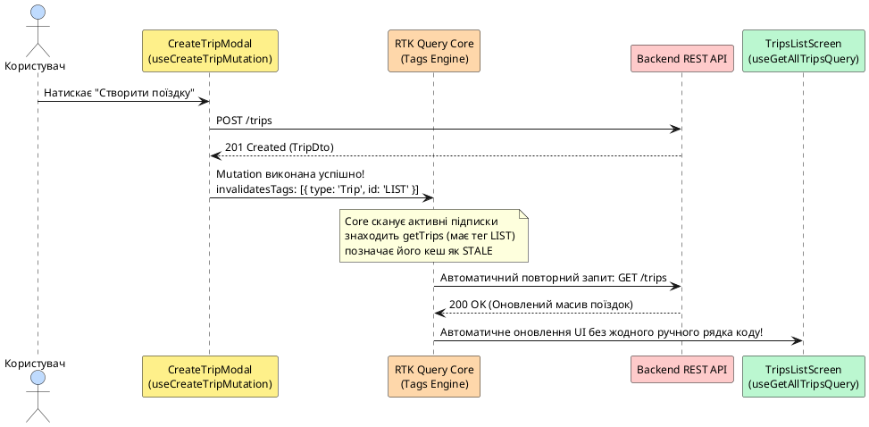

# RTK Query на мобільних платформах

## Від ручного Redux до автоматизованого серверного стану

У попередній статті ми детально розглянули архітектуру **клієнтського стану** через Redux Toolkit: налаштували централізований Store, створили слайси для налаштувань користувача, написали мемоїзовані селектори Reselect та реалізували асинхронні ланцюжки через `createAsyncThunk`. 

Проте під час масштабування застосунку та роботи з реальними віддаленими серверами розробник неминуче стикається з критичною проблемою: **обробка серверних даних вимагає занадто великої кількості одноманітного інфраструктурного коду**.

Уявіть типовий сценарій у мобільному застосунку Nomad:
1. Екран списку поїздок робить запит `GET /trips` та зберігає масив у Redux store.
2. Користувач переходить на інший екран, відкриває модальне вікно та додає нову поїздку через `POST /trips`.
3. Користувач повертається назад. Що має показати екран? Старий закешований масив? Чи потрібно знову надсилати запит?
4. Якщо користувач згорнув застосунок на 10 хвилин, а його колега у веб-версії змінив маршрут — як мобільний клієнт дізнається, що локальні дані застаріли?
5. Що робити, якщо під час гортання списку зник інтернет, а потім відновився?

Якщо вирішувати всі ці задачі вручну через `createAsyncThunk`, вам доведеться для **кожного** ендпоінта писати поля `loading`, `isFetching`, `error`, `data`, розставляти `extraReducers`, вручну відслідковувати події `AppState` та `NetInfo`, а також писати складні функції для інвалідації кешу.

::note
**Фундаментальний висновок:** Серверний стан (**Server State**) докорінно відрізняється від клієнтського. Він не належить застосунку повністю, може змінюватися іншими користувачами без вашого відома, вимагає асинхронного читання/запису, кешування з обмеженим часом життя (TTL) та дедуплікації запитів. **RTK Query** — це спеціалізований інструмент у складі Redux Toolkit, створений для повної автоматизації життєвого циклу серверного стану.
::

---

## Серверний стан проти клієнтського стану

Перед тим як зануритися в синтаксис RTK Query, важливо чітко розмежувати ці два типи даних:

::field-group

::field{name="Клієнтський стан (Client State)" type="Локальний контроль"}
Дані, які створюються, живуть та управляються виключно всередині мобільного пристрою. Вони завжди синхронно доступні в пам'яті. Приклади: обрана тема інтерфейсу (`light` / `dark`), поточна відкрита вкладка, стан розгорнутого акордеона, текст, набраний у полі форми до натискання кнопки «Зберегти». Для цього ідеально підходять звичайні слайси `createSlice` або локальний `useState`.
::

::field{name="Серверний стан (Server State)" type="Віддалене джерело істини"}
Дані, першоджерело яких знаходиться на віддаленому сервері або в базі даних. Вони асинхронні, можуть бути застарілими (_Stale_), вимагають обробки мережевих затримок, відкату помилок, дедуплікації паралельних викликів та інвалідації кешу при мутаціях. Приклади: список поїздок, профіль користувача, баланс рахунку, коментарі.
::

::

### Порівняння інструментів керування серверним станом

У сучасній екосистемі React Native виділяються кілька ключових бібліотек:

| Критерій | **RTK Query** | **TanStack Query (React Query)** | **SWR** | **Apollo Client** |
| :--- | :--- | :--- | :--- | :--- |
| **Екосистема** | Частина `@reduxjs/toolkit` | Агностична до стейт-менеджера | Створена командою Vercel | Спеціалізована для GraphQL |
| **Інтеграція з Redux** | 100% нативна (єдиний DevTools) | Вимагає окремого підключення | Окреме дерево | Окреме дерево |
| **Інвалідація кешу** | Декларативна система **Tags** | Імперативна / ключова (`queryClient.invalidateQueries`) | За строковими ключами | Нормалізований кеш за `__typename:id` |
| **Генерація хуків** | Автоматична з ендпоінтів (`useGetTripsQuery`) | Ручне створення через `useQuery` | Ручне створення через `useSWR` | `useQuery` з GraphQL AST |
| **Оптимістичні оновлення** | `onQueryStarted` + `updateQueryData` | `onMutate` + rollback контекст | `mutate(key, data, false)` | `optimisticResponse` |
| **Коли обирати** | Якщо застосунок уже використовує Redux для клієнтського стану | Якщо Redux відсутній або використовується Zustand/Jotai | Легкі веб-додатки без складних мутацій | Тільки якщо ваш бекенд побудований на GraphQL |

---

## Архітектура та конфігурація: `createApi` під мікроскопом

Серцем RTK Query є функція **`createApi`**. Ви викликаєте її один раз для опису кореневого сервісу вашого бекенду. Вона автоматично генерує редюсер, middleware для керування життєвим циклом підписок та типізовані React-хуки для кожного ендпоінта.

::plant-uml

```plantuml
@startuml
skinparam style plain
skinparam backgroundColor #ffffff
skinparam defaultFontName "Helvetica"
skinparam defaultFontSize 12

package "createApi Configuration" {
    [baseQuery: fetchBaseQuery] as BaseQuery #fed7aa
    [tagTypes: ['Trip', 'User']] as Tags #fef08a
    [endpoints: builder => ({...})] as Endpoints #bfdbfe
}

package "Автоматично згенеровані артефакти" {
    [api.reducer] as Reducer #bbf7d0
    [api.middleware] as Middleware #bbf7d0
    [useGetTripsQuery] as Hook1 #bbf7d0
    [useCreateTripMutation] as Hook2 #bbf7d0
}

BaseQuery --> Endpoints
Tags --> Endpoints
Endpoints --> Reducer : Інтеграція в Redux Store
Endpoints --> Middleware : Керування кешем, TTL, Garbage Collection
Endpoints --> Hook1 : Авто-запит при монтуванні
Endpoints --> Hook2 : Тригер мутацій
@enduml
```

::

### Анатомія конфігурації `createApi`

Розглянемо повноцінне налаштування API клієнта з авторизаційними заголовками та базовою адресою:

```typescript
// src/services/baseApi.ts
import { createApi, fetchBaseQuery } from '@reduxjs/toolkit/query/react'
import { Platform } from 'react-native'
import Constants from 'expo-constants'

/**
 * Визначає кореневий URL для різних середовищ розробки:
 * - Android Emulator використовує 10.0.2.2 для доступу до localhost хост-машини
 * - Реальні пристрої використовують локальну IP адресу з конфігурації Expo
 */
const getBaseUrl = (): string => {
    if (Platform.OS === 'android') {
        return 'http://10.0.2.2:3000'
    }
    const hostUri = Constants.expoConfig?.hostUri
    if (hostUri) {
        const ip = hostUri.split(':').shift()
        if (ip) return `http://${ip}:3000`
    }
    return 'http://localhost:3000'
}

export const baseApi = createApi({
    // 1. Унікальне ім'я слайса в кореневому стані Redux Store
    reducerPath: 'baseApi',

    // 2. Базовий запит з автоматичною серіалізацією JSON та таймаутом
    baseQuery: fetchBaseQuery({
        baseUrl: getBaseUrl(),
        timeout: 10000,
        // Додавання авторизаційних токенів перед кожним HTTP-запитом
        prepareHeaders: (headers, { getState }) => {
            const token = (getState() as any).auth?.token
            if (token) {
                headers.set('Authorization', `Bearer ${token}`)
            }
            headers.set('Accept', 'application/json')
            return headers
        },
    }),

    // 3. Реєстрація типів сутностей для системи інвалідації кешу
    tagTypes: ['Trip', 'User', 'Note', 'Settings'],

    // 4. Глобальні налаштування життєвого циклу
    refetchOnFocus: true, // Автооновлення при поверненні застосунку з фону
    refetchOnReconnect: true, // Автооновлення при відновленні з'єднання з мережею
    keepUnusedDataFor: 120, // Час життя неактивного кешу в пам'яті (секунди)

    // 5. Опис ендпоінтів (розділяється за фічами через injectEndpoints)
    endpoints: () => ({}),
})
```

---

## Просунута авторизація: JWT Refresh Token Queue з Mutex

У мобільних застосунках користувач рідко вводить логін та пароль повторно. Коли термін дії `Access Token` закінчується (помилка `401 Unauthorized`), клієнт повинен безшовно відправити `Refresh Token`, отримати нову пару ключів і повторити запит.

Якщо кілька компонентів одночасно отримали 401, не можна відправляти 5 паралельних запитів на рефреш — це призведе до інвалідації токенів на сервері. Для цього використовується **Mutex (блокування)**:

```typescript
// src/services/baseQueryWithReauth.ts
import { fetchBaseQuery, type BaseQueryFn, type FetchArgs, type FetchBaseQueryError } from '@reduxjs/toolkit/query'
import { Mutex } from 'async-mutex'

// Створюємо єдиний м'ютекс для запобігання паралельним запитам на оновлення токена
const mutex = new Mutex()

const rawBaseQuery = fetchBaseQuery({
    baseUrl: 'https://api.nomad.dev',
    prepareHeaders: (headers, { getState }) => {
        const token = (getState() as any).auth?.accessToken
        if (token) headers.set('Authorization', `Bearer ${token}`)
        return headers
    },
})

export const baseQueryWithReauth: BaseQueryFn<string | FetchArgs, unknown, FetchBaseQueryError> = async (
    args,
    api,
    extraOptions,
) => {
    // Очікуємо звільнення м'ютекса, якщо рефреш уже триває іншим потоком
    await mutex.waitForUnlock()
    let result = await rawBaseQuery(args, api, extraOptions)

    if (result.error && result.error.status === 401) {
        // Перевіряємо чи м'ютекс вільний
        if (!mutex.isLocked()) {
            const release = await mutex.acquire()
            try {
                const refreshToken = (api.getState() as any).auth?.refreshToken

                // Відправляємо запит на оновлення пари токенів
                const refreshResult = await rawBaseQuery(
                    {
                        url: '/auth/refresh',
                        method: 'POST',
                        body: { refreshToken },
                    },
                    api,
                    extraOptions,
                )

                if (refreshResult.data) {
                    // Зберігаємо новий токен у Redux store
                    api.dispatch({ type: 'auth/tokenReceived', payload: refreshResult.data })
                    // Повторюємо початковий запит із новим токеном
                    result = await rawBaseQuery(args, api, extraOptions)
                } else {
                    // Токен оновити не вдалося -> скидаємо сесію та перенаправляємо на Login
                    api.dispatch({ type: 'auth/logout' })
                }
            } finally {
                // Звільняємо м'ютекс для наступних запитів
                release()
            }
        } else {
            // Якщо інший запит уже запустив рефреш -> чекаємо розблокування і повторюємо
            await mutex.waitForUnlock()
            result = await rawBaseQuery(args, api, extraOptions)
        }
    }

    return result
}
```

---

## Читання даних: Query Endpoints

**Query Endpoint** описує операцію отримання даних (зазвичай HTTP `GET`). Коли компонент викликає згенерований хук запиту, RTK Query автоматично перевіряє, чи є свіжі дані в кеші. Якщо даних немає або вони застаріли, запускається мережевий запит.

### Декларація запитів та трансформація відповідей

```typescript
// src/services/tripsApi.ts
import { baseApi } from './baseApi'

export interface Trip {
    id: string
    title: string
    region: string
    startDate: string
    endDate: string | null
    isFavorite?: boolean
}

export interface GetTripsFilterArgs {
    region?: string
    search?: string
    limit?: number
}

// Декларація з поділом за фічами через injectEndpoints
export const tripsApi = baseApi.injectEndpoints({
    endpoints: (builder) => ({
        // 1. Запит без аргументів з трансформацією відповіді
        getAllTrips: builder.query<Trip[], void>({
            query: () => '/trips',
            // transformResponse дозволяє розпакувати вкладені структури або нормалізувати дані
            transformResponse: (response: { data: Trip[]; status: string }) => {
                return response.data ?? response
            },
            providesTags: (result) =>
                result
                    ? [...result.map(({ id }) => ({ type: 'Trip' as const, id })), { type: 'Trip', id: 'LIST' }]
                    : [{ type: 'Trip', id: 'LIST' }],
        }),

        // 2. Запит за ідентифікатором (параметр типу string)
        getTripById: builder.query<Trip, string>({
            query: (tripId) => `/trips/${tripId}`,
            providesTags: (_result, _error, tripId) => [{ type: 'Trip', id: tripId }],
        }),

        // 3. Запит зі складними фільтрами (об'єктний аргумент)
        getFilteredTrips: builder.query<Trip[], GetTripsFilterArgs>({
            query: (filters) => {
                const params = new URLSearchParams()
                if (filters.region && filters.region !== 'all') params.set('region', filters.region)
                if (filters.search) params.set('q', filters.search)
                if (filters.limit) params.set('_limit', String(filters.limit))
                return `/trips?${params.toString()}`
            },
            providesTags: ['Trip'],
        }),
    }),
})

export const {
    useGetAllTripsQuery,
    useGetTripByIdQuery,
    useGetFilteredTripsQuery,
    useLazyGetTripByIdQuery,
} = tripsApi
```

### Повний анатомічний розбір результату Query-хука

Кожен Query-хук повертає багатий об'єкт стану:

```typescript
const {
    data, // Розпарсені серіалізовані дані з кешу або сервера (undefined до завершення)
    isLoading, // true ТІЛЬКИ під час ПЕРШОГО завантаження (коли кешу ще немає)
    isFetching, // true під час БУДЬ-ЯКОГО запиту (включаючи фоновий refetch при наявності старого кешу)
    isSuccess, // true, якщо запит завершився успішно і в data є результат
    isError, // true у випадку мережевого або серверного збою (4xx, 5xx, timeout)
    error, // Об'єкт помилки (FetchBaseQueryError або SerializedError)
    refetch, // Імперативна функція для примусового перезавантаження (наприклад, для Pull-to-Refresh)
} = useGetAllTripsQuery()
```

::tabs

::tabs-item{label="UX: Правильне розділення isLoading vs isFetching"}

```tsx
import React from 'react'
import { View, Text, ActivityIndicator, FlatList, RefreshControl, StyleSheet } from 'react-native'
import { useGetAllTripsQuery } from '@/services/tripsApi'

export function TripsListScreen() {
    const { data: trips, isLoading, isFetching, isError, refetch } = useGetAllTripsQuery()

    // 1. ПЕРШЕ ЗАВАНТАЖЕННЯ: Користувач не має даних -> показуємо повноекранний Loader / Skeleton
    if (isLoading) {
        return (
            <View style={styles.center}>
                <ActivityIndicator size="large" color="#2563eb" />
                <Text style={styles.loadingText}>Завантаження поїздок...</Text>
            </View>
        )
    }

    // 2. ПОМИЛКА: Не вдалося завантажити дані
    if (isError) {
        return (
            <View style={styles.center}>
                <Text style={styles.errorText}>Сталася помилка при завантаженні</Text>
                <Text style={styles.retryButton} onPress={() => refetch()}>
                    Спробувати знову
                </Text>
            </View>
        )
    }

    // 3. ГОТОВИЙ СПИСОК: Дані є на екрані
    return (
        <View style={styles.container}>
            {/* Тонкий індикатор фонового оновлення, якщо дані оновлюються в бекграунді */}
            {isFetching && !isLoading && (
                <View style={styles.fetchingBadge}>
                    <Text style={styles.fetchingText}>Оновлення даних...</Text>
                </View>
            )}

            <FlatList
                data={trips}
                keyExtractor={(item) => item.id}
                renderItem={({ item }) => (
                    <View style={styles.card}>
                        <Text style={styles.cardTitle}>{item.title}</Text>
                        <Text style={styles.cardRegion}>{item.region}</Text>
                    </View>
                )}
                // Інтеграція Pull-to-Refresh безпосередньо з refetch()
                refreshControl={<RefreshControl refreshing={isFetching} onRefresh={refetch} tintColor="#2563eb" />}
            />
        </View>
    )
}

const styles = StyleSheet.create({
    container: { flex: 1, backgroundColor: '#f8fafc' },
    center: { flex: 1, justifyContent: 'center', alignItems: 'center', padding: 20 },
    loadingText: { marginTop: 12, fontSize: 14, color: '#64748b' },
    errorText: { fontSize: 16, color: '#dc2626', marginBottom: 12 },
    retryButton: { fontSize: 14, color: '#2563eb', fontWeight: 'bold' },
    fetchingBadge: { backgroundColor: '#dbeafe', paddingVertical: 4, alignItems: 'center' },
    fetchingText: { fontSize: 11, color: '#1d4ed8', fontWeight: '600' },
    card: { backgroundColor: '#ffffff', padding: 16, marginHorizontal: 16, marginTop: 12, borderRadius: 12 },
    cardTitle: { fontSize: 16, fontWeight: '700', color: '#0f172a' },
    cardRegion: { fontSize: 13, color: '#64748b', marginTop: 4 },
})
```

::

::tabs-item{label="Оптимізація: selectFromResult"}

```tsx
import React from 'react'
import { Text, View } from 'react-native'
import { useGetAllTripsQuery } from '@/services/tripsApi'

/**
 * selectFromResult запобігає зайвим перерендерам:
 * Компонент підписується ЛИШЕ на конкретний елемент у списку за ID,
 * не ререндерячись при зміні інших елементів масиву!
 */
export function TripSummaryCard({ tripId }: { tripId: string }) {
    const { tripTitle, isLoaded } = useGetAllTripsQuery(undefined, {
        selectFromResult: ({ data, isSuccess }) => ({
            tripTitle: data?.find((t) => t.id === tripId)?.title ?? 'Не знайдено',
            isLoaded: isSuccess,
        }),
    })

    if (!isLoaded) return null

    return (
        <View>
            <Text style={{ fontWeight: 'bold' }}>{tripTitle}</Text>
        </View>
    )
}
```

::

::

---

## Мутації даних: Mutation Endpoints

**Mutation Endpoint** використовується для надсилання змін на сервер (HTTP `POST`, `PUT`, `PATCH`, `DELETE`). На відміну від Query, мутації **ніколи не виконуються автоматично** при монтуванні компонента. Хук мутації повертає функцію-тригер для запуску дії користувача.

```typescript
// src/services/tripsMutationsApi.ts
import { baseApi } from './baseApi'
import type { Trip } from './tripsApi'

export interface CreateTripDto {
    title: string
    region: string
    startDate: string
    endDate?: string | null
}

export const tripsMutationsApi = baseApi.injectEndpoints({
    endpoints: (builder) => ({
        // 1. POST: Створення нової сутності
        createTrip: builder.mutation<Trip, CreateTripDto>({
            query: (newTrip) => ({
                url: '/trips',
                method: 'POST',
                body: newTrip,
            }),
            invalidatesTags: [{ type: 'Trip', id: 'LIST' }],
        }),

        // 2. PATCH: Оновлення існуючої поїздки
        updateTrip: builder.mutation<Trip, { id: string; title: string }>({
            query: ({ id, ...changes }) => ({
                url: `/trips/${id}`,
                method: 'PATCH',
                body: changes,
            }),
            invalidatesTags: (_result, _error, { id }) => [{ type: 'Trip', id }],
        }),

        // 3. DELETE: Видалення поїздки
        deleteTrip: builder.mutation<{ success: boolean; id: string }, string>({
            query: (tripId) => ({
                url: `/trips/${tripId}`,
                method: 'DELETE',
            }),
            invalidatesTags: (_result, _error, tripId) => [
                { type: 'Trip', id: tripId },
                { type: 'Trip', id: 'LIST' },
            ],
        }),
    }),
})

export const { useCreateTripMutation, useUpdateTripMutation, useDeleteTripMutation } = tripsMutationsApi
```

---

## Система тегів: Гранулярна декларативна інвалідація

Головна перевага RTK Query над ручним написанням thunk-ів — **система тегів (Tags Caching & Invalidation)**. 

Замість того, щоб у кожному компоненті форми вручну імпортувати та викликати `refetch()` усіх пов'язаних списків, ви будуєте декларативні зв'язки:
- **`providesTags`** у Query: «Цей запит постачає в кеш дані з такими-то мітками».
- **`invalidatesTags`** у Mutation: «Ця операція робить застарілими дані з такими-то мітками».

::plant-uml



::

---

## Оптимістичні оновлення (Optimistic Updates) у RTK Query

Користувач не повинен чекати відповіді сервера при натисканні простих дій (лайк, чекбокс, додавання в закладки). Інтерфейс повинен оновлюватися **миттєво (0 мс затримки)**, а у випадку мережевого збою — непомітно повертатися до вихідного стану (_Rollback_).

У RTK Query це реалізується за допомогою функції **`onQueryStarted`** та утиліти **`updateQueryData`**:

```typescript
// src/services/tripsOptimisticApi.ts
import { baseApi } from './baseApi'
import type { Trip } from './tripsApi'

export const tripsOptimisticApi = baseApi.injectEndpoints({
    endpoints: (builder) => ({
        toggleTripFavorite: builder.mutation<{ success: boolean; isFavorite: boolean }, { tripId: string }>({
            query: ({ tripId }) => ({
                url: `/trips/${tripId}/favorite`,
                method: 'POST',
            }),

            // Lifecycle-хук, що викликається ОДРАЗУ при запуску мутації
            async onQueryStarted({ tripId }, { dispatch, queryFulfilled }) {
                // 1. ОПТИМІСТИЧНЕ ОНОВЛЕННЯ: прямо модифікуємо draft-кеш списку поїздок
                const patchResult = dispatch(
                    baseApi.util.updateQueryData('getAllTrips' as any, undefined, (draft: Trip[]) => {
                        const trip = draft.find((t) => t.id === tripId)
                        if (trip) {
                            // Миттєво перемикаємо прапорець у локальному кеші
                            trip.isFavorite = !trip.isFavorite
                        }
                    }),
                )

                try {
                    // 2. Очікуємо на реальну відповідь бекенду
                    await queryFulfilled
                } catch {
                    // 3. ВІДКАТ (ROLLBACK): Якщо сервер повернув 500 або зникла мережа
                    patchResult.undo()
                }
            },
        }),
    }),
})

export const { useToggleTripFavoriteMutation } = tripsOptimisticApi
```

---

## Realtime-оновлення: WebSockets через `onCacheEntryAdded`

Якщо дані на сервері змінюються в реальному часі (наприклад, водій на карті або статус рейсу), RTK Query підтримує підключення WebSockets безпосередньо всередині ендпоінта за допомогою `onCacheEntryAdded`:

```typescript
// src/services/tripsRealtimeApi.ts
import { baseApi } from './baseApi'
import type { Trip } from './tripsApi'

export const tripsRealtimeApi = baseApi.injectEndpoints({
    endpoints: (builder) => ({
        getLiveTripStatus: builder.query<Trip, string>({
            query: (tripId) => `/trips/${tripId}`,
            async onCacheEntryAdded(tripId, { updateCachedData, cacheDataLoaded, cacheEntryRemoved }) {
                // Створюємо WebSocket з'єднання
                const ws = new WebSocket(`wss://api.nomad.dev/trips/${tripId}/live`)

                try {
                    // Чекаємо поки початковий HTTP-запит успішно виконається
                    await cacheDataLoaded

                    // Слухаємо оновлення з сервера
                    ws.onmessage = (event) => {
                        const updatedData = JSON.parse(event.data)
                        // Прямо оновлюємо поточний запис у кеші
                        updateCachedData((draft) => {
                            Object.assign(draft, updatedData)
                        })
                    }
                } catch {
                    // Обробка помилки початкового завантаження
                }

                // Коли екран закривається і підписка розривається -> закриваємо сокет
                await cacheEntryRemoved
                ws.close()
            },
        }),
    }),
})
```

---

## Пагінація та Infinite Scroll у списках

Для великих мобільних стрічок завантаження всіх даних одразу призведе до вичерпання оперативної пам'яті. RTK Query дозволяє легко реалізувати нескінченний скрол (_Infinite Scroll_) шляхом об'єднання сторінок за допомогою функцій `serializeQueryArgs` та `merge`:

```typescript
// src/services/tripsPaginationApi.ts
import { baseApi } from './baseApi'
import type { Trip } from './tripsApi'

export interface PaginatedResponse {
    items: Trip[]
    nextPage: number | null
    total: number
}

export const tripsPaginationApi = baseApi.injectEndpoints({
    endpoints: (builder) => ({
        getInfiniteTrips: builder.query<PaginatedResponse, number>({
            query: (page = 1) => `/trips?_page=${page}&_limit=10`,

            // 1. Один спільний ключ кешу для всіх сторінок цього ендпоінта
            serializeQueryArgs: ({ endpointName }) => {
                return endpointName
            },

            // 2. Злиття нових сторінок з існуючим кешем списку
            merge: (currentCache, newItems) => {
                if (newItems.nextPage === 2) {
                    currentCache.items = newItems.items
                } else {
                    currentCache.items.push(...newItems.items)
                }
                currentCache.nextPage = newItems.nextPage
                currentCache.total = newItems.total
            },

            // 3. Примусовий перезапит при зміні номера сторінки
            forceRefetch({ currentArg, previousArg }) {
                return currentArg !== previousArg
            },
        }),
    }),
})

export const { useGetInfiniteTripsQuery } = tripsPaginationApi
```

---

## Міні-проєкт: «Нотатки мандрівника» з RTK Query

Побудуємо повнофункціональний міні-застосунок для керування нотатками з використанням віддаленого REST API.

### Структура файлової системи міні-проєкту

::code-tree

```text [src/services/notesApi.ts]
Опис ендпоінтів для читання, додавання та видалення нотаток
```

```text [src/store/index.ts]
Конфігурація Store з підключенням notesApi
```

```text [src/screens/NotesScreen.tsx]
Головний екран зі списком, Pull-to-Refresh та обробкою помилок
```

```text [App.tsx]
Точка входу з Redux Provider
```

::

### Кроки реалізації

::steps

### Крок 1. Створення сервісу `notesApi.ts`

```typescript
// src/services/notesApi.ts
import { createApi, fetchBaseQuery } from '@reduxjs/toolkit/query/react'

export interface Note {
    id: number
    title: string
    body: string
    userId: number
}

export const notesApi = createApi({
    reducerPath: 'notesApi',
    baseQuery: fetchBaseQuery({ baseUrl: 'https://jsonplaceholder.typicode.com' }),
    tagTypes: ['Note'],
    endpoints: (builder) => ({
        getNotes: builder.query<Note[], void>({
            query: () => '/posts?_limit=15',
            providesTags: (result) =>
                result
                    ? [...result.map(({ id }) => ({ type: 'Note' as const, id })), { type: 'Note', id: 'LIST' }]
                    : [{ type: 'Note', id: 'LIST' }],
        }),

        createNote: builder.mutation<Note, { title: string; body: string }>({
            query: (payload) => ({
                url: '/posts',
                method: 'POST',
                body: { ...payload, userId: 1 },
            }),
            invalidatesTags: [{ type: 'Note', id: 'LIST' }],
        }),

        deleteNote: builder.mutation<{ success: boolean }, number>({
            query: (noteId) => ({
                url: `/posts/${noteId}`,
                method: 'DELETE',
            }),
            invalidatesTags: (_result, _error, id) => [
                { type: 'Note', id },
                { type: 'Note', id: 'LIST' },
            ],
        }),
    }),
})

export const { useGetNotesQuery, useCreateNoteMutation, useDeleteNoteMutation } = notesApi
```

### Крок 2. Налаштування Store

```typescript
// src/store/index.ts
import { configureStore } from '@reduxjs/toolkit'
import { setupListeners } from '@reduxjs/toolkit/query'
import { notesApi } from '@/services/notesApi'

export const store = configureStore({
    reducer: {
        [notesApi.reducerPath]: notesApi.reducer,
    },
    middleware: (getDefaultMiddleware) => getDefaultMiddleware().concat(notesApi.middleware),
})

setupListeners(store.dispatch)
```

### Крок 3. Екран керування нотатками `NotesScreen.tsx`

```tsx
// src/screens/NotesScreen.tsx
import React, { useState } from 'react'
import { View, Text, TextInput, Button, FlatList, ActivityIndicator, RefreshControl, StyleSheet } from 'react-native'
import { useGetNotesQuery, useCreateNoteMutation, useDeleteNoteMutation } from '../services/notesApi'

export function NotesScreen() {
    const [title, setTitle] = useState('')
    const { data: notes, isLoading, isFetching, refetch } = useGetNotesQuery()
    const [createNote, { isLoading: isCreating }] = useCreateNoteMutation()
    const [deleteNote] = useDeleteNoteMutation()

    const handleAdd = async () => {
        if (!title.trim()) return
        await createNote({ title, body: 'Текст нової нотатки' }).unwrap()
        setTitle('')
    }

    if (isLoading) {
        return (
            <View style={styles.center}>
                <ActivityIndicator size="large" color="#2563eb" />
            </View>
        )
    }

    return (
        <View style={styles.container}>
            <Text style={styles.header}>Нотатки подорожей</Text>

            <View style={styles.formRow}>
                <TextInput
                    style={styles.input}
                    placeholder="Нова нотатка..."
                    value={title}
                    onChangeText={setTitle}
                />
                <Button title={isCreating ? '...' : 'Додати'} onPress={handleAdd} disabled={isCreating} />
            </View>

            <FlatList
                data={notes}
                keyExtractor={(item) => String(item.id)}
                refreshControl={<RefreshControl refreshing={isFetching} onRefresh={refetch} />}
                renderItem={({ item }) => (
                    <View style={styles.noteItem}>
                        <View style={{ flex: 1 }}>
                            <Text style={styles.noteTitle}>{item.title}</Text>
                        </View>
                        <Button title="🗑️" color="#dc2626" onPress={() => deleteNote(item.id)} />
                    </View>
                )}
            />
        </View>
    )
}

const styles = StyleSheet.create({
    container: { flex: 1, padding: 16, backgroundColor: '#f1f5f9' },
    center: { flex: 1, justifyContent: 'center', alignItems: 'center' },
    header: { fontSize: 22, fontWeight: '800', marginBottom: 16, color: '#0f172a' },
    formRow: { flexDirection: 'row', gap: 8, marginBottom: 16 },
    input: { flex: 1, backgroundColor: '#ffffff', padding: 12, borderRadius: 8, borderWidth: 1, borderColor: '#cbd5e1' },
    noteItem: {
        flexDirection: 'row',
        alignItems: 'center',
        backgroundColor: '#ffffff',
        padding: 14,
        borderRadius: 10,
        marginBottom: 8,
    },
    noteTitle: { fontSize: 14, fontWeight: '600', color: '#1e293b' },
})
```

::

---

## Наскрізний проєкт: Nomad — міграція на RTK Query

Тепер замінимо застарілий ручний `tripsSlice` та `fetchTripsThunk` у додатку Nomad на сучасний декларативний сервіс `tripsApi`.

### 1. Повний сервіс `src/services/tripsApi.ts`

```typescript
// src/services/tripsApi.ts
import { createApi, fetchBaseQuery } from '@reduxjs/toolkit/query/react'
import { Platform } from 'react-native'
import Constants from 'expo-constants'

export interface Trip {
    id: string
    title: string
    region: string
    startDate: string
    endDate: string | null
    description: string | null
    isFavorite?: boolean
}

export interface CreateTripPayload {
    title: string
    region: string
    startDate: string
    endDate?: string | null
    description?: string | null
}

const getBaseUrl = (): string => {
    if (Platform.OS === 'android') return 'http://10.0.2.2:3000'
    const hostUri = Constants.expoConfig?.hostUri
    if (hostUri) {
        const ip = hostUri.split(':').shift()
        if (ip) return `http://${ip}:3000`
    }
    return 'http://localhost:3000'
}

export const tripsApi = createApi({
    reducerPath: 'tripsApi',
    baseQuery: fetchBaseQuery({ baseUrl: getBaseUrl(), timeout: 8000 }),
    tagTypes: ['Trip'],
    refetchOnFocus: true,
    refetchOnReconnect: true,
    endpoints: (builder) => ({
        getTrips: builder.query<Trip[], void>({
            query: () => '/trips',
            providesTags: (result) =>
                result
                    ? [...result.map(({ id }) => ({ type: 'Trip' as const, id })), { type: 'Trip', id: 'LIST' }]
                    : [{ type: 'Trip', id: 'LIST' }],
        }),

        getTripById: builder.query<Trip, string>({
            query: (id) => `/trips/${id}`,
            providesTags: (_result, _error, id) => [{ type: 'Trip', id }],
        }),

        createTrip: builder.mutation<Trip, CreateTripPayload>({
            query: (payload) => ({
                url: '/trips',
                method: 'POST',
                body: payload,
            }),
            invalidatesTags: [{ type: 'Trip', id: 'LIST' }],
        }),
    }),
})

export const { useGetTripsQuery, useGetTripByIdQuery, useCreateTripMutation } = tripsApi
```

### 2. Оновлення кореневого Store

```typescript
// src/store/index.ts
import { configureStore } from '@reduxjs/toolkit'
import { setupListeners } from '@reduxjs/toolkit/query'
import { tripsApi } from '@/services/tripsApi'

export const store = configureStore({
    reducer: {
        [tripsApi.reducerPath]: tripsApi.reducer,
    },
    middleware: (getDefaultMiddleware) => getDefaultMiddleware().concat(tripsApi.middleware),
})

setupListeners(store.dispatch)

export type RootState = ReturnType<typeof store.getState>
export type AppDispatch = typeof store.dispatch
```

### 3. Оновлення головного екрана `app/(tabs)/trips/index.tsx`

```tsx
// app/(tabs)/trips/index.tsx
import React from 'react'
import { View, FlatList, ActivityIndicator, RefreshControl, StyleSheet, Text } from 'react-native'
import { useRouter } from 'expo-router'
import { useGetTripsQuery } from '@/services/tripsApi'
import { TripCard } from '@/features/trips'
import { Screen, Button } from '@/shared/ui'

export default function TripsScreen() {
    const router = useRouter()
    const { data: trips, isLoading, isFetching, isError, refetch } = useGetTripsQuery()

    if (isLoading) {
        return (
            <Screen style={styles.center}>
                <ActivityIndicator size="large" color="#2563eb" />
            </Screen>
        )
    }

    return (
        <Screen style={styles.container}>
            <View style={styles.header}>
                <Text style={styles.title}>Мої Подорожі</Text>
                <Button title="+ Створити" onPress={() => router.push('/create-trip')} />
            </View>

            <FlatList
                data={trips}
                keyExtractor={(item) => item.id}
                renderItem={({ item }) => <TripCard trip={item} onPress={() => router.push(`/trips/${item.id}`)} />}
                refreshControl={<RefreshControl refreshing={isFetching} onRefresh={refetch} tintColor="#2563eb" />}
                ListEmptyComponent={
                    <View style={styles.empty}>
                        <Text style={styles.emptyText}>Список порожній. Створіть першу поїздку!</Text>
                    </View>
                }
            />
        </Screen>
    )
}

const styles = StyleSheet.create({
    container: { flex: 1, padding: 16 },
    center: { flex: 1, justifyContent: 'center', alignItems: 'center' },
    header: { flexDirection: 'row', justifyContent: 'space-between', alignItems: 'center', marginBottom: 16 },
    title: { fontSize: 26, fontWeight: '800', color: '#0f172a' },
    empty: { alignItems: 'center', marginTop: 40 },
    emptyText: { color: '#64748b', fontSize: 15 },
})
```

---

## Резюме розділу

::card-group

::card{title="🚀 Декларативний API" icon="i-lucide-globe"}
`createApi` повністю замінює ручні слайси, редюсери та `createAsyncThunk` для роботи з мережею, автоматично генеруючи типізовані хуки.
::

::card{title="🏷️ Гранулярні Теги" icon="i-lucide-tags"}
Комбінація тегів `{ type: 'Trip', id: 'LIST' }` та `{ type: 'Trip', id }` забезпечує точкову інвалідацію лише змінених сутностей без зайвих мережевих запитів.
::

::card{title="📱 Мобільна оптимізація" icon="i-lucide-smartphone"}
`refetchOnFocus`, `refetchOnReconnect` та `keepUnusedDataFor` забезпечують актуальність даних при поверненні з фону та раціональне використання оперативної пам'яті.
::

::card{title="⚡ Optimistic UI" icon="i-lucide-zap"}
Механізм `onQueryStarted` дозволяє змінювати локальний інтерфейс за 0 мс із надійним автоматичним відкатом (`rollback`) при помилці бекенду.
::

::

---

## Практичні завдання

| Рівень складності | Назва завдання | Формулювання вимог |
| :--- | :--- | :--- |
| **Базовий (Basic)** | Додавання статусу поїздки | Додати mutation `toggleTripStatus(id)` (перемикання між `planned` та `completed`). Налаштувати теги так, щоб список автоматично відображав новий статус. |
| **Середній (Intermediate)** | Пошук із затримкою (Debounce) | Створити поле пошуку в заголовку списку. Використати хук `useGetFilteredTripsQuery({ search })` разом із кастомним хуком дебаунсу (300 мс), щоб не спамити бекенд при кожному натисканні клавіші. |
| **Просунутий (Advanced)** | Оптимістичне видалення з Rollback | Реалізувати `deleteTrip` через `onQueryStarted` з миттєвим видаленням картки зі списку та демонстрацією Snackbar-повідомлення з кнопкою «Скасувати». |

---

## Поширені запитання (FAQ)

::accordion

::accordion-item{title="Чому не можна зберігати всі серверні дані в звичайному createSlice?" icon="i-lucide-alert-circle"}
Звичайний `createSlice` не знає про життєвий цикл мережевих підписок, не вміє автоматично дедуплікувати паралельні виклики з різних компонентів, не має вбудованого таймера очищення пам'яті (Garbage Collection) та вимагає написання сотень рядків коду для синхронізації після кожної мутації.
::

::accordion-item{title="Чим відрізняється isLoading від isFetching?" icon="i-lucide-help-circle"}
`isLoading: true` лише під час **найпершого запиту**, коли в кеші взагалі немає даних (ідеально для показу великого Skeleton). `isFetching: true` під час **будь-якого мережевого запиту**, навіть якщо старі дані вже відмальовані на екрані (ідеально для маленького спінера оновлення).
::

::accordion-item{title="Як обробити 401 Unauthorized та оновити Refresh Token у RTK Query?" icon="i-lucide-shield-alert"}
Для цього створюється кастомна функція-обгортка `baseQueryWithReauth` над `fetchBaseQuery` з використанням `async-mutex`. Якщо запит повертає статус 401, функція блокує паралельні запити, оновлює токен, записує його в store і повторює початковий виклик.
::

::
