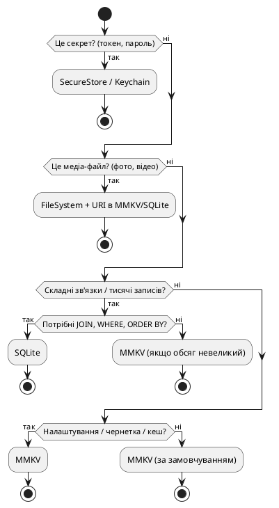

# Локальне сховище — AsyncStorage, MMKV, SQLite

## Відкриття: коли застосунок має пам'ятати

Уявіть: ви відкриваєте застосунок для нотаток у метро, пишете кілька абзаців про важливу думку, натискаєте «Зберегти» і виходите з програми. Наступного дня відкриваєте знову — і текст на місці. Здається природним, правда? Але якщо подумати глибше: ваш телефон міг перезавантажитися вночі через оновлення системи, застосунок міг бути вивантажений операційною системою для економії пам'яті, інтернет-з'єднання могло бути відсутнім під час збереження. І все одно — дані лишилися.

У веброзробці ви, можливо, звикли до того, що стан застосунку живе «у повітрі»: Redux store існує, поки відкрита вкладка браузера; закрили сторінку — стан зник. Якщо потрібна персистентність, ви використовуєте `localStorage` (для невеликих рядків) або IndexedDB (для складніших структур), і це зазвичай «просто працює» без глибоких роздумів про продуктивність чи розмір даних.

У мобільному світі ситуація інша. Операційна система iOS або Android може **будь-коли** завершити процес вашого застосунку у фоні — не тому, що сталася помилка, а просто щоб вивільнити ресурси для активного додатку (наприклад, для камери або гри, яку користувач щойно відкрив). Коли людина повертається до вашого застосунку через годину, система **запускає його заново** — як би з «чистого аркуша». Якщо ви не зберегли стан на диск, користувач побачить порожній екран або втратить незбережені зміни. Це не баг — це архітектурна реальність мобільних платформ.

Тому **локальне сховище** (local storage у широкому сенсі — не плутати з браузерним API `localStorage`) стає не опцією, а обов'язковою частиною будь-якого мобільного застосунку, який працює з даними користувача. Навіть якщо ваш бекенд тримає «джерело істини» на сервері, мобільний клієнт має **кешувати** ці дані локально — щоб показати список поїздок миттєво при відкритті, не чекаючи мережевого запиту; щоб дозволити редагування офлайн; щоб зберегти чернетку форми, яку людина не встигла надіслати.

У цій статті ми детально розглянемо **три основні підходи** до збереження даних на пристрої у React Native-застосунку:

1. **AsyncStorage** — найпростіше key-value сховище, яке React Native пропонує «з коробки» через community-пакет; аналог браузерного `localStorage`, але асинхронний і з обмеженнями продуктивності.
2. **MMKV** — швидка C++-бібліотека від WeChat (wrapped у react-native-mmkv), яка працює на порядки швидше за AsyncStorage для більшості сценаріїв і стала фактичним стандартом для key-value персистентності у сучасних React Native-проєктах.
3. **SQLite** — повноцінна реляційна база даних, вбудована в iOS та Android; потрібна, коли ви працюєте зі складними зв'язками між сутностями, виконуєте SQL-запити для фільтрації/сортування великих обсягів даних, або синхронізуєте structured data з бекендом.

Ми **не будемо** просто перераховувати API цих бібліотек — натомість пройдемо **від життєвої задачі до рішення**: спочатку з'ясуємо, що таке персистентність у мобільному контексті і чим вона відрізняється від вебу; потім розглянемо кожне рішення окремо з поясненням «коли це потрібно і чому саме так»; і нарешті застосуємо на практиці — як у міні-проєкті («Чернетки» з MMKV), так і в наскрізному Nomad (персистентність поїздок).

::note
**Головна думка цієї статті:** у мобільному застосунку персистентність — це не «бонусна фіча», а базова вимога архітектури. Вибір між AsyncStorage, MMKV і SQLite залежить не від «що модніше», а від **структури ваших даних** і **частоти доступу**: для налаштувань і невеликих JSON-об'єктів — MMKV; для реляційних даних і складних запитів — SQLite; AsyncStorage — лише як fallback для дуже старих проєктів або максимально простих сценаріїв.
::

---

## Частина 1. Теорія — персистентність у мобільному світі

### Що таке персистентність і навіщо вона застосунку

**Персистентність** (persistence) означає, що дані **переживають** перезапуск застосунку. У контексті React Native це означає: ви зберігаєте щось на диск пристрою (у файлову систему iOS/Android), і ці дані лишаються доступними навіть після того, як операційна система завершила процес вашого застосунку або користувач перезавантажив телефон.

Подумайте про це так: ваш Redux store (або Zustand store) існує **в оперативній пам'яті** процесу застосунку. Поки застосунок працює — стан живе. Але щойно iOS або Android вирішують, що вашому застосунку пора звільнити місце (наприклад, користувач відкрив десять інших програм і ваша пішла у фон на годину), процес **завершується**. У наступний раз, коли людина відкриє застосунок, React Native створить **новий** процес, **новий** JS-runtime, і ваш Redux store проініціалізується з дефолтного `initialState` — як би застосунок відкрився «вперше».

Якщо ви не зберегли дані на диск, користувач втратить:

- список поїздок, які вона переглядала раніше (якщо не підвантажувати їх заново з API);
- чернетку форми «нова поїздка», яку вона почала заповнювати, але не надіслала;
- налаштування теми (light/dark), які вона обрала в минулий раз;
- токен сесії (якщо не використовувати SecureStore), і доведеться логінитися знову.

Тому **кожен** мобільний застосунок, який працює з даними користувача (а це майже всі застосунки, крім найпростіших калькуляторів чи статичних довідників), має стратегію персистентності. Питання не «чи потрібно зберігати дані локально», а «**що** зберігати, **де** і **як часто** це оновлювати».

::tip
**Аналогія з вебом:** у браузері ви звикли, що вкладка «пам'ятає» стан, поки відкрита. Якщо закрити вкладку — стан зникає, але ви можете зберегти щось у `localStorage` або IndexedDB, щоб наступного разу відновити. У мобільному застосунку **немає гарантії**, що процес лишиться живим навіть на хвилину після того, як користувач перейшов в іншу програму. Тому персистентність — це не опція «для офлайну», а базова практика «щоб застосунок не здавався зламаним».
::

### Web localStorage vs мобільне сховище — ключові відмінності

Якщо ви приходите з веброзробки, перше, що спадає на думку: «У браузері є `localStorage.setItem('key', 'value')` — напевно, у React Native теж щось подібне?» І так, є — але з важливими нюансами.

| Аспект             | Web `localStorage`                                                       | React Native AsyncStorage / MMKV                                                                                                               |
| ------------------ | ------------------------------------------------------------------------ | ---------------------------------------------------------------------------------------------------------------------------------------------- |
| **API**            | Синхронний (`localStorage.setItem` блокує JS-потік до завершення запису) | **Асинхронний** (`await AsyncStorage.setItem` / `storage.set` не блокують)                                                                     |
| **Розмір**         | Зазвичай ~5–10 MB на домен (браузер може відмовити при перевищенні)      | AsyncStorage — до ~6 MB на iOS (обмеження системи); MMKV / SQLite — гігабайти (обмежені лише вільним місцем на пристрої)                       |
| **Продуктивність** | Досить швидкий для дрібних операцій; повільніший для великих JSON        | AsyncStorage — **повільний** для частих читань/записів; MMKV — **дуже швидкий** (C++ memory-mapped файл)                                       |
| **Структура**      | Лише рядки (key → string value)                                          | AsyncStorage / MMKV — теж key-value з рядками (JSON.stringify для об'єктів); SQLite — **реляційні таблиці** з типізованими колонками           |
| **Шифрування**     | Немає (доступне JS-коду сторінки)                                        | AsyncStorage / MMKV — **не зашифровані** за замовчуванням (потрібен Keychain/SecureStore для секретів); SQLite — можна зашифрувати (SQLCipher) |

Розберемо кожен рядок таблиці детальніше:

**1. API — синхронний vs асинхронний**

У браузері `localStorage.setItem('theme', 'dark')` виконується **синхронно**: JavaScript-потік зупиняється, чекає, поки браузер запише дані в файл на диску (або в кеш), і лише потім продовжує виконання наступного рядка коду. Для невеликих значень це непомітно (мілісекунди), але для великих JSON це може «заморозити» UI.

У React Native майже всі операції з локальним сховищем — **асинхронні** (через `Promise` або `async/await`). Чому? Тому що React Native виконує JavaScript у **окремому потоці** (JS thread), а запис на диск відбувається в **нативному потоці** iOS/Android. Щоб не блокувати JS-потік (і не зависнув UI), бібліотеки роблять операції неблокуючими: ви викликаєте `await AsyncStorage.setItem(...)`, JS-потік **не чекає** фізичного запису, а одразу продовжує роботу; коли нативний потік завершить запис, Promise резолвиться.

MMKV — виняток: його API **синхронний** (`storage.set('key', 'value')` без `await`), але це не означає, що він блокує JS-потік так само, як браузерний `localStorage`. MMKV використовує **memory-mapped файл** (mmap) — це системна техніка, коли операційна система дозволяє програмі працювати з файлом на диску **так, ніби це звичайна пам'ять**. Запис у таку «пам'ять» відбувається миттєво (з точки зору JS), а фактичний flush на диск система робить асинхронно у фоні. Тому MMKV швидкий і **не блокує** UI, навіть маючи синхронний API.

::warning
**Типова плутанина:** «Якщо AsyncStorage асинхронний, він швидший?» — Ні. AsyncStorage **повільніший** за MMKV, хоча обидва асинхронні з точки зору JS. Причина в тому, **як** вони зберігають дані: AsyncStorage на iOS використовує файли-словники (plist або JSON), на Android — SQLite з однією таблицею; обидва варіанти мають overhead на серіалізацію й системні виклики. MMKV пише безпосередньо в бінарний файл через mmap — набагато менше overhead.
::

**2. Розмір — скільки можна зберегти**

Браузерний `localStorage` зазвичай обмежений ~5–10 MB на домен (це políтика браузера, не технічне обмеження). Якщо спробувати записати більше, браузер кине помилку `QuotaExceededError`.

AsyncStorage на iOS **теоретично** може зберегти більше, але Apple документує обмеження ~6 MB для «швидкого» доступу (великі дані можуть бути викинуті системою при нестачі місця). На Android AsyncStorage використовує SQLite, тому ліміт вищий, але продуктивність падає при великих обсягах.

MMKV і SQLite обмежені лише вільним місцем на пристрої (гігабайти). Але це не означає, що варто зберігати відео чи великі файли в MMKV — для медіа є файлова система (про це далі в розділі «Файли»).

::tip
**Практичне правило:** якщо ви зберігаєте **налаштування**, **токени**, **невеликі JSON-списки** (до кількох сотень об'єктів) — MMKV впорається без проблем. Якщо ви зберігаєте **тисячі записів з фільтрацією / зв'язками** — використовуйте SQLite. Якщо ви зберігаєте **зображення / документи** — пишіть у файлову систему (Expo FileSystem / react-native-fs), а в MMKV / SQLite тримайте лише шляхи до файлів.
::

**3. Продуктивність — як швидко працює**

Браузерний `localStorage` досить швидкий для **дрібних** операцій (читання/запис рядка 1–10 KB). Але якщо ви зберігаєте великий JSON (наприклад, список 1000 товарів по 500 bytes кожен = 500 KB), `JSON.stringify` + `localStorage.setItem` може зайняти десятки мілісекунд і «заморозити» UI (тому що синхронний).

AsyncStorage **повільніший** навіть для дрібних операцій, ніж браузерний `localStorage`, бо кожен `setItem` робить системний виклик (bridge у старій архітектурі, TurboModule у новій), серіалізує дані в JSON або plist, і пише на диск. Якщо ви робите багато `setItem` підряд (наприклад, зберігаєте 100 ключів у циклі), це буде **дуже повільно** (секунди на старих пристроях).

MMKV — **на порядки швидший**: читання/запис ~1 KB займає **мікросекунди** (не мілісекунди). Це досягається завдяки:

- **Memory-mapped файлу** (mmap) — операційна система мапує файл у віртуальну пам'ять процесу; запис у цю пам'ять відбувається як запис у звичайний масив, без системних викликів для кожної операції.
- **Протоколу ProtoBuf** — MMKV серіалізує дані в бінарний формат (швидше за JSON).
- **Інкрементному записі** — MMKV не перезаписує весь файл при зміні одного ключа, а дописує зміни в кінець (append-only log), періодично робить compaction.

SQLite — швидкий для **складних запитів** (SELECT з JOIN, WHERE, ORDER BY), бо це повноцінна база даних з індексами. Але для простого «зберегти один ключ» SQLite **повільніший за MMKV**, бо потрібно відкрити з'єднання, виконати SQL-запит, закрити транзакцію. Тому SQLite не замінює MMKV для налаштувань — вони доповнюють один одного.

**4. Структура — key-value vs реляційні таблиці**

Браузерний `localStorage`, AsyncStorage і MMKV — усі працюють за принципом **key-value**: ви зберігаєте **рядок** під **ключем-рядком**. Якщо потрібно зберегти об'єкт або масив, ви серіалізуєте його в JSON:

```ts
// Web localStorage
localStorage.setItem('user', JSON.stringify({ name: 'Anna', age: 28 }))
const user = JSON.parse(localStorage.getItem('user') || '{}')

// AsyncStorage
await AsyncStorage.setItem('user', JSON.stringify({ name: 'Anna', age: 28 }))
const userStr = await AsyncStorage.getItem('user')
const user = userStr ? JSON.parse(userStr) : null

// MMKV
storage.set('user', JSON.stringify({ name: 'Anna', age: 28 }))
const userStr = storage.getString('user')
const user = userStr ? JSON.parse(userStr) : null
```

Це зручно для **плоских структур** (налаштування, токен, один об'єкт профілю). Але якщо у вас **складні зв'язки** між сутностями (наприклад, `User` має багато `Trip`, кожен `Trip` має багато `Place`, кожен `Place` має багато `Photo`), зберігати це в key-value стає незручним:

- Щоб отримати всі поїздки користувача, доведеться зберегти список ID у ключі `user:123:trips`, потім для кожного ID завантажити окремий ключ `trip:456`.
- Щоб відфільтрувати поїздки за датою (наприклад, «показати лише поїздки з 2024 року»), доведеться завантажити **всі** поїздки в пам'ять JS і фільтрувати там — неефективно для тисяч записів.
- Якщо ви видалите поїздку, треба не забути видалити всі зв'язані `Place` і `Photo` вручну.

SQLite вирішує це елегантно: ви створюєте **таблиці** (`users`, `trips`, `places`, `photos`) з **зовнішніми ключами** (foreign keys), і база сама стежить за цілісністю. Фільтрація/сортування відбувається **на рівні SQL-запиту**, без завантаження всіх даних у JS.

**5. Шифрування — чи безпечні дані**

Браузерний `localStorage` **не зашифрований** — будь-який JavaScript-код на сторінці (включно зі зловмисними скриптами третіх сторін) може прочитати його. Тому **ніколи** не зберігайте паролі або токени в `localStorage` без додаткового шифрування.

AsyncStorage і MMKV також **не зашифровані** за замовчуванням: дані зберігаються в файлах на диску пристрою у відкритому вигляді (JSON або бінарний формат). Якщо хтось отримає фізичний доступ до телефону (або root/jailbreak), він зможе прочитати ці файли. Тому для **секретів** (токен авторизації, паролі, ключі API) використовуйте **SecureStore** (Expo) або **react-native-keychain** — це системні сховища iOS Keychain / Android Keystore, які шифруються апаратно.

SQLite можна зашифрувати через розширення **SQLCipher** — тоді вся база стає нечитабельною без ключа. Але це додає складність (треба керувати ключем шифрування) і знижує продуктивність. Для більшості застосунків достатньо: секрети в SecureStore, решта даних (список поїздок, налаштування) у відкритому MMKV / SQLite (якщо це не медичні / фінансові / конфіденційні дані).

::caution
**Безпека:** якщо ваш застосунок працює з чутливими даними (медичні записи, фінансові транзакції, персональні повідомлення), **не** зберігайте їх у відкритому вигляді в MMKV або AsyncStorage. Використовуйте SecureStore для токенів і паролів, SQLCipher для шифрування всієї бази (якщо потрібно), і **ніколи** не логуйте секрети в консоль або Sentry. Магазини додатків (App Store, Google Play) можуть відхилити застосунок, якщо аудит покаже незахищене зберігання чутливих даних.
::

---

### Три рішення — коли використовувати кожне

Тепер, коли ми розуміємо базові концепції, сформулюємо чіткі критерії вибору:

| Сценарій                                                               | Рішення                                                                 | Чому                                                                            |
| ---------------------------------------------------------------------- | ----------------------------------------------------------------------- | ------------------------------------------------------------------------------- |
| **Налаштування застосунку** (тема, мова, прапорці вимкнення фіч)       | **MMKV**                                                                | Невеликі key-value пари, частий доступ при старті, не потрібні запити           |
| **Токен сесії / паролі**                                               | **SecureStore** (не MMKV!)                                              | Секрети мають бути зашифровані апаратно                                         |
| **Кеш API-відповідей** (список постів, профіль користувача)            | **MMKV** (якщо невеликий об'єм) або **SQLite** (якщо складна структура) | MMKV — для десятків об'єктів; SQLite — для сотень/тисяч з фільтрацією           |
| **Чернетки форм** (незавершена поїздка, текст нотатки)                 | **MMKV**                                                                | Один об'єкт, який часто перезаписується                                         |
| **Офлайн-черга** (дії, які треба синхронізувати з API)                 | **SQLite** або **MMKV**                                                 | SQLite — якщо потрібен порядок/timestamp; MMKV — якщо проста черга              |
| **Тисячі записів з фільтрацією** (каталог товарів, історія транзакцій) | **SQLite**                                                              | Індекси, JOIN, WHERE — швидше за ручну фільтрацію в JS                          |
| **Зображення / PDF / відео**                                           | **Файлова система** (не MMKV/SQLite!)                                   | У MMKV/SQLite зберігайте лише шлях до файлу; самі файли пишіть через FileSystem |
| **Redux persist** (зберегти весь store між перезапусками)              | **MMKV** (через `redux-persist` адаптер)                                | Швидший за AsyncStorage, простіша інтеграція                                    |

Розберемо кожне рішення окремо.

---

### AsyncStorage — перший крок (але не остаточний)

**AsyncStorage** — це community-пакет `@react-native-async-storage/async-storage`, який надає простий key-value API, схожий на браузерний `localStorage`, але асинхронний.

**Історія:** раніше (до RN 0.59) AsyncStorage був частиною core React Native. Потім його винесли в окремий пакет (react-native-community), щоб зменшити розмір ядра. Багато старих туторіалів досі показують `import AsyncStorage from 'react-native'` — це **застарілий** імпорт, який не працює в нових версіях.

**Як працює:**

- **iOS**: зберігає дані в файлах `.plist` (property list — формат XML/binary для словників) у піщаниці застосунку (app sandbox — каталог, до якого має доступ лише ваш застосунок).
- **Android**: використовує SQLite базу з однією таблицею `catalystLocalStorage`, де кожен рядок — це `(key, value)`.

**API:**

```ts
import AsyncStorage from '@react-native-async-storage/async-storage'

// Зберегти
await AsyncStorage.setItem('theme', 'dark')

// Прочитати
const theme = await AsyncStorage.getItem('theme') // 'dark' або null

// Видалити
await AsyncStorage.removeItem('theme')

// Зберегти об'єкт (потрібна серіалізація)
const user = { name: 'Ivan', age: 30 }
await AsyncStorage.setItem('user', JSON.stringify(user))

// Прочитати об'єкт
const userStr = await AsyncStorage.getItem('user')
const user = userStr ? JSON.parse(userStr) : null
```

**Переваги:**

- **Простий API** — якщо ви знаєте `localStorage`, AsyncStorage зрозумілий за 5 хвилин.
- **Кросплатформовий** — однаковий код для iOS та Android.
- **Широка підтримка** — старі бібліотеки (redux-persist, старі версії offline-бібліотек) мають готові адаптери.

**Недоліки:**

- **Повільний** — особливо для частих операцій (десятки `setItem` у циклі можуть зайняти секунди).
- **Обмеження розміру** на iOS (~6 MB рекомендовано; більше може бути викинуто системою).
- **Застарілий** — community перейшла на MMKV як стандарт для key-value.

**Коли використовувати:**

- Ви підтримуєте **дуже старий проєкт**, де вже використовується AsyncStorage, і немає часу на міграцію.
- Ви пишете **туторіал для абсолютних новачків**, де важлива простота більше за продуктивність.
- У всіх інших випадках — **використовуйте MMKV** замість AsyncStorage (міграція проста, API майже ідентичний).

::note
**Чому AsyncStorage у цій статті, якщо він застарілий?** Тому що ви **зустрінете** його в існуючих проєктах, туторіалах, Stack Overflow-відповідях. Важливо розуміти, **що це**, **чому воно повільне**, і **на що міґрувати**. Ми не рекомендуємо AsyncStorage для нових проєктів — але якщо ви приходите в команду, де він уже є, ця секція допоможе зрозуміти контекст і аргументувати міграцію на MMKV.
::

---

### MMKV — сучасний стандарт для key-value

**MMKV** (Multi-Map Key-Value) — це швидка C++-бібліотека, розроблена командою WeChat (китайський месенджер з мільярдом користувачів). У React Native вона доступна через пакет **react-native-mmkv**, який надає JavaScript-обгортку над нативним кодом.

**Чому MMKV з'явилась:** у WeChat виявили, що стандартні key-value сховища iOS (`NSUserDefaults`) і Android (`SharedPreferences`) **занадто повільні** для частих операцій (читання налаштувань, збереження стану кожної відкритої бесіди тощо). Вони створили MMKV з нуля, оптимізувавши для мобільних пристроїв.

**Як працює (спрощено):**

1. **Memory-mapped файл (mmap):** операційна система «мапує» файл на диску у віртуальну пам'ять процесу. Коли ви пишете в цю «пам'ять», насправді пишете в файл — але без явних системних викликів `write()`. Це набагато швидше.
2. **Protocol Buffers (Protobuf):** дані серіалізуються в бінарний формат (компактніший і швидший за JSON).
3. **Append-only log:** нові записи дописуються в кінець файлу; періодично MMKV робить **compaction** (видаляє старі версії ключів, які перезаписали).
4. **CRC checksums:** MMKV додає контрольні суми, щоб виявити пошкодження файлу (наприклад, якщо телефон вимкнувся під час запису).

Не треба вникати в ці деталі, щоб використовувати MMKV — достатньо знати: це **швидко**, **надійно**, і працює без налаштувань.

**Встановлення:**

```bash
npm install react-native-mmkv
# або
yarn add react-native-mmkv

# Для iOS (якщо не використовуєте autolinking)
cd ios && pod install
```

**API (базовий):**

```ts
import { MMKV } from 'react-native-mmkv';

// Створити (або отримати) інстанс сховища
const storage = new MMKV();

// Зберегти рядок
storage.set('user.name', 'Olena');

// Прочитати рядок
const name = storage.getString('user.name'); // 'Olena' або undefined

// Зберегти число (не треба перетворювати в рядок!)
storage.set('user.age', 25);
const age = storage.getNumber('user.age'); // 25 або undefined

// Зберегти boolean
storage.set('user.isPremium', true);
const isPremium = storage.getBoolean('user.isPremium'); // true або undefined

// Видалити ключ
storage.delete('user.age');

// Перевірити наявність ключа
if (storage.contains('user.name')) {
  console.log('Ім'я збережене');
}

// Отримати всі ключі
const keys = storage.getAllKeys(); // ['user.name', 'user.isPremium']

// Очистити все сховище
storage.clearAll();
```

**Зберігання об'єктів (через JSON):**

MMKV **не** має вбудованого `.setObject()` — він зберігає лише примітивні типи (string, number, boolean). Для об'єктів треба серіалізувати вручну:

```ts
const user = { name: 'Anna', age: 28, isPremium: false }

// Зберегти
storage.set('user', JSON.stringify(user))

// Прочитати
const userStr = storage.getString('user')
const user = userStr ? JSON.parse(userStr) : null
```

Це трохи більше коду, ніж хотілося б, але продуктивність компенсує. Якщо вам потрібен зручніший API, можна створити обгортку:

```ts
// utils/storage.ts
import { MMKV } from 'react-native-mmkv'

const storage = new MMKV()

export const Storage = {
    setObject<T>(key: string, value: T): void {
        storage.set(key, JSON.stringify(value))
    },

    getObject<T>(key: string): T | null {
        const str = storage.getString(key)
        return str ? JSON.parse(str) : null
    },

    // Інші методи (getString, setNumber тощо) проксуємо напряму
    getString: (key: string) => storage.getString(key),
    setString: (key: string, value: string) => storage.set(key, value),
    // ...
}
```

**Множинні інстанси (для ізоляції даних):**

MMKV дозволяє створювати **окремі сховища** з різними ідентифікаторами. Це корисно, якщо ви хочете ізолювати дані різних модулів застосунку:

```ts
// Сховище для налаштувань
const settingsStorage = new MMKV({ id: 'settings' });
settingsStorage.set('theme', 'dark');

// Окреме сховище для кешу API
const cacheStorage = new MMKV({ id: 'api-cache' });
cacheStorage.set('trips', JSON.stringify([...]));

// Два інстанси зберігають дані у різних файлах на диску
```

**Шифрування (опційно):**

MMKV підтримує **симетричне шифрування** (AES) через параметр `encryptionKey`:

```ts
const secureStorage = new MMKV({
    id: 'secure-data',
    encryptionKey: 'моя-секретна-фраза-256-біт', // у реальному коді — генеруйте криптографічно стійкий ключ
})

secureStorage.set('apiToken', 'secret-token-123')
```

Але є нюанс: **ключ шифрування** треба десь зберегти. Якщо ви зберігаєте його в коді застосунку (hardcode), це не додає безпеки — хтось, хто зламає застосунок, побачить ключ у бінарнику. Тому для справді чутливих даних (токени, паролі) краще використовувати **SecureStore** (Expo) або **react-native-keychain**, які зберігають секрети в апаратно захищеному сховищі iOS Keychain / Android Keystore.

::tip
**Практична порада:** використовуйте MMKV з шифруванням для даних, які **не є критично секретними**, але які ви не хочете залишати у відкритому вигляді (наприклад, історія пошуку, список улюблених місць). Для токенів авторизації, паролів, ключів API — завжди SecureStore / Keychain.
::

**Переваги MMKV:**

- **Швидкість:** в 10–30 разів швидше за AsyncStorage (залежно від операції).
- **Синхронний API:** не треба `await` — зручніше для ініціалізації застосунку (наприклад, читання теми перед рендером root компонента).
- **Типізовані методи:** `getString`, `getNumber`, `getBoolean` — менше помилок, ніж `JSON.parse` кожного разу.
- **Надійність:** CRC-перевірка виявляє пошкодження файлу.
- **Підтримка шифрування:** якщо потрібно (але не замінює SecureStore для справжніх секретів).

**Недоліки:**

- **Немає вбудованого `setObject`:** треба серіалізувати об'єкти вручну (але це не важко).
- **Синхронний API може бути підступним:** якщо ви зберігаєте **дуже великий** JSON (мегабайти), `JSON.stringify` + `storage.set` може заблокувати JS-потік. Для таких випадків краще SQLite або фонова серіалізація.

**Коли використовувати MMKV:**

- Налаштування застосунку (тема, мова, онбординг завершено).
- Кеш API-відповідей (десятки/сотні об'єктів, не тисячі).
- Чернетки форм (незавершена поїздка, текст нотатки).
- Redux / Zustand persist (зберегти весь store між перезапусками).
- Будь-які дані, де потрібен **швидкий** доступ при старті застосунку.

---

### SQLite — база даних для складних даних

**SQLite** — це **вбудована реляційна база даних**, яка працює безпосередньо на пристрої (без сервера). Вона вбудована в iOS і Android на рівні операційної системи, тому не потребує окремого встановлення бекенду. SQLite — це та сама технологія, яку використовують браузери для IndexedDB, багато десктопних застосунків для локальних даних, і навіть деякі сервери для невеликих проєктів.

**Чому SQLite, а не просто MMKV для всього?**

Уявіть: у вас є застосунок для подорожей з тисячами збережених місць. Користувач хоче відфільтрувати «показати лише місця у Франції, відвідані після 2020 року, відсортовані за датою». Якщо всі місця зберігаються в MMKV як один великий JSON-масив:

```ts
// MMKV підхід (неефективний для великих даних)
const placesJson = storage.getString('places')
const allPlaces = JSON.parse(placesJson) // завантажили ВСІ тисячі місць у JS-пам'ять

const filtered = allPlaces
    .filter((p) => p.country === 'France' && new Date(p.visitedAt) > new Date('2020-01-01'))
    .sort((a, b) => new Date(a.visitedAt).getTime() - new Date(b.visitedAt).getTime())

// Проблеми:
// 1. Завантажили всі дані в пам'ять (може бути десятки MB).
// 2. Парсинг JSON займає час (сотні мілісекунд на старих телефонах).
// 3. Фільтрація/сортування в JS — повільна для тисяч елементів.
// 4. Якщо користувач змінює фільтр (наприклад, «тепер Італія»), доведеться знову завантажувати все.
```

У SQLite той самий запит виглядає так:

```ts
// SQLite підхід (ефективний)
const filtered = await db.getAllAsync(
    `SELECT * FROM places 
   WHERE country = ? AND visitedAt > ? 
   ORDER BY visitedAt ASC`,
    ['France', '2020-01-01'],
)

// База виконує фільтрацію/сортування **на рівні SQL** (у C-коді SQLite),
// і повертає лише потрібні рядки — не завантажує всі тисячі місць.
```

**Коли використовувати SQLite:**

- **Складні зв'язки:** User має багато Trip, Trip має багато Place, Place має багато Photo → foreign keys + JOIN.
- **Фільтрація/сортування:** запити з WHERE, ORDER BY, LIMIT — швидше, ніж фільтрувати в JS.
- **Великі обсяги:** сотні/тисячі записів, які не влізають зручно в один JSON.
- **Транзакції:** потрібно атомарно оновити кілька таблиць (наприклад, видалити Trip і всі його Places одночасно).
- **Міграції схеми:** коли структура даних змінюється між версіями застосунку (додати нову колонку, перейменувати таблицю), SQLite має вбудовані механізми міграцій.

**Бібліотеки для SQLite у React Native:**

| Пакет                           | Опис                                                   | Коли використовувати                            |
| ------------------------------- | ------------------------------------------------------ | ----------------------------------------------- |
| **expo-sqlite**                 | Офіційна Expo-обгортка над нативним SQLite iOS/Android | Expo-проєкти (найпростіша інтеграція)           |
| **react-native-sqlite-storage** | Community-пакет, працює в bare RN CLI проєктах         | Bare-проєкти або міграція зі старих кодових баз |
| **@op-engineering/op-sqlite**   | Сучасна швидка обгортка (JSI-based у New Architecture) | Висока продуктивність, синхронний API           |

У цій статті ми розглянемо **expo-sqlite** (оскільки наш Nomad-проєкт базується на Expo), але концепції однакові для всіх бібліотек — різниця лише в API.

**Встановлення (Expo):**

```bash
npx expo install expo-sqlite
```

**Базовий приклад (створення таблиці, вставка, запит):**

```ts
import * as SQLite from 'expo-sqlite'

// Відкрити (або створити) базу даних
const db = await SQLite.openDatabaseAsync('trips.db')

// Створити таблицю (якщо не існує)
await db.execAsync(`
  CREATE TABLE IF NOT EXISTS trips (
    id INTEGER PRIMARY KEY AUTOINCREMENT,
    title TEXT NOT NULL,
    startDate TEXT,
    endDate TEXT,
    createdAt TEXT DEFAULT CURRENT_TIMESTAMP
  );
`)

// Вставити дані (параметризований запит — безпечно від SQL injection)
await db.runAsync('INSERT INTO trips (title, startDate, endDate) VALUES (?, ?, ?)', [
    'Подорож до Карпат',
    '2024-07-01',
    '2024-07-10',
])

// Прочитати всі поїздки
const trips = await db.getAllAsync('SELECT * FROM trips ORDER BY startDate DESC')
console.log(trips)
// [
//   { id: 1, title: 'Подорож до Карпат', startDate: '2024-07-01', endDate: '2024-07-10', createdAt: '2024-01-15 10:30:00' }
// ]

// Оновити запис
await db.runAsync('UPDATE trips SET title = ? WHERE id = ?', ['Карпати 2024', 1])

// Видалити запис
await db.runAsync('DELETE FROM trips WHERE id = ?', [1])
```

**Параметризовані запити (захист від SQL injection):**

Ніколи не вставляйте змінні користувача напряму в SQL-рядок:

```ts
// ❌ НЕБЕЗПЕЧНО (SQL injection)
const userInput = "'; DROP TABLE trips; --"
await db.runAsync(`INSERT INTO trips (title) VALUES ('${userInput}')`)
// Хакер може виконати довільний SQL!

// ✅ БЕЗПЕЧНО (параметризований запит)
await db.runAsync('INSERT INTO trips (title) VALUES (?)', [userInput])
// Бібліотека екранує значення — SQL injection неможливий
```

**Транзакції (атомарні операції):**

Уявіть: ви видаляєте поїздку, і треба також видалити всі місця, що їй належать. Якщо між двома DELETE застосунок крашнеться, база лишиться в **неконсистентному** стані (поїздка видалена, місця — ні). **Транзакція** вирішує це:

```ts
await db.withTransactionAsync(async () => {
    await db.runAsync('DELETE FROM places WHERE tripId = ?', [tripId])
    await db.runAsync('DELETE FROM trips WHERE id = ?', [tripId])
    // Якщо будь-який запит упаде, ВСІ зміни відкатяться (rollback).
    // Якщо обидва пройдуть, зміни зафіксуються разом (commit).
})
```

**Міграції (зміна схеми між версіями):**

Коли ви випускаєте нову версію застосунку, іноді треба змінити структуру бази (додати колонку, перейменувати таблицю). SQLite не має вбудованого «migration framework» як у серверних базах, тому треба писати міграції вручну або використовувати бібліотеку (наприклад, `expo-sqlite` + власний код міграцій).

Приклад простої системи міграцій:

```ts
const CURRENT_SCHEMA_VERSION = 2

async function migrateDatabase(db: SQLite.SQLiteDatabase) {
    // Отримати поточну версію схеми (зберігаємо в спеціальній таблиці або в PRAGMA user_version)
    const result = await db.getFirstAsync<{ user_version: number }>('PRAGMA user_version')
    const currentVersion = result?.user_version ?? 0

    if (currentVersion < 1) {
        // Міграція 0 → 1: створити початкові таблиці
        await db.execAsync(`
      CREATE TABLE trips (id INTEGER PRIMARY KEY, title TEXT);
      CREATE TABLE places (id INTEGER PRIMARY KEY, tripId INTEGER, name TEXT);
    `)
        await db.execAsync('PRAGMA user_version = 1')
    }

    if (currentVersion < 2) {
        // Міграція 1 → 2: додати колонку startDate до trips
        await db.execAsync('ALTER TABLE trips ADD COLUMN startDate TEXT')
        await db.execAsync('PRAGMA user_version = 2')
    }

    // Якщо в майбутньому буде версія 3 — додасте нову секцію if (currentVersion < 3)
}
```

::warning
**Типова помилка:** забути перевірити версію схеми при старті застосунку. Якщо користувач оновив застосунок з версії 1.0 (де була схема версії 1) на версію 2.0 (де очікується схема версії 2), але ви не запустили міграцію, застосунок спробує читати нову колонку `startDate`, якої не існує, і отримає помилку «no such column». Завжди викликайте `migrateDatabase` **перед** будь-якими запитами до бази.
::

**Переваги SQLite:**

- **Реляційна модель:** таблиці, foreign keys, JOIN — природний спосіб моделювати складні зв'язки.
- **Швидкі запити:** WHERE, ORDER BY, LIMIT виконуються в C-коді SQLite (швидше за JS-фільтрацію).
- **Індекси:** можна створити індекс на колонку (наприклад, `CREATE INDEX idx_country ON places(country)`) — запити за цим полем стануть набагато швидшими.
- **Транзакції:** атомарні операції, rollback при помилках.
- **Стандарт:** SQL-синтаксис знайомий багатьом розробникам; легко мігрувати з/в інші бази.

**Недоліки:**

- **Складніший API:** треба знати SQL (принаймні базовий SELECT/INSERT/UPDATE/DELETE).
- **Міграції вручну:** немає автоматичного «дізнайся, що змінилося, і застосуй» — треба писати міграції самостійно.
- **Overhead для простих даних:** якщо вам потрібно зберегти одне число (наприклад, «останній переглянутий екран»), SQLite — overkill; MMKV простіший.

**Коли НЕ використовувати SQLite:**

- Налаштування (theme, language) — MMKV швидше й простіше.
- Один/кілька об'єктів без зв'язків (профіль користувача) — MMKV або AsyncStorage достатньо.
- Дуже динамічна схема (кожен запис має довільний набір полів) — тоді key-value з JSON зручніше (або NoSQL-база на сервері, якщо це онлайн-застосунок).

---

### Файлова система — для медіа та документів

Окрім key-value (MMKV) і structured data (SQLite), є ще один тип даних: **файли** — зображення, PDF, відео, аудіо. Ці дані не варто зберігати в MMKV або SQLite (хоча технічно можна зберегти бінарні дані як BLOB у SQLite, це неефективно). Натомість використовуйте **файлову систему** пристрою.

**Expo FileSystem** (або **react-native-fs** у bare-проєктах) дозволяє:

- **Читати/писати файли** у піщаниці застосунку (app sandbox — каталог, до якого має доступ лише ваш застосунок).
- **Копіювати файли** з камери/галереї в локальне сховище.
- **Отримувати інформацію** про файл (розмір, час модифікації).
- **Видаляти файли** (вивільнення місця).

Приклад (Expo):

```ts
import * as FileSystem from 'expo-file-system'

// Каталог документів застосунку (постійний, не видаляється системою)
const docDir = FileSystem.documentDirectory // file:///data/user/0/com.yourapp/files/ (Android) або схоже на iOS

// Зберегти текстовий файл
const filePath = `${docDir}draft.txt`
await FileSystem.writeAsStringAsync(filePath, 'Моя чернетка нотатки')

// Прочитати файл
const content = await FileSystem.readAsStringAsync(filePath)
console.log(content) // 'Моя чернетка нотатки'

// Видалити файл
await FileSystem.deleteAsync(filePath)
```

**Типовий паттерн для зображень:**

1. Користувач вибирає фото з галереї (через `expo-image-picker`).
2. Picker повертає **тимчасовий URI** (наприклад, `file:///var/tmp/image123.jpg` на iOS).
3. Ви **копіюєте** файл у каталог застосунку (щоб він не був видалений системою):

```ts
import * as ImagePicker from 'expo-image-picker'
import * as FileSystem from 'expo-file-system'

// Вибрати фото
const result = await ImagePicker.launchImageLibraryAsync({ mediaTypes: 'images' })
if (result.canceled) return

const tempUri = result.assets[0].uri // тимчасовий шлях

// Згенерувати постійне ім'я файлу
const fileName = `photo_${Date.now()}.jpg`
const permanentUri = `${FileSystem.documentDirectory}${fileName}`

// Копіювати у постійне сховище
await FileSystem.copyAsync({ from: tempUri, to: permanentUri })

// Зберегти URI в MMKV або SQLite (не саме зображення!)
storage.set('profilePhoto', permanentUri)
// або
await db.runAsync('UPDATE users SET photoUri = ? WHERE id = ?', [permanentUri, userId])
```

::tip
**Золоте правило:** файли (зображення, PDF, відео) зберігайте **у файловій системі**; у MMKV або SQLite тримайте лише **шлях** до файлу (URI). Не намагайтеся зберегти base64-закодоване зображення в MMKV — це займе більше місця й буде повільніше. Якщо потрібно відобразити зображення у компоненті `<Image>`, React Native вміє завантажувати з `file://` URI:

```tsx
<Image source={{ uri: permanentUri }} style={{ width: 200, height: 200 }} />
```

::

---

### Порівняльна таблиця — AsyncStorage vs MMKV vs SQLite

Підіб'ємо підсумок у вигляді детальної таблиці, яка допоможе вибрати рішення для конкретного сценарію:

| Критерій                                   | AsyncStorage                                | MMKV                                       | SQLite                                            |
| ------------------------------------------ | ------------------------------------------- | ------------------------------------------ | ------------------------------------------------- |
| **Тип даних**                              | Key-value (рядки)                           | Key-value (string, number, boolean)        | Реляційні таблиці (типізовані колонки)            |
| **API**                                    | Асинхронний (`await`)                       | Синхронний (без `await`)                   | Асинхронний (`await`)                             |
| **Продуктивність (дрібні операції)**       | Повільно (~10-50 мс на setItem)             | Дуже швидко (~0.1 мс)                      | Середньо (~1-5 мс на запит)                       |
| **Продуктивність (великі дані)**           | Дуже повільно (секунди для тисяч ключів)    | Швидко (мілісекунди для сотень ключів)     | Дуже швидко для запитів з індексами               |
| **Обсяг даних**                            | ~6 MB на iOS (рекомендовано)                | Гігабайти (обмежені диском)                | Гігабайти (обмежені диском)                       |
| **Складні запити** (WHERE, JOIN, ORDER BY) | Не підтримує (треба фільтрувати в JS)       | Не підтримує                               | Підтримує (нативний SQL)                          |
| **Транзакції**                             | Ні                                          | Ні                                         | Так (ACID)                                        |
| **Міграції схеми**                         | Не потрібні (просто додати ключі)           | Не потрібні                                | Потрібні (ALTER TABLE, версії схеми)              |
| **Шифрування**                             | Ні (за замовчуванням)                       | Так (опційно, AES)                         | Так (через SQLCipher)                             |
| **Підтримка в екосистемі**                 | Широка (багато старих туторіалів)           | Зростає (стає стандартом)                  | Широка (бібліотеки ORM, міграцій)                 |
| **Коли використовувати**                   | Легаcі-проєкти (не рекомендовано для нових) | Налаштування, кеш, чернетки, Redux persist | Складні дані, фільтрація, зв'язки, тисячі записів |

::note
**Практичний висновок:** для більшості **нових** React Native-застосунків комбінація **MMKV + SQLite** покриває всі потреби персистентності:

- MMKV — для налаштувань, токенів (неcекретних), чернеток, Redux/Zustand persist.
- SQLite — для structured data з фільтрацією/сортуванням (список поїздок, історія транзакцій, каталог товарів).
- SecureStore — для секретів (токен авторизації, паролі).
- FileSystem — для медіа (зображення, відео, документи).

AsyncStorage залишається лише як «план Б» для дуже простих сценаріїв або легасі-проєктів, де він уже використовується і немає ресурсів на міграцію.
::

---

### Візуалізація — як вибрати сховище

Ось схема прийняття рішення, яка допоможе швидко визначити, що використовувати:

::plant-uml



::

---

## Частина 2. Міні-проєкт «Чернетки» — збереження тексту між перезапусками

Тепер застосуємо теорію на практиці. Створимо невеликий застосунок, який демонструє **персистентність у найпростішому вигляді**: текстове поле, в якому користувач може писати нотатку, і ця нотатка **автоматично зберігається** при кожній зміні. Якщо закрити застосунок і відкрити знову — текст лишається.

Ми використаємо **MMKV** (бо це швидше й простіше за SQLite для одного текстового поля). Проєкт буде **окремим** Expo-застосунком (не частина Nomad), щоб ви могли швидко експериментувати без впливу на наскрізний проєкт.

### Постановка задачі

**Що має вийти:**

- Екран з великим текстовим полем (multi-line `TextInput`).
- Коли користувач пише — текст **автоматично зберігається** в MMKV (не треба натискати «Зберегти»).
- При наступному відкритті застосунку текст **завантажується** з MMKV і показується у полі.
- Кнопка «Очистити» — видаляє текст з MMKV і з поля.
- UI — мінімалістичний, без зайвих елементів (фокус на персистентності).

**Технологічний стек:**

- Expo (SDK 52+).
- TypeScript.
- react-native-mmkv.

---

### Крок 1. Створення проєкту

Відкрийте термінал у каталозі, де зберігаєте навчальні проєкти (наприклад, `~/Work/rn-learning/`), і створіть новий Expo-застосунок:

```bash
npx create-expo-app@latest drafts-app --template blank-typescript
cd drafts-app
```

Встановіть react-native-mmkv:

```bash
npx expo install react-native-mmkv
```

Запустіть dev-сервер:

```bash
npx expo start
```

Відкрийте застосунок в Expo Go (або на симуляторі/емуляторі). Ви побачите стандартний «Open up App.tsx to start working…».

---

### Крок 2. Налаштування MMKV

Створіть файл `src/storage.ts` — це буде обгортка над MMKV з типізованими методами (щоб не писати `JSON.stringify` кожного разу для об'єктів).

::collapsible{title="src/storage.ts — розгорнути за потреби"}

```ts
import { MMKV } from 'react-native-mmkv'

// Створюємо інстанс MMKV (один для всього застосунку)
const mmkv = new MMKV()

export const Storage = {
    // Зберегти рядок
    setString(key: string, value: string): void {
        mmkv.set(key, value)
    },

    // Прочитати рядок
    getString(key: string): string | undefined {
        return mmkv.getString(key)
    },

    // Видалити ключ
    delete(key: string): void {
        mmkv.delete(key)
    },

    // Перевірити наявність ключа
    contains(key: string): boolean {
        return mmkv.contains(key)
    },
}
```

::

**Що тут відбувається:**

- `new MMKV()` — створює інстанс MMKV з дефолтним ID (один файл на диску для всіх ключів).
- `Storage.setString` / `getString` — обгортки над `mmkv.set` / `mmkv.getString`, щоб API був зручнішим.
- Ми **не** робимо `Storage` асинхронним (не додаємо `async/await`), бо MMKV синхронний — це його перевага.

---

### Крок 3. Компонент екрану чернетки

Тепер створимо головний екран. У `App.tsx` замініть весь код на:

::collapsible{title="App.tsx — повний код (розгорніть щоб скопіювати)"}

```tsx
import { useState, useEffect } from 'react'
import { StyleSheet, Text, TextInput, View, Pressable, SafeAreaView } from 'react-native'
import { Storage } from './src/storage'

const DRAFT_KEY = 'app.draft'

export default function App() {
    const [text, setText] = useState('')

    // Завантажити текст з MMKV при монтуванні компонента
    useEffect(() => {
        const saved = Storage.getString(DRAFT_KEY)
        if (saved) {
            setText(saved)
        }
    }, [])

    // Зберігати текст при кожній зміні
    const handleChangeText = (newText: string) => {
        setText(newText)
        Storage.setString(DRAFT_KEY, newText)
    }

    // Очистити текст і видалити з MMKV
    const handleClear = () => {
        setText('')
        Storage.delete(DRAFT_KEY)
    }

    return (
        <SafeAreaView style={styles.container}>
            <View style={styles.header}>
                <Text style={styles.title}>Чернетки</Text>
                <Text style={styles.subtitle}>Ваш текст зберігається автоматично</Text>
            </View>

            <TextInput
                style={styles.input}
                value={text}
                onChangeText={handleChangeText}
                placeholder="Почніть писати..."
                placeholderTextColor="#999"
                multiline
                textAlignVertical="top"
            />

            <View style={styles.footer}>
                <Text style={styles.counter}>{text.length} символів</Text>
                <Pressable
                    style={({ pressed }) => [styles.clearButton, pressed && styles.clearButtonPressed]}
                    onPress={handleClear}
                >
                    <Text style={styles.clearButtonText}>Очистити</Text>
                </Pressable>
            </View>
        </SafeAreaView>
    )
}

const styles = StyleSheet.create({
    container: {
        flex: 1,
        backgroundColor: '#f5f5f5',
    },
    header: {
        padding: 20,
        backgroundColor: '#fff',
        borderBottomWidth: 1,
        borderBottomColor: '#e0e0e0',
    },
    title: {
        fontSize: 24,
        fontWeight: '700',
        color: '#333',
    },
    subtitle: {
        fontSize: 14,
        color: '#666',
        marginTop: 4,
    },
    input: {
        flex: 1,
        backgroundColor: '#fff',
        margin: 16,
        padding: 16,
        fontSize: 16,
        color: '#333',
        borderRadius: 8,
        borderWidth: 1,
        borderColor: '#e0e0e0',
    },
    footer: {
        flexDirection: 'row',
        justifyContent: 'space-between',
        alignItems: 'center',
        padding: 16,
        backgroundColor: '#fff',
        borderTopWidth: 1,
        borderTopColor: '#e0e0e0',
    },
    counter: {
        fontSize: 14,
        color: '#666',
    },
    clearButton: {
        backgroundColor: '#ff4444',
        paddingHorizontal: 20,
        paddingVertical: 10,
        borderRadius: 6,
    },
    clearButtonPressed: {
        opacity: 0.7,
    },
    clearButtonText: {
        color: '#fff',
        fontSize: 14,
        fontWeight: '600',
    },
})
```

::

---

### Розбір коду — що робить кожна частина

Тепер детально розберемо, **як працює персистентність** у цьому застосунку. Код здається простим (50 рядків логіки), але за ним стоїть кілька важливих паттернів.

#### 1. Завантаження збереженого тексту при старті

```ts
useEffect(() => {
    const saved = Storage.getString(DRAFT_KEY)
    if (saved) {
        setText(saved)
    }
}, [])
```

**Що відбувається:**

- `useEffect` з **порожнім масивом залежностей** (`[]`) виконується **один раз** після першого рендеру компонента — це ідеальний момент для завантаження даних з диска.
- `Storage.getString(DRAFT_KEY)` — синхронний виклик MMKV, який читає значення ключа `'app.draft'` з файлу на диску. Це займає **мікросекунди** (настільки швидко, що користувач не побачить затримки).
- Якщо ключ існує (користувач раніше щось писав), `setText(saved)` оновлює state — React перерендерить компонент, і текст з'явиться у `TextInput`.
- Якщо ключ не існує (перший запуск застосунку або користувач очистив дані), `saved` буде `undefined`, і ми нічого не робимо — поле лишається порожнім.

**Чому не `await`?**

MMKV синхронний — `getString` повертає значення **одразу**, без Promise. Це можливо завдяки memory-mapped файлу (описано в теоретичній частині). Якби ми використовували AsyncStorage, код виглядав би так:

```ts
// AsyncStorage (асинхронний)
useEffect(() => {
    async function loadDraft() {
        const saved = await AsyncStorage.getItem(DRAFT_KEY)
        if (saved) {
            setText(saved)
        }
    }
    loadDraft()
}, [])
```

З MMKV простіше — не треба створювати окрему async-функцію всередині useEffect.

#### 2. Збереження при кожній зміні

```ts
const handleChangeText = (newText: string) => {
    setText(newText)
    Storage.setString(DRAFT_KEY, newText)
}
```

**Що відбувається:**

- Коли користувач вводить символ у `TextInput`, викликається `onChangeText` з новим значенням.
- `setText(newText)` — оновлюємо React state (щоб UI відобразив новий текст).
- `Storage.setString(DRAFT_KEY, newText)` — **одразу** зберігаємо в MMKV.

**Чи не занадто часто зберігати?**

Ви можете подумати: «Якщо зберігати при кожному натисканні клавіші, це не повільно?» З AsyncStorage — так, було б повільно (десятки мілісекунд на кожен `setItem`, UI би гальмувало). Але MMKV **настільки швидкий** (~0.1 мс на операцію), що ви можете зберігати при кожному `onChangeText` без відчутного впливу на продуктивність.

**Альтернатива — debounce (відкладене збереження):**

Якщо ви параноїдально стурбовані продуктивністю (або використовуєте AsyncStorage / SQLite, де кожна операція дорожча), можна зберігати **не одразу**, а через невелику затримку після того, як користувач **перестав** друкувати:

```ts
import { useState, useEffect, useRef } from 'react'

const handleChangeText = (newText: string) => {
    setText(newText)

    // Скасувати попередній таймер (якщо користувач ще друкує)
    if (saveTimerRef.current) {
        clearTimeout(saveTimerRef.current)
    }

    // Встановити новий таймер: зберегти через 500 мс після останньої зміни
    saveTimerRef.current = setTimeout(() => {
        Storage.setString(DRAFT_KEY, newText)
    }, 500)
}
```

Але для MMKV це **не обов'язково** — можна зберігати одразу.

#### 3. Очищення — видалення з state і з диска

```ts
const handleClear = () => {
    setText('')
    Storage.delete(DRAFT_KEY)
}
```

**Що відбувається:**

- `setText('')` — очищаємо React state (поле стає порожнім на екрані).
- `Storage.delete(DRAFT_KEY)` — **видаляємо ключ** з MMKV. Якщо після цього перезапустити застосунок, `Storage.getString(DRAFT_KEY)` поверне `undefined`, і поле лишиться порожнім.

**Важливо:** якщо ви забудете викликати `Storage.delete` і лише зробите `setText('')`, то на екрані поле очиститься, але **у MMKV старий текст лишиться**. Наступного разу при завантаженні застосунку `useEffect` знову підвантажить старий текст — користувач подумає, що «Очистити» не спрацювало.

---

### Перевірка — як переконатися, що персистентність працює

Тепер протестуємо застосунок, щоб побачити персистентність **на власні очі**:

::steps

#### Крок 1: Напишіть щось у поле

Відкрийте застосунок і введіть кілька рядків тексту (наприклад, «Моя перша чернетка нотатки»).

#### Крок 2: Закрийте застосунок (по-справжньому)

- **iOS (симулятор):** натисніть `Cmd+Shift+H` (повернутися на home screen), потім у Xcode → Debug → Stop (або просто перетягніть застосунок вгору в switcher).
- **Android (емулятор):** натисніть кнопку «Назад» або «Home», потім у списку застосунків свайпніть вгору (закрити).
- **Фізичний пристрій:** закрийте застосунок через switcher (свайп вгору / double-tap Home).

**Важливо:** не просто перейдіть на home screen (застосунок іде у фон, але процес може лишатися живим) — **завершіть процес**. Ми хочемо перевірити, що дані **переживають** повне завершення.

#### Крок 3: Відкрийте застосунок знову

Натисніть на іконку застосунку. Ви побачите: **текст, який ви написали, все ще там**. Це працює персистентність! Застосунок завантажив дані з MMKV у `useEffect` і відновив стан.

#### Крок 4: Натисніть «Очистити»

Поле стане порожнім. Тепер закрийте застосунок (знову завершіть процес) і відкрийте — поле **лишиться порожнім**, бо ключ був видалений з MMKV.

::

::tip
**Як побачити файл MMKV на диску (для цікавості):**

- **iOS (симулятор):** файли зберігаються в `~/Library/Developer/CoreSimulator/Devices/<UDID>/data/Containers/Data/Application/<APP_ID>/Library/mmkv/mmkv.default`. Можна відкрити в hex-редакторі — побачите бінарні дані (ProtoBuf).
- **Android (емулятор з root):** `/data/data/<package>/files/mmkv/`. Можна переглянути через `adb shell`.

Але **не треба** редагувати ці файли вручну — MMKV автоматично керує ними. Ця інформація лише для розуміння, що дані **фізично** зберігаються на диску.
::

---

### Розширення — зберігання мета-даних (час останнього редагування)

Зараз ми зберігаємо лише текст. А що, якщо хочемо зберегти **коли** користувач востаннє редагував чернетку? Додамо timestamp.

**Змінимо структуру:**

Замість збереження рядка під ключем `'app.draft'`, збережемо **об'єкт** з текстом і timestamp:

```ts
// src/storage.ts — додамо метод для об'єктів
export const Storage = {
    // ... попередні методи ...

    setObject<T>(key: string, value: T): void {
        mmkv.set(key, JSON.stringify(value))
    },

    getObject<T>(key: string): T | null {
        const str = mmkv.getString(key)
        return str ? JSON.parse(str) : null
    },
}
```

**Оновимо App.tsx:**

```ts
// Типізація для чернетки
interface Draft {
  text: string;
  lastEditedAt: string; // ISO timestamp
}

export default function App() {
  const [text, setText] = useState('');
  const [lastEdited, setLastEdited] = useState<string | null>(null);

  useEffect(() => {
    const saved = Storage.getObject<Draft>(DRAFT_KEY);
    if (saved) {
      setText(saved.text);
      setLastEdited(saved.lastEditedAt);
    }
  }, []);

  const handleChangeText = (newText: string) => {
    setText(newText);
    const now = new Date().toISOString();
    setLastEdited(now);

    Storage.setObject<Draft>(DRAFT_KEY, {
      text: newText,
      lastEditedAt: now,
    });
  };

  const handleClear = () => {
    setText('');
    setLastEdited(null);
    Storage.delete(DRAFT_KEY);
  };

  // У UI додамо відображення часу
  const formatLastEdited = () => {
    if (!lastEdited) return '';
    const date = new Date(lastEdited);
    return `Востаннє змінено: ${date.toLocaleString('uk-UA')}`;
  };

  return (
    // ... (структура та стилі ті самі, але в footer додамо)
    <Text style={styles.timestamp}>{formatLastEdited()}</Text>
  );
}
```

Тепер при кожній зміні ми зберігаємо не просто текст, а **об'єкт** з текстом і часом. Це демонструє типовий паттерн: **структуруйте дані** навіть у key-value сховищі — JSON дозволяє зберігати складні об'єкти під одним ключем.

::note
**Коли не варто зберігати об'єкт в одному ключі:** якщо у вас **багато** окремих налаштувань (50+ опцій), і ви часто змінюєте лише одну (наприклад, `theme`), краще зберігати кожне налаштування **окремим ключем** (`'settings.theme'`, `'settings.language'` тощо). Тоді зміна theme не потребує перезапису всього об'єкта налаштувань. Але для чернетки (один текст + один timestamp) — об'єкт зручніший.
::

---

### Критерії готовності міні-проєкту

Перевірте, що ваш застосунок відповідає всім пунктам:

- [ ] Текстове поле multiline займає більшу частину екрану.
- [ ] Введений текст **автоматично** зберігається при кожній зміні (не треба кнопки «Зберегти»).
- [ ] При закритті застосунку (завершення процесу) і повторному відкритті текст **відновлюється**.
- [ ] Кнопка «Очистити» видаляє текст з UI **і** з MMKV (при наступному запуску поле порожнє).
- [ ] Лічильник символів показує актуальну довжину тексту.
- [ ] (Опційно) Відображається час останнього редагування.

---

## Частина 3. Наскрізний проєкт «Nomad» — персистентність поїздок з MMKV

Тепер застосуємо MMKV у реальному проєкті Nomad. Наша мета: **зберігати список поїздок локально**, щоб при відкритті застосунку користувач одразу бачив свої дані (навіть до запиту API або офлайн).

### Навіщо користувачу

Уявіть: користувач відкриває Nomad у літаку без інтернету. Без локальної персистентності вона побачила б порожній екран або спінер «завантаження…» (який ніколи не завершиться, бо немає мережі). З персистентністю — одразу бачить **останню** версію своїх поїздок, яку застосунок завантажив раніше (можливо, вчора ввечері з Wi-Fi). Вона може переглядати деталі, додавати нові чернетки поїздок (які синхронізуються пізніше), і загалом користуватися застосунком як повноцінним.

Персистентність — це **перший крок** до офлайн-функціональності. У цій статті ми зберігаємо дані просто; у наступній (20. Offline-first sync) додамо логіку синхронізації з API, конфліктів, черги операцій.

### Нитка проєкту — що вже є і що додаємо

#### Уже є (з попередніх статей)

- **Структура проєкту:** design tokens, базові компоненти (`Screen`, `AppText`, `Button`).
- **Теми:** light/dark з автоматичним перемиканням (стаття 08).
- **Макети:** sticky CTA, список поїздок з mock-даними (статті 06–07).
- **Навігація:** Expo Router з tabs і stack (стаття 11).
- **Форми:** створення поїздки з валідацією через RHF + Zod (стаття 10).
- **Redux Toolkit:** store з slice `trips`, який зберігає поїздки **у пам'яті** (стаття 15).

**Проблема:** якщо перезапустити застосунок, Redux store **скидається** до `initialState` — усі поїздки зникають (навіть ті, що були додані локально через форму). Користувач не очікує такої поведінки — вона створила поїздку «Карпати 2024», вийшла з застосунку, а наступного дня поїздка зникла.

#### Додаємо в цій статті

- **MMKV-інтеграцію:** встановлюємо `react-native-mmkv`, створюємо обгортку `Storage`.
- **Redux persist:** підключаємо `redux-persist` з MMKV-адаптером, щоб **автоматично** зберігати `trips` slice при кожній зміні.
- **Гідратація при старті:** коли застосунок відкривається, Redux завантажує збережені поїздки з MMKV до store.
- **Тестування:** перевіряємо, що додана поїздка «переживає» перезапуск.

---

### Повний знімок проєкту (після статті 19)

Нижче — повна структура файлів Nomad **на момент цієї статті**. Код кожного файлу наведено повністю (без скорочень на кшталт «...»).

::code-tree

```bash [package.json]
{
  "name": "nomad",
  "version": "1.0.0",
  "main": "expo-router/entry",
  "scripts": {
    "start": "expo start",
    "android": "expo start --android",
    "ios": "expo start --ios",
    "web": "expo start --web"
  },
  "dependencies": {
    "expo": "~52.0.0",
    "expo-router": "~4.0.0",
    "expo-status-bar": "~2.0.0",
    "react": "18.3.1",
    "react-native": "0.76.5",
    "@reduxjs/toolkit": "^2.0.0",
    "react-redux": "^9.0.0",
    "react-native-mmkv": "^3.1.0",
    "redux-persist": "^6.0.0",
    "react-hook-form": "^7.53.0",
    "zod": "^3.23.0",
    "@hookform/resolvers": "^3.9.0"
  },
  "devDependencies": {
    "@types/react": "~18.3.0",
    "typescript": "^5.3.0"
  }
}
```

```bash [src/shared/lib/storage.ts]
import { MMKV } from 'react-native-mmkv';

export const storage = new MMKV();

export const mmkvStorage = {
  setItem: (key: string, value: string) => {
    storage.set(key, value);
  },
  getItem: (key: string) => {
    const val = storage.getString(key);
    return val ?? null;
  },
  removeItem: (key: string) => {
    storage.delete(key);
  },
};
```

```bash [src/shared/config/theme.ts]
export const colors = {
  light: {
    background: '#ffffff',
    text: '#1a1a1a',
    primary: '#007AFF',
    secondary: '#8E8E93',
    border: '#C6C6C8',
  },
  dark: {
    background: '#000000',
    text: '#ffffff',
    primary: '#0A84FF',
    secondary: '#8E8E93',
    border: '#38383A',
  },
};

export const spacing = {
  xs: 4,
  sm: 8,
  md: 16,
  lg: 24,
  xl: 32,
};
```

```bash [src/shared/ui/Screen.tsx]
import { ReactNode } from 'react';
import { View, StyleSheet } from 'react-native';
import { SafeAreaView } from 'react-native-safe-area-context';

interface ScreenProps {
  children: ReactNode;
  withSafeArea?: boolean;
}

export function Screen({ children, withSafeArea = true }: ScreenProps) {
  const Container = withSafeArea ? SafeAreaView : View;
  return <Container style={styles.container}>{children}</Container>;
}

const styles = StyleSheet.create({
  container: {
    flex: 1,
    backgroundColor: '#f5f5f5',
  },
});
```

```bash [src/entities/trip/model/types.ts]
export interface Trip {
  id: string;
  title: string;
  startDate: string;
  endDate: string;
  coverImage?: string;
  description?: string;
  createdAt: string;
}
```

```bash [src/entities/trip/model/slice.ts]
import { createSlice, PayloadAction } from '@reduxjs/toolkit';
import type { Trip } from './types';

interface TripsState {
  items: Trip[];
}

const initialState: TripsState = {
  items: [],
};

export const tripsSlice = createSlice({
  name: 'trips',
  initialState,
  reducers: {
    addTrip: (state, action: PayloadAction<Trip>) => {
      state.items.push(action.payload);
    },
    removeTrip: (state, action: PayloadAction<string>) => {
      state.items = state.items.filter((t) => t.id !== action.payload);
    },
    setTrips: (state, action: PayloadAction<Trip[]>) => {
      state.items = action.payload;
    },
  },
});

export const { addTrip, removeTrip, setTrips } = tripsSlice.actions;
export const tripsReducer = tripsSlice.reducer;
```

```bash [src/app/store/index.ts]
import { configureStore } from '@reduxjs/toolkit';
import { persistStore, persistReducer, FLUSH, REHYDRATE, PAUSE, PERSIST, PURGE, REGISTER } from 'redux-persist';
import { tripsReducer } from '@/entities/trip/model/slice';
import { mmkvStorage } from '@/shared/lib/storage';

const tripsPersistConfig = {
  key: 'trips',
  storage: mmkvStorage,
  whitelist: ['items'],
};

const persistedTripsReducer = persistReducer(tripsPersistConfig, tripsReducer);

export const store = configureStore({
  reducer: {
    trips: persistedTripsReducer,
  },
  middleware: (getDefaultMiddleware) =>
    getDefaultMiddleware({
      serializableCheck: {
        ignoredActions: [FLUSH, REHYDRATE, PAUSE, PERSIST, PURGE, REGISTER],
      },
    }),
});

export const persistor = persistStore(store);

export type RootState = ReturnType<typeof store.getState>;
export type AppDispatch = typeof store.dispatch;
```

```bash [app/_layout.tsx]
import { Slot } from 'expo-router';
import { Provider } from 'react-redux';
import { PersistGate } from 'redux-persist/integration/react';
import { store, persistor } from '@/app/store';
import { Text } from 'react-native';

export default function RootLayout() {
  return (
    <Provider store={store}>
      <PersistGate loading={<Text>Завантаження...</Text>} persistor={persistor}>
        <Slot />
      </PersistGate>
    </Provider>
  );
}
```

```bash [app/(tabs)/index.tsx]
import { View, FlatList, Text, StyleSheet } from 'react-native';
import { useSelector } from 'react-redux';
import type { RootState } from '@/app/store';
import { Screen } from '@/shared/ui/Screen';

export default function TripsScreen() {
  const trips = useSelector((state: RootState) => state.trips.items);

  return (
    <Screen>
      <View style={styles.header}>
        <Text style={styles.title}>Мої подорожі</Text>
      </View>
      {trips.length === 0 ? (
        <View style={styles.empty}>
          <Text style={styles.emptyText}>Поки що немає поїздок</Text>
        </View>
      ) : (
        <FlatList
          data={trips}
          keyExtractor={(item) => item.id}
          renderItem={({ item }) => (
            <View style={styles.card}>
              <Text style={styles.cardTitle}>{item.title}</Text>
              <Text style={styles.cardDate}>
                {item.startDate} — {item.endDate}
              </Text>
            </View>
          )}
        />
      )}
    </Screen>
  );
}

const styles = StyleSheet.create({
  header: { padding: 16, backgroundColor: '#fff' },
  title: { fontSize: 28, fontWeight: '700' },
  empty: { flex: 1, justifyContent: 'center', alignItems: 'center' },
  emptyText: { fontSize: 16, color: '#666' },
  card: { padding: 16, margin: 8, backgroundColor: '#fff', borderRadius: 8 },
  cardTitle: { fontSize: 18, fontWeight: '600' },
  cardDate: { fontSize: 14, color: '#666', marginTop: 4 },
});
```

::

---

### Розбір ключових змін

#### 1. MMKV-адаптер для redux-persist

```ts
// src/shared/lib/storage.ts
export const mmkvStorage = {
    setItem: (key: string, value: string) => {
        storage.set(key, value)
    },
    getItem: (key: string) => {
        const val = storage.getString(key)
        return val ?? null // redux-persist очікує null, якщо ключ не існує
    },
    removeItem: (key: string) => {
        storage.delete(key)
    },
}
```

**Навіщо обгортка?** `redux-persist` очікує storage-об'єкт з методами `setItem`, `getItem`, `removeItem` (інтерфейс, схожий на `AsyncStorage`). MMKV має інший API (`set`, `getString`, `delete`), тому ми створюємо адаптер.

**Чому `val ?? null`, а не `val || null`?** Якщо збережене значення — порожній рядок `''` (валідне значення), `val || null` поверне `null` (неправильно). `??` (nullish coalescing) повертає `null` **лише** якщо `val` дійсно `undefined` або `null`.

#### 2. Конфігурація persistReducer

```ts
const tripsPersistConfig = {
    key: 'trips', // Ключ у MMKV буде `persist:trips`
    storage: mmkvStorage, // Наш MMKV-адаптер
    whitelist: ['items'], // Зберігаємо лише поле `items` з slice
}

const persistedTripsReducer = persistReducer(tripsPersistConfig, tripsReducer)
```

**Що робить `persistReducer`:**

- Обгортає звичайний Redux reducer (`tripsReducer`) у **персистентний** reducer.
- При кожній зміні state (будь-який action, який змінює `trips.items`) автоматично викликає `storage.setItem('persist:trips', JSON.stringify(state.items))`.
- При старті застосунку (перед першим рендером) завантажує дані з MMKV і **гідрує** (rehydrate) state.

**Whitelist:** якби в `TripsState` було кілька полів (наприклад, `items`, `loading`, `error`), і ми хочемо зберігати лише `items` (а `loading`/`error` — ні, бо вони тимчасові), ми вказуємо `whitelist: ['items']`.

#### 3. Middleware для serializableCheck

```ts
middleware: (getDefaultMiddleware) =>
  getDefaultMiddleware({
    serializableCheck: {
      ignoredActions: [FLUSH, REHYDRATE, PAUSE, PERSIST, PURGE, REGISTER],
    },
  }),
```

**Навіщо це?**

Redux Toolkit за замовчуванням перевіряє, що всі action і state **серіалізуються** (можна перетворити в JSON). Це важливо для Redux DevTools, time-travel debugging тощо. Але `redux-persist` використовує **спеціальні actions** (`REHYDRATE`, `PERSIST` тощо), які містять функції та Promise — вони **не** серіалізуються.

Якщо не ігнорувати ці actions, Redux Toolkit кине попередження в консоль:

```
A non-serializable value was detected in an action, in the path: `register`.
```

Ми кажемо: «Для цих конкретних actions не перевіряй серіалізацію — вони частина redux-persist, і це нормально».

#### 4. PersistGate — затримка рендера до гідратації

```tsx
<PersistGate loading={<Text>Завантаження...</Text>} persistor={persistor}>
    <Slot />
</PersistGate>
```

**Що робить `PersistGate`:**

- Затримує рендер дочірніх компонентів (`<Slot />` — це вся навігація Expo Router) до того моменту, коли `redux-persist` **завершить гідратацію** (завантажить дані з MMKV у Redux store).
- Поки гідратація йде (зазвичай кілька мілісекунд), показує `loading` fallback (у нас — текст «Завантаження...»).

**Навіщо затримувати рендер?**

Без `PersistGate` може статися race condition:

1. Застосунок рендерить екран поїздок.
2. Компонент читає `useSelector((state) => state.trips.items)` — store ще **порожній** (гідратація не завершилась).
3. Користувач бачить «Поки що немає поїздок» (empty state).
4. Через 50 мс гідратація завершується, store наповнюється — компонент перерендерюється, і поїздки **з'являються**.

Це виглядає як **мерехтіння** (порожній екран → раптом дані). `PersistGate` запобігає цьому: показує fallback, поки дані не готові.

::tip
**Практична порада:** для MMKV гідратація **настільки швидка** (мілісекунди), що `loading` fallback майже ніколи не видно. Але якщо ви використовуєте AsyncStorage (повільніший) або зберігаєте великий обсяг даних, fallback може з'являтися на старих пристроях. У такому випадку замість простого тексту покажіть skeleton screen (сіра анімація каркасу списку) — UX буде приємнішим.
::

---

### Перевірка — персистентність у дії

Тепер протестуємо, що поїздки справді зберігаються між перезапусками.

::steps

#### Крок 1: Додайте нову поїздку

Якщо у вас ще немає форми створення поїздки (стаття 10), створіть тимчасову кнопку на головному екрані:

```tsx
// app/(tabs)/index.tsx (тимчасово для тесту)
import { useDispatch } from 'react-redux'
import { addTrip } from '@/entities/trip/model/slice'
import { Button } from 'react-native'

export default function TripsScreen() {
    const dispatch = useDispatch()

    const handleAddMockTrip = () => {
        dispatch(
            addTrip({
                id: Date.now().toString(),
                title: 'Тестова поїздка',
                startDate: '2024-08-01',
                endDate: '2024-08-10',
                createdAt: new Date().toISOString(),
            }),
        )
    }

    return (
        <Screen>
            {/* ... header ... */}
            <Button title="Додати тестову поїздку" onPress={handleAddMockTrip} />
            {/* ... список поїздок ... */}
        </Screen>
    )
}
```

Натисніть кнопку — поїздка з'явиться у списку.

#### Крок 2: Перезапустіть застосунок (повністю)

- **iOS:** закрийте застосунок через app switcher (свайп вгору), відкрийте знову.
- **Android:** натисніть Back або завершіть процес через Recent Apps.

**Важливо:** саме **завершіть процес**, не просто перейдіть у фон. Ми хочемо перевірити, що дані переживають повне завершення.

#### Крок 3: Відкрийте застосунок знову

Ви побачите: **поїздка на місці**! Redux store завантажив дані з MMKV при старті (через `redux-persist` гідратацію), і список відобразився одразу.

#### Крок 4: Видаліть застосунок і встановіть знову (опційно)

Якщо ви видалите застосунок з пристрою (uninstall) і встановіте заново, дані **зникнуть** — це очікувана поведінка. Операційна система видаляє всю піщаницю застосунку (app sandbox), включно з файлами MMKV. Це не баг — це захист приватності (інакше дані застосунку лишалися б на пристрої навіть після видалення).

::

::note
**Що зберігається в MMKV:**

Після додавання поїздки подивіться в MMKV-файл (якщо цікаво):

- **iOS:** файл лежить у `~/Library/Developer/CoreSimulator/Devices/<UDID>/data/Containers/Data/Application/<APP_ID>/Library/mmkv/`.
- **Android:** `/data/data/<package>/files/mmkv/`.

Під ключем `persist:trips` буде JSON зі списком поїздок:

```json
{
    "items": [
        {
            "id": "1735123456789",
            "title": "Тестова поїздка",
            "startDate": "2024-08-01",
            "endDate": "2024-08-10",
            "createdAt": "2024-12-25T10:30:00.000Z"
        }
    ]
}
```

Redux-persist серіалізує весь `trips.items` у JSON і зберігає під одним ключем. При гідратації десеріалізує назад.
::

---

### Коміт у репозиторій Nomad

Коли ви впевнені, що персистентність працює (тест пройшов), зробіть коміт:

```bash
cd /path/to/nomad  # ваш локальний клон https://github.com/arakviel/nomad
git add -A
git commit -m "feat: persist trips offline with mmkv

Material: content/15.react-native/version2/19.local-storage-mmkv-sqlite.md"
git push
```

**Один коміт на статтю** — всі зміни (встановлення MMKV, створення storage.ts, конфігурація redux-persist, оновлення \_layout.tsx) в одному коміті. Не робіть окремих комітів «add mmkv», «configure persist», «update layout» — це дробить історію без користі.

---

## Частина 4. Практичні завдання

Тепер закріпіть знання через самостійні вправи. Завдання розподілені за рівнями складності.

### Basic — базове розуміння

#### 1. Термінологія

Поясніть **своїми словами** (не копіюйте визначення з статті):

- Що таке персистентність у мобільному застосунку?
- Чому AsyncStorage повільніший за MMKV?
- Чим key-value сховище відрізняється від реляційної бази даних?
- Навіщо потрібен `PersistGate` у Redux-застосунку з redux-persist?

#### 2. Міні-проєкт «Налаштування»

Створіть окремий Expo-застосунок з трьома налаштуваннями:

- **Тема:** light / dark (radio buttons або switch).
- **Мова:** українська / англійська (picker).
- **Показувати онбординг:** так / ні (checkbox).

Зберігайте всі три налаштування в **MMKV** (один об'єкт під ключем `'app.settings'`). При перезапуску застосунку налаштування мають відновлюватися.

**Критерії виконання:**

- [ ] Екран із трьома контролами (switch, picker, checkbox).
- [ ] При зміні будь-якого налаштування — негайне збереження в MMKV.
- [ ] При перезапуску застосунку всі три налаштування відновлюються.
- [ ] Кнопка «Скинути до дефолту» — видаляє ключ з MMKV, повертає дефолтні значення.

---

### Intermediate — самостійна фіча

#### 3. Міні-проєкт «Історія пошуку»

Створіть застосунок з текстовим полем пошуку та списком історії (останні 10 запитів). Зберігайте історію в MMKV як масив рядків.

**Вимоги:**

- При натисканні «Шукати» (або Enter) — додати запит у масив історії (якщо він не порожній).
- Якщо запит уже є в історії — підняти його на початок (не дублювати).
- Максимум 10 елементів історії (видаляти найстарший при перевищенні).
- При натисканні на елемент історії — заповнити поле пошуку цим запитом.
- Кнопка «Очистити історію» — видалити всю історію з MMKV.
- Історія зберігається між перезапусками.

**Підказка:** використовуйте `Array.unshift()` для додавання на початок, `Array.slice(0, 10)` для обмеження довжини.

#### 4. Nomad: зберігання теми окремо від Redux

У Nomad тема зараз (стаття 08) зберігається в Context або Redux. Винесіть тему в **окремий ключ MMKV** (`'app.theme'`), незалежно від `redux-persist`.

**Чому окремо?** Тема — це налаштування, яке **не пов'язане з бізнес-даними** (поїздками). Якщо користувач скине дані застосунку (або ви захочете очистити кеш поїздок), тема не повинна зникнути.

**Реалізація:**

- Створіть `useTheme` hook, який читає/пише тему в MMKV (не Redux).
- При старті застосунку (в `_layout.tsx`) зчитуйте тему з MMKV і застосуйте до `ThemeProvider`.
- При перемиканні теми (чіпи light/dark) — оновлюйте Context **і** MMKV одночасно.

**Критерій готовності:** після перезапуску застосунку обрана тема лишається, незалежно від того, чи є поїздки в Redux.

---

### Pro — крайові випадки та якість

#### 5. Міграція схеми MMKV

Уявіть: у версії 1.0 вашого застосунку ви зберігали поїздки як масив під ключем `'trips'`. У версії 2.0 ви хочете зберігати не масив, а об'єкт `{ items: Trip[], lastSyncAt: string }`.

Напишіть **міграційну логіку**, яка при старті застосунку:

1. Перевіряє, чи існує ключ `'trips'` (старий формат).
2. Якщо так — читає масив, обгортає в новий формат `{ items: oldArray, lastSyncAt: null }`, зберігає під ключем `'trips_v2'`, видаляє старий ключ.
3. Якщо ні — нічого не робить (вже новий формат або чистий застосунок).

**Підказка:**

```ts
function migrateTripsIfNeeded() {
    const oldKey = 'trips'
    const newKey = 'trips_v2'

    if (storage.contains(oldKey) && !storage.contains(newKey)) {
        const oldData = storage.getString(oldKey)
        if (oldData) {
            const oldArray = JSON.parse(oldData)
            const newData = { items: oldArray, lastSyncAt: null }
            storage.set(newKey, JSON.stringify(newData))
            storage.delete(oldKey)
            console.log('Міграція trips: v1 → v2 завершена')
        }
    }
}

// Викликати при старті застосунку (перед PersistGate)
```

**Критерій:** користувач, який оновив застосунок з 1.0 на 2.0, **не втрачає** свої поїздки — вони автоматично мігрують у новий формат.

#### 6. Порівняння AsyncStorage vs MMKV (бенчмарк)

Створіть екран з двома кнопками:

- **Тест AsyncStorage:** запише 1000 ключів (`item_0`, `item_1`, ..., `item_999`) з випадковими рядками по 100 символів, виміряє час.
- **Тест MMKV:** те саме, але в MMKV.

Виведіть результати (наприклад, «AsyncStorage: 3200 мс, MMKV: 120 мс»). Переконайтеся, що MMKV справді на порядок швидший.

**Підказка:** використовуйте `console.time` / `console.timeEnd` або `Date.now()` для вимірювання:

```ts
const start = Date.now()
for (let i = 0; i < 1000; i++) {
    await AsyncStorage.setItem(`item_${i}`, randomString(100))
}
const elapsed = Date.now() - start
console.log(`AsyncStorage: ${elapsed} мс`)
```

**Очікуваний результат:** на реальному пристрої (не симуляторі) MMKV має бути **в 10–30 разів швидшим** за AsyncStorage для цього тесту. На симуляторі різниця може бути меншою (симулятор працює на потужному Mac), але все одно помітною.

#### 7. SQLite для історії транзакцій (складний сценарій)

Створіть застосунок «Бюджет», який зберігає транзакції (витрати/доходи) у SQLite:

**Таблиця `transactions`:**

```sql
CREATE TABLE transactions (
  id INTEGER PRIMARY KEY AUTOINCREMENT,
  type TEXT NOT NULL,        -- 'income' або 'expense'
  amount REAL NOT NULL,
  category TEXT,
  description TEXT,
  date TEXT NOT NULL,        -- ISO date
  createdAt TEXT DEFAULT CURRENT_TIMESTAMP
);
```

**Функціонал:**

- Форма додавання транзакції (тип, сума, категорія, дата).
- Список транзакцій з фільтром за типом (показати лише витрати / лише доходи).
- Сортування за датою (новіші зверху).
- Підрахунок балансу (сума income мінус сума expense) через SQL-запит (`SELECT SUM(amount) ... WHERE type = 'income'`).

**Критерій:** додайте 50+ транзакцій, перезапустіть застосунок — всі дані на місці, фільтрація працює швидко (без завантаження всіх 50 у JS).

---

## Підсумок статті

У цій статті ви дізналися:

### Теоретичні концепції

1. **Персистентність** — це збереження даних на диску пристрою, щоб вони переживали перезапуск застосунку (обов'язкова вимога для мобільних застосунків, бо ОС може завершити процес будь-коли).
2. **Три рішення для локального сховища:**
    - **AsyncStorage** — простий key-value, але повільний і застарілий (не рекомендовано для нових проєктів).
    - **MMKV** — швидкий key-value (C++ memory-mapped файл, ProtoBuf), стандарт для налаштувань, кешу, чернеток.
    - **SQLite** — реляційна база для складних даних (JOIN, WHERE, тисячі записів).
3. **Файлова система** — для медіа (зображення, відео); у MMKV/SQLite зберігайте лише URI.
4. **SecureStore / Keychain** — для секретів (токени, паролі); MMKV/AsyncStorage **не зашифровані** за замовчуванням.
5. **Redux-persist** — бібліотека для автоматичного збереження Redux state у локальне сховище (MMKV через адаптер).

### Практичні навички

1. Створили міні-проєкт **«Чернетки»** з автоматичним збереженням тексту в MMKV.
2. Додали **персистентність у Nomad**: поїздки зберігаються локально через `redux-persist` + MMKV.
3. Зрозуміли, як працює **гідратація** (rehydration) — завантаження даних з диска при старті застосунку.
4. Навчилися створювати **адаптер** для redux-persist (обгортка над MMKV API).
5. Перевірили, що дані **переживають** завершення процесу застосунку.

### Ключові висновки для продакшн-застосунків

::field-group

::field{name="Для налаштувань і кешу" type="MMKV"}
Зберігайте тему, мову, onboarding-статус, невеликі JSON-списки (до кількох сотень об'єктів) у MMKV. Це швидко, просто, не потребує SQL-знань.
::

::field{name="Для складних даних" type="SQLite"}
Якщо у вас тисячі записів з фільтрацією, сортуванням, зв'язками (foreign keys) — використовуйте SQLite. Індекси, транзакції, міграції схеми — все вбудовано.
::

::field{name="Для секретів" type="SecureStore / Keychain"}
**Ніколи** не зберігайте паролі, токени авторизації, ключі API в MMKV або AsyncStorage — вони не зашифровані. Використовуйте системні сховища (Expo SecureStore, react-native-keychain).
::

::field{name="Для медіа" type="FileSystem"}
Зображення, відео, документи зберігайте у файловій системі (Expo FileSystem). У MMKV/SQLite тримайте лише **URI** (шлях до файлу).
::

::field{name="Redux persist" type="Автоматизація"}
Якщо ви використовуєте Redux (або Zustand з persist middleware), підключіть бібліотеку персистентності — вона автоматично зберігатиме state при кожній зміні. Не пишіть `storage.set` в кожному reducer вручну.
::

::

---

### Що далі

У наступній статті (**20. Offline-first sync**) ми розширимо персистентність до повноцінної **офлайн-функціональності**:

- **Outbox-патерн:** черга операцій (створити поїздку, оновити місце), які чекають синхронізації з API.
- **Sync status:** поля `syncStatus` (pending / synced / error) для кожного запису.
- **Conflict resolution:** що робити, якщо сервер повернув інші дані (користувач змінив поїздку на двох пристроях).
- **Оптимістичні оновлення:** показувати зміни одразу в UI, синхронізувати у фоні.

Персистентність (стаття 19) — це **фундамент**; офлайн-sync (стаття 20) — це **архітектура** поверх неї. Разом вони дають користувачу відчуття «застосунок працює завжди, навіть без інтернету».

---

## Додаткові ресурси

### Документація

- [react-native-mmkv](https://github.com/mrousavy/react-native-mmkv) — офіційний репозиторій, приклади, бенчмарки.
- [redux-persist](https://github.com/rt2zz/redux-persist) — гайд по інтеграції, API, міграціях.
- [expo-sqlite](https://docs.expo.dev/versions/latest/sdk/sqlite/) — Expo SQLite API, приклади схем.
- [Expo FileSystem](https://docs.expo.dev/versions/latest/sdk/filesystem/) — робота з файлами.

### Статті та туторіали

- [Why MMKV is faster than AsyncStorage](https://medium.com/@mrousavy/asyncstorage-vs-mmkv-9b1e1e1a4b4e) — детальний розбір (Marc Rousavy, автор react-native-mmkv).
- [SQLite in React Native: A Complete Guide](https://blog.logrocket.com/complete-guide-using-sqlite-react-native/) — LogRocket гайд (створення таблиць, міграції, hooks).
- [Redux Persist with MMKV](https://dev.to/this-is-learning/react-native-redux-persist-with-mmkv-5g3h) — крок-за-кроком інтеграція.

### Бібліотеки для дослідження

- **@op-engineering/op-sqlite** — сучасна альтернатива expo-sqlite (JSI-based, синхронний API).
- **WatermelonDB** — реактивна база даних для React Native (обгортка над SQLite з rx-підходом).
- **react-native-quick-sqlite** — ще одна швидка SQLite-обгортка.
- **zustand** + **zustand/middleware/persist** — легка альтернатива Redux з вбудованою персистентністю.

---

## Часті запитання (FAQ)

::accordion

::accordion-item{title="Чи можна використовувати MMKV і SQLite одночасно?"}
**Так**, і це типовий паттерн: MMKV для налаштувань і невеликого кешу (theme, user profile, tokens), SQLite для структурованих даних (список поїздок, транзакцій, повідомлень). Вони не конфліктують — зберігають дані в різних файлах.
::

::accordion-item{title="Чи треба очищати MMKV при логауті?"}
**Залежить від даних**. Якщо ви зберігаєте **персональні дані користувача** (список поїздок, повідомлення), то так — при логауті викличте `storage.clearAll()` або видаліть конкретні ключі (`storage.delete('trips')`). Якщо зберігаєте лише налаштування (theme, language), які не пов'язані з обліковим записом, — можна лишити (інакше після логауту тема скинеться, що дратує користувача).
::

::accordion-item{title="Як зробити backup локальних даних?"}
MMKV і SQLite зберігають дані у файлах. Ви можете експортувати ці файли (через FileSystem) і завантажити на сервер або у хмарне сховище (iCloud, Google Drive). Для SQLite — експортуйте `.db` файл або дампіть таблиці в JSON. Для MMKV — зчитайте всі ключі (`storage.getAllKeys()`) і створіть JSON-дамп.
::

::accordion-item{title="Чи можна зашифрувати MMKV без SecureStore?"}
MMKV підтримує шифрування через параметр `encryptionKey`. Але **ключ шифрування** треба десь зберегти. Якщо зберегти його в коді застосунку (hardcode), це не додає безпеки — хтось, хто розбере бінарник, побачить ключ. Тому для справді чутливих даних використовуйте SecureStore / Keychain, які зберігають ключі у **апаратно захищеному** сховищі (iOS Secure Enclave, Android Keystore).
::

::accordion-item{title="Що робити, якщо MMKV-файл пошкоджений?"}
MMKV має вбудовану CRC-перевірку. Якщо файл пошкоджений (наприклад, телефон вимкнувся під час запису), MMKV спробує відновити дані. Якщо не вдасться, він **створить новий файл** (старі дані втрачено). Щоб мінімізувати ризик:

- Регулярно синхронізуйте критичні дані з сервером (не покладайтеся лише на локальне сховище).
- Для дуже важливих даних (фінансові транзакції, медичні записи) використовуйте SQLite з транзакціями — він надійніший у крайових випадках (краш під час запису).
  ::

::accordion-item{title="Чому redux-persist іноді повільний при старті?"}
Якщо ви зберігаєте **великий** state (десятки MB JSON), десеріалізація при гідратації займе час. Рішення:

- Зберігайте лише **необхідне** (використовуйте `whitelist` у persist config, не зберігайте тимчасові поля `loading`, `error`).
- Розбийте state на кілька slice (кожен з власною персистентністю) — тоді гідратація паралельна.
- Для дуже великих даних (тисячі об'єктів) переходьте на SQLite замість Redux persist.
  ::

::accordion-item{title="Чи працює MMKV у Expo Go?"}
**Так**, MMKV працює в Expo Go (починаючи з SDK 47+). Але якщо ви використовуєте **шифрування** (`encryptionKey`), можуть бути обмеження на старих версіях Expo Go. Для продакшн-застосунку завжди робіть **dev build** (або EAS Build), а не покладайтеся на Expo Go.
::

::

---

## Заключне слово

Локальне сховище — це не «технічна деталь», яку можна додати «потім». Це **критично важлива частина** мобільного застосунку, яка визначає, чи відчуватиметься він швидким і надійним, чи «зламаним» і залежним від мережі.

Ви тепер знаєте:

- **AsyncStorage** — історична опція, повільна, не рекомендована для нових проєктів.
- **MMKV** — сучасний стандарт для key-value (налаштування, кеш, Redux persist).
- **SQLite** — для складних структурованих даних (тисячі записів, фільтрація, зв'язки).
- **SecureStore / Keychain** — для секретів (токени, паролі).
- **FileSystem** — для медіа (зображення, відео, документи).

Це **не теоретичні знання** — ви створили працюючий застосунок «Чернетки», інтегрували MMKV у Nomad через redux-persist, і переконалися, що дані **переживають** перезапуск. У наступних статтях ми побудуємо на цьому фундаменті офлайн-синхронізацію, роботу з камерою (збереження фото локально), і карти (кешування тайлів).

Головне: **персистентність — це не опція, а вимога**. Користувач не хоче втрачати свої дані тільки тому, що вона закрила застосунок або на хвилину пропав інтернет. З MMKV і SQLite у вашому арсеналі ви можете створювати застосунки, які працюють **завжди** — онлайн, офлайн, при перезапуску, при оновленні версії. Це і є справжня мобільна розробка.
