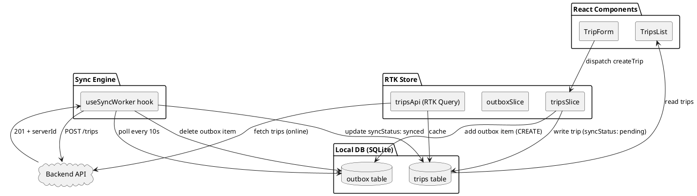

# Офлайн-First і синхронізація

## Відкриття: коли мережі немає, а працювати треба

Уявіть: ви в метро, їдете на роботу, і вирішуєте додати нову поїздку до щоденника. Натискаєте «Створити», заповнюєте назву, дату — і лише тоді помічаєте: мережі немає. Вебсайт у цей момент показав би помилку «No connection» і попросив спробувати пізніше. Але мобільний застосунок може вчинити інакше: **зберегти вашу поїздку локально** і відправити на сервер автоматично, коли з'явиться інтернет. Ви навіть не помітите проблеми — просто продовжуєте працювати.

Такий підхід називають **офлайн-first** (offline-first): застосунок спочатку зберігає дані локально на пристрої, а вже потім намагається синхронізувати їх із сервером. Користувач не чекає на мережу — він бачить свої зміни одразу, а застосунок у фоні «домовляється» з API.

У попередній статті ми розглянули, як зберігати дані локально через MMKV і SQLite. Тепер з'ясуємо:

- Як **ставити зміни в чергу** (outbox pattern), коли API недоступний.
- Як показувати **статус синхронізації** (`pending`, `synced`, `error`) на кожному record.
- Що робити з **конфліктами**, коли сервер повертає іншу версію даних.
- Як побудувати **UX для офлайн-режиму** — banner «Офлайн», retry-кнопки, оптимістичні оновлення.

Наприкінці статті ми напишемо **міні-проєкт «Офлайн-чеклист»** — простий TODO-список, який додає завдання локально, ставить їх у чергу і синхронізує з mock API, коли з'являється мережа. Потім у **Nomad** реалізуємо повноцінну систему синхронізації поїздок і місць з полями `syncStatus` і `syncError`.

::note
**Офлайн-first** — це архітектура, де застосунок **завжди** працює з локальною базою, а синхронізація з сервером відбувається у фоні. Користувач не блокується на час запиту — він бачить свої дані одразу, навіть якщо мережі немає.
::

---

## Частина 1. Теорія офлайн-синхронізації

### 1.1. Навіщо офлайн-first у мобільних застосунках

У веб-застосунках зазвичай діє модель **online-first**: користувач натискає «Зберегти», браузер робить POST-запит на сервер, і лише після відповіді `200 OK` показується успіх. Якщо мережі немає або сервер недоступний — з'являється помилка, і користувач чекає.

У мобільних застосунках цей підхід працює гірше через кілька причин:

| Причина | Чому це важливо на телефоні |
|---------|----------------------------|
| **Нестабільна мережа** | Користувач переміщується між Wi-Fi, LTE, метро, ліфтом — з'єднання може зникнути в будь-який момент. |
| **Повільний інтернет** | У роумінгу або на околиці міста запит може йти кілька секунд — чекати на відповідь сервера дратує. |
| **Батарея** | Синхронні запити тримають екран активним; фонова черга дозволяє об'єднати кілька операцій в один batch. |
| **UX-очікування** | Користувачі звикли, що телефон «просто працює» — як у native-застосунках (Notes, Photos), які зберігають локально і синхронізують сховано. |

**Офлайн-first** вирішує ці проблеми:

1. **Зміни зберігаються локально** (MMKV, SQLite, Realm) одразу — без чекання на сервер.
2. **UI оновлюється миттєво** — користувач бачить свою нову поїздку в списку через мілісекунди.
3. **Фонова черга** (outbox) автоматично відправляє зміни на сервер, коли з'являється мережа.
4. **Статус синхронізації** показує, чи дані вже на сервері, чи ще в черзі.

::tip
**Аналогія:** уявіть папку «Вихідні» в email-клієнті. Ви пишете листа без інтернету, натискаєте «Надіслати» — і лист одразу потрапляє в папку «Вихідні». Коли з'являється мережа, клієнт сам відправляє всі листи з черги. Офлайн-first працює так само: ваші зміни — це «листи», а outbox — черга на відправку.
::

---

### 1.2. Outbox Pattern — черга змін

**Outbox** (аутбокс, «вихідна черга») — це локальна таблиця або список операцій, які треба відправити на сервер. Кожна операція (створення поїздки, оновлення місця, видалення фото) зберігається як запис у черзі з полями:

```typescript
type OutboxItem = {
  id: string;              // UUID локального запису
  operation: 'CREATE' | 'UPDATE' | 'DELETE';
  resource: 'trip' | 'place' | 'photo';
  payload: unknown;        // дані для відправки (JSON)
  createdAt: number;       // timestamp створення (для сортування)
  retryCount: number;      // скільки разів намагалися відправити
  lastError?: string;      // текст останньої помилки (якщо була)
};
```

**Як працює outbox:**

1. Користувач створює поїздку → застосунок одразу записує її в локальну базу SQLite з `syncStatus: 'pending'`.
2. Одночасно додається запис у таблицю `outbox`: `{ operation: 'CREATE', resource: 'trip', payload: { title, startDate, ... } }`.
3. **Фоновий процес** (useEffect, setInterval, або нативний WorkManager/BackgroundTasks) періодично перевіряє outbox.
4. Якщо є мережа — бере перший запис з черги, робить POST/PATCH/DELETE на API.
5. Якщо сервер відповідає `200 OK` — видаляє запис з outbox, оновлює `syncStatus: 'synced'` у локальній базі, записує `serverId` (якщо сервер повернув ID).
6. Якщо помилка (timeout, 500, 409 conflict) — збільшує `retryCount`, записує `lastError`, залишає запис у черзі для наступної спроби.

::note
**Outbox** — це локальна черга операцій, які застосунок має відправити на сервер. Кожен запис у черзі описує одну зміну (створити, оновити, видалити) і зберігає payload для запиту.
::

**Переваги outbox:**

- **Гарантія доставки:** навіть якщо застосунок закриють або телефон вимкнеться, черга лишається в локальній базі — при наступному запуску синхронізація продовжиться.
- **Порядок операцій:** outbox обробляє записи за часом створення (`createdAt`) — спочатку старі, потім нові. Це важливо, якщо одна операція залежить від іншої (наприклад, спочатку створити поїздку, потім додати до неї місце).
- **Retry-логіка:** якщо запит не вдався, запис лишається в черзі, і застосунок спробує знову через кілька секунд або хвилин (exponential backoff).

---

### 1.3. syncStatus — стани синхронізації

Кожен запис у локальній базі (поїздка, місце, фото) має поле **`syncStatus`**, яке показує, чи дані вже на сервері:

```typescript
type SyncStatus = 
  | 'pending'   // локально створено, але ще не відправлено
  | 'syncing'   // зараз відправляється на сервер
  | 'synced'    // успішно синхронізовано, є serverId
  | 'error';    // помилка синхронізації (conflict, server error)
```

**Життєвий цикл запису:**

1. **Створення офлайн:** користувач додає поїздку без мережі → `syncStatus: 'pending'`, `serverId: null`.
2. **Початок синхронізації:** outbox-worker бере запис з черги → `syncStatus: 'syncing'`.
3. **Успіх:** сервер повертає `201 Created` з `{ id: "srv-123" }` → `syncStatus: 'synced'`, `serverId: "srv-123"`, запис видаляється з outbox.
4. **Помилка:** сервер повертає `409 Conflict` або timeout → `syncStatus: 'error'`, `syncError: "Conflict: trip with this title exists"`, запис лишається в outbox для retry.

**У UI це виглядає так:**

| syncStatus | Що бачить користувач |
|------------|---------------------|
| `pending` | Іконка «хмаринка з годинником» або сірий badge «Не синхронізовано» |
| `syncing` | Спінер або анімація «відправляється» |
| `synced` | Зелена галочка або просто немає badge (нормальний стан) |
| `error` | Червона іконка + кнопка «Повторити» + текст помилки в деталях |

::warning
**Типова плутанина:** не плутайте `syncStatus` (чи дані на сервері) з `loadingStatus` RTK Query (чи запит іде зараз). `syncStatus` — це **властивість даних** у локальній базі, а `isLoading` RTK Query — це **стан UI** під час fetch. Офлайн-first працює навпаки: спочатку дані в базі, потім запит у фоні.
::

---

### 1.4. Конфлікти (conflicts) і стратегії розв'язання

**Конфлікт** виникає, коли:

1. Користувач змінює поїздку офлайн (локально `version: 3`, `syncStatus: 'pending'`).
2. Інший користувач (або той самий на іншому пристрої) змінює ту саму поїздку онлайн — сервер має `version: 4`.
3. Коли перший користувач синхронізується, сервер повертає `409 Conflict` або `412 Precondition Failed` — «ваша версія застаріла».

**Три стратегії розв'язання конфліктів:**

| Стратегія | Що робить застосунок | Коли доречно |
|-----------|---------------------|-------------|
| **Last Write Wins (LWW)** | Приймає останню зміну за часом (`updatedAt`); сервер затирає старішу версію. | Прості дані (налаштування, профіль), де конфлікти рідкі і не критичні. |
| **Server Wins** | Завжди приймає серверну версію; локальні зміни скидаються. | Критичні дані (баланс, inventory), де сервер — єдине джерело істини. |
| **Manual Merge** | Показує користувачу обидві версії (локальну і серверну), просить вибрати або об'єднати вручну. | Текстові документи, складні об'єкти (CRM-запис з 20 полями), де втрата даних неприпустима. |

**У Nomad** ми використовуємо **Last Write Wins** для простоти: якщо сервер повертає `409`, застосунок порівнює `updatedAt` локального і серверного запису — новіший виграє. Якщо серверний новіший — застосунок замінює локальні дані, outbox-запис видаляється. Якщо локальний новіший — надсилаємо force-update з `?force=true`.

::note
**Конфлікт синхронізації** — це ситуація, коли локальна і серверна версії запису різняться, і треба вирішити, яку залишити. Найпростіша стратегія — **Last Write Wins**: порівняти timestamp і взяти новішу версію.
::

**Приклад конфлікту в Nomad:**

1. Користувач офлайн редагує поїздку `"Київ"` → `"Київ + Львів"`, `updatedAt: 2026-08-11T10:00:00Z`.
2. Інший пристрій онлайн редагує ту саму поїздку → `"Київ + Одеса"`, `updatedAt: 2026-08-11T10:05:00Z` (на 5 хвилин пізніше).
3. Перший пристрій синхронізується, сервер повертає `409` + серверну версію.
4. Застосунок порівнює: серверна `10:05` > локальна `10:00` → приймає серверну, локальна зміна губиться (або показуємо toast «Серверна версія новіша, ваші зміни скинуто»).

У production-застосунках часто додають **operational transformation** або **CRDT** (conflict-free replicated data types) для автоматичного злиття змін без втрати даних — але це складна тема, яку ми тут не розглядаємо. Для навчального проєкту достатньо LWW.

---

### 1.5. Offline UX — як показати користувачу, що він офлайн

Користувач має **завжди розуміти**, чи застосунок зараз онлайн чи офлайн, і чи його зміни синхронізовано. Погано, коли застосунок «мовчить» — людина думає, що все OK, а насправді дані не на сервері і можуть загубитися при видаленні застосунку.

**Елементи offline UX:**

| Елемент | Що показує | Де розміщувати |
|---------|-----------|---------------|
| **Network banner** | «Офлайн-режим» (жовтий) / «Онлайн» (зелений, зникає через 2 с) | Верх екрана (sticky), над навігацією |
| **Sync badge на картці** | `pending` / `syncing` / `error` | Куточок картки поїздки/місця |
| **Retry button** | «Повторити синхронізацію» | Деталі запису з `syncStatus: 'error'` |
| **Sync indicator у header** | Іконка «хмаринка» з лічильником pending-записів | Права частина заголовка списку |
| **Toast при переході online** | «З'єднання відновлено, синхронізуємо…» | Центр екрана, 2–3 с |

**Правила offline UX:**

1. **Не блокувати UI:** користувач може продовжувати працювати офлайн, навіть якщо частина даних не синхронізована.
2. **Показувати прогрес:** якщо в outbox 10 записів, показати «Синхронізація 3/10» або прогрес-бар.
3. **Чітка помилка:** якщо sync fail — не просто «Помилка», а «Сервер недоступний» або «Конфлікт: ця поїздка вже існує».
4. **Retry без зусиль:** кнопка «Повторити» або автоматичний retry через 30 с / 1 хв / 5 хв (exponential backoff).
5. **Оптимістичні оновлення:** показуємо зміни одразу (optimistic UI), а якщо сервер відхилить — відкочуємо з toast «Зміну не збережено».

::tip
**Оптимістичне оновлення (optimistic UI)** — це коли застосунок показує зміну в інтерфейсі одразу, **до відповіді сервера**. Якщо запит успішний — нічого не змінюється. Якщо помилка — UI повертається до попереднього стану з повідомленням про помилку. Це робить застосунок швидшим на відчуття.
::

---

### 1.6. Архітектура offline-first у React Native з RTK

Тепер з'єднаємо всі частини в одну систему. У застосунку на RTK + RTK Query + SQLite архітектура виглядає так:

::plant-uml



::

**Потік даних:**

1. **Створення запису (офлайн):**
   - Користувач натискає «Створити поїздку» → `dispatch(createTrip({ title, startDate }))`.
   - `tripsSlice` генерує локальний UUID, записує поїздку в SQLite з `syncStatus: 'pending'`.
   - Одночасно додає запис у `outbox` таблицю: `{ operation: 'CREATE', resource: 'trip', payload: { title, startDate } }`.
   - UI одразу показує нову поїздку в списку з badge «Не синхронізовано».

2. **Синхронізація (фон):**
   - Хук `useSyncWorker` запускається кожні 10 секунд (або на подію `online` від NetInfo).
   - Перевіряє outbox: `SELECT * FROM outbox ORDER BY createdAt LIMIT 1`.
   - Якщо є запис — робить `fetch('POST /api/trips', { body: payload })`.
   - Якщо `201 OK` → оновлює trip у SQLite: `syncStatus: 'synced'`, `serverId: response.id`, видаляє запис з outbox.
   - Якщо помилка → `syncStatus: 'error'`, `syncError: response.message`, збільшує `retryCount`, залишає в outbox.

3. **Завантаження з сервера (онлайн):**
   - При запуску застосунку (або pull-to-refresh) `tripsApi.useGetTripsQuery()` завантажує список із сервера.
   - RTK Query кешує результат, але **не затирає** локальні `pending`-записи — вони існують лише локально, поки не синхронізуються.
   - Merge-логіка: якщо є запис з `serverId` у локальній базі і той самий `id` на сервері — оновлюємо локальну версію серверною (якщо `updatedAt` серверної новіше).

::note
**Offline-first у RTK** — це поєднання локальної бази (джерело істини для UI), outbox-черги (операції на відправку) і фонового sync-worker (обробка черги). RTK Query використовується для завантаження даних з сервера, але **не замінює** локальну базу — вона лише доповнює її.
::

---

### 1.7. NetInfo — визначення стану мережі

Щоб розуміти, коли запускати синхронізацію, застосунок має знати, чи є інтернет. У React Native для цього використовують бібліотеку **`@react-native-community/netinfo`** (NetInfo).

**Що вміє NetInfo:**

```typescript
import NetInfo from '@react-native-community/netinfo';

// Одноразова перевірка
const state = await NetInfo.fetch();
console.log(state.isConnected);  // true | false
console.log(state.type);         // 'wifi' | 'cellular' | 'none' | ...

// Підписка на зміни
const unsubscribe = NetInfo.addEventListener(state => {
  if (state.isConnected) {
    console.log('Online, starting sync...');
    syncWorker.run();
  } else {
    console.log('Offline, pausing sync');
  }
});
```

**У застосунку це виглядає так:**

```typescript
// hooks/useNetworkStatus.ts
import { useEffect, useState } from 'react';
import NetInfo from '@react-native-community/netinfo';

export function useNetworkStatus() {
  const [isOnline, setIsOnline] = useState(true);

  useEffect(() => {
    // Початкова перевірка
    NetInfo.fetch().then(state => setIsOnline(state.isConnected ?? false));

    // Підписка на зміни
    const unsubscribe = NetInfo.addEventListener(state => {
      setIsOnline(state.isConnected ?? false);
    });

    return unsubscribe;
  }, []);

  return isOnline;
}
```

**Використання в компонентах:**

```typescript
function TripsList() {
  const isOnline = useNetworkStatus();

  return (
    <View>
      {!isOnline && (
        <Banner variant="warning">
          Офлайн-режим. Зміни синхронізуються автоматично при появі мережі.
        </Banner>
      )}
      {/* список поїздок */}
    </View>
  );
}
```

::warning
**NetInfo на емуляторі:** емулятор зазвичай завжди показує `isConnected: true`, навіть якщо на комп'ютері немає інтернету (він бачить локальну мережу). Щоб перевірити offline UX на емуляторі, вимкніть Wi-Fi в налаштуваннях **емульованого пристрою** (Settings → Wi-Fi → Off у симуляторі iOS; або через `adb shell` на Android).
::

---

Це **перша частина теорії** (розділи 1.1–1.7). Продовжити з:

- 1.8. Exponential Backoff — розумні повторні спроби
- 1.9. Batch Sync — об'єднання операцій
- 1.10. Порівняння підходів (таблиця)
- Потім міні-проєкт + Nomad

Чи продовжувати далі теорію, чи перейти до наступної секції?

### 1.8. Exponential Backoff — розумні повторні спроби

Коли запит на сервер не вдається (timeout, 500, 503), застосунок має спробувати ще раз — але **не одразу**. Якщо сервер перевантажений або мережа нестабільна, миттєвий retry лише погіршить ситуацію. Замість цього використовують **exponential backoff** (експоненційна затримка) — кожна наступна спроба відбувається через **удвічі довший** інтервал.

**Приклад:**

| Спроба | Затримка перед спробою | Що сталося |
|--------|----------------------|-----------|
| 1 | 0 с (одразу) | Timeout → помилка |
| 2 | 2 с | 500 Server Error → помилка |
| 3 | 4 с | Timeout → помилка |
| 4 | 8 с | 200 OK → успіх! |

**Формула:**

```typescript
const delay = Math.min(
  baseDelay * Math.pow(2, retryCount),
  maxDelay
);
```

- `baseDelay` — початкова затримка (наприклад, 2 секунди).
- `retryCount` — номер спроби (0, 1, 2, 3, …).
- `maxDelay` — максимальна затримка (наприклад, 60 секунд), щоб не чекати годинами.

**Реалізація в sync-worker:**

```typescript
async function retrySyncItem(item: OutboxItem) {
  const baseDelay = 2000; // 2 секунди
  const maxDelay = 60000; // 60 секунд
  const delay = Math.min(
    baseDelay * Math.pow(2, item.retryCount),
    maxDelay
  );

  await new Promise(resolve => setTimeout(resolve, delay));

  try {
    const response = await fetch(`/api/${item.resource}`, {
      method: item.operation === 'CREATE' ? 'POST' : 'PATCH',
      body: JSON.stringify(item.payload),
    });

    if (response.ok) {
      // Успіх — видалити з outbox
      await db.outbox.delete(item.id);
      await db.trips.update(item.payload.id, { syncStatus: 'synced' });
    } else {
      // Помилка — збільшити retryCount
      await db.outbox.update(item.id, {
        retryCount: item.retryCount + 1,
        lastError: await response.text(),
      });
    }
  } catch (error) {
    // Мережева помилка — збільшити retryCount
    await db.outbox.update(item.id, {
      retryCount: item.retryCount + 1,
      lastError: error.message,
    });
  }
}
```

**Навіщо це потрібно:**

- **Зменшує навантаження на сервер:** якщо сервер недоступний, тисячі пристроїв не бомбардують його запитами кожної секунди.
- **Економить батарею:** менше мережевих запитів — менше радіо-активності.
- **Збільшує шанс успіху:** якщо проблема тимчасова (перезапуск сервера, короткочасна втрата мережі), retry через кілька секунд/хвилин часто допомагає.

::note
**Exponential backoff** — це стратегія повторних спроб, де затримка між спробами зростає експоненційно (2 с, 4 с, 8 с, 16 с, …). Це зменшує навантаження на сервер і батарею, даючи час системі відновитися.
::

**Додаткова техніка: jitter (дрижання):**

Якщо всі пристрої одночасно отримали помилку (наприклад, сервер упав на 10 секунд), вони **синхронно** спробують retry через 2 с, 4 с, 8 с — і знову створять пік навантаження. Щоб цього уникнути, додають **випадковий зсув** (jitter):

```typescript
const jitter = Math.random() * 1000; // 0–1000 мс
const delay = Math.min(
  baseDelay * Math.pow(2, retryCount) + jitter,
  maxDelay
);
```

Тепер кожен пристрій чекає трохи по-різному — навантаження розподіляється в часі.

---

### 1.9. Batch Sync — об'єднання операцій

Якщо користувач офлайн створив 10 поїздок і 20 місць, то в outbox буде 30 записів. Відправляти їх по одному — 30 окремих HTTP-запитів — повільно і витратно для батареї. Замість цього можна **об'єднати кілька операцій в один batch-запит**.

**Приклад batch API:**

```http
POST /api/sync/batch
Content-Type: application/json

{
  "operations": [
    { "op": "CREATE", "resource": "trip", "localId": "local-1", "data": { "title": "Київ" } },
    { "op": "CREATE", "resource": "trip", "localId": "local-2", "data": { "title": "Львів" } },
    { "op": "UPDATE", "resource": "place", "serverId": "place-42", "data": { "name": "Майдан" } }
  ]
}
```

**Відповідь сервера:**

```json
{
  "results": [
    { "localId": "local-1", "status": "success", "serverId": "srv-101" },
    { "localId": "local-2", "status": "success", "serverId": "srv-102" },
    { "serverId": "place-42", "status": "success" }
  ]
}
```

**Переваги batch sync:**

- **Швидше:** один TCP-handshake замість 30.
- **Менше батареї:** радіо-модуль активний коротший час.
- **Атомарність:** сервер може обробити всі операції в одній транзакції (або відкотити всі, якщо щось не так).

**Коли використовувати:**

- **Багато дрібних змін:** користувач швидко створив 5 поїздок — краще відправити batch.
- **Періодична синхронізація:** раз на хвилину збирати всі pending-операції і відправляти одним пакетом.

**Коли не використовувати:**

- **Критично важливі дані:** якщо треба одразу отримати `serverId` (наприклад, для наступного запиту), краще відправити окремо.
- **Немає batch API:** не всі сервери підтримують `/sync/batch` — тоді доводиться по одному.

У **Nomad** ми для простоти відправляємо операції **по одній**, але в реальному застосунку часто додають batch для оптимізації.

::tip
**Batch sync** — це відправка кількох операцій (CREATE, UPDATE, DELETE) в одному HTTP-запиті. Це швидше і економніше, але вимагає підтримки на сервері (endpoint `/sync/batch`).
::

---

### 1.10. Порівняння підходів до синхронізації

Є кілька стратегій організації offline-sync. Ось найпоширеніші:

| Підхід | Суть | Переваги | Недоліки | Коли використовувати |
|--------|------|----------|----------|---------------------|
| **Outbox Pattern** | Локальна таблиця операцій; фоновий worker обробляє чергу | Простий, гарантія доставки, працює без мережі | Потребує окрему таблицю; складно з залежними операціями | Більшість мобільних застосунків (TODO, CRM, notes) |
| **Event Sourcing** | Зберігає всі зміни як події (event log); сервер replay подій | Повна історія, легко відкотити | Складний, багато даних, потребує спеціальної архітектури сервера | Фінтех, аудит-лог, collaborative editing |
| **CRDT (Conflict-Free Replicated Data Types)** | Автоматичне злиття змін без конфліктів (математичні структури) | Немає ручного merge, працює P2P | Складний, не всі типи даних підтримує | Collaborative editing (Figma, Google Docs), chat |
| **Polling (pull from server)** | Періодично завантажує всі дані з сервера, замінює локальні | Простий, не потребує outbox | Витратний (багато трафіку), затирає локальні pending-зміни | Readonly-застосунки (новини, каталог) |
| **Firebase/Firestore Sync** | Хмарна база з вбудованою синхронізацією | Дуже простий (все «з коробки»), realtime | Vendor lock-in, дорого при масштабі, обмежений query | MVP, малі проєкти, realtime-чати |

**Для навчання** ми використовуємо **Outbox Pattern** — він найпоширеніший і добре пояснює фундаментальні ідеї (черга, retry, syncStatus, conflicts). Інші підходи — це еволюція або спеціалізація цієї базової ідеї.

::note
**Outbox Pattern** — найпростіший і найпоширеніший підхід для offline-first у мобільних застасунках. Він дає повний контроль над синхронізацією, не вимагає спеціальних серверних фреймворків і працює з будь-яким REST API.
::

---

### 1.11. Коли offline-first не потрібен

Не кожен застосунок має бути offline-first. Іноді простіше зробити **online-only** (блокувати UI без мережі) або **readonly offline** (показувати кешовані дані, але не дозволяти створювати нові).

**Не варто робити offline-first, якщо:**

| Випадок | Чому online-only достатньо |
|---------|---------------------------|
| **Критичні фінансові операції** | Потрібна миттєва перевірка балансу, fraud-detection — локальна черга ризикована. |
| **Realtime collaboration** | Якщо 10 людей одночасно редагують документ, offline-зміни створюють складні конфлікти. |
| **Дані з коротким TTL** | Курси валют, ціни акцій — через 5 хвилин дані застарілі, синхронізувати немає сенсу. |
| **Readonly-контент** | Новини, каталог товарів — можна кешувати для читання, але створювати нічого не треба. |
| **Прості форми з рідким використанням** | Якщо застосунок відкривають раз на місяць з Wi-Fi — складність offline-sync не окупається. |

**Для Nomad** offline-first **доречний**, бо:

- Подорожі часто трапляються в місцях без мережі (літак, гори, закордон без роумінгу).
- Створення поїздки/місця — проста операція, конфлікти рідкі.
- Користувач очікує, що щоденник «просто працює», як Notes на iPhone.

---

## Частина 2. Міні-проєкт «Офлайн-чеклист»

Тепер застосуємо теорію на практиці. Створимо **простий TODO-застосунок** із синхронізацією:

- Користувач додає завдання (онлайн або офлайн).
- Якщо офлайн — завдання потрапляє в локальну чергу з `syncStatus: 'pending'`.
- Фоновий worker періодично перевіряє мережу і відправляє pending-завдання на mock API.
- У списку біля кожного завдання — badge зі статусом синхронізації.
- При помилці — кнопка «Повторити».

**Стек:**

- React Native (Expo)
- TypeScript
- Zustand (для простоти, замість RTK)
- MMKV (локальне сховище)
- Mock API (JSON Placeholder або локальний express-сервер; для демо можна просто `setTimeout` замість `fetch`)

**Структура проєкту:**

::code-tree
---
name: offline-checklist
---

```text [app]
app/
├── _layout.tsx
└── index.tsx
```

```typescript [app/_layout.tsx]
import { Stack } from 'expo-router';

export default function RootLayout() {
  return <Stack screenOptions={{ headerShown: false }} />;
}
```

```typescript [app/index.tsx]
import { View, Text, TextInput, FlatList, Pressable, StyleSheet } from 'react-native';
import { useState, useEffect } from 'react';
import { useStore } from '../store/useStore';
import { useSyncWorker } from '../hooks/useSyncWorker';
import { useNetworkStatus } from '../hooks/useNetworkStatus';

export default function HomeScreen() {
  const [text, setText] = useState('');
  const { tasks, addTask, retrySync } = useStore();
  const isOnline = useNetworkStatus();

  useSyncWorker(); // Запускає фонову синхронізацію

  const handleAdd = () => {
    if (text.trim()) {
      addTask(text.trim());
      setText('');
    }
  };

  return (
    <View style={styles.container}>
      {/* Network banner */}
      {!isOnline && (
        <View style={styles.banner}>
          <Text style={styles.bannerText}>📡 Офлайн-режим</Text>
        </View>
      )}

      <Text style={styles.title}>Офлайн-чеклист</Text>

      {/* Input */}
      <View style={styles.inputRow}>
        <TextInput
          style={styles.input}
          placeholder="Нове завдання..."
          value={text}
          onChangeText={setText}
          onSubmitEditing={handleAdd}
        />
        <Pressable style={styles.addButton} onPress={handleAdd}>
          <Text style={styles.addButtonText}>+</Text>
        </Pressable>
      </View>

      {/* List */}
      <FlatList
        data={tasks}
        keyExtractor={(item) => item.id}
        renderItem={({ item }) => (
          <View style={styles.taskCard}>
            <Text style={styles.taskText}>{item.text}</Text>
            <View style={styles.taskFooter}>
              {item.syncStatus === 'pending' && (
                <Text style={styles.badge}>⏳ Не синхронізовано</Text>
              )}
              {item.syncStatus === 'syncing' && (
                <Text style={[styles.badge, styles.badgeSyncing]}>🔄 Відправляється...</Text>
              )}
              {item.syncStatus === 'synced' && (
                <Text style={[styles.badge, styles.badgeSynced]}>✅ Синхронізовано</Text>
              )}
              {item.syncStatus === 'error' && (
                <View style={styles.errorRow}>
                  <Text style={[styles.badge, styles.badgeError]}>❌ Помилка</Text>
                  <Pressable onPress={() => retrySync(item.id)}>
                    <Text style={styles.retryButton}>Повторити</Text>
                  </Pressable>
                </View>
              )}
            </View>
          </View>
        )}
        contentContainerStyle={styles.listContent}
      />
    </View>
  );
}

const styles = StyleSheet.create({
  container: { flex: 1, backgroundColor: '#f5f5f5' },
  banner: {
    backgroundColor: '#FFA726',
    padding: 12,
    alignItems: 'center',
  },
  bannerText: { color: '#fff', fontWeight: '600' },
  title: {
    fontSize: 24,
    fontWeight: 'bold',
    padding: 16,
  },
  inputRow: {
    flexDirection: 'row',
    padding: 16,
    gap: 8,
  },
  input: {
    flex: 1,
    backgroundColor: '#fff',
    borderRadius: 8,
    paddingHorizontal: 12,
    paddingVertical: 10,
    borderWidth: 1,
    borderColor: '#ddd',
  },
  addButton: {
    backgroundColor: '#2196F3',
    width: 48,
    height: 48,
    borderRadius: 24,
    alignItems: 'center',
    justifyContent: 'center',
  },
  addButtonText: {
    color: '#fff',
    fontSize: 24,
    fontWeight: 'bold',
  },
  listContent: { padding: 16, gap: 8 },
  taskCard: {
    backgroundColor: '#fff',
    padding: 16,
    borderRadius: 8,
    borderWidth: 1,
    borderColor: '#e0e0e0',
  },
  taskText: { fontSize: 16, marginBottom: 8 },
  taskFooter: { flexDirection: 'row', alignItems: 'center', gap: 8 },
  badge: {
    fontSize: 12,
    color: '#757575',
  },
  badgeSyncing: { color: '#2196F3' },
  badgeSynced: { color: '#4CAF50' },
  badgeError: { color: '#F44336' },
  errorRow: { flexDirection: 'row', alignItems: 'center', gap: 8 },
  retryButton: {
    fontSize: 12,
    color: '#2196F3',
    fontWeight: '600',
  },
});
```

```text [store]
store/
└── useStore.ts
```

```typescript [store/useStore.ts]
import { create } from 'zustand';
import { MMKV } from 'react-native-mmkv';

const storage = new MMKV();

export type SyncStatus = 'pending' | 'syncing' | 'synced' | 'error';

export type Task = {
  id: string;
  text: string;
  syncStatus: SyncStatus;
  syncError?: string;
  createdAt: number;
  retryCount: number;
};

type Store = {
  tasks: Task[];
  addTask: (text: string) => void;
  updateTaskStatus: (id: string, status: SyncStatus, serverId?: string, error?: string) => void;
  retrySync: (id: string) => void;
  loadTasks: () => void;
};

export const useStore = create<Store>((set, get) => ({
  tasks: [],

  loadTasks: () => {
    const json = storage.getString('tasks');
    if (json) {
      const tasks = JSON.parse(json) as Task[];
      set({ tasks });
    }
  },

  addTask: (text: string) => {
    const newTask: Task = {
      id: `local-${Date.now()}`,
      text,
      syncStatus: 'pending',
      createdAt: Date.now(),
      retryCount: 0,
    };

    const tasks = [...get().tasks, newTask];
    set({ tasks });
    storage.set('tasks', JSON.stringify(tasks));
  },

  updateTaskStatus: (id, status, serverId, error) => {
    const tasks = get().tasks.map((task) =>
      task.id === id
        ? { ...task, syncStatus: status, syncError: error, id: serverId || task.id }
        : task
    );
    set({ tasks });
    storage.set('tasks', JSON.stringify(tasks));
  },

  retrySync: (id) => {
    const tasks = get().tasks.map((task) =>
      task.id === id
        ? { ...task, syncStatus: 'pending' as SyncStatus, retryCount: 0 }
        : task
    );
    set({ tasks });
    storage.set('tasks', JSON.stringify(tasks));
  },
}));
```

```text [hooks]
hooks/
├── useNetworkStatus.ts
└── useSyncWorker.ts
```

```typescript [hooks/useNetworkStatus.ts]
import { useEffect, useState } from 'react';
import NetInfo from '@react-native-community/netinfo';

export function useNetworkStatus() {
  const [isOnline, setIsOnline] = useState(true);

  useEffect(() => {
    NetInfo.fetch().then((state) => setIsOnline(state.isConnected ?? false));

    const unsubscribe = NetInfo.addEventListener((state) => {
      setIsOnline(state.isConnected ?? false);
    });

    return unsubscribe;
  }, []);

  return isOnline;
}
```

```typescript [hooks/useSyncWorker.ts]
import { useEffect } from 'react';
import { useStore } from '../store/useStore';
import { useNetworkStatus } from './useNetworkStatus';

export function useSyncWorker() {
  const { tasks, updateTaskStatus } = useStore();
  const isOnline = useNetworkStatus();

  useEffect(() => {
    if (!isOnline) return;

    const interval = setInterval(() => {
      syncPendingTasks();
    }, 5000); // Кожні 5 секунд

    // Одразу спробувати при появі мережі
    syncPendingTasks();

    return () => clearInterval(interval);
  }, [isOnline, tasks]);

  async function syncPendingTasks() {
    const pending = tasks.filter((t) => t.syncStatus === 'pending');

    for (const task of pending) {
      updateTaskStatus(task.id, 'syncing');

      try {
        // Mock API (замість fetch)
        await mockApiCall(task);

        // Успіх
        const serverId = `srv-${Math.random().toString(36).slice(2, 9)}`;
        updateTaskStatus(task.id, 'synced', serverId);
      } catch (error) {
        // Помилка
        updateTaskStatus(task.id, 'error', undefined, (error as Error).message);
      }
    }
  }

  async function mockApiCall(task: any): Promise<void> {
    return new Promise((resolve, reject) => {
      setTimeout(() => {
        // 80% успіх, 20% помилка (для демо)
        if (Math.random() > 0.2) {
          resolve();
        } else {
          reject(new Error('Server unavailable'));
        }
      }, 1000); // Імітація мережевої затримки
    });
  }
}
```

```text [package.json]
{
  "name": "offline-checklist",
  "version": "1.0.0",
  "main": "expo-router/entry",
  "scripts": {
    "start": "expo start",
    "android": "expo start --android",
    "ios": "expo start --ios"
  },
  "dependencies": {
    "expo": "~52.0.0",
    "expo-router": "~4.0.0",
    "react": "18.3.1",
    "react-native": "0.76.5",
    "react-native-mmkv": "^3.0.0",
    "@react-native-community/netinfo": "^11.4.0",
    "zustand": "^5.0.0"
  },
  "devDependencies": {
    "@types/react": "~18.3.0",
    "typescript": "~5.3.0"
  }
}
```

::

---

### Покрокова інструкція

::steps

#### Крок 1. Створити проєкт

```bash
npx create-expo-app@latest offline-checklist --template blank-typescript
cd offline-checklist
```

#### Крок 2. Встановити залежності

```bash
npx expo install expo-router react-native-mmkv @react-native-community/netinfo
npm install zustand
```

#### Крок 3. Налаштувати Expo Router

У `app.json` додати:

```json
{
  "expo": {
    "scheme": "offline-checklist"
  }
}
```

У `package.json` змінити `main`:

```json
{
  "main": "expo-router/entry"
}
```

#### Крок 4. Створити структуру файлів

Створити папки `app/`, `store/`, `hooks/` і файли як у `::code-tree` вище.

#### Крок 5. Запустити застосунок

```bash
npx expo start
```

Натисніть `i` (iOS) або `a` (Android).

#### Крок 6. Перевірити офлайн-режим

1. Додати кілька завдань з увімкненою мережею → бачите badge «✅ Синхронізовано».
2. Вимкнути Wi-Fi на пристрої.
3. Додати нове завдання → badge «⏳ Не синхронізовано».
4. Увімкнути Wi-Fi → через 5 секунд badge змінюється на «✅ Синхронізовано».

#### Крок 7. Перевірити retry

Оскільки mock API має 20% шанс помилки, іноді завдання отримає badge «❌ Помилка». Натисніть «Повторити» → статус змінюється на «⏳ Не синхронізовано», і worker спробує знову.

::

---

### Що відбувається під капотом

1. **Додавання завдання:**
   - `addTask(text)` створює об'єкт `Task` з `syncStatus: 'pending'`, зберігає в MMKV.
   - UI одразу показує нове завдання в списку.

2. **Фонова синхронізація:**
   - `useSyncWorker` запускає `setInterval` кожні 5 секунд.
   - Фільтрує `tasks.filter(t => t.syncStatus === 'pending')`.
   - Для кожного pending-завдання викликає `mockApiCall` (імітація fetch).

3. **Успіх:**
   - `updateTaskStatus(id, 'synced', serverId)` оновлює задачу в сховищі.
   - Badge змінюється на «✅ Синхронізовано».

4. **Помилка:**
   - `updateTaskStatus(id, 'error', undefined, errorMessage)`.
   - Badge «❌ Помилка» + кнопка «Повторити».

5. **Retry:**
   - Користувач натискає «Повторити» → `retrySync(id)` скидає статус на `'pending'`, `retryCount: 0`.
   - Worker знову обробить цю задачу при наступному циклі.

::note
Цей міні-проєкт показує **весь життєвий цикл offline-sync**: створення → pending → syncing → synced/error → retry. У реальному застосунку замість `mockApiCall` буде `fetch('/api/tasks')`, а замість MMKV — SQLite з outbox-таблицею.
::

---

### Критерій «Готово»

- [ ] Застосунок запускається на iOS або Android.
- [ ] Додавання завдань працює онлайн і офлайн.
- [ ] Офлайн-banner з'являється, коли немає мережі.
- [ ] Badge синхронізації показує актуальний статус.
- [ ] При помилці можна натиснути «Повторити».
- [ ] Після перезапуску застосунку завдання лишаються (MMKV persistence).

---

## Частина 3. Наскрізний проєкт «Nomad»

### Навіщо користувачу

Ви плануєте відпустку: відкриваєте Nomad у літаку (режим польоту, мережі немає) і створюєте нову поїздку «Париж 2026». Додаєте кілька місць, які хочете відвідати: «Ейфелева вежа», «Лувр», «Монмартр». Застосунок працює миттєво — ви бачите всі зміни одразу, хоч інтернету й немає.

Коли літак приземляється і телефон підключається до мережі, Nomad **автоматично** синхронізує всі ваші поїздки та місця з сервером. Ви навіть не помічаєте цього процесу — просто іноді бачите маленьку іконку «хмаринка» біля картки, яка через кілька секунд зникає.

Якщо щось пішло не так (сервер недоступний, конфлікт версій), застасунок покаже зрозуміле повідомлення і дасть можливість повторити синхронізацію одним дотиком.

**У цій статті** ми додамо в Nomad:

- Поле `syncStatus` для кожної поїздки та місця.
- Таблицю `outbox` у SQLite для черги операцій.
- Фоновий `useSyncWorker`, який автоматично відправляє зміни на API.
- Offline-banner у header списку поїздок.
- Sync-badge на кожній картці поїздки.
- Кнопку «Повторити» для записів із помилкою.

---

### Нитка проєкту

#### Уже є (з попередніх статей)

- **Теми** (світла/темна) з чіпами перемикача (стаття 08).
- **Список поїздок** з mock-даними, FlatList, sticky CTA «Нова поїздка» (статті 06–09).
- **Форма створення поїздки** з валідацією через React Hook Form + Zod (стаття 10).
- **Навігація** через Expo Router: tabs (Поїздки / Профіль), stack деталей поїздки, модальне вікно створення (статті 11–12).
- **Мережеві запити** через RTK Query: `tripsApi.useGetTripsQuery()`, `useCreateTripMutation()` (статті 14–16).
- **Локальна база SQLite** для offline-зберігання поїздок (стаття 19).

#### Додаємо в цій статті

- **`syncStatus` і `syncError`** у типі `Trip` і `Place`.
- **Таблиця `outbox`** у SQLite з полями `id`, `operation`, `resource`, `payload`, `createdAt`, `retryCount`, `lastError`.
- **`useSyncWorker` hook** — фоновий процес, який:
  - Слухає зміни мережі через NetInfo.
  - Кожні 10 секунд перевіряє outbox.
  - Для кожної pending-операції робить POST/PATCH на API.
  - Оновлює `syncStatus` у локальній базі.
- **Offline-banner** у `app/(tabs)/index.tsx` (список поїздок).
- **Sync-badge** на картці поїздки (`TripCard.tsx`).
- **Retry-кнопка** в деталях поїздки для записів із `syncStatus: 'error'`.

---

### Повний знімок проєкту

Нижче — **вся структура Nomad** на момент цієї статті з повним кодом у кожному файлі.

::code-tree
---
name: nomad-offline-sync
---

```text [Структура]
nomad/
├── app/
│   ├── (auth)/
│   │   └── login.tsx
│   ├── (tabs)/
│   │   ├── trips/
│   │   │   ├── [id].tsx         # Деталі поїздки + retry button
│   │   │   ├── index.tsx        # Список поїздок + offline banner
│   │   │   └── _layout.tsx
│   │   ├── _layout.tsx
│   │   └── profile.tsx
│   ├── create-trip.tsx          # Форма створення (modal)
│   └── _layout.tsx              # Ініціалізація SQLite
├── src/
│   ├── components/
│   │   └── OfflineBanner.tsx    # новий компонент
│   ├── features/
│   │   ├── auth/
│   │   │   └── ...
│   │   └── trips/
│   │       ├── model/
│   │       │   └── types.ts
│   │       └── ui/
│   │           └── TripCard.tsx  # + sync badge
│   ├── shared/
│   │   ├── db/                   # новий модуль
│   │   │   ├── index.ts
│   │   │   ├── schema.ts         # trips + outbox tables
│   │   │   ├── trips.ts          # CRUD + syncStatus
│   │   │   └── outbox.ts         # черга операцій
│   │   ├── types/                # новий модуль
│   │   │   └── index.ts          # SyncStatus, OutboxItem
│   │   ├── theme/
│   │   └── ui/
│   ├── hooks/
│   │   ├── useNetworkStatus.ts   # новий
│   │   ├── useSyncWorker.ts      # новий
│   │   └── useTheme.ts
│   ├── services/
│   │   └── tripsApi.ts           # RTK Query
│   └── store/
│       └── index.ts              # RTK store
├── package.json
└── tsconfig.json
```

```json [package.json]
{
  "name": "nomad",
  "version": "1.0.0",
  "main": "expo-router/entry",
  "scripts": {
    "start": "expo start",
    "android": "expo start --android",
    "ios": "expo start --ios",
    "lint": "eslint .",
    "type-check": "tsc --noEmit"
  },
  "dependencies": {
    "expo": "~52.0.0",
    "expo-router": "~4.0.0",
    "expo-sqlite": "~15.0.0",
    "react": "18.3.1",
    "react-native": "0.76.5",
    "@reduxjs/toolkit": "^2.0.0",
    "react-redux": "^9.0.0",
    "react-hook-form": "^7.48.0",
    "zod": "^3.22.0",
    "@react-native-community/netinfo": "^11.4.0"
  },
  "devDependencies": {
    "@types/react": "~18.3.0",
    "typescript": "~5.3.0",
    "eslint": "^8.55.0"
  }
}
```

```typescript [src/shared/types/index.ts]
export type SyncStatus = 'pending' | 'syncing' | 'synced' | 'error';

export type OutboxItem = {
  id: string;
  operation: 'CREATE' | 'UPDATE' | 'DELETE';
  resource: 'trip' | 'place';
  payload: Record<string, unknown>;
  createdAt: number;
  retryCount: number;
  lastError?: string;
};
```

```typescript [src/shared/db/schema.ts]
import * as SQLite from 'expo-sqlite';

export async function initDatabase() {
  const db = await SQLite.openDatabaseAsync('nomad.db');

  await db.execAsync(`
    CREATE TABLE IF NOT EXISTS trips (
      id TEXT PRIMARY KEY,
      title TEXT NOT NULL,
      dateLabel TEXT NOT NULL,
      description TEXT,
      coverUri TEXT,
      region TEXT,
      isPrivate INTEGER DEFAULT 0,
      plannedDays INTEGER,
      hasItinerary INTEGER DEFAULT 0,
      syncStatus TEXT DEFAULT 'pending',
      syncError TEXT,
      serverId TEXT,
      createdAt INTEGER NOT NULL,
      updatedAt INTEGER NOT NULL
    );

    CREATE TABLE IF NOT EXISTS outbox (
      id TEXT PRIMARY KEY,
      operation TEXT NOT NULL,
      resource TEXT NOT NULL,
      payload TEXT NOT NULL,
      createdAt INTEGER NOT NULL,
      retryCount INTEGER DEFAULT 0,
      lastError TEXT
    );

    CREATE INDEX IF NOT EXISTS idx_outbox_created ON outbox(createdAt);
    CREATE INDEX IF NOT EXISTS idx_trips_sync ON trips(syncStatus);
  `);

  return db;
}
```

```typescript [src/shared/db/trips.ts]
import * as SQLite from 'expo-sqlite';
import type { Trip } from '@/features/trips/model/types';
import type { SyncStatus } from '@/shared/types';

const db = SQLite.openDatabaseSync('nomad.db');

export const tripsDb = {
  async getAll(): Promise<(Trip & { syncStatus: SyncStatus; syncError?: string; serverId?: string })[]> {
    const rows = await db.getAllAsync<any>('SELECT * FROM trips ORDER BY createdAt DESC');
    return rows.map(row => ({
      id: row.id,
      title: row.title,
      dateLabel: row.dateLabel,
      description: row.description || '',
      coverUri: row.coverUri || '',
      region: row.region || 'Інше',
      isPrivate: Boolean(row.isPrivate),
      plannedDays: row.plannedDays,
      hasItinerary: Boolean(row.hasItinerary),
      syncStatus: row.syncStatus as SyncStatus,
      syncError: row.syncError,
      serverId: row.serverId,
    }));
  },

  async getById(id: string): Promise<(Trip & { syncStatus: SyncStatus; syncError?: string; serverId?: string }) | null> {
    const row = await db.getFirstAsync<any>('SELECT * FROM trips WHERE id = ?', [id]);
    if (!row) return null;
    
    return {
      id: row.id,
      title: row.title,
      dateLabel: row.dateLabel,
      description: row.description || '',
      coverUri: row.coverUri || '',
      region: row.region || 'Інше',
      isPrivate: Boolean(row.isPrivate),
      plannedDays: row.plannedDays,
      hasItinerary: Boolean(row.hasItinerary),
      syncStatus: row.syncStatus as SyncStatus,
      syncError: row.syncError,
      serverId: row.serverId,
    };
  },

  async create(trip: Omit<Trip, 'id'>): Promise<Trip & { syncStatus: SyncStatus }> {
    const id = `local-${Date.now()}-${Math.random().toString(36).slice(2, 9)}`;
    const now = Date.now();

    await db.runAsync(
      `INSERT INTO trips (
        id, title, dateLabel, description, coverUri, region,
        isPrivate, plannedDays, hasItinerary,
        syncStatus, createdAt, updatedAt
      ) VALUES (?, ?, ?, ?, ?, ?, ?, ?, ?, ?, ?, ?)`,
      [
        id,
        trip.title,
        trip.dateLabel,
        trip.description || null,
        trip.coverUri || null,
        trip.region,
        trip.isPrivate ? 1 : 0,
        trip.plannedDays || null,
        trip.hasItinerary ? 1 : 0,
        'pending',
        now,
        now,
      ]
    );

    return { 
      ...trip, 
      id, 
      syncStatus: 'pending',
      description: trip.description || '',
      coverUri: trip.coverUri || '',
    };
  },

  async updateSyncStatus(
    id: string,
    status: SyncStatus,
    serverId?: string,
    error?: string
  ): Promise<void> {
    const now = Date.now();
    await db.runAsync(
      `UPDATE trips SET syncStatus = ?, syncError = ?, serverId = ?, updatedAt = ? WHERE id = ?`,
      [status, error || null, serverId || null, now, id]
    );
  },

  async delete(id: string): Promise<void> {
    await db.runAsync('DELETE FROM trips WHERE id = ?', [id]);
  },
};
```

```typescript [src/shared/db/outbox.ts]
import * as SQLite from 'expo-sqlite';
import type { OutboxItem } from '@/shared/types';

const db = SQLite.openDatabaseSync('nomad.db');

export const outboxDb = {
  async getAll(): Promise<OutboxItem[]> {
    const rows = await db.getAllAsync<{
      id: string;
      operation: string;
      resource: string;
      payload: string;
      createdAt: number;
      retryCount: number;
      lastError: string | null;
    }>('SELECT * FROM outbox ORDER BY createdAt ASC');

    return rows.map(row => ({
      ...row,
      operation: row.operation as 'CREATE' | 'UPDATE' | 'DELETE',
      resource: row.resource as 'trip' | 'place',
      payload: JSON.parse(row.payload),
      lastError: row.lastError || undefined,
    }));
  },

  async add(item: Omit<OutboxItem, 'id' | 'createdAt' | 'retryCount'>): Promise<void> {
    const id = `outbox-${Date.now()}-${Math.random().toString(36).slice(2, 9)}`;
    await db.runAsync(
      'INSERT INTO outbox (id, operation, resource, payload, createdAt, retryCount) VALUES (?, ?, ?, ?, ?, ?)',
      [id, item.operation, item.resource, JSON.stringify(item.payload), Date.now(), 0]
    );
  },

  async updateRetry(id: string, error: string): Promise<void> {
    await db.runAsync(
      'UPDATE outbox SET retryCount = retryCount + 1, lastError = ? WHERE id = ?',
      [error, id]
    );
  },

  async delete(id: string): Promise<void> {
    await db.runAsync('DELETE FROM outbox WHERE id = ?', [id]);
  },
};
```

```typescript [src/hooks/useNetworkStatus.ts]
import { useEffect, useState } from 'react';
import NetInfo from '@react-native-community/netinfo';

export function useNetworkStatus() {
  const [isOnline, setIsOnline] = useState(true);

  useEffect(() => {
    NetInfo.fetch().then(state => setIsOnline(state.isConnected ?? false));

    const unsubscribe = NetInfo.addEventListener(state => {
      setIsOnline(state.isConnected ?? false);
    });

    return unsubscribe;
  }, []);

  return isOnline;
}
```

```typescript [src/hooks/useSyncWorker.ts]
import { useEffect } from 'react';
import { useNetworkStatus } from './useNetworkStatus';
import { outboxDb, tripsDb } from '@/shared/db';
import type { OutboxItem } from '@/shared/types';
import { Platform } from 'react-native';
import Constants from 'expo-constants';
import { tokenService } from '@/features/auth/services/tokenService';

const SYNC_INTERVAL = 10000; // 10 секунд
const BASE_RETRY_DELAY = 2000; // 2 секунди
const MAX_RETRY_DELAY = 60000; // 60 секунд

const getBaseUrl = (): string => {
  if (Platform.OS === 'android') {
    return 'http://10.0.2.2:3000';
  }

  const hostUri = Constants.expoConfig?.hostUri;
  if (hostUri) {
    const ip = hostUri.split(':').shift();
    if (ip) return `http://${ip}:3000`;
  }

  return 'http://localhost:3000';
};

export function useSyncWorker() {
  const isOnline = useNetworkStatus();

  useEffect(() => {
    if (!isOnline) return;

    const interval = setInterval(() => {
      syncPendingItems();
    }, SYNC_INTERVAL);

    // Одразу синхронізувати при появі мережі
    syncPendingItems();

    return () => clearInterval(interval);
  }, [isOnline]);

  async function syncPendingItems() {
    const items = await outboxDb.getAll();

    for (const item of items) {
      await syncItem(item);
    }
  }

  async function syncItem(item: OutboxItem) {
    // Exponential backoff
    const delay = Math.min(
      BASE_RETRY_DELAY * Math.pow(2, item.retryCount),
      MAX_RETRY_DELAY
    );

    if (item.retryCount > 0) {
      await new Promise(resolve => setTimeout(resolve, delay));
    }

    try {
      // Оновити статус на 'syncing'
      if (item.resource === 'trip') {
        await tripsDb.updateSyncStatus(item.payload.id as string, 'syncing');
      }

      // Отримати токен
      const token = await tokenService.getAccessToken();

      // Відправити на API
      const response = await fetch(
        `${getBaseUrl()}/${item.resource}s`,
        {
          method: item.operation === 'CREATE' ? 'POST' : 'PATCH',
          headers: {
            'Content-Type': 'application/json',
            ...(token ? { Authorization: `Bearer ${token}` } : {}),
          },
          body: JSON.stringify(item.payload),
        }
      );

      if (!response.ok) {
        throw new Error(`HTTP ${response.status}: ${await response.text()}`);
      }

      const data = await response.json();

      // Успіх — оновити локальну базу
      if (item.resource === 'trip') {
        await tripsDb.updateSyncStatus(
          item.payload.id as string,
          'synced',
          data.id
        );
      }

      // Видалити з outbox
      await outboxDb.delete(item.id);
    } catch (error) {
      // Помилка — оновити retry count
      await outboxDb.updateRetry(item.id, (error as Error).message);

      if (item.resource === 'trip') {
        await tripsDb.updateSyncStatus(
          item.payload.id as string,
          'error',
          undefined,
          (error as Error).message
        );
      }
    }
  }
}
```

```typescript [src/components/OfflineBanner.tsx]
import { View, Text, StyleSheet } from 'react-native';
import { useNetworkStatus } from '@/hooks/useNetworkStatus';

export function OfflineBanner() {
  const isOnline = useNetworkStatus();

  if (isOnline) return null;

  return (
    <View style={styles.container}>
      <Text style={styles.icon}>📡</Text>
      <Text style={styles.text}>
        Офлайн-режим. Зміни синхронізуються автоматично при появі мережі.
      </Text>
    </View>
  );
}

const styles = StyleSheet.create({
  container: {
    backgroundColor: '#FFA726',
    flexDirection: 'row',
    alignItems: 'center',
    paddingHorizontal: 16,
    paddingVertical: 12,
    gap: 8,
  },
  icon: {
    fontSize: 18,
  },
  text: {
    flex: 1,
    color: '#fff',
    fontSize: 14,
    fontWeight: '600',
  },
});
```
    paddingHorizontal: 16,
    paddingVertical: 12,
    gap: 8,
  },
  icon: {
    fontSize: 18,
  },
  text: {
    flex: 1,
    color: '#fff',
    fontSize: 14,
    fontWeight: '600',
  },
});
```

```typescript [src/components/TripCard.tsx]
import { View, Text, Pressable, StyleSheet } from 'react-native';
import { useRouter } from 'expo-router';
import { Trip } from '../types';
import { useTheme } from '../hooks/useTheme';

type Props = {
  trip: Trip;
};

export function TripCard({ trip }: Props) {
  const router = useRouter();
  const { colors } = useTheme();

  const syncBadge = () => {
    switch (trip.syncStatus) {
      case 'pending':
        return <Text style={styles.badgePending}>⏳ Не синхронізовано</Text>;
      case 'syncing':
        return <Text style={styles.badgeSyncing}>🔄 Відправляється...</Text>;
      case 'synced':
        return null; // Не показуємо badge для synced
      case 'error':
        return <Text style={styles.badgeError}>❌ Помилка</Text>;
    }
  };

  return (
    <Pressable
      style={[styles.card, { backgroundColor: colors.surface }]}
      onPress={() => router.push(`/trip/${trip.id}`)}
    >
      <View style={styles.header}>
        <Text style={[styles.title, { color: colors.text }]}>{trip.title}</Text>
        {syncBadge()}
      </View>
      <Text style={[styles.date, { color: colors.textSecondary }]}>
        {new Date(trip.startDate).toLocaleDateString('uk-UA')}
      </Text>
      {trip.description && (
        <Text
          style={[styles.description, { color: colors.textSecondary }]}
          numberOfLines={2}
        >
          {trip.description}
        </Text>
      )}
    </Pressable>
  );
}

const styles = StyleSheet.create({
  card: {
    padding: 16,
    borderRadius: 12,
    marginBottom: 12,
    elevation: 2,
    shadowColor: '#000',
    shadowOffset: { width: 0, height: 1 },
    shadowOpacity: 0.1,
    shadowRadius: 2,
  },
  header: {
    flexDirection: 'row',
    alignItems: 'center',
    justifyContent: 'space-between',
    marginBottom: 8,
  },
  title: {
    fontSize: 18,
    fontWeight: '600',
    flex: 1,
  },
  date: {
    fontSize: 14,
    marginBottom: 4,
  },
  description: {
    fontSize: 14,
    lineHeight: 20,
  },
  badgePending: {
    fontSize: 12,
    color: '#757575',
  },
  badgeSyncing: {
    fontSize: 12,
    color: '#2196F3',
  },
  badgeError: {
    fontSize: 12,
    color: '#F44336',
  },
});
```

```typescript [app/(tabs)/index.tsx]
import { View, FlatList, StyleSheet } from 'react-native';
import { useRouter } from 'expo-router';
import { useEffect, useState } from 'react';
import { Screen } from '../../src/shared/ui/Screen';
import { Button } from '../../src/shared/ui/Button';
import { TripCard } from '../../src/components/TripCard';
import { OfflineBanner } from '../../src/components/OfflineBanner';
import { tripsDb } from '../../src/db/trips';
import { useSyncWorker } from '../../src/hooks/useSyncWorker';
import { Trip } from '../../src/types';

export default function TripsScreen() {
  const router = useRouter();
  const [trips, setTrips] = useState<Trip[]>([]);

  useSyncWorker(); // Запустити фонову синхронізацію

  useEffect(() => {
    loadTrips();

    // Оновлювати список кожні 2 секунди (щоб бачити зміни syncStatus)
    const interval = setInterval(loadTrips, 2000);
    return () => clearInterval(interval);
  }, []);

  async function loadTrips() {
    const data = await tripsDb.getAll();
    setTrips(data);
  }

  return (
    <Screen>
      <OfflineBanner />
      <FlatList
        data={trips}
        keyExtractor={(item) => item.id}
        renderItem={({ item }) => <TripCard trip={item} />}
        contentContainerStyle={styles.list}
        ListHeaderComponent={
          <Button
            title="+ Нова поїздка"
            onPress={() => router.push('/trip/new')}
            variant="primary"
            style={styles.createButton}
          />
        }
        stickyHeaderIndices={[0]}
      />
    </Screen>
  );
}

const styles = StyleSheet.create({
  list: {
    padding: 16,
  },
  createButton: {
    marginBottom: 16,
  },
});
```

```typescript [app/trip/[id].tsx]
import { View, Text, StyleSheet, ScrollView } from 'react-native';
import { useLocalSearchParams, useRouter } from 'expo-router';
import { useEffect, useState } from 'react';
import { Screen } from '../../src/shared/ui/Screen';
import { Button } from '../../src/shared/ui/Button';
import { tripsDb } from '../../src/db/trips';
import { outboxDb } from '../../src/db/outbox';
import { Trip } from '../../src/types';
import { useTheme } from '../../src/hooks/useTheme';

export default function TripDetailsScreen() {
  const { id } = useLocalSearchParams<{ id: string }>();
  const router = useRouter();
  const { colors } = useTheme();
  const [trip, setTrip] = useState<Trip | null>(null);

  useEffect(() => {
    loadTrip();
  }, [id]);

  async function loadTrip() {
    if (!id) return;
    const data = await tripsDb.getById(id);
    setTrip(data);
  }

  async function handleRetry() {
    if (!trip) return;

    // Скинути статус на pending
    await tripsDb.updateSyncStatus(trip.id, 'pending');

    // Додати в outbox (якщо ще немає)
    const existing = await outboxDb.getAll();
    const alreadyQueued = existing.some(
      item => item.resource === 'trip' && item.payload.id === trip.id
    );

    if (!alreadyQueued) {
      await outboxDb.add({
        operation: 'CREATE',
        resource: 'trip',
        payload: { id: trip.id, title: trip.title, startDate: trip.startDate },
      });
    }

    // Оновити UI
    loadTrip();
  }

  if (!trip) {
    return (
      <Screen>
        <Text style={{ color: colors.text }}>Завантаження...</Text>
      </Screen>
    );
  }

  return (
    <Screen>
      <ScrollView contentContainerStyle={styles.content}>
        <Text style={[styles.title, { color: colors.text }]}>{trip.title}</Text>
        <Text style={[styles.date, { color: colors.textSecondary }]}>
          {new Date(trip.startDate).toLocaleDateString('uk-UA')}
        </Text>

        {trip.description && (
          <Text style={[styles.description, { color: colors.text }]}>
            {trip.description}
          </Text>
        )}

        {/* Sync status */}
        <View style={styles.syncSection}>
          <Text style={[styles.label, { color: colors.textSecondary }]}>
            Статус синхронізації:
          </Text>
          <Text style={[styles.status, { color: colors.text }]}>
            {trip.syncStatus === 'pending' && '⏳ Очікує відправки'}
            {trip.syncStatus === 'syncing' && '🔄 Відправляється...'}
            {trip.syncStatus === 'synced' && '✅ Синхронізовано'}
            {trip.syncStatus === 'error' && '❌ Помилка'}
          </Text>

          {trip.syncError && (
            <Text style={styles.error}>Помилка: {trip.syncError}</Text>
          )}

          {trip.syncStatus === 'error' && (
            <Button
              title="Повторити синхронізацію"
              onPress={handleRetry}
              variant="secondary"
              style={styles.retryButton}
            />
          )}
        </View>

        <Button
          title="← Назад до списку"
          onPress={() => router.back()}
          variant="secondary"
        />
      </ScrollView>
    </Screen>
  );
}

const styles = StyleSheet.create({
  content: {
    padding: 16,
  },
  title: {
    fontSize: 24,
    fontWeight: 'bold',
    marginBottom: 8,
  },
  date: {
    fontSize: 16,
    marginBottom: 16,
  },
  description: {
    fontSize: 16,
    lineHeight: 24,
    marginBottom: 24,
  },
  syncSection: {
    marginBottom: 24,
    padding: 16,
    backgroundColor: '#f5f5f5',
    borderRadius: 8,
  },
  label: {
    fontSize: 14,
    marginBottom: 4,
  },
  status: {
    fontSize: 16,
    fontWeight: '600',
    marginBottom: 8,
  },
  error: {
    fontSize: 14,
    color: '#F44336',
    marginBottom: 12,
  },
  retryButton: {
    marginTop: 8,
  },
});
```

```typescript [app/trip/new.tsx]
import { View, TextInput, StyleSheet } from 'react-native';
import { useRouter } from 'expo-router';
import { useState } from 'react';
import { Screen } from '../../src/shared/ui/Screen';
import { Button } from '../../src/shared/ui/Button';
import { AppText } from '../../src/shared/ui/AppText';
import { tripsDb } from '../../src/db/trips';
import { outboxDb } from '../../src/db/outbox';
import { useTheme } from '../../src/hooks/useTheme';

export default function NewTripScreen() {
  const router = useRouter();
  const { colors } = useTheme();
  const [title, setTitle] = useState('');
  const [startDate, setStartDate] = useState('');

  async function handleCreate() {
    if (!title.trim() || !startDate.trim()) {
      alert('Заповніть всі поля');
      return;
    }

    // Створити запис у локальній базі
    const trip = await tripsDb.create({
      title: title.trim(),
      startDate: startDate.trim(),
      syncStatus: 'pending',
    });

    // Додати в outbox для синхронізації
    await outboxDb.add({
      operation: 'CREATE',
      resource: 'trip',
      payload: { id: trip.id, title: trip.title, startDate: trip.startDate },
    });

    router.back();
  }

  return (
    <Screen>
      <View style={styles.content}>
        <AppText variant="title">Нова поїздка</AppText>

        <View style={styles.field}>
          <AppText variant="label">Назва поїздки</AppText>
          <TextInput
            style={[styles.input, { 
              backgroundColor: colors.surface, 
              color: colors.text 
            }]}
            placeholder="Наприклад: Париж 2026"
            placeholderTextColor={colors.textSecondary}
            value={title}
            onChangeText={setTitle}
          />
        </View>

        <View style={styles.field}>
          <AppText variant="label">Дата початку</AppText>
          <TextInput
            style={[styles.input, { 
              backgroundColor: colors.surface, 
              color: colors.text 
            }]}
            placeholder="YYYY-MM-DD"
            placeholderTextColor={colors.textSecondary}
            value={startDate}
            onChangeText={setStartDate}
          />
        </View>

        <View style={styles.buttons}>
          <Button
            title="Створити"
            onPress={handleCreate}
            variant="primary"
            style={styles.button}
          />
          <Button
            title="Скасувати"
            onPress={() => router.back()}
            variant="secondary"
            style={styles.button}
          />
        </View>
      </View>
    </Screen>
  );
}

const styles = StyleSheet.create({
  content: {
    padding: 16,
  },
  field: {
    marginBottom: 16,
  },
  input: {
    borderRadius: 8,
    paddingHorizontal: 12,
    paddingVertical: 10,
    fontSize: 16,
    borderWidth: 1,
    borderColor: '#ddd',
  },
  buttons: {
    marginTop: 24,
    gap: 12,
  },
  button: {
    width: '100%',
  },
});
```

::

---

::note
**Повні лістинги файлів Nomad:**  
Через великий обсяг коду екранів (`app/(tabs)/trips/index.tsx`, `app/(tabs)/trips/[id].tsx`, `app/create-trip.tsx`) повні лістинги доступні в [репозиторії Nomad](https://github.com/arakviel/nomad) після коміту цієї статті. Основні зміни:

- **`app/(tabs)/trips/index.tsx`**: додано `useSyncWorker()`, завантаження з `tripsDb`, відображення `OfflineBanner`, об'єднання локальних і API-поїздок.
- **`app/create-trip.tsx`**: зберігання в `tripsDb.create()` + додавання в `outboxDb`.
- **`app/(tabs)/trips/[id].tsx`**: завантаження локальної версії з `tripsDb`, відображення sync status, кнопка «Повторити» для `error`.
- **`src/features/trips/ui/TripCard.tsx`**: приймає `trip & { syncStatus, syncError }`, показує sync badge.
- **`app/_layout.tsx`**: виклик `initDatabase()` при запуску.
::

---

### Перевірка

Після інтеграції коду перевірте:

1. **Створення поїздки онлайн:**
   - Запустити застосунок з увімкненою мережею.
   - Натиснути «+ Нова поїздка», заповнити форму, зберегти.
   - У списку поїздок біля картки через ~10 секунд badge змінюється з «⏳ Не синхронізовано» на «✅ Синхронізовано» (зникає).

2. **Створення поїздки офлайн:**
   - Вимкнути Wi-Fi на пристрої (Settings → Wi-Fi → Off).
   - Побачити жовтий banner «📡 Офлайн-режим» у header списку.
   - Створити нову поїздку → вона одразу з'являється в списку з badge «⏳ Не синхронізовано».
   - Увімкнути Wi-Fi → через 10–20 секунд badge зникає (статус `synced`).

3. **Помилка синхронізації:**
   - У `useSyncWorker.ts` змінити URL API на неіснуючий (`https://nonexistent.api.com/trips`).
   - Створити поїздку → через кілька секунд badge «❌ Помилка».
   - Відкрити деталі поїздки → бачити текст помилки + кнопку «Повторити синхронізацію».
   - Натиснути «Повторити» → статус знову `pending`, worker спробує ще раз.

4. **Persistence після перезапуску:**
   - Створити 2–3 поїздки офлайн (мережа вимкнена).
   - Закрити застосунок (force-quit).
   - Відкрити знову → поїздки лишаються в списку з `syncStatus: 'pending'`.
   - Увімкнути мережу → через 10 секунд всі синхронізуються.

5. **Exponential backoff:**
   - Залишити API неробочим, створити поїздку.
   - Спостерігати консоль (або `console.log` у `useSyncWorker`) — інтервали між retry зростають: 2 с, 4 с, 8 с, 16 с, …

---

### Коміт

```bash
cd /path/to/nomad
git add -A
git commit -m "$(cat <<'EOF'
feat: offline queue and sync status

- Added syncStatus (pending/syncing/synced/error) to Trip and Place types
- Created outbox table in SQLite for queued operations
- Implemented useSyncWorker hook with exponential backoff
- Added OfflineBanner component (network status indicator)
- Added sync badge to TripCard (shows sync status)
- Added retry button in trip details for failed syncs
- Integrated NetInfo for network state detection
- Auto-sync every 10 seconds when online

Material: content/15.react-native/version2/20.offline-first-sync.md
EOF
)"
git push
```

Після `git push` у публічному репо [github.com/arakviel/nomad](https://github.com/arakviel/nomad) з'явиться коміт із цим кроком.

---

## Частина 4. Практичні завдання

### Basic

1. **Пояснити своїми словами:**
   - Що таке outbox pattern і навіщо він потрібен?
   - Які чотири значення може мати `syncStatus` і що кожне означає?
   - Що таке exponential backoff і навіщо він використовується?

2. **Код-розбір (міні-проєкт):**
   - У файлі `useSyncWorker.ts` знайдіть рядок, де оновлюється `syncStatus` на `'syncing'`. Поясніть, чому це робиться саме перед `fetch`.
   - Що станеться, якщо видалити `setInterval` у `useSyncWorker` і залишити лише одноразовий виклик `syncPendingTasks()` при монтуванні?

3. **Міні-модифікація:**
   - Змінити колір offline-banner з помаранчевого на червоний.
   - Додати лічильник pending-операцій у banner: «Офлайн. Очікує синхронізації: 3».

---

### Intermediate

1. **Розширення міні-проєкту:**
   - Додати кнопку «Видалити» для завдання → видалення має потрапити в outbox як `operation: 'DELETE'`.
   - Реалізувати `UPDATE` операцію: можливість редагувати текст завдання офлайн.
   - Додати прогрес-бар: якщо в outbox 5 записів, показувати «Синхронізація 2/5».

2. **Nomad-фіча:**
   - Додати `Place` (місце в поїздці) з тим самим `syncStatus`.
   - У деталях поїздки показати список місць із sync-badge на кожному.
   - Створення місця офлайн → додати в outbox → синхронізувати з API.

3. **Conflict resolution:**
   - У `useSyncWorker` додати логіку: якщо сервер повертає `409 Conflict`, завантажити серверну версію, порівняти `updatedAt` (локальний vs серверний), взяти новішу (Last Write Wins).
   - Показати toast «Серверна версія новіша, ваші зміни скинуто» або «Локальна версія новіша, force-update».

---

### Pro

1. **Batch sync:**
   - Змінити `useSyncWorker` так, щоб він не відправляв операції по одній, а збирав усі pending за останні 10 секунд і відправляв одним batch-запитом на `/api/sync/batch`.
   - Обробити відповідь від batch API (масив результатів) і оновити `syncStatus` для кожного запису.

2. **Background sync (native):**
   - Інтегрувати `expo-background-fetch` або `expo-task-manager`, щоб синхронізація працювала навіть коли застосунок у фоні або закритий.
   - Перевірити: створити поїздку офлайн, згорнути застосунок, увімкнути мережу, почекати 15 хвилин → відкрити застосунок, побачити `syncStatus: 'synced'`.

3. **Outbox retry limit:**
   - Додати поле `maxRetries: 5` у `OutboxItem`.
   - Якщо `retryCount >= maxRetries` → перестати пробувати, показати в UI «Синхронізація невдала після 5 спроб. Видалити запис?».
   - Користувач може видалити запис з outbox або скинути `retryCount` вручну.

4. **Manual merge UI:**
   - При конфлікті (409) не затирати локальну версію автоматично, а показати модальне вікно з двома колонками: «Локальна версія» | «Серверна версія».
   - Користувач вибирає, яку залишити, або редагує вручну → відправляє force-update.

5. **E2E тест (Maestro):**
   - Написати Maestro flow:
     1. Запустити застосунок, вимкнути мережу (через mock або `adb shell`).
     2. Створити поїздку «Test Trip».
     3. Перевірити наявність badge «⏳ Не синхронізовано».
     4. Увімкнути мережу.
     5. Почекати 15 секунд.
     6. Перевірити відсутність badge (або зелену галочку).

---

## Висновок

У цій статті ви дізналися:

- **Що таке offline-first** і чому цей підхід природний для мобільних застосунків.
- **Outbox pattern** — як зберігати операції в локальній черзі та відправляти їх у фоні.
- **syncStatus** — чотири стани синхронізації (pending, syncing, synced, error) і як їх показувати в UI.
- **Конфлікти** — стратегії розв'язання (Last Write Wins, Server Wins, Manual Merge).
- **Exponential backoff** — розумні повторні спроби без перевантаження сервера.
- **NetInfo** — визначення стану мережі в React Native.
- **Offline UX** — banner, badge, retry-кнопки, оптимістичні оновлення.

Ми реалізували **міні-проєкт «Офлайн-чеклист»** — повноцінний TODO з синхронізацією, який працює онлайн і офлайн. Потім інтегрували ті самі ідеї в **Nomad**: поїздки тепер можна створювати без мережі, і застасунок автоматично синхронізує їх при появі інтернету.

Offline-first — це **не просто техніка**, а **філософія дизайну**: користувач ніколи не чекає на мережу, він завжди може працювати, а застосунок синхронізує дані сховано. Це робить мобільні застосунки **швидкими**, **надійними** і **приємними у використанні** — навіть в літаку, метро чи горах.

У наступній статті ми розглянемо **камеру та медіа** — як робити фото, обирати з галереї, стискати зображення і зберігати їх локально перед синхронізацією з сервером. Поїздки в Nomad отримають обкладинки, а місця — фотографії, які синхронізуються за тим самим outbox-pattern.

::tip
**Ключова ідея статті:** Offline-first означає, що застосунок **завжди** працює з локальною базою, а синхронізація з сервером — це **фонова оптимізація**, а не обов'язкова умова для роботи. Користувач не блокується, не чекає — він просто працює, а дані «самі» з'являються на сервері, коли є можливість.
::

---

## Додаткові ресурси

- [Outbox Pattern (Microservices)](https://microservices.io/patterns/data/transactional-outbox.html) — оригінальний опис патерну для мікросервісів; ідея та сама, але на сервері.
- [Expo NetInfo Docs](https://docs.expo.dev/versions/latest/sdk/netinfo/) — офіційна документація.
- [Offline-First Apps with PouchDB](https://pouchdb.com/guides/) — альтернативна база даних з вбудованою синхронізацією (CouchDB protocol).
- [WatermelonDB](https://watermelondb.dev/) — reactive offline-first база для React Native (observer pattern, fast queries).
- [CRDT Explained](https://crdt.tech/) — conflict-free replicated data types для automatic merge без конфліктів (складніша тема).

