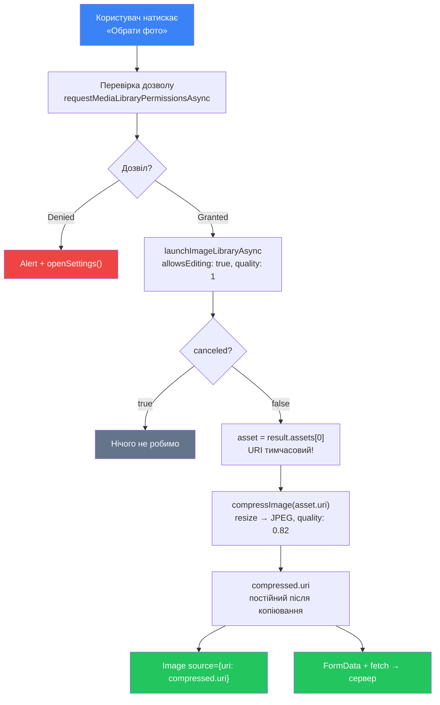

# Камера, медіа та файлова система

## Відкриття: чому фото — це не просто файл

Уявіть: ви додаєте до застосунку функцію «аватар профілю». Здається, нічого складного — кнопка «Обрати фото», і все. Але насправді за цією простою кнопкою стоїть ціла система взаємодій:

- Спочатку треба **запитати дозвіл** у операційної системи — iOS і Android не дозволяють застосункам просто так читати файли або вмикати камеру.
- Потім потрібно **відкрити системний picker** — нативний UI для вибору фото або зйомки нового.
- Обране фото може важити **10–15 МБ** — треба **стиснути** його до прийнятного розміру перед завантаженням на сервер.
- Після вибору ви отримаєте **локальний URI** — тимчасовий шлях до файлу в пісочниці застосунку, з яким треба вміти правильно працювати.

У цій статті ми пройдемо весь цей шлях від початку до кінця. Розберемо, як iOS і Android управляють дозволами, чому вони відрізняються, як використовувати `expo-image-picker` і `expo-media-library`, стиснення через `expo-image-manipulator` та роботу з файловою системою через `expo-file-system`. Наприкінці побудуємо **міні-проєкт «Фото-бейдж»** — екран профілю, де користувач може зробити фото або обрати з галереї, а результат одразу з'являється на екрані.

::note
**Що потрібно знати заздалегідь:** ця стаття передбачає знайомство з Expo Router, хуками `useState`/`useEffect` та базовими компонентами React Native. Якщо ви ще не читали попередні розділи — рекомендую почати звідти.
::

---

## Дозволи (Permissions)

### 1.1. Навіщо взагалі потрібні дозволи

У вебі браузер може запитати доступ до камери або мікрофону через `getUserMedia`. Але уявіть, якби будь-який сайт міг читати ваші фотографії без питань — це була б катастрофа приватності. Мобільні ОС вирішили цю проблему радикальніше: **кожен чутливий ресурс пристрою захищений системою дозволів**. Застосунок не може навіть спробувати відкрити камеру без явної згоди користувача.

Дозволи (permissions) — це контракт між застосунком і ОС:

1. Застосунок **декларує** у маніфесті, які ресурси йому можуть знадобитись.
2. При першій спробі використати ресурс застосунок **запитує** дозвіл у runtime.
3. Операційна система показує **системний діалог** — від імені ОС, не від застосунку.
4. Користувач **вирішує**: дозволити, відмовити, або дозволити «тільки один раз» (iOS).
5. Застосунок **реагує** на відповідь — або продовжує роботу, або пояснює, чому дозвіл потрібен.

::tip
Системний діалог дозволів виглядає однаково для всіх застосунків — це навмисне рішення Apple і Google. Користувач знає: цей запит прийшов від ОС, а не від застосунку, і ОС буде виконувати його рішення.
::

### 1.2. iOS vs Android: принципові відмінності

Системи дозволів на iOS і Android суттєво відрізняються — і це напряму впливає на те, як ми пишемо код.

::card-group

::card{title="iOS — суворий однораз" icon="i-simple-icons-apple"}

- Дозвіл запитується **один раз за весь термін роботи застосунку**.
- Якщо користувач відмовив — ОС **більше не покаже** системний діалог. Тільки ручний перехід у Налаштування.
- З iOS 14: дозвіл на фото-бібліотеку може бути **частковим** — `limited`. Користувач сам обирає, які фото відкрити.
- З iOS 17: нові варіанти — `addOnly` (тільки зберігати, не читати).

::

::card{title="Android — гнучкіший, але складніший" icon="i-simple-icons-android"}

- До Android 10: дозволи `READ_EXTERNAL_STORAGE` / `WRITE_EXTERNAL_STORAGE` давали доступ до всього сховища.
- Android 10+: **Scoped Storage** — кожен застосунок бачить тільки свою папку і публічні медіа через MediaStore.
- Android 13+: замість `READ_EXTERNAL_STORAGE` — окремі дозволи: `READ_MEDIA_IMAGES`, `READ_MEDIA_VIDEO`, `READ_MEDIA_AUDIO`.
- На Android дозвіл можна запитати **повторно**, але лише якщо користувач не відзначив «Більше не питати».

::

::

Що це означає на практиці? Expo абстрагує більшість цих відмінностей, але розуміти їх все одно важливо — щоб правильно реагувати на `denied`, `limited` та інші статуси.

### 1.3. Статуси дозволів

Перед тим як запитувати дозвіл, слід **перевірити поточний статус**. Expo надає єдиний API через окремі пакети (`expo-image-picker`, `expo-media-library`, `expo-camera` тощо), але всі вони повертають одні й ті самі статуси:

| Статус | Значення | Що робити |
|--------|----------|-----------|
| `undetermined` | Користувач ще не вирішував | Запитати дозвіл |
| `granted` | Дозволено | Продовжувати роботу |
| `denied` | Відмовлено | Показати пояснення + кнопку «Відкрити Налаштування» |
| `limited` | Частковий доступ (iOS 14+) | Працювати з обраними фото або запропонувати розширити доступ |

::note
У Expo дозволи перевіряються і запитуються через хуки або статичні методи — залежно від пакету. Наприклад, `useMediaLibraryPermissions()` — хук, а `ImagePicker.requestMediaLibraryPermissionsAsync()` — прямий виклик. Обидва підходи правомірні; хук зручніший у компонентах.
::

### 1.4. Підключення пакетів і налаштування маніфестів

Для роботи з камерою і медіа нам знадобляться три пакети:

::code-group

```bash [expo install]
npx expo install expo-image-picker expo-media-library expo-image-manipulator expo-file-system
```

```bash [npm]
npm install expo-image-picker expo-media-library expo-image-manipulator expo-file-system
```

::

Після встановлення пакетів треба оголосити дозволи в `app.json`. Expo генерує нативний `Info.plist` (iOS) і `AndroidManifest.xml` (Android) з цих налаштувань автоматично під час збірки.

```json [app.json]
{
  "expo": {
    "plugins": [
      [
        "expo-image-picker",
        {
          "photosPermission": "Застосунок потребує доступу до фотографій, щоб ви могли обрати аватар.",
          "cameraPermission": "Застосунок потребує доступу до камери для зйомки фото."
        }
      ],
      [
        "expo-media-library",
        {
          "photosPermission": "Дозвольте доступ до фотографій.",
          "savePhotosPermission": "Дозвольте зберігати фотографії.",
          "isAccessMediaLocationEnabled": true
        }
      ]
    ]
  }
}
```

::warning
Текст у `photosPermission` і `cameraPermission` — це рядки, які **буде показано користувачу** в системному діалозі iOS. Пишіть їх зрозумілою мовою і пояснюйте, **навіщо** застосунку цей доступ. Apple може відхилити застосунок у App Store, якщо рядок дозволу недостатньо конкретний або технічний.
::

### 1.5. Запит дозволів на практиці

Ось повний приклад компонента, що перевіряє і запитує дозволи, а також правильно обробляє кожен статус:

```tsx [components/PermissionGate.tsx] showLineNumbers
import * as ImagePicker from 'expo-image-picker';
import { Linking, Pressable, StyleSheet, Text, View } from 'react-native';

type Props = {
  children: React.ReactNode;
};

export function PermissionGate({ children }: Props) {
  // Хук повертає [статус, requestAsync, getAsync]
  const [cameraStatus, requestCamera] =
    ImagePicker.useCameraPermissions();
  const [libraryStatus, requestLibrary] =
    ImagePicker.useMediaLibraryPermissions();

  // Поки дозволи ще не завантажились — нічого не рендеримо
  if (!cameraStatus || !libraryStatus) return null;

  const allGranted =
    cameraStatus.granted && libraryStatus.granted;

  if (allGranted) {
    // Всі дозволи є — рендеримо дочірній контент
    return <>{children}</>;
  }

  // Якщо хоча б один дозвіл "denied" — треба вести в Налаштування
  const anyDenied =
    cameraStatus.status === 'denied' ||
    libraryStatus.status === 'denied';

  return (
    <View style={styles.container}>
      <Text style={styles.title}>Потрібен доступ</Text>
      <Text style={styles.description}>
        Для роботи з фото застосунок потребує доступу до
        камери та фото-бібліотеки.
      </Text>

      {anyDenied ? (
        // Дозвіл вже відхилений — система не покаже діалог знову.
        // Єдиний вихід — відкрити Налаштування вручну.
        <Pressable
          style={styles.button}
          onPress={() => Linking.openSettings()}
        >
          <Text style={styles.buttonText}>
            Відкрити Налаштування
          </Text>
        </Pressable>
      ) : (
        // Статус "undetermined" — можна запитати
        <Pressable
          style={styles.button}
          onPress={async () => {
            await requestCamera();
            await requestLibrary();
          }}
        >
          <Text style={styles.buttonText}>
            Надати доступ
          </Text>
        </Pressable>
      )}
    </View>
  );
}

const styles = StyleSheet.create({
  container: {
    flex: 1,
    justifyContent: 'center',
    alignItems: 'center',
    padding: 32,
    gap: 16,
  },
  title: { fontSize: 20, fontWeight: '700', textAlign: 'center' },
  description: { fontSize: 15, textAlign: 'center', color: '#666' },
  button: {
    backgroundColor: '#3b82f6',
    paddingHorizontal: 24,
    paddingVertical: 12,
    borderRadius: 10,
  },
  buttonText: { color: '#fff', fontWeight: '600', fontSize: 16 },
});
```

::note
**Чому `Linking.openSettings()`?** Коли статус `denied`, операційна система заблокувала повторний показ діалогу. Єдиний спосіб змінити рішення — перейти у Налаштування → Конфіденційність → ваш застосунок. `Linking.openSettings()` відкриває саме цю сторінку на обох платформах.
::

Розберемо ключові моменти цього компонента:

**Рядки 10–13** — хук `useCameraPermissions()` повертає кортеж: поточний статус дозволу і функцію для його запиту. Це React-хук, тому він реактивно оновлює компонент, коли статус змінюється (наприклад, після того як користувач надав дозвіл у діалозі).

**Рядок 16** — `!cameraStatus` означає, що хук ще не завершив асинхронну перевірку статусу. У цей короткий момент краще не рендерити нічого, ніж показувати миготіння UI.

**Рядки 41–48** — `Linking.openSettings()` — правильна реакція на `denied`. Жодна кнопка «Запитати знову» не спрацює: ОС просто проігнорує виклик `requestPermissionsAsync()`.

### 1.6. Коли питати дозволи: стратегії UX

Є два підходи до моменту запиту дозволів:

::tabs

::tabs-item{label="Eager (при старті)"}

Запитуємо дозволи відразу, коли застосунок відкривається або коли користувач заходить на певний екран.

```tsx
// При монтуванні екрана
useEffect(() => {
  (async () => {
    await ImagePicker.requestCameraPermissionsAsync();
    await ImagePicker.requestMediaLibraryPermissionsAsync();
  })();
}, []);
```

**Проблема:** iOS і Google Play вимагають, щоб дозволи запитувались **лише в контексті дії**. Якщо запитати доступ до камери на екрані привітання — застосунок може бути відхилений у App Store.

::

::tabs-item{label="Lazy (по дії) ✅ Рекомендовано"}

Запитуємо дозвіл саме тоді, коли користувач натискає кнопку, яка його потребує.

```tsx
const handlePickPhoto = async () => {
  // 1. Спочатку перевіряємо / запитуємо статус
  const { status } =
    await ImagePicker.requestMediaLibraryPermissionsAsync();

  if (status !== 'granted') {
    Alert.alert(
      'Потрібен доступ до фото',
      'Щоб обрати аватар, дозвольте доступ до фото-бібліотеки.',
      [
        { text: 'Скасувати', style: 'cancel' },
        { text: 'Налаштування', onPress: Linking.openSettings },
      ],
    );
    return;
  }

  // 2. Дозвіл є — відкриваємо picker
  const result = await ImagePicker.launchImageLibraryAsync({
    // опції розглянемо в наступному розділі
  });
};
```

::

::

::tip
**Правило великого пальця:** питайте дозвіл тільки тоді, коли без нього неможливо виконати дію, яку щойно ініціював користувач. Ніколи не питайте «про запас». Це покращує конверсію (більше людей погоджуються) і відповідає вимогам App Store і Google Play.
::

---

## Image Picker — вибір і зйомка фото

### 2.1. Що таке Image Picker і навіщо він потрібен

`expo-image-picker` — це Expo-модуль, що надає нативний UI для вибору зображень або відео з фото-бібліотеки пристрою, або зйомки нових фото/відео через камеру. Ключове слово — **нативний**: на iOS відкривається рідна Photos app з усіма smart albums і фільтрами, на Android — системний Media Picker, адаптований до версії ОС.

Це принципова перевага перед самостійним відображенням зображень: вам не треба будувати свій UI для перегляду галереї — ОС надає готовий, звичний для користувача інтерфейс.

Пакет надає дві головні функції:

| Функція | Що відкриває | Дозвіл |
|---------|-------------|--------|
| `launchImageLibraryAsync()` | Системна фото-бібліотека | `MEDIA_LIBRARY` |
| `launchCameraAsync()` | Камера пристрою | `CAMERA` |

### 2.2. `launchImageLibraryAsync` — вибір з галереї

Розберемо всі опції, які приймає ця функція:

```tsx [features/photo/usePhotoPicker.ts] showLineNumbers
import * as ImagePicker from 'expo-image-picker';

export async function pickFromLibrary() {
  const result = await ImagePicker.launchImageLibraryAsync({
    // Які типи медіа показувати у picker-і
    // 'Images' | 'Videos' | 'All'
    mediaTypes: ImagePicker.MediaTypeOptions.Images,

    // Чи дозволити редактор кадрування після вибору
    // На iOS відкриває вбудований crop UI
    allowsEditing: true,

    // Пропорції кадрування (тільки якщо allowsEditing: true)
    // [ширина, висота] — наприклад, [1, 1] = квадрат
    aspect: [1, 1],

    // Якість стиснення JPEG: 0.0 (мінімальна) → 1.0 (максимальна)
    // Застосовується до JPEG/WebP; PNG не стискається (lossless)
    quality: 0.8,

    // Чи дозволити вибір кількох файлів одночасно (iOS 14+, Android)
    allowsMultipleSelection: false,

    // Чи повертати base64 разом з URI
    // Увімкнення суттєво збільшує час обробки і пам'ять!
    base64: false,

    // Чи повертати exif-метадані (геолокація, камера, час зйомки)
    exif: false,
  });

  return result;
}
```

**Що повертає функція?** Об'єкт типу `ImagePickerResult`:

```typescript
// Якщо користувач скасував вибір:
{ canceled: true }

// Якщо обрав фото:
{
  canceled: false,
  assets: [
    {
      uri: 'file:///var/mobile/Containers/.../tmp/image.jpg',
      width: 1080,
      height: 1080,
      type: 'image',        // 'image' | 'video'
      fileName: 'IMG_1234.jpg',
      fileSize: 2430000,    // байти
      mimeType: 'image/jpeg',
      base64: null,         // тільки якщо base64: true
      exif: null,           // тільки якщо exif: true
      duration: null,       // для відео — тривалість у мс
    }
  ]
}
```

::note
Чому `assets` — масив, якщо `allowsMultipleSelection: false`? Тому що API єдиний для одиночного і множинного вибору. Навіть при виборі одного файлу — він завжди буде в `assets[0]`. Перевіряйте `result.canceled` і звертайтесь до `result.assets[0]`.
::

Ось повний хук для роботи з picker-ом:

```tsx [features/photo/usePhotoPicker.ts] showLineNumbers
import * as ImagePicker from 'expo-image-picker';
import { Alert, Linking } from 'react-native';

export type PickedAsset = ImagePicker.ImagePickerAsset;

export function usePhotoPicker() {
  const pickFromLibrary = async (): Promise<PickedAsset | null> => {
    // Запитуємо дозвіл (lazy — прямо перед дією)
    const { status } =
      await ImagePicker.requestMediaLibraryPermissionsAsync();

    if (status !== 'granted') {
      Alert.alert(
        'Потрібен доступ до фото',
        'Щоб обрати фото, надайте доступ до фото-бібліотеки у Налаштуваннях.',
        [
          { text: 'Скасувати', style: 'cancel' },
          { text: 'Налаштування', onPress: () => Linking.openSettings() },
        ],
      );
      return null;
    }

    const result = await ImagePicker.launchImageLibraryAsync({
      mediaTypes: ImagePicker.MediaTypeOptions.Images,
      allowsEditing: true,
      aspect: [1, 1],
      quality: 0.8,
    });

    if (result.canceled) return null;

    return result.assets[0];
  };

  return { pickFromLibrary };
}
```

### 2.3. `launchCameraAsync` — зйомка нового фото

`launchCameraAsync` відкриває нативний інтерфейс камери. Опції ті самі, що й у `launchImageLibraryAsync`, плюс кілька специфічних:

```tsx [features/photo/useCameraPicker.ts] showLineNumbers
import * as ImagePicker from 'expo-image-picker';
import { Alert, Linking } from 'react-native';

export function useCameraPicker() {
  const takePhoto = async () => {
    const { status } =
      await ImagePicker.requestCameraPermissionsAsync();

    if (status !== 'granted') {
      Alert.alert(
        'Потрібен доступ до камери',
        'Щоб зняти фото, надайте доступ до камери у Налаштуваннях.',
        [
          { text: 'Скасувати', style: 'cancel' },
          { text: 'Налаштування', onPress: () => Linking.openSettings() },
        ],
      );
      return null;
    }

    const result = await ImagePicker.launchCameraAsync({
      mediaTypes: ImagePicker.MediaTypeOptions.Images,
      allowsEditing: true,
      aspect: [1, 1],
      quality: 0.85,

      // Яка камера відкривається першою
      // 'front' (фронтальна) | 'back' (основна, за замовчуванням)
      cameraType: ImagePicker.CameraType.back,
    });

    if (result.canceled) return null;

    return result.assets[0];
  };

  return { takePhoto };
}
```

::warning
`launchCameraAsync` **не працює в Expo Go на iOS** — лише в development build або standalone app. На Android — частково працює в Expo Go. Якщо розробляєте з Expo Go і бачите помилку `Camera module not available`, — це очікувана поведінка. Для тестування камери потрібен `expo-dev-client`.
::

### 2.4. Паттерн ActionSheet: «Камера або Галерея»

У реальних застосунках майже завжди треба дати користувачу **вибір**: сфотографувати щось нове або обрати вже наявне фото. Це класичний паттерн — ActionSheet з двома опціями.

На iOS `ActionSheet` — нативний компонент; на Android він виглядає інакше. Щоб уникнути різниці у вигляді, використаємо `Alert.alert` — він виглядає нативно на обох платформах. Але краще — бібліотека `@expo/react-native-action-sheet` або `react-native-modal`:

```tsx [components/PhotoSourceSheet.tsx] showLineNumbers
import * as ImagePicker from 'expo-image-picker';
import { Alert, Linking } from 'react-native';

type PhotoSource = 'library' | 'camera';

async function requestAndLaunch(source: PhotoSource) {
  if (source === 'library') {
    const { status } =
      await ImagePicker.requestMediaLibraryPermissionsAsync();
    if (status !== 'granted') {
      Alert.alert('Немає доступу', 'Відкрийте Налаштування і надайте доступ до фото.', [
        { text: 'OK' },
        { text: 'Налаштування', onPress: () => Linking.openSettings() },
      ]);
      return null;
    }
    const result = await ImagePicker.launchImageLibraryAsync({
      mediaTypes: ImagePicker.MediaTypeOptions.Images,
      allowsEditing: true,
      aspect: [1, 1],
      quality: 0.8,
    });
    return result.canceled ? null : result.assets[0];
  }

  // source === 'camera'
  const { status } = await ImagePicker.requestCameraPermissionsAsync();
  if (status !== 'granted') {
    Alert.alert('Немає доступу', 'Відкрийте Налаштування і надайте доступ до камери.', [
      { text: 'OK' },
      { text: 'Налаштування', onPress: () => Linking.openSettings() },
    ]);
    return null;
  }
  const result = await ImagePicker.launchCameraAsync({
    mediaTypes: ImagePicker.MediaTypeOptions.Images,
    allowsEditing: true,
    aspect: [1, 1],
    quality: 0.85,
  });
  return result.canceled ? null : result.assets[0];
}

// Функція показує Alert з вибором джерела фото
export function showPhotoSourceSheet(
  onPicked: (asset: ImagePicker.ImagePickerAsset) => void,
) {
  Alert.alert(
    'Оберіть джерело фото',
    undefined,
    [
      {
        text: 'Фото-бібліотека',
        onPress: async () => {
          const asset = await requestAndLaunch('library');
          if (asset) onPicked(asset);
        },
      },
      {
        text: 'Камера',
        onPress: async () => {
          const asset = await requestAndLaunch('camera');
          if (asset) onPicked(asset);
        },
      },
      { text: 'Скасувати', style: 'cancel' },
    ],
  );
}
```

Використання в компоненті:

```tsx
<Pressable onPress={() => showPhotoSourceSheet(setSelectedAsset)}>
  <Text>Змінити фото</Text>
</Pressable>
```

::tip
На iOS `Alert.alert` з трьома кнопками автоматично відображає першу і другу як дії, а третю з `style: 'cancel'` — окремо внизу, що візуально схоже на нативний ActionSheet. На Android кнопки розміщуються в ряд у діалоговому вікні. Якщо потрібен однаковий нативний вигляд ActionSheet на обох платформах — розгляньте `@expo/react-native-action-sheet`.
::

### 2.5. Відображення обраного фото

Після того як `launchImageLibraryAsync` або `launchCameraAsync` повернули `asset`, його `uri` можна одразу передати в `Image`:

```tsx [features/photo/PhotoPreview.tsx] showLineNumbers
import { Image, StyleSheet, Text, View } from 'react-native';
import type { ImagePickerAsset } from 'expo-image-picker';

type Props = {
  asset: ImagePickerAsset | null;
};

export function PhotoPreview({ asset }: Props) {
  if (!asset) {
    return (
      <View style={styles.placeholder}>
        <Text style={styles.placeholderText}>Фото не обрано</Text>
      </View>
    );
  }

  return (
    <View>
      <Image
        source={{ uri: asset.uri }}
        style={styles.image}
        // Показуємо фото в його реальних пропорціях
        // width і height asset-а вже відомі — використаємо їх
        accessibilityLabel="Обране фото"
      />
      <Text style={styles.meta}>
        {asset.width} × {asset.height} px
        {asset.fileSize
          ? ` · ${(asset.fileSize / 1024 / 1024).toFixed(1)} МБ`
          : ''}
      </Text>
    </View>
  );
}

const styles = StyleSheet.create({
  placeholder: {
    width: 200,
    height: 200,
    borderRadius: 100,
    backgroundColor: '#f1f5f9',
    justifyContent: 'center',
    alignItems: 'center',
  },
  placeholderText: { color: '#94a3b8', fontSize: 14 },
  image: {
    width: 200,
    height: 200,
    borderRadius: 100,
  },
  meta: { textAlign: 'center', color: '#64748b', marginTop: 8, fontSize: 13 },
});
```

::note
URI з picker-а виглядає як `file:///var/mobile/Containers/Data/Application/.../tmp/...`. Це **тимчасовий** шлях. Якщо ви перезапустите застосунок — цей файл може бути видалений ОС. Щоб зберегти фото надовго, треба скопіювати його в постійну директорію застосунку — про це у розділі про файлову систему.
::

---

## Стиснення зображень (`expo-image-manipulator`)

### 3.1. Чому «якість 0.8 у picker-і» — недостатньо

Коли ви встановлюєте `quality: 0.8` у `launchImageLibraryAsync`, це означає: якщо picker сам конвертує фото (наприклад, HEIC → JPEG), він застосує 80% якість JPEG. Але якщо користувач обрав вже готовий JPEG — picker може повернути **оригінальний** файл без стиснення.

Типові розміри фотографій із сучасних смартфонів:

| Сценарій | Роздільна здатність | Розмір файлу |
|----------|-------------------|-------------|
| iPhone 15 Pro (основна камера) | 4032 × 3024 px | 8–15 МБ |
| Samsung Galaxy S24 (12 МП режим) | 4000 × 3000 px | 5–10 МБ |
| Середній аватар для сервера | 512 × 512 px | 30–80 КБ |

Відправляти 10 МБ фото на сервер — це погана практика:
- Повільне завантаження, особливо на мобільному інтернеті.
- Зайве навантаження на сервер і сховище (S3 та ін.).
- Поганий UX: користувач бачить спіннер замість результату.

Тому перед завантаженням на сервер фото треба **явно стиснути і масштабувати** — і саме для цього існує `expo-image-manipulator`.

### 3.2. Основи `expo-image-manipulator`

`ImageManipulator.manipulateAsync` — головна функція пакету. Вона приймає URI зображення, масив операцій трансформації і опції збереження результату:

```typescript
import * as ImageManipulator from 'expo-image-manipulator';

const result = await ImageManipulator.manipulateAsync(
  uri,           // вхідний URI (file://, asset-library://, https://)
  actions,       // масив операцій — порядок важливий!
  saveOptions,   // формат і якість вихідного файлу
);

// result: { uri: string, width: number, height: number }
```

**Доступні дії (`actions`):**

::field-group

::field{name="resize" type="{ width?, height? }"}
Масштабує зображення. Якщо вказати лише `width` або лише `height` — друга сторона масштабується пропорційно, зберігаючи aspect ratio. Якщо вказати обидва — зображення розтягується до точних розмірів.
::

::field{name="crop" type="{ originX, originY, width, height }"}
Обрізає зображення. Координати у пікселях відносно лівого верхнього кута. Виконується **після** `resize`, якщо вони обидва в масиві.
::

::field{name="rotate" type="number (degrees)"}
Повертає зображення на вказану кількість градусів за годинниковою стрілкою. 90, 180, 270 — типові значення.
::

::field{name="flip" type="{ horizontal?, vertical? }"}
Дзеркальне відображення по горизонталі або вертикалі.
::

::

**Опції збереження (`SaveOptions`):**

::field-group

::field{name="format" type="'jpeg' | 'png' | 'webp'"}
Формат вихідного файлу. `'jpeg'` — найкращий вибір для фотографій (менший розмір). `'png'` — для зображень з прозорістю. `'webp'` — сучасний формат з кращим стисненням, але підтримується не всюди.
::

::field{name="compress" type="number (0.0–1.0)"}
Ступінь стиснення для JPEG і WebP: `1.0` = без втрат якості (найбільший файл), `0.0` = максимальне стиснення (найменший файл, видимі артефакти). Для аватарів зазвичай `0.7–0.85`.
::

::field{name="base64" type="boolean"}
Якщо `true` — результат містить також `base64`-рядок. Корисно для прямої вставки в ``, але значно збільшує пам'ять.
::

::

### 3.3. Практичний приклад: функція стиснення аватара

Ось ready-to-use функція, що зменшує фото до максимум 800×800 px і стискає до JPEG з 80% якістю:

```tsx [utils/compressImage.ts] showLineNumbers
import * as ImageManipulator from 'expo-image-manipulator';

type CompressOptions = {
  maxWidth?: number;   // максимальна ширина (default: 800)
  maxHeight?: number;  // максимальна висота (default: 800)
  quality?: number;    // якість JPEG: 0–1 (default: 0.8)
};

export type CompressedImage = {
  uri: string;
  width: number;
  height: number;
};

export async function compressImage(
  uri: string,
  options: CompressOptions = {},
): Promise<CompressedImage> {
  const {
    maxWidth = 800,
    maxHeight = 800,
    quality = 0.8,
  } = options;

  // resize з лише однією стороною зберігає пропорції.
  // Але нам треба обмежити обидва виміри — тому беремо менший коефіцієнт.
  // Найпростіший підхід: спочатку обмежимо ширину, потім висоту.
  // ImageManipulator сам збереже пропорції при single-dimension resize.
  const result = await ImageManipulator.manipulateAsync(
    uri,
    [
      // Зменшуємо до maxWidth, зберігаючи пропорції
      { resize: { width: maxWidth } },
    ],
    {
      compress: quality,
      format: ImageManipulator.SaveFormat.JPEG,
    },
  );

  // Якщо після зменшення за шириною висота все ще перевищує maxHeight —
  // ще раз зменшуємо, тепер за висотою
  if (result.height > maxHeight) {
    const second = await ImageManipulator.manipulateAsync(
      result.uri,
      [{ resize: { height: maxHeight } }],
      {
        compress: quality,
        format: ImageManipulator.SaveFormat.JPEG,
      },
    );
    return second;
  }

  return result;
}
```

Використання у хуку:

```tsx [features/photo/useAvatarUpload.ts] showLineNumbers
import { useState } from 'react';
import * as ImagePicker from 'expo-image-picker';
import { compressImage, type CompressedImage } from '@/utils/compressImage';

export function useAvatarUpload() {
  const [compressed, setCompressed] = useState<CompressedImage | null>(null);
  const [isProcessing, setIsProcessing] = useState(false);

  const pickAndCompress = async () => {
    const { status } =
      await ImagePicker.requestMediaLibraryPermissionsAsync();
    if (status !== 'granted') return;

    const picked = await ImagePicker.launchImageLibraryAsync({
      mediaTypes: ImagePicker.MediaTypeOptions.Images,
      allowsEditing: true,
      aspect: [1, 1],
      // Не стискаємо тут — зробимо це самі для повного контролю
      quality: 1,
    });

    if (picked.canceled) return;

    setIsProcessing(true);
    try {
      const asset = picked.assets[0];
      console.log(
        `Оригінал: ${asset.width}×${asset.height},`,
        `${((asset.fileSize ?? 0) / 1024 / 1024).toFixed(1)} МБ`,
      );

      const result = await compressImage(asset.uri, {
        maxWidth: 512,
        maxHeight: 512,
        quality: 0.82,
      });

      console.log(`Стиснуто: ${result.width}×${result.height}`);
      setCompressed(result);
    } finally {
      setIsProcessing(false);
    }
  };

  return { compressed, isProcessing, pickAndCompress };
}
```

::tip
Зверніть увагу на `quality: 1` у picker-і і явне стиснення через `compressImage`. Це краща стратегія, ніж покладатись на `quality` у picker-і, бо дає **повний контроль**: ви точно знаєте, до якого розміру і з якою якістю стиснуто фото, і можете логувати обидва значення для дебагінгу.
::

### 3.4. Порівняння форматів: JPEG vs PNG vs WebP

| Критерій | JPEG | PNG | WebP |
|----------|------|-----|------|
| Стиснення | Lossy (з втратами) | Lossless (без втрат) | Lossy або Lossless |
| Прозорість | ❌ Немає | ✅ Є | ✅ Є |
| Розмір фото | Малий (10–15× менше PNG) | Великий | Найменший (~30% < JPEG) |
| Підтримка iOS | ✅ Повна | ✅ Повна | ✅ iOS 14+ |
| Підтримка Android | ✅ Повна | ✅ Повна | ✅ Android 4.0+ |
| Коли використовувати | Фотографії, аватари | Скріншоти, іконки | Сучасні застосунки |

**Для аватарів і фотографій завжди використовуйте JPEG** — він дає найкращий баланс розміру і якості для фотографічного контенту.

### 3.5. Pipeline: від picker-а до готового URI

Ось повна схема обробки зображення:

::mermaid



::

::warning
URI, який повертає `manipulateAsync`, зберігається у **тимчасовій директорії** кешу (`cacheDirectory`). Він залишиться живим до наступного очищення кешу ОС — зазвичай кілька годин чи днів. Якщо ви хочете зберегти зображення **назавжди** між сесіями застосунку — скопіюйте його у `documentDirectory` через `expo-file-system`. Саме це ми розглянемо у наступному розділі.
::

---

## Локальний URI і файлова система

### 4.1. Що таке локальний URI і чому він «тимчасовий»

Кожен URI, який ви отримуєте від picker-а або маніпулятора зображень, виглядає приблизно так:

```
file:///var/mobile/Containers/Data/Application/A7B23C4D-1234.../tmp/ImagePicker/image001.jpg
```

Розберемо структуру цього шляху:

- `file://` — схема, яка вказує, що це локальний файл на пристрої.
- `/var/mobile/Containers/Data/Application/A7B23C4D-1234.../` — унікальна **пісочниця** (sandbox) вашого застосунку. Інші застосунки не мають до неї доступу.
- `tmp/ImagePicker/` — **тимчасова** директорія. ОС може очистити її будь-коли: при нестачі місця, після перезавантаження, або при черговому запуску.
- `image001.jpg` — ім'я файлу.

Ключова проблема — **`tmp/`**. Якщо ви зберегли URI в стані (`useState`) і перезапустили застосунок — файл за цим URI може вже не існувати. Тому для довготривалого зберігання файлів потрібна **постійна** директорія.

### 4.2. Директорії в `expo-file-system`

`expo-file-system` надає кілька шляхів до різних директорій:

```typescript
import * as FileSystem from 'expo-file-system';

// Постійна директорія застосунку — живе до видалення застосунку.
// Сюди зберігаємо файли, які повинні існувати між сесіями.
FileSystem.documentDirectory
// → 'file:///var/mobile/.../Documents/'

// Кеш — ОС може очистити при нестачі місця.
// Для тимчасових файлів і кешу зображень.
FileSystem.cacheDirectory
// → 'file:///var/mobile/.../Library/Caches/'
```

::note
`documentDirectory` — це те місце, де iOS і Android гарантують, що файли **не будуть видалені** без явної дії користувача або видалення застосунку. `cacheDirectory` — ОС може очистити в будь-який момент. Для аватарів профілю і важливих медіа завжди використовуйте `documentDirectory`.
::

### 4.3. Основні операції з файлами

#### Перевірка існування та метаданих

```typescript
const info = await FileSystem.getInfoAsync(uri);

if (!info.exists) {
  console.log('Файл не існує!');
  return;
}

console.log(`Розмір: ${info.size} байт`);
console.log(`Шлях: ${info.uri}`);
```

#### Копіювання і переміщення

```typescript
// Гарантуємо, що цільова директорія існує
await FileSystem.makeDirectoryAsync(
  `${FileSystem.documentDirectory}avatars/`,
  { intermediates: true },
);

// Копіювання — вихідний файл залишається
await FileSystem.copyAsync({ from: tempUri, to: destination });

// Переміщення — вихідний файл видаляється
await FileSystem.moveAsync({ from: sourceUri, to: destinationUri });

// Видалення (idempotent: не кидає помилку якщо файлу немає)
await FileSystem.deleteAsync(uri, { idempotent: true });
```

#### Читання і запис

```typescript
// Текстові файли (JSON, конфіги)
const content = await FileSystem.readAsStringAsync(uri);
await FileSystem.writeAsStringAsync(uri, JSON.stringify(data));

// Бінарні файли — через Base64
const base64 = await FileSystem.readAsStringAsync(uri, {
  encoding: FileSystem.EncodingType.Base64,
});
```

### 4.4. Повний хук збереження аватара

Об'єднаємо все: picker → стиснення → збереження у постійну директорію:

```tsx [features/profile/useAvatarManager.ts] showLineNumbers
import { useState, useEffect } from 'react';
import * as ImagePicker from 'expo-image-picker';
import * as FileSystem from 'expo-file-system';
import * as ImageManipulator from 'expo-image-manipulator';
import { Alert, Linking } from 'react-native';

const AVATARS_DIR = `${FileSystem.documentDirectory}avatars/`;
const AVATAR_FILE = `${AVATARS_DIR}current.jpg`;

export function useAvatarManager() {
  const [avatarUri, setAvatarUri] = useState<string | null>(null);
  const [isProcessing, setIsProcessing] = useState(false);

  // При старті завантажуємо збережений аватар (якщо є)
  useEffect(() => {
    (async () => {
      const info = await FileSystem.getInfoAsync(AVATAR_FILE);
      if (info.exists) {
        // Додаємо ?t= щоб обійти кеш Image-компонента
        setAvatarUri(`${AVATAR_FILE}?t=${Date.now()}`);
      }
    })();
  }, []);

  const pickAvatar = async () => {
    const { status } =
      await ImagePicker.requestMediaLibraryPermissionsAsync();

    if (status !== 'granted') {
      Alert.alert(
        'Потрібен доступ до фото',
        'Надайте доступ до фото-бібліотеки у Налаштуваннях.',
        [
          { text: 'Скасувати', style: 'cancel' },
          { text: 'Налаштування', onPress: () => Linking.openSettings() },
        ],
      );
      return;
    }

    const picked = await ImagePicker.launchImageLibraryAsync({
      mediaTypes: ImagePicker.MediaTypeOptions.Images,
      allowsEditing: true,
      aspect: [1, 1],
      quality: 1,
    });

    if (picked.canceled) return;
    setIsProcessing(true);

    try {
      const tempUri = picked.assets[0].uri;

      // Стискаємо до 512×512, JPEG 82%
      const compressed = await ImageManipulator.manipulateAsync(
        tempUri,
        [{ resize: { width: 512 } }],
        { compress: 0.82, format: ImageManipulator.SaveFormat.JPEG },
      );

      // Гарантуємо директорію і зберігаємо
      await FileSystem.makeDirectoryAsync(AVATARS_DIR, { intermediates: true });
      await FileSystem.copyAsync({ from: compressed.uri, to: AVATAR_FILE });

      // cache-buster — Image кешує URI, тому змінюємо query
      setAvatarUri(`${AVATAR_FILE}?t=${Date.now()}`);
    } finally {
      setIsProcessing(false);
    }
  };

  const deleteAvatar = async () => {
    await FileSystem.deleteAsync(AVATAR_FILE, { idempotent: true });
    setAvatarUri(null);
  };

  return { avatarUri, isProcessing, pickAvatar, deleteAvatar };
}
```

::note
**Cache-buster (`?t=...`):** Компонент `Image` кешує зображення за URI. Якщо ми завжди зберігаємо в `current.jpg` з тим самим URI — `Image` покаже стару картинку з кешу після оновлення файлу. Унікальний query-параметр `?t=${Date.now()}` змушує `Image` завантажити файл заново. Цей `?t=` не впливає на шлях файлу — `FileSystem` ігнорує query-частину URI.
::

### 4.5. Завантаження файлу на сервер через `FormData`

Після стиснення і збереження файл треба відправити на сервер. Стандартний спосіб — `FormData` + `fetch`:

```tsx [features/profile/uploadAvatar.ts] showLineNumbers
export async function uploadAvatar(
  localUri: string,
  authToken: string,
): Promise<{ avatarUrl: string }> {
  const formData = new FormData();

  // В React Native FormData приймає об'єкт з uri, name, type
  formData.append('avatar', {
    uri: localUri,
    name: 'avatar.jpg',
    type: 'image/jpeg',
  } as unknown as Blob);

  const response = await fetch('https://api.example.com/profile/avatar', {
    method: 'POST',
    headers: {
      Authorization: `Bearer ${authToken}`,
      // НЕ встановлюйте Content-Type вручну — fetch зробить це сам!
      // Він додасть boundary: 'multipart/form-data; boundary=----...'
    },
    body: formData,
  });

  if (!response.ok) {
    const error = await response.text();
    throw new Error(`Upload failed: ${response.status} ${error}`);
  }

  return response.json();
}
```

::caution
Не встановлюйте заголовок `Content-Type: multipart/form-data` вручну. `fetch` генерує `boundary` автоматично і вставляє його в заголовок. Якщо вказати `Content-Type` вручну без правильного `boundary` — сервер не зможе розпарсити тіло запиту і поверне `400 Bad Request`.
::

### 4.6. Альтернатива: `FileSystem.uploadAsync`

`expo-file-system` має власний метод завантаження, який продовжує роботу навіть якщо застосунок згорнутий:

```typescript
const uploadResult = await FileSystem.uploadAsync(
  'https://api.example.com/profile/avatar',
  localUri,
  {
    httpMethod: 'POST',
    uploadType: FileSystem.FileSystemUploadType.MULTIPART,
    fieldName: 'avatar',
    mimeType: 'image/jpeg',
    headers: { Authorization: `Bearer ${authToken}` },
    sessionType: FileSystem.FileSystemSessionType.BACKGROUND,
  },
);

if (uploadResult.status !== 200) {
  throw new Error(`Upload failed: ${uploadResult.status}`);
}
const body = JSON.parse(uploadResult.body);
```

::note
`FileSystem.uploadAsync` використовує нативний HTTP-клієнт ОС (URLSession на iOS, OkHttp на Android), тому продовжує роботу навіть при згортанні застосунку. `fetch` може бути перерваний на iOS. Для файлів більше 5 МБ або відео завжди використовуйте `uploadAsync`.
::

---

## Робота з медіа-бібліотекою (`expo-media-library`)

### 5.1. Різниця між `expo-image-picker` та `expo-media-library`

Початківці часто плутають ці два пакети. Прояснимо різницю:

::card-group

::card{title="expo-image-picker (Вибір / Зйомка)" icon="i-lucide-camera"}

- Відкриває **системний модальний інтерфейс** вибору або камеру.
- Не потребує дозволу на повний доступ до сховища (працює через системний Sandbox/Picker).
- Повертає лише вибраний користувачем файл як тимчасовий URI.
- **Не може** зберігати фото в загальну галерею пристрою чи читати довільні альбоми.

::

::card{title="expo-media-library (Керування галереєю)" icon="i-lucide-images"}

- Надає **прямий програмний доступ** до медіа-бібліотеки користувача (Camera Roll).
- Дозволяє створювати кастомні альбоми (наприклад, «Nomad Trips»).
- Дозволяє зберігати щойно зроблені або згенеровані фото прямо у системну галерею пристрою.
- Дозволяє отримувати список останніх фото користувача для побудови власної сітки (custom gallery grid).

::

::

### 5.2. Збереження фото в системну галерею та створення альбому

Якщо ваш застосунок створює контент (наприклад, генерує звіт, квиток, відредаговане фото або робить знімок через кастомну камеру), користувач очікує знайти цей результат у своєму рідному додатку «Фото» або «Галерея».

Ось як зберегти локальний файл у галерею і помістити його в окремий альбом:

```tsx [features/media/saveToGallery.ts] showLineNumbers
import * as MediaLibrary from 'expo-media-library';
import { Alert, Linking } from 'react-native';

export async function savePhotoToCustomAlbum(
  localUri: string,
  albumName: string = 'Nomad',
): Promise<boolean> {
  // 1. Запитуємо дозвіл на запис у бібліотеку
  const { status } = await MediaLibrary.requestPermissionsAsync(true); // writeOnly = true

  if (status !== 'granted') {
    Alert.alert(
      'Немає дозволу',
      'Щоб зберегти фото в галерею, надайте доступ у Налаштуваннях.',
      [
        { text: 'Скасувати', style: 'cancel' },
        { text: 'Налаштування', onPress: () => Linking.openSettings() },
      ],
    );
    return false;
  }

  try {
    // 2. Створюємо asset у системній бібліотеці
    const asset = await MediaLibrary.createAssetAsync(localUri);

    // 3. Перевіряємо, чи вже існує наш альбом
    const album = await MediaLibrary.getAlbumAsync(albumName);

    if (album === null) {
      // Альбому ще немає — створюємо новий разом з цим asset
      await MediaLibrary.createAlbumAsync(albumName, asset, false);
    } else {
      // Альбом уже є — додаємо asset до існуючого альбому
      await MediaLibrary.addAssetsToAlbumAsync([asset], album, false);
    }

    return true;
  } catch (error) {
    console.error('Помилка збереження фото в галерею:', error);
    Alert.alert('Помилка', 'Не вдалося зберегти фото в галерею.');
    return false;
  }
}
```

::tip
Параметр `copyAsset: false` у викликах `createAlbumAsync` та `addAssetsToAlbumAsync` запобігає дублюванню файлу на Android (файли переміщуються замість дублювання байтів).
::

---

## Міні-проєкт: «Фото-бейдж»

Побудуємо автономний міні-проєкт — інтерактивний екран створення бейджа учасника або співробітника. 

**Що буде реалізовано:**
1. Екран з карткою-бейджем (аватар, ім'я, посада, QR/статус).
2. Кнопка вибору фото з діями: «Зробити знімок» або «Обрати з галереї».
3. Кадрування та автоматичне апаратне стиснення фото до розміру 512×512 px (JPEG 80%).
4. Постійне збереження аватара у `FileSystem.documentDirectory` з cache-buster.
5. Можливість зберегти сформований бейдж у системну галерею через `expo-media-library`.

### 6.1. Структура файлів проєкту

```text
photo-badge/
├── app/
│   ├── _layout.tsx
│   └── index.tsx
├── components/
│   ├── BadgeCard.tsx
│   └── PhotoActionSheet.tsx
├── hooks/
│   └── useBadgePhoto.ts
└── utils/
    └── imageProcessor.ts
```

### 6.2. Утиліта стиснення та збереження

```tsx [utils/imageProcessor.ts] showLineNumbers
import * as FileSystem from 'expo-file-system';
import * as ImageManipulator from 'expo-image-manipulator';

const BADGE_DIR = `${FileSystem.documentDirectory}badge/`;
const BADGE_AVATAR_URI = `${BADGE_DIR}avatar.jpg`;

export async function processAndSaveAvatar(sourceUri: string): Promise<string> {
  // 1. Апаратний ресайз та стиснення
  const manipulated = await ImageManipulator.manipulateAsync(
    sourceUri,
    [{ resize: { width: 512, height: 512 } }],
    {
      compress: 0.8,
      format: ImageManipulator.SaveFormat.JPEG,
    },
  );

  // 2. Створюємо директорію якщо немає
  await FileSystem.makeDirectoryAsync(BADGE_DIR, { intermediates: true });

  // 3. Копіюємо файл на постійне місце
  await FileSystem.copyAsync({
    from: manipulated.uri,
    to: BADGE_AVATAR_URI,
  });

  // 4. Повертаємо URI з cache-buster для Image
  return `${BADGE_AVATAR_URI}?t=${Date.now()}`;
}

export async function getSavedAvatarUri(): Promise<string | null> {
  const fileInfo = await FileSystem.getInfoAsync(BADGE_AVATAR_URI);
  if (fileInfo.exists) {
    return `${BADGE_AVATAR_URI}?t=${Date.now()}`;
  }
  return null;
}

export async function removeSavedAvatar(): Promise<void> {
  await FileSystem.deleteAsync(BADGE_AVATAR_URI, { idempotent: true });
}
```

### 6.3. Кастомний хук `useBadgePhoto`

```tsx [hooks/useBadgePhoto.ts] showLineNumbers
import { useState, useEffect, useCallback } from 'react';
import * as ImagePicker from 'expo-image-picker';
import { Alert, Linking } from 'react-native';
import {
  processAndSaveAvatar,
  getSavedAvatarUri,
  removeSavedAvatar,
} from '@/utils/imageProcessor';

export function useBadgePhoto() {
  const [photoUri, setPhotoUri] = useState<string | null>(null);
  const [loading, setLoading] = useState(false);

  useEffect(() => {
    getSavedAvatarUri().then((uri) => {
      if (uri) setPhotoUri(uri);
    });
  }, []);

  const handlePickFromLibrary = useCallback(async () => {
    const { status } =
      await ImagePicker.requestMediaLibraryPermissionsAsync();

    if (status !== 'granted') {
      Alert.alert('Потрібен дозвіл', 'Надайте доступ до фото у Налаштуваннях.', [
        { text: 'Скасувати' },
        { text: 'Налаштування', onPress: () => Linking.openSettings() },
      ]);
      return;
    }

    const result = await ImagePicker.launchImageLibraryAsync({
      mediaTypes: ImagePicker.MediaTypeOptions.Images,
      allowsEditing: true,
      aspect: [1, 1],
      quality: 1,
    });

    if (!result.canceled && result.assets[0]) {
      setLoading(true);
      try {
        const savedUri = await processAndSaveAvatar(result.assets[0].uri);
        setPhotoUri(savedUri);
      } catch (err) {
        Alert.alert('Помилка', 'Не вдалося обробити фото');
      } finally {
        setLoading(false);
      }
    }
  }, []);

  const handleTakePhoto = useCallback(async () => {
    const { status } = await ImagePicker.requestCameraPermissionsAsync();

    if (status !== 'granted') {
      Alert.alert('Потрібен дозвіл', 'Надайте доступ до камери у Налаштуваннях.', [
        { text: 'Скасувати' },
        { text: 'Налаштування', onPress: () => Linking.openSettings() },
      ]);
      return;
    }

    const result = await ImagePicker.launchCameraAsync({
      mediaTypes: ImagePicker.MediaTypeOptions.Images,
      allowsEditing: true,
      aspect: [1, 1],
      quality: 1,
    });

    if (!result.canceled && result.assets[0]) {
      setLoading(true);
      try {
        const savedUri = await processAndSaveAvatar(result.assets[0].uri);
        setPhotoUri(savedUri);
      } catch (err) {
        Alert.alert('Помилка', 'Не вдалося обробити знімок');
      } finally {
        setLoading(false);
      }
    }
  }, []);

  const handleDeletePhoto = useCallback(async () => {
    await removeSavedAvatar();
    setPhotoUri(null);
  }, []);

  return {
    photoUri,
    loading,
    pickFromLibrary: handlePickFromLibrary,
    takePhoto: handleTakePhoto,
    deletePhoto: handleDeletePhoto,
  };
}
```

### 6.4. Компонент бейджа `BadgeCard.tsx`

```tsx [components/BadgeCard.tsx] showLineNumbers
import React from 'react';
import {
  View,
  Text,
  Image,
  StyleSheet,
  Pressable,
  ActivityIndicator,
} from 'react-native';

type BadgeCardProps = {
  name: string;
  role: string;
  company: string;
  photoUri: string | null;
  loading: boolean;
  onPressChangePhoto: () => void;
};

export function BadgeCard({
  name,
  role,
  company,
  photoUri,
  loading,
  onPressChangePhoto,
}: BadgeCardProps) {
  return (
    <View style={styles.card}>
      <View style={styles.header}>
        <Text style={styles.companyText}>{company.toUpperCase()}</Text>
        <View style={styles.badgeHole} />
      </View>

      <Pressable
        style={styles.avatarContainer}
        onPress={onPressChangePhoto}
        disabled={loading}
      >
        {loading ? (
          <ActivityIndicator size="large" color="#3b82f6" />
        ) : photoUri ? (
          <Image source={{ uri: photoUri }} style={styles.avatar} />
        ) : (
          <View style={styles.placeholder}>
            <Text style={styles.placeholderIcon}>📷</Text>
            <Text style={styles.placeholderText}>Додати фото</Text>
          </View>
        )}
        <View style={styles.editBadge}>
          <Text style={styles.editBadgeText}>Змінити</Text>
        </View>
      </Pressable>

      <View style={styles.body}>
        <Text style={styles.nameText}>{name || 'Імʼя Прізвище'}</Text>
        <Text style={styles.roleText}>{role || 'Посада'}</Text>
      </View>

      <View style={styles.footer}>
        <Text style={styles.passId}>PASS ID: #84920</Text>
        <View style={styles.statusDotContainer}>
          <View style={styles.statusDot} />
          <Text style={styles.statusText}>ACTIVE</Text>
        </View>
      </View>
    </View>
  );
}

const styles = StyleSheet.create({
  card: {
    backgroundColor: '#ffffff',
    borderRadius: 20,
    padding: 24,
    width: '100%',
    maxWidth: 340,
    alignItems: 'center',
    shadowColor: '#000',
    shadowOffset: { width: 0, height: 10 },
    shadowOpacity: 0.1,
    shadowRadius: 20,
    elevation: 8,
    borderWidth: 1,
    borderColor: '#e2e8f0',
  },
  header: {
    width: '100%',
    flexDirection: 'row',
    justifyContent: 'space-between',
    alignItems: 'center',
    marginBottom: 24,
  },
  companyText: {
    fontSize: 14,
    fontWeight: '800',
    letterSpacing: 2,
    color: '#3b82f6',
  },
  badgeHole: {
    width: 36,
    height: 8,
    borderRadius: 4,
    backgroundColor: '#cbd5e1',
  },
  avatarContainer: {
    width: 140,
    height: 140,
    borderRadius: 70,
    backgroundColor: '#f8fafc',
    justifyContent: 'center',
    alignItems: 'center',
    marginBottom: 20,
    position: 'relative',
    borderWidth: 3,
    borderColor: '#3b82f6',
    overflow: 'hidden',
  },
  avatar: {
    width: '100%',
    height: '100%',
  },
  placeholder: {
    alignItems: 'center',
    justifyContent: 'center',
  },
  placeholderIcon: {
    fontSize: 32,
    marginBottom: 4,
  },
  placeholderText: {
    fontSize: 12,
    color: '#64748b',
    fontWeight: '500',
  },
  editBadge: {
    position: 'absolute',
    bottom: 0,
    left: 0,
    right: 0,
    backgroundColor: 'rgba(15, 23, 42, 0.65)',
    paddingVertical: 4,
    alignItems: 'center',
  },
  editBadgeText: {
    color: '#ffffff',
    fontSize: 10,
    fontWeight: '600',
  },
  body: {
    alignItems: 'center',
    marginBottom: 24,
  },
  nameText: {
    fontSize: 22,
    fontWeight: '700',
    color: '#0f172a',
    marginBottom: 4,
  },
  roleText: {
    fontSize: 15,
    color: '#64748b',
    fontWeight: '500',
  },
  footer: {
    width: '100%',
    flexDirection: 'row',
    justifyContent: 'space-between',
    alignItems: 'center',
    paddingTop: 16,
    borderTopWidth: 1,
    borderTopColor: '#f1f5f9',
  },
  passId: {
    fontSize: 12,
    color: '#94a3b8',
    fontWeight: '600',
  },
  statusDotContainer: {
    flexDirection: 'row',
    alignItems: 'center',
    gap: 6,
  },
  statusDot: {
    width: 8,
    height: 8,
    borderRadius: 4,
    backgroundColor: '#22c55e',
  },
  statusText: {
    fontSize: 11,
    fontWeight: '700',
    color: '#16a34a',
    letterSpacing: 0.5,
  },
});
```

### 6.5. Головний екран `app/index.tsx`

```tsx [app/index.tsx] showLineNumbers
import React, { useState } from 'react';
import {
  View,
  Text,
  TextInput,
  StyleSheet,
  ScrollView,
  Pressable,
  Alert,
} from 'react-native';
import { BadgeCard } from '@/components/BadgeCard';
import { useBadgePhoto } from '@/hooks/useBadgePhoto';

export default function BadgeScreen() {
  const [name, setName] = useState('Олександр Коваль');
  const [role, setRole] = useState('Senior React Native Engineer');
  const [company, setCompany] = useState('Kostyl Tech');

  const {
    photoUri,
    loading,
    pickFromLibrary,
    takePhoto,
    deletePhoto,
  } = useBadgePhoto();

  const handleOpenPhotoOptions = () => {
    Alert.alert(
      'Зображення профілю',
      'Оберіть дію для оновлення фотографії бейджа:',
      [
        { text: 'Зробити фото (Камера)', onPress: takePhoto },
        { text: 'Обрати з галереї', onPress: pickFromLibrary },
        ...(photoUri
          ? [
              {
                text: 'Видалити фото',
                style: 'destructive' as const,
                onPress: deletePhoto,
              },
            ]
          : []),
        { text: 'Скасувати', style: 'cancel' },
      ],
    );
  };

  return (
    <ScrollView contentContainerStyle={styles.container}>
      <Text style={styles.title}>Генератор Фото-Бейджа</Text>
      <Text style={styles.subtitle}>
        Створіть свій цифровий пропуск із персональним фото
      </Text>

      <View style={styles.badgeWrapper}>
        <BadgeCard
          name={name}
          role={role}
          company={company}
          photoUri={photoUri}
          loading={loading}
          onPressChangePhoto={handleOpenPhotoOptions}
        />
      </View>

      <View style={styles.form}>
        <Text style={styles.sectionTitle}>Дані співробітника</Text>

        <View style={styles.field}>
          <Text style={styles.label}>Компанія</Text>
          <TextInput
            style={styles.input}
            value={company}
            onChangeText={setCompany}
            placeholder="Назва компанії"
          />
        </View>

        <View style={styles.field}>
          <Text style={styles.label}>Повне імʼя</Text>
          <TextInput
            style={styles.input}
            value={name}
            onChangeText={setName}
            placeholder="Введіть ім'я"
          />
        </View>

        <View style={styles.field}>
          <Text style={styles.label}>Посада</Text>
          <TextInput
            style={styles.input}
            value={role}
            onChangeText={setRole}
            placeholder="Введіть посаду"
          />
        </View>

        <Pressable
          style={styles.actionButton}
          onPress={handleOpenPhotoOptions}
        >
          <Text style={styles.actionButtonText}>
            {photoUri ? '📷 Змінити фото бейджа' : '➕ Додати фото бейджа'}
          </Text>
        </Pressable>
      </View>
    </ScrollView>
  );
}

const styles = StyleSheet.create({
  container: {
    padding: 24,
    backgroundColor: '#f8fafc',
    alignItems: 'center',
  },
  title: {
    fontSize: 26,
    fontWeight: '800',
    color: '#0f172a',
    textAlign: 'center',
    marginTop: 12,
  },
  subtitle: {
    fontSize: 14,
    color: '#64748b',
    textAlign: 'center',
    marginTop: 4,
    marginBottom: 24,
  },
  badgeWrapper: {
    width: '100%',
    alignItems: 'center',
    marginBottom: 32,
  },
  form: {
    width: '100%',
    maxWidth: 340,
    backgroundColor: '#ffffff',
    padding: 20,
    borderRadius: 16,
    borderWidth: 1,
    borderColor: '#e2e8f0',
    gap: 16,
  },
  sectionTitle: {
    fontSize: 16,
    fontWeight: '700',
    color: '#0f172a',
  },
  field: {
    gap: 6,
  },
  label: {
    fontSize: 13,
    fontWeight: '600',
    color: '#475569',
  },
  input: {
    backgroundColor: '#f8fafc',
    borderWidth: 1,
    borderColor: '#cbd5e1',
    borderRadius: 8,
    paddingHorizontal: 12,
    paddingVertical: 10,
    fontSize: 15,
    color: '#0f172a',
  },
  actionButton: {
    backgroundColor: '#3b82f6',
    paddingVertical: 14,
    borderRadius: 10,
    alignItems: 'center',
    marginTop: 8,
  },
  actionButtonText: {
    color: '#ffffff',
    fontWeight: '700',
    fontSize: 15,
  },
});
```

---

## Nomad: `feat: attach photos from camera and library`

У нашому основному проєкті **Nomad** мандрівники повинні мати змогу прикріплювати фотоспогади до своїх поїздок та конкретних локацій.

Розглянемо, як побудувати компонент додавання фотографій у формі редагування місця (`Place`).

### 7.1. Модель даних місця з фотографіями

```typescript [types/trip.ts]
export type PlacePhoto = {
  id: string;
  localUri: string;
  width: number;
  height: number;
  createdAt: number;
};

export type Place = {
  id: string;
  tripId: string;
  title: string;
  description?: string;
  photos: PlacePhoto[];
  createdAt: number;
};
```

### 7.2. Компонент галереї вкладень `PlacePhotoGrid.tsx`

```tsx [components/PlacePhotoGrid.tsx] showLineNumbers
import React from 'react';
import {
  View,
  Text,
  Image,
  ScrollView,
  Pressable,
  StyleSheet,
  Alert,
} from 'react-native';
import * as ImagePicker from 'expo-image-picker';
import * as ImageManipulator from 'expo-image-manipulator';
import * as FileSystem from 'expo-file-system';
import type { PlacePhoto } from '@/types/trip';

type PlacePhotoGridProps = {
  photos: PlacePhoto[];
  onPhotosChange: (photos: PlacePhoto[]) => void;
  maxPhotos?: number;
};

export function PlacePhotoGrid({
  photos,
  onPhotosChange,
  maxPhotos = 5,
}: PlacePhotoGridProps) {
  const handleAddPhoto = async (source: 'camera' | 'library') => {
    if (photos.length >= maxPhotos) {
      Alert.alert('Ліміт', `Можна додати не більше ${maxPhotos} фото.`);
      return;
    }

    let pickerResult: ImagePicker.ImagePickerResult;

    if (source === 'camera') {
      const { status } = await ImagePicker.requestCameraPermissionsAsync();
      if (status !== 'granted') return;
      pickerResult = await ImagePicker.launchCameraAsync({
        mediaTypes: ImagePicker.MediaTypeOptions.Images,
        allowsEditing: true,
        quality: 0.9,
      });
    } else {
      const { status } = await ImagePicker.requestMediaLibraryPermissionsAsync();
      if (status !== 'granted') return;
      pickerResult = await ImagePicker.launchImageLibraryAsync({
        mediaTypes: ImagePicker.MediaTypeOptions.Images,
        allowsEditing: true,
        quality: 0.9,
      });
    }

    if (pickerResult.canceled || !pickerResult.assets[0]) return;

    const rawAsset = pickerResult.assets[0];

    // 1. Оптимізуємо фото (max 1080px за шириною, 82% якість)
    const compressed = await ImageManipulator.manipulateAsync(
      rawAsset.uri,
      [{ resize: { width: 1080 } }],
      { compress: 0.82, format: ImageManipulator.SaveFormat.JPEG },
    );

    // 2. Зберігаємо у власну постійну папку місць Nomad
    const photoId = `photo_${Date.now()}_${Math.random().toString(36).substring(7)}`;
    const targetDir = `${FileSystem.documentDirectory}nomad_photos/`;
    const targetFile = `${targetDir}${photoId}.jpg`;

    await FileSystem.makeDirectoryAsync(targetDir, { intermediates: true });
    await FileSystem.copyAsync({ from: compressed.uri, to: targetFile });

    const newPhoto: PlacePhoto = {
      id: photoId,
      localUri: targetFile,
      width: compressed.width,
      height: compressed.height,
      createdAt: Date.now(),
    };

    onPhotosChange([...photos, newPhoto]);
  };

  const handleRemovePhoto = (id: string) => {
    Alert.alert('Видалити фото?', 'Ви впевнені, що хочете видалити цей кадр?', [
      { text: 'Скасувати', style: 'cancel' },
      {
        text: 'Видалити',
        style: 'destructive',
        onPress: async () => {
          const toDelete = photos.find((p) => p.id === id);
          if (toDelete) {
            await FileSystem.deleteAsync(toDelete.localUri, { idempotent: true });
          }
          onPhotosChange(photos.filter((p) => p.id !== id));
        },
      },
    ]);
  };

  const showSourceDialog = () => {
    Alert.alert('Додати фото місця', 'Оберіть джерело:', [
      { text: '📷 Камера', onPress: () => handleAddPhoto('camera') },
      { text: '🖼️ Галерея', onPress: () => handleAddPhoto('library') },
      { text: 'Скасувати', style: 'cancel' },
    ]);
  };

  return (
    <View style={styles.container}>
      <Text style={styles.headerTitle}>
        Фотографії місця ({photos.length}/{maxPhotos})
      </Text>

      <ScrollView horizontal showsHorizontalScrollIndicator={false} style={styles.scroll}>
        {photos.map((photo) => (
          <View key={photo.id} style={styles.photoCard}>
            <Image source={{ uri: photo.localUri }} style={styles.thumbnail} />
            <Pressable
              style={styles.deleteButton}
              onPress={() => handleRemovePhoto(photo.id)}
            >
              <Text style={styles.deleteButtonText}>✕</Text>
            </Pressable>
          </View>
        ))}

        {photos.length < maxPhotos && (
          <Pressable style={styles.addButton} onPress={showSourceDialog}>
            <Text style={styles.plusIcon}>+</Text>
            <Text style={styles.addLabel}>Додати</Text>
          </Pressable>
        )}
      </ScrollView>
    </View>
  );
}

const styles = StyleSheet.create({
  container: {
    marginVertical: 12,
  },
  headerTitle: {
    fontSize: 14,
    fontWeight: '700',
    color: '#334155',
    marginBottom: 8,
  },
  scroll: {
    flexDirection: 'row',
  },
  photoCard: {
    position: 'relative',
    marginRight: 10,
    borderRadius: 12,
    overflow: 'hidden',
  },
  thumbnail: {
    width: 90,
    height: 90,
    borderRadius: 12,
  },
  deleteButton: {
    position: 'absolute',
    top: 4,
    right: 4,
    backgroundColor: 'rgba(0,0,0,0.6)',
    width: 22,
    height: 22,
    borderRadius: 11,
    justifyContent: 'center',
    alignItems: 'center',
  },
  deleteButtonText: {
    color: '#ffffff',
    fontSize: 12,
    fontWeight: 'bold',
  },
  addButton: {
    width: 90,
    height: 90,
    borderRadius: 12,
    borderWidth: 2,
    borderStyle: 'dashed',
    borderColor: '#94a3b8',
    backgroundColor: '#f8fafc',
    justifyContent: 'center',
    alignItems: 'center',
  },
  plusIcon: {
    fontSize: 24,
    color: '#64748b',
  },
  addLabel: {
    fontSize: 12,
    color: '#64748b',
    fontWeight: '500',
    marginTop: 2,
  },
});
```

---

## Практика

### Рівень 1: Базові дозволи та Picker

::accordion

::accordion-item{label="Завдання 1.1 — Безпечний запуск камери з попередженням"}

Створіть кнопку «Сфотографувати чек». При натисканні:
1. Перевіряється дозвіл камери.
2. Якщо дозвіл `undetermined` — запитується дозвіл.
3. Якщо дозвіл `denied` — показується `Alert` з текстом пояснення та кнопкою виклику `Linking.openSettings()`.
4. Якщо дозвіл `granted` — відкривається камера з `allowsEditing: true` і квадратними пропорціями `[1, 1]`.

::

::accordion-item{label="Завдання 1.2 — Інспектор параметрів вибору"}

Створіть екран, де користувач обирає фото з галереї. Після вибору на екрані повинна відобразитися таблиця з метаданими обраного об'єкта:
- Ширина (`width`) та висота (`height`) у пікселях.
- Обчислений розмір у кілобайтах/мегабайтах (`fileSize`).
- MimeType (наприклад, `image/jpeg` або `image/png`).
- Повний локальний URI.

::

::

### Рівень 2: Стиснення та файлова система

::accordion

::accordion-item{label="Завдання 2.1 — Оптимізатор «До і Після»"}

Створіть екран з інструментом порівняння стиснення:
1. Користувач обирає оригінальне велике фото з галереї (`quality: 1`).
2. Застосунок рахує його початковий розмір файлу.
3. За допомогою `ImageManipulator` фото стискається до ширини 800px та якості 0.7 JPEG.
4. Програма зберігає стиснену копію в `FileSystem.cacheDirectory`.
5. На екрані показуються обидва фото поряд з підписами розмірів (наприклад: *Оригінал: 8.4 МБ → Стиснено: 180 КБ, економія 97%*).

::

::accordion-item{label="Завдання 2.2 — Ротатор та водяний знак"}

Додайте до редактора фото дві кнопки маніпуляцій:
1. «Повернути на 90°» — викликає `ImageManipulator.manipulateAsync` з дією `{ rotate: 90 }`.
2. «Віддзеркалити» — викликає дію `{ flip: ImageManipulator.FlipType.Horizontal }`.
Зображення на екрані має оновлюватися після кожної дії без втрати попередніх змін.

::

::

### Рівень 3: Комплексні задачі

::accordion

::accordion-item{label="Завдання 3.1 — Повний офлайн-архів документів"}

Реалізуйте модуль «Сканер документів»:
1. Користувач фотографує документ або паспорт.
2. Фото обрізається, конвертується в JPEG з якістю 85% та переміщується в постійну захищену теку `${FileSystem.documentDirectory}documents/`.
3. У SQLite базі даних або MMKV зберігається запис про документ: `{ id, title, localUri, createdAt, sizeBytes }`.
4. Список документів відображається в `FlatList`. Користувач може відкрити документ на повний екран або видалити його (при видаленні файл фізично видаляється з диска через `FileSystem.deleteAsync`).

::

::

---

## Резюме

::card-group

::card{title="🛡️ Дозволи (Permissions)" icon="i-lucide-shield-alert"}

- Доступ до камери та сховища вимагає явної згоди користувача.
- На iOS відмова фіксується назавжди — повторний доступ тільки через `Linking.openSettings()`.
- Завжди запитуйте дозвіл ліниво (lazy) безпосередньо перед виконанням дії.

::

::card{title="📸 Image Picker" icon="i-lucide-camera"}

- `expo-image-picker` надає готовий нативний інтерфейс вибору фото або камери.
- `launchImageLibraryAsync` та `launchCameraAsync` повертають тимчасові `file://` URI.
- `allowsEditing` та `aspect` дозволяють обрізати фото перед поверненням у застосунок.

::

::card{title="⚡ Стиснення (ImageManipulator)" icon="i-lucide-minimize-2"}

- Камери смартфонів створюють файли по 10–15 МБ; для аватара потрібно ~50–100 КБ.
- `ImageManipulator.manipulateAsync` виконує швидкий нативний ресайз, поворот та компресію JPEG.
- Ніколи не надсилайте сирі нестиснені оригінали фото на сервер.

::

::card{title="📁 Файлова система (FileSystem)" icon="i-lucide-folder-archive"}

- URI з picker-а знаходяться в `cacheDirectory` / `tmp/` і можуть бути очищені системою.
- Для тривалого збереження файлів копіюйте їх у `FileSystem.documentDirectory`.
- Додавайте cache-buster `?t=timestamp` до URI при оновленні того самого файлу для компонента `<Image />`.

::

::
