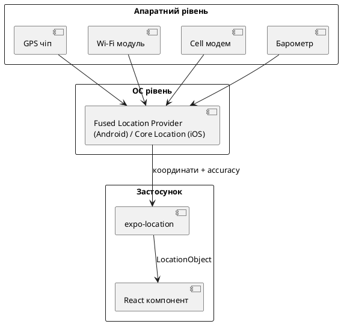
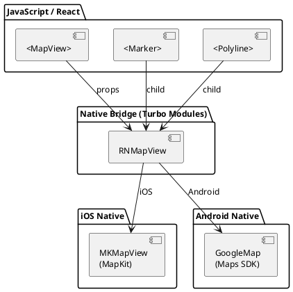
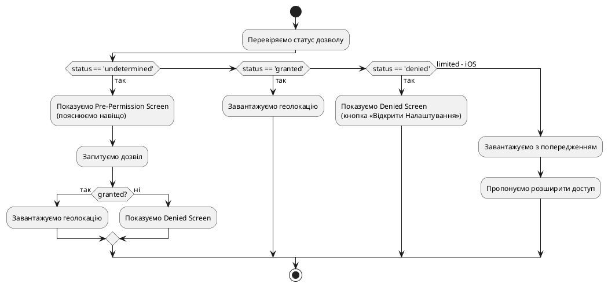
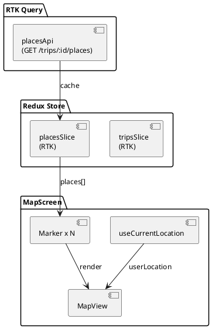

# Карти та геолокація

## Відкриття: коли застосунок знає, де ти знаходишся

Уявіть застосунок для подорожей. Ви відкриваєте список готелів — і одразу бачите, які з них поруч. Ви додаєте точку маршруту — і на карті з'являється маркер саме там, де ви стоїте. Це не магія, а GPS і правильно написаний код.

Але за цією простотою стоїть ціла система:

- **GPS-чіп** у телефоні постійно слухає сигнали супутників і обчислює координати з точністю до кількох метрів.
- **Операційна система** обгортає сирі дані в API і захищає їх системою дозволів — адже місцезнаходження є одним з найчутливіших видів персональних даних.
- **React Native** отримує координати через `expo-location` і передає їх у компонент карти.
- **react-native-maps** рендерить тайли від Apple Maps або Google Maps та малює маркери поверх них.

У цій статті ми пройдемо весь шлях: від теорії роботи GPS і системи дозволів — до побудови **міні-проєкту «Моя точка»**, де застосунок запитує дозвіл, показує поточне місцезнаходження на карті та дозволяє додати власний кастомний маркер.

::note
**Що потрібно знати заздалегідь:** ця стаття передбачає знайомство з Expo Router, хуками `useState`/`useEffect` та основами React Native. Рекомендується також прочитати попередній розділ про камеру та медіа, оскільки система дозволів тут схожа.
::

---

## Як працює геолокація: теорія

### Джерела координат

Сучасний смартфон не покладається виключно на GPS. Він використовує **кілька джерел** і комбінує їх для отримання максимально точного і швидкого результату:

::card-group

::card{title="GPS (Global Positioning System)" icon="i-lucide-satellite"}

- Приймає сигнали від **24–31 супутника** на орбіті висотою ~20 000 км.
- Точність: **3–5 метрів** у відкритому просторі.
- Недоліки: повільний «холодний старт» (до 30–60 с), погано працює в приміщеннях і між хмарочосами.
- Витрачає **найбільше заряду** батареї.

::

::card{title="Wi-Fi Positioning" icon="i-lucide-wifi"}

- Телефон сканує видимі Wi-Fi точки і звіряє їх MAC-адреси з глобальною базою даних.
- Точність: **10–40 метрів**.
- Працює навіть без підключення до мережі — достатньо сканування.
- Дуже швидкий результат, менше витрат батареї.

::

::card{title="Cell Tower Triangulation" icon="i-lucide-radio-tower"}

- Визначає позицію за відстанями до кількох вишок стільникового зв'язку.
- Точність: **100–1000 метрів** (залежить від щільності вишок).
- Завжди доступне там, де є мобільний сигнал.
- Мінімальні витрати заряду.

::

::card{title="Барометр (допоміжно)" icon="i-lucide-gauge"}

- Вимірює атмосферний тиск для визначення **поверху** в будівлі.
- Не є самостійним джерелом координат, але допомагає уточнити вертикальне положення.
- Наявний у більшості флагманів.

::

::

### Що таке Fused Location Provider

Операційні системи не просто передають дані з кожного джерела окремо — вони використовують **Fused Location Provider** (Android) або **Core Location** (iOS). Це системний сервіс, який автоматично вибирає найкраще джерело залежно від ситуації:

::plant-uml



::

Ця архітектура пояснює, чому `expo-location` не звертається до GPS безпосередньо — він спілкується з системним сервісом, а той вже вирішує, звідки брати дані.

### Точність і поле accuracy

Кожен результат геолокації приходить разом з полем `accuracy` — радіусом у метрах, всередині якого знаходиться реальне місцезнаходження з імовірністю ~68%. Чим менше число — тим точніше:

| Значення `accuracy` | Джерело | Типове використання |
|---|---|---|
| 3–10 м | GPS | Навігація по вулиці |
| 10–50 м | GPS + Wi-Fi | Знайти найближче кафе |
| 50–200 м | Wi-Fi | Визначити район міста |
| 200–2000 м | Cell towers | Грубе місцезнаходження |

::tip
Завжди показуйте або враховуйте `accuracy` у своєму UX. Маркер на карті з `accuracy: 500` не варто відображати на рівні вулиці — краще злегка зменшити масштаб або показати коло невизначеності навколо маркера.
::

---

## Дозволи на геолокацію

### Чому геолокація — найчутливіший дозвіл

Місцезнаходження розкриває про людину набагато більше, ніж здається: де вона живе, де працює, які церкви, лікарні або клуби відвідує. Тому Apple і Google приділяють цьому дозволу особливу увагу і з часом лише посилюють вимоги.

Геолокаційний дозвіл — єдиний, для якого iOS показує **два окремих діалоги**: спочатку «Поки відкритий», і лише потім, якщо потрібно, «Завжди».

### iOS: три рівні доступу

На iOS існує три принципово різних рівні дозволу на геолокацію:

::card-group

::card{title="When In Use (WIU)" icon="i-lucide-map-pin"}

Застосунок може отримувати координати **лише поки відкритий** (active або background з entitlement). Це стандартний рівень для більшості застосунків — навігаторів, пошуку кафе, доставки.

Ключ у `Info.plist`: `NSLocationWhenInUseUsageDescription`

::

::card{title="Always (Background)" icon="i-lucide-clock"}

Застосунок може отримувати координати **навіть у фоні**. Потрібен для трекерів маршруту, Uber, фітнес-застосунків.

Ключ: `NSLocationAlwaysAndWhenInUseUsageDescription`. Apple ретельніше перевіряє такі застосунки при ревью.

::

::card{title="Precise vs Approximate (iOS 14+)" icon="i-lucide-crosshair"}

Починаючи з iOS 14 користувач може надати **наближене** місцезнаходження (Approximate Location). В такому випадку `accuracy` може бути кілька кілометрів. Застосунок повинен коректно обробляти цей сценарій.

::

::

### Android: еволюція дозволів

Android зазнав кількох суттєвих змін у системі дозволів:

| Версія Android | Що змінилось |
|---|---|
| До 6.0 | Всі дозволи надавались при встановленні, без runtime-запитів |
| 6.0+ | Runtime permissions — запит у момент першого використання |
| 10+ | Background location потребує окремого дозволу `ACCESS_BACKGROUND_LOCATION` |
| 11+ | Система може автоматично **скидати** дозволи застосунків, якими не користуються |
| 12+ | Обов'язкова точна локація за замовчуванням |

На Android є два рівні точності:

::field-group

::field{name="ACCESS_FINE_LOCATION" type="permission"}
Доступ до GPS і Wi-Fi позиціонування. Точність до кількох метрів. Потрібен для більшості застосунків з картами.
::

::field{name="ACCESS_COARSE_LOCATION" type="permission"}
Доступ лише до Cell tower та Wi-Fi (без GPS). Точність 100–2000 м. Достатньо для приблизного визначення міста або району.
::

::field{name="ACCESS_BACKGROUND_LOCATION" type="permission"}
Доступ до геолокації у фоновому режимі. Починаючи з Android 11 — **окремий рядок у дозволах**, не можна запросити разом з основними.
::

::


---

## Встановлення та налаштування

### Необхідні пакети

Для роботи з геолокацією і картами нам потрібні два ключових пакети:

::code-group

```bash [expo install]
npx expo install expo-location react-native-maps
```

```bash [npm]
npm install expo-location react-native-maps
```

::

- **`expo-location`** — Expo-обгортка над нативними API геолокації (Core Location / FLP). Надає хуки, статичні методи і підтримку фонового трекінгу.
- **`react-native-maps`** — компонент `<MapView>` і набір дочірніх компонентів (`<Marker>`, `<Polyline>`, `<Circle>` тощо). Використовує Apple Maps на iOS і Google Maps на Android.

::warning
`react-native-maps` на Android потребує API ключа Google Maps. Без нього карта відображатиметься сірою сіткою. Детально про отримання ключа — далі у розділі про налаштування.
::

### Конфігурація app.json / app.config.js

Для коректної роботи потрібно додати плагіни і описи дозволів:

```json [app.json]
{
  "expo": {
    "plugins": [
      [
        "expo-location",
        {
          "locationAlwaysAndWhenInUsePermission": "Застосунок використовує ваше місцезнаходження для показу вашої позиції на карті.",
          "locationWhenInUsePermission": "Застосунок використовує ваше місцезнаходження для показу вашої позиції на карті.",
          "isIosBackgroundLocationEnabled": false,
          "isAndroidBackgroundLocationEnabled": false
        }
      ]
    ],
    "android": {
      "config": {
        "googleMaps": {
          "apiKey": "YOUR_GOOGLE_MAPS_API_KEY"
        }
      }
    }
  }
}
```

::note
Рядки `locationWhenInUsePermission` та `locationAlwaysAndWhenInUsePermission` — це текст, який iOS покаже у системному діалозі поруч з назвою вашого застосунку. Пишіть їх зрозуміло і чесно: Apple відхиляє застосунки з розмитими описами причин.
::

### Отримання Google Maps API Key

Для Android Maps потрібен ключ з Google Cloud Console:

::steps

### Відкрити Google Cloud Console

Перейдіть на [console.cloud.google.com](https://console.cloud.google.com), створіть або оберіть проєкт.

### Увімкнути Maps SDK for Android

У розділі «APIs & Services» → «Library» знайдіть **Maps SDK for Android** і увімкніть його.

### Створити API ключ

«APIs & Services» → «Credentials» → «Create Credentials» → «API key». Скопіюйте отриманий ключ.

### Обмежити ключ (важливо!)

Натисніть «Edit API key», додайте обмеження за пакетним ім'ям застосунку (`applicationRestrictions`) і виберіть тільки Maps SDK. Без обмежень ключ небезпечно публікувати у репозиторії.

### Додати ключ у app.json

Вставте ключ у `expo.android.config.googleMaps.apiKey`. У реальних проєктах зберігайте його в `.env` файлі.

::

---

## expo-location: повний API

### Перевірка і запит дозволів

Перш ніж запитати координати — перевіряємо статус і при потребі просимо дозвіл:

```ts
import * as Location from 'expo-location';

// Перевірити поточний статус
const { status } = await Location.getForegroundPermissionsAsync();

// Запитати дозвіл (показує системний діалог)
const { status: newStatus } = await Location.requestForegroundPermissionsAsync();

if (newStatus !== 'granted') {
  // Обробляємо відмову
}
```

Для фонового трекінгу:

```ts
const { status } = await Location.requestBackgroundPermissionsAsync();
```

### LocationObject: що повертає expo-location

Кожен виклик геолокаційних методів повертає `LocationObject`. Розберемо його повністю:

::field-group

::field{name="coords.latitude" type="number"}
Широта у десятковому форматі. Діапазон: -90 до +90. Позитивні значення — Північна півкуля.
::

::field{name="coords.longitude" type="number"}
Довгота у десятковому форматі. Діапазон: -180 до +180. Позитивні значення — Східна півкуля.
::

::field{name="coords.accuracy" type="number | null"}
Горизонтальна точність у метрах. Радіус, всередині якого з імовірністю 68% знаходиться реальна позиція. Може бути `null`, якщо дані недоступні.
::

::field{name="coords.altitude" type="number | null"}
Висота над рівнем моря в метрах. На пристроях без барометра — значення від GPS, менш точне.
::

::field{name="coords.altitudeAccuracy" type="number | null"}
Точність висоти у метрах. Зазвичай значно гірша за горизонтальну точність.
::

::field{name="coords.heading" type="number | null"}
Напрямок руху у градусах (0–360, де 0/360 = північ, 90 = схід). Доступний лише під час руху.
::

::field{name="coords.speed" type="number | null"}
Швидкість руху у метрах за секунду. 1 м/с ≈ 3.6 км/год. `null` — якщо пристрій нерухомий або дані недоступні.
::

::field{name="timestamp" type="number"}
Unix timestamp у мілісекундах. Час отримання координат. Використовуйте для перевірки «свіжості» даних і для анімацій.
::

::

### Одноразове отримання координат

Метод `getCurrentPositionAsync` повертає актуальні координати один раз:

```ts
const location = await Location.getCurrentPositionAsync({
  accuracy: Location.Accuracy.High,
});

console.log(location.coords.latitude, location.coords.longitude);
```

### Рівні точності: Accuracy enum

Точність визначає, яке джерело даних буде використано і скільки часу та заряду витратить запит:

::field-group

::field{name="Location.Accuracy.Lowest" type="enum — 1"}
Відповідає 3000 м. Використовує лише cell towers. Найшвидший, мінімальні витрати батареї. Підходить для грубого геофенсингу.
::

::field{name="Location.Accuracy.Low" type="enum — 2"}
Відповідає 1000 м. Cell towers + Wi-Fi (без GPS). Прийнятний для визначення міста.
::

::field{name="Location.Accuracy.Balanced" type="enum — 3"}
Відповідає ~100 м. Wi-Fi позиціонування. Хороший баланс між швидкістю і точністю. **Дефолтний рівень.**
::

::field{name="Location.Accuracy.High" type="enum — 4"}
Відповідає ~10 м. GPS + Wi-Fi. Підходить для карт і навігації.
::

::field{name="Location.Accuracy.Highest" type="enum — 5"}
Максимальна точність GPS. Повільний (до 30 с при «холодному» старті), максимальні витрати батареї.
::

::field{name="Location.Accuracy.BestForNavigation" type="enum — 6"}
Аналогічний `Highest`, але додатково використовує дані акселерометра для зменшення затримки при русі. Для навігаторів реального часу.
::

::

### Постійне відстеження координат

Метод `watchPositionAsync` підписується на оновлення і викликає колбек при кожній зміні позиції:

```ts
const subscription = await Location.watchPositionAsync(
  {
    accuracy: Location.Accuracy.High,
    timeInterval: 5000,   // мінімальний інтервал між оновленнями (мс)
    distanceInterval: 10, // мінімальна відстань для нового оновлення (м)
  },
  (location) => {
    console.log('Нова позиція:', location.coords);
  }
);

// Обов'язково відписуємось при розмонтуванні компонента:
// subscription.remove();
```

::caution
`watchPositionAsync` повертає підписку, яку **обов'язково** потрібно видалити при розмонтуванні компонента через `subscription.remove()`. Якщо цього не зробити — GPS продовжить активно працювати навіть після закриття екрана, швидко розряджаючи батарею.
::


---

## react-native-maps: компонент карти

### Архітектура бібліотеки

`react-native-maps` — це React Native bridge над нативними картами. На iOS він використовує **MapKit** (Apple Maps), на Android — **Google Maps SDK**. Це означає, що:

- Карта рендериться **нативно** — не через WebView, не через Canvas. Продуктивність та плавність — на рівні нативних застосунків.
- Стиль карти (кольори доріг, шрифти тощо) визначається самим Apple/Google і синхронізується з системою.
- Тайли завантажуються із CDN Apple або Google залежно від платформи.

::plant-uml



::

### Базове використання MapView

Мінімальний приклад:

```tsx
import MapView from 'react-native-maps';
import { StyleSheet } from 'react-native';

export default function MapScreen() {
  return (
    <MapView
      style={styles.map}
      initialRegion={{
        latitude: 50.4501,    // Київ
        longitude: 30.5234,
        latitudeDelta: 0.05,  // "zoom" по вертикалі
        longitudeDelta: 0.05, // "zoom" по горизонталі
      }}
    />
  );
}

const styles = StyleSheet.create({
  map: {
    flex: 1, // займає весь екран
  },
});
```

::warning
`MapView` **обов'язково** потребує явно заданих розмірів. `flex: 1` — найзручніший спосіб. Без розмірів карта не відобразиться.
::

### Ключові props MapView

::field-group

::field{name="initialRegion" type="Region"}
Початковий регіон карти при першому рендері. Після цього карта рухається незалежно від React-стейту. Тип `Region`: `{ latitude, longitude, latitudeDelta, longitudeDelta }`.
::

::field{name="region" type="Region"}
Контрольований регіон. Якщо передати — карта **завжди** повертається до цього регіону при зміні значення. Зручно для програмного переміщення камери.
::

::field{name="onRegionChangeComplete" type="(region: Region) => void"}
Колбек, що викликається після завершення жесту переміщення/зуму. Використовується для збереження стану регіону або завантаження нових даних.
::

::field{name="showsUserLocation" type="boolean"}
Відображає синю точку поточного місцезнаходження. MapKit / Google Maps самостійно запитують і оновлюють позицію — вам не потрібно передавати координати вручну.
::

::field{name="followsUserLocation" type="boolean (iOS only)"}
Карта автоматично центрується на користувача при зміні позиції. Аналог режиму навігації.
::

::field{name="mapType" type="string"}
Тип відображення: `'standard'` (дефолт), `'satellite'`, `'hybrid'`, `'terrain'` (тільки Android), `'mutedStandard'` (тільки iOS).
::

::field{name="onPress" type="(event: MapPressEvent) => void"}
Викликається при тапі по карті. `event.nativeEvent.coordinate` містить координати точки дотику — ідеально для додавання маркерів.
::

::field{name="onLongPress" type="(event: MapPressEvent) => void"}
Аналог `onPress`, але для довгого натискання. Часто використовується для «додати точку маршруту».
::

::field{name="zoomEnabled" type="boolean"}
Дозволяє/забороняє зум жестами. Дефолт: `true`.
::

::field{name="scrollEnabled" type="boolean"}
Дозволяє/забороняє переміщення карти. Дефолт: `true`.
::

::

### Розуміння Region і latitudeDelta / longitudeDelta

Концепція `delta` — одна з найпоширеніших точок плутанини для новачків. Це не координати, а **розмір видимої області**:

- `latitudeDelta` — кількість градусів широти, що поміщаються у висоту видимого прямокутника.
- `longitudeDelta` — кількість градусів довготи по ширині.

Один градус широти ≈ 111 км. Тому:

| latitudeDelta | Масштаб |
|---|---|
| 0.005 | Квартал (~0.5 км) |
| 0.05 | Район (~5 км) |
| 0.5 | Ціле місто |
| 5 | Область / кілька міст |
| 50 | Половина країни |

::tip
`longitudeDelta` зазвичай ставлять рівним або близьким до `latitudeDelta`. Різниця виникає через те, що ширина одного градуса довготи зменшується ближче до полюсів (на екваторі 1° ≈ 111 км, на широті 50° ≈ 71 км).
::

### Програмне керування камерою

Для анімованого переміщення камери використовують `ref` і метод `animateToRegion`:

```tsx
import MapView, { Region } from 'react-native-maps';
import { useRef } from 'react';

const mapRef = useRef<MapView>(null);

// Анімований перехід до Львова:
const goToLviv = () => {
  mapRef.current?.animateToRegion(
    {
      latitude: 49.8397,
      longitude: 24.0297,
      latitudeDelta: 0.05,
      longitudeDelta: 0.05,
    },
    1000 // тривалість анімації у мс
  );
};

// У JSX:
<MapView ref={mapRef} ... />
```

Також доступний метод `animateCamera` з більш точним контролем:

```ts
mapRef.current?.animateCamera({
  center: { latitude: 49.8397, longitude: 24.0297 },
  zoom: 14,   // тільки Android
  pitch: 45,  // кут нахилу (3D вид)
  heading: 90, // поворот (0 = північ)
  altitude: 1000, // висота камери (iOS)
}, { duration: 1000 });
```


---

## Маркери та накладення на карту

### Компонент Marker

`<Marker>` — основний спосіб позначити точку на карті. Він є дочірнім компонентом `<MapView>`:

```tsx
import MapView, { Marker } from 'react-native-maps';

<MapView style={{ flex: 1 }} initialRegion={...}>
  <Marker
    coordinate={{ latitude: 50.4501, longitude: 30.5234 }}
    title="Київ"
    description="Столиця України"
  />
</MapView>
```

### Всі props компонента Marker

::field-group

::field{name="coordinate" type="LatLng" required}
Обов'язковий. `{ latitude: number, longitude: number }` — геопозиція маркера.
::

::field{name="title" type="string"}
Заголовок callout-балона, що з'являється при тапі на маркер.
::

::field{name="description" type="string"}
Підзаголовок callout-балона. Відображається під `title`.
::

::field{name="image" type="ImageSource"}
Кастомне зображення для маркера замість стандартної кнопки. Передається як `require('./pin.png')` або `{ uri: '...' }`.
::

::field{name="pinColor" type="string"}
Колір стандартної кнопки-маркера. Прийнятні CSS-кольори і named colors: `'red'`, `'#FF6B6B'`. Тільки для дефолтного маркера.
::

::field{name="anchor" type="{ x: number, y: number }"}
Точка прив'язки зображення до координати. За замовчуванням `{ x: 0.5, y: 1.0 }` — нижній центр. `{ x: 0.5, y: 0.5 }` — центр зображення.
::

::field{name="draggable" type="boolean"}
Дозволяє перетягувати маркер пальцем. При відпусканні спрацьовує `onDragEnd`.
::

::field{name="onDragEnd" type="(event: MarkerDragEvent) => void"}
Колбек після закінчення перетягування. `event.nativeEvent.coordinate` — нові координати.
::

::field{name="onPress" type="(event: MarkerPressEvent) => void"}
Спрацьовує при тапі на маркер (не на callout, а на сам маркер).
::

::field{name="onCalloutPress" type="() => void"}
Спрацьовує при тапі на callout-балон.
::

::field{name="tracksViewChanges" type="boolean"}
Чи відстежувати зміни кастомного view маркера. За замовчуванням `true`. Якщо маркер статичний — **виставте `false`** для значного підвищення продуктивності.
::

::

### Кастомний маркер через children

Найпотужніший спосіб кастомізації — передати `children` у `<Marker>`. Це може бути будь-який React Native View:

```tsx
import { View, Text, StyleSheet } from 'react-native';
import { Marker } from 'react-native-maps';

function CustomMarker({ label, color }: { label: string; color: string }) {
  return (
    <Marker
      coordinate={{ latitude: 50.4501, longitude: 30.5234 }}
      tracksViewChanges={false} // важливо для статичних маркерів!
    >
      <View style={[styles.marker, { backgroundColor: color }]}>
        <Text style={styles.label}>{label}</Text>
      </View>
    </Marker>
  );
}

const styles = StyleSheet.create({
  marker: {
    paddingHorizontal: 10,
    paddingVertical: 6,
    borderRadius: 20,
    alignItems: 'center',
  },
  label: {
    color: 'white',
    fontWeight: '700',
    fontSize: 13,
  },
});
```

::tip
`tracksViewChanges={false}` — критично важливий prop для кастомних маркерів. Якщо він `true` (дефолт), react-native-maps перемальовує нативний знімок view при кожному рендері. Це може призвести до значного падіння FPS при десятках маркерів.
::

### Кастомний Callout

Замість стандартного балона з `title`/`description` можна відобразити повністю кастомний UI:

```tsx
import { Callout } from 'react-native-maps';

<Marker coordinate={...}>
  <Callout tooltip>
    <View style={styles.callout}>
      <Text style={styles.calloutTitle}>🏨 Готель «Дніпро»</Text>
      <Text style={styles.calloutRating}>⭐ 4.5 · 128 відгуків</Text>
      <Text style={styles.calloutPrice}>від 1800 грн/ніч</Text>
    </View>
  </Callout>
</Marker>
```

Пропс `tooltip` прибирає стандартну рамку callout і дає повний контроль над стилями.

### Polyline — маршрут на карті

`<Polyline>` малює ламану лінію між набором координат. Ідеально для маршрутів:

```tsx
import { Polyline } from 'react-native-maps';

<Polyline
  coordinates={[
    { latitude: 50.4501, longitude: 30.5234 }, // Київ
    { latitude: 49.8397, longitude: 24.0297 }, // Львів
    { latitude: 48.9226, longitude: 24.7111 }, // Івано-Франківськ
  ]}
  strokeColor="#3B82F6"
  strokeWidth={4}
  lineDashPattern={[10, 5]} // штрихова лінія: 10px лінія, 5px пауза
/>
```

::field-group

::field{name="coordinates" type="LatLng[]" required}
Масив координат вузлів ламаної.
::

::field{name="strokeColor" type="string"}
Колір лінії. CSS-формат або named color.
::

::field{name="strokeWidth" type="number"}
Товщина лінії у пікселях логічних (not dp/pt, а логічних).
::

::field{name="lineDashPattern" type="number[]"}
Патерн штриховки: чергування довжин штрихів і проміжків. `[10, 5]` — 10 px лінія, 5 px пробіл.
::

::field{name="geodesic" type="boolean"}
Якщо `true` — лінія малюється по поверхні сфери (геодезична), що виглядає природніше на великих відстанях.
::

::

### Circle — радіус/зона

`<Circle>` малює коло навколо точки. Зручно для відображення зони доставки, радіуса пошуку або точності GPS:

```tsx
import { Circle } from 'react-native-maps';

<Circle
  center={{ latitude: 50.4501, longitude: 30.5234 }}
  radius={500}           // радіус у метрах
  fillColor="rgba(59, 130, 246, 0.2)"   // напівпрозоре заповнення
  strokeColor="rgba(59, 130, 246, 0.8)" // рамка
  strokeWidth={2}
/>
```

Типовий сценарій — показати коло точності GPS поруч з маркером користувача:

```tsx
// Після отримання location:
<Circle
  center={{ latitude: location.coords.latitude, longitude: location.coords.longitude }}
  radius={location.coords.accuracy ?? 50}
  fillColor="rgba(59, 130, 246, 0.1)"
  strokeColor="rgba(59, 130, 246, 0.5)"
  strokeWidth={1}
/>
```


---

## Обробка відмови дозволів: denied UX

### Чому це критично

Відмова у дозволі — один з найпоширеніших сценаріїв, але і один з найчастіше ігнорованих розробниками. Типова помилка: застосунок просто «замовкає» або показує порожній екран без жодного пояснення. Це фруструє користувача і він йде.

Правильна стратегія — трирівнева:

::plant-uml



::

### Pre-Permission Screen

Найкраща практика — перед системним діалогом показати **власний екран-пояснення**. Дослідження Apple показали, що коли застосунок пояснює причину перед запитом, конверсія «прийняти дозвіл» зростає на 20–40%.

```tsx
// components/LocationPermissionRequest.tsx
import { View, Text, Pressable, StyleSheet } from 'react-native';

interface Props {
  onRequest: () => void;
}

export function LocationPermissionRequest({ onRequest }: Props) {
  return (
    <View style={styles.container}>
      <Text style={styles.icon}>📍</Text>
      <Text style={styles.title}>Де ви знаходитесь?</Text>
      <Text style={styles.description}>
        Застосунок використовує ваше місцезнаходження, щоб показати
        найближчі місця та відстань до них. Ми не зберігаємо і не
        передаємо ваші координати третім особам.
      </Text>
      <Pressable style={styles.button} onPress={onRequest}>
        <Text style={styles.buttonText}>Дозволити доступ</Text>
      </Pressable>
    </View>
  );
}
```

### Denied Screen

Якщо користувач відмовив — ОС більше **не покаже** системний діалог. Єдиний вихід — направити до системних Налаштувань:

```tsx
import { Linking } from 'react-native';

export function LocationDenied() {
  const openSettings = () => {
    Linking.openSettings(); // відкриває системні налаштування застосунку
  };

  return (
    <View style={styles.container}>
      <Text style={styles.icon}>🔒</Text>
      <Text style={styles.title}>Доступ до геолокації заблоковано</Text>
      <Text style={styles.description}>
        Щоб бачити свою позицію на карті, дозвольте доступ до геолокації
        у налаштуваннях пристрою: Налаштування → Застосунки →
        [Назва застосунку] → Геолокація.
      </Text>
      <Pressable style={styles.button} onPress={openSettings}>
        <Text style={styles.buttonText}>Відкрити Налаштування</Text>
      </Pressable>
    </View>
  );
}
```

::note
`Linking.openSettings()` — крос-платформний метод React Native, що відкриває системну сторінку налаштувань саме вашого застосунку. На iOS це буде `Settings.app → [App Name]`, на Android — `App Info`.
::

### Хук useLocationPermission: зводимо все разом

Найчистіший підхід — ізолювати логіку дозволів в кастомний хук:

```ts
// hooks/useLocationPermission.ts
import { useState, useEffect } from 'react';
import * as Location from 'expo-location';

type PermissionState = 'loading' | 'undetermined' | 'granted' | 'denied' | 'limited';

export function useLocationPermission() {
  const [status, setStatus] = useState<PermissionState>('loading');

  useEffect(() => {
    checkPermission();
  }, []);

  const checkPermission = async () => {
    const { status } = await Location.getForegroundPermissionsAsync();
    setStatus(status as PermissionState);
  };

  const requestPermission = async () => {
    setStatus('loading');
    const { status } = await Location.requestForegroundPermissionsAsync();
    setStatus(status as PermissionState);
    return status === 'granted';
  };

  return { status, requestPermission, recheckPermission: checkPermission };
}
```

Використання у компоненті:

```tsx
import { useLocationPermission } from '@/hooks/useLocationPermission';
import { LocationPermissionRequest } from '@/components/LocationPermissionRequest';
import { LocationDenied } from '@/components/LocationDenied';

export default function MapScreen() {
  const { status, requestPermission } = useLocationPermission();

  if (status === 'loading') return <LoadingScreen />;
  if (status === 'undetermined') {
    return <LocationPermissionRequest onRequest={requestPermission} />;
  }
  if (status === 'denied') return <LocationDenied />;

  return <MapContent />;
}
```

### Повторна перевірка при повернені з Налаштувань

Якщо користувач перейшов у Налаштування і там дозволив геолокацію, а потім повернувся у застосунок — нам потрібно знову перевірити статус. Для цього використовуємо `AppState`:

```ts
import { useEffect } from 'react';
import { AppState } from 'react-native';

useEffect(() => {
  const subscription = AppState.addEventListener('change', (nextState) => {
    if (nextState === 'active') {
      // Застосунок повернувся на передній план — перевіряємо дозвіл
      recheckPermission();
    }
  });

  return () => subscription.remove();
}, [recheckPermission]);
```

Це патерн, який варто використовувати для **будь-яких** дозволів (камера, мікрофон, геолокація) — він значно покращує UX і знижує кількість підтримки від «у мене не працює після налаштувань».


---

## Геокодування та зворотнє геокодування

### Що таке геокодування

Геокодування — це перетворення між текстовою адресою і координатами:

- **Geocoding (пряме):** адреса → координати. «вул. Хрещатик 1, Київ» → `{ latitude: 50.4463, longitude: 30.5215 }`
- **Reverse Geocoding (зворотнє):** координати → адреса. `{ latitude: 50.4501, longitude: 30.5234 }` → «майдан Незалежності, Київ»

`expo-location` надає обидва методи. Вони використовують нативні геокодери: **Core Location** на iOS і **Geocoder** від Google на Android. Жодних додаткових API ключів для базового використання не потрібно (на відміну від Google Geocoding API).

### Reverse Geocoding: координати → адреса

Найчастіший сценарій — «де я знаходжусь?» після отримання координат:

```ts
import * as Location from 'expo-location';

const reverseGeocode = async (latitude: number, longitude: number) => {
  const results = await Location.reverseGeocodeAsync({ latitude, longitude });

  if (results.length > 0) {
    const place = results[0];
    console.log(place);
    // {
    //   city: 'Київ',
    //   country: 'Україна',
    //   district: 'Печерський район',
    //   isoCountryCode: 'UA',
    //   name: 'Хрещатик',  // назва вулиці або місця
    //   postalCode: '01001',
    //   region: 'місто Київ',
    //   street: 'вулиця Хрещатик',
    //   streetNumber: '1',
    //   subregion: 'Печерський район',
    //   timezone: 'Europe/Kiev',
    // }
  }
};
```

### LocationGeocodedAddress: поля результату

::field-group

::field{name="name" type="string | null"}
Назва місця (назва будівлі, магазину або вулиці). Може бути `null` для координат посеред поля.
::

::field{name="street" type="string | null"}
Повна назва вулиці: «вулиця Хрещатик».
::

::field{name="streetNumber" type="string | null"}
Номер будинку: «22А».
::

::field{name="city" type="string | null"}
Місто.
::

::field{name="district" type="string | null"}
Район міста. Корисно для великих міст.
::

::field{name="region" type="string | null"}
Область або адміністративний регіон.
::

::field{name="country" type="string | null"}
Назва країни.
::

::field{name="isoCountryCode" type="string | null"}
Двохлітерний ISO код країни: `'UA'`, `'PL'`, `'DE'`.
::

::field{name="postalCode" type="string | null"}
Поштовий індекс.
::

::field{name="timezone" type="string | null"}
Часовий пояс у форматі IANA: `'Europe/Kyiv'`. Дуже зручно для застосунків з подіями.
::

::

### Geocoding: адреса → координати

```ts
const geocode = async (address: string) => {
  const results = await Location.geocodeAsync(address);

  if (results.length > 0) {
    const { latitude, longitude, accuracy } = results[0];
    console.log({ latitude, longitude, accuracy });
  }
};

// Використання:
await geocode('Майдан Незалежності, Київ');
// { latitude: 50.4501, longitude: 30.5234, accuracy: ... }
```

::caution
Метод `geocodeAsync` на Android використовує Geocoder від Google, який **потребує з'єднання з інтернетом**. На iOS Core Location може використовувати локальний кеш. Завжди обробляйте `try/catch` і стан відсутності мережі.
::

### Практичний приклад: адресний рядок на карті

Типовий патерн — показувати поточну адресу у верхній частині екрана:

```tsx
import { useState, useEffect } from 'react';
import * as Location from 'expo-location';

function useCurrentAddress(location: Location.LocationObject | null) {
  const [address, setAddress] = useState<string>('Визначення адреси...');

  useEffect(() => {
    if (!location) return;

    const { latitude, longitude } = location.coords;
    Location.reverseGeocodeAsync({ latitude, longitude })
      .then((results) => {
        if (results[0]) {
          const { street, streetNumber, city } = results[0];
          const parts = [streetNumber, street, city].filter(Boolean);
          setAddress(parts.join(', '));
        }
      })
      .catch(() => setAddress('Адреса недоступна'));
  }, [location]);

  return address;
}
```

---

## Хук useCurrentLocation: повна реалізація

Зібравши все разом — дозволи, отримання координат і підписку на оновлення — отримаємо повноцінний хук:

```ts
// hooks/useCurrentLocation.ts
import { useState, useEffect, useRef } from 'react';
import * as Location from 'expo-location';

interface LocationState {
  location: Location.LocationObject | null;
  error: string | null;
  loading: boolean;
}

export function useCurrentLocation(watch = false) {
  const [state, setState] = useState<LocationState>({
    location: null,
    error: null,
    loading: true,
  });

  const subscriptionRef = useRef<Location.LocationSubscription | null>(null);

  useEffect(() => {
    let mounted = true;

    const startLocation = async () => {
      const { status } = await Location.getForegroundPermissionsAsync();
      if (status !== 'granted') {
        if (mounted) {
          setState({ location: null, error: 'Дозвіл не надано', loading: false });
        }
        return;
      }

      if (watch) {
        // Підписуємось на оновлення
        const sub = await Location.watchPositionAsync(
          { accuracy: Location.Accuracy.High, distanceInterval: 5 },
          (loc) => {
            if (mounted) {
              setState({ location: loc, error: null, loading: false });
            }
          }
        );
        subscriptionRef.current = sub;
      } else {
        // Одноразове отримання
        const loc = await Location.getCurrentPositionAsync({
          accuracy: Location.Accuracy.High,
        });
        if (mounted) {
          setState({ location: loc, error: null, loading: false });
        }
      }
    };

    startLocation().catch((err) => {
      if (mounted) {
        setState({ location: null, error: err.message, loading: false });
      }
    });

    return () => {
      mounted = false;
      subscriptionRef.current?.remove();
    };
  }, [watch]);

  return state;
}
```


---

## Продуктивність та кластеризація маркерів

### Проблема: десятки маркерів на карті

Коли на карті більше 30–50 маркерів, починаються проблеми:

- **FPS падає** — кожен `<Marker>` є нативним view, що потребує ресурсів рендерингу.
- **Карта виглядає захаращеною** — маркери перекривають один одного і стають нечитабельними.
- **Тапи не потрапляють** — маленькі маркери на малому масштабі неможливо натиснути.

Вирішення — **кластеризація**: групування близьких маркерів в один кластер із числом.

### react-native-maps-super-cluster

Найпопулярніша бібліотека кластеризації для react-native-maps:

```bash
npx expo install react-native-maps-super-cluster
# або
npm install react-native-maps-super-cluster
```

Базове використання:

```tsx
import ClusteredMapView from 'react-native-maps-super-cluster';
import { Marker } from 'react-native-maps';

const data = places.map((place) => ({
  ...place,
  location: {
    latitude: place.latitude,
    longitude: place.longitude,
  },
}));

export function ClusteredMap() {
  return (
    <ClusteredMapView
      style={{ flex: 1 }}
      data={data}
      initialRegion={initialRegion}
      renderMarker={(item) => (
        <Marker
          key={item.id}
          coordinate={item.location}
          title={item.name}
          tracksViewChanges={false}
        />
      )}
      renderCluster={(cluster, onPress) => (
        <Marker
          coordinate={cluster.coordinate}
          onPress={onPress}
        >
          <View style={styles.cluster}>
            <Text style={styles.clusterText}>{cluster.pointCount}</Text>
          </View>
        </Marker>
      )}
    />
  );
}
```

### tracksViewChanges: головне правило продуктивності

Це найважливіший prop для продуктивності кастомних маркерів. Коли він `true` (дефолт):

1. React Native створює нативний знімок (snapshot) вашого React view.
2. При **кожному** ре-рендері батьківського компонента — знімок оновлюється.
3. Якщо маркерів 50, а батько рендерить 30 разів на секунду під час скролу — 50 × 30 = 1500 snapshot операцій у секунду.

Правило: **завжди `tracksViewChanges={false}`** для статичних маркерів. Якщо маркер має анімацію або динамічний вміст — переключайте prop тільки на час зміни:

```tsx
const [trackChanges, setTrackChanges] = useState(true);

const handleImageLoad = () => {
  // Зображення завантажилось — більше не відстежуємо
  setTrackChanges(false);
};

<Marker tracksViewChanges={trackChanges}>
  <Image onLoad={handleImageLoad} source={...} />
</Marker>
```

### Мемоізація маркерів

При великій кількості маркерів важливо **мемоізувати** кожен маркер через `useMemo` або `React.memo`, щоб уникнути зайвого ре-рендерингу:

```tsx
const MemoizedMarker = React.memo(({ place }: { place: Place }) => (
  <Marker
    coordinate={{ latitude: place.lat, longitude: place.lng }}
    title={place.name}
    tracksViewChanges={false}
  />
));

// У компоненті карти:
const markers = useMemo(
  () => places.map((place) => <MemoizedMarker key={place.id} place={place} />),
  [places]
);

<MapView ...>{markers}</MapView>
```

---

## Міні-проєкт: «Моя точка»

### Що будуємо

Екран з картою, який:

1. При відкритті перевіряє дозвіл на геолокацію.
2. Якщо дозволу немає — показує пояснення і кнопку запиту.
3. Якщо відмовлено — показує екран із кнопкою «Відкрити Налаштування».
4. Після отримання дозволу — завантажує поточне місцезнаходження і центрує карту.
5. Показує синій маркер «Я тут» і коло точності.
6. Дозволяє тапнути по карті, щоб додати кастомний маркер-«зірочку».

### Структура файлів

::code-tree

```tsx [app/(tabs)/map.tsx]
// Головний екран карти
```

```tsx [hooks/useLocationPermission.ts]
// Хук для дозволів
```

```tsx [hooks/useCurrentLocation.ts]
// Хук для координат
```

```tsx [components/map/LocationPermissionRequest.tsx]
// Pre-permission screen
```

```tsx [components/map/LocationDenied.tsx]
// Denied screen
```

```tsx [components/map/UserLocationMarker.tsx]
// Кастомний маркер користувача
```

```tsx [components/map/PinMarker.tsx]
// Кастомний маркер-зірочка
```

::

### Реалізація: UserLocationMarker

```tsx
// components/map/UserLocationMarker.tsx
import { View, StyleSheet } from 'react-native';
import { Marker, Circle } from 'react-native-maps';
import * as Location from 'expo-location';

interface Props {
  location: Location.LocationObject;
}

export function UserLocationMarker({ location }: Props) {
  const { latitude, longitude, accuracy } = location.coords;
  const coordinate = { latitude, longitude };

  return (
    <>
      {/* Коло точності */}
      <Circle
        center={coordinate}
        radius={accuracy ?? 20}
        fillColor="rgba(59, 130, 246, 0.1)"
        strokeColor="rgba(59, 130, 246, 0.4)"
        strokeWidth={1}
      />

      {/* Маркер позиції */}
      <Marker coordinate={coordinate} tracksViewChanges={false} anchor={{ x: 0.5, y: 0.5 }}>
        <View style={styles.outerRing}>
          <View style={styles.innerDot} />
        </View>
      </Marker>
    </>
  );
}

const styles = StyleSheet.create({
  outerRing: {
    width: 24,
    height: 24,
    borderRadius: 12,
    backgroundColor: 'rgba(59, 130, 246, 0.3)',
    borderWidth: 2,
    borderColor: '#3B82F6',
    alignItems: 'center',
    justifyContent: 'center',
  },
  innerDot: {
    width: 10,
    height: 10,
    borderRadius: 5,
    backgroundColor: '#3B82F6',
  },
});
```

### Реалізація: головний екран карти

```tsx
// app/(tabs)/map.tsx
import { useState, useRef, useCallback } from 'react';
import { View, StyleSheet, AppState } from 'react-native';
import MapView, { MapPressEvent, Region } from 'react-native-maps';
import * as Location from 'expo-location';

import { useLocationPermission } from '@/hooks/useLocationPermission';
import { useCurrentLocation } from '@/hooks/useCurrentLocation';
import { LocationPermissionRequest } from '@/components/map/LocationPermissionRequest';
import { LocationDenied } from '@/components/map/LocationDenied';
import { UserLocationMarker } from '@/components/map/UserLocationMarker';
import { PinMarker } from '@/components/map/PinMarker';

const KYIV_REGION: Region = {
  latitude: 50.4501,
  longitude: 30.5234,
  latitudeDelta: 0.05,
  longitudeDelta: 0.05,
};

interface Pin {
  id: string;
  coordinate: { latitude: number; longitude: number };
}

export default function MapScreen() {
  const mapRef = useRef<MapView>(null);
  const [pins, setPins] = useState<Pin[]>([]);
  const { status, requestPermission, recheckPermission } = useLocationPermission();
  const { location, loading } = useCurrentLocation();

  // Повторна перевірка при поверненні з Налаштувань
  useEffect(() => {
    const sub = AppState.addEventListener('change', (state) => {
      if (state === 'active') recheckPermission();
    });
    return () => sub.remove();
  }, [recheckPermission]);

  // Центруємо карту коли з'являються координати
  useEffect(() => {
    if (location && mapRef.current) {
      mapRef.current.animateToRegion({
        latitude: location.coords.latitude,
        longitude: location.coords.longitude,
        latitudeDelta: 0.01,
        longitudeDelta: 0.01,
      }, 800);
    }
  }, [location]);

  const handleMapPress = useCallback((event: MapPressEvent) => {
    const { coordinate } = event.nativeEvent;
    setPins((prev) => [
      ...prev,
      { id: Date.now().toString(), coordinate },
    ]);
  }, []);

  const removePin = useCallback((id: string) => {
    setPins((prev) => prev.filter((p) => p.id !== id));
  }, []);

  // Рендер залежно від статусу дозволу
  if (status === 'loading') return <View style={styles.container} />;
  if (status === 'undetermined') {
    return <LocationPermissionRequest onRequest={requestPermission} />;
  }
  if (status === 'denied') return <LocationDenied />;

  return (
    <View style={styles.container}>
      <MapView
        ref={mapRef}
        style={styles.map}
        initialRegion={KYIV_REGION}
        onPress={handleMapPress}
        showsCompass
        showsScale
      >
        {/* Маркер поточного місця */}
        {location && <UserLocationMarker location={location} />}

        {/* Кастомні піни */}
        {pins.map((pin) => (
          <PinMarker
            key={pin.id}
            coordinate={pin.coordinate}
            onRemove={() => removePin(pin.id)}
          />
        ))}
      </MapView>
    </View>
  );
}

const styles = StyleSheet.create({
  container: { flex: 1 },
  map: { flex: 1 },
});
```


### Реалізація: PinMarker

```tsx
// components/map/PinMarker.tsx
import { View, Text, Pressable, StyleSheet } from 'react-native';
import { Marker, Callout } from 'react-native-maps';

interface Props {
  coordinate: { latitude: number; longitude: number };
  onRemove: () => void;
}

export function PinMarker({ coordinate, onRemove }: Props) {
  return (
    <Marker coordinate={coordinate} tracksViewChanges={false} anchor={{ x: 0.5, y: 1.0 }}>
      {/* Кастомна зірочка */}
      <View style={styles.pin}>
        <Text style={styles.star}>⭐</Text>
      </View>

      {/* Callout з кнопкою видалення */}
      <Callout tooltip onPress={onRemove}>
        <View style={styles.callout}>
          <Text style={styles.calloutText}>Моя точка</Text>
          <Text style={styles.calloutDelete}>🗑 Видалити</Text>
        </View>
      </Callout>
    </Marker>
  );
}

const styles = StyleSheet.create({
  pin: {
    width: 36,
    height: 36,
    borderRadius: 18,
    backgroundColor: 'white',
    alignItems: 'center',
    justifyContent: 'center',
    shadowColor: '#000',
    shadowOpacity: 0.2,
    shadowRadius: 4,
    shadowOffset: { width: 0, height: 2 },
    elevation: 4,
  },
  star: { fontSize: 20 },
  callout: {
    backgroundColor: 'white',
    borderRadius: 12,
    padding: 12,
    minWidth: 140,
    alignItems: 'center',
    shadowColor: '#000',
    shadowOpacity: 0.15,
    shadowRadius: 8,
    elevation: 5,
  },
  calloutText: { fontWeight: '600', fontSize: 14, marginBottom: 6 },
  calloutDelete: { color: '#EF4444', fontSize: 13 },
});
```

### Як перевірити в Expo Go

`react-native-maps` є **вбудованим модулем** в Expo Go — він доступний без додаткових кроків:

::note
У Expo Go карта на Android завжди показує **Google Maps** (з ключем зі сховища Expo). На iOS — **Apple Maps**. Для власного ключа Google Maps на Android потрібен **Development Build** (`npx expo run:android`).
::

Для тестування геолокації у симуляторі:
- **iOS Simulator:** Features → Location → вибрати місто або задати Custom Location.
- **Android Emulator:** три крапки (Extended Controls) → Location → задати lat/lng вручну.

---

## Підключення до Nomad: feat: map of places in a trip

Якщо ви будуєте додаток **Nomad** (трекер подорожей), карта природно інтегрується в існуючий стек:

::plant-uml



::

Типова інтеграція — `placesApi.useGetPlacesQuery(tripId)` повертає масив місць з координатами, а ми рендеримо маркери:

```tsx
// Фрагмент інтеграції у MapScreen Nomad:
const { data: places } = placesApi.useGetPlacesQuery(tripId);

// У JSX:
{places?.map((place) => (
  <Marker
    key={place.id}
    coordinate={{ latitude: place.latitude, longitude: place.longitude }}
    title={place.name}
    tracksViewChanges={false}
  >
    <CategoryMarker category={place.category} />
  </Marker>
))}
```

Комміт у Nomad: `feat: map of places in a trip`.

---

## Поширені помилки та як їх уникнути

::accordion
::accordion-item{label="Карта сіра на Android" icon="i-lucide-circle-alert"}
Причина: не вказаний або недійсний Google Maps API Key. Перевірте `expo.android.config.googleMaps.apiKey` в `app.json` і переконайтесь, що Maps SDK for Android увімкнений у Google Cloud Console для цього ключа.
::
::accordion-item{label="MapView займає нульову висоту" icon="i-lucide-circle-alert"}
`<MapView>` без явних розмірів має нульову висоту. Завжди додавайте `style={{ flex: 1 }}` або конкретні `width`/`height`. Якщо карта у ScrollView — задайте фіксовану висоту.
::
::accordion-item{label="GPS не оновлюється після return із Settings" icon="i-lucide-circle-alert"}
Після надання дозволу в налаштуваннях статус не оновлюється автоматично. Додайте слухач `AppState` і перевіряйте дозвіл при переключенні застосунку у `'active'` стан.
::
::accordion-item{label="Витік пам'яті з watchPositionAsync" icon="i-lucide-circle-alert"}
Якщо не викликати `subscription.remove()` при розмонтуванні — GPS продовжить активно працювати. Завжди повертайте функцію cleanup з `useEffect` або зберігайте підписку у `ref`.
::
::accordion-item{label="tracksViewChanges не вимкнений → низький FPS" icon="i-lucide-circle-alert"}
Дефолтне значення `true` підходить тільки для маркерів з динамічним вмістом (анімації, завантаження зображень). Для статичних маркерів обов'язково `tracksViewChanges={false}`.
::
::accordion-item{label="iOS: дозвіл показано один раз і відмовлено" icon="i-lucide-circle-alert"}
iOS ніколи більше не покаже системний діалог після відмови. Якщо статус `'denied'` — єдиний вихід це `Linking.openSettings()`. Показуйте зрозуміле пояснення перед цим.
::
::

---

## Підсумок

У цьому розділі ми розібрали повний цикл роботи з геолокацією і картами у React Native:

::card-group

::card{title="Теорія GPS" icon="i-lucide-satellite"}

- Чотири джерела координат: GPS, Wi-Fi, Cell, барометр
- Fused Location Provider як системний агрегатор
- Поле `accuracy` і його значення для UX

::

::card{title="Дозволи" icon="i-lucide-shield"}

- iOS: WhenInUse / Always / Approximate
- Android: FINE / COARSE / BACKGROUND
- Pre-permission screen і Denied UX з `Linking.openSettings()`

::

::card{title="expo-location" icon="i-lucide-map-pin"}

- `requestForegroundPermissionsAsync` / `getCurrentPositionAsync`
- `watchPositionAsync` з обов'язковим cleanup
- Enum `Location.Accuracy` і його рівні
- Геокодування і зворотнє геокодування

::

::card{title="react-native-maps" icon="i-lucide-map"}

- `MapView`, `initialRegion`, `region`, `animateToRegion`
- `Marker` з кастомним view і `tracksViewChanges={false}`
- `Polyline`, `Circle`, `Callout`
- Кластеризація маркерів

::

::

::tip
**Наступний крок:** якщо вашому застосунку потрібен фоновий трекінг маршруту (наприклад, запис треку при пробіжці), зверніться до `expo-location` Background Location і `expo-task-manager`. Це тема для окремої статті, оскільки потребує додаткових entitlements на iOS і окремої перевірки Apple при ревью.
::

