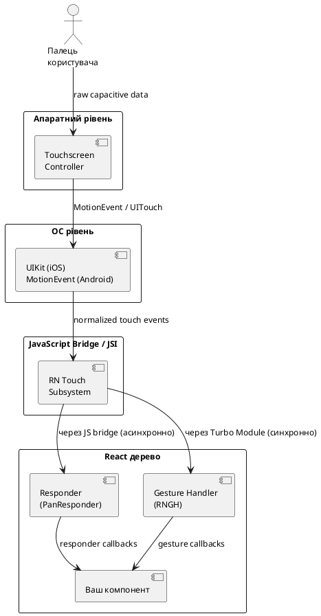
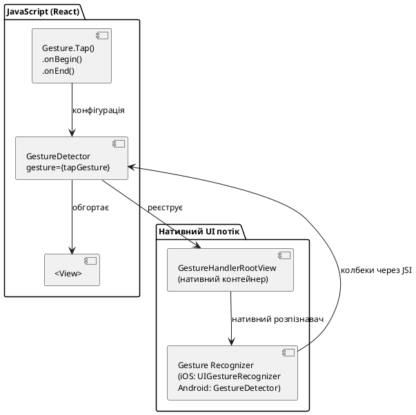
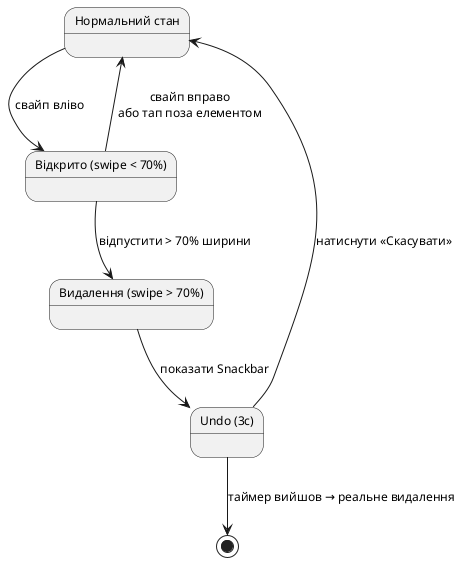

# Жести та дотики

## Відкриття: чому торкання — це не просто click

У вебі все просто: є `onClick` і цього зазвичай достатньо. У мобільному світі все інакше. Пальцями роблять:

- **Тап** — швидкий дотик і відпускання.
- **Довгий тап** — утримання понад ~500 мс.
- **Свайп** — ковзання по екрану з певним вектором.
- **Пінч** — зведення/розведення двох пальців для масштабування.
- **Поворот** — обертальний рух двома пальцями.
- **Пан** — плавне переміщення пальцем.
- **Подвійний тап** — два швидких дотики.

Операційна система обробляє кожен дотик у кілька фаз, дозволяє жестам «змагатись» між собою і надає розробнику точний контроль над тим, хто «перемагає». Розуміння цієї архітектури — ключ до чуйного, природного UI.

::note
**Що потрібно знати заздалегідь:** ця стаття передбачає знайомство з основними компонентами React Native, хуками `useState`/`useRef` та основами Expo Router. Базові знання React Native Reanimated будуть корисні, але не обов'язкові — ми будемо використовувати `Animated` API зі стандартної бібліотеки.
::

---

## Архітектура обробки дотиків

### Touch Event Pipeline

Перш ніж писати код, важливо розуміти, як touch-подія проходить шлях від пальця до обробника у вашому компоненті:

::plant-uml



::

Ключовий момент: **React Native Gesture Handler (RNGH)** працює через **Turbo Modules / JSI** — синхронно на нативному потоці UI. Це означає, що жести реагують миттєво, без затримки JS потоку. Стандартний `PanResponder` — застаріший підхід, де події йдуть через асинхронний міст.

### Responder System: як React Native вирішує, хто обробляє дотик

Коли палець торкається екрана і на шляху є кілька компонентів (наприклад, кнопка всередині скролу), виникає питання: хто з них «забирає» дотик? Це вирішує **Responder System**:

1. **Capture phase** — подія іде **вниз** по дереву компонентів (від кореня до листя).
2. **Bubbling phase** — кожен компонент вирішує, чи хоче він стати «responder».
3. **Negotiation** — якщо два компоненти претендують — батько може заблокувати дитину через `onStartShouldSetResponderCapture`.

Саме через цю систему виникає класична проблема: свайп-елемент всередині `ScrollView` «не реагує» — `ScrollView` перехоплює дотик раніше. **RNGH** вирішує це елегантніше через власний менеджер жестів.

---

## Pressable: сучасна основа тапів

### Чому Pressable, а не TouchableOpacity

До React Native 0.63 для кнопок використовували `TouchableOpacity`, `TouchableHighlight` або `TouchableNativeFeedback`. У 0.63 з'явився **`Pressable`** — гнучкіша і більш потужна заміна:

::card-group

::card{title="TouchableOpacity (застарілий)" icon="i-lucide-x-circle"}

- Лише opacity-анімація
- Немає доступу до стану `pressed` у children
- Немає `hitSlop` з усіх боків окремо
- Неможливо кастомізувати feedback

::

::card{title="Pressable (сучасний)" icon="i-lucide-check-circle"}

- Callback-стиль: `style={({ pressed }) => ...}`
- Доступ до `pressed` у children через `render prop`
- Розширена `hitSlop` конфігурація
- Власний `android_ripple` ефект
- Хуки `onHoverIn`/`onHoverOut` для web

::

::

### Базове використання

```tsx
import { Pressable, Text, StyleSheet } from 'react-native';

function MyButton({ onPress, label }: { onPress: () => void; label: string }) {
  return (
    <Pressable
      onPress={onPress}
      style={({ pressed }) => [
        styles.button,
        pressed && styles.buttonPressed,
      ]}
    >
      {({ pressed }) => (
        <Text style={[styles.label, pressed && styles.labelPressed]}>
          {label}
        </Text>
      )}
    </Pressable>
  );
}

const styles = StyleSheet.create({
  button: {
    backgroundColor: '#3B82F6',
    paddingHorizontal: 24,
    paddingVertical: 14,
    borderRadius: 12,
  },
  buttonPressed: {
    backgroundColor: '#1D4ED8',
    transform: [{ scale: 0.97 }],
  },
  label: { color: 'white', fontWeight: '700', fontSize: 16 },
  labelPressed: { opacity: 0.85 },
});
```

### Живий приклад Pressable

::react-native-preview{title="Pressable з анімацією" device="iphone" height="320"}

```tsx
import { Pressable, Text, StyleSheet, View } from 'react-native';
import { useState } from 'react';

export default function App() {
  const [count, setCount] = useState(0);

  return (
    <View style={styles.container}>
      <Text style={styles.counter}>{count}</Text>
      <Pressable
        onPress={() => setCount((c) => c + 1)}
        style={({ pressed }) => [styles.btn, pressed && styles.btnPressed]}
      >
        {({ pressed }) => (
          <Text style={styles.label}>{pressed ? 'Тримаю!' : 'Натисни мене'}</Text>
        )}
      </Pressable>
    </View>
  );
}

const styles = StyleSheet.create({
  container: { flex: 1, alignItems: 'center', justifyContent: 'center', gap: 24 },
  counter: { fontSize: 64, fontWeight: '800', color: '#3B82F6' },
  btn: {
    backgroundColor: '#3B82F6',
    paddingHorizontal: 32,
    paddingVertical: 16,
    borderRadius: 16,
  },
  btnPressed: { backgroundColor: '#1D4ED8', transform: [{ scale: 0.95 }] },
  label: { color: 'white', fontWeight: '700', fontSize: 18 },
});
```

::

### Всі props Pressable

::field-group

::field{name="onPress" type="(event: GestureResponderEvent) => void"}
Спрацьовує при завершеному тапі (touchStart + touchEnd без переміщення за межі).
::

::field{name="onPressIn" type="(event: GestureResponderEvent) => void"}
Спрацьовує в момент дотику пальця до екрана. Ідеально для миттєвого відгуку — зміни кольору чи scale ще до відпускання.
::

::field{name="onPressOut" type="(event: GestureResponderEvent) => void"}
Спрацьовує при відпусканні пальця. Скасовується, якщо палець вийшов за межі `hitSlop`.
::

::field{name="onLongPress" type="(event: GestureResponderEvent) => void"}
Спрацьовує після утримання довше `delayLongPress` мілісекунд (дефолт: 500 мс).
::

::field{name="delayLongPress" type="number"}
Час утримання в мс перед спрацюванням `onLongPress`. Дефолт: `500`.
::

::field{name="hitSlop" type="Insets | number"}
Розширює зону торкання без зміни розміру самого компонента. Корисно для маленьких кнопок. Можна задати як число (однаково з усіх боків) або об'єкт `{ top, bottom, left, right }`.
::

::field{name="style" type="StyleProp | (state: PressableStateCallbackType) => StyleProp"}
Стиль або функція, що приймає `{ pressed: boolean }` і повертає стиль. Дозволяє динамічно змінювати вигляд при натисканні.
::

::field{name="android_ripple" type="RippleConfig"}
Нативний Ripple ефект Android. Об'єкт `{ color, borderless, radius }`. Ігнорується на iOS.
::

::field{name="disabled" type="boolean"}
Блокує всі press-обробники. Дефолт: `false`.
::

::


---

## React Native Gesture Handler (RNGH)

### Навіщо потрібна ця бібліотека

Стандартна `Responder System` React Native має критичний недолік: вся обробка жестів відбувається **у JavaScript потоці**. Кожен `onPanResponderMove` — це асинхронне повідомлення через міст. При інтенсивних анімаціях (drag, swipe, pinch) це призводить до видимих запинок навіть на потужних пристроях.

**React Native Gesture Handler** переносить обробку жестів **повністю на нативний UI потік**. Це означає:

- Жести реагують навіть коли JS потік зайнятий (наприклад, виконує складні обчислення).
- Відсутність затримки між пальцем і реакцією.
- Можливість взаємодії з Reanimated shared values без bridge.

### Встановлення та налаштування

```bash
npx expo install react-native-gesture-handler
```

**Критично важливий крок:** додати `GestureHandlerRootView` у корінь застосунку:

```tsx
// app/_layout.tsx
import { GestureHandlerRootView } from 'react-native-gesture-handler';

export default function RootLayout() {
  return (
    <GestureHandlerRootView style={{ flex: 1 }}>
      {/* решта вашого layout */}
    </GestureHandlerRootView>
  );
}
```

::caution
Без `GestureHandlerRootView` у корені — жести RNGH **не будуть працювати** взагалі. Це найпоширеніша причина «чому нічого не відбувається після встановлення».
::

### Архітектура RNGH v2: Gesture API

RNGH v2 (починаючи з версії 2.0) представив новий декларативний API — **`Gesture`** + **`GestureDetector`**. Він замінив старі компоненти `PanGestureHandler`, `TapGestureHandler` тощо.

Принцип простий: ви **описуєте** жест, передаєте в `<GestureDetector>`, і він сам підключає нативні обробники:

```tsx
import { GestureDetector, Gesture } from 'react-native-gesture-handler';
import { View } from 'react-native';

const tapGesture = Gesture.Tap()
  .onEnd(() => {
    console.log('Тап!');
  });

function MyComponent() {
  return (
    <GestureDetector gesture={tapGesture}>
      <View style={{ width: 100, height: 100, backgroundColor: 'blue' }} />
    </GestureDetector>
  );
}
```

::plant-uml



::

### Типи жестів у RNGH

::field-group

::field{name="Gesture.Tap()" type="TapGesture"}
Розпізнає одиночний або множинний тап. Конфігурується через `.numberOfTaps(2)` для подвійного тапу, `.maxDuration(300)` для тайм-ауту.
::

::field{name="Gesture.Pan()" type="PanGesture"}
Розпізнає переміщення пальця. Надає `translationX`, `translationY`, `velocityX`, `velocityY`. Основний жест для drag-and-drop і swipe.
::

::field{name="Gesture.Pinch()" type="PinchGesture"}
Зведення/розведення двох пальців. Надає `scale` (1.0 = вихідний розмір, 2.0 = вдвічі більше).
::

::field{name="Gesture.Rotation()" type="RotationGesture"}
Обертання двома пальцями. Надає `rotation` в радіанах.
::

::field{name="Gesture.LongPress()" type="LongPressGesture"}
Утримання пальця. Конфігурується через `.minDuration(800)` (мс). Надає координати дотику.
::

::field{name="Gesture.Fling()" type="FlingGesture"}
Різкий швайп у певному напрямку. Конфігурується через `.direction(Directions.RIGHT)`.
::

::field{name="Gesture.Hover()" type="HoverGesture"}
Переміщення вказівника над елементом (тільки iPadOS з Apple Pencil або trackpad, macOS catalyst).
::

::field{name="Gesture.Native()" type="NativeGesture"}
Прозорий контейнер для нативних жестів (ScrollView, Switch тощо). Використовується в комбінаціях.
::

::field{name="Gesture.Manual()" type="ManualGesture"}
Жест з повним ручним контролем стану — для максимально кастомних сценаріїв.
::

::

### Lifecycle колбеки жесту

Кожен жест має однаковий набір колбеків:

::field-group

::field{name=".onBegin(callback)" type="method"}
Спрацьовує, коли жест починає відстежуватись (палець торкнувся, але жест ще не розпізнано). Ідеально для `scale: 0.98` feedback.
::

::field{name=".onStart(callback)" type="method"}
Жест **розпізнано** і він активний. Для Pan — означає, що рух перевищив мінімальний поріг.
::

::field{name=".onChange(callback)" type="method"}
Викликається при кожній зміні жесту (кожен рух пальця для Pan, кожна зміна scale для Pinch).
::

::field{name=".onUpdate(callback)" type="method"}
Аналог `onChange`, але передає повний стан жесту (не тільки зміну).
::

::field{name=".onEnd(callback)" type="method"}
Жест завершено (палець підняли). Отримує `success: boolean` — чи жест завершився нормально або скасувався.
::

::field{name=".onFinalize(callback)" type="method"}
Завжди викликається після `onEnd` або `onFail` / `onCancel`. Підходить для cleanup.
::

::field{name=".onFail(callback)" type="method"}
Жест не розпізнано (наприклад, тап не відбувся через надто великий рух).
::

::field{name=".onCancel(callback)" type="method"}
Жест скасовано іншим жестом або системою (наприклад, телефонний дзвінок).
::

::

### Простий приклад: Tap жест

```tsx
import { GestureDetector, Gesture } from 'react-native-gesture-handler';
import { View, Text, StyleSheet } from 'react-native';
import { useState } from 'react';

export default function TapExample() {
  const [taps, setTaps] = useState(0);

  const singleTap = Gesture.Tap()
    .runOnJS(true)              // колбек виконується в JS потоці
    .onEnd(() => setTaps((n) => n + 1));

  const doubleTap = Gesture.Tap()
    .numberOfTaps(2)
    .runOnJS(true)
    .onEnd(() => setTaps(0));   // подвійний тап — скидає лічильник

  // Комбінація: спочатку перевіряємо подвійний тап
  const combined = Gesture.Exclusive(doubleTap, singleTap);

  return (
    <GestureDetector gesture={combined}>
      <View style={styles.box}>
        <Text style={styles.text}>{taps}</Text>
        <Text style={styles.hint}>Тап +1 · Подвійний тап 0</Text>
      </View>
    </GestureDetector>
  );
}
```

::note
`.runOnJS(true)` — важливий метод. За замовчуванням колбеки RNGH виконуються на нативному UI потоці для максимальної продуктивності. Але `setState`, API calls та більшість JS коду **повинні** виконуватись у JS потоці — тому для них потрібен `runOnJS(true)`.
::


---

## Pan жест: drag та swipe

### Основи PanGesture

`Gesture.Pan()` — найуживаніший жест для drag-and-drop, pull-to-refresh, bottom sheet і swipe-дій. Він надає:

- `translationX`, `translationY` — зміщення від початкової точки (скидається на 0 кожен раз)
- `changeX`, `changeY` — зміщення з попереднього виклику `onChange`
- `velocityX`, `velocityY` — поточна швидкість у пікселях/с
- `absoluteX`, `absoluteY` — абсолютні координати на екрані

### Drag-and-drop елемента

Найпростіший drag: переміщення View пальцем. Використовуємо `Animated.Value` для синхронного оновлення позиції:

```tsx
import { useRef } from 'react';
import { Animated, View, StyleSheet } from 'react-native';
import { GestureDetector, Gesture } from 'react-native-gesture-handler';

export function DraggableBox() {
  const offsetX = useRef(new Animated.Value(0)).current;
  const offsetY = useRef(new Animated.Value(0)).current;

  // Зберігаємо позицію між жестами
  const startX = useRef(0);
  const startY = useRef(0);

  const pan = Gesture.Pan()
    .runOnJS(true)
    .onBegin(() => {
      // Запам'ятовуємо поточну позицію
      startX.current = (offsetX as any)._value;
      startY.current = (offsetY as any)._value;
    })
    .onChange((event) => {
      offsetX.setValue(startX.current + event.translationX);
      offsetY.setValue(startY.current + event.translationY);
    });

  return (
    <GestureDetector gesture={pan}>
      <Animated.View
        style={[
          styles.box,
          { transform: [{ translateX: offsetX }, { translateY: offsetY }] },
        ]}
      />
    </GestureDetector>
  );
}

const styles = StyleSheet.create({
  box: { width: 80, height: 80, borderRadius: 16, backgroundColor: '#3B82F6' },
});
```

::tip
У реальних проєктах для drag-and-drop краще використовувати **Reanimated shared values** замість `Animated.Value` — вони оновлюються прямо на UI потоці без будь-якого bridge, що дає ідеально плавний рух. Реanimated детальніше розглядається у наступному розділі.
::

### Живий приклад: перетягуваний елемент

::react-native-preview{title="Drag-and-Drop" device="iphone" height="400"}

```tsx
import { useRef } from 'react';
import { Animated, View, Text, StyleSheet, PanResponder } from 'react-native';

export default function App() {
  const pan = useRef(new Animated.ValueXY()).current;
  const offset = useRef({ x: 0, y: 0 });

  const panResponder = PanResponder.create({
    onStartShouldSetPanResponder: () => true,
    onPanResponderGrant: () => {
      pan.setOffset({ x: offset.current.x, y: offset.current.y });
      pan.setValue({ x: 0, y: 0 });
    },
    onPanResponderMove: Animated.event([null, { dx: pan.x, dy: pan.y }], {
      useNativeDriver: false,
    }),
    onPanResponderRelease: () => {
      offset.current = { x: (pan.x as any)._value, y: (pan.y as any)._value };
      pan.flattenOffset();
    },
  });

  return (
    <View style={styles.container}>
      <Text style={styles.hint}>Перетягни квадрат</Text>
      <Animated.View
        style={[styles.box, { transform: pan.getTranslateTransform() }]}
        {...panResponder.panHandlers}
      >
        <Text style={styles.emoji}>👆</Text>
      </Animated.View>
    </View>
  );
}

const styles = StyleSheet.create({
  container: { flex: 1, alignItems: 'center', justifyContent: 'center' },
  hint: { marginBottom: 24, color: '#64748B', fontSize: 15 },
  box: {
    width: 90, height: 90, borderRadius: 20,
    backgroundColor: '#3B82F6',
    alignItems: 'center', justifyContent: 'center',
    shadowColor: '#3B82F6', shadowOpacity: 0.4, shadowRadius: 12, elevation: 8,
  },
  emoji: { fontSize: 32 },
});
```

::

### Налаштування порогів Pan жесту

::field-group

::field{name=".minDistance(pixels)" type="method"}
Мінімальна відстань переміщення (у пікселях) перш ніж жест вважається розпізнаним. Дефолт: 0 на Android, 10 на iOS. Підвищення значення запобігає випадковому панніngу при тапі.
::

::field{name=".activeOffsetX([min, max])" type="method"}
Жест активується лише якщо горизонтальне зміщення виходить за межі діапазону. `-[-20, 20]` — жест почне лише якщо рух > 20px по X.
::

::field{name=".activeOffsetY([min, max])" type="method"}
Аналогічно для вертикального зміщення. Використовується для відрізнення горизонтального swipe від вертикального скролу.
::

::field{name=".failOffsetX([min, max])" type="method"}
Жест провалюється (fail), якщо горизонтальне зміщення виходить за межі. Корисно для «тільки вертикального» пану.
::

::field{name=".failOffsetY([min, max])" type="method"}
Аналогічно для вертикалі. Для «тільки горизонтального» swipe.
::

::field{name=".maxPointers(n)" type="method"}
Максимальна кількість пальців. `1` — тільки один палець (запобігає конфлікту з pinch).
::

::field{name=".averageTouches(bool)" type="method"}
Усереднення координат при мультитач. Корисно для pan двома пальцями.
::

::

### Комбінація жестів: Simultaneous, Exclusive, Race

RNGH надає три оператори для комбінування жестів:

::card-group

::card{title="Gesture.Simultaneous(...)" icon="i-lucide-layers"}

Усі жести **активні одночасно**. Використовується коли потрібно і масштабувати, і обертати одночасно:

```ts
const composed = Gesture.Simultaneous(pinchGesture, rotationGesture);
```

::

::card{title="Gesture.Exclusive(...)" icon="i-lucide-award"}

Активується **перший розпізнаний** жест; решта скасовуються. Порядок важливий — спочатку перевіряється перший аргумент:

```ts
// Спочатку подвійний тап, потім одинарний
const composed = Gesture.Exclusive(doubleTap, singleTap);
```

::

::card{title="Gesture.Race(...)" type="string" icon="i-lucide-flag"}

«Гонка» — перший жест, що розпізнається, «перемагає» і скасовує решту. Відрізняється від Exclusive тим, що не має жорсткого пріоритету:

```ts
const composed = Gesture.Race(panGesture, swipeGesture);
```

::

::

### Взаємодія з ScrollView

Класична проблема: swipe-елемент всередині `ScrollView` перехоплюється скролом. RNGH вирішує це через `simultaneousWithExternalGesture`:

```tsx
import { ScrollView } from 'react-native-gesture-handler'; // <- RNGH ScrollView!
import { GestureDetector, Gesture } from 'react-native-gesture-handler';
import { useRef } from 'react';

function SwipeableList() {
  const scrollRef = useRef(null);

  const swipeGesture = Gesture.Pan()
    .activeOffsetX([-10, 10])   // активується лише при горизонтальному русі
    .failOffsetY([-5, 5]);       // провалюється при вертикальному

  return (
    // Важливо: ScrollView з react-native-gesture-handler
    <ScrollView ref={scrollRef}>
      {items.map((item) => (
        <GestureDetector key={item.id} gesture={swipeGesture}>
          <SwipeableRow item={item} />
        </GestureDetector>
      ))}
    </ScrollView>
  );
}
```

::warning
Для коректної роботи всередині `ScrollView` та `FlatList` використовуйте їхні версії з `react-native-gesture-handler`, а не з `react-native`. Вони правильно передають жести дочірнім RNGH-компонентам.
::


---

## Haptic Feedback: тактильний відгук

### Чому haptics важливі для UX

Haptic feedback — вібрація тактильного двигуна (Taptic Engine на iPhone, HAL на Android) — це один з найефективніших, але найнедооцінених інструментів мобільного UX. Дослідження показують, що правильно підібраний тактильний відгук:

- **Підтверджує дію** без візуального відволікання (користувач знає, що натискання зараховано, не дивлячись на екран).
- **Попереджає про помилку** — виразне тремтіння при неправильному PIN-коді зрозуміліше ніж текст.
- **Передає фізичний контекст** — «клік» при переключенні тумблера робить UI відчутним.

У людини є тактильні рецептори двох типів, що реагують на різні частоти. Taptic Engine iPhone генерує точно підібрані вібраційні патерни під кожен тип feedback.

### expo-haptics

Expo надає крос-платформний API для haptics:

```bash
npx expo install expo-haptics
```

### Типи тактильного feedback

::field-group

::field{name="Haptics.impactAsync(style)" type="async function"}
**Impact feedback** — чіткий поштовх. Симулює «зіткнення» об'єктів. Параметр `style`:

- `ImpactFeedbackStyle.Light` — легкий дотик, для дрібних елементів
- `ImpactFeedbackStyle.Medium` — середній, найуніверсальніший (кнопки, вибір елемента)
- `ImpactFeedbackStyle.Heavy` — сильний, для важливих дій
- `ImpactFeedbackStyle.Rigid` — різкий і жорсткий (iOS 13+)
- `ImpactFeedbackStyle.Soft` — м'який (iOS 13+)
::

::field{name="Haptics.notificationAsync(type)" type="async function"}
**Notification feedback** — повідомляє про результат дії. Параметр `type`:

- `NotificationFeedbackType.Success` — подвійний легкий імпульс (✅ збереження, відправлення)
- `NotificationFeedbackType.Warning` — потрійний наростаючий (⚠️ попередження)
- `NotificationFeedbackType.Error` — різке тремтіння (❌ помилка, неправильний пароль)
::

::field{name="Haptics.selectionAsync()" type="async function"}
**Selection feedback** — тихий клік при переміщенні між елементами списку/picker. Схожий на механічну клавіатуру. Викликати при кожному кроці прокрутки DatePicker або Wheel.
::

::

### Правильне застосування типів

| Сценарій | Тип haptic |
|---|---|
| Кнопка «Відправити» | `Impact.Medium` при `onPressIn` |
| Кнопка «Видалити» | `Impact.Heavy` + `Notification.Warning` |
| Свайп-delete підтвердження | `Notification.Success` |
| Неправильний PIN | `Notification.Error` |
| Переміщення слайдера | `Selection` при кожному кроці |
| Toggle Switch | `Impact.Light` |
| Pull-to-refresh | `Impact.Medium` при досягненні порогу |
| Довгий тап | `Impact.Medium` при `onLongPress` |

### Кнопка з haptic feedback

```tsx
import * as Haptics from 'expo-haptics';
import { Pressable, Text, StyleSheet } from 'react-native';

interface HapticButtonProps {
  onPress: () => void;
  label: string;
  variant?: 'default' | 'danger';
}

export function HapticButton({ onPress, label, variant = 'default' }: HapticButtonProps) {
  const handlePressIn = async () => {
    // Миттєвий тактильний відгук ще до відпускання кнопки
    await Haptics.impactAsync(Haptics.ImpactFeedbackStyle.Medium);
  };

  const handlePress = async () => {
    if (variant === 'danger') {
      await Haptics.notificationAsync(Haptics.NotificationFeedbackType.Warning);
    }
    onPress();
  };

  return (
    <Pressable
      onPressIn={handlePressIn}
      onPress={handlePress}
      style={({ pressed }) => [
        styles.button,
        variant === 'danger' && styles.dangerButton,
        pressed && styles.pressed,
      ]}
    >
      <Text style={styles.label}>{label}</Text>
    </Pressable>
  );
}
```

::tip
Запускайте `impactAsync` у `onPressIn`, а не `onPress`. Це дає тактильний відгук **в момент дотику**, а не після відпускання — що значно природніше для користувача.
::

### Haptics і accessibility

На iOS у налаштуваннях є «Reduce Motion» і вимкнення тактильних функцій. `expo-haptics` автоматично ігнорує виклики, якщо користувач вимкнув haptics у системі. Жодної додаткової перевірки не потрібно.

На Android підтримка залежить від моделі пристрою і версії ОС. Деякі бюджетні пристрої мають лише базовий мотор без диференціювання типів — вони все одно вібрують, але однаково.

---

## Свайп-дії: swipe-to-delete

### Концепція компонента

Swipe-to-delete — один з найпоширеніших патернів мобільних застосунків (Gmail, iOS Messages, Telegram). Він складається з:

1. **Верхній шар (foreground)** — видимий контент рядка.
2. **Нижній шар (background)** — прихована зона з кнопками дій (Видалити, Архів тощо).
3. **Pan жест** — переміщення верхнього шару ліворуч відкриває нижній.
4. **Поріг спрацювання** — якщо рух перевищує певну відстань → автоматичне видалення.
5. **Снекбар Undo** — «Скасувати видалення» протягом кількох секунд.

::plant-uml



::

### Swipe-to-delete з Animated API

Реалізуємо без Reanimated (лише `react-native` Animated + RNGH Pan):

```tsx
// components/SwipeableRow.tsx
import { useRef, useCallback } from 'react';
import { Animated, View, Text, Pressable, StyleSheet, Dimensions } from 'react-native';
import { GestureDetector, Gesture } from 'react-native-gesture-handler';
import * as Haptics from 'expo-haptics';

const { width: SCREEN_WIDTH } = Dimensions.get('window');
const DELETE_THRESHOLD = SCREEN_WIDTH * 0.7;
const ACTION_WIDTH = 80;

interface Props {
  item: { id: string; title: string };
  onDelete: (id: string) => void;
}

export function SwipeableRow({ item, onDelete }: Props) {
  const translateX = useRef(new Animated.Value(0)).current;
  const startX = useRef(0);
  const isThresholdReached = useRef(false);

  const pan = Gesture.Pan()
    .runOnJS(true)
    .activeOffsetX([-5, 5])       // горизонтальний жест
    .failOffsetY([-10, 10])       // провалюється при вертикалі
    .onBegin(() => {
      startX.current = (translateX as any)._value;
    })
    .onChange((event) => {
      const newX = Math.min(0, startX.current + event.translationX);
      translateX.setValue(newX);

      // Haptic при перетині порогу
      const threshold = -DELETE_THRESHOLD;
      if (newX < threshold && !isThresholdReached.current) {
        isThresholdReached.current = true;
        Haptics.impactAsync(Haptics.ImpactFeedbackStyle.Medium);
      } else if (newX > threshold && isThresholdReached.current) {
        isThresholdReached.current = false;
        Haptics.impactAsync(Haptics.ImpactFeedbackStyle.Light);
      }
    })
    .onEnd((event) => {
      const currentX = (translateX as any)._value;

      if (currentX < -DELETE_THRESHOLD) {
        // Видалення: анімуємо за межі екрана
        Animated.timing(translateX, {
          toValue: -SCREEN_WIDTH,
          duration: 200,
          useNativeDriver: true,
        }).start(() => {
          Haptics.notificationAsync(Haptics.NotificationFeedbackType.Success);
          onDelete(item.id);
        });
      } else if (currentX < -ACTION_WIDTH / 2) {
        // Зупиняємось на ACTION_WIDTH (показуємо кнопку Delete)
        Animated.spring(translateX, {
          toValue: -ACTION_WIDTH,
          useNativeDriver: true,
        }).start();
      } else {
        // Повертаємось
        Animated.spring(translateX, {
          toValue: 0,
          useNativeDriver: true,
        }).start();
      }
      isThresholdReached.current = false;
    });

  const deleteStyle = {
    transform: [{ translateX }],
  };

  // Прогрес для забарвлення фону
  const bgColor = translateX.interpolate({
    inputRange: [-DELETE_THRESHOLD, -ACTION_WIDTH, 0],
    outputRange: ['#EF4444', '#EF4444', '#F87171'],
    extrapolate: 'clamp',
  });

  return (
    <View style={styles.container}>
      {/* Фоновий шар */}
      <Animated.View style={[styles.background, { backgroundColor: bgColor }]}>
        <Text style={styles.deleteLabel}>🗑</Text>
      </Animated.View>

      {/* Foreground */}
      <GestureDetector gesture={pan}>
        <Animated.View style={[styles.row, deleteStyle]}>
          <Text style={styles.title}>{item.title}</Text>
        </Animated.View>
      </GestureDetector>
    </View>
  );
}
```


### Undo Snackbar

Снекбар «Скасувати» — обов'язкова частина деструктивних дій. Надає користувачу вікно безпеки:

```tsx
// components/UndoSnackbar.tsx
import { useEffect, useRef } from 'react';
import { Animated, Pressable, Text, StyleSheet } from 'react-native';

interface Props {
  message: string;
  onUndo: () => void;
  onDismiss: () => void;
  duration?: number;
}

export function UndoSnackbar({ message, onUndo, onDismiss, duration = 3000 }: Props) {
  const opacity = useRef(new Animated.Value(0)).current;
  const timerRef = useRef<ReturnType<typeof setTimeout>>();

  useEffect(() => {
    // Анімація появи
    Animated.timing(opacity, {
      toValue: 1,
      duration: 200,
      useNativeDriver: true,
    }).start();

    // Автозакриття
    timerRef.current = setTimeout(() => {
      dismiss();
    }, duration);

    return () => clearTimeout(timerRef.current);
  }, []);

  const dismiss = () => {
    Animated.timing(opacity, {
      toValue: 0,
      duration: 150,
      useNativeDriver: true,
    }).start(onDismiss);
  };

  const handleUndo = () => {
    clearTimeout(timerRef.current);
    dismiss();
    onUndo();
  };

  return (
    <Animated.View style={[styles.container, { opacity }]}>
      <Text style={styles.message}>{message}</Text>
      <Pressable onPress={handleUndo} style={styles.undoBtn}>
        <Text style={styles.undoText}>Скасувати</Text>
      </Pressable>
    </Animated.View>
  );
}

const styles = StyleSheet.create({
  container: {
    position: 'absolute',
    bottom: 24,
    left: 16,
    right: 16,
    backgroundColor: '#1E293B',
    borderRadius: 12,
    flexDirection: 'row',
    alignItems: 'center',
    justifyContent: 'space-between',
    paddingHorizontal: 16,
    paddingVertical: 14,
  },
  message: { color: 'white', fontSize: 14 },
  undoBtn: { marginLeft: 16 },
  undoText: { color: '#60A5FA', fontWeight: '700', fontSize: 14 },
});
```

---

## Довгий тап і контекстне меню

### LongPressGesture

`Gesture.LongPress()` розпізнає утримання пальця на місці. Ідеально для контекстного меню або «режиму вибору»:

```tsx
const longPress = Gesture.LongPress()
  .minDuration(500)    // мс до спрацювання (дефолт: 500)
  .maxDistance(10)     // максимальне переміщення пальця при утриманні (пікселі)
  .runOnJS(true)
  .onStart((event) => {
    Haptics.impactAsync(Haptics.ImpactFeedbackStyle.Heavy);
    setShowContextMenu(true);
    setMenuPosition({ x: event.absoluteX, y: event.absoluteY });
  });
```

### iOS-стиль Context Menu через ActionSheetIOS

На iOS є системний контекстний лист — `ActionSheetIOS`:

```tsx
import { ActionSheetIOS, Platform } from 'react-native';

const showContextMenu = () => {
  if (Platform.OS === 'ios') {
    ActionSheetIOS.showActionSheetWithOptions(
      {
        options: ['Скасувати', 'Редагувати', 'Поділитись', 'Видалити'],
        cancelButtonIndex: 0,
        destructiveButtonIndex: 3,
        title: 'Що зробити з елементом?',
      },
      (buttonIndex) => {
        if (buttonIndex === 1) handleEdit();
        if (buttonIndex === 2) handleShare();
        if (buttonIndex === 3) handleDelete();
      }
    );
  } else {
    // На Android показуємо власний Modal
    setShowModal(true);
  }
};
```

---

## Pinch та Rotation: масштабування і обертання

### Спільна реалізація pinch + rotation

Класичний приклад — масштабування і обертання зображення двома пальцями (як у Photos.app):

```tsx
import { useRef } from 'react';
import { Animated, Image, StyleSheet, View } from 'react-native';
import { GestureDetector, Gesture } from 'react-native-gesture-handler';

export function InteractiveImage({ source }: { source: any }) {
  const scale = useRef(new Animated.Value(1)).current;
  const rotation = useRef(new Animated.Value(0)).current;

  const savedScale = useRef(1);
  const savedRotation = useRef(0);

  const pinch = Gesture.Pinch()
    .runOnJS(true)
    .onUpdate((event) => {
      scale.setValue(savedScale.current * event.scale);
    })
    .onEnd((event) => {
      savedScale.current = savedScale.current * event.scale;
    });

  const rotate = Gesture.Rotation()
    .runOnJS(true)
    .onUpdate((event) => {
      rotation.setValue(savedRotation.current + event.rotation);
    })
    .onEnd((event) => {
      savedRotation.current = savedRotation.current + event.rotation;
    });

  // Одночасне масштабування і обертання
  const composed = Gesture.Simultaneous(pinch, rotate);

  // Конвертуємо радіани у градуси для CSS rotate
  const rotateStr = rotation.interpolate({
    inputRange: [-Math.PI * 2, Math.PI * 2],
    outputRange: ['-360deg', '360deg'],
  });

  return (
    <GestureDetector gesture={composed}>
      <Animated.Image
        source={source}
        style={[
          styles.image,
          {
            transform: [
              { scale },
              { rotate: rotateStr },
            ],
          },
        ]}
      />
    </GestureDetector>
  );
}

const styles = StyleSheet.create({
  image: { width: 200, height: 200, borderRadius: 16 },
});
```

### Живий приклад: zoom зображення

::react-native-preview{title="Pinch to Zoom" device="iphone" height="420"}

```tsx
import { useRef, useState } from 'react';
import { Animated, View, Text, PanResponder, StyleSheet } from 'react-native';

export default function App() {
  const scale = useRef(new Animated.Value(1)).current;
  const [info, setInfo] = useState('Зведи два пальці для масштабування');

  // PanResponder для мультитач (react-native-web не підтримує RNGH)
  let lastDistance = useRef(0);
  let currentScale = useRef(1);

  const panResponder = PanResponder.create({
    onStartShouldSetPanResponder: () => true,
    onPanResponderGrant: (e) => {
      if (e.nativeEvent.touches.length === 2) {
        const t = e.nativeEvent.touches;
        const dx = t[0].pageX - t[1].pageX;
        const dy = t[0].pageY - t[1].pageY;
        lastDistance.current = Math.sqrt(dx * dx + dy * dy);
      }
    },
    onPanResponderMove: (e) => {
      if (e.nativeEvent.touches.length === 2) {
        const t = e.nativeEvent.touches;
        const dx = t[0].pageX - t[1].pageX;
        const dy = t[0].pageY - t[1].pageY;
        const dist = Math.sqrt(dx * dx + dy * dy);
        const newScale = Math.min(3, Math.max(0.5, currentScale.current * (dist / lastDistance.current)));
        scale.setValue(newScale);
        setInfo(`Scale: ${newScale.toFixed(2)}x`);
      }
    },
    onPanResponderRelease: () => {
      currentScale.current = (scale as any)._value;
    },
  });

  return (
    <View style={styles.container}>
      <Animated.View
        style={[styles.box, { transform: [{ scale }] }]}
        {...panResponder.panHandlers}
      >
        <Text style={styles.emoji}>🗺️</Text>
      </Animated.View>
      <Text style={styles.info}>{info}</Text>
    </View>
  );
}

const styles = StyleSheet.create({
  container: { flex: 1, alignItems: 'center', justifyContent: 'center', gap: 24 },
  box: {
    width: 120, height: 120, borderRadius: 24,
    backgroundColor: '#3B82F6',
    alignItems: 'center', justifyContent: 'center',
  },
  emoji: { fontSize: 56 },
  info: { color: '#64748B', fontSize: 14 },
});
```

::


---

## Міні-проєкт: «Список з swipe-delete»

### Що будуємо

Список з 10 елементами де:

1. **Свайп ліворуч** відкриває червону зону «Видалити».
2. **Продовження свайпу** > 70% ширини → автоматичне видалення з анімацією.
3. **Haptic feedback** при перетині порогу.
4. **Undo Snackbar** «Елемент видалено · Скасувати» з таймером 3 секунди.
5. **Довгий тап** → ActionSheet з опціями «Редагувати»/«Видалити»/«Поділитись».

### Структура файлів

::code-tree

```tsx [app/(tabs)/list.tsx]
// Головний екран зі списком
```

```tsx [components/list/SwipeableRow.tsx]
// Рядок з підтримкою swipe
```

```tsx [components/list/UndoSnackbar.tsx]
// Снекбар з кнопкою «Скасувати»
```

```tsx [hooks/useUndoDelete.ts]
// Логіка undo з таймером
```

::

### Хук useUndoDelete

```ts
// hooks/useUndoDelete.ts
import { useState, useRef, useCallback } from 'react';
import * as Haptics from 'expo-haptics';

interface UndoState<T> {
  deletedItem: T | null;
  deletedIndex: number;
}

export function useUndoDelete<T extends { id: string }>(
  items: T[],
  setItems: React.Dispatch<React.SetStateAction<T[]>>
) {
  const [undoState, setUndoState] = useState<UndoState<T>>({
    deletedItem: null,
    deletedIndex: -1,
  });
  const timerRef = useRef<ReturnType<typeof setTimeout>>();

  const deleteItem = useCallback((id: string) => {
    const index = items.findIndex((i) => i.id === id);
    const item = items[index];
    if (!item) return;

    // Видаляємо зі списку
    setItems((prev) => prev.filter((i) => i.id !== id));
    setUndoState({ deletedItem: item, deletedIndex: index });

    Haptics.notificationAsync(Haptics.NotificationFeedbackType.Success);

    // Таймер кінцевого видалення (тут можна викликати API)
    clearTimeout(timerRef.current);
    timerRef.current = setTimeout(() => {
      setUndoState({ deletedItem: null, deletedIndex: -1 });
      // TODO: api.deleteItem(id)
    }, 3000);
  }, [items, setItems]);

  const undoDelete = useCallback(() => {
    clearTimeout(timerRef.current);
    if (!undoState.deletedItem) return;

    // Повертаємо елемент на місце
    setItems((prev) => {
      const newItems = [...prev];
      newItems.splice(undoState.deletedIndex, 0, undoState.deletedItem!);
      return newItems;
    });
    setUndoState({ deletedItem: null, deletedIndex: -1 });
    Haptics.impactAsync(Haptics.ImpactFeedbackStyle.Light);
  }, [undoState, setItems]);

  const dismissUndo = useCallback(() => {
    setUndoState({ deletedItem: null, deletedIndex: -1 });
  }, []);

  return {
    deleteItem,
    undoDelete,
    dismissUndo,
    showUndo: undoState.deletedItem !== null,
  };
}
```

### Головний екран

```tsx
// app/(tabs)/list.tsx
import { useState } from 'react';
import { FlatList, View, StyleSheet, SafeAreaView } from 'react-native';
import { GestureHandlerRootView } from 'react-native-gesture-handler';

import { SwipeableRow } from '@/components/list/SwipeableRow';
import { UndoSnackbar } from '@/components/list/UndoSnackbar';
import { useUndoDelete } from '@/hooks/useUndoDelete';

const INITIAL_ITEMS = Array.from({ length: 10 }, (_, i) => ({
  id: String(i + 1),
  title: `Завдання #${i + 1}`,
  subtitle: `Опис завдання номер ${i + 1}`,
}));

export default function ListScreen() {
  const [items, setItems] = useState(INITIAL_ITEMS);
  const { deleteItem, undoDelete, dismissUndo, showUndo } = useUndoDelete(items, setItems);

  return (
    <GestureHandlerRootView style={{ flex: 1 }}>
      <SafeAreaView style={styles.container}>
        <FlatList
          data={items}
          keyExtractor={(item) => item.id}
          renderItem={({ item }) => (
            <SwipeableRow
              item={item}
              onDelete={() => deleteItem(item.id)}
            />
          )}
          ItemSeparatorComponent={() => <View style={styles.separator} />}
          contentContainerStyle={styles.list}
        />

        {showUndo && (
          <UndoSnackbar
            message="Елемент видалено"
            onUndo={undoDelete}
            onDismiss={dismissUndo}
            duration={3000}
          />
        )}
      </SafeAreaView>
    </GestureHandlerRootView>
  );
}

const styles = StyleSheet.create({
  container: { flex: 1, backgroundColor: '#F8FAFC' },
  list: { padding: 16, gap: 2 },
  separator: { height: 1, backgroundColor: '#E2E8F0' },
});
```

---

## Підключення до Nomad: feat: press gestures and haptics

У Nomad жести природно з'являються у кількох місцях:

::card-group

::card{title="Список поїздок" icon="i-lucide-map"}

Swipe-to-archive або swipe-to-delete для поїздок. Haptic при підтвердженні. Undo снекбар — обов'язково для деструктивних дій зі справжніми даними.

::

::card{title="Список місць у поїздці" icon="i-lucide-map-pin"}

Long press на місці → контекстне меню (Редагувати / Видалити / Поділитись). Haptic при `onLongPress`.

::

::card{title="Форма додавання" icon="i-lucide-plus"}

`Impact.Medium` при натисканні кнопки «Зберегти», `Notification.Success` після успішного збереження, `Notification.Error` при помилці валідації.

::

::

---

## Поширені помилки

::accordion
::accordion-item{label="GestureHandlerRootView відсутній → жести не працюють" icon="i-lucide-circle-alert"}
Найпоширеніша помилка. Додайте `<GestureHandlerRootView style={{ flex: 1 }}>` у `app/_layout.tsx`. Без нього RNGH мовчки ігнорує всі жести.
::
::accordion-item{label="Swipe не працює всередині ScrollView" icon="i-lucide-circle-alert"}
Використовуйте `ScrollView` з `react-native-gesture-handler`, а не з `react-native`. Або налаштуйте `activeOffsetX` і `failOffsetY` на Pan жесті для чіткого розмежування горизонтального і вертикального руху.
::
::accordion-item{label="setState у RNGH колбеку — помилка" icon="i-lucide-circle-alert"}
Колбеки RNGH за замовчуванням виконуються на UI потоці. Виклик `setState` без `runOnJS(true)` спричинить Runtime Error. Завжди додавайте `.runOnJS(true)` коли потрібно оновлювати React стейт.
::
::accordion-item{label="Haptics не працює на симуляторі" icon="i-lucide-circle-alert"}
iOS симулятор і Android емулятор не підтримують haptic feedback — це очікувана поведінка. Перевіряйте haptics лише на реальному пристрої.
::
::accordion-item{label="Подвійний тап спрацьовує як два одинарних" icon="i-lucide-circle-alert"}
Потрібно використовувати `Gesture.Exclusive(doubleTap, singleTap)`. Без цього RNGH не чекає другого тапу і відразу спрацьовує onTap після першого. Порядок у Exclusive важливий: спочатку подвійний.
::
::accordion-item{label="LongPress і Pan конфліктують" icon="i-lucide-circle-alert"}
При реалізації drag після довгого тапу (як у iOS home screen) потрібно спочатку `LongPress.onStart()`, а потім активувати `Pan`. Використовуйте `Gesture.Simultaneous(longPress, pan)` і перевіряйте в Pan, чи активний LongPress.
::
::

---

## Підсумок

::card-group

::card{title="Touch Pipeline" icon="i-lucide-layers"}

- Responder System: capture → bubble → negotiate
- RNGH виконується на нативному UI потоці (JSI)
- `GestureHandlerRootView` обов'язковий у корені

::

::card{title="Pressable" icon="i-lucide-hand"}

- Замінює `TouchableOpacity` і `TouchableHighlight`
- `style={({ pressed }) => ...}` для динамічних стилів
- `onPressIn` для миттєвого feedback
- `hitSlop` для розширення зони торкання

::

::card{title="RNGH Gesture API" icon="i-lucide-move"}

- `Gesture.Tap()`, `Pan()`, `Pinch()`, `Rotation()`, `LongPress()`
- `Gesture.Simultaneous()` / `Exclusive()` / `Race()` для комбінацій
- `.runOnJS(true)` обов'язковий для `setState`

::

::card{title="Haptics та Swipe UX" icon="i-lucide-vibrate"}

- `Impact` при `onPressIn`, `Notification` після результату
- Swipe-delete: foreground + background шари + поріг
- Undo Snackbar для безпеки деструктивних дій

::

::

